Chapter 03. Sampling the Imaginary
================
A Solomon Kurz
2018-08-16

Sampling the Imaginary
======================

If you would like to know the probability someone is a vampire given they test positive to the blood-based vampire test, you compute

$$\\text{Pr(vampire|positive)} = \\frac{\\text{Pr(positive|vampire) Pr(vampire)}}{\\text{Pr(positive)}}$$

We'll do so within a tibble.

``` r
library(tidyverse)

tibble(pr_positive_vampire   = .95,
       pr_positive_mortal    = .01,
       pr_vampire            = .001) %>% 
  mutate(pr_positive         = pr_positive_vampire * pr_vampire + pr_positive_mortal * (1 - pr_vampire)) %>% 
  mutate(pr_vampire_positive = pr_positive_vampire * pr_vampire / pr_positive) %>% 
  glimpse()
```

    ## Observations: 1
    ## Variables: 5
    ## $ pr_positive_vampire <dbl> 0.95
    ## $ pr_positive_mortal  <dbl> 0.01
    ## $ pr_vampire          <dbl> 0.001
    ## $ pr_positive         <dbl> 0.01094
    ## $ pr_vampire_positive <dbl> 0.08683729

Here's the other way of tackling the vampire problem, this time useing the frequency format.

``` r
tibble(pr_vampire            = 100 / 100000,
       pr_positive_vampire   = 95 / 100,
       pr_positive_mortal    = 99 / 99900) %>% 
  mutate(pr_positive         = 95 + 999) %>% 
  mutate(pr_vampire_positive = pr_positive_vampire * 100 / pr_positive) %>% 
  glimpse()
```

    ## Observations: 1
    ## Variables: 5
    ## $ pr_vampire          <dbl> 0.001
    ## $ pr_positive_vampire <dbl> 0.95
    ## $ pr_positive_mortal  <dbl> 0.000990991
    ## $ pr_positive         <dbl> 1094
    ## $ pr_vampire_positive <dbl> 0.08683729

Sampling from a grid-like approximate posterior
-----------------------------------------------

``` r
# how many grid points would you like?
n <- 1000
n_success <- 6
n_tirals  <- 9

(
  d <-
  tibble(p_grid     = seq(from = 0, to = 1, length.out = n),
       # note we're still using a flat uniform prior
       prior        = 1) %>% 
  mutate(likelihood = dbinom(n_success, size = n_tirals, prob = p_grid)) %>% 
  mutate(posterior  = likelihood * prior) %>% 
  mutate(posterior  = posterior / sum(posterior))
  )
```

    ## # A tibble: 1,000 x 4
    ##     p_grid prior likelihood posterior
    ##      <dbl> <dbl>      <dbl>     <dbl>
    ##  1 0           1   0.        0.      
    ##  2 0.00100     1   8.43e-17  8.43e-19
    ##  3 0.00200     1   5.38e-15  5.38e-17
    ##  4 0.00300     1   6.11e-14  6.11e-16
    ##  5 0.00400     1   3.42e-13  3.42e-15
    ##  6 0.00501     1   1.30e-12  1.30e-14
    ##  7 0.00601     1   3.87e-12  3.88e-14
    ##  8 0.00701     1   9.73e-12  9.74e-14
    ##  9 0.00801     1   2.16e-11  2.16e-13
    ## 10 0.00901     1   4.37e-11  4.38e-13
    ## # ... with 990 more rows

``` r
samples <- sample(d$p_grid, prob = d$posterior, size = 1e4, replace = T)

glimpse(samples)
```

    ##  num [1:10000] 0.465 0.722 0.415 0.478 0.551 ...

We'll plot the zigzagging left panel of Figure 3.1 with `geom_line()`. But before we do, we'll need to add a variable numbering the samples. And even before that, perhaps you noticed that `glimpse(samples)` told us `samples` is a numeric vector. Since ggplot2 requires we use data frames, of which tibbles are special case, we'll use `as_tibble()` to convert `samples` to a tibble.

``` r
samples <-
  samples %>% 
  as_tibble() %>% 
  mutate(sample_number = 1:n()) 

head(samples)
```

    ## # A tibble: 6 x 2
    ##   value sample_number
    ##   <dbl>         <int>
    ## 1 0.465             1
    ## 2 0.722             2
    ## 3 0.415             3
    ## 4 0.478             4
    ## 5 0.551             5
    ## 6 0.361             6

But notice what happened. When we simply converted the `samples` vector with `as_tibble()`, that vector was renamed quite generically as `value`. One way around this is with `rename()` (i.e., `rename(samples = value)`). But this is already becoming cumbersome. Here's a more compact way.

``` r
samples <-
  tibble(samples = sample(d$p_grid, prob = d$posterior, size = 1e4, replace = T)) %>% 
  mutate(sample_number = 1:n())

glimpse(samples)
```

    ## Observations: 10,000
    ## Variables: 2
    ## $ samples       <dbl> 0.9019019, 0.6406406, 0.7697698, 0.2852853, 0.4764765, 0.7887888, 0.68968...
    ## $ sample_number <int> 1, 2, 3, 4, 5, 6, 7, 8, 9, 10, 11, 12, 13, 14, 15, 16, 17, 18, 19, 20, 21...

This time we just made `samples` a vector within a tibble from the start. Anyway, here's the right panel for Figure 3.1.

``` r
samples %>% 
  ggplot(aes(x = sample_number, y = samples)) +
  geom_line(size = 1/10) +
  labs(x = "sample number",
       y = "proportion of water (p)")
```

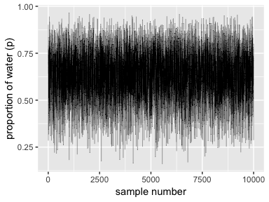

We'll make the density in the right panel with `geom_density()`.

``` r
samples %>% 
  ggplot(aes(x = samples)) +
  geom_density(fill = "black") +
  coord_cartesian(xlim = 0:1) +
  xlab("proportion of water (p)")
```

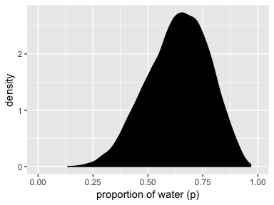

Sampling to summarize
---------------------

To get the proportion of water less than some value of `p_grid` within the tidyverse, you'd first `filter()` by that value and then take the `sum()` within `summarise()`.

``` r
d %>% 
  filter(p_grid < .5) %>% 
  summarise(sum = sum(posterior))
```

    ## # A tibble: 1 x 1
    ##     sum
    ##   <dbl>
    ## 1 0.172

If what you want is a frequency based on filtering by `samples`, then you might use `n()` within `summarise()`.

``` r
samples %>% 
  filter(samples < .5) %>% 
  summarise(sum = n() / 1e4)
```

    ## # A tibble: 1 x 1
    ##     sum
    ##   <dbl>
    ## 1 0.178

You can use `&` within `filter()`, too.

``` r
samples %>% 
  filter(samples > .5 & samples < .75) %>% 
  summarise(sum = n() / 1e4)
```

    ## # A tibble: 1 x 1
    ##     sum
    ##   <dbl>
    ## 1 0.607

### Intervals of defined mass.

We'll create the upper two panels for Figure 3.2 with `geom_line()`, `geom_ribbon()`, and a some careful filtering.

``` r
# upper left panel
d %>% 
  ggplot(aes(x = p_grid)) +
  geom_line(aes(y = posterior)) +
  geom_ribbon(data = d %>% filter(p_grid < .5),
              aes(ymin = 0, ymax = posterior)) +
  labs(x = "proportion of water (p)",
       y = "density")
```

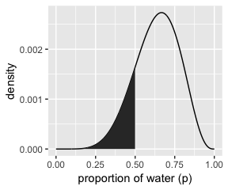

``` r
# upper right panel
d %>% 
  ggplot(aes(x = p_grid)) +
  geom_line(aes(y = posterior)) +
  # note this next line is the only difference in code from the last plot
  geom_ribbon(data = d %>% filter(p_grid < .75 & p_grid > .5),
              aes(ymin = 0, ymax = posterior)) +
  labs(x = "proportion of water (p)",
       y = "density")
```

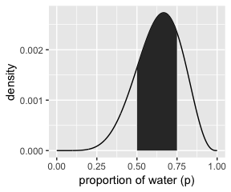

We'll come back for the lower two panels in a bit.

Since we've saved our `samples` vector within the well-named `samples` tibble, we'll have to index with `$` within `quantile`.

``` r
(q_80 <- quantile(samples$samples, prob = .8))
```

    ##       80% 
    ## 0.7567568

That value will come in handy for the lower left panel of Figure 3.2, so we saved it. But anyways, we could `select()` the `samples` vector, extract it from the tibble with `pull()`, and then pump it into `quantile()`:

``` r
samples %>% 
  select(samples) %>% 
  pull() %>% 
  quantile(prob = .8)
```

    ##       80% 
    ## 0.7567568

And we might also use `quantile()` within `summarise()`.

``` r
samples %>% 
  summarise(`80th percentile` = quantile(samples, p = .8))
```

    ## # A tibble: 1 x 1
    ##   `80th percentile`
    ##               <dbl>
    ## 1             0.757

Here's the `summarise()` approach with two probabilities:

``` r
samples %>% 
  summarise(`10th percentile` = quantile(samples, p = .1),
            `90th percentile` = quantile(samples, p = .9))
```

    ## # A tibble: 1 x 2
    ##   `10th percentile` `90th percentile`
    ##               <dbl>             <dbl>
    ## 1             0.446             0.811

The tydiverse approach is nice in that that family of functions typically returns a data frame. But sometimes you just want your values in a numeric vector for the sake of quick indexing. In that case, base R `quantile()` shines.

``` r
(q_10_and_90 <- quantile(samples$samples, prob = c(.1, .9)))
```

    ##       10%       90% 
    ## 0.4464464 0.8108108

Now we have our cutoff values saved as `q_80` and `q_10_and_90`, we're ready to make the bottom panels of Figure 3.2.

``` r
# lower left panel
d %>% 
  ggplot(aes(x = p_grid)) +
  geom_line(aes(y = posterior)) +
  geom_ribbon(data = d %>% filter(p_grid < q_80),
              aes(ymin = 0, ymax = posterior)) +
  annotate(geom = "text",
           x = .25, y = .0025,
           label = "lower 80%") +
  labs(x = "proportion of water (p)",
       y = "density")
```

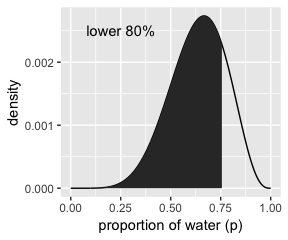

``` r
# lower right panel
d %>% 
  ggplot(aes(x = p_grid)) +
  geom_line(aes(y = posterior)) +
  geom_ribbon(data = d %>% filter(p_grid > q_10_and_90[1] & p_grid < q_10_and_90[2]),
              aes(ymin = 0, ymax = posterior)) +
  annotate(geom = "text",
           x = .25, y = .0025,
           label = "middle 80%") +
  labs(x = "proportion of water (p)",
       y = "density")
```

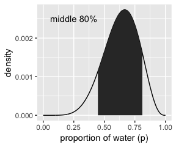

We've already defined `p_grid` and `prior` within `d`, above. Here we'll reuse them and update the rest of the columns.

``` r
# here we update the `dbinom()` parameters
n_success <- 3
n_tirals  <- 3

# update d
d <-
  d %>% 
  mutate(likelihood = dbinom(n_success, size = n_tirals, prob = p_grid)) %>% 
  mutate(posterior  = likelihood * prior) %>% 
  mutate(posterior  = posterior / sum(posterior))

# here's our new samples tibble
(
  samples <- tibble(samples = sample(d$p_grid, prob = d$posterior, size = 1e4, replace = T))
)
```

    ## # A tibble: 10,000 x 1
    ##    samples
    ##      <dbl>
    ##  1   0.470
    ##  2   0.809
    ##  3   0.713
    ##  4   0.981
    ##  5   0.918
    ##  6   0.792
    ##  7   0.945
    ##  8   0.333
    ##  9   0.909
    ## 10   0.712
    ## # ... with 9,990 more rows

The `rethinking::PI()` function works like a nice shorthand for `quantile()`.

``` r
quantile(samples$samples, prob = c(.25, .75))
```

    ##       25%       75% 
    ## 0.7137137 0.9309309

``` r
rethinking::PI(samples$samples, prob = .5)
```

    ##       25%       75% 
    ## 0.7137137 0.9309309

Now's a good time to introduce Matthew Kay's [tidybayes package](https://github.com/mjskay/tidybayes), which offers an [array of convenience functions](ftp://cran.r-project.org/pub/R/web/packages/tidybayes/vignettes/tidy-brms.html) for Bayesian models of the type we’ll be working with in this project.

``` r
library(tidybayes)

median_qi(samples$samples, .width = .5)
```

    ##           y      ymin      ymax .width .point .interval
    ## 1 0.8438438 0.7137137 0.9309309    0.5 median        qi

The tidybayes package offers a [family of functions](ftp://cran.r-project.org/pub/R/web/packages/tidybayes/vignettes/tidybayes.html#point-summaries-and-intervals-with-the-point_interval-functions-medianmeanmode_qihdi) that make it easy to summarize a distribution with a measure of central tendency and intervals. With `median_qi()`, we asked for the median and quantile-based intervals--just like we've been doing with `quantile()`. Note how the `.width` argument within `median_qi()` worked the same way the `prob` argument did within `rethinking::PI()`. With `.width = .5`, we indicated we wanted a quantile-based 50% interval, which was returned in the `ymin` and `ymax` columns. The tidybayes framework makes it easy to request multiple types of intervals. E.g., here we'll request 50%, 80%, and 99% intervals.

``` r
median_qi(samples$samples, .width = c(.5, .8, .99))
```

    ##           y      ymin      ymax .width .point .interval
    ## 1 0.8438438 0.7137137 0.9309309   0.50 median        qi
    ## 2 0.8438438 0.5705706 0.9759760   0.80 median        qi
    ## 3 0.8438438 0.2582482 1.0000000   0.99 median        qi

The `.width` column in the output indexed which line presented which interval.

Now let's use the `rethinking::HPDI()` function to return 50% highest posterior density intervals (HPDIs).

``` r
rethinking::HPDI(samples$samples, prob = .5)
```

    ##      |0.5      0.5| 
    ## 0.8438438 1.0000000

The reason I introduce tidybayes now is that the functions of the brms package only support percentile-based intervals of the type we computed with `quantile()` and `median_qi()`. But tidybayes also supports HPDIs.

``` r
mode_hdi(samples$samples, .width = .5)
```

    ##           y      ymin ymax .width .point .interval
    ## 1 0.9525465 0.8438438    1    0.5   mode       hdi

This time we used the mode as the measure of central tendency. with this family of tidybayes functions, you specify the measure of central tendency in the prefix (i.e., `mean`, `median`, or `mode`) and then the type of interval you'd like (i.e., `qi` or `hdi`).

If you just want to extract a quick value out of, say, `mode_hdi()`, you could do so with brackets. E.g., here we pull the lower bound of the 50% HPDI.

``` r
median_qi(samples$samples, .width = .5)[, "ymin"]
```

    ## [1] 0.7137137

Now we have that skill, we can use it to make Figure 3.3.

``` r
# lower left panel
d %>% 
  ggplot(aes(x = p_grid)) +
  geom_ribbon(data = d %>% filter(p_grid > median_qi(samples$samples, .width = .5)[, "ymin"] & 
                                    p_grid < median_qi(samples$samples, .width = .5)[, "ymax"]),
              aes(ymin = 0, ymax = posterior),
              fill = "grey75") +
  geom_line(aes(y = posterior)) +
  labs(subtitle = "50% Percentile Interval",
       x = "proportion of water (p)",
       y = "density")
```

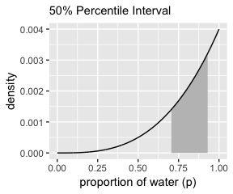

``` r
# lower right panel
d %>% 
  ggplot(aes(x = p_grid)) +
  geom_ribbon(data = d %>% filter(p_grid > median_hdi(samples$samples, .width = .5)[, "ymin"] & 
                                    p_grid < median_hdi(samples$samples, .width = .5)[, "ymax"]),
              aes(ymin = 0, ymax = posterior),
              fill = "grey75") +
  geom_line(aes(y = posterior)) +
  labs(subtitle = "50% HPDI",
       x = "proportion of water (p)",
       y = "density")
```

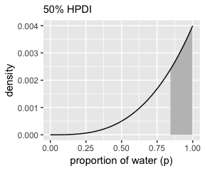

### Point estimates.

We've been calling point estimates measures of central tendency. If we `arrange()` our `d` tibble in descending order by `posterior`, we'll see the corresponding `p_grid` value for its MAP estimate.

``` r
d %>% 
  arrange(desc(posterior))
```

    ## # A tibble: 1,000 x 4
    ##    p_grid prior likelihood posterior
    ##     <dbl> <dbl>      <dbl>     <dbl>
    ##  1  1         1      1       0.00400
    ##  2  0.999     1      0.997   0.00398
    ##  3  0.998     1      0.994   0.00397
    ##  4  0.997     1      0.991   0.00396
    ##  5  0.996     1      0.988   0.00395
    ##  6  0.995     1      0.985   0.00394
    ##  7  0.994     1      0.982   0.00392
    ##  8  0.993     1      0.979   0.00391
    ##  9  0.992     1      0.976   0.00390
    ## 10  0.991     1      0.973   0.00389
    ## # ... with 990 more rows

To emphasize it, we can use `slice()` to select the top row.

``` r
d %>% 
  arrange(desc(posterior)) %>% 
  slice(1)
```

    ## # A tibble: 1 x 4
    ##   p_grid prior likelihood posterior
    ##    <dbl> <dbl>      <dbl>     <dbl>
    ## 1      1     1          1   0.00400

Here's the `rethinking::chainmode()` method.

``` r
rethinking::chainmode(samples$samples, adj = 0.01)
```

    ## [1] 0.9798068

And you can also do whis with `mode_hdi()` or `mode_qi()`.

``` r
samples %>% mode_hdi(samples)
```

    ## # A tibble: 1 x 6
    ##   samples .lower .upper .width .point .interval
    ##     <dbl>  <dbl>  <dbl>  <dbl> <chr>  <chr>    
    ## 1   0.953  0.479      1   0.95 mode   hdi

``` r
samples %>% mode_qi(samples)
```

    ## # A tibble: 1 x 6
    ##   samples .lower .upper .width .point .interval
    ##     <dbl>  <dbl>  <dbl>  <dbl> <chr>  <chr>    
    ## 1   0.953  0.406  0.995   0.95 mode   qi

But medians and means are typical, too.

``` r
samples %>% 
  summarise(mean   = mean(samples),
            median = median(samples))
```

    ## # A tibble: 1 x 2
    ##    mean median
    ##   <dbl>  <dbl>
    ## 1 0.804  0.844

We can inspect the three types of point estimate in the left panel of Figure 3.4. First we'll bundle the three point estimates together in a tibble.

``` r
(
  point_estimates <-
  samples %>% mean_qi(samples) %>% 
  bind_rows(
    samples %>% median_qi(samples),
    samples %>% mode_qi(samples)
  ) %>% 
  select(samples, .point) %>% 
  # these last two columns will help us annotate  
  mutate(x = samples + c(-.03, .03, -.03),
         y = c(.0005, .00125, .002))
)
```

    ## # A tibble: 3 x 4
    ##   samples .point     x       y
    ##     <dbl> <chr>  <dbl>   <dbl>
    ## 1   0.804 mean   0.774 0.0005 
    ## 2   0.844 median 0.874 0.00125
    ## 3   0.953 mode   0.923 0.002

The plot:

``` r
d %>% 
  ggplot(aes(x = p_grid)) +
  geom_ribbon(aes(ymin = 0, ymax = posterior),
              fill = "grey75") +
  geom_vline(xintercept = point_estimates$samples) +
  geom_text(data = point_estimates,
            aes(x = x, y = y, label = .point),
            angle = 90) +
  labs(x = "proportion of water (p)",
       y = "density") +
  theme(panel.grid = element_blank())
```

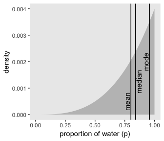

As it turns out "*different loss functions imply different point estimates*" (p. 59, *emphasis* in the original).

Let *p* be the proportion of the Earth covered by water and *d* be our guess. If McElreath pays us $100 if we guess exactly right but subtracts money from the prize proportional to how far off we are, then our loss is proportional to *p* − *d*. If we decide *d* = .5, then our expected loss will be:

``` r
d %>% 
  mutate(loss = posterior * abs(0.5 - p_grid)) %>% 
  summarise(`expected loss` = sum(loss))
```

    ## # A tibble: 1 x 1
    ##   `expected loss`
    ##             <dbl>
    ## 1           0.313

What McElreath did with `sapply()`, we'll do with `map()`.

``` r
make_loss <- function(our_d){
  d %>% 
  mutate(loss = posterior * abs(our_d - p_grid)) %>% 
  summarise(weighted_average_loss = sum(loss))
}

(
  l <-
  d %>% 
  select(p_grid) %>% 
  rename(decision = p_grid) %>% 
  mutate(weighted_average_loss = map(decision, make_loss)) %>% 
  unnest() 
)
```

    ## # A tibble: 1,000 x 2
    ##    decision weighted_average_loss
    ##       <dbl>                 <dbl>
    ##  1  0                       0.800
    ##  2  0.00100                 0.799
    ##  3  0.00200                 0.798
    ##  4  0.00300                 0.797
    ##  5  0.00400                 0.796
    ##  6  0.00501                 0.795
    ##  7  0.00601                 0.794
    ##  8  0.00701                 0.793
    ##  9  0.00801                 0.792
    ## 10  0.00901                 0.791
    ## # ... with 990 more rows

Now we're ready for the right panel of Figure 3.4.

``` r
# this will help us find the x and y coordinates for the minimum value
min_loss <-
  l %>% 
  filter(weighted_average_loss == min(weighted_average_loss)) %>% 
  as.numeric()

# the plot
l %>%   
  ggplot(aes(x = decision)) +
  geom_ribbon(aes(ymin = 0, ymax = weighted_average_loss),
              fill = "grey75") +
  geom_vline(xintercept = min_loss[1], color = "white", linetype = 3) +
  geom_hline(yintercept = min_loss[2], color = "white", linetype = 3) +
  ylab("expected proportional loss") +
  theme(panel.grid = element_blank())
```

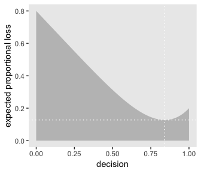

We saved the exact minimum value as `min_loss[1]`, which is 0.8408408. Within sampling error, this is the posterior median as depicted by our `samples`.

``` r
samples %>% 
  summarise(posterior_median = median(samples))
```

    ## # A tibble: 1 x 1
    ##   posterior_median
    ##              <dbl>
    ## 1            0.844

The quadratic loss (*d* − *p*)<sup>2</sup> suggests we should use the mean instead. Let's investigate.

``` r
# ammend our loss function
make_loss <- function(our_d){
  d %>% 
  mutate(loss = posterior * (our_d - p_grid)^2) %>% 
  summarise(weighted_average_loss = sum(loss))
}

# remake our `l` data
l <-
  d %>% 
  select(p_grid) %>% 
  rename(decision = p_grid) %>% 
  mutate(weighted_average_loss = map(decision, make_loss)) %>% 
  unnest()

# update to the new minimum loss coordinates
min_loss <-
  l %>% 
  filter(weighted_average_loss == min(weighted_average_loss)) %>% 
  as.numeric()

# update the plot
l %>%   
  ggplot(aes(x = decision)) +
  geom_ribbon(aes(ymin = 0, ymax = weighted_average_loss),
              fill = "grey75") +
  geom_vline(xintercept = min_loss[1], color = "white", linetype = 3) +
  geom_hline(yintercept = min_loss[2], color = "white", linetype = 3) +
  ylab("expected proportional loss") +
  theme(panel.grid = element_blank())
```

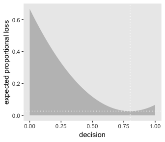

Based on quadratic loss (*d* − *p*)<sup>2</sup>, the exact minimum value is 0.8008008. Within sampling error, this is the posterior mean of our `samples`.

``` r
samples %>% 
  summarise(posterior_meaan = mean(samples))
```

    ## # A tibble: 1 x 1
    ##   posterior_meaan
    ##             <dbl>
    ## 1           0.804

Sampling to simulate prediction
-------------------------------

McElreath’s four good reasons for posterior simulation were:

1.  Model checking
2.  Software validation
3.  Research design
4.  Forecasting

### Dummy data.

Dummy data for the globe tossing model arise from the binomial likelihood. If you let *w* be a count of water and *n* be the number of tosses, the binomial likelihood is

$$\\text{Pr} (w|n, p) = \\frac{n!}{w!(n - w)!} p^w (1 - p)^{n - w}$$

Letting *n* = 2, *p*(*w*)=.7, and *w*<sub>*o**b**s**e**r**v**e**d*</sub> = 0 through 2, the denisties are:

``` r
tibble(n           = 2,
       probability = .7,
       w           = 0:2) %>% 
  mutate(density   = dbinom(w, size = n, prob = probability))
```

    ## # A tibble: 3 x 4
    ##       n probability     w density
    ##   <dbl>       <dbl> <int>   <dbl>
    ## 1     2         0.7     0   0.09 
    ## 2     2         0.7     1   0.42 
    ## 3     2         0.7     2   0.490

If we're going to simulate, we should probably set our seed. Doing so makes the results reproducible.

``` r
set.seed(331)
rbinom(1, size = 2, prob = .7)
```

    ## [1] 0

Here are ten reproducible draws.

``` r
set.seed(331)
rbinom(10, size = 2, prob = .7)
```

    ##  [1] 0 0 1 1 2 2 1 2 1 2

``` r
# how many would you like?
n_draws <- 1e5

set.seed(331)
d <- tibble(draws = rbinom(n_draws, size = 2, prob = .7))

d %>% 
  group_by(draws) %>% 
  count() %>% 
  mutate(proportion = n/nrow(d))
```

    ## # A tibble: 3 x 3
    ## # Groups:   draws [3]
    ##   draws     n proportion
    ##   <int> <int>      <dbl>
    ## 1     0  9059     0.0906
    ## 2     1 41949     0.419 
    ## 3     2 48992     0.490

Here's the simulation updated so *n* = 9.

``` r
set.seed(331)
d <- tibble(draws = rbinom(n_draws, size = 9, prob = .7))

# the histogram
d %>% 
  ggplot(aes(x = draws)) +
  geom_histogram(binwidth = 1, center = 0,
                 color = "grey92", size = 1/10) +
  scale_x_continuous("dummy water count",
                     breaks = seq(from = 0, to = 9, by = 2)) +
  ylab("frequency") +
  coord_cartesian(xlim = 0:9) +
  theme(panel.grid = element_blank())
```

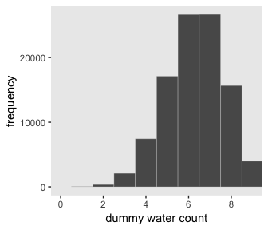

McElreath suggested we play around with different values of `size` and `prob`. With the next block of code, we'll simulate nine conditions.

``` r
n_draws <- 1e5

simulate_binom <- function(n, probability){
  set.seed(331)
 rbinom(n_draws, size = n, prob = probability) 
}

d <-
  tibble(n = c(3, 6, 9)) %>% 
  expand(n, probability = c(.3, .6, .9)) %>% 
  mutate(draws = map2(n, probability, simulate_binom)) %>% 
  ungroup() %>% 
  mutate(n = str_c("n = ", n),
         probability = str_c("p = ", probability)) %>% 
  unnest()

head(d)
```

    ## # A tibble: 6 x 3
    ##   n     probability draws
    ##   <chr> <chr>       <int>
    ## 1 n = 3 p = 0.3         3
    ## 2 n = 3 p = 0.3         2
    ## 3 n = 3 p = 0.3         1
    ## 4 n = 3 p = 0.3         1
    ## 5 n = 3 p = 0.3         0
    ## 6 n = 3 p = 0.3         0

The results look as follows:

``` r
d %>% 
  ggplot(aes(x = draws)) +
  geom_histogram(binwidth = 1, center = 0,
                 color = "grey92", size = 1/10) +
  scale_x_continuous("dummy water count",
                     breaks = seq(from = 0, to = 9, by = 2)) +
  ylab("frequency") +
  coord_cartesian(xlim = 0:9) +
  theme(panel.grid = element_blank()) +
  facet_grid(n ~ probability)
```

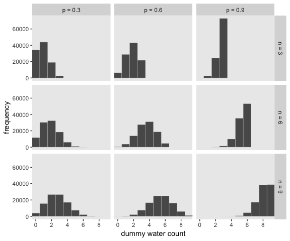

### Model checking.

If you're new to applied statistics, you might be surprised how often mistakes arise.

#### Did the software work?

Let this haunt your dreams: "There is no way to really be sure that software works correctly" (p. 64). You’re welcome.

#### Is the model adequate?

Let's update our `simulate_binom()` golem to keep the number of trials constant at 9.

``` r
n_draws     <- 1e4
n_trials    <- 9
probability <- .6

set.seed(331)
tibble(draws = rbinom(n_draws, size = n_trials, prob = probability)) %>% 
  
  ggplot(aes(x = draws)) +
  geom_histogram(binwidth = 1, center = 0,
                 color = "grey92", size = 1/10) +
  scale_x_continuous("simulated water count",
                     breaks = seq(from = 0, to = 9, by = 3)) +
  ylab("frequency") +
  coord_cartesian(xlim = 0:9) +
  theme(panel.grid = element_blank())
```

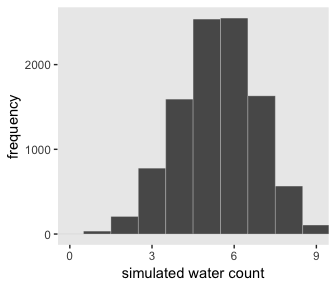

But notice that in this simulation we held *p* at a constant .6. There was no posterior uncertainty packed into the model. Let's refresh ourselves on what the model was:

``` r
# how many grid points would you like?
n <- 1000
n_success <- 6
n_tirals  <- 9

d <-
  tibble(p_grid     = seq(from = 0, to = 1, length.out = n),
       prior        = 1) %>% 
  mutate(likelihood = dbinom(n_success, size = n_tirals, prob = p_grid)) %>% 
  mutate(posterior  = likelihood * prior) %>% 
  mutate(posterior  = posterior / sum(posterior))

# samples!
set.seed(33.22)
samples <-
  tibble(samples = sample(d$p_grid, prob = d$posterior, size = 1e4, replace = T)) 

head(samples)
```

    ## # A tibble: 6 x 1
    ##   samples
    ##     <dbl>
    ## 1   0.445
    ## 2   0.394
    ## 3   0.458
    ## 4   0.630
    ## 5   0.585
    ## 6   0.518

Let's use it to simulate and make the middle panels of Figure 3.6.

``` r
# the simulation
set.seed(3322)
samples <-
  samples %>% 
  mutate(w = rbinom(n_draws, size =  n_trials,  prob = samples)) %>%
  mutate(key = str_c("p = ", round(samples, digits = 1)))

# the plot
samples  %>% 
  filter(key != "p = 1") %>%
  ggplot(aes(x = w)) +
  geom_histogram(binwidth = 1, center = 0,
                 color = "grey92", size = 1/10) +
  scale_x_continuous("dummy water count",
                     breaks = seq(from = 0, to = 9, by = 3)) +
  scale_y_continuous(NULL, breaks = NULL) +
  coord_cartesian(xlim = 0:9) +
  theme(panel.grid = element_blank()) +
  facet_wrap(~ key, ncol = 9, scales = "free_y") 
```

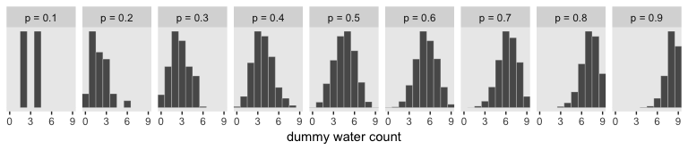

The top panel of Figure 3.6 is just the density of `samples`.

``` r
samples %>% 

  ggplot(aes(x = samples)) +
  geom_density(fill = "grey50", color = "transparent") +
  scale_x_continuous("probability of water",
                     breaks = c(0, .5, 1)) +
  scale_y_continuous(NULL, breaks = NULL) +
  labs(title = "Posterior probability") +
  theme(panel.grid = element_blank())
```

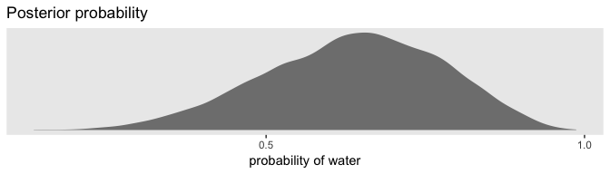

And the bottom panel is the histogram if `w` without faceting by levels of `samples`.

``` r
samples %>% 
  ggplot(aes(x = w)) +
  geom_histogram(binwidth = 1, center = 0,
                 color = "grey92", size = 1/10) +
  scale_x_continuous("number of water samples",
                     breaks = seq(from = 0, to = 9, by = 3)) +
  scale_y_continuous(NULL, breaks = NULL) +
  ggtitle("Posterior predictive distribution") +
  coord_cartesian(xlim = 0:9) +
  theme(panel.grid = element_blank())
```

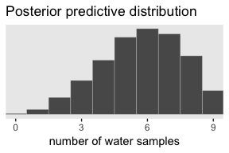

In Figure 3.7, McElreath considered the longst sequence of the sampe values. We've been using `rbinom()` with the size parameter set to 9 for our simulations. E.g.,

``` r
rbinom(10, size = 9, prob = .6)
```

    ##  [1] 4 3 6 4 3 3 4 5 4 6

Notice this collapses (i.e., aggregated) over the sequences within the individual sets of 9. What we need is to simulate nine individual trials many times over. For example, this

``` r
rbinom(9, size = 1, prob = .6)
```

    ## [1] 1 0 1 1 0 1 1 0 0

would be the disaggregated version of just one of the numerals returned by `rbinom()` when `size = 9`. So let's try simulating again with unaggregated samples.

``` r
simulate_disaggregated_binom <- function(samples){
  set.seed(37)
 rbinom(9, size = 1, prob = samples)
}

(
  disaggregated_samples <-
  samples %>% 
  select(samples) %>% 
  mutate(iteration = 1:n(),
         draws = map(samples, simulate_disaggregated_binom)) %>% 
  unnest()
  )
```

    ## # A tibble: 90,000 x 3
    ##    samples iteration draws
    ##      <dbl>     <int> <int>
    ##  1   0.445         1     0
    ##  2   0.445         1     0
    ##  3   0.445         1     1
    ##  4   0.445         1     0
    ##  5   0.445         1     1
    ##  6   0.445         1     1
    ##  7   0.445         1     0
    ##  8   0.445         1     0
    ##  9   0.445         1     0
    ## 10   0.394         2     0
    ## # ... with 89,990 more rows

Now we have to count the longest sequences. The `rle()` function will help with that. Consider McElreathls sequence of tosses.

``` r
tosses <- c("w", "l", "w", "w", "w", "l", "w", "l", "w")
```

You can plug that into `rle()`.

``` r
rle(tosses)
```

    ## Run Length Encoding
    ##   lengths: int [1:7] 1 1 3 1 1 1 1
    ##   values : chr [1:7] "w" "l" "w" "l" "w" "l" "w"

For our purposes, we're interested in `lengths`. That tells us the length of each sequences of the same value. The `3` corresponds to our run of three `w`s. The `max()` function will help us confirm it's the largest value.

``` r
rle(tosses)$lengths %>% max()
```

    ## [1] 3

Now let's apply our method to the data and plot.

``` r
disaggregated_samples %>% 
  group_by(iteration) %>% 
  summarise(longest_run_length = rle(draws)$lengths %>% max()) %>% 
  
  ggplot(aes(x = longest_run_length)) +
  geom_histogram(aes(fill = longest_run_length == 3),
                 binwidth = 1, center = 0,
                 color = "grey92", size = 1/10) +
  scale_x_continuous("longest run length",
                     breaks = seq(from = 0, to = 9, by = 3)) +
  scale_fill_viridis_d(option = "D", end = .9) +
  ylab("frequency") +
  coord_cartesian(xlim = 0:9) +
  theme(panel.grid = element_blank(), 
        legend.position = "none")
```

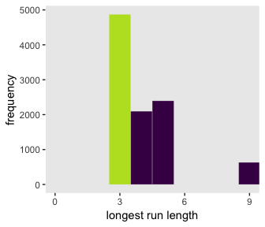

Let's look at `rlr()` again.

``` r
rle(tosses)
```

    ## Run Length Encoding
    ##   lengths: int [1:7] 1 1 3 1 1 1 1
    ##   values : chr [1:7] "w" "l" "w" "l" "w" "l" "w"

We can use the length of the output (i.e., 7 in this example) as the numbers of switches from, in this case, "w" and "l".

``` r
rle(tosses)$lengths %>% length()
```

    ## [1] 7

We're ready to make the right panel of Figure 3.7.

``` r
disaggregated_samples %>% 
  group_by(iteration) %>% 
  summarise(longest_run_length = rle(draws)$lengths %>% length()) %>% 
  
  ggplot(aes(x = longest_run_length)) +
  geom_histogram(aes(fill = longest_run_length == 6),
                 binwidth = 1, center = 0,
                 color = "grey92", size = 1/10) +
  scale_x_continuous("number of switches",
                     breaks = seq(from = 0, to = 9, by = 3)) +
  scale_fill_viridis_d(option = "D", end = .9) +
  ylab("frequency") +
  coord_cartesian(xlim = 0:9) +
  theme(panel.grid = element_blank(), 
        legend.position = "none")
```

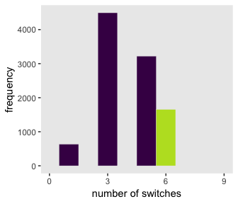

~~Summary~~ Let's practice in brms
----------------------------------

Open brms.

``` r
library(brms)
```

In brms, we'll fit the primary model of *w* = 6 and *n* = 9 much like we did at the end of the project for chapter 2.

``` r
fit1 <-
  brm(data = list(w = 6), 
      family = binomial(link = "identity"),
      w | trials(9) ~ 1,
      prior = prior(normal(.5, 1), class = Intercept),
      control = list(adapt_delta = 0.99))
```

Here's the posterior summary for `b_Intercept`, the probability of a "w".

``` r
posterior_summary(fit1)["b_Intercept", ] %>% 
  round(digits = 2)
```

    ##  Estimate Est.Error      Q2.5     Q97.5 
    ##      0.63      0.13      0.36      0.86

As we'll fully cover in the next chapter, `Estimate` is the posterior mean, the two `Q` columns are the quantile-based 95% intervals, and `Est.Error` is the posterior standard deviation.

Much like the way we used the `samples()` function to simulate probability values, above, we can do so with `fitted()` within the brms framework. But we will have to specify `scale = "linear"` in order to return results in the probability metric. By default, `brms::fitted()` will return summary information. Since we want actual simulation draws, we'll specify `summary = F`.

``` r
fitted_samples <-
  fitted(fit1, summary = F,
         scale = "linear") %>% 
  as_tibble()

glimpse(fitted_samples)
```

    ## Observations: 4,000
    ## Variables: 1
    ## $ V1 <dbl> 0.7305322, 0.6196294, 0.7127753, 0.7243749, 0.7148332, 0.8439780, 0.8556482, 0.84666...

By default, we have a generically-named vector `V1` of 4000 samples. We'll explain the defaults in later chapters. For now, notice we can view these in a density.

``` r
fitted_samples %>% 

  ggplot(aes(x = V1)) +
  geom_density(fill = "grey50", color = "transparent") +
  scale_x_continuous("probability of water",
                     breaks = c(0, .5, 1)) +
  scale_y_continuous(NULL, breaks = NULL) +
  labs(title = "Posterior probability") +
  theme(panel.grid = element_blank())
```

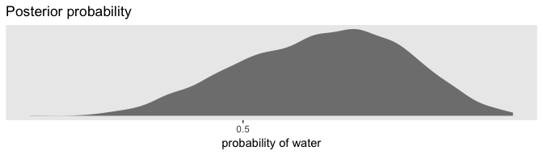

Looks a lot like the posterior probability density at the top of Figure 3.6, doesn't it? Much like we did with `samples`, we can use this distribution of probabilities to predict histograms of "w" counts.

``` r
# the simulation
set.seed(33.22)
fitted_samples <-
  fitted_samples %>% 
  mutate(w = rbinom(n(), size =  n_trials,  prob = V1)) %>%
  mutate(key = str_c("p = ", round(V1, digits = 1)))

# the plot
fitted_samples  %>% 
  filter(key != "p = 1") %>%
  ggplot(aes(x = w)) +
  geom_histogram(binwidth = 1, center = 0,
                 color = "grey92", size = 1/10) +
  scale_x_continuous("dummy water count",
                     breaks = seq(from = 0, to = 9, by = 3)) +
  scale_y_continuous(NULL, breaks = NULL) +
  coord_cartesian(xlim = 0:9) +
  theme(panel.grid = element_blank()) +
  facet_wrap(~ key, ncol = 9, scales = "free_y") 
```

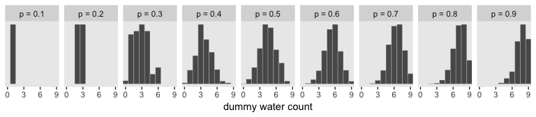

And also like with `samples`, we can omit the `facet_wrap()` function to make histogram in the bottom panel of Figure 3.6.

``` r
fitted_samples %>% 
  ggplot(aes(x = w)) +
  geom_histogram(binwidth = 1, center = 0,
                 color = "grey92", size = 1/10) +
  scale_x_continuous("number of water samples",
                     breaks = seq(from = 0, to = 9, by = 3)) +
  scale_y_continuous(NULL, breaks = NULL) +
  ggtitle("Posterior predictive distribution") +
  coord_cartesian(xlim = 0:9) +
  theme(panel.grid = element_blank())
```

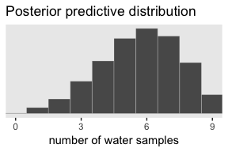

As you might imagine, we can use the output from `fitted()` to return disaggregated batches of 0s and 1s, too. And we could even use those disaggregated 0s and 1s to examine longest run lengths and numbers of switches as in the analyses for Figure 3.7. I’ll leave that as an exercise for the interested reader.

Reference
---------

[McElreath, R. (2016). *Statistical rethinking: A Bayesian course with examples in R and Stan.* Chapman & Hall/CRC Press.](https://xcelab.net/rm/statistical-rethinking/)

Session info
------------

``` r
sessionInfo()
```

    ## R version 3.5.1 (2018-07-02)
    ## Platform: x86_64-apple-darwin15.6.0 (64-bit)
    ## Running under: macOS High Sierra 10.13.4
    ## 
    ## Matrix products: default
    ## BLAS: /Library/Frameworks/R.framework/Versions/3.5/Resources/lib/libRblas.0.dylib
    ## LAPACK: /Library/Frameworks/R.framework/Versions/3.5/Resources/lib/libRlapack.dylib
    ## 
    ## locale:
    ## [1] en_US.UTF-8/en_US.UTF-8/en_US.UTF-8/C/en_US.UTF-8/en_US.UTF-8
    ## 
    ## attached base packages:
    ## [1] stats     graphics  grDevices utils     datasets  methods   base     
    ## 
    ## other attached packages:
    ##  [1] brms_2.4.0      Rcpp_0.12.18    tidybayes_1.0.1 bindrcpp_0.2.2  forcats_0.3.0   stringr_1.3.1  
    ##  [7] dplyr_0.7.6     purrr_0.2.5     readr_1.1.1     tidyr_0.8.1     tibble_1.4.2    ggplot2_3.0.0  
    ## [13] tidyverse_1.2.1
    ## 
    ## loaded via a namespace (and not attached):
    ##  [1] nlme_3.1-137              matrixStats_0.54.0        xts_0.10-2               
    ##  [4] lubridate_1.7.4           threejs_0.3.1             httr_1.3.1               
    ##  [7] rprojroot_1.3-2           rstan_2.17.3              LaplacesDemon_16.1.1     
    ## [10] tools_3.5.1               backports_1.1.2           DT_0.4                   
    ## [13] utf8_1.1.4                R6_2.2.2                  lazyeval_0.2.1           
    ## [16] colorspace_1.3-2          withr_2.1.2               tidyselect_0.2.4         
    ## [19] gridExtra_2.3             mnormt_1.5-5              Brobdingnag_1.2-5        
    ## [22] compiler_3.5.1            cli_1.0.0                 rvest_0.3.2              
    ## [25] HDInterval_0.2.0          arrayhelpers_1.0-20160527 shinyjs_1.0              
    ## [28] xml2_1.2.0                colourpicker_1.0          labeling_0.3             
    ## [31] scales_0.5.0              dygraphs_1.1.1.5          mvtnorm_1.0-8            
    ## [34] psych_1.8.4               ggridges_0.5.0            digest_0.6.15            
    ## [37] StanHeaders_2.17.2        foreign_0.8-70            rmarkdown_1.10           
    ## [40] rethinking_1.59           base64enc_0.1-3           pkgconfig_2.0.1          
    ## [43] htmltools_0.3.6           htmlwidgets_1.2           rlang_0.2.1              
    ## [46] readxl_1.1.0              rstudioapi_0.7            shiny_1.1.0              
    ## [49] bindr_0.1.1               svUnit_0.7-12             zoo_1.8-2                
    ## [52] jsonlite_1.5              gtools_3.8.1              crosstalk_1.0.0          
    ## [55] inline_0.3.15             magrittr_1.5              loo_2.0.0                
    ## [58] bayesplot_1.6.0           Matrix_1.2-14             munsell_0.5.0            
    ## [61] abind_1.4-5               stringi_1.2.3             yaml_2.1.19              
    ## [64] MASS_7.3-50               plyr_1.8.4                ggstance_0.3             
    ## [67] grid_3.5.1                parallel_3.5.1            promises_1.0.1           
    ## [70] crayon_1.3.4              miniUI_0.1.1.1            lattice_0.20-35          
    ## [73] haven_1.1.2               hms_0.4.2                 knitr_1.20               
    ## [76] pillar_1.2.3              igraph_1.2.1              markdown_0.8             
    ## [79] shinystan_2.5.0           reshape2_1.4.3            stats4_3.5.1             
    ## [82] rstantools_1.5.0          glue_1.2.0                evaluate_0.10.1          
    ## [85] modelr_0.1.2              httpuv_1.4.4.2            cellranger_1.1.0         
    ## [88] gtable_0.2.0              assertthat_0.2.0          mime_0.5                 
    ## [91] xtable_1.8-2              broom_0.4.5               coda_0.19-1              
    ## [94] later_0.7.3               rsconnect_0.8.8           viridisLite_0.3.0        
    ## [97] shinythemes_1.1.1         bridgesampling_0.4-0
