Ch. 5 Multivariate Linear Models
================
A Solomon Kurz
2018-08-19

Multivariate Linear Models
==========================

McElreath's listed reasons for multivaraiable regression include:

-   statistical control for confounds
-   multiple causation
-   interactions

We'll approach the first two in this chapter. Interactions are reserved for chapter 6.

Spurious associations
---------------------

Load the Waffle House data.

``` r
library(rethinking)
data(WaffleDivorce)
d <- WaffleDivorce
```

Unload rethinking and load brms and, while we're at it, the tidyverse.

``` r
rm(WaffleDivorce)
detach(package:rethinking, unload = T)
library(brms)
library(tidyverse)
```

I'm not going to show the output, but you might go ahead and investigate the data with the typical functions.

``` r
head(d)
glimpse(d)
```

Now we have our data, we can reproduce Figure 5.1. One convenient way to get the handful of sate labels into the plot was with the `geom_text_repel()` function from the [ggrepel package](https://cran.r-project.org/web/packages/ggrepel/index.html). But first, we spent the last few chapters warming up with ggplot2. Going forward, each chapter will have its own plot theme. In chapter, we’ll characterize the plots with `theme_bw() + theme(panel.grid = element_rect())` and coloring based off of `"firebrick"`.

``` r
# install.packages("ggrepel", depencencies = T)
library(ggrepel)

d %>%
  ggplot(aes(x = WaffleHouses/Population, y = Divorce)) +
  stat_smooth(method = "lm", fullrange = T, size = 1/2,
              color = "firebrick4", fill = "firebrick", alpha = 1/5) +
  geom_point(size = 1.5, color = "firebrick4", alpha = 1/2) +
  geom_text_repel(data = d %>% filter(Loc %in% c("ME", "OK", "AR", "AL", "GA", "SC", "NJ")),  
                  aes(label = Loc), 
                  size = 3, seed = 1042) +  # this makes it reproducible
  scale_x_continuous(limits = c(0, 55)) +
  coord_cartesian(xlim = 0:50, ylim = 5:15) +
  labs(x = "Waffle Houses per million", 
       y = "Divorce rate") +
  theme_bw() +
  theme(panel.grid = element_blank())  
```


With `coord_map()` and help from the [fiftystater package](https://cran.r-project.org/web/packages/fiftystater/index.html) (which gives us access to lat/long data for all fifty states via `fifty_states`), we can plot our three major variables in a map format.

``` r
library(fiftystater)

d %>% 
  # first we'll standardize the three variables to put them all on the same scale
  mutate(Divorce_z           = (Divorce - mean(Divorce))                     / sd(Divorce),
         MedianAgeMarriage_z = (MedianAgeMarriage - mean(MedianAgeMarriage)) / sd(MedianAgeMarriage),
         Marriage_z          = (Marriage - mean(Marriage))                   / sd(Marriage),
         # need to make the state names lowercase to match with the map data
         Location            = str_to_lower(Location)) %>% 
  # here we select the relevant variables and put them in the long format to facet with `facet_wrap()`
  select(Divorce_z:Marriage_z, Location) %>% 
  gather(key, value, -Location) %>% 
  
  ggplot(aes(map_id = Location)) +
  geom_map(aes(fill = value), map = fifty_states, 
           color = "firebrick", size = 1/15) +
  expand_limits(x = fifty_states$long, y = fifty_states$lat) +
  scale_x_continuous(NULL, breaks = NULL) +
  scale_y_continuous(NULL, breaks = NULL) +
  scale_fill_gradient(low = "#f8eaea", high = "firebrick4") +
  coord_map() +
  theme_bw() +
  theme(panel.grid = element_blank(),
        legend.position = "none",
        strip.background = element_rect(fill = "transparent", color = "transparent")) +
  facet_wrap(~key)
```

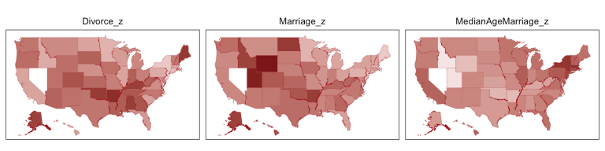

One of the advantages of this visualization method is it just became clear that Nevada is missing from the `WaffleDivorce` data. Execute `d %>% distinct(Location)` to see for yourself. Those missing data should motivate the skills we'll cover in chapter 14. But let's get back on track.

Here we'll officially standardize the predictor, `MedianAgeMarriage`.

``` r
d <-
  d %>%
  mutate(MedianAgeMarriage_s = (MedianAgeMarriage - mean(MedianAgeMarriage)) /
           sd(MedianAgeMarriage))
```

Now we're ready to fit the first univariable model.

``` r
b5.1 <- 
  brm(data = d, family = gaussian,
      Divorce ~ 1 + MedianAgeMarriage_s,
      prior = c(prior(normal(0, 10), class = Intercept),
                prior(normal(0, 1), class = b),
                prior(uniform(0, 10), class = sigma)),
      iter = 2000, warmup = 500, chains = 4, cores = 4)
```

The summary:

``` r
print(b5.1)
```

    ##  Family: gaussian 
    ##   Links: mu = identity; sigma = identity 
    ## Formula: Divorce ~ 1 + MedianAgeMarriage_s 
    ##    Data: d (Number of observations: 50) 
    ## Samples: 4 chains, each with iter = 2000; warmup = 500; thin = 1;
    ##          total post-warmup samples = 6000
    ## 
    ## Population-Level Effects: 
    ##                     Estimate Est.Error l-95% CI u-95% CI Eff.Sample Rhat
    ## Intercept               9.68      0.22     9.24    10.10       6000 1.00
    ## MedianAgeMarriage_s    -1.04      0.21    -1.45    -0.61       4711 1.00
    ## 
    ## Family Specific Parameters: 
    ##       Estimate Est.Error l-95% CI u-95% CI Eff.Sample Rhat
    ## sigma     1.52      0.16     1.25     1.87       4420 1.00
    ## 
    ## Samples were drawn using sampling(NUTS). For each parameter, Eff.Sample 
    ## is a crude measure of effective sample size, and Rhat is the potential 
    ## scale reduction factor on split chains (at convergence, Rhat = 1).

We'll employ `fitted()` to make Figure 5.2.b. In preparation for `fitted()` we'll make a new tibble, `nd`, composed of a handful of densely-packed values for our predictor, `MedianAgeMarriage_s`. With the `newdata` argument, we'll use those values to return model-implied expected values for `Divorce`.

``` r
# First we determine the range of `MedianAgeMarriage_s` values we'd like to feed into `fitted()`
nd <- tibble(MedianAgeMarriage_s = seq(from = -3, to = 3.5, 
                                       length.out = 30))

# Now we use `fitted()` to get the model-implied trajectories
fitd_b5.1 <- 
  fitted(b5.1, newdata = nd) %>%
  as_tibble() %>%
  bind_cols(nd)

# The plot
ggplot(data = fitd_b5.1, 
       aes(x = MedianAgeMarriage_s, y = Estimate)) +
  geom_ribbon(aes(ymin = Q2.5, ymax = Q97.5),
              fill = "firebrick", alpha = 1/5) +
  geom_line(color = "firebrick4") +
  geom_point(data = d, 
             aes(x = MedianAgeMarriage_s, y = Divorce), 
             size = 2, color = "firebrick4") +
  labs(y = "Divorce") +
  coord_cartesian(xlim = range(d$MedianAgeMarriage_s), 
                  ylim = range(d$Divorce)) +
  theme_bw() +
  theme(panel.grid = element_blank())                   
```

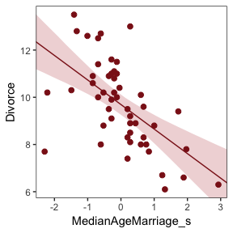

Before fitting the next model, we'll standardize `Marriage`.

``` r
d <-
  d %>%
  mutate(Marriage_s = (Marriage - mean(Marriage)) / sd(Marriage))
```

We're ready to fit our second univariable model.

``` r
b5.2 <- 
  brm(data = d, family = gaussian,
      Divorce ~ 1 + Marriage_s,
      prior = c(prior(normal(0, 10), class = Intercept),
                prior(normal(0, 1), class = b),
                prior(uniform(0, 10), class = sigma)),
      iter = 2000, warmup = 500, chains = 4, cores = 4)
```

``` r
print(b5.2)
```

    ##  Family: gaussian 
    ##   Links: mu = identity; sigma = identity 
    ## Formula: Divorce ~ 1 + Marriage_s 
    ##    Data: d (Number of observations: 50) 
    ## Samples: 4 chains, each with iter = 2000; warmup = 500; thin = 1;
    ##          total post-warmup samples = 6000
    ## 
    ## Population-Level Effects: 
    ##            Estimate Est.Error l-95% CI u-95% CI Eff.Sample Rhat
    ## Intercept      9.68      0.25     9.20    10.17       5546 1.00
    ## Marriage_s     0.64      0.24     0.17     1.13       4690 1.00
    ## 
    ## Family Specific Parameters: 
    ##       Estimate Est.Error l-95% CI u-95% CI Eff.Sample Rhat
    ## sigma     1.75      0.19     1.44     2.17       5093 1.00
    ## 
    ## Samples were drawn using sampling(NUTS). For each parameter, Eff.Sample 
    ## is a crude measure of effective sample size, and Rhat is the potential 
    ## scale reduction factor on split chains (at convergence, Rhat = 1).

Now we'll wangle and plot our version of Figure 5.2.a.

``` r
nd <- tibble(Marriage_s = seq(from = -2.5, to = 3.5, 
                              length.out = 30))

fitd_b5.2 <- 
  fitted(b5.2, newdata = nd) %>%
  as_tibble() %>%
  bind_cols(nd)

ggplot(data = fitd_b5.2, 
       aes(x = Marriage_s, y = Estimate)) +
  geom_ribbon(aes(ymin = Q2.5, ymax = Q97.5),
              fill = "firebrick", alpha = 1/5) +
  geom_line(color = "firebrick4") +
  geom_point(data = d, 
             aes(x = Marriage_s, y = Divorce), 
             size = 2, color = "firebrick4") +
  coord_cartesian(xlim = range(d$Marriage_s), 
                  ylim = range(d$Divorce)) +
  labs(y = "Divorce") +
  theme_bw() +
  theme(panel.grid = element_blank())                   
```

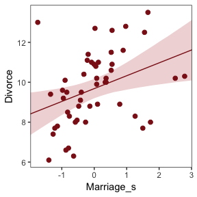

### Multivariate notation.

Now we'll get both predictors in there with our very first multivariable model. If we let *x*<sub>1</sub> be `Marriage_s` and *x*<sub>2</sub> be `MedianAgeMarriage_s`, we can write the statistical model as

*D*<sub>*i*</sub> ∼ Normal(*μ*<sub>*i*</sub>, *σ*)

*μ*<sub>*i*</sub> = *α* + *β*<sub>1</sub>*x*<sub>1*i*</sub> + *β*<sub>2</sub>*x*<sub>2*i*</sub>

*α* ∼ Normal(10, 10)

*β*<sub>1</sub> ∼ Normal(0, 1)

*β*<sub>2</sub> ∼ Normal(0, 1)

*σ* ∼ Uniform(0, 10)

### Fitting the model.

Much like we used the `+` operator to add single predictors to the intercept, we just use more `+` operators in the formula to add more predictors. Also notice we're using the same prior `prior(normal(0, 1), class = b)` for both predictors. Within the brms framework, they are both of `class = b`. But if we wanted their priors to differ, we'd make two `prior()` statements and differentiate them with the `coef` argument. You'll see that later on.

``` r
b5.3 <- 
  brm(data = d, family = gaussian,
      Divorce ~ 1 + Marriage_s + MedianAgeMarriage_s,
      prior = c(prior(normal(0, 10), class = Intercept),
                prior(normal(0, 1), class = b),
                prior(uniform(0, 10), class = sigma)),
      iter = 2000, warmup = 500, chains = 4, cores = 4)
```

``` r
print(b5.3)
```

    ##  Family: gaussian 
    ##   Links: mu = identity; sigma = identity 
    ## Formula: Divorce ~ 1 + Marriage_s + MedianAgeMarriage_s 
    ##    Data: d (Number of observations: 50) 
    ## Samples: 4 chains, each with iter = 2000; warmup = 500; thin = 1;
    ##          total post-warmup samples = 6000
    ## 
    ## Population-Level Effects: 
    ##                     Estimate Est.Error l-95% CI u-95% CI Eff.Sample Rhat
    ## Intercept               9.68      0.22     9.25    10.10       5666 1.00
    ## Marriage_s             -0.13      0.29    -0.70     0.44       4419 1.00
    ## MedianAgeMarriage_s    -1.13      0.29    -1.70    -0.54       4259 1.00
    ## 
    ## Family Specific Parameters: 
    ##       Estimate Est.Error l-95% CI u-95% CI Eff.Sample Rhat
    ## sigma     1.52      0.16     1.24     1.88       5389 1.00
    ## 
    ## Samples were drawn using sampling(NUTS). For each parameter, Eff.Sample 
    ## is a crude measure of effective sample size, and Rhat is the potential 
    ## scale reduction factor on split chains (at convergence, Rhat = 1).

The `stanplot()` function is an easy way to get a default coefficient plot. You just put the brmsfit object into the function.

``` r
stanplot(b5.3)
```

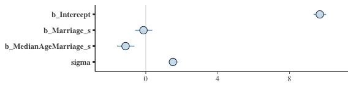

There are numerous ways to make a coefficient plot. Another is with the `mcmc_intervals()` function from the [bayesplot package](https://cran.r-project.org/web/packages/bayesplot/index.html). A nice feature of the bayesplot package is its convenient way to alter the color scheme with the `color_scheme_set()` function. Here, for example, we'll make the theme `red`. But note how the `mcmc_intervals()` function requires you to work with the `posterior_samples()` instead of the brmsfit object.

``` r
# install.packages("bayesplot", dependencies = T)
library(bayesplot)

post <- posterior_samples(b5.3)

color_scheme_set("red")
mcmc_intervals(post[, 1:4], 
               prob = .5,
               point_est = "median") +
  labs(title = "My fancy bayesplot-based coefficient plot") +
  theme(axis.text.y = element_text(hjust = 0),
        axis.line.x = element_line(size = 1/4),
        axis.line.y = element_blank(),
        axis.ticks.y = element_blank())
```

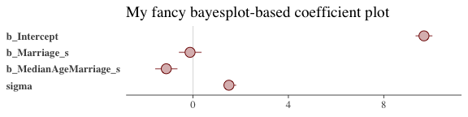

Because bayesplot produces a ggplot2 object, the plot was adjustable with familiar ggplot2 syntax. For more ideas, check out [this vignette](https://cran.r-project.org/web/packages/bayesplot/vignettes/plotting-mcmc-draws.html).

The `tidybaes::stat_pointintervalh()` function offers a third way, this time with a more ground-up ggplot2 workflow.

``` r
library(tidybayes)

post %>% 
  select(-lp__) %>% 
  gather() %>% 
  
  ggplot(aes(x = value, y = reorder(key, value))) +  # note how we used `reorder()` to arrange the coefficients
  geom_vline(xintercept = 0, color = "firebrick4", alpha = 1/10) +
  stat_pointintervalh(point_interval = mode_hdi, .width = .95, 
                      size = 3/4, color = "firebrick4") +
  labs(title = "My tidybayes-based coefficient plot",
       x = NULL, y = NULL) +
  theme_bw() +
  theme(panel.grid   = element_blank(),
        panel.grid.major.y = element_line(color = alpha("firebrick4", 1/4), linetype = 3),
        axis.text.y  = element_text(hjust = 0),
        axis.ticks.y = element_blank())
```

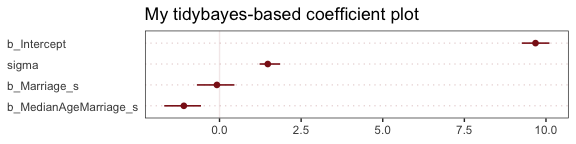

The substantive interpretation of all those coefficient plots is: "*Once we know median age at marriage for a State, there is little or no additive predictive power in also knowing the rate of marriage in that State*" (p. 126, *emphasis* in the original).

### Plotting multivariate posteriors.

McElreath’s prose is delightfully deflationary. “There is a huge literature detailing a variety of plotting techniques that all attempt to help one understand multiple linear regression. None of these techniques is suitable for all jobs, and most do not generalize beyond linear regression” (p. 126). Now you’re inspired, let’s learn three:

-   Predictor residual plots
-   Counterfactual plots
-   Posterior prediction plots

#### Predictor residual plots.

To get ready to make our residual plots, we'll predict `Marriage_s` with `MedianAgeMarriage_s`.

``` r
b5.4 <- 
  brm(data = d, family = gaussian,
      Marriage_s ~ 1 + MedianAgeMarriage_s,
      prior = c(set_prior("normal(0, 10)", class = "Intercept"),
                set_prior("normal(0, 1)", class = "b"),
                set_prior("uniform(0, 10)", class = "sigma")),
      iter = 2000, warmup = 500, chains = 4, cores = 4)
```

``` r
print(b5.4)
```

    ##  Family: gaussian 
    ##   Links: mu = identity; sigma = identity 
    ## Formula: Marriage_s ~ 1 + MedianAgeMarriage_s 
    ##    Data: d (Number of observations: 50) 
    ## Samples: 4 chains, each with iter = 2000; warmup = 500; thin = 1;
    ##          total post-warmup samples = 6000
    ## 
    ## Population-Level Effects: 
    ##                     Estimate Est.Error l-95% CI u-95% CI Eff.Sample Rhat
    ## Intercept               0.00      0.10    -0.20     0.21       5069 1.00
    ## MedianAgeMarriage_s    -0.71      0.10    -0.92    -0.51       5573 1.00
    ## 
    ## Family Specific Parameters: 
    ##       Estimate Est.Error l-95% CI u-95% CI Eff.Sample Rhat
    ## sigma     0.72      0.08     0.59     0.88       5066 1.00
    ## 
    ## Samples were drawn using sampling(NUTS). For each parameter, Eff.Sample 
    ## is a crude measure of effective sample size, and Rhat is the potential 
    ## scale reduction factor on split chains (at convergence, Rhat = 1).

With `fitted()`, we compute the expected values for each State (with the exception of Nevada). Since the `MedianAgeMarriage_s` values for each state are in the date we used to fit the model, we’ll omit the `newdata` argument.

``` r
fitd_b5.4 <- 
  fitted(b5.4) %>%
  as_tibble() %>%
  bind_cols(d)

head(fitd_b5.4)
```

    ## # A tibble: 6 x 19
    ##   Estimate Est.Error     Q2.5  Q97.5 Location   Loc   Population
    ##      <dbl>     <dbl>    <dbl>  <dbl> <fct>      <fct>      <dbl>
    ## 1    0.434     0.119  0.202    0.674 Alabama    AL          4.78
    ## 2    0.491     0.123  0.250    0.740 Alaska     AK          0.71
    ## 3    0.148     0.104 -0.0559   0.356 Arizona    AZ          6.33
    ## 4    1.01      0.176  0.662    1.36  Arkansas   AR          2.92
    ## 5   -0.425     0.122 -0.665   -0.185 California CA         37.2 
    ## 6    0.205     0.106 -0.00199  0.416 Colorado   CO          5.03
    ## # ... with 12 more variables: MedianAgeMarriage <dbl>, Marriage <dbl>,
    ## #   Marriage.SE <dbl>, Divorce <dbl>, Divorce.SE <dbl>,
    ## #   WaffleHouses <int>, South <int>, Slaves1860 <int>,
    ## #   Population1860 <int>, PropSlaves1860 <dbl>, MedianAgeMarriage_s <dbl>,
    ## #   Marriage_s <dbl>

After a little data processing, we can make Figure 5.3.

``` r
fitd_b5.4 %>% 
  
  ggplot(aes(x = MedianAgeMarriage_s, y = Marriage_s)) +
  geom_point(size = 2, shape = 1, color = "firebrick4") +
  geom_segment(aes(xend = MedianAgeMarriage_s, yend = Estimate), 
               size = 1/4) +
  geom_line(aes(y = Estimate), 
            color = "firebrick4") +
  coord_cartesian(ylim = range(d$Marriage_s)) +
  theme_bw() +
  theme(panel.grid = element_blank())     
```

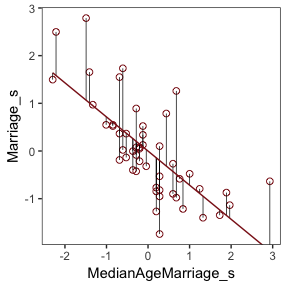

We get the residuals with the well-named `residuals()` function. Much like with `brms::fitted()`, `brms::residuals()` returns a four-vector matrix with the number of rows equal to the number of observations in the original data (by default, anyway). The vectors have the familiar names: `Estimate`, `Est.Error`, `Q2.5`, and `Q97.5`. See the [brms reference manual](https://cran.r-project.org/web/packages/brms/brms.pdf) for details.

With our residuals in hand, we just need a little more data processing to make Figure 5.4.a.

``` r
res_b5.4 <- 
  residuals(b5.4) %>%
  # To use this in ggplot2, we need to make it a tibble or data frame
  as_tibble() %>% 
  bind_cols(d)

# for the annotation at the top
text <-
  tibble(Estimate = c(- 0.5, 0.5),
         Divorce = 14.1,
         label = c("slower", "faster"))

res_b5.4 %>% 
  ggplot(aes(x = Estimate, y = Divorce)) +
  stat_smooth(method = "lm", fullrange = T,
              color = "firebrick4", fill = "firebrick4", 
              alpha = 1/5, size = 1/2) +
  geom_vline(xintercept = 0, linetype = 2, color = "grey50") +
  geom_point(size = 2, color = "firebrick4", alpha = 2/3) +
  geom_text(data = text,
            aes(label = label)) +
  scale_x_continuous(limits = c(-2, 2)) +
  coord_cartesian(xlim = range(res_b5.4$Estimate),
                  ylim = c(6, 14.1)) +
  labs(x = "Marriage rate residuals") +
  theme_bw() +
  theme(panel.grid = element_blank())
```

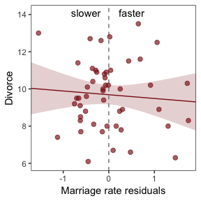

To get the `MedianAgeMarriage.s` residuals, we have to fit the corresponding model first.

``` r
b5.4b <- 
  brm(data = d, family = gaussian,
      MedianAgeMarriage_s ~ 1 + Marriage_s,
      prior = c(prior(normal(0, 10), class = Intercept),
                prior(normal(0, 1), class = b),
                prior(uniform(0, 10), class = sigma)),
      iter = 2000, warmup = 500, chains = 4, cores = 4)
```

And now we'll get the new batch of residuals, do a little data processing, and make a plot corresponding to Figure 5.4.b.

``` r
text <-
  tibble(Estimate = c(- 0.7, 0.5),
         Divorce = 14.1,
         label = c("younger", "older"))

residuals(b5.4b) %>%
  as_tibble() %>%
  bind_cols(d) %>% 
  
  ggplot(aes(x = Estimate, y = Divorce)) +
  stat_smooth(method = "lm", fullrange = T,
              color = "firebrick4", fill = "firebrick4", 
              alpha = 1/5, size = 1/2) +
  geom_vline(xintercept = 0, linetype = 2, color = "grey50") +
  geom_point(size = 2, color = "firebrick4", alpha = 2/3) +
  geom_text(data = text,
            aes(label = label)) +
  scale_x_continuous(limits = c(-2, 3)) +
  coord_cartesian(xlim = range(res_b5.4$Estimate),
                  ylim = c(6, 14.1)) +
  labs(x = "Age of marriage residuals") +
  theme_bw() +
  theme(panel.grid = element_blank())  
```

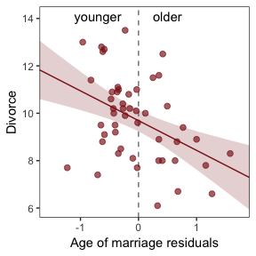

#### Counterfactual plots.

> A second sort of inferential plot displays the implied predictions of the model. I call these plots *counterfactual*, because they can be produced for any values of the predictor variable you like, even unobserved or impossible combinations like very high median age of marriage and very high marriage rate. There are no States with this combination, but in a counterfactual plot, you can ask the model for a prediction for such a State. (p. 129, *emphasis* in the original)

Making Figure 5.5.a requires a little more data wrangling than before.

``` r
# We need new data
nd <- 
  tibble(Marriage_s          = seq(from = -3, to = 3, length.out = 30),
         MedianAgeMarriage_s = rep(mean(d$MedianAgeMarriage_s), times = 30))
  
fitted(b5.3, newdata = nd) %>% 
  as_tibble() %>% 
  # Since `fitted()` and `predict()` name their intervals the same way, we'll need to `rename()` then to keep them straight.
  rename(f_ll = Q2.5,
         f_ul = Q97.5) %>% 
  # Note how we're just nesting the `predict()` code right inside `bind_cols()`
  bind_cols(
    predict(b5.3, newdata = nd) %>% 
      as_tibble() %>% 
      # Since we only need the intervals, we'll use `transmute()` rather than `mutate()`
      transmute(p_ll = Q2.5,
                p_ul = Q97.5)
  ) %>% 
  bind_cols(nd) %>% 
  
  # We're finally ready to plot
  ggplot(aes(x = Marriage_s, y = Estimate)) +
  geom_ribbon(aes(ymin = p_ll, ymax = p_ul),
              fill = "firebrick", alpha = 1/5) +
  geom_ribbon(aes(ymin = f_ll, ymax = f_ul),
              fill = "firebrick", alpha = 1/5) +
  geom_line(color = "firebrick4") +
  coord_cartesian(xlim = range(d$Marriage_s),
                  ylim = c(6, 14)) +
  labs(subtitle = "Counterfactual plot for which\nMedianAgeMarriage_s = 0",
       y = "Divorce") +
  theme_bw() +
  theme(panel.grid = element_blank())     
```

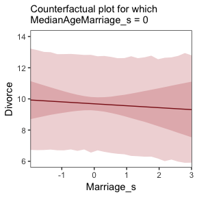

We follow the same process for Figure 5.5.b.

``` r
# new data
nd <- 
  tibble(MedianAgeMarriage_s = seq(from = -3, to = 3.5, length.out = 30),
         Marriage_s = rep(mean(d$Marriage_s), times = 30))
  
# `fitted()` + `predict()`
fitted(b5.3, newdata = nd) %>% 
  as_tibble() %>% 
  rename(f_ll = Q2.5,
         f_ul = Q97.5) %>% 
  bind_cols(
    predict(b5.3, newdata = nd) %>% 
      as_tibble() %>% 
      transmute(p_ll = Q2.5,
                p_ul = Q97.5)
  ) %>% 
  bind_cols(nd) %>% 
  
  # plot
  ggplot(aes(x = MedianAgeMarriage_s, y = Estimate)) +
  geom_ribbon(aes(ymin = p_ll, ymax = p_ul),
              fill = "firebrick", alpha = 1/5) +
  geom_ribbon(aes(ymin = f_ll, ymax = f_ul),
              fill = "firebrick", alpha = 1/5) +
  geom_line(color = "firebrick4") +
  coord_cartesian(xlim = range(d$MedianAgeMarriage_s),
                  ylim = c(6, 14)) +
  labs(subtitle = "Counterfactual plot for which\nMarriage_s = 0",
       y = "Divorce") +
  theme_bw() +
  theme(panel.grid = element_blank())   
```

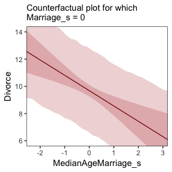

> A tension with such plots, however, lies in their counterfactual nature. In the small world of the model, it is possible to change median age of marriage without also changing the marriage rate. But is this also possible in the large world of reality? Probably not...
>
> ...If our goal is to intervene in the world, there may not be any realistic way to manipulate each predictor without also manipulating the others. This is a serious obstacle to applied science, whether you are an ecologist, an economist, or an epidemiologist \[or a psychologist\] (p. 131)

#### Posterior prediction plots.

"In addition to understanding the estimates, it’s important to check the model fit against the observed data" (p. 131). For more on the topic, check out Gabry and colleagues' [*Visualization in Bayesian workflow*](https://arxiv.org/abs/1709.01449) or Simpson's related blog post [*Touch me, I want to feel your data*](http://andrewgelman.com/2017/09/07/touch-want-feel-data/).

In this version of Figure 5.6.a, the thin lines are the 95% intervals and the thicker lines are +/- the posterior *S**D*, both of which are returned when you use `fitted()`.

``` r
fitted(b5.3) %>%
  as_tibble() %>%
  bind_cols(d) %>%
  
  ggplot(aes(x = Divorce, y = Estimate)) +
  geom_abline(linetype = 2, color = "grey50", size = .5) +
  geom_point(size = 1.5, color = "firebrick4", alpha = 3/4) +
  geom_linerange(aes(ymin = Q2.5, ymax = Q97.5),
                 size = 1/4, color = "firebrick4") +
  geom_linerange(aes(ymin = Estimate - Est.Error, 
                     ymax = Estimate + Est.Error),
                 size = 1/2, color = "firebrick4") +
  # Note our use of the dot placeholder, here: https://magrittr.tidyverse.org/reference/pipe.html
  geom_text(data = . %>% filter(Loc %in% c("ID", "UT")),
            aes(label = Loc), 
            hjust = 0, nudge_x = - 0.65) +
  labs(x = "Observed divorce", y = "Predicted divorce") +
  theme_bw() +
  theme(panel.grid = element_blank())
```

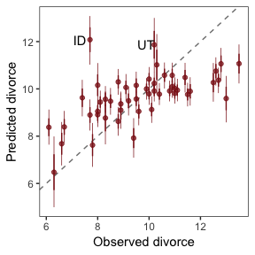

In order to make Figure 5.6.b, we need to clarify the relationships among `fitted()`, `predict()`, and `residuals()`. Here's my attempt in a table.

``` r
tibble(`brms function` = c("fitted", "predict", "residual"),
       mean = c("same as the data", "same as the data", "in a deviance-score metric"),
       scale = c("excludes sigma", "includes sigma", "excludes sigma")) %>% 
  knitr::kable()
```

| brms function | mean                       | scale          |
|:--------------|:---------------------------|:---------------|
| fitted        | same as the data           | excludes sigma |
| predict       | same as the data           | includes sigma |
| residual      | in a deviance-score metric | excludes sigma |

This means that if we want to incorporate the prediction interval in a deviance metric, we'll need to first use `predict()` and then subtract the intervals from their corresponding `Divorce` values in the data.

``` r
residuals(b5.3) %>% 
  as_tibble() %>% 
  rename(f_ll = Q2.5,
         f_ul = Q97.5) %>% 
  bind_cols(
    predict(b5.3) %>% 
      as_tibble() %>% 
      transmute(p_ll = Q2.5,
                p_ul = Q97.5)
  ) %>% 
  bind_cols(d) %>%
  # here we put our `predict()` intervals into a deviance metric
  mutate(p_ll = Divorce - p_ll,
         p_ul = Divorce - p_ul) %>% 
  
  # The plot
  ggplot(aes(x = reorder(Loc, Estimate), y = Estimate)) +
  geom_hline(yintercept = 0, size = 1/2, 
             color = "firebrick4", alpha = 1/10) +
  geom_pointrange(aes(ymin = f_ll, ymax = f_ul),
                  size = 2/5, shape = 20, color = "firebrick4") + 
  geom_segment(aes(y    = Estimate - Est.Error, 
                   yend = Estimate + Est.Error,
                   x    = Loc, 
                   xend = Loc),
               size = 1, color = "firebrick4") +
  geom_segment(aes(y    = p_ll, 
                   yend = p_ul,
                   x    = Loc, 
                   xend = Loc),
               size = 3, color = "firebrick4", alpha = 1/10) +
  labs(x = NULL, y = NULL) +
  coord_flip(ylim = c(-6, 5)) +
  theme_bw() +
  theme(panel.grid   = element_blank(),
        axis.ticks.y = element_blank(),
        axis.text.y  = element_text(hjust = 0))
```

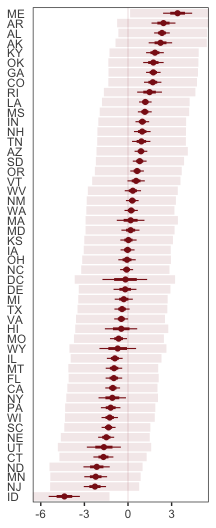

Compared to the last couple plots, Figure 5.6.c is pretty simple.

``` r
residuals(b5.3) %>% 
  as_tibble() %>% 
  bind_cols(d) %>% 
  mutate(wpc = WaffleHouses / Population) %>% 
  
  ggplot(aes(x = wpc, y = Estimate)) +
  geom_point(size = 1.5, color = "firebrick4", alpha = 1/2) +
  stat_smooth(method = "lm", fullrange = T,
              color  = "firebrick4", size = 1/2, 
              fill   = "firebrick", alpha = 1/5) + 
  geom_text_repel(data = . %>% filter(Loc %in% c("ME", "AR", "MS", "AL", "GA", "SC", "ID")),
                  aes(label = Loc),
                  seed = 5.6) +
  scale_x_continuous(limits = c(0, 45)) +
  coord_cartesian(xlim = range(0, 40)) +
  labs(x = "Waffles per capita",
       y = "Divorce error") +
  theme_bw() +
  theme(panel.grid = element_blank())
```

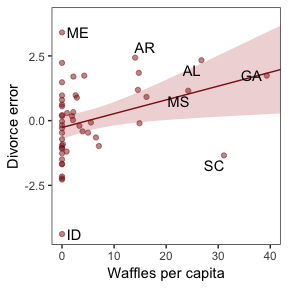

More McElreath inspiration: "No matter how many predictors you’ve already included in a regression, it’s still possible to find spurious correlations with the remaining variation" (p. 134).

#### Overthinking: Simulating spurious association.

``` r
N <- 100                             # number of cases

set.seed(135)                        # setting the seed makes the results reproducible
d <- 
  tibble(x_real = rnorm(N),          # x_real as Gaussian with mean 0 and SD 1 (i.e., the defaults)
         x_spur = rnorm(N, x_real),  # x_spur as Gaussian with mean = x_real
         y =      rnorm(N, x_real))  # y as Gaussian with mean = x_real
```

Here are the quick `pairs()` plots.

``` r
pairs(d, col = "firebrick4")
```

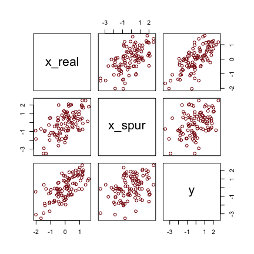

``` r
brm(data = d, family = gaussian,
    y ~ 1 + x_real + x_spur,
    prior = c(prior(normal(0, 10), class = Intercept),
              prior(normal(0, 1), class = b),
              prior(uniform(0, 10), class = sigma)),
    iter = 2000, warmup = 500, chains = 4, cores = 4) %>% 
  
  fixef() %>% round(digits = 2)
```

    ##           Estimate Est.Error  Q2.5 Q97.5
    ## Intercept    -0.05      0.09 -0.23  0.13
    ## x_real        1.18      0.14  0.91  1.46
    ## x_spur       -0.06      0.09 -0.23  0.12

Masked relationship
-------------------

Let's load those tasty `milk` data.

``` r
library(rethinking)
data(milk)
d <- milk
```

Unload rethinking and load brms.

``` r
rm(milk)
detach(package:rethinking, unload = T)
library(brms)
```

You might inspect the data like this.

``` r
d %>% 
  select(kcal.per.g, mass, neocortex.perc) %>% 
  pairs(col = "firebrick4")
```


By just looking at that mess, do you think you could describe the associations of `mass` and `neocortex.perc` with the criterion, `kcal.per.g`? I couldn't. It's a good thing we have math.

McElreath has us start of with a simple univaraible `milk` model.

``` r
b5.5 <- 
  brm(data = d, family = gaussian,
      kcal.per.g ~ 1 + neocortex.perc,
      prior = c(prior(normal(0, 100), class = Intercept),
                prior(normal(0, 1), class = b),
                prior(cauchy(0, 1), class = sigma)),
      iter = 2000, warmup = 500, chains = 4, cores = 4)
```

The uniform prior was difficult on Stan. After playing around a bit, I just switched to a unit-scale half Cauchy. Similar to the rethinking example in the text, brms warned that "Rows containing NAs were excluded from the model." This isn't necessarily a problem; the model fit just fine. But we should be ashamed of ourselves and look eagerly forward to chapter 14 where we'll learn how to do better.

Here's how to explicitly drop the cases with missing values on the predictor.

``` r
dcc <- 
  d %>%
  filter(complete.cases(.))              
```

Let's inspect the parameter summary.

``` r
print(b5.5, digits = 3)
```

    ##  Family: gaussian 
    ##   Links: mu = identity; sigma = identity 
    ## Formula: kcal.per.g ~ 1 + neocortex.perc 
    ##    Data: d (Number of observations: 17) 
    ## Samples: 4 chains, each with iter = 2000; warmup = 500; thin = 1;
    ##          total post-warmup samples = 6000
    ## 
    ## Population-Level Effects: 
    ##                Estimate Est.Error l-95% CI u-95% CI Eff.Sample  Rhat
    ## Intercept         0.360     0.554   -0.774    1.436       5223 1.000
    ## neocortex.perc    0.004     0.008   -0.012    0.021       5205 1.000
    ## 
    ## Family Specific Parameters: 
    ##       Estimate Est.Error l-95% CI u-95% CI Eff.Sample  Rhat
    ## sigma    0.192     0.040    0.133    0.290       2983 1.000
    ## 
    ## Samples were drawn using sampling(NUTS). For each parameter, Eff.Sample 
    ## is a crude measure of effective sample size, and Rhat is the potential 
    ## scale reduction factor on split chains (at convergence, Rhat = 1).

To get the brms answer to what McElreath did with `coef()`, we'll use the `fixef()` function.

``` r
fixef(b5.5)[2]*(76 - 55)
```

    ## [1] 0.09236668

Yes, indeed, "that's less than 0.1 kilocalories" (p. 137).

Just for kicks, we'll superimpose 50% intervals atop 95% intervals for the next few plots. Here's Figure 5.7, top left.

``` r
nd <- tibble(neocortex.perc = 54:80)

fitted(b5.5, 
       newdata = nd,
       probs = c(.025, .975, .25, .75)) %>%
  as_tibble() %>%
  bind_cols(nd) %>% 
  
  ggplot(aes(x = neocortex.perc, y = Estimate)) +
  geom_ribbon(aes(ymin = Q2.5, ymax = Q97.5),
              fill = "firebrick", alpha = 1/5) +
  geom_ribbon(aes(ymin = Q25, ymax = Q75),
              fill = "firebrick4", alpha = 1/5) +
  geom_line(color = "firebrick4", size = 1/2) +
  geom_point(data = dcc, 
             aes(x = neocortex.perc, y = kcal.per.g),
             size = 2, color = "firebrick4") +
  coord_cartesian(xlim = range(dcc$neocortex.perc), 
                  ylim = range(dcc$kcal.per.g)) +
  labs(y = "kcal.per.g") +
  theme_bw() +
  theme(panel.grid = element_blank())
```

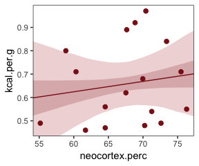

Do note the `probs` argument in the `fitted()` code, above. Just for kicks and giggles, we’ll superimpose 50% intervals atop 95% intervals for this series of plots. Let's make the `log_mass` variable.

``` r
dcc <-
  dcc %>%
  mutate(log_mass = log(mass))
```

Now we use `log_mass` as the new sole predictor.

``` r
b5.6 <- 
  brm(data = dcc, family = gaussian,
      kcal.per.g ~ 1 + log_mass,
      prior = c(prior(normal(0, 100), class = Intercept),
                prior(normal(0, 1), class = b),
                prior(uniform(0, 1), class = sigma)),
      iter = 2000, warmup = 500, chains = 4, cores = 4,
      control = list(adapt_delta = 0.9))
```

``` r
print(b5.6, digits = 3)
```

    ##  Family: gaussian 
    ##   Links: mu = identity; sigma = identity 
    ## Formula: kcal.per.g ~ 1 + log_mass 
    ##    Data: dcc (Number of observations: 17) 
    ## Samples: 4 chains, each with iter = 2000; warmup = 500; thin = 1;
    ##          total post-warmup samples = 6000
    ## 
    ## Population-Level Effects: 
    ##           Estimate Est.Error l-95% CI u-95% CI Eff.Sample  Rhat
    ## Intercept    0.707     0.058    0.588    0.823       4398 1.000
    ## log_mass    -0.032     0.024   -0.082    0.013       4035 1.001
    ## 
    ## Family Specific Parameters: 
    ##       Estimate Est.Error l-95% CI u-95% CI Eff.Sample  Rhat
    ## sigma    0.183     0.038    0.127    0.272       3325 1.000
    ## 
    ## Samples were drawn using sampling(NUTS). For each parameter, Eff.Sample 
    ## is a crude measure of effective sample size, and Rhat is the potential 
    ## scale reduction factor on split chains (at convergence, Rhat = 1).

Make Figure 5.7, top right.

``` r
nd <- tibble(log_mass = seq(from = -2.5, to = 5, length.out = 30))

fitted(b5.6, 
       newdata = nd,
       probs = c(.025, .975, .25, .75)) %>%
  as_tibble() %>%
  bind_cols(nd) %>% 
  
  ggplot(aes(x = log_mass, y = Estimate)) +
  geom_ribbon(aes(ymin = Q2.5, ymax = Q97.5),
              fill = "firebrick", alpha = 1/5) +
  geom_ribbon(aes(ymin = Q25, ymax = Q75),
              fill = "firebrick4", alpha = 1/5) +
  geom_line(color = "firebrick4", size = 1/2) +
  geom_point(data = dcc, 
             aes(x = log_mass, y = kcal.per.g),
             size = 2, color = "firebrick4") +
  coord_cartesian(xlim = range(dcc$log_mass), 
                  ylim = range(dcc$kcal.per.g)) +
  labs(y = "kcal.per.g") +
  theme_bw() +
  theme(panel.grid = element_blank())
```

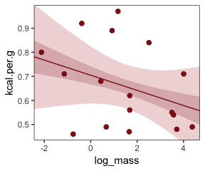

Finally, we're ready to fit with both predictors included in the "joint model." Note, the HMC chains required a longer `warmup` period and a higher `adapt_delta` setting for the model to converge properly. Life will be much better once we ditch the uniform prior for good.

``` r
b5.7 <- 
  brm(data = dcc, family = gaussian,
      kcal.per.g ~ 1 + neocortex.perc + log_mass,
      prior = c(prior(normal(0, 100), class = Intercept),
                prior(normal(0, 1), class = b),
                prior(uniform(0, 1), class = sigma)),
      iter = 4000, warmup = 2000, chains = 4, cores = 4,
      control = list(adapt_delta = 0.999))
```

``` r
print(b5.7, digits = 3)
```

    ##  Family: gaussian 
    ##   Links: mu = identity; sigma = identity 
    ## Formula: kcal.per.g ~ 1 + neocortex.perc + log_mass 
    ##    Data: dcc (Number of observations: 17) 
    ## Samples: 4 chains, each with iter = 4000; warmup = 2000; thin = 1;
    ##          total post-warmup samples = 8000
    ## 
    ## Population-Level Effects: 
    ##                Estimate Est.Error l-95% CI u-95% CI Eff.Sample  Rhat
    ## Intercept        -1.095     0.597   -2.317    0.086       3025 1.000
    ## neocortex.perc    0.028     0.009    0.010    0.047       2983 1.000
    ## log_mass         -0.097     0.029   -0.155   -0.040       3309 1.000
    ## 
    ## Family Specific Parameters: 
    ##       Estimate Est.Error l-95% CI u-95% CI Eff.Sample  Rhat
    ## sigma    0.140     0.030    0.095    0.213       3373 1.002
    ## 
    ## Samples were drawn using sampling(NUTS). For each parameter, Eff.Sample 
    ## is a crude measure of effective sample size, and Rhat is the potential 
    ## scale reduction factor on split chains (at convergence, Rhat = 1).

Make Figure 5.7, bottom left.

``` r
nd <- 
  tibble(neocortex.perc = 54:80 %>% as.double(),
         log_mass       = mean(dcc$log_mass))

b5.7 %>%
  fitted(newdata = nd, 
         probs = c(.025, .975, .25, .75)) %>%
  as_tibble() %>%
  bind_cols(nd) %>% 

  ggplot(aes(x = neocortex.perc, y = Estimate)) +
  geom_ribbon(aes(ymin = Q2.5, ymax = Q97.5),
              fill = "firebrick", alpha = 1/5) +
  geom_ribbon(aes(ymin = Q25, ymax = Q75),
              fill = "firebrick4", alpha = 1/5) +
  geom_line(color = "firebrick4", size = 1/2) +
  geom_point(data = dcc, aes(x = neocortex.perc, y = kcal.per.g),
             size = 2, color = "firebrick4") +
  coord_cartesian(xlim = range(dcc$neocortex.perc), 
                  ylim = range(dcc$kcal.per.g)) +
  labs(y = "kcal.per.g") +
  theme_bw() +
  theme(panel.grid = element_blank())
```

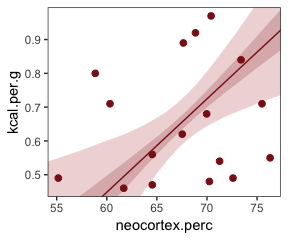

And make Figure 5.7, bottom right.

``` r
nd <- 
  tibble(log_mass       = seq(from = -2.5, to = 5, length.out = 30),
         neocortex.perc = mean(dcc$neocortex.perc))

b5.7 %>%
  fitted(newdata = nd,
         probs = c(.025, .975, .25, .75)) %>%
  as_tibble() %>%
  bind_cols(nd) %>% 

  ggplot(aes(x = log_mass, y = Estimate)) +
  geom_ribbon(aes(ymin = Q2.5, ymax = Q97.5),
              fill = "firebrick", alpha = 1/5) +
  geom_ribbon(aes(ymin = Q25, ymax = Q75),
              fill = "firebrick4", alpha = 1/5) +
  geom_line(color = "firebrick4", size = 1/2) +
  geom_point(data = dcc, aes(x = log_mass, y = kcal.per.g),
             size = 2, color = "firebrick4") +
  coord_cartesian(xlim = range(dcc$log_mass), 
                  ylim = range(dcc$kcal.per.g)) +
  labs(y = "kcal.per.g") +
  theme_bw() +
  theme(panel.grid = element_blank())
```

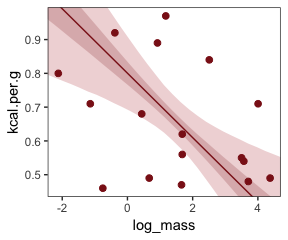

> What \[this regression model did was\] ask if species that have high neocortex percent *for their body mass* have higher milk energy. Likewise, the model \[asked\] if species with high body mass *for their neocortex percent* have higher milk energy. Bigger species, like apes, have milk with less energy. But species with more neocortex tend to have richer milk. The fact that these two variables, body size and neocortex, are correlated across species makes it hard to see these relationships, unless we statistically account for both. (pp. 140--141, *emphasis* in the original)

#### Overthinking: Simulating a masking relationship.

``` r
N   <- 100     # number of cases
rho <- .7      # correlation between x_pos and x_neg

set.seed(141)  # setting the seed makes the results reproducible
d <- 
  tibble(x_pos = rnorm(N),                              # x_pos as a standard Gaussian
         x_neg = rnorm(N, rho*x_pos, sqrt(1 - rho^2)),  # x_neg correlated with x_pos
         y     = rnorm(N, x_pos - x_neg))               # y equally associated with x_pos and x_neg
```

Here are the quick `pairs()` plots.

``` r
pairs(d, col = "firebrick4")
```


Here we fit the models with a little help from the `update()` function.

``` r
b5.O.both <- 
  brm(data = d, family = gaussian,
      y ~ 1 + x_pos + x_neg,
      prior = c(prior(normal(0, 100), class = Intercept),
                prior(normal(0, 1), class = b),
                prior(cauchy(0, 1), class = sigma)))

b5.O.pos <-
  update(b5.O.both, 
         formula = y ~ 1 + x_pos)

b5.O.neg <-
  update(b5.O.both, 
         formula = y ~ 1 + x_neg)
```

Compare the coefficients.

``` r
fixef(b5.O.pos)  %>% round(digits = 2)
```

    ##           Estimate Est.Error  Q2.5 Q97.5
    ## Intercept     0.01      0.13 -0.25  0.27
    ## x_pos         0.32      0.14  0.04  0.59

``` r
fixef(b5.O.neg)  %>% round(digits = 2)
```

    ##           Estimate Est.Error  Q2.5 Q97.5
    ## Intercept     0.07      0.12 -0.17  0.32
    ## x_neg        -0.51      0.14 -0.79 -0.23

``` r
fixef(b5.O.both) %>% round(digits = 2)
```

    ##           Estimate Est.Error  Q2.5 Q97.5
    ## Intercept     0.08      0.10 -0.13  0.28
    ## x_pos         1.05      0.13  0.78  1.30
    ## x_neg        -1.18      0.14 -1.45 -0.91

When adding variables hurts
---------------------------

> Multicollinearity means very strong correlation between two or more predictor variables. The consequence of it is that the posterior distribution will say that a very large range of parameter values are plausible, from tiny associations to massive ones, even if all of the variables are in reality strongly associated with the outcome variable. (pp. 141--142)

### Multicollinear legs.

Let's simulate some leg data.

``` r
N <- 100
set.seed(531)

d <- 
  tibble(height    = rnorm(N, mean = 10, sd = 2),
         leg_prop  = runif(N, min = 0.4, max = 0.5)) %>% 
  mutate(leg_left  = leg_prop*height + rnorm(N, mean = 0, sd = 0.02),
         leg_right = leg_prop*height + rnorm(N, mean = 0, sd = 0.02))
```

`leg_left` and `leg_right` are **highly** correlated.

``` r
d %>%
  select(leg_left:leg_right) %>%
  cor() %>%
  round(digits = 4)
```

    ##           leg_left leg_right
    ## leg_left    1.0000    0.9995
    ## leg_right   0.9995    1.0000

Have you ever seen a *ρ* = .9995 correlation, before? Here it is in a plot.

``` r
d %>%
  ggplot(aes(x = leg_left, y = leg_right)) +
  geom_point(alpha = 1/2, color = "firebrick4") +
  theme_bw() +
  theme(panel.grid = element_blank())
```

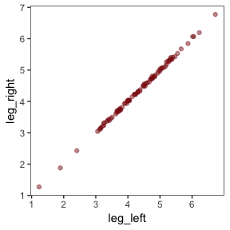

Here's our attempt to predict `height` with both legs.

``` r
b5.8 <- 
  brm(data = d, family = gaussian,
      height ~ 1 + leg_left + leg_right,
      prior = c(prior(normal(10, 100), class = Intercept),
                prior(normal(2, 10), class = b),
                prior(uniform(0, 10), class = sigma)),
      iter = 2000, warmup = 500, chains = 4, cores = 4)
```

Let's inspect the damage.

``` r
print(b5.8)
```

    ##  Family: gaussian 
    ##   Links: mu = identity; sigma = identity 
    ## Formula: height ~ 1 + leg_left + leg_right 
    ##    Data: d (Number of observations: 100) 
    ## Samples: 4 chains, each with iter = 2000; warmup = 500; thin = 1;
    ##          total post-warmup samples = 6000
    ## 
    ## Population-Level Effects: 
    ##           Estimate Est.Error l-95% CI u-95% CI Eff.Sample Rhat
    ## Intercept     0.91      0.30     0.30     1.50       6000 1.00
    ## leg_left      0.90      2.09    -3.35     4.94       2188 1.00
    ## leg_right     1.11      2.09    -2.95     5.38       2187 1.00
    ## 
    ## Family Specific Parameters: 
    ##       Estimate Est.Error l-95% CI u-95% CI Eff.Sample Rhat
    ## sigma     0.61      0.04     0.53     0.71       3285 1.00
    ## 
    ## Samples were drawn using sampling(NUTS). For each parameter, Eff.Sample 
    ## is a crude measure of effective sample size, and Rhat is the potential 
    ## scale reduction factor on split chains (at convergence, Rhat = 1).

That 'Est.Error' column isn't looking too good. But it's easy to miss that, which is why McEreath suggested "a graphical view of the \[output\] is more useful because it displays the posterior \[estimates\] and \[intervals\] in a way that allows us with a glance to see that something has gone wrong here" (p. 143).

Here's our coefficient plot using `brms::stanplot()` with a little help from `bayesplot::color_scheme_set()`.

``` r
color_scheme_set("red")

stanplot(b5.8, 
         type = "intervals", 
         prob = .5, 
         prob_outer = .95,
         point_est = "median") +
  labs(title = "The coefficient plot for the two-leg model",
       subtitle = "Holy smokes; look at the widths of those betas!") +
  theme_bw() +
  theme(text = element_text(size = 14),
        axis.ticks.y = element_blank(),
        axis.text.y = element_text(hjust = 0))
```

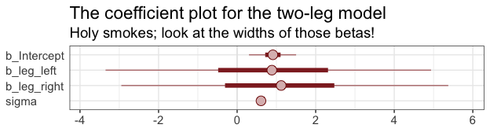

Note. You can use the `brms::stanplot()` function without explicitly loading the bayesplot package. But loading bayesplot allows you to set the color scheme with `color_scheme_set()`.

This is perhaps the simplest way to plot the bivariate posterior of our two predictor coefficients, Figure 5.8.a.

``` r
pairs(b5.8, pars = parnames(b5.8)[2:3])
```

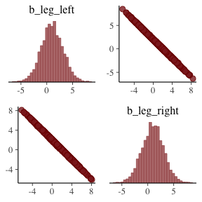

If you'd like a nicer and more focused attempt, you might have to revert to the `posterior_samples()` function and a little ggplot2 code.

``` r
post <- posterior_samples(b5.8)
  
post %>% 
  ggplot(aes(x = b_leg_left, y = b_leg_right)) +
  geom_point(color = "firebrick", alpha = 1/10, size = 1/3) +
  theme_bw() +
  theme(panel.grid = element_blank())
```


While we're at it, you can make a similar plot with the `mcmc_scatter()` [function](https://cran.r-project.org/web/packages/bayesplot/vignettes/plotting-mcmc-draws.html).

``` r
post %>% 
  mcmc_scatter(pars = c("b_leg_left", "b_leg_right"),
               size = 1/3, 
               alpha = 1/10) +
  theme_bw() +
  theme(panel.grid = element_blank())
```

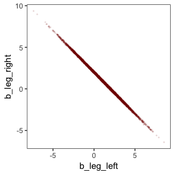

But wow, those coefficients look about as highly correlated as the predictors, just with the reversed sign.

``` r
post %>% 
  select(b_leg_left:b_leg_right) %>% 
  cor()
```

    ##             b_leg_left b_leg_right
    ## b_leg_left   1.0000000  -0.9994792
    ## b_leg_right -0.9994792   1.0000000

On pages 134--144, McElreath clarified that "from the computer's perspective, this likelihood is really:"

*y*<sub>*i*</sub> ∼ Normal(*μ*<sub>*i*</sub>, *σ*)

*μ*<sub>*i*</sub> = *α* + (*β*<sub>1</sub> + *β*<sub>2</sub>)*x*<sub>*i*</sub>

Accordingly, here's the posterior of the sum of the two regression coefficients, Figure 5.8.b. We'll use `tidybayes::geom_halfeyeh()` to both plot the density and mark off the posterior median and percentile-based 95% probability intervals at its base.

``` r
post %>% 
  ggplot(aes(x = b_leg_left + b_leg_right, y = 0)) +
  geom_halfeyeh(fill = "firebrick4", 
                point_interval = median_qi, .width = .95) +
  scale_y_continuous(NULL, breaks = NULL) +
  labs(title = "Sum the multicollinear coefficients",
       subtitle = "Marked by the median and 95% PIs") +
  theme_bw() +
  theme(panel.grid = element_blank())
```

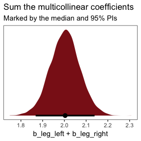

Now we fit the model after ditching one of the leg lengths.

``` r
b5.9 <- 
  brm(data = d, family = gaussian,
      height ~ 1 + leg_left,
      prior = c(prior(normal(10, 100), class = Intercept),
                prior(normal(2, 10), class = b),
                prior(uniform(0, 10), class = sigma)),
      iter = 2000, warmup = 500, chains = 4, cores = 4)
```

``` r
print(b5.9)
```

    ##  Family: gaussian 
    ##   Links: mu = identity; sigma = identity 
    ## Formula: height ~ 1 + leg_left 
    ##    Data: d (Number of observations: 100) 
    ## Samples: 4 chains, each with iter = 2000; warmup = 500; thin = 1;
    ##          total post-warmup samples = 6000
    ## 
    ## Population-Level Effects: 
    ##           Estimate Est.Error l-95% CI u-95% CI Eff.Sample Rhat
    ## Intercept     0.91      0.30     0.32     1.49       5086 1.00
    ## leg_left      2.00      0.07     1.87     2.14       5128 1.00
    ## 
    ## Family Specific Parameters: 
    ##       Estimate Est.Error l-95% CI u-95% CI Eff.Sample Rhat
    ## sigma     0.61      0.04     0.53     0.70       4445 1.00
    ## 
    ## Samples were drawn using sampling(NUTS). For each parameter, Eff.Sample 
    ## is a crude measure of effective sample size, and Rhat is the potential 
    ## scale reduction factor on split chains (at convergence, Rhat = 1).

That posterior *S**D* looks much better. Here's the density in Figure 5.8.b.

``` r
posterior_samples(b5.9) %>% 
  
  ggplot(aes(x = b_leg_left, y = 0)) +
  geom_halfeyeh(fill = "firebrick4", 
                point_interval = median_qi, .width = .95) +
  scale_y_continuous(NULL, breaks = NULL) +
  labs(title = "Just one coefficient needed",
       subtitle = "Marked by the median and 95% PIs") +
  theme_bw() +
  theme(panel.grid = element_blank())
```

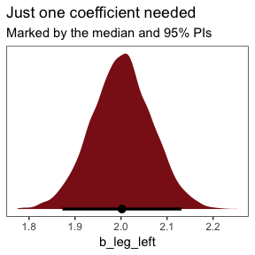

> *When two predictor variables are very strongly correlates, including both in a model may lead to confusion.* The posterior distribution isn’t wrong, in such a case. It’s telling you that the question you asked cannot be answered with these data. And that’s a great thing for a model to say, that it cannot answer your question. (p. 145, *emphasis* in the original)

### Multicollinear `milk`.

Multicollinearity arises in real data, too.

``` r
library(rethinking)
data(milk)
d <- milk
```

Unload rethinking and load brms.

``` r
rm(milk)
detach(package:rethinking, unload = TRUE)
library(brms)
```

We'll follow the text and fit the two univariable model, first. Note our use of `update()`.

``` r
# kcal.per.g regressed on perc.fat
b5.10 <- 
  brm(data = d, family = gaussian,
      kcal.per.g ~ 1 + perc.fat,
      prior = c(prior(normal(.6, 10), class = Intercept),
                prior(normal(0, 1), class = b),
                prior(uniform(0, 10), class = sigma)),
      iter = 2000, warmup = 500, chains = 4, cores = 4)

# kcal.per.g regressed on perc.lactose
b5.11 <- 
  update(b5.10,
         newdata = d,
         formula = kcal.per.g ~ 1 + perc.lactose)
```

``` r
posterior_summary(b5.10) %>% round(digits = 3)
```

    ##             Estimate Est.Error   Q2.5  Q97.5
    ## b_Intercept    0.301     0.039  0.224  0.380
    ## b_perc.fat     0.010     0.001  0.008  0.012
    ## sigma          0.080     0.012  0.061  0.107
    ## lp__          24.010     1.283 20.859 25.488

``` r
posterior_summary(b5.11) %>% round(digits = 3)
```

    ##                Estimate Est.Error   Q2.5  Q97.5
    ## b_Intercept       1.166     0.046  1.074  1.255
    ## b_perc.lactose   -0.011     0.001 -0.012 -0.009
    ## sigma             0.067     0.010  0.051  0.090
    ## lp__             28.788     1.276 25.532 30.279

If you'd like to get just the 95% intervals similar to the way McElreath reported them in the prose on page 146, you might use the handy `posterior_interval()` function.

``` r
posterior_interval(b5.10)[2, ] %>% round(digits = 3)
```

    ##  2.5% 97.5% 
    ## 0.008 0.012

``` r
posterior_interval(b5.11)[2, ] %>% round(digits = 3)
```

    ##   2.5%  97.5% 
    ## -0.012 -0.009

Now "watch what happens when we place both predictor varaibles in the same regression model" (p. 146)

``` r
b5.12 <- 
  update(b5.11,
         newdata = d,
         formula = kcal.per.g ~ 1 + perc.fat + perc.lactose)
```

``` r
posterior_summary(b5.12) %>% round(digits = 3)
```

    ##                Estimate Est.Error   Q2.5  Q97.5
    ## b_Intercept       1.014     0.223  0.590  1.466
    ## b_perc.fat        0.002     0.003 -0.004  0.007
    ## b_perc.lactose   -0.009     0.003 -0.014 -0.004
    ## sigma             0.068     0.010  0.051  0.091
    ## lp__             27.662     1.494 23.898 29.547

You can make custom pairs plots with [GGalley](https://cran.r-project.org/web/packages/GGally/index.html), which will also compute the point estimates for the bivariate correlations. Here's a default plot.

``` r
#install.packages("GGally", dependencies = T)
library(GGally)

ggpairs(data = d, columns = c(3:4, 6)) + 
  theme_bw()
```

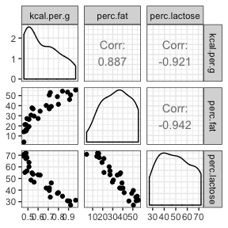

But you can customize [these](http://ggobi.github.io/ggally/), too. E.g.,

``` r
my_diag <- function(data, mapping, ...){
  ggplot(data = data, mapping = mapping) + 
    geom_density(fill = "firebrick4", size = 0)
}

my_lower <- function(data, mapping, ...){
  ggplot(data = data, mapping = mapping) + 
    geom_smooth(method = "lm", color = "firebrick4", size = 1/3, 
                fill = "firebrick", alpha = 1/5) +
    geom_point(color = "firebrick", alpha = .8, size = 1/4)
  }

# Then plug those custom functions into `ggpairs()`
ggpairs(data  = d, columns = c(3:4, 6),
        diag  = list(continuous = my_diag),
        lower = list(continuous = my_lower)) + 
  theme_bw() +
  theme(strip.background = element_rect(fill = "white"),
        axis.text        = element_blank(),
        axis.ticks       = element_blank(),
        panel.grid       = element_blank())
```

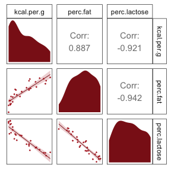

McElreath wrote "these two variables form essentially a single axis of variation" (p. 148). You can really see that on the lower two scatter plots. You'll note the `ggpairs()` plot also showed the correlations.

#### Overthinking: Simulating collinearity.

First we'll get the data and define the functions. You'll note I've defined my `sim_coll()` a little differently from `sim.coll()` in the text. I've omitted `rep.sim.coll()` as an independent function altogether, but computed similar summary information with the `summarise()` code at the bottom of the block.

``` r
sim_coll <- function(seed, rho){
  set.seed(seed)
  d <-
    d %>% 
    mutate(x = rnorm(n(), 
                     mean = perc.fat * rho,
                     sd   = sqrt((1 - rho^2) * var(perc.fat))))
    
  m <- lm(kcal.per.g ~ perc.fat + x, data = d)
  
  sqrt(diag(vcov(m)))[2]  # parameter SD
}

# how many simulations per `rho`-value would you like?
n_seed <- 100
# how many `rho`-values from 0 to .99 would you like to evaluate the process over?
n_rho  <- 30

d <-
  tibble(seed = 1:n_seed) %>% 
  expand(seed, rho = seq(from = 0, to = .99, length.out = n_rho)) %>% 
  mutate(parameter_sd = purrr::map2(seed, rho, sim_coll)) %>% 
  unnest() %>% 
  group_by(rho) %>% 
  # we'll `summarise()` our output by 95% percentile-baesd intervals in addition to the mean
  summarise(mean = mean(parameter_sd),
            ll   = quantile(parameter_sd, prob = .025),
            ul   = quantile(parameter_sd, prob = .975))
```

We've added 95% interval bands to our version of Figure 5.10.

``` r
d %>% 
  ggplot(aes(x = rho, y = mean)) +
  geom_line(color = "firebrick4") +
  geom_ribbon(aes(ymin = ll, ymax = ul),
              fill = "firebrick", alpha = 1/4) +
  labs(x = expression(rho),
       y = "parameter SD") +
  coord_cartesian(ylim = c(0, .0072)) +
  theme_bw() +
  theme(panel.grid = element_blank())
```

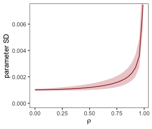

Did you notice we used the base R `lm()` function to fit the models? As McElreath rightly pointed out, `lm()` presumes flat priors. Proper Bayesian modeling could improve on that. But then we’d have to wait for a whole lot of HMC chains to run and until our personal computers or the algorithms we use to fit our Bayesian models become orders of magnitude faster, we just don’t have time for that.

### Post-treatment bias.

It helped me understand the next example by mapping out the sequence of events McElreath described in the second paragraph:

-   seed and sprout plants
-   measure heights
-   apply different antifungal soil treatments (i.e., the experimental manipulation)
-   measure (a) the heights and (b) the presence of fungus

Based on the design, let's simulate our data.

``` r
N <- 100

set.seed(17)
d <- 
  tibble(h0        = rnorm(N, mean = 10, sd = 2), 
         treatment = rep(0:1, each = N / 2),
         fungus    = rbinom(N, size = 1, prob = .5 - treatment * 0.4),
         h1        = h0 + rnorm(N, mean = 5 - 3 * fungus, sd = 1))
```

We'll use `head()` to peek at the data.

``` r
d %>%
  head()
```

    ## # A tibble: 6 x 4
    ##      h0 treatment fungus    h1
    ##   <dbl>     <int>  <int> <dbl>
    ## 1  7.97         0      1  12.9
    ## 2  9.84         0      1  11.9
    ## 3  9.53         0      0  15.8
    ## 4  8.37         0      1  11.1
    ## 5 11.5          0      1  13.1
    ## 6  9.67         0      0  15.7

These data + the model were rough on Stan, at first, which spat out warnings about divergent transitions. The model ran fine after setting `warmup = 1000` and `adapt_delta = .99`.

``` r
b5.13 <- 
  brm(data = d, family = gaussian,
      h1 ~ 1 + h0 + treatment + fungus,
      prior = c(prior(normal(0, 100), class = Intercept),
                prior(normal(0, 10), class = b),
                prior(uniform(0, 10), class = sigma)),
      iter = 2000, warmup = 1000, chains = 4, cores = 4,
      control = list(adapt_delta = 0.99))
```

``` r
print(b5.13)
```

    ##  Family: gaussian 
    ##   Links: mu = identity; sigma = identity 
    ## Formula: h1 ~ 1 + h0 + treatment + fungus 
    ##    Data: d (Number of observations: 100) 
    ## Samples: 4 chains, each with iter = 2000; warmup = 1000; thin = 1;
    ##          total post-warmup samples = 4000
    ## 
    ## Population-Level Effects: 
    ##           Estimate Est.Error l-95% CI u-95% CI Eff.Sample Rhat
    ## Intercept     5.27      0.55     4.21     6.33       2512 1.00
    ## h0            0.96      0.05     0.85     1.06       2381 1.00
    ## treatment     0.22      0.24    -0.26     0.70       2187 1.00
    ## fungus       -3.02      0.26    -3.53    -2.51       2808 1.00
    ## 
    ## Family Specific Parameters: 
    ##       Estimate Est.Error l-95% CI u-95% CI Eff.Sample Rhat
    ## sigma     1.08      0.08     0.94     1.24       4000 1.00
    ## 
    ## Samples were drawn using sampling(NUTS). For each parameter, Eff.Sample 
    ## is a crude measure of effective sample size, and Rhat is the potential 
    ## scale reduction factor on split chains (at convergence, Rhat = 1).

Now fit the model after excluding `fungus`, our post-treatment variable.

``` r
b5.14 <- 
  update(b5.13, 
         formula = h1 ~ 1 + h0 + treatment)
```

``` r
print(b5.14)
```

    ##  Family: gaussian 
    ##   Links: mu = identity; sigma = identity 
    ## Formula: h1 ~ h0 + treatment 
    ##    Data: d (Number of observations: 100) 
    ## Samples: 4 chains, each with iter = 2000; warmup = 1000; thin = 1;
    ##          total post-warmup samples = 4000
    ## 
    ## Population-Level Effects: 
    ##           Estimate Est.Error l-95% CI u-95% CI Eff.Sample Rhat
    ## Intercept     4.43      0.82     2.81     6.02       1928 1.00
    ## h0            0.90      0.08     0.75     1.06       1919 1.00
    ## treatment     1.26      0.32     0.60     1.86        909 1.00
    ## 
    ## Family Specific Parameters: 
    ##       Estimate Est.Error l-95% CI u-95% CI Eff.Sample Rhat
    ## sigma     1.67      0.12     1.44     1.93       3179 1.00
    ## 
    ## Samples were drawn using sampling(NUTS). For each parameter, Eff.Sample 
    ## is a crude measure of effective sample size, and Rhat is the potential 
    ## scale reduction factor on split chains (at convergence, Rhat = 1).

"Now the impact of treatment is strong and positive, as it should be" (p. 152). In this case, there were really two outcomes. The first was the one we modeled, the height at the end of the experiment (i.e., `h1`). The second outcome, which was clearly related to `h1`, was the presence of fungus, captured by our binomial variable `fungus`. If you wanted to model that, you'd fit a logistic regression model, which we'll learn about in a few chapters.

5.4. Categorical varaibles
--------------------------

> Many readers will already know that variables like this, routinely called *factors*, can easily be included in linear models. But what is not widely understood is how these variables are included in a model... Knowing how the machine works removes a lot of this difficulty. (p. 153, *emphasis* in the original)

### Binary categories.

Reload the `Howell1` data.

``` r
library(rethinking)
data(Howell1)
d <- Howell1
```

Unload rethinking and load brms.

``` r
rm(Howell1)
detach(package:rethinking, unload = T)
library(brms)
```

Just in case you forgot what these data were like:

``` r
d %>%
  glimpse()
```

    ## Observations: 544
    ## Variables: 4
    ## $ height <dbl> 151.7650, 139.7000, 136.5250, 156.8450, 145.4150, 163.8...
    ## $ weight <dbl> 47.82561, 36.48581, 31.86484, 53.04191, 41.27687, 62.99...
    ## $ age    <dbl> 63.0, 63.0, 65.0, 41.0, 51.0, 35.0, 32.0, 27.0, 19.0, 5...
    ## $ male   <int> 1, 0, 0, 1, 0, 1, 0, 1, 0, 1, 0, 1, 0, 0, 0, 1, 1, 0, 1...

Let's fit the first `height` model with the `male` dummy.

Note. The uniform prior McElreath used in the text in conjunction with his `map()` function seemed to cause problems for the HMC chains, here. After experimenting with start values, increasing `warmup`, and increasing `adapt_delta`, switching out the uniform prior did the trick. Anticipating chapter 8, I recommend you use a weakly-regularizing half Cauchy for *σ*.

``` r
b5.15 <- 
  brm(data = d, family = gaussian,
      height ~ 1 + male,
      prior = c(prior(normal(178, 100), class = Intercept),
                prior(normal(0, 10), class = b),
                prior(cauchy(0, 2), class = sigma)),
      iter = 2000, warmup = 500, chains = 4, cores = 4)
```

``` r
print(b5.15)
```

    ##  Family: gaussian 
    ##   Links: mu = identity; sigma = identity 
    ## Formula: height ~ 1 + male 
    ##    Data: d (Number of observations: 544) 
    ## Samples: 4 chains, each with iter = 2000; warmup = 500; thin = 1;
    ##          total post-warmup samples = 6000
    ## 
    ## Population-Level Effects: 
    ##           Estimate Est.Error l-95% CI u-95% CI Eff.Sample Rhat
    ## Intercept   134.81      1.57   131.70   137.86       5310 1.00
    ## male          7.36      2.28     2.90    11.79       4664 1.00
    ## 
    ## Family Specific Parameters: 
    ##       Estimate Est.Error l-95% CI u-95% CI Eff.Sample Rhat
    ## sigma    27.35      0.84    25.74    29.07       5558 1.00
    ## 
    ## Samples were drawn using sampling(NUTS). For each parameter, Eff.Sample 
    ## is a crude measure of effective sample size, and Rhat is the potential 
    ## scale reduction factor on split chains (at convergence, Rhat = 1).

Our samples from the posterior are already in the HMC iterations. All we need to do is put them in a data frame and then put them to work.

``` r
post <- posterior_samples(b5.15)

post %>%
  transmute(male_height = b_Intercept + b_male) %>% 
  mean_qi(.width = .89)
```

    ##   male_height   .lower   .upper .width .point .interval
    ## 1    142.1652 139.4978 144.8729   0.89   mean        qi

You can also do this with `fitted()`.

``` r
nd <- tibble(male = 1)

fitted(b5.15,
       newdata = nd)
```

    ##      Estimate Est.Error     Q2.5    Q97.5
    ## [1,] 142.1652  1.690498 138.9379 145.5221

And you could even plot.

``` r
fitted(b5.15,
       newdata = nd,
       summary = F) %>% 
  as_tibble() %>% 
  
  ggplot(aes(x = V1, y = 0)) +
    geom_halfeyeh(fill = "firebrick4", 
                point_interval = median_qi, .width = .95) +
  scale_y_continuous(NULL, breaks = NULL) +
  labs(subtitle = "Model-implied male heights",
       x = expression(alpha + beta["male"])) +
  theme_bw() +
  theme(panel.grid = element_blank())
```

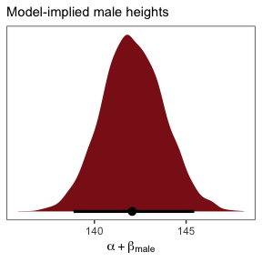

##### Overthinking: Re-parameterizing the model.

The reparameterized model follows the form

*h*<sub>*i*</sub> ∼ Normal(*μ*<sub>*i*</sub>, *σ*)

*μ*<sub>*i*</sub> = *α*<sub>*f**e**m**a**l**e*</sub>(1 − *m**a**l**e*<sub>*i*</sub>)+*α*<sub>*m**a**l**e*</sub>*m**a**l**e*<sub>*i*</sub>

So then a `female` dummy would satisfy the condition *f**e**m**a**l**e*<sub>*i*</sub> = (1 − *m**a**l**e*<sub>*i*</sub>). Let's make that dummy.

``` r
d <-
  d %>%
  mutate(female = 1 - male)
```

Everyone has their own idiosyncratic way of coding. One of my quirks is I always explicitly specify a model’s intercept following the form `y ~ 1 + x`, where `y` is the criterion, `x` stands for the predictors, and `1` is the intercept. You don’t have to do this, of course. You could just code `y ~ x` to get the same results. The `brm()` function assumes you want that intercept. One of the reasons I like the verbose version is it reminds me to think about the intercept and to include it in my priors. Another nice feature is that is helps me make sense of the code for this model: `height ~ 0 + male + female`. When we replace `… ~ 1 + …` with `… ~ 0 + …`, we tell `brm()` to remove the intercept. Removing the intercept allows us to include ALL levels of a given categorical variable in our model. In this case, we’ve expressed sex as two dummies, `female` and `male`. Taking out the intercept lets us put both dummies into the formula.

``` r
b5.15b <- 
  brm(data = d, family = gaussian,
      height ~ 0 + male + female,
      prior = c(prior(normal(178, 100), class = b),
                prior(cauchy(0, 2), class = sigma)),
      iter = 2000, warmup = 500, chains = 4, cores = 4)
```

``` r
print(b5.15b)
```

    ##  Family: gaussian 
    ##   Links: mu = identity; sigma = identity 
    ## Formula: height ~ 0 + male + female 
    ##    Data: d (Number of observations: 544) 
    ## Samples: 4 chains, each with iter = 2000; warmup = 500; thin = 1;
    ##          total post-warmup samples = 6000
    ## 
    ## Population-Level Effects: 
    ##        Estimate Est.Error l-95% CI u-95% CI Eff.Sample Rhat
    ## male     142.30      1.70   138.90   145.65       6000 1.00
    ## female   134.64      1.62   131.37   137.84       5205 1.00
    ## 
    ## Family Specific Parameters: 
    ##       Estimate Est.Error l-95% CI u-95% CI Eff.Sample Rhat
    ## sigma    27.37      0.84    25.82    29.13       5435 1.00
    ## 
    ## Samples were drawn using sampling(NUTS). For each parameter, Eff.Sample 
    ## is a crude measure of effective sample size, and Rhat is the potential 
    ## scale reduction factor on split chains (at convergence, Rhat = 1).

If we wanted the formal difference score from such a model, we'd subtract.

``` r
posterior_samples(b5.15b) %>% 
  transmute(dif = b_male - b_female) %>% 
  
  ggplot(aes(x = dif, y = 0)) +
    geom_halfeyeh(fill = "firebrick4", 
                point_interval = median_qi, .width = .95) +
  scale_y_continuous(NULL, breaks = NULL) +
  labs(subtitle = "Model-implied difference score",
       x = expression(alpha["male"] - alpha["female"])) +
  theme_bw() +
  theme(panel.grid = element_blank())
```

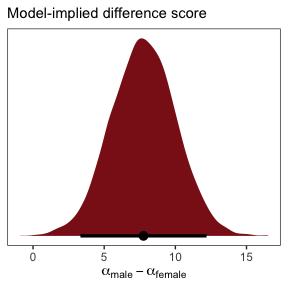

Many categories.
----------------

> When there are more than two categories, you'll need more than one dummy variable. Here's the general rule: To include *k* categories in a linear model, you require *k* − 1 dummy variables. Each dummy variable indicates, with the value 1, a unique category. The category with no dummy variable assigned to it ends up again as the "intercept" category. (p. 155)

We'll practice with `milk`.

``` r
library(rethinking)
data(milk)
d <- milk
```

Unload rethinking and load brms.

``` r
rm(milk)
detach(package:rethinking, unload = T)
library(brms)
```

With the tidyverse, we can peek at `clade` with `distinct()` in the place of base R `unique()`.

``` r
d %>%
  distinct(clade)
```

    ##              clade
    ## 1    Strepsirrhine
    ## 2 New World Monkey
    ## 3 Old World Monkey
    ## 4              Ape

As `clade` has 4 categories, let's convert these to 4 dummy variables.

``` r
d <- 
  d %>%
  mutate(clade_nwm = ifelse(clade == "New World Monkey", 1, 0),
         clade_owm = ifelse(clade == "Old World Monkey", 1, 0),
         clade_s   = ifelse(clade == "Strepsirrhine", 1, 0),
         clade_ape = ifelse(clade == "Ape", 1, 0))
```

Now we'll fit the model with three of the four dummies. In this model, `clade_ape` is the reference category captured by the intercept.

``` r
b5.16 <- 
  brm(data = d, family = gaussian,
      kcal.per.g ~ 1 + clade_nwm + clade_owm + clade_s,
      prior = c(prior(normal(.6, 10), class = Intercept),
                prior(normal(0, 1), class = b),
                prior(uniform(0, 10), class = sigma)),
      iter = 2000, warmup = 500, chains = 4, cores = 4,
      control = list(adapt_delta = 0.8))
```

``` r
print(b5.16)
```

    ##  Family: gaussian 
    ##   Links: mu = identity; sigma = identity 
    ## Formula: kcal.per.g ~ 1 + clade_nwm + clade_owm + clade_s 
    ##    Data: d (Number of observations: 29) 
    ## Samples: 4 chains, each with iter = 2000; warmup = 500; thin = 1;
    ##          total post-warmup samples = 6000
    ## 
    ## Population-Level Effects: 
    ##           Estimate Est.Error l-95% CI u-95% CI Eff.Sample Rhat
    ## Intercept     0.55      0.04     0.46     0.63       4916 1.00
    ## clade_nwm     0.17      0.06     0.05     0.29       4915 1.00
    ## clade_owm     0.24      0.07     0.10     0.37       5344 1.00
    ## clade_s      -0.04      0.07    -0.18     0.11       5322 1.00
    ## 
    ## Family Specific Parameters: 
    ##       Estimate Est.Error l-95% CI u-95% CI Eff.Sample Rhat
    ## sigma     0.13      0.02     0.10     0.17       4440 1.00
    ## 
    ## Samples were drawn using sampling(NUTS). For each parameter, Eff.Sample 
    ## is a crude measure of effective sample size, and Rhat is the potential 
    ## scale reduction factor on split chains (at convergence, Rhat = 1).

Here we grab the chains, our draws from the posterior.

``` r
post <- 
  b5.16 %>%
  posterior_samples()

head(post)
```

    ##   b_Intercept b_clade_nwm b_clade_owm   b_clade_s     sigma      lp__
    ## 1   0.5937795   0.1013269   0.1712427 -0.08262592 0.1166646 10.221861
    ## 2   0.5882722   0.1023390   0.1987556 -0.15483666 0.1105402  9.122390
    ## 3   0.6131270   0.1116169   0.2007657 -0.21170402 0.1126983  7.133050
    ## 4   0.5750706   0.1341656   0.2292433 -0.14151198 0.1245338  9.892301
    ## 5   0.4638025   0.2902202   0.3395602  0.13250770 0.1355269  7.452095
    ## 6   0.4230892   0.2732296   0.4192274  0.01302657 0.1599471  5.292674

You might compute averages for each category and summarizing the results with the transpose of base R's `apply()` function, rounding to two digits of precision.

``` r
post$mu_ape <- post$b_Intercept
post$mu_nwm <- post$b_Intercept + post$b_clade_nwm
post$mu_owm <- post$b_Intercept + post$b_clade_owm
post$mu_s   <- post$b_Intercept + post$b_clade_s

round(t(apply(post[ ,7:10], 2, quantile, c(.5, .025, .975))), digits = 2)
```

    ##         50% 2.5% 97.5%
    ## mu_ape 0.55 0.46  0.63
    ## mu_nwm 0.71 0.63  0.80
    ## mu_owm 0.79 0.68  0.89
    ## mu_s   0.51 0.40  0.62

Here's a more tidyverse sort of way to get the same thing.

``` r
post %>%
  transmute(mu_ape = b_Intercept,
            mu_nwm = b_Intercept + b_clade_nwm,
            mu_owm = b_Intercept + b_clade_owm,
            mu_s   = b_Intercept + b_clade_s) %>%
  gather() %>%
  group_by(key) %>%
  median_qi() %>% 
  mutate_if(is.double, round, digits = 2)
```

    ## # A tibble: 4 x 7
    ##   key    value .lower .upper .width .point .interval
    ##   <chr>  <dbl>  <dbl>  <dbl>  <dbl> <chr>  <chr>    
    ## 1 mu_ape  0.55   0.46   0.63   0.95 median qi       
    ## 2 mu_nwm  0.71   0.63   0.8    0.95 median qi       
    ## 3 mu_owm  0.79   0.68   0.89   0.95 median qi       
    ## 4 mu_s    0.51   0.4    0.62   0.95 median qi

You could also use `fitted()`.

``` r
nd <- tibble(clade_nwm = c(1, 0, 0, 0),
             clade_owm = c(0, 1, 0, 0),
             clade_s   = c(0, 0, 1, 0),
             primate = c("New World Monkey", "Old World Monkey", "Strepsirrhine", "Ape"))

fitted(b5.16,
       newdata = nd,
       summary = F) %>% 
  as_tibble() %>% 
  gather() %>% 
  mutate(primate = rep(c("New World Monkey", "Old World Monkey", "Strepsirrhine", "Ape"), each = n() / 4)) %>% 
  
  ggplot(aes(x = value, y = reorder(primate, value))) +
  geom_halfeyeh(fill = "firebrick4", 
                point_interval = median_qi, .width = .95) +
  labs(x = "kcal.per.g",
       y = NULL) +
  theme_bw() +
  theme(panel.grid   = element_blank(),
        axis.ticks.y = element_blank(),
        axis.text.y  = element_text(hjust = 0))
```

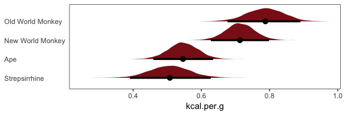

Getting summary statistics for the difference between `NWM` and `OWM`:

``` r
# base R
quantile(post$mu_nwm - post$mu_owm, probs = c(.5, .025, .975))
```

    ##         50%        2.5%       97.5% 
    ## -0.07356054 -0.20363902  0.06024504

``` r
# tidyverse + tidybayes
post %>%
  transmute(dif = mu_nwm - mu_owm) %>%
  median_qi(dif)
```

    ##           dif    .lower     .upper .width .point .interval
    ## 1 -0.07356054 -0.203639 0.06024504   0.95 median        qi

### Adding regular predictor variables.

If we wanted to fit the model including `perc.fat` as an additional predictor,

*μ*<sub>*i*</sub> = *α* + *β*<sub>clade\_nwm</sub>clade\_nwm<sub>*i*</sub> + *β*<sub>clade\_owm</sub>clade\_owm<sub>*i*</sub> + *β*<sub>clade\_s</sub>clade\_s<sub>*i*</sub> + *β*<sub>perc.fat</sub>perc.fat<sub>*i*</sub>

the `formula` code would be `kcal.per.g ~ 1 + clade_nwm + clade_owm + clade_s + perc.fat`

### Another approach: Unique intercepts.

Using the code below, there's no need to transform `d$clade` into `d$clade_id`. The advantage of this approach is the indices in the model summary are more descriptive than `a[1]` through `a[4]`.

``` r
b5.16_alt <- 
  brm(data = d, family = gaussian,
      kcal.per.g ~ 0 + clade,
      prior = c(prior(normal(.6, 10), class = b),
                prior(uniform(0, 10), class = sigma)),
      iter = 2000, warmup = 500, chains = 4, cores = 4)
```

``` r
print(b5.16_alt)
```

    ##  Family: gaussian 
    ##   Links: mu = identity; sigma = identity 
    ## Formula: kcal.per.g ~ 0 + clade 
    ##    Data: d (Number of observations: 29) 
    ## Samples: 4 chains, each with iter = 2000; warmup = 500; thin = 1;
    ##          total post-warmup samples = 6000
    ## 
    ## Population-Level Effects: 
    ##                     Estimate Est.Error l-95% CI u-95% CI Eff.Sample Rhat
    ## cladeApe                0.54      0.04     0.46     0.63       6000 1.00
    ## cladeNewWorldMonkey     0.71      0.04     0.63     0.80       6000 1.00
    ## cladeOldWorldMonkey     0.79      0.05     0.69     0.89       6000 1.00
    ## cladeStrepsirrhine      0.51      0.06     0.39     0.63       6000 1.00
    ## 
    ## Family Specific Parameters: 
    ##       Estimate Est.Error l-95% CI u-95% CI Eff.Sample Rhat
    ## sigma     0.13      0.02     0.10     0.17       6000 1.00
    ## 
    ## Samples were drawn using sampling(NUTS). For each parameter, Eff.Sample 
    ## is a crude measure of effective sample size, and Rhat is the potential 
    ## scale reduction factor on split chains (at convergence, Rhat = 1).

See? This is much easier than trying to remember which one was which in an arbitrary numeric index.

~~Ordinary least squares and `lm()`~~
-------------------------------------

Since this section centers on the frequentist `lm()` function, I'm going to largely ignore it. A couple things, though. You'll note how the brms package uses the `lm()`-like design formula syntax. Although not as pedagogical as the more formal rethinking syntax, it has the advantage of cohering with the popular [lme4](https://cran.r-project.org/web/packages/lme4/index.html) syntax for multilevel models.

Also, on page 161 McElreath clarified that one cannot use the `I()` syntax with his rethinking package. Not so with brms. The `I()` syntax works just fine with `brms::brm()`.

Reference
---------

[McElreath, R. (2016). *Statistical rethinking: A Bayesian course with examples in R and Stan.* Chapman & Hall/CRC Press.](https://xcelab.net/rm/statistical-rethinking/)

Session info
------------

``` r
sessionInfo()
```

    ## R version 3.5.1 (2018-07-02)
    ## Platform: x86_64-apple-darwin15.6.0 (64-bit)
    ## Running under: macOS High Sierra 10.13.4
    ## 
    ## Matrix products: default
    ## BLAS: /Library/Frameworks/R.framework/Versions/3.5/Resources/lib/libRblas.0.dylib
    ## LAPACK: /Library/Frameworks/R.framework/Versions/3.5/Resources/lib/libRlapack.dylib
    ## 
    ## locale:
    ## [1] en_US.UTF-8/en_US.UTF-8/en_US.UTF-8/C/en_US.UTF-8/en_US.UTF-8
    ## 
    ## attached base packages:
    ## [1] parallel  stats     graphics  grDevices utils     datasets  methods  
    ## [8] base     
    ## 
    ## other attached packages:
    ##  [1] GGally_1.4.0       tidybayes_1.0.1    bayesplot_1.6.0   
    ##  [4] fiftystater_1.0.1  bindrcpp_0.2.2     ggrepel_0.8.0     
    ##  [7] forcats_0.3.0      stringr_1.3.1      dplyr_0.7.6       
    ## [10] purrr_0.2.5        readr_1.1.1        tidyr_0.8.1       
    ## [13] tibble_1.4.2       tidyverse_1.2.1    brms_2.4.0        
    ## [16] Rcpp_0.12.18       rstan_2.17.3       StanHeaders_2.17.2
    ## [19] ggplot2_3.0.0     
    ## 
    ## loaded via a namespace (and not attached):
    ##  [1] colorspace_1.3-2          ggridges_0.5.0           
    ##  [3] rsconnect_0.8.8           rprojroot_1.3-2          
    ##  [5] ggstance_0.3              markdown_0.8             
    ##  [7] base64enc_0.1-3           rstudioapi_0.7           
    ##  [9] svUnit_0.7-12             DT_0.4                   
    ## [11] mvtnorm_1.0-8             lubridate_1.7.4          
    ## [13] xml2_1.2.0                bridgesampling_0.4-0     
    ## [15] mnormt_1.5-5              knitr_1.20               
    ## [17] shinythemes_1.1.1         jsonlite_1.5             
    ## [19] LaplacesDemon_16.1.1      broom_0.4.5              
    ## [21] shiny_1.1.0               mapproj_1.2.6            
    ## [23] compiler_3.5.1            httr_1.3.1               
    ## [25] backports_1.1.2           assertthat_0.2.0         
    ## [27] Matrix_1.2-14             lazyeval_0.2.1           
    ## [29] cli_1.0.0                 later_0.7.3              
    ## [31] htmltools_0.3.6           tools_3.5.1              
    ## [33] igraph_1.2.1              coda_0.19-1              
    ## [35] gtable_0.2.0              glue_1.2.0               
    ## [37] reshape2_1.4.3            maps_3.3.0               
    ## [39] cellranger_1.1.0          nlme_3.1-137             
    ## [41] crosstalk_1.0.0           psych_1.8.4              
    ## [43] rvest_0.3.2               mime_0.5                 
    ## [45] miniUI_0.1.1.1            gtools_3.8.1             
    ## [47] MASS_7.3-50               zoo_1.8-2                
    ## [49] scales_0.5.0              colourpicker_1.0         
    ## [51] hms_0.4.2                 promises_1.0.1           
    ## [53] Brobdingnag_1.2-5         inline_0.3.15            
    ## [55] RColorBrewer_1.1-2        shinystan_2.5.0          
    ## [57] yaml_2.1.19               gridExtra_2.3            
    ## [59] loo_2.0.0                 reshape_0.8.7            
    ## [61] stringi_1.2.3             highr_0.7                
    ## [63] dygraphs_1.1.1.5          rlang_0.2.1              
    ## [65] pkgconfig_2.0.1           matrixStats_0.54.0       
    ## [67] HDInterval_0.2.0          evaluate_0.10.1          
    ## [69] lattice_0.20-35           bindr_0.1.1              
    ## [71] rstantools_1.5.0          htmlwidgets_1.2          
    ## [73] labeling_0.3              tidyselect_0.2.4         
    ## [75] plyr_1.8.4                magrittr_1.5             
    ## [77] R6_2.2.2                  pillar_1.2.3             
    ## [79] haven_1.1.2               foreign_0.8-70           
    ## [81] withr_2.1.2               xts_0.10-2               
    ## [83] abind_1.4-5               modelr_0.1.2             
    ## [85] crayon_1.3.4              arrayhelpers_1.0-20160527
    ## [87] utf8_1.1.4                rmarkdown_1.10           
    ## [89] grid_3.5.1                readxl_1.1.0             
    ## [91] threejs_0.3.1             digest_0.6.15            
    ## [93] xtable_1.8-2              httpuv_1.4.4.2           
    ## [95] stats4_3.5.1              munsell_0.5.0            
    ## [97] shinyjs_1.0
