Ch. 7 Interactions
================
A Solomon Kurz
2018-08-25

Interactions
============

> Every model so far in \[McElreath’s text\] has assumed that each predictor has an independent association with the mean of the outcome. What if we want to allow the association to be conditional?... To model deeper conditionality—where the importance of one predictor depends upon another predictor—we need interaction. Interaction is a kind of conditioning, a way of allowing parameters (really their posterior distributions) to be conditional on further aspects of the data. (p. 210)

Building an interaction.
------------------------

"Africa is special" (p. 211). Let's load the `rugged` data to see one of the reasons why.

``` r
library(rethinking)
data(rugged)
d <- rugged
```

And here we switch out rethinking for brms.

``` r
detach(package:rethinking, unload = T)
library(brms)
rm(rugged)
```

We'll continue to use tidyverse-style syntax to wrangle the data.

``` r
library(tidyverse)

# make the log version of criterion
d <- 
  d %>%
  mutate(log_gdp = log(rgdppc_2000))

# extract countries with GDP data
dd <-
  d %>%
  filter(complete.cases(rgdppc_2000))

# split countries into Africa and not-Africa
d.A1 <-
  dd %>%
  filter(cont_africa == 1)

d.A0 <-
  dd %>%
  filter(cont_africa == 0)
```

The first two models predicting `log_gdp` are univariable.

``` r
b7.1 <-
  brm(data = d.A1, family = gaussian,
      log_gdp ~ 1 + rugged,
      prior = c(prior(normal(8, 100), class = Intercept),
                prior(normal(0, 1), class = b),
                prior(uniform(0, 10), class = sigma)),
      iter = 2000, warmup = 1000, chains = 4, cores = 4)

b7.2 <-
  update(b7.1, 
         newdata = d.A0)
```

In the text, McElreath more or less dared us to figure out how to make Figure 7.2. Here's the brms-relevant data wrangling

``` r
nd <- 
  tibble(rugged = seq(from = 0, to = 6.3, length.out = 30))

fitd_b7.1 <-
  fitted(b7.1, newdata = nd) %>%
  as_tibble() %>%
  bind_cols(nd)

fitd_b7.2 <-
  fitted(b7.2, newdata = nd) %>%
  as_tibble() %>%
  bind_cols(nd)

# Here we'll put both in a single data object, with `fitd_b7.1` stacked atop `fitd_b7.2`
fitd_both <-
  full_join(fitd_b7.1, fitd_b7.2) %>%
  mutate(cont_africa = rep(c("Africa", "not Africa"), each = 30))
```

For this chapter, we'll take our plot theme from the [ggthemes package](https://cran.r-project.org/web/packages/ggthemes/index.html), which you can learn more about [here](https://cran.r-project.org/web/packages/ggthemes/vignettes/ggthemes.html).

``` r
# install.packages("ggthemes", dependencies = T)
library(ggthemes)
```

Here's the plot code for our version of Figure 7.2.

``` r
dd %>%
  mutate(cont_africa = ifelse(cont_africa == 1, "Africa", "not Africa")) %>%
  
  ggplot(aes(x = rugged)) +
  geom_ribbon(data = fitd_both,
              aes(ymin = Q2.5, 
                  ymax = Q97.5,
                  fill = cont_africa),
              alpha = 1/4) +
  geom_line(data = fitd_both,
              aes(y = Estimate, 
                  color = cont_africa)) +
  geom_point(aes(y = log_gdp, color = cont_africa),
             size = 2/3) +
  scale_colour_pander() +
  scale_fill_pander() +
  scale_x_continuous("Terrain Ruggedness Index", expand = c(0, 0)) +
  ylab("log GDP from year 2000") +
  theme_pander() + 
  theme(text = element_text(family = "Times"),
        legend.position = "none") +
  facet_wrap(~cont_africa)
```

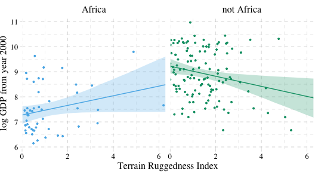

### Adding a dummy variable doesn't work.

Here's our model with all the countries, but without the `cont_africa` dummy.

``` r
b7.3 <-
  update(b7.1, 
         newdata = dd)
```

Now we'll add the dummy.

``` r
b7.4 <-
  update(b7.3, 
         newdata = dd,
         formula = log_gdp ~ 1 + rugged + cont_africa)
```

And here we can compare the two models with information criteria.

``` r
waic(b7.3, b7.4)
```

    ##               WAIC    SE
    ## b7.3        539.39 12.90
    ## b7.4        475.96 14.82
    ## b7.3 - b7.4  63.43 14.56

``` r
loo(b7.3, b7.4)
```

    ##              LOOIC    SE
    ## b7.3        539.41 12.90
    ## b7.4        475.99 14.83
    ## b7.3 - b7.4  63.42 14.56

Happily, the WAIC and the LOO are in agreement. The model with the dummy, `b7.4`, fit the data much better. Here are the WAIC model weights.

``` r
model_weights(b7.3, b7.4,
              weights = "waic") %>% 
  round(digits = 3)
```

    ## b7.3 b7.4 
    ##    0    1

As in the text, almost all the weight goes to the multivariable model, `b7.4`. Before we can plot that model, we need to wrangle a bit.

``` r
nd <- 
  tibble(rugged      = seq(from = 0, to = 6.3, length.out = 30) %>% 
           rep(., times = 2),
         cont_africa = rep(0:1, each = 30))

fitd_b7.4 <-
  fitted(b7.4, newdata = nd) %>%
  as_tibble() %>%
  bind_cols(nd) %>%
  mutate(cont_africa = ifelse(cont_africa == 1, "Africa", "not Africa"))
```

Behold our Figure 7.3.

``` r
dd %>%
  mutate(cont_africa = ifelse(cont_africa == 1, "Africa", "not Africa")) %>%
  
ggplot(aes(x = rugged)) +
  geom_ribbon(data = fitd_b7.4,
              aes(ymin  = Q2.5, 
                  ymax  = Q97.5,
                  fill  = cont_africa,
                  group = cont_africa),
              alpha = 1/4) +
  geom_line(data = fitd_b7.4,
              aes(y     = Estimate, 
                  color = cont_africa,
                  group = cont_africa)) +
  geom_point(aes(y = log_gdp, color = cont_africa),
             size = 2/3) +
  scale_colour_pander() +
  scale_fill_pander() +
  scale_x_continuous("Terrain Ruggedness Index", expand = c(0, 0)) +
  ylab("log GDP from year 2000") +
  theme_pander() + 
  theme(text = element_text(family = "Times"),
        legend.position  = c(.69, .94),
        legend.title     = element_blank(),
        legend.direction = "horizontal")
```

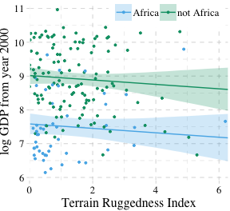

### Adding a linear interaction does work.

Yes, it sure does. But before we fit, here's the equation:

log\_gdp<sub>*i*</sub> = Normal(*μ*<sub>*i*</sub>, *σ*)

*μ*<sub>*i*</sub> = *α* + *γ*<sub>*i*</sub>rugged<sub>*i*</sub> + *β*<sub>2</sub>cont\_africa<sub>*i*</sub>

*γ*<sub>*i*</sub> = *β*<sub>1</sub> + *β*<sub>3</sub>cont\_africa<sub>*i*</sub>

Fit the model.

``` r
b7.5 <-
  update(b7.4,
         formula = log_gdp ~ 1 + rugged*cont_africa)
```

For kicks, we'll just use the LOO to compare the last three models.

``` r
loo(b7.3, b7.4, b7.5,
    cores = 4)  # We can speed things up using the `cores` argument
```

    ##              LOOIC    SE
    ## b7.3        539.41 12.90
    ## b7.4        475.99 14.83
    ## b7.5        469.67 14.55
    ## b7.3 - b7.4  63.42 14.56
    ## b7.3 - b7.5  69.73 14.62
    ## b7.4 - b7.5   6.32  5.84

And we can weigh the models based on the LOO rather than the WAIC, too.

``` r
model_weights(b7.3, b7.4, b7.5,
              weights = "loo") %>% 
  round(digits = 3)
```

    ##  b7.3  b7.4  b7.5 
    ## 0.000 0.041 0.959

##### Overthinking: Conventional form of interaction.

The conventional equation for the interaction model might look like:

log\_gdp<sub>*i*</sub> = Normal(*μ*<sub>*i*</sub>, *σ*)

*μ*<sub>*i*</sub> = *α* + *β*<sub>1</sub>rugged<sub>*i*</sub> + *β*<sub>2</sub>cont\_africa<sub>*i*</sub> + *β*<sub>2</sub>rugged<sub>*i*</sub> × cont\_africa<sub>*i*</sub>

Instead of the `y ~ 1 + x1*x2` approach, which will work fine with `brm()`, you can use this more explicit syntax.

``` r
b7.5b <-
  update(b7.5,
         formula = log_gdp ~ 1 + rugged + cont_africa + rugged:cont_africa)
```

From here on, I will default to this style of syntax for interactions.

Since this is the same model, it yields the same information criteria estimates within simulation error.

``` r
waic(b7.5, b7.5b)
```

    ##                WAIC    SE
    ## b7.5         469.52 14.53
    ## b7.5b        469.47 14.52
    ## b7.5 - b7.5b   0.06  0.06

``` r
loo(b7.5, b7.5b)
```

    ##               LOOIC    SE
    ## b7.5         469.67 14.55
    ## b7.5b        469.62 14.54
    ## b7.5 - b7.5b   0.06  0.07

### Plotting the interaction.

Here's our prep work for the figure.

``` r
fitd_b7.5 <-
  fitted(b7.5, newdata = nd) %>%  # we can use the same `nd` data from last time
  as_tibble() %>%
  bind_cols(nd) %>%
  mutate(cont_africa = ifelse(cont_africa == 1, "Africa", "not Africa"))
```

And here's the code for our version of Figure 7.4.

``` r
dd %>%
  mutate(cont_africa = ifelse(cont_africa == 1, "Africa", "not Africa")) %>%
  
ggplot(aes(x = rugged)) +
  geom_ribbon(data = fitd_b7.5,
              aes(ymin  = Q2.5, 
                  ymax  = Q97.5,
                  fill  = cont_africa,
                  group = cont_africa),
              alpha = 1/4) +
  geom_line(data = fitd_b7.5,
              aes(y     = Estimate, 
                  color = cont_africa,
                  group = cont_africa)) +
  geom_point(aes(y = log_gdp, color = cont_africa),
             size = 2/3) +
  scale_colour_pander() +
  scale_fill_pander() +
  scale_x_continuous("Terrain Ruggedness Index", expand = c(0, 0)) +
  ylab("log GDP from year 2000") +
  theme_pander() + 
  theme(text = element_text(family = "Times"),
        legend.position = "none") +
  facet_wrap(~cont_africa)
```

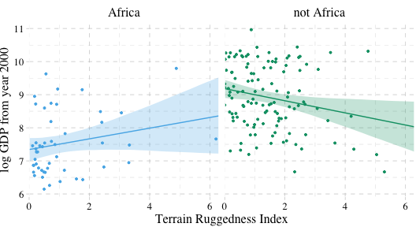

#### Parameters change meaning.

Return the parameter estimates.

``` r
print(b7.5)
```

    ##  Family: gaussian 
    ##   Links: mu = identity; sigma = identity 
    ## Formula: log_gdp ~ rugged + cont_africa + rugged:cont_africa 
    ##    Data: dd (Number of observations: 170) 
    ## Samples: 4 chains, each with iter = 2000; warmup = 1000; thin = 1;
    ##          total post-warmup samples = 4000
    ## 
    ## Population-Level Effects: 
    ##                    Estimate Est.Error l-95% CI u-95% CI Eff.Sample Rhat
    ## Intercept              9.18      0.14     8.90     9.44       3164 1.00
    ## rugged                -0.18      0.08    -0.33    -0.03       2850 1.00
    ## cont_africa           -1.84      0.22    -2.28    -1.38       2329 1.00
    ## rugged:cont_africa     0.34      0.13     0.08     0.60       2620 1.00
    ## 
    ## Family Specific Parameters: 
    ##       Estimate Est.Error l-95% CI u-95% CI Eff.Sample Rhat
    ## sigma     0.95      0.05     0.86     1.06       4000 1.00
    ## 
    ## Samples were drawn using sampling(NUTS). For each parameter, Eff.Sample 
    ## is a crude measure of effective sample size, and Rhat is the potential 
    ## scale reduction factor on split chains (at convergence, Rhat = 1).

Like McElreath, we'll avoid integral calcus in favor of working with the `posterior_samples()`.

``` r
post <- posterior_samples(b7.5) 

post %>%
  transmute(gamma_Africa    = b_rugged + `b_rugged:cont_africa`,
            gamma_notAfrica = b_rugged) %>%
  gather(key, value) %>%
  group_by(key) %>%
  summarise(mean = mean(value))
```

    ## # A tibble: 2 x 2
    ##   key               mean
    ##   <chr>            <dbl>
    ## 1 gamma_Africa     0.161
    ## 2 gamma_notAfrica -0.183

And here is our version of Figure 7.5.

``` r
post %>%
  transmute(gamma_Africa    = b_rugged + `b_rugged:cont_africa`,
            gamma_notAfrica = b_rugged) %>%
  gather(key, value) %>%
  
  ggplot(aes(x = value, group = key, color = key, fill = key)) +
  geom_density(alpha = 1/4) +
  scale_colour_pander() +
  scale_fill_pander() +
  scale_x_continuous(expression(gamma), expand = c(0, 0)) +
  scale_y_continuous(NULL, breaks = NULL) +
  ggtitle("Terraine Ruggedness slopes",
          subtitle = "Blue = African nations, Green = others") +
  theme_pander() + 
  theme(text = element_text(family = "Times"),
        legend.position = "none")
```

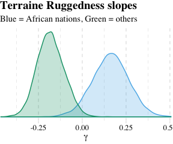

What proportion of these differences is below zero?

``` r
post %>%
  mutate(gamma_Africa    = b_rugged + `b_rugged:cont_africa`,
         gamma_notAfrica = b_rugged) %>% 
  mutate(diff            = gamma_Africa -gamma_notAfrica) %>%
  summarise(Proportion_of_the_difference_below_0 = sum(diff < 0) / length(diff))
```

    ##   Proportion_of_the_difference_below_0
    ## 1                              0.00525

Symmetry of the linear interaction.
-----------------------------------

> Consider for example the GDP and terrain ruggedness problem. The interaction there has two equally valid phrasings.
>
> 1.  How much does the influence of ruggedness (on GDP) depend upon whether the nation is in Africa?
> 2.  How much does the influence of being in Africa (on GDP) depend upon ruggedness?
>
> While these two possibilities sound different to mode humans, your golem things they are identical. (p. 223)

### Buridan's interaction.

Recall the original equation.

log\_gdp<sub>*i*</sub> = Normal(*μ*<sub>*i*</sub>, *σ*)

*μ*<sub>*i*</sub> = *α* + *γ*<sub>*i*</sub>rugged<sub>*i*</sub> + *β*<sub>2</sub>cont\_africa<sub>*i*</sub>

*γ*<sub>*i*</sub> = *β*<sub>1</sub> + *β*<sub>3</sub>cont\_africa<sub>*i*</sub>

Next McElreath replaced *γ*<sub>*i*</sub> with the expression for *μ*<sub>*i*</sub>.

*μ*<sub>*i*</sub> = *α* + (*β*<sub>1</sub> + *β*<sub>3</sub>cont\_africa<sub>*i*</sub>)×rugged<sub>*i*</sub> + *β*<sub>2</sub>cont\_africa<sub>*i*</sub>

*μ*<sub>*i*</sub> = *α* + *β*<sub>1</sub>rugged<sub>*i*</sub> + *β*<sub>3</sub>rugged<sub>*i*</sub> × cont\_africa<sub>*i*</sub> + *β*<sub>2</sub>cont\_africa<sub>*i*</sub>

And new we'll factor together the terms containing cont\_africa<sub>*i*</sub>.

$$\\mu\_i = \\alpha + \\beta\_1 \\text{rugged}\_i + \\underbrace{(\\beta\_2 + \\beta\_3 \\text{rugged}\_i)}\_G \\times \\text{cont\_africa}\_i$$

And just as in the text, our *G* term looks a lot like the original *γ*<sub>*i*</sub> term.

### Africa depends upon ruggedness.

Here is our version of McElreath's Figure 7.6.

``` r
# new predictor data for `fitted()`
nd <- 
  tibble(rugged      = rep(range(dd$rugged), times = 2),
         cont_africa = rep(0:1,              each = 2))

# `fitted()`
fitd_b7.5 <-
  fitted(b7.5, newdata = nd) %>%
  as_tibble() %>%
  bind_cols(nd) %>% 
  mutate(ox = rep(c(-0.05, 0.05), times = 2))

# augment the `dd` data a bit
dd %>% 
  mutate(ox = ifelse(rugged > median(rugged), 0.05, -0.05),
         cont_africa = cont_africa + ox) %>%
  select(cont_africa, everything()) %>%
  
  # plot
  ggplot(aes(x = cont_africa)) +
  geom_ribbon(data = fitd_b7.5,
              aes(ymin  = Q2.5, 
                  ymax  = Q97.5,
                  fill  = factor(ox),
                  group = factor(ox)),
              alpha = 1/4) +
  geom_line(data = fitd_b7.5,
              aes(y        = Estimate,
                  color    = factor(ox),
                  group    = factor(ox),
                  linetype = factor(ox))) +
  geom_point(aes(y = log_gdp, color = factor(ox)),
             alpha = 1/2, shape = 1) +
  scale_colour_pander() +
  scale_fill_pander() +
  scale_x_continuous("Continent", breaks = 0:1, 
                     labels = c("other", "Africa")) +
  coord_cartesian(xlim = c(-.2, 1.2)) +
  ylab("log GDP from year 2000") +
  theme_pander() +
  theme(text = element_text(family = "Times"),
        legend.position = "none")
```

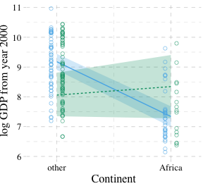

Continuous interactions
-----------------------

Though continuous interactions can be more challenging to interpret, they’re just as easy to fit as interactions including dummies.

### The data.

Look at the `tulips`.

``` r
library(rethinking)
data(tulips)
d <- tulips
str(d)
```

    ## 'data.frame':    27 obs. of  4 variables:
    ##  $ bed   : Factor w/ 3 levels "a","b","c": 1 1 1 1 1 1 1 1 1 2 ...
    ##  $ water : int  1 1 1 2 2 2 3 3 3 1 ...
    ##  $ shade : int  1 2 3 1 2 3 1 2 3 1 ...
    ##  $ blooms: num  0 0 111 183.5 59.2 ...

Load brms.

``` r
detach(package:rethinking, unload = T)
library(brms)
rm(tulips)
```

Here we continue with McElreath's very-flat priors for the multivariable and interaction models.

``` r
b7.6 <-
  brm(data = d, family = gaussian,
      blooms ~ 1 + water + shade,
      prior = c(prior(normal(0, 100), class = Intercept),
                prior(normal(0, 100), class = b),
                prior(uniform(0, 100), class = sigma)),
      iter = 2000, warmup = 1000, cores = 4, chains = 4)
```

    ## Warning: It appears as if you have specified an upper bounded prior on a parameter that has no natural upper bound.
    ## If this is really what you want, please specify argument 'ub' of 'set_prior' appropriately.
    ## Warning occurred for prior 
    ## sigma ~ uniform(0, 100)

    ## Warning: There were 36 divergent transitions after warmup. Increasing adapt_delta above 0.8 may help. See
    ## http://mc-stan.org/misc/warnings.html#divergent-transitions-after-warmup

    ## Warning: Examine the pairs() plot to diagnose sampling problems

``` r
b7.7 <- 
  update(b7.6, 
         formula = blooms ~ 1 + water + shade + water:shade)
```

    ## Warning: There were 2 divergent transitions after warmup. Increasing adapt_delta above 0.8 may help. See
    ## http://mc-stan.org/misc/warnings.html#divergent-transitions-after-warmup

    ## Warning: Examine the pairs() plot to diagnose sampling problems

Much like in the text, these models yielded divergent transitions. Here, we'll try to combat them by following Stan's advice and "\[increase\] adapt\_delta above 0.8." While we're at it, we'll put better priors on *σ*.

``` r
b7.6 <-
  update(b7.6,
         prior = c(prior(normal(0, 100), class = Intercept),
                   prior(normal(0, 100), class = b),
                   prior(cauchy(0, 10), class = sigma)),
         control = list(adapt_delta = 0.9))

b7.7 <- 
  update(b7.6, 
         formula = blooms ~ 1 + water + shade + water:shade)
```

Increasing `adapt_delta` did the trick. Instead of `coeftab()`, we can also use `posterior_summary()`, which gets us most of the way there.

``` r
posterior_summary(b7.6) %>% round(digits = 2)
```

    ##             Estimate Est.Error    Q2.5   Q97.5
    ## b_Intercept    60.21     42.88  -25.71  142.19
    ## b_water        74.03     14.52   45.39  103.71
    ## b_shade       -40.79     14.62  -69.27  -11.34
    ## sigma          61.64      9.08   46.87   82.02
    ## lp__         -169.80      1.55 -173.86 -167.91

``` r
posterior_summary(b7.7) %>% round(digits = 2)
```

    ##               Estimate Est.Error    Q2.5   Q97.5
    ## b_Intercept    -106.92     62.80 -228.94   16.22
    ## b_water         159.58     29.16  100.21  215.32
    ## b_shade          43.95     29.28  -14.91  101.07
    ## b_water:shade   -43.14     13.53  -68.94  -15.59
    ## sigma            50.15      7.70   37.54   67.69
    ## lp__           -170.71      1.74 -174.88 -168.39

This is an example where HMC yielded point estimates notably different from MAP. However, look at the size of those posterior standard deviations (i.e., 'Est.Error' column)! The MAP estimates are well within a fraction of those *S**D*s.

Anyway, let's look at WAIC.

``` r
waic(b7.6, b7.7)
```

    ##               WAIC   SE
    ## b7.6        304.27 7.68
    ## b7.7        293.71 7.86
    ## b7.6 - b7.7  10.57 5.38

Why not compute the WAIC weights?

``` r
model_weights(b7.6, b7.7, weights = "waic")
```

    ##        b7.6        b7.7 
    ## 0.005049845 0.994950155

As in the text, almost all the weight went to the interaction model, `b7.7`.

### Center and re-estimate.

Here's a tidyverse way to center the predictors.

``` r
d <-
  d %>%
  mutate(shade_c = shade - mean(shade),
         water_c = water - mean(water))
```

Refitting the models with our shiny new centered predictors.

``` r
b7.8 <-
  brm(data = d, family = gaussian,
      blooms ~ 1 + water_c + shade_c,
      prior = c(prior(normal(130, 100), class = Intercept),
                prior(normal(0, 100), class = b),
                prior(cauchy(0, 10), class = sigma)),
      iter = 2000, warmup = 1000, chains = 4, cores = 4,
      control = list(adapt_delta = 0.9))

b7.9 <- 
  update(b7.8, 
         formula = blooms ~ 1 + water_c + shade_c + water_c:shade_c)
```

``` r
posterior_summary(b7.8) %>% round(digits = 2)
```

    ##             Estimate Est.Error    Q2.5   Q97.5
    ## b_Intercept   128.59     11.77  105.16  152.23
    ## b_water_c      74.65     14.26   47.30  102.43
    ## b_shade_c     -40.63     14.40  -68.56  -11.05
    ## sigma          61.57      9.24   46.80   82.65
    ## lp__         -168.93      1.52 -172.72 -167.04

``` r
posterior_summary(b7.9) %>% round(digits = 2)
```

    ##                   Estimate Est.Error    Q2.5   Q97.5
    ## b_Intercept         128.79      9.37  110.26  147.47
    ## b_water_c            74.48     11.93   50.04   98.28
    ## b_shade_c           -40.83     11.43  -63.10  -18.10
    ## b_water_c:shade_c   -51.84     14.12  -78.86  -23.70
    ## sigma                49.56      7.37   37.84   66.40
    ## lp__               -168.53      1.67 -172.55 -166.29

And okay fine, if you really want a `coeftab()`-like summary, here's a grotesque way to do it.

``` r
# First, we reformat `b7.8`
posterior_summary(b7.8) %>% 
  data.frame() %>% 
  rownames_to_column() %>% 
  # Now we bind to it the rows of `b7.9`
  bind_rows(
    posterior_summary(b7.9) %>% 
      data.frame() %>%
      rownames_to_column()
  ) %>% 
  # Miscellaneous wrangling
  mutate(model = c(rep("b7.8", times = 5),
                   rep("b7.9", times = 6))) %>% 
  select(rowname, Estimate, model) %>% 
  filter(rowname != "lp__") %>% 
  spread(key = model, value = Estimate) %>% 
  rename(parameter = rowname) %>% 
  mutate_if(is.double, round, digits = 2)
```

    ##           parameter   b7.8   b7.9
    ## 1       b_Intercept 128.59 128.79
    ## 2         b_shade_c -40.63 -40.83
    ## 3         b_water_c  74.65  74.48
    ## 4 b_water_c:shade_c     NA -51.84
    ## 5             sigma  61.57  49.56

Anyway, centering helped a lot. Now, not only do the results in the text match up better than those from Stan, but the 'Est.Error' values are uniformly smaller.

#### Estimation worked better.

Nothing to add, here.

#### Estimates changed less across models.

``` r
k <- fixef(b7.7)
k[1] + k[2]*2 + k[3]*2 + k[4]*2*2
```

    ## [1] 127.5789

``` r
k <- fixef(b7.9)
k[1] + k[2]*0 + k[3]*0 + k[4]*0*0
```

    ## [1] 128.7928

``` r
print(b7.9)
```

    ##  Family: gaussian 
    ##   Links: mu = identity; sigma = identity 
    ## Formula: blooms ~ water_c + shade_c + water_c:shade_c 
    ##    Data: d (Number of observations: 27) 
    ## Samples: 4 chains, each with iter = 2000; warmup = 1000; thin = 1;
    ##          total post-warmup samples = 4000
    ## 
    ## Population-Level Effects: 
    ##                 Estimate Est.Error l-95% CI u-95% CI Eff.Sample Rhat
    ## Intercept         128.79      9.37   110.26   147.47       4000 1.00
    ## water_c            74.48     11.93    50.04    98.28       4000 1.00
    ## shade_c           -40.83     11.43   -63.10   -18.10       4000 1.00
    ## water_c:shade_c   -51.84     14.12   -78.86   -23.70       4000 1.00
    ## 
    ## Family Specific Parameters: 
    ##       Estimate Est.Error l-95% CI u-95% CI Eff.Sample Rhat
    ## sigma    49.56      7.37    37.84    66.40       4000 1.00
    ## 
    ## Samples were drawn using sampling(NUTS). For each parameter, Eff.Sample 
    ## is a crude measure of effective sample size, and Rhat is the potential 
    ## scale reduction factor on split chains (at convergence, Rhat = 1).

### Plotting implied predictions.

Now we're ready for the bottom row of Figure 7.7. Here's our variation on McElreath's tryptych loop code, adjusted for brms and ggplot2.

``` r
# loop over values of water.c and plot predictions
shade_seq <- -1:1

for(w in -1:1){
  # defining the subset of the original data
  dt <- d[d$water_c == w, ]
  # defining our new data
  nd <- tibble(water_c = w, shade_c = shade_seq)
  # using our sampling skills, like before
  fitd_7.9 <- 
    fitted(b7.9, newdata = nd) %>%
    as_tibble() %>%
    bind_cols(nd)
  
  # specifying our custom plot
  fig <- 
    ggplot() +
    geom_ribbon(data = fitd_7.9, 
                aes(x    = shade_c,
                    ymin = Q2.5,
                    ymax = Q97.5), 
                fill = "#CC79A7", alpha = 1/5) +
    geom_line(data = fitd_7.9, 
              aes(x = shade_c, y = Estimate), 
              color = "#CC79A7") +
    geom_point(data = dt, aes(x = shade_c, y = blooms),
               shape = 1, color = "#CC79A7") +
    coord_cartesian(xlim = range(d$shade_c), 
                    ylim = range(d$blooms)) +
    scale_x_continuous("Shade (centered)", breaks = c(-1, 0, 1)) +
    labs("Blooms", 
         title = paste("Water (centered) =", w)) +
    theme_pander() + 
    theme(text = element_text(family = "Times"))
  
  # plotting that joint
  plot(fig)
}
```

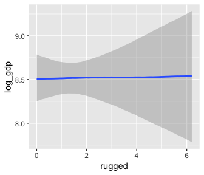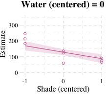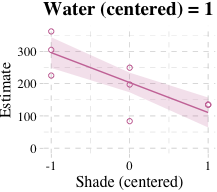

But we don't necessarily need a loop. We can achieve all of McElreath's Figure 7.7 with `fitted()`, some data wrangling, and a little help from `ggplot2::facet_grid()`.

``` r
# fitted() for model b7.8
fitted(b7.8) %>%
  as_tibble() %>%
  # adding fitted() for model b7.9
  bind_rows(
    fitted(b7.9) %>% 
      as_tibble()
  ) %>% 
  # We'll want to index the models
  mutate(fit  = rep(c("b7.8", "b7.9"), each = 27)) %>% 
  # Here we add the data, `d`
  bind_cols(bind_rows(d, d)) %>% 
  # These will come in handy for `ggplot2::facet_grid()`
  mutate(x_grid = paste("water_c =", water_c),
         y_grid = paste("model: ", fit)) %>% 
  
  ggplot(aes(x = shade_c)) +
  geom_ribbon(aes(ymin = Q2.5,
                  ymax = Q97.5), 
              fill = "#CC79A7", alpha = 1/5) +
  geom_line(aes(y = Estimate), 
            color = "#CC79A7") +
  geom_point(aes(y = blooms, group = x_grid), 
             shape = 1, color = "#CC79A7") +
  coord_cartesian(xlim = range(d$shade_c), 
                  ylim = range(d$blooms)) +
  scale_x_continuous("Shade (centered)", breaks = c(-1, 0, 1)) +
  ylab("Blooms") +
  theme_pander() + 
  theme(text = element_text(family = "Times"),
        panel.background = element_rect(color = "black")) +
  facet_grid(y_grid ~ x_grid)
```

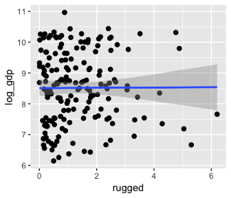

Interactions in design formulas
-------------------------------

The brms syntax generally follows the design formulas typical of `lm()`. Hopefully this is all old hat.

~~Summary~~ Bonus: `marginal_effects()`
---------------------------------------

The brms package includes the `marginal_effects()` function as a convenient way to look at simple effects and two-way interactions. Recall the simple univariable model, `b7.3`:

``` r
b7.3$formula
```

    ## log_gdp ~ 1 + rugged

We can look at the regression line and its percentile-based intervals like so:

``` r
marginal_effects(b7.3)
```

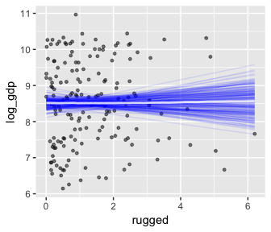

If we nest `marginal_effects()` within `plot()` with a `points = T` argument, we can add the original data to the figure.

``` r
plot(marginal_effects(b7.3), points = T)
```

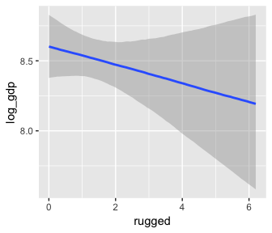

We can further customize the plot. For example, we can replace the intervals with a spaghetti plot. While we're at it, we can use `point_args` to adjust the `geom_jitter()` parameters.

``` r
plot(marginal_effects(b7.3,
                      spaghetti = T, nsamples = 200),
     points = T,
     point_args = c(alpha = 1/2, size = 1))
```

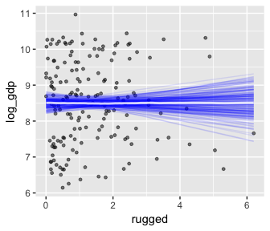

With multiple predictors, things get more complicated. Consider our multivariable, non-interaction model, `b7.4`.

``` r
b7.4$formula
```

    ## log_gdp ~ rugged + cont_africa

``` r
marginal_effects(b7.4)
```

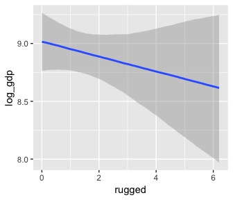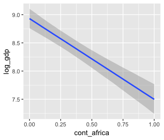

We got one plot for each predictor, controlling the other predictor at zero. Note how the plot for `cont_africa` treated it as a continuous variable. This is because the variable was saved as an integer in the original data set:

``` r
b7.4$data %>% 
  glimpse()
```

    ## Observations: 170
    ## Variables: 3
    ## $ log_gdp     <dbl> 7.492609, 8.216929, 9.933263, 9.407032, 7.792343, ...
    ## $ rugged      <dbl> 0.858, 3.427, 0.769, 0.775, 2.688, 0.006, 0.143, 3...
    ## $ cont_africa <int> 1, 0, 0, 0, 0, 0, 0, 0, 0, 1, 0, 1, 1, 0, 0, 0, 0,...

One way to fix that is to adjust the data set and refit the model.

``` r
d_factor <-
  b7.4$data %>% 
  mutate(cont_africa = factor(cont_africa))

b7.4_factor <- update(b7.4, newdata = d_factor)
```

Using the `update()` syntax often speeds up the re-fitting process.

``` r
marginal_effects(b7.4_factor)
```

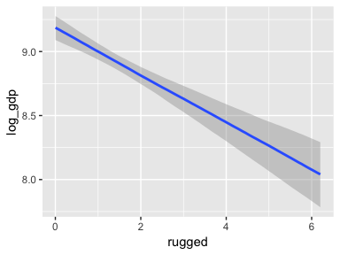

Now our second marginal plot more clearly expresses the `cont_africa` predictor as categorical.

Things get more complicated with the interaction model, `b7.5`.

``` r
b7.5$formula
```

    ## log_gdp ~ rugged + cont_africa + rugged:cont_africa

``` r
marginal_effects(b7.5)
```

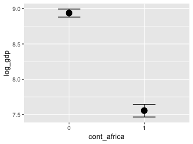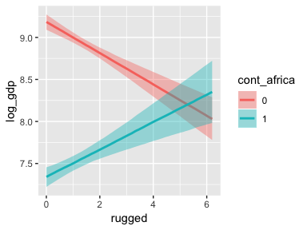

The `marginal_effects()` function defaults to expressing interactions such that the first variable in the term--in this case, `rugged`--is on the x axis and the second variable in the term--`cont_africa`, treated as an integer--is depicted in three lines corresponding its mean and its mean +/- one standard deviation. This is great for continuous variables, but incoherent for categorical ones. The fix is, you guessed it, to refit the model after adjusting the data.

``` r
d_factor <-
  b7.5$data %>% 
  mutate(cont_africa = factor(cont_africa))

b7.5_factor <- update(b7.5, newdata = d_factor)
```

Just for kicks, we'll use `probs = c(.25, .75)` to return [50% intervals](http://andrewgelman.com/2016/11/05/why-i-prefer-50-to-95-intervals/), rather than the conventional 95%.

``` r
marginal_effects(b7.5_factor,
                 probs = c(.25, .75))
```


With the `effects` argument, we can just return the interaction effect, which is where all the action's at. While we're at it, we'll use `plot()` to change some of the settings.

``` r
plot(marginal_effects(b7.5_factor,
                      effects = "rugged:cont_africa", 
                      spaghetti = T, nsamples = 150),
     points = T,
     point_args = c(alpha = 2/3, size = 1), mean = F)
```

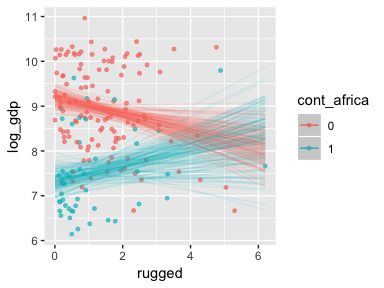

Note, the ordering of the variables matters for the interaction term. Consider our interaction model for the tulips data.

``` r
b7.9$formula
```

    ## blooms ~ water_c + shade_c + water_c:shade_c

The plot tells a slightly different story, depending on whether you specify `effects = "shade_c:water_c"` or `effects = "water_c:shade_c"`.

``` r
plot(marginal_effects(b7.9, 
                      effects = "shade_c:water_c"),
     points = T)
```

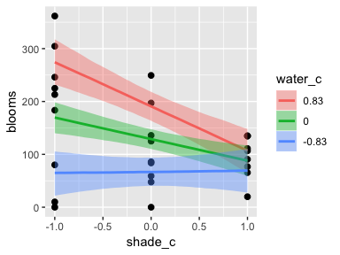

``` r
plot(marginal_effects(b7.9, 
                      effects = "water_c:shade_c"),
     points = T)
```

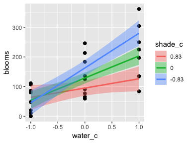

One might want to evaluate the effects of the second term in the interaction--`water_c`, in this case--at values other than the mean and the mean +/- one standard deviation. When we reproduced the bottom row of Figure 7.7, we expressed the interaction based on values -1, 0, and 1 for `water_c`. We can do that, here, by using the `int_conditions` argument. It expects a list, so we'll put our desired `water_c` values in just that.

``` r
ic <- 
  list(water.c = c(-1, 0, 1))

plot(marginal_effects(b7.9, 
                      effects = "shade_c:water_c",
                      int_conditions = ic),
     points = T)
```


Reference
---------

[McElreath, R. (2016). *Statistical rethinking: A Bayesian course with examples in R and Stan.* Chapman & Hall/CRC Press.](https://xcelab.net/rm/statistical-rethinking/)

Session info
------------

``` r
sessionInfo()
```

    ## R version 3.5.1 (2018-07-02)
    ## Platform: x86_64-apple-darwin15.6.0 (64-bit)
    ## Running under: macOS High Sierra 10.13.6
    ## 
    ## Matrix products: default
    ## BLAS: /Library/Frameworks/R.framework/Versions/3.5/Resources/lib/libRblas.0.dylib
    ## LAPACK: /Library/Frameworks/R.framework/Versions/3.5/Resources/lib/libRlapack.dylib
    ## 
    ## locale:
    ## [1] en_US.UTF-8/en_US.UTF-8/en_US.UTF-8/C/en_US.UTF-8/en_US.UTF-8
    ## 
    ## attached base packages:
    ## [1] parallel  stats     graphics  grDevices utils     datasets  methods  
    ## [8] base     
    ## 
    ## other attached packages:
    ##  [1] ggthemes_3.5.0     bindrcpp_0.2.2     forcats_0.3.0     
    ##  [4] stringr_1.3.1      dplyr_0.7.6        purrr_0.2.5       
    ##  [7] readr_1.1.1        tidyr_0.8.1        tibble_1.4.2      
    ## [10] tidyverse_1.2.1    brms_2.4.0         Rcpp_0.12.18      
    ## [13] rstan_2.17.3       StanHeaders_2.17.2 ggplot2_3.0.0     
    ## 
    ## loaded via a namespace (and not attached):
    ##  [1] nlme_3.1-137         matrixStats_0.54.0   xts_0.10-2          
    ##  [4] lubridate_1.7.4      threejs_0.3.1        httr_1.3.1          
    ##  [7] rprojroot_1.3-2      tools_3.5.1          backports_1.1.2     
    ## [10] utf8_1.1.4           R6_2.2.2             DT_0.4              
    ## [13] lazyeval_0.2.1       colorspace_1.3-2     withr_2.1.2         
    ## [16] tidyselect_0.2.4     gridExtra_2.3        mnormt_1.5-5        
    ## [19] Brobdingnag_1.2-5    compiler_3.5.1       cli_1.0.0           
    ## [22] rvest_0.3.2          xml2_1.2.0           shinyjs_1.0         
    ## [25] labeling_0.3         colourpicker_1.0     scales_0.5.0        
    ## [28] dygraphs_1.1.1.5     mvtnorm_1.0-8        psych_1.8.4         
    ## [31] ggridges_0.5.0       digest_0.6.15        foreign_0.8-70      
    ## [34] rmarkdown_1.10       base64enc_0.1-3      pkgconfig_2.0.1     
    ## [37] htmltools_0.3.6      htmlwidgets_1.2      rlang_0.2.1         
    ## [40] readxl_1.1.0         rstudioapi_0.7       shiny_1.1.0         
    ## [43] bindr_0.1.1          zoo_1.8-2            jsonlite_1.5        
    ## [46] crosstalk_1.0.0      gtools_3.8.1         inline_0.3.15       
    ## [49] magrittr_1.5         loo_2.0.0            bayesplot_1.6.0     
    ## [52] Matrix_1.2-14        munsell_0.5.0        abind_1.4-5         
    ## [55] stringi_1.2.3        yaml_2.1.19          MASS_7.3-50         
    ## [58] plyr_1.8.4           grid_3.5.1           promises_1.0.1      
    ## [61] crayon_1.3.4         miniUI_0.1.1.1       lattice_0.20-35     
    ## [64] haven_1.1.2          pander_0.6.2         hms_0.4.2           
    ## [67] knitr_1.20           pillar_1.2.3         igraph_1.2.1        
    ## [70] markdown_0.8         shinystan_2.5.0      codetools_0.2-15    
    ## [73] reshape2_1.4.3       stats4_3.5.1         rstantools_1.5.0    
    ## [76] glue_1.2.0           evaluate_0.10.1      modelr_0.1.2        
    ## [79] httpuv_1.4.4.2       cellranger_1.1.0     gtable_0.2.0        
    ## [82] assertthat_0.2.0     mime_0.5             xtable_1.8-2        
    ## [85] broom_0.4.5          coda_0.19-1          later_0.7.3         
    ## [88] rsconnect_0.8.8      shinythemes_1.1.1    bridgesampling_0.4-0
