Ch. 10 Counting and Classification
================
A Solomon Kurz
2018-09-24

Counting and Classification
===========================

> All over the world, every day, scientists throw away information. Sometimes this is through the removal of "outliers," cases in the data that offend the model and are exiled. More routinely, counted things are converted to proportions before analysis. Why does analysis of proportions throw away information? Because 10/20 and ½ are the same proportion, one-half, but have very different sample sizes. Once converted to proportions, and treated as outcomes in a linear regression, the information about sample size has been destroyed.
>
> It’s easy to retain the information about sample size. All that is needed is to model what has actually been observed, the counts instead of the proportions. (p. 291)

In this chapter, we focus on the two most common types of count models: the binomial and the Poisson.

Side note: For a nice Bayesian way to accommodate outliers in your Gaussian models, check out my project [*Robust Linear Regression with Student’s T Distribution*](https://github.com/ASKurz/Student-s-t_regression).

Binomial regression
-------------------

The basic binomial model follows the form

*y* ∼ Binomial(*n*, *p*)

where *y* is some count variable, *n* is the number of trials, and *p* it the probability a given trial was a 1, which is sometimes termed a *success*. When *n* = 1, then *y* is a vector of 0s and 1s. Presuming the logit link, models of this type are commonly termed logistic regression. When *n* &gt; 1, and still presuming the logit link, we might call our model an aggregated logistic regression model, or more generally an aggregated binomial regression model.

### Logistic regression: Prosocial chimpanzees.

Load the `chimpanzees` data.

``` r
library(rethinking)
data(chimpanzees)
d <- chimpanzees
```

Switch from rethinking to brms.

``` r
detach(package:rethinking)
library(brms)
rm(chimpanzees)
```

We start with the simple intercept-only logistic regression model.

$$
\\begin{eqnarray}
\\text{pulled\_left}\_i & \\sim & \\text{Binomial} (1, p\_i) \\\\
\\text{logit} (p\_i) & = & \\alpha \\\\
\\alpha & \\sim & \\text{Normal} (0, 10)
\\end{eqnarray}
$$

``` r
b10.1 <-
  brm(data = d, family = binomial,
      pulled_left ~ 1,
      prior(normal(0, 10), class = Intercept))
```

You might use `fixef()` to get a focused summary of the intercept.

``` r
library(tidyverse)
 
fixef(b10.1) %>%
  round(digits = 2)
```

    ##           Estimate Est.Error Q2.5 Q97.5
    ## Intercept     0.32      0.09 0.14   0.5

The `brms::inv_logit_scaled()` function will be our alternative to the `logistic()` function in rethinking.

``` r
c(.18, .46) %>%
  inv_logit_scaled()
```

    ## [1] 0.5448789 0.6130142

``` r
fixef(b10.1) %>%
  inv_logit_scaled()
```

    ##            Estimate Est.Error      Q2.5     Q97.5
    ## Intercept 0.5794354 0.5224571 0.5359886 0.6233008

The next two chimp models add predictors in the usual way.

``` r
b10.2 <-
  brm(data = d, family = binomial,
      pulled_left ~ 1 + prosoc_left,
      prior = c(prior(normal(0, 10), class = Intercept),
                prior(normal(0, 10), class = b)))

b10.3 <-
  update(b10.2,
         newdata = d,
         formula = pulled_left ~ 1 + prosoc_left + condition:prosoc_left)
```

Before comparing our models, we'll first save their WAIC estimates as objects. These will come in handy in just a bit.

``` r
w_b10.1 <- waic(b10.1)
w_b10.2 <- waic(b10.2)
w_b10.3 <- waic(b10.3)
```

``` r
compare_ic(w_b10.1, w_b10.2, w_b10.3)
```

    ##                 WAIC   SE
    ## b10.1         687.93 7.12
    ## b10.2         680.61 9.28
    ## b10.3         682.28 9.38
    ## b10.1 - b10.2   7.32 6.13
    ## b10.1 - b10.3   5.65 6.27
    ## b10.2 - b10.3  -1.67 0.79

For this chapter, we'll take our color scheme from the [wesanderson package](https://cran.r-project.org/web/packages/wesanderson/index.html)'s `Moonrise2` palette.

``` r
# install.packages("wesanderson", dependencies = T)
library(wesanderson)

wes_palette("Moonrise2")
```


``` r
wes_palette("Moonrise2")[1:4]
```

    ## [1] "#798E87" "#C27D38" "#CCC591" "#29211F"

We'll also take a few formatting cues from [Edward Tufte](https://www.edwardtufte.com/tufte/books_vdqi), curtesy of the [ggthemes package](https://cran.r-project.org/web/packages/ggthemes/index.html). The `theme_tufte()` function will change the default font and remove some chart junk. The `theme_set()` function, below, will make these adjustments the default for all subsequent ggplot2 plots. To undo this, just execute `theme_set(theme_default())`.

``` r
library(ggthemes)
library(bayesplot)

theme_set(theme_default() + 
            theme_tufte() +
            theme(plot.background = element_rect(fill  = wes_palette("Moonrise2")[3],
                                                 color = wes_palette("Moonrise2")[3])))
```

Finally, here's our WAIC plot.

``` r
tibble(model = c("b10.1", "b10.2", "b10.3"),
       waic  = c(w_b10.1$estimates[3, 1], w_b10.2$estimates[3, 1], w_b10.3$estimates[3, 1]),
       se    = c(w_b10.1$estimates[3, 2], w_b10.2$estimates[3, 2], w_b10.3$estimates[3, 2])) %>%

  ggplot() +
  geom_pointrange(aes(x = reorder(model, -waic), y = waic,
                      ymin = waic - se,
                      ymax = waic + se,
                      color = model),
                  shape = 16) +
  scale_color_manual(values = wes_palette("Moonrise2")[c(1:2, 4)]) +
  coord_flip() +
  labs(x = NULL, y = NULL,
       title = "WAIC") +
  theme(axis.ticks.y    = element_blank(),
        legend.position = "none")
```

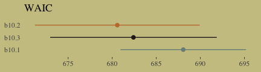

The full model, `b10.3`, did not have the lowest WAIC value. Though note how wide those standard error bars are relative to the point estimates. There's a lot of model uncertainty there. Here are the WAIC weights.

``` r
model_weights(b10.1, b10.2, b10.3, 
              weights = "waic")
```

    ##      b10.1      b10.2      b10.3 
    ## 0.01766308 0.68510000 0.29723692

Let's look at the parameter summaries for the theory-based model.

``` r
print(b10.3)
```

    ##  Family: binomial 
    ##   Links: mu = logit 
    ## Formula: pulled_left ~ prosoc_left + prosoc_left:condition 
    ##    Data: d (Number of observations: 504) 
    ## Samples: 4 chains, each with iter = 2000; warmup = 1000; thin = 1;
    ##          total post-warmup samples = 4000
    ## 
    ## Population-Level Effects: 
    ##                       Estimate Est.Error l-95% CI u-95% CI Eff.Sample Rhat
    ## Intercept                 0.04      0.13    -0.20     0.29       3656 1.00
    ## prosoc_left               0.61      0.23     0.17     1.07       2632 1.00
    ## prosoc_left:condition    -0.10      0.26    -0.63     0.42       2580 1.00
    ## 
    ## Samples were drawn using sampling(NUTS). For each parameter, Eff.Sample 
    ## is a crude measure of effective sample size, and Rhat is the potential 
    ## scale reduction factor on split chains (at convergence, Rhat = 1).

Here's what the odds are multiplied by:

``` r
fixef(b10.3)[2] %>%
  exp()
```

    ## [1] 1.845369

Given an estimated value of 4, the probability of a pull, all else equal, would be:

``` r
inv_logit_scaled(4)
```

    ## [1] 0.9820138

Adding the coefficient, `fixef(b10.3)[2]`, would yield:

``` r
(4 + fixef(b10.3)[2]) %>%
  inv_logit_scaled()
```

    ## [1] 0.9901723

For our variant of Figure 10.2, we use `brms::pp_average()` in place of `rethinking::ensemble()`.

``` r
# the combined `fitted()` results of the three models weighted by their WAICs
pp_a <- 
  pp_average(b10.1, b10.2, b10.3,
             weights = "waic",
             method = "fitted") %>%
  as_tibble() %>% 
  bind_cols(b10.3$data) %>% 
  distinct(Estimate, Q2.5, Q97.5, condition, prosoc_left) %>% 
  mutate(x_axis = str_c(prosoc_left, condition, sep = "/")) %>%
  mutate(x_axis = factor(x_axis, levels = c("0/0", "1/0", "0/1", "1/1"))) %>% 
  rename(pulled_left = Estimate)

# the empirically-based summaries
d_plot <-
  d %>%
  group_by(actor, condition, prosoc_left) %>%
  summarise(pulled_left = mean(pulled_left)) %>%
  mutate(x_axis = str_c(prosoc_left, condition, sep = "/")) %>%
  mutate(x_axis = factor(x_axis, levels = c("0/0", "1/0", "0/1", "1/1")))

# the plot
pp_a %>% 
  ggplot(aes(x = x_axis)) +
  geom_ribbon(aes(ymin = Q2.5, 
                  ymax = Q97.5,
                  group = 0),
              fill = wes_palette("Moonrise2")[2]) +
  geom_line(aes(y = pulled_left,
                group = 0)) +
  geom_line(data = d_plot,
            aes(y = pulled_left, group = actor),
            color = wes_palette("Moonrise2")[1], size = 1/3) +
  scale_x_discrete(expand = c(.03, .03)) +
  coord_cartesian(ylim = 0:1) +
  labs(x = "prosoc_left/condition",
       y = "proportion pulled left") +
  theme(axis.ticks.x = element_blank())
```

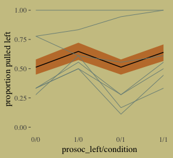

McElreath didn't show the actual pairs plot in the text. Here's ours using `mcmc_pairs()`.

``` r
# this helps us set our custom color scheme
color_scheme_set(c(wes_palette("Moonrise2")[3], 
                   wes_palette("Moonrise2")[1], 
                   wes_palette("Moonrise2")[2], 
                   wes_palette("Moonrise2")[2], 
                   wes_palette("Moonrise2")[1], 
                   wes_palette("Moonrise2")[1]))

# the actual plot
mcmc_pairs(x = posterior_samples(b10.3),
           pars = c("b_Intercept", "b_prosoc_left", "b_prosoc_left:condition"),
           off_diag_args = list(size = 1/10, alpha = 1/6),
           diag_fun = "dens")
```

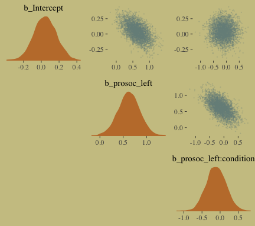

As McElreath observed, the posterior looks multivariate Gaussian.

In equations, the next model follows the form

$$
\\begin{eqnarray}
\\text{pulled\_left}\_i & \\sim & \\text{Binomial} (1, p\_i) \\\\
\\text{logit} (p\_i) & = & \\alpha\_{\\text{actor}} + (\\beta\_1 + \\beta\_2 \\text{condition}\_i) \\text{prosoc\_left}\_i \\\\
\\alpha\_{\\text{actor}} & \\sim & \\text{Normal} (0, 10) \\\\
\\beta\_1 & \\sim & \\text{Normal} (0, 10) \\\\
\\beta\_2 & \\sim & \\text{Normal} (0, 10)
\\end{eqnarray}
$$

Enclosing the `actor` variable within `factor()` will produce the indexing we need to get `actor`-specific intercepts. Also notice that we used the `0 + factor(actor)` part of the model `formula` to suppress the brms default intercept. As such, the priors for all parameters in the model are of `class = b`. And since we’re using the same Gaussian prior for each, we only need one line for the `prior` argument.

``` r
b10.4 <-
  brm(data = d, family = binomial,
      pulled_left ~ 0 + factor(actor) + prosoc_left + condition:prosoc_left ,
      prior(normal(0, 10), class = b),
      iter = 2500, warmup = 500, chains = 2, cores = 2,
      control = list(adapt_delta = 0.9))
```

Within the tidyverse, `distinct()` yields the information you'd otherwise get from `unique()`.

``` r
d %>%
  distinct(actor)
```

    ##   actor
    ## 1     1
    ## 2     2
    ## 3     3
    ## 4     4
    ## 5     5
    ## 6     6
    ## 7     7

We have no need to use something like `depth=2` for our posterior summary.

``` r
print(b10.4)
```

    ##  Family: binomial 
    ##   Links: mu = logit 
    ## Formula: pulled_left ~ 0 + factor(actor) + prosoc_left + condition:prosoc_left 
    ##    Data: d (Number of observations: 504) 
    ## Samples: 2 chains, each with iter = 2500; warmup = 500; thin = 1;
    ##          total post-warmup samples = 4000
    ## 
    ## Population-Level Effects: 
    ##                       Estimate Est.Error l-95% CI u-95% CI Eff.Sample Rhat
    ## factoractor1             -0.74      0.27    -1.27    -0.24       4000 1.00
    ## factoractor2             11.12      5.38     4.01    24.03       1637 1.00
    ## factoractor3             -1.05      0.27    -1.60    -0.53       3723 1.00
    ## factoractor4             -1.05      0.28    -1.62    -0.52       4000 1.00
    ## factoractor5             -0.74      0.27    -1.29    -0.20       4000 1.00
    ## factoractor6              0.22      0.28    -0.32     0.75       4000 1.00
    ## factoractor7              1.81      0.39     1.09     2.62       4000 1.00
    ## prosoc_left               0.84      0.26     0.35     1.36       2858 1.00
    ## prosoc_left:condition    -0.14      0.30    -0.71     0.43       4000 1.00
    ## 
    ## Samples were drawn using sampling(NUTS). For each parameter, Eff.Sample 
    ## is a crude measure of effective sample size, and Rhat is the potential 
    ## scale reduction factor on split chains (at convergence, Rhat = 1).

Correspondingly, `brms::posterior_samples()` returns an object for `b10.4` that doesn't quite follow the same structure as from `rethinking::extract.samples()`. We just have a typical 2-dimensional data frame.

``` r
post <- posterior_samples(b10.4)
 
post %>%
  glimpse()
```

    ## Observations: 4,000
    ## Variables: 10
    ## $ b_factoractor1            <dbl> -0.6847792, -0.4751944, -0.8607736, -0.6871407, -0.8453780, -0.9377592,...
    ## $ b_factoractor2            <dbl> 12.319112, 12.013053, 4.947293, 19.014094, 6.971872, 5.924437, 7.573733...
    ## $ b_factoractor3            <dbl> -0.9972818, -1.0630813, -0.6699689, -1.4563221, -0.8192302, -1.0995197,...
    ## $ b_factoractor4            <dbl> -0.7210538, -0.7981792, -0.9745306, -0.9964304, -1.3704128, -1.2314653,...
    ## $ b_factoractor5            <dbl> -0.6429328, -0.6220763, -0.4980794, -0.9810318, -0.9161971, -0.8259399,...
    ## $ b_factoractor6            <dbl> 0.24574079, 0.07017737, 0.35347804, 0.07703076, 0.22895865, 0.25928912,...
    ## $ b_factoractor7            <dbl> 2.339204, 1.404524, 2.126833, 1.462916, 1.966854, 1.524801, 1.771217, 1...
    ## $ b_prosoc_left             <dbl> 0.5175556, 0.6608908, 0.6588009, 1.4560434, 1.1912459, 0.9263512, 0.724...
    ## $ `b_prosoc_left:condition` <dbl> 0.012580754, -0.178287739, 0.251580698, -0.213262113, -0.255648495, -0....
    ## $ lp__                      <dbl> -288.2416, -288.2557, -289.3512, -293.4929, -288.8297, -287.4757, -291....

Our variant of Figure 10.3:

``` r
post %>%
  ggplot(aes(x = b_factoractor2)) +
  geom_density(color = "transparent",
               fill = wes_palette("Moonrise2")[1]) +
  scale_y_continuous(NULL, breaks = NULL) +
  labs(x = NULL,
       title = "Actor 2's large and uncertain intercept",
       subtitle = "Once your log-odds are above, like, 4, it's all\npretty much a probability of 1.")
```

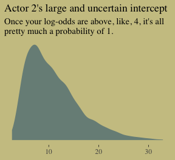

Figure 10.4. shows the idiographic trajectories for four of our chimps.

``` r
# subset the `d_plot` data
d_plot_4 <-
  d_plot %>%
  filter(actor %in% c(3, 5:7)) %>%
  ungroup() %>% 
  mutate(actor = str_c("actor ", actor))

# compute the model-implied estimates with `fitted()` and wrangle
ftd <-
  fitted(b10.4) %>% 
  as_tibble() %>% 
  bind_cols(b10.4$data) %>% 
  filter(actor %in% c(3, 5:7)) %>% 
  distinct(Estimate, Q2.5, Q97.5, condition, prosoc_left, actor) %>% 
  select(actor, everything()) %>% 
  mutate(actor = str_c("actor ", actor)) %>% 
  mutate(x_axis = str_c(prosoc_left, condition, sep = "/")) %>%
  mutate(x_axis = factor(x_axis, levels = c("0/0", "1/0", "0/1", "1/1"))) %>% 
  rename(pulled_left = Estimate)

# plot
ftd %>% 
  ggplot(aes(x = x_axis, y = pulled_left, group = actor)) +
  geom_ribbon(aes(ymin = Q2.5, 
                  ymax = Q97.5),
              fill = wes_palette("Moonrise2")[2]) +
  geom_line() +
  geom_line(data = d_plot_4,
            color = wes_palette("Moonrise2")[1], size = 1.25) +
  scale_x_discrete(expand = c(.03, .03)) +
  coord_cartesian(ylim = 0:1) +
  labs(x = "prosoc_left/condition",
       y = "proportion pulled left") +
  theme(axis.ticks.x     = element_blank(),
        # color came from: http://www.color-hex.com/color/ccc591
        panel.background = element_rect(fill = "#d1ca9c",
                                        color = "transparent")) +
  facet_wrap(~actor)
```

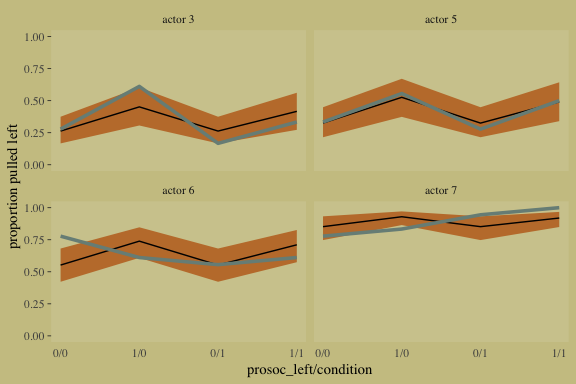

#### Overthinking: Using the ~~by~~ `group_by()` function.

Let's work within the tidyverse, instead. If you wanted to compute the proportion of trials `pulled_left == 1` for each combination of `prosoc_left`, `condition`, and chimp `actor`, you'd put those last three variables within `group_by()` and then compute the `mean()` of `pulled_left` within `summarise()`.

``` r
d %>% 
  group_by(prosoc_left, condition, actor) %>% 
  summarise(`proportion pulled_left` = mean(pulled_left))
```

    ## # A tibble: 28 x 4
    ## # Groups:   prosoc_left, condition [?]
    ##    prosoc_left condition actor `proportion pulled_left`
    ##          <int>     <int> <int>                    <dbl>
    ##  1           0         0     1                    0.333
    ##  2           0         0     2                    1    
    ##  3           0         0     3                    0.278
    ##  4           0         0     4                    0.333
    ##  5           0         0     5                    0.333
    ##  6           0         0     6                    0.778
    ##  7           0         0     7                    0.778
    ##  8           0         1     1                    0.278
    ##  9           0         1     2                    1    
    ## 10           0         1     3                    0.167
    ## # ... with 18 more rows

And since we're working within the tidyverse, that operation returns a tibble rather than a list.

### Aggregated binomial: Chimpanzees again, condensed.

With the tidyverse, we use `group_by()` and `summarise()` to achieve what McElreath did with `aggregate()`.

``` r
d_aggregated <-
  d %>%
  select(-recipient, -block, -trial, -chose_prosoc) %>%
  group_by(actor, condition, prosoc_left) %>%
  summarise(x = sum(pulled_left))

d_aggregated %>%
  filter(actor %in% c(1, 2))
```

    ## # A tibble: 8 x 4
    ## # Groups:   actor, condition [4]
    ##   actor condition prosoc_left     x
    ##   <int>     <int>       <int> <int>
    ## 1     1         0           0     6
    ## 2     1         0           1     9
    ## 3     1         1           0     5
    ## 4     1         1           1    10
    ## 5     2         0           0    18
    ## 6     2         0           1    18
    ## 7     2         1           0    18
    ## 8     2         1           1    18

To fit an aggregated binomial model in brms, we use the `<criterion> | trials()` syntax where the value that goes in `trials()` is either a fixed number, as in this case, or variable in the data indexing *n*. We'll see an example of the latter in just a bit.

``` r
b10.5 <-
  brm(data = d_aggregated, family = binomial,
      x | trials(18) ~ 1 + prosoc_left + condition:prosoc_left ,
      prior = c(prior(normal(0, 10), class = Intercept),
                prior(normal(0, 10), class = b)),
      iter = 2500, warmup = 500, cores = 2, chains = 2)
```

We might compare `b10.3` with `b10.5` like this.

``` r
fixef(b10.3) %>% round(digits = 2)
```

    ##                       Estimate Est.Error  Q2.5 Q97.5
    ## Intercept                 0.04      0.13 -0.20  0.29
    ## prosoc_left               0.61      0.23  0.17  1.07
    ## prosoc_left:condition    -0.10      0.26 -0.63  0.42

``` r
fixef(b10.5) %>% round(digits = 2)
```

    ##                       Estimate Est.Error  Q2.5 Q97.5
    ## Intercept                 0.05      0.13 -0.20  0.30
    ## prosoc_left               0.61      0.23  0.16  1.06
    ## prosoc_left:condition    -0.10      0.27 -0.63  0.44

The two are close within rounding error.

### Aggregated binomial: Graduate school admissions.

Load the infamous `UCBadmit` data:

``` r
# detach(package:brms)
library(rethinking)
data(UCBadmit)
d <- UCBadmit
```

Switch from rethinking to brms.

``` r
detach(package:rethinking)
library(brms)
rm(UCBadmit)

d
```

    ##    dept applicant.gender admit reject applications
    ## 1     A             male   512    313          825
    ## 2     A           female    89     19          108
    ## 3     B             male   353    207          560
    ## 4     B           female    17      8           25
    ## 5     C             male   120    205          325
    ## 6     C           female   202    391          593
    ## 7     D             male   138    279          417
    ## 8     D           female   131    244          375
    ## 9     E             male    53    138          191
    ## 10    E           female    94    299          393
    ## 11    F             male    22    351          373
    ## 12    F           female    24    317          341

Now compute our newly-constructed dummy variable, `male`.

``` r
d <- 
  d %>%
  mutate(male = ifelse(applicant.gender == "male", 1, 0))
```

The univariable logistic model with `male` as the sole predictor of `admit` follows the form

$$
\\begin{eqnarray}
n\_{\\text{admit}\_i} & \\sim & \\text{Binomial} (n\_i, p\_i) \\\\
\\text{logit} (p\_i) & = & \\alpha + \\beta \\text{male}\_i \\\\
\\alpha & \\sim & \\text{Normal} (0, 10) \\\\
\\beta & \\sim & \\text{Normal} (0, 10)
\\end{eqnarray}
$$

The second model omits the `male` predictor.

``` r
b10.6 <-
  brm(data = d, family = binomial,
      admit | trials(applications) ~ 1 + male ,
      prior = c(prior(normal(0, 10), class = Intercept),
                prior(normal(0, 10), class = b)),
      iter = 2500, warmup = 500, cores = 2, chains = 2)

b10.7 <-
  brm(data = d, family = binomial,
      admit | trials(applications) ~ 1,
      prior(normal(0, 10), class = Intercept),
      iter = 2500, warmup = 500, cores = 2, chains = 2)
```

Here's the WAIC comparison.

``` r
waic(b10.6, b10.7)
```

    ##                  WAIC     SE
    ## b10.6          999.27 328.77
    ## b10.7         1050.68 329.34
    ## b10.6 - b10.7  -51.41 165.02

**Bonus: Information criteria digression.**

Let's see what happens if we switch to the LOO.

``` r
l_b10.6 <- loo(b10.6)
```

    ## Warning: Found 6 observations with a pareto_k > 0.7 in model 'b10.6'. It is recommended to set 'reloo = TRUE'
    ## in order to calculate the ELPD without the assumption that these observations are negligible. This will refit
    ## the model 6 times to compute the ELPDs for the problematic observations directly.

``` r
l_b10.7 <- loo(b10.7)
```

    ## Warning: Found 4 observations with a pareto_k > 0.7 in model 'b10.7'. It is recommended to set 'reloo = TRUE'
    ## in order to calculate the ELPD without the assumption that these observations are negligible. This will refit
    ## the model 4 times to compute the ELPDs for the problematic observations directly.

If you just ape the text and use the WAIC, everything appears fine. But holy smokes look at those nasty warning messages from the `loo()`! One of the frightening but ultimately handy things about working with the PSIS-LOO is that it requires we estimate a Pareto *k* parameter, which you can learn all about in the `loo-package` section of the [loo reference manual](https://cran.r-project.org/web/packages/loo/loo.pdf). As it turns out, the Pareto *k* [can be used as a diagnostic tool](https://cran.r-project.org/web/packages/loo/vignettes/loo2-example.html#plotting-pareto-k-diagnostics). Each case in the data gets its own *k* value and we like it when those *k*s are low. The makers of the loo package get worried when those *k*s exceed 0.7 and as a result, `loo()` spits out a warning message when they do.

First things first, if you explicitly open the loo package, you’ll have access to some handy diagnostic functions.

``` r
library(loo)
```

Using the loo-object for model `b10.6`, which we've named `l_b10.6`, let's take a look at the `pareto_k_table()` function.

``` r
pareto_k_table(l_b10.6) 
```

    ## Pareto k diagnostic values:
    ##                          Count Pct.    Min. n_eff
    ## (-Inf, 0.5]   (good)     5     41.7%   474       
    ##  (0.5, 0.7]   (ok)       1      8.3%   341       
    ##    (0.7, 1]   (bad)      2     16.7%   38        
    ##    (1, Inf)   (very bad) 4     33.3%   1

You may have noticed that this same table pops out when you just do something like `loo(b10.6)`. Recall that this data set has 12 observations (i.e., execute `count(d)`). With `pareto_k_table()`, we see how the Pareto *k* values have been categorized into bins ranging from "good" to "very bad". Clearly, we like nice and low *k*s. In this example, our observations are all over the place, with 4 in the "bad" *k* range We can take a closer look like this:

``` r
plot(l_b10.6)
```

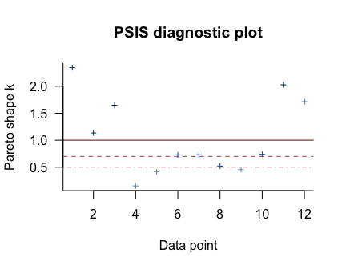

So when you `plot()` a loo object, you get a nice diagnostic plot for those *k* values, ordered by observation number. Our plot indicates cases 1, 3, 11, and 12 had "very bad" *k* values for this model. If we wanted to further verify to ourselves which observations those were, we'd use the `pareto_k_ids()` function.

``` r
pareto_k_ids(l_b10.6, threshold = 1)
```

    ## [1]  1  3 11 12

Note our use of the `threshold` argument. Play around with it to see how it works.

If you want an explicit look at those *k* values, you do:

``` r
l_b10.6$diagnostics
```

    ## $pareto_k
    ##  [1] 2.69051747 0.77111900 1.92152336 0.05435531 0.40860535 0.47054200 0.76418859 0.31870058 0.45581589
    ## [10] 0.53041254 2.18377151 1.44974800
    ## 
    ## $n_eff
    ##  [1]    1.161300   37.842835    1.580728 3155.025266 1039.011868  473.738725   59.267945 1262.981224
    ##  [9]  605.642649  340.763446    1.356693    2.806104

The `pareto_k` values can be used to examine cases that are overly-influential on the model parameters, something like a Cook's *D*<sub>*i*</sub>. See, for example [this discussion on stackoverflow.com](https://stackoverflow.com/questions/39578834/linear-model-diagnostics-for-bayesian-models-using-rstan/39595436) in which several members of the [Stan team](http://mc-stan.org) weighed in. The issue is also discussed in [this paper](https://arxiv.org/abs/1507.04544) and in [this presentation by Aki Vehtari](https://www.youtube.com/watch?v=FUROJM3u5HQ&feature=youtu.be&a=).

Anyway, the implication of all this is these values suggest model `b10.6` isn't a great fit for these data.

Part of the warning message for model `b10.6` read:

> It is recommended to set 'reloo = TRUE' in order to calculate the ELPD without the assumption that these observations are negligible. This will refit the model \[*n*\] times to compute the ELPDs for the problematic observations directly.

Let's do that:

``` r
l_b10.6_reloo <- loo(b10.6, reloo = T)
```

``` r
l_b10.6_reloo
```

    ## 
    ## Computed from 4000 by 12 log-likelihood matrix
    ## 
    ##          Estimate    SE
    ## elpd_loo   -510.5 169.0
    ## p_loo       127.6  47.8
    ## looic      1020.9 338.0
    ## ------
    ## Monte Carlo SE of elpd_loo is NA.
    ## 
    ## Pareto k diagnostic values:
    ##                          Count Pct.    Min. n_eff
    ## (-Inf, 0.5]   (good)     11    91.7%   1         
    ##  (0.5, 0.7]   (ok)        1     8.3%   341       
    ##    (0.7, 1]   (bad)       0     0.0%   <NA>      
    ##    (1, Inf)   (very bad)  0     0.0%   <NA>      
    ## 
    ## All Pareto k estimates are ok (k < 0.7).
    ## See help('pareto-k-diagnostic') for details.

Now that looks better. We'll do the same thing for model `b10.7`.

``` r
l_b10.7_reloo <- loo(b10.7, reloo = T)
```

Okay, let's compare our PSIS-LOO values before and after adjusting `loo()` with `reloo = T`.

``` r
compare_ic(l_b10.6, l_b10.7)
```

    ##                 LOOIC     SE
    ## b10.6          975.54 318.06
    ## b10.7         1033.21 321.51
    ## b10.6 - b10.7  -57.66 157.34

``` r
compare_ic(l_b10.6_reloo, l_b10.7_reloo)
```

    ##                 LOOIC     SE
    ## b10.6         1020.94 337.99
    ## b10.7         1070.04 337.74
    ## b10.6 - b10.7  -49.09 170.96

In this case, the results are kinda similar. But holy smokes, look at the size of those *SE*s! Anyway, watch out for this in your real-world data. You also might check out this [vignette on how the loo package’s Pareto *k* can help detect outliers](https://github.com/ASKurz/Student-s-t_regression).

But this has all been a tangent from the central thrust of this section.

**Back from our information criteria digression.**

Let's get back on track. Here's a look at `b10.6`, the unavailable model:

``` r
print(b10.6)
```

    ##  Family: binomial 
    ##   Links: mu = logit 
    ## Formula: admit | trials(applications) ~ 1 + male 
    ##    Data: d (Number of observations: 12) 
    ## Samples: 2 chains, each with iter = 2500; warmup = 500; thin = 1;
    ##          total post-warmup samples = 4000
    ## 
    ## Population-Level Effects: 
    ##           Estimate Est.Error l-95% CI u-95% CI Eff.Sample Rhat
    ## Intercept    -0.83      0.05    -0.93    -0.73       2277 1.00
    ## male          0.61      0.07     0.48     0.74       2468 1.00
    ## 
    ## Samples were drawn using sampling(NUTS). For each parameter, Eff.Sample 
    ## is a crude measure of effective sample size, and Rhat is the potential 
    ## scale reduction factor on split chains (at convergence, Rhat = 1).

Here's the relative difference in admission odds.

``` r
fixef(b10.6)[2] %>%
  exp() %>%
  round(digits = 2)
```

    ## [1] 1.84

And now we'll compute difference in admission probabilities.

``` r
post <- posterior_samples(b10.6)

post %>%
  mutate(p_admit_male   = inv_logit_scaled(b_Intercept + b_male),
         p_admit_female = inv_logit_scaled(b_Intercept),
         diff_admit     = p_admit_male - p_admit_female) %>%
  summarise(`2.5%`  = quantile(diff_admit, probs = .025),
            `50%`   = median(diff_admit),
            `97.5%` = quantile(diff_admit, probs = .975))
```

    ##       2.5%       50%     97.5%
    ## 1 0.112828 0.1414776 0.1704241

Instead of the `summarise()` code, we could have also used `tidybayes::median_qi(diff_admit)`. It’s good to have options. Here's our version of Figure 10.5.

``` r
d <-
  d %>%
  mutate(case = factor(1:12))

p_10.6 <- 
  predict(b10.6) %>% 
  as_tibble() %>% 
  bind_cols(d)

d_text <-
  d %>%
  group_by(dept) %>%
  summarise(case  = mean(as.numeric(case)),
            admit = mean(admit / applications) + .05)

ggplot(data = d, aes(x = case, y = admit / applications)) +
  geom_pointrange(data = p_10.6, 
                  aes(y    = Estimate / applications,
                      ymin = Q2.5     / applications ,
                      ymax = Q97.5    / applications),
                  color = wes_palette("Moonrise2")[1],
                  shape = 1, alpha = 1/3) +
  geom_point(color = wes_palette("Moonrise2")[2]) +
  geom_line(aes(group = dept),
            color = wes_palette("Moonrise2")[2]) +
  geom_text(data = d_text,
            aes(y = admit, label = dept),
            color = wes_palette("Moonrise2")[2],
            family = "serif") +
  coord_cartesian(ylim = 0:1) +
  labs(y     = "Proportion admitted",
       title = "Posterior validation check") +
  theme(axis.ticks.x = element_blank())
```

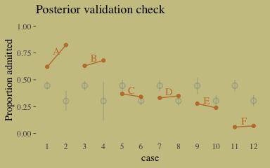

As alluded to in all that LOO/`pareto_k` talk, above, this is not a great fit. So we’ll ditch the last model paradigm for one that answers the new question "*What is the average difference in probability of admission between females and males within departments?*" (p. 307). The statistical formula for the full model follows the form

$$
\\begin{eqnarray}
n\_{\\text{admit}\_i} & \\sim & \\text{Binomial} (n\_i, p\_i) \\\\
\\text{logit} (p\_i) & = & \\alpha\_{\\text{dept}\_i} + \\beta \\text{male}\_i \\\\
\\alpha\_{\\text{dept}} & \\sim & \\text{Normal} (0, 10) \\\\
\\beta & \\sim & \\text{Normal} (0, 10)
\\end{eqnarray}
$$

We don't need to coerce an index like McElreath did in the text. But here are the models.

``` r
b10.8 <-
  brm(data = d, family = binomial,
      admit | trials(applications) ~ 0 + dept,
      prior(normal(0, 10), class = b),
      iter = 2500, warmup = 500, cores = 2, chains = 2)

b10.9 <-
  update(b10.8,
         newdata = d,
         formula = admit | trials(applications) ~ 0 + dept + male)
```

Here we compare all four models by the LOO.

``` r
loos <- loo(b10.6, b10.7, b10.8, b10.9, 
            reloo = T,
            cores = 2)
```

``` r
loos
```

    ##                 LOOIC     SE
    ## b10.6         1041.13 345.45
    ## b10.7         1058.96 333.39
    ## b10.8          133.02  34.02
    ## b10.9          145.71  38.51
    ## b10.6 - b10.7  -17.83 159.34
    ## b10.6 - b10.8  908.12 335.97
    ## b10.6 - b10.9  895.42 336.79
    ## b10.7 - b10.8  925.95 319.27
    ## b10.7 - b10.9  913.26 318.73
    ## b10.8 - b10.9  -12.69   7.58

Here are the LOO weights.

``` r
model_weights(b10.6, b10.7, b10.8, b10.9,
              weights = "loo")
```

    ##         b10.6         b10.7         b10.8         b10.9 
    ## 6.457896e-189 1.944759e-201  8.818437e-01  1.181563e-01

The parameters summaries for our multivariable model, `b10.9`, look like this:

``` r
fixef(b10.9) %>% round(digits = 2)
```

    ##       Estimate Est.Error  Q2.5 Q97.5
    ## deptA     0.68      0.10  0.49  0.88
    ## deptB     0.64      0.11  0.41  0.87
    ## deptC    -0.58      0.07 -0.73 -0.44
    ## deptD    -0.62      0.09 -0.78 -0.45
    ## deptE    -1.06      0.09 -1.25 -0.88
    ## deptF    -2.64      0.16 -2.98 -2.33
    ## male     -0.10      0.08 -0.25  0.06

And on the proportional odds scale, the posterior mean for `b_male` is:

``` r
fixef(b10.9)[7, 1] %>% exp()
```

    ## [1] 0.9061937

Since we've been using brms, there's no need to fit our version of McElreath's `m10.9stan`. We already have that in our `b10.9`. But just for kicks and giggles, here's another way to get the model summary.

``` r
b10.9$fit
```

    ## Inference for Stan model: 3a12d1ca81dcc4f1abc237903458aea3.
    ## 2 chains, each with iter=2500; warmup=1250; thin=1; 
    ## post-warmup draws per chain=1250, total post-warmup draws=2500.
    ## 
    ##           mean se_mean   sd   2.5%    25%    50%    75%  97.5% n_eff Rhat
    ## b_deptA   0.68    0.00 0.10   0.49   0.61   0.68   0.75   0.88  1550    1
    ## b_deptB   0.64    0.00 0.11   0.41   0.56   0.64   0.72   0.87  1681    1
    ## b_deptC  -0.58    0.00 0.07  -0.73  -0.63  -0.58  -0.53  -0.44  2500    1
    ## b_deptD  -0.62    0.00 0.09  -0.78  -0.67  -0.62  -0.56  -0.45  2500    1
    ## b_deptE  -1.06    0.00 0.09  -1.25  -1.12  -1.06  -1.00  -0.88  2500    1
    ## b_deptF  -2.64    0.00 0.16  -2.98  -2.75  -2.64  -2.53  -2.33  2500    1
    ## b_male   -0.10    0.00 0.08  -0.25  -0.15  -0.10  -0.04   0.06  1320    1
    ## lp__    -70.65    0.05 1.78 -74.69 -71.70 -70.34 -69.33 -68.10  1240    1
    ## 
    ## Samples were drawn using NUTS(diag_e) at Mon Sep 24 10:56:12 2018.
    ## For each parameter, n_eff is a crude measure of effective sample size,
    ## and Rhat is the potential scale reduction factor on split chains (at 
    ## convergence, Rhat=1).

Here's our version of Figure 10.6, the posterior validation check.

``` r
predict(b10.9) %>%
  as_tibble() %>% 
  bind_cols(d) %>% 

  ggplot(aes(x = case, y = admit / applications)) +
  geom_pointrange(aes(y    = Estimate / applications,
                      ymin = Q2.5     / applications ,
                      ymax = Q97.5    / applications),
                  color = wes_palette("Moonrise2")[1],
                  shape = 1, alpha = 1/3) +
  geom_point(color = wes_palette("Moonrise2")[2]) +
  geom_line(aes(group = dept),
            color = wes_palette("Moonrise2")[2]) +
  geom_text(data = d_text,
            aes(y = admit, label = dept),
            color = wes_palette("Moonrise2")[2],
            family = "serif") +
  coord_cartesian(ylim = 0:1) +
  labs(y     = "Proportion admitted",
       title = "Posterior validation check") +
  theme(axis.ticks.x = element_blank())
```

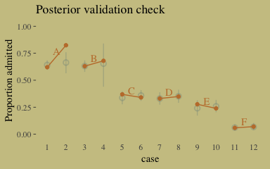

The model precisions are imperfect, but way more valid than before. The posterior looks reasonably multivariate Gaussian.

``` r
pairs(b10.9,
      off_diag_args = list(size = 1/10, alpha = 1/6))
```

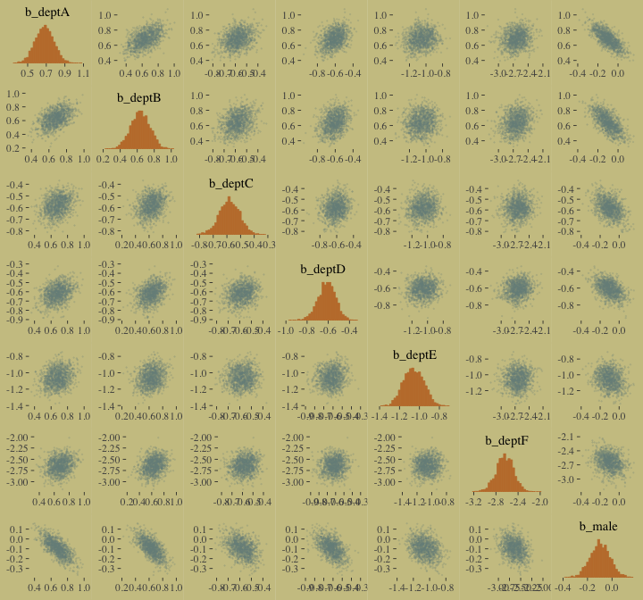

#### Overthinking: WAIC and aggregated binomial models.

McElreath wrote:

> The `WAIC` function in `rethinking` detects aggregated binomial models and automatically splits them apart into 0/1 Bernoulli trials, for the purpose of calculating WAIC. It does this, because WAIC is computed point by point (see Chapter 6). So what you define as a "point" affects WAIC’s value. In an aggregated binomial each "point" is a bunch of independent trials that happen to share the same predictor values. In order for the disaggregated and aggregated models to agree, it makes sense to use the disaggregated representation.

To my knowledge, `brms::waic()` and `brms::loo()` do not do this, which might well be why some of our values didn't match up with those in the text. If you have additional insight on this, please [share with the rest of the class](https://github.com/ASKurz/Statistical_Rethinking_with_brms_ggplot2_and_the_tidyverse/issues).

### Fitting binomial regressions with `glm()`.

We're not here to learn frequentist code, so we're going to skip most of this section. But model `b.good` is worth fitting. Here are the data.

``` r
# outcome and predictor almost perfectly associated
y <- c(rep(0, 10), rep(1, 10))

x <- c(rep(-1, 9), rep(1, 11))
```

Fit the `b.good` model.

``` r
b.good <-
  brm(data = list(y = y, x = x), family = binomial,
      y ~ 1 + x,
      prior = c(prior(normal(0, 10), class = Intercept),
                prior(normal(0, 10), class = b)))
```

Our model summary will differ a bit from the one in the text. It seems this is because of the MAP/HMC contrast and our choice of priors.

``` r
print(b.good)
```

    ##  Family: binomial 
    ##   Links: mu = logit 
    ## Formula: y ~ 1 + x 
    ##    Data: list(y = y, x = x) (Number of observations: 20) 
    ## Samples: 4 chains, each with iter = 2000; warmup = 1000; thin = 1;
    ##          total post-warmup samples = 4000
    ## 
    ## Population-Level Effects: 
    ##           Estimate Est.Error l-95% CI u-95% CI Eff.Sample Rhat
    ## Intercept    -5.50      4.57   -17.25     0.40        457 1.01
    ## x             8.28      4.54     2.31    19.63        446 1.01
    ## 
    ## Samples were drawn using sampling(NUTS). For each parameter, Eff.Sample 
    ## is a crude measure of effective sample size, and Rhat is the potential 
    ## scale reduction factor on split chains (at convergence, Rhat = 1).

You might experiment with different prior *S**D*s to see how they influence the posterior *S**D*s. Anyways, here's the `pairs()` plot McElreath excluded from the text:

``` r
pairs(b.good,
      off_diag_args = list(size = 1/10, alpha = 1/6))
```

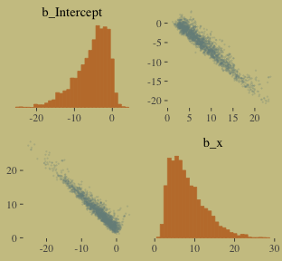

That posterior, my friends, is not multivariate Gaussian. The plot deserves and extensive quote from McElreath.

> Inspecting the pairs plot (~~not~~ shown) demonstrates just how subtle even simple models can be, once we start working with GLMs. I don't say this to scare the reader. But it's true that even simple models can behave in complicated ways. How you fit the model is part of the model, and in principle no GLM is safe for MAP estimation. (p. 311)

Poisson regression
------------------

We'll simulate our sweet count data.

``` r
set.seed(10.2) # make the results reproducible

tibble(y = rbinom(1e5, 1000, 1/1000)) %>% 
  summarise(y_mean     = mean(y),
            y_variance = var(y))
```

    ## # A tibble: 1 x 2
    ##   y_mean y_variance
    ##    <dbl>      <dbl>
    ## 1  0.994      0.995

Yes, those statistics are virtually the same. When dealing with Poisson data, *μ* = *σ*<sup>2</sup>. When you have a number of trials for which *n* is unknown or much larger than seen in the data, the Poisson likelihood is a useful tool. We define it like this

*y* ∼ Poisson(*λ*)

As *λ* expresses both mean and variance because, within this model, the variance scales right along with the mean. Since *λ* is constrained to be positive, we typically use the log link. Thus the basic Poisson regression model is

$$
\\begin{eqnarray}
y\_i & \\sim & \\text{Poisson} (\\lambda\_i) \\\\
\\text{log} (\\lambda\_i) & = & \\alpha + \\beta x\_i
\\end{eqnarray}
$$

### Example: Oceanic tool complexity.

Load the `Kline` data.

``` r
library(rethinking)
data(Kline)
d <- Kline
```

Switch from rethinking to brms.

``` r
detach(package:rethinking)
library(brms)
rm(Kline)

d
```

    ##       culture population contact total_tools mean_TU
    ## 1    Malekula       1100     low          13     3.2
    ## 2     Tikopia       1500     low          22     4.7
    ## 3  Santa Cruz       3600     low          24     4.0
    ## 4         Yap       4791    high          43     5.0
    ## 5    Lau Fiji       7400    high          33     5.0
    ## 6   Trobriand       8000    high          19     4.0
    ## 7       Chuuk       9200    high          40     3.8
    ## 8       Manus      13000     low          28     6.6
    ## 9       Tonga      17500    high          55     5.4
    ## 10     Hawaii     275000     low          71     6.6

Here are our new columns.

``` r
d <-
  d %>%
  mutate(log_pop      = log(population),
         contact_high = ifelse(contact == "high", 1, 0))
```

Our statistical model will follow the form

$$
\\begin{eqnarray}
\\text{total\_tools}\_i & \\sim & \\text{Poisson} (\\lambda\_i) \\\\
\\text{log} (\\lambda\_i) & = & \\alpha + \\beta\_1 \\text{log\_pop}\_i + \\beta\_2 \\text{contact\_high}\_i + \\beta\_3 \\text{contact\_high}\_i \\times \\text{log\_pop}\_i \\\\
\\alpha & \\sim & \\text{Normal} (0, 100) \\\\
\\beta\_1 & \\sim & \\text{Normal} (0, 1) \\\\
\\beta\_2 & \\sim & \\text{Normal} (0, 1) \\\\
\\beta\_3 & \\sim & \\text{Normal} (0, 1)
\\end{eqnarray}
$$

The only new thing in our model code is `family = poisson`. brms defaults to the `log()` link.

``` r
b10.10 <-
  brm(data = d, family = poisson,
      total_tools ~ 1 + log_pop + contact_high + contact_high:log_pop,
      prior = c(prior(normal(0, 100), class = Intercept),
                prior(normal(0, 1), class = b)),
      iter = 3000, warmup = 1000, chains = 4, cores = 4)
```

``` r
print(b10.10)
```

    ##  Family: poisson 
    ##   Links: mu = log 
    ## Formula: total_tools ~ 1 + log_pop + contact_high + contact_high:log_pop 
    ##    Data: d (Number of observations: 10) 
    ## Samples: 4 chains, each with iter = 3000; warmup = 1000; thin = 1;
    ##          total post-warmup samples = 8000
    ## 
    ## Population-Level Effects: 
    ##                      Estimate Est.Error l-95% CI u-95% CI Eff.Sample Rhat
    ## Intercept                0.94      0.37     0.20     1.66       4443 1.00
    ## log_pop                  0.26      0.04     0.19     0.33       4646 1.00
    ## contact_high            -0.10      0.87    -1.75     1.63       2639 1.00
    ## log_pop:contact_high     0.04      0.09    -0.15     0.22       2617 1.00
    ## 
    ## Samples were drawn using sampling(NUTS). For each parameter, Eff.Sample 
    ## is a crude measure of effective sample size, and Rhat is the potential 
    ## scale reduction factor on split chains (at convergence, Rhat = 1).

Here's the lower triangle of the correlation matrix for the parameters.

``` r
post <-
  posterior_samples(b10.10)

post %>%
  select(-lp__) %>% 
  rename(b_interaction = `b_log_pop:contact_high`) %>%
  psych::lowerCor()
```

    ##                b_Int b_lg_ b_cn_ b_ntr
    ## b_Intercept     1.00                  
    ## b_log_pop      -0.98  1.00            
    ## b_contact_high -0.14  0.13  1.00      
    ## b_interaction   0.08 -0.09 -0.99  1.00

And here's the coefficient plot via `bayesplot::mcmc_intervals()`:

``` r
# We'll set a renewed color theme
color_scheme_set(c(wes_palette("Moonrise2")[2],
                   wes_palette("Moonrise2")[1], 
                   wes_palette("Moonrise2")[4], 
                   wes_palette("Moonrise2")[2], 
                   wes_palette("Moonrise2")[1], 
                   wes_palette("Moonrise2")[1]))

post %>%
  select(-lp__) %>% 
  rename(b_interaction = `b_log_pop:contact_high`) %>%

  mcmc_intervals(prob = .5, prob_outer = .95) +
  theme(axis.ticks.y = element_blank(),
        axis.text.y  = element_text(hjust = 0))
```

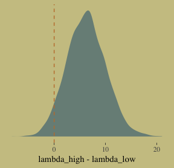

How plausible is it a high-contact island will have more tools than a low-contact island?

``` r
post <-
  post %>%
  mutate(lambda_high = exp(b_Intercept + b_contact_high + (b_log_pop + `b_log_pop:contact_high`)*8),
         lambda_low  = exp(b_Intercept + b_log_pop*8)) %>% 
  mutate(diff        = lambda_high - lambda_low) 

post %>%
  summarise(sum = sum(diff > 0)/length(diff))
```

    ##     sum
    ## 1 0.952

Quite, it turns out. Behold the corresponding Figure 10.8.a.

``` r
post %>%
  ggplot(aes(x = diff)) +
  geom_density(color = "transparent",
               fill = wes_palette("Moonrise2")[1]) +
  geom_vline(xintercept = 0, linetype = 2,
             color = wes_palette("Moonrise2")[2]) +
  scale_y_continuous(NULL, breaks = NULL) +
  labs(x = "lambda_high - lambda_low")
```


I’m not happy with how clunky this solution is, but one way to get those marginal dot and line plots for the axes is to make intermediary tibbles. Anyway, here’s a version of Figure 10.8.b.

``` r
# Intermediary tibbles for our the dot and line portoin of the plot
point_tibble <-
  tibble(x = c(median(post$b_contact_high), min(post$b_contact_high)),
         
         y = c(min(post$`b_log_pop:contact_high`), median(post$`b_log_pop:contact_high`)))

line_tibble <-
  tibble(parameter = rep(c("b_contact_high", "b_log_pop:contact_high"), each = 2),
         
         x = c(quantile(post$b_contact_high, probs = c(.025, .975)),
               rep(min(post$b_contact_high), times = 2)),
         
         y = c(rep(min(post$`b_log_pop:contact_high`), times = 2),
               quantile(post$`b_log_pop:contact_high`, probs = c(.025, .975))))

# the plot
post %>% 
  ggplot(aes(x = b_contact_high, y = `b_log_pop:contact_high`)) +
  geom_point(color = wes_palette("Moonrise2")[1],
             size = 1/10, alpha = 1/10) +
  geom_point(data = point_tibble,
             aes(x = x, y = y)) +
  geom_line(data = line_tibble,
            aes(x = x, y = y, group = parameter))
```

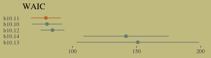

Here we deconstruct model `b10.10`, bit by bit.

``` r
# no interaction
b10.11 <- 
  update(b10.10, formula = total_tools ~ 1 + log_pop + contact_high)

# no contact rate
b10.12 <-
  update(b10.10, formula = total_tools ~ 1 + log_pop)

# no log-population
b10.13 <-
  update(b10.10, formula = total_tools ~ 1 + contact_high)

# intercept only
b10.14 <-
  update(b10.10, formula = total_tools ~ 1)
```

I know we got all excited with the LOO, above. Let's just be lazy and go WAIC, here. \[Though beware, the LOO opens up a similar can of worms, here, to what we dealt with above.\]

``` r
w_b10.10 <- waic(b10.10)
w_b10.11 <- waic(b10.11)
w_b10.12 <- waic(b10.12)
w_b10.13 <- waic(b10.13)
w_b10.14 <- waic(b10.14)
```

``` r
compare_ic(w_b10.10, w_b10.11, w_b10.12, w_b10.13, w_b10.14)
```

    ##                   WAIC    SE
    ## b10.10           80.28 11.85
    ## b10.11           79.15 11.66
    ## b10.12           84.32  9.37
    ## b10.13          150.91 47.79
    ## b10.14          141.72 33.36
    ## b10.10 - b10.11   1.13  1.39
    ## b10.10 - b10.12  -4.04  7.87
    ## b10.10 - b10.13 -70.63 47.73
    ## b10.10 - b10.14 -61.43 34.78
    ## b10.11 - b10.12  -5.17  8.33
    ## b10.11 - b10.13 -71.76 47.41
    ## b10.11 - b10.14 -62.56 34.46
    ## b10.12 - b10.13 -66.59 47.55
    ## b10.12 - b10.14 -57.40 33.28
    ## b10.13 - b10.14   9.19 17.75

``` r
tibble(model = c("b10.10", "b10.11", "b10.12", "b10.13", "b10.14"),
       waic  = c(w_b10.10$estimates[3, 1], w_b10.11$estimates[3, 1], w_b10.12$estimates[3, 1], w_b10.13$estimates[3, 1], w_b10.14$estimates[3, 1]),
       se    = c(w_b10.10$estimates[3, 2], w_b10.11$estimates[3, 2], w_b10.12$estimates[3, 2], w_b10.13$estimates[3, 2], w_b10.14$estimates[3, 2])) %>%

  ggplot() +
  geom_pointrange(aes(x    = reorder(model, -waic), 
                      y    = waic,
                      ymin = waic - se,
                      ymax = waic + se,
                      color = model),
                  shape = 16) +
  scale_color_manual(values = wes_palette("Moonrise2")[c(1, 2, 1, 1, 1)]) +
  coord_flip() +
  labs(x = NULL, y = NULL,
       title = "WAIC") +
  theme(axis.ticks.y    = element_blank(),
        legend.position = "none")
```

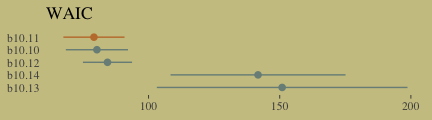

Here's our version of Figure 10.9. Recall, to do an "ensemble" posterior prediction in brms, one uses the `pp_average()` function. I know we were just lazy and focused on the WAIC. But let's play around, a bit. Here we'll weight the models based on the LOO by adding a `weights = "loo"` argument to the `pp_average()` function. If you check the corresponding section of the [brms reference manual](https://cran.r-project.org/web/packages/brms/brms.pdf), you'll find several weighting schemes.

``` r
nd <-
  tibble(log_pop      = seq(from = 6.5, to = 13, length.out = 50) %>% 
           rep(., times = 2),
         contact_high = rep(0:1, each = 50))

ppa_10.9 <- 
  pp_average(b10.10, b10.11, b10.12,
             weights = "loo",
             method  = "fitted",
             newdata = nd) %>%
  as_tibble() %>%
  bind_cols(nd)

ppa_10.9 %>%
  ggplot(aes(x     = log_pop,
             group = contact_high)) +
  geom_ribbon(aes(ymin = Q2.5,
                  ymax = Q97.5,
                  fill = contact_high),
              alpha = 1/4) +
  geom_line(aes(y = Estimate, color = contact_high)) +
  geom_text(data = d, 
             aes(y     = total_tools,
                 label = total_tools,
                 color = contact_high),
             size = 3.5) +
  coord_cartesian(xlim = c(7.1, 12.4),
                  ylim = c(12, 70)) +
  labs(x = "log population",
       y = "total tools",
       subtitle = "Blue is the high contact rate; black is the low.") +
  theme(legend.position = "none",
        panel.border    = element_blank())
```

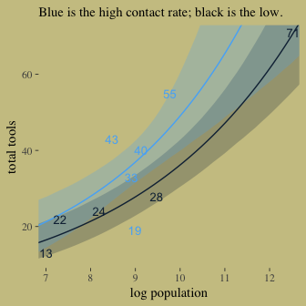

In case you were curious, here are those LOO weights:

``` r
model_weights(b10.10, b10.11, b10.12, 
              weights = "loo")
```

    ##     b10.10     b10.11     b10.12 
    ## 0.38406183 0.57100064 0.04493753

### MCMC islands.

We fit our analogue to `m10.10stan`, `b10.10`, some time ago.

``` r
print(b10.10)
```

    ##  Family: poisson 
    ##   Links: mu = log 
    ## Formula: total_tools ~ 1 + log_pop + contact_high + contact_high:log_pop 
    ##    Data: d (Number of observations: 10) 
    ## Samples: 4 chains, each with iter = 3000; warmup = 1000; thin = 1;
    ##          total post-warmup samples = 8000
    ## 
    ## Population-Level Effects: 
    ##                      Estimate Est.Error l-95% CI u-95% CI Eff.Sample Rhat
    ## Intercept                0.94      0.37     0.20     1.66       4443 1.00
    ## log_pop                  0.26      0.04     0.19     0.33       4646 1.00
    ## contact_high            -0.10      0.87    -1.75     1.63       2639 1.00
    ## log_pop:contact_high     0.04      0.09    -0.15     0.22       2617 1.00
    ## 
    ## Samples were drawn using sampling(NUTS). For each parameter, Eff.Sample 
    ## is a crude measure of effective sample size, and Rhat is the potential 
    ## scale reduction factor on split chains (at convergence, Rhat = 1).

Center `log_pop`.

``` r
d <-
  d %>%
  mutate(log_pop_c = log_pop - mean(log_pop))
```

Now fit the `log_pop`-centered model.

``` r
b10.10_c <-
  brm(data = d, family = poisson,
      total_tools ~ 1 + log_pop_c + contact_high + contact_high:log_pop_c,
      prior = c(prior(normal(0, 10), class = Intercept),
                prior(normal(0, 1), class = b)),
      iter = 3000, warmup = 1000, chains = 4, cores = 4)
```

``` r
print(b10.10_c)
```

    ##  Family: poisson 
    ##   Links: mu = log 
    ## Formula: total_tools ~ 1 + log_pop_c + contact_high + contact_high:log_pop_c 
    ##    Data: d (Number of observations: 10) 
    ## Samples: 4 chains, each with iter = 3000; warmup = 1000; thin = 1;
    ##          total post-warmup samples = 8000
    ## 
    ## Population-Level Effects: 
    ##                        Estimate Est.Error l-95% CI u-95% CI Eff.Sample Rhat
    ## Intercept                  3.31      0.09     3.13     3.48       5173 1.00
    ## log_pop_c                  0.26      0.04     0.20     0.33       6250 1.00
    ## contact_high               0.29      0.12     0.06     0.52       5785 1.00
    ## log_pop_c:contact_high     0.07      0.17    -0.27     0.40       6294 1.00
    ## 
    ## Samples were drawn using sampling(NUTS). For each parameter, Eff.Sample 
    ## is a crude measure of effective sample size, and Rhat is the potential 
    ## scale reduction factor on split chains (at convergence, Rhat = 1).

We'll use `mcmc_pairs()`, again, for Figure 10.10.a.

``` r
# this helps us set our custom color scheme
color_scheme_set(c(wes_palette("Moonrise2")[3], 
                   wes_palette("Moonrise2")[1], 
                   wes_palette("Moonrise2")[2], 
                   wes_palette("Moonrise2")[2], 
                   wes_palette("Moonrise2")[1], 
                   wes_palette("Moonrise2")[1]))

# the actual plot
mcmc_pairs(x = posterior_samples(b10.10),
           pars = c("b_Intercept", "b_log_pop", "b_contact_high", "b_log_pop:contact_high"),
           off_diag_args = list(size = 1/10, alpha = 1/10),
           diag_fun = "dens")
```

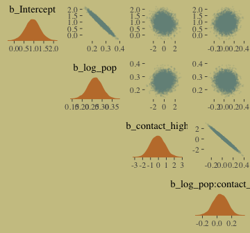

And now behold Figure 10.10.b.

``` r
mcmc_pairs(x = posterior_samples(b10.10_c),
           pars = c("b_Intercept", "b_log_pop_c", "b_contact_high", "b_log_pop_c:contact_high"),
           off_diag_args = list(size = 1/10, alpha = 1/10),
           diag_fun = "dens")
```

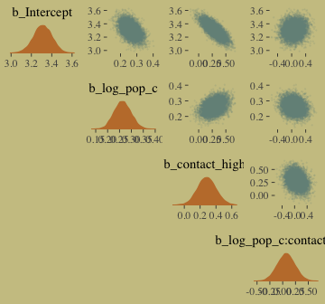

If you really want the correlation point estimates, use `psych::lowerCorr()`.

``` r
psych::lowerCor(posterior_samples(b10.10)[, 1:4])
```

    ##                        b_Int b_lg_ b_cn_ b__:_
    ## b_Intercept             1.00                  
    ## b_log_pop              -0.98  1.00            
    ## b_contact_high         -0.14  0.13  1.00      
    ## b_log_pop:contact_high  0.08 -0.09 -0.99  1.00

``` r
psych::lowerCor(posterior_samples(b10.10_c)[, 1:4])
```

    ##                          b_Int b_l__ b_cn_ b___:
    ## b_Intercept               1.00                  
    ## b_log_pop_c              -0.46  1.00            
    ## b_contact_high           -0.77  0.37  1.00      
    ## b_log_pop_c:contact_high  0.11 -0.20 -0.27  1.00

### Example: Exposure and the offset.

> For the last Poisson example, we’ll look at a case where the exposure varies across observations. When the length of observation, area of sampling, or intensity f sampling varies, the counts we observe also naturally vary. Since a Poisson distribution assumes that the rate of events is constant in time (or space), it’s easy to handle this. All we need to do, as explained on page 312 \[of the text\], is to add the logarithm of the exposure to the linear model. The term we add is typically called an *offset*. (p. 321, *emphasis* in the original)

Here we simulate our data.

``` r
set.seed(3838)

num_days  <- 30
y         <- rpois(num_days, 1.5)

num_weeks <- 4
y_new     <- rpois(num_weeks, 0.5*7)
```

Let's make them tidy and add `log_days`.

``` r
(
  d <- 
  tibble(y         = c(y, y_new), 
         days      = c(rep(1, num_days), rep(7, num_weeks)),
         monastery = c(rep(0, num_days), rep(1, num_weeks))) %>%
  mutate(log_days  = log(days))
)
```

    ## # A tibble: 34 x 4
    ##        y  days monastery log_days
    ##    <int> <dbl>     <dbl>    <dbl>
    ##  1     1     1         0        0
    ##  2     2     1         0        0
    ##  3     1     1         0        0
    ##  4     1     1         0        0
    ##  5     1     1         0        0
    ##  6     2     1         0        0
    ##  7     0     1         0        0
    ##  8     1     1         0        0
    ##  9     1     1         0        0
    ## 10     0     1         0        0
    ## # ... with 24 more rows

With the brms package, you use the `offset()` syntax, in which you put a pre-processed variable like `log_days` or the log of a variable, such as `log(days)`.

``` r
b10.15 <-
  brm(data = d, family = poisson,
      y ~ 1 + offset(log_days) + monastery,
      prior = c(prior(normal(0, 100), class = Intercept),
                prior(normal(0, 1), class = b)),
      iter = 2500, warmup = 500, cores = 2, chains = 2)
```

The model summary:

``` r
print(b10.15)
```

    ##  Family: poisson 
    ##   Links: mu = log 
    ## Formula: y ~ 1 + offset(log_days) + monastery 
    ##    Data: d (Number of observations: 34) 
    ## Samples: 2 chains, each with iter = 2500; warmup = 500; thin = 1;
    ##          total post-warmup samples = 4000
    ## 
    ## Population-Level Effects: 
    ##           Estimate Est.Error l-95% CI u-95% CI Eff.Sample Rhat
    ## Intercept     0.17      0.16    -0.17     0.48       2202 1.00
    ## monastery    -0.90      0.30    -1.53    -0.32       2152 1.00
    ## 
    ## Samples were drawn using sampling(NUTS). For each parameter, Eff.Sample 
    ## is a crude measure of effective sample size, and Rhat is the potential 
    ## scale reduction factor on split chains (at convergence, Rhat = 1).

The mode summary helps clarify that when you use `offset()`, `brm()` fixes the value. Thus there is no parameter estimate for the `offset()`. It’s a fixed part of the model not unlike the Student-*t* *ν* parameter gets fixed to infinity when you use the Gaussian likelihood.

Here we'll compute the posterior means and 89% HDIs with `tidybayes::mean_hdi()`.

``` r
library(tidybayes)

posterior_samples(b10.15) %>%
  transmute(lambda_old = exp(b_Intercept),
            lambda_new = exp(b_Intercept + b_monastery)) %>%
  gather() %>%
  mutate(key = factor(key, levels = c("lambda_old", "lambda_new"))) %>%
  group_by(key) %>%
  mean_hdi(value, .width = .89) %>% 
  mutate_if(is.double, round, digits = 2)
```

    ## # A tibble: 2 x 7
    ##   key        value .lower .upper .width .point .interval
    ##   <fct>      <dbl>  <dbl>  <dbl>  <dbl> <chr>  <chr>    
    ## 1 lambda_old   1.2   0.88   1.49   0.89 mean   hdi      
    ## 2 lambda_new   0.5   0.3    0.71   0.89 mean   hdi

As McElreath pointed out in the text, "Your estimates will be slightly different, because you got different randomly simulated data" (p. 322).

Other count regressions
-----------------------

The next two of the remaining four models are maximum entropy distributions for certain problem types. The last two are mixtures, of which we’ll see more in the next chapter.

### Multinomial.

> When more than two types of unordered events are possible, and the probability of each type of event is constant across trials, then the maximum entropy distribution is the multinomial distribution. \[We\] already met the multinomial, implicitly, in Chapter 9 when we tossed pebbles into buckets as an introduction to maximum entropy. The binomial is really a special case of this distribution. And so its distribution formula resembles the binomial, just extrapolated out to three or more types of events. If there are *K* types of events with probabilities *p*<sub>1</sub>, …, *p*<sub>*K*</sub>, then the probability of observing *y*<sub>1</sub>, …, *y*<sub>*K*</sub> events of each type out of *n* trials is (p. 323):

$$\\text{Pr} (y\_1, ..., y\_K | n, p\_1, ..., p\_K) = \\frac{n!}{\\prod\_i y\_i!} \\prod\_{i = 1}^K p\_i^{y\_i}$$

Compare that equation with the simpler version in section 2.3.1 (page 33 in the text).

#### Explicit multinomial models.

"The conventional and natural link is this context is the *multinomial logit*. This link function takes a vector of *scores*, one for each *K* event types, and computed the probability of a particular type of event *K* as" (p. 323, *emphasis* in the original)

$$\\text{Pr} (k |s\_1, s\_2, ..., s\_K) = \\frac{\\text{exp} (s\_k)}{\\sum\_{i = 1}^K \\text{exp} (s\_i)}$$

Let's simulate the data.

``` r
detach(package:brms)
library(rethinking)

# simulate career choices among 500 individuals
N      <- 500           # number of individuals
income <- 1:3           # expected income of each career
score  <- 0.5 * income  # scores for each career, based on income

# next line converts scores to probabilities
p <- softmax(score[1], score[2], score[3])

# now simulate choice
# outcome career holds event type values, not counts
career <- rep(NA, N)  # empty vector of choices for each individual

set.seed(2078)
# sample chosen career for each individual
for(i in 1:N) career[i] <- sample(1:3, size = 1, prob = p)
```

Here's what the data look like.

``` r
career %>%
  as_tibble() %>%
  ggplot(aes(x = value %>% as.factor())) +
  geom_bar(size = 0, fill = wes_palette("Moonrise2")[2])
```

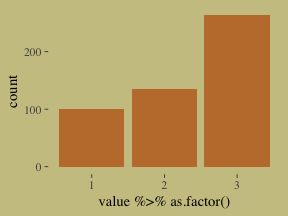

Switch out rethinking for brms.

``` r
detach(package:rethinking)
library(brms)
```

Here's my naive attempt to fit the model in brms.

``` r
b10.16 <-
  brm(data = list(career = career), 
      family = categorical(link = "logit"),
      career ~ 1,
      prior(normal(0, 5), class = Intercept),
      iter = 2500, warmup = 500, cores = 2, chains = 2)
```

This differs from McElreath's `m10.16`. Most obviously, this has two parameters. McElreath's `m10.16` only has one. If you have experience with these models and know how to reproduce McElreath's results in brms, [please share your code](https://github.com/ASKurz/Statistical_Rethinking_with_brms_ggplot2_and_the_tidyverse/issues/5).

``` r
print(b10.16)
```

    ##  Family: categorical 
    ##   Links: mu2 = logit; mu3 = logit 
    ## Formula: career ~ 1 
    ##    Data: list(career = career) (Number of observations: 500) 
    ## Samples: 2 chains, each with iter = 2500; warmup = 500; thin = 1;
    ##          total post-warmup samples = 4000
    ## 
    ## Population-Level Effects: 
    ##               Estimate Est.Error l-95% CI u-95% CI Eff.Sample Rhat
    ## mu2_Intercept     0.29      0.13     0.03     0.54       1535 1.00
    ## mu3_Intercept     0.96      0.11     0.73     1.18       1591 1.00
    ## 
    ## Samples were drawn using sampling(NUTS). For each parameter, Eff.Sample 
    ## is a crude measure of effective sample size, and Rhat is the potential 
    ## scale reduction factor on split chains (at convergence, Rhat = 1).

Here's the second data simulation, this time based on McElreath's R code 10.58.

``` r
detach(package:brms)
library(rethinking)

N <- 100

set.seed(2078)
# simulate family incomes for each individual
family_income <- runif(N)

# assign a unique coefficient for each type of event
b      <- (1:-1)
career <- rep(NA, N)  # empty vector of choices for each individual

for (i in 1:N) {
    score <- 0.5*(1:3) + b*family_income[i]
    p <- softmax(score[1], score[2], score[3])
    career[i] <- sample(1:3, size = 1, prob = p)
}
```

Switch out rethinking for brms.

``` r
detach(package:rethinking)
library(brms)
```

Here's the brms version of McElreath's `m10.17`.

``` r
b10.17 <-
  brm(data = list(career        = career,  # note how we used a list instead of a tibble
                  family_income = family_income), 
      family = categorical(link = "logit"),
      career ~ 1 + family_income,
      prior = c(prior(normal(0, 5), class = Intercept),
                prior(normal(0, 5), class = b)),
      iter = 2500, warmup = 500, cores = 2, chains = 2)
```

Happily, these results cohere with the rethinking model.

``` r
print(b10.17)
```

    ##  Family: categorical 
    ##   Links: mu2 = logit; mu3 = logit 
    ## Formula: career ~ 1 + family_income 
    ##    Data: list(career = career, family_income = family_incom (Number of observations: 100) 
    ## Samples: 2 chains, each with iter = 2500; warmup = 500; thin = 1;
    ##          total post-warmup samples = 4000
    ## 
    ## Population-Level Effects: 
    ##                   Estimate Est.Error l-95% CI u-95% CI Eff.Sample Rhat
    ## mu2_Intercept         1.86      0.57     0.79     3.04       2514 1.00
    ## mu3_Intercept         1.54      0.56     0.49     2.66       2433 1.00
    ## mu2_family_income    -3.97      1.06    -6.20    -1.97       2758 1.00
    ## mu3_family_income    -2.55      0.92    -4.37    -0.80       2799 1.00
    ## 
    ## Samples were drawn using sampling(NUTS). For each parameter, Eff.Sample 
    ## is a crude measure of effective sample size, and Rhat is the potential 
    ## scale reduction factor on split chains (at convergence, Rhat = 1).

McElreath described the parameters as "on a scale that is very hard to interpret" (p. 325). Indeed.

#### Multinomial in disguise as Poisson.

Here we fit a multinomial likelihood by refactoring it to a series of Poissons. Let's retrieve the Berkeley data.

``` r
library(rethinking)

data(UCBadmit)
d <- UCBadmit
rm(UCBadmit)

detach(package:rethinking)
library(brms)
```

Fit the models.

``` r
# binomial model of overall admission probability
b_binom <-
  brm(data = d, family = binomial,
      admit | trials(applications) ~ 1,
      prior(normal(0, 100), class = Intercept),
      iter = 2000, warmup = 1000, cores = 3, chains = 3)

# Poisson model of overall admission rate and rejection rate
b_pois <-
  brm(data = d %>%
        mutate(rej = reject),  # 'reject' is a reserved word
      family = poisson,
      cbind(admit, rej) ~ 1,
      prior(normal(0, 100), class = Intercept),
      iter = 2000, warmup = 1000, cores = 3, chains = 3)
```

Note, the `cbind()` syntax made `b_pois` a multivariate Poisson model. Starting with version 2.0.0., [brms supports a variety of multivariate models](https://cran.r-project.org/web/packages/brms/vignettes/brms_multivariate.html). Anyway, here are the implications of `b_pois`.

``` r
# extract the samples
post <- posterior_samples(b_pois)

# wrangle
post %>%
  transmute(admit  = exp(b_admit_Intercept), 
            reject = exp(b_rej_Intercept)) %>% 
  gather() %>% 
  
  # plot
  ggplot(aes(x = value, y = key, fill = key)) +
  geom_halfeyeh(point_interval = median_qi, .width = .95,
                color = wes_palette("Moonrise2")[4]) +
  scale_fill_manual(values = c(wes_palette("Moonrise2")[1],
                               wes_palette("Moonrise2")[2])) +
  labs(title = " Mean admit/reject rates across departments",
       x     = "# applications",
       y     = NULL) +
  theme(legend.position = "none",
        axis.ticks.y    = element_blank())
```

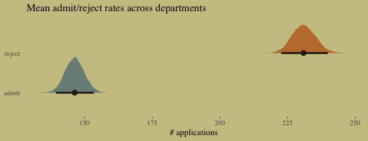

The model summaries:

``` r
print(b_binom)
```

    ##  Family: binomial 
    ##   Links: mu = logit 
    ## Formula: admit | trials(applications) ~ 1 
    ##    Data: d (Number of observations: 12) 
    ## Samples: 3 chains, each with iter = 2000; warmup = 1000; thin = 1;
    ##          total post-warmup samples = 3000
    ## 
    ## Population-Level Effects: 
    ##           Estimate Est.Error l-95% CI u-95% CI Eff.Sample Rhat
    ## Intercept    -0.46      0.03    -0.52    -0.39        912 1.00
    ## 
    ## Samples were drawn using sampling(NUTS). For each parameter, Eff.Sample 
    ## is a crude measure of effective sample size, and Rhat is the potential 
    ## scale reduction factor on split chains (at convergence, Rhat = 1).

``` r
print(b_pois)
```

    ##  Family: MV(poisson, poisson) 
    ##   Links: mu = log
    ##          mu = log 
    ## Formula: admit ~ 1 
    ##          rej ~ 1 
    ##    Data: d %>% mutate(rej = reject) (Number of observations: 12) 
    ## Samples: 3 chains, each with iter = 2000; warmup = 1000; thin = 1;
    ##          total post-warmup samples = 3000
    ## 
    ## Population-Level Effects: 
    ##                 Estimate Est.Error l-95% CI u-95% CI Eff.Sample Rhat
    ## admit_Intercept     4.99      0.02     4.94     5.03       2532 1.00
    ## rej_Intercept       5.44      0.02     5.41     5.48       2613 1.00
    ## 
    ## Samples were drawn using sampling(NUTS). For each parameter, Eff.Sample 
    ## is a crude measure of effective sample size, and Rhat is the potential 
    ## scale reduction factor on split chains (at convergence, Rhat = 1).

Here's the posterior mean for the probability of admission, based on `b_binom`.

``` r
fixef(b_binom)[ ,"Estimate"] %>%
  inv_logit_scaled()
```

    ## [1] 0.3877749

Happily, we get the same value within simulation error from model `b_pois`.

``` r
k <- 
  fixef(b_pois) %>%
  as.numeric()

exp(k[1]) / (exp(k[1]) + exp(k[2]))
```

    ## [1] 0.3878254

The formula for what we just did in code is

$$p\_{\\text{admit}} = \\frac{\\lambda\_1}{\\lambda\_1 + \\lambda\_2} = \\frac{\\text{exp} (\\alpha\_1)}{\\text{exp} (\\alpha\_1) + \\text{exp} (\\alpha\_2)}$$

### Geometric.

> Sometimes a count variable is a number of events up until something happened. Call this "something" the terminating event. Often we want to model the probability of that event, a kind of analysis known as event history analysis or survival analysis. When the probability of the terminating event is constant through time (or distance), and the units of time (or distance) are discrete, a common likelihood function is the geometric distribution. This distribution has the form:
>
> Pr(*y*|*p*)=*p*(1 − *p*)<sup>*y* − 1</sup>
>
> where *y* is the number of time steps (events) until the terminating event occurred and *p* is the probability of that event in each time step. This distribution has maximum entropy for unbounded counts with constant expected value. (pp. 327--328)

Here we simulate exemplar data.

``` r
# simulate
N <- 100
set.seed(10.32)
x <- runif(N)

set.seed(10.32)
y <- rgeom(N, prob = inv_logit_scaled(-1 + 2*x))
```

In case you're curious, here are the data.

``` r
list(y = y, x = x) %>%
  as_tibble() %>%
  ggplot(aes(x = x, y = y)) +
  geom_point(size = 3/5, alpha = 2/3)
```

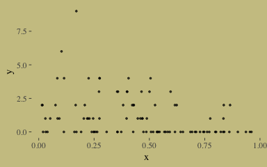

Our geometric model:

``` r
b10.18 <-
  brm(data = list(y = y, x = x), 
      family = geometric(link = log),
      y ~ 0 + intercept + x,
      prior = c(prior(normal(0, 10), class = b, coef = intercept),
                prior(normal(0, 1), class = b)),
      iter = 2500, warmup = 500, chains = 2, cores = 2)
```

The results:

``` r
print(b10.18, digits = 2)
```

    ##  Family: geometric 
    ##   Links: mu = log 
    ## Formula: y ~ 0 + intercept + x 
    ##    Data: list(y = y, x = x) (Number of observations: 100) 
    ## Samples: 2 chains, each with iter = 2500; warmup = 500; thin = 1;
    ##          total post-warmup samples = 4000
    ## 
    ## Population-Level Effects: 
    ##           Estimate Est.Error l-95% CI u-95% CI Eff.Sample Rhat
    ## intercept     0.75      0.25     0.27     1.26       1224 1.00
    ## x            -1.62      0.53    -2.66    -0.58       1217 1.00
    ## 
    ## Samples were drawn using sampling(NUTS). For each parameter, Eff.Sample 
    ## is a crude measure of effective sample size, and Rhat is the potential 
    ## scale reduction factor on split chains (at convergence, Rhat = 1).

It turns out brms uses a [different parameterization for the geometric distribution](https://cran.r-project.org/web/packages/brms/vignettes/brms_families.html) than rethinking does. It follows the form

$$f(y\_i) = {y\_i \\choose y\_i} \\bigg (\\frac{\\mu\_i}{\\mu\_i + 1} \\bigg )^{y\_i} \\bigg (\\frac{1}{\\mu\_i + 1} \\bigg )$$

Even though the parameters brms yielded look different from those in the text, their predictions describe the data well. Here's the `marginal_effects()` plot:

``` r
plot(marginal_effects(b10.18),
     points = T,
     point_args = c(size = 3/5, alpha = 2/3),
     line_args  = c(color = wes_palette("Moonrise2")[1],
                    fill  = wes_palette("Moonrise2")[1]))
```

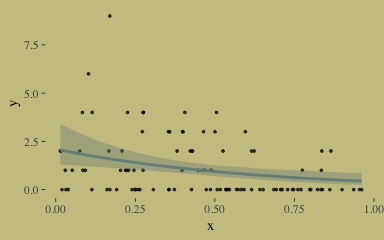

Reference
---------

[McElreath, R. (2016). *Statistical rethinking: A Bayesian course with examples in R and Stan.* Chapman & Hall/CRC Press.](https://xcelab.net/rm/statistical-rethinking/)

Session info
------------

``` r
sessionInfo()
```

    ## R version 3.5.1 (2018-07-02)
    ## Platform: x86_64-apple-darwin15.6.0 (64-bit)
    ## Running under: macOS High Sierra 10.13.6
    ## 
    ## Matrix products: default
    ## BLAS: /Library/Frameworks/R.framework/Versions/3.5/Resources/lib/libRblas.0.dylib
    ## LAPACK: /Library/Frameworks/R.framework/Versions/3.5/Resources/lib/libRlapack.dylib
    ## 
    ## locale:
    ## [1] en_US.UTF-8/en_US.UTF-8/en_US.UTF-8/C/en_US.UTF-8/en_US.UTF-8
    ## 
    ## attached base packages:
    ## [1] parallel  stats     graphics  grDevices utils     datasets  methods   base     
    ## 
    ## other attached packages:
    ##  [1] brms_2.5.0         tidybayes_1.0.1    loo_2.0.0          bindrcpp_0.2.2     bayesplot_1.6.0   
    ##  [6] ggthemes_3.5.0     wesanderson_0.3.6  forcats_0.3.0      stringr_1.3.1      dplyr_0.7.6       
    ## [11] purrr_0.2.5        readr_1.1.1        tidyr_0.8.1        tibble_1.4.2       tidyverse_1.2.1   
    ## [16] Rcpp_0.12.18       rstan_2.17.3       StanHeaders_2.17.2 ggplot2_3.0.0     
    ## 
    ## loaded via a namespace (and not attached):
    ##  [1] nlme_3.1-137              matrixStats_0.54.0        xts_0.10-2                lubridate_1.7.4          
    ##  [5] threejs_0.3.1             httr_1.3.1                LaplacesDemon_16.1.1      rprojroot_1.3-2          
    ##  [9] tools_3.5.1               backports_1.1.2           utf8_1.1.4                R6_2.2.2                 
    ## [13] DT_0.4                    lazyeval_0.2.1            colorspace_1.3-2          withr_2.1.2              
    ## [17] tidyselect_0.2.4          gridExtra_2.3             mnormt_1.5-5              Brobdingnag_1.2-5        
    ## [21] compiler_3.5.1            cli_1.0.0                 rvest_0.3.2               HDInterval_0.2.0         
    ## [25] arrayhelpers_1.0-20160527 xml2_1.2.0                shinyjs_1.0               labeling_0.3             
    ## [29] colourpicker_1.0          scales_0.5.0              dygraphs_1.1.1.5          mvtnorm_1.0-8            
    ## [33] psych_1.8.4               ggridges_0.5.0            digest_0.6.15             foreign_0.8-70           
    ## [37] rmarkdown_1.10            rethinking_1.59           base64enc_0.1-3           pkgconfig_2.0.1          
    ## [41] htmltools_0.3.6           htmlwidgets_1.2           rlang_0.2.1               readxl_1.1.0             
    ## [45] rstudioapi_0.7            shiny_1.1.0               svUnit_0.7-12             bindr_0.1.1              
    ## [49] zoo_1.8-2                 jsonlite_1.5              crosstalk_1.0.0           gtools_3.8.1             
    ## [53] inline_0.3.15             magrittr_1.5              Matrix_1.2-14             munsell_0.5.0            
    ## [57] abind_1.4-5               stringi_1.2.3             yaml_2.1.19               MASS_7.3-50              
    ## [61] ggstance_0.3              plyr_1.8.4                grid_3.5.1                promises_1.0.1           
    ## [65] crayon_1.3.4              miniUI_0.1.1.1            lattice_0.20-35           haven_1.1.2              
    ## [69] hms_0.4.2                 knitr_1.20                pillar_1.2.3              igraph_1.2.1             
    ## [73] markdown_0.8              shinystan_2.5.0           reshape2_1.4.3            codetools_0.2-15         
    ## [77] stats4_3.5.1              rstantools_1.5.0          glue_1.2.0                evaluate_0.10.1          
    ## [81] modelr_0.1.2              httpuv_1.4.4.2            cellranger_1.1.0          gtable_0.2.0             
    ## [85] assertthat_0.2.0          mime_0.5                  xtable_1.8-2              broom_0.4.5              
    ## [89] coda_0.19-1               later_0.7.3               rsconnect_0.8.8           shinythemes_1.1.1        
    ## [93] bridgesampling_0.4-0
