Ch. 12 Multilevel Models
================
A Solomon Kurz
2018-08-31

Multilevel Models
=================

> [Multilevel models](#multilevel-models) remember features of each cluster in the data as they learn about all of the clusters. Depending upon the variation among clusters, which is learned from the data as well, the model pools information across clusters. This pooling tends to improve estimates about each cluster. This improved estimation leads to several, more pragmatic sounding, benefits of the multilevel approach. (p. 356)

These benefits include:

-   improved estimates for repeated sampling (i.e., in longitudinal data)
-   improved estimates when there are imbalances among subsamples
-   estimates of the variation across subsamples
-   avoiding simplistic averaging by retaining variation across subsamples

Example: Multilevel tadpoles
----------------------------

Let's get the `reedfrogs` data from rethinking.

``` r
library(rethinking)
data(reedfrogs)
d <- reedfrogs
```

Detach rethinking and load brms.

``` r
rm(reedfrogs)
detach(package:rethinking, unload = T)
library(brms)
```

Go ahead and acquaint yourself with the `reedfrogs`.

``` r
library(tidyverse)

d %>%
  glimpse()
```

    ## Observations: 48
    ## Variables: 5
    ## $ density  <int> 10, 10, 10, 10, 10, 10, 10, 10, 10, 10, 10, 10, 10, 1...
    ## $ pred     <fct> no, no, no, no, no, no, no, no, pred, pred, pred, pre...
    ## $ size     <fct> big, big, big, big, small, small, small, small, big, ...
    ## $ surv     <int> 9, 10, 7, 10, 9, 9, 10, 9, 4, 9, 7, 6, 7, 5, 9, 9, 24...
    ## $ propsurv <dbl> 0.90, 1.00, 0.70, 1.00, 0.90, 0.90, 1.00, 0.90, 0.40,...

Making the `tank` cluster variable is easy.

``` r
d <- 
  d %>%
  mutate(tank = 1:nrow(d))
```

Here's the formula for the un-pooled model in which each `tank` gets its own intercept.

$$\\begin{eqnarray}
text{surv}\_i & \\sim & \\text{Binomial} (n\_i, p\_i) \\\\
\\text{logit} (p\_i) & = & \\alpha\_{\\text{tank}\_i} \\\\
\\alpha\_{\\text{tank}} & \\sim & \\text{Normal} (0, 5)
\\end{eqnarray}$$

And *n*<sub>*i*</sub> = density. Now we'll fit this simple aggregated binomial model much like we practiced in Chapter 10.

``` r
b12.1 <- 
  brm(data = d, family = binomial,
      surv | trials(density) ~ 0 + factor(tank),
      prior(normal(0, 5), class = b),
      iter = 2000, warmup = 500, chains = 4, cores = 4)
```

The formula for the multilevel alternative is

$$\\begin{eqnarray}
text{surv}\_i & \\sim & \\text{Binomial} (n\_i, p\_i) \\\\
\\text{logit} (p\_i) & = & \\alpha\_{\\text{tank}\_i} \\\\
\\alpha\_{\\text{tank}} & \\sim & \\text{Normal} (\\alpha, \\sigma) \\\\
\\alpha & \\sim & \\text{Normal} (0, 1) \\\\
\\sigma & \\sim & \\text{HalfCauchy} (0, 1)
\\end{eqnarray}$$

You specify the corresponding multilevel model like this.

``` r
b12.2 <- 
  brm(data = d, family = binomial,
      surv | trials(density) ~ 1 + (1 | tank),
      prior = c(prior(normal(0, 1), class = Intercept),
                prior(cauchy(0, 1), class = sd)),
      iter = 4000, warmup = 1000, chains = 4, cores = 4)
```

The syntax for the varying effects follows the [lme4 style](https://cran.r-project.org/web/packages/brms/vignettes/brms_overview.pdf), `( <varying predictor(s)> | <grouping variable(s)> )`. In this case `(1 | tank)` indicates only the intercept, `1`, varies by `tank`. The extent to which parameters vary is controlled by the prior `prior(cauchy(0, 1), class = sd)`, which is <u>parameterized in the standard deviation metric</u>. Do note that last part. It's common in multilevel software to model in the variance metric, instead.

Instead of computing the information criteria for each model, saving the results as objects and then placing those objects in `compare_ic()`, we can also just but both fit objects in `waic()` or `loo()`.

``` r
waic(b12.1, b12.2)
```

    ##                 WAIC   SE
    ## b12.1         200.64 9.39
    ## b12.2         201.00 7.32
    ## b12.1 - b12.2  -0.36 4.46

``` r
loo(b12.1, b12.2)
```

    ## Warning: Found 37 observations with a pareto_k > 0.7 in model 'b12.1'.
    ## With this many problematic observations, it may be more appropriate to use
    ## 'kfold' with argument 'K = 10' to perform 10-fold cross-validation rather
    ## than LOO.

    ## Warning: Found 42 observations with a pareto_k > 0.7 in model 'b12.2'.
    ## With this many problematic observations, it may be more appropriate to use
    ## 'kfold' with argument 'K = 10' to perform 10-fold cross-validation rather
    ## than LOO.

    ##                LOOIC    SE
    ## b12.1         227.99 10.53
    ## b12.2         230.00  8.88
    ## b12.1 - b12.2  -2.00  6.27

Note those "pareto\_k &gt; 0.7" warnings. We can follow the advice and use the `kfold()` function, instead. We'll also go ahead and specify `K = 10`, as recommended. But beware, this takes a few minutes.

``` r
kf <- kfold(b12.1, b12.2, 
            K = 10, cores = 4)
```

``` r
kf
```

    ##               KFOLDIC    SE
    ## b12.1          324.19 13.22
    ## b12.2          268.47 13.24
    ## b12.1 - b12.2   55.72  9.04

The *K*-fold cross-validation difference of 56, with a standard error around 9, suggests that model `b12.2` is the clear favorite relative to `b12.1`. For more on the `kfold()` function, see the [brms reference manual](https://cran.r-project.org/web/packages/brms/brms.pdf).

But here's our prep work for Figure 12.1

``` r
post <- posterior_samples(b12.2)

postMdn <- 
  coef(b12.2, robust = T)$tank[, , ] %>% 
  as_tibble() %>% 
  bind_cols(d) %>%
  mutate(postMdn = inv_logit_scaled(Estimate))

postMdn
```

    ## # A tibble: 48 x 11
    ##    Estimate Est.Error   Q2.5 Q97.5 density pred  size   surv propsurv
    ##       <dbl>     <dbl>  <dbl> <dbl>   <int> <fct> <fct> <int>    <dbl>
    ##  1    2.07      0.855  0.595  3.99      10 no    big       9      0.9
    ##  2    2.95      1.08   1.15   5.53      10 no    big      10      1  
    ##  3    0.973     0.651 -0.254  2.40      10 no    big       7      0.7
    ##  4    2.93      1.07   1.19   5.43      10 no    big      10      1  
    ##  5    2.06      0.832  0.613  3.99      10 no    small     9      0.9
    ##  6    2.07      0.843  0.597  4.03      10 no    small     9      0.9
    ##  7    2.95      1.07   1.19   5.48      10 no    small    10      1  
    ##  8    2.06      0.856  0.615  4.02      10 no    small     9      0.9
    ##  9   -0.180     0.591 -1.42   1.01      10 pred  big       4      0.4
    ## 10    2.05      0.826  0.604  4.03      10 pred  big       9      0.9
    ## # ... with 38 more rows, and 2 more variables: tank <int>, postMdn <dbl>

For kicks and giggles, let's use a [FiveThirtyEight-like theme](https://github.com/alex23lemm/theme_fivethirtyeight) for our plots. An easy way to do so is with help from the [ggthemes package](https://cran.r-project.org/web/packages/ggthemes/index.html).

``` r
# install.packages("ggthemes", dependencies = T) 

library(ggthemes) 
```

Finally, here's the ggplot2 code to reproduce Figure 12.1.

``` r
postMdn %>%
  ggplot(aes(x = tank, y = postMdn)) +
  geom_hline(yintercept = inv_logit_scaled(median(post$b_Intercept)), linetype = 2, size = 1/4) +
  geom_vline(xintercept = c(16.5, 32.5), size = 1/4) +
  geom_point(aes(y = propsurv), color = "orange2") +
  geom_point(shape = 1) +
  coord_cartesian(ylim = c(0, 1)) +
  scale_x_continuous(breaks = c(1, 16, 32, 48)) +
  labs(title    = "Multilevel shrinkage!",
       subtitle = "The empirical proportions are in orange while the model-\nimplied proportions are the black circles. The dashed line is\nthe model-implied average survival proportion.") +
  annotate("text", x = c(8, 16 + 8, 32 + 8), y = 0, 
           label = c("small tanks", "medium tanks", "large tanks")) +
  theme_fivethirtyeight() +
  theme(panel.grid = element_blank())
```

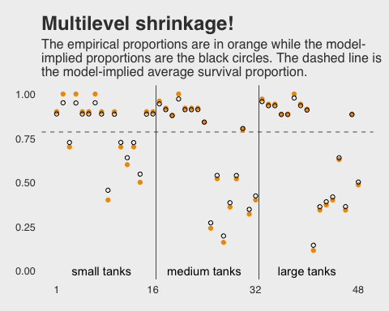

Here is our version of Figure 12.2.a.

``` r
tibble(x = c(-4, 5)) %>%
  
  ggplot(aes(x = x)) +
  mapply(function(mean, sd) {
    stat_function(fun   = dnorm, 
                  args  = list(mean = mean, sd = sd), 
                  alpha = .2, 
                  color = "orange2")
    }, 
    # Enter means and standard deviations here
    mean = post[1:100, 1],
    sd   = post[1:100, 2]
    ) +
  labs(title = "Population survival distribution",
       subtitle = "The Gaussians are on the log-odds scale.") +
  scale_y_continuous(NULL, breaks = NULL) +
  coord_cartesian(xlim = c(-3, 4)) + 
  theme_fivethirtyeight() +
  theme(plot.title    = element_text(size = 13),
        plot.subtitle = element_text(size = 10))
```

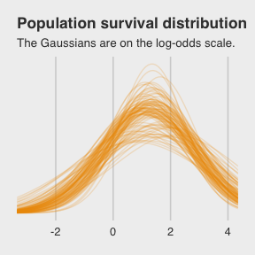

Note the uncertainty in terms of both location *α* and scale *σ*. Now here's the code for Figure 12.2.b.

``` r
ggplot(data = post, 
       aes(x = rnorm(n    = nrow(post), 
                     mean = post[, 1], 
                     sd   = post[, 2]) %>% 
             inv_logit_scaled())) +
  geom_density(size = 0, fill = "orange2") +
  labs(title = "Probability of survival") +
  scale_y_continuous(NULL, breaks = NULL) +
  theme_fivethirtyeight()
```

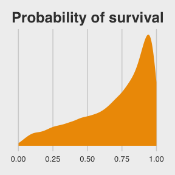

Note how we sampled 12,000 imaginary `tanks` rather than McElreath's 8,000. This is because we had 12,000 HMC iterations (i.e., execute `nrow(post)`).

The `aes()` code, above, was a bit much. To get a sense of how it worked, consider this:

``` r
rnorm(n    = 1, 
      mean = post[, 1], 
      sd   = post[, 2]) %>% 
  inv_logit_scaled()
```

    ## [1] 0.8056928

First, we took one random draw from a normal distribution with a mean of the first row in `post[, 1]` and a standard deviation of the value from the first row in `post[, 2]`, and passed it through the `inv_logit_scaled()` function. By replacing the `1` with `nrow(post)`, we do this `nrow(post)` times (i.e., 12,000). So our orange density is the summary of that process.

##### Overthinking: Prior for variance components.

Yep, you can use the exponential distribution for your priors in brms. Here it is for model `b12.2`.

``` r
b12.2.e <- 
  update(b12.2,
         prior = c(prior(normal(0, 1), class = Intercept),
                   prior(exponential(1), class = sd)))
```

The model summary:

``` r
print(b12.2.e)
```

    ##  Family: binomial 
    ##   Links: mu = logit 
    ## Formula: surv | trials(density) ~ 1 + (1 | tank) 
    ##    Data: d (Number of observations: 48) 
    ## Samples: 4 chains, each with iter = 4000; warmup = 2000; thin = 1;
    ##          total post-warmup samples = 8000
    ## 
    ## Group-Level Effects: 
    ## ~tank (Number of levels: 48) 
    ##               Estimate Est.Error l-95% CI u-95% CI Eff.Sample Rhat
    ## sd(Intercept)     1.62      0.22     1.25     2.11       2193 1.00
    ## 
    ## Population-Level Effects: 
    ##           Estimate Est.Error l-95% CI u-95% CI Eff.Sample Rhat
    ## Intercept     1.30      0.25     0.82     1.79       1655 1.00
    ## 
    ## Samples were drawn using sampling(NUTS). For each parameter, Eff.Sample 
    ## is a crude measure of effective sample size, and Rhat is the potential 
    ## scale reduction factor on split chains (at convergence, Rhat = 1).

If you're curious how the exponential prior compares to the posterior, you might just plot.

``` r
tibble(x = seq(from = 0, to = 6, by = .01)) %>% 
  
  ggplot(aes(x = x)) +
  geom_ribbon(aes(ymin = 0, ymax = dexp(x, rate = 1)),  # the prior
              fill = "orange2", alpha = 1/3) +
  geom_density(data = posterior_samples(b12.2.e),       # the posterior
               aes(x = sd_tank__Intercept), 
               fill = "orange2", size = 0) +
  scale_y_continuous(NULL, breaks = NULL) +
  coord_cartesian(xlim = c(0, 5)) +
  labs(title = "Bonus prior/posterior plot\nfor sd_tank__Intercept",
       subtitle = "The prior is the semitransparent ramp in the\nbackground. The posterior is the solid orange\nmound.") +
  theme_fivethirtyeight()
```

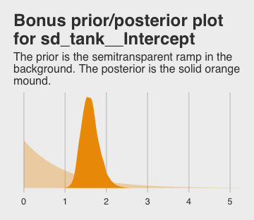

Varying effects and the underfitting/overfitting trade-off
----------------------------------------------------------

> Varying intercepts are just regularized estimates, but adaptively regularized by estimating how diverse the clusters are while estimating the features of each cluster. This fact is not easy to grasp…
>
> A major benefit of using varying effects estimates, instead of the empirical raw estimates, is that they provide more accurate estimates of the individual cluster (tank) intercepts. On average, the varying effects actually provide a better estimate of the individual tank (cluster) means. The reason that the varying intercepts provides better estimates is that they do a better job trading off underfitting and overfitting. (p. 364)

In this section, we explicate this by contrasting three perspectives:

-   Complete pooling (i.e., a single-*α* model)
-   No pooling (i.e., the single-level *α*<sub>tank<sub>*i*</sub></sub> model)
-   Partial pooling (i.e., the multilevel model for which *α*<sub>tank</sub> ∼ Normal(*α*, *σ*))

### The model.

The simulation formula should look familiar.

$$\\begin{eqnarray}
text{surv}\_i & \\sim & \\text{Binomial} (n\_i, p\_i) \\\\
\\text{logit} (p\_i) & = & \\alpha\_{\\text{pond}\_i} \\\\
\\alpha\_{\\text{pond}} & \\sim & \\text{Normal} (\\alpha, \\sigma) \\\\
\\alpha & \\sim & \\text{Normal} (0, 1) \\\\
\\sigma & \\sim & \\text{HalfCauchy} (0, 1)
\\end{eqnarray}$$

### Assign values to the parameters.

``` r
a       <-  1.4
sigma   <-  1.5
n_ponds <- 60

set.seed(1222)  # make results reproducible
(
  dsim <- 
  tibble(pond   = 1:n_ponds,
         ni     = rep(c(5, 10, 25, 35), each = n_ponds / 4) %>% as.integer(),
         true_a = rnorm(n = n_ponds, mean = a, sd = sigma))
  )
```

    ## # A tibble: 60 x 3
    ##     pond    ni true_a
    ##    <int> <int>  <dbl>
    ##  1     1     5  1.95 
    ##  2     2     5  0.249
    ##  3     3     5  0.521
    ##  4     4     5  1.20 
    ##  5     5     5 -3.34 
    ##  6     6     5  0.184
    ##  7     7     5  1.63 
    ##  8     8     5  0.336
    ##  9     9     5  1.83 
    ## 10    10     5 -0.865
    ## # ... with 50 more rows

### Sumulate survivors.

> Each pond *i* has *n*<sub>*i*</sub> potential survivors, and nature flips each tadpole’s coin, so to speak, with probability of survival *p*<sub>*i*</sub>. This probability *p*<sub>*i*</sub> is implied by the model definition, and is equal to:
>
> $$p\_i = \\frac{\\text{exp} (\\alpha\_i)}{1 + \\text{exp} (\\alpha\_i)}$$
>
> The model uses a logit link, and so the probability is defined by the \[`inv_logit_scaled()`\] function. (p. 367)

``` r
set.seed(1223)
(
  dsim <-
  dsim %>%
  mutate(si = rbinom(n = n(), prob = inv_logit_scaled(true_a), size = ni))
  )
```

    ## # A tibble: 60 x 4
    ##     pond    ni true_a    si
    ##    <int> <int>  <dbl> <int>
    ##  1     1     5  1.95      4
    ##  2     2     5  0.249     4
    ##  3     3     5  0.521     4
    ##  4     4     5  1.20      4
    ##  5     5     5 -3.34      0
    ##  6     6     5  0.184     2
    ##  7     7     5  1.63      5
    ##  8     8     5  0.336     2
    ##  9     9     5  1.83      4
    ## 10    10     5 -0.865     0
    ## # ... with 50 more rows

### Compute the no-pooling estimates.

The no-pooling estimates (i.e., *α*<sub>tank<sub>*i*</sub></sub>) are a function of simple algebra.

``` r
(
  dsim <-
  dsim %>%
  mutate(p_nopool = si / ni)
  )
```

    ## # A tibble: 60 x 5
    ##     pond    ni true_a    si p_nopool
    ##    <int> <int>  <dbl> <int>    <dbl>
    ##  1     1     5  1.95      4      0.8
    ##  2     2     5  0.249     4      0.8
    ##  3     3     5  0.521     4      0.8
    ##  4     4     5  1.20      4      0.8
    ##  5     5     5 -3.34      0      0  
    ##  6     6     5  0.184     2      0.4
    ##  7     7     5  1.63      5      1  
    ##  8     8     5  0.336     2      0.4
    ##  9     9     5  1.83      4      0.8
    ## 10    10     5 -0.865     0      0  
    ## # ... with 50 more rows

### Compute the partial-pooling estimates.

To follow along with McElreath, set `chains = 1, cores = 1` to fit with one chain.

``` r
b12.3 <- 
  brm(data = dsim, family = binomial,
      si | trials(ni) ~ 1 + (1 | pond),
      prior = c(prior(normal(0, 1), class = Intercept),
                prior(cauchy(0, 1), class = sd)),
      iter = 10000, warmup = 1000, chains = 1, cores = 1)
```

``` r
print(b12.3)
```

    ##  Family: binomial 
    ##   Links: mu = logit 
    ## Formula: si | trials(ni) ~ 1 + (1 | pond) 
    ##    Data: dsim (Number of observations: 60) 
    ## Samples: 1 chains, each with iter = 10000; warmup = 1000; thin = 1;
    ##          total post-warmup samples = 9000
    ## 
    ## Group-Level Effects: 
    ## ~pond (Number of levels: 60) 
    ##               Estimate Est.Error l-95% CI u-95% CI Eff.Sample Rhat
    ## sd(Intercept)     1.43      0.23     1.04     1.93       3111 1.00
    ## 
    ## Population-Level Effects: 
    ##           Estimate Est.Error l-95% CI u-95% CI Eff.Sample Rhat
    ## Intercept     1.54      0.22     1.13     1.98       3085 1.00
    ## 
    ## Samples were drawn using sampling(NUTS). For each parameter, Eff.Sample 
    ## is a crude measure of effective sample size, and Rhat is the potential 
    ## scale reduction factor on split chains (at convergence, Rhat = 1).

I'm not aware that you can use McElreath's `depth=2` trick in brms for `summary()` or `print()`. But can get that information with the `coef()` function.

``` r
coef(b12.3)$pond[c(1:2, 59:60), , ] %>% 
  round(digits = 2)
```

    ##    Estimate Est.Error  Q2.5 Q97.5
    ## 1      1.58      0.92 -0.08  3.52
    ## 2      1.58      0.92 -0.08  3.55
    ## 59     2.68      0.63  1.58  4.05
    ## 60     0.99      0.38  0.27  1.76

Note how we just peeked at the top and bottom two rows with the `c(1:2, 59:60)` part of the code, there. Somewhat discouragingly, `coef()` doesn’t return the 'Eff.Sample' or 'Rhat' columns as in McElreath’s output. We can still extract that information, though. For $\\hat{R}$, the solution is simple; use the `brms::rhat()` function.

``` r
rhat(b12.3)
```

    ##          b_Intercept   sd_pond__Intercept  r_pond[1,Intercept] 
    ##            1.0000059            0.9998954            0.9998894 
    ##  r_pond[2,Intercept]  r_pond[3,Intercept]  r_pond[4,Intercept] 
    ##            0.9998926            1.0000145            0.9998937 
    ##  r_pond[5,Intercept]  r_pond[6,Intercept]  r_pond[7,Intercept] 
    ##            0.9998977            0.9998892            0.9999315 
    ##  r_pond[8,Intercept]  r_pond[9,Intercept] r_pond[10,Intercept] 
    ##            0.9999297            0.9999757            0.9999514 
    ## r_pond[11,Intercept] r_pond[12,Intercept] r_pond[13,Intercept] 
    ##            0.9999386            0.9999411            0.9998939 
    ## r_pond[14,Intercept] r_pond[15,Intercept] r_pond[16,Intercept] 
    ##            0.9999678            0.9999174            1.0000529 
    ## r_pond[17,Intercept] r_pond[18,Intercept] r_pond[19,Intercept] 
    ##            1.0000404            0.9999700            0.9998949 
    ## r_pond[20,Intercept] r_pond[21,Intercept] r_pond[22,Intercept] 
    ##            0.9998985            0.9998891            0.9998928 
    ## r_pond[23,Intercept] r_pond[24,Intercept] r_pond[25,Intercept] 
    ##            0.9999322            0.9999352            0.9999363 
    ## r_pond[26,Intercept] r_pond[27,Intercept] r_pond[28,Intercept] 
    ##            0.9998922            0.9998911            0.9999259 
    ## r_pond[29,Intercept] r_pond[30,Intercept] r_pond[31,Intercept] 
    ##            0.9999971            1.0000482            0.9998963 
    ## r_pond[32,Intercept] r_pond[33,Intercept] r_pond[34,Intercept] 
    ##            0.9999102            0.9998930            0.9999403 
    ## r_pond[35,Intercept] r_pond[36,Intercept] r_pond[37,Intercept] 
    ##            0.9998928            0.9999676            0.9999138 
    ## r_pond[38,Intercept] r_pond[39,Intercept] r_pond[40,Intercept] 
    ##            0.9998943            0.9999134            0.9999159 
    ## r_pond[41,Intercept] r_pond[42,Intercept] r_pond[43,Intercept] 
    ##            0.9999320            1.0000600            0.9999650 
    ## r_pond[44,Intercept] r_pond[45,Intercept] r_pond[46,Intercept] 
    ##            0.9999229            0.9998911            0.9998898 
    ## r_pond[47,Intercept] r_pond[48,Intercept] r_pond[49,Intercept] 
    ##            0.9998894            0.9999701            0.9999082 
    ## r_pond[50,Intercept] r_pond[51,Intercept] r_pond[52,Intercept] 
    ##            0.9998923            0.9999195            0.9998889 
    ## r_pond[53,Intercept] r_pond[54,Intercept] r_pond[55,Intercept] 
    ##            0.9998916            0.9998930            0.9998973 
    ## r_pond[56,Intercept] r_pond[57,Intercept] r_pond[58,Intercept] 
    ##            0.9999618            0.9999326            0.9998965 
    ## r_pond[59,Intercept] r_pond[60,Intercept]                 lp__ 
    ##            0.9998951            0.9999115            0.9999012

Extracting the 'Eff.Sample' values is a little more complicated. There is no `effsamples()` function. However, we do have `neff_ratio()`.

``` r
neff_ratio(b12.3)
```

    ##          b_Intercept   sd_pond__Intercept  r_pond[1,Intercept] 
    ##            0.3427542            0.3456433            1.0000000 
    ##  r_pond[2,Intercept]  r_pond[3,Intercept]  r_pond[4,Intercept] 
    ##            1.0000000            1.0000000            1.0000000 
    ##  r_pond[5,Intercept]  r_pond[6,Intercept]  r_pond[7,Intercept] 
    ##            1.0000000            1.0000000            1.0000000 
    ##  r_pond[8,Intercept]  r_pond[9,Intercept] r_pond[10,Intercept] 
    ##            1.0000000            1.0000000            1.0000000 
    ## r_pond[11,Intercept] r_pond[12,Intercept] r_pond[13,Intercept] 
    ##            1.0000000            1.0000000            1.0000000 
    ## r_pond[14,Intercept] r_pond[15,Intercept] r_pond[16,Intercept] 
    ##            1.0000000            1.0000000            1.0000000 
    ## r_pond[17,Intercept] r_pond[18,Intercept] r_pond[19,Intercept] 
    ##            1.0000000            1.0000000            1.0000000 
    ## r_pond[20,Intercept] r_pond[21,Intercept] r_pond[22,Intercept] 
    ##            1.0000000            1.0000000            1.0000000 
    ## r_pond[23,Intercept] r_pond[24,Intercept] r_pond[25,Intercept] 
    ##            1.0000000            1.0000000            1.0000000 
    ## r_pond[26,Intercept] r_pond[27,Intercept] r_pond[28,Intercept] 
    ##            1.0000000            1.0000000            1.0000000 
    ## r_pond[29,Intercept] r_pond[30,Intercept] r_pond[31,Intercept] 
    ##            1.0000000            1.0000000            1.0000000 
    ## r_pond[32,Intercept] r_pond[33,Intercept] r_pond[34,Intercept] 
    ##            1.0000000            1.0000000            1.0000000 
    ## r_pond[35,Intercept] r_pond[36,Intercept] r_pond[37,Intercept] 
    ##            1.0000000            1.0000000            1.0000000 
    ## r_pond[38,Intercept] r_pond[39,Intercept] r_pond[40,Intercept] 
    ##            1.0000000            1.0000000            1.0000000 
    ## r_pond[41,Intercept] r_pond[42,Intercept] r_pond[43,Intercept] 
    ##            1.0000000            1.0000000            1.0000000 
    ## r_pond[44,Intercept] r_pond[45,Intercept] r_pond[46,Intercept] 
    ##            1.0000000            1.0000000            1.0000000 
    ## r_pond[47,Intercept] r_pond[48,Intercept] r_pond[49,Intercept] 
    ##            1.0000000            1.0000000            1.0000000 
    ## r_pond[50,Intercept] r_pond[51,Intercept] r_pond[52,Intercept] 
    ##            1.0000000            1.0000000            1.0000000 
    ## r_pond[53,Intercept] r_pond[54,Intercept] r_pond[55,Intercept] 
    ##            1.0000000            1.0000000            1.0000000 
    ## r_pond[56,Intercept] r_pond[57,Intercept] r_pond[58,Intercept] 
    ##            1.0000000            1.0000000            1.0000000 
    ## r_pond[59,Intercept] r_pond[60,Intercept]                 lp__ 
    ##            1.0000000            1.0000000            0.2037963

The `brms::neff_ratio()` function returns ratios of the effective samples over the total number of post-warmup iterations. So if we know the `neff_ratio()` values and the number of post-warmup iterations, the 'Eff.Sample' values are just a little algebra away. A quick solution is to look at the 'total post-warmup samples' line at the top of our `print()` output. Another way is to extract that information from our `brm()` fit object. I’m not aware of a way to do that directly, but we can extract the `iter` value (i.e., `b12.2$fit@sim$iter`), the `warmup` value (i.e., `b12.2$fit@sim$warmup`), and the number of `chains` (i.e., `b12.2$fit@sim$chains`). With those values in hand, simple algebra will return the 'total post-warmup samples' value. E.g.,

``` r
(
  n_iter <- (b12.3$fit@sim$iter - b12.3$fit@sim$warmup) * b12.3$fit@sim$chains
)
```

    ## [1] 9000

And now we have `n_iter`, we can calculate the 'Eff.Sample' values.

``` r
neff_ratio(b12.3) %>% 
  as.data.frame() %>% 
  rownames_to_column() %>% 
  rename(parameter  = rowname,
         neff_ratio = ".") %>% 
  mutate(eff_sample = (neff_ratio * n_iter) %>% round(digits = 0)) %>% 
  head()
```

    ##             parameter neff_ratio eff_sample
    ## 1         b_Intercept  0.3427542       3085
    ## 2  sd_pond__Intercept  0.3456433       3111
    ## 3 r_pond[1,Intercept]  1.0000000       9000
    ## 4 r_pond[2,Intercept]  1.0000000       9000
    ## 5 r_pond[3,Intercept]  1.0000000       9000
    ## 6 r_pond[4,Intercept]  1.0000000       9000

Digressions aside, let's get ready for the diagnostic plot of Figure 12.3.

``` r
dsim %>% 
  glimpse()
```

    ## Observations: 60
    ## Variables: 5
    ## $ pond     <int> 1, 2, 3, 4, 5, 6, 7, 8, 9, 10, 11, 12, 13, 14, 15, 16...
    ## $ ni       <int> 5, 5, 5, 5, 5, 5, 5, 5, 5, 5, 5, 5, 5, 5, 5, 10, 10, ...
    ## $ true_a   <dbl> 1.9473216, 0.2487733, 0.5214389, 1.1987112, -3.337285...
    ## $ si       <int> 4, 4, 4, 4, 0, 2, 5, 2, 4, 0, 1, 5, 5, 5, 5, 10, 0, 5...
    ## $ p_nopool <dbl> 0.8, 0.8, 0.8, 0.8, 0.0, 0.4, 1.0, 0.4, 0.8, 0.0, 0.2...

``` r
# we could have included this step in the block of code below, if we wanted to
p_partpool <- 
  coef(b12.3)$pond[, , ] %>% 
  as_tibble() %>%
  transmute(p_partpool = inv_logit_scaled(Estimate))

dsim <- 
  dsim %>%
  bind_cols(p_partpool) %>% 
  mutate(p_true         = inv_logit_scaled(true_a)) %>%
  mutate(nopool_error   = abs(p_nopool   - p_true),
         partpool_error = abs(p_partpool - p_true))

dsim %>% 
  glimpse()
```

    ## Observations: 60
    ## Variables: 9
    ## $ pond           <int> 1, 2, 3, 4, 5, 6, 7, 8, 9, 10, 11, 12, 13, 14, ...
    ## $ ni             <int> 5, 5, 5, 5, 5, 5, 5, 5, 5, 5, 5, 5, 5, 5, 5, 10...
    ## $ true_a         <dbl> 1.9473216, 0.2487733, 0.5214389, 1.1987112, -3....
    ## $ si             <int> 4, 4, 4, 4, 0, 2, 5, 2, 4, 0, 1, 5, 5, 5, 5, 10...
    ## $ p_nopool       <dbl> 0.8, 0.8, 0.8, 0.8, 0.0, 0.4, 1.0, 0.4, 0.8, 0....
    ## $ p_partpool     <dbl> 0.8294316, 0.8285394, 0.8288654, 0.8293981, 0.2...
    ## $ p_true         <dbl> 0.8751543, 0.5618746, 0.6274842, 0.7682954, 0.0...
    ## $ nopool_error   <dbl> 0.075154292, 0.238125444, 0.172515824, 0.031704...
    ## $ partpool_error <dbl> 0.045722683, 0.266664853, 0.201381248, 0.061102...

Here is our code for Figure 12.3. The extra data processing for `dfline` is how we get the values necessary for the horizontal summary lines.

``` r
dfline <- 
  dsim %>%
  select(ni, nopool_error:partpool_error) %>%
  gather(key, value, -ni) %>%
  group_by(key, ni) %>%
  summarise(mean_error = mean(value)) %>%
  mutate(x    = c( 1, 16, 31, 46),
         xend = c(15, 30, 45, 60))
  
dsim %>% 
  ggplot(aes(x = pond)) +
  geom_vline(xintercept = c(15.5, 30.5, 45.4), 
             color = "white", size = 2/3) +
  geom_point(aes(y = nopool_error), color = "orange2") +
  geom_point(aes(y = partpool_error), shape = 1) +
  geom_segment(data = dfline, 
               aes(x = x, xend = xend, 
                   y = mean_error, yend = mean_error),
               color = rep(c("orange2", "black"), each = 4),
               linetype = rep(1:2, each = 4)) +
  labs(y        = "absolute error",
       title    = "Estimate error by model type",
       subtitle = "The horizontal axis displays pond number. The vertical axis measures\nthe absolute error in the predicted proportion of survivors, compared to\nthe true value used in the simulation. The higher the point, the worse\nthe estimate. No-pooling shown in orange. Partial pooling shown in black.\nThe orange and dashed black lines show the average error for each kind\nof estimate, across each initial density of tadpoles (pond size). Smaller\nponds produce more error, but the partial pooling estimates are better\non average, especially in smaller ponds.") +
  scale_x_continuous(breaks = c(1, 10, 20, 30, 40, 50, 60)) +
  annotate("text", x = c(15 - 7.5, 30 - 7.5, 45 - 7.5, 60 - 7.5), y = .45, 
           label = c("tiny (5)", "small (10)", "medium (25)", "large (35)")) +
  theme_fivethirtyeight() +
  theme(panel.grid    = element_blank(),
        plot.subtitle = element_text(size = 10))
```

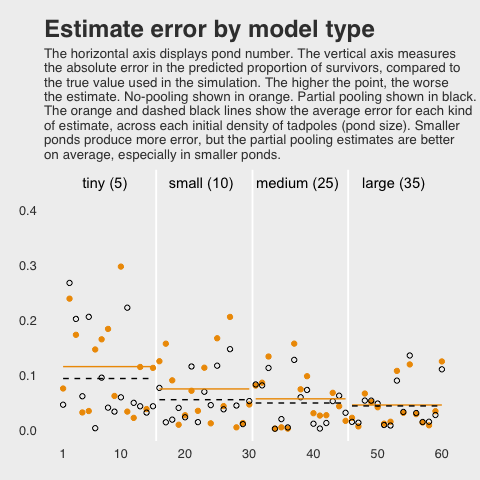

If you wanted to quantify the difference in simple summaries, you might do something like this:

``` r
dsim %>%
  select(ni, nopool_error:partpool_error) %>%
  gather(key, value, -ni) %>%
  group_by(key) %>%
  summarise(mean_error   = mean(value) %>% round(digits = 3),
            median_error = median(value) %>% round(digits = 3))
```

    ## # A tibble: 2 x 3
    ##   key            mean_error median_error
    ##   <chr>               <dbl>        <dbl>
    ## 1 nopool_error        0.073        0.045
    ## 2 partpool_error      0.06         0.045

#### Overthinking: Repeating the pond simulation.

Within the brms workflow, we reuse a compiled model with `update()`.

``` r
a       <-  1.4
sigma   <-  1.5
n_ponds <- 60

set.seed(12.251)  # for new data, set a new seed
new_dsim <- 
  tibble(pond   = 1:n_ponds,
         ni     = rep(c(5, 10, 25, 35), each = n_ponds / 4) %>% as.integer(),
         true_a = rnorm(n = n_ponds, mean = a, sd = sigma)) %>% 
    mutate(si       = rbinom(n = n(), prob = inv_logit_scaled(true_a), size = ni)) %>% 
    mutate(p_nopool = si / ni)

glimpse(new_dsim)
```

    ## Observations: 60
    ## Variables: 5
    ## $ pond     <int> 1, 2, 3, 4, 5, 6, 7, 8, 9, 10, 11, 12, 13, 14, 15, 16...
    ## $ ni       <int> 5, 5, 5, 5, 5, 5, 5, 5, 5, 5, 5, 5, 5, 5, 5, 10, 10, ...
    ## $ true_a   <dbl> -0.82085139, 3.76575421, -0.03511672, 0.01999213, -1....
    ## $ si       <int> 2, 5, 4, 1, 2, 3, 3, 3, 3, 4, 2, 1, 1, 5, 5, 4, 9, 8,...
    ## $ p_nopool <dbl> 0.4, 1.0, 0.8, 0.2, 0.4, 0.6, 0.6, 0.6, 0.6, 0.8, 0.4...

Fit the new model.

``` r
b12.3_new <- 
  update(b12.3,
         newdata = new_dsim,
         iter = 10000, warmup = 1000, chains = 1, cores = 1)
```

``` r
print(b12.3_new)
```

    ##  Family: binomial 
    ##   Links: mu = logit 
    ## Formula: si | trials(ni) ~ 1 + (1 | pond) 
    ##    Data: new_dsim (Number of observations: 60) 
    ## Samples: 1 chains, each with iter = 10000; warmup = 1000; thin = 1;
    ##          total post-warmup samples = 9000
    ## 
    ## Group-Level Effects: 
    ## ~pond (Number of levels: 60) 
    ##               Estimate Est.Error l-95% CI u-95% CI Eff.Sample Rhat
    ## sd(Intercept)     1.16      0.16     0.89     1.50       3274 1.00
    ## 
    ## Population-Level Effects: 
    ##           Estimate Est.Error l-95% CI u-95% CI Eff.Sample Rhat
    ## Intercept     1.14      0.18     0.80     1.49       4647 1.00
    ## 
    ## Samples were drawn using sampling(NUTS). For each parameter, Eff.Sample 
    ## is a crude measure of effective sample size, and Rhat is the potential 
    ## scale reduction factor on split chains (at convergence, Rhat = 1).

Why not plot the first simulation versus the second one?

``` r
posterior_samples(b12.3) %>% 
  bind_rows(posterior_samples(b12.3_new)) %>%
  mutate(model = rep(c("b12.3", "b12.3_new"), each = n()/2)) %>% 

  ggplot(aes(x = b_Intercept, y = sd_pond__Intercept)) +
  stat_density_2d(geom = "raster", 
                  aes(fill = stat(density)), 
                  contour = F) +
  geom_vline(xintercept = a,     color = "orange3", linetype = 3) +
  geom_hline(yintercept = sigma, color = "orange3", linetype = 3) +
  scale_fill_gradient(low = "grey25", high = "orange3") +
  ggtitle("Our simulation posteriors contrast a bit",
          subtitle = expression(paste(alpha, " is on the x and ", sigma, " is on the y, both in log-odds. The dotted lines intersect at the true values."))) +
  coord_cartesian(xlim = c(.7, 2),
                  ylim = c(.8, 1.9)) +
  theme_fivethirtyeight() +
  theme(legend.position = "none",
        panel.grid      = element_blank()) +
  facet_wrap(~model, ncol = 2)
```

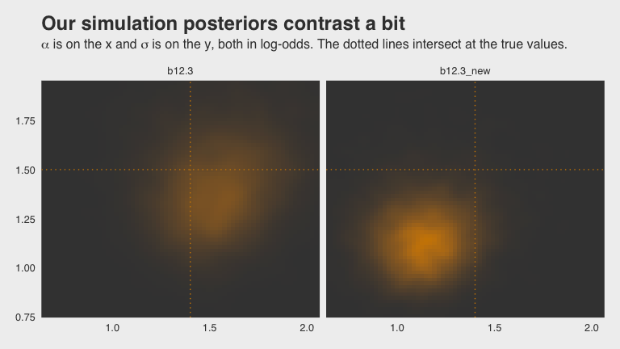

If you'd like the `stanfit` portion of your `brm()` object, subset with `$fit`. Take `b12.3`. You might check out its structure via `b12.3$fit %>% str()`. Here's the actual Stan code.

``` r
b12.3$fit@ stanmodel
```

    ## S4 class stanmodel 'binomial brms-model' coded as follows:
    ## // generated with brms 2.4.0
    ## functions { 
    ## } 
    ## data { 
    ##   int<lower=1> N;  // total number of observations 
    ##   int Y[N];  // response variable 
    ##   int trials[N];  // number of trials 
    ##   // data for group-level effects of ID 1
    ##   int<lower=1> J_1[N];
    ##   int<lower=1> N_1;
    ##   int<lower=1> M_1;
    ##   vector[N] Z_1_1;
    ##   int prior_only;  // should the likelihood be ignored? 
    ## } 
    ## transformed data { 
    ## } 
    ## parameters { 
    ##   real temp_Intercept;  // temporary intercept 
    ##   vector<lower=0>[M_1] sd_1;  // group-level standard deviations
    ##   vector[N_1] z_1[M_1];  // unscaled group-level effects
    ## } 
    ## transformed parameters { 
    ##   // group-level effects 
    ##   vector[N_1] r_1_1 = sd_1[1] * (z_1[1]);
    ## } 
    ## model { 
    ##   vector[N] mu = temp_Intercept + rep_vector(0, N);
    ##   for (n in 1:N) { 
    ##     mu[n] += r_1_1[J_1[n]] * Z_1_1[n];
    ##   } 
    ##   // priors including all constants 
    ##   target += normal_lpdf(temp_Intercept | 0, 1); 
    ##   target += cauchy_lpdf(sd_1 | 0, 1)
    ##     - 1 * cauchy_lccdf(0 | 0, 1); 
    ##   target += normal_lpdf(z_1[1] | 0, 1);
    ##   // likelihood including all constants 
    ##   if (!prior_only) { 
    ##     target += binomial_logit_lpmf(Y | trials, mu);
    ##   } 
    ## } 
    ## generated quantities { 
    ##   // actual population-level intercept 
    ##   real b_Intercept = temp_Intercept; 
    ## }

And you can get the data of a given `brm()` fit object like so.

``` r
b12.3$data %>% 
  head()
```

    ##   si ni pond
    ## 1  4  5    1
    ## 2  4  5    2
    ## 3  4  5    3
    ## 4  4  5    4
    ## 5  0  5    5
    ## 6  2  5    6

More than one type of cluster
-----------------------------

"We can use and often should use more than one type of cluster in the same model" (p. 370).

### Multilevel chimpanzees.

The initial multilevel update from model `b10.4` from the last chapter follows the statistical formula

$$\\begin{eqnarray}
\\text{left\_pull}\_i & \\sim & \\text{Binomial} (n\_i = 1, p\_i) \\\\
\\text{logit} (p\_i) & = & \\alpha + \\alpha\_{\\text{actor}\_i} + (\\beta\_1 + \\beta\_2 \\text{condition}\_i) \\text{prosoc\_left}\_i \\\\
\\alpha\_{\\text{actor}} & \\sim & \\text{Normal} (0, \\sigma\_{\\text{actor}}) \\\\
\\alpha & \\sim & \\text{Normal} (0, 10) \\\\
\\beta\_1 & \\sim & \\text{Normal} (0, 10) \\\\
\\beta\_2 & \\sim & \\text{Normal} (0, 10) \\\\
\\sigma\_{\\text{actor}} & \\sim & \\text{HalfCauchy} (0, 1)
\\end{eqnarray}$$

Before we load the data and fit the model, behold our two identical Gaussians in a tidy tibble.

``` r
set.seed(241)
two_gaussians <- 
  tibble(y1 = rnorm(n = 1e4, mean = 10, sd = 1),
         y2 = 10 + rnorm(n = 1e4, mean = 0, sd = 1))
```

Let's follow McElreath's advice to make sure they are same by superimposing the density of one on the other.

``` r
two_gaussians %>%
  
  ggplot() +
  geom_density(aes(x = y1), 
               size = 0, fill = "orange1", alpha = 1/3) +
  geom_density(aes(x = y2), 
               size = 0, fill = "orange4", alpha = 1/3) +
  scale_y_continuous(NULL, breaks = NULL) +
  labs(title = "Our simulated Gaussians") +
  theme_fivethirtyeight()
```

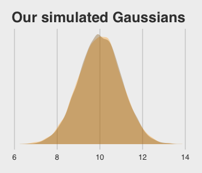

Yep, those Gaussians look about the same.

Let's get the `chimpanzees` data from rethinking.

``` r
library(rethinking)
data(chimpanzees)
d <- chimpanzees
```

Detach rethinking and reload brms.

``` r
rm(chimpanzees)
detach(package:rethinking, unload = T)
library(brms)
```

For our brms model with varying intercepts for `actor` but not `block`, we employ the `pulled_left ~ 1 + ... + (1 | actor)` syntax, specifically omitting a `(1 | block)` section.

``` r
b12.4 <- 
  brm(data = d, family = binomial,
      pulled_left ~ 1 + prosoc_left + prosoc_left:condition + (1 | actor),
      prior = c(prior(normal(0, 10), class = Intercept),
                prior(normal(0, 10), class = b),
                prior(cauchy(0, 1), class = sd)),
      iter = 5000, warmup = 1000, chains = 4, cores = 4,  # I'm using 4 cores, in stead of the `cores=3` in McElreath's code
      control = list(adapt_delta = 0.95))
```

The initial solutions came with a few divergent transitions. Increasing `adapt_delta` to `0.95` solved the problem. You can also solve the problem with more strongly regularizing priors such as `normal(0, 2)` on the intercept and slope parameters (see [recommendations from the Stan team](https://github.com/stan-dev/stan/wiki/Prior-Choice-Recommendations)). Consider trying both methods and comparing the results. They're similar.

Here we add the `actor`-level deviations to the fixed intercept, the grand mean.

``` r
post <- posterior_samples(b12.4)

post %>%
  select(`r_actor[1,Intercept]`:`r_actor[7,Intercept]`) %>%
  gather() %>%
  # This is how we add the grand mean to the actor-level deviations
  mutate(value = value + post$b_Intercept) %>% 
  group_by(key) %>%
  summarise(mean = mean(value) %>% round(digits = 2))
```

    ## # A tibble: 7 x 2
    ##   key                   mean
    ##   <chr>                <dbl>
    ## 1 r_actor[1,Intercept] -0.71
    ## 2 r_actor[2,Intercept]  4.63
    ## 3 r_actor[3,Intercept] -1.02
    ## 4 r_actor[4,Intercept] -1.02
    ## 5 r_actor[5,Intercept] -0.72
    ## 6 r_actor[6,Intercept]  0.23
    ## 7 r_actor[7,Intercept]  1.76

Here's another way to get at the same information, this time using `coef()` and a little formatting help from the `tidyverse::str_c()` function. Just for kicks, we'll throw in the 95% intervals, too.

``` r
coef(b12.4)$actor[ , c(1, 3:4), 1] %>%
  as_tibble() %>%
  round(digits = 2) %>%
  # Here we put the credible intervals in an APA-6-style format
  mutate(`95% CIs` = str_c("[", Q2.5, ", ", Q97.5, "]")) %>%
  mutate(actor = str_c("chimp #", 1:7)) %>%
  rename(mean = Estimate) %>%
  select(actor, mean, `95% CIs`) %>% 
  knitr::kable()
```

| actor     |   mean| 95% CIs          |
|:----------|------:|:-----------------|
| chimp \#1 |  -0.71| \[-1.23, -0.19\] |
| chimp \#2 |   4.63| \[2.56, 8.71\]   |
| chimp \#3 |  -1.02| \[-1.57, -0.49\] |
| chimp \#4 |  -1.02| \[-1.57, -0.49\] |
| chimp \#5 |  -0.72| \[-1.26, -0.19\] |
| chimp \#6 |   0.23| \[-0.29, 0.76\]  |
| chimp \#7 |   1.76| \[1.06, 2.57\]   |

If you prefer the posterior median to the mean, just add a `robust = T` argument inside the `coef()` function.

### Two types of cluster.

The full statistical model follows the form

$$\\begin{eqnarray}
\\text{left\_pull}\_i & \\sim & \\text{Binomial} (n\_i = 1, p\_i) \\\\
\\text{logit} (p\_i) & = & \\alpha + \\alpha\_{\\text{actor}\_i} + \\alpha\_{\\text{block}\_i} + (\\beta\_1 + \\beta\_2 \\text{condition}\_i) \\text{prosoc\_left}\_i \\\\
\\alpha\_{\\text{actor}} & \\sim & \\text{Normal} (0, \\sigma\_{\\text{actor}}) \\\\
\\alpha\_{\\text{block}} & \\sim & \\text{Normal} (0, \\sigma\_{\\text{actor}}) \\\\
\\alpha & \\sim & \\text{Normal} (0, 10) \\\\
\\beta\_1 & \\sim & \\text{Normal} (0, 10) \\\\
\\beta\_2 & \\sim & \\text{Normal} (0, 10) \\\\
\\sigma\_{\\text{actor}} & \\sim & \\text{HalfCauchy} (0, 1) \\\\
\\sigma\_{\\text{block}} & \\sim & \\text{HalfCauchy} (0, 1)
\\end{eqnarray}$$

Our brms model with varying intercepts for both `actor` and `block` now employs the `... (1 | actor) + (1 | block)` syntax.

``` r
b12.5 <- 
  update(b12.4,
         newdata = d,
         formula = pulled_left ~ 1 + prosoc_left + prosoc_left:condition + (1 | actor) + (1 | block),
         iter = 6000, warmup = 1000, cores = 4, chains = 4, 
         control = list(adapt_delta = 0.99))
```

This time we increased `adapt_delta` to `0.99` to avoid divergent transitions. We can look at the primary coefficients with `print()`. McElreath encouraged us to inspect the trace plots. Here they are.

``` r
library(bayesplot)
color_scheme_set("orange")

post <- posterior_samples(b12.5, add_chain = T)

post %>% 
  select(-lp__, -iter) %>% 
  mcmc_trace(facet_args = list(ncol = 4)) +
  scale_x_continuous(breaks = c(0, 2500, 5000)) +
  theme_fivethirtyeight() +
  theme(legend.position = c(.75, .06))
```

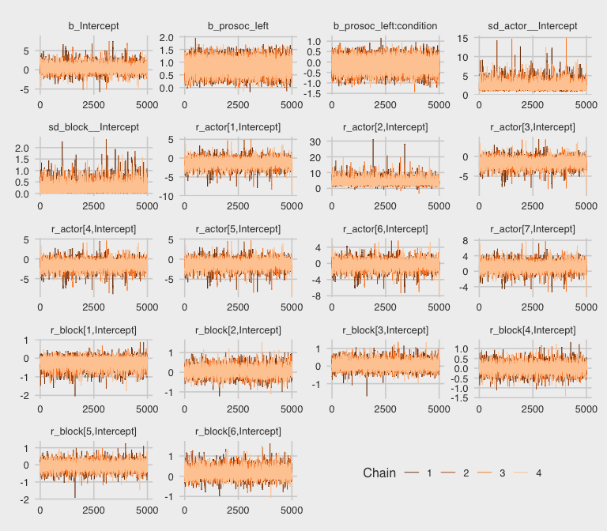

The trace plots look great. We may as well examine the *n*<sub>eff</sub>/*N* ratios, too.

``` r
neff_ratio(b12.5) %>% 
  mcmc_neff() +
  theme_fivethirtyeight()
```

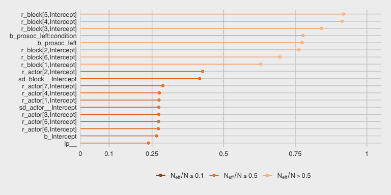

About half of them are lower than we might like, but none are in the embarrassing *n*<sub>eff</sub>/*N* ≤ .1 range. Let's look at the summary of the main parameters.

``` r
print(b12.5)
```

    ##  Family: binomial 
    ##   Links: mu = logit 
    ## Formula: pulled_left ~ prosoc_left + (1 | actor) + (1 | block) + prosoc_left:condition 
    ##    Data: d (Number of observations: 504) 
    ## Samples: 4 chains, each with iter = 6000; warmup = 1000; thin = 1;
    ##          total post-warmup samples = 20000
    ## 
    ## Group-Level Effects: 
    ## ~actor (Number of levels: 7) 
    ##               Estimate Est.Error l-95% CI u-95% CI Eff.Sample Rhat
    ## sd(Intercept)     2.29      0.95     1.14     4.74       5443 1.00
    ## 
    ## ~block (Number of levels: 6) 
    ##               Estimate Est.Error l-95% CI u-95% CI Eff.Sample Rhat
    ## sd(Intercept)     0.22      0.18     0.01     0.66       8383 1.00
    ## 
    ## Population-Level Effects: 
    ##                       Estimate Est.Error l-95% CI u-95% CI Eff.Sample Rhat
    ## Intercept                 0.44      0.96    -1.39     2.49       4898 1.00
    ## prosoc_left               0.83      0.26     0.32     1.35      15798 1.00
    ## prosoc_left:condition    -0.14      0.30    -0.73     0.45      16257 1.00
    ## 
    ## Samples were drawn using sampling(NUTS). For each parameter, Eff.Sample 
    ## is a crude measure of effective sample size, and Rhat is the potential 
    ## scale reduction factor on split chains (at convergence, Rhat = 1).

This time, we'll need to use `brms::ranef()` to get those `depth=2`-type estimates in the same metric displayed in the text. With `ranef()`, you get the group-specific estimates in a deviance metric. The `coef()` function, in contrast, yields the group-specific estimates in what you might call the natural metric. We'll get more language for this in the next chapter.

``` r
ranef(b12.5)$actor[, , "Intercept"] %>% 
  round(digits = 2)
```

    ##   Estimate Est.Error  Q2.5 Q97.5
    ## 1    -1.16      0.97 -3.25  0.70
    ## 2     4.19      1.66  1.80  8.24
    ## 3    -1.46      0.97 -3.53  0.40
    ## 4    -1.46      0.98 -3.54  0.39
    ## 5    -1.16      0.97 -3.22  0.69
    ## 6    -0.21      0.97 -2.29  1.67
    ## 7     1.33      1.00 -0.74  3.29

``` r
ranef(b12.5)$block[, , "Intercept"] %>% 
  round(digits = 2)
```

    ##   Estimate Est.Error  Q2.5 Q97.5
    ## 1    -0.18      0.23 -0.76  0.13
    ## 2     0.04      0.19 -0.32  0.46
    ## 3     0.05      0.19 -0.31  0.49
    ## 4     0.00      0.18 -0.39  0.40
    ## 5    -0.03      0.19 -0.46  0.34
    ## 6     0.11      0.20 -0.21  0.62

We might make the coefficient plot of Figure 12.4.a like this:

``` r
stanplot(b12.5, pars = c("^r_", "^b_", "^sd_")) +
  theme_fivethirtyeight() +
  theme(axis.text.y = element_text(hjust = 0))
```


Once we get the posterior samples, it's easy to compare the random variances as in Figure 12.4.b.

``` r
post %>%
  ggplot(aes(x = sd_actor__Intercept)) +
  theme_fivethirtyeight() +
  geom_density(size = 0, fill = "orange1", alpha = 3/4) +
  geom_density(aes(x = sd_block__Intercept), 
               size = 0, fill = "orange4", alpha = 3/4)  +
  scale_y_continuous(NULL, breaks = NULL) +
  coord_cartesian(xlim = c(0, 4)) +
  labs(title = expression(sigma)) +
  annotate("text", x = 2/3, y = 2, label = "block", color = "orange4") +
  annotate("text", x = 2, y = 3/4, label = "actor", color = "orange1")
```

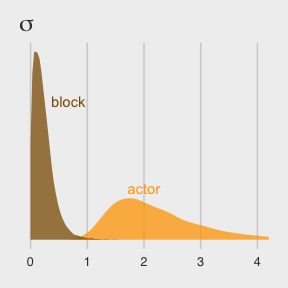

We might compare our models by their PSIS-LOO values.

``` r
l.b12.4 <- loo(b12.4, cores = 4)
l.b12.5 <- loo(b12.5, cores = 4)

compare_ic(l.b12.4, l.b12.5)
```

    ##                LOOIC    SE
    ## b12.4         531.62 19.52
    ## b12.5         532.72 19.71
    ## b12.4 - b12.5  -1.10  1.73

And you can get the LOO version of the `p_waic`, the `p_loo`, like so.

``` r
l.b12.4$ estimates
```

    ##             Estimate         SE
    ## elpd_loo -265.808959  9.7617393
    ## p_loo       8.238167  0.4428145
    ## looic     531.617918 19.5234785

``` r
l.b12.5$ estimates
```

    ##            Estimate         SE
    ## elpd_loo -266.36024  9.8539456
    ## p_loo      10.40296  0.5387406
    ## looic     532.72047 19.7078913

And if you peek at the structure of the loo objects, you'll see you can call the `p_loo` values directly with something like `l.b12.5$ estimates["p_loo", 1]`. The results are quite similar to those in the text.

Anyways, the two models yield nearly-equivalent information criteria values. Yet recall what McElreath wrote: "There is nothing to gain here by selecting either model. The comparison of the two models tells a richer story" (p. 367).

Multilevel posterior predictions
--------------------------------

> … producing implied predictions from a fit model, is very helpful for understanding what the model means. Every model is a merger of sense and nonsense. When we understand a model, we can find its sense and control its nonsense. But as models get more complex, it is very difficult to impossible to understand them just by inspecting tables of posterior means and intervals. Exploring implied posterior predictions helps much more…
>
> … The introduction of varying effects does introduce nuance, however.
>
> First, we should no longer expect the model to exactly retrodict the sample, because adaptive regularization has as its goal to trade off poorer fit in sample for better inference and hopefully better fit out of sample. This is what shrinkage does for us…
>
> Second, "prediction" in the context of a multilevel model requires additional choices. If we wish to validate a model against the specific clusters used to fit the model, that is one thing. But if we instead wish to compute predictions for new clusters, other than the one observed in the sample, that is quite another. We’ll consider each of these in turn, continuing to use the chimpanzees model from the previous section. (p. 376)

### Posterior prediction for same clusters.

Like McElreath did in the text, we'll do this two ways. Recall we use `brms::fitted()` in place of `rethinking::link()`.

``` r
chimp <- 2
nd <-
  tibble(prosoc_left = c(0, 1, 0, 1),
         condition   = c(0, 0, 1, 1),
         actor       = chimp)

(
  chimp_2_fitted <-
  fitted(b12.4,
         newdata = nd) %>% 
  as_tibble() %>% 
  mutate(condition = factor(c("0/0", "1/0", "0/1", "1/1"), 
                            levels = c("0/0", "1/0", "0/1", "1/1")))
  )
```

    ## # A tibble: 4 x 5
    ##   Estimate Est.Error  Q2.5 Q97.5 condition
    ##      <dbl>     <dbl> <dbl> <dbl> <fct>    
    ## 1    0.980   0.0198  0.928 1.000 0/0      
    ## 2    0.991   0.00949 0.966 1.000 1/0      
    ## 3    0.980   0.0198  0.928 1.000 0/1      
    ## 4    0.990   0.0108  0.961 1.000 1/1

``` r
(
  chimp_2_d <-
  d %>% 
  filter(actor == chimp) %>% 
  group_by(prosoc_left, condition) %>% 
  summarise(prob = mean(pulled_left)) %>% 
  ungroup() %>% 
  mutate(condition = str_c(prosoc_left, "/", condition)) %>% 
  mutate(condition = factor(condition, levels = c("0/0", "1/0", "0/1", "1/1")))
)
```

    ## # A tibble: 4 x 3
    ##   prosoc_left condition  prob
    ##         <int> <fct>     <dbl>
    ## 1           0 0/0           1
    ## 2           0 0/1           1
    ## 3           1 1/0           1
    ## 4           1 1/1           1

McElreath didn't show the corresponding plot in the text. It might look like this.

``` r
chimp_2_fitted %>%
  # if you want to use `geom_line()` or `geom_ribbon()` with a factor on the x axis,
  # you need to code something like `group = 1` in `aes()`
  ggplot(aes(x = condition, y = Estimate, group = 1)) +
  geom_ribbon(aes(ymin = Q2.5, ymax = Q97.5), fill = "orange1") +
  geom_line(color = "blue") +
  geom_point(data = chimp_2_d,
             aes(x = condition, y = prob),
             color = "grey25") +
  ggtitle("Chimp #2",
          subtitle = "The posterior mean and 95%\nintervals are the blue line\nand orange band, respectively.\nThe empirical means are\nthe charcoal dots.") +
  coord_cartesian(ylim = c(.75, 1)) +
  theme_fivethirtyeight() +
  theme(plot.subtitle = element_text(size = 10))
```

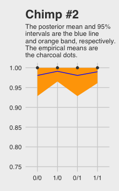

Okay, now let's do things by hand. We'll need to extract the posterior samples and look at the structure of the data.

``` r
post <- posterior_samples(b12.4)

glimpse(post)
```

    ## Observations: 16,000
    ## Variables: 12
    ## $ b_Intercept               <dbl> 1.88448579, 1.62005043, -0.75882539,...
    ## $ b_prosoc_left             <dbl> 0.9484241, 0.9326471, 0.4367393, 0.7...
    ## $ `b_prosoc_left:condition` <dbl> -0.18785648, -0.56328622, -0.0180577...
    ## $ sd_actor__Intercept       <dbl> 2.230345, 1.336876, 2.667636, 2.4642...
    ## $ `r_actor[1,Intercept]`    <dbl> -2.70121732, -2.39411713, -0.2016114...
    ## $ `r_actor[2,Intercept]`    <dbl> 3.900099, 1.741393, 4.108725, 5.6977...
    ## $ `r_actor[3,Intercept]`    <dbl> -2.6843019, -2.5740775, -0.4807828, ...
    ## $ `r_actor[4,Intercept]`    <dbl> -3.04804178, -2.43114940, -0.3753852...
    ## $ `r_actor[5,Intercept]`    <dbl> -2.9252117, -1.7936868, 0.4741491, 0...
    ## $ `r_actor[6,Intercept]`    <dbl> -2.12298211, -1.22520958, 1.06694794...
    ## $ `r_actor[7,Intercept]`    <dbl> -0.28988716, 0.08184024, 2.31671113,...
    ## $ lp__                      <dbl> -282.3154, -286.7885, -283.4303, -28...

McElreath didn't show what his R code 12.29 `dens( post$a_actor[,5] )` would look like. But here's our analogue.

``` r
post %>%
  transmute(actor_5 =`r_actor[5,Intercept]`) %>% 
  
  ggplot(aes(x = actor_5)) +
  geom_density(size = 0, fill = "blue") +
  scale_y_continuous(breaks = NULL) +
  ggtitle("Chimp #5's density") +
  theme_fivethirtyeight()
```

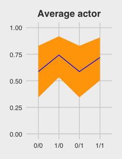

McElreath built his own `link()` function. Here we'll build an alternative to `fitted()`.

``` r
# our hand-made `brms::fitted()` alternative
my_fitted <- function(prosoc_left, condition){
  post %>%
    transmute(fitted = (b_Intercept + 
                          `r_actor[5,Intercept]` + 
                          b_prosoc_left * prosoc_left + 
                          `b_prosoc_left:condition` * prosoc_left * condition) %>% 
                inv_logit_scaled())
}

# the posterior summaries
(
  chimp_5_my_fitted <-
  tibble(prosoc_left = c(0, 1, 0, 1),
       condition     = c(0, 0, 1, 1)) %>% 
  mutate(post = map2(prosoc_left, condition, my_fitted)) %>% 
  unnest() %>% 
  mutate(condition = str_c(prosoc_left, "/", condition)) %>% 
  mutate(condition = factor(condition, levels = c("0/0", "1/0", "0/1", "1/1"))) %>% 
  group_by(condition) %>% 
  tidybayes::mean_qi(fitted)
  )
```

    ## # A tibble: 4 x 7
    ##   condition fitted .lower .upper .width .point .interval
    ##   <fct>      <dbl>  <dbl>  <dbl>  <dbl> <chr>  <chr>    
    ## 1 0/0        0.331  0.222  0.453   0.95 mean   qi       
    ## 2 1/0        0.527  0.380  0.671   0.95 mean   qi       
    ## 3 0/1        0.331  0.222  0.453   0.95 mean   qi       
    ## 4 1/1        0.494  0.351  0.639   0.95 mean   qi

``` r
# the empirical summaries
chimp <- 5
(
  chimp_5_d <-
  d %>% 
  filter(actor == chimp) %>% 
  group_by(prosoc_left, condition) %>% 
  summarise(prob = mean(pulled_left)) %>% 
  ungroup() %>% 
  mutate(condition = str_c(prosoc_left, "/", condition)) %>% 
  mutate(condition = factor(condition, levels = c("0/0", "1/0", "0/1", "1/1")))
)
```

    ## # A tibble: 4 x 3
    ##   prosoc_left condition  prob
    ##         <int> <fct>     <dbl>
    ## 1           0 0/0       0.333
    ## 2           0 0/1       0.278
    ## 3           1 1/0       0.556
    ## 4           1 1/1       0.5

Okay, let's see how good we are at retrodicting the `pulled_left` probabilities for `actor == 5`.

``` r
chimp_5_my_fitted %>%
  ggplot(aes(x = condition, y = fitted, group = 1)) +
  geom_ribbon(aes(ymin = .lower, ymax = .upper), fill = "orange1") +
  geom_line(color = "blue") +
  geom_point(data = chimp_5_d,
             aes(x = condition, y = prob),
             color = "grey25") +
  ggtitle("Chimp #5",
          subtitle = "This plot is like the last except\nwe did more by hand.") +
  coord_cartesian(ylim = 0:1) +
  theme_fivethirtyeight() +
  theme(plot.subtitle = element_text(size = 10))
```

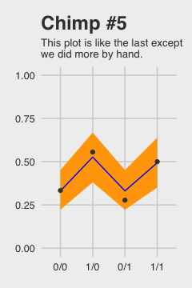

Not bad.

### Posterior prediction for new clusters.

By average actor, McElreath referred to a chimp with an intercept exactly at the population mean *α*. So this time we’ll only be working with the population parameters or what are also sometimes called the fixed effects. When you work with `brms::posterior_samples()` output, this would mean working with columns beginning with the `b_` prefix (i.e., `b_Intercept`, `b_prosoc_left`, and `b_prosoc_left:condition`).

``` r
post_average_actor <-
  post %>% 
  # here we use the linear regression formula to get the log_odds for the 4 conditions
  transmute(`0/0` = b_Intercept,
            `1/0` = b_Intercept + b_prosoc_left,
            `0/1` = b_Intercept,
            `1/1` = b_Intercept + b_prosoc_left + `b_prosoc_left:condition`) %>%
  # with `mutate_all()` we can convert the estimates to probabilities in one fell swoop
  mutate_all(inv_logit_scaled) %>% 
  # putting the data in the long format and grouping by condition (i.e., `key`)
  gather() %>%
  mutate(key = factor(key, level = c("0/0", "1/0", "0/1", "1/1"))) %>% 
  group_by(key) %>%
  # here we get the summary values for the plot
  summarise(m  = mean(value),
            # note we're using 80% intervals
            ll = quantile(value, probs = .1),
            ul = quantile(value, probs = .9))

post_average_actor
```

    ## # A tibble: 4 x 4
    ##   key       m    ll    ul
    ##   <fct> <dbl> <dbl> <dbl>
    ## 1 0/0   0.587 0.344 0.829
    ## 2 1/0   0.743 0.534 0.919
    ## 3 0/1   0.587 0.344 0.829
    ## 4 1/1   0.720 0.503 0.908

Figure 12.5.a.

``` r
p1 <-
  post_average_actor %>%
  ggplot(aes(x = key, y = m, group = 1)) +
  geom_ribbon(aes(ymin = ll, ymax = ul), fill = "orange1") +
  geom_line(color = "blue") +
  ggtitle("Average actor") +
  coord_cartesian(ylim = 0:1) +
  theme_fivethirtyeight() +
  theme(plot.title = element_text(size = 14, hjust = .5))

p1
```

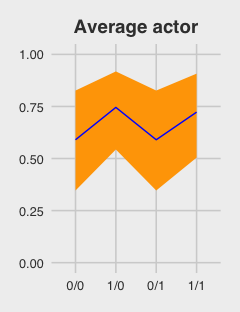

If we want to depict the variability across the chimps, we need to include `sd_actor__Intercept` into the calculations. In the first block of code, below, we simulate a bundle of new intercepts defined by

*α*<sub>actor</sub> ∼ Normal(0, *σ*<sub>actor</sub>)

``` r
# the random effects
set.seed(12.42)
ran_ef <-
  tibble(random_effect = rnorm(n = 1000, mean = 0, sd = post$sd_actor__Intercept)) %>% 
  # with the `., ., ., .` syntax, we quadruple the previous line 
  bind_rows(., ., ., .) 

# the fixed effects (i.e., the population parameters)
fix_ef <-
  post %>% 
  slice(1:1000) %>%
  transmute(`0/0` = b_Intercept,
            `1/0` = b_Intercept + b_prosoc_left,
            `0/1` = b_Intercept,
            `1/1` = b_Intercept + b_prosoc_left + `b_prosoc_left:condition`) %>%
  gather() %>%
  rename(condition    = key, 
         fixed_effect = value) %>% 
  mutate(condition = factor(condition, level = c("0/0", "1/0", "0/1", "1/1")))

# combine them
ran_and_fix_ef <-
  bind_cols(ran_ef, fix_ef) %>%
  mutate(intercept = fixed_effect + random_effect) %>%
  mutate(prob      = inv_logit_scaled(intercept))

# to simplify things, we'll reduce them to summaries
(
  marginal_effects <-
  ran_and_fix_ef %>%
  group_by(condition) %>%
  summarise(m  = mean(prob),
            ll = quantile(prob, probs = .1),
            ul = quantile(prob, probs = .9))
  )
```

    ## # A tibble: 4 x 4
    ##   condition     m     ll    ul
    ##   <fct>     <dbl>  <dbl> <dbl>
    ## 1 0/0       0.558 0.0911 0.964
    ## 2 1/0       0.670 0.182  0.984
    ## 3 0/1       0.558 0.0911 0.964
    ## 4 1/1       0.654 0.157  0.984

Behold Figure 12.5.b.

``` r
p2 <-
  marginal_effects %>%
  ggplot(aes(x = condition, y = m, group = 1)) +
  geom_ribbon(aes(ymin = ll, ymax = ul), fill = "orange1") +
  geom_line(color = "blue") +
  ggtitle("Marginal of actor") +
  coord_cartesian(ylim = 0:1) +
  theme_fivethirtyeight() +
  theme(plot.title = element_text(size = 14, hjust = .5))

p2
```

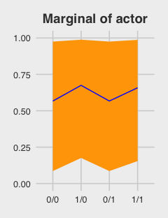

Figure 12.5.c just takes a tiny bit more wrangling.

``` r
p3 <-
  ran_and_fix_ef %>%
  mutate(iter = rep(1:1000, times = 4)) %>%
  filter(iter %in% c(1:50)) %>%
  
  ggplot(aes(x = condition, y = prob, group = iter)) +
  theme_fivethirtyeight() +
  geom_line(alpha = 1/2, color = "orange3") +
  ggtitle("50 simulated actors") +
  coord_cartesian(ylim = 0:1) +
  theme(plot.title = element_text(size = 14, hjust = .5))

p3
```

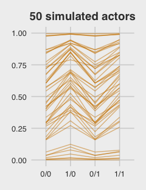

For the finale, we'll stitch the three plots together.

``` r
library(gridExtra)

grid.arrange(p1, p2, p3, ncol = 3)
```

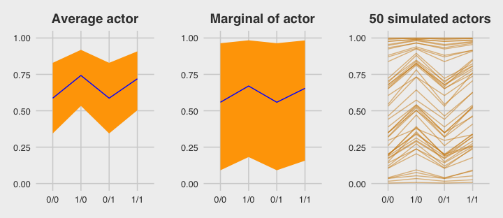

### Focus and multilevel prediction.

First, let's load the `Kline` data.

``` r
# prep data
library(rethinking)
data(Kline)
d <- Kline
```

Switch out the packages, once again.

``` r
detach(package:rethinking, unload = T)
library(brms)
rm(Kline)
```

The statistical formula for our multilevel count model is

$$\\begin{eqnarray}
\\text{total\_tools}\_i & \\sim & \\text{Poisson} (\\mu\_i) \\\\
\\text{log} (\\mu\_i) & = & \\alpha + \\alpha\_{\\text{culture}\_i} + \\beta\_1 \\text{log} (\\text{population}\_i) \\\\
\\alpha & \\sim & \\text{Normal} (0, 10) \\\\
\\beta\_1 & \\sim & \\text{Normal} (0, 1) \\\\
\\alpha\_{\\text{culture}} & \\sim & \\text{Normal} (0, \\sigma\_{\\text{culture}}) \\\\
\\sigma\_{\\text{culture}} & \\sim & \\text{HalfCauchy} (0, 1) \\\\
\\end{eqnarray}$$

With brms, we don't actually need to make the `logpop` or `society` variables. We're ready to fit the multilevel `Kline` model with the data in hand.

``` r
b12.6 <- 
  brm(data = d, family = poisson,
      total_tools ~ 0 + intercept + log(population) + 
        (1 | culture),
      prior = c(prior(normal(0, 10), class = b, coef = intercept),
                prior(normal(0, 1), class = b),
                prior(cauchy(0, 1), class = sd)),
      iter = 4000, warmup = 1000, cores = 3, chains = 3)
```

Note how we used the special `0 + intercept` syntax rather than using the default Intercept. This is because our predictor variable was not mean centered. For more info, see [here](https://github.com/paul-buerkner/brms/issues/114). Though we used the `0 + intercept` syntax for the fixed effect, it was not necessary for the random effect. Both ways work.

Here is the data-processing work for our variant of Figure 12.6.

``` r
nd <- 
  tibble(population = seq(from = 1000, to = 400000, by = 5000),
         # To "simulate counterfactual societies, using the hyper-parameters" (p. 383), we'll plug a new island into the `culture` variable
         culture    = "my_island") 

pred_12.6 <-
  predict(b12.6,
          # This allows us to simulate values for our counterfactual island, "my_island"
          allow_new_levels = T,
          # Here we explicitly tell brms we want to include the group-level effects
          re_formula = ~ (1 | culture),
          # From the brms manual, this uses the "(multivariate) normal distribution implied by 
          # the group-level standard deviations and correlations", which appears to be 
          # what McElreath did in the text.
          sample_new_levels = "gaussian",
          newdata = nd,
          probs = c(.015, .055, .165, .835, .945, .985)) %>%
  as_tibble() %>%
  bind_cols(nd)

pred_12.6 %>%  
  glimpse()
```

    ## Observations: 80
    ## Variables: 10
    ## $ Estimate   <dbl> 19.73322, 31.11411, 36.57800, 40.40067, 43.50389, 4...
    ## $ Est.Error  <dbl> 12.41155, 16.62441, 18.90296, 20.99072, 23.06767, 2...
    ## $ Q1.5       <dbl> 5, 10, 13, 14, 15, 15, 16, 16, 17, 18, 17, 18, 19, ...
    ## $ Q5.5       <dbl> 8.000, 14.000, 18.000, 20.000, 21.000, 22.000, 23.0...
    ## $ Q16.5      <dbl> 12, 20, 23, 26, 28, 30, 31, 32, 33, 34, 35, 36, 37,...
    ## $ Q83.5      <dbl> 27, 41, 48, 53, 57, 60, 64, 66, 68, 71, 73, 75, 76,...
    ## $ Q94.5      <dbl> 35.000, 53.000, 61.000, 68.000, 74.000, 78.000, 82....
    ## $ Q98.5      <dbl> 48.000, 70.015, 82.000, 89.000, 100.000, 105.000, 1...
    ## $ population <dbl> 1000, 6000, 11000, 16000, 21000, 26000, 31000, 3600...
    ## $ culture    <chr> "my_island", "my_island", "my_island", "my_island",...

For a detailed discussion on this way of using `brms::predict()`, see [Andrew MacDonald’s great blogpost on this very figure](http://thestudyofthehousehold.com/2018/02/13/2018-02-13-easily-made-fitted-and-predicted-values-made-easy/). Here’s what we’ve been working for:

``` r
pred_12.6 %>%
  ggplot(aes(x = log(population), y = Estimate)) +
  geom_ribbon(aes(ymin = Q1.5,  ymax = Q98.5), fill = "orange2", alpha = 1/3) +
  geom_ribbon(aes(ymin = Q5.5,  ymax = Q94.5), fill = "orange2", alpha = 1/3) +
  geom_ribbon(aes(ymin = Q16.5, ymax = Q83.5), fill = "orange2", alpha = 1/3) +
  coord_cartesian(ylim = range(d$total_tools)) +
  geom_line(color = "orange4") +
  geom_text(data = d, aes(y = total_tools, label = culture), 
            size = 2.33, color = "blue") +
  ggtitle("Total tools as a function of log(population)") +
  theme_fivethirtyeight() +
  theme(plot.title = element_text(size = 12, hjust = .5))
```

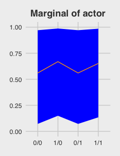

Glorious.

Reference
---------

[McElreath, R. (2016). *Statistical rethinking: A Bayesian course with examples in R and Stan.* Chapman & Hall/CRC Press.](https://xcelab.net/rm/statistical-rethinking/)

Session info
------------

``` r
sessionInfo()
```

    ## R version 3.5.1 (2018-07-02)
    ## Platform: x86_64-apple-darwin15.6.0 (64-bit)
    ## Running under: macOS High Sierra 10.13.6
    ## 
    ## Matrix products: default
    ## BLAS: /Library/Frameworks/R.framework/Versions/3.5/Resources/lib/libRblas.0.dylib
    ## LAPACK: /Library/Frameworks/R.framework/Versions/3.5/Resources/lib/libRlapack.dylib
    ## 
    ## locale:
    ## [1] en_US.UTF-8/en_US.UTF-8/en_US.UTF-8/C/en_US.UTF-8/en_US.UTF-8
    ## 
    ## attached base packages:
    ## [1] parallel  stats     graphics  grDevices utils     datasets  methods  
    ## [8] base     
    ## 
    ## other attached packages:
    ##  [1] gridExtra_2.3      bayesplot_1.6.0    ggthemes_3.5.0    
    ##  [4] bindrcpp_0.2.2     forcats_0.3.0      stringr_1.3.1     
    ##  [7] dplyr_0.7.6        purrr_0.2.5        readr_1.1.1       
    ## [10] tidyr_0.8.1        tibble_1.4.2       tidyverse_1.2.1   
    ## [13] brms_2.4.0         Rcpp_0.12.18       rstan_2.17.3      
    ## [16] StanHeaders_2.17.2 ggplot2_3.0.0     
    ## 
    ## loaded via a namespace (and not attached):
    ##  [1] nlme_3.1-137              matrixStats_0.54.0       
    ##  [3] xts_0.10-2                lubridate_1.7.4          
    ##  [5] threejs_0.3.1             httr_1.3.1               
    ##  [7] LaplacesDemon_16.1.1      rprojroot_1.3-2          
    ##  [9] tools_3.5.1               backports_1.1.2          
    ## [11] utf8_1.1.4                R6_2.2.2                 
    ## [13] DT_0.4                    lazyeval_0.2.1           
    ## [15] colorspace_1.3-2          withr_2.1.2              
    ## [17] tidyselect_0.2.4          mnormt_1.5-5             
    ## [19] Brobdingnag_1.2-5         compiler_3.5.1           
    ## [21] cli_1.0.0                 rvest_0.3.2              
    ## [23] arrayhelpers_1.0-20160527 xml2_1.2.0               
    ## [25] shinyjs_1.0               labeling_0.3             
    ## [27] colourpicker_1.0          scales_0.5.0             
    ## [29] dygraphs_1.1.1.5          mvtnorm_1.0-8            
    ## [31] psych_1.8.4               ggridges_0.5.0           
    ## [33] digest_0.6.15             foreign_0.8-70           
    ## [35] rmarkdown_1.10            base64enc_0.1-3          
    ## [37] pkgconfig_2.0.1           htmltools_0.3.6          
    ## [39] highr_0.7                 htmlwidgets_1.2          
    ## [41] rlang_0.2.1               readxl_1.1.0             
    ## [43] rstudioapi_0.7            shiny_1.1.0              
    ## [45] svUnit_0.7-12             bindr_0.1.1              
    ## [47] zoo_1.8-2                 jsonlite_1.5             
    ## [49] crosstalk_1.0.0           gtools_3.8.1             
    ## [51] inline_0.3.15             magrittr_1.5             
    ## [53] loo_2.0.0                 Matrix_1.2-14            
    ## [55] munsell_0.5.0             abind_1.4-5              
    ## [57] stringi_1.2.3             yaml_2.1.19              
    ## [59] MASS_7.3-50               ggstance_0.3             
    ## [61] plyr_1.8.4                grid_3.5.1               
    ## [63] promises_1.0.1            crayon_1.3.4             
    ## [65] miniUI_0.1.1.1            lattice_0.20-35          
    ## [67] haven_1.1.2               hms_0.4.2                
    ## [69] knitr_1.20                pillar_1.2.3             
    ## [71] igraph_1.2.1              markdown_0.8             
    ## [73] shinystan_2.5.0           reshape2_1.4.3           
    ## [75] stats4_3.5.1              rstantools_1.5.0         
    ## [77] glue_1.2.0                evaluate_0.10.1          
    ## [79] modelr_0.1.2              httpuv_1.4.4.2           
    ## [81] cellranger_1.1.0          gtable_0.2.0             
    ## [83] assertthat_0.2.0          mime_0.5                 
    ## [85] xtable_1.8-2              broom_0.4.5              
    ## [87] coda_0.19-1               later_0.7.3              
    ## [89] rsconnect_0.8.8           shinythemes_1.1.1        
    ## [91] tidybayes_1.0.1           bridgesampling_0.4-0
