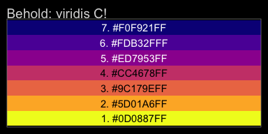
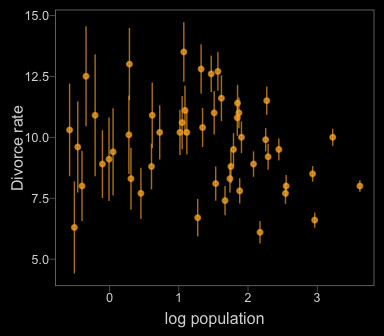
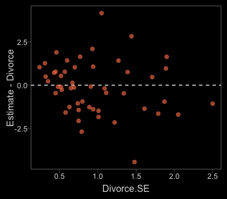
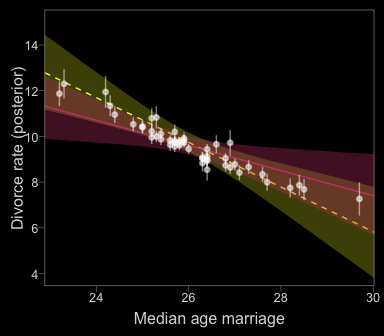
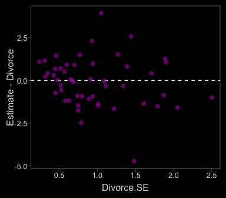
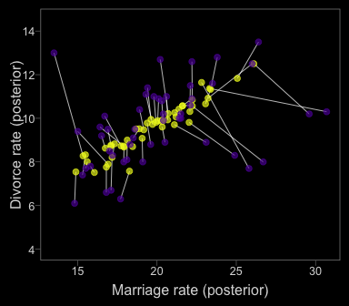
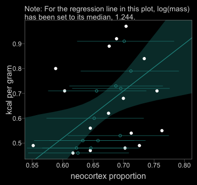
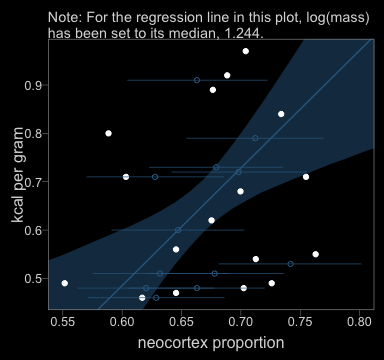
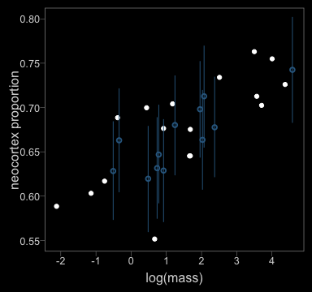

Ch 14. Missing Data and Other Opportunities
================
A Solomon Kurz
2018-09-25

Missing Data and Other Opportunities
====================================

For the opening example, we're playing with the conditional probability

$$
\\text{Pr(burnt down | burnt up)} = \\frac{\\text(Pr(burnt up, burnt down))}{\\text{Pr(burnt up)}}
$$

It works out that

$$
\\text{Pr(burnt down | burnt up)} = \\frac{1/3}{1/2} = \\frac{2}{3}
$$

We might express the math in the middle of page 423 in tibble form like this.

``` r
library(tidyverse)

p_pancake <- 1/3

(
  d <-
    tibble(pancake    = c("BB", "BU", "UU"),
           p_burnt    = c(1, .5, 0)) %>% 
    mutate(p_burnt_up = p_burnt * p_pancake)
) 
```

    ## # A tibble: 3 x 3
    ##   pancake p_burnt p_burnt_up
    ##   <chr>     <dbl>      <dbl>
    ## 1 BB          1        0.333
    ## 2 BU          0.5      0.167
    ## 3 UU          0        0

``` r
d %>% 
  summarise(`p (burnt_down | burnt_up)` = p_pancake / sum(p_burnt_up))
```

    ## # A tibble: 1 x 1
    ##   `p (burnt_down | burnt_up)`
    ##                         <dbl>
    ## 1                       0.667

I understood McElreath's simulation better after I broke it apart. The first part of `sim_pancake()` takes one random draw from the integers 1, 2, and 3. It just so happens that if we set `set.seed(1)`, the code returns a 1.

``` r
set.seed(1)
sample(x = 1:3, size = 1)
```

    ## [1] 1

So here's what it looks like if we use seeds `2:11`.

``` r
take_sample <- function(seed){
 set.seed(seed)
  sample(x = 1:3, size = 1)
}

tibble(seed = 2:11) %>% 
  mutate(value_returned = map(seed, take_sample)) %>% 
  unnest()
```

    ## # A tibble: 10 x 2
    ##     seed value_returned
    ##    <int>          <int>
    ##  1     2              1
    ##  2     3              1
    ##  3     4              2
    ##  4     5              1
    ##  5     6              2
    ##  6     7              3
    ##  7     8              2
    ##  8     9              1
    ##  9    10              2
    ## 10    11              1

Each of those `value_returned` values stands for one of the three pancakes: 1 = BB, 2 = BU, 3 = UU. In the next line, McElreath made slick use of a matrix to specify that. Here's what the matrix looks like:

``` r
matrix(c(1, 1, 1, 0, 0, 0), nrow = 2, ncol = 3)
```

    ##      [,1] [,2] [,3]
    ## [1,]    1    1    0
    ## [2,]    1    0    0

See how the three columns are identified as `[,1]`, `[,2]`, and `[,3]`? If, say, we wanted to subset the values in the second column, we'd execute

``` r
matrix(c(1, 1, 1, 0, 0, 0), nrow = 2, ncol = 3)[, 2]
```

    ## [1] 1 0

which returns a numeric vector.

``` r
matrix(c(1, 1, 1, 0, 0, 0), nrow = 2, ncol = 3)[, 2] %>% str()
```

    ##  num [1:2] 1 0

And that `1 0` corresponds to the pancake with one burnt (i.e., 1) and one unburnt (i.e., 0) side. So when McElreath then executed `sample(sides)`, he randomly sampled from one of those two values. In the case of `pancake == 2`, he randomly sampled one the pancake with one burnt and one unburnt side. Had he sampled from `pancake == 1`, he would have sampled from the pancake with both sides burnt.

Going forward, let's amend McElreath's `sim_pancake()` function a bit. First, we'll add a `seed` argument, with will allow us to make the output reproducible. We'll be inserting `seed` into `set.seed()` in the two places preceding the `sample()` function. The second major change is that we're going to convert the output of the `sim_pancake()` function to a tibble and adding a `side` column, which will contain the values `c("up", "down")`. Just for pedagogical purposes, we’ll also add `pancake_n` and `pancake_chr` columns to help index which `pancake` the draws came from.

``` r
# simulate a pancake and return randomly ordered sides
sim_pancake <- function(seed) {
  set.seed(seed)
  pancake <- sample(x = 1:3, size = 1)
  sides   <- matrix(c(1, 1, 1, 0, 0, 0), nrow = 2, ncol = 3)[, pancake]
  
  set.seed(seed)
  sample(sides) %>% 
    as_tibble() %>% 
    mutate(side        = c("up", "down"),
           pancake_n   = pancake,
           pancake_chr = ifelse(pancake == 1, "BB",
                                ifelse(pancake == 2, "BU", "UU")))
}
```

Let’s take this baby for a whirl.

``` r
# How many simulations would you like?
n_sim <- 1e4

(
  d <-
  tibble(seed = 1:n_sim) %>% 
  mutate(r = map(seed, sim_pancake)) %>% 
  unnest()
  )
```

    ## # A tibble: 20,000 x 5
    ##     seed value side  pancake_n pancake_chr
    ##    <int> <dbl> <chr>     <int> <chr>      
    ##  1     1     1 up            1 BB         
    ##  2     1     1 down          1 BB         
    ##  3     2     1 up            1 BB         
    ##  4     2     1 down          1 BB         
    ##  5     3     1 up            1 BB         
    ##  6     3     1 down          1 BB         
    ##  7     4     0 up            2 BU         
    ##  8     4     1 down          2 BU         
    ##  9     5     1 up            1 BB         
    ## 10     5     1 down          1 BB         
    ## # ... with 19,990 more rows

And now we'll `spread()` and `summarise()` to get the value we've been working for.

``` r
d %>% 
  spread(key = side, value = value) %>% 
  summarise(`p (burnt_down | burnt_up)` = sum(up == 1 & down == 1) / ( sum(up == 1)))
```

    ## # A tibble: 1 x 1
    ##   `p (burnt_down | burnt_up)`
    ##                         <dbl>
    ## 1                       0.661

The results are within rounding error of the ideal 2/3.

> Probability theory is not difficult mathematically. It’s just counting. But it is hard to interpret and apply. Doing so often seems to require some cleverness, and authors have an incentive to solve problems in clever ways, just to show off. But we don’t need that cleverness, if we ruthlessly apply conditional probability…
>
> In this chapter, \[we’ll\] meet two commonplace applications of this assume-and-deduce strategy. The first is the incorporation of measurement error into our models. The second is the estimation of missing data through Bayesian imputation…
>
> In neither application do \[we\] have to intuit the consequences of measurement errors nor the implications of missing values in order to design the models. All \[we\] have to do is state \[the\] information about the error or about the variables with missing values. Logic does the rest. (p. 424)

Measurement error
-----------------

First, let's grab our `WaffleDivorce` data.

``` r
library(rethinking)
data(WaffleDivorce)
d <- WaffleDivorce
rm(WaffleDivorce)
```

Switch out rethinking for brms.

``` r
detach(package:rethinking, unload = T)
library(brms)
```

The brms package currently supports `theme_black()`, which changes the default ggplot2 theme to a black background with white lines, text, and so forth. You can find the origins of the code, [here](https://jonlefcheck.net/2013/03/11/black-theme-for-ggplot2-2/).

Though I like the idea of brms including `theme_black()`, I'm not a fan of some of the default settings (e.g., it includes gridlines). Happily, data scientist [Tyler Rinker](https://github.com/trinker) has some nice alternative `theme_black()` code you can find [here](https://github.com/trinker/plotflow/blob/master/R/theme_black.R). The version of `theme_black()` used for this chapter is based on his version, with a few amendments of my own.

``` r
theme_black <- 
  function(base_size=12, base_family="") {
    theme_grey(base_size=base_size, base_family=base_family) %+replace%
        theme(
            # Specify axis options
            axis.line=element_blank(),
            # All text colors used to be "grey55"
            axis.text.x=element_text(size=base_size*0.8, color="grey85",
                lineheight=0.9, vjust=1),
            axis.text.y=element_text(size=base_size*0.8, color="grey85",
                lineheight=0.9,hjust=1),
            axis.ticks=element_line(color="grey55", size = 0.2),
            axis.title.x=element_text(size=base_size, color="grey85", vjust=1,
                margin=ggplot2::margin(.5, 0, 0, 0, "lines")),
            axis.title.y=element_text(size=base_size, color="grey85", angle=90,
                margin=ggplot2::margin(.5, 0, 0, 0, "lines"), vjust=0.5),
            axis.ticks.length=grid::unit(0.3, "lines"),

            # Specify legend options
            legend.background=element_rect(color=NA, fill="black"),
            legend.key=element_rect(color="grey55", fill="black"),
            legend.key.size=grid::unit(1.2, "lines"),
            legend.key.height=NULL,
            legend.key.width=NULL,
            legend.text=element_text(size=base_size*0.8, color="grey85"),
            legend.title=element_text(size=base_size*0.8, face="bold",hjust=0,
                color="grey85"),
            # legend.position="right",
            legend.position = "none",
            legend.text.align=NULL,
            legend.title.align=NULL,
            legend.direction="vertical",
            legend.box=NULL,
            # Specify panel options
            panel.background=element_rect(fill="black", color = NA),
            panel.border=element_rect(fill=NA, color="grey55"),
            panel.grid.major=element_blank(),
            panel.grid.minor=element_blank(),
            panel.spacing=grid::unit(0.25,"lines"),
            # Specify facetting options
            strip.background=element_rect(fill = "black", color="grey10"), # fill="grey30"
            strip.text.x=element_text(size=base_size*0.8, color="grey85"),
            strip.text.y=element_text(size=base_size*0.8, color="grey85",
                angle=-90),
            # Specify plot options
            plot.background=element_rect(color="black", fill="black"),
            plot.title=element_text(size=base_size*1.2, color="grey85", hjust = 0), # added hjust = 0
            plot.subtitle=element_text(size=base_size*.9, color="grey85", hjust = 0), # added line
            # plot.margin=grid::unit(c(1, 1, 0.5, 0.5), "lines")
            plot.margin=grid::unit(c(0.5, 0.5, 0.5, 0.5), "lines")
    )
}
```

One way to use our `theme_black()` is to make it part of the code for an individual plot, such as `ggplot() + geom_point() + theme_back()`. Another way is to make `theme_black()` the default setting with `bayesplot::theme_set()`. That's the method we'll use.

``` r
library(bayesplot)

theme_set(theme_black())

# To reset the default ggplot2 theme to its traditional parameters, use this code:
# theme_set(theme_default()) 
```

In the [brms reference manual](https://cran.r-project.org/web/packages/brms/brms.pdf), Bürkner recommended complimenting `theme_black()` with color scheme "C" from the [viridis package](https://cran.r-project.org/web/packages/viridis/index.html), which provides a variety of [colorblind-safe color palettes](https://cran.r-project.org/web/packages/viridis/vignettes/intro-to-viridis.html).

``` r
# install.packages("viridis")
library(viridis)
```

The `viridis_pal()` function gives a list of colors within a given palette. The colors in each palette fall on a spectrum. Within `viridis_pal()`, the `option` argument allows one to select a given spectrum, "C", in our case. The final parentheses, `()`, allows one to determine how many discrete colors one would like to break the spectrum up by. We'll choose 7.

``` r
viridis_pal(option = "C")(7)
```

    ## [1] "#0D0887FF" "#5D01A6FF" "#9C179EFF" "#CC4678FF" "#ED7953FF" "#FDB32FFF" "#F0F921FF"

With a little data wrangling, we can put the colors of our palette in a tibble and display them in a plot.

``` r
viridis_pal(option = "C")(7) %>%
  as_tibble() %>% 
  mutate(color_number = str_c(1:7, ". ", value),
         number = 1:7) %>%
  
  ggplot(aes(x = factor(0), y = reorder(color_number, number))) +
  geom_tile(aes(fill = factor(number))) +
  geom_text(aes(color = factor(number), label = color_number)) +
  scale_color_manual(values = c(rep("black", times = 4), 
                                rep("white", times = 3))) +
  scale_fill_viridis(option = "C", discrete = T, direction = -1) +
  scale_x_discrete(NULL, breaks = NULL) +
  scale_y_discrete(NULL, breaks = NULL) +
  ggtitle("Behold: viridis C!")
```



Now, let's make use of our custom theme and reproduce/reimagine Figure 14.1.a.

``` r
color <- viridis_pal(option = "C")(7)[7]

d %>%
  ggplot(aes(x = MedianAgeMarriage, 
             y = Divorce,
             ymin = Divorce - Divorce.SE, 
             ymax = Divorce + Divorce.SE)) +
  geom_pointrange(shape = 20, alpha = 2/3, color = color) +
  labs(x = "Median age marriage" , 
       y = "Divorce rate")
```


Notice how `viridis_pal(option = "C")(7)[7]` called the seventh color in the color scheme, `"#F0F921FF"`. For Figure 14.1.b, we'll select the sixth color in the palette by coding `viridis_pal(option = "C")(7)[6]`.

``` r
color <- viridis_pal(option = "C")(7)[6]

d %>%
  ggplot(aes(x = log(Population), 
             y = Divorce,
             ymin = Divorce - Divorce.SE, 
             ymax = Divorce + Divorce.SE)) +
  geom_pointrange(shape = 20, alpha = 2/3, color = color) +
  labs(x = "log population", 
       y = "Divorce rate")
```



Just like in the text, our plot shows states with larger populations tend to have smaller measurement error.

### Error on the outcome.

To get a better sense of what we're about to do, imagine for a moment that each states' divorce rate is normally distributed with a mean of `Divorce` and standard deviation `Divorce.SE`. Those distributions would be:

``` r
d %>% 
  mutate(Divorce_distribution = str_c("Divorce ~ Normal(", Divorce, ", ", Divorce.SE, ")")) %>% 
  select(Loc, Divorce_distribution) %>% 
  head()
```

    ##   Loc         Divorce_distribution
    ## 1  AL Divorce ~ Normal(12.7, 0.79)
    ## 2  AK Divorce ~ Normal(12.5, 2.05)
    ## 3  AZ Divorce ~ Normal(10.8, 0.74)
    ## 4  AR Divorce ~ Normal(13.5, 1.22)
    ## 5  CA    Divorce ~ Normal(8, 0.24)
    ## 6  CO Divorce ~ Normal(11.6, 0.94)

As in the text

> In \[the following\] example we’ll use a Gaussian distribution with mean equal to the observed value and standard deviation equal to the measurement’s standard error. This is the logical choice, because if all we know about the error is its standard deviation, then the maximum entropy distribution for it will be Gaussian…
>
> Here’s how to define the distribution for each divorce rate. For each observed value *D*<sub>OBS*i*</sub>, there will be one parameter, *D*<sub>EST*i*</sub>, defined by:
>
> *D*<sub>OBS*i*</sub> ∼ Normal(*D*<sub>EST*i*</sub>, *D*<sub>SE*i*</sub>)
>
> All this does is define the measurement *D*<sub>OBS*i*</sub> as having the specified Gaussian distribution centered on the unknown parameter *D*<sub>EST*i*</sub>. So the above defines a probability for each State *i*’s observed divorce rate, given a known measurement error. (pp. 426--427)

Now we're ready to fit some models. In brms, there are at least two ways to accommodate measurement error in the criterion. The first way uses the `se()` syntax, following the form `<response> | se(<se_response>, sigma = TRUE)`. With this syntax, `se` stands for standard error, the loose frequentist analogue to the Bayesian posterior *S**D*. Unless you're [fitting a meta-analysis](https://vuorre.netlify.com/post/2016/2016-09-29-bayesian-meta-analysis/) on summary information, make sure to specify `sigma = TRUE`. Without that you'll have no estimate for *σ*! For more information on the `se()` method, go to the [brms reference manual](https://cran.r-project.org/web/packages/brms/brms.pdf) and find the *Additional response information* subsection of the `brmsformula` section.

The second way uses the `mi()` syntax, following the form `<response> | mi(<se_response>)`. This follows a missing data logic, resulting in Bayesian missing data imputation for the criterion values. The `mi()` syntax is based on the newer missing data capabilities for brms. We will cover that in more detail in the second half of this chapter.

We'll start off useing both methods. Our first model, `b14.1_se`, will follow the `se()` syntax; the second model, `b14.1_mi`, will follow the `mi()` syntax.

``` r
# Put the data into a list
dlist <- list(
    div_obs = d$Divorce,
    div_sd  = d$Divorce.SE,
    R       = d$Marriage,
    A       = d$MedianAgeMarriage)

# Here we specify the initial (i.e., starting) values
inits      <- list(Yl = dlist$div_obs)
inits_list <- list(inits, inits)

# Fit the models
b14.1_se <- 
  brm(data = dlist, family = gaussian,
      div_obs | se(div_sd, sigma = TRUE) ~ 0 + intercept + R + A,
      prior = c(prior(normal(0, 10), class = b),
                prior(cauchy(0, 2.5), class = sigma)),
      iter = 5000, warmup = 1000, cores = 2, chains = 2,
      control = list(adapt_delta = 0.99,
                     max_treedepth = 12),
      inits = inits_list)

b14.1_mi <- 
  brm(data = dlist, family = gaussian,
      div_obs | mi(div_sd) ~ 0 + intercept + R + A,
      prior = c(prior(normal(0, 10), class = b),
                prior(cauchy(0, 2.5), class = sigma)),
      iter = 5000, warmup = 1000, cores = 2, chains = 2,
      control = list(adapt_delta = 0.99,
                     max_treedepth = 12),
      save_mevars = TRUE,  # note this line for the `mi()` model
      inits = inits_list)
```

Before we dive into the model summaries, notice how the starting values (i.e., `inits`) differ by model. Even though we coded `inits = inits_list` for both models, the differ by `fit@inits`.

``` r
b14.1_se$fit@inits
```

    ## [[1]]
    ## [[1]]$b
    ## [1]  0.561272 -1.553121 -1.415399
    ## 
    ## [[1]]$sigma
    ## [1] 2.833555
    ## 
    ## 
    ## [[2]]
    ## [[2]]$b
    ## [1]  1.785912 -1.723344  1.536803
    ## 
    ## [[2]]$sigma
    ## [1] 0.3710073

``` r
b14.1_mi$fit@inits
```

    ## [[1]]
    ## [[1]]$Yl
    ##  [1] 12.7 12.5 10.8 13.5  8.0 11.6  6.7  8.9  6.3  8.5 11.5  8.3  7.7  8.0 11.0 10.2 10.6 12.6 11.0
    ## [20] 13.0  8.8  7.8  9.2  7.4 11.1  9.5  9.1  8.8 10.1  6.1 10.2  6.6  9.9  8.0  9.5 12.8 10.4  7.7
    ## [39]  9.4  8.1 10.9 11.4 10.0 10.2  9.6  8.9 10.0 10.9  8.3 10.3
    ## 
    ## [[1]]$b
    ## [1] 0.1933042 0.1136228 0.1425168
    ## 
    ## [[1]]$sigma
    ## [1] 1.985781
    ## 
    ## 
    ## [[2]]
    ## [[2]]$Yl
    ##  [1] 12.7 12.5 10.8 13.5  8.0 11.6  6.7  8.9  6.3  8.5 11.5  8.3  7.7  8.0 11.0 10.2 10.6 12.6 11.0
    ## [20] 13.0  8.8  7.8  9.2  7.4 11.1  9.5  9.1  8.8 10.1  6.1 10.2  6.6  9.9  8.0  9.5 12.8 10.4  7.7
    ## [39]  9.4  8.1 10.9 11.4 10.0 10.2  9.6  8.9 10.0 10.9  8.3 10.3
    ## 
    ## [[2]]$b
    ## [1] -1.4958844  1.2950227  0.8731728
    ## 
    ## [[2]]$sigma
    ## [1] 5.565974

As we explore further, it should become apparent why. Here are the primary model summaries.

``` r
print(b14.1_se)
```

    ##  Family: gaussian 
    ##   Links: mu = identity; sigma = identity 
    ## Formula: div_obs | se(div_sd, sigma = TRUE) ~ 0 + intercept + R + A 
    ##    Data: dlist (Number of observations: 50) 
    ## Samples: 2 chains, each with iter = 5000; warmup = 1000; thin = 1;
    ##          total post-warmup samples = 8000
    ## 
    ## Population-Level Effects: 
    ##           Estimate Est.Error l-95% CI u-95% CI Eff.Sample Rhat
    ## intercept    21.32      6.53     7.88    33.77       2161 1.00
    ## R             0.13      0.08    -0.02     0.28       2433 1.00
    ## A            -0.55      0.21    -0.95    -0.12       2286 1.00
    ## 
    ## Family Specific Parameters: 
    ##       Estimate Est.Error l-95% CI u-95% CI Eff.Sample Rhat
    ## sigma     1.13      0.20     0.77     1.57       3211 1.00
    ## 
    ## Samples were drawn using sampling(NUTS). For each parameter, Eff.Sample 
    ## is a crude measure of effective sample size, and Rhat is the potential 
    ## scale reduction factor on split chains (at convergence, Rhat = 1).

``` r
print(b14.1_mi)
```

    ##  Family: gaussian 
    ##   Links: mu = identity; sigma = identity 
    ## Formula: div_obs | mi(div_sd) ~ 0 + intercept + R + A 
    ##    Data: dlist (Number of observations: 50) 
    ## Samples: 2 chains, each with iter = 5000; warmup = 1000; thin = 1;
    ##          total post-warmup samples = 8000
    ## 
    ## Population-Level Effects: 
    ##           Estimate Est.Error l-95% CI u-95% CI Eff.Sample Rhat
    ## intercept    21.46      6.64     8.24    34.08       5109 1.00
    ## R             0.13      0.08    -0.03     0.28       5685 1.00
    ## A            -0.55      0.21    -0.96    -0.12       5226 1.00
    ## 
    ## Family Specific Parameters: 
    ##       Estimate Est.Error l-95% CI u-95% CI Eff.Sample Rhat
    ## sigma     1.13      0.21     0.77     1.58       3118 1.00
    ## 
    ## Samples were drawn using sampling(NUTS). For each parameter, Eff.Sample 
    ## is a crude measure of effective sample size, and Rhat is the potential 
    ## scale reduction factor on split chains (at convergence, Rhat = 1).

Based on the `print()`/`summary()` information, the main parameters for the models are about the same. However, the plot deepens when we summarize the models with the `broom::tidy()` method.

``` r
library(broom)

tidy(b14.1_se) %>%
  mutate_if(is.numeric, round, digits = 2)
```

    ##          term estimate std.error   lower   upper
    ## 1 b_intercept    21.32      6.53   10.18   31.97
    ## 2         b_R     0.13      0.08    0.00    0.25
    ## 3         b_A    -0.55      0.21   -0.89   -0.18
    ## 4       sigma     1.13      0.20    0.82    1.48
    ## 5        lp__  -105.35      1.45 -108.12 -103.69

``` r
tidy(b14.1_mi) %>%
  mutate_if(is.numeric, round, digits = 2)
```

    ##           term estimate std.error   lower   upper
    ## 1  b_intercept    21.46      6.64   10.51   32.15
    ## 2          b_R     0.13      0.08    0.00    0.25
    ## 3          b_A    -0.55      0.21   -0.90   -0.20
    ## 4        sigma     1.13      0.21    0.82    1.49
    ## 5        Yl[1]    11.78      0.68   10.70   12.92
    ## 6        Yl[2]    11.20      1.07    9.50   12.98
    ## 7        Yl[3]    10.46      0.63    9.42   11.51
    ## 8        Yl[4]    12.33      0.86   10.93   13.76
    ## 9        Yl[5]     8.05      0.23    7.67    8.43
    ## 10       Yl[6]    11.00      0.74    9.83   12.24
    ## 11       Yl[7]     7.24      0.64    6.19    8.28
    ## 12       Yl[8]     9.36      0.90    7.89   10.86
    ## 13       Yl[9]     7.00      1.09    5.25    8.85
    ## 14      Yl[10]     8.54      0.30    8.04    9.04
    ## 15      Yl[11]    11.14      0.54   10.27   12.04
    ## 16      Yl[12]     9.08      0.90    7.59   10.57
    ## 17      Yl[13]     9.68      0.89    8.18   11.11
    ## 18      Yl[14]     8.11      0.42    7.43    8.79
    ## 19      Yl[15]    10.67      0.56    9.77   11.62
    ## 20      Yl[16]    10.16      0.72    8.98   11.35
    ## 21      Yl[17]    10.51      0.80    9.20   11.85
    ## 22      Yl[18]    11.94      0.65   10.89   13.01
    ## 23      Yl[19]    10.49      0.68    9.39   11.60
    ## 24      Yl[20]    10.16      1.01    8.56   11.89
    ## 25      Yl[21]     8.76      0.60    7.78    9.74
    ## 26      Yl[22]     7.76      0.48    6.96    8.55
    ## 27      Yl[23]     9.14      0.48    8.37    9.93
    ## 28      Yl[24]     7.74      0.52    6.87    8.59
    ## 29      Yl[25]    10.43      0.77    9.17   11.70
    ## 30      Yl[26]     9.53      0.58    8.59   10.48
    ## 31      Yl[27]     9.43      0.95    7.85   10.98
    ## 32      Yl[28]     9.26      0.72    8.05   10.44
    ## 33      Yl[29]     9.18      0.93    7.67   10.76
    ## 34      Yl[30]     6.38      0.44    5.67    7.09
    ## 35      Yl[31]     9.97      0.80    8.65   11.28
    ## 36      Yl[32]     6.69      0.30    6.20    7.18
    ## 37      Yl[33]     9.89      0.44    9.18   10.62
    ## 38      Yl[34]     9.77      0.98    8.10   11.34
    ## 39      Yl[35]     9.44      0.42    8.75   10.12
    ## 40      Yl[36]    11.96      0.76   10.72   13.22
    ## 41      Yl[37]    10.07      0.64    9.02   11.13
    ## 42      Yl[38]     7.79      0.40    7.15    8.46
    ## 43      Yl[39]     8.21      1.01    6.58    9.92
    ## 44      Yl[40]     8.39      0.59    7.42    9.33
    ## 45      Yl[41]    10.01      1.03    8.34   11.73
    ## 46      Yl[42]    10.94      0.63    9.90   11.99
    ## 47      Yl[43]    10.02      0.33    9.49   10.56
    ## 48      Yl[44]    11.09      0.79    9.77   12.38
    ## 49      Yl[45]     8.88      0.98    7.29   10.50
    ## 50      Yl[46]     9.00      0.47    8.22    9.77
    ## 51      Yl[47]     9.96      0.58    9.00   10.91
    ## 52      Yl[48]    10.62      0.84    9.23   12.02
    ## 53      Yl[49]     8.47      0.53    7.59    9.33
    ## 54      Yl[50]    11.50      1.10    9.65   13.29
    ## 55        lp__  -152.50      6.48 -163.68 -142.24

``` r
# you can get similar output with b14.1_mi$fit
```

Again, from `b_intercept` to `sigma`, the output is about the same. But model `b14.1_mi`, based on the `mi()` syntax, contained posterior summaries for all 50 of the criterion values. The `se()` method gave us similar model result, but no posterior summaries for the 50 criterion values. The rethinking package indexed those additional 50 as `div_est[i]`; with the `mi()` method, brms indexed them as `Yl[i]`--no big deal. So while both brms methods accommodated measurement error, the `mi()` method appears to be the brms analogue to what McElreath did with his model `m14.1` in the text. Thus, it's our `b14.1_mi` model that follows the form

$$
\\begin{eqnarray}
\\text{Divorce}\_{\\text{estimated}, i} & \\sim & \\text{Normal} (\\mu\_i, \\sigma) \\\\
\\mu & = & \\alpha + \\beta\_1 \\text A\_i + \\beta\_2 \\text R\_i \\\\
\\text{Divorce}\_{\\text{observed}, i} & \\sim & \\text{Normal} (\\text{Divorce}\_{\\text{estimated}, i}, \\text{Divorce}\_{\\text{standard error}, i}) \\\\
\\alpha & \\sim & \\text{Normal} (0, 10) \\\\
\\beta\_1 & \\sim & \\text{Normal} (0, 10) \\\\
\\beta\_2 & \\sim & \\text{Normal} (0, 10) \\\\
\\sigma & \\sim & \\text{HalfCauchy} (0, 2.5)
\\end{eqnarray}
$$

*Note*. The `normal(0, 10)` prior McElreath used was [quite informative and can lead to discrepancies between the rethinking and brms results](https://github.com/paul-buerkner/brms/issues/114) if you're not careful. A large issue is the default way brms handles intercept priors. From the hyperlink, Bürkner wrote:

> The formula for the original intercept is `b_intercept = temp_intercept - dot_product(means_X, b)`, where `means_X` is the vector of means of the predictor variables and b is the vector of regression coefficients (fixed effects). That is, when transforming a prior on the intercept to an "equivalent" prior on the temporary intercept, you have to take the means of the predictors and well as the priors on the other coefficients into account.

If this seems confusing, you have an alternative. The `0 + intercept` part of the brm formula kept the intercept in the metric of the untransformed data, leading to similar results to those from rethinking. When your priors are vague, this might not be much of an issue. And since many of the models in *Statistical Rethinking* use only weakly-regularizing priors, this hasn't been much of an issue up to this point. But this model is quite sensitive to the intercept syntax. My general recommendation for applied data analysis is this: **If your predictors aren’t mean centered, default to the** `0 + intercept` **syntax for the** `formula` **argument when using** `brms::brm()`. Otherwise, your priors might not be doing what you think they’re doing.

Anyway, since our `mi()`-syntax `b14.1_mi` model appears to be the analogue to McElreath's `m14.1`, we'll use that one for our plots. Here's our Figure 14.2.a.

``` r
data_error <- 
  fitted(b14.1_mi) %>%
  as_tibble() %>%
  bind_cols(d)

color <- viridis_pal(option = "C")(7)[5]

data_error %>%
  ggplot(aes(x = Divorce.SE, y = Estimate - Divorce)) +
  geom_hline(yintercept = 0, linetype = 2, color = "white") +
  geom_point(alpha = 2/3, size = 2, color = color)
```



Before we make Figure 14.2.b, we need to fit a model that ignores measurement error.

``` r
b14.1b <- 
  brm(data = dlist, family = gaussian,
      div_obs ~ 0 + intercept + R + A,              
      prior = c(prior(normal(0, 50), class = b, coef = intercept),
                prior(normal(0, 10), class = b),
                prior(cauchy(0, 2.5), class = sigma)),
      chains = 2, iter = 5000, warmup = 1000, cores = 2,
      control = list(adapt_delta = 0.95))
```

``` r
print(b14.1b)
```

    ##  Family: gaussian 
    ##   Links: mu = identity; sigma = identity 
    ## Formula: div_obs ~ 0 + intercept + R + A 
    ##    Data: dlist (Number of observations: 50) 
    ## Samples: 2 chains, each with iter = 5000; warmup = 1000; thin = 1;
    ##          total post-warmup samples = 8000
    ## 
    ## Population-Level Effects: 
    ##           Estimate Est.Error l-95% CI u-95% CI Eff.Sample Rhat
    ## intercept    35.83      7.84    20.52    51.08       2335 1.00
    ## R            -0.05      0.08    -0.21     0.12       2602 1.00
    ## A            -0.97      0.25    -1.45    -0.47       2445 1.00
    ## 
    ## Family Specific Parameters: 
    ##       Estimate Est.Error l-95% CI u-95% CI Eff.Sample Rhat
    ## sigma     1.52      0.17     1.23     1.88       2638 1.00
    ## 
    ## Samples were drawn using sampling(NUTS). For each parameter, Eff.Sample 
    ## is a crude measure of effective sample size, and Rhat is the potential 
    ## scale reduction factor on split chains (at convergence, Rhat = 1).

With the ignore-measurement-error fit in hand, we're ready for Figure 14.2.b.

``` r
nd <- 
  tibble(R      = mean(d$Marriage),
         A      = seq(from = 22, to = 30.2, length.out = 30),
         div_sd = mean(d$Divorce.SE))

# red line
fitd_error <- 
  fitted(b14.1_mi, newdata = nd) %>%
  as_tibble() %>%
  bind_cols(nd)

# yellow line
fitd_no_error <- 
  fitted(b14.1b, newdata = nd) %>%
  as_tibble() %>%
  bind_cols(nd)

# white dots
data_error <- 
  fitted(b14.1_mi) %>%
  as_tibble() %>%
  bind_cols(b14.1_mi$data)

color_y <- viridis_pal(option = "C")(7)[7]
color_r <- viridis_pal(option = "C")(7)[4]

# plot
fitd_error %>% 
  ggplot(aes(x = A, y = Estimate)) +
  geom_ribbon(data = fitd_no_error,
              aes(ymin = Q2.5, ymax = Q97.5),
              fill = color_y, alpha = 1/4) +
  geom_line(data = fitd_no_error,
            color = color_y, linetype = 2) +
  geom_ribbon(data = fitd_error,
              aes(ymin = Q2.5, ymax = Q97.5),
              fill = color_r, alpha = 1/3) +
  geom_line(data = fitd_error,
            color = color_r) +
  geom_pointrange(data = data_error,
                  aes(ymin = Estimate - Est.Error,
                      ymax = Estimate + Est.Error),
                  color = "white", shape = 20, alpha = 1/2) +
  scale_y_continuous(breaks = seq(from = 4, to = 14, by = 2)) +
  labs(x = "Median age marriage" , y = "Divorce rate (posterior)") +
  coord_cartesian(xlim = range(data_error$A), 
                  ylim = c(4, 15))
```



In our plot, it’s the reddish regression line that accounts for measurement error.

### Error on both outcome and predictor.

In brms, you can specify error on predictors with an `me()` statement in the form of `me(predictor, sd_predictor)` where `sd_predictor` is a vector in the data denoting the size of the measurement error, presumed to be in a standard-deviation metric.

``` r
# The data
dlist <- list(
  div_obs = d$Divorce,
  div_sd  = d$Divorce.SE,
  mar_obs = d$Marriage,
  mar_sd  = d$Marriage.SE,
  A       = d$MedianAgeMarriage)

# The `inits`
inits <- list(Yl = dlist$div_obs)
inits_list <- list(inits, inits)

# The models
b14.2_se <-
  brm(data = dlist, family = gaussian,
      div_obs | se(div_sd, sigma = TRUE) ~ 0 + intercept + me(mar_obs, mar_sd) + A,
      prior = c(prior(normal(0, 10), class = b),
                prior(cauchy(0, 2.5), class = sigma)),
      iter = 5000, warmup = 1000, chains = 3, cores = 3,
      control = list(adapt_delta = 0.95),
      save_mevars = TRUE) # Note the lack if `inits`. See below.

b14.2_mi <- 
  brm(data = dlist, family = gaussian,
      div_obs | mi(div_sd) ~ 0 + intercept + me(mar_obs, mar_sd) + A,
      prior = c(prior(normal(0, 10), class = b),
                prior(cauchy(0, 2.5), class = sigma)),
      iter = 5000, warmup = 1000, cores = 2, chains = 2,
      control = list(adapt_delta = 0.99,
                     max_treedepth = 12),
      save_mevars = TRUE,
      inits = inits_list)
```

We already know including `inits` values for our `Yl[i]` estimates is a waste of time for our `se()` model. But note how we still defined our `inits` values as `inits <- list(Yl = dlist$div_obs)` for the `mi()` model. Although it’s easy in brms to set the starting values for our `Yl[i]` estimates, much the way McElreath did, that isn’t the case when you have measurement error on the predictors. The brms package uses a non-centered parameterization for these, which requires users to have a deeper understanding of the underlying Stan code. This is where I get off the train, but if you want to go further, execute `stancode(b14.2_mi)`.

Here's the two versions of the model.

``` r
print(b14.2_se)
```

    ##  Family: gaussian 
    ##   Links: mu = identity; sigma = identity 
    ## Formula: div_obs | se(div_sd, sigma = TRUE) ~ 0 + intercept + me(mar_obs, mar_sd) + A 
    ##    Data: dlist (Number of observations: 50) 
    ## Samples: 3 chains, each with iter = 5000; warmup = 1000; thin = 1;
    ##          total post-warmup samples = 12000
    ## 
    ## Population-Level Effects: 
    ##                 Estimate Est.Error l-95% CI u-95% CI Eff.Sample Rhat
    ## intercept          15.64      6.76     2.45    28.81       6148 1.00
    ## A                  -0.44      0.20    -0.84    -0.04       6986 1.00
    ## memar_obsmar_sd     0.27      0.11     0.07     0.49       6271 1.00
    ## 
    ## Family Specific Parameters: 
    ##       Estimate Est.Error l-95% CI u-95% CI Eff.Sample Rhat
    ## sigma     1.00      0.21     0.61     1.45      12000 1.00
    ## 
    ## Samples were drawn using sampling(NUTS). For each parameter, Eff.Sample 
    ## is a crude measure of effective sample size, and Rhat is the potential 
    ## scale reduction factor on split chains (at convergence, Rhat = 1).

``` r
print(b14.2_mi)
```

    ##  Family: gaussian 
    ##   Links: mu = identity; sigma = identity 
    ## Formula: div_obs | mi(div_sd) ~ 0 + intercept + me(mar_obs, mar_sd) + A 
    ##    Data: dlist (Number of observations: 50) 
    ## Samples: 2 chains, each with iter = 5000; warmup = 1000; thin = 1;
    ##          total post-warmup samples = 8000
    ## 
    ## Population-Level Effects: 
    ##                 Estimate Est.Error l-95% CI u-95% CI Eff.Sample Rhat
    ## intercept          15.73      6.77     2.62    28.77       2439 1.00
    ## A                  -0.44      0.20    -0.83    -0.04       2737 1.00
    ## memar_obsmar_sd     0.27      0.11     0.07     0.48       2359 1.00
    ## 
    ## Family Specific Parameters: 
    ##       Estimate Est.Error l-95% CI u-95% CI Eff.Sample Rhat
    ## sigma     1.00      0.21     0.62     1.45       2081 1.00
    ## 
    ## Samples were drawn using sampling(NUTS). For each parameter, Eff.Sample 
    ## is a crude measure of effective sample size, and Rhat is the potential 
    ## scale reduction factor on split chains (at convergence, Rhat = 1).

We'll use `broom::tidy()`, again, to get a sense of `depth=2` summaries.

``` r
tidy(b14.2_se) %>%
  mutate_if(is.numeric, round, digits = 2)

tidy(b14.2_mi) %>%
  mutate_if(is.numeric, round, digits = 2)
```

Due to space concerns, I'm not going to show the results, here. You can do that on your own. Both methods yielded the posteriors for `Xme_memar_obs[1]`, but only the `b14.2_mi` model based on the `mi()` syntax yielded posteriors for the criterion, the `Yl[i]` summaries.

Note that you'll need to specify `save_mevars = TRUE` in the `brm()` function order to save the posterior samples of error-adjusted variables obtained by using the `me()` argument. Without doing so, functions like `predict()` may give you trouble.

Here is the code for Figure 14.3.a.

``` r
data_error <-
  fitted(b14.2_mi) %>%
  as_tibble() %>%
  bind_cols(d)

color <- viridis_pal(option = "C")(7)[3]

data_error %>%
  ggplot(aes(x = Divorce.SE, y = Estimate - Divorce)) +
  geom_hline(yintercept = 0, linetype = 2, color = "white") +
  geom_point(alpha = 2/3, size = 2, color = color)
```



To get the posterior samples for error-adjusted `Marriage` rate, we'll use `posterior_samples`. If you examine the object with `glimpse()`, you'll notice 50 `Xme_memar_obsmar_sd[i]` vectors, with *i* ranging from 1 to 50, each corresponding to one of the 50 states. With a little data wrangling, you can get the mean of each to put in a plot. Once we have those summaries, we can make our version of Figure 14.4.b.

``` r
color_y <- viridis_pal(option = "C")(7)[7]
color_p <- viridis_pal(option = "C")(7)[2]

posterior_samples(b14.2_mi) %>%
  select(starts_with("Xme")) %>%
  gather() %>%
  # This extracts the numerals from the otherwise cumbersome names in key and saves them as integers
  mutate(key = str_extract(key, "\\d+") %>% as.integer()) %>%
  group_by(key) %>%
  summarise(mean = mean(value)) %>%
  bind_cols(data_error) %>%
  
  ggplot(aes(x = mean, y = Estimate)) +
  geom_segment(aes(xend = Marriage, yend = Divorce),
               color = "white", size = 1/4) +
  geom_point(size = 2, alpha = 2/3, color = color_y) +
  geom_point(aes(x = Marriage, y = Divorce), 
             size = 2, alpha = 2/3, color = color_p) +
  scale_y_continuous(breaks = seq(from = 4, to = 14, by = 2)) +
  labs(x = "Marriage rate (posterior)" , y = "Divorce rate (posterior)") +
  coord_cartesian(ylim = c(4, 14.5))
```



The yellow points are model-implied; the purple ones are of the original data. It turns out our brms model regularized more aggressively than McElreath’s rethinking model. I'm unsure of why. If you understand the difference, [please share with the rest of the class](https://github.com/ASKurz/Statistical_Rethinking_with_brms_ggplot2_and_the_tidyverse/issues).

Anyway,

> the big take home point for this section is that when you have a distribution of values, don’t reduce it down to a single value to use in a regression. Instead, use the entire distribution. Anytime we use an average value, discarding the uncertainty around that average, we risk overconfidence and spurious inference. This doesn’t only apply to measurement error, but also to cases which data are averaged before analysis.
>
> Do not average. Instead, model. (p. 431)

Missing data
------------

Starting with the developer's version 2.1.2, (or the official [version 2.3.1 available on CRAN](https://cran.r-project.org/web/packages/brms/index.html)) brms now supports Bayesian missing data imputation using adaptations of the [multivariate syntax](https://cran.r-project.org/web/packages/brms/vignettes/brms_multivariate.html). Bürkner’s [*Handle Missing Values with brms* vignette](https://cran.r-project.org/web/packages/brms/vignettes/brms_missings.html) is quite helpful.

### Imputing `neocortex`

Once again, here are the `milk` data.

``` r
library(rethinking)
data(milk)
d <- milk

d <-
  d %>%
  mutate(neocortex.prop = neocortex.perc/100,
         logmass        = log(mass))
```

Now we'll switch out rethinking for brms and do a little data wrangling.

``` r
detach(package:rethinking, unload = T)
library(brms)
rm(milk)

# prep data
data_list <- 
  list(
    kcal      = d$kcal.per.g,
    neocortex = d$neocortex.prop,
    logmass   = d$logmass)
```

Here's the structure of our data list.

``` r
data_list
```

    ## $kcal
    ##  [1] 0.49 0.51 0.46 0.48 0.60 0.47 0.56 0.89 0.91 0.92 0.80 0.46 0.71 0.71 0.73 0.68 0.72 0.97 0.79
    ## [20] 0.84 0.48 0.62 0.51 0.54 0.49 0.53 0.48 0.55 0.71
    ## 
    ## $neocortex
    ##  [1] 0.5516     NA     NA     NA     NA 0.6454 0.6454 0.6764     NA 0.6885 0.5885 0.6169 0.6032
    ## [14]     NA     NA 0.6997     NA 0.7041     NA 0.7340     NA 0.6753     NA 0.7126 0.7260     NA
    ## [27] 0.7024 0.7630 0.7549
    ## 
    ## $logmass
    ##  [1]  0.6678294  0.7371641  0.9202828  0.4824261  0.7839015  1.6582281  1.6808279  0.9202828
    ##  [9] -0.3424903 -0.3856625 -2.1202635 -0.7550226 -1.1394343 -0.5108256  1.2441546  0.4382549
    ## [17]  1.9572739  1.1755733  2.0719133  2.5095993  2.0268316  1.6808279  2.3721112  3.5689692
    ## [25]  4.3748761  4.5821062  3.7072104  3.4998354  4.0064237

Our statistical model follows the form

$$
\\begin{eqnarray}
\\text{kcal}\_i & \\sim & \\text{Normal} (\\mu\_i, \\sigma) \\\\
\\mu\_i & = & \\alpha + \\beta\_1 \\text{neocortex}\_i + \\beta\_2 \\text{logmass}\_i \\\\
\\text{neocortex}\_i & \\sim & \\text{Normal} (\\nu, \\sigma\_\\text{neocortex}) \\\\
\\alpha & \\sim & \\text{Normal} (0, 100) \\\\
\\beta\_1 & \\sim & \\text{Normal} (0, 10) \\\\
\\beta\_2 & \\sim & \\text{Normal} (0, 10) \\\\
\\sigma & \\sim & \\text{HalfCauchy} (0, 1) \\\\
\\nu & \\sim & \\text{Normal} (0.5, 1) \\\\
\\sigma\_\\text{neocortex} & \\sim & \\text{HalfCauchy} (0, 1)
\\end{eqnarray}
$$

When writing a multivariate model in brms, I find it easier to save the model code by itself and then insert it into the `brm()` function. Otherwise, things get cluttered in a hurry.

``` r
b_model <- 
  # Here's the primary `kcal` model
  bf(kcal      | mi() ~ 1 + mi(neocortex) + logmass) + 
  # Here's the model for the missing `neocortex` data 
  bf(neocortex | mi() ~ 1) + 
  # Here we set the residual correlations for the two models to zero
  set_rescor(FALSE)
```

Note the `mi(neocortex)` syntax in the `kcal` model. This indicates that the predictor, `neocortex`, has missing values that are themselves being modeled.

To get a sense of how to specify the priors for such a model, use the `get_prior()` function.

``` r
get_prior(data = data_list, 
          family = gaussian,
          b_model)
```

    ##                 prior     class        coef group      resp dpar nlpar bound
    ## 1                             b                                             
    ## 2                     Intercept                                             
    ## 3                             b                        kcal                 
    ## 4                             b     logmass            kcal                 
    ## 5                             b mineocortex            kcal                 
    ## 6 student_t(3, 1, 10) Intercept                        kcal                 
    ## 7 student_t(3, 0, 10)     sigma                        kcal                 
    ## 8 student_t(3, 1, 10) Intercept                   neocortex                 
    ## 9 student_t(3, 0, 10)     sigma                   neocortex

With the one-step Bayesian imputation procedure in brms, you might need to use the `resp` argument when specifying non-defaut priors.

Anyway, here we fit the model.

``` r
b14.3 <- 
  brm(data = data_list, 
      family = gaussian,
      b_model,  # here we insert the model
      prior = c(prior(normal(0, 100), class = Intercept, resp = kcal),
                prior(normal(0.5, 1), class = Intercept, resp = neocortex),
                prior(normal(0, 10),  class = b),
                prior(cauchy(0, 1),   class = sigma,     resp = kcal),
                prior(cauchy(0, 1),   class = sigma,     resp = neocortex)),
      iter = 1e4, chains = 2, cores = 2)
```

The imputed `neocortex` values are indexed by occasion number from the original data.

``` r
tidy(b14.3) %>%
  mutate_if(is.numeric, round, digits = 2)
```

    ##                     term estimate std.error lower upper
    ## 1       b_kcal_Intercept    -0.53      0.47 -1.27  0.25
    ## 2  b_neocortex_Intercept     0.67      0.01  0.65  0.69
    ## 3         b_kcal_logmass    -0.07      0.02 -0.11 -0.03
    ## 4   bsp_kcal_mineocortex     1.90      0.73  0.69  3.06
    ## 5             sigma_kcal     0.13      0.02  0.10  0.18
    ## 6        sigma_neocortex     0.06      0.01  0.05  0.08
    ## 7       Ymi_neocortex[2]     0.63      0.05  0.55  0.72
    ## 8       Ymi_neocortex[3]     0.62      0.05  0.54  0.71
    ## 9       Ymi_neocortex[4]     0.62      0.05  0.54  0.71
    ## 10      Ymi_neocortex[5]     0.65      0.05  0.57  0.73
    ## 11      Ymi_neocortex[9]     0.70      0.05  0.62  0.78
    ## 12     Ymi_neocortex[14]     0.66      0.05  0.58  0.74
    ## 13     Ymi_neocortex[15]     0.69      0.05  0.61  0.76
    ## 14     Ymi_neocortex[17]     0.70      0.05  0.62  0.78
    ## 15     Ymi_neocortex[19]     0.71      0.05  0.63  0.79
    ## 16     Ymi_neocortex[21]     0.65      0.05  0.57  0.73
    ## 17     Ymi_neocortex[23]     0.66      0.05  0.58  0.74
    ## 18     Ymi_neocortex[26]     0.69      0.05  0.61  0.77
    ## 19                  lp__    40.49      4.30 32.92 46.82

Here's the model that drops the cases with NAs on `neocortex`.

``` r
b14.3cc <- 
  brm(data = data_list, 
      family = gaussian,
      kcal ~ 1 + neocortex + logmass,
      prior = c(prior(normal(0, 100), class = Intercept),
                prior(normal(0, 10), class = b),
                prior(cauchy(0, 1), class = sigma)),
      iter = 1e4, chains = 2, cores = 2)
```

The parameters:

``` r
tidy(b14.3cc) %>%
  mutate_if(is.numeric, round, digits = 2)
```

    ##          term estimate std.error lower upper
    ## 1 b_Intercept    -1.09      0.57 -2.02 -0.15
    ## 2 b_neocortex     2.79      0.89  1.34  4.25
    ## 3   b_logmass    -0.10      0.03 -0.14 -0.05
    ## 4       sigma     0.14      0.03  0.10  0.19
    ## 5        lp__    -4.20      1.59 -7.34 -2.33

In order to make our versions of Figure 14.4, we'll need to do a little data wrangling with `fitted()`.

``` r
nd <-
  tibble(neocortex = seq(from = .5, to = .85, length.out = 30),
         logmass   = median(data_list$logmass))

f_b14.3 <-
  fitted(b14.3, newdata = nd) %>%
  as_tibble() %>%
  bind_cols(nd)

f_b14.3 %>%
  glimpse()
```

    ## Observations: 30
    ## Variables: 10
    ## $ Estimate.kcal       <dbl> 0.3303978, 0.3533148, 0.3762319, 0.3991489, 0.4220660, 0.4449830, 0...
    ## $ Est.Error.kcal      <dbl> 0.12463482, 0.11607148, 0.10754894, 0.09907773, 0.09067222, 0.08235...
    ## $ Q2.5.kcal           <dbl> 0.0967931, 0.1351452, 0.1739683, 0.2126231, 0.2509859, 0.2893732, 0...
    ## $ Q97.5.kcal          <dbl> 0.5859011, 0.5914452, 0.5973303, 0.6018527, 0.6074118, 0.6145909, 0...
    ## $ Estimate.neocortex  <dbl> 0.6714759, 0.6714759, 0.6714759, 0.6714759, 0.6714759, 0.6714759, 0...
    ## $ Est.Error.neocortex <dbl> 0.01363247, 0.01363247, 0.01363247, 0.01363247, 0.01363247, 0.01363...
    ## $ Q2.5.neocortex      <dbl> 0.6442413, 0.6442413, 0.6442413, 0.6442413, 0.6442413, 0.6442413, 0...
    ## $ Q97.5.neocortex     <dbl> 0.6984235, 0.6984235, 0.6984235, 0.6984235, 0.6984235, 0.6984235, 0...
    ## $ neocortex           <dbl> 0.5000000, 0.5120690, 0.5241379, 0.5362069, 0.5482759, 0.5603448, 0...
    ## $ logmass             <dbl> 1.244155, 1.244155, 1.244155, 1.244155, 1.244155, 1.244155, 1.24415...

To include the imputed `neocortex` values in the plot, we'll extract the information from `broom::tidy()`.

``` r
f_b14.3_mi <-
  tidy(b14.3) %>%
  filter(str_detect(term, "Ymi")) %>%
  bind_cols(data_list %>%
              as_tibble() %>%
              filter(is.na(neocortex))
            )

# Here's what we did
f_b14.3_mi %>% head()
```

    ##                term  estimate  std.error     lower     upper kcal neocortex    logmass
    ## 1  Ymi_neocortex[2] 0.6332233 0.04959166 0.5530146 0.7176070 0.51        NA  0.7371641
    ## 2  Ymi_neocortex[3] 0.6249950 0.05147470 0.5431882 0.7088015 0.46        NA  0.9202828
    ## 3  Ymi_neocortex[4] 0.6227614 0.05162995 0.5413240 0.7081155 0.48        NA  0.4824261
    ## 4  Ymi_neocortex[5] 0.6517318 0.04872606 0.5734396 0.7332910 0.60        NA  0.7839015
    ## 5  Ymi_neocortex[9] 0.7010439 0.04903407 0.6237287 0.7830691 0.91        NA -0.3424903
    ## 6 Ymi_neocortex[14] 0.6557496 0.04896090 0.5760164 0.7374661 0.71        NA -0.5108256

Data wrangling done--here's our code for Figure 14.4.a.

``` r
color <- viridis_pal(option = "D")(7)[4]

f_b14.3 %>% 
  ggplot(aes(x = neocortex,
             y = Estimate.kcal)) +
  geom_ribbon(aes(ymin = Q2.5.kcal,
                  ymax = Q97.5.kcal),
              fill = color, alpha = 1/3) +
  geom_line(color = color) +
  geom_point(data = data_list %>% as_tibble(),
             aes(y = kcal),
             color = "white") +
  geom_point(data = f_b14.3_mi,
             aes(x = estimate, y = kcal),
             color = color, shape = 1) +
  geom_segment(data = f_b14.3_mi, 
               aes(x = lower, xend = upper,
                   y = kcal, yend = kcal),
             color = color, size = 1/4) +
  coord_cartesian(xlim = c(.55, .8),
                  ylim = range(data_list$kcal, na.rm = T)) +
  labs(subtitle = "Note: For the regression line in this plot, log(mass)\nhas been set to its median, 1.244.",
       x = "neocortex proportion",
       y = "kcal per gram")
```



Figure 14.4.b.

``` r
color <- viridis_pal(option = "D")(7)[4]

data_list %>% 
  as_tibble() %>% 
  
  ggplot(aes(x = logmass, y = neocortex)) +
  geom_point(color = "white") +
  geom_pointrange(data = f_b14.3_mi,
                  aes(x = logmass, y = estimate,
                      ymin = lower, ymax = upper),
             color = color, size = 1/3, shape = 1) +
  scale_x_continuous(breaks = -2:4) +
  coord_cartesian(xlim = range(data_list$logmass, na.rm = T),
                  ylim = c(.55, .8)) +
  labs(x = "log(mass)",
       y = "neocortex proportion")
```


### Improving the imputation model

Like McElreath, we'll update the imputation line of our statistical model to:

$$
\\begin{eqnarray}
\\text{neocortex}\_i & \\sim & \\text{Normal} (\\nu\_i, \\sigma\_\\text{neocortex}) \\\\
\\nu\_i & = & \\alpha\_\\text{neocortex} + \\gamma\_1 \\text{logmass}\_i \\\\
\\end{eqnarray}
$$
 which includes the updated priors

$$
\\begin{eqnarray}
\\alpha\_\\text{neocortex} & \\sim & \\text{Normal} (0.5, 1) \\\\
\\gamma\_1 & \\sim & \\text{Normal} (0, 10)
\\end{eqnarray}
$$

As far as the brms code goes, adding `logmass` as a predictor to the `neocortex` submodel is pretty simple.

``` r
# The model
b_model <- 
  bf(kcal      | mi() ~ 1 + mi(neocortex) + logmass) + 
  bf(neocortex | mi() ~ 1 + logmass) + # Here's the big difference
  set_rescor(FALSE)

# Fit the model
b14.4 <- 
  brm(data = data_list, 
      family = gaussian,
      b_model,
      prior = c(prior(normal(0, 100), class = Intercept, resp = kcal),
                prior(normal(0.5, 1), class = Intercept, resp = neocortex),
                prior(normal(0, 10),  class = b),
                prior(cauchy(0, 1),   class = sigma,     resp = kcal),
                prior(cauchy(0, 1),   class = sigma,     resp = neocortex)),
      iter = 1e4, chains = 2, cores = 2,
      # There were a couple divergent transitions with the default `adapt_delta = 0.8`
      control = list(adapt_delta = 0.9))
```

The parameter estimates:

``` r
tidy(b14.4) %>%
  mutate_if(is.numeric, round, digits = 2)
```

    ##                     term estimate std.error lower upper
    ## 1       b_kcal_Intercept    -0.87      0.47 -1.62 -0.08
    ## 2  b_neocortex_Intercept     0.64      0.01  0.62  0.66
    ## 3         b_kcal_logmass    -0.09      0.02 -0.13 -0.05
    ## 4    b_neocortex_logmass     0.02      0.01  0.01  0.03
    ## 5   bsp_kcal_mineocortex     2.45      0.74  1.20  3.63
    ## 6             sigma_kcal     0.13      0.02  0.10  0.17
    ## 7        sigma_neocortex     0.04      0.01  0.03  0.06
    ## 8       Ymi_neocortex[2]     0.63      0.03  0.58  0.69
    ## 9       Ymi_neocortex[3]     0.63      0.04  0.57  0.69
    ## 10      Ymi_neocortex[4]     0.62      0.04  0.56  0.68
    ## 11      Ymi_neocortex[5]     0.65      0.03  0.59  0.70
    ## 12      Ymi_neocortex[9]     0.66      0.04  0.60  0.72
    ## 13     Ymi_neocortex[14]     0.63      0.03  0.57  0.68
    ## 14     Ymi_neocortex[15]     0.68      0.03  0.62  0.74
    ## 15     Ymi_neocortex[17]     0.70      0.03  0.64  0.75
    ## 16     Ymi_neocortex[19]     0.71      0.04  0.65  0.77
    ## 17     Ymi_neocortex[21]     0.66      0.03  0.61  0.72
    ## 18     Ymi_neocortex[23]     0.68      0.03  0.62  0.73
    ## 19     Ymi_neocortex[26]     0.74      0.04  0.68  0.80
    ## 20                  lp__    48.78      4.12 41.28 54.67

Here's our pre-Figure 14.5 data wrangling.

``` r
f_b14.4 <-
  fitted(b14.4, newdata = nd) %>%
  as_tibble() %>%
  bind_cols(nd)

f_b14.4_mi <-
  tidy(b14.4) %>%
  filter(str_detect(term, "Ymi")) %>%
  bind_cols(data_list %>%
              as_tibble() %>%
              filter(is.na(neocortex))
            )

f_b14.4 %>%
  glimpse()
```

    ## Observations: 30
    ## Variables: 10
    ## $ Estimate.kcal       <dbl> 0.2398154, 0.2693416, 0.2988679, 0.3283941, 0.3579204, 0.3874466, 0...
    ## $ Est.Error.kcal      <dbl> 0.12702048, 0.11831050, 0.10963695, 0.10100923, 0.09244016, 0.08394...
    ## $ Q2.5.kcal           <dbl> -0.001903126, 0.043566710, 0.088464833, 0.134290790, 0.179986082, 0...
    ## $ Q97.5.kcal          <dbl> 0.4995474, 0.5106225, 0.5224267, 0.5337760, 0.5451251, 0.5571336, 0...
    ## $ Estimate.neocortex  <dbl> 0.6670534, 0.6670534, 0.6670534, 0.6670534, 0.6670534, 0.6670534, 0...
    ## $ Est.Error.neocortex <dbl> 0.009739424, 0.009739424, 0.009739424, 0.009739424, 0.009739424, 0....
    ## $ Q2.5.neocortex      <dbl> 0.6477304, 0.6477304, 0.6477304, 0.6477304, 0.6477304, 0.6477304, 0...
    ## $ Q97.5.neocortex     <dbl> 0.6860598, 0.6860598, 0.6860598, 0.6860598, 0.6860598, 0.6860598, 0...
    ## $ neocortex           <dbl> 0.5000000, 0.5120690, 0.5241379, 0.5362069, 0.5482759, 0.5603448, 0...
    ## $ logmass             <dbl> 1.244155, 1.244155, 1.244155, 1.244155, 1.244155, 1.244155, 1.24415...

``` r
f_b14.4_mi %>%
  glimpse()
```

    ## Observations: 12
    ## Variables: 8
    ## $ term      <chr> "Ymi_neocortex[2]", "Ymi_neocortex[3]", "Ymi_neocortex[4]", "Ymi_neocortex[5]...
    ## $ estimate  <dbl> 0.6320253, 0.6289970, 0.6202657, 0.6472718, 0.6629133, 0.6266244, 0.6801723, ...
    ## $ std.error <dbl> 0.03465541, 0.03547226, 0.03529344, 0.03414757, 0.03661622, 0.03462052, 0.034...
    ## $ lower     <dbl> 0.5755796, 0.5719737, 0.5629378, 0.5919892, 0.6022860, 0.5691137, 0.6247311, ...
    ## $ upper     <dbl> 0.6890924, 0.6877015, 0.6784349, 0.7035901, 0.7221620, 0.6825510, 0.7353801, ...
    ## $ kcal      <dbl> 0.51, 0.46, 0.48, 0.60, 0.91, 0.71, 0.73, 0.72, 0.79, 0.48, 0.51, 0.53
    ## $ neocortex <dbl> NA, NA, NA, NA, NA, NA, NA, NA, NA, NA, NA, NA
    ## $ logmass   <dbl> 0.7371641, 0.9202828, 0.4824261, 0.7839015, -0.3424903, -0.5108256, 1.2441546...

For our final plots, let's play around with colors from `viridis_pal(option = "D")`. Figure 14.5.a.

``` r
color <- viridis_pal(option = "D")(7)[3]

f_b14.4 %>% 
  ggplot(aes(x = neocortex,
             y = Estimate.kcal)) +
  geom_ribbon(aes(ymin = Q2.5.kcal,
                  ymax = Q97.5.kcal),
              fill = color, alpha = 1/2) +
  geom_line(color = color) +
  geom_point(data = data_list %>% as_tibble(),
             aes(y = kcal),
             color = "white") +
  geom_point(data = f_b14.4_mi,
             aes(x = estimate, y = kcal),
             color = color, shape = 1) +
  geom_segment(data = f_b14.4_mi, 
               aes(x = lower, xend = upper,
                   y = kcal, yend = kcal),
             color = color, size = 1/4) +
  coord_cartesian(xlim = c(.55, .8),
                  ylim = range(data_list$kcal, na.rm = T)) +
  labs(subtitle = "Note: For the regression line in this plot, log(mass)\nhas been set to its median, 1.244.",
       x = "neocortex proportion",
       y = "kcal per gram")
```



Figure 14.5.b.

``` r
color <- viridis_pal(option = "D")(7)[3]

data_list %>% 
  as_tibble() %>% 
  
  ggplot(aes(x = logmass, y = neocortex)) +
  geom_point(color = "white") +
  geom_pointrange(data = f_b14.4_mi,
                  aes(x = logmass, y = estimate,
                      ymin = lower, ymax = upper),
             color = color, size = 1/3, shape = 1) +
  scale_x_continuous(breaks = -2:4) +
  coord_cartesian(xlim = range(data_list$logmass, na.rm = T),
                  ylim = c(.55, .8)) +
  labs(x = "log(mass)",
       y = "neocortex proportion")
```



If modern missing data methods are new to you, you might also check out van Burren’s great online text [*Flexible Imputation of Missing Data. Second Edition*](https://stefvanbuuren.name/fimd/). I’m also a fan of Enders’ [*Applied Missing Data Analysis*](http://www.appliedmissingdata.com), for which you can find a free sample chapter [here](http://www.appliedmissingdata.com/sample-chapter.pdf). I’ll also quickly mention that [brms accommodates multiple imputation](https://cran.r-project.org/web/packages/brms/vignettes/brms_missings.html), too.

Reference
---------

[McElreath, R. (2016). *Statistical rethinking: A Bayesian course with examples in R and Stan.* Chapman & Hall/CRC Press.](https://xcelab.net/rm/statistical-rethinking/)

Session info
------------

``` r
sessionInfo()
```

    ## R version 3.5.1 (2018-07-02)
    ## Platform: x86_64-apple-darwin15.6.0 (64-bit)
    ## Running under: macOS High Sierra 10.13.6
    ## 
    ## Matrix products: default
    ## BLAS: /Library/Frameworks/R.framework/Versions/3.5/Resources/lib/libRblas.0.dylib
    ## LAPACK: /Library/Frameworks/R.framework/Versions/3.5/Resources/lib/libRlapack.dylib
    ## 
    ## locale:
    ## [1] en_US.UTF-8/en_US.UTF-8/en_US.UTF-8/C/en_US.UTF-8/en_US.UTF-8
    ## 
    ## attached base packages:
    ## [1] parallel  stats     graphics  grDevices utils     datasets  methods   base     
    ## 
    ## other attached packages:
    ##  [1] broom_0.4.5        viridis_0.5.1      viridisLite_0.3.0  bayesplot_1.6.0    brms_2.5.0        
    ##  [6] Rcpp_0.12.18       rstan_2.17.3       StanHeaders_2.17.2 bindrcpp_0.2.2     forcats_0.3.0     
    ## [11] stringr_1.3.1      dplyr_0.7.6        purrr_0.2.5        readr_1.1.1        tidyr_0.8.1       
    ## [16] tibble_1.4.2       ggplot2_3.0.0      tidyverse_1.2.1   
    ## 
    ## loaded via a namespace (and not attached):
    ##  [1] nlme_3.1-137         matrixStats_0.54.0   xts_0.10-2           lubridate_1.7.4     
    ##  [5] threejs_0.3.1        httr_1.3.1           rprojroot_1.3-2      tools_3.5.1         
    ##  [9] backports_1.1.2      utf8_1.1.4           R6_2.2.2             DT_0.4              
    ## [13] lazyeval_0.2.1       colorspace_1.3-2     withr_2.1.2          tidyselect_0.2.4    
    ## [17] gridExtra_2.3        mnormt_1.5-5         Brobdingnag_1.2-5    compiler_3.5.1      
    ## [21] cli_1.0.0            rvest_0.3.2          shinyjs_1.0          xml2_1.2.0          
    ## [25] labeling_0.3         colourpicker_1.0     scales_0.5.0         dygraphs_1.1.1.5    
    ## [29] mvtnorm_1.0-8        psych_1.8.4          ggridges_0.5.0       digest_0.6.15       
    ## [33] foreign_0.8-70       rmarkdown_1.10       base64enc_0.1-3      pkgconfig_2.0.1     
    ## [37] htmltools_0.3.6      htmlwidgets_1.2      rlang_0.2.1          readxl_1.1.0        
    ## [41] rstudioapi_0.7       shiny_1.1.0          bindr_0.1.1          zoo_1.8-2           
    ## [45] jsonlite_1.5         crosstalk_1.0.0      gtools_3.8.1         inline_0.3.15       
    ## [49] magrittr_1.5         loo_2.0.0            Matrix_1.2-14        munsell_0.5.0       
    ## [53] abind_1.4-5          stringi_1.2.3        yaml_2.1.19          MASS_7.3-50         
    ## [57] plyr_1.8.4           grid_3.5.1           promises_1.0.1       crayon_1.3.4        
    ## [61] miniUI_0.1.1.1       lattice_0.20-35      haven_1.1.2          hms_0.4.2           
    ## [65] knitr_1.20           pillar_1.2.3         igraph_1.2.1         markdown_0.8        
    ## [69] shinystan_2.5.0      codetools_0.2-15     reshape2_1.4.3       stats4_3.5.1        
    ## [73] rstantools_1.5.0     glue_1.2.0           evaluate_0.10.1      modelr_0.1.2        
    ## [77] httpuv_1.4.4.2       cellranger_1.1.0     gtable_0.2.0         assertthat_0.2.0    
    ## [81] mime_0.5             xtable_1.8-2         coda_0.19-1          later_0.7.3         
    ## [85] rsconnect_0.8.8      shinythemes_1.1.1    bridgesampling_0.4-0
