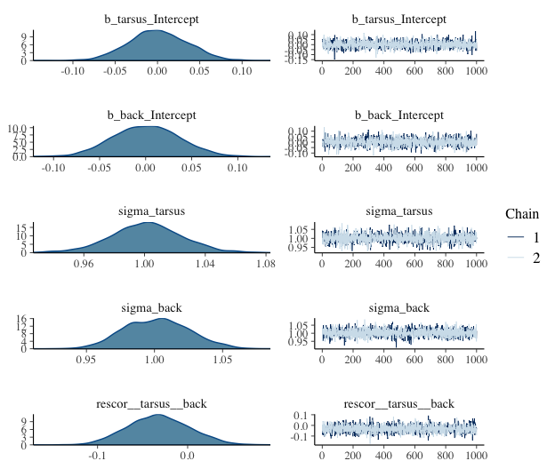

Ch 15. ~~Horoscopes~~ Insights
================
A Solomon Kurz
2018-09-04

~~Horoscopes~~ Insights
=======================

> Statistical inference is indeed critically important. But only as much as every other part of research. Scientific discovery is not an additive process, in which sin in one part can be atoned by virtue in another. Everything interacts. So equally when science works as intended as when it does not, every part of the process deserves attention. (p. 441)

In this final chapter, there are no models for us to fit and no figures for use to reimagine. McElreath took the opportunity to comment more broadly on the scientific process. He made a handful of great points, some of which I’ll quote in a bit. But for the bulk of this chapter, I’d like to take the opportunity to pass on a few of my own insights about workflow. I hope they’re of use.

Use R Notebooks
---------------

OMG

I first started using R in the winter of 2015/2016. Right from the start, I learned how to code from within the [R Studio](https://www.rstudio.com) environment. But I initially started with scripts. No longer. I now use [R Notebooks](http://rmarkdown.rstudio.com/r_notebooks.html) for just about everything. Nathan Stephens wrote a nice blog on [*Why I love R Notebooks*](https://rviews.rstudio.com/2017/03/15/why-i-love-r-notebooks/). I agree. This has fundamentally changed my workflow as a scientist. I only wish I'd learned about this before starting my dissertation project. So it goes...

Do yourself a favor, adopt R Notebooks into your workflow. Do it today. If you prefer to learn with videos, here's a nice intro by [Kristine Yu](https://www.youtube.com/watch?v=TJmNvfhLCoI&t=195s) and another one by [JJ Allaire](https://www.youtube.com/watch?v=GG4pgtfDpWY&t=324s). Try it out for like one afternoon and you’ll be hooked.

Save your model fits
--------------------

It's embarrassing how long it took for this to dawn on me.

Unlike classical statistics, Bayesian models using MCMC take a while to compute. Most of the simple models in McElreath’s text take 30 seconds up to a couple minutes. If your data are small, well-behaved and of a simple structure, you might have a lot of wait times in that range in your future.

It hasn't been that way, for me.

Most of my data have a complicated multilevel structure and often aren’t very well behaved. It’s normal for my models to take an hour or several to fit. Once you start measuring your model fit times in hours, you do not want to fit these things more than once. So, it’s not enough to document my code in a nice R Notebook file. I need to save my `brm()` fit objects in external files.

Consider this model. It’s taken from Bürkner’s vignette, [*Estimating Multivariate Models with brms*](https://cran.r-project.org/web/packages/brms/vignettes/brms_multivariate.html). It took about five minutes for my several-year-old laptop to fit.

``` r
library(brms)
data("BTdata", package = "MCMCglmm")
```

``` r
fit1 <- 
  brm(data = BTdata,
      family = gaussian,
      cbind(tarsus, back) ~ sex + hatchdate + (1|p|fosternest) + (1|q|dam), 
      chains = 2, cores = 2)
```

Five minutes isn't terribly long to wait, but still. I'd prefer to never have to wait for another five minutes, again. Sure, if I save my code in a document like this, I will always be able to fit the model again. But I can work smarter. Here, I'll save my `fit1` object outside of R with the `save()` function.

``` r
save(fit1, file = "fit1.rda")
```

Hopefully y'all are savvy Bayesian R users and find this insultingly remedial. But if it's new to you like it was me, you can learn more about rda flies [here](https://www.r-bloggers.com/load-save-and-rda-files/).

Now `fit1` is saved outside of R, I can safely remove it and then reload it.

``` r
rm(fit1)

load("fit1.rda")
```

The file took a fraction of a second to reload. Once reloaded, I can perform typical operations, like examine summaries of the model parameters or refreshing my memory on what data I used.

``` r
print(fit1)
```

    ##  Family: MV(gaussian, gaussian) 
    ##   Links: mu = identity; sigma = identity
    ##          mu = identity; sigma = identity 
    ## Formula: tarsus ~ sex + hatchdate + (1 | p | fosternest) + (1 | q | dam) 
    ##          back ~ sex + hatchdate + (1 | p | fosternest) + (1 | q | dam) 
    ##    Data: BTdata (Number of observations: 828) 
    ## Samples: 2 chains, each with iter = 2000; warmup = 1000; thin = 1;
    ##          total post-warmup samples = 2000
    ## 
    ## Group-Level Effects: 
    ## ~dam (Number of levels: 106) 
    ##                                      Estimate Est.Error l-95% CI u-95% CI Eff.Sample Rhat
    ## sd(tarsus_Intercept)                     0.49      0.05     0.39     0.59        708 1.00
    ## sd(back_Intercept)                       0.25      0.07     0.11     0.38        390 1.00
    ## cor(tarsus_Intercept,back_Intercept)    -0.51      0.22    -0.91    -0.07        706 1.00
    ## 
    ## ~fosternest (Number of levels: 104) 
    ##                                      Estimate Est.Error l-95% CI u-95% CI Eff.Sample Rhat
    ## sd(tarsus_Intercept)                     0.27      0.05     0.17     0.38        806 1.00
    ## sd(back_Intercept)                       0.35      0.06     0.23     0.46        542 1.01
    ## cor(tarsus_Intercept,back_Intercept)     0.70      0.20     0.23     0.99        250 1.01
    ## 
    ## Population-Level Effects: 
    ##                  Estimate Est.Error l-95% CI u-95% CI Eff.Sample Rhat
    ## tarsus_Intercept    -0.41      0.07    -0.55    -0.26       1460 1.00
    ## back_Intercept      -0.01      0.06    -0.14     0.11       2000 1.00
    ## tarsus_sexMale       0.77      0.06     0.66     0.88       2000 1.00
    ## tarsus_sexUNK        0.23      0.13    -0.03     0.49       2000 1.00
    ## tarsus_hatchdate    -0.04      0.06    -0.16     0.07       1319 1.00
    ## back_sexMale         0.01      0.06    -0.12     0.14       2000 1.00
    ## back_sexUNK          0.15      0.14    -0.13     0.44       2000 1.00
    ## back_hatchdate      -0.09      0.05    -0.19     0.01       2000 1.00
    ## 
    ## Family Specific Parameters: 
    ##              Estimate Est.Error l-95% CI u-95% CI Eff.Sample Rhat
    ## sigma_tarsus     0.76      0.02     0.72     0.80       2000 1.00
    ## sigma_back       0.90      0.03     0.86     0.95       2000 1.00
    ## 
    ## Residual Correlations: 
    ##                     Estimate Est.Error l-95% CI u-95% CI Eff.Sample Rhat
    ## rescor(tarsus,back)    -0.05      0.04    -0.12     0.02       2000 1.00
    ## 
    ## Samples were drawn using sampling(NUTS). For each parameter, Eff.Sample 
    ## is a crude measure of effective sample size, and Rhat is the potential 
    ## scale reduction factor on split chains (at convergence, Rhat = 1).

``` r
library(tidyverse)

fit1$data %>% 
  head()
```

    ##        tarsus  sex  hatchdate     dam fosternest       back
    ## 1 -1.89229718  Fem -0.6874021 R187557      F2102  1.1464212
    ## 2  1.13610981 Male -0.6874021 R187559      F1902 -0.7596521
    ## 3  0.98468946 Male -0.4279814 R187568       A602  0.1449373
    ## 4  0.37900806 Male -1.4656641 R187518      A1302  0.2555847
    ## 5 -0.07525299  Fem -1.4656641 R187528      A2602 -0.3006992
    ## 6 -1.13519543  Fem  0.3502805 R187945      C2302  1.5577219

I believe Bürkner recently added an arbument in `brms:brm()` that will help you do this, too. I haven’t played with it, yet. But if you’re curious, you can find out more [here](https://github.com/paul-buerkner/brms/issues/472).

Build your models slowly
------------------------

The model from Bürkner’s vignette, `fit1`, was no joke. If you wanted to be verbose about it, it was a multilevel, multivariate, multivariable model. It had a cross-classified multilevel structure, two predictors (for each criterion), and two criteria. Not only is that a lot to keep track of, there's a whole lot of places for things to go wrong.

Even if that was the final model I was interested in as a scientist, I still wouldn't start with it. I'd build up incrementally, just to make sure nothing looked fishy. One place to start would be a simple intercepts-only model.

``` r
fit0 <- 
  brm(cbind(tarsus, back) ~ 1, 
      data = BTdata, chains = 2, cores = 2)
```

``` r
plot(fit0)
```



``` r
print(fit0)
```

    ##  Family: MV(gaussian, gaussian) 
    ##   Links: mu = identity; sigma = identity
    ##          mu = identity; sigma = identity 
    ## Formula: tarsus ~ 1 
    ##          back ~ 1 
    ##    Data: BTdata (Number of observations: 828) 
    ## Samples: 2 chains, each with iter = 2000; warmup = 1000; thin = 1;
    ##          total post-warmup samples = 2000
    ## 
    ## Population-Level Effects: 
    ##                  Estimate Est.Error l-95% CI u-95% CI Eff.Sample Rhat
    ## tarsus_Intercept     0.00      0.04    -0.07     0.07       2000 1.00
    ## back_Intercept      -0.00      0.03    -0.07     0.07       2000 1.00
    ## 
    ## Family Specific Parameters: 
    ##              Estimate Est.Error l-95% CI u-95% CI Eff.Sample Rhat
    ## sigma_tarsus     1.00      0.02     0.96     1.05       2000 1.00
    ## sigma_back       1.00      0.03     0.96     1.05       2000 1.00
    ## 
    ## Residual Correlations: 
    ##                     Estimate Est.Error l-95% CI u-95% CI Eff.Sample Rhat
    ## rescor(tarsus,back)    -0.03      0.03    -0.10     0.04       2000 1.00
    ## 
    ## Samples were drawn using sampling(NUTS). For each parameter, Eff.Sample 
    ## is a crude measure of effective sample size, and Rhat is the potential 
    ## scale reduction factor on split chains (at convergence, Rhat = 1).

If the chains look good and the summary statistics look like what I'd expect, I'm on good footing to keep building up to the model I really care about. The results from this model, for example, suggest that both criteria were standardized (i.e., intercepts at 0 and *σ*s at 1). If that wasn't what I intended, I'd rather catch it here than spend five minutes fitting the more complicated `fit1` model, the parameters for which are sufficiently complicated that I may have had trouble telling what scale the data were on.

Note, this is not the same as [*p*-hacking](http://journals.sagepub.com/doi/abs/10.1177/0956797611417632) or [wandering aimlessly down the garden of forking paths](http://www.stat.columbia.edu/~gelman/research/unpublished/p_hacking.pdf). We are not chasing the flashiest model to put in a paper. Rather, this is just good pragmatic data science. If you start off with a theoretically-justified but complicated model and run into computation problems or produce odd-looking estimates, it won't be clear where things went awry. When you build up, step by step, it's easier to catch mistakes, like data cleaning failures, coding goofs, and the like.

So, when I'm working on a project, I fit one or a few simplified models before fitting my complicated model of theoretical interest. This is especially the case when I'm working with model types that are new to me or that I haven't worked with in a while. I document each step in my R Notebook files and I save the fit objects for each in external files. I have caught surprises, this way. Hopefully this will help you catch your mistakes, too.

Which leads to my next point:

Use the `0 + intercept` syntax
------------------------------

We covered this a little in the last couple chapters, but it’s easy to miss. If your real-world model has predictors (i.e., isn’t an intercept-only model), it’s important to keep track of how you have centered your predictors. When you specify a prior in a brms `Intercept` (i.e., an intercept resulting from the `y ~ x` or `y ~ 1 + x` style of syntax), that prior is applied under the presumption all the predictors are mean centered. In the *Population-level ('fixed') effects* subsection of the *`set_prior`* section of the [brms reference manual](https://cran.r-project.org/web/packages/brms/brms.pdf) (version 2.4.0), we read:

> Note that technically, this prior is set on an intercept that results when internally centering all population-level predictors around zero to improve sampling efficiency. On this centered intercept, specifying a prior is actually much easier and intuitive than on the original intercept, since the former represents the expected response value when all predictors are at their means. To treat the intercept as an ordinary population-level effect and avoid the centering parameterization, use `0 + intercept` on the right-hand side of the model formula. (p. 142)

We get a little more information from the *Parameterization of the population-level intercept* subsection of the *brmsformula* section:

> This behavior can be avoided by using the reserved (and internally generated) variable `intercept`. Instead of `y ~ x`, you may write `y ~ 0 + intercept + x`. This way, priors can be defined on the real intercept, directly. In addition, the intercept is just treated as an ordinary population-level effect and thus priors defined on b will also apply to it. Note that this parameterization may be less efficient than the default parameterization discussed above. (p. 30)

We didn’t bother with this for most of the project because our priors on the `Intercept` were often vague and the predictors were often on small enough scales (e.g., the mean of a dummy variable is close to 0) that it just didn’t matter. But this will not always be the case. Set your `Intercept` priors with care.

There’s also the flip side of the issue. If there’s no strong reason not to, consider mean-centering or even standardizing your predictors. Not only will that solve the `Intercept` prior issue, but it often results in more meaningful parameter estimates.

Annotate your workflow
----------------------

In a typical model-fitting file, I'll load my data, perhaps transform the data a bit, fit several models, and examine the output of each with trace plots, model summaries, information criteria, and the like. In my early days, I just figured each of these steps were self-explanatory.

Nope.

My experience was that even a couple weeks between taking a break from a project and restarting it was enough time to make my earlier files confusing. **And they were my files**. I now start each R Notebook document with an introductory paragraph or two explaining exactly what the purpose of the file is. I separate my major sections by [headers and subheaders](http://rmarkdown.rstudio.com/authoring_basics.html). My working R Notebook files are peppered with bullets, sentences, and full on paragraphs between code blocks.

Annotate your code
------------------

This idea is implicit in McElreath's text. But it's easy to miss the message. I know I did, at first. I find this is especially important for data wrangling. I’m a tidyverse guy and, for me, the big-money verbs like `mutate()`, `gather()`, `select()`, `filter()`, `group_by()`, and `summarise()` take care of the bulk of my data wrangling. But every once and a while I need to do something less common, like with `str_extract()` or `case_when()`. And when I end up using a new or less familiar function, I typically annotate right in the code and even sometimes leave a hyperlink to some [R-bloggers](https://www.r-bloggers.com) post or [stackoverflow](https://stackoverflow.com) question that explained how to use it.

Break up your workflow
----------------------

I've also learned to break up my projects into multiple R Notebook files. If you have a small project for which you just want a quick and dirty plot, fine, do it all in one file. My typical project has:

-   A primary data cleaning file
-   A file with basic descriptive statistics and the like
-   At least one primary analysis file
-   Possible secondary and tertiary analysis files
-   A file or two for my major figures
-   A file explaining and depicting my priors, often accompanied by my posteriors, for comparison

Putting all that information in one R Notebook file would be overwhelming. Your workflow might well look different, but hopefully you get the idea. You don't want working files with thousands of lines of code.

Read Gelman's blog
------------------

Yes, [that Gelman](http://andrewgelman.com/books/).

Actually, I started reading [Gelman's blog](http://andrewgelman.com) around the same time I dove into [McElreath’s text](http://xcelab.net/rm/statistical-rethinking/). But if this isn't the case for you, it's time to correct that evil. My graduate mentor often recalled how transformative his first academic conference was. He was an undergrad at the time and it was his first experience meeting and talking with the people whose names he'd seen in his text books. He learned that science was an ongoing conversation among living scientists and--at that time--the best place to take part in that conversation was at conferences. Times keep changing. Nowadays, the living conversation of science occurs online on social media and in blogs. One of the hottest places to find scientists conversing about Bayesian statistics and related methods is [Gelman's blog](http://andrewgelman.com). The posts are great. But a lot of the action is in the comments sections, too.

Check out other social media, too
---------------------------------

If you’re not on it, consider joining academic [twitter](https://www.chronicle.com/blogs/profhacker/getting-started-on-academic-twitter-v2-0/63451). The word on the street is correct. Twitter can be rage-fueled [dumpster fire](https://media.giphy.com/media/l0IynvPneUpb7SnBe/giphy.gif). But if you’re selective about who you follow, it’s a great place to lean from and connect with your academic heroes. If you’re a fan of this project, here’s a list of some of the people you might want to follow:

-   [Richard McElreath](https://twitter.com/rlmcelreath?lang=en)
-   [Paul Bürkner](https://twitter.com/paulbuerkner?lang=en)
-   [Aki Vehtari](https://twitter.com/avehtari?lang=en)
-   [Dan Simpson](https://twitter.com/dan_p_simpson?lang=en)
-   [Michael Bentacourt](https://twitter.com/betanalpha?lang=en)
-   [Hadley Wickham](https://twitter.com/hadleywickham?lang=en)
-   [Yihui Xie](https://twitter.com/xieyihui?lang=en)
-   [Jenny Bryan](https://twitter.com/JennyBryan?lang=en)
-   [Roger Peng](https://twitter.com/rdpeng?lang=en)
-   [Mara Averick](https://twitter.com/dataandme?lang=en)
-   [Matthew Kay](https://twitter.com/mjskay?lang=en)
-   [Matti Vuorre](https://twitter.com/vuorre?lang=en)

[I’m also on twitter](https://twitter.com/SolomonKurz?lang=en), too.

If you’re on facebook and in the social sciences, you might check out the [Bayesian Inference in Psychology](https://www.facebook.com/groups/1249986448367985/?ref=bookmarks) group. It hasn’t been terribly active, as of late. But there are a lot of great folks to connect with, there.

I’ve already mentioned Gelman’s blog. [McElreath has one, too](http://elevanth.org/blog/). He posts infrequently, but it’s usually pretty good when he does.

Also, do check out the [Stan Forums](https://discourse.mc-stan.org). They have a special [brms tag](https://discourse.mc-stan.org/c/interfaces/brms) there, under which you can find all kinds of hot brms talk.

Parting wisdom
--------------

Okay, that’s enough from me. Let’s wrap this project up with some McElreath.

> There is an aspect of science that you do personally control: openness. Pre-plan your research together with the statistical analysis. Doing so will improve both the research design and the statistics. Document it in the form of a mock analysis that you would not be ashamed to share with a colleague. Register it publicly, perhaps in a simple repository, like [Github](https://github.com) or any other. But your webpage will do just fine, as well. Then collect the data. Then analyze the data as planned. If you must change the plan, that’s fine. But document the changes and justify them. Provide all of the data and scripts necessary to repeat your analysis. Do not provide scripts and data "on request," but rather put them online so reviewers of your paper can access them without your interaction. There are of course cases in which full data cannot be released, due to privacy concerns. But the bulk of science is not of that sort.
>
> The data and its analysis are the scientific product. The paper is just an advertisement. If you do your honest best to design, conduct, and document your research, so that others can build directly upon it, you can make a difference. (p. 443)

Toward that end, also check out the [OSF](https://osf.io) and their YouTube channel, [here](https://www.youtube.com/channel/UCGPlVf8FsQ23BehDLFrQa-g).

Reference
---------

[McElreath, R. (2016). *Statistical rethinking: A Bayesian course with examples in R and Stan.* Chapman & Hall/CRC Press.](https://xcelab.net/rm/statistical-rethinking/)

Session info
------------

``` r
sessionInfo()
```

    ## R version 3.5.1 (2018-07-02)
    ## Platform: x86_64-apple-darwin15.6.0 (64-bit)
    ## Running under: macOS High Sierra 10.13.6
    ## 
    ## Matrix products: default
    ## BLAS: /Library/Frameworks/R.framework/Versions/3.5/Resources/lib/libRblas.0.dylib
    ## LAPACK: /Library/Frameworks/R.framework/Versions/3.5/Resources/lib/libRlapack.dylib
    ## 
    ## locale:
    ## [1] en_US.UTF-8/en_US.UTF-8/en_US.UTF-8/C/en_US.UTF-8/en_US.UTF-8
    ## 
    ## attached base packages:
    ## [1] stats     graphics  grDevices utils     datasets  methods   base     
    ## 
    ## other attached packages:
    ##  [1] forcats_0.3.0   stringr_1.3.1   dplyr_0.7.6     purrr_0.2.5     readr_1.1.1     tidyr_0.8.1    
    ##  [7] tibble_1.4.2    tidyverse_1.2.1 brms_2.4.0      ggplot2_3.0.0   Rcpp_0.12.18   
    ## 
    ## loaded via a namespace (and not attached):
    ##  [1] nlme_3.1-137         matrixStats_0.54.0   xts_0.10-2           lubridate_1.7.4     
    ##  [5] threejs_0.3.1        httr_1.3.1           rprojroot_1.3-2      rstan_2.17.3        
    ##  [9] tools_3.5.1          backports_1.1.2      R6_2.2.2             DT_0.4              
    ## [13] lazyeval_0.2.1       colorspace_1.3-2     withr_2.1.2          tidyselect_0.2.4    
    ## [17] gridExtra_2.3        mnormt_1.5-5         Brobdingnag_1.2-5    compiler_3.5.1      
    ## [21] cli_1.0.0            rvest_0.3.2          xml2_1.2.0           shinyjs_1.0         
    ## [25] labeling_0.3         colourpicker_1.0     scales_0.5.0         dygraphs_1.1.1.5    
    ## [29] mvtnorm_1.0-8        psych_1.8.4          ggridges_0.5.0       digest_0.6.15       
    ## [33] StanHeaders_2.17.2   foreign_0.8-70       rmarkdown_1.10       base64enc_0.1-3     
    ## [37] pkgconfig_2.0.1      htmltools_0.3.6      htmlwidgets_1.2      rlang_0.2.1         
    ## [41] readxl_1.1.0         rstudioapi_0.7       shiny_1.1.0          bindr_0.1.1         
    ## [45] zoo_1.8-2            jsonlite_1.5         crosstalk_1.0.0      gtools_3.8.1        
    ## [49] inline_0.3.15        magrittr_1.5         loo_2.0.0            bayesplot_1.6.0     
    ## [53] Matrix_1.2-14        munsell_0.5.0        abind_1.4-5          stringi_1.2.3       
    ## [57] yaml_2.1.19          plyr_1.8.4           grid_3.5.1           parallel_3.5.1      
    ## [61] promises_1.0.1       crayon_1.3.4         miniUI_0.1.1.1       lattice_0.20-35     
    ## [65] haven_1.1.2          hms_0.4.2            knitr_1.20           pillar_1.2.3        
    ## [69] igraph_1.2.1         markdown_0.8         shinystan_2.5.0      reshape2_1.4.3      
    ## [73] stats4_3.5.1         rstantools_1.5.0     glue_1.2.0           evaluate_0.10.1     
    ## [77] modelr_0.1.2         httpuv_1.4.4.2       cellranger_1.1.0     gtable_0.2.0        
    ## [81] assertthat_0.2.0     mime_0.5             xtable_1.8-2         broom_0.4.5         
    ## [85] coda_0.19-1          later_0.7.3          rsconnect_0.8.8      shinythemes_1.1.1   
    ## [89] bindrcpp_0.2.2       bridgesampling_0.4-0
