## 5.1. Spurious associations

Load the Waffle House data.


```r
library(rethinking)
data(WaffleDivorce)
d <- WaffleDivorce
```

Unload rethinking and load brms and, while we're at it, the tidyverse.


```r
rm(WaffleDivorce)
detach(package:rethinking, unload = T)
library(brms)
library(tidyverse)
```

I'm not going to show the output, but you might go ahead and investigate the data.


```r
head(d)
glimpse(d)
```

Now we have our data, we can reproduce Figure 5.1. One convenient way to get the handful of Sate labels into the plot was with the `geom_text_repel()` function from 
the [ggrepel package](https://cran.r-project.org/web/packages/ggrepel/index.html).


```r
# install.packages("ggrepel", depencencies = T)
library(ggrepel)

set.seed(1042) #  This makes the geom_text_repel() part reproducible
d %>%
  ggplot(aes(x = WaffleHouses/Population, y = Divorce)) +
  theme_bw() +
  stat_smooth(method = "lm", fullrange = T, size = 1/2,
              color = "firebrick4", fill = "firebrick", alpha = 1/5) +
  geom_point(size = 1.5, color = "firebrick4", alpha = 1/2) +
  geom_text_repel(data = d %>% 
                    filter(Loc %in% c("ME", "OK", "AR", "AL",
                                      "GA", "SC", "NJ")),
                  aes(label = Loc), size = 3) +
  scale_x_continuous(limits = c(0, 55)) +
  coord_cartesian(xlim = 0:50, ylim = 5:15) +
  labs(x = "Waffle Houses per million", 
       y = "Divorce rate") +
  theme(panel.grid = element_blank())  
```

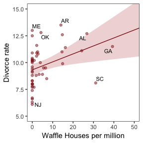<!-- -->

Here we standardize the predictor, `MedianAgeMarriage`, and fit the first univariable model.


```r
d <-
  d %>%
  mutate(MedianAgeMarriage.s = (MedianAgeMarriage - mean(MedianAgeMarriage))/sd(MedianAgeMarriage))

b5.1 <- 
  brm(data = d, family = gaussian,
      Divorce ~ 1 + MedianAgeMarriage.s,
      prior = c(set_prior("normal(0, 10)", class = "Intercept"),
                set_prior("normal(0, 1)", class = "b"),
                set_prior("uniform(0, 10)", class = "sigma")),
      chains = 4, iter = 2000, warmup = 500, cores = 4)

print(b5.1)
```

```
##  Family: gaussian 
##   Links: mu = identity; sigma = identity 
## Formula: Divorce ~ 1 + MedianAgeMarriage.s 
##    Data: d (Number of observations: 50) 
## Samples: 4 chains, each with iter = 2000; warmup = 500; thin = 1; 
##          total post-warmup samples = 6000
##     ICs: LOO = NA; WAIC = NA; R2 = NA
##  
## Population-Level Effects: 
##                     Estimate Est.Error l-95% CI u-95% CI Eff.Sample Rhat
## Intercept               9.68      0.22     9.25    10.11       5543 1.00
## MedianAgeMarriage.s    -1.04      0.21    -1.44    -0.61       6000 1.00
## 
## Family Specific Parameters: 
##       Estimate Est.Error l-95% CI u-95% CI Eff.Sample Rhat
## sigma     1.52      0.16     1.24     1.87       5173 1.00
## 
## Samples were drawn using sampling(NUTS). For each parameter, Eff.Sample 
## is a crude measure of effective sample size, and Rhat is the potential 
## scale reduction factor on split chains (at convergence, Rhat = 1).
```

Here it is, Figure 5.2.b.


```r
# First we determine the range of MedianAgeMarriage.s values we'd like to feed into fitted()
nd <- tibble(MedianAgeMarriage.s = seq(from = -3, to = 3.5, 
                                       length.out = 30))

# Now we use fitted() to get the model-implied trajectories
fitd5.1 <- 
  fitted(b5.1, newdata = nd) %>%
  as_tibble() %>%
  bind_cols(nd)

# The plot
ggplot(data = fitd5.1, 
       aes(x = MedianAgeMarriage.s, y = Estimate)) +
  theme_bw() +
  geom_ribbon(aes(ymin = `2.5%ile`, ymax = `97.5%ile`),
              fill = "firebrick", alpha = 1/5) +
  geom_line(color = "firebrick4") +
  geom_point(data = d, 
             aes(x = MedianAgeMarriage.s, y = Divorce), 
             size = 2, color = "firebrick4") +
  labs(y = "Divorce") +
  coord_cartesian(xlim = range(d$MedianAgeMarriage.s), 
                  ylim = range(d$Divorce)) +
  theme(panel.grid = element_blank())                   
```

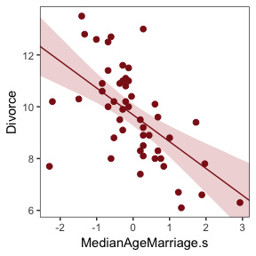<!-- -->

After standardizing `Marriage`, we're ready to fit our second univariable model.


```r
d <-
  d %>%
  mutate(Marriage.s = (Marriage - mean(Marriage))/sd(Marriage))

b5.2 <- 
  brm(data = d, family = gaussian,
      Divorce ~ 1 + Marriage.s,
      prior = c(set_prior("normal(0, 10)", class = "Intercept"),
                set_prior("normal(0, 1)", class = "b"),
                set_prior("uniform(0, 10)", class = "sigma")),
      chains = 4, iter = 2000, warmup = 500, cores = 4)

print(b5.2)
```

```
##  Family: gaussian 
##   Links: mu = identity; sigma = identity 
## Formula: Divorce ~ 1 + Marriage.s 
##    Data: d (Number of observations: 50) 
## Samples: 4 chains, each with iter = 2000; warmup = 500; thin = 1; 
##          total post-warmup samples = 6000
##     ICs: LOO = NA; WAIC = NA; R2 = NA
##  
## Population-Level Effects: 
##            Estimate Est.Error l-95% CI u-95% CI Eff.Sample Rhat
## Intercept      9.68      0.25     9.19    10.17       4996 1.00
## Marriage.s     0.64      0.25     0.16     1.12       5919 1.00
## 
## Family Specific Parameters: 
##       Estimate Est.Error l-95% CI u-95% CI Eff.Sample Rhat
## sigma     1.75      0.19     1.44     2.17       4874 1.00
## 
## Samples were drawn using sampling(NUTS). For each parameter, Eff.Sample 
## is a crude measure of effective sample size, and Rhat is the potential 
## scale reduction factor on split chains (at convergence, Rhat = 1).
```

And now we prep for and plot our version of Figure 5.2.a.


```r
nd <- tibble(Marriage.s = seq(from = -2.5, to = 3.5, 
                              length.out = 30))

fitd5.2 <- 
  fitted(b5.2, newdata = nd) %>%
  as_tibble() %>%
  bind_cols(nd)

ggplot(data = fitd5.2, 
       aes(x = Marriage.s, y = Estimate)) +
  theme_bw() +
  geom_ribbon(aes(ymin = `2.5%ile`, ymax = `97.5%ile`),
              fill = "firebrick", alpha = 1/5) +
  geom_line(color = "firebrick4") +
  geom_point(data = d, 
             aes(x = Marriage.s, y = Divorce), 
             size = 2, color = "firebrick4") +
  coord_cartesian(xlim = range(d$Marriage.s), 
                  ylim = range(d$Divorce)) +
  labs(y = "Divorce") +
  theme(panel.grid = element_blank())                   
```

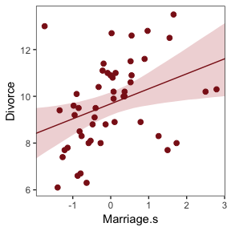<!-- -->


### 5.1.2. Fitting the model.

Let's get both `Marriage.s` and `MedianAgeMarriage.s` in there with our very first multivariable model.


```r
b5.3 <- 
  brm(data = d, family = gaussian,
      Divorce ~ 1 + Marriage.s + MedianAgeMarriage.s,
      prior = c(set_prior("normal(0, 10)", class = "Intercept"),
                set_prior("normal(0, 1)", class = "b"),
                set_prior("uniform(0, 10)", class = "sigma")),
      chains = 4, iter = 2000, warmup = 500, cores = 4)

print(b5.3)
```

```
##  Family: gaussian 
##   Links: mu = identity; sigma = identity 
## Formula: Divorce ~ 1 + Marriage.s + MedianAgeMarriage.s 
##    Data: d (Number of observations: 50) 
## Samples: 4 chains, each with iter = 2000; warmup = 500; thin = 1; 
##          total post-warmup samples = 6000
##     ICs: LOO = NA; WAIC = NA; R2 = NA
##  
## Population-Level Effects: 
##                     Estimate Est.Error l-95% CI u-95% CI Eff.Sample Rhat
## Intercept               9.69      0.22     9.26    10.13       5225 1.00
## Marriage.s             -0.12      0.30    -0.71     0.45       3887 1.00
## MedianAgeMarriage.s    -1.12      0.30    -1.70    -0.53       3807 1.00
## 
## Family Specific Parameters: 
##       Estimate Est.Error l-95% CI u-95% CI Eff.Sample Rhat
## sigma     1.52      0.16     1.24     1.88       3931 1.00
## 
## Samples were drawn using sampling(NUTS). For each parameter, Eff.Sample 
## is a crude measure of effective sample size, and Rhat is the potential 
## scale reduction factor on split chains (at convergence, Rhat = 1).
```

The `stanplot()` function is an easy way to get a default coefficient plot. You just put the brmsfit object into the function.


```r
stanplot(b5.3)
```

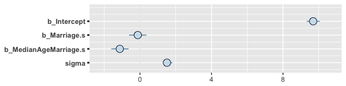<!-- -->

There are numerous ways to make a coefficient plot. Another is with the `mcmc_intervals()` function from the [bayesplot package](https://cran.r-project.org/web/packages/bayesplot/index.html). A nice feature of the bayesplot package is its convenient way to alter the color scheme with the `color_scheme_set()` function. Here, for example, we'll make the theme `red`. But note how the `mcmc_intervals()` function requires you to work with the `posterior_samples()` instead of the brmsfit object. 


```r
# install.packages("bayesplot", dependencies = T)
library(bayesplot)

post <- posterior_samples(b5.3)

color_scheme_set("red")
mcmc_intervals(post[, 1:4], 
               prob = .5,
               point_est = "median") +
  labs(title = "My fancy coefficient plot") +
  theme(axis.text.y = element_text(hjust = 0),
        axis.line.x = element_line(size = 1/4),
        axis.line.y = element_blank(),
        axis.ticks.y = element_blank())
```

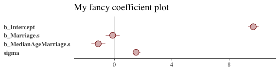<!-- -->

Because bayesplot produces a ggplot2 object, the plot was adjustable with familiar ggplot2 syntax. For more ideas, check out [this vignette](https://cran.r-project.org/web/packages/bayesplot/vignettes/plotting-mcmc-draws.html).

### 5.1.3. Plotting multivariate posteriors.

#### 5.1.3.1. Predictor residual plots.

To get ready to make our residual plots, we'll predict `Marriage.s` with `MedianAgeMarriage.s`.


```r
b5.4 <- 
  brm(data = d, family = gaussian,
      Marriage.s ~ 1 + MedianAgeMarriage.s,
      prior = c(set_prior("normal(0, 10)", class = "Intercept"),
                set_prior("normal(0, 1)", class = "b"),
                set_prior("uniform(0, 10)", class = "sigma")),
      chains = 4, iter = 2000, warmup = 500, cores = 4)

print(b5.4)
```

```
##  Family: gaussian 
##   Links: mu = identity; sigma = identity 
## Formula: Marriage.s ~ 1 + MedianAgeMarriage.s 
##    Data: d (Number of observations: 50) 
## Samples: 4 chains, each with iter = 2000; warmup = 500; thin = 1; 
##          total post-warmup samples = 6000
##     ICs: LOO = NA; WAIC = NA; R2 = NA
##  
## Population-Level Effects: 
##                     Estimate Est.Error l-95% CI u-95% CI Eff.Sample Rhat
## Intercept              -0.00      0.10    -0.21     0.19       5311 1.00
## MedianAgeMarriage.s    -0.71      0.11    -0.92    -0.50       4932 1.00
## 
## Family Specific Parameters: 
##       Estimate Est.Error l-95% CI u-95% CI Eff.Sample Rhat
## sigma     0.72      0.08     0.59     0.89       5302 1.00
## 
## Samples were drawn using sampling(NUTS). For each parameter, Eff.Sample 
## is a crude measure of effective sample size, and Rhat is the potential 
## scale reduction factor on split chains (at convergence, Rhat = 1).
```

With `fitted()`, we compute the expected values for each State.


```r
fitd54 <- 
  fitted(b5.4) %>%
  as_tibble() %>%
  bind_cols(d %>% select(MedianAgeMarriage.s))
```

After a little data processing, we can make Figure 5.3.


```r
df54 <- 
  d %>%
  select(MedianAgeMarriage.s, Marriage.s) %>%
  bind_cols(fitd54 %>% 
              select(Estimate))

ggplot(data = df54, 
       aes(x = MedianAgeMarriage.s, y = Marriage.s)) +
  theme_bw() +
  geom_point(data = d, 
             aes(x = MedianAgeMarriage.s, y = Marriage.s), 
             size = 2, shape = 1, color = "firebrick4") +
  geom_segment(aes(xend = MedianAgeMarriage.s, yend = Estimate), 
               size = 1/4) +
  geom_line(aes(MedianAgeMarriage.s, y = Estimate), 
            color = "firebrick4") +
  coord_cartesian(ylim = range(d$Marriage.s)) +
  theme(panel.grid = element_blank())     
```

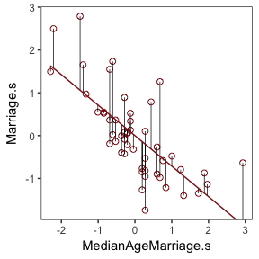<!-- -->

We get the residuals with the well-named `residuals()` function. Much like with `brms::fitted()`, `brms::residuals()` returns a four-vector matrix with the number of rows equal to the number of observations in the original data (by default, anyway). The vectors have the familiar names: `Estimate`, `Est.Error`, `2.5%ile`, and `97.5%ile`. See the [brms reference manual](https://cran.r-project.org/web/packages/brms/brms.pdf) for details.

With our residuals in hand, we just need a little more data processing to make Figure 5.4.a.


```r
res54 <- 
  residuals(b5.4) %>%
  # To use this in ggplot2, we need to make it a tibble or data frame
  as_tibble()

df54 <-
  df54 %>%
  mutate(res     = res54$Estimate,
         Divorce = d$Divorce)

ggplot(data = df54, 
       aes(x = res, y = Divorce)) +
  theme_bw() +
  stat_smooth(method = "lm", color = "firebrick4", fill = "firebrick4", 
              alpha = 1/5, size = 1/2) +
  geom_vline(xintercept = 0, linetype = 2, color = "grey50") +
  geom_point(size = 2, color = "firebrick4", alpha = 2/3) +
  annotate("text", x = -.05, y = 14.1, label = "slower       faster") +
  coord_cartesian(ylim = c(6, 14.1)) +
  labs(x = "Marriage rate residuals") +
  theme(panel.grid = element_blank())  
```

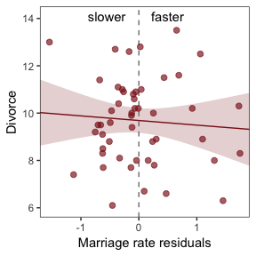<!-- -->

To get the `MedianAgeMarriage.s` residuals, we have to fit the corresponding model first.


```r
b5.4.1 <- 
  brm(data = d, family = gaussian,
      MedianAgeMarriage.s ~ 1 + Marriage.s,
      prior = c(set_prior("normal(0, 10)", class = "Intercept"),
                set_prior("normal(0, 1)", class = "b"),
                set_prior("uniform(0, 10)", class = "sigma")),
      chains = 4, iter = 2000, warmup = 500, cores = 4)
```

And now we'll get the new batch of residuals, do a little data processing, and make a plot corresponding to Figure 5.4.b.


```r
df541 <- 
  residuals(b5.4.1) %>%
  as_tibble() %>%
  select(Estimate) %>%
  bind_cols(d %>% select(Divorce))

ggplot(data = df541, 
       aes(x = Estimate, y = Divorce)) +
  theme_bw() +
  stat_smooth(method = "lm", color = "firebrick4", fill = "firebrick4", 
              alpha = 1/5, size = 1/2) +
  geom_vline(xintercept = 0, linetype = 2, color = "grey50") +
  geom_point(size = 2, color = "firebrick4", alpha = 2/3) +
  coord_cartesian(ylim = c(6, 14.1)) +
  annotate("text", x = -.14, y = 14.1, label = "younger     older") +
  labs(x = "Age of marriage residuals") +
  theme(panel.grid = element_blank())  
```

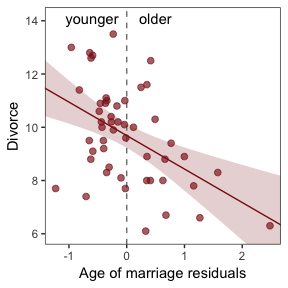<!-- -->

#### 5.1.3.2. Counterfactual plots.

Making Figure 5.5.a. requires a little more data wrangling than before.


```r
nd <- 
  tibble(Marriage.s = seq(from = -3, to = 3, length.out = 30),
         MedianAgeMarriage.s = rep(mean(d$MedianAgeMarriage.s, 
                                        times = 30)))

pred53.a <- predict(b5.3, newdata = nd)
fitd53.a <- fitted(b5.3, newdata = nd)

# This isn't the most tidyverse-centric way of doing things, but it just seemed easier to rely on the bracket syntax for this one
tibble(Divorce = fitd53.a[, 1],
       fll     = fitd53.a[, 3],
       ful     = fitd53.a[, 4],
       pll     = pred53.a[, 3],
       pul     = pred53.a[, 4]) %>%
  bind_cols(nd) %>%  # Note our use of the pipe, here. This allowed us to feed the tibble directly into ggplot2 without having to save it as an object.
  
  ggplot(aes(x = Marriage.s, y = Divorce)) +
  theme_bw() +
  geom_ribbon(aes(ymin = pll, ymax = pul),
              fill = "firebrick", alpha = 1/5) +
  geom_ribbon(aes(ymin = fll, ymax = ful),
              fill = "firebrick", alpha = 1/5) +
  geom_line(color = "firebrick4") +
  coord_cartesian(ylim = c(6, 14)) +
  labs(subtitle = "Counterfactual plot for which\nMedianAgeMarriage.s = 0") +
  theme(panel.grid = element_blank())     
```

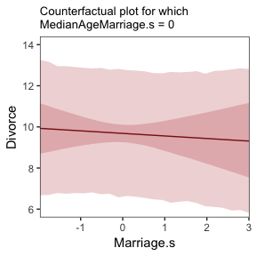<!-- -->

We follow the same process for Figure 5.5.b.


```r
nd <- 
  tibble(MedianAgeMarriage.s = seq(from = -3, to = 3.5, length.out = 30),
         Marriage.s = rep(mean(d$Marriage.s), times = 30))

pred53.b <- predict(b5.3, newdata = nd)
fitd53.b <- fitted(b5.3, newdata = nd)

tibble(Divorce = fitd53.b[, 1],
       fll     = fitd53.b[, 3],
       ful     = fitd53.b[, 4],
       pll     = pred53.b[, 3],
       pul     = pred53.b[, 4]) %>%
  bind_cols(nd) %>%
  
  ggplot(aes(x = MedianAgeMarriage.s, y = Divorce)) +
  theme_bw() +
  geom_ribbon(aes(ymin = pll, ymax = pul),
              fill = "firebrick", alpha = 1/5) +
  geom_ribbon(aes(ymin = fll, ymax = ful),
              fill = "firebrick", alpha = 1/5) +
  geom_line(color = "firebrick4") +
  coord_cartesian(ylim = c(6, 14)) +
  labs(subtitle = "Counterfactual plot for which\nMarriage.s = 0") +
  theme(panel.grid = element_blank())     
```

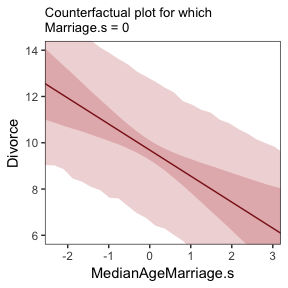<!-- -->

#### 5.1.3.3. Posterior prediction plots.

In this version of Figure 5.6.a., the thin lines are the 95% intervals and the thicker lines are +/- the posterior *SD*, both of which are returned when you use `fitted()`.


```r
fitted(b5.3) %>%
  as_tibble() %>%
  bind_cols(d %>% select(Divorce, Loc)) %>%
  
  ggplot(aes(x = Divorce, y = Estimate)) +
  theme_bw() +
  geom_abline(linetype = 2, color = "grey50", size = .5) +
  geom_point(size = 1.5, color = "firebrick4", alpha = 3/4) +
  geom_linerange(aes(ymin = `2.5%ile`, ymax = `97.5%ile`),
                 size = 1/4, color = "firebrick4") +
  geom_linerange(aes(ymin = Estimate - Est.Error, ymax = Estimate + Est.Error),
                 size = 1/2, color = "firebrick4") +
  geom_text(data = . %>% filter(Loc %in% c("ID", "UT")),
            aes(label = Loc), 
            hjust = 0, nudge_x = - 0.65) +
  labs(x = "Observed divorce", y = "Predicted divorce") +
  theme(panel.grid = element_blank())
```

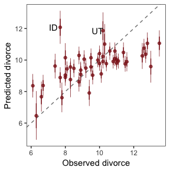<!-- -->

The legwork for and reproduction of Figure 5.6.b. 


```r
# This is for the average prediction error mean, +/- SD, and 95% intervals
res53 <- 
  residuals(b5.3) %>%
  as_tibble() %>%
  bind_cols(d %>% select(Loc))

# This is the 95% prediction interval
pred53 <- 
 predict(b5.3) %>%
  as_tibble() %>%
  transmute(`2.5%ile` = d$Divorce - `2.5%ile`,
            `97.5%ile` = d$Divorce - `97.5%ile`) %>%
  bind_cols(d %>% select(Loc))

# The plot
ggplot(data = res53, 
       aes(x = reorder(Loc, Estimate), y = Estimate)) +
  theme_bw() +
  geom_hline(yintercept = 0, size = 1/2, color = "grey85") +
  geom_pointrange(aes(ymin = `2.5%ile`, ymax = `97.5%ile`),
                  size = 2/5, shape = 20, color = "firebrick4") + 
  geom_segment(aes(y = Estimate - Est.Error, 
                   yend = Estimate + Est.Error,
                   x = Loc, xend = Loc),
               size = 1, color = "firebrick4") +
  geom_segment(data = pred53, 
               aes(y = `2.5%ile`, yend = `97.5%ile`,
                   x = Loc, xend = Loc),
               size = 3, color = "firebrick4", alpha = 1/10) +
  labs(x = NULL, y = NULL) +
  coord_flip(ylim = c(-6, 5)) +
  theme(panel.grid = element_blank(),
        axis.ticks.y = element_blank(),
        axis.text.y = element_text(hjust = 0))
```

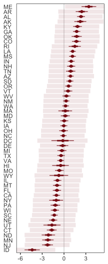<!-- -->

Compared to the ones above, Figure 5.6.c. is pretty simple.


```r
res53 %>%
  mutate(Wpc = d$WaffleHouses/d$Population) %>%
  
  ggplot(aes(x = Wpc, y = Estimate)) +
  theme_bw() +
  geom_point(size = 1.5, color = "firebrick4", alpha = 1/2) +
  stat_smooth(method = "lm", color = "firebrick4", size = 1/2, 
              fill = "firebrick", alpha = 1/5) + 
  geom_text_repel(data = . %>% 
                    filter(Loc %in% c("ME", "AR", "MS", "AL", 
                                      "GA", "SC", "ID")),
                  aes(label = Loc)) +
  theme(panel.grid = element_blank())
```

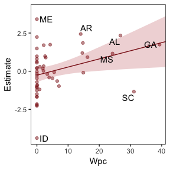<!-- -->


## 5.2. Masked relationship

Let's load those tasty `milk` data.


```r
library(rethinking)
data(milk)
d <- milk
```

Unload rethinking and load brms.


```r
rm(milk)
detach(package:rethinking, unload = T)
library(brms)
```

You might inspect the data like this. 


```r
head(d)
glimpse(d)
```

McElreath has us start of with a simple univaraible `milk` model.


```r
b5.5 <- 
  brm(data = d, family = gaussian,
      kcal.per.g ~ 1 + neocortex.perc,
      prior = c(set_prior("normal(0, 100)", class = "Intercept"),
                set_prior("normal(0, 1)", class = "b"),
                set_prior("uniform(0, 1)", class = "sigma")),
      chains = 4, iter = 2000, warmup = 500, cores = 4,
      control = list(adapt_delta = 0.95))
```

Stan and brms did just fine with the missing data. However, the warning messages suggested we raise `adapt_delta` above the default 0.8. Setting it to 0.95 did the trick. Similar to the rethinking example in the text, brms warned that "Rows containing NAs were excluded from the model." This isn't necessarily a problem; the model fit just fine. But do see chapter 14 to learn how to do better. 

Here's how to explicitly drop the cases with missing values on the predictor.


```r
d %>%
  select(neocortex.perc) %>%
  head()
```

```
##   neocortex.perc
## 1          55.16
## 2             NA
## 3             NA
## 4             NA
## 5             NA
## 6          64.54
```

```r
dcc <- 
  d %>%
  filter(complete.cases(.))              

b5.5 <- 
  brm(data = dcc, family = gaussian,
      kcal.per.g ~ 1 + neocortex.perc,
      prior = c(set_prior("normal(0, 100)", class = "Intercept"),
                set_prior("normal(0, 1)", class = "b"),
                set_prior("uniform(0, 1)", class = "sigma")),
      chains = 4, iter = 2000, warmup = 500, cores = 4,
      control = list(adapt_delta = 0.9))

print(b5.5, digits = 3)
```

```
##  Family: gaussian 
##   Links: mu = identity; sigma = identity 
## Formula: kcal.per.g ~ 1 + neocortex.perc 
##    Data: dcc (Number of observations: 17) 
## Samples: 4 chains, each with iter = 2000; warmup = 500; thin = 1; 
##          total post-warmup samples = 6000
##     ICs: LOO = NA; WAIC = NA; R2 = NA
##  
## Population-Level Effects: 
##                Estimate Est.Error l-95% CI u-95% CI Eff.Sample  Rhat
## Intercept         0.355     0.560   -0.762    1.450       5406 1.000
## neocortex.perc    0.004     0.008   -0.012    0.021       5410 1.000
## 
## Family Specific Parameters: 
##       Estimate Est.Error l-95% CI u-95% CI Eff.Sample  Rhat
## sigma    0.193     0.039    0.134    0.285       3898 1.000
## 
## Samples were drawn using sampling(NUTS). For each parameter, Eff.Sample 
## is a crude measure of effective sample size, and Rhat is the potential 
## scale reduction factor on split chains (at convergence, Rhat = 1).
```

To get the brms answer to what McElreath did with `coef()`, we'll use the `fixef()` function.


```r
fixef(b5.5)[2]*(76 - 55)
```

```
## [1] 0.0940288
```

Yes, indeed, "that's less than 0.1 kilocalories" (p. 137).

Here's Figure 5.7., top left.


```r
nd <- tibble(neocortex.perc = 54:80)

dffitted.a <- 
  fitted(b5.5, 
         newdata = nd,
         probs = c(.025, .975, .25, .75)) %>%
  as_tibble() %>%
  bind_cols(nd)

ggplot(data = dffitted.a, 
       aes(x = neocortex.perc, y = Estimate)) +
  theme_bw() +
  geom_ribbon(aes(ymin = dffitted.a[ , 3], ymax = dffitted.a[ , 4]),
              fill = "firebrick", alpha = 1/5) +
  geom_ribbon(aes(ymin = dffitted.a[ , 5], ymax = dffitted.a[ , 6]),
              fill = "firebrick4", alpha = 1/5) +
  geom_line(color = "firebrick4", size = 1/2) +
  geom_point(data = dcc, 
             aes(x = neocortex.perc, y = kcal.per.g),
             size = 2, color = "firebrick4") +
  coord_cartesian(xlim = range(dcc$neocortex.perc), 
                  ylim = range(dcc$kcal.per.g)) +
  labs(y = "kcal.per.g") +
  theme(panel.grid = element_blank())
```

<!-- -->

Now we use `log.mass` as the new sole predictor.


```r
dcc <-
  dcc %>%
  mutate(log.mass = log(mass))

b5.6 <- 
  brm(data = dcc, family = gaussian,
      kcal.per.g ~ 1 + log.mass,
      prior = c(set_prior("normal(0, 100)", class = "Intercept"),
                set_prior("normal(0, 1)", class = "b"),
                set_prior("uniform(0, 1)", class = "sigma")),
      chains = 4, iter = 2000, warmup = 500, cores = 4,
      control = list(adapt_delta = 0.9))

print(b5.6, digits = 3)
```

```
##  Family: gaussian 
##   Links: mu = identity; sigma = identity 
## Formula: kcal.per.g ~ 1 + log.mass 
##    Data: dcc (Number of observations: 17) 
## Samples: 4 chains, each with iter = 2000; warmup = 500; thin = 1; 
##          total post-warmup samples = 6000
##     ICs: LOO = NA; WAIC = NA; R2 = NA
##  
## Population-Level Effects: 
##           Estimate Est.Error l-95% CI u-95% CI Eff.Sample  Rhat
## Intercept    0.706     0.058    0.588    0.822       4239 1.000
## log.mass    -0.032     0.024   -0.079    0.017       4245 1.000
## 
## Family Specific Parameters: 
##       Estimate Est.Error l-95% CI u-95% CI Eff.Sample  Rhat
## sigma    0.183     0.038    0.127    0.271       3513 1.000
## 
## Samples were drawn using sampling(NUTS). For each parameter, Eff.Sample 
## is a crude measure of effective sample size, and Rhat is the potential 
## scale reduction factor on split chains (at convergence, Rhat = 1).
```

Figure 5.7., top right.


```r
# Here we get the range we'll want for nd, below
dcc %>%
  select(log.mass) %>%
  range()
```

```
## [1] -2.120264  4.374876
```

```r
nd <- 
  tibble(log.mass = seq(from = -2.5, to = 5,
                        length.out = 30))

dffitted.b <- 
  b5.6 %>%
  fitted(newdata = nd,
         probs = c(.025, .975, .25, .75)) %>%
  as_tibble() %>%
  mutate(log.mass = seq(from = -2.5, to = 5, 
                            length.out = 30))

ggplot(data = dffitted.b, 
       aes(x = log.mass, y = Estimate)) +
  theme_bw() +
  geom_ribbon(aes(ymin = dffitted.b[ , 3], ymax = dffitted.b[ , 4]),
              fill = "firebrick", alpha = 1/5) +
  geom_ribbon(aes(ymin = dffitted.b[ , 5], ymax = dffitted.b[ , 6]),
              fill = "firebrick", alpha = 1/5) +
  geom_line(color = "firebrick4", size = 1/2) +
  geom_point(data = dcc, aes(x = log.mass, y = kcal.per.g),
             size = 2, color = "firebrick4") +
  coord_cartesian(xlim = range(dcc$log.mass), 
                  ylim = range(dcc$kcal.per.g)) +
  labs(y = "kcal.per.g") +
  theme(panel.grid = element_blank())
```

<!-- -->

Finally, we're ready to fit the "joint model" including both predictors. Note, to converge properly, the HMC chains required a longer warmup period and `adapt_delta` required an even higher setting. Life would be better if we ditched that uniform prior on sigma.


```r
b5.7 <- 
  brm(data = dcc, family = gaussian,
      kcal.per.g ~ 1 + neocortex.perc + log.mass,
      prior = c(set_prior("normal(0, 100)", class = "Intercept"),
                set_prior("normal(0, 1)", class = "b"),
                set_prior("uniform(0, 1)", class = "sigma")),
      chains = 4, iter = 4000, warmup = 2000, cores = 4,
      control = list(adapt_delta = 0.99))

print(b5.7, digits = 3)
```

```
##  Family: gaussian 
##   Links: mu = identity; sigma = identity 
## Formula: kcal.per.g ~ 1 + neocortex.perc + log.mass 
##    Data: dcc (Number of observations: 17) 
## Samples: 4 chains, each with iter = 4000; warmup = 2000; thin = 1; 
##          total post-warmup samples = 8000
##     ICs: LOO = NA; WAIC = NA; R2 = NA
##  
## Population-Level Effects: 
##                Estimate Est.Error l-95% CI u-95% CI Eff.Sample  Rhat
## Intercept        -1.075     0.571   -2.214    0.069       3454 1.000
## neocortex.perc    0.028     0.009    0.010    0.045       3362 1.000
## log.mass         -0.096     0.027   -0.149   -0.041       3549 1.000
## 
## Family Specific Parameters: 
##       Estimate Est.Error l-95% CI u-95% CI Eff.Sample  Rhat
## sigma    0.139     0.030    0.095    0.211       3946 1.001
## 
## Samples were drawn using sampling(NUTS). For each parameter, Eff.Sample 
## is a crude measure of effective sample size, and Rhat is the potential 
## scale reduction factor on split chains (at convergence, Rhat = 1).
```

Preping for and reproducing Figure 5.7., bottom left.


```r
nd <- 
  tibble(neocortex.perc = 54:80 %>% as.double(),
         log.mass = mean(dcc$log.mass))

dffitted.c <- 
  b5.7 %>%
  fitted(newdata = nd, 
         probs = c(.025, .975, .25, .75)) %>%
  as_tibble() %>%
  bind_cols(nd)

ggplot(data = dffitted.c, 
       aes(x = neocortex.perc, y = Estimate)) +
  theme_bw() +
  geom_ribbon(aes(ymin = dffitted.c[ , 3], ymax = dffitted.c[ , 4]),
              fill = "firebrick", alpha = 1/5) +
  geom_ribbon(aes(ymin = dffitted.c[ , 5], ymax = dffitted.c[ , 6]),
              fill = "firebrick", alpha = 1/5) +
  geom_line(color = "firebrick4", size = 1/2) +
  geom_point(data = dcc, aes(x = neocortex.perc, y = kcal.per.g),
             size = 2, color = "firebrick4") +
  coord_cartesian(xlim = range(dcc$neocortex.perc), 
                  ylim = range(dcc$kcal.per.g)) +
  labs(y = "kcal.per.g") +
  theme(panel.grid = element_blank())
```

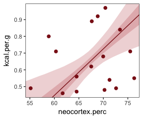<!-- -->

Prepping for and reproducing Figure 5.7., bottom right.


```r
nd <- 
  tibble(log.mass = seq(from = -2.5, to = 5,
                        length.out = 30),
         neocortex.perc = mean(dcc$neocortex.perc))

dffitted.d <- 
  b5.7 %>%
  fitted(newdata = nd,
         probs = c(.025, .975, .25, .75)) %>%
  as_tibble() %>%
  bind_cols(nd)

ggplot(data = dffitted.d, 
       aes(x = log.mass, y = Estimate)) +
  theme_bw() +
  geom_ribbon(aes(ymin = dffitted.d[ , 3], ymax = dffitted.d[ , 4]),
              fill = "firebrick", alpha = 1/5) +
  geom_ribbon(aes(ymin = dffitted.d[ , 5], ymax = dffitted.d[ , 6]),
              fill = "firebrick", alpha = 1/5) +
  geom_line(color = "firebrick4", size = 1/2) +
  geom_point(data = dcc, aes(x = log.mass, y = kcal.per.g),
             size = 2, color = "firebrick4") +
  coord_cartesian(xlim = range(dcc$log.mass), 
                  ylim = range(dcc$kcal.per.g)) +
  labs(y = "kcal.per.g") +
  theme(panel.grid = element_blank())
```

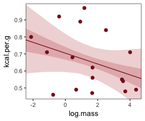<!-- -->


## 5.3. When adding variables hurts

### 5.3.1. Multicollinear legs.

Let's simulate some leg data.


```r
N <- 100
set.seed(851)

d <- 
  tibble(height    = rnorm(N, mean = 10, sd = 2),
         leg_prop  = runif(N, min = 0.4, max = 0.5),
         leg_left  = leg_prop*height + rnorm(N, mean = 0, sd = 0.02),
         leg_right = leg_prop*height + rnorm(N, mean = 0, sd = 0.02))
```

`leg_left` and `leg_right` are **highly** correlated.


```r
d %>%
  select(leg_left:leg_right) %>%
  cor() %>%
  round(digits = 4)
```

```
##           leg_left leg_right
## leg_left    1.0000    0.9997
## leg_right   0.9997    1.0000
```

Here's our attempt to predict `height` with both legs.


```r
b5.8 <- 
  brm(data = d, family = gaussian,
      height ~ 1 + leg_left + leg_right,
      prior = c(set_prior("normal(10, 100)", class = "Intercept"),
                set_prior("normal(2, 10)", class = "b"),
                set_prior("uniform(0, 10)", class = "sigma")),
      chains = 4, iter = 2000, warmup = 500, cores = 4)

print(b5.8)
```

```
##  Family: gaussian 
##   Links: mu = identity; sigma = identity 
## Formula: height ~ 1 + leg_left + leg_right 
##    Data: d (Number of observations: 100) 
## Samples: 4 chains, each with iter = 2000; warmup = 500; thin = 1; 
##          total post-warmup samples = 6000
##     ICs: LOO = NA; WAIC = NA; R2 = NA
##  
## Population-Level Effects: 
##           Estimate Est.Error l-95% CI u-95% CI Eff.Sample Rhat
## Intercept     0.55      0.31    -0.06     1.17       5795 1.00
## leg_left      0.95      2.46    -3.96     5.67       1960 1.00
## leg_right     1.15      2.45    -3.54     6.03       1959 1.00
## 
## Family Specific Parameters: 
##       Estimate Est.Error l-95% CI u-95% CI Eff.Sample Rhat
## sigma     0.68      0.05     0.60     0.79       3506 1.00
## 
## Samples were drawn using sampling(NUTS). For each parameter, Eff.Sample 
## is a crude measure of effective sample size, and Rhat is the potential 
## scale reduction factor on split chains (at convergence, Rhat = 1).
```

Instead of a coefficient plot like McElreath did by nesting `precis()` in `plot()`, why not make stacked density plots?


```r
color_scheme_set("red")

stanplot(b5.8, 
         type = "areas", 
         prob = .5, 
         point_est = "median") +
  labs(title = "The coefficient plot for the two-leg model",
       subtitle = "Holy smokes; look at the widths of those betas!") +
  theme_bw() +
  theme(text = element_text(size = 14),
        axis.ticks.y = element_blank(),
        axis.text.y = element_text(hjust = 0))
```

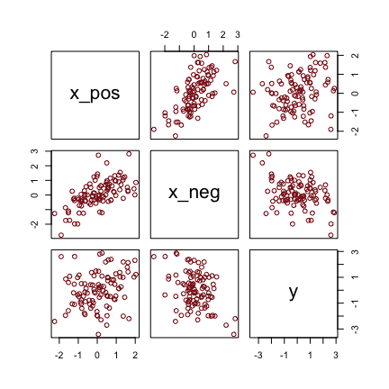<!-- -->

Note. You can use the `brms::stanplot()` function without explicitly loading the bayesplot package. But loading bayesplot allows you to set the color scheme with `color_scheme_set()`.

This is perhaps the simplest way to plot the bivariate posterior of our two predictor coefficients, Figure 5.8.a.


```r
pairs(b5.8, pars = parnames(b5.8)[2:3])
```

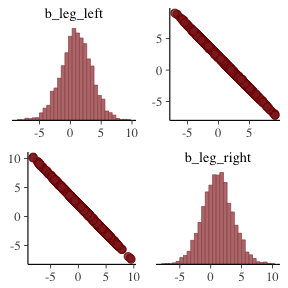<!-- -->

If you'd like a nicer and more focused attempt, you might have to revert to the `posterior_samples()` function and a little ggplot2 code.


```r
posterior_samples(b5.8) %>%
  
  ggplot(aes(x = b_leg_left, y = b_leg_right)) +
  theme_bw() +
  geom_point(color = "firebrick", alpha = 1/10, size = 1/3) +
  theme(panel.grid = element_blank())
```

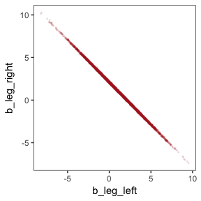<!-- -->

While we're at it, you can make a similar plot with the `mcmc_scatter()` [function](https://cran.r-project.org/web/packages/bayesplot/vignettes/plotting-mcmc-draws.html).


```r
posterior_samples(b5.8) %>%
  
  mcmc_scatter(pars = c("b_leg_left", "b_leg_right"),
               size = 1/3, 
               alpha = 1/10) +
  theme_bw() +
  theme(panel.grid = element_blank())
```

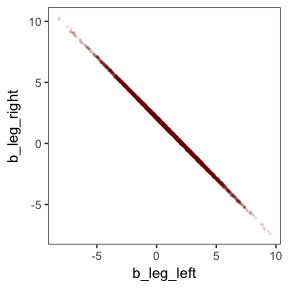<!-- -->

Here's the posterior of the sum of the two regression coefficients, Figure 5.8.b.


```r
post <- posterior_samples(b5.8)
  
  ggplot(data = post,
         aes(x = b_leg_left + b_leg_right)) +
  theme_bw() +
  geom_density(fill = "firebrick4", size = 0) +
  geom_vline(xintercept = median(post$b_leg_left + post$b_leg_right),
             color = "white", linetype = 2) +
  scale_y_continuous(NULL, breaks = NULL) +
  labs(subtitle = "Posterior median = dashed line") +
  theme(panel.grid = element_blank())
```

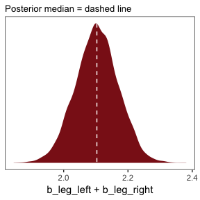<!-- -->

Now we fit the model after ditching one of the leg lengths.


```r
b5.9 <- 
  brm(data = d, family = gaussian,
      height ~ 1 + leg_left,
      prior = c(set_prior("normal(10, 100)", class = "Intercept"),
                set_prior("normal(2, 10)", class = "b"),
                set_prior("uniform(0, 10)", class = "sigma")),
      chains = 4, iter = 2000, warmup = 500, cores = 4)

print(b5.9)
```

```
##  Family: gaussian 
##   Links: mu = identity; sigma = identity 
## Formula: height ~ 1 + leg_left 
##    Data: d (Number of observations: 100) 
## Samples: 4 chains, each with iter = 2000; warmup = 500; thin = 1; 
##          total post-warmup samples = 6000
##     ICs: LOO = NA; WAIC = NA; R2 = NA
##  
## Population-Level Effects: 
##           Estimate Est.Error l-95% CI u-95% CI Eff.Sample Rhat
## Intercept     0.52      0.30    -0.05     1.12       5381 1.00
## leg_left      2.11      0.06     1.98     2.23       5401 1.00
## 
## Family Specific Parameters: 
##       Estimate Est.Error l-95% CI u-95% CI Eff.Sample Rhat
## sigma     0.68      0.05     0.59     0.78       5583 1.00
## 
## Samples were drawn using sampling(NUTS). For each parameter, Eff.Sample 
## is a crude measure of effective sample size, and Rhat is the potential 
## scale reduction factor on split chains (at convergence, Rhat = 1).
```

Here's the density in Figure 5.8.b.


```r
post <- posterior_samples(b5.9)
  
  ggplot(data = post,
         aes(x = b_leg_left)) +
  theme_bw() +
  geom_density(fill = "firebrick4", size = 0) +
  geom_vline(xintercept = median(post$b_leg_left),
             color = "white", linetype = 3) +
  scale_y_continuous(NULL, breaks = NULL) +
  labs(subtitle = "Posterior median = dotted line") +
  theme(panel.grid = element_blank())
```

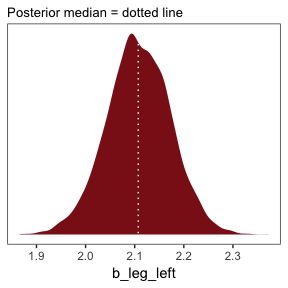<!-- -->

### 5.3.2. Multicollinear `milk`.


```r
library(rethinking)
data(milk)
d <- milk
```

Unload rethinking and load brms.


```r
rm(milk)
detach(package:rethinking, unload = TRUE)
library(brms)
```

Let's fit the two models in the text.


```r
b5.10 <- 
  brm(data = d, family = gaussian,
      kcal.per.g ~ 1 + perc.fat,
      prior = c(set_prior("normal(.6, 10)", class = "Intercept"),
                set_prior("normal(0, 1)", class = "b"),
                set_prior("uniform(0, 10)", class = "sigma")),
      chains = 4, iter = 2000, warmup = 500, cores = 4)

b5.11 <- 
  brm(data = d, family = gaussian,
      kcal.per.g ~ 1 + perc.lactose,
      prior = c(set_prior("normal(.6, 10)", class = "Intercept"),
                set_prior("normal(0, 1)", class = "b"),
                set_prior("uniform(0, 10)", class = "sigma")),
      chains = 4, iter = 2000, warmup = 500, cores = 4)

print(b5.10, digits = 3)
```

```
##  Family: gaussian 
##   Links: mu = identity; sigma = identity 
## Formula: kcal.per.g ~ 1 + perc.fat 
##    Data: d (Number of observations: 29) 
## Samples: 4 chains, each with iter = 2000; warmup = 500; thin = 1; 
##          total post-warmup samples = 6000
##     ICs: LOO = NA; WAIC = NA; R2 = NA
##  
## Population-Level Effects: 
##           Estimate Est.Error l-95% CI u-95% CI Eff.Sample  Rhat
## Intercept    0.301     0.040    0.220    0.377       6000 1.000
## perc.fat     0.010     0.001    0.008    0.012       6000 1.000
## 
## Family Specific Parameters: 
##       Estimate Est.Error l-95% CI u-95% CI Eff.Sample  Rhat
## sigma    0.080     0.012    0.061    0.107       2666 1.001
## 
## Samples were drawn using sampling(NUTS). For each parameter, Eff.Sample 
## is a crude measure of effective sample size, and Rhat is the potential 
## scale reduction factor on split chains (at convergence, Rhat = 1).
```

```r
print(b5.11, digits = 3)
```

```
##  Family: gaussian 
##   Links: mu = identity; sigma = identity 
## Formula: kcal.per.g ~ 1 + perc.lactose 
##    Data: d (Number of observations: 29) 
## Samples: 4 chains, each with iter = 2000; warmup = 500; thin = 1; 
##          total post-warmup samples = 6000
##     ICs: LOO = NA; WAIC = NA; R2 = NA
##  
## Population-Level Effects: 
##              Estimate Est.Error l-95% CI u-95% CI Eff.Sample  Rhat
## Intercept       1.166     0.046    1.076    1.257       6000 1.000
## perc.lactose   -0.011     0.001   -0.012   -0.009       6000 1.000
## 
## Family Specific Parameters: 
##       Estimate Est.Error l-95% CI u-95% CI Eff.Sample  Rhat
## sigma    0.067     0.010    0.052    0.089       2248 1.003
## 
## Samples were drawn using sampling(NUTS). For each parameter, Eff.Sample 
## is a crude measure of effective sample size, and Rhat is the potential 
## scale reduction factor on split chains (at convergence, Rhat = 1).
```

As McElreath wrote, "watch what happens when we place both predictor varaibles in the same regression model" (p. 146)


```r
b5.12 <- 
  brm(data = d, family = gaussian,
      kcal.per.g ~ 1 + perc.fat + perc.lactose,
      prior = c(set_prior("normal(.6, 10)", class = "Intercept"),
                set_prior("normal(0, 1)", class = "b"),
                set_prior("uniform(0, 10)", class = "sigma")),
      chains = 4, iter = 2000, warmup = 500, cores = 4)

print(b5.12, digits = 3)
```

```
##  Family: gaussian 
##   Links: mu = identity; sigma = identity 
## Formula: kcal.per.g ~ 1 + perc.fat + perc.lactose 
##    Data: d (Number of observations: 29) 
## Samples: 4 chains, each with iter = 2000; warmup = 500; thin = 1; 
##          total post-warmup samples = 6000
##     ICs: LOO = NA; WAIC = NA; R2 = NA
##  
## Population-Level Effects: 
##              Estimate Est.Error l-95% CI u-95% CI Eff.Sample  Rhat
## Intercept       1.008     0.224    0.561    1.444       4424 1.001
## perc.fat        0.002     0.003   -0.003    0.007       4480 1.001
## perc.lactose   -0.009     0.003   -0.014   -0.003       4415 1.001
## 
## Family Specific Parameters: 
##       Estimate Est.Error l-95% CI u-95% CI Eff.Sample  Rhat
## sigma    0.068     0.010    0.051    0.092       2100 1.002
## 
## Samples were drawn using sampling(NUTS). For each parameter, Eff.Sample 
## is a crude measure of effective sample size, and Rhat is the potential 
## scale reduction factor on split chains (at convergence, Rhat = 1).
```

You can make custom pairs plots with [GGalley](https://cran.r-project.org/web/packages/GGally/index.html), which will also compute the point estimates for the bivariate correlations. Here's a default plot.


```r
#install.packages("GGally", dependencies = T)
library(GGally)

ggpairs(data = d, columns = c(3:4, 6)) + 
  theme_classic()
```

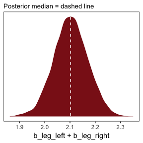<!-- -->

But you can customize [these](http://ggobi.github.io/ggally/), too. E.g.,


```r
my_diag <- function(data, mapping, ...){
  pd <- ggplot(data = data, mapping = mapping) + 
    geom_density(fill = "firebrick4", size = 0)
  pd
}

my_lower <- function(data, mapping, ...){
  pl <- ggplot(data = data, mapping = mapping) + 
    geom_smooth(method = "lm", color = "firebrick4", size = 1/3, se = F) +
    geom_point(color = "firebrick", alpha = .8, size = 1/4)
  pl
  }

# Then plug those custom functions into ggpairs
ggpairs(data = d, columns = c(3:4, 6),
        mapping = ggplot2::aes(color = "black"),
        diag = list(continuous = my_diag),
        lower = list(continuous = my_lower)) + 
  theme_bw() +
  theme(axis.text = element_blank(),
        axis.ticks = element_blank(),
        strip.background = element_rect(fill = "white"))
```

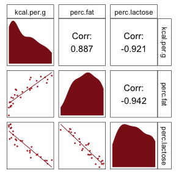<!-- -->

### 5.3.3. Post-treatment bias

Once again, we'll simulate our data.


```r
N <- 100

set.seed(17)
d <- 
  tibble(h0        = rnorm(N, 10, 2), 
         treatment = rep(0:1, each = N/2),
         fungus    = rbinom(N, size = 1, prob = .5 - treatment*0.4),
         h1        = h0 + rnorm(N, mean = 5 - 3*fungus))
```

We'll use `head()` to peek at the data, which we put in a [tibble rather than a data frame](https://github.com/tidyverse/tibble).


```r
d %>%
  head()
```

```
## # A tibble: 6 x 4
##      h0 treatment fungus    h1
##   <dbl>     <int>  <int> <dbl>
## 1  7.97         0      1  12.9
## 2  9.84         0      1  11.9
## 3  9.53         0      0  15.8
## 4  8.37         0      1  11.1
## 5 11.5          0      1  13.1
## 6  9.67         0      0  15.7
```

These data + the model were rough on Stan, at first, which spat out warnings about divergent transitions. The model ran fine after setting `warmup = 1000` and `adapt_delta = .99`.


```r
b5.13 <- 
  brm(data = d, family = gaussian,
      h1 ~ 1 + h0 + treatment + fungus,
      prior = c(set_prior("normal(0, 100)", class = "Intercept"),
                set_prior("normal(0, 10)", class = "b"),
                set_prior("uniform(0, 10)", class = "sigma")),
      chains = 4, iter = 2000, warmup = 1000, cores = 4,
      control = list(adapt_delta = 0.99))
 
print(b5.13)
```

```
##  Family: gaussian 
##   Links: mu = identity; sigma = identity 
## Formula: h1 ~ 1 + h0 + treatment + fungus 
##    Data: d (Number of observations: 100) 
## Samples: 4 chains, each with iter = 2000; warmup = 1000; thin = 1; 
##          total post-warmup samples = 4000
##     ICs: LOO = NA; WAIC = NA; R2 = NA
##  
## Population-Level Effects: 
##           Estimate Est.Error l-95% CI u-95% CI Eff.Sample Rhat
## Intercept     5.26      0.55     4.16     6.36       2286 1.00
## h0            0.96      0.05     0.86     1.06       2256 1.00
## treatment     0.21      0.24    -0.26     0.70       1872 1.00
## fungus       -3.02      0.27    -3.55    -2.49       2230 1.00
## 
## Family Specific Parameters: 
##       Estimate Est.Error l-95% CI u-95% CI Eff.Sample Rhat
## sigma     1.08      0.08     0.94     1.25       4000 1.00
## 
## Samples were drawn using sampling(NUTS). For each parameter, Eff.Sample 
## is a crude measure of effective sample size, and Rhat is the potential 
## scale reduction factor on split chains (at convergence, Rhat = 1).
```

Fitting the model after excluding `fungus`, our post-treatment variable.


```r
b5.14 <- 
  brm(data = d, family = gaussian,
      h1 ~ 1 + h0 + treatment,
      prior = c(set_prior("normal(0, 100)", class = "Intercept"),
                set_prior("normal(0, 10)", class = "b"),
                set_prior("uniform(0, 10)", class = "sigma")),
      chains = 4, iter = 2000, warmup = 1000, cores = 4)

print(b5.14)
```

```
##  Family: gaussian 
##   Links: mu = identity; sigma = identity 
## Formula: h1 ~ 1 + h0 + treatment 
##    Data: d (Number of observations: 100) 
## Samples: 4 chains, each with iter = 2000; warmup = 1000; thin = 1; 
##          total post-warmup samples = 4000
##     ICs: LOO = NA; WAIC = NA; R2 = NA
##  
## Population-Level Effects: 
##           Estimate Est.Error l-95% CI u-95% CI Eff.Sample Rhat
## Intercept     4.44      0.83     2.80     6.06       2847 1.00
## h0            0.90      0.08     0.75     1.06       2933 1.00
## treatment     1.29      0.34     0.62     1.99       2462 1.00
## 
## Family Specific Parameters: 
##       Estimate Est.Error l-95% CI u-95% CI Eff.Sample Rhat
## sigma     1.66      0.12     1.44     1.92       4000 1.00
## 
## Samples were drawn using sampling(NUTS). For each parameter, Eff.Sample 
## is a crude measure of effective sample size, and Rhat is the potential 
## scale reduction factor on split chains (at convergence, Rhat = 1).
```


## 5.4. Categorical varaibles

### 5.4.1. Binary categories.

Reload the `Howell1` data.


```r
library(rethinking)
data(Howell1)
d <- Howell1
```

Unload rethinking and load brms.


```r
rm(Howell1)
detach(package:rethinking, unload = T)
library(brms)
```

Just in case you forgot what these data were like:


```r
d %>%
  glimpse()
```

```
## Observations: 544
## Variables: 4
## $ height <dbl> 151.7650, 139.7000, 136.5250, 156.8450, 145.4150, 163.8...
## $ weight <dbl> 47.82561, 36.48581, 31.86484, 53.04191, 41.27687, 62.99...
## $ age    <dbl> 63.0, 63.0, 65.0, 41.0, 51.0, 35.0, 32.0, 27.0, 19.0, 5...
## $ male   <int> 1, 0, 0, 1, 0, 1, 0, 1, 0, 1, 0, 1, 0, 0, 0, 1, 1, 0, 1...
```

Let's fit the first `height` model. 

Note. The uniform prior McElreath used in the text in conjunction with his `map()` function seemed to cause problems for the HMC chains, here. After experimenting with start values, increasing `warmup`, and increasing `adapt_delta`, switching out the prior did the trick. Anticipating chapter 8, I recommend you use a weakly-regularizing half Cauchy for $\sigma$.


```r
b5.15 <- 
  brm(data = d, family = gaussian,
      height ~ 1 + male,
      prior = c(set_prior("normal(178, 100)", class = "Intercept"),
                set_prior("normal(0, 10)", class = "b"),
                set_prior("cauchy(0, 2)", class = "sigma")),
      chains = 4, iter = 2000, warmup = 500, cores = 4)

print(b5.15)
```

```
##  Family: gaussian 
##   Links: mu = identity; sigma = identity 
## Formula: height ~ 1 + male 
##    Data: d (Number of observations: 544) 
## Samples: 4 chains, each with iter = 2000; warmup = 500; thin = 1; 
##          total post-warmup samples = 6000
##     ICs: LOO = NA; WAIC = NA; R2 = NA
##  
## Population-Level Effects: 
##           Estimate Est.Error l-95% CI u-95% CI Eff.Sample Rhat
## Intercept   134.84      1.58   131.75   137.97       5445 1.00
## male          7.27      2.29     2.78    11.67       5619 1.00
## 
## Family Specific Parameters: 
##       Estimate Est.Error l-95% CI u-95% CI Eff.Sample Rhat
## sigma    27.38      0.85    25.75    29.10       5581 1.00
## 
## Samples were drawn using sampling(NUTS). For each parameter, Eff.Sample 
## is a crude measure of effective sample size, and Rhat is the potential 
## scale reduction factor on split chains (at convergence, Rhat = 1).
```

Our samples from the posterior are already in the HMC iterations. All we need to do is put them in a data frame and then put them to work.


```r
post <- posterior_samples(b5.15)

quantile(post[ , 1] + post[ , 2], c(.025, .975))
```

```
##     2.5%    97.5% 
## 138.8416 145.4434
```

A more tidyverse-centric way to do this might be something like:


```r
post <-
  b5.15 %>%
  posterior_samples()

post %>%
  mutate(mu_male = b_Intercept + b_male) %>%
  summarise(LL = quantile(mu_male, .025) %>% round(digits = 2),
            UL = quantile(mu_male, .975) %>% round(digits = 2))
```

```
##       LL     UL
## 1 138.84 145.44
```

##### Overthinking: Re-parameterizing the model.

Everyone has their own idiosyncratic way of coding. One of my quirks is that I always explicitly specify a model’s intercept following the form `y ~ 1 + x`, where `y` is the criterion, `x` stands for the predictors, and `1` is the intercept. You don’t have to do this, of course. You could just code `y ~ x` to get the same results. `brm()` assumes you want that intercept. One of the reasons I like the verbose version is it reminds me to think about the intercept and to include it in my priors. Another nice feature is that is helps me make sense of the code for this model: ` height ~ 0 + male + female`. When we replace `… ~ 1 + …` with `… ~ 0 + …`, we tell `brm()` to remove the intercept. Removing the intercept allows us to include ALL levels of a given categorical variable in our model. In this case, we’ve expressed sex as two dummies, `female` and `male`. Taking out the intercept lets us put both dummies into the formula. 


```r
d <-
  d %>%
  mutate(female = 1 - male)

b5.15b <- 
  brm(data = d, family = gaussian,
      height ~ 0 + male + female,
      prior = c(set_prior("normal(178, 100)", class = "b"),
                set_prior("cauchy(0, 2)", class = "sigma")),
      chains = 4, iter = 2000, warmup = 500, cores = 4)

print(b5.15b)
```

```
##  Family: gaussian 
##   Links: mu = identity; sigma = identity 
## Formula: height ~ 0 + male + female 
##    Data: d (Number of observations: 544) 
## Samples: 4 chains, each with iter = 2000; warmup = 500; thin = 1; 
##          total post-warmup samples = 6000
##     ICs: LOO = NA; WAIC = NA; R2 = NA
##  
## Population-Level Effects: 
##        Estimate Est.Error l-95% CI u-95% CI Eff.Sample Rhat
## male     142.33      1.72   138.83   145.79       4910 1.00
## female   134.63      1.62   131.46   137.74       6000 1.00
## 
## Family Specific Parameters: 
##       Estimate Est.Error l-95% CI u-95% CI Eff.Sample Rhat
## sigma    27.38      0.84    25.78    29.08       6000 1.00
## 
## Samples were drawn using sampling(NUTS). For each parameter, Eff.Sample 
## is a crude measure of effective sample size, and Rhat is the potential 
## scale reduction factor on split chains (at convergence, Rhat = 1).
```

Oh man, that sweet half Cauchy just keeps getting the job done.

## 5.4.2. Many categories

We just can't keep ourselves from picking that `milk` back up again and again.


```r
library(rethinking)
data(milk)
d <- milk
```

Unload rethinking and load brms.


```r
rm(milk)
detach(package:rethinking, unload = TRUE)
library(brms)
```

With the tidyverse, we can peek at `clade` with `distinct()` in the place of base R `unique()`.


```r
d %>%
  distinct(clade)
```

```
##              clade
## 1    Strepsirrhine
## 2 New World Monkey
## 3 Old World Monkey
## 4              Ape
```

As `clade` has 4 categories, let's convert these to 4 dummy variables.


```r
d <- 
  d %>%
  mutate(clade.NWM = ifelse(clade == "New World Monkey", 1, 0),
         clade.OWM = ifelse(clade == "Old World Monkey", 1, 0),
         clade.S   = ifelse(clade == "Strepsirrhine", 1, 0),
         clade.Ape = ifelse(clade == "Ape", 1, 0))
```

Now we'll fit the model with three of the four dummies.


```r
b5.16 <- 
  brm(data = d, family = gaussian,
      kcal.per.g ~ 1 + clade.NWM + clade.OWM + clade.S,
      prior = c(set_prior("normal(.6, 10)", class = "Intercept"),
                set_prior("normal(0, 1)", class = "b"),
                set_prior("uniform(0, 10)", class = "sigma")),
      chains = 4, iter = 2000, warmup = 500, cores = 4,
      control = list(adapt_delta = 0.8))

print(b5.16)
```

```
##  Family: gaussian 
##   Links: mu = identity; sigma = identity 
## Formula: kcal.per.g ~ 1 + clade.NWM + clade.OWM + clade.S 
##    Data: d (Number of observations: 29) 
## Samples: 4 chains, each with iter = 2000; warmup = 500; thin = 1; 
##          total post-warmup samples = 6000
##     ICs: LOO = NA; WAIC = NA; R2 = NA
##  
## Population-Level Effects: 
##           Estimate Est.Error l-95% CI u-95% CI Eff.Sample Rhat
## Intercept     0.55      0.04     0.46     0.63       4884 1.00
## clade.NWM     0.17      0.06     0.04     0.29       4945 1.00
## clade.OWM     0.24      0.07     0.11     0.38       5609 1.00
## clade.S      -0.04      0.07    -0.18     0.11       5464 1.00
## 
## Family Specific Parameters: 
##       Estimate Est.Error l-95% CI u-95% CI Eff.Sample Rhat
## sigma     0.13      0.02     0.10     0.17       4131 1.00
## 
## Samples were drawn using sampling(NUTS). For each parameter, Eff.Sample 
## is a crude measure of effective sample size, and Rhat is the potential 
## scale reduction factor on split chains (at convergence, Rhat = 1).
```

Here we grab the chains, our draws from the posterior.


```r
post <- 
  b5.16 %>%
  posterior_samples()

head(post)
```

```
##   b_Intercept b_clade.NWM b_clade.OWM    b_clade.S     sigma      lp__
## 1   0.5320265  0.15568874   0.2289290  0.007869044 0.1230818 10.557124
## 2   0.5152059  0.19914155   0.3015635  0.031090995 0.1183721 10.456000
## 3   0.5036922  0.19112546   0.4327148 -0.070826092 0.1164995  4.549714
## 4   0.5635186  0.20911043   0.1151026  0.075522814 0.1401449  5.507652
## 5   0.5595293  0.18009315   0.1334438  0.077467023 0.1452637  6.609359
## 6   0.6105891  0.09287237   0.1866047  0.022067971 0.1339868  7.471496
```

You might compute averages for each category and summarizing the results with the transpose of base R's `apply()` function, rounding to two digits of precision.


```r
post$mu.Ape <- post$b_Intercept
post$mu.NWM <- post$b_Intercept + post$b_clade.NWM
post$mu.OWM <- post$b_Intercept + post$b_clade.OWM
post$mu.S   <- post$b_Intercept + post$b_clade.S

round(t(apply(post[ ,7:10], 2, quantile, c(.5, .025, .975))), digits = 2)
```

```
##         50% 2.5% 97.5%
## mu.Ape 0.55 0.46  0.63
## mu.NWM 0.71 0.63  0.80
## mu.OWM 0.79 0.68  0.89
## mu.S   0.51 0.39  0.63
```

Here's a more tidyverse sort of way to get the same thing.


```r
post %>%
  mutate(mu.Ape = b_Intercept,
         mu.NWM = b_Intercept + b_clade.NWM,
         mu.OWM = b_Intercept + b_clade.OWM,
         mu.S   = b_Intercept + b_clade.S) %>%
  select(mu.Ape:mu.S) %>% 
  gather(parameter) %>%
  group_by(parameter) %>%
  summarise(median = median(value) %>% round(digits = 2),
            LL = quantile(value, probs = .025) %>% round(digits = 2),
            UL = quantile(value, probs = .975) %>% round(digits = 2))
```

```
## # A tibble: 4 x 4
##   parameter median    LL    UL
##   <chr>      <dbl> <dbl> <dbl>
## 1 mu.Ape     0.550 0.460 0.630
## 2 mu.NWM     0.710 0.630 0.800
## 3 mu.OWM     0.790 0.680 0.890
## 4 mu.S       0.510 0.390 0.630
```

Getting summary statistics for the difference between `NWM` and `OWM`.


```r
# Base R
round(quantile(post$mu.NWM - post$mu.OWM, probs = c(.025, .5, .975)), digits = 2)
```

```
##  2.5%   50% 97.5% 
## -0.21 -0.07  0.06
```

```r
# tidyverse
post %>%
  mutate(dif = mu.NWM - mu.OWM) %>%
  summarise(median = median(dif) %>% round(digits = 2),
            LL = quantile(dif, probs = .025) %>% round(digits = 2),
            UL = quantile(dif, probs = .975) %>% round(digits = 2))
```

```
##   median    LL   UL
## 1  -0.07 -0.21 0.06
```

### 5.4.3. Adding regular predictor variables.

Using the code below, there's no need to transform `d$clade` into `d$clade_id`. The advantage of this approach is the indices in the model summary are more descriptive than `a[1]` through `a[4]`.


```r
b5.16_alt <- 
  brm(data = d, family = gaussian,
      kcal.per.g ~ 0 + clade,
      prior = c(set_prior("normal(.6, 10)", class = "b"),
                set_prior("uniform(0, 10)", class = "sigma")),
      chains = 4, iter = 2000, warmup = 500, cores = 4)

print(b5.16_alt)
```

```
##  Family: gaussian 
##   Links: mu = identity; sigma = identity 
## Formula: kcal.per.g ~ 0 + clade 
##    Data: d (Number of observations: 29) 
## Samples: 4 chains, each with iter = 2000; warmup = 500; thin = 1; 
##          total post-warmup samples = 6000
##     ICs: LOO = NA; WAIC = NA; R2 = NA
##  
## Population-Level Effects: 
##                     Estimate Est.Error l-95% CI u-95% CI Eff.Sample Rhat
## cladeApe                0.55      0.04     0.46     0.63       6000 1.00
## cladeNewWorldMonkey     0.71      0.04     0.63     0.80       6000 1.00
## cladeOldWorldMonkey     0.79      0.05     0.68     0.90       6000 1.00
## cladeStrepsirrhine      0.51      0.06     0.39     0.63       6000 1.00
## 
## Family Specific Parameters: 
##       Estimate Est.Error l-95% CI u-95% CI Eff.Sample Rhat
## sigma     0.13      0.02     0.10     0.18       4938 1.00
## 
## Samples were drawn using sampling(NUTS). For each parameter, Eff.Sample 
## is a crude measure of effective sample size, and Rhat is the potential 
## scale reduction factor on split chains (at convergence, Rhat = 1).
```


## 5.5. ~~Ordinary least squares and `lm()`~~

Since this section centers on the frequentist `lm()` function, I'm going to largely ignore it. A couple things, though. You'll note how the brms package uses the `lm()`-like design formula syntax. Although not as pedagogical as the more formal rethinking syntax, it has the advantage of cohering with the popular [lme4](https://cran.r-project.org/web/packages/lme4/index.html) syntax for multilevel models.

Also, on page 161, McElreath clarifies that one cannot use the `I()` syntax with his rethinking package. Not so with brms. The `I()` syntax works just fine with `brms::brm()`.

Note. The analyses in this document were done with:

* R           3.4.4
* RStudio     1.1.442
* rmarkdown   1.9
* rethinking  1.59
* brms        2.1.9
* rstan       2.17.3
* tidyverse   1.2.1
* ggrepel     0.7.0
* bayesplot   1.4.0
* GGalley     1.3.0

## Reference
McElreath, R. (2016). *Statistical rethinking: A Bayesian course with examples in R and Stan.* Chapman & Hall/CRC Press.
