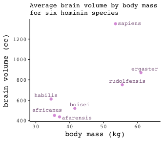
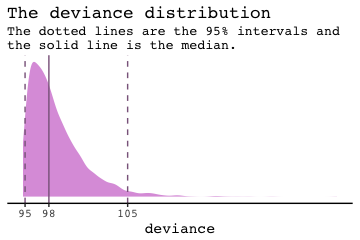
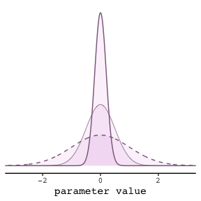
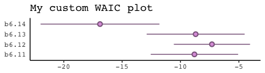
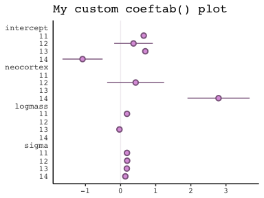
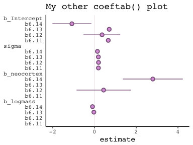
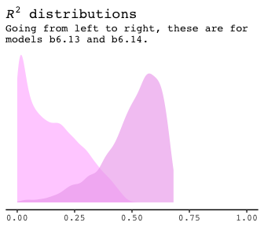
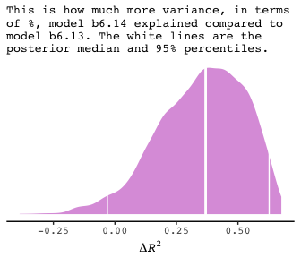

### 6.1.1. More parameters always impove fit.

We'll start of by making the data with brain size and body size for seven `species`.


```r
library(tidyverse)

(
  d <- 
  tibble(species = c("afarensis", "africanus", "habilis", "boisei",
                     "rudolfensis", "ergaster", "sapiens"), 
         brain = c(438, 452, 612, 521, 752, 871, 1350), 
         mass = c(37.0, 35.5, 34.5, 41.5, 55.5, 61.0, 53.5))
  )
```

```
## # A tibble: 7 x 3
##   species     brain  mass
##   <chr>       <dbl> <dbl>
## 1 afarensis     438  37.0
## 2 africanus     452  35.5
## 3 habilis       612  34.5
## 4 boisei        521  41.5
## 5 rudolfensis   752  55.5
## 6 ergaster      871  61.0
## 7 sapiens      1350  53.5
```

Here's our version of Figure 6.2.


```r
# install.packages("ggrepel", depencencies = T)
library(ggrepel)

set.seed(438) #  This makes the geom_text_repel() part reproducible
d %>%
  ggplot(aes(x =  mass, y = brain, label = species)) +
  theme_classic() +
  geom_point(color = "plum") +
  geom_text_repel(size = 3, color = "plum4", family = "Courier") +
  coord_cartesian(xlim = 30:65) +
  labs(x = "body mass (kg)",
       y = "brain volume (cc)",
       subtitle = "Average brain volume by body mass\nfor six hominin species") +
  theme(text = element_text(family = "Courier"))
```

<!-- -->

I’m not going to bother with models `m6.1` through `m6.7` They were all done with the frequentist `lm()` function, which yields model estimates with OLS. Since the primary job of this manuscript is to convert rethinking code to brms code, those models provide nothing to convert.

Onward. 

## 6.2. Information theory and model performance

### 6.2.2. Information and uncertainty.

##### Overthinking: Computing deviance.

Here is how to compute deviance with brms.


```r
# data manipulation
d <-
  d %>%
  mutate(mass.s = (mass - mean(mass))/sd(mass))

library(brms)

# Here we specify our starting values
Inits <- list(Intercept = mean(d$brain),
              mass.s = 0,
              sigma = sd(d$brain))

InitsList <-list(Inits, Inits, Inits, Inits)

# The model
b6.8 <- 
  brm(data = d, family = gaussian,
      brain ~ 1 + mass.s,
      prior = c(set_prior("normal(0, 1000)", class = "Intercept"),
                set_prior("normal(0, 1000)", class = "b"),
                set_prior("cauchy(0, 10)", class = "sigma")),
      chains = 4, iter = 2000, warmup = 1000, cores = 4,
      inits = InitsList)  # Here we put our start values in the brm() function

print(b6.8)
```

```
##  Family: gaussian 
##   Links: mu = identity; sigma = identity 
## Formula: brain ~ 1 + mass.s 
##    Data: d (Number of observations: 7) 
## Samples: 4 chains, each with iter = 2000; warmup = 1000; thin = 1; 
##          total post-warmup samples = 4000
##     ICs: LOO = NA; WAIC = NA; R2 = NA
##  
## Population-Level Effects: 
##           Estimate Est.Error l-95% CI u-95% CI Eff.Sample Rhat
## Intercept   702.43     98.99   494.68   893.21       2220 1.00
## mass.s      226.34    110.27     7.50   454.77       2500 1.00
## 
## Family Specific Parameters: 
##       Estimate Est.Error l-95% CI u-95% CI Eff.Sample Rhat
## sigma   258.82     87.92   147.47   480.12       1646 1.00
## 
## Samples were drawn using sampling(NUTS). For each parameter, Eff.Sample 
## is a crude measure of effective sample size, and Rhat is the potential 
## scale reduction factor on split chains (at convergence, Rhat = 1).
```

**Details about `inits`**: You don’t have to specify your `inits` lists outside of the `brm()` function the way we did, here. This is just how I currently prefer to do it. When you specify start values for the parameters in your Stan models, you need to do so with a list of lists. You need as many lists as HMC chains—four in this example. And then you put your—in this case—four lists inside a list. Lists within lists. Also, we were lazy and specified the same start values across all our chains. You can mix them up across chains if you want.

Anyway, the brms function `log_lik()` returns a matrix. Each occasion gets a column and each HMC chain iteration gets a row.


```r
dfLL <-
  b6.8 %>%
  log_lik() %>%
  as_tibble()

dfLL %>%
  glimpse()
```

```
## Observations: 4,000
## Variables: 7
## $ V1 <dbl> -6.327274, -6.344633, -6.647551, -6.466490, -6.146800, -6.4...
## $ V2 <dbl> -6.328925, -6.296953, -6.689299, -6.202784, -6.093178, -6.3...
## $ V3 <dbl> -6.761753, -6.555326, -7.076536, -5.921548, -6.544839, -6.4...
## $ V4 <dbl> -6.339290, -6.367092, -6.638838, -6.335831, -6.173596, -6.4...
## $ V5 <dbl> -6.484522, -6.543848, -6.793422, -6.170063, -6.399753, -6.5...
## $ V6 <dbl> -6.498551, -6.539952, -6.867808, -5.979600, -6.390664, -6.5...
## $ V7 <dbl> -9.027072, -8.858539, -7.904827, -13.012360, -10.149875, -8...
```

Deviance is the sum of the occasion-level LLs multiplied by -2.


```r
dfLL <-
  dfLL %>%
  mutate(sums     = rowSums(.),
         deviance = -2*sums)
```

Because we used HMC, deviance is a distribution rather than a single number.


```r
quantile(dfLL$deviance, c(.025, .5, .975))
```

```
##      2.5%       50%     97.5% 
##  95.13852  97.35863 104.71196
```

```r
ggplot(data = dfLL, aes(x = deviance)) +
  theme_classic() +
  geom_density(fill = "plum", size = 0) +
  geom_vline(xintercept = quantile(dfLL$deviance, c(.025, .5, .975)),
             color = "plum4", linetype = c(2, 1, 2)) +
  scale_x_continuous(breaks = quantile(dfLL$deviance, c(.025, .5, .975)),
                     labels = c(95, 98, 105)) +
  scale_y_continuous(NULL, breaks = NULL) +
  labs(title = "The deviance distribution",
       subtitle = "The dotted lines are the 95% intervals and\nthe solid line is the median.") +
  theme(text = element_text(family = "Courier"))
```

<!-- -->

## 6.3. Regularization

In case you were curious, here's how you might do Figure 6.8 with ggplot2. All the action is in the `geom_line()` portions. The rest is window dressing.


```r
tibble(x = seq(from = - 3.5, 
               to = 3.5, 
               by = .01)) %>%
  
  ggplot(aes(x = x)) +
  theme_classic() +
  geom_ribbon(aes(ymin = 0, ymax = dnorm(x, mean = 0, sd = 1)), 
              fill = "plum", alpha = 1/8) +
  geom_ribbon(aes(ymin = 0, ymax = dnorm(x, mean = 0, sd = 0.5)), 
              fill = "plum", alpha = 1/8) +
  geom_ribbon(aes(ymin = 0, ymax = dnorm(x, mean = 0, sd = 0.2)), 
              fill = "plum", alpha = 1/8) +
  geom_line(aes(y = dnorm(x, mean = 0, sd = 1)), 
            linetype = 2, color = "plum4") +
  geom_line(aes(y = dnorm(x, mean = 0, sd = 0.5)), 
            size = .25, color = "plum4") +
  geom_line(aes(y = dnorm(x, mean = 0, sd = 0.2)), 
            color = "plum4") +
  scale_y_continuous(NULL, breaks = NULL) +
  labs(x = "parameter value") +
  coord_cartesian(xlim = c(-3, 3)) +
  theme(text = element_text(family = "Courier"))
```

<!-- -->

### 6.4.1. DIC.

##### Overthinking: WAIC calculation. 

Here is how to fit the pre-WAIC model in brms.


```r
data(cars)

b <- 
  brm(data = cars, family = gaussian,
      dist ~ 1 + speed,
      prior = c(set_prior("normal(0, 100)", class = "Intercept"),
                set_prior("normal(0, 10)", class = "b"),
                set_prior("uniform(0, 30)", class = "sigma")),
      chains = 4, iter = 2000, warmup = 1000, cores = 4)

print(b) 
```

```
##  Family: gaussian 
##   Links: mu = identity; sigma = identity 
## Formula: dist ~ 1 + speed 
##    Data: cars (Number of observations: 50) 
## Samples: 4 chains, each with iter = 2000; warmup = 1000; thin = 1; 
##          total post-warmup samples = 4000
##     ICs: LOO = NA; WAIC = NA; R2 = NA
##  
## Population-Level Effects: 
##           Estimate Est.Error l-95% CI u-95% CI Eff.Sample Rhat
## Intercept   -17.17      7.29   -31.29    -2.70       1526 1.00
## speed         3.91      0.45     3.02     4.78       1425 1.00
## 
## Family Specific Parameters: 
##       Estimate Est.Error l-95% CI u-95% CI Eff.Sample Rhat
## sigma    15.84      1.71    13.03    19.58       2427 1.00
## 
## Samples were drawn using sampling(NUTS). For each parameter, Eff.Sample 
## is a crude measure of effective sample size, and Rhat is the potential 
## scale reduction factor on split chains (at convergence, Rhat = 1).
```

In brms, you get the loglikelihood with `log_lik()`.


```r
dfLL <-
  b %>%
  log_lik() %>%
  as_tibble()
```

Computing the lppd, the "Bayesian deviance", takes a bit of leg work.


```r
dfmean <-
  dfLL %>%
  exp() %>%
  summarise_all(mean) %>%
  gather(key, means) %>%
  select(means) %>%
  log()

(
  lppd <-
  dfmean %>%
  sum()
)
```

```
## [1] -206.7068
```

Comupting the effective number of parameters, *p*~WAIC~, isn't much better.


```r
dfvar <-
  dfLL %>%
  summarise_all(var) %>%
  gather(key, vars) %>%
  select(vars) 

pwaic <-
  dfvar %>%
  sum()

pwaic
```

```
## [1] 3.399945
```

```r
dfvar
```

```
## # A tibble: 50 x 1
##      vars
##     <dbl>
##  1 0.0239
##  2 0.0781
##  3 0.0231
##  4 0.0494
##  5 0.0138
##  6 0.0218
##  7 0.0137
##  8 0.0137
##  9 0.0295
## 10 0.0176
## # ... with 40 more rows
```

Finally, here's what we've been working so hard for: our hand calculated WAIC value. Compare it to the value returned by the brms `waic()` function.


```r
-2*(lppd - pwaic)
```

```
## [1] 420.2135
```

```r
waic(b)
```

```
##    WAIC    SE
##  420.21 12.66
```

Here's how we get the WAIC standard error.


```r
dfmean %>%
  mutate(waic_vec = -2*(means - dfvar$vars)) %>%
  summarise(waic_se = (var(waic_vec)*nrow(dfmean)) %>% sqrt())
```

```
## # A tibble: 1 x 1
##   waic_se
##     <dbl>
## 1    12.7
```

### 6.5.1. Model comparison. 

Getting the `milk` data from earlier in the text.


```r
library(rethinking)

data(milk)
d <- 
  milk %>%
  filter(complete.cases(.))
rm(milk)

d <-
  d %>%
  mutate(neocortex = neocortex.perc/100)
```

The dimensions of `d` are:


```r
dim(d)
```

```
## [1] 17  9
```

Here are our competing `kcal.per.g` models.


```r
detach(package:rethinking, unload = T)
library(brms)

Inits <- list(Intercept = mean(d$kcal.per.g),
              sigma = sd(d$kcal.per.g))

InitsList <-list(Inits, Inits, Inits, Inits)

b6.11 <- 
  brm(data = d, family = gaussian,
      kcal.per.g ~ 1,
      prior = c(set_prior("uniform(-1000, 1000)", class = "Intercept"),
                set_prior("uniform(0, 100)", class = "sigma")),
      chains = 4, iter = 2000, warmup = 1000, cores = 4,
      inits = InitsList)

Inits <- list(Intercept = mean(d$kcal.per.g),
              neocortex = 0,
              sigma = sd(d$kcal.per.g))

b6.12 <- 
  brm(data = d, family = gaussian,
      kcal.per.g ~ 1 + neocortex,
      prior = c(set_prior("uniform(-1000, 1000)", class = "Intercept"),
                set_prior("uniform(-1000, 1000)", class = "b"),
                set_prior("uniform(0, 100)", class = "sigma")),
      chains = 4, iter = 2000, warmup = 1000, cores = 4,
      inits = InitsList)

Inits <- list(Intercept = mean(d$kcal.per.g),
              `log(mass)` = 0,
              sigma = sd(d$kcal.per.g))

b6.13 <- 
  brm(data = d, family = gaussian,
      kcal.per.g ~ 1 + log(mass),
      prior = c(set_prior("uniform(-1000, 1000)", class = "Intercept"),
                set_prior("uniform(-1000, 1000)", class = "b"),
                set_prior("uniform(0, 100)", class = "sigma")),
      chains = 4, iter = 2000, warmup = 1000, cores = 4,
      inits = InitsList)

Inits <- list(Intercept = mean(d$kcal.per.g),
              neocortex = 0,
              `log(mass)` = 0,
              sigma = sd(d$kcal.per.g))

b6.14 <- 
  brm(data = d, family = gaussian,
      kcal.per.g ~ 1 + neocortex + log(mass),
      prior = c(set_prior("uniform(-1000, 1000)", class = "Intercept"),
                set_prior("uniform(-1000, 1000)", class = "b"),
                set_prior("uniform(0, 100)", class = "sigma")),
      chains = 4, iter = 2000, warmup = 1000, cores = 4,
      inits = InitsList)
```

#### 6.5.1.1. Comparing WAIC values.

In brms, you can get a model's WAIC value with either `WAIC()` or `waic()`.


```r
WAIC(b6.14)
```

```
##   WAIC   SE
##  -16.9 5.09
```

```r
waic(b6.14)
```

```
##   WAIC   SE
##  -16.9 5.09
```

There are two basic ways to compare WAIC values from multiple models. In the first, you add more model names into the `waic()` function.


```r
waic(b6.11, b6.12, b6.13, b6.14)
```

```
##                 WAIC   SE
## b6.11          -8.81 3.74
## b6.12          -7.31 3.26
## b6.13          -8.70 4.19
## b6.14         -16.90 5.09
## b6.11 - b6.12  -1.50 1.14
## b6.11 - b6.13  -0.11 2.35
## b6.11 - b6.14   8.09 4.92
## b6.12 - b6.13   1.40 2.98
## b6.12 - b6.14   9.59 5.01
## b6.13 - b6.14   8.19 3.50
```

Alternatively, you first save each model's `waic()` output in its own object, and then feed to those objects into `compare_ic()`.


```r
w.b6.11 <- waic(b6.11)
w.b6.12 <- waic(b6.12)
w.b6.13 <- waic(b6.13)
w.b6.14 <- waic(b6.14)

compare_ic(w.b6.11, w.b6.12, w.b6.13, w.b6.14)
```

```
##                 WAIC   SE
## b6.11          -8.81 3.74
## b6.12          -7.31 3.26
## b6.13          -8.70 4.19
## b6.14         -16.90 5.09
## b6.11 - b6.12  -1.50 1.14
## b6.11 - b6.13  -0.11 2.35
## b6.11 - b6.14   8.09 4.92
## b6.12 - b6.13   1.40 2.98
## b6.12 - b6.14   9.59 5.01
## b6.13 - b6.14   8.19 3.50
```

I'm not aware of a convenient way to plot the WAIC comparisons of brms models the way McElreath does with rethinking. However, one can get the basic comparison plot with a little data processing. It helps to examine the structure of your WAIC objects. For example:


```r
glimpse(w.b6.11)
```

```
## List of 8
##  $ elpd_waic   : num 4.4
##  $ p_waic      : num 1.31
##  $ waic        : num -8.81
##  $ se_elpd_waic: num 1.87
##  $ se_p_waic   : num 0.312
##  $ se_waic     : num 3.74
##  $ pointwise   : num [1:17, 1:3] 0.269 0.15 0.574 -0.169 -0.437 ...
##   ..- attr(*, "dimnames")=List of 2
##   .. ..$ : NULL
##   .. ..$ : chr [1:3] "elpd_waic" "p_waic" "waic"
##  $ model_name  : chr "b6.11"
##  - attr(*, "log_lik_dim")= int [1:2] 4000 17
##  - attr(*, "class")= chr [1:2] "ic" "loo"
```

We can index the point estimate for model `b6.11`'s WAIC as `w.b6.11$waic` and the standard error as `w.b6.11$se_waic`. 


```r
w.b6.11$waic
```

```
## [1] -8.808165
```

```r
w.b6.11$se_waic
```

```
## [1] 3.743535
```

Armed with that information, we can make a data structure with those bits from all our models and then make a plot with the help of `ggplot2::geom_pointrange()`.


```r
tibble(model = c("b6.11", "b6.12", "b6.13", "b6.14"),
       waic = c(w.b6.11$waic, w.b6.12$waic, w.b6.13$waic, w.b6.14$waic),
       se = c(w.b6.11$se_waic, w.b6.12$se_waic, w.b6.13$se_waic, w.b6.14$se_waic)) %>%
  
  ggplot() +
  theme_classic() +
  geom_pointrange(aes(x = model, y = waic, 
                      ymin = waic - se, 
                      ymax = waic + se),
                  shape = 21, color = "plum4", fill = "plum") +
  coord_flip() +
  labs(x = NULL, y = NULL,
       title = "My custom WAIC plot") +
  theme(text = element_text(family = "Courier"),
        axis.ticks.y = element_blank())
```

<!-- -->

This is as good a place as any to point out that brms also supports the LOO information criterion. It works similar to WAIC.


```r
LOO(b6.11)
```

```
##  LOOIC   SE
##  -8.77 3.77
```

```r
loo(b6.11)
```

```
##  LOOIC   SE
##  -8.77 3.77
```

For computing WAIC and LOO values, brms uses functions from the [loo package](https://cran.r-project.org/web/packages/loo/index.html). [This vignette](https://cran.r-project.org/web/packages/loo/vignettes/loo-example.html) is a fine place to learn more about the loo package and the LOO information criterion. Or you could dive a little deeper with [Aki Veharti's GPSS2017 workshop](https://www.youtube.com/watch?v=8_Su5Qo49Dg&t).

#### 6.5.1.2. Comparing estimates.

The brms package doesn't have anything like rethinking's `coeftab()` function. However, one can get that information with a little ingenuity. For this, we'll employ the [broom package](https://cran.r-project.org/web/packages/broom/index.html), which provides an array of convenience functions to convert statistical analysis summaries into tidy data objects. Here we'll employ the `tidy()` function, which will save the summary statistics for our model parameters. For example, this is what it will produce for the full model, `b6.14`.


```r
# install.packages("broom", dependendcies = T)
library(broom)

tidy(b6.14)
```

```
##          term     estimate  std.error       lower        upper
## 1 b_Intercept  -1.08446042 0.57148868  -2.0176038  -0.14869428
## 2 b_neocortex   2.79443738 0.88466307   1.3587086   4.23272695
## 3   b_logmass  -0.09693226 0.02689543  -0.1414518  -0.05216219
## 4       sigma   0.14026844 0.03054993   0.1011299   0.19699731
## 5        lp__ -19.17291516 1.67837783 -22.3690708 -17.27576521
```

Note, `tidy()` also grabs the log posterior (i.e., "lp__"), which we'll exclude for our purposes. With a `rbind()` and a little indexing, we can save the summaries for all four models in a single tibble.


```r
my_coef_tab <-
  rbind(tidy(b6.11), tidy(b6.12), tidy(b6.13), tidy(b6.14)) %>%
  mutate(model = c(rep("b6.11", times = nrow(tidy(b6.11))),
                   rep("b6.12", times = nrow(tidy(b6.12))),
                   rep("b6.13", times = nrow(tidy(b6.13))),
                   rep("b6.14", times = nrow(tidy(b6.14))))
         ) %>%
  filter(term != "lp__") %>%
  select(model, everything())

head(my_coef_tab)
```

```
##   model        term  estimate  std.error      lower     upper
## 1 b6.11 b_Intercept 0.6589638 0.04546794  0.5850064 0.7331809
## 2 b6.11       sigma 0.1871957 0.03618470  0.1372538 0.2539551
## 3 b6.12 b_Intercept 0.3631083 0.54959101 -0.5263881 1.2343254
## 4 b6.12 b_neocortex 0.4361120 0.81087387 -0.8606234 1.7476952
## 5 b6.12       sigma 0.1922825 0.03928947  0.1400495 0.2638777
## 6 b6.13 b_Intercept 0.7042614 0.05910390  0.6092233 0.7994921
```

Just a little more work and we'll have a table analogous to the one McElreath produced with his `coef_tab()` function.


```r
my_coef_tab %>%
  # Learn more about dplyr::complete() here: https://rdrr.io/cran/tidyr/man/expand.html
  complete(term = distinct(., term), model) %>%
  select(model, term, estimate) %>%
  mutate(estimate = round(estimate, digits = 2)) %>%
  spread(key = model, value = estimate)
```

```
##          term b6.11 b6.12 b6.13 b6.14
## 1 b_Intercept  0.66  0.36  0.70 -1.08
## 2   b_logmass    NA    NA -0.03 -0.10
## 3 b_neocortex    NA  0.44    NA  2.79
## 4       sigma  0.19  0.19  0.18  0.14
```

I'm also not aware of an efficient way in brms to reproduce Figure 6.12 for which McElreath nested his `coeftab()` argument in a `plot()` argument. However, one can build something similar by hand with a little data wrangling.


```r
p11 <- posterior_samples(b6.11)
p12 <- posterior_samples(b6.12)
p13 <- posterior_samples(b6.13)
p14 <- posterior_samples(b6.14)

# This block is just for intermediary information
# colnames(p11)
# colnames(p12)
# colnames(p13)
# colnames(p14)

# Here we put it all together
tibble(mdn = c(NA, median(p11[, 1]), median(p12[, 1]), median(p13[, 1]), median(p14[, 1]),
               NA, NA, median(p12[, 2]), NA, median(p14[, 2]),
               NA, median(p11[, 2]), NA, median(p13[, 2]), NA,
               NA, median(p11[, 2]), median(p12[, 3]), median(p13[, 3]), median(p14[, 4])),
       sd  = c(NA, sd(p11[, 1]), sd(p12[, 1]), sd(p13[, 1]), sd(p14[, 1]),
               NA, NA, sd(p12[, 2]), NA, sd(p14[, 2]),
               NA, sd(p11[, 2]), NA, sd(p13[, 2]), NA,
               NA, sd(p11[, 2]), sd(p12[, 3]), sd(p13[, 3]), sd(p14[, 4])),
       order = c(20:1)) %>%
  
  ggplot(aes(x = mdn, y = order)) +
  theme_classic() +
  geom_hline(yintercept = 0, color = "plum4", alpha = 1/8) +
  geom_pointrange(aes(x = order, y = mdn, 
                      ymin = mdn - sd, 
                      ymax = mdn + sd),
                  shape = 21, color = "plum4", fill = "plum") +
  scale_x_continuous(breaks = 20:1,
                     labels = c("intercept", 11:14,
                                "neocortex", 11:14,
                                "logmass", 11:14,
                                "sigma", 11:14)) +
  coord_flip() +
  labs(x = NULL, y = NULL,
       title = "My custom coeftab() plot") +
  theme(text = element_text(family = "Courier"),
        axis.ticks.y = element_blank())
```

<!-- -->

Making that plot entailed a lot of hand typing values in the tibble, which just begs for human error. If possible, it's better to use functions in a principled way to produce the results. Below is such an attempt.


```r
my_coef_tab <-
  my_coef_tab %>%
  complete(term = distinct(., term), model) %>%
  rbind(
     tibble(
       model = NA,
       term = c("b_logmass", "b_neocortex", "sigma", "b_Intercept"),
       estimate = NA,
       std.error = NA,
       lower = NA,
       upper = NA)) %>%
  mutate(axis = ifelse(is.na(model), term, model),
         model = factor(model, levels = c("b6.11", "b6.12", "b6.13", "b6.14")),
         term = factor(term, levels = c("b_logmass", "b_neocortex", "sigma", "b_Intercept", NA))) %>%
  arrange(term, model) %>%
  mutate(axis_order = letters[1:20],
         axis = ifelse(str_detect(axis, "b6."), str_c("      ", axis), axis))
  
ggplot(data = my_coef_tab,
       aes(x = axis_order,
           y = estimate,
           ymin = lower,
           ymax = upper)) +
  theme_classic() +
  geom_hline(yintercept = 0, color = "plum4", alpha = 1/8) +
  geom_pointrange(shape = 21, color = "plum4", fill = "plum") +
  scale_x_discrete(NULL, labels = my_coef_tab$axis) +
  ggtitle("My other coeftab() plot") +
  coord_flip() +
  theme(text = element_text(family = "Courier"),
        panel.grid = element_blank(),
        axis.ticks.y = element_blank(),
        axis.text.y = element_text(hjust = 0))
```

<!-- -->

I'm sure there are better ways to do this. Have at it.

### 6.5.2. Model averaging.

Within the current brms framework, you can do model-averaged predictions with the `pp_average()` function. The default weighting scheme is with the LOO. Here we'll use the `weights = "waic"` argument to match McElreath's method in the text. Because `pp_average()` yields a matrix, we'll want to convert it to a tibble before feeding it into ggplot2.


```r
nd <- 
  tibble(neocortex = seq(from = .5, to = .8, length.out = 30),
         mass = rep(4.5, times = 30))

ftd <-
  fitted(b6.14, newdata = nd) %>%
  as_tibble() %>%
  bind_cols(nd)

pp_average(b6.11, b6.12, b6.13, b6.14,
           weights = "waic",
           method = "fitted",  # for new data predictions, use method = "predict"
           newdata = nd) %>%
  as_tibble() %>%
  bind_cols(nd) %>%
  
  ggplot(aes(x = neocortex, y = Estimate)) +
  theme_classic() +
  geom_ribbon(aes(ymin = `2.5%ile`, ymax = `97.5%ile`), 
              fill = "plum", alpha = 1/3) +
  geom_line(color = "plum2") +
  geom_ribbon(data = ftd, aes(ymin = `2.5%ile`, ymax = `97.5%ile`),
              fill = "transparent", color = "plum3", linetype = 2) +
  geom_line(data = ftd,
              color = "plum3", linetype = 2) +
  geom_point(data = d, aes(x = neocortex, y = kcal.per.g), 
             size = 2, color = "plum4") +
  labs(y = "kcal.per.g") +
  coord_cartesian(xlim = range(d$neocortex), 
                  ylim = range(d$kcal.per.g)) +
  theme(text = element_text(family = "Courier"))
```

<!-- -->

##### Bonus: *R*^2^ talk

At the beginning of the chapter (pp. 167--168), McElreath briefly introduced *R*^2^ as a popular way to assess the variance explained in a model. He pooh-poohed it because of its tendency to overfit. It's also limited in that it doesn't generalize well outside of the single-level Gaussian framework. However, if you should find yourself in a situation where *R*^2^ suits your purposes, the brms `bayes_R2()` function might be of use. Simply feeding a model brm fit object into `bayes_R2()` will return the posterior mean, SD, and 95% intervals. For example:


```r
bayes_R2(b6.14) %>% round(digits = 3)
```

```
##    Estimate Est.Error 2.5%ile 97.5%ile
## R2    0.503     0.124     0.2    0.664
```

With just a little data processing, you can get a table of each of models' *R*^2^ `Estimate`.


```r
rbind(bayes_R2(b6.11), 
      bayes_R2(b6.12), 
      bayes_R2(b6.13), 
      bayes_R2(b6.14)) %>%
  as_tibble() %>%
  mutate(model = c("b6.11", "b6.12", "b6.13", "b6.14"),
         r_square_posterior_mean = round(Estimate, digits = 2)) %>%
  select(model, r_square_posterior_mean)
```

```
## # A tibble: 4 x 2
##   model r_square_posterior_mean
##   <chr>                   <dbl>
## 1 b6.11                  0     
## 2 b6.12                  0.0700
## 3 b6.13                  0.150 
## 4 b6.14                  0.500
```

If you want the full distribution of the *R*^2^, you’ll need to add a `summary = F` argument. Note how this returns a numeric vector.


```r
b6.13.R2 <- bayes_R2(b6.13, summary = F)

b6.13.R2 %>%
  glimpse()
```

```
##  num [1:4000, 1] 0.1317 0.1602 0.1915 0.0956 0.2385 ...
##  - attr(*, "dimnames")=List of 2
##   ..$ : NULL
##   ..$ : chr "R2"
```

If you want to use these in ggplot2, you’ll need to put them in tibbles or data frames. Here we do so for two of our model fits.


```r
# model b6.13
b6.13.R2 <- 
  bayes_R2(b6.13, summary = F) %>%
  as_tibble() %>%
  rename(R2.13 = R2)

# model b6.14
b6.14.R2 <- 
  bayes_R2(b6.14, summary = F) %>%
  as_tibble() %>%
  rename(R2.14 = R2)

# Let's put them in the same data object
combined_R2s <-
  bind_cols(b6.13.R2, b6.14.R2) %>%
  mutate(dif = R2.14 - R2.13)

# A simple density plot
combined_R2s %>%
  ggplot(aes(x = R2.13)) +
  theme_classic() +
  geom_density(size = 0, fill = "plum1", alpha = 2/3) +
  geom_density(aes(x = R2.14),
               size = 0, fill = "plum2", alpha = 2/3) +
  scale_y_continuous(NULL, breaks = NULL) +
  coord_cartesian(xlim = 0:1) +
  labs(x = NULL,
       title = expression(paste(italic("R")^{2}, " distributions")),
       subtitle = "Going from left to right, these are for\nmodels b6.13 and b6.14.") +
  theme(text = element_text(family = "Courier"))
```

<!-- -->

If you do your work in a field where folks use *R*^2^ change, you might do that with a simple difference score, which we computed above with `mutate(dif = R2.14 - R2.13)`. Here's the *R*^2^ change (i.e., `dif`) plot:


```r
combined_R2s %>%
  ggplot(aes(x = dif)) +
  theme_classic() +
  geom_density(size = 0, fill = "plum") +
  geom_vline(xintercept = quantile(combined_R2s$dif, 
                                   probs = c(.025, .5, .975)),
             color = "white", size = c(1/2, 1, 1/2)) +
  scale_y_continuous(NULL, breaks = NULL) +
  labs(x = expression(paste(Delta, italic("R")^{2})),
       subtitle = "This is how much more variance, in terms\nof %, model b6.14 explained compared to\nmodel b6.13. The white lines are the\nposterior median and 95% percentiles.") +
  theme(text = element_text(family = "Courier"))
```

<!-- -->

The brms package did not get these *R*^2^ values by traditional method used in, say, ordinary least squares estimation. To learn more about how the Bayesian *R*^2^ sausage is made, check out the paper by [Gelman, Goodrich, Gabry, and Ali](https://github.com/jgabry/bayes_R2/blob/master/bayes_R2.pdf).


Note. The analyses in this document were done with:

* R          3.4.4
* RStudio    1.1.442
* rmarkdown  1.9
* tidyverse  1.2.1
* ggrepel    0.7.0
* brms       2.1.9
* rethinking 1.59
* rstan      2.17.3
* broom      0.4.3

## Reference
McElreath, R. (2016). *Statistical rethinking: A Bayesian course with examples in R and Stan.* Chapman & Hall/CRC Press.
