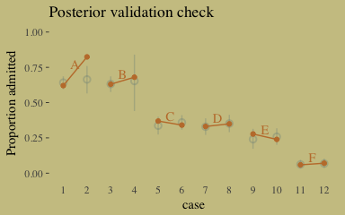
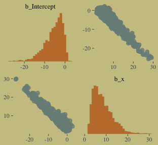
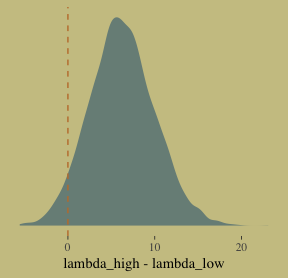
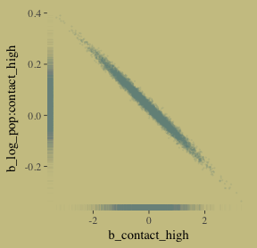
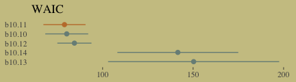
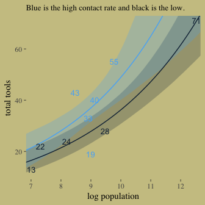
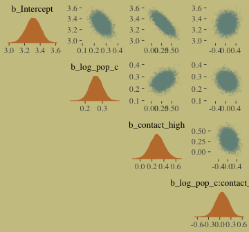
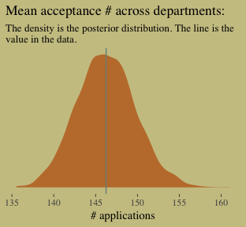
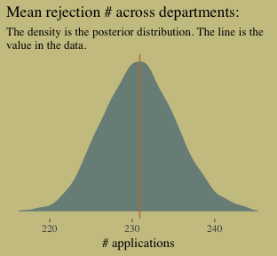

## 10.1. Binomial regression

The `chimpanzees` data:


```r
library(rethinking)
data(chimpanzees)
d <- chimpanzees
```

Switching from rethinking to brms.


```r
detach(package:rethinking)
library(brms)
rm(chimpanzees)
```
 
We start with the simple intercept-only logistic regression model.


```r
b10.1 <-
  brm(data = d, family = binomial,
      pulled_left ~ 1,
      prior = c(set_prior("normal(0, 10)", class = "Intercept")))
```


```r
library(tidyverse)
 
fixef(b10.1) %>%
  round(digits = 2)
```

```
##           Estimate Est.Error 2.5%ile 97.5%ile
## Intercept     0.32      0.09    0.15      0.5
```

On page 81, [Gelman and Hill (2007)](http://www.stat.columbia.edu/~gelman/arm/) give the formula for `invlogit()`, which is our alternative to the `logistic()` function in rethinking.


```r
invlogit <- function(x){1/(1 + exp(-x))}
```

It's easy to use.


```r
c(.18, .46) %>%
  invlogit()
```

```
## [1] 0.5448789 0.6130142
```

```r
fixef(b10.1) %>%
  invlogit()
```

```
##           Estimate Est.Error   2.5%ile  97.5%ile
## Intercept 0.578636 0.5223847 0.5361979 0.6231177
```

The next two chimp models add predictors.


```r
b10.2 <-
  brm(data = d, family = binomial,
      pulled_left ~ 1 + prosoc_left,
      prior = c(set_prior("normal(0, 10)", class = "Intercept"),
                set_prior("normal(0, 10)", class = "b")))

b10.3 <-
  brm(data = d, family = binomial,
      pulled_left ~ 1 + prosoc_left + condition:prosoc_left ,
      prior = c(set_prior("normal(0, 10)", class = "Intercept"),
                set_prior("normal(0, 10)", class = "b")))
```

Before comparing our models, we'll first save their WAIC estimates as objects. These will come in handy in just a bit.


```r
w_b10.1 <- waic(b10.1)
w_b10.2 <- waic(b10.2)
w_b10.3 <- waic(b10.3)

compare_ic(w_b10.1, w_b10.2, w_b10.3)
```

```
##                 WAIC   SE
## b10.1         687.92 7.05
## b10.2         680.57 9.34
## b10.3         682.32 9.43
## b10.1 - b10.2   7.35 6.19
## b10.1 - b10.3   5.59 6.23
## b10.2 - b10.3  -1.76 0.84
```

For this manuscript, we'll take our color scheme from the [wesanderson package](https://cran.r-project.org/web/packages/wesanderson/index.html)'s *Moonrise2* palette.


```r
# install.packages("wesanderson", dependencies = T)
library(wesanderson)

wes_palette("Moonrise2")
```

<!-- -->

```r
wes_palette("Moonrise2")[1:4]
```

```
## [1] "#798E87" "#C27D38" "#CCC591" "#29211F"
```

We'll also take a few formatting cues from [Edward Tufte](https://www.edwardtufte.com/tufte/books_vdqi), curtesy of the [ggthemes package](https://cran.r-project.org/web/packages/ggthemes/index.html). The `theme_tufte()` function will change the default font and remove some chart junk. The `theme_set()` function, below, will make these adjustments the default for all subsequent ggplot2 plots. To undo this, just code `theme_set(theme_default())`.


```r
library(ggthemes)
library(bayesplot)

theme_set(theme_default() + 
            theme_tufte() +
            theme(plot.background = element_rect(fill = wes_palette("Moonrise2")[3],
                                                 color = wes_palette("Moonrise2")[3])))
```

Finally, here's our WAIC plot.


```r
tibble(model = c("b10.1", "b10.2", "b10.3"),
       waic  = c(w_b10.1$waic, w_b10.2$waic, w_b10.3$waic),
       se    = c(w_b10.1$se_waic, w_b10.2$se_waic, w_b10.3$se_waic)) %>%

  ggplot() +
  geom_pointrange(aes(x = reorder(model, -waic), y = waic,
                      ymin = waic - se,
                      ymax = waic + se,
                      color = model),
                  shape = 16) +
  scale_color_manual(values = wes_palette("Moonrise2")[c(1:2, 4)]) +
  coord_flip() +
  labs(x = NULL, y = NULL,
       title = "WAIC") +
  theme(axis.ticks.y = element_blank(),
        legend.position = "none")
```

<!-- -->

The estimates from model `b10.3`, which might not have the lowest WAIC value, but is the one most clearly corresponding to the structure of the experiment:


```r
print(b10.3)
```

```
##  Family: binomial 
##   Links: mu = logit 
## Formula: pulled_left ~ 1 + prosoc_left + condition:prosoc_left 
##    Data: d (Number of observations: 504) 
## Samples: 4 chains, each with iter = 2000; warmup = 1000; thin = 1; 
##          total post-warmup samples = 4000
##     ICs: LOO = NA; WAIC = NA; R2 = NA
##  
## Population-Level Effects: 
##                       Estimate Est.Error l-95% CI u-95% CI Eff.Sample Rhat
## Intercept                 0.05      0.13    -0.19     0.30       3326 1.00
## prosoc_left               0.61      0.23     0.17     1.06       2313 1.00
## prosoc_left:condition    -0.11      0.26    -0.62     0.40       2585 1.00
## 
## Samples were drawn using sampling(NUTS). For each parameter, Eff.Sample 
## is a crude measure of effective sample size, and Rhat is the potential 
## scale reduction factor on split chains (at convergence, Rhat = 1).
```

Here's what the odds are multiplied by:


```r
fixef(b10.3)[2] %>%
  exp()
```

```
## [1] 1.844177
```

Given an estimated value of 4, the probability of a pull, all else equal, would be:


```r
invlogit(4)
```

```
## [1] 0.9820138
```

Adding the coefficient, `fixef(b10.3)[2]`, would yield:


```r
(4 + fixef(b10.3)[2]) %>%
  invlogit()
```

```
## [1] 0.9901661
```

For our variant of Figure 10.2., we use `brms::pp_average()` in place of `rethinking::ensemble()`.


```r
# The combined fitted() results of the three models weighted by their WAICs
pp_a <- 
  pp_average(b10.1, b10.2, b10.3,
             weights = "waic",
             method = "fitted") %>% 
  as_tibble() %>% 
  bind_cols(b10.3$data) %>% 
  distinct(Estimate, `2.5%ile`, `97.5%ile`, condition, prosoc_left) %>% 
  mutate(x_axis = str_c(prosoc_left, condition, sep = "/")) %>%
  mutate(x_axis = factor(x_axis, levels = c("0/0", "1/0", "0/1", "1/1"))) %>% 
  rename(pulled_left = Estimate)

# The empirically-based summaries
d_plot <-
  d %>%
  group_by(actor, condition, prosoc_left) %>%
  summarise(pulled_left = mean(pulled_left)) %>%
  mutate(x_axis = str_c(prosoc_left, condition, sep = "/")) %>%
  mutate(x_axis = factor(x_axis, levels = c("0/0", "1/0", "0/1", "1/1")))

# The plot
ggplot() +
  geom_ribbon(data = pp_a,
              aes(x = x_axis,
                  ymin = `2.5%ile`, 
                  ymax = `97.5%ile`,
                  group = 0),
              fill = wes_palette("Moonrise2")[2]) +
  geom_line(data = pp_a,
            aes(x = x_axis, 
                y = pulled_left,
                group = 0)) +
  geom_line(data = d_plot,
            aes(x = x_axis, y = pulled_left, group = actor),
            color = wes_palette("Moonrise2")[1], size = 1/3) +
  scale_x_discrete(expand = c(.03, .03)) +
  coord_cartesian(ylim = 0:1) +
  labs(x = "prosoc_left/condition",
       y = "proportion pulled left") +
  theme(axis.ticks.x = element_blank())
```

<!-- -->

McElreath didn't show the actual pairs plot in the text. Here's ours using `mcmc_pairs()`.


```r
# this helps us set our custom color scheme
color_scheme_set(c(wes_palette("Moonrise2")[3], 
                   wes_palette("Moonrise2")[1], 
                   wes_palette("Moonrise2")[2], 
                   wes_palette("Moonrise2")[2], 
                   wes_palette("Moonrise2")[1], 
                   wes_palette("Moonrise2")[1]))

# the actual plot
mcmc_pairs(x = posterior_samples(b10.3),
           pars = c("b_Intercept", "b_prosoc_left", "b_prosoc_left:condition"),
           off_diag_args = list(size = 1/10, alpha = 1/6),
           diag_fun = "dens")
```

<!-- -->

As McElreath asserted, the posterior looks pretty multivariate Gaussian.

Enclosing the `actor` variable within `factor()` will produce the indexing we need to get `actor`-specific intercepts.


```r
b10.4 <-
  brm(data = d, family = binomial,
      pulled_left ~ 0 + factor(actor) + prosoc_left + condition:prosoc_left ,
      prior = c(set_prior("normal(0, 10)", class = "b")),
      chains = 2, iter = 2500, warmup = 500, cores = 2,
      control = list(adapt_delta = 0.9))
```

Within the tidyverse, `distinct()` yields the information you'd otherwise get from `unique()`.


```r
d %>%
  distinct(actor)
```

```
##   actor
## 1     1
## 2     2
## 3     3
## 4     4
## 5     5
## 6     6
## 7     7
```

The posterior summary:


```r
print(b10.4)
```

```
## Warning: There were 1 divergent transitions after warmup. Increasing adapt_delta above 0.9 may help.
## See http://mc-stan.org/misc/warnings.html#divergent-transitions-after-warmup
```

```
##  Family: binomial 
##   Links: mu = logit 
## Formula: pulled_left ~ 0 + factor(actor) + prosoc_left + condition:prosoc_left 
##    Data: d (Number of observations: 504) 
## Samples: 2 chains, each with iter = 2500; warmup = 500; thin = 1; 
##          total post-warmup samples = 4000
##     ICs: LOO = NA; WAIC = NA; R2 = NA
##  
## Population-Level Effects: 
##                       Estimate Est.Error l-95% CI u-95% CI Eff.Sample Rhat
## factoractor1             -0.74      0.27    -1.29    -0.22       4000 1.00
## factoractor2             10.99      5.40     3.84    24.03       1735 1.00
## factoractor3             -1.05      0.28    -1.65    -0.51       4000 1.00
## factoractor4             -1.05      0.28    -1.61    -0.50       4000 1.00
## factoractor5             -0.74      0.27    -1.28    -0.21       4000 1.00
## factoractor6              0.22      0.27    -0.31     0.74       3325 1.00
## factoractor7              1.81      0.39     1.09     2.63       4000 1.00
## prosoc_left               0.85      0.26     0.34     1.35       2343 1.00
## prosoc_left:condition    -0.14      0.30    -0.72     0.44       2855 1.00
## 
## Samples were drawn using sampling(NUTS). For each parameter, Eff.Sample 
## is a crude measure of effective sample size, and Rhat is the potential 
## scale reduction factor on split chains (at convergence, Rhat = 1).
```

Here's what the `posterior_samples` for `b10.4` looks like:


```r
post <- posterior_samples(b10.4)
 
post %>%
  glimpse()
```

```
## Observations: 4,000
## Variables: 10
## $ b_factoractor1            <dbl> -0.80183689, -0.85532037, -0.3749136...
## $ b_factoractor2            <dbl> 6.015481, 6.148818, 13.010139, 16.00...
## $ b_factoractor3            <dbl> -1.1397157, -1.2021467, -0.6395925, ...
## $ b_factoractor4            <dbl> -1.0715983, -0.7091974, -1.3559402, ...
## $ b_factoractor5            <dbl> -0.7652073, -0.5071621, -0.6602597, ...
## $ b_factoractor6            <dbl> 0.31380344, 0.24025029, 0.49960963, ...
## $ b_factoractor7            <dbl> 1.5860216, 0.9914712, 2.5453636, 1.7...
## $ b_prosoc_left             <dbl> 1.1786218, 0.7777363, 0.5076364, 0.7...
## $ `b_prosoc_left:condition` <dbl> -0.293106573, -0.233733529, 0.178310...
## $ lp__                      <dbl> -287.4712, -290.2587, -291.8345, -29...
```

Our variant of Figure 10.3.


```r
post %>%
  ggplot(aes(x = b_factoractor2)) +
  geom_density(color = "transparent",
               fill = wes_palette("Moonrise2")[1]) +
  scale_y_continuous(NULL, breaks = NULL) +
  labs(x = NULL,
       title = "Actor 2's large and uncertain intercept",
       subtitle = "Once your log-odds are above, like, 4, it's all\npretty much a probability of 1.")
```

<!-- -->

Figure 10.4., the idiographic trajectories for four of our chimps.


```r
d_plot_4 <-
  d_plot %>%
  filter(actor %in% c(3, 5:7)) %>%
  ungroup() %>% 
  mutate(actor = str_c("actor ", actor))

ftd <-
  fitted(b10.4) %>% 
  as_tibble() %>% 
  bind_cols(b10.4$data) %>% 
  filter(actor %in% c(3, 5:7)) %>% 
  distinct(Estimate, `2.5%ile`, `97.5%ile`, condition, prosoc_left, actor) %>% 
  select(actor, everything()) %>% 
  mutate(actor = str_c("actor ", actor)) %>% 
  mutate(x_axis = str_c(prosoc_left, condition, sep = "/")) %>%
  mutate(x_axis = factor(x_axis, levels = c("0/0", "1/0", "0/1", "1/1"))) %>% 
  rename(pulled_left = Estimate)

  ggplot(data = ftd,
         aes(x = x_axis, y = pulled_left, group = actor)) +
  geom_ribbon(aes(x = x_axis,
                  ymin = `2.5%ile`, 
                  ymax = `97.5%ile`),
              fill = wes_palette("Moonrise2")[2]) +
  geom_line(aes(x = x_axis, 
                y = pulled_left)) +
  geom_line(data = d_plot_4,
            color = wes_palette("Moonrise2")[1], size = 1.25) +
  scale_x_discrete(expand = c(.03, .03)) +
  coord_cartesian(ylim = 0:1) +
  labs(x = "prosoc_left/condition",
       y = "proportion pulled left") +
  theme(axis.ticks.x = element_blank(),
        # color came from: http://www.color-hex.com/color/ccc591
        panel.background = element_rect(fill = "#d1ca9c",
                                        color = "transparent")) +
  facet_wrap(~actor)
```

<!-- -->

### 10.1.2. Aggregated binomial: Chimpanzees again, condensed.

With the tidyverse, we use `group_by()` and `summarise()` to achieve what McElreath did with `aggregate()`.


```r
d_aggregated <-
  d %>%
  select(-recipient, -block, -trial, -chose_prosoc) %>%
  group_by(actor, condition, prosoc_left) %>%
  summarise(x = sum(pulled_left))

d_aggregated %>%
  slice(1:8)
```

```
## # A tibble: 28 x 4
## # Groups: actor, condition [14]
##    actor condition prosoc_left     x
##    <int>     <int>       <int> <int>
##  1     1         0           0     6
##  2     1         0           1     9
##  3     1         1           0     5
##  4     1         1           1    10
##  5     2         0           0    18
##  6     2         0           1    18
##  7     2         1           0    18
##  8     2         1           1    18
##  9     3         0           0     5
## 10     3         0           1    11
## # ... with 18 more rows
```

To fit an aggregated binomial model in brms, we use the `[criterion] | trials()` syntax where the value that goes in `trials()` is either a fixed number, as in this case, or an index variable.


```r
b10.5 <-
  brm(data = d_aggregated, family = binomial,
      x | trials(18) ~ 1 + prosoc_left + condition:prosoc_left ,
      prior = c(set_prior("normal(0, 10)", class = "Intercept"),
                set_prior("normal(0, 10)", class = "b")),
      iter = 2500, warmup = 500, cores = 2, chains = 2)
```

We might compare `b10.3` with `b10.5` like this.


```r
fixef(b10.3) %>% round(digits = 2)
```

```
##                       Estimate Est.Error 2.5%ile 97.5%ile
## Intercept                 0.05      0.13   -0.19     0.30
## prosoc_left               0.61      0.23    0.17     1.06
## prosoc_left:condition    -0.11      0.26   -0.62     0.40
```

```r
fixef(b10.5) %>% round(digits = 2)
```

```
##                       Estimate Est.Error 2.5%ile 97.5%ile
## Intercept                 0.05      0.13   -0.21     0.29
## prosoc_left               0.61      0.22    0.19     1.04
## prosoc_left:condition    -0.11      0.26   -0.62     0.39
```

Close within rounding error.

### 10.1.3. Aggregated binomial: Graduate school admissions.

The infamous `UCBadmit` data:


```r
# detach(package:brms)
library(rethinking)
data(UCBadmit)
d <- UCBadmit
```

Switching from rethinking to brms.


```r
detach(package:rethinking)
library(brms)
rm(UCBadmit)

d
```

```
##    dept applicant.gender admit reject applications
## 1     A             male   512    313          825
## 2     A           female    89     19          108
## 3     B             male   353    207          560
## 4     B           female    17      8           25
## 5     C             male   120    205          325
## 6     C           female   202    391          593
## 7     D             male   138    279          417
## 8     D           female   131    244          375
## 9     E             male    53    138          191
## 10    E           female    94    299          393
## 11    F             male    22    351          373
## 12    F           female    24    317          341
```

Here's our newly-constructed predictor, `male`, and the models that do/do not put it to work.


```r
d <- 
  d %>%
  mutate(male = ifelse(applicant.gender == "male", 1, 0))

b10.6 <-
  brm(data = d, family = binomial,
      admit | trials(applications) ~ 1 + male ,
      prior = c(set_prior("normal(0, 10)", class = "Intercept"),
                set_prior("normal(0, 10)", class = "b")),
      iter = 2500, warmup = 500, cores = 2, chains = 2)

b10.7 <-
  brm(data = d, family = binomial,
      admit | trials(applications) ~ 1,
      prior = c(set_prior("normal(0, 10)", class = "Intercept")),
      iter = 2500, warmup = 500, cores = 2, chains = 2)
```

The WAIC comparison:


```r
waic(b10.6, b10.7)
```

```
##                  WAIC     SE
## b10.6          991.72 328.38
## b10.7         1049.98 329.32
## b10.6 - b10.7  -58.26 168.67
```

If you use the LOO to compare the models instead of the WAIC, you'll run into warnings that multiple observations have "a pareto_k > 0.7." You might take this as an indication that these observations are unduly influential on the model parameters, something like what you'd get with a Cook's $D_{i}$ analysis. This suggests the model isn't a great fit for the data. For more on the topic, see [this discussion on stackoverflow.com in which several members of the Stan team weigh in](https://stackoverflow.com/questions/39578834/linear-model-diagnostics-for-bayesian-models-using-rstan/39595436), [this paper](https://arxiv.org/abs/1507.04544), the [loo reference manual](https://cran.r-project.org/web/packages/loo/loo.pdf), and [this presentation by Vehtari himself](https://www.youtube.com/watch?v=FUROJM3u5HQ&feature=youtu.be&a=).

But that's a bit of a tangent from the central thrust of this section. Here's a look at `b10.6`, the univariable model:


```r
print(b10.6)
```

```
##  Family: binomial 
##   Links: mu = logit 
## Formula: admit | trials(applications) ~ 1 + male 
##    Data: d (Number of observations: 12) 
## Samples: 2 chains, each with iter = 2500; warmup = 500; thin = 1; 
##          total post-warmup samples = 4000
##     ICs: LOO = NA; WAIC = NA; R2 = NA
##  
## Population-Level Effects: 
##           Estimate Est.Error l-95% CI u-95% CI Eff.Sample Rhat
## Intercept    -0.83      0.05    -0.93    -0.73       1864 1.00
## male          0.61      0.06     0.48     0.73       1921 1.00
## 
## Samples were drawn using sampling(NUTS). For each parameter, Eff.Sample 
## is a crude measure of effective sample size, and Rhat is the potential 
## scale reduction factor on split chains (at convergence, Rhat = 1).
```


```r
fixef(b10.6)[2] %>%
  exp() %>%
  round(digits = 2)
```

```
## [1] 1.84
```

The difference in admission probabilities.


```r
post <- posterior_samples(b10.6)

post %>%
  mutate(p_admit_male   = invlogit(b_Intercept + b_male),
         p_admit_female = invlogit(b_Intercept),
         diff_admit     = p_admit_male - p_admit_female) %>%
  summarise(`2.5%`  = quantile(diff_admit, probs = .025),
            `50%`   = median(diff_admit),
            `97.5%` = quantile(diff_admit, probs = .975))
```

```
##        2.5%      50%     97.5%
## 1 0.1125688 0.141838 0.1692189
```

Here's our version of Figure 10.5.


```r
d <-
  d %>%
  mutate(case = factor(1:12))

p_10.6 <- 
  predict(b10.6) %>% 
  as_tibble() %>% 
  bind_cols(d)

d_text <-
  d %>%
  group_by(dept) %>%
  summarise(case = mean(as.numeric(case)),
            admit = mean(admit/applications) + .05)

ggplot(data = d, aes(x = case, y = admit/applications)) +
  geom_pointrange(data = p_10.6, 
                  aes(y = Estimate/applications,
                      ymin = `2.5%ile`/applications ,
                      ymax = `97.5%ile`/applications),
                  color = wes_palette("Moonrise2")[1],
                  shape = 1, alpha = 1/3) +
  geom_point(color = wes_palette("Moonrise2")[2]) +
  geom_line(aes(group = dept),
            color = wes_palette("Moonrise2")[2]) +
  geom_text(data = d_text,
            aes(y = admit, label = dept),
            color = wes_palette("Moonrise2")[2],
            family = "serif") +
  coord_cartesian(ylim = 0:1) +
  labs(y = "Proportion admitted",
       title = "Posterior validation check") +
  theme(axis.ticks.x = element_blank())
```

<!-- -->

As alluded to in all that LOO/pareto_k talk, above, this is not a great fit.

We don't need to coerce an index. But here are the models.


```r
b10.8 <-
  brm(data = d, family = binomial,
      admit | trials(applications) ~ 0 + dept,
      prior = c(set_prior("normal(0, 10)", class = "b")),
      iter = 2500, warmup = 500, cores = 2, chains = 2)

b10.9 <-
  brm(data = d, family = binomial,
      admit | trials(applications) ~ 0 + dept + male ,
      prior = c(set_prior("normal(0, 10)", class = "b")),
      iter = 2500, warmup = 500, cores = 2, chains = 2)
```

Here we compare all four models by the WAIC.


```r
waic(b10.6, b10.7, b10.8, b10.9)
```

```
##                  WAIC     SE
## b10.6          991.72 328.38
## b10.7         1049.98 329.32
## b10.8          105.02  17.89
## b10.9          108.58  16.40
## b10.6 - b10.7  -58.26 168.67
## b10.6 - b10.8  886.70 325.36
## b10.6 - b10.9  883.15 327.17
## b10.7 - b10.8  944.97 326.97
## b10.7 - b10.9  941.41 328.81
## b10.8 - b10.9   -3.56   3.67
```

Our multivariable model, `b10.9`, looks like this:


```r
print(b10.9)
```

```
##  Family: binomial 
##   Links: mu = logit 
## Formula: admit | trials(applications) ~ 0 + dept + male 
##    Data: d (Number of observations: 12) 
## Samples: 2 chains, each with iter = 2500; warmup = 500; thin = 1; 
##          total post-warmup samples = 4000
##     ICs: LOO = NA; WAIC = NA; R2 = NA
##  
## Population-Level Effects: 
##       Estimate Est.Error l-95% CI u-95% CI Eff.Sample Rhat
## deptA     0.68      0.10     0.48     0.88       2270 1.00
## deptB     0.64      0.11     0.42     0.86       2246 1.00
## deptC    -0.58      0.08    -0.72    -0.44       3314 1.00
## deptD    -0.61      0.08    -0.78    -0.45       2781 1.00
## deptE    -1.06      0.10    -1.26    -0.86       4000 1.00
## deptF    -2.63      0.16    -2.94    -2.34       4000 1.00
## male     -0.10      0.08    -0.25     0.06       1702 1.00
## 
## Samples were drawn using sampling(NUTS). For each parameter, Eff.Sample 
## is a crude measure of effective sample size, and Rhat is the potential 
## scale reduction factor on split chains (at convergence, Rhat = 1).
```

Here's our version of Figure 10.6.


```r
predict(b10.9) %>% 
  as_tibble() %>% 
  bind_cols(d) %>% 

ggplot(aes(x = case, y = admit/applications)) +
  geom_pointrange(aes(y = Estimate/applications,
                      ymin = `2.5%ile`/applications ,
                      ymax = `97.5%ile`/applications),
                  color = wes_palette("Moonrise2")[1],
                  shape = 1, alpha = 1/3) +
  geom_point(color = wes_palette("Moonrise2")[2]) +
  geom_line(aes(group = dept),
            color = wes_palette("Moonrise2")[2]) +
  geom_text(data = d_text,
            aes(y = admit, label = dept),
            color = wes_palette("Moonrise2")[2],
            family = "serif") +
  coord_cartesian(ylim = 0:1) +
  labs(y = "Proportion admitted",
       title = "Posterior validation check") +
  theme(axis.ticks.x = element_blank())
```

<!-- -->

### 10.1.4. Fitting binomial regressions with `glm()`.

We're not here to learn frequentist code, so we're going to skip most of this section. But model `b.good` is worth fitting. Here's the data.


```r
# outcome and predictor almost perfectly associated
y <- c(rep(0, 10), rep(1, 10))

x <- c(rep(-1, 9), rep(1, 11))
```

The `b.good` model:


```r
b.good <-
  brm(data = list(y = y, x = x), family = binomial,
      y ~ 1 + x,
      prior = c(set_prior("normal(0, 10)", class = "Intercept"),
                set_prior("normal(0, 10)", class = "b")))
```

Our model summary will differ a bit from the one in the text. This is because of the MAP/HMC contrast.


```r
print(b.good)
```

```
##  Family: binomial 
##   Links: mu = logit 
## Formula: y ~ 1 + x 
##    Data: list(y = y, x = x) (Number of observations: 20) 
## Samples: 4 chains, each with iter = 2000; warmup = 1000; thin = 1; 
##          total post-warmup samples = 4000
##     ICs: LOO = NA; WAIC = NA; R2 = NA
##  
## Population-Level Effects: 
##           Estimate Est.Error l-95% CI u-95% CI Eff.Sample Rhat
## Intercept    -5.55      4.50   -16.28     0.47        465 1.01
## x             8.38      4.50     2.46    18.94        471 1.01
## 
## Samples were drawn using sampling(NUTS). For each parameter, Eff.Sample 
## is a crude measure of effective sample size, and Rhat is the potential 
## scale reduction factor on split chains (at convergence, Rhat = 1).
```

Here's the `pairs()` plot McElreath excluded from the text:


```r
pairs(b.good)
```

<!-- -->

This plot deserves and extensive quote from McElreath. "Inspecting the pairs plot ~~(not shown)~~ demonstrates just how subtle even simple models can be, once we start working with GLMs. I don't say this to scare the reader. But it's true that even simple models can behave in complicated ways. How you fit the model is part of the model, and in principle no GLM is safe for MAP estimation."

## 10.2. Poisson regression

We'll simulate our sweet count data.


```r
set.seed(9968400) # making the results reproducible

y <- rbinom(1e5, 1000, 1/1000)

y %>%
  mean()
```

```
## [1] 0.99545
```

```r
y %>%
  var()
```

```
## [1] 0.9935792
```


```r
# detach(package:brms)
library(rethinking)
data(Kline)
d <- Kline
```

Switching from rethinking to brms.


```r
detach(package:rethinking)
library(brms)
rm(Kline)

d
```

```
##       culture population contact total_tools mean_TU
## 1    Malekula       1100     low          13     3.2
## 2     Tikopia       1500     low          22     4.7
## 3  Santa Cruz       3600     low          24     4.0
## 4         Yap       4791    high          43     5.0
## 5    Lau Fiji       7400    high          33     5.0
## 6   Trobriand       8000    high          19     4.0
## 7       Chuuk       9200    high          40     3.8
## 8       Manus      13000     low          28     6.6
## 9       Tonga      17500    high          55     5.4
## 10     Hawaii     275000     low          71     6.6
```

Here are our new columns.


```r
d <-
  d %>%
  mutate(log_pop = log(population),
         contact_high = ifelse(contact == "high", 1, 0))
```

Our first Poisson model!


```r
b10.10 <-
  brm(data = d, family = poisson,
      total_tools ~ 1 + log_pop + contact_high + contact_high:log_pop,
      prior = c(set_prior("normal(0, 100)", class = "Intercept"),
                set_prior("normal(0, 1)", class = "b")),
      iter = 3000, warmup = 1000, chains = 4, cores = 4)
```


```r
print(b10.10)
```

```
##  Family: poisson 
##   Links: mu = log 
## Formula: total_tools ~ 1 + log_pop + contact_high + contact_high:log_pop 
##    Data: d (Number of observations: 10) 
## Samples: 4 chains, each with iter = 3000; warmup = 1000; thin = 1; 
##          total post-warmup samples = 8000
##     ICs: LOO = NA; WAIC = NA; R2 = NA
##  
## Population-Level Effects: 
##                      Estimate Est.Error l-95% CI u-95% CI Eff.Sample Rhat
## Intercept                0.93      0.36     0.22     1.65       4423 1.00
## log_pop                  0.26      0.03     0.19     0.33       4591 1.00
## contact_high            -0.07      0.85    -1.72     1.58       3388 1.00
## log_pop:contact_high     0.04      0.09    -0.14     0.22       3406 1.00
## 
## Samples were drawn using sampling(NUTS). For each parameter, Eff.Sample 
## is a crude measure of effective sample size, and Rhat is the potential 
## scale reduction factor on split chains (at convergence, Rhat = 1).
```

Instead of looking at the correlation point estimates, we might plot:


```r
post <-
  posterior_samples(b10.10)

post[1:4] %>%
  rename(b_interaction = `b_log_pop:contact_high`) %>%
  cor() %>%
  round(digits = 2)
```

```
##                b_Intercept b_log_pop b_contact_high b_interaction
## b_Intercept           1.00     -0.98          -0.14          0.08
## b_log_pop            -0.98      1.00           0.14         -0.10
## b_contact_high       -0.14      0.14           1.00         -0.99
## b_interaction         0.08     -0.10          -0.99          1.00
```

How plausible is it a high-contact island will have more tools than a low-contact island?


```r
post <-
  post %>%
  mutate(lambda_high = exp(b_Intercept + b_contact_high + (b_log_pop + `b_log_pop:contact_high`)*8),
         lambda_low = exp(b_Intercept + b_log_pop*8),
         diff = lambda_high - lambda_low) 

post %>%
  summarise(sum = sum(diff > 0)/length(diff))
```

```
##        sum
## 1 0.956375
```

Quite.

Here we are, Figure 10.8.a.


```r
post %>%
  ggplot(aes(x = diff)) +
  geom_density(color = "transparent",
               fill = wes_palette("Moonrise2")[1]) +
  geom_vline(xintercept = 0, linetype = 2,
             color = wes_palette("Moonrise2")[2]) +
  scale_y_continuous(NULL, breaks = NULL) +
  labs(x = "lambda_high - lambda_low")
```

<!-- -->

I'm not sure how to elegantly insert the marginal posterior estimates as dot-and-line plots into Figure 10.8.b., so we'll just throw in a couple rug plots, instead.


```r
post %>%
  ggplot(aes(x = b_contact_high, y = `b_log_pop:contact_high`)) +
  geom_point(color = wes_palette("Moonrise2")[1],
             size = 1/10, alpha = 1/10) +
  geom_rug(color = wes_palette("Moonrise2")[1],
           size = 1/15, alpha = 1/8)
```

<!-- -->

Here we deconstruct model `b10.10`, bit by bit.


```r
# no interaction
b10.11 <-
  brm(data = d, family = poisson,
      total_tools ~ 1 + log_pop + contact_high,
      prior = c(set_prior("normal(0, 100)", class = "Intercept"),
                set_prior("normal(0, 1)", class = "b")),
      iter = 3000, warmup = 1000, chains = 4, cores = 4)

# no contact rate
b10.12 <-
  brm(data = d, family = poisson,
      total_tools ~ 1 + log_pop,
      prior = c(set_prior("normal(0, 100)", class = "Intercept"),
                set_prior("normal(0, 1)", class = "b")),
      iter = 3000, warmup = 1000, chains = 4, cores = 4)

# no log-population
b10.13 <-
  brm(data = d, family = poisson,
      total_tools ~ 1 + contact_high,
      prior = c(set_prior("normal(0, 100)", class = "Intercept"),
                set_prior("normal(0, 1)", class = "b")),
      iter = 3000, warmup = 1000, chains = 4, cores = 4)

# intercept only
b10.14 <-
  brm(data = d, family = poisson,
      total_tools ~ 1,
      prior = c(set_prior("normal(0, 100)", class = "Intercept")),
      iter = 3000, warmup = 1000, chains = 4, cores = 4)
```


```r
w_b10.10 <- waic(b10.10)
w_b10.11 <- waic(b10.11)
w_b10.12 <- waic(b10.12)
w_b10.13 <- waic(b10.13)
w_b10.14 <- waic(b10.14)
 
compare_ic(w_b10.10, w_b10.11, w_b10.12, w_b10.13, w_b10.14)
```

```
##                   WAIC    SE
## b10.10           80.16 11.86
## b10.11           78.91 11.64
## b10.12           84.40  9.43
## b10.13          150.28 47.28
## b10.14          141.54 33.40
## b10.10 - b10.11   1.25  1.24
## b10.10 - b10.12  -4.24  8.02
## b10.10 - b10.13 -70.12 47.20
## b10.10 - b10.14 -61.38 34.80
## b10.11 - b10.12  -5.49  8.42
## b10.11 - b10.13 -71.37 46.91
## b10.11 - b10.14 -62.63 34.50
## b10.12 - b10.13 -65.88 47.05
## b10.12 - b10.14 -57.14 33.32
## b10.13 - b10.14   8.74 17.16
```

Our handmade WAIC plot.


```r
tibble(model = c("b10.10", "b10.11", "b10.12", "b10.13", "b10.14"),
       waic  = c(w_b10.10$waic, w_b10.11$waic, w_b10.12$waic, w_b10.13$waic, w_b10.14$waic),
       se    = c(w_b10.10$se_waic, w_b10.11$se_waic, w_b10.12$se_waic, w_b10.13$se_waic, w_b10.14$se_waic)) %>%

  ggplot() +
  geom_pointrange(aes(x = reorder(model, -waic), y = waic,
                      ymin = waic - se,
                      ymax = waic + se,
                      color = model),
                  shape = 16) +
  scale_color_manual(values = wes_palette("Moonrise2")[c(1, 2, 1, 1, 1)]) +
  coord_flip() +
  labs(x = NULL, y = NULL,
       title = "WAIC") +
  theme(axis.ticks.y = element_blank(),
        legend.position = "none")
```

<!-- -->

Our version of Figure 10.9. Recall, to do an "ensemble" posterior prediction in brms, one uses the `pp_average()` function.


```r
nd <-
  tibble(log_pop = rep(seq(from = 6.5, 
                           to = 13, 
                           length.out = 50),
                       times = 2),
         contact_high = rep(0:1, each = 50))

ppa_10.9 <- 
  pp_average(b10.10, b10.11, b10.12,
             weights = "waic",
             method = "fitted",
             newdata = nd) %>%
  as_tibble() %>%
  bind_cols(nd)

ppa_10.9 %>%
  ggplot(aes(x = log_pop,
             group = contact_high)) +
  geom_ribbon(aes(ymin = `2.5%ile`,
                  ymax = `97.5%ile`,
                  fill = contact_high),
              alpha = 1/4) +
  geom_line(aes(y = Estimate, color = contact_high)) +
  geom_text(data = d, 
             aes(y = total_tools,
                 label = total_tools,
                 color = contact_high),
             size = 3.5) +
  coord_cartesian(xlim = c(7.1, 12.4),
                  ylim = c(12, 70)) +
    labs(x = "log population",
         y = "total tools",
         subtitle = "Blue is the high contact rate and black is the low.") +
  theme(legend.position = "none",
        panel.border = element_blank())
```

<!-- -->

### 10.2.2. MCMC islands.

We fit our analogue to `m10.10stan`, `b10.10`, some time ago. 


```r
print(b10.10)
```

```
##  Family: poisson 
##   Links: mu = log 
## Formula: total_tools ~ 1 + log_pop + contact_high + contact_high:log_pop 
##    Data: d (Number of observations: 10) 
## Samples: 4 chains, each with iter = 3000; warmup = 1000; thin = 1; 
##          total post-warmup samples = 8000
##     ICs: LOO = NA; WAIC = NA; R2 = NA
##  
## Population-Level Effects: 
##                      Estimate Est.Error l-95% CI u-95% CI Eff.Sample Rhat
## Intercept                0.93      0.36     0.22     1.65       4423 1.00
## log_pop                  0.26      0.03     0.19     0.33       4591 1.00
## contact_high            -0.07      0.85    -1.72     1.58       3388 1.00
## log_pop:contact_high     0.04      0.09    -0.14     0.22       3406 1.00
## 
## Samples were drawn using sampling(NUTS). For each parameter, Eff.Sample 
## is a crude measure of effective sample size, and Rhat is the potential 
## scale reduction factor on split chains (at convergence, Rhat = 1).
```

Here's the x-centered version.


```r
d <-
  d %>%
  mutate(log_pop_c = log_pop - mean(log_pop))

b10.10.c <-
  brm(data = d, family = poisson,
      total_tools ~ 1 + log_pop_c + contact_high + contact_high:log_pop_c,
      prior = c(set_prior("normal(0, 10)", class = "Intercept"),
                set_prior("normal(0, 10)", class = "b")),
      iter = 3000, warmup = 1000, chains = 4, cores = 4)
```

The results of our centering:


```r
print(b10.10.c)
```

```
##  Family: poisson 
##   Links: mu = log 
## Formula: total_tools ~ 1 + log_pop_c + contact_high + contact_high:log_pop_c 
##    Data: d (Number of observations: 10) 
## Samples: 4 chains, each with iter = 3000; warmup = 1000; thin = 1; 
##          total post-warmup samples = 8000
##     ICs: LOO = NA; WAIC = NA; R2 = NA
##  
## Population-Level Effects: 
##                        Estimate Est.Error l-95% CI u-95% CI Eff.Sample
## Intercept                  3.31      0.09     3.13     3.48       5680
## log_pop_c                  0.26      0.04     0.19     0.33       6521
## contact_high               0.29      0.12     0.06     0.52       6063
## log_pop_c:contact_high     0.06      0.17    -0.27     0.39       7047
##                        Rhat
## Intercept              1.00
## log_pop_c              1.00
## contact_high           1.00
## log_pop_c:contact_high 1.00
## 
## Samples were drawn using sampling(NUTS). For each parameter, Eff.Sample 
## is a crude measure of effective sample size, and Rhat is the potential 
## scale reduction factor on split chains (at convergence, Rhat = 1).
```

Figure 10.10.a. 


```r
# this helps us set our custom color scheme
color_scheme_set(c(wes_palette("Moonrise2")[3], 
                   wes_palette("Moonrise2")[1], 
                   wes_palette("Moonrise2")[2], 
                   wes_palette("Moonrise2")[2], 
                   wes_palette("Moonrise2")[1], 
                   wes_palette("Moonrise2")[1]))

# the actual plot
mcmc_pairs(x = posterior_samples(b10.10),
           pars = c("b_Intercept", "b_log_pop", "b_contact_high", "b_log_pop:contact_high"),
           off_diag_args = list(size = 1/10, alpha = 1/10),
           diag_fun = "dens")
```

<!-- -->

Figure 10.10.b. 


```r
mcmc_pairs(x = posterior_samples(b10.10.c),
           pars = c("b_Intercept", "b_log_pop_c", "b_contact_high", "b_log_pop_c:contact_high"),
           off_diag_args = list(size = 1/10, alpha = 1/10),
           diag_fun = "dens")
```

<!-- -->

If you really want the correlation point estimates, `lowerCor()` from the [psych package](https://cran.r-project.org/web/packages/psych/index.html) gives a nice way to get the lower triangle of the matrix.


```r
library(psych)

lowerCor(posterior_samples(b10.10)[, 1:4])
```

```
##                        b_Int b_lg_ b_cn_ b__:_
## b_Intercept             1.00                  
## b_log_pop              -0.98  1.00            
## b_contact_high         -0.14  0.14  1.00      
## b_log_pop:contact_high  0.08 -0.10 -0.99  1.00
```

```r
lowerCor(posterior_samples(b10.10.c)[, 1:4])
```

```
##                          b_Int b_l__ b_cn_ b___:
## b_Intercept               1.00                  
## b_log_pop_c              -0.47  1.00            
## b_contact_high           -0.76  0.34  1.00      
## b_log_pop_c:contact_high  0.09 -0.21 -0.25  1.00
```

### 10.2.3. Example: Exposure and the offset.

Here we simulate our data.


```r
set.seed(3838) # making it reproducible 

num_days <- 30
y <- rpois(num_days, 1.5)
```


```r
set.seed(3838) # making it reproducible 

num_weeks <- 4
y_new <- rpois(num_weeks, 0.5*7)
```

Let's make them tidy.


```r
d <- 
  tibble(y = c(y, y_new), 
         days = c(rep(1, 30), rep(7, 4)),
         monastery = c(rep(0, 30), rep(1, 4)))

d
```

```
## # A tibble: 34 x 3
##        y  days monastery
##    <int> <dbl>     <dbl>
##  1     1  1.00         0
##  2     2  1.00         0
##  3     1  1.00         0
##  4     1  1.00         0
##  5     1  1.00         0
##  6     2  1.00         0
##  7     0  1.00         0
##  8     1  1.00         0
##  9     1  1.00         0
## 10     0  1.00         0
## # ... with 24 more rows
```

Here we compute the offset and fit the model. With the brms package, you use the `offset()` syntax, in which you put a pre-processed variable like `log_days` or the log of a variable, such as `log(days)`.


```r
d <-
  d %>%
  mutate(log_days = log(days))

b10.15 <-
  brm(data = d, family = poisson,
      y ~ 1 + offset(log_days) + monastery,
      prior = c(set_prior("normal(0, 100)", class = "Intercept"),
                set_prior("normal(0, 1)", class = "b")),
      iter = 2500, warmup = 500, cores = 2, chains = 2)
```

The model summary:


```r
print(b10.15)
```

```
##  Family: poisson 
##   Links: mu = log 
## Formula: y ~ 1 + offset(log_days) + monastery 
##    Data: d (Number of observations: 34) 
## Samples: 2 chains, each with iter = 2500; warmup = 500; thin = 1; 
##          total post-warmup samples = 4000
##     ICs: LOO = NA; WAIC = NA; R2 = NA
##  
## Population-Level Effects: 
##           Estimate Est.Error l-95% CI u-95% CI Eff.Sample Rhat
## Intercept     0.17      0.16    -0.16     0.48       2211 1.00
## monastery    -0.97      0.32    -1.61    -0.38       2239 1.00
## 
## Samples were drawn using sampling(NUTS). For each parameter, Eff.Sample 
## is a crude measure of effective sample size, and Rhat is the potential 
## scale reduction factor on split chains (at convergence, Rhat = 1).
```


```r
posterior_samples(b10.15) %>%
  mutate(lambda_old = exp(b_Intercept),
         lambda_new  = exp(b_Intercept + b_monastery)) %>%
  gather(key, value, -(b_Intercept:lp__)) %>%
  mutate(key = factor(key, levels = c("lambda_old", "lambda_new"))) %>%
  group_by(key) %>%
  summarise(Mean = mean(value) %>% round(digits = 2),
            StdDev = sd(value) %>% round(digits = 2),
            LL = quantile(value, probs = .025) %>% round(digits = 2),
            UL = quantile(value, probs = .975) %>% round(digits = 2)) 
```

```
## # A tibble: 2 x 5
##   key         Mean StdDev    LL    UL
##   <fctr>     <dbl>  <dbl> <dbl> <dbl>
## 1 lambda_old 1.20   0.200 0.850 1.61 
## 2 lambda_new 0.470  0.130 0.250 0.740
```

## 10.3. Other count regressions

### 10.3.1. Multinomial.

More simulation.


```r
detach(package:brms)
library(rethinking)

# simulate career choices among 500 individuals
N <- 500             # number of individuals
income <- 1:3        # expected income of each career
score <- 0.5*income  # scores for each career, based on income

# next line converts scores to probabilities
p <- softmax(score[1], score[2], score[3])

# now simulate choice
# outcome career holds event type values, not counts
career <- rep(NA, N)  # empty vector of choices for each individual

set.seed(2078)
# sample chosen career for each individual
for(i in 1:N) career[i] <- sample(1:3, size = 1, prob = p)
```

Here's what the data look like.


```r
career %>%
  as_tibble() %>%
  ggplot(aes(x = value %>% as.factor())) +
  geom_bar(size = 0, fill = wes_palette("Moonrise2")[2])
```

<!-- -->

Here's my naive attempt to fit the model in brms.


```r
detach(package:rethinking)
library(brms)

b10.16 <-
  brm(data = list(career = career), 
      family = categorical(link = "logit"),
      career ~ 1,
      prior = c(set_prior("normal(0, 5)", class = "Intercept")),
      iter = 2500, warmup = 500, cores = 2, chains = 2)
```

This differs from McElreath's `m10.16`. Most obviously, this has two parameters. McElreath's `m10.16` only has one. If you have experience with these models and know how to reproduce McElreath's results in brms, hit me up.


```r
print(b10.16)
```

```
##  Family: categorical 
##   Links: mu2 = logit; mu3 = logit 
## Formula: career ~ 1 
##    Data: list(career = career) (Number of observations: 500) 
## Samples: 2 chains, each with iter = 2500; warmup = 500; thin = 1; 
##          total post-warmup samples = 4000
##     ICs: LOO = NA; WAIC = NA; R2 = NA
##  
## Population-Level Effects: 
##               Estimate Est.Error l-95% CI u-95% CI Eff.Sample Rhat
## mu2_Intercept     0.29      0.13     0.04     0.55       1384 1.00
## mu3_Intercept     0.97      0.12     0.74     1.19       1362 1.00
## 
## Samples were drawn using sampling(NUTS). For each parameter, Eff.Sample 
## is a crude measure of effective sample size, and Rhat is the potential 
## scale reduction factor on split chains (at convergence, Rhat = 1).
```


```r
detach(package:brms)
library(rethinking)

N <- 100

set.seed(2078)
# simulate family incomes for each individual
family_income <- runif(N)

# assign a unique coefficient for each type of event
b <- (1:-1)
career <- rep(NA, N)  # empty vector of choices for each individual

for (i in 1:N) {
    score <- 0.5*(1:3) + b*family_income[i]
    p <- softmax(score[1], score[2], score[3])
    career[i] <- sample(1:3, size = 1, prob = p)
}
```

Here's the brms version of McElreath's `m10.17`.


```r
detach(package:rethinking)
library(brms)

b10.17 <-
  brm(data = list(career = career,
                family_income = family_income), 
      family = categorical(link = "logit"),
      career ~ 1 + family_income,
       prior = c(set_prior("normal(0, 5)", class = "Intercept"),
                 set_prior("normal(0, 5)", class = "b")),
      iter = 2500, warmup = 500, cores = 2, chains = 2)
```

Happily, these results cohere with the rethinking model.


```r
print(b10.17)
```

```
##  Family: categorical 
##   Links: mu2 = logit; mu3 = logit 
## Formula: career ~ 1 + family_income 
##    Data: list(career = career, family_income = family_incom (Number of observations: 100) 
## Samples: 2 chains, each with iter = 2500; warmup = 500; thin = 1; 
##          total post-warmup samples = 4000
##     ICs: LOO = NA; WAIC = NA; R2 = NA
##  
## Population-Level Effects: 
##                   Estimate Est.Error l-95% CI u-95% CI Eff.Sample Rhat
## mu2_Intercept         1.85      0.58     0.73     3.00       2291 1.00
## mu3_Intercept         1.54      0.57     0.44     2.66       2139 1.00
## mu2_family_income    -3.95      1.06    -6.11    -1.95       2696 1.00
## mu3_family_income    -2.53      0.91    -4.34    -0.72       2468 1.00
## 
## Samples were drawn using sampling(NUTS). For each parameter, Eff.Sample 
## is a crude measure of effective sample size, and Rhat is the potential 
## scale reduction factor on split chains (at convergence, Rhat = 1).
```

McElreath describes the parameters as "on a scale that is very hard to interpret (p. 325)." Indeed.

#### 10.3.1.2.

Back to Berkeley


```r
library(rethinking)

data(UCBadmit)
d <- UCBadmit
rm(UCBadmit)

detach(package:rethinking)
library(brms)
```


```r
# binomial model of overall admission probability
b_binom <-
  brm(data = d, family = binomial,
      admit | trials(applications) ~ 1,
      prior = c(set_prior("normal(0, 100)", class = "Intercept")),
      iter = 2000, warmup = 1000, cores = 3, chains = 3)

# Poisson model of overall admission rate and rejection rate
d <-
  d %>%
  mutate(rej = reject) # 'reject' is a reserved word

b_pois <-
  brm(data = d, family = poisson,
      cbind(admit, rej) ~ 1,
      prior = c(set_prior("normal(0, 100)", class = "Intercept")),
      iter = 2000, warmup = 1000, cores = 3, chains = 3)
```

Note, the `cbind()` syntax made `b_pois` a multivariate Poisson model. Starting with version 2.0.0., [brms supports a variety of multivariate models](https://cran.r-project.org/web/packages/brms/vignettes/brms_multivariate.html). Anyway, here are the implications of `b_pois`.


```r
post <- posterior_samples(b_pois)

post %>%
  ggplot(aes(x = exp(b_admit_Intercept))) +
  geom_density(fill = wes_palette("Moonrise2")[2], size = 0) +
  geom_vline(xintercept = mean(d$admit), color = wes_palette("Moonrise2")[1]) +
  scale_y_continuous(NULL, breaks = NULL) +
  labs(x = "# applications",
       title = "Mean acceptance # across departments:",
       subtitle = "The density is the posterior distribution. The line is the\nvalue in the data.")
```

<!-- -->

```r
post %>%
  ggplot(aes(x = exp(b_rej_Intercept))) +
  geom_density(fill = wes_palette("Moonrise2")[1], size = 0) +
  geom_vline(xintercept = mean(d$rej), color = wes_palette("Moonrise2")[2]) +
  scale_y_continuous(NULL, breaks = NULL) +
  labs(x = "# applications",
       title = "Mean rejection # across departments:",
       subtitle = "The density is the posterior distribution. The line is the\nvalue in the data.")
```

<!-- -->

The model summaries:


```r
print(b_binom)
```

```
##  Family: binomial 
##   Links: mu = logit 
## Formula: admit | trials(applications) ~ 1 
##    Data: d (Number of observations: 12) 
## Samples: 3 chains, each with iter = 2000; warmup = 1000; thin = 1; 
##          total post-warmup samples = 3000
##     ICs: LOO = NA; WAIC = NA; R2 = NA
##  
## Population-Level Effects: 
##           Estimate Est.Error l-95% CI u-95% CI Eff.Sample Rhat
## Intercept    -0.46      0.03    -0.52    -0.40       1244 1.00
## 
## Samples were drawn using sampling(NUTS). For each parameter, Eff.Sample 
## is a crude measure of effective sample size, and Rhat is the potential 
## scale reduction factor on split chains (at convergence, Rhat = 1).
```

```r
print(b_pois)
```

```
##  Family: MV(poisson, poisson) 
##   Links: mu = log
##          mu = log 
## Formula: admit ~ 1 
##          rej ~ 1 
##    Data: d (Number of observations: 12) 
## Samples: 3 chains, each with iter = 2000; warmup = 1000; thin = 1; 
##          total post-warmup samples = 3000
##     ICs: LOO = NA; WAIC = NA; R2 = NA
##  
## Population-Level Effects: 
##                 Estimate Est.Error l-95% CI u-95% CI Eff.Sample Rhat
## admit_Intercept     4.99      0.02     4.94     5.03       2688 1.00
## rej_Intercept       5.44      0.02     5.40     5.48       3000 1.00
## 
## Samples were drawn using sampling(NUTS). For each parameter, Eff.Sample 
## is a crude measure of effective sample size, and Rhat is the potential 
## scale reduction factor on split chains (at convergence, Rhat = 1).
```

Here's the posterior mean for the probability of admission, based on `b_binom`.


```r
fixef(b_binom) %>%
  invlogit()
```

```
##            Estimate Est.Error   2.5%ile  97.5%ile
## Intercept 0.3877494 0.5076837 0.3739817 0.4017431
```

Happily, we get the same value within simulation error from model `b_pois`.


```r
k <- 
  fixef(b_pois) %>%
  as.numeric()

exp(k[1])/(exp(k[1]) + exp(k[2]))
```

```
## [1] 0.3877453
```

### 10.3.2. Geometric.


```r
# simulate
N <- 100
set.seed(1028)
x <- runif(N)

set.seed(1028)
y <- rgeom(N, prob = invlogit(-1 + 2*x))
```

In case you're curious, here are the data.


```r
list(y = y, x = x) %>%
  as_tibble() %>%
  ggplot(aes(x = x, y = y)) +
  geom_point(size = 3/5, alpha = 2/3)
```

<!-- -->

Our geometric model:


```r
b10.18 <-
  brm(data = list(y = y, x = x), 
      family = geometric(link = "log"),
      y ~ 0 + intercept + x,
      prior = c(set_prior("normal(0, 10)", class = "b", coef = "intercept"),
                set_prior("normal(0, 1)", class = "b")),
      chains = 2, iter = 2500, warmup = 500, cores = 2)
```

The results:


```r
print(b10.18, digits = 2)
```

```
##  Family: geometric 
##   Links: mu = log 
## Formula: y ~ 0 + intercept + x 
##    Data: list(y = y, x = x) (Number of observations: 100) 
## Samples: 2 chains, each with iter = 2500; warmup = 500; thin = 1; 
##          total post-warmup samples = 4000
##     ICs: LOO = NA; WAIC = NA; R2 = NA
##  
## Population-Level Effects: 
##           Estimate Est.Error l-95% CI u-95% CI Eff.Sample Rhat
## intercept     1.16      0.23     0.71     1.60       1224 1.00
## x            -2.29      0.43    -3.12    -1.41       1271 1.00
## 
## Samples were drawn using sampling(NUTS). For each parameter, Eff.Sample 
## is a crude measure of effective sample size, and Rhat is the potential 
## scale reduction factor on split chains (at convergence, Rhat = 1).
```

It appears brms uses a [different parameterization for the exponential distribution](https://cran.r-project.org/web/packages/brms/vignettes/brms_families.html) than rethinking does. Even though the parameters brms yielded look different from those in the text, their predictions describe the data well. Here's the `marginal_effects()` plot:


```r
plot(marginal_effects(b10.18),
     points = T,
     point_args = c(size = 3/5, alpha = 2/3),
     line_args = c(color = wes_palette("Moonrise2")[1],
                   fill = wes_palette("Moonrise2")[1]))
```

<!-- -->


Note. The analyses in this document were done with:

* R           3.4.4
* RStudio     1.1.442
* rmarkdown   1.9
* rstan       2.17.3
* rethinking  1.59
* brms        2.1.9
* tidyverse   1.2.1
* wesanderson 0.3.2
* ggthemes    3.4.0
* bayesplot   1.4.0
* psych       1.7.3.21

## Reference
McElreath, R. (2016). *Statistical rethinking: A Bayesian course with examples in R and Stan.* Chapman & Hall/CRC Press.
