## 10.1. Binomial regression

The `chimpanzees` data:


```r
library(rethinking)
data(chimpanzees)
d <- chimpanzees
```

Switching from rethinking to brms.


```r
detach(package:rethinking)
library(brms)
rm(chimpanzees)
```
 
We start with the simple intercept-only logistic regression model.


```r
b10.1 <-
  brm(data = d, family = binomial,
      pulled_left ~ 1,
      prior = c(set_prior("normal(0, 10)", class = "Intercept")))
```


```r
library(tidyverse)
 
fixef(b10.1) %>%
  round(digits = 2)
```

```
##           Estimate Est.Error Q2.5 Q97.5
## Intercept     0.32      0.09 0.14   0.5
```

On page 81, [Gelman and Hill (2007)](http://www.stat.columbia.edu/~gelman/arm/) give the formula for `invlogit()`, which is our alternative to the `logistic()` function in rethinking.


```r
invlogit <- function(x){1/(1 + exp(-x))}
```

It's easy to use.


```r
c(.18, .46) %>%
  invlogit()
```

```
## [1] 0.5448789 0.6130142
```

```r
fixef(b10.1) %>%
  invlogit()
```

```
##            Estimate Est.Error      Q2.5     Q97.5
## Intercept 0.5797503 0.5229882 0.5355274 0.6225545
```

The next two chimp models add predictors.


```r
b10.2 <-
  brm(data = d, family = binomial,
      pulled_left ~ 1 + prosoc_left,
      prior = c(set_prior("normal(0, 10)", class = "Intercept"),
                set_prior("normal(0, 10)", class = "b")))

b10.3 <-
  brm(data = d, family = binomial,
      pulled_left ~ 1 + prosoc_left + condition:prosoc_left ,
      prior = c(set_prior("normal(0, 10)", class = "Intercept"),
                set_prior("normal(0, 10)", class = "b")))
```

Before comparing our models, we'll first save their WAIC estimates as objects. These will come in handy in just a bit.


```r
w_b10.1 <- waic(b10.1)
w_b10.2 <- waic(b10.2)
w_b10.3 <- waic(b10.3)

compare_ic(w_b10.1, w_b10.2, w_b10.3)
```

```
##                 WAIC   SE
## b10.1         688.02 7.15
## b10.2         680.46 9.35
## b10.3         682.34 9.45
## b10.1 - b10.2   7.56 6.16
## b10.1 - b10.3   5.69 6.30
## b10.2 - b10.3  -1.88 0.79
```

For this manuscript, we'll take our color scheme from the [wesanderson package](https://cran.r-project.org/web/packages/wesanderson/index.html)'s *Moonrise2* palette.


```r
# install.packages("wesanderson", dependencies = T)
library(wesanderson)

wes_palette("Moonrise2")
```

<!-- -->

```r
wes_palette("Moonrise2")[1:4]
```

```
## [1] "#798E87" "#C27D38" "#CCC591" "#29211F"
```

We'll also take a few formatting cues from [Edward Tufte](https://www.edwardtufte.com/tufte/books_vdqi), curtesy of the [ggthemes package](https://cran.r-project.org/web/packages/ggthemes/index.html). The `theme_tufte()` function will change the default font and remove some chart junk. The `theme_set()` function, below, will make these adjustments the default for all subsequent ggplot2 plots. To undo this, just code `theme_set(theme_default())`.


```r
library(ggthemes)
library(bayesplot)

theme_set(theme_default() + 
            theme_tufte() +
            theme(plot.background = element_rect(fill = wes_palette("Moonrise2")[3],
                                                 color = wes_palette("Moonrise2")[3])))
```

Finally, here's our WAIC plot.


```r
tibble(model = c("b10.1", "b10.2", "b10.3"),
       waic  = c(w_b10.1$estimates[3, 1], w_b10.2$estimates[3, 1], w_b10.3$estimates[3, 1]),
       se    = c(w_b10.1$estimates[3, 2], w_b10.2$estimates[3, 2], w_b10.3$estimates[3, 2])) %>%

  ggplot() +
  geom_pointrange(aes(x = reorder(model, -waic), y = waic,
                      ymin = waic - se,
                      ymax = waic + se,
                      color = model),
                  shape = 16) +
  scale_color_manual(values = wes_palette("Moonrise2")[c(1:2, 4)]) +
  coord_flip() +
  labs(x = NULL, y = NULL,
       title = "WAIC") +
  theme(axis.ticks.y = element_blank(),
        legend.position = "none")
```

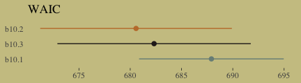<!-- -->

The estimates from model `b10.3`, which might not have the lowest WAIC value, but is the one most clearly corresponding to the structure of the experiment:


```r
print(b10.3)
```

```
##  Family: binomial 
##   Links: mu = logit 
## Formula: pulled_left ~ 1 + prosoc_left + condition:prosoc_left 
##    Data: d (Number of observations: 504) 
## Samples: 4 chains, each with iter = 2000; warmup = 1000; thin = 1;
##          total post-warmup samples = 4000
## 
## Population-Level Effects: 
##                       Estimate Est.Error l-95% CI u-95% CI Eff.Sample Rhat
## Intercept                 0.05      0.12    -0.20     0.29       3643 1.00
## prosoc_left               0.62      0.23     0.17     1.06       2749 1.00
## prosoc_left:condition    -0.10      0.27    -0.63     0.42       2779 1.00
## 
## Samples were drawn using sampling(NUTS). For each parameter, Eff.Sample 
## is a crude measure of effective sample size, and Rhat is the potential 
## scale reduction factor on split chains (at convergence, Rhat = 1).
```

Here's what the odds are multiplied by:


```r
fixef(b10.3)[2] %>%
  exp()
```

```
## [1] 1.850503
```

Given an estimated value of 4, the probability of a pull, all else equal, would be:


```r
invlogit(4)
```

```
## [1] 0.9820138
```

Adding the coefficient, `fixef(b10.3)[2]`, would yield:


```r
(4 + fixef(b10.3)[2]) %>%
  invlogit()
```

```
## [1] 0.9901994
```

For our variant of Figure 10.2., we use `brms::pp_average()` in place of `rethinking::ensemble()`.


```r
# The combined fitted() results of the three models weighted by their WAICs
pp_a <- 
  pp_average(b10.1, b10.2, b10.3,
             weights = "waic",
             method = "fitted") %>%
  as_tibble() %>% 
  bind_cols(b10.3$data) %>% 
  distinct(Estimate, Q2.5, Q97.5, condition, prosoc_left) %>% 
  mutate(x_axis = str_c(prosoc_left, condition, sep = "/")) %>%
  mutate(x_axis = factor(x_axis, levels = c("0/0", "1/0", "0/1", "1/1"))) %>% 
  rename(pulled_left = Estimate)

# The empirically-based summaries
d_plot <-
  d %>%
  group_by(actor, condition, prosoc_left) %>%
  summarise(pulled_left = mean(pulled_left)) %>%
  mutate(x_axis = str_c(prosoc_left, condition, sep = "/")) %>%
  mutate(x_axis = factor(x_axis, levels = c("0/0", "1/0", "0/1", "1/1")))

# The plot
ggplot() +
  geom_ribbon(data = pp_a,
              aes(x = x_axis,
                  ymin = Q2.5, 
                  ymax = Q97.5,
                  group = 0),
              fill = wes_palette("Moonrise2")[2]) +
  geom_line(data = pp_a,
            aes(x = x_axis, 
                y = pulled_left,
                group = 0)) +
  geom_line(data = d_plot,
            aes(x = x_axis, y = pulled_left, group = actor),
            color = wes_palette("Moonrise2")[1], size = 1/3) +
  scale_x_discrete(expand = c(.03, .03)) +
  coord_cartesian(ylim = 0:1) +
  labs(x = "prosoc_left/condition",
       y = "proportion pulled left") +
  theme(axis.ticks.x = element_blank())
```

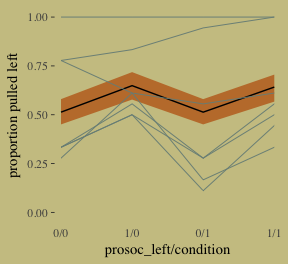<!-- -->

McElreath didn't show the actual pairs plot in the text. Here's ours using `mcmc_pairs()`.


```r
# this helps us set our custom color scheme
color_scheme_set(c(wes_palette("Moonrise2")[3], 
                   wes_palette("Moonrise2")[1], 
                   wes_palette("Moonrise2")[2], 
                   wes_palette("Moonrise2")[2], 
                   wes_palette("Moonrise2")[1], 
                   wes_palette("Moonrise2")[1]))

# the actual plot
mcmc_pairs(x = posterior_samples(b10.3),
           pars = c("b_Intercept", "b_prosoc_left", "b_prosoc_left:condition"),
           off_diag_args = list(size = 1/10, alpha = 1/6),
           diag_fun = "dens")
```

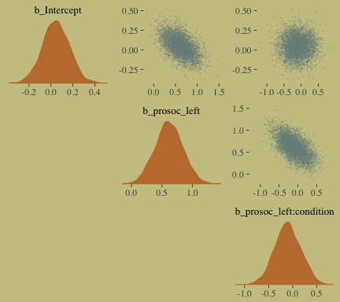<!-- -->

As McElreath asserted, the posterior looks pretty multivariate Gaussian.

Enclosing the `actor` variable within `factor()` will produce the indexing we need to get `actor`-specific intercepts.


```r
b10.4 <-
  brm(data = d, family = binomial,
      pulled_left ~ 0 + factor(actor) + prosoc_left + condition:prosoc_left ,
      prior = c(set_prior("normal(0, 10)", class = "b")),
      chains = 2, iter = 2500, warmup = 500, cores = 2,
      control = list(adapt_delta = 0.9))
```

Within the tidyverse, `distinct()` yields the information you'd otherwise get from `unique()`.


```r
d %>%
  distinct(actor)
```

```
##   actor
## 1     1
## 2     2
## 3     3
## 4     4
## 5     5
## 6     6
## 7     7
```

The posterior summary:


```r
print(b10.4)
```

```
## Warning: There were 1 divergent transitions after warmup. Increasing adapt_delta above 0.9 may help.
## See http://mc-stan.org/misc/warnings.html#divergent-transitions-after-warmup
```

```
##  Family: binomial 
##   Links: mu = logit 
## Formula: pulled_left ~ 0 + factor(actor) + prosoc_left + condition:prosoc_left 
##    Data: d (Number of observations: 504) 
## Samples: 2 chains, each with iter = 2500; warmup = 500; thin = 1;
##          total post-warmup samples = 4000
## 
## Population-Level Effects: 
##                       Estimate Est.Error l-95% CI u-95% CI Eff.Sample Rhat
## factoractor1             -0.74      0.27    -1.28    -0.22       4000 1.00
## factoractor2             10.91      5.22     3.84    23.41       1810 1.00
## factoractor3             -1.05      0.28    -1.60    -0.51       4000 1.00
## factoractor4             -1.05      0.29    -1.63    -0.50       3525 1.00
## factoractor5             -0.74      0.27    -1.28    -0.22       4000 1.00
## factoractor6              0.21      0.27    -0.32     0.75       4000 1.00
## factoractor7              1.81      0.39     1.09     2.61       4000 1.00
## prosoc_left               0.84      0.27     0.32     1.39       2522 1.00
## prosoc_left:condition    -0.14      0.31    -0.74     0.47       3636 1.00
## 
## Samples were drawn using sampling(NUTS). For each parameter, Eff.Sample 
## is a crude measure of effective sample size, and Rhat is the potential 
## scale reduction factor on split chains (at convergence, Rhat = 1).
```

Here's what the `posterior_samples` for `b10.4` looks like:


```r
post <- posterior_samples(b10.4)
 
post %>%
  glimpse()
```

```
## Observations: 4,000
## Variables: 10
## $ b_factoractor1            <dbl> -0.4864574, -1.3058604, -0.2642374, -1.1252677, -1.1052332, -...
## $ b_factoractor2            <dbl> 11.045800, 13.498221, 9.115538, 5.335425, 6.973991, 8.741842,...
## $ b_factoractor3            <dbl> -1.0552088, -0.9494935, -1.1882042, -0.8936645, -1.1812715, -...
## $ b_factoractor4            <dbl> -1.2959134, -1.4280920, -0.8998277, -1.0370899, -0.7647098, -...
## $ b_factoractor5            <dbl> -1.0497013, -0.7819927, -0.7463659, -0.8574204, -0.8120734, -...
## $ b_factoractor6            <dbl> -0.09390899, -0.18852322, 0.53971209, -0.21538838, -0.2237802...
## $ b_factoractor7            <dbl> 1.352978, 2.344229, 1.262324, 1.877243, 1.216007, 2.262792, 1...
## $ b_prosoc_left             <dbl> 1.3107568, 1.0899821, 0.9945761, 0.7085668, 0.7617417, 0.6299...
## $ `b_prosoc_left:condition` <dbl> -0.679560228, 0.017507885, -0.454986913, 0.294882845, 0.31508...
## $ lp__                      <dbl> -290.7846, -292.0805, -290.5599, -289.7259, -291.0326, -290.5...
```

Our variant of Figure 10.3.


```r
post %>%
  ggplot(aes(x = b_factoractor2)) +
  geom_density(color = "transparent",
               fill = wes_palette("Moonrise2")[1]) +
  scale_y_continuous(NULL, breaks = NULL) +
  labs(x = NULL,
       title = "Actor 2's large and uncertain intercept",
       subtitle = "Once your log-odds are above, like, 4, it's all\npretty much a probability of 1.")
```

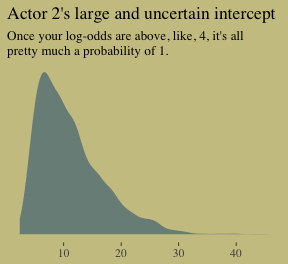<!-- -->

Figure 10.4., the idiographic trajectories for four of our chimps.


```r
d_plot_4 <-
  d_plot %>%
  filter(actor %in% c(3, 5:7)) %>%
  ungroup() %>% 
  mutate(actor = str_c("actor ", actor))

ftd <-
  fitted(b10.4) %>% 
  as_tibble() %>% 
  bind_cols(b10.4$data) %>% 
  filter(actor %in% c(3, 5:7)) %>% 
  distinct(Estimate, Q2.5, Q97.5, condition, prosoc_left, actor) %>% 
  select(actor, everything()) %>% 
  mutate(actor = str_c("actor ", actor)) %>% 
  mutate(x_axis = str_c(prosoc_left, condition, sep = "/")) %>%
  mutate(x_axis = factor(x_axis, levels = c("0/0", "1/0", "0/1", "1/1"))) %>% 
  rename(pulled_left = Estimate)

  ggplot(data = ftd,
         aes(x = x_axis, y = pulled_left, group = actor)) +
  geom_ribbon(aes(x = x_axis,
                  ymin = Q2.5, 
                  ymax = Q97.5),
              fill = wes_palette("Moonrise2")[2]) +
  geom_line(aes(x = x_axis, 
                y = pulled_left)) +
  geom_line(data = d_plot_4,
            color = wes_palette("Moonrise2")[1], size = 1.25) +
  scale_x_discrete(expand = c(.03, .03)) +
  coord_cartesian(ylim = 0:1) +
  labs(x = "prosoc_left/condition",
       y = "proportion pulled left") +
  theme(axis.ticks.x = element_blank(),
        # color came from: http://www.color-hex.com/color/ccc591
        panel.background = element_rect(fill = "#d1ca9c",
                                        color = "transparent")) +
  facet_wrap(~actor)
```

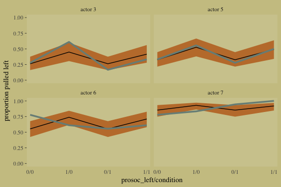<!-- -->

### 10.1.2. Aggregated binomial: Chimpanzees again, condensed.

With the tidyverse, we use `group_by()` and `summarise()` to achieve what McElreath did with `aggregate()`.


```r
d_aggregated <-
  d %>%
  select(-recipient, -block, -trial, -chose_prosoc) %>%
  group_by(actor, condition, prosoc_left) %>%
  summarise(x = sum(pulled_left))

d_aggregated %>%
  slice(1:8)
```

```
## # A tibble: 28 x 4
## # Groups: actor, condition [14]
##    actor condition prosoc_left     x
##    <int>     <int>       <int> <int>
##  1     1         0           0     6
##  2     1         0           1     9
##  3     1         1           0     5
##  4     1         1           1    10
##  5     2         0           0    18
##  6     2         0           1    18
##  7     2         1           0    18
##  8     2         1           1    18
##  9     3         0           0     5
## 10     3         0           1    11
## # ... with 18 more rows
```

To fit an aggregated binomial model in brms, we use the `[criterion] | trials()` syntax where the value that goes in `trials()` is either a fixed number, as in this case, or an index variable.


```r
b10.5 <-
  brm(data = d_aggregated, family = binomial,
      x | trials(18) ~ 1 + prosoc_left + condition:prosoc_left ,
      prior = c(set_prior("normal(0, 10)", class = "Intercept"),
                set_prior("normal(0, 10)", class = "b")),
      iter = 2500, warmup = 500, cores = 2, chains = 2)
```

We might compare `b10.3` with `b10.5` like this.


```r
fixef(b10.3) %>% round(digits = 2)
```

```
##                       Estimate Est.Error  Q2.5 Q97.5
## Intercept                 0.05      0.12 -0.20  0.29
## prosoc_left               0.62      0.23  0.17  1.06
## prosoc_left:condition    -0.10      0.27 -0.63  0.42
```

```r
fixef(b10.5) %>% round(digits = 2)
```

```
##                       Estimate Est.Error  Q2.5 Q97.5
## Intercept                 0.05      0.13 -0.20  0.29
## prosoc_left               0.61      0.23  0.17  1.07
## prosoc_left:condition    -0.11      0.26 -0.62  0.42
```

Close within rounding error.

### 10.1.3. Aggregated binomial: Graduate school admissions.

The infamous `UCBadmit` data:


```r
# detach(package:brms)
library(rethinking)
data(UCBadmit)
d <- UCBadmit
```

Switching from rethinking to brms.


```r
detach(package:rethinking)
library(brms)
rm(UCBadmit)

d
```

```
##    dept applicant.gender admit reject applications
## 1     A             male   512    313          825
## 2     A           female    89     19          108
## 3     B             male   353    207          560
## 4     B           female    17      8           25
## 5     C             male   120    205          325
## 6     C           female   202    391          593
## 7     D             male   138    279          417
## 8     D           female   131    244          375
## 9     E             male    53    138          191
## 10    E           female    94    299          393
## 11    F             male    22    351          373
## 12    F           female    24    317          341
```

Here's our newly-constructed predictor, `male`, and the models that do/do not put it to work.


```r
d <- 
  d %>%
  mutate(male = ifelse(applicant.gender == "male", 1, 0))

b10.6 <-
  brm(data = d, family = binomial,
      admit | trials(applications) ~ 1 + male ,
      prior = c(set_prior("normal(0, 10)", class = "Intercept"),
                set_prior("normal(0, 10)", class = "b")),
      iter = 2500, warmup = 500, cores = 2, chains = 2)

b10.7 <-
  brm(data = d, family = binomial,
      admit | trials(applications) ~ 1,
      prior = c(set_prior("normal(0, 10)", class = "Intercept")),
      iter = 2500, warmup = 500, cores = 2, chains = 2)
```

The WAIC comparison:


```r
waic(b10.6, b10.7)
```

```
##                  WAIC     SE
## b10.6          992.46 329.62
## b10.7         1043.89 326.66
## b10.6 - b10.7  -51.43 167.38
```

##### Information criteria digression.

Let's see what happens if we switch to the LOO.


```r
l_b10.6 <- loo(b10.6)
```

```
## Warning: Found 6 observations with a pareto_k > 0.7 in model 'b10.6'. It is recommended to set
## 'reloo = TRUE' in order to calculate the ELPD without the assumption that these observations are
## negligible. This will refit the model 6 times to compute the ELPDs for the problematic observations
## directly.
```

```r
l_b10.7 <- loo(b10.7)
```

```
## Warning: Found 4 observations with a pareto_k > 0.7 in model 'b10.7'. It is recommended to set
## 'reloo = TRUE' in order to calculate the ELPD without the assumption that these observations are
## negligible. This will refit the model 4 times to compute the ELPDs for the problematic observations
## directly.
```

If you just ape the text and use the WAIC, everything appears fine. But holy smokes look at those nasty warning messages from the `loo()`! One of the frightening but ultimately handy things about working with the PSIS-LOO is that it requires we estimate a Pareto $k$ parameter, which you can learn all about in the `loo-package` section of the [loo reference manual](https://cran.r-project.org/web/packages/loo/loo.pdf). As it turns out, the Pareto $k$ parameter which [can be used as a diagnostic tool](https://cran.r-project.org/web/packages/loo/vignettes/loo2-example.html#plotting-pareto-k-diagnostics). Each case in the data gets its own $k$ value and we like it when those $k$s are low. The makers of the loo package get worried when those $k$s exceed 0.7 and as a result, `loo()` spits out a warning message when they do.

First things first, if you explicitly open the loo package, you’ll have access to some handy diagnostic functions.


```r
library(loo)
```

Using the loo-object for model `b10.6`, which we've named `l_b10.6`, let's take a look at the `pareto_k_table()` function.


```r
pareto_k_table(l_b10.6) 
```

```
## Pareto k diagnostic values:
##                          Count Pct.    Min. n_eff
## (-Inf, 0.5]   (good)     5     41.7%   383       
##  (0.5, 0.7]   (ok)       1      8.3%   166       
##    (0.7, 1]   (bad)      1      8.3%   52        
##    (1, Inf)   (very bad) 5     41.7%   1
```

You may have noticed that this same table pops out when you just do something like `loo(b10.6)`. Recall that this data set has 12 observations (i.e., `count(d)`). With `pareto_k_table()`, we see how the Pareto $k$ values have been categorized into bins ranging from "good" to "very bad". Clearly, we like nice and low $k$s. In this example, our observations are all over the place, with 5 in the "bad" $k$ range We can take a closer look like this:


```r
plot(l_b10.6)
```

<!-- -->

So when you `plot()` a loo object, you get a nice diagnostic plot for those $k$ value, ordered by observation number. Our plot indicates cases 1, 3, 11, and 12 had "very bad" $k$ values for this model. If we wanted to further verify to ourselves which observations those were, we'd use the `pareto_k_ids()` function.


```r
pareto_k_ids(l_b10.6, threshold = 1)
```

```
## [1]  1  2  3 11 12
```

Note our use of the `threshold` argument. Play around with it to see how it works.

If you want an explicit look at those $k$ values, you do:


```r
l_b10.6$diagnostics
```

```
## $pareto_k
##  [1] 2.0253259 1.0310272 1.4248475 0.1743877 0.4474604 0.6843733 0.8140350 0.4997591 0.4971078
## [10] 0.4801012 2.2180646 1.4804552
## 
## $n_eff
##  [1]    1.473677   10.327033    2.953097 3165.231485 1042.629721  166.286689   51.933336  809.747837
##  [9]  602.375823  382.837396    1.336624    2.645434
```

The `pareto_k` values can be used to examine cases that are overly-influential on the model parameters, something like a Cook's $D_{i}$. See, for example [this discussion on stackoverflow.com](https://stackoverflow.com/questions/39578834/linear-model-diagnostics-for-bayesian-models-using-rstan/39595436) in which several members of the [Stan team](http://mc-stan.org) weighed in. The issue is also discussed in [this paper](https://arxiv.org/abs/1507.04544) and in [this presentation by Aki Vehtari](https://www.youtube.com/watch?v=FUROJM3u5HQ&feature=youtu.be&a=).

Anyway, the implication of all this is that these values suggest that model `b10.6` isn't a great fit for these data.

Part of the warning message for model `b10.6` read: 

>It is recommended to set 'reloo = TRUE' in order to calculate the ELPD without the assumption that these observations are negligible. This will refit the model 6 times to compute the ELPDs for the problematic observations directly.

Well, let's do that:


```r
l_b10.6_reloo <- loo(b10.6, reloo = T)
```


```r
l_b10.6_reloo
```

```
## 
## Computed from 4000 by 12 log-likelihood matrix
## 
##          Estimate    SE
## elpd_loo   -518.1 171.6
## p_loo       133.8  52.4
## looic      1036.1 343.2
## ------
## Monte Carlo SE of elpd_loo is NA.
## 
## Pareto k diagnostic values:
##                          Count Pct.    Min. n_eff
## (-Inf, 0.5]   (good)     11    91.7%   1         
##  (0.5, 0.7]   (ok)        1     8.3%   166       
##    (0.7, 1]   (bad)       0     0.0%   <NA>      
##    (1, Inf)   (very bad)  0     0.0%   <NA>      
## 
## All Pareto k estimates are ok (k < 0.7).
## See help('pareto-k-diagnostic') for details.
```

Now that looks better. We'll do the same thing for model b10.7. 


```r
l_b10.7_reloo <- loo(b10.7, reloo = T)
```

Okay, let's compare our PSIS-LOO values before and after adjusting `loo()` with `reloo = T`.


```r
compare_ic(l_b10.6, l_b10.7)
```

```
##                 LOOIC     SE
## b10.6          964.09 316.48
## b10.7         1028.48 319.79
## b10.6 - b10.7  -64.39 161.89
```

```r
compare_ic(l_b10.6_reloo, l_b10.7_reloo)
```

```
##                 LOOIC     SE
## b10.6         1036.15 343.20
## b10.7         1049.20 329.92
## b10.6 - b10.7  -13.05 157.67
```

In this case, the results are kinda similar. But holy smokes, look at the size of those *SE*s! Anyway, watch out for this in your real-world data. You also might check out this [vignette on how the loo package’s Pareto $k$ can help detect outliers](https://github.com/ASKurz/Student-s-t_regression).

But this has all been a tangent from the central thrust of this section. Let's get back on track. Here's a look at `b10.6`, the unavailable model:


```r
print(b10.6)
```

```
##  Family: binomial 
##   Links: mu = logit 
## Formula: admit | trials(applications) ~ 1 + male 
##    Data: d (Number of observations: 12) 
## Samples: 2 chains, each with iter = 2500; warmup = 500; thin = 1;
##          total post-warmup samples = 4000
## 
## Population-Level Effects: 
##           Estimate Est.Error l-95% CI u-95% CI Eff.Sample Rhat
## Intercept    -0.83      0.05    -0.93    -0.74       2316 1.00
## male          0.61      0.06     0.48     0.73       2703 1.00
## 
## Samples were drawn using sampling(NUTS). For each parameter, Eff.Sample 
## is a crude measure of effective sample size, and Rhat is the potential 
## scale reduction factor on split chains (at convergence, Rhat = 1).
```


```r
fixef(b10.6)[2] %>%
  exp() %>%
  round(digits = 2)
```

```
## [1] 1.85
```

The difference in admission probabilities.


```r
post <- posterior_samples(b10.6)

post %>%
  mutate(p_admit_male   = invlogit(b_Intercept + b_male),
         p_admit_female = invlogit(b_Intercept),
         diff_admit     = p_admit_male - p_admit_female) %>%
  summarise(`2.5%`  = quantile(diff_admit, probs = .025),
            `50%`   = median(diff_admit),
            `97.5%` = quantile(diff_admit, probs = .975))
```

```
##        2.5%       50%     97.5%
## 1 0.1130499 0.1423233 0.1691757
```

Here's our version of Figure 10.5.


```r
d <-
  d %>%
  mutate(case = factor(1:12))

p_10.6 <- 
  predict(b10.6) %>% 
  as_tibble() %>% 
  bind_cols(d)

d_text <-
  d %>%
  group_by(dept) %>%
  summarise(case = mean(as.numeric(case)),
            admit = mean(admit/applications) + .05)

ggplot(data = d, aes(x = case, y = admit/applications)) +
  geom_pointrange(data = p_10.6, 
                  aes(y = Estimate/applications,
                      ymin = Q2.5/applications ,
                      ymax = Q97.5/applications),
                  color = wes_palette("Moonrise2")[1],
                  shape = 1, alpha = 1/3) +
  geom_point(color = wes_palette("Moonrise2")[2]) +
  geom_line(aes(group = dept),
            color = wes_palette("Moonrise2")[2]) +
  geom_text(data = d_text,
            aes(y = admit, label = dept),
            color = wes_palette("Moonrise2")[2],
            family = "serif") +
  coord_cartesian(ylim = 0:1) +
  labs(y = "Proportion admitted",
       title = "Posterior validation check") +
  theme(axis.ticks.x = element_blank())
```

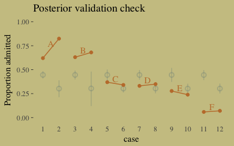<!-- -->

As alluded to in all that LOO/`pareto_k` talk, above, this is not a great fit.

We don't need to coerce an index. But here are the models.


```r
b10.8 <-
  brm(data = d, family = binomial,
      admit | trials(applications) ~ 0 + dept,
      prior = c(set_prior("normal(0, 10)", class = "b")),
      iter = 2500, warmup = 500, cores = 2, chains = 2)

b10.9 <-
  brm(data = d, family = binomial,
      admit | trials(applications) ~ 0 + dept + male ,
      prior = c(set_prior("normal(0, 10)", class = "b")),
      iter = 2500, warmup = 500, cores = 2, chains = 2)
```

Here we compare all four models by the LOO.


```r
loos <- loo(b10.6, b10.7, b10.8, b10.9, 
            reloo = T,
            cores = 2)
```


```r
loos
```

```
##                 LOOIC     SE
## b10.6         1033.48 338.32
## b10.7         1063.37 335.46
## b10.8          135.28  35.99
## b10.9          138.36  32.41
## b10.6 - b10.7  -29.89 161.46
## b10.6 - b10.8  898.20 328.31
## b10.6 - b10.9  895.12 331.52
## b10.7 - b10.8  928.09 319.42
## b10.7 - b10.9  925.00 323.65
## b10.8 - b10.9   -3.09   6.46
```

The parameters summaries for our multivariable model, `b10.9`, look like this:


```r
fixef(b10.9) %>% round(digits = 2)
```

```
##       Estimate Est.Error  Q2.5 Q97.5
## deptA     0.68      0.10  0.48  0.87
## deptB     0.64      0.12  0.41  0.86
## deptC    -0.58      0.08 -0.74 -0.44
## deptD    -0.62      0.09 -0.79 -0.45
## deptE    -1.06      0.10 -1.25 -0.87
## deptF    -2.64      0.16 -2.96 -2.34
## male     -0.10      0.08 -0.26  0.07
```

Since we've been using brms, there's no need to fit our version of McElreath's `m10.9stan`. We already have that in our `b10.9`. But just for kicks and giggles, here's another way to get the model summary. 


```r
b10.9$fit
```

```
## Inference for Stan model: binomial brms-model.
## 2 chains, each with iter=2500; warmup=500; thin=1; 
## post-warmup draws per chain=2000, total post-warmup draws=4000.
## 
##           mean se_mean   sd   2.5%    25%    50%    75%  97.5% n_eff Rhat
## b_deptA   0.68    0.00 0.10   0.48   0.61   0.68   0.74   0.87  2306    1
## b_deptB   0.64    0.00 0.12   0.41   0.56   0.64   0.71   0.86  2350    1
## b_deptC  -0.58    0.00 0.08  -0.74  -0.64  -0.58  -0.53  -0.44  4000    1
## b_deptD  -0.62    0.00 0.09  -0.79  -0.67  -0.62  -0.56  -0.45  4000    1
## b_deptE  -1.06    0.00 0.10  -1.25  -1.13  -1.06  -1.00  -0.87  4000    1
## b_deptF  -2.64    0.00 0.16  -2.96  -2.75  -2.64  -2.53  -2.34  4000    1
## b_male   -0.10    0.00 0.08  -0.26  -0.15  -0.10  -0.04   0.07  1799    1
## lp__    -70.71    0.04 1.85 -75.10 -71.72 -70.41 -69.33 -68.10  1861    1
## 
## Samples were drawn using NUTS(diag_e) at Sat May 26 22:43:30 2018.
## For each parameter, n_eff is a crude measure of effective sample size,
## and Rhat is the potential scale reduction factor on split chains (at 
## convergence, Rhat=1).
```

Here's our version of Figure 10.6, the posterior validation check.


```r
predict(b10.9) %>%
  as_tibble() %>% 
  bind_cols(d) %>% 

  ggplot(aes(x = case, y = admit/applications)) +
  geom_pointrange(aes(y = Estimate/applications,
                      ymin = Q2.5/applications ,
                      ymax = Q97.5/applications),
                  color = wes_palette("Moonrise2")[1],
                  shape = 1, alpha = 1/3) +
  geom_point(color = wes_palette("Moonrise2")[2]) +
  geom_line(aes(group = dept),
            color = wes_palette("Moonrise2")[2]) +
  geom_text(data = d_text,
            aes(y = admit, label = dept),
            color = wes_palette("Moonrise2")[2],
            family = "serif") +
  coord_cartesian(ylim = 0:1) +
  labs(y = "Proportion admitted",
       title = "Posterior validation check") +
  theme(axis.ticks.x = element_blank())
```

<!-- -->

Imperfect, but way more valid than before.

### 10.1.4. Fitting binomial regressions with `glm()`.

We're not here to learn frequentist code, so we're going to skip most of this section. But model `b.good` is worth fitting. Here's the data.


```r
# outcome and predictor almost perfectly associated
y <- c(rep(0, 10), rep(1, 10))

x <- c(rep(-1, 9), rep(1, 11))
```

The `b.good` model:


```r
b.good <-
  brm(data = list(y = y, x = x), family = binomial,
      y ~ 1 + x,
      prior = c(set_prior("normal(0, 10)", class = "Intercept"),
                set_prior("normal(0, 10)", class = "b")))
```

Our model summary will differ a bit from the one in the text. It seems this is because of the MAP/HMC contrast.


```r
print(b.good)
```

```
##  Family: binomial 
##   Links: mu = logit 
## Formula: y ~ 1 + x 
##    Data: list(y = y, x = x) (Number of observations: 20) 
## Samples: 4 chains, each with iter = 2000; warmup = 1000; thin = 1;
##          total post-warmup samples = 4000
## 
## Population-Level Effects: 
##           Estimate Est.Error l-95% CI u-95% CI Eff.Sample Rhat
## Intercept    -5.28      4.22   -15.07     0.27        359 1.01
## x             8.07      4.21     2.55    17.62        352 1.01
## 
## Samples were drawn using sampling(NUTS). For each parameter, Eff.Sample 
## is a crude measure of effective sample size, and Rhat is the potential 
## scale reduction factor on split chains (at convergence, Rhat = 1).
```

Here's the `pairs()` plot McElreath excluded from the text:


```r
pairs(b.good,
      off_diag_args = list(size = 1/10, alpha = 1/6))
```

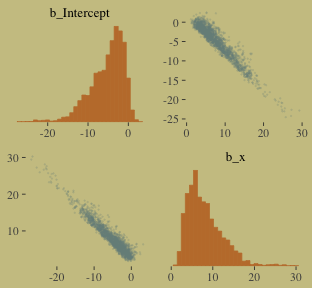<!-- -->

This plot deserves and extensive quote from McElreath. "Inspecting the pairs plot ~~(not shown)~~ demonstrates just how subtle even simple models can be, once we start working with GLMs. I don't say this to scare the reader. But it's true that even simple models can behave in complicated ways. How you fit the model is part of the model, and in principle no GLM is safe for MAP estimation."

## 10.2. Poisson regression

We'll simulate our sweet count data.


```r
set.seed(9968400) # making the results reproducible

y <- rbinom(1e5, 1000, 1/1000)

y %>%
  mean()
```

```
## [1] 0.99545
```

```r
y %>%
  var()
```

```
## [1] 0.9935792
```


```r
library(rethinking)
data(Kline)
d <- Kline
```

Switching from rethinking to brms.


```r
detach(package:rethinking)
library(brms)
rm(Kline)

d
```

```
##       culture population contact total_tools mean_TU
## 1    Malekula       1100     low          13     3.2
## 2     Tikopia       1500     low          22     4.7
## 3  Santa Cruz       3600     low          24     4.0
## 4         Yap       4791    high          43     5.0
## 5    Lau Fiji       7400    high          33     5.0
## 6   Trobriand       8000    high          19     4.0
## 7       Chuuk       9200    high          40     3.8
## 8       Manus      13000     low          28     6.6
## 9       Tonga      17500    high          55     5.4
## 10     Hawaii     275000     low          71     6.6
```

Here are our new columns.


```r
d <-
  d %>%
  mutate(log_pop = log(population),
         contact_high = ifelse(contact == "high", 1, 0))
```

Our first Poisson model!


```r
b10.10 <-
  brm(data = d, family = poisson,
      total_tools ~ 1 + log_pop + contact_high + contact_high:log_pop,
      prior = c(set_prior("normal(0, 100)", class = "Intercept"),
                set_prior("normal(0, 1)", class = "b")),
      iter = 3000, warmup = 1000, chains = 4, cores = 4)
```


```r
print(b10.10)
```

```
##  Family: poisson 
##   Links: mu = log 
## Formula: total_tools ~ 1 + log_pop + contact_high + contact_high:log_pop 
##    Data: d (Number of observations: 10) 
## Samples: 4 chains, each with iter = 3000; warmup = 1000; thin = 1;
##          total post-warmup samples = 8000
## 
## Population-Level Effects: 
##                      Estimate Est.Error l-95% CI u-95% CI Eff.Sample Rhat
## Intercept                0.95      0.35     0.24     1.63       4279 1.00
## log_pop                  0.26      0.03     0.20     0.33       4556 1.00
## contact_high            -0.06      0.85    -1.71     1.62       2530 1.00
## log_pop:contact_high     0.04      0.09    -0.14     0.22       2544 1.00
## 
## Samples were drawn using sampling(NUTS). For each parameter, Eff.Sample 
## is a crude measure of effective sample size, and Rhat is the potential 
## scale reduction factor on split chains (at convergence, Rhat = 1).
```

Here's the simple matrix of correlation point estimates for the parameters.


```r
post <-
  posterior_samples(b10.10)

post %>%
  select(-lp__) %>% 
  rename(b_interaction = `b_log_pop:contact_high`) %>%
  cor() %>% 
  round(digits = 2)
```

```
##                b_Intercept b_log_pop b_contact_high b_interaction
## b_Intercept           1.00     -0.97          -0.14          0.07
## b_log_pop            -0.97      1.00           0.13         -0.09
## b_contact_high       -0.14      0.13           1.00         -0.99
## b_interaction         0.07     -0.09          -0.99          1.00
```

And here's the coefficient plot:


```r
# We'll set a renewed color theme
color_scheme_set(c(wes_palette("Moonrise2")[2],
                   wes_palette("Moonrise2")[1], 
                   wes_palette("Moonrise2")[4], 
                   wes_palette("Moonrise2")[2], 
                   wes_palette("Moonrise2")[1], 
                   wes_palette("Moonrise2")[1]))

post %>%
  select(-lp__) %>% 
  rename(b_interaction = `b_log_pop:contact_high`) %>%

  mcmc_intervals(prob = .5, prob_outer = .95) +
  theme(axis.ticks.y = element_blank(),
        axis.text.y = element_text(hjust = 0))
```

<!-- -->

How plausible is it a high-contact island will have more tools than a low-contact island?


```r
post <-
  post %>%
  mutate(lambda_high = exp(b_Intercept + b_contact_high + (b_log_pop + `b_log_pop:contact_high`)*8),
         lambda_low = exp(b_Intercept + b_log_pop*8),
         diff = lambda_high - lambda_low) 

post %>%
  summarise(sum = sum(diff > 0)/length(diff))
```

```
##      sum
## 1 0.9545
```

Quite.

Here we are, Figure 10.8.a.


```r
post %>%
  ggplot(aes(x = diff)) +
  geom_density(color = "transparent",
               fill = wes_palette("Moonrise2")[1]) +
  geom_vline(xintercept = 0, linetype = 2,
             color = wes_palette("Moonrise2")[2]) +
  scale_y_continuous(NULL, breaks = NULL) +
  labs(x = "lambda_high - lambda_low")
```

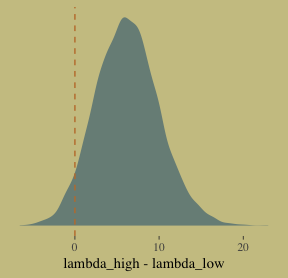<!-- -->

I’m not happy with how clunky this solution is, but one way to get those marginal dot and line plots for the axes is to make intermediary tibbles. Anyway, here’s a version of Figure 10.8.b.


```r
# Intermediary tibbles for our the dot and line portoin of the plot
point_tibble <-
  tibble(x = c(median(post$b_contact_high), min(post$b_contact_high)),
         
         y = c(min(post$`b_log_pop:contact_high`), median(post$`b_log_pop:contact_high`)))

line_tibble <-
  tibble(parameter = rep(c("b_contact_high", "b_log_pop:contact_high"), each = 2),
         
         x = c(quantile(post$b_contact_high, probs = c(.025, .975)),
               rep(min(post$b_contact_high), times = 2)),
         
         y = c(rep(min(post$`b_log_pop:contact_high`), times = 2),
               quantile(post$`b_log_pop:contact_high`, probs = c(.025, .975))))

# the plot
post %>% 
  ggplot(aes(x = b_contact_high, y = `b_log_pop:contact_high`)) +
  geom_point(color = wes_palette("Moonrise2")[1],
             size = 1/10, alpha = 1/10) +
  geom_point(data = point_tibble,
             aes(x = x, y = y)) +
  geom_line(data = line_tibble,
            aes(x = x, y = y, group = parameter))
```

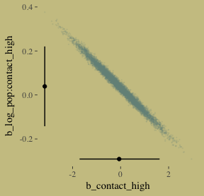<!-- -->

Here we deconstruct model `b10.10`, bit by bit. While we're at it, we'll practice our `brms::update()` skills.


```r
# no interaction
b10.11 <- 
  update(b10.10, formula = total_tools ~ 1 + log_pop + contact_high,
         iter = 3000, warmup = 1000, chains = 4, cores = 4)

# no contact rate
b10.12 <-
  update(b10.10, formula = total_tools ~ 1 + log_pop,
         iter = 3000, warmup = 1000, chains = 4, cores = 4)

# no log-population
b10.13 <-
  update(b10.10, formula = total_tools ~ 1 + contact_high,
         iter = 3000, warmup = 1000, chains = 4, cores = 4)

# intercept only
b10.14 <-
  update(b10.10, formula = total_tools ~ 1,
         iter = 3000, warmup = 1000, chains = 4, cores = 4)
```


I know we got all excited with the LOO, above. Let's just be lazy and go WAIC, here. [Though beware, the LOO opens up a similar can of worms, here, to what we dealt with above.]


```r
w_b10.10 <- waic(b10.10)
w_b10.11 <- waic(b10.11)
w_b10.12 <- waic(b10.12)
w_b10.13 <- waic(b10.13)
w_b10.14 <- waic(b10.14)
 
compare_ic(w_b10.10, w_b10.11, w_b10.12, w_b10.13, w_b10.14)
```

```
##                   WAIC    SE
## b10.10           80.03 11.83
## b10.11           78.88 11.67
## b10.12           84.38  9.40
## b10.13          150.93 47.82
## b10.14          141.85 33.63
## b10.10 - b10.11   1.15  1.26
## b10.10 - b10.12  -4.35  7.92
## b10.10 - b10.13 -70.90 47.83
## b10.10 - b10.14 -61.82 35.08
## b10.11 - b10.12  -5.50  8.39
## b10.11 - b10.13 -72.05 47.57
## b10.11 - b10.14 -62.97 34.81
## b10.12 - b10.13 -66.54 47.57
## b10.12 - b10.14 -57.47 33.51
## b10.13 - b10.14   9.07 17.41
```


```r
tibble(model = c("b10.10", "b10.11", "b10.12", "b10.13", "b10.14"),
       waic  = c(w_b10.10$estimates[3, 1], w_b10.11$estimates[3, 1], w_b10.12$estimates[3, 1], w_b10.13$estimates[3, 1], w_b10.14$estimates[3, 1]),
       se    = c(w_b10.10$estimates[3, 2], w_b10.11$estimates[3, 2], w_b10.12$estimates[3, 2], w_b10.13$estimates[3, 2], w_b10.14$estimates[3, 2])) %>%

  ggplot() +
  geom_pointrange(aes(x = reorder(model, -waic), y = waic,
                      ymin = waic - se,
                      ymax = waic + se,
                      color = model),
                  shape = 16) +
  scale_color_manual(values = wes_palette("Moonrise2")[c(1, 2, 1, 1, 1)]) +
  coord_flip() +
  labs(x = NULL, y = NULL,
       title = "WAIC") +
  theme(axis.ticks.y = element_blank(),
        legend.position = "none")
```

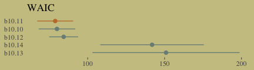<!-- -->

Here's our version of Figure 10.9. Recall, to do an "ensemble" posterior prediction in brms, one uses the `pp_average()` function. I know we were just lazy and focused on the WAIC. But let's play around, a bit. Here we'll weight the models based on the LOO by adding  `weights = "loo"` to the `pp_average()` function. If you check the corresponding section of the [brms reference manual](https://cran.r-project.org/web/packages/brms/brms.pdf), you'll find several weighting schemes.


```r
nd <-
  tibble(log_pop = rep(seq(from = 6.5, 
                           to = 13, 
                           length.out = 50),
                       times = 2),
         contact_high = rep(0:1, each = 50))

ppa_10.9 <- 
  pp_average(b10.10, b10.11, b10.12,
             weights = "loo",
             method = "fitted",
             newdata = nd) %>%
  as_tibble() %>%
  bind_cols(nd)

ppa_10.9 %>%
  ggplot(aes(x = log_pop,
             group = contact_high)) +
  geom_ribbon(aes(ymin = Q2.5,
                  ymax = Q97.5,
                  fill = contact_high),
              alpha = 1/4) +
  geom_line(aes(y = Estimate, color = contact_high)) +
  geom_text(data = d, 
             aes(y = total_tools,
                 label = total_tools,
                 color = contact_high),
             size = 3.5) +
  coord_cartesian(xlim = c(7.1, 12.4),
                  ylim = c(12, 70)) +
    labs(x = "log population",
         y = "total tools",
         subtitle = "Blue is the high contact rate and black is the low.") +
  theme(legend.position = "none",
        panel.border = element_blank())
```

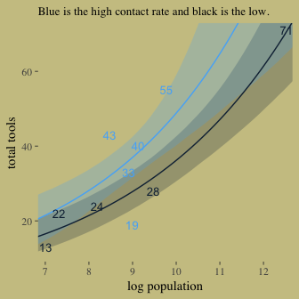<!-- -->

In case you were curious, here are those LOO weights:


```r
model_weights(b10.10, b10.11, b10.12, 
              weights = "loo")
```

```
##     b10.10     b10.11     b10.12 
## 0.31737187 0.64741354 0.03521459
```

### 10.2.2. MCMC islands.

We fit our analogue to `m10.10stan`, `b10.10`, some time ago. 


```r
print(b10.10)
```

```
##  Family: poisson 
##   Links: mu = log 
## Formula: total_tools ~ 1 + log_pop + contact_high + contact_high:log_pop 
##    Data: d (Number of observations: 10) 
## Samples: 4 chains, each with iter = 3000; warmup = 1000; thin = 1;
##          total post-warmup samples = 8000
## 
## Population-Level Effects: 
##                      Estimate Est.Error l-95% CI u-95% CI Eff.Sample Rhat
## Intercept                0.95      0.35     0.24     1.63       4279 1.00
## log_pop                  0.26      0.03     0.20     0.33       4556 1.00
## contact_high            -0.06      0.85    -1.71     1.62       2530 1.00
## log_pop:contact_high     0.04      0.09    -0.14     0.22       2544 1.00
## 
## Samples were drawn using sampling(NUTS). For each parameter, Eff.Sample 
## is a crude measure of effective sample size, and Rhat is the potential 
## scale reduction factor on split chains (at convergence, Rhat = 1).
```

Here's the x-centered version.


```r
d <-
  d %>%
  mutate(log_pop_c = log_pop - mean(log_pop))

b10.10.c <-
  brm(data = d, family = poisson,
      total_tools ~ 1 + log_pop_c + contact_high + contact_high:log_pop_c,
      prior = c(set_prior("normal(0, 10)", class = "Intercept"),
                set_prior("normal(0, 10)", class = "b")),
      iter = 3000, warmup = 1000, chains = 4, cores = 4)
```

The results of our centering:


```r
print(b10.10.c)
```

```
##  Family: poisson 
##   Links: mu = log 
## Formula: total_tools ~ 1 + log_pop_c + contact_high + contact_high:log_pop_c 
##    Data: d (Number of observations: 10) 
## Samples: 4 chains, each with iter = 3000; warmup = 1000; thin = 1;
##          total post-warmup samples = 8000
## 
## Population-Level Effects: 
##                        Estimate Est.Error l-95% CI u-95% CI Eff.Sample Rhat
## Intercept                  3.31      0.09     3.13     3.49       5691 1.00
## log_pop_c                  0.26      0.04     0.19     0.34       5693 1.00
## contact_high               0.29      0.12     0.05     0.52       6656 1.00
## log_pop_c:contact_high     0.06      0.17    -0.27     0.40       6946 1.00
## 
## Samples were drawn using sampling(NUTS). For each parameter, Eff.Sample 
## is a crude measure of effective sample size, and Rhat is the potential 
## scale reduction factor on split chains (at convergence, Rhat = 1).
```

Figure 10.10.a. 


```r
# this helps us set our custom color scheme
color_scheme_set(c(wes_palette("Moonrise2")[3], 
                   wes_palette("Moonrise2")[1], 
                   wes_palette("Moonrise2")[2], 
                   wes_palette("Moonrise2")[2], 
                   wes_palette("Moonrise2")[1], 
                   wes_palette("Moonrise2")[1]))

# the actual plot
mcmc_pairs(x = posterior_samples(b10.10),
           pars = c("b_Intercept", "b_log_pop", "b_contact_high", "b_log_pop:contact_high"),
           off_diag_args = list(size = 1/10, alpha = 1/10),
           diag_fun = "dens")
```

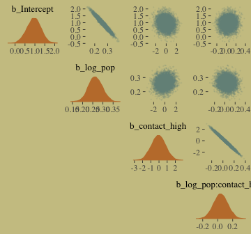<!-- -->

Figure 10.10.b. 


```r
mcmc_pairs(x = posterior_samples(b10.10.c),
           pars = c("b_Intercept", "b_log_pop_c", "b_contact_high", "b_log_pop_c:contact_high"),
           off_diag_args = list(size = 1/10, alpha = 1/10),
           diag_fun = "dens")
```

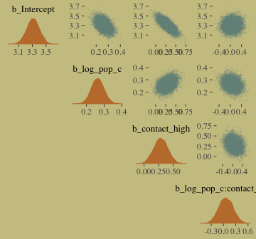<!-- -->

If you really want the correlation point estimates, `lowerCor()` from the [psych package](https://cran.r-project.org/web/packages/psych/index.html) gives a nice way to get the lower triangle of the matrix.


```r
library(psych)

lowerCor(posterior_samples(b10.10)[, 1:4])
```

```
##                        b_Int b_lg_ b_cn_ b__:_
## b_Intercept             1.00                  
## b_log_pop              -0.97  1.00            
## b_contact_high         -0.14  0.13  1.00      
## b_log_pop:contact_high  0.07 -0.09 -0.99  1.00
```

```r
lowerCor(posterior_samples(b10.10.c)[, 1:4])
```

```
##                          b_Int b_l__ b_cn_ b___:
## b_Intercept               1.00                  
## b_log_pop_c              -0.48  1.00            
## b_contact_high           -0.76  0.37  1.00      
## b_log_pop_c:contact_high  0.09 -0.22 -0.25  1.00
```

### 10.2.3. Example: Exposure and the offset.

Here we simulate our data.


```r
set.seed(3838) # making it reproducible 

num_days <- 30
y <- rpois(num_days, 1.5)
```


```r
set.seed(3838) # making it reproducible 

num_weeks <- 4
y_new <- rpois(num_weeks, 0.5*7)
```

Let's make them tidy.


```r
(
  d <- 
  tibble(y = c(y, y_new), 
         days = c(rep(1, 30), rep(7, 4)),
         monastery = c(rep(0, 30), rep(1, 4)))
)
```

```
## # A tibble: 34 x 3
##        y  days monastery
##    <int> <dbl>     <dbl>
##  1     1  1.00         0
##  2     2  1.00         0
##  3     1  1.00         0
##  4     1  1.00         0
##  5     1  1.00         0
##  6     2  1.00         0
##  7     0  1.00         0
##  8     1  1.00         0
##  9     1  1.00         0
## 10     0  1.00         0
## # ... with 24 more rows
```

Here we compute the offset and fit the model. With the brms package, you use the `offset()` syntax, in which you put a pre-processed variable like `log_days` or the log of a variable, such as `log(days)`.


```r
d <-
  d %>%
  mutate(log_days = log(days))

b10.15 <-
  brm(data = d, family = poisson,
      y ~ 1 + offset(log_days) + monastery,
      prior = c(set_prior("normal(0, 100)", class = "Intercept"),
                set_prior("normal(0, 1)", class = "b")),
      iter = 2500, warmup = 500, cores = 2, chains = 2)
```

The model summary:


```r
print(b10.15)
```

```
##  Family: poisson 
##   Links: mu = log 
## Formula: y ~ 1 + offset(log_days) + monastery 
##    Data: d (Number of observations: 34) 
## Samples: 2 chains, each with iter = 2500; warmup = 500; thin = 1;
##          total post-warmup samples = 4000
## 
## Population-Level Effects: 
##           Estimate Est.Error l-95% CI u-95% CI Eff.Sample Rhat
## Intercept     0.17      0.17    -0.16     0.49       2259 1.00
## monastery    -0.97      0.32    -1.64    -0.38       2592 1.00
## 
## Samples were drawn using sampling(NUTS). For each parameter, Eff.Sample 
## is a crude measure of effective sample size, and Rhat is the potential 
## scale reduction factor on split chains (at convergence, Rhat = 1).
```


```r
posterior_samples(b10.15) %>%
  mutate(lambda_old = exp(b_Intercept),
         lambda_new  = exp(b_Intercept + b_monastery)) %>%
  gather(key, value, -(b_Intercept:lp__)) %>%
  mutate(key = factor(key, levels = c("lambda_old", "lambda_new"))) %>%
  group_by(key) %>%
  summarise(Mean = mean(value) %>% round(digits = 2),
            StdDev = sd(value) %>% round(digits = 2),
            LL = quantile(value, probs = .025) %>% round(digits = 2),
            UL = quantile(value, probs = .975) %>% round(digits = 2)) 
```

```
## # A tibble: 2 x 5
##   key         Mean StdDev    LL    UL
##   <fctr>     <dbl>  <dbl> <dbl> <dbl>
## 1 lambda_old 1.20   0.200 0.850 1.63 
## 2 lambda_new 0.460  0.130 0.250 0.750
```

## 10.3. Other count regressions

### 10.3.1. Multinomial.

More simulation.


```r
detach(package:brms)
library(rethinking)

# simulate career choices among 500 individuals
N <- 500             # number of individuals
income <- 1:3        # expected income of each career
score <- 0.5*income  # scores for each career, based on income

# next line converts scores to probabilities
p <- softmax(score[1], score[2], score[3])

# now simulate choice
# outcome career holds event type values, not counts
career <- rep(NA, N)  # empty vector of choices for each individual

set.seed(2078)
# sample chosen career for each individual
for(i in 1:N) career[i] <- sample(1:3, size = 1, prob = p)
```

Here's what the data look like.


```r
career %>%
  as_tibble() %>%
  ggplot(aes(x = value %>% as.factor())) +
  geom_bar(size = 0, fill = wes_palette("Moonrise2")[2])
```

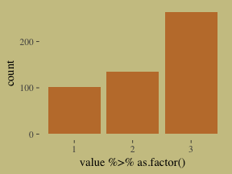<!-- -->

Here's my naive attempt to fit the model in brms.


```r
detach(package:rethinking)
library(brms)

b10.16 <-
  brm(data = list(career = career), 
      family = categorical(link = "logit"),
      career ~ 1,
      prior = c(set_prior("normal(0, 5)", class = "Intercept")),
      iter = 2500, warmup = 500, cores = 2, chains = 2)
```

This differs from McElreath's `m10.16`. Most obviously, this has two parameters. McElreath's `m10.16` only has one. If you have experience with these models and know how to reproduce McElreath's results in brms, hit me up.


```r
print(b10.16)
```

```
##  Family: categorical 
##   Links: mu2 = logit; mu3 = logit 
## Formula: career ~ 1 
##    Data: list(career = career) (Number of observations: 500) 
## Samples: 2 chains, each with iter = 2500; warmup = 500; thin = 1;
##          total post-warmup samples = 4000
## 
## Population-Level Effects: 
##               Estimate Est.Error l-95% CI u-95% CI Eff.Sample Rhat
## mu2_Intercept     0.29      0.13     0.03     0.55       1344 1.00
## mu3_Intercept     0.96      0.12     0.73     1.20       1456 1.00
## 
## Samples were drawn using sampling(NUTS). For each parameter, Eff.Sample 
## is a crude measure of effective sample size, and Rhat is the potential 
## scale reduction factor on split chains (at convergence, Rhat = 1).
```


```r
detach(package:brms)
library(rethinking)

N <- 100

set.seed(2078)
# simulate family incomes for each individual
family_income <- runif(N)

# assign a unique coefficient for each type of event
b <- (1:-1)
career <- rep(NA, N)  # empty vector of choices for each individual

for (i in 1:N) {
    score <- 0.5*(1:3) + b*family_income[i]
    p <- softmax(score[1], score[2], score[3])
    career[i] <- sample(1:3, size = 1, prob = p)
}
```

Here's the brms version of McElreath's `m10.17`.


```r
detach(package:rethinking)
library(brms)

b10.17 <-
  brm(data = list(career = career,
                  family_income = family_income), 
      family = categorical(link = "logit"),
      career ~ 1 + family_income,
      prior = c(set_prior("normal(0, 5)", class = "Intercept"),
                set_prior("normal(0, 5)", class = "b")),
      iter = 2500, warmup = 500, cores = 2, chains = 2)
```

Happily, these results cohere with the rethinking model.


```r
print(b10.17)
```

```
##  Family: categorical 
##   Links: mu2 = logit; mu3 = logit 
## Formula: career ~ 1 + family_income 
##    Data: list(career = career, family_income = family_incom (Number of observations: 100) 
## Samples: 2 chains, each with iter = 2500; warmup = 500; thin = 1;
##          total post-warmup samples = 4000
## 
## Population-Level Effects: 
##                   Estimate Est.Error l-95% CI u-95% CI Eff.Sample Rhat
## mu2_Intercept         1.84      0.57     0.75     2.99       2337 1.00
## mu3_Intercept         1.53      0.57     0.45     2.69       2136 1.00
## mu2_family_income    -3.92      1.03    -6.00    -1.97       2502 1.00
## mu3_family_income    -2.53      0.93    -4.33    -0.68       2662 1.00
## 
## Samples were drawn using sampling(NUTS). For each parameter, Eff.Sample 
## is a crude measure of effective sample size, and Rhat is the potential 
## scale reduction factor on split chains (at convergence, Rhat = 1).
```

McElreath described the parameters as "on a scale that is very hard to interpret (p. 325)." Indeed.

#### 10.3.1.2.

Back to Berkeley


```r
library(rethinking)

data(UCBadmit)
d <- UCBadmit
rm(UCBadmit)

detach(package:rethinking)
library(brms)
```


```r
# binomial model of overall admission probability
b_binom <-
  brm(data = d, family = binomial,
      admit | trials(applications) ~ 1,
      prior = c(set_prior("normal(0, 100)", class = "Intercept")),
      iter = 2000, warmup = 1000, cores = 3, chains = 3)

# Poisson model of overall admission rate and rejection rate
d <-
  d %>%
  mutate(rej = reject) # 'reject' is a reserved word

b_pois <-
  brm(data = d, family = poisson,
      cbind(admit, rej) ~ 1,
      prior = c(set_prior("normal(0, 100)", class = "Intercept")),
      iter = 2000, warmup = 1000, cores = 3, chains = 3)
```

Note, the `cbind()` syntax made `b_pois` a multivariate Poisson model. Starting with version 2.0.0., [brms supports a variety of multivariate models](https://cran.r-project.org/web/packages/brms/vignettes/brms_multivariate.html). Anyway, here are the implications of `b_pois`.


```r
post <- posterior_samples(b_pois)

post %>%
  ggplot(aes(x = exp(b_admit_Intercept))) +
  geom_density(fill = wes_palette("Moonrise2")[2], size = 0) +
  geom_vline(xintercept = mean(d$admit), color = wes_palette("Moonrise2")[1]) +
  scale_y_continuous(NULL, breaks = NULL) +
  labs(x = "# applications",
       title = "Mean acceptance # across departments:",
       subtitle = "The density is the posterior distribution. The line is the\nvalue in the data.")
```

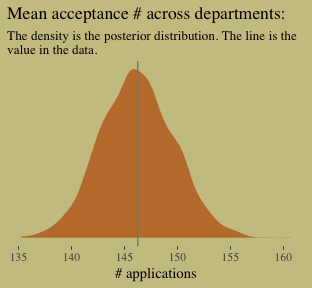<!-- -->

```r
post %>%
  ggplot(aes(x = exp(b_rej_Intercept))) +
  geom_density(fill = wes_palette("Moonrise2")[1], size = 0) +
  geom_vline(xintercept = mean(d$rej), color = wes_palette("Moonrise2")[2]) +
  scale_y_continuous(NULL, breaks = NULL) +
  labs(x = "# applications",
       title = "Mean rejection # across departments:",
       subtitle = "The density is the posterior distribution. The line is the\nvalue in the data.")
```

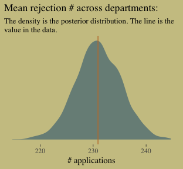<!-- -->

The model summaries:


```r
print(b_binom)
```

```
##  Family: binomial 
##   Links: mu = logit 
## Formula: admit | trials(applications) ~ 1 
##    Data: d (Number of observations: 12) 
## Samples: 3 chains, each with iter = 2000; warmup = 1000; thin = 1;
##          total post-warmup samples = 3000
## 
## Population-Level Effects: 
##           Estimate Est.Error l-95% CI u-95% CI Eff.Sample Rhat
## Intercept    -0.46      0.03    -0.52    -0.40       1319 1.00
## 
## Samples were drawn using sampling(NUTS). For each parameter, Eff.Sample 
## is a crude measure of effective sample size, and Rhat is the potential 
## scale reduction factor on split chains (at convergence, Rhat = 1).
```

```r
print(b_pois)
```

```
##  Family: MV(poisson, poisson) 
##   Links: mu = log
##          mu = log 
## Formula: admit ~ 1 
##          rej ~ 1 
##    Data: d (Number of observations: 12) 
## Samples: 3 chains, each with iter = 2000; warmup = 1000; thin = 1;
##          total post-warmup samples = 3000
## 
## Population-Level Effects: 
##                 Estimate Est.Error l-95% CI u-95% CI Eff.Sample Rhat
## admit_Intercept     4.98      0.02     4.94     5.03       2519 1.00
## rej_Intercept       5.44      0.02     5.40     5.48       2901 1.00
## 
## Samples were drawn using sampling(NUTS). For each parameter, Eff.Sample 
## is a crude measure of effective sample size, and Rhat is the potential 
## scale reduction factor on split chains (at convergence, Rhat = 1).
```

Here's the posterior mean for the probability of admission, based on `b_binom`.


```r
fixef(b_binom) %>%
  invlogit()
```

```
##            Estimate Est.Error      Q2.5     Q97.5
## Intercept 0.3874809 0.5076713 0.3728788 0.4017596
```

Happily, we get the same value within simulation error from model `b_pois`.


```r
k <- 
  fixef(b_pois) %>%
  as.numeric()

exp(k[1])/(exp(k[1]) + exp(k[2]))
```

```
## [1] 0.3876207
```

### 10.3.2. Geometric.


```r
# simulate
N <- 100
set.seed(1028)
x <- runif(N)

set.seed(1028)
y <- rgeom(N, prob = invlogit(-1 + 2*x))
```

In case you're curious, here are the data.


```r
list(y = y, x = x) %>%
  as_tibble() %>%
  ggplot(aes(x = x, y = y)) +
  geom_point(size = 3/5, alpha = 2/3)
```

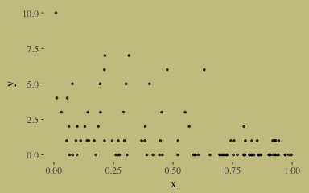<!-- -->

Our geometric model:


```r
b10.18 <-
  brm(data = list(y = y, x = x), 
      family = geometric(link = "log"),
      y ~ 0 + intercept + x,
      prior = c(set_prior("normal(0, 10)", class = "b", coef = "intercept"),
                set_prior("normal(0, 1)", class = "b")),
      chains = 2, iter = 2500, warmup = 500, cores = 2)
```

The results:


```r
print(b10.18, digits = 2)
```

```
##  Family: geometric 
##   Links: mu = log 
## Formula: y ~ 0 + intercept + x 
##    Data: list(y = y, x = x) (Number of observations: 100) 
## Samples: 2 chains, each with iter = 2500; warmup = 500; thin = 1;
##          total post-warmup samples = 4000
## 
## Population-Level Effects: 
##           Estimate Est.Error l-95% CI u-95% CI Eff.Sample Rhat
## intercept     1.15      0.23     0.71     1.59       1281 1.00
## x            -2.26      0.44    -3.13    -1.40       1448 1.00
## 
## Samples were drawn using sampling(NUTS). For each parameter, Eff.Sample 
## is a crude measure of effective sample size, and Rhat is the potential 
## scale reduction factor on split chains (at convergence, Rhat = 1).
```

It appears brms uses a [different parameterization for the exponential distribution](https://cran.r-project.org/web/packages/brms/vignettes/brms_families.html) than rethinking does. Even though the parameters brms yielded look different from those in the text, their predictions describe the data well. Here's the `marginal_effects()` plot:


```r
plot(marginal_effects(b10.18),
     points = T,
     point_args = c(size = 3/5, alpha = 2/3),
     line_args = c(color = wes_palette("Moonrise2")[1],
                   fill = wes_palette("Moonrise2")[1]))
```

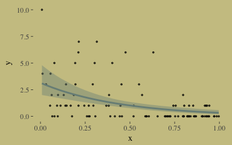<!-- -->


Note. The analyses in this document were done with:

* R           3.4.4
* RStudio     1.1.442
* rmarkdown   1.9
* rstan       2.17.3
* rethinking  1.59
* brms        2.3.1
* tidyverse   1.2.1
* wesanderson 0.3.6
* ggthemes    3.4.0
* bayesplot   1.5.0
* loo         2.0.0
* psych       1.7.3.21

## Reference
McElreath, R. (2016). *Statistical rethinking: A Bayesian course with examples in R and Stan.* Chapman & Hall/CRC Press.
