Ch. 11 Monsters and Mixtures
================
A Solomon Kurz
2018-06-11

11.1. Ordered categorical outcomes
----------------------------------

### 11.1.1. Example: Moral intuition.

Let's get the `Trolley` data from rethinking.

``` r
library(rethinking)
data(Trolley)
d <- Trolley
```

Unload rethinking and load brms.

``` r
rm(Trolley)
detach(package:rethinking, unload = T)
library(brms)
```

### 11.1.2. Describing an ordered distribution with intercepts.

Before we get to plotting, in this manuscript we'll use theme settings and a color palette from the [ggthemes package](https://cran.r-project.org/web/packages/ggthemes/index.html), which you might learn more about [here](https://cran.r-project.org/web/packages/ggthemes/vignettes/ggthemes.html).

``` r
library(ggthemes)
```

We'll take our basic theme settings from the `theme_hc()` function. We'll use the `Green fields` color palette, which we can inspect with the `canva_pal()` function and a little help from `scales::show_col()`.

``` r
scales::show_col(canva_pal("Green fields")(4))
```


``` r
canva_pal("Green fields")(4)
```

    ## [1] "#919636" "#524a3a" "#fffae1" "#5a5f37"

``` r
canva_pal("Green fields")(4)[3]
```

    ## [1] "#fffae1"

Our ggplot2 version of the simple histogram, Figure 11.1.a.

``` r
library(tidyverse)

ggplot(data = d, aes(x = response, fill = ..x..)) +
  geom_histogram(binwidth = 1/4, size = 0) +
  scale_x_continuous(breaks = 1:7) +
  theme_hc() +
  scale_fill_gradient(low = canva_pal("Green fields")(4)[4],
                      high = canva_pal("Green fields")(4)[1]) +
  theme(axis.ticks.x = element_blank(),
        plot.background = element_rect(fill = "grey92"),
        legend.position = "none")
```

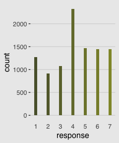

Our cumulative proportion plot, Figure 11.1.b.

``` r
d %>%
  group_by(response) %>% 
  count() %>%
  mutate(pr_k = n/nrow(d)) %>% 
  ungroup() %>% 
  mutate(cum_pr_k = cumsum(pr_k)) %>% 
  
  ggplot(aes(x = response, y = cum_pr_k, 
             fill = response)) +
  geom_line(color = canva_pal("Green fields")(4)[2]) +
  geom_point(shape = 21, colour = "grey92", 
             size = 2.5, stroke = 1) +
  scale_x_continuous(breaks = 1:7) +
  scale_y_continuous(breaks = c(0, .5, 1)) +
  coord_cartesian(ylim = c(0, 1)) +
  labs(y = "cumulative proportion") +
  theme_hc() +
  scale_fill_gradient(low = canva_pal("Green fields")(4)[4],
                      high = canva_pal("Green fields")(4)[1]) +
  theme(axis.ticks.x = element_blank(),
        plot.background = element_rect(fill = "grey92"),
        legend.position = "none")
```

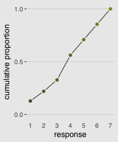

In order to make the next plot, we'll need McElreath's `logit()` function, which is not to be confused with Gelman and Hill's (2007, p 91.) `invlogit()` function. Here it is, the logarithm of cumulative odds plot, Figure 11.1.c.

``` r
# McElreath's convenience function
logit <- function(x) log(x/(1-x))

d %>%
  group_by(response) %>% 
  count() %>%
  mutate(pr_k = n/nrow(d)) %>% 
  ungroup() %>% 
  mutate(cum_pr_k = cumsum(pr_k)) %>% 
  filter(response < 7) %>% 
  
  # We can do the logit() conversion right in ggplot2
  ggplot(aes(x = response, y = logit(cum_pr_k), 
             fill = response)) +
  geom_line(color = canva_pal("Green fields")(4)[2]) +
  geom_point(shape = 21, colour = "grey92", 
             size = 2.5, stroke = 1) +
  scale_x_continuous(breaks = 1:7) +
  coord_cartesian(xlim = c(1, 7)) +
  labs(y = "log-cumulative-odds") +
  theme_hc() +
  scale_fill_gradient(low = canva_pal("Green fields")(4)[4],
                      high = canva_pal("Green fields")(4)[1]) +
  theme(axis.ticks.x = element_blank(),
        plot.background = element_rect(fill = "grey92"),
        legend.position = "none")
```

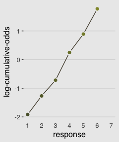

Here's Figure 11.2.

``` r
d_plot <-
  d %>%
  group_by(response) %>% 
  count() %>%
  mutate(pr_k = n/nrow(d)) %>% 
  ungroup() %>% 
  mutate(cum_pr_k = cumsum(pr_k)) 

ggplot(data = d_plot,
       aes(x = response, y = cum_pr_k, 
             color = cum_pr_k, fill = cum_pr_k)) +
  geom_line(color = canva_pal("Green fields")(4)[1]) +
  geom_point(shape = 21, colour = "grey92", 
             size = 2.5, stroke = 1) +
  geom_linerange(aes(ymin = 0, ymax = cum_pr_k),
                 alpha = 1/2, color = canva_pal("Green fields")(4)[1]) +
  # There are probably more elegant ways to do this part.
  geom_linerange(data = . %>% 
                   mutate(discrete_probability =
                            ifelse(response == 1, cum_pr_k,
                                   cum_pr_k - pr_k)),
                 aes(x = response + .025,
                     ymin = ifelse(response == 1, 0, discrete_probability), 
                     ymax = cum_pr_k),
                 color = "black") +
  geom_text(data = tibble(text        = 1:7,
                          response = seq(from = 1.25, to = 7.25, by = 1),
                          cum_pr_k = d_plot$cum_pr_k - .065),
            aes(label = text),
            size = 4) +
  scale_x_continuous(breaks = 1:7) +
  scale_y_continuous(breaks = c(0, .5, 1)) +
  coord_cartesian(ylim = c(0, 1)) +
  labs(y = "cumulative proportion") +
  theme_hc() +
  scale_fill_gradient(low = canva_pal("Green fields")(4)[4],
                      high = canva_pal("Green fields")(4)[1]) +
  scale_color_gradient(low = canva_pal("Green fields")(4)[4],
                       high = canva_pal("Green fields")(4)[1]) +
  theme(axis.ticks.x = element_blank(),
        plot.background = element_rect(fill = "grey92"),
        legend.position = "none")
```

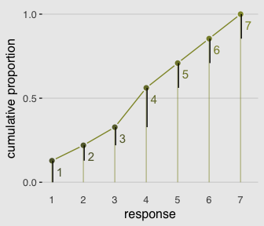

Whereas in `rethinking::map()` you indicate the likelihood by `<criterion> ~ dordlogit(phi , c(<the thresholds>)`, in `brms::brm()` you code `family = cumulative`. Here's the intercepts (i.e., thresholds) only model:

``` r
# Here are our starting values, which we specify with the `inits` argument in brm()
Inits <- list(`Intercept[1]` = -2,
              `Intercept[2]` = -1,
              `Intercept[3]` = 0,
              `Intercept[4]` = 1,
              `Intercept[5]` = 2,
              `Intercept[6]` = 2.5)

InitsList <-list(Inits, Inits)

b11.1 <- 
  brm(data = d, family = cumulative,
      response ~ 1,
      prior = c(set_prior("normal(0, 10)", class = "Intercept")),
      iter = 2000, warmup = 1000, cores = 2, chains = 2,
      inits = InitsList)  # Here we place our start values into brm()
```

McElreath needed to include the `depth = 2` argument in the `rethinking::precis()` function to show the threshold parameters. With a `brm()` fit, we just use `print()` or `summary()` as usual.

``` r
print(b11.1)
```

    ##  Family: cumulative 
    ##   Links: mu = logit; disc = identity 
    ## Formula: response ~ 1 
    ##    Data: d (Number of observations: 9930) 
    ## Samples: 2 chains, each with iter = 2000; warmup = 1000; thin = 1;
    ##          total post-warmup samples = 2000
    ## 
    ## Population-Level Effects: 
    ##              Estimate Est.Error l-95% CI u-95% CI Eff.Sample Rhat
    ## Intercept[1]    -1.92      0.03    -1.98    -1.86       1650 1.00
    ## Intercept[2]    -1.27      0.03    -1.32    -1.22       2000 1.00
    ## Intercept[3]    -0.72      0.02    -0.76    -0.68       2000 1.00
    ## Intercept[4]     0.25      0.02     0.21     0.29       2000 1.00
    ## Intercept[5]     0.89      0.02     0.85     0.93       2000 1.00
    ## Intercept[6]     1.77      0.03     1.72     1.83       2000 1.00
    ## 
    ## Samples were drawn using sampling(NUTS). For each parameter, Eff.Sample 
    ## is a crude measure of effective sample size, and Rhat is the potential 
    ## scale reduction factor on split chains (at convergence, Rhat = 1).

The summaries look like those in the text, number of effective samples are high, and the Rhat values are great. The model looks good.

Here we can actually use Gelman and Hill's `invlogit()` function in place of McElreath's `logistic()` function.

``` r
invlogit <- function(x){1/(1+exp(-x))}

b11.1 %>% 
  fixef() %>% 
  invlogit()
```

    ##               Estimate Est.Error      Q2.5     Q97.5
    ## Intercept[1] 0.1282088 0.5076393 0.1214291 0.1349302
    ## Intercept[2] 0.2197376 0.5062732 0.2112173 0.2278537
    ## Intercept[3] 0.3276952 0.5053419 0.3182410 0.3364931
    ## Intercept[4] 0.5616631 0.5050351 0.5520031 0.5713531
    ## Intercept[5] 0.7090226 0.5054909 0.7000671 0.7177199
    ## Intercept[6] 0.8545185 0.5071600 0.8476482 0.8612692

### 11.1.3. Adding predictor variables.

I'm not aware that brms has an equivalent to the `rethinking::dordlogit()` function. So here we'll make it by hand. The code comes from McElreath's [GitHub page](https://github.com/rmcelreath/rethinking/blob/a309712d904d1db7af1e08a76c521ab994006fd5/R/distributions.r).

``` r
# First, we needed to specify the logistic() function, which is apart of the dordlogit() function
logistic <- function(x) {
    p <- 1 / (1 + exp(-x))
    p <- ifelse(x == Inf, 1, p)
    p
    }

# Now we get down to it
dordlogit <- 
  function(x, phi, a, log = FALSE) {
    a  <- c(as.numeric(a), Inf)
    p  <- logistic(a[x] - phi)
    na <- c(-Inf, a)
    np <- logistic(na[x] - phi)
    p  <- p - np
    if (log == TRUE) p <- log(p)
    p
    }
```

The `dordlogit()` function works like this.

``` r
(pk <- dordlogit(1:7, 0, fixef(b11.1)[, 1]))
```

    ## [1] 0.12820877 0.09152884 0.10795756 0.23396791 0.14735954 0.14549589
    ## [7] 0.14548149

Note the slight difference in how we used `dordlogit()` with a `brm()` fit summarized by `fixef()` than the way McElreath did with a `map2stan()` fit summarized by `coef()`. McElreath just put `coef(m11.1)` into `dordlogit()`. We, however, more specifically placed `fixef(b11.1)[, 1]` into the function. With the `[, 1]` part, we specified that we were working with the posterior means (i.e., `Estimate`) and neglecting the other summaries (i.e., the posterior *SD*s and 95% intervals). If you forget to do this, chaos ensues.

Next, as McElreath further noted in the text, "these probabilities imply an average outcome of:"

``` r
sum(pk*(1:7))
```

    ## [1] 4.199154

I found that a bit abstract. Here's the thing in a more elaborate tibble format.

``` r
(
  explicit_example <-
  tibble(probability_of_a_response = pk) %>%
  mutate(the_response = 1:7) %>%
  mutate(their_product = probability_of_a_response*the_response)
)
```

    ## # A tibble: 7 x 3
    ##   probability_of_a_response the_response their_product
    ##                       <dbl>        <int>         <dbl>
    ## 1                    0.128             1         0.128
    ## 2                    0.0915            2         0.183
    ## 3                    0.108             3         0.324
    ## 4                    0.234             4         0.936
    ## 5                    0.147             5         0.737
    ## 6                    0.145             6         0.873
    ## 7                    0.145             7         1.02

``` r
explicit_example %>%
  summarise(average_outcome_value = sum(their_product))
```

    ## # A tibble: 1 x 1
    ##   average_outcome_value
    ##                   <dbl>
    ## 1                  4.20

**Side note**

This made me wonder how this would compare if we were lazy and ignored the categorical nature of the `response`. Here we refit the model with the typical Gaussian likelihood.

``` r
brm(data = d, family = gaussian,
    response ~ 1,
    # In this case, 4 (i.e., the middle response) seems to be the conservative place to put the mean
    prior = c(set_prior("normal(4, 10)", class = "Intercept"),
              set_prior("cauchy(0, 1)", class = "sigma")),
    iter = 2000, warmup = 1000, cores = 4, chains = 4) %>%
  print()
```

    ##  Family: gaussian 
    ##   Links: mu = identity; sigma = identity 
    ## Formula: response ~ 1 
    ##    Data: d (Number of observations: 9930) 
    ## Samples: 4 chains, each with iter = 2000; warmup = 1000; thin = 1;
    ##          total post-warmup samples = 4000
    ## 
    ## Population-Level Effects: 
    ##           Estimate Est.Error l-95% CI u-95% CI Eff.Sample Rhat
    ## Intercept     4.20      0.02     4.16     4.24       3223 1.00
    ## 
    ## Family Specific Parameters: 
    ##       Estimate Est.Error l-95% CI u-95% CI Eff.Sample Rhat
    ## sigma     1.90      0.01     1.88     1.93       3570 1.00
    ## 
    ## Samples were drawn using sampling(NUTS). For each parameter, Eff.Sample 
    ## is a crude measure of effective sample size, and Rhat is the potential 
    ## scale reduction factor on split chains (at convergence, Rhat = 1).

Happily, this yielded a mean estimate of 4.2, much like our `average_outcome_value`, above.

**End side note**

Now we'll try it by subtracting .5 from each.

``` r
# The probabilities of a given response
(pk <- dordlogit(1:7, 0, fixef(b11.1)[, 1] - .5))
```

    ## [1] 0.08189378 0.06399758 0.08228662 0.20913223 0.15912701 0.18438928
    ## [7] 0.21917350

``` r
# The average rating
sum(pk*(1:7))
```

    ## [1] 4.729463

So the rule is we *subtract the linear model from each interecept*. Let's fit our multivariable models.

``` r
# Start values for b11.2
Inits <- list(`Intercept[1]` = -1.9,
              `Intercept[2]` = -1.2,
              `Intercept[3]` = -0.7,
              `Intercept[4]` = 0.2,
              `Intercept[5]` = 0.9,
              `Intercept[6]` = 1.8,
              action = 0,
              intention = 0,
              contact = 0)

b11.2 <- 
  brm(data = d, family = cumulative,
      response ~ 1 + action + intention + contact,
      prior = c(set_prior("normal(0, 10)", class = "Intercept"),
                set_prior("normal(0, 10)", class = "b")),
      iter = 2000, warmup = 1000, cores = 2, chains = 2,
      inits = list(Inits, Inits))

# Start values for b11.3
Inits <- list(`Intercept[1]` = -1.9,
              `Intercept[2]` = -1.2,
              `Intercept[3]` = -0.7,
              `Intercept[4]` = 0.2,
              `Intercept[5]` = 0.9,
              `Intercept[6]` = 1.8,
              action = 0,
              intention = 0,
              contact = 0,
              `action:intention` = 0,
              `contact:intention` = 0)

b11.3 <- 
  brm(data = d, family = cumulative,
      response ~ 1 + action + intention + contact +
        action:intention + contact:intention,
      prior = c(set_prior("normal(0, 10)", class = "Intercept"),
                set_prior("normal(0, 10)", class = "b")),
      iter = 2000, warmup = 1000, cores = 2, chains = 2,
      inits = list(Inits, Inits))
```

We don't have a `coeftab()` function in brms like for rethinking. But as we did for the chapter 6 supplement, we can reproduce it with help from the [broom package](https://cran.r-project.org/web/packages/broom/index.html) and a bit of data wrangling.

``` r
library(broom)

tidy(b11.1) %>% mutate(model = "b11.1") %>% 
  bind_rows(tidy(b11.2) %>% mutate(model = "b11.2")) %>% 
  bind_rows(tidy(b11.3) %>% mutate(model = "b11.3")) %>% 
  select(model, term, estimate) %>% 
  filter(term != "lp__") %>% 
  complete(term = distinct(., term), model) %>% 
  mutate(estimate = round(estimate, digits = 2)) %>%
  spread(key = model, value = estimate) %>% 
  slice(c(6:11, 1, 4, 3, 2, 5))  # Here we indicate the order we'd like the rows in
```

    ## # A tibble: 11 x 4
    ##    term                  b11.1   b11.2  b11.3
    ##    <chr>                 <dbl>   <dbl>  <dbl>
    ##  1 b_Intercept[1]      - 1.92  - 2.84  -2.64 
    ##  2 b_Intercept[2]      - 1.27  - 2.16  -1.94 
    ##  3 b_Intercept[3]      - 0.720 - 1.57  -1.35 
    ##  4 b_Intercept[4]        0.250 - 0.550 -0.310
    ##  5 b_Intercept[5]        0.890   0.120  0.360
    ##  6 b_Intercept[6]        1.77    1.02   1.27 
    ##  7 b_action             NA     - 0.710 -0.470
    ##  8 b_intention          NA     - 0.720 -0.280
    ##  9 b_contact            NA     - 0.960 -0.330
    ## 10 b_action:intention   NA      NA     -0.450
    ## 11 b_intention:contact  NA      NA     -1.27

If you really wanted that last `nobs` row at the bottom, you could elaborate on this code: `b11.1$data %>% count()`. Also, if you want a proper `coeftab()` function for brms, McElreath's code lives [here](https://github.com/rmcelreath/rethinking/blob/a309712d904d1db7af1e08a76c521ab994006fd5/R/coeftab.r). Give it a whirl.

Anyway, here are the WAIC comparisons. *Caution: This took some time to compute.*

``` r
waic(b11.1, b11.2, b11.3)
```

    ##                   WAIC    SE
    ## b11.1         37854.66 57.68
    ## b11.2         37089.83 76.25
    ## b11.3         36929.23 81.31
    ## b11.1 - b11.2   764.83 55.98
    ## b11.1 - b11.3   925.43 62.69
    ## b11.2 - b11.3   160.60 25.74

McElreath made Figure 11.3 by extracting the samples of his `m11.3`, saving them as `post`, and working some hairy base R `plot()` code. We'll take a different route and use `brms::fitted()`. This will take substantial data wrangling, but hopefully it'll be instructive. Let's first take a look at the initial `fitted()` output for the beginnings of Figure 11.3.a.

``` r
nd <-
  tibble(action = 0,
         contact = 0, 
         intention = 0:1)

max_iter <- 100

fitted(b11.3, 
        newdata = nd, 
        subset = 1:max_iter,
        summary = F) %>% 
  as_tibble() %>% 
  glimpse()
```

    ## Observations: 100
    ## Variables: 14
    ## $ `1.1` <dbl> 0.06562528, 0.06452680, 0.06704451, 0.06472778, 0.072904...
    ## $ `2.1` <dbl> 0.08512917, 0.08578481, 0.08719844, 0.08972607, 0.093551...
    ## $ `1.2` <dbl> 0.05709604, 0.05586850, 0.06028539, 0.05479538, 0.060089...
    ## $ `2.2` <dbl> 0.07122552, 0.07118566, 0.07525200, 0.07229174, 0.074031...
    ## $ `1.3` <dbl> 0.08064601, 0.08142448, 0.07959278, 0.07942987, 0.084249...
    ## $ `2.3` <dbl> 0.09638070, 0.09896328, 0.09506799, 0.09928891, 0.099413...
    ## $ `1.4` <dbl> 0.2208317, 0.2191637, 0.2136934, 0.2148605, 0.2202078, 0...
    ## $ `2.4` <dbl> 0.2412010, 0.2413188, 0.2335885, 0.2400533, 0.2380977, 0...
    ## $ `1.5` <dbl> 0.1634227, 0.1644001, 0.1706730, 0.1607508, 0.1599477, 0...
    ## $ `2.5` <dbl> 0.1597869, 0.1603573, 0.1667966, 0.1565875, 0.1556314, 0...
    ## $ `1.6` <dbl> 0.1943135, 0.1938007, 0.1891387, 0.1975379, 0.1857018, 0...
    ## $ `2.6` <dbl> 0.1723836, 0.1699835, 0.1674185, 0.1703888, 0.1650125, 0...
    ## $ `1.7` <dbl> 0.2180648, 0.2208157, 0.2195722, 0.2278978, 0.2169003, 0...
    ## $ `2.7` <dbl> 0.1738931, 0.1724065, 0.1746779, 0.1716636, 0.1742624, 0...

Hopefully by now it’s clear why we needed the `nd` tibble, which we made use of in the `newdata = nd` argument. Because we set `summary = F`, we get draws from the posterior instead of summaries. With `max_iter`, we controlled how many of those posterior draws we wanted. McElreath used 100, which he indicated at the top of page 341, so we followed suit. It took me a minute to wrap my head around the meaning of the 14 vectors, which were named by `brms::fitted()` default. Notice how each column is named by two numerals, separated by a period. That first numeral indicates which if the two `intention` values the draw is based on (i.e., 1 stands for intention = 0, 2, stands for intention = 1). The numbers on the right of the decimals are the seven response options for `response`. For each posterior draw, you get one of those for each value of `intention`. Finally, it might not be immediately apparent, but the values are in the probability scale, just like `pk` on page 338.

Now we know what we have in hand, it’s just a matter of careful data wrangling to get those probabilities into a more useful format to insert into ggplot2. I’ve extensively annotated the code, below. If you lose track of happens in a given step, just run the code up till that point. Go step by step.

``` r
nd <-
  tibble(action = 0,
         contact = 0, 
         intention = 0:1)

max_iter <- 100

fitted(b11.3, 
        newdata = nd, 
        subset = 1:max_iter,
        summary = F) %>% 
  as_tibble() %>%
  # We convert the data to the long format
  gather() %>%
  # We need an variable to index which posterior iteration we're working with
  mutate(iter = rep(1:max_iter, times = 14)) %>%
  # This step isn’t technically necessary, but I prefer my iter index at the far left.
  select(iter, everything()) %>% 
  # Here we extract the `intention` and `response` information out of the `key` vector and spread it into two vectors.
  separate(key, into = c("intention", "rating")) %>% 
  # That step produced two character vectors. They’ll be more useful as numbers
  mutate(intention = intention %>% as.double(),
         rating =  rating %>% as.double()) %>%
  # Here we convert `intention` into its proper 0:1 metric
  mutate(intention = intention -1) %>%
  # This isn't necessary, but it helps me understand exactly what metric the values are currently in
  rename(pk = value) %>% 
  # This step is based on McElreath's R code 11.10 on page 338
  mutate(`pk:rating` = pk*rating) %>% 
  # I’m not sure how to succinctly explain this. You’re just going to have to trust me.
  group_by(iter, intention) %>% 
  # This is very important for the next step.
  arrange(iter, intention, rating) %>% 
  # Here we take our `pk` values and make culmulative sums. Why? Take a long hard look at Figure 11.2. 
  mutate(probability = cumsum(pk)) %>% 
  # `rating == 7` is unnecessary. These `probability` values are by definition 1.
  filter(rating < 7) %>% 
  
  ggplot(aes(x = intention, 
             y = probability, 
             color = probability)) +
  geom_line(aes(group = interaction(iter, rating)),
            alpha = 1/10) +
  # Note how we made a new data object for geom_text()
  geom_text(data = tibble(text        = 1:7,
                          intention   = seq(from = .9, to = .1, length.out = 7),
                          probability = c(.05, .12, .20, .35, .53, .71, .87)),
            aes(label = text),
            size = 3) +
  scale_x_continuous(breaks = 0:1) +
  scale_y_continuous(breaks = c(0, .5, 1)) +
  coord_cartesian(ylim = 0:1) +
  labs(subtitle = "action = 0,\ncontact = 0",
       x = "intention") +
  theme_hc() +
  scale_color_gradient(low = canva_pal("Green fields")(4)[4],
                       high = canva_pal("Green fields")(4)[1]) +
  theme(plot.background = element_rect(fill = "grey92"),
        legend.position = "none")
```


Boom!

Okay, that pile of code is a bit of a mess and you’re not going to want to repeatedly cut and paste all that. Let’s condense it into a homemade function, `make_Figure_11.3_data()`.

``` r
make_Figure_11.3_data <- function(action, contact, max_iter){
  
  nd <-
    tibble(action = action,
           contact = contact, 
           intention = 0:1)
  
  max_iter <- max_iter
  
  fitted(b11.3, 
         newdata = nd, 
         subset = 1:max_iter,
         summary = F) %>% 
    as_tibble() %>%
    gather() %>%
    mutate(iter = rep(1:max_iter, times = 14)) %>%
    select(iter, everything()) %>% 
    separate(key, into = c("intention", "rating")) %>% 
    mutate(intention = intention %>% as.double(),
           rating =  rating %>% as.double()) %>%
    mutate(intention = intention -1) %>%
    rename(pk = value) %>% 
    mutate(`pk:rating` = pk*rating) %>% 
    group_by(iter, intention) %>% 
    arrange(iter, intention, rating) %>% 
    mutate(probability = cumsum(pk)) %>% 
    filter(rating < 7) 
}
```

Now we'll use our sweet homemade function to make our plots.

``` r
# Figure 11.3.a
make_Figure_11.3_data(action = 0, 
                      contact = 0, 
                      max_iter = 100) %>% 
  
  ggplot(aes(x = intention, 
             y = probability,
             color = probability)) +
  geom_line(aes(group = interaction(iter, rating)),
            alpha = 1/10) +
  geom_text(data = tibble(text        = 1:7,
                          intention   = seq(from = .9, to = .1, length.out = 7),
                          probability = c(.05, .12, .20, .35, .53, .71, .87)),
            aes(label = text),
            size = 3) +
  scale_x_continuous(breaks = 0:1) +
  scale_y_continuous(breaks = c(0, .5, 1)) +
  coord_cartesian(ylim = 0:1) +
  labs(subtitle = "action = 0,\ncontact = 0",
       x = "intention") +
  theme_hc() +
  scale_color_gradient(low = canva_pal("Green fields")(4)[4],
                       high = canva_pal("Green fields")(4)[1]) +
  theme(plot.background = element_rect(fill = "grey92"),
        legend.position = "none")
```

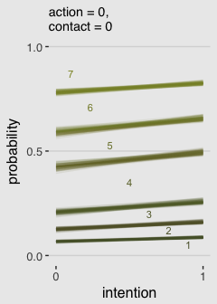

``` r
# Figure 11.3.b
make_Figure_11.3_data(action = 1, 
                      contact = 0, 
                      max_iter = 100) %>% 
  
  ggplot(aes(x = intention, 
             y = probability,
             color = probability)) +
  geom_line(aes(group = interaction(iter, rating)),
            alpha = 1/10) +
  geom_text(data = tibble(text        = 1:7,
                          intention   = seq(from = .9, to = .1, length.out = 7),
                          probability = c(.12, .24, .35, .50, .68, .80, .92)),
            aes(label = text),
            size = 3) +
  scale_x_continuous(breaks = 0:1) +
  scale_y_continuous(breaks = c(0, .5, 1)) +
  coord_cartesian(ylim = 0:1) +
  labs(subtitle = "action = 1,\ncontact = 0",
       x = "intention") +
  theme_hc() +
  scale_color_gradient(low = canva_pal("Green fields")(4)[4],
                       high = canva_pal("Green fields")(4)[1]) +
  theme(plot.background = element_rect(fill = "grey92"),
        legend.position = "none")
```

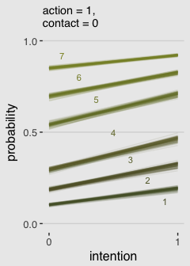

``` r
# Figure 11.3.c
make_Figure_11.3_data(action = 0, 
                      contact = 1, 
                      max_iter = 100) %>% 
  
  ggplot(aes(x = intention, 
             y = probability,
             color = probability)) +
  geom_line(aes(group = interaction(iter, rating)),
            alpha = 1/10) +
  geom_text(data = tibble(text        = 1:7,
                          intention   = seq(from = .9, to = .1, length.out = 7),
                          probability = c(.15, .34, .44, .56, .695, .8, .92)),
            aes(label = text),
            size = 3) +
  scale_x_continuous(breaks = 0:1) +
  scale_y_continuous(breaks = c(0, .5, 1)) +
  coord_cartesian(ylim = 0:1) +
  labs(subtitle = "action = 0,\ncontact = 1",
       x = "intention") +
  theme_hc() +
  scale_color_gradient(low = canva_pal("Green fields")(4)[4],
                       high = canva_pal("Green fields")(4)[1]) +
  theme(plot.background = element_rect(fill = "grey92"),
        legend.position = "none")
```

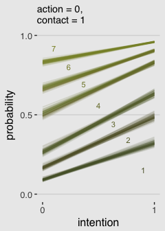

If you really wanted to get crazy, you could save each of the three plots as objects and then feed them into the [`multiplot()` function](http://www.cookbook-r.com/Graphs/Multiple_graphs_on_one_page_(ggplot2)/). I'll leave that up to you.

**Bonus**

I have a lot of respect for McElreath. But man, Figure 11.3 is the worst. I'm in clinical psychology and there's no way a working therapist is going to look at a figure like that and have any sense of what's going on. Nobody’s got time for that. We’ve have clients to serve! Happily, we can go further. Look back at McElreath’s R code 11.10 on page 338. See how he multiplied the elements of `pk` by their respective `response` values and then just summed them up to get an average outcome value? With just a little amendment to our custom `make_Figure_11.3_data()` function, we can wrangle our `fitted()` output to express average `response` values for each of our conditions of interest. Here’s the adjusted function:

``` r
make_data_for_an_alternative_fiture <- function(action, contact, max_iter){
  
  nd <-
    tibble(action = action,
           contact = contact, 
           intention = 0:1)
  
  max_iter <- max_iter
  
  fitted(b11.3, 
         newdata = nd, 
         subset = 1:max_iter,
         summary = F) %>% 
    as_tibble() %>%
    gather() %>%
    mutate(iter = rep(1:max_iter, times = 14)) %>%
    select(iter, everything()) %>% 
    separate(key, into = c("intention", "rating")) %>% 
    mutate(intention = intention %>% as.double(),
           rating =  rating %>% as.double()) %>%
    mutate(intention = intention -1) %>%
    rename(pk = value) %>% 
    mutate(`pk:rating` = pk*rating) %>% 
    group_by(iter, intention) %>% 
    
    # Everything above this point is identical to the previous custom function.
    # All we do is replace the last few lines with this one line of code. 
    summarise(mean_rating = sum(`pk:rating`))
}
```

Our handy homemade but monstrously-named `make_data_for_an_alternative_fiture()` function works very much like its predecessor. You’ll see.

``` r
# Alternative to Figure 11.3.a
make_data_for_an_alternative_fiture(action = 0, 
                                    contact = 0, 
                                    max_iter = 100) %>% 
  
  ggplot(aes(x = intention, y = mean_rating, group = iter)) +
  geom_line(alpha = 1/10, color = canva_pal("Green fields")(4)[1]) +
  scale_x_continuous(breaks = 0:1) +
  scale_y_continuous(breaks = 1:7) +
  coord_cartesian(ylim = 1:7) +
  labs(subtitle = "action = 0,\ncontact = 0",
       x = "intention",
       y = "response") +
  theme_hc() +
  theme(plot.background = element_rect(fill = "grey92"),
        legend.position = "none")
```

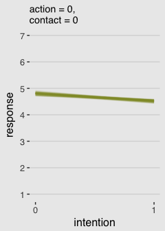

``` r
# Alternative to Figure 11.3.b
make_data_for_an_alternative_fiture(action = 1, 
                                    contact = 0, 
                                    max_iter = 100) %>% 
  
 ggplot(aes(x = intention, y = mean_rating, group = iter)) +
  geom_line(alpha = 1/10, color = canva_pal("Green fields")(4)[1]) +
  scale_x_continuous(breaks = 0:1) +
  scale_y_continuous(breaks = 1:7) +
  coord_cartesian(ylim = 1:7) +
  labs(subtitle = "action = 1,\ncontact = 0",
       x = "intention",
       y = "response") +
  theme_hc() +
  theme(plot.background = element_rect(fill = "grey92"),
        legend.position = "none")
```


``` r
# Alternative to Figure 11.3.c
make_data_for_an_alternative_fiture(action = 0, 
                                    contact = 1, 
                                    max_iter = 100) %>% 
  
  ggplot(aes(x = intention, y = mean_rating, group = iter)) +
  geom_line(alpha = 1/10, color = canva_pal("Green fields")(4)[1]) +
  scale_x_continuous(breaks = 0:1) +
  scale_y_continuous(breaks = 1:7) +
  coord_cartesian(ylim = 1:7) +
  labs(subtitle = "action = 0,\ncontact = 1",
       x = "intention",
       y = "response") +
  theme_hc() +
  theme(plot.background = element_rect(fill = "grey92"),
        legend.position = "none")
```

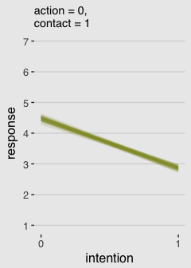

Finally; now those are plots I can sell in a clinical psychology journal!

**End Bonus**

11.2. Zero-inflated outcomes
----------------------------

### 11.2.1. Example: Zero-inflated Poisson.

Here we simulate our drunk monk data.

``` r
# define parameters
prob_drink <- 0.2  # 20% of days
rate_work  <- 1    # average 1 manuscript per day

# sample one year of production
N <- 365

# simulate days monks drink
set.seed(0.2)
drink <- rbinom(N, 1, prob_drink)

# simulate manuscripts completed
y <- (1 - drink)*rpois(N, rate_work)
```

And here we'll put those data in a tidy tibble before plotting.

``` r
d <-
  tibble(Y = y) %>%
  arrange(Y) %>% 
  mutate(zeros = c(rep("zeros_drink", times = sum(drink)),
                   rep("zeros_work",  times = sum(y == 0 & drink == 0)),
                   rep("nope",        times = N - sum(y == 0))
                   )) 
  
  ggplot(data = d, aes(x = Y)) +
  geom_histogram(aes(fill = zeros),
                 binwidth = 1, color = "grey92") +
  scale_fill_manual(values = c(canva_pal("Green fields")(4)[1], 
                               canva_pal("Green fields")(4)[2], 
                               canva_pal("Green fields")(4)[1])) +
  xlab("Manuscripts completed") +
  theme_hc() +
  theme(plot.background = element_rect(fill = "grey92"),
        legend.position = "none")
```

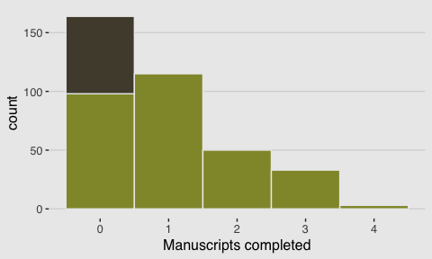

The intercept \[and zi\] only zero-inflated Poisson model:

``` r
b11.4 <- 
  brm(data = d, family = zero_inflated_poisson(),
      Y ~ 1,
      prior = c(set_prior("normal(0, 10)", class = "Intercept"),
                # This is the brms default. See below.
                set_prior("beta(1, 1)", class = "zi")),
      cores = 4)

print(b11.4)
```

    ##  Family: zero_inflated_poisson 
    ##   Links: mu = log; zi = identity 
    ## Formula: Y ~ 1 
    ##    Data: d (Number of observations: 365) 
    ## Samples: 4 chains, each with iter = 2000; warmup = 1000; thin = 1;
    ##          total post-warmup samples = 4000
    ## 
    ## Population-Level Effects: 
    ##           Estimate Est.Error l-95% CI u-95% CI Eff.Sample Rhat
    ## Intercept     0.05      0.09    -0.12     0.22       1070 1.00
    ## 
    ## Family Specific Parameters: 
    ##    Estimate Est.Error l-95% CI u-95% CI Eff.Sample Rhat
    ## zi     0.15      0.06     0.04     0.26        941 1.01
    ## 
    ## Samples were drawn using sampling(NUTS). For each parameter, Eff.Sample 
    ## is a crude measure of effective sample size, and Rhat is the potential 
    ## scale reduction factor on split chains (at convergence, Rhat = 1).

The zero-inflated Poisson is [parameterized in brms](https://cran.r-project.org/web/packages/brms/vignettes/brms_families.html) a little differently than it is in rethinking. The different parameterization did not influence the estimate for the Intercept, *λ*. In both here and in the text, *λ* was about 0.06. However, it did influence the summary of `zi`. Note how McElreaths `logistic(-1.39)` yielded 0.1994078. Seems rather close to our `zi` estimate of 0.15. First off, because he didn’t set his seed in the text before simulating (i.e., `set.seed(<insert some number>)`), we couldn’t exactly reproduce his simulated drunk monk data. So our results will vary a little due to that alone. But after accounting for simulation variance, hopefully it’s clear that `zi` in brms is already in the probability metric. There's no need to convert it.

Anyway, here's that exponentiated *λ*.

``` r
fixef(b11.4)[1, ] %>%
  exp()
```

    ##  Estimate Est.Error      Q2.5     Q97.5 
    ## 1.0489567 1.0893980 0.8880725 1.2404759

11.3. Over-dispersed outcomes
-----------------------------

### 11.3.1. Beta-binomial.

``` r
pbar <- 0.5
theta <- 5

ggplot(data = tibble(x = seq(from = 0, to = 1, by = .01))) +
  geom_ribbon(aes(x = x, 
                  ymin = 0, 
                  ymax = rethinking::dbeta2(x, pbar, theta)),
              fill = canva_pal("Green fields")(4)[1]) +
  scale_x_continuous(breaks = c(0, .5, 1)) +
  scale_y_continuous(NULL, breaks = NULL) +
  labs(title = expression(paste("The ", beta, " distribution")),
       x = "probability space",
       y = "density") +
  theme_hc() +
  theme(plot.background = element_rect(fill = "grey92"))
```

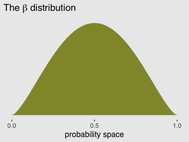

The beta-binomial distribution is [not implemented in brms at this time](https://github.com/paul-buerkner/brms/issues/144). However, brms version 2.2.0 allows users to define custom distributions. You can find the handy [vignette here](https://cran.r-project.org/web/packages/brms/vignettes/brms_customfamilies.html). Happily, Bürkner used the [beta-binomial distribution as the exemplar](https://cran.r-project.org/web/packages/brms/vignettes/brms_customfamilies.html#the-beta-binomial-distribution) in the vignette.

Before we get carried away, let's load the data.

``` r
library(rethinking)
data(UCBadmit)
d <- UCBadmit
```

Unload rethinking and load brms.

``` r
rm(UCBadmit)
detach(package:rethinking, unload = T)
library(brms)
```

I’m not going to go into great detail explaining the ins and outs of making custom distributions for `brm()`. You've got Bürkner's vignette. For our purposes, we need two preparatory steps. First, we need to use the `custom_family()` function to define the name and parameters of the beta-binomial distribution for use in `brm()`. Second, we have to define some relevant Stan functions.

``` r
beta_binomial2 <- 
  custom_family(
    "beta_binomial2", dpars = c("mu", "phi"),
    links = c("logit", "log"), lb = c(NA, 0),
    type = "int", vars = "trials[n]"
  )

stan_funs <- "
  real beta_binomial2_lpmf(int y, real mu, real phi, int T) {
    return beta_binomial_lpmf(y | T, mu * phi, (1 - mu) * phi);
  }
  int beta_binomial2_rng(real mu, real phi, int T) {
    return beta_binomial_rng(T, mu * phi, (1 - mu) * phi);
  }
"
```

With that out of the way, we’re ready to test this baby out. Before we do, a point of clarification: What McElreath referred to as the shape parameter, *θ*, Bürkner called the precision parameter, *ϕ*. It’s the same thing. Perhaps less confusingly, what McElreath called the `pbar` parameter, $\\bar{p}$, Bürkner simply called *μ*.

``` r
b11.5 <-
  brm(data = d, 
      family = beta_binomial2,  # Here's our custom likelihood
      admit | trials(applications) ~ 1,
      prior = c(set_prior("normal(0, 2)", class = "Intercept"),
                set_prior("exponential(1)", class = "phi")),
      iter = 4000, warmup = 1000, cores = 2, chains = 2,
      stan_funs = stan_funs)
```

Success, our results look a lot like those in the text!

``` r
print(b11.5)
```

    ##  Family: beta_binomial2 
    ##   Links: mu = logit; phi = identity 
    ## Formula: admit | trials(applications) ~ 1 
    ##    Data: d (Number of observations: 12) 
    ## Samples: 2 chains, each with iter = 4000; warmup = 1000; thin = 1;
    ##          total post-warmup samples = 6000
    ## 
    ## Population-Level Effects: 
    ##           Estimate Est.Error l-95% CI u-95% CI Eff.Sample Rhat
    ## Intercept    -0.38      0.30    -0.97     0.23       4674 1.00
    ## 
    ## Family Specific Parameters: 
    ##     Estimate Est.Error l-95% CI u-95% CI Eff.Sample Rhat
    ## phi     2.77      0.94     1.29     4.94       4346 1.00
    ## 
    ## Samples were drawn using sampling(NUTS). For each parameter, Eff.Sample 
    ## is a crude measure of effective sample size, and Rhat is the potential 
    ## scale reduction factor on split chains (at convergence, Rhat = 1).

Here's what the corresponding `posterior_samples()` data object looks like.

``` r
post <- posterior_samples(b11.5)

head(post)
```

    ##   b_Intercept      phi      lp__
    ## 1 -0.42592436 2.706726 -70.05676
    ## 2 -0.67241905 2.371558 -70.69063
    ## 3  0.06205196 2.638572 -71.16583
    ## 4 -0.46743789 3.024739 -70.09055
    ## 5 -0.45981497 2.348642 -70.23159
    ## 6 -0.40170257 3.316999 -70.14935

With our `post` object in hand, here's our Figure 11.5.a.

``` r
tibble(x = 0:1) %>%
  ggplot(aes(x = x)) + 
  stat_function(fun = rethinking::dbeta2,
                args = list(prob = mean(invlogit(post[, 1])),
                            theta = mean(post[, 2])),
                color = canva_pal("Green fields")(4)[4],
                size = 1.5) +
  mapply(function(prob, theta) {
    stat_function(fun = rethinking::dbeta2, 
                  args = list(prob = prob, theta = theta), 
                  alpha = .2, 
                  color = canva_pal("Green fields")(4)[4])
  }, 
  # Enter prob and theta, here
  prob = invlogit(post[1:100, 1]),
  theta = post[1:100, 2]) +
  scale_y_continuous(NULL, breaks = NULL) +
  coord_cartesian(ylim = 0:3) +
  labs(x = "probability admit") +
  theme_hc() +
  theme(plot.background = element_rect(fill = "grey92"))
```

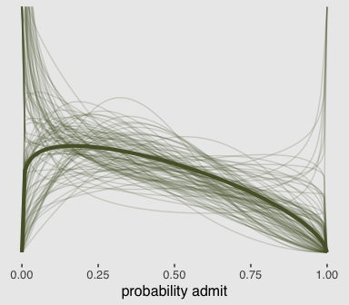

I got the idea to nest `stat_function()` within `mapply()` from [shadow's answer to this Stack Overflow question](http://stackoverflow.com/questions/27009641/plot-multiple-normal-curves-in-same-plot).

Before we can do our variant of Figure 11.5.b., we'll need to specify a few more custom functions. The `log_lik_beta_binomial2()` and `predict_beta_binomial2()` functions are required for `brms::predict()` to work with our `family = beta_binomial2` brmfit object. Similarily, `fitted_beta_binomial2()` is required for `brms::fitted()` to work properly. And before all that, we need to throw in a line with the `expose_functions()` function. Just go with it.

``` r
expose_functions(b11.5, vectorize = TRUE)

# Required to use `predict()`
log_lik_beta_binomial2 <- 
  function(i, draws) {
    mu  <- draws$dpars$mu[, i]
    phi <- draws$dpars$phi
    N   <- draws$data$trials[i]
    y   <- draws$data$Y[i]
    beta_binomial2_lpmf(y, mu, phi, N)
  }

predict_beta_binomial2 <- 
  function(i, draws, ...) {
    mu  <- draws$dpars$mu[, i]
    phi <- draws$dpars$phi
    N   <- draws$data$trials[i]
    beta_binomial2_rng(mu, phi, N)
  }

# Required to use `fitted()`
fitted_beta_binomial2 <- 
  function(draws) {
    mu     <- draws$dpars$mu
    trials <- draws$data$trials
    trials <- matrix(trials, nrow = nrow(mu), ncol = ncol(mu), byrow = TRUE)
    mu * trials
  }
```

With those intermediary steps out of the way, we're ready to make Figure 11.5.b.

``` r
# The prediction intervals
predict(b11.5) %>%
  as_tibble() %>% 
  rename(LL = Q2.5,
         UL = Q97.5) %>%
  select(LL:UL) %>% 
  # The fitted intervals
  bind_cols(
    fitted(b11.5) %>%
  as_tibble()
  ) %>% 
  # The original data used to fit the model
  bind_cols(b11.5$data) %>% 
  mutate(case = 1:12) %>% 
  
  ggplot(aes(x = case)) +
  geom_linerange(aes(ymin = LL/applications, 
                     ymax = UL/applications),
                 color = canva_pal("Green fields")(4)[1], 
                 size = 2.5, alpha = 1/4) +
  geom_pointrange(aes(ymin = Q2.5/applications, 
                      ymax = Q97.5/applications, 
                      y = Estimate/applications),
                  color = canva_pal("Green fields")(4)[4],
                  size = 1/2, shape = 1) +
  geom_point(aes(y = admit/applications),
             color = canva_pal("Green fields")(4)[2],
             size = 2) +
  scale_x_continuous(breaks = 1:12) +
  scale_y_continuous(breaks = c(0, .5, 1)) +
  coord_cartesian(ylim = 0:1) +
  labs(subtitle = "Posterior validation check",
       y = "Admittance probability") +
  theme_hc() +
  theme(plot.background = element_rect(fill = "grey92"),
        axis.ticks.x = element_blank(),
        legend.position = "none")
```

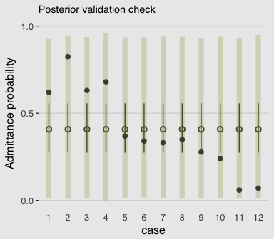

As in the text, the raw data are consistent with the prediction intervals. But those intervals are so incredibly wide, they're hardly an endorsement of the model.

### 11.3.2. Negative-binomial or gamma-Poisson.

Here's a look at the *γ* distribution.

``` r
mu <- 3
theta <- 1

ggplot(data = tibble(x = seq(from = 0, to = 12, by = .01)),
       aes(x = x)) +
  geom_ribbon(aes(ymin = 0, 
                  ymax = rethinking::dgamma2(x, mu, theta)),
              color = "transparent", 
              fill = canva_pal("Green fields")(4)[4]) +
  geom_vline(xintercept = mu, linetype = 3,
             color = canva_pal("Green fields")(4)[3]) +
  scale_x_continuous(NULL, breaks = c(0, mu, 10)) +
  scale_y_continuous(NULL, breaks = NULL) +
  coord_cartesian(xlim = 0:10) +
  ggtitle(expression(paste("Our sweet ", gamma))) +
  theme_hc() +
  theme(plot.background = element_rect(fill = "grey92"))
```


##### Bonus

McElreath didn't give an example of negative-binomial regression in the text. Here's one with the `UCBadmit` data.

``` r
brm(data = d, family = negbinomial,
      admit ~ 1 + applicant.gender,
      prior = c(set_prior("normal(0, 10)", class = "Intercept"),
                set_prior("normal(0, 1)", class = "b"),
                set_prior("gamma(0.01, 0.01)", class = "shape")),  # this is the brms default
      iter = 4000, warmup = 1000, cores = 2, chains = 2,
      control = list(adapt_delta = 0.8)) %>% 
  
  print()
```

    ##  Family: negbinomial 
    ##   Links: mu = log; shape = identity 
    ## Formula: admit ~ 1 + applicant.gender 
    ##    Data: d (Number of observations: 12) 
    ## Samples: 2 chains, each with iter = 4000; warmup = 1000; thin = 1;
    ##          total post-warmup samples = 6000
    ## 
    ## Population-Level Effects: 
    ##                      Estimate Est.Error l-95% CI u-95% CI Eff.Sample Rhat
    ## Intercept                4.70      0.40     3.99     5.60       4073 1.00
    ## applicant.gendermale     0.58      0.50    -0.45     1.56       4251 1.00
    ## 
    ## Family Specific Parameters: 
    ##       Estimate Est.Error l-95% CI u-95% CI Eff.Sample Rhat
    ## shape     1.24      0.49     0.50     2.37       3956 1.00
    ## 
    ## Samples were drawn using sampling(NUTS). For each parameter, Eff.Sample 
    ## is a crude measure of effective sample size, and Rhat is the potential 
    ## scale reduction factor on split chains (at convergence, Rhat = 1).

Since the negative-binomial model uses the log link, you need to exponentiate to get the estimates back into the count metric. E.g.,

``` r
exp(4.69)
```

    ## [1] 108.8532

Note. The analyses in this document were done with:

-   R 3.4.4
-   RStudio 1.1.442
-   rmarkdown 1.9
-   rethinking 1.59
-   brms 2.3.1
-   rstan 2.17.3
-   ggthemes 3.5.0
-   tidyverse 1.2.1
-   broom 0.4.3

Reference
---------

McElreath, R. (2016). *Statistical rethinking: A Bayesian course with examples in R and Stan.* Chapman & Hall/CRC Press.
