Ch. 12 Multilevel Models
================
A Solomon Kurz
2018-06-11

12.1. Example: Multilevel tadpoles
----------------------------------

Let's get the `reedfrogs` data from rethinking.

``` r
library(rethinking)
data(reedfrogs)
d <- reedfrogs
```

Detach rethinking and load brms.

``` r
rm(reedfrogs)
detach(package:rethinking, unload = T)
library(brms)
```

Go ahead and acquaint yourself with the `reedfrogs`.

``` r
library(tidyverse)
d %>%
  glimpse()
```

    ## Observations: 48
    ## Variables: 5
    ## $ density  <int> 10, 10, 10, 10, 10, 10, 10, 10, 10, 10, 10, 10, 10, 1...
    ## $ pred     <fctr> no, no, no, no, no, no, no, no, pred, pred, pred, pr...
    ## $ size     <fctr> big, big, big, big, small, small, small, small, big,...
    ## $ surv     <int> 9, 10, 7, 10, 9, 9, 10, 9, 4, 9, 7, 6, 7, 5, 9, 9, 24...
    ## $ propsurv <dbl> 0.90, 1.00, 0.70, 1.00, 0.90, 0.90, 1.00, 0.90, 0.40,...

Making the `tank` cluster variable is easy.

``` r
d <- 
  d %>%
  mutate(tank = 1:nrow(d))
```

Here's the un-pooled model in which each `tank` gets its own intercept.

``` r
b12.1 <- 
  brm(data = d, family = binomial,
      surv | trials(density) ~ 0 + factor(tank),
      prior = c(set_prior("normal(0, 5)", class = "b")),
      chains = 4, iter = 2000, warmup = 500, cores = 4)
```

You specify the corresponding multilevel model like this.

``` r
b12.2 <- 
  brm(data = d, family = binomial,
      surv | trials(density) ~ 1 + (1 | tank),
      prior = c(set_prior("normal(0, 1)", class = "Intercept"),
                set_prior("cauchy(0, 1)", class = "sd")),
      chains = 4, iter = 4000, warmup = 1000, cores = 4)
```

The syntax for the varying effects follows the [lme4 style](https://cran.r-project.org/web/packages/brms/vignettes/brms_overview.pdf), `( [varying predictor(s)] | [grouping variable(s) )`. In this case `(1 | tank)` indicates only the intercept, `1`, varies by `tank`. The extent to which they vary is controlled by the prior `set_prior("cauchy(0, 1)", class = "sd")`, which is parameterized in the standard deviation metric.

Instead of computing the information criteria for each model, saving the results as objects and then placing those objects in `compare_ic()`, we can also just but both fit objects in `waic()` or `loo()`.

``` r
waic(b12.1, b12.2)
```

    ##                 WAIC   SE
    ## b12.1         201.29 9.40
    ## b12.2         200.47 7.18
    ## b12.1 - b12.2   0.82 4.52

``` r
loo(b12.1, b12.2)
```

    ## Warning: Found 40 observations with a pareto_k > 0.7 in model 'b12.1'.
    ## With this many problematic observations, it may be more appropriate to use
    ## 'kfold' with argument 'K = 10' to perform 10-fold cross-validation rather
    ## than LOO.

    ## Warning: Found 43 observations with a pareto_k > 0.7 in model 'b12.2'.
    ## With this many problematic observations, it may be more appropriate to use
    ## 'kfold' with argument 'K = 10' to perform 10-fold cross-validation rather
    ## than LOO.

    ##                LOOIC    SE
    ## b12.1         231.49 10.55
    ## b12.2         227.19  8.36
    ## b12.1 - b12.2   4.30  6.65

Note those "pareto\_k &gt; 0.7" warnings. We can follow the advice and use the `kfold()` function, instead. We'll also go ahead and specify `K = 10`, as recommended. But beware, this takes a few minutes.

``` r
kf <- kfold(b12.1, b12.2, 
            K = 10, cores = 4)
```

``` r
kf
```

    ##               KFOLDIC    SE
    ## b12.1          323.47 13.05
    ## b12.2          264.34 12.96
    ## b12.1 - b12.2   59.13  8.56

The *K*-fold cross-validation difference of 59, with a standard error around 9, suggests that model `b12.2` is the clear favorite relative to `b12.1`. For more on the `kfold()` function, see the [brms reference manual](https://cran.r-project.org/web/packages/brms/brms.pdf).

But here's our prep work for Figure 12.1

``` r
post <- posterior_samples(b12.2)

invlogit <- function(x){1/(1+exp(-x))}

postMdn <- 
  coef(b12.2, robust = T) %>% data.frame() %>%
  add_column(tank = d$tank,
             density = d$density,
             propsurv = d$propsurv) %>%
  mutate(postMdn = invlogit(tank.Estimate.Intercept))
```

Recall that we can use Gelman and Hill's (2007) `invlogit()` function in place of the `logistic()` function in rethinking.

For kicks and giggles, let's use a [FiveThirtyEight-like theme](https://github.com/alex23lemm/theme_fivethirtyeight) for our plots. An easy way to do so is with help from the [ggthemes package](https://cran.r-project.org/web/packages/ggthemes/index.html).

``` r
# install.packages("ggthemes", dependencies = T) 

library(ggthemes) 
```

Finally, here's the ggplot2 code to reproduce Figure 12.1.

``` r
postMdn %>%
  ggplot(aes(x = tank, y = postMdn)) +
  theme_fivethirtyeight() +
  geom_hline(yintercept = invlogit(median(post$b_Intercept)), linetype = 2, size = 1/4) +
  geom_vline(xintercept = c(16.5, 32.5), size = 1/4) +
  geom_point(shape = 1) +
  geom_point(aes(y = propsurv), color = "orange2") +
  coord_cartesian(ylim = c(0, 1)) +
  scale_x_continuous(breaks = c(1, 16, 32, 48)) +
  labs(title = "Proportion of survivors in each tank",
       subtitle = "The empirical proportions are in orange while the\nmodel-implied proportions are the black circles.\nThe dashed line is the model-implied average survival proportion.") +
  annotate("text", x = c(8, 16 + 8, 32 + 8), y = 0, 
           label = c("small tanks", "medium tanks", "large tanks")) +
  theme(panel.grid = element_blank())
```

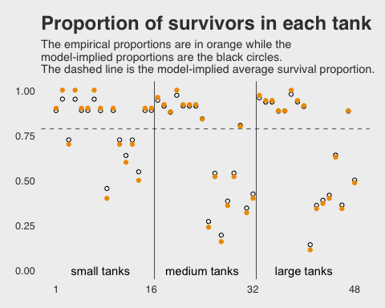

Here is our version of Figure 12.2.a.

``` r
tibble(x = c(-3, 4)) %>%
  
  ggplot(aes(x = x)) + 
  theme_fivethirtyeight() +
  mapply(function(mean, sd) {
    stat_function(fun = dnorm, 
                  args = list(mean = mean, sd = sd), 
                  alpha = .2, 
                  color = "orange2")
  }, 
  # Enter means and standard deviations here
  mean = post[1:100, 1],
  sd = post[1:100, 2]
  ) +
  labs(title = "Survival in log-odds") +
  scale_y_continuous(NULL, breaks = NULL)
```

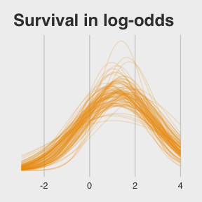

I got the idea to nest `stat_function()` within `mapply()` from [shadow's answer to this Stack Overflow question](http://stackoverflow.com/questions/27009641/plot-multiple-normal-curves-in-same-plot).

Anyway, here's the code for Figure 12.2.b.

``` r
ggplot(data = post, 
       aes(x = invlogit(rnorm(nrow(post), mean = post[, 1], sd = post[, 2])))) +
  theme_fivethirtyeight() +
  geom_density(size = 0, fill = "orange2") +
  labs(title = "Probability of survival") +
  scale_y_continuous(NULL, breaks = NULL)
```

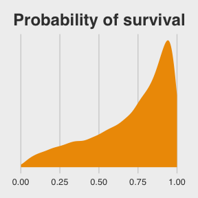

Note how we sampled 12,000 imaginary `tanks` rather than McElreath's 8,000. This is because we had 12,000 HMC iterations (i.e., `nrow(post)`).

The `aes()` code, above, was a bit much. To get a sense of how it worked, consider this:

``` r
rnorm(1, mean = post[, 1], sd = post[, 2]) %>% 
  invlogit()
```

    ## [1] 0.9306645

First, we took one random draw from a normal distribution with a mean of the first row in `post[, 1]` and a standard deviation of the value from the first row in `post[, 2]`, and passed it through the `invlogit()` function. By replacing the `1` `nrow(post)`, we do this `nrow(post)` times (i.e., 12,000). So our orange density is the summary of that process.

##### Overthinking: Prior for variance components.

Yep, you can use the exponential distribution for your priors in brms. Here it is for model `b12.2`.

``` r
b12.2.e <- 
  brm(data = d, family = binomial,
      surv | trials(density) ~ 1 + (1 | tank),
      prior = c(set_prior("normal(0, 1)", class = "Intercept"),
                set_prior("exponential(1)", class = "sd")),
      chains = 4, iter = 2000, warmup = 500, cores = 4)
```

The model summary:

``` r
print(b12.2.e)
```

    ##  Family: binomial 
    ##   Links: mu = logit 
    ## Formula: surv | trials(density) ~ 1 + (1 | tank) 
    ##    Data: d (Number of observations: 48) 
    ## Samples: 4 chains, each with iter = 2000; warmup = 500; thin = 1;
    ##          total post-warmup samples = 6000
    ## 
    ## Group-Level Effects: 
    ## ~tank (Number of levels: 48) 
    ##               Estimate Est.Error l-95% CI u-95% CI Eff.Sample Rhat
    ## sd(Intercept)     1.60      0.21     1.24     2.05       1473 1.00
    ## 
    ## Population-Level Effects: 
    ##           Estimate Est.Error l-95% CI u-95% CI Eff.Sample Rhat
    ## Intercept     1.31      0.25     0.84     1.82       1133 1.00
    ## 
    ## Samples were drawn using sampling(NUTS). For each parameter, Eff.Sample 
    ## is a crude measure of effective sample size, and Rhat is the potential 
    ## scale reduction factor on split chains (at convergence, Rhat = 1).

If you're curious how the exponential prior compares to the posterior, you might just plot.

``` r
ggplot(data = tibble(x = seq(from = 0, to = 4, by = .01)), 
       aes(x = x)) +
  theme_fivethirtyeight()+
  geom_ribbon(aes(ymin = 0, ymax = dexp(x, rate = 1)),  # the prior
              fill = "orange2", alpha = 1/3) +
  geom_density(data = posterior_samples(b12.2.e),       # the posterior
               aes(x = sd_tank__Intercept), 
               size = 0, fill = "orange2") +
  geom_vline(xintercept = posterior_samples(b12.2.e)[, 2] %>% median(),
             color = "blue", linetype = 2) +
  scale_y_continuous(NULL, breaks = NULL) +
  coord_cartesian(xlim = c(0, 3.5)) +
  labs(title = "Bonus prior/posterior plot\n for `sd_tank__Intercept`",
       subtitle = "The prior is the semitransparent ramp in the\nbackground. The posterior is the solid orange\nmound. The dashed line is the posterior median.")
```

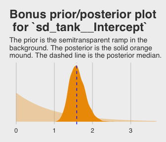

12.2. Varying effects and the underfitting/overfitting trade-off
----------------------------------------------------------------

### 12.2.2. Assign values to the parameters.

``` r
a      <- 1.4
sigma  <- 1.5
nponds <- 60
ni     <- rep(c(5, 10, 25, 35), each = 15) %>% as.integer()

set.seed(10579595) # To make results reproducible
dsim <- 
  tibble(pond = 1:nponds,
         ni = ni,
         true_a = rnorm(nponds, mean = a, sd = sigma))
```

### 12.2.3. Sumulate survivors.

``` r
set.seed(10579595) # To make results reproducible
dsim <-
  dsim %>%
  mutate(si = rbinom(nponds, prob = invlogit(true_a), size = ni)) %>%
  mutate(p_nopool = si/ni) 

dsim %>% 
  glimpse()
```

    ## Observations: 60
    ## Variables: 5
    ## $ pond     <int> 1, 2, 3, 4, 5, 6, 7, 8, 9, 10, 11, 12, 13, 14, 15, 16...
    ## $ ni       <int> 5, 5, 5, 5, 5, 5, 5, 5, 5, 5, 5, 5, 5, 5, 5, 10, 10, ...
    ## $ true_a   <dbl> 3.1085100, 3.6798855, 2.6097976, 4.2842340, 3.2304515...
    ## $ si       <int> 4, 5, 4, 5, 5, 4, 4, 2, 4, 2, 5, 4, 2, 4, 4, 10, 7, 1...
    ## $ p_nopool <dbl> 0.8, 1.0, 0.8, 1.0, 1.0, 0.8, 0.8, 0.4, 0.8, 0.4, 1.0...

### 12.2.5. Compute the partial-pooling estimates.

Set `chains = 1, cores = 1` for a one-chain model in brms.

``` r
b12.3 <- 
  brm(data = dsim, family = binomial,
      si | trials(ni) ~ 1 + (1 | pond),
      prior = c(set_prior("normal(0, 1)", class = "Intercept"),
                set_prior("cauchy(0, 1)", class = "sd")),
      iter = 10000, warmup = 1000, chains = 1, cores = 1)
```

    ## 
    ## SAMPLING FOR MODEL 'binomial brms-model' NOW (CHAIN 1).
    ## 
    ## Gradient evaluation took 5.8e-05 seconds
    ## 1000 transitions using 10 leapfrog steps per transition would take 0.58 seconds.
    ## Adjust your expectations accordingly!
    ## 
    ## 
    ## Iteration:    1 / 10000 [  0%]  (Warmup)
    ## Iteration: 1000 / 10000 [ 10%]  (Warmup)
    ## Iteration: 1001 / 10000 [ 10%]  (Sampling)
    ## Iteration: 2000 / 10000 [ 20%]  (Sampling)
    ## Iteration: 3000 / 10000 [ 30%]  (Sampling)
    ## Iteration: 4000 / 10000 [ 40%]  (Sampling)
    ## Iteration: 5000 / 10000 [ 50%]  (Sampling)
    ## Iteration: 6000 / 10000 [ 60%]  (Sampling)
    ## Iteration: 7000 / 10000 [ 70%]  (Sampling)
    ## Iteration: 8000 / 10000 [ 80%]  (Sampling)
    ## Iteration: 9000 / 10000 [ 90%]  (Sampling)
    ## Iteration: 10000 / 10000 [100%]  (Sampling)
    ## 
    ##  Elapsed Time: 0.834799 seconds (Warm-up)
    ##                5.61893 seconds (Sampling)
    ##                6.45373 seconds (Total)

``` r
print(b12.3)
```

    ##  Family: binomial 
    ##   Links: mu = logit 
    ## Formula: si | trials(ni) ~ 1 + (1 | pond) 
    ##    Data: dsim (Number of observations: 60) 
    ## Samples: 1 chains, each with iter = 10000; warmup = 1000; thin = 1;
    ##          total post-warmup samples = 9000
    ## 
    ## Group-Level Effects: 
    ## ~pond (Number of levels: 60) 
    ##               Estimate Est.Error l-95% CI u-95% CI Eff.Sample Rhat
    ## sd(Intercept)     1.34      0.18     1.02     1.73       2920 1.00
    ## 
    ## Population-Level Effects: 
    ##           Estimate Est.Error l-95% CI u-95% CI Eff.Sample Rhat
    ## Intercept     1.29      0.20     0.90     1.70       3098 1.00
    ## 
    ## Samples were drawn using sampling(NUTS). For each parameter, Eff.Sample 
    ## is a crude measure of effective sample size, and Rhat is the potential 
    ## scale reduction factor on split chains (at convergence, Rhat = 1).

I'm not aware that you can use McElreath's `depth = 2` trick in brms for `summary()` or `print()`. But can get that information with the `coef()` function.

``` r
coef(b12.3)$pond[c(1:2, 59:60), , ] %>% 
  round(digits = 2)
```

    ##    Estimate Est.Error  Q2.5 Q97.5
    ## 1      1.47      0.88 -0.13  3.28
    ## 2      2.34      1.01  0.54  4.50
    ## 59     1.59      0.42  0.80  2.47
    ## 60     2.59      0.59  1.54  3.87

Here we get ready for the diagnostic plot, Figure 12.3.

``` r
dsim %>% 
  glimpse()
```

    ## Observations: 60
    ## Variables: 5
    ## $ pond     <int> 1, 2, 3, 4, 5, 6, 7, 8, 9, 10, 11, 12, 13, 14, 15, 16...
    ## $ ni       <int> 5, 5, 5, 5, 5, 5, 5, 5, 5, 5, 5, 5, 5, 5, 5, 10, 10, ...
    ## $ true_a   <dbl> 3.1085100, 3.6798855, 2.6097976, 4.2842340, 3.2304515...
    ## $ si       <int> 4, 5, 4, 5, 5, 4, 4, 2, 4, 2, 5, 4, 2, 4, 4, 10, 7, 1...
    ## $ p_nopool <dbl> 0.8, 1.0, 0.8, 1.0, 1.0, 0.8, 0.8, 0.4, 0.8, 0.4, 1.0...

``` r
p_partpool <- 
  coef(b12.3) %>% 
  data.frame() %>%  # as_tibble() didn't work well, for this.
  select(pond.Estimate.Intercept) %>%
  mutate(pond.Estimate.Intercept = invlogit(pond.Estimate.Intercept)) %>%
  pull()

dsim <- 
  dsim %>%
  mutate(p_true = invlogit(true_a)) %>%
  mutate(nopool_error = abs(p_nopool - p_true)) %>%
  mutate(partpool_error = abs(p_partpool - p_true))

dsim %>% 
  glimpse()
```

    ## Observations: 60
    ## Variables: 8
    ## $ pond           <int> 1, 2, 3, 4, 5, 6, 7, 8, 9, 10, 11, 12, 13, 14, ...
    ## $ ni             <int> 5, 5, 5, 5, 5, 5, 5, 5, 5, 5, 5, 5, 5, 5, 5, 10...
    ## $ true_a         <dbl> 3.1085100, 3.6798855, 2.6097976, 4.2842340, 3.2...
    ## $ si             <int> 4, 5, 4, 5, 5, 4, 4, 2, 4, 2, 5, 4, 2, 4, 4, 10...
    ## $ p_nopool       <dbl> 0.8, 1.0, 0.8, 1.0, 1.0, 0.8, 0.8, 0.4, 0.8, 0....
    ## $ p_true         <dbl> 0.9572424, 0.9753948, 0.9314895, 0.9864032, 0.9...
    ## $ nopool_error   <dbl> 0.15724241, 0.02460518, 0.13148948, 0.01359676,...
    ## $ partpool_error <dbl> 0.1445969494, 0.0632212877, 0.1207325431, 0.074...

Here is our code for Figure 12.3. The extra data processing for `dfline` is how we get the values necessary for the horizontal summary lines.

``` r
dfline <- 
  dsim %>%
  select(ni, nopool_error:partpool_error) %>%
  gather(key, value, -ni) %>%
  group_by(key, ni) %>%
  summarise(mean_error = mean(value)) %>%
  mutate(x = c(1, 16, 31, 46),
         xend = c(15, 30, 45, 60))
  
ggplot(data = dsim, aes(x = pond)) +
  theme_fivethirtyeight() +
  geom_vline(xintercept = c(15.5, 30.5, 45.4), 
             color = "white", size = 2/3) +
  geom_point(aes(y = nopool_error), color = "orange2") +
  geom_point(aes(y = partpool_error), shape = 1) +
  geom_segment(data = dfline, 
               aes(x = x, xend = xend, 
                   y = mean_error, yend = mean_error),
               color = rep(c("orange2", "black"), each = 4),
               linetype = rep(1:2, each = 4)) +
  labs(y = "absolute error",
       title = "Estimate error by model type",
       subtitle = "The horizontal axis displays pond number. The vertical\naxis measures the absolute error in the predicted proportion\nof survivors, compared to the true value used in the simulation.\nThe higher the point, the worse the estimate. No-pooling shown\nin orange. Partial pooling shown in black. The orange and\ndashed black lines show the average error for each kind of\nestimate, across each initial density of tadpoles (pond size).\nSmaller ponds produce more error, but the partial pooling\nestimates are better on average, especially in smaller ponds.") +
  scale_x_continuous(breaks = c(1, 10, 20, 30, 40, 50, 60)) +
  annotate("text", x = c(15 - 7.5, 30 - 7.5, 45 - 7.5, 60 - 7.5), y = .45, 
           label = c("tiny (5)", "small (10)", "medium (25)", "large (35)")) +
  theme(panel.grid = element_blank())
```

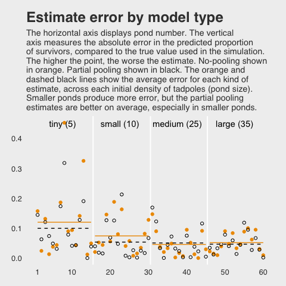

If you wanted to quantify the difference in simple summaries, you might do something like this:

``` r
dsim %>%
  select(ni, nopool_error:partpool_error) %>%
  gather(key, value, -ni) %>%
  group_by(key) %>%
  summarise(mean_error   = mean(value) %>% round(digits = 3),
            median_error = median(value) %>% round(digits = 3))
```

    ## # A tibble: 2 x 3
    ##   key            mean_error median_error
    ##   <chr>               <dbl>        <dbl>
    ## 1 nopool_error       0.0730       0.0480
    ## 2 partpool_error     0.0630       0.0430

### 12.3.1. Multilevel chimpanzees.

Behold our two identical Gaussians in a tidy tibble.

``` r
set.seed(241)
two_gaussians <- 
  tibble(y1 = rnorm(n = 1e4, mean = 10, sd = 1),
         y2 = 10 + rnorm(n = 1e4, mean = 0, sd = 1))
```

Let's follow McElreath's advice to make sure they are same by superimposing the density of one on the other.

``` r
two_gaussians %>%
  
  ggplot() +
  theme_fivethirtyeight() +
  geom_density(aes(x = y1), 
               size = 0, fill = "orange1", alpha = 1/3) +
  geom_density(aes(x = y2), 
               size = 0, fill = "orange4", alpha = 1/3) +
  scale_y_continuous(NULL, breaks = NULL) +
  labs(title = "Our simulated Gaussians")
```

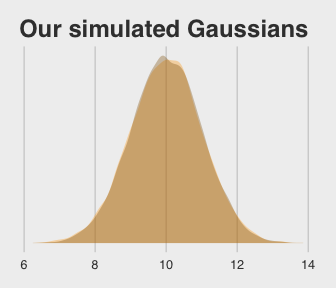

Yep, those Gaussians look about the same.

Let's get the `chimpanzees` data from rethinking.

``` r
library(rethinking)
data(chimpanzees)
d <- chimpanzees
```

Detach rethinking and reload brms.

``` r
rm(chimpanzees)
detach(package:rethinking, unload = T)
library(brms)
```

For our brms model with varying intercepts for `actor` but not `block`, we employ the `pulled_left ~ 1 + ... + (1 | actor)` syntax, specifically omitting a `(1 | block)` section.

``` r
b12.4 <- 
  brm(data = d, family = binomial,
      pulled_left ~ 1 + prosoc_left + prosoc_left:condition + (1 | actor),
      prior = c(set_prior("normal(0, 10)", class = "Intercept"),
                set_prior("normal(0, 10)", class = "b"),
                set_prior("cauchy(0, 1)", class = "sd")),
      chains = 4, iter = 5000, warmup = 1000, cores = 4,
      control = list(adapt_delta = 0.95))
```

The initial solutions came with a few divergent transitions. Increasing `adapt_delta` to `.95` solved the problem. You can also solve the problem with more strongly regularizing priors such as `normal(0, 2)` on the intercept and slope parameters (see [recommendations from the Stan team](https://github.com/stan-dev/stan/wiki/Prior-Choice-Recommendations)). Consider trying both methods and comparing the results. They're similar.

Here we add the `actor`-level deviations to the fixed intercept, the grand mean.

``` r
post <- posterior_samples(b12.4)

post %>%
  select(`r_actor[1,Intercept]`:`r_actor[7,Intercept]`) %>%
  gather() %>%
  # This is how we add the grand mean to the actor-level deviations
  mutate(value = value + post$b_Intercept) %>% 
  group_by(key) %>%
  summarise(mean = mean(value) %>% round(digits = 2))
```

    ## # A tibble: 7 x 2
    ##   key                    mean
    ##   <chr>                 <dbl>
    ## 1 r_actor[1,Intercept] -0.710
    ## 2 r_actor[2,Intercept]  4.60 
    ## 3 r_actor[3,Intercept] -1.02 
    ## 4 r_actor[4,Intercept] -1.02 
    ## 5 r_actor[5,Intercept] -0.710
    ## 6 r_actor[6,Intercept]  0.230
    ## 7 r_actor[7,Intercept]  1.76

Here's another way to get at the same information, this time using `coef()` and a little formatting help from the `tidyverse::str_c()` function. Just for kicks, we'll throw in the 95% intervals, too.

``` r
coef(b12.4)$actor[ , c(1, 3:4), 1] %>%
  as_tibble() %>%
  round(digits = 2) %>%
  # Here we put the credible intervals in an APA-6-style format
  mutate(`95% CIs` = str_c("[", Q2.5, ", ", Q97.5, "]")) %>%
  mutate(actor = str_c("chimp #", 1:7)) %>%
  rename(mean = Estimate) %>%
  select(actor, mean, `95% CIs`)
```

    ## # A tibble: 7 x 3
    ##   actor      mean `95% CIs`     
    ##   <chr>     <dbl> <chr>         
    ## 1 chimp #1 -0.710 [-1.25, -0.19]
    ## 2 chimp #2  4.60  [2.56, 8.54]  
    ## 3 chimp #3 -1.02  [-1.58, -0.48]
    ## 4 chimp #4 -1.02  [-1.58, -0.49]
    ## 5 chimp #5 -0.710 [-1.25, -0.19]
    ## 6 chimp #6  0.230 [-0.29, 0.77] 
    ## 7 chimp #7  1.76  [1.06, 2.56]

If you prefer the posterior median to the mean, just add a `robust = T` argument inside the `coef()` function.

### 12.3.2. Two types of cluster.

Our brms model with varying intercepts for both `actor` and `block` now employs the `... (1 | actor) + (1 | block)` syntax.

``` r
b12.5 <- 
  brm(data = d, family = binomial,
      pulled_left ~ 1 + prosoc_left + prosoc_left:condition + 
        (1 | actor) + (1 | block),
      prior = c(set_prior("normal(0, 10)", class = "Intercept"),
                set_prior("normal(0, 10)", class = "b"),
                set_prior("cauchy(0, 1)", class = "sd")),
      iter = 6000, warmup = 1000, cores = 4, chains = 4, 
      control = list(adapt_delta = 0.99))
```

Again with the divergent transitions issue. Increasing `adapt_delta` to `.99` worked fine. Again, we can look at the primary coefficients with `print()`, but need to use the `coef()` function to get those `depth = 2` estimates.

``` r
print(b12.5)
```

    ##  Family: binomial 
    ##   Links: mu = logit 
    ## Formula: pulled_left ~ 1 + prosoc_left + prosoc_left:condition + (1 | actor) + (1 | block) 
    ##    Data: d (Number of observations: 504) 
    ## Samples: 4 chains, each with iter = 6000; warmup = 1000; thin = 1;
    ##          total post-warmup samples = 20000
    ## 
    ## Group-Level Effects: 
    ## ~actor (Number of levels: 7) 
    ##               Estimate Est.Error l-95% CI u-95% CI Eff.Sample Rhat
    ## sd(Intercept)     2.29      0.97     1.13     4.68       5109 1.00
    ## 
    ## ~block (Number of levels: 6) 
    ##               Estimate Est.Error l-95% CI u-95% CI Eff.Sample Rhat
    ## sd(Intercept)     0.22      0.18     0.01     0.69       7538 1.00
    ## 
    ## Population-Level Effects: 
    ##                       Estimate Est.Error l-95% CI u-95% CI Eff.Sample Rhat
    ## Intercept                 0.45      0.95    -1.33     2.47       4572 1.00
    ## prosoc_left               0.83      0.26     0.31     1.35      13216 1.00
    ## prosoc_left:condition    -0.13      0.30    -0.73     0.45      12916 1.00
    ## 
    ## Samples were drawn using sampling(NUTS). For each parameter, Eff.Sample 
    ## is a crude measure of effective sample size, and Rhat is the potential 
    ## scale reduction factor on split chains (at convergence, Rhat = 1).

``` r
coef(b12.5)$actor[, , "Intercept"] %>% 
  round(digits = 2)
```

    ##   Estimate Est.Error  Q2.5 Q97.5
    ## 1    -0.72      0.30 -1.31 -0.14
    ## 2     4.64      1.68  2.56  8.64
    ## 3    -1.02      0.30 -1.63 -0.45
    ## 4    -1.02      0.30 -1.62 -0.44
    ## 5    -0.72      0.30 -1.31 -0.14
    ## 6     0.23      0.29 -0.34  0.82
    ## 7     1.77      0.40  1.04  2.60

``` r
coef(b12.5)$block[, , "Intercept"] %>% 
  round(digits = 2)
```

    ##   Estimate Est.Error  Q2.5 Q97.5
    ## 1     0.27      0.96 -1.54  2.32
    ## 2     0.49      0.95 -1.29  2.52
    ## 3     0.50      0.95 -1.28  2.52
    ## 4     0.46      0.95 -1.31  2.49
    ## 5     0.42      0.96 -1.36  2.45
    ## 6     0.56      0.95 -1.22  2.57

We might make the coefficient plot in Figure 12.4.a. like this:

``` r
library(bayesplot)
color_scheme_set("orange")

stanplot(b12.5, pars = c("^r_", "^b_", "^sd_")) +
  theme_fivethirtyeight() +
  theme(axis.text.y = element_text(hjust = 0))
```

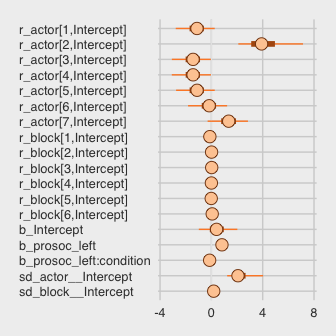

You don't always have to explicitly call bayesplot with `library()`, but doing so allowed us to alter the default color scheme.

Once we get the posterior samples, it's easy to compare the random variances as in Figure 12.4.b.

``` r
posterior_samples(b12.5) %>%
  
  ggplot(aes(x = sd_actor__Intercept)) +
  theme_fivethirtyeight() +
  geom_density(size = 0, fill = "orange1", alpha = 3/4) +
  geom_density(aes(x = sd_block__Intercept), 
               size = 0, fill = "orange4", alpha = 3/4)  +
  scale_y_continuous(NULL, breaks = NULL) +
  coord_cartesian(xlim = c(0, 4)) +
  labs(title = expression(sigma)) +
  annotate("text", x = 2/3, y = 2, label = "block", color = "orange4") +
  annotate("text", x = 2, y = 3/4, label = "actor", color = "orange1")
```

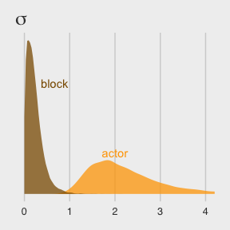

We might compare our models by their PSIS-LOO values.

``` r
l.b12.4 <- loo(b12.4, cores = 4)
```

    ## Using the maximum response value as the number of trials.
    ## Using the maximum response value as the number of trials.

``` r
l.b12.5 <- loo(b12.5, cores = 4)
```

    ## Using the maximum response value as the number of trials.
    ## Using the maximum response value as the number of trials.

``` r
compare_ic(l.b12.4, l.b12.5)
```

    ##                LOOIC    SE
    ## b12.4         531.60 19.50
    ## b12.5         532.79 19.69
    ## b12.4 - b12.5  -1.19  1.73

And you can get the LOO version of the `p_waic`, the `p_loo`, like so.

``` r
l.b12.4
```

    ## 
    ## Computed from 16000 by 504 log-likelihood matrix
    ## 
    ##          Estimate   SE
    ## elpd_loo   -265.8  9.8
    ## p_loo         8.2  0.4
    ## looic       531.6 19.5
    ## ------
    ## Monte Carlo SE of elpd_loo is 0.0.
    ## 
    ## All Pareto k estimates are good (k < 0.5).
    ## See help('pareto-k-diagnostic') for details.

``` r
l.b12.5
```

    ## 
    ## Computed from 20000 by 504 log-likelihood matrix
    ## 
    ##          Estimate   SE
    ## elpd_loo   -266.4  9.8
    ## p_loo        10.4  0.5
    ## looic       532.8 19.7
    ## ------
    ## Monte Carlo SE of elpd_loo is 0.0.
    ## 
    ## All Pareto k estimates are good (k < 0.5).
    ## See help('pareto-k-diagnostic') for details.

And if you peek at the structure of the loo objects, you'll see you can call the `p_loo` values directly with something like `l.b12.5$ estimates["p_loo",]`.

The results are quite similar to those in the text.

Anyways, the two models yield nearly-equivalent information criteria values. Yet recall what McElreath wrote: "There is nothing to gain here by selecting either model. The comparison of the two models tells a richer story" (p. 367).

12.4. Multilevel posterior predictions
--------------------------------------

### 12.4.2. Posterior prediction for new clusters.

It'll take a bit of prep work to make Figure 12.5. First, let's use `posterior_summary()` to survey at the posterior.

``` r
posterior_summary(b12.4)
```

    ##                             Estimate Est.Error         Q2.5        Q97.5
    ## b_Intercept                0.4272010 0.9414487   -1.3811831    2.4314589
    ## b_prosoc_left              0.8228579 0.2629459    0.3147805    1.3424245
    ## b_prosoc_left:condition   -0.1340228 0.3001299   -0.7275952    0.4472351
    ## sd_actor__Intercept        2.2732488 0.9568504    1.1220109    4.6954639
    ## r_actor[1,Intercept]      -1.1398340 0.9599267   -3.1600706    0.6639630
    ## r_actor[2,Intercept]       4.1696445 1.6861223    1.7680739    8.1908230
    ## r_actor[3,Intercept]      -1.4464430 0.9631514   -3.4807792    0.3930416
    ## r_actor[4,Intercept]      -1.4454538 0.9626228   -3.4856247    0.3595516
    ## r_actor[5,Intercept]      -1.1374213 0.9594554   -3.1628387    0.7046659
    ## r_actor[6,Intercept]      -0.1974335 0.9590618   -2.2315508    1.6082383
    ## r_actor[7,Intercept]       1.3343832 0.9799087   -0.6805847    3.2276528
    ## lp__                    -282.9254259 2.8222281 -289.3098701 -278.4001176

``` r
post <- posterior_samples(b12.4)

postAverageActor <-
  # Here we use the linear regression formula to get the probabilities for the 4 conditions
  tibble(C00 = invlogit(post[, 1]),
         C10 = invlogit(post[, 1] + post[, 2]),
         C01 = invlogit(post[, 1]),
         C11 = invlogit(post[, 1] + post[, 2] + post[, 3])) %>%
  # Putting the data in the long format and grouping by condition (i.e., key)
  gather() %>%
  group_by(key) %>%
  # Here we get the summary values for the plot
  summarise(M  = mean(value),
            LL = quantile(value, probs = .1),
            UL = quantile(value, probs = .9)) %>%
  mutate(Condition = c(1, 3, 2, 4)) %>%
  arrange(Condition)

postAverageActor
```

    ## # A tibble: 4 x 5
    ##   key       M    LL    UL Condition
    ##   <chr> <dbl> <dbl> <dbl>     <dbl>
    ## 1 C00   0.589 0.343 0.826      1.00
    ## 2 C10   0.744 0.539 0.917      2.00
    ## 3 C01   0.589 0.343 0.826      3.00
    ## 4 C11   0.721 0.504 0.907      4.00

Figure 12.5.a.

``` r
postAverageActor %>%
  
  ggplot(aes(x = Condition, y = M)) +
  theme_fivethirtyeight() +
  geom_ribbon(aes(ymin = LL, ymax = UL), fill = "orange1") +
  geom_line(color = "blue") +
  scale_x_continuous(labels = c("0/0", "1/0", "0/1", "1/1")) +
  labs(y = "proportion pulled left",
       title = "Average actor",
       subtitle = "Condition specified by\nprosocial_left/condition") +
  coord_cartesian(ylim = c(0, 1))
```

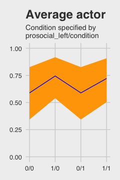

Here's the necessary data wrangling for Figure 12.5.b.

``` r
set.seed(6177024)
ran_ef <-
  tibble(actor = rnorm(1000, 0, post$sd_actor__Intercept))

# Here are the random effects
ran_ef <-
  bind_rows(ran_ef, ran_ef, ran_ef, ran_ef) %>%
  gather() %>%
  rename(random_effect = value) %>%
  select(random_effect)

# Here are the fixed effects (i.e., the population parameters)
fix_ef <-
  tibble(C00 = post[1:1000, 1],
         C10 = post[1:1000, 1] + post[1:1000, 2],
         C01 = post[1:1000, 1],
         C11 = post[1:1000, 1] + post[1:1000, 2] + post[1:1000, 3]) %>%
  gather() %>%
  rename(condition = key, fixed_effect = value)

# Here we combine them
ran_and_fix_ef <-
  bind_cols(ran_ef, fix_ef) %>%
  mutate(intercept = fixed_effect + random_effect) %>%
  mutate(prob = invlogit(intercept))

# To simplify things, we'll reduce them to summaries
marginal_effects <-
  ran_and_fix_ef %>%
  group_by(condition) %>%
  summarise(M  = mean(prob),
            LL = quantile(prob, probs = .1),
            UL = quantile(prob, probs = .9)) %>%
  mutate(Condition = c(1, 3, 2, 4))
```

Figure 12.5.b.

``` r
marginal_effects %>%
  
  ggplot(aes(x = Condition, y = M)) +
  theme_fivethirtyeight() +
  geom_ribbon(aes(ymin = LL, ymax = UL), fill = "orange1") +
  geom_line(color = "blue") +
  scale_x_continuous(labels = c("0/0", "1/0", "0/1", "1/1")) +
  labs(y = "proportion pulled left",
       title = "Marginal\nof actor") +
  coord_cartesian(ylim = c(0, 1))
```


Figure 12.5.c. just takes a tiny bit of data wrangling.

``` r
ran_and_fix_ef %>%
  mutate(condition = factor(condition, levels = c("C00", "C10", "C01", "C11"))) %>%
  mutate(iter = rep(1:1000, times = 4)) %>%
  filter(iter %in% c(1:50)) %>%
  
  ggplot(aes(x = condition, y = prob, group = iter)) +
  theme_fivethirtyeight() +
  geom_line(alpha = 1/2, color = "orange3") +
  scale_x_discrete(labels = c("0/0", "1/0", "0/1", "1/1")) +
  labs(y = "proportion pulled left",
       title = "50 simulated\nactors") +
  coord_cartesian(ylim = c(0, 1))
```

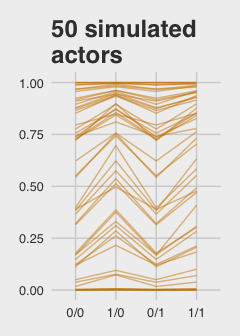

### 12.4.3. Focus and multilevel prediction.

First, let's get that `Kline` data.

``` r
# prep data
library(rethinking)
data(Kline)
k <- Kline
```

Switching packages, once again.

``` r
detach(package:rethinking, unload = T)
library(brms)
rm(Kline)
```

With brms, we don't actually need to make the logpop or society variables. We're ready to fit the multilevel `Kline` model with the data in hand.

``` r
b12.6 <- 
  brm(data = k, family = poisson,
      total_tools ~ 0 + intercept + log(population) + 
        (1 | culture),
      prior = c(set_prior("normal(0, 10)", class = "b", coef = "intercept"),
                set_prior("normal(0, 1)", class = "b"),
                set_prior("cauchy(0, 1)", class = "sd")),
      iter = 4000, warmup = 1000, cores = 3, chains = 3)
```

Note how we used the special `0 + intercept` syntax rather than using the default Intercept. This is because our predictor variable was not mean centered. For more info, see [here](https://github.com/paul-buerkner/brms/issues/114). Though we used the `0 + intercept` syntax for the fixed effect, it was not necessary for the random effect. Both ways work.

Here is the data-processing work for our variant of Figure 12.6.

``` r
nd <- 
  tibble(population = seq(from = 1000, to = 300000, by = 5000),
         # To "simulate counterfactual societies, using the hyper-parameters" (p. 383), we'll plug a new island into the `culture` variable
         culture = "My_island") 

p12.6 <-
  predict(b12.6,
          # This allows us to simulate values for our counterfactual island, "My_island"
          allow_new_levels = T,
          # Here we explicitly tell brms we want to include the group-level effects
          re_formula = ~ (1 | culture),
          # From the brms manual, this uses the "(multivariate) normal distribution implied by the group-level standard deviations and correlations", which appears to be what McElreath did in the text.
          sample_new_levels = "gaussian",
          newdata = nd,
          probs = c(.015, .055, .165, .835, .945, .985)) %>%
  as_tibble() %>%
  bind_cols(nd)

p12.6 %>%  
  glimpse()
```

    ## Observations: 60
    ## Variables: 10
    ## $ Estimate   <dbl> 19.78522, 31.27056, 36.61956, 40.48633, 43.64800, 4...
    ## $ Est.Error  <dbl> 10.56375, 15.96558, 19.57533, 22.50940, 25.32496, 2...
    ## $ Q1.5       <dbl> 5.000, 10.000, 12.000, 14.000, 15.000, 16.000, 16.0...
    ## $ Q5.5       <dbl> 8, 15, 17, 19, 20, 22, 23, 23, 25, 25, 26, 26, 27, ...
    ## $ Q16.5      <dbl> 12.000, 20.000, 23.000, 26.000, 28.000, 29.000, 31....
    ## $ Q83.5      <dbl> 27, 41, 48, 53, 57, 60, 63, 66, 68, 70, 72, 74, 76,...
    ## $ Q94.5      <dbl> 35.000, 53.000, 61.055, 68.000, 73.000, 77.000, 82....
    ## $ Q98.5      <dbl> 48.000, 71.000, 82.000, 90.000, 100.000, 105.000, 1...
    ## $ population <dbl> 1000, 6000, 11000, 16000, 21000, 26000, 31000, 3600...
    ## $ culture    <chr> "My_island", "My_island", "My_island", "My_island",...

For a detailed discussion on this way of using `brms::predict()`, see [Andrew MacDonald’s great blogpost on this very figure](http://thestudyofthehousehold.com/2018/02/13/2018-02-13-easily-made-fitted-and-predicted-values-made-easy/).

Here's our version of the figure:

``` r
p12.6 %>%
  ggplot(aes(x = log(population), y = Estimate)) +
  theme_fivethirtyeight() +
  geom_ribbon(aes(ymin = Q1.5, ymax = Q98.5), fill = "orange2", alpha = 1/3) +
  geom_ribbon(aes(ymin = Q5.5, ymax = Q94.5), fill = "orange2", alpha = 1/3) +
  geom_ribbon(aes(ymin = Q16.5, ymax = Q83.5), fill = "orange2", alpha = 1/3) +
  coord_cartesian(ylim = range(k$total_tools)) +
  geom_line(color = "orange4") +
  geom_text(data = k, aes(y = total_tools, label = culture), 
            size = 2.25, color = "blue") +
  labs(subtitle = "Total tools as a function of log(population)")
```

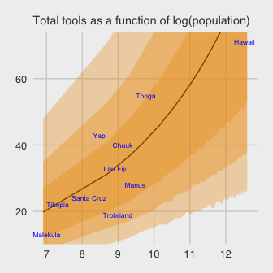

Note. The analyses in this document were done with:

-   R 3.4.4
-   RStudio 1.1.442
-   rmarkdown 1.9
-   rstan 2.17.3
-   rethinking 1.59
-   brms 2.3.1
-   tidyverse 1.2.1
-   ggthemes 3.5.0
-   bayesplot 1.5.0

References
----------

Gelman, A., & Hill, J. (2007). *Data analysis using regression and multilevel/hierarchical models.* New York, NY, US: Cambridge University Press. McElreath, R. (2016). *Statistical rethinking: A Bayesian course with examples in R and Stan.* Chapman & Hall/CRC Press.
