For our plots in this document, we'll use a custom theme. The color palette will come from the pearl_earring palette of the [dutchmasters package](https://github.com/EdwinTh/dutchmasters). You can learn more about the original painting, Vermeer's *Girl with a Pearl Earring*, [here](https://en.wikipedia.org/wiki/Girl_with_a_Pearl_Earring).


```r
# devtools::install_github("EdwinTh/dutchmasters")
library(dutchmasters)

dutchmasters$pearl_earring
```

```
##         red(lips)              skin      blue(scarf1)      blue(scarf2) 
##         "#A65141"         "#E7CDC2"         "#80A0C7"         "#394165" 
##      white(colar)       gold(dress)      gold(dress2) black(background) 
##         "#FCF9F0"         "#B1934A"         "#DCA258"         "#100F14" 
##      grey(scarf3)    yellow(scarf4)                   
##         "#8B9DAF"         "#EEDA9D"         "#E8DCCF"
```

We'll name our custom theme `theme_pearl_earring`. Here we make it.


```r
library(tidyverse)

theme_pearl_earring <-
  theme(text       = element_text(color = "#E8DCCF", family = "Courier"),
        strip.text = element_text(color = "#E8DCCF", family = "Courier"),
        axis.text  = element_text(color = "#E8DCCF"),
        axis.ticks = element_line(color = "#E8DCCF"),
        line       = element_line(color = "#E8DCCF"),
        plot.background   = element_rect(fill = "#100F14", color = "transparent"),
        panel.background  = element_rect(fill = "#100F14", color = "#E8DCCF"),
        strip.background  = element_rect(fill = "#100F14", color = "transparent"),
        panel.grid = element_blank(),
        legend.background = element_rect(fill = "#100F14", color = "transparent"),
        legend.key        = element_rect(fill = "#100F14", color = "transparent"),
        axis.line = element_blank())
```

## 13.1. Varying slopes by construction

### 13.1.1. Simulate the population.


```r
a <- 3.5        # average morning wait time
b <- (-1)       # average difference afternoon wait time
sigma_a <- 1    # std dev in intercepts
sigma_b <- 0.5  # std dev in slopes
rho <- (-0.7)   # correlation between intercepts and slopes

# The next three lines of code simply combine the terms, above
Mu <- c(a, b)

cov_ab <- sigma_a*sigma_b*rho
Sigma  <- matrix(c(sigma_a^2, cov_ab, 
                   cov_ab, sigma_b^2), ncol = 2)

# If you haven't used matirx() before, you might get a sense of the elements with this
matrix(c(1, 2, 
         3, 4), nrow = 2, ncol = 2)
```

```
##      [,1] [,2]
## [1,]    1    3
## [2,]    2    4
```


```r
sigmas <- c(sigma_a, sigma_b)       # standard deviations
Rho <- matrix(c(1, rho, 
                rho, 1), nrow = 2)  # correlation matrix

# now matrix multiply to get covariance matrix
Sigma <- diag(sigmas) %*% Rho %*% diag(sigmas)

N_cafes <- 20

library(MASS)
set.seed(5)  # used to replicate example
vary_effects <- mvrnorm(N_cafes, Mu, Sigma)
```

*What's the distribution of `a_cafe` and `b_cafe`?*, you might ask.


```r
tibble(a_cafe = vary_effects[ ,1],
       b_cafe = vary_effects[ ,2]) %>%
  
  ggplot(aes(x = a_cafe, y = b_cafe)) +
  geom_point(color = "#80A0C7") +
  geom_rug(color = "#8B9DAF", size = 1/7) +
  scale_x_continuous(expand = c(.5, .5)) +
  theme_pearl_earring
```

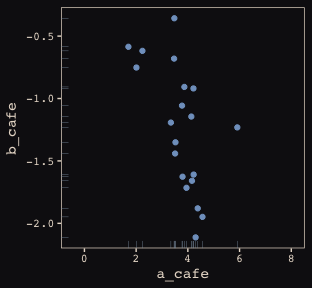<!-- -->

### 13.1.2. Simulate observations.

Before we simulate our observations, we'll need to detach the MASS package and reload the tidyverse in order to use the `tidyverse::select()` function.


```r
detach(package:MASS, unload = T)
library(tidyverse)

N_visits <- 10
sigma <- 0.5  # std dev within cafes

set.seed(5)  # used to replicate example
d <-
  tibble(cafe = rep(1:N_cafes, each = N_visits),
         afternoon = rep(0:1, N_visits*N_cafes/2),
         mu = rep(vary_effects[ ,1], each = N_visits) + rep(vary_effects[ ,2], each = N_visits)*afternoon,
         wait = rnorm(N_visits*N_cafes, mu, sigma)) %>%
  select(-mu)
```

Here's a look at the data.


```r
d %>%
  glimpse()
```

```
## Observations: 200
## Variables: 3
## $ cafe      <int> 1, 1, 1, 1, 1, 1, 1, 1, 1, 1, 2, 2, 2, 2, 2, 2, 2, 2...
## $ afternoon <int> 0, 1, 0, 1, 0, 1, 0, 1, 0, 1, 0, 1, 0, 1, 0, 1, 0, 1...
## $ wait      <dbl> 3.8035347, 3.3067856, 3.5962165, 2.6496773, 5.079682...
```

Now we've finally simulated our data, we are ready to make our version of Figure 13.1., from way back on page 388.


```r
d %>%
  mutate(afternoon = ifelse(afternoon == 0, "M", "A"),
         day = rep(rep(1:5, each = 2), times = N_cafes),
         x_order = rep(1:10, times = N_cafes)) %>%
  filter(cafe %in% c(3, 5)) %>%
  mutate(cafe = ifelse(cafe == 3, "cafe #3", "cafe #5")) %>%
  
  ggplot(aes(x = x_order, y = wait, group = day)) +
  geom_point(aes(color = afternoon), size = 2) +
  scale_color_manual(values = c("#80A0C7", "#EEDA9D")) +
  geom_line(color = "#8B9DAF") +
  scale_x_continuous(breaks = 1:10,
                     labels = rep(c("M", "A"), times = 5)) +
  coord_cartesian(ylim = 0:8) +
  labs(x = NULL, y = "wait time in minutes") +
  facet_wrap(~cafe, ncol = 1) +
  theme_pearl_earring +
  theme(legend.position = "none")
```

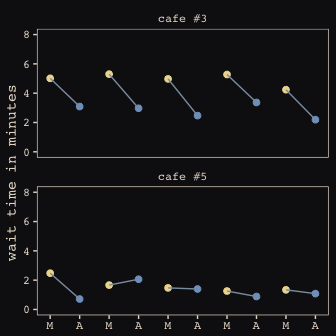<!-- -->

Here are the simulations for Figure 13.3. 


```r
library(rethinking)

set.seed(133)
R_1 <- 
  rlkjcorr(1e5, K = 2, eta = 1) %>%
  as_tibble()

set.seed(133)
R_2 <- 
  rlkjcorr(1e5, K = 2, eta = 2) %>%
  as_tibble()

set.seed(133)
R_4 <- 
  rlkjcorr(1e5, K = 2, eta = 4) %>%
  as_tibble()
```

The code for Figure 13.3.


```r
ggplot(data = R_1, aes(x = V2)) +
  geom_density(color = "transparent", fill = "#DCA258", alpha = 2/3) +
  geom_density(data = R_2,
               color = "transparent", fill = "#FCF9F0", alpha = 2/3) +
  geom_density(data = R_4,
               color = "transparent", fill = "#394165", alpha = 2/3) +
  geom_text(data = tibble(x = c(.83, .62, .46),
                          y = c(.54, .74, 1),
                          label = c("eta = 1", "eta = 2", "eta = 4")),
            aes(x = x, y = y, label = label),
            color = "#A65141", family = "Courier") +
  scale_y_continuous(NULL, breaks = NULL) +
  labs(x = "correlation") +
  theme_pearl_earring
```

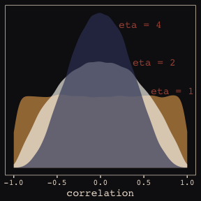<!-- -->

Our first model has both varying intercepts and `afternoon` slopes.


```r
detach(package:rethinking, unload = T)
library(brms)

b13.1 <- 
  brm(data = d, family = gaussian,
      wait ~ 1 + afternoon + (1 + afternoon | cafe),
      prior = c(set_prior("normal(0, 10)", class = "Intercept"),
                set_prior("normal(0, 10)", class = "b"),
                set_prior("cauchy(0, 2)", class = "sd"),
                set_prior("cauchy(0, 2)", class = "sigma"),
                set_prior("lkj(2)", class = "cor")),
      iter = 5000, warmup = 2000, chains = 2, cores = 2)
```

Figure 13.4.


```r
post <- posterior_samples(b13.1)

post %>%
  ggplot(aes(x = cor_cafe__Intercept__afternoon)) +
  geom_density(data = R_2, aes(x = V2),
               color = "transparent", fill = "#EEDA9D", alpha = 1/2) +
  geom_density(color = "transparent", fill = "#A65141", alpha = 3/4) +
  annotate("text", label = "posterior", 
           x = -0.2, y = 2.2, 
           color = "#A65141", family = "Courier") +
  annotate("text", label = "prior", 
           x = 0, y = 0.85, 
           color = "#EEDA9D", alpha = 2/3, family = "Courier") +
  scale_y_continuous(NULL, breaks = NULL) +
  labs(x = "correlation") +
  theme_pearl_earring
```

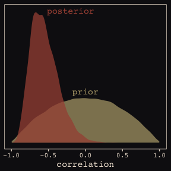<!-- -->

McElreath then depicts multidimensional shrinkage by plotting the posterior mean of the varying effects compared to their raw, unpooled estimated. With brms, we can get the `cafe`-specific intercepts and `afternoon` slopes with `coef()`, which returns a three-dimensional list.


```r
# coef(b13.1) %>% glimpse()

coef(b13.1)
```

```
## $cafe
## , , Intercept
## 
##    Estimate Est.Error  2.5%ile 97.5%ile
## 1  4.073352 0.2048543 3.671889 4.473134
## 2  1.930753 0.2070414 1.523242 2.343093
## 3  4.823600 0.2101443 4.406742 5.233474
## 4  3.476495 0.2088389 3.066082 3.900891
## 5  1.771516 0.2108093 1.354675 2.186843
## 6  4.388640 0.2014375 3.993861 4.788692
## 7  3.247357 0.2076626 2.842378 3.652057
## 8  4.011307 0.2117056 3.595492 4.428183
## 9  4.244639 0.2036538 3.854347 4.647960
## 10 3.706305 0.2065057 3.294928 4.105019
## 11 2.160949 0.2165894 1.734274 2.576872
## 12 4.033970 0.2059616 3.635531 4.440158
## 13 4.085902 0.2067812 3.676111 4.494135
## 14 3.598932 0.2071543 3.194617 3.995352
## 15 4.263103 0.2078604 3.858035 4.670339
## 16 3.484183 0.2064896 3.074771 3.886627
## 17 4.037423 0.2069901 3.627032 4.435351
## 18 5.843193 0.2085295 5.433520 6.256226
## 19 3.775992 0.2069196 3.369462 4.175021
## 20 3.855821 0.2011516 3.454780 4.240218
## 
## , , afternoon
## 
##      Estimate Est.Error   2.5%ile    97.5%ile
## 1  -1.4012349 0.2634323 -1.912918 -0.89066258
## 2  -0.9529583 0.2690773 -1.484715 -0.43259103
## 3  -1.8961869 0.2698510 -2.421251 -1.37613629
## 4  -1.2029087 0.2638471 -1.717318 -0.69334339
## 5  -0.5795899 0.2763090 -1.105607 -0.03482191
## 6  -1.4978116 0.2551614 -2.004005 -1.00200711
## 7  -1.0525960 0.2574086 -1.548089 -0.53829434
## 8  -1.7287012 0.2742541 -2.285522 -1.20604363
## 9  -1.5717800 0.2623306 -2.083063 -1.07118290
## 10 -1.0267059 0.2635431 -1.536336 -0.50930311
## 11 -0.4791191 0.2814797 -1.021003  0.07147783
## 12 -1.2700844 0.2574595 -1.774658 -0.75365961
## 13 -1.8123027 0.2704954 -2.354609 -1.29307618
## 14 -1.6381293 0.2700656 -2.183864 -1.11292500
## 15 -1.6795837 0.2649035 -2.217099 -1.17667137
## 16 -0.9570437 0.2601023 -1.474810 -0.44218815
## 17 -0.6832356 0.2785556 -1.229976 -0.12140521
## 18 -1.5482478 0.2732372 -2.085494 -1.01178220
## 19 -0.9192454 0.2671748 -1.441489 -0.38431502
## 20 -0.9437515 0.2573507 -1.429376 -0.43122143
```

Here's the code to extract the relevant elements from the `coef()` list, convert them to a tibble, and add the `cafe` index.


```r
partially_pooled_params <-
  # With this line we select each of the 20 cafe's posterior mean (i.e., Estimate) for both `Intercept` and `afternoon`
  coef(b13.1)$cafe[ , 1, 1:2] %>%
  as_tibble() %>%               # Converting the two vectors to a tibble
  rename(Slope = afternoon) %>%
  mutate(cafe = 1:nrow(.)) %>%  # Adding the `cafe` index
  select(cafe, everything())    # simply moving `cafe` to the left-most column of the tibble
```

Like McElreath, we'll compute the unpooled estimates directly from the data.


```r
# compute unpooled estimates directly from data
un_pooled_params <-
  d %>%
  # With these two lines, we compute the mean value for each cafe's wait time in the morning and then the afternoon.
  group_by(afternoon, cafe) %>%
  summarise(mean = mean(wait)) %>%
  ungroup() %>%  # Ungrouping allows us to alter afternoon, one of the grouping variables
  mutate(afternoon = ifelse(afternoon == 0, "Intercept", "Slope")) %>%
  spread(key = afternoon, value = mean) %>%  # using spread() just as in the previous block
  mutate(Slope = Slope - Intercept)          # Finally, here's our slope!

# Here we combine the partially-pooled and unpooled means into a single data object, which will make plotting easier.
params <-
  # bind_rows() will stack the second tibble below the first
  bind_rows(partially_pooled_params, un_pooled_params) %>%
  mutate(pooled = rep(c("partially", "not"), each = nrow(.)/2))  # indexing whether the estimates are pooled

# Here's a glimpse at what we've been working for
params %>%
  slice(c(1:5, 36:40))
```

```
## # A tibble: 10 x 4
##     cafe Intercept  Slope pooled   
##    <int>     <dbl>  <dbl> <chr>    
##  1     1      4.07 -1.40  partially
##  2     2      1.93 -0.953 partially
##  3     3      4.82 -1.90  partially
##  4     4      3.48 -1.20  partially
##  5     5      1.77 -0.580 partially
##  6    16      3.42 -0.836 not      
##  7    17      3.91 -0.348 not      
##  8    18      5.89 -1.50  not      
##  9    19      3.70 -0.733 not      
## 10    20      3.79 -0.774 not
```

Finally, here's our code for Figure 13.5.a., showing shrinkage in two dimensions.


```r
ggplot(data = params, aes(x = Intercept, y = Slope)) +
  stat_ellipse(geom = "polygon", type = "norm", level = 1/10, size = 0, alpha = 1/20, fill = "#E7CDC2") +
  stat_ellipse(geom = "polygon", type = "norm", level = 2/10, size = 0, alpha = 1/20, fill = "#E7CDC2") +
  stat_ellipse(geom = "polygon", type = "norm", level = 3/10, size = 0, alpha = 1/20, fill = "#E7CDC2") +
  stat_ellipse(geom = "polygon", type = "norm", level = 4/10, size = 0, alpha = 1/20, fill = "#E7CDC2") +
  stat_ellipse(geom = "polygon", type = "norm", level = 5/10, size = 0, alpha = 1/20, fill = "#E7CDC2") +
  stat_ellipse(geom = "polygon", type = "norm", level = 6/10, size = 0, alpha = 1/20, fill = "#E7CDC2") +
  stat_ellipse(geom = "polygon", type = "norm", level = 7/10, size = 0, alpha = 1/20, fill = "#E7CDC2") +
  stat_ellipse(geom = "polygon", type = "norm", level = 8/10, size = 0, alpha = 1/20, fill = "#E7CDC2") +
  stat_ellipse(geom = "polygon", type = "norm", level = 9/10, size = 0, alpha = 1/20, fill = "#E7CDC2") +
  stat_ellipse(geom = "polygon", type = "norm", level = .99,  size = 0, alpha = 1/20, fill = "#E7CDC2") +
  geom_point(aes(group = cafe, color = pooled)) +
  geom_line(aes(group = cafe), size = 1/4) +
  scale_color_manual("Pooled?",
                     values = c("#80A0C7", "#A65141")) +
  coord_cartesian(xlim = range(params$Intercept),
                  ylim = range(params$Slope)) +
  theme_pearl_earring
```

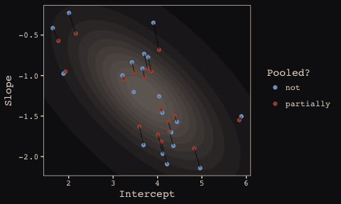<!-- -->

Here we prep for Figure 13.5.b.


```r
# Retrieve the partially-pooled estimates with coef()
partially_pooled_estimates <-
  coef(b13.1)$cafe[ , 1, 1:2] %>%
  as_tibble() %>%                  # Converting the two vectors to a tibble
  rename(morning = Intercept) %>%  # the Intercept is the wait time for morning (i.e., `afternoon == 0`)
  mutate(afternoon = morning + afternoon,  # Afternoon wait time is the morning wait time plus the afternoon slope
         cafe = 1:nrow(.)) %>%  # Adding the `cafe` index
  select(cafe, everything()) 

# Compute unpooled estimates directly from data
un_pooled_estimates <-
  d %>%
  # As above, with these two lines, we compute each cafe's mean wait value by time of day.
  group_by(afternoon, cafe) %>% 
  summarise(mean = mean(wait)) %>%
  ungroup() %>%  # ungrouping allows us to alter the grouping variable, afternoon
  mutate(afternoon = ifelse(afternoon == 0, "morning", "afternoon")) %>%
  spread(key = afternoon, value = mean)  # this seperates out the values into morning and afternoon columns

estimates <-
  bind_rows(partially_pooled_estimates, un_pooled_estimates) %>%
  mutate(pooled = rep(c("partially", "not"), each = nrow(.)/2))
```

The code for Figure 13.5.b.


```r
ggplot(data = estimates, aes(x = morning, y = afternoon)) +
  # Nesting stat_ellipse() with mapply() is a less redundant way to produce the ten-layered semitransparent
  # ellipses we did with ten lines of stat_ellipse() functions in the previous plot
  mapply(function(level) {
    stat_ellipse(geom = "polygon", type = "norm",
                 size = 0, alpha = 1/20, fill = "#E7CDC2",
                 level = level)
    }, 
    # Enter the levels here
    level = c(seq(from = 1/10, to = 9/10, by = 1/10), .99)) +
  geom_point(aes(group = cafe, color = pooled)) +
  geom_line(aes(group = cafe), size = 1/4) +
  scale_color_manual("Pooled?",
                     values = c("#80A0C7", "#A65141")) +
  coord_cartesian(xlim = range(estimates$morning),
                  ylim = range(estimates$afternoon)) +
  labs(x = "morning wait (mins)",
       y = "afternoon wait (mins)") +
  theme_pearl_earring
```

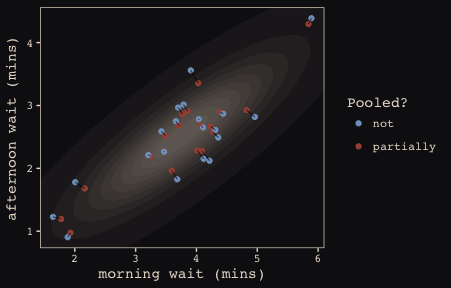<!-- -->

## 13.2. Example: Admission decisions and gender

Let's revisit the infamous UCB admissions data.


```r
library(rethinking)
data(UCBadmit)
d <- UCBadmit
```

Here we detach rethinking, reload brms, and augment the data a bit.


```r
detach(package:rethinking, unload = T)
library(brms)
rm(UCBadmit)

d <- 
  d %>%
  mutate(male    = ifelse(applicant.gender == "male", 1, 0),
         dept_id = rep(1:6, each = 2))
```

### 13.2.1. Varying intercepts.

We start by only letting the intercepts vary in this one.


```r
b13.2 <- 
  brm(data = d, family = binomial,
      admit | trials(applications) ~ 1 + male + (1 | dept_id),
      prior = c(set_prior("normal(0, 10)", class = "Intercept"),
                set_prior("normal(0, 1)", class = "b"),
                set_prior("cauchy(0, 2)", class = "sd")),
      iter = 4500, warmup = 500, chains = 3, cores = 3,
      control = list(adapt_delta = 0.99))
```

Since we don't have a `depth = 2` argument in `brms::summary()`, we'll have to get creative. One way to look at the parameters is with `b13.2$fit`:


```r
b13.2$fit
```

```
## Inference for Stan model: binomial brms-model.
## 3 chains, each with iter=4500; warmup=500; thin=1; 
## post-warmup draws per chain=4000, total post-warmup draws=12000.
## 
##                          mean se_mean   sd   2.5%    25%    50%    75%
## b_Intercept             -0.58    0.02 0.65  -1.89  -0.94  -0.58  -0.20
## b_male                  -0.10    0.00 0.08  -0.26  -0.15  -0.10  -0.04
## sd_dept_id__Intercept    1.46    0.01 0.55   0.76   1.09   1.34   1.69
## r_dept_id[1,Intercept]   1.26    0.02 0.65  -0.04   0.88   1.25   1.62
## r_dept_id[2,Intercept]   1.22    0.02 0.65  -0.07   0.83   1.21   1.57
## r_dept_id[3,Intercept]   0.00    0.02 0.65  -1.31  -0.38   0.00   0.36
## r_dept_id[4,Intercept]  -0.03    0.02 0.65  -1.33  -0.41  -0.03   0.33
## r_dept_id[5,Intercept]  -0.47    0.02 0.65  -1.76  -0.86  -0.48  -0.11
## r_dept_id[6,Intercept]  -2.02    0.02 0.66  -3.35  -2.40  -2.02  -1.65
## lp__                   -61.96    0.05 2.62 -68.11 -63.42 -61.58 -60.09
##                         97.5% n_eff Rhat
## b_Intercept              0.71  1706    1
## b_male                   0.07  5281    1
## sd_dept_id__Intercept    2.91  1984    1
## r_dept_id[1,Intercept]   2.56  1686    1
## r_dept_id[2,Intercept]   2.53  1688    1
## r_dept_id[3,Intercept]   1.31  1677    1
## r_dept_id[4,Intercept]   1.28  1678    1
## r_dept_id[5,Intercept]   0.85  1733    1
## r_dept_id[6,Intercept]  -0.72  1724    1
## lp__                   -57.90  2351    1
## 
## Samples were drawn using NUTS(diag_e) at Thu Apr  5 12:11:28 2018.
## For each parameter, n_eff is a crude measure of effective sample size,
## and Rhat is the potential scale reduction factor on split chains (at 
## convergence, Rhat=1).
```

However, notice that the group-specific parameters don't match up with those in the text. Though our `r_dept_id[1,Intercept]` had a posterior mean of 1.27, the number for `a_dept[1]` in the text is 0.67. This is because the brms package presented the random effects in the **non-centered** metric. The rethinking package, in contrast, presents the random effects in the **centered** metric. On page 399, McElreath wrote:

>Remember, the values above are the $\alpha_{DEPT}$ estimates, and so they are deviations from the global mean $\alpha$, which in this case has posterior mean -0.58. So department A, "[1]" in the table, has the highest average admission rate. Department F, "[6]" in the table, has the lowest.

Here's another fun fact:


```r
# Numbers taken from the mean column on page 399 in the text
c(0.67, 0.63, -0.59, -0.62, -1.06, -2.61) %>% mean()
```

```
## [1] -0.5966667
```

The average of the rethinking-based **centered** random effects is within rounding error of the global mean, -0.58. If you want the random effects in the **centered** metric from brms, you can use the `coef()` function:


```r
coef(b13.2)
```

```
## $dept_id
## , , Intercept
## 
##     Estimate  Est.Error    2.5%ile   97.5%ile
## 1  0.6755552 0.10042081  0.4806926  0.8718832
## 2  0.6305958 0.11716294  0.3973254  0.8620831
## 3 -0.5826204 0.07604597 -0.7312332 -0.4304359
## 4 -0.6162015 0.08600027 -0.7832934 -0.4489865
## 5 -1.0575477 0.09962859 -1.2579984 -0.8624124
## 6 -2.6076713 0.15546862 -2.9167375 -2.3111568
## 
## , , male
## 
##      Estimate Est.Error    2.5%ile   97.5%ile
## 1 -0.09673845 0.0822732 -0.2557497 0.06671579
## 2 -0.09673845 0.0822732 -0.2557497 0.06671579
## 3 -0.09673845 0.0822732 -0.2557497 0.06671579
## 4 -0.09673845 0.0822732 -0.2557497 0.06671579
## 5 -0.09673845 0.0822732 -0.2557497 0.06671579
## 6 -0.09673845 0.0822732 -0.2557497 0.06671579
```

And just to confirm, the average of the posterior means of the `Intercept` random effects with `brms::coef()` is also the global mean within rounding error:


```r
mean(coef(b13.2)$dept_id[, "Estimate", "Intercept"])
```

```
## [1] -0.5929817
```

Note how `coef()` returned a three-dimensional list.


```r
coef(b13.2) %>% str()
```

```
## List of 1
##  $ dept_id: num [1:6, 1:4, 1:2] 0.676 0.631 -0.583 -0.616 -1.058 ...
##   ..- attr(*, "dimnames")=List of 3
##   .. ..$ : chr [1:6] "1" "2" "3" "4" ...
##   .. ..$ : chr [1:4] "Estimate" "Est.Error" "2.5%ile" "97.5%ile"
##   .. ..$ : chr [1:2] "Intercept" "male"
```

If you just want the parameter summaries for the random intercepts, you have to use three-dimensional indexing. 


```r
coef(b13.2)$dept_id[, , "Intercept"]  # this also works: coef(b13.2)$dept_id[, , 1]
```

```
##     Estimate  Est.Error    2.5%ile   97.5%ile
## 1  0.6755552 0.10042081  0.4806926  0.8718832
## 2  0.6305958 0.11716294  0.3973254  0.8620831
## 3 -0.5826204 0.07604597 -0.7312332 -0.4304359
## 4 -0.6162015 0.08600027 -0.7832934 -0.4489865
## 5 -1.0575477 0.09962859 -1.2579984 -0.8624124
## 6 -2.6076713 0.15546862 -2.9167375 -2.3111568
```

So to get our brms summaries in a similar format to those in the text, we'll have to combine `coef()` with `fixef()` and `VarCorr()`. 


```r
coef(b13.2)$dept_id[, , "Intercept"] %>%
  as_tibble() %>% 
  bind_rows(fixef(b13.2) %>% 
              as_tibble()) %>% 
  bind_rows(VarCorr(b13.2)$dept_id$sd %>% 
              as_tibble())
```

```
## # A tibble: 9 x 4
##   Estimate Est.Error `2.5%ile` `97.5%ile`
##      <dbl>     <dbl>     <dbl>      <dbl>
## 1   0.676     0.100      0.481     0.872 
## 2   0.631     0.117      0.397     0.862 
## 3  -0.583     0.0760    -0.731    -0.430 
## 4  -0.616     0.0860    -0.783    -0.449 
## 5  -1.06      0.0996    -1.26     -0.862 
## 6  -2.61      0.155     -2.92     -2.31  
## 7  -0.584     0.647     -1.89      0.713 
## 8  -0.0967    0.0823    -0.256     0.0667
## 9   1.46      0.553      0.764     2.91
```

And a little more data wrangling will make the summaries easier to read:


```r
coef(b13.2)$dept_id[, , "Intercept"] %>%
  as_tibble() %>% 
  bind_rows(fixef(b13.2) %>% 
              as_tibble()) %>% 
  bind_rows(VarCorr(b13.2)$dept_id$sd %>% 
              as_tibble()) %>% 
  mutate(parameter = c(paste("Intercept [", 1:6, "]", sep = ""), 
                       "Intercept", "male", "sigma")) %>% 
  select(parameter, everything()) %>% 
  mutate_if(is_double, round, digits = 2)
```

```
## # A tibble: 9 x 5
##   parameter     Estimate Est.Error `2.5%ile` `97.5%ile`
##   <chr>            <dbl>     <dbl>     <dbl>      <dbl>
## 1 Intercept [1]    0.680    0.100      0.480     0.870 
## 2 Intercept [2]    0.630    0.120      0.400     0.860 
## 3 Intercept [3]   -0.580    0.0800    -0.730    -0.430 
## 4 Intercept [4]   -0.620    0.0900    -0.780    -0.450 
## 5 Intercept [5]   -1.06     0.100     -1.26     -0.860 
## 6 Intercept [6]   -2.61     0.160     -2.92     -2.31  
## 7 Intercept       -0.580    0.650     -1.89      0.710 
## 8 male            -0.100    0.0800    -0.260     0.0700
## 9 sigma            1.46     0.550      0.760     2.91
```

I’m not aware of a slick and easy way to get the `n_eff` and `Rhat` summaries into the mix. But if you’re fine with working with the brms-default **non-centered** parameterization, `b13.2$fit` gets you those just fine.

One last thing. The [broom package](https://cran.r-project.org/web/packages/broom/index.html) offers a very handy way to get those brms random effects. Just throw the model `brm()` fit into the `tidy()` function.


```r
library(broom)

tidy(b13.2) %>%
  mutate_if(is.numeric, round, digits = 2)  # This line just rounds the output
```

```
##                      term estimate std.error  lower  upper
## 1             b_Intercept    -0.58      0.65  -1.62   0.43
## 2                  b_male    -0.10      0.08  -0.23   0.04
## 3   sd_dept_id__Intercept     1.46      0.55   0.82   2.51
## 4  r_dept_id[1,Intercept]     1.26      0.65   0.23   2.30
## 5  r_dept_id[2,Intercept]     1.22      0.65   0.18   2.26
## 6  r_dept_id[3,Intercept]     0.00      0.65  -1.02   1.04
## 7  r_dept_id[4,Intercept]    -0.03      0.65  -1.05   1.02
## 8  r_dept_id[5,Intercept]    -0.47      0.65  -1.49   0.58
## 9  r_dept_id[6,Intercept]    -2.02      0.66  -3.07  -0.98
## 10                   lp__   -61.96      2.62 -66.77 -58.36
```

But note how, just as with `b13.2$fit`, this approach summarizes the posterior with the **non-centered** parameterization. Which is a fine parameterization. It's just a little different from what you'll get when using `precis( m13.2 , depth=2 )`, as in the text.

### 13.2.2. Varying effects of being `male`.

Now our `male` dummy varies, too.


```r
b13.3 <- 
  brm(data = d, family = binomial,
      admit | trials(applications) ~ 1 + male + (1 + male | dept_id),
      prior = c(set_prior("normal(0, 10)", class = "Intercept"),
                set_prior("normal(0, 1)", class = "b"),
                set_prior("cauchy(0, 2)", class = "sd"),
                set_prior("lkj(2)", class = "cor")),
      iter = 5000, warmup = 1000, chains = 4, cores = 4,
      control = list(adapt_delta = .99,
                     max_treedepth = 12))
```

The random effects in the **centered** metric:


```r
coef(b13.3)
```

```
## $dept_id
## , , Intercept
## 
##     Estimate  Est.Error    2.5%ile   97.5%ile
## 1  1.3056204 0.25506859  0.8138653  1.8190851
## 2  0.7444135 0.32548834  0.1194053  1.4049231
## 3 -0.6474318 0.08637996 -0.8145377 -0.4799312
## 4 -0.6174365 0.10466815 -0.8241510 -0.4139319
## 5 -1.1319566 0.11320892 -1.3571082 -0.9150872
## 6 -2.6035394 0.20251645 -3.0153532 -2.2156893
## 
## , , male
## 
##      Estimate Est.Error    2.5%ile   97.5%ile
## 1 -0.79362853 0.2686068 -1.3304344 -0.2753400
## 2 -0.21492548 0.3281351 -0.8745124  0.4206929
## 3  0.08054499 0.1395825 -0.1860989  0.3601138
## 4 -0.09279442 0.1415786 -0.3713503  0.1857831
## 5  0.11925717 0.1845587 -0.2305366  0.4837667
## 6 -0.12076874 0.2717636 -0.6645634  0.4097235
```

It just takes a little data wrangling to put the brms-based **centered** random effects into a tidy tibble with which we might make a coefficient plot, like McElreath did on page 401.


```r
# As far as I can tell, because coef() yields a list, you have to take out the two random effects one at a time, convert them into tibbles, and then reassemble them with bind_rows()
coef(b13.3)$dept_id[, , 1] %>% 
  as_tibble() %>% 
  bind_rows(coef(b13.3)$dept_id[, , 2] %>% 
              as_tibble()) %>% 
  mutate(param = c(paste("Intercept", 1:6),
                   paste("male", 1:6)),
         reorder = c(6:1, 12:7)) %>% 

  # The plot
  ggplot(aes(x = reorder(param, reorder))) +
  geom_hline(yintercept = 0, linetype = 3, color = "#E8DCCF") +
             geom_linerange(aes(ymin = `2.5%ile`, ymax = `97.5%ile`),
                 color = "#E7CDC2") +
  geom_point(aes(y = Estimate),
             color = "#A65141") +
  xlab(NULL) +
  coord_flip() +
  theme_pearl_earring +
  theme(axis.ticks.y = element_blank(),
        axis.text.y = element_text(hjust = 0))
```

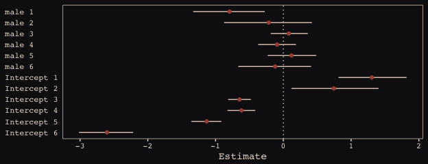<!-- -->

### 13.2.3. Shrinkage.

Figure 13.6.a., the correlation between the full UCB model's varying intercepts and slopes.


```r
post <- posterior_samples(b13.3)

post %>% 
  ggplot(aes(x = cor_dept_id__Intercept__male)) +
  geom_density(color = "transparent", fill = "#8B9DAF") +
  geom_vline(xintercept = median(post$cor_dept_id__Intercept__male), color = "#394165") +
  scale_x_continuous(breaks = c(-1, median(post$cor_dept_id__Intercept__male), 1),
                     labels = c(-1, "-.35", 1)) +
  scale_y_continuous(NULL, breaks = NULL) +
  coord_cartesian(xlim = -1:1) +
  labs(subtitle = "The line is at the median.",
       x = "correlation") +
  theme_pearl_earring
```

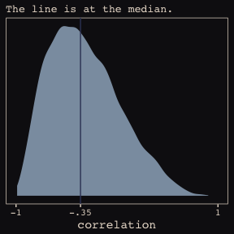<!-- -->

Much like for Figure 13.5.b., above, it'll take a little data processing before we're ready to reproduce Figure 13.6.b. 


```r
# Here we put the partially-pooled estimate summaries in a tibble
partially_pooled_params <-
  coef(b13.3)$dept_id[ , 1, ] %>%
  as_tibble() %>%
  rename(intercept = Intercept,
         slope = male) %>%
  mutate(dept = 1:nrow(.)) %>%
  select(dept, everything())

# In order to calculate the unpooled estimates from the data, we'll need a function that can convert probabilities into the logit metric. If you do the algebra, this is just a transformation of Gelman and Hill's invlogit() function
prob_to_logit <- function(x){
  -log((1/x) -1)
  }

# compute unpooled estimates directly from data
un_pooled_params <-
  d %>%
  group_by(male, dept_id) %>%
  summarise(prob_admit = mean(admit/applications)) %>%
  ungroup() %>%
  mutate(male = ifelse(male == 0, "intercept", "slope")) %>%
  spread(key = male, value = prob_admit) %>%
  rename(dept = dept_id) %>%
  mutate(intercept = prob_to_logit(intercept),  # Here we put our custom prob_to_logit() function to work
         slope     = prob_to_logit(slope)) %>%
  mutate(slope     = slope - intercept)

# Here we combine the partially-pooled and unpooled means into a single data object.
params <-
  bind_rows(partially_pooled_params, un_pooled_params) %>%
  mutate(pooled = rep(c("partially", "not"), each = nrow(.)/2)) %>%
  mutate(dept_letter = rep(LETTERS[1:6], times = 2))  # This will help with plotting

params
```

```
## # A tibble: 12 x 5
##     dept intercept   slope pooled    dept_letter
##    <int>     <dbl>   <dbl> <chr>     <chr>      
##  1     1     1.31  -0.794  partially A          
##  2     2     0.744 -0.215  partially B          
##  3     3    -0.647  0.0805 partially C          
##  4     4    -0.617 -0.0928 partially D          
##  5     5    -1.13   0.119  partially E          
##  6     6    -2.60  -0.121  partially F          
##  7     1     1.54  -1.05   not       A          
##  8     2     0.754 -0.220  not       B          
##  9     3    -0.660  0.125  not       C          
## 10     4    -0.622 -0.0820 not       D          
## 11     5    -1.16   0.200  not       E          
## 12     6    -2.58  -0.189  not       F
```

Here's our version of Figure 13.6.b., depicting two-dimensional shrinkage for the partially-pooled multilevel estimates (posterior means) relative to the unpooled coefficients, calculated from the data. The [ggrepel package](https://cran.r-project.org/web/packages/ggrepel/index.html) and its `geom_text_repel()` function will help us with the in-plot labels.


```r
library(ggrepel)

set.seed(6457240)  # for ggrepel::geom_text_repel()
ggplot(data = params, aes(x = intercept, y = slope)) +
  mapply(function(level){
    stat_ellipse(geom = "polygon", type = "norm",
                 size = 0, alpha = 1/20, fill = "#E7CDC2",
                 level = level)
    }, 
    level = c(seq(from = 1/10, to = 9/10, by = 1/10), .99)) +
  geom_point(aes(group = dept, color = pooled)) +
  geom_line(aes(group = dept), size = 1/4) +
  scale_color_manual("Pooled?",
                     values = c("#80A0C7", "#A65141")) +
  geom_text_repel(data = params %>% filter(pooled == "partially"),
                  aes(label = dept_letter),
                  color = "#E8DCCF", size = 4, family = "Courier") +
  coord_cartesian(xlim = range(params$intercept),
                  ylim = range(params$slope)) +
  theme_pearl_earring
```

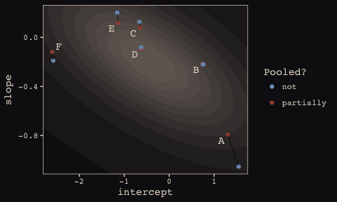<!-- -->

### 13.2.4. Model comparison.

Our no-gender model:


```r
b13.4 <- 
  brm(data = d, family = binomial,
      admit | trials(applications) ~ 1 + (1 | dept_id),
      prior = c(set_prior("normal(0, 10)", class = "Intercept"),
                set_prior("cauchy(0, 2)", class = "sd")),
      iter = 5000, warmup = 1000, chains = 4, cores = 4,
      control = list(adapt_delta = .99,
                     max_treedepth = 12))
```


```r
waic(b13.2, b13.3, b13.4)
```

```
##                 WAIC    SE
## b13.2         109.06 16.56
## b13.3          90.92  4.67
## b13.4         105.07 17.99
## b13.2 - b13.3  18.14 13.45
## b13.2 - b13.4   3.99  3.71
## b13.3 - b13.4 -14.15 15.15
```

## 13.3. Example: Cross-classified `chimpanzees` with varying slopes

Retrieve the `chimpanzees` data.


```r
library(rethinking)
data(chimpanzees)
d <- chimpanzees
```


```r
detach(package:rethinking, unload = T)
library(brms)
rm(chimpanzees)

d <-
  d %>%
  select(-recipient) %>%
  mutate(block_id = block)
```

Here's our cross-classified model. For you SEM lovers, this reminds me of a factor model with a method effect (e.g., a bifactor model). 


```r
b13.6 <- 
  brm(data = d, family = binomial,
      pulled_left ~ 1 + prosoc_left + condition:prosoc_left + 
        (1 + prosoc_left + condition:prosoc_left | block_id) +
        (1 + prosoc_left + condition:prosoc_left | actor),
      prior = c(set_prior("normal(0, 1)", class = "Intercept"),
                set_prior("normal(0, 1)", class = "b"),
                set_prior("cauchy(0, 2)", class = "sd"),
                set_prior("lkj(4)", class = "cor")),
      iter = 5000, warmup = 1000, chains = 3, cores = 3)
```

Even though it's not apparent in the syntax, our model `b13.6` was already fit using the [non-centered parameterization. Behind the scenes, Bürkner has brms do this automatically](https://github.com/paul-buerkner/brms/issues/211). It's been that way all along.


```r
ratios_cp <- neff_ratio(b13.6)

neff <-
  ratios_cp %>% 
  as_tibble %>% 
  rename(neff_ratio = value) %>% 
  mutate(neff = neff_ratio*12000)

head(neff)
```

```
## # A tibble: 6 x 2
##   neff_ratio  neff
##        <dbl> <dbl>
## 1      0.284  3404
## 2      0.585  7019
## 3      0.616  7387
## 4      0.299  3592
## 5      0.509  6103
## 6      0.249  2994
```

Our variant of Figure 13.7. The handy [ggbeeswarm package](https://cran.r-project.org/web/packages/ggbeeswarm/index.html) and it's `geom_quasirandom()` function will give a better sense of the distribution.


```r
library(ggbeeswarm)

neff %>%
  ggplot(aes(x = factor(0), y = neff)) +
  geom_boxplot(fill = "#394165", color = "#8B9DAF") +
  geom_quasirandom(method = "tukeyDense",
                   size = 2/3, color = "#EEDA9D", alpha = 2/3) +
  scale_x_discrete(NULL, breaks = NULL,
                   expand = c(.75, .75)) +
  scale_y_continuous(breaks = c(0, 6000, 12000)) +
  coord_cartesian(ylim = 0:12000) +
  labs(y = "effective samples",
       subtitle = "The non-centered\nparameterization is the\nbrms default. No fancy\ncoding required.") +
  theme_pearl_earring
```

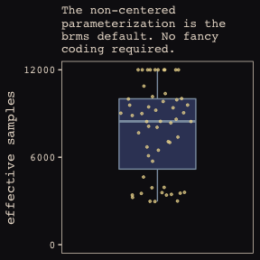<!-- -->

The bayesplot package contains a sweet of [handy diagnostic features](https://cran.r-project.org/web/packages/bayesplot/vignettes/visual-mcmc-diagnostics.html#effective-sample-size). `mcmc_neff()`, for example, makes it easy to examine the ratio of n.eff and the fill number of post-warm-up iterations, *N*. Ideally, that ratio is closer to 1 than not.


```r
library(bayesplot)

color_scheme_set(c("#DCA258", "#EEDA9D", "#394165", "#8B9DAF", "#A65141", "#A65141"))

mcmc_neff(ratios_cp, size = 2) +
  theme_pearl_earring
```

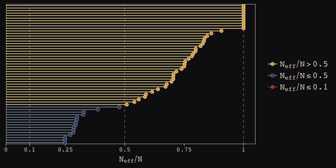<!-- -->

Here are our standard deviation parameters.


```r
tidy(b13.6) %>%
  filter(str_detect(term , "sd_")) %>%
  mutate_if(is.numeric, round, digits = 2)
```

```
##                                 term estimate std.error lower upper
## 1                sd_actor__Intercept     2.35      0.92  1.31  4.08
## 2              sd_actor__prosoc_left     0.45      0.37  0.03  1.13
## 3    sd_actor__prosoc_left:condition     0.52      0.58  0.04  1.40
## 4             sd_block_id__Intercept     0.23      0.21  0.02  0.63
## 5           sd_block_id__prosoc_left     0.57      0.41  0.06  1.31
## 6 sd_block_id__prosoc_left:condition     0.52      0.41  0.04  1.30
```

Here we refit the simpler model from way back in chapter 12.


```r
b12.5 <- 
  brm(data = d, family = binomial,
      pulled_left ~ 1 + prosoc_left + condition:prosoc_left + 
        (1 | block_id) +
        (1 | actor),
      prior = c(set_prior("normal(0, 10)", class = "Intercept"),
                set_prior("normal(0, 10)", class = "b"),
                set_prior("cauchy(0, 1)", class = "sd")),
      iter = 5000, warmup = 1000, chains = 3, cores = 3)
```

The waic comparison:


```r
waic(b13.6, b12.5)
```

```
##                 WAIC    SE
## b13.6         534.72 19.93
## b12.5         532.70 19.68
## b13.6 - b12.5   2.02  4.05
```

## 13.4. Continuous categories and the Gaussian process

### 13.4.1. Example: Spatial autocorrelation in Oceanic tools.


```r
# load the distance matrix
library(rethinking)
data(islandsDistMatrix)

# display short column names, so fits on screen
Dmat <- islandsDistMatrix
colnames(Dmat) <- c("Ml", "Ti", "SC", "Ya", "Fi", 
                    "Tr", "Ch", "Mn", "To", "Ha")
round(Dmat, 1)
```

```
##             Ml  Ti  SC  Ya  Fi  Tr  Ch  Mn  To  Ha
## Malekula   0.0 0.5 0.6 4.4 1.2 2.0 3.2 2.8 1.9 5.7
## Tikopia    0.5 0.0 0.3 4.2 1.2 2.0 2.9 2.7 2.0 5.3
## Santa Cruz 0.6 0.3 0.0 3.9 1.6 1.7 2.6 2.4 2.3 5.4
## Yap        4.4 4.2 3.9 0.0 5.4 2.5 1.6 1.6 6.1 7.2
## Lau Fiji   1.2 1.2 1.6 5.4 0.0 3.2 4.0 3.9 0.8 4.9
## Trobriand  2.0 2.0 1.7 2.5 3.2 0.0 1.8 0.8 3.9 6.7
## Chuuk      3.2 2.9 2.6 1.6 4.0 1.8 0.0 1.2 4.8 5.8
## Manus      2.8 2.7 2.4 1.6 3.9 0.8 1.2 0.0 4.6 6.7
## Tonga      1.9 2.0 2.3 6.1 0.8 3.9 4.8 4.6 0.0 5.0
## Hawaii     5.7 5.3 5.4 7.2 4.9 6.7 5.8 6.7 5.0 0.0
```

If you wanted to use color to more effectively visualize the values in the matirx, you might do something like this.


```r
Dmat %>%
  as_tibble() %>%
  gather() %>%
  rename(Column = key,
         distance = value) %>%
  mutate(Row          = rep(rownames(Dmat), times = 10),
         Row_order    = rep(9:0,            times = 10),
         Column_order = rep(0:9,            each  = 10)) %>%
  
  ggplot(aes(x = reorder(Column, Column_order), 
             y = reorder(Row, Row_order))) + 
  geom_raster(aes(fill = distance)) + 
  geom_text(aes(label = round(distance, digits = 1)),
            size = 3, family = "Courier", color = "#100F14") +
  scale_fill_gradient(low = "#FCF9F0", high = "#A65141") +
  scale_x_discrete(position = "top") +
  labs(x = NULL, y = NULL) +
  theme_pearl_earring +
  theme(axis.ticks = element_blank(),
        axis.text.y = element_text(hjust = 0))
```

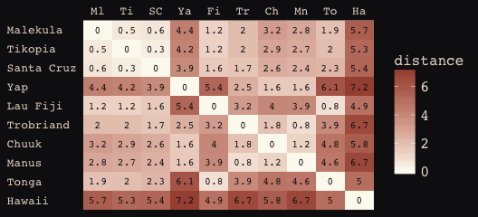<!-- -->

Figure 13.8., the "shape of the function relating distance to the covariance **K**$_{ij}$."


```r
tibble(
  x = seq(from = 0, to = 4, by = .01),
  linear = exp(-1*x),
  squared = exp(-1*x^2)) %>%
  
  ggplot(aes(x = x)) +
  geom_line(aes(y = linear),
            color = "#B1934A", linetype = 2) +
  geom_line(aes(y = squared),
            color = "#DCA258") +
  scale_y_continuous(breaks = c(0, .5, 1),
                     labels = c(0, ".5", 1)) +
  labs(x = "distance",
       y = "correlation") +
  theme_pearl_earring
```

<!-- -->


```r
data(Kline2) # load the ordinary data, now with coordinates

d <- 
  Kline2 %>%
  mutate(society = 1:10)

d %>% glimpse()
```

```
## Observations: 10
## Variables: 10
## $ culture     <fctr> Malekula, Tikopia, Santa Cruz, Yap, Lau Fiji, Tro...
## $ population  <int> 1100, 1500, 3600, 4791, 7400, 8000, 9200, 13000, 1...
## $ contact     <fctr> low, low, low, high, high, high, high, low, high,...
## $ total_tools <int> 13, 22, 24, 43, 33, 19, 40, 28, 55, 71
## $ mean_TU     <dbl> 3.2, 4.7, 4.0, 5.0, 5.0, 4.0, 3.8, 6.6, 5.4, 6.6
## $ lat         <dbl> -16.3, -12.3, -10.7, 9.5, -17.7, -8.7, 7.4, -2.1, ...
## $ lon         <dbl> 167.5, 168.8, 166.0, 138.1, 178.1, 150.9, 151.6, 1...
## $ lon2        <dbl> -12.5, -11.2, -14.0, -41.9, -1.9, -29.1, -28.4, -3...
## $ logpop      <dbl> 7.003065, 7.313220, 8.188689, 8.474494, 8.909235, ...
## $ society     <int> 1, 2, 3, 4, 5, 6, 7, 8, 9, 10
```

Unfortunately, this is as far as I can go. brms does allow for Gaussian process models (e.g., [here](https://github.com/paul-buerkner/brms/issues/221)). However, my technical skills are not yet up to the task of working with them. 

On [Issues #8 in my GitHub page for his project](), [Bürkner](https://paul-buerkner.github.io) suggested `brm(total_tools ~ gp(x) + logpop, ...)`, where "`x` is the position variable from which `Dmat` was constructed. Not sure if this is really equivalent, but it might be a start." I haven't gotten around to playing with this, yet. Stay tuned or, even better, play with it yourself and share your results.

##### Bonus: Another Berkley-admissions-data-like example. 

[McElreath uploaded recordings](https://www.youtube.com/channel/UCNJK6_DZvcMqNSzQdEkzvzA/playlists) of him teaching out of his text for a graduate course during the 2017/2018 fall semester. In the beginning of [lecture 13 from week 7](https://www.youtube.com/watch?v=rSQ1XMwO_9A&t), he discussed a paper from [van der Lee and Ellemers (2015) published an article in PNAS]( http://www.pnas.org/content/112/40/12349.abstract). Their paper suggested male researchers were more likely than female researchers to get research funding in the Netherlands. In their initial analysis (p. 12350) they provided a simple $\chi^2$ test to test the null hypothesis there was no difference in success for male versus female researchers, for which they reported $\chi^2$ (1) = 4.01, *P* = 0.045. Happily, van der Lee and Ellemers provided their data values in their supplemental material (i.e., [Table S1.](http://www.pnas.org/content/suppl/2015/09/16/1510159112.DCSupplemental/pnas.201510159SI.pdf)), which McElreath also displayed in his video. 

Their data follows the same structure as the Berkley admissions data. In his lecture, McElreath suggested their $\chi^2$ test is an example of Simpson’s paradox, just as with the Berkley data. He isn't the first person to raise this criticism (see [Volker and SteenBeek’s critique](http://www.pnas.org/content/112/51/E7036.full), which McElreath also pointed to in the lecture).

Here are the data:


```r
funding <- 
  tibble(
    discipline = rep(c("Chemical sciences", "Physical sciences",
                       "Physics", "Humanities", "Technical sciences",
                       "Interdisciplinary", "Earth/life sciences",
                       "Social sciences", "Medical sciences"),
                     each = 2),
    gender = rep(c("m", "f"), times = 9),
    applications = c(83, 39, 135, 39, 67, 9, 230, 166, 189, 
                     62, 105, 78, 156, 126, 425, 409, 245, 260) %>% as.integer(),
    awards = c(22, 10, 26, 9, 18, 2, 33, 32, 30, 
               13, 12, 17, 38, 18, 65, 47, 46, 29) %>% as.integer(),
    rejects = c(61, 29, 109, 30, 49, 7, 197, 134, 159, 
                49, 93, 61, 118, 108, 360, 362, 199, 231) %>% as.integer(),
    male = ifelse(gender == "f", 0, 1) %>% as.integer()
  )

funding
```

```
## # A tibble: 18 x 6
##    discipline          gender applications awards rejects  male
##    <chr>               <chr>         <int>  <int>   <int> <int>
##  1 Chemical sciences   m                83     22      61     1
##  2 Chemical sciences   f                39     10      29     0
##  3 Physical sciences   m               135     26     109     1
##  4 Physical sciences   f                39      9      30     0
##  5 Physics             m                67     18      49     1
##  6 Physics             f                 9      2       7     0
##  7 Humanities          m               230     33     197     1
##  8 Humanities          f               166     32     134     0
##  9 Technical sciences  m               189     30     159     1
## 10 Technical sciences  f                62     13      49     0
## 11 Interdisciplinary   m               105     12      93     1
## 12 Interdisciplinary   f                78     17      61     0
## 13 Earth/life sciences m               156     38     118     1
## 14 Earth/life sciences f               126     18     108     0
## 15 Social sciences     m               425     65     360     1
## 16 Social sciences     f               409     47     362     0
## 17 Medical sciences    m               245     46     199     1
## 18 Medical sciences    f               260     29     231     0
```

Let’s fit a few models.

First, we’ll fit an analogue to the initial van der Lee and Ellemers $\chi^2$ test. Since we’re Bayesian modelers, we’ll use a simple logistic regression, using `male` (dummy coded 0 = female, 1 = male) to predict admission (i.e., `awards`).


```r
detach(package:rethinking, unload = T)
library(brms)

b13.bonus_0 <- 
  brm(data = funding, family = binomial,
      awards | trials(applications) ~ 1 + male,
      # Note our continued use of weakly-regularizing priors
      prior = c(set_prior("normal(0, 4)", class = "Intercept"),
                set_prior("normal(0, 4)", class = "b")),
      iter = 5000, warmup = 1000, chains = 4, cores = 4)
```

The chains look great. Here are the posterior summaries:


```r
tidy(b13.bonus_0) %>%
  filter(term != "lp__") %>%
  mutate_if(is.numeric, round, digits = 2)
```

```
##          term estimate std.error lower upper
## 1 b_Intercept    -1.74      0.08 -1.88 -1.61
## 2      b_male     0.21      0.11  0.03  0.38
```

Yep, the 95% intervals for `male` dummy exclude zero. If you wanted a one-sided Bayesian *p*-value, you might do something like:


```r
posterior_samples(b13.bonus_0) %>%
  summarise(One_sided_Bayesian_p_value = filter(., b_male <= 0) %>% nrow()/nrow(.))
```

```
##   One_sided_Bayesian_p_value
## 1                  0.0229375
```

Pretty small. But recall how Simpson's paradox helped us understand the Berkley data. Different departments in Berkley had different acceptance rates AND different ratios of male and female applicants. Similarly, different academic disciplines in the Netherlands might have different `award` rates for funding AND different ratios of male and female applications. 

Just like in section 13.2, let's fit two more models. The first model will allow intercepts to vary by discipline. The second model will allow intercepts and the `male` dummy slopes to vary by discipline.


```r
b13.bonus_1 <- 
  brm(data = funding, family = binomial,
      awards | trials(applications) ~ 1 + male + (1 | discipline),
      prior = c(set_prior("normal(0, 4)", class = "Intercept"),
                set_prior("normal(0, 4)", class = "b"),
                set_prior("cauchy(0, 1)", class = "sd")),
      iter = 5000, warmup = 1000, chains = 4, cores = 4,
      control = list(adapt_delta = .99))

b13.bonus_2 <- 
  brm(data = funding, family = binomial,
      awards | trials(applications) ~ 1 + male + (1 + male | discipline),
      prior = c(set_prior("normal(0, 4)", class = "Intercept"),
                set_prior("normal(0, 4)", class = "b"),
                set_prior("cauchy(0, 1)", class = "sd"),
                set_prior("lkj(4)", class = "cor")),
      iter = 5000, warmup = 1000, chains = 4, cores = 4,
      control = list(adapt_delta = .99))
```

We'll compare the models with information criteria.


```r
waic(b13.bonus_0, b13.bonus_1, b13.bonus_2)
```

```
##                             WAIC   SE
## b13.bonus_0               129.84 8.95
## b13.bonus_1               125.72 7.33
## b13.bonus_2               116.68 5.57
## b13.bonus_0 - b13.bonus_1   4.12 6.26
## b13.bonus_0 - b13.bonus_2  13.16 5.57
## b13.bonus_1 - b13.bonus_2   9.03 2.78
```

The WAIC suggests the varying intercepts/varying slopes model made the best sense of the data. Here's what the random intercepts look like in a coefficient plot.


```r
coef(b13.bonus_2)$discipline[, , 2] %>% 
  as_tibble() %>% 
  mutate(discipline = c("Chemical sciences", "Physical sciences",
                        "Physics", "Humanities", "Technical sciences",
                        "Interdisciplinary", "Earth/life sciences",
                        "Social sciences", "Medical sciences")) %>%
  
  ggplot(aes(x = discipline, y = Estimate,
             ymin = `2.5%ile`,
             ymax = `97.5%ile`)) +
  geom_hline(yintercept = 0, color = "#E8DCCF", size = 1/10) +
  geom_hline(yintercept = fixef(b13.bonus_2)[2], linetype = 3, color = "#A65141") +
  geom_pointrange(shape = 20, color = "#A65141") +
  labs(title = "Random slopes for the male dummy",
       subtitle = "The vertical dotted line is the posterior mean of the fixed effect for the\nmale dummy. The dots and horizontal lines are the posterior means and\npercentile-based 95% intervals, respectively. The values are on the log scale.",
       x = NULL, y = NULL) +
  coord_flip(ylim = -1:1) +
  theme_pearl_earring +
  theme(axis.ticks.y = element_blank(),
        axis.text.y = element_text(hjust = 0))
```

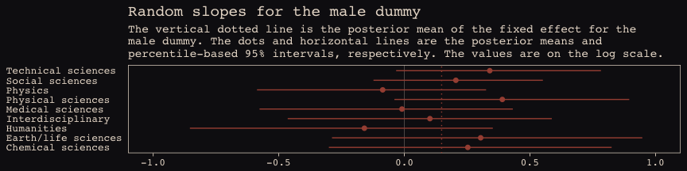<!-- -->

Note how the 95% intervals for all the random `male` slopes contain zero within their bounds. Here are the fixed effects:


```r
tidy(b13.bonus_2) %>%
  filter(str_detect(term , "b_")) %>%
  mutate_if(is.numeric, round, digits = 2)
```

```
##          term estimate std.error lower upper
## 1 b_Intercept    -1.63      0.14 -1.85 -1.38
## 2      b_male     0.15      0.17 -0.14  0.42
```

And if you wanted a one-sided Bayesian *p*-value for the `male` dummy for the full model:


```r
posterior_samples(b13.bonus_2) %>%
  summarise(One_sided_Bayesian_p_value = filter(., b_male <= 0) %>% nrow()/nrow(.))
```

```
##   One_sided_Bayesian_p_value
## 1                   0.174375
```

So, the estimate of the gender bias is small and consistent with the null hypothesis. Which is good! We want gender equality for things like funding success.

Note. The analyses in this document were done with:

* R            3.4.4
* RStudio      1.1.442
* rmarkdown    1.9
* dutchmasters 0.1.0
* tidyverse    1.2.1 
* MASS         7.3-47
* rethinking   1.59
* brms         2.1.9
* rstan        2.17.3
* broom        0.4.2
* ggrepel      0.7.0
* ggbeeswarm   0.5.3
* bayesplot    1.4.0

## Reference
McElreath, R. (2016). *Statistical rethinking: A Bayesian course with examples in R and Stan.* Chapman & Hall/CRC Press.


