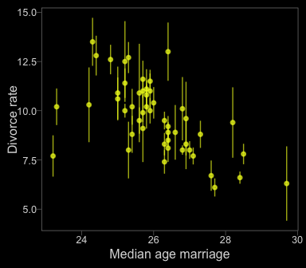
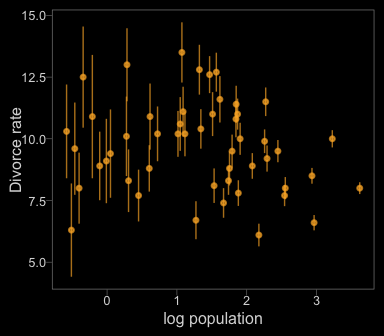
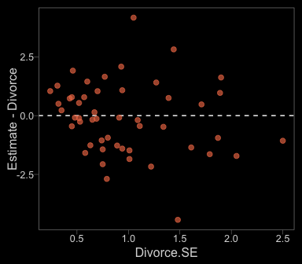
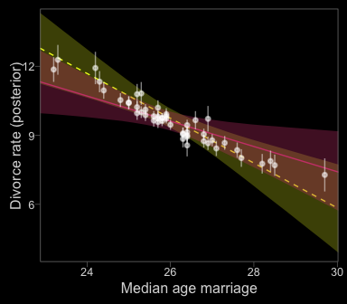
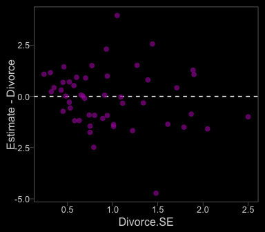
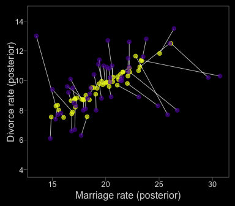
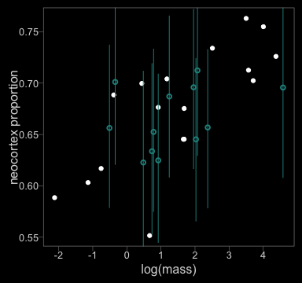
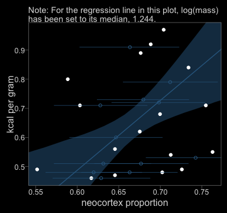
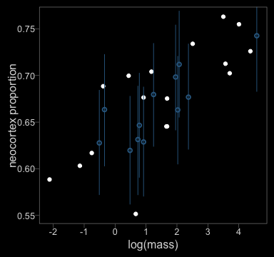

## 14.1. Measurement error

First, let's grab our `WaffleDivorce` data.


```r
library(rethinking)
data(WaffleDivorce)
d <- WaffleDivorce
rm(WaffleDivorce)
```

Switching out rethinking for brms.


```r
detach(package:rethinking, unload = T)
library(brms)
```

The brms package currently supports `theme_black()`, which changes the default ggplot2 theme to a black background with white lines, text, and so forth. You can find the origins of the code, [here](https://jonlefcheck.net/2013/03/11/black-theme-for-ggplot2-2/). 

Though I like the idea of brms including `theme_black()`, I'm not a fan of some of the default settings (e.g., it includes gridlines). Happily, data scientist [Tyler Rinker](https://github.com/trinker) has some nice alternative `theme_black()` code you can find [here](https://github.com/trinker/plotflow/blob/master/R/theme_black.R). The version of `theme_black()` used in this document is based on his version, with a few amendments.


```r
theme_black <- 
  function(base_size=12, base_family="") {
    theme_grey(base_size=base_size, base_family=base_family) %+replace%
        theme(
            # Specify axis options
            axis.line=element_blank(),
            # All text colors used to be "grey55"
            axis.text.x=element_text(size=base_size*0.8, color="grey85",
                lineheight=0.9, vjust=1),
            axis.text.y=element_text(size=base_size*0.8, color="grey85",
                lineheight=0.9,hjust=1),
            axis.ticks=element_line(color="grey55", size = 0.2),
            axis.title.x=element_text(size=base_size, color="grey85", vjust=1,
                margin=ggplot2::margin(.5, 0, 0, 0, "lines")),
            axis.title.y=element_text(size=base_size, color="grey85", angle=90,
                margin=ggplot2::margin(.5, 0, 0, 0, "lines"), vjust=0.5),
            axis.ticks.length=grid::unit(0.3, "lines"),

            # Specify legend options
            legend.background=element_rect(color=NA, fill="black"),
            legend.key=element_rect(color="grey55", fill="black"),
            legend.key.size=grid::unit(1.2, "lines"),
            legend.key.height=NULL,
            legend.key.width=NULL,
            legend.text=element_text(size=base_size*0.8, color="grey85"),
            legend.title=element_text(size=base_size*0.8, face="bold",hjust=0,
                color="grey85"),
            # legend.position="right",
            legend.position = "none",
            legend.text.align=NULL,
            legend.title.align=NULL,
            legend.direction="vertical",
            legend.box=NULL,
            # Specify panel options
            panel.background=element_rect(fill="black", color = NA),
            panel.border=element_rect(fill=NA, color="grey55"),
            panel.grid.major=element_blank(),
            panel.grid.minor=element_blank(),
            panel.spacing=grid::unit(0.25,"lines"),
            # Specify facetting options
            strip.background=element_rect(fill = "black", color="grey10"), # fill="grey30"
            strip.text.x=element_text(size=base_size*0.8, color="grey85"),
            strip.text.y=element_text(size=base_size*0.8, color="grey85",
                angle=-90),
            # Specify plot options
            plot.background=element_rect(color="black", fill="black"),
            plot.title=element_text(size=base_size*1.2, color="grey85", hjust = 0), # added hjust = 0
            plot.subtitle=element_text(size=base_size*.9, color="grey85", hjust = 0), # added line
            # plot.margin=grid::unit(c(1, 1, 0.5, 0.5), "lines")
            plot.margin=grid::unit(c(0.5, 0.5, 0.5, 0.5), "lines")
    )
}
```

One way to use `theme_black()` is to make it part of the code for an individual plot, such as `ggplot() + geom_point() + theme_back()`. Another way is to make `theme_black()` the default setting with `bayesplot::theme_set()`. That's the method we'll use in this document.


```r
library(bayesplot)

theme_set(theme_black())

# To reset the default ggplot2 theme to its traditional parameters, use this code:
# theme_set(theme_default()) 
```

In the brms 2.1.0 manual, Bürkner recommended complimenting `theme_black()` with color scheme "C" from the [viridis package](https://cran.r-project.org/web/packages/viridis/index.html), which provides a variety of [colorblind-safe color palettes](https://cran.r-project.org/web/packages/viridis/vignettes/intro-to-viridis.html).


```r
# install.packages("viridis")
library(viridis)
```

The `viridis_pal()` function will produce a list of colors within a given palette. In each palette, the colors fall on a spectrum. Within `viridis_pal()`, the `option` argument allows one to select a given spectrum, "C", in our case. The final parentheses, `()`, allows one to determine how many discrete colors one would like to break the spectrum up by. We'll choose 7.


```r
viridis_pal(option = "C")(7)
```

```
## [1] "#0D0887FF" "#5D01A6FF" "#9C179EFF" "#CC4678FF" "#ED7953FF" "#FDB32FFF" "#F0F921FF"
```

With a little data wrangling, we can put the colors of our palette in a tibble and display them in a plot.


```r
library(tidyverse)

viridis_pal(option = "C")(7) %>%
  as_tibble() %>% 
  mutate(color_number = str_c(1:7, ". ", value),
         number = 1:7) %>%
  
  ggplot(aes(x = factor(0), y = reorder(color_number, number))) +
  geom_tile(aes(fill = factor(number))) +
  geom_text(aes(color = factor(number), label = color_number)) +
  scale_color_manual(values = c(rep("black", times = 4), 
                                rep("white", times = 3))) +
  scale_fill_viridis(option = "C", discrete = T, direction = -1) +
  scale_x_discrete(NULL, breaks = NULL) +
  scale_y_discrete(NULL, breaks = NULL) +
  ggtitle("Behold: viridis C!")
```

<!-- -->

Now, let's make use of our custom theme and reproduce/reimagine Figure 14.1.a. 


```r
color <- viridis_pal(option = "C")(7)[7]

d %>%
  ggplot(aes(x = MedianAgeMarriage, 
             y = Divorce,
             ymin = Divorce - Divorce.SE, 
             ymax = Divorce + Divorce.SE)) +
  geom_pointrange(shape = 20, alpha = 2/3, color = color) +
  labs(x = "Median age marriage" , y = "Divorce rate")
```

<!-- -->

Note how `viridis_pal(option = "C")(7)[7]` called the seventh color in the color scheme, `"#F0F921FF"`. For Figure 14.1.b, we'll select the sixth color in the palette by coding `viridis_pal(option = "C")(7)[6]`.


```r
color <- viridis_pal(option = "C")(7)[6]

d %>%
  ggplot(aes(x = log(Population), 
             y = Divorce,
             ymin = Divorce - Divorce.SE, 
             ymax = Divorce + Divorce.SE)) +
  geom_pointrange(shape = 20, alpha = 2/3, color = color) +
  labs(x = "log population", 
       y = "Divorce rate")
```

<!-- -->

### 14.1.1. Error on the outcome.

Now we're ready to fit our model. In brms, you specify error on the criterion variable following the form `response | se(se_response, sigma = TRUE)`. In this form, se stands for standard error, the loose frequentist analogue to the Bayesian posterior *SD*. Unless you're fitting a meta-analysis on summary information, make sure to specify `sigma = TRUE`. Without that you'll have no estimate for $\sigma$!


```r
dlist <- list(
    div_obs = d$Divorce,
    div_sd  = d$Divorce.SE,
    R       = d$Marriage,
    A       = d$MedianAgeMarriage)

b14.1 <- 
  brm(data = dlist, family = gaussian,
      div_obs | se(div_sd, sigma = TRUE) ~ 0 + intercept + R + A,
      prior = c(set_prior("normal(0, 10)", class = "b"),
                set_prior("cauchy(0, 2.5)", class = "sigma")),
      chains = 2, iter = 5000, warmup = 1000, cores = 2,
      control = list(adapt_delta = 0.95))
```


```r
print(b14.1)
```

```
##  Family: gaussian 
##   Links: mu = identity; sigma = identity 
## Formula: div_obs | se(div_sd, sigma = TRUE) ~ 0 + intercept + R + A 
##    Data: dlist (Number of observations: 50) 
## Samples: 2 chains, each with iter = 5000; warmup = 1000; thin = 1; 
##          total post-warmup samples = 8000
##     ICs: LOO = NA; WAIC = NA; R2 = NA
##  
## Population-Level Effects: 
##           Estimate Est.Error l-95% CI u-95% CI Eff.Sample Rhat
## intercept    21.35      6.53     8.29    34.08       1971 1.00
## R             0.13      0.08    -0.02     0.27       2485 1.00
## A            -0.55      0.21    -0.96    -0.13       2058 1.00
## 
## Family Specific Parameters: 
##       Estimate Est.Error l-95% CI u-95% CI Eff.Sample Rhat
## sigma     1.13      0.21     0.77     1.58       3193 1.00
## 
## Samples were drawn using sampling(NUTS). For each parameter, Eff.Sample 
## is a crude measure of effective sample size, and Rhat is the potential 
## scale reduction factor on split chains (at convergence, Rhat = 1).
```

I'm unsure how to get the div_est parameters in brms they way McElreath shows them with rethinking. E.g., even the `broom::tidy()` method doesn't work.


```r
library(broom)

tidy(b14.1) %>%
  mutate_if(is.numeric, round, digits = 2)
```

```
##          term estimate std.error   lower   upper
## 1 b_intercept    21.35      6.53   10.46   32.01
## 2         b_R     0.13      0.08    0.00    0.25
## 3         b_A    -0.55      0.21   -0.89   -0.19
## 4       sigma     1.13      0.21    0.82    1.49
## 5        lp__  -105.39      1.42 -108.12 -103.70
```

So it goes.

*Note*. The `normal(0, 10)` prior McElreath used was [quite informative and can lead to discrepancies between the rethinking and brms results](https://github.com/paul-buerkner/brms/issues/114) if you're not careful. A large issue is the default way brms handles intercept priors. From the hyperlink, Bürkner wrote:

>"The formula for the original intercept is
`b_intercept = temp_intercept - dot_product(means_X, b)`, where `means_X` is the vector of means of the predictor variables and b is the vector of regression coefficients (fixed effects). That is, when transforming a prior on the intercept to an "equivalent" prior on the temporary intercept, you have to take the means of the predictors and well as the priors on the other coefficients into account."

If this seems confusing, you have an alternative. The `0 + intercept` part of the brm formula kept the intercept in the metric of the untransformed data, leading to similar results to those from rethinking. When your priors are vague, this might not be much of an issue. But this model is quite sensitive to the intercept syntax.


```r
print(b14.1)
```

```
##  Family: gaussian 
##   Links: mu = identity; sigma = identity 
## Formula: div_obs | se(div_sd, sigma = TRUE) ~ 0 + intercept + R + A 
##    Data: dlist (Number of observations: 50) 
## Samples: 2 chains, each with iter = 5000; warmup = 1000; thin = 1; 
##          total post-warmup samples = 8000
##     ICs: LOO = NA; WAIC = NA; R2 = NA
##  
## Population-Level Effects: 
##           Estimate Est.Error l-95% CI u-95% CI Eff.Sample Rhat
## intercept    21.35      6.53     8.29    34.08       1971 1.00
## R             0.13      0.08    -0.02     0.27       2485 1.00
## A            -0.55      0.21    -0.96    -0.13       2058 1.00
## 
## Family Specific Parameters: 
##       Estimate Est.Error l-95% CI u-95% CI Eff.Sample Rhat
## sigma     1.13      0.21     0.77     1.58       3193 1.00
## 
## Samples were drawn using sampling(NUTS). For each parameter, Eff.Sample 
## is a crude measure of effective sample size, and Rhat is the potential 
## scale reduction factor on split chains (at convergence, Rhat = 1).
```

Figure 14.2.a.


```r
data_error <- 
  fitted(b14.1) %>%
  as_tibble() %>%
  bind_cols(d %>%
              select(Divorce.SE, Divorce, Marriage))

color <- viridis_pal(option = "C")(7)[5]

data_error %>%
  ggplot(aes(x = Divorce.SE, y = Estimate - Divorce)) +
  geom_hline(yintercept = 0, linetype = 2, color = "white") +
  geom_point(alpha = 2/3, size = 2, color = color)
```

<!-- -->

Before we make Figure 14.2.b., we need to fit a model that ignores measurement error.


```r
b14.1b <- 
  brm(data = dlist, family = gaussian,
      div_obs ~ 0 + intercept + R + A,              
      prior = c(set_prior("normal(0, 50)", class = "b", coef = "intercept"),
                set_prior("normal(0, 10)", class = "b"),
                set_prior("cauchy(0, 2.5)", class = "sigma")),
      chains = 2, iter = 5000, warmup = 1000, cores = 2,
      control = list(adapt_delta = 0.95))

print(b14.1b)
```

```
##  Family: gaussian 
##   Links: mu = identity; sigma = identity 
## Formula: div_obs ~ 0 + intercept + R + A 
##    Data: dlist (Number of observations: 50) 
## Samples: 2 chains, each with iter = 5000; warmup = 1000; thin = 1; 
##          total post-warmup samples = 8000
##     ICs: LOO = NA; WAIC = NA; R2 = NA
##  
## Population-Level Effects: 
##           Estimate Est.Error l-95% CI u-95% CI Eff.Sample Rhat
## intercept    36.03      7.48    21.44    50.44       2001 1.00
## R            -0.05      0.08    -0.20     0.11       2410 1.00
## A            -0.97      0.24    -1.44    -0.50       1758 1.00
## 
## Family Specific Parameters: 
##       Estimate Est.Error l-95% CI u-95% CI Eff.Sample Rhat
## sigma     1.51      0.16     1.24     1.86       2882 1.00
## 
## Samples were drawn using sampling(NUTS). For each parameter, Eff.Sample 
## is a crude measure of effective sample size, and Rhat is the potential 
## scale reduction factor on split chains (at convergence, Rhat = 1).
```

Figure 14.2.b.


```r
nd <- 
  tibble(R      = mean(d$Marriage),
         A      = seq(from = 22, to = 30.2, length.out = 30),
         div_sd = mean(d$Divorce.SE))

fitd_error <- 
  fitted(b14.1, newdata = nd) %>%
  as_tibble() %>%
  bind_cols(nd)

fitd_no_error <- 
  fitted(b14.1b, newdata = nd) %>%
  as_tibble() %>%
  bind_cols(nd)

data_error <- 
  fitted(b14.1) %>%
  as_tibble() %>%
  bind_cols(dlist %>%
              as_tibble())

color_y <- viridis_pal(option = "C")(7)[7]
color_r <- viridis_pal(option = "C")(7)[4]

ggplot(data = fitd_error, 
       aes(x = A, y = Estimate)) +
  geom_ribbon(data = fitd_no_error,
              aes(ymin = `2.5%ile`, ymax = `97.5%ile`),
              fill = color_y, alpha = 1/4) +
  geom_line(data = fitd_no_error,
            color = color_y, linetype = 2) +
  geom_ribbon(data = fitd_error,
              aes(ymin = `2.5%ile`, ymax = `97.5%ile`),
              fill = color_r, alpha = 1/3) +
  geom_line(data = fitd_error,
            color = color_r) +
  geom_pointrange(data = data_error,
                  aes(ymin = Estimate - Est.Error,
                      ymax = Estimate + Est.Error),
                  color = "white", shape = 20, alpha = 1/2) +
  labs(x = "Median age marriage" , y = "Divorce rate (posterior)") +
  coord_cartesian(xlim = range(data_error$A), 
                  ylim = c(4, 14))
```

<!-- -->

### 14.1.2. Error on both outcome and predictor.

In brms, you specify error on predictors with an `me` statement in the form of `me(predictor, sd_predictor)` where `sd_predictor` is a vector in the data denoting the size of the measurement error, presumed to be in a standard-deviation metric.


```r
# The data
dlist <- list(
  div_obs = d$Divorce,
  div_sd  = d$Divorce.SE,
  mar_obs = d$Marriage,
  mar_sd  = d$Marriage.SE,
  A       = d$MedianAgeMarriage)

# The model
b14.2 <- 
  brm(data = dlist, family = gaussian,
      div_obs | se(div_sd, sigma = TRUE) ~ 0 + intercept + me(mar_obs, mar_sd) + A,
      prior = c(set_prior("normal(0, 10)", class = "b"),
                set_prior("cauchy(0, 2.5)", class = "sigma")),
      save_mevars = TRUE,
      iter = 5000, warmup = 1000, chains = 3, cores = 3,
      control = list(adapt_delta = 0.95))
```

McElreath set a few initial values in his model `m14.2`. It's unclear, to me, how to set the corresponding initial values in this brms model. If you want to get a sense of the structure of the initial values brms used, you can call this:


```r
b14.2$fit@inits %>% glimpse()
```

```
## List of 3
##  $ :List of 7
##   ..$ b       : num [1:2(1d)] 0.101 -0.125
##   ..$ bsp     : num [1(1d)] -0.603
##   ..$ sigma   : num 1.09
##   ..$ meanme_1: num [1(1d)] -1.2
##   ..$ sdme_1  : num [1(1d)] 4.56
##   ..$ zme_1   : num [1:50(1d)] -1.518 -0.343 0.731 -1.508 -0.771 ...
##   ..$ Xme_1   : num [1:50(1d)] -8.13 -2.77 2.13 -8.08 -4.72 ...
##  $ :List of 7
##   ..$ b       : num [1:2(1d)] 1.933 0.736
##   ..$ bsp     : num [1(1d)] -0.228
##   ..$ sigma   : num 2.12
##   ..$ meanme_1: num [1(1d)] 0.601
##   ..$ sdme_1  : num [1(1d)] 3.08
##   ..$ zme_1   : num [1:50(1d)] -0.0665 -0.4058 1.9091 0.6048 0.3021 ...
##   ..$ Xme_1   : num [1:50(1d)] 0.396 -0.65 6.486 2.465 1.532 ...
##  $ :List of 7
##   ..$ b       : num [1:2(1d)] 0.161 1.718
##   ..$ bsp     : num [1(1d)] -1.12
##   ..$ sigma   : num 2.03
##   ..$ meanme_1: num [1(1d)] 1.12
##   ..$ sdme_1  : num [1(1d)] 0.754
##   ..$ zme_1   : num [1:50(1d)] 0.176 0.992 -1.583 1.725 1.577 ...
##   ..$ Xme_1   : num [1:50(1d)] 1.2566 1.8722 -0.0697 2.4252 2.3137 ...
```

That's as far as I'm going to go, here. If you come up with code that'll work, hit me up.

Here's the model.


```r
print(b14.2)
```

```
##  Family: gaussian 
##   Links: mu = identity; sigma = identity 
## Formula: div_obs | se(div_sd, sigma = TRUE) ~ 0 + intercept + me(mar_obs, mar_sd) + A 
##    Data: dlist (Number of observations: 50) 
## Samples: 3 chains, each with iter = 5000; warmup = 1000; thin = 1; 
##          total post-warmup samples = 12000
##     ICs: LOO = NA; WAIC = NA; R2 = NA
##  
## Population-Level Effects: 
##                 Estimate Est.Error l-95% CI u-95% CI Eff.Sample Rhat
## intercept          15.67      6.73     2.30    28.67       6314 1.00
## A                  -0.44      0.20    -0.83    -0.04       7091 1.00
## memar_obsmar_sd     0.27      0.11     0.07     0.49       6293 1.00
## 
## Family Specific Parameters: 
##       Estimate Est.Error l-95% CI u-95% CI Eff.Sample Rhat
## sigma     1.00      0.21     0.62     1.44      12000 1.00
## 
## Samples were drawn using sampling(NUTS). For each parameter, Eff.Sample 
## is a crude measure of effective sample size, and Rhat is the potential 
## scale reduction factor on split chains (at convergence, Rhat = 1).
```

Note that you'll need to specify `save_mevars = TRUE` in the `brm()` function order to save the posterior samples of error-adjusted variables obtained by using the `me` argument. Without doing so, functions like `predict()` may give you trouble.

Here is the code for Figure 14.3.a.


```r
data_error <-
  fitted(b14.2) %>%
  as_tibble() %>%
  bind_cols(d %>%
              select(Divorce.SE, Divorce, Marriage))

color <- viridis_pal(option = "C")(7)[3]

data_error %>%
  ggplot(aes(x = Divorce.SE, y = Estimate - Divorce)) +
  geom_hline(yintercept = 0, linetype = 2, color = "white") +
  geom_point(alpha = 2/3, size = 2, color = color)
```

<!-- -->

In order to get the posterior samples for error-adjusted `Marriage` rate, we'll use `posterior_samples`. If you examine the object with `glimpse()`, you'll notice 50 `Xme_memar_obsmar_sd[i]` vectors, with $i$ ranging from 1 to 50, each corresponding to one of the 50 states. With a little data wrangling, you can get the mean of each to put in a plot. Once we have those summaries, we' can now'll make our version of Figure 14.4.b.


```r
color_y <- viridis_pal(option = "C")(7)[7]
color_p <- viridis_pal(option = "C")(7)[2]

posterior_samples(b14.2) %>%
  select(starts_with("Xme")) %>%
  gather() %>%
  group_by(key) %>%
  summarise(mean = mean(value)) %>%
  # This ectracts the numerals from the otherwise cumbersione names in key and saves them as numerals
  mutate(key = str_extract(key, "\\d+"),
         key = key %>% as.integer) %>%
  # Because the key numerals were originally treated like text strings, they were not in numeric order. This puts them back in proper order, which is important to do before we bind these values with other data.
  arrange(key) %>%
  select(mean) %>%
  bind_cols(data_error) %>%
  
  ggplot(aes(x = mean, y = Estimate)) +
  geom_segment(aes(xend = Marriage, yend = Divorce),
               color = "white", size = 1/4) +
  geom_point(size = 2, alpha = 2/3, color = color_y) +
  geom_point(aes(x = Marriage, y = Divorce), 
             size = 2, alpha = 2/3, color = color_p) +
  scale_y_continuous(breaks = seq(from = 4, to = 14, by = 2)) +
  labs(x = "Marriage rate (posterior)" , y = "Divorce rate (posterior)") +
  coord_cartesian(ylim = c(4, 14.5))
```

<!-- -->

Our regularization was more agressive than what McElreath showed in the text. I'm unsure of why.

## 14.2. Missing data

Starting with the developer's version 2.1.2, brms now supports Bayesian imputation using adaptations of the [multivariate syntax](https://cran.r-project.org/web/packages/brms/vignettes/brms_multivariate.html). You can download the developer's version like this:


```r
if (!require("devtools")) {
  install.packages("devtools")
}
devtools::install_github("paul-buerkner/brms", dependencies = TRUE)
```

An [official vignette](https://github.com/paul-buerkner/brms/pull/337/commits/2456a00c607aa070c871da27c07f7fe1321eb69f) is currently in the works.

### 14.2.1. Imputing neocortex

Once again, here are the `milk` data.


```r
library(rethinking)
data(milk)
d <- milk

d <-
  d %>%
  mutate(neocortex.prop = neocortex.perc/100,
         logmass        = log(mass))
```

Now we'll switch out rethinking for brms and do a little data manipulation.


```r
detach(package:rethinking, unload = T)
library(brms)
rm(milk)

# prep data
data_list <- 
  list(
    kcal      = d$kcal.per.g,
    neocortex = d$neocortex.prop,
    logmass   = d$logmass)
```

Here's the structure of our data list.


```r
data_list
```

```
## $kcal
##  [1] 0.49 0.51 0.46 0.48 0.60 0.47 0.56 0.89 0.91 0.92 0.80 0.46 0.71 0.71 0.73 0.68 0.72 0.97 0.79
## [20] 0.84 0.48 0.62 0.51 0.54 0.49 0.53 0.48 0.55 0.71
## 
## $neocortex
##  [1] 0.5516     NA     NA     NA     NA 0.6454 0.6454 0.6764     NA 0.6885 0.5885 0.6169 0.6032
## [14]     NA     NA 0.6997     NA 0.7041     NA 0.7340     NA 0.6753     NA 0.7126 0.7260     NA
## [27] 0.7024 0.7630 0.7549
## 
## $logmass
##  [1]  0.6678294  0.7371641  0.9202828  0.4824261  0.7839015  1.6582281  1.6808279  0.9202828
##  [9] -0.3424903 -0.3856625 -2.1202635 -0.7550226 -1.1394343 -0.5108256  1.2441546  0.4382549
## [17]  1.9572739  1.1755733  2.0719133  2.5095993  2.0268316  1.6808279  2.3721112  3.5689692
## [25]  4.3748761  4.5821062  3.7072104  3.4998354  4.0064237
```

When writing a multivariate model in brms, it’s easier to save the model code by itself and then insert it into the `brm()` function. Otherwise, things get cluttered in a hurry.


```r
b_model <- 
  # Here's the primary kcal model
  bf(kcal      | mi() ~ 1 + mi(neocortex) + logmass) + 
  # Here's the model for the missing neocortex data 
  bf(neocortex | mi() ~ 1) + 
  # Here we set the residual correlations for the two models to zero
  set_rescor(FALSE)
```

Note the `mi(neocortex)` syntax in the `kcal` model. This indicates that the predictor, `neocortex`, has missing values that are themselves being modeled. 

To get a sense of how to specify the priors for such a model, use the `get_prior()` function.


```r
get_prior(data = data_list, 
      family = gaussian,
      b_model)
```

```
##                 prior     class        coef group      resp dpar nlpar bound
## 1                             b                                             
## 2                     Intercept                                             
## 3                             b                        kcal                 
## 4                             b     logmass            kcal                 
## 5                             b mineocortex            kcal                 
## 6 student_t(3, 1, 10) Intercept                        kcal                 
## 7 student_t(3, 0, 10)     sigma                        kcal                 
## 8 student_t(3, 1, 10) Intercept                   neocortex                 
## 9 student_t(3, 0, 10)     sigma                   neocortex
```

With the one-step Bayesian imputation procedure in brms, you typically need to use the `resp` argument when specifying non-defaut priors.

Anyway, here we fit the model.


```r
b14.3 <- 
  brm(data = data_list, 
      family = gaussian,
      b_model,  # We inserted the model, here
      prior = c(set_prior("normal(0, 100)", class = "Intercept", resp = "kcal"),
                set_prior("normal(0.5, 1)", class = "Intercept", resp = "neocortex"),
                set_prior("normal(0, 10)", class = "b"),
                set_prior("cauchy(0, 1)", class = "sigma", resp = "kcal"),
                set_prior("cauchy(0, 1)", class = "sigma", resp = "neocortex")),
      iter = 1e4, chains = 2, cores = 2)
```

The model parameters, including the imputed `neocortex` values, indexed by occasion number.


```r
tidy(b14.3) %>%
  mutate_if(is.numeric, round, digits = 2)
```

```
##                     term estimate std.error lower upper
## 1       b_kcal_Intercept    -0.53      0.48 -1.30  0.26
## 2  b_neocortex_Intercept     0.67      0.01  0.65  0.69
## 3         b_kcal_logmass    -0.07      0.02 -0.11 -0.03
## 4   bsp_kcal_mineocortex     1.89      0.74  0.66  3.10
## 5             sigma_kcal     0.13      0.02  0.10  0.17
## 6        sigma_neocortex     0.06      0.01  0.05  0.08
## 7       Ymi_neocortex[2]     0.63      0.05  0.55  0.72
## 8       Ymi_neocortex[3]     0.62      0.05  0.54  0.71
## 9       Ymi_neocortex[4]     0.62      0.05  0.54  0.71
## 10      Ymi_neocortex[5]     0.65      0.05  0.57  0.73
## 11      Ymi_neocortex[9]     0.70      0.05  0.62  0.78
## 12     Ymi_neocortex[14]     0.66      0.05  0.58  0.74
## 13     Ymi_neocortex[15]     0.69      0.05  0.61  0.77
## 14     Ymi_neocortex[17]     0.70      0.05  0.62  0.77
## 15     Ymi_neocortex[19]     0.71      0.05  0.63  0.79
## 16     Ymi_neocortex[21]     0.65      0.05  0.57  0.72
## 17     Ymi_neocortex[23]     0.66      0.05  0.58  0.73
## 18     Ymi_neocortex[26]     0.70      0.05  0.61  0.78
## 19                  lp__    40.44      4.35 32.73 46.80
```

Here's the model that drops the cases with NAs on `neocortex`.


```r
b14.3cc <- 
  brm(data = data_list, 
      family = gaussian,
      kcal ~ 1 + neocortex + logmass,
      prior = c(set_prior("normal(0, 100)", class = "Intercept"),
                set_prior("normal(0, 10)", class = "b"),
                set_prior("cauchy(0, 1)", class = "sigma")),
      iter = 1e4, chains = 2, cores = 2)
```

The parameters:


```r
tidy(b14.3cc) %>%
  mutate_if(is.numeric, round, digits = 2)
```

```
##          term estimate std.error lower upper
## 1 b_Intercept    -1.07      0.59 -2.03 -0.10
## 2 b_neocortex     2.77      0.91  1.28  4.27
## 3   b_logmass    -0.10      0.03 -0.14 -0.05
## 4       sigma     0.14      0.03  0.10  0.20
## 5        lp__    -4.28      1.66 -7.53 -2.36
```

In order to make our versions of Figure 14.4.a. and 14.4.b., we'll need to do a little data wrangling with `fitted()`.


```r
nd <-
  tibble(neocortex = seq(from = .5, to = .85, length.out = 30),
         logmass   = median(data_list$logmass))

f_b14.3 <-
  fitted(b14.3, newdata = nd) %>%
  as_tibble() %>%
  bind_cols(nd)

f_b14.3 %>%
  glimpse()
```

```
## Observations: 30
## Variables: 10
## $ Estimate.kcal        <dbl> 0.3313033, 0.3541536, 0.3770038, 0.3998541, 0.4227044, 0.4455546, ...
## $ Est.Error.kcal       <dbl> 0.12717573, 0.11845449, 0.10977325, 0.10114232, 0.09257577, 0.0840...
## $ `2.5%ile.kcal`       <dbl> 0.08288591, 0.12297561, 0.16227179, 0.20181393, 0.24083388, 0.2797...
## $ `97.5%ile.kcal`      <dbl> 0.5866900, 0.5923364, 0.5983248, 0.6032367, 0.6094026, 0.6154028, ...
## $ Estimate.neocortex   <dbl> 0.6714374, 0.6714374, 0.6714374, 0.6714374, 0.6714374, 0.6714374, ...
## $ Est.Error.neocortex  <dbl> 0.01394615, 0.01394615, 0.01394615, 0.01394615, 0.01394615, 0.0139...
## $ `2.5%ile.neocortex`  <dbl> 0.6436627, 0.6436627, 0.6436627, 0.6436627, 0.6436627, 0.6436627, ...
## $ `97.5%ile.neocortex` <dbl> 0.6989318, 0.6989318, 0.6989318, 0.6989318, 0.6989318, 0.6989318, ...
## $ neocortex            <dbl> 0.5000000, 0.5120690, 0.5241379, 0.5362069, 0.5482759, 0.5603448, ...
## $ logmass              <dbl> 1.244155, 1.244155, 1.244155, 1.244155, 1.244155, 1.244155, 1.2441...
```

To include the imputed `neocortex` values in the plot, we'll extract the information from `broom::tidy()`.


```r
f_b14.3_mi <-
  tidy(b14.3) %>%
  filter(str_detect(term, "Ymi")) %>%
  bind_cols(data_list %>%
              as_tibble() %>%
              filter(is.na(neocortex))
            )

# Here's what we did
f_b14.3_mi %>% head()
```

```
##                term  estimate  std.error     lower     upper kcal neocortex    logmass
## 1  Ymi_neocortex[2] 0.6336852 0.05092651 0.5527187 0.7193897 0.51        NA  0.7371641
## 2  Ymi_neocortex[3] 0.6248143 0.05121340 0.5445194 0.7092189 0.46        NA  0.9202828
## 3  Ymi_neocortex[4] 0.6227332 0.05229396 0.5402123 0.7119480 0.48        NA  0.4824261
## 4  Ymi_neocortex[5] 0.6525332 0.04883960 0.5746326 0.7335311 0.60        NA  0.7839015
## 5  Ymi_neocortex[9] 0.7011461 0.05000687 0.6204791 0.7840513 0.91        NA -0.3424903
## 6 Ymi_neocortex[14] 0.6563291 0.04888468 0.5784982 0.7374390 0.71        NA -0.5108256
```

Data wrangling done--here's our code for Figure 14.4.a.


```r
color <- viridis_pal(option = "D")(7)[4]

ggplot(data = f_b14.3, aes(x = neocortex,
                           y = Estimate.kcal)) +
  geom_ribbon(aes(ymin = `2.5%ile.kcal`,
                  ymax = `97.5%ile.kcal`),
              fill = color, alpha = 1/3) +
  geom_line(color = color) +
  geom_point(data = data_list %>% as_tibble(),
             aes(y = kcal),
             color = "white") +
  geom_point(data = f_b14.3_mi,
             aes(x = estimate, y = kcal),
             color = color, shape = 1) +
  geom_segment(data = f_b14.3_mi, 
               aes(x = lower, xend = upper,
                   y = kcal, yend = kcal),
             color = color, size = 1/4) +
  coord_cartesian(xlim = range(data_list$neocortex, na.rm = T),
                  ylim = range(data_list$kcal, na.rm = T)) +
  labs(subtitle = "Note: For the regression line in this plot, log(mass)\nhas been set to its median, 1.244.",
       x = "neocortex proportion",
       y = "kcal per gram")
```

<!-- -->

Figure 14.4.b.


```r
color <- viridis_pal(option = "D")(7)[4]

ggplot(data = data_list %>% as_tibble(), 
       aes(x = logmass, y = neocortex)) +
  geom_point(color = "white") +
  geom_pointrange(data = f_b14.3_mi,
                  aes(x = logmass, y = estimate,
                      ymin = lower, ymax = upper),
             color = color, size = 1/3, shape = 1) +
  scale_x_continuous(breaks = -2:4) +
  coord_cartesian(xlim = range(data_list$logmass, na.rm = T),
                  ylim = range(data_list$neocortex, na.rm = T)) +
  labs(x = "log(mass)",
       y = "neocortex proportion")
```

<!-- -->

### 14.2.2. Improving the imputation model

Adding `logmass` as a predictor to the `neocortex` submodel is pretty simple.


```r
# The model
b_model <- 
  bf(kcal      | mi() ~ 1 + mi(neocortex) + logmass) + 
  bf(neocortex | mi() ~ 1 + logmass) + # Here's the big difference
  set_rescor(FALSE)

# Fit the model
b14.4 <- 
  brm(data = data_list, 
      family = gaussian,
      b_model,
      prior = c(set_prior("normal(0, 100)", class = "Intercept", resp = "kcal"),
                set_prior("normal(0.5, 1)", class = "Intercept", resp = "neocortex"),
                set_prior("normal(0, 10)", class = "b"),
                set_prior("cauchy(0, 1)", class = "sigma", resp = "kcal"),
                set_prior("cauchy(0, 1)", class = "sigma", resp = "neocortex")),
      iter = 1e4, chains = 2, cores = 2,
      # There were a couple divergent transitions with the default `adapt_delta = 0.8`
      control = list(adapt_delta = 0.9))
```

The parameter estimates:


```r
tidy(b14.4) %>%
  mutate_if(is.numeric, round, digits = 2)
```

```
##                     term estimate std.error lower upper
## 1       b_kcal_Intercept    -0.84      0.48 -1.60 -0.04
## 2  b_neocortex_Intercept     0.64      0.01  0.62  0.66
## 3         b_kcal_logmass    -0.09      0.02 -0.12 -0.05
## 4    b_neocortex_logmass     0.02      0.01  0.01  0.03
## 5   bsp_kcal_mineocortex     2.40      0.74  1.14  3.58
## 6             sigma_kcal     0.13      0.02  0.10  0.17
## 7        sigma_neocortex     0.04      0.01  0.03  0.06
## 8       Ymi_neocortex[2]     0.63      0.04  0.57  0.69
## 9       Ymi_neocortex[3]     0.63      0.04  0.57  0.69
## 10      Ymi_neocortex[4]     0.62      0.04  0.56  0.68
## 11      Ymi_neocortex[5]     0.65      0.03  0.59  0.70
## 12      Ymi_neocortex[9]     0.66      0.04  0.60  0.72
## 13     Ymi_neocortex[14]     0.63      0.03  0.57  0.68
## 14     Ymi_neocortex[15]     0.68      0.03  0.62  0.73
## 15     Ymi_neocortex[17]     0.70      0.03  0.64  0.75
## 16     Ymi_neocortex[19]     0.71      0.03  0.65  0.77
## 17     Ymi_neocortex[21]     0.66      0.04  0.60  0.72
## 18     Ymi_neocortex[23]     0.68      0.03  0.62  0.73
## 19     Ymi_neocortex[26]     0.74      0.04  0.68  0.80
## 20                  lp__    48.66      4.15 41.17 54.61
```

Here's our pre-Figure14.5. data wrangling.


```r
f_b14.4 <-
  fitted(b14.4, newdata = nd) %>%
  as_tibble() %>%
  bind_cols(nd)

f_b14.4_mi <-
  tidy(b14.4) %>%
  filter(str_detect(term, "Ymi")) %>%
  bind_cols(data_list %>%
              as_tibble() %>%
              filter(is.na(neocortex))
            )

f_b14.4 %>%
  glimpse()
```

```
## Observations: 30
## Variables: 10
## $ Estimate.kcal        <dbl> 0.2476603, 0.2765816, 0.3055028, 0.3344240, 0.3633452, 0.3922664, ...
## $ Est.Error.kcal       <dbl> 0.12722644, 0.11846457, 0.10973893, 0.10105891, 0.09243736, 0.0838...
## $ `2.5%ile.kcal`       <dbl> 0.006005631, 0.051409359, 0.096776855, 0.142416860, 0.187703690, 0...
## $ `97.5%ile.kcal`      <dbl> 0.5108146, 0.5216199, 0.5322854, 0.5441247, 0.5551359, 0.5654964, ...
## $ Estimate.neocortex   <dbl> 0.6670953, 0.6670953, 0.6670953, 0.6670953, 0.6670953, 0.6670953, ...
## $ Est.Error.neocortex  <dbl> 0.009626714, 0.009626714, 0.009626714, 0.009626714, 0.009626714, 0...
## $ `2.5%ile.neocortex`  <dbl> 0.6475831, 0.6475831, 0.6475831, 0.6475831, 0.6475831, 0.6475831, ...
## $ `97.5%ile.neocortex` <dbl> 0.6859406, 0.6859406, 0.6859406, 0.6859406, 0.6859406, 0.6859406, ...
## $ neocortex            <dbl> 0.5000000, 0.5120690, 0.5241379, 0.5362069, 0.5482759, 0.5603448, ...
## $ logmass              <dbl> 1.244155, 1.244155, 1.244155, 1.244155, 1.244155, 1.244155, 1.2441...
```

```r
f_b14.4_mi %>%
  glimpse()
```

```
## Observations: 12
## Variables: 8
## $ term      <chr> "Ymi_neocortex[2]", "Ymi_neocortex[3]", "Ymi_neocortex[4]", "Ymi_neocortex[5]...
## $ estimate  <dbl> 0.6313489, 0.6287394, 0.6196760, 0.6465933, 0.6634316, 0.6277171, 0.6795871, ...
## $ std.error <dbl> 0.03575738, 0.03616429, 0.03579112, 0.03439991, 0.03639254, 0.03472393, 0.034...
## $ lower     <dbl> 0.5717969, 0.5702583, 0.5617279, 0.5904680, 0.6026661, 0.5718917, 0.6236898, ...
## $ upper     <dbl> 0.6889410, 0.6879607, 0.6780659, 0.7027775, 0.7228672, 0.6844814, 0.7346864, ...
## $ kcal      <dbl> 0.51, 0.46, 0.48, 0.60, 0.91, 0.71, 0.73, 0.72, 0.79, 0.48, 0.51, 0.53
## $ neocortex <dbl> NA, NA, NA, NA, NA, NA, NA, NA, NA, NA, NA, NA
## $ logmass   <dbl> 0.7371641, 0.9202828, 0.4824261, 0.7839015, -0.3424903, -0.5108256, 1.2441546...
```

Figure 14.5.a.


```r
color <- viridis_pal(option = "D")(7)[3]

ggplot(data = f_b14.4, aes(x = neocortex,
                           y = Estimate.kcal)) +
  geom_ribbon(aes(ymin = `2.5%ile.kcal`,
                  ymax = `97.5%ile.kcal`),
              fill = color, alpha = 1/2) +
  geom_line(color = color) +
  geom_point(data = data_list %>% as_tibble(),
             aes(y = kcal),
             color = "white") +
  geom_point(data = f_b14.4_mi,
             aes(x = estimate, y = kcal),
             color = color, shape = 1) +
  geom_segment(data = f_b14.4_mi, 
               aes(x = lower, xend = upper,
                   y = kcal, yend = kcal),
             color = color, size = 1/4) +
  coord_cartesian(xlim = range(data_list$neocortex, na.rm = T),
                  ylim = range(data_list$kcal, na.rm = T)) +
  labs(subtitle = "Note: For the regression line in this plot, log(mass)\nhas been set to its median, 1.244.",
       x = "neocortex proportion",
       y = "kcal per gram")
```

<!-- -->

Figure 14.5.b.


```r
color <- viridis_pal(option = "D")(7)[3]

ggplot(data = data_list %>% as_tibble(), 
       aes(x = logmass, y = neocortex)) +
  geom_point(color = "white") +
  geom_pointrange(data = f_b14.4_mi,
                  aes(x = logmass, y = estimate,
                      ymin = lower, ymax = upper),
             color = color, size = 1/3, shape = 1) +
  scale_x_continuous(breaks = -2:4) +
  coord_cartesian(xlim = range(data_list$logmass, na.rm = T),
                  ylim = range(data_list$neocortex, na.rm = T)) +
  labs(x = "log(mass)",
       y = "neocortex proportion")
```

<!-- -->

Note. The analyses in this document were done with:

* R           3.4.4
* RStudio     1.1.442
* rmarkdown   1.9
* rstan       2.17.3
* rethinking  1.59
* brms        2.1.9
* bayesplot   1.4.0
* viridis     0.4.0
* tidyverse   1.2.1
* broom       0.4.3

## Reference
McElreath, R. (2016). *Statistical rethinking: A Bayesian course with examples in R and Stan.* Chapman & Hall/CRC Press.


