## 4.1. Why normal distributions are normal

### 4.1.1. Normal by addition.

In this document, we'll use the [tidyverse](https://www.tidyverse.org) for data wrangling.


```r
library(tidyverse)
```

If you are new to tidyverse-style syntax, possibly the oddest component is the pipe (i.e., `%>%`). I’m not going to explain the `%>%` in this project, but you might learn more about in [this brief clip](https://www.youtube.com/watch?v=9yjhxvu-pDg), starting around [minute 21:25 in this talk by Wickham](https://www.youtube.com/watch?v=K-ss_ag2k9E&t=1285s), or in [section 5.6.1 from Grolemund and Wickham’s *R for Data Science*](http://r4ds.had.co.nz/transform.html#combining-multiple-operations-with-the-pipe). Really, all of chapter 5 of *R4DS* is just great for new R and new tidyverse users. And *R4DS* Chapter 3 is a nice introduction to plotting with ggplot2.

All that said, here's a way to do the simulation necessary for the plot in the top panel of Figure 4.2.


```r
# We set the seed to make the results of runif() reproducible. You can put any old number you like in set.seed(), but to exactly reproduce my results, you'll have to put in 1000.
set.seed(1000)
pos <- 
  replicate(100, runif(16, -1, 1)) %>%        # Here's the simulation
  as_tibble() %>%                             # For data manipulation, we'll make this a tibble
  rbind(0, .) %>%                             # Here we add a row of zeros above the simulation results
  mutate(step = 0:16) %>%                     # This adds our step intex
  gather(key, value, -step) %>%               # Here we convert the data to the long format
  mutate(person = rep(1:100, each = 17)) %>%  # This adds a person id index
  # The next two lines allows us to make culmulative sums within each person
  group_by(person) %>%
  mutate(position = cumsum(value)) %>%
  ungroup()  # Ungrouping allows for further data manipulation
```

And here's the actual plot code.


```r
ggplot(data = pos, 
       aes(x = step, y = position, group = person)) +
  geom_vline(xintercept = c(4, 8, 16), linetype = 2) +
  geom_line(aes(color = person < 2, alpha  = person < 2)) +
  scale_color_manual(values = c("skyblue4", "black")) +
  scale_alpha_manual(values = c(1/5, 1)) +
  scale_x_continuous("step number", breaks = c(0, 4, 8, 12, 16)) +
  theme(legend.position = "none")
```

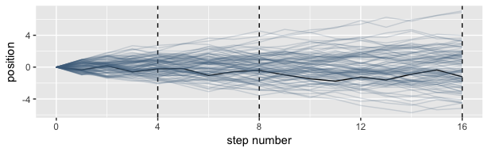<!-- -->

I apologize for starting off with such a complicated plot. But what can you do? McElreath started off the chapter in a full plot sprint. If you're new to ggplot2, don’t fret. Many of the upcoming plots are simpler.

Here's the code for the bottom three plots of Figure 4.2.


```r
# Figure 4.2.a.
pos %>%
  filter(step == 4) %>%
  ggplot(aes(x = position)) +
  geom_line(stat = "density", color = "dodgerblue1") +
  coord_cartesian(xlim = -6:6) +
  labs(title = "4 steps")
```

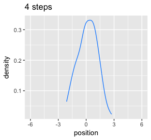<!-- -->

```r
# Figure 4.2.b.
pos %>%
  filter(step == 8) %>%
  ggplot(aes(x = position)) +
  geom_density(color = "dodgerblue2") +
  coord_cartesian(xlim = -6:6) +
  labs(title = "8 steps")
```

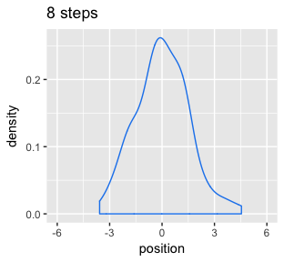<!-- -->

```r
# An intermediary step to get an SD value
pos %>%
  filter(step == 16) %>%
  summarise(sd = sd(position))
```

```
## # A tibble: 1 x 1
##      sd
##   <dbl>
## 1  2.38
```

```r
# Figure 4.2.c.
pos %>%
  filter(step == 16) %>%
  ggplot(aes(x = position)) +
  geom_line(data = tibble(position = seq(from = -7, to = 7, by = .1)),
            aes(x = position, y = dnorm(position, 0, 2.381768)),
            linetype = 2) +  # 2.381768 came from the previous code block
  geom_density(color = "transparent", fill = "dodgerblue3", alpha = 1/2) +
  coord_cartesian(xlim = -6:6) +
  labs(title = "16 steps",
       y = "density")
```

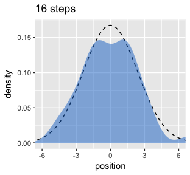<!-- -->

While we were at it, we explored a few ways to express densities. The main action was with the `geom_line()` and `geom_density()` functions.

### 4.1.2. Normal by multiplication.


```r
prod(1 + runif(12, 0, 0.1))
```

```
## [1] 1.719545
```


```r
set.seed(.1)
growth <- 
  replicate(10000, prod(1 + runif(12, 0, 0.1))) %>%
  as_tibble()

ggplot(data = growth, aes(x = value)) +
  geom_density()
```

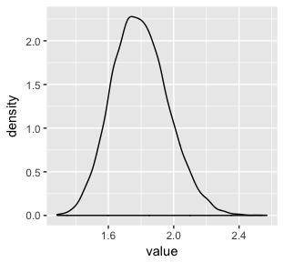<!-- -->


```r
set.seed(1.7195451)
big <- 
  replicate(10000, prod(1 + runif(12, 0, 0.5))) %>%
  as_tibble() 

set.seed(1.7195451)
small <- 
  replicate(10000, prod(1 + runif(12, 0, 0.01))) %>%
  as_tibble()

ggplot(data = big) +
  geom_density(aes(x = value), fill = "black") +
  labs(title = "My big density")
```

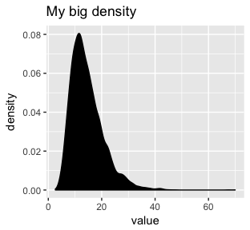<!-- -->

```r
ggplot(data = small) +
  geom_density(aes(x = value), fill = "black") +
  labs(title = "My small density")
```

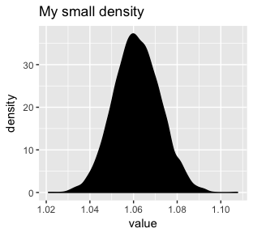<!-- -->

### 4.1.3. Normal by log-multiplication.


```r
set.seed(12)
replicate(10000, log(prod(1 + runif(12, 0, 0.5)))) %>%
  as_tibble() %>%
  ggplot(aes(x = value)) +
  geom_density(color = "transparent", 
               fill = "gray33")
```

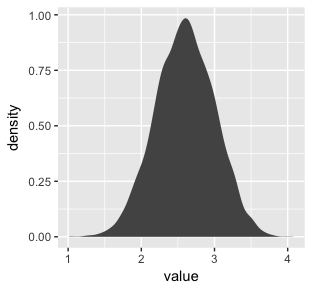<!-- -->

## 4.3. A Gaussian model of height

### 4.3.1. The data.

Let's get the data from McElreath's [rethinking package](http://xcelab.net/rm/statistical-rethinking/).


```r
library(rethinking)
data(Howell1)
d <- Howell1
```

Here we open our main statistical package, Bürkner's [brms](https://github.com/paul-buerkner/brms). But before we do, we'll need to detach the rethinking package. R will not allow users to use a function from one package that shares the same name as a different function from another package if both packages are open at the same time. The rethinking and brms packages are designed for similar purposes and, unsurprisingly, overlap in the names of their functions. To prevent problems, we will always make sure rethinking is detached before using brms. To learn more on the topic, see [this R-bloggers blog](https://www.r-bloggers.com/r-and-package-masking-a-real-life-example/).


```r
rm(Howell1)
detach(package:rethinking, unload = T)
library(brms)
```

Go ahead and investigate the data with `str()`, the tidyverse analogue for which is `glimpse()`.


```r
d %>%
  str()
```

```
## 'data.frame':	544 obs. of  4 variables:
##  $ height: num  152 140 137 157 145 ...
##  $ weight: num  47.8 36.5 31.9 53 41.3 ...
##  $ age   : num  63 63 65 41 51 35 32 27 19 54 ...
##  $ male  : int  1 0 0 1 0 1 0 1 0 1 ...
```

Here are the `height` values.


```r
d %>%
  select(height) %>%
  head()
```

```
##    height
## 1 151.765
## 2 139.700
## 3 136.525
## 4 156.845
## 5 145.415
## 6 163.830
```

We can make an adults-only data frame like so.


```r
d2 <- 
  d %>%
  filter(age >= 18)
```

### 4.3.2. The model. 

Here's the shape of the prior for $\mu$ in *N*(178, 20)


```r
ggplot(data = tibble(x = seq(from = 100, to = 250, by = .1)), 
       aes(x = x, y = dnorm(x, mean = 178, sd = 20))) +
  geom_line() +
  ylab("density")
```

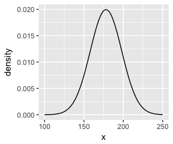<!-- -->

And here's the ggplot2 code for our prior for $\sigma$, a uniform distribution with a minimum value of 0 and a maximum value of 50. We don't really need the y axis when looking at the shapes of a density, so we'll just remove it.


```r
tibble(x = seq(from = -10, to = 60, by = 1)) %>%
  
  ggplot(aes(x = x, y = dunif(x, min = 0, max = 50))) +
  geom_line() +
  scale_y_continuous(NULL, breaks = NULL) +
  theme(panel.grid = element_blank())
```

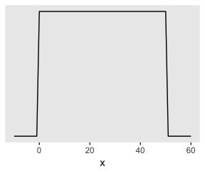<!-- -->

Here we simulate from those two priors to get a prior probability distribution of `heights`.


```r
sample_mu <- rnorm(1e4, 178, 20)
sample_sigma <- runif(1e4, 0, 50)

tibble(x = rnorm(1e4, sample_mu, sample_sigma)) %>%

  ggplot(aes(x = x)) +
  geom_density(fill = "black", size = 0) +
  scale_y_continuous(NULL, breaks = NULL) +
  theme(panel.grid = element_blank())
```

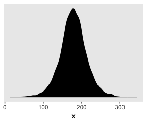<!-- -->

As McElreath wrote, we've made a "vaguely bell-shaped density with thick tails" (p. 83).

### 4.3.3. Grid approximation of the posterior distribution. 

I'm not going to touch this. As McElreath explained, you'll never use this for practical data analysis. Rather, let's pick up right with McElrath's `map()` models. 

### 4.3.5. Fitting the model with ~~`map()`~~ `brm()`.

We won't actually use `map()`, but will jumpt straight to the primary brms function, `brm()`. In the text, McElreath indexes his models with names like `m4.1`. I will largely follow that convention, but will replace the *m* with a *b* to stand for the brms package. Here's the first model.


```r
b4.1 <- 
  brm(data = d2, family = gaussian,
      height ~ 1,
      prior = c(set_prior("normal(178, 20)", class = "Intercept"),
                set_prior("uniform(0, 50)", class = "sigma")),
      chains = 4, iter = 31000, warmup = 30000, cores = 4)
```

```
## Warning: It appears as if you have specified an upper bounded prior on a parameter that has no natural upper bound.
## If this is really what you want, please specify argument 'ub' of 'set_prior' appropriately.
## Warning occurred for prior 
## sigma ~ uniform(0, 50)
```

Note the warning message. [Stan](http://mc-stan.org), which is the [engine under the hood of our brms vehicle](https://github.com/paul-buerkner/brms), gets concerned when you use priors with hard bounds on parameters for which we wouldn't expect hard bounds. There's no reason to expect a hard upper bound on $\sigma$, so Stan barks. Beware of unneeded hard bounds.

McElreath's uniform prior for $\sigma$ was rough on brms. It took an unusually-large number of warmup iterations before the chains sampled properly. As McElreath covers in chapter 8, HMC tends to work better when you default to a half Cauchy for $\sigma$. Here's how to do so.


```r
b4.1halfCaucy <- 
  brm(data = d2, family = gaussian,
      height ~ 1,
      prior = c(set_prior("normal(178, 20)", class = "Intercept"),
                set_prior("cauchy(0, 1)", class = "sigma")),
      chains = 4, iter = 2000, warmup = 1000, cores = 4)
```

This leads to an important point. After running an HMC model, it's a good idea to inspect the chains. McElreath covers this in chapter 8. Here's a typical way to do so in brms.


```r
plot(b4.1halfCaucy)
```

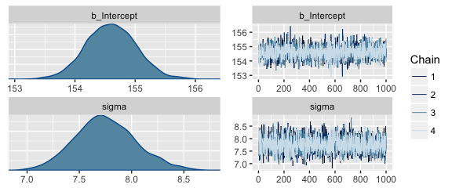<!-- -->

If you want detailed diagnostics for the HMC chains, call `launch_shiny(b4.1)`. That'll keep you busy for a while. But anyway, the chains look good. We can reasonably trust the results

Here's how to get the model summary, the brms equivalent to rethinking's `precis()`.


```r
print(b4.1halfCaucy)
```

```
##  Family: gaussian 
##   Links: mu = identity; sigma = identity 
## Formula: height ~ 1 
##    Data: d2 (Number of observations: 352) 
## Samples: 4 chains, each with iter = 2000; warmup = 1000; thin = 1; 
##          total post-warmup samples = 4000
##     ICs: LOO = NA; WAIC = NA; R2 = NA
##  
## Population-Level Effects: 
##           Estimate Est.Error l-95% CI u-95% CI Eff.Sample Rhat
## Intercept   154.59      0.42   153.80   155.41       3232 1.00
## 
## Family Specific Parameters: 
##       Estimate Est.Error l-95% CI u-95% CI Eff.Sample Rhat
## sigma     7.75      0.30     7.21     8.37       3391 1.00
## 
## Samples were drawn using sampling(NUTS). For each parameter, Eff.Sample 
## is a crude measure of effective sample size, and Rhat is the potential 
## scale reduction factor on split chains (at convergence, Rhat = 1).
```

The `summary()` function works in a similar way. 

You can also get a [Stan-like summary](https://cran.r-project.org/web/packages/rstan/vignettes/rstan.html) with this:


```r
b4.1halfCaucy$fit
```

```
## Inference for Stan model: gaussian brms-model.
## 4 chains, each with iter=2000; warmup=1000; thin=1; 
## post-warmup draws per chain=1000, total post-warmup draws=4000.
## 
##                 mean se_mean   sd     2.5%      25%      50%      75%    97.5% n_eff Rhat
## b_Intercept   154.59    0.01 0.42   153.80   154.31   154.59   154.88   155.41  3232    1
## sigma           7.75    0.01 0.30     7.21     7.54     7.73     7.95     8.37  3391    1
## lp__        -1227.55    0.02 1.01 -1230.25 -1227.93 -1227.25 -1226.83 -1226.54  1864    1
## 
## Samples were drawn using NUTS(diag_e) at Tue Mar 27 05:48:22 2018.
## For each parameter, n_eff is a crude measure of effective sample size,
## and Rhat is the potential scale reduction factor on split chains (at 
## convergence, Rhat=1).
```

Whereas rethinking defaults to 89% intervals, using `print()` or `summary()` with brms models defaults to 95% intervals. Unless otherwise specified, I will stick with 95% intervals throughout. However, if you really want those 89% intervals, an easy way is with the `prob` argument within `brms::summary()` or `brms::print()`.


```r
summary(b4.1halfCaucy, prob = .89)
```

```
##  Family: gaussian 
##   Links: mu = identity; sigma = identity 
## Formula: height ~ 1 
##    Data: d2 (Number of observations: 352) 
## Samples: 4 chains, each with iter = 2000; warmup = 1000; thin = 1; 
##          total post-warmup samples = 4000
##     ICs: LOO = NA; WAIC = NA; R2 = NA
##  
## Population-Level Effects: 
##           Estimate Est.Error l-89% CI u-89% CI Eff.Sample Rhat
## Intercept   154.59      0.42   153.93   155.27       3232 1.00
## 
## Family Specific Parameters: 
##       Estimate Est.Error l-89% CI u-89% CI Eff.Sample Rhat
## sigma     7.75      0.30     7.30     8.23       3391 1.00
## 
## Samples were drawn using sampling(NUTS). For each parameter, Eff.Sample 
## is a crude measure of effective sample size, and Rhat is the potential 
## scale reduction factor on split chains (at convergence, Rhat = 1).
```

Anyways, here's the shockingly-narrow-$\mu$-prior model.


```r
b4.2 <- 
  brm(data = d2, family = gaussian,
      height ~ 1,
      prior = c(set_prior("normal(178, .1)", class = "Intercept"),
                set_prior("uniform(0, 50)", class = "sigma")),
      chains = 4, iter = 3000, warmup = 2000, cores = 4)

plot(b4.2)
```

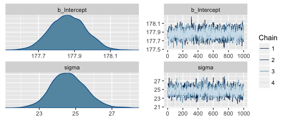<!-- -->

```r
print(b4.2)
```

```
##  Family: gaussian 
##   Links: mu = identity; sigma = identity 
## Formula: height ~ 1 
##    Data: d2 (Number of observations: 352) 
## Samples: 4 chains, each with iter = 3000; warmup = 2000; thin = 1; 
##          total post-warmup samples = 4000
##     ICs: LOO = NA; WAIC = NA; R2 = NA
##  
## Population-Level Effects: 
##           Estimate Est.Error l-95% CI u-95% CI Eff.Sample Rhat
## Intercept   177.86      0.10   177.67   178.06       4000 1.00
## 
## Family Specific Parameters: 
##       Estimate Est.Error l-95% CI u-95% CI Eff.Sample Rhat
## sigma    24.63      0.95    22.82    26.51       1685 1.00
## 
## Samples were drawn using sampling(NUTS). For each parameter, Eff.Sample 
## is a crude measure of effective sample size, and Rhat is the potential 
## scale reduction factor on split chains (at convergence, Rhat = 1).
```

I had to increase the warmup due to convergence issues. After doing so, everything looks to be on the up and up.

### 4.3.6. Sampling from a ~~`map()`~~ `brm()` fit.

brms doesn't seem to have a convenience function that works the way `vcov()` does for rethinking. For example:


```r
vcov(b4.1halfCaucy)
```

```
##           Intercept
## Intercept 0.1769241
```

This only returns the first element in the matrix it did for rethinking. 

However, if you really wanted this information, you could get it after putting the HMC chains in a data frame.


```r
post <- posterior_samples(b4.1halfCaucy)
cov(post[, 1:2])
```

```
##             b_Intercept       sigma
## b_Intercept 0.176924111 0.001420698
## sigma       0.001420698 0.087467608
```

That was "(1) a vector of variances for the parameters and (2) a correlation matrix" for them (p. 90). Here are just the variances (i.e., the diagonal elements) and the correlation matrix.


```r
post[, 1:2] %>%
  cov() %>%
  diag()
```

```
## b_Intercept       sigma 
##  0.17692411  0.08746761
```

```r
post %>%
select(b_Intercept, sigma) %>%
  cor()
```

```
##             b_Intercept      sigma
## b_Intercept  1.00000000 0.01142049
## sigma        0.01142049 1.00000000
```

With our `post <- posterior_samples(b4.1halfCaucy)` code, a few lines above, we've already done the brms version of what McElreath did with `extract.samples()`. However, what happened under the hood was different. Whereas rethinking used the `mvnorm()` function from the [MASS package](https://cran.r-project.org/web/packages/MASS/index.html), in brms we just extracted the iterations of the HMC chains and put them in a data frame. 


```r
head(post)
```

```
##   b_Intercept    sigma      lp__
## 1    153.9825 6.821956 -1233.864
## 2    155.2264 7.478577 -1228.093
## 3    154.9862 7.270921 -1228.323
## 4    155.1198 7.517387 -1227.594
## 5    154.1235 7.975937 -1227.531
## 6    154.4913 7.753666 -1226.563
```

Notice how our data frame, `post`, includes a third vector, `lp__`, which is the log posterior. See the [brms manual](https://cran.r-project.org/web/packages/brms/brms.pdf) for details.

The `summary()` function doesn't work for brms posterior data frames quite the way `precis()` does for posterior data frames from the rethinking package.


```r
summary(post[, 1:2])
```

```
##   b_Intercept        sigma      
##  Min.   :153.3   Min.   :6.808  
##  1st Qu.:154.3   1st Qu.:7.536  
##  Median :154.6   Median :7.735  
##  Mean   :154.6   Mean   :7.748  
##  3rd Qu.:154.9   3rd Qu.:7.946  
##  Max.   :156.1   Max.   :8.817
```

Here's one option using the transpose of a `quantile()` call nested within `apply()`, which is a very general function you can learn more about [here](https://www.datacamp.com/community/tutorials/r-tutorial-apply-family#gs.f7fyw2s) or [here](https://www.r-bloggers.com/r-tutorial-on-the-apply-family-of-functions/).


```r
t(apply(post[, 1:2], 2, quantile, probs = c(.5, .025, .75)))
```

```
##                    50%       2.5%        75%
## b_Intercept 154.594670 153.795473 154.884233
## sigma         7.734902   7.213258   7.946283
```

The base R code is compact, but somewhat opaque. Here's how to do something similar with more explicit tidyverse code.


```r
post %>%
  select(-lp__) %>% 
  gather(parameter) %>%
  group_by(parameter) %>%
  summarise(mean = mean(value),
            SD   = sd(value),
            `2.5_percentile`  = quantile(value, probs = .025),
            `97.5_percentile` = quantile(value, probs = .975)) %>%
  mutate_if(is.numeric, round, digits = 2)
```

```
## # A tibble: 2 x 5
##   parameter     mean    SD `2.5_percentile` `97.5_percentile`
##   <chr>        <dbl> <dbl>            <dbl>             <dbl>
## 1 b_Intercept 155    0.420           154               155   
## 2 sigma         7.75 0.300             7.21              8.37
```

With respect to McElreath's "Overthinking: Getting $\sigma$ right.", there's no need to fret about this in brms. With HMC, we are not constraining the posteriors to the multivariate normal distribution. Here's our posterior density for $\sigma$.


```r
ggplot(data = post, 
       aes(x = sigma)) +
  geom_density(size = 1/10, fill = "black") +
  scale_y_continuous(NULL, breaks = NULL) +
  xlab(expression(sigma)) +
  theme(panel.grid = element_blank())
```

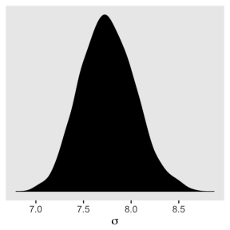<!-- -->

See? HMC handled the mild skew just fine. 

## 4.4. Adding a predictor

Here's our scatter plot of `weight` and `height`.


```r
ggplot(data = d2, 
       aes(x = weight, y = height)) +
  theme_bw() +
  geom_point(shape = 1, size = 2) +
  theme(panel.grid = element_blank())
```

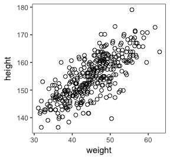<!-- -->

### 4.4.2. Fitting the model.


```r
b4.3 <- 
  brm(data = d2, family = gaussian,
      height ~ 1 + weight,
      prior = c(set_prior("normal(156, 100)", class = "Intercept"),
                set_prior("normal(0, 10)", class = "b"),
                set_prior("uniform(0, 50)", class = "sigma")),
      chains = 4, iter = 41000, warmup = 40000, cores = 4)

plot(b4.3)
```

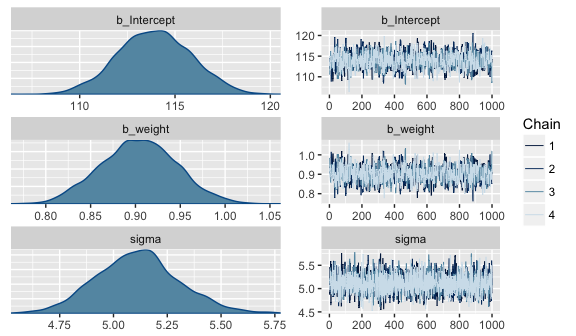<!-- -->

```r
print(b4.3)
```

```
##  Family: gaussian 
##   Links: mu = identity; sigma = identity 
## Formula: height ~ 1 + weight 
##    Data: d2 (Number of observations: 352) 
## Samples: 4 chains, each with iter = 41000; warmup = 40000; thin = 1; 
##          total post-warmup samples = 4000
##     ICs: LOO = NA; WAIC = NA; R2 = NA
##  
## Population-Level Effects: 
##           Estimate Est.Error l-95% CI u-95% CI Eff.Sample Rhat
## Intercept   113.93      1.91   110.20   117.63        865 1.01
## weight        0.90      0.04     0.82     0.99        850 1.01
## 
## Family Specific Parameters: 
##       Estimate Est.Error l-95% CI u-95% CI Eff.Sample Rhat
## sigma     5.11      0.19     4.75     5.50       2601 1.00
## 
## Samples were drawn using sampling(NUTS). For each parameter, Eff.Sample 
## is a crude measure of effective sample size, and Rhat is the potential 
## scale reduction factor on split chains (at convergence, Rhat = 1).
```
 
This was another example of how putting a uniform prior on $\sigma$ required an unusually large number of warmup iterations before the HMC chains converged on the posterior. Change the prior to `"cauchy(0, 1)"` and they converge with no problem and have much better effective samples, too.

Again, brms doesn't have a convenient `corr = TRUE` argument for `plot()` or `summary()`. But you can get that information after putting the chains in a data frame.


```r
posterior_samples(b4.3) %>%
  select(-lp__) %>%
  cor() %>%
  round(digits = 2)
```

```
##             b_Intercept b_weight sigma
## b_Intercept        1.00    -0.99  0.01
## b_weight          -0.99     1.00 -0.01
## sigma              0.01    -0.01  1.00
```

With centering, we can reduce the correlations among the parameters.


```r
d2 <- 
  d2 %>%
  mutate(weight.c = weight - mean(weight))
```

The `weight.c` model:


```r
b4.4 <- 
  brm(data = d2, family = gaussian,
      height ~ 1 + weight.c,
      prior = c(set_prior("normal(178, 100)", class = "Intercept"),
                set_prior("normal(0, 10)", class = "b"),
                set_prior("uniform(0, 50)", class = "sigma")),
      chains = 4, iter = 41000, warmup = 40000, cores = 4,
      control = list(adapt_delta = 0.8, 
                     max_treedepth = 10))

plot(b4.4)
```

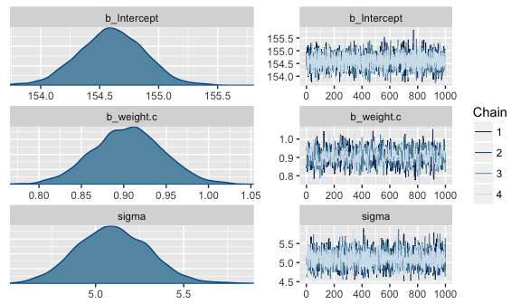<!-- -->

```r
print(b4.4)
```

```
##  Family: gaussian 
##   Links: mu = identity; sigma = identity 
## Formula: height ~ 1 + weight.c 
##    Data: d2 (Number of observations: 352) 
## Samples: 4 chains, each with iter = 41000; warmup = 40000; thin = 1; 
##          total post-warmup samples = 4000
##     ICs: LOO = NA; WAIC = NA; R2 = NA
##  
## Population-Level Effects: 
##           Estimate Est.Error l-95% CI u-95% CI Eff.Sample Rhat
## Intercept   154.60      0.28   154.06   155.14       4000 1.00
## weight.c      0.91      0.04     0.82     0.99        834 1.00
## 
## Family Specific Parameters: 
##       Estimate Est.Error l-95% CI u-95% CI Eff.Sample Rhat
## sigma     5.10      0.20     4.71     5.51       2875 1.00
## 
## Samples were drawn using sampling(NUTS). For each parameter, Eff.Sample 
## is a crude measure of effective sample size, and Rhat is the potential 
## scale reduction factor on split chains (at convergence, Rhat = 1).
```

Like before, the uniform prior required extensive warmup iterations to produce a good posterior. This is easily fixed using a half Cauchy prior, instead. Anyways, the effective samples improved. Here's the parameter correlation info.


```r
posterior_samples(b4.4) %>%
  select(-lp__) %>%
  cor() %>%
  round(digits = 2)
```

```
##             b_Intercept b_weight.c sigma
## b_Intercept        1.00      -0.01 -0.02
## b_weight.c        -0.01       1.00 -0.03
## sigma             -0.02      -0.03  1.00
```

See? Now all the correlations are quite low. Also, if you prefer a visual approach, you might do `pairs(b4.4)`.

#### 4.4.3.2. Plotting posterior inference against the data.

Here is the code for Figure 4.4. Note our use of the `fixef()` function.


```r
d2 %>%
  ggplot(aes(x = weight, y = height)) +
  theme_bw() +
  geom_abline(intercept = fixef(b4.3)[1], 
              slope = fixef(b4.3)[2]) +
  geom_point(shape = 1, size = 2, color = "royalblue") +
  theme(panel.grid = element_blank())
```

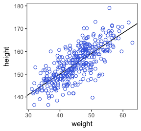<!-- -->


```r
post <- posterior_samples(b4.3)

post %>%
  slice(1:5)  # This serves a similar function as head()
```

```
## # A tibble: 5 x 4
##   b_Intercept b_weight sigma  lp__
##         <dbl>    <dbl> <dbl> <dbl>
## 1         113    0.917  4.93 -1083
## 2         113    0.922  4.87 -1083
## 3         112    0.938  5.45 -1085
## 4         112    0.938  5.44 -1085
## 5         113    0.939  5.44 -1085
```

Here are the four models leading up to McElreaths Figure 4.5. To reduce my computation time, I used a half Cauchy(0, 1) prior on $\sigma$. If you are willing to wait for the warmups, switching that out for McElreath's uniform prior should work fine as well.


```r
N <- 10
dN <- 
  d2 %>%
  slice(1:N)

b10 <- 
  brm(data = dN, family = "gaussian",
      height ~ 1 + weight,
      prior = c(set_prior("normal(178, 100)", class = "Intercept"),
                set_prior("normal(0, 10)", class = "b"),
                set_prior("cauchy(0, 1)", class = "sigma")),
      chains = 4, iter = 2000, warmup = 1000, cores = 4)

N <- 50
dN <- 
  d2 %>%
  slice(1:N)

b50 <- 
  brm(data = dN, family = "gaussian",
      height ~ 1 + weight,
      prior = c(set_prior("normal(178, 100)", class = "Intercept"),
                set_prior("normal(0, 10)", class = "b"),
                set_prior("cauchy(0, 1)", class = "sigma")),
      chains = 4, iter = 2000, warmup = 1000, cores = 4)

N <- 150
dN <- 
  d2 %>%
  slice(1:N)

b150 <- 
  brm(data = dN, family = "gaussian",
      height ~ 1 + weight,
      prior = c(set_prior("normal(178, 100)", class = "Intercept"),
                set_prior("normal(0, 10)", class = "b"),
                set_prior("cauchy(0, 1)", class = "sigma")),
      chains = 4, iter = 2000, warmup = 1000, cores = 4)

N <- 352
dN <- 
  d2 %>%
  slice(1:N)

b352 <- 
  brm(data = dN, family = "gaussian",
      height ~ 1 + weight,
      prior = c(set_prior("normal(178, 100)", class = "Intercept"),
                set_prior("normal(0, 10)", class = "b"),
                set_prior("cauchy(0, 1)", class = "sigma")),
      chains = 4, iter = 2000, warmup = 1000, cores = 4)
```

I'm not going to clutter up the document with all the trace plots and coefficient summaries from these four models. But here's how to get that information.


```r
plot(b10)
print(b10)

plot(b50)
print(b50)

plot(b150)
print(b150)

plot(b352)
print(b352)
```

We'll need to put the chains of each model into data frames.


```r
post10  <- posterior_samples(b10)
post50  <- posterior_samples(b50)
post150 <- posterior_samples(b150)
post352 <- posterior_samples(b352)
```

Here is the code for the four individual plots.


```r
p10 <- 
  ggplot(data =  d2[1:10 , ], 
         aes(x = weight, y = height)) +
  theme_bw() +
  geom_abline(intercept = post10[1:20, 1], slope = post10[1:20, 2],
              size = 1/3, alpha = .3) +
  geom_point(shape = 1, size = 2, color = "royalblue") +
  coord_cartesian(xlim = quantile(d2$weight, c(0, 1)),
                  ylim = quantile(d2$height, c(0, 1))) +
  labs(subtitle = "N = 10") +
  theme(panel.grid = element_blank())

p50 <-
  ggplot(data =  d2[1:50 , ], 
         aes(x = weight, y = height)) +
  theme_bw() +
  geom_abline(intercept = post50[1:20, 1], slope = post50[1:20, 2],
              size = 1/3, alpha = .3) +
  geom_point(shape = 1, size = 2, color = "royalblue") +
  coord_cartesian(xlim = quantile(d2$weight, c(0, 1)),
                  ylim = quantile(d2$height, c(0, 1))) +
  labs(subtitle = "N = 50") +
  theme(panel.grid = element_blank())

p150 <-
  ggplot(data =  d2[1:150 , ], 
         aes(x = weight, y = height)) +
  theme_bw() +
  geom_abline(intercept = post150[1:20, 1], slope = post150[1:20, 2],
              size = 1/3, alpha = .3) +
  geom_point(shape = 1, size = 2, color = "royalblue") +
  coord_cartesian(xlim = quantile(d2$weight, c(0, 1)),
                  ylim = quantile(d2$height, c(0, 1))) +
  labs(subtitle = "N = 150") +
  theme(panel.grid = element_blank())

p352 <- 
  ggplot(data =  d2[1:352 , ], 
         aes(x = weight, y = height)) +
  theme_bw() +
  geom_abline(intercept = post352[1:20, 1], slope = post352[1:20, 2],
              size = 1/3, alpha = .3) +
  geom_point(shape = 1, size = 2, color = "royalblue") +
  coord_cartesian(xlim = quantile(d2$weight, c(0, 1)),
                  ylim = quantile(d2$height, c(0, 1))) +
  labs(subtitle = "N = 352") +
  theme(panel.grid = element_blank())
```

Note how we used the good old bracket syntax (e.g., ` d2[1:10 , ]`) to index rows from our `d2` data. With tidyverse-style syntax, we could have done `slice(d2, 1:10)` or `d2 %>% slice(1:10)` instead.

Anyway, we saved each of these plots as objects. With a little help of the [`multiplot()` function](http://www.cookbook-r.com/Graphs/Multiple_graphs_on_one_page_(ggplot2)/) we are going to arrange those plot objects into a grid in order to reproduce Figure 4.5. 

Behold the code for the `multiplot()` function:


```r
multiplot <- function(..., plotlist=NULL, file, cols=1, layout=NULL) {
  library(grid)
  
  # Make a list from the ... arguments and plotlist
  plots <- c(list(...), plotlist)
  
  numPlots = length(plots)
  
  # If layout is NULL, then use 'cols' to determine layout
  if (is.null(layout)) {
    # Make the panel
    # ncol: Number of columns of plots
    # nrow: Number of rows needed, calculated from # of cols
    layout <- matrix(seq(1, cols * ceiling(numPlots/cols)),
                     ncol = cols, nrow = ceiling(numPlots/cols))
  }
  
  if (numPlots==1) {
    print(plots[[1]])
    
  } else {
    # Set up the page
    grid.newpage()
    pushViewport(viewport(layout = grid.layout(nrow(layout), ncol(layout))))
    
    # Make each plot, in the correct location
    for (i in 1:numPlots) {
      # Get the i,j matrix positions of the regions that contain this subplot
      matchidx <- as.data.frame(which(layout == i, arr.ind = TRUE))
      
      print(plots[[i]], vp = viewport(layout.pos.row = matchidx$row,
                                      layout.pos.col = matchidx$col))
    }
  }
}
```

We're finally ready to use `multiplot()` to make Figure 4.5. 


```r
multiplot(p10, p150, p50, p352, cols = 2)
```

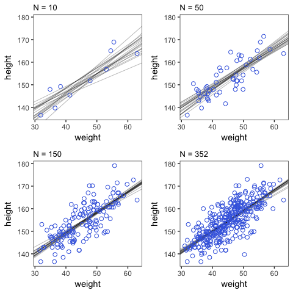<!-- -->

#### 4.4.3.4. Plotting regression intervals and contours

Remember, if you want to plot McElreath's `mu_at_50` with ggplot2, you'll need to save it as a data frame or a tibble.


```r
mu_at_50 <- 
  tibble(mu_at_50 = post[, 1] + post[, 2]*50)
```

And here is a version of the density plot of Figure 4.6.


```r
mu_at_50 %>%
  ggplot(aes(x = mu_at_50)) +
  theme_classic() +
  geom_density(size = 0, fill = "royalblue") +
  scale_y_continuous(NULL, breaks = NULL) +
  labs(x = expression(paste(mu, " at 50")))
```

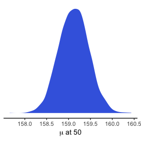<!-- -->

brms doesn't appear to have a HPDI convenience function at this time. However, you can get them with the help of the [HDInterval package](https://cran.r-project.org/web/packages/HDInterval/index.html).


```r
library(HDInterval)

hdi(mu_at_50[,1], credMass = .89)
```

```
##       mu_at_50
## lower 158.5843
## upper 159.6550
## attr(,"credMass")
## [1] 0.89
```

```r
hdi(mu_at_50[,1], credMass = .95)
```

```
##       mu_at_50
## lower 158.4682
## upper 159.7874
## attr(,"credMass")
## [1] 0.95
```

Bonus: If you wanted to express those sweet 95% HPDIs on your density plot, you might do it like this.


```r
mu_at_50 %>%
  ggplot(aes(x = mu_at_50)) +
  theme_classic() +
  geom_density(size = 0, fill = "royalblue") +
  geom_vline(xintercept = hdi(mu_at_50[,1], credMass = .95)[1:2],
             color = "royalblue4", linetype = 2) +
  scale_y_continuous(NULL, breaks = NULL) +
  labs(x = expression(paste(mu, " at 50")))
```

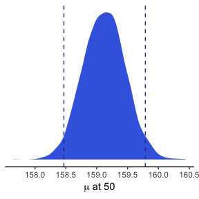<!-- -->

In brms, you would use `fitted()` to do what McElreath accomplished with `link()`.


```r
mu <- fitted(b4.3, summary = F)

str(mu)
```

```
##  num [1:4000, 1:352] 157 157 157 157 158 ...
```

When you specify `summary = F`, `fitted()` returns a matrix of values with as many rows as there were post-warmup iterations across your HMC chains and as many columns as there were cases in your analysis. Because we had 4000 post-warmup iterations and *n* = 352, `fitted()` returned a matrix of 4000 rows and 352 vectors. If you omitted the `summary = F` argument, the default is `TRUE` and `fitted()` will return summary information instead. 

Much like rethinking's `link()`, `fitted()` can accommodate custom predictor values with its `newdata` argument.


```r
weight.seq <- tibble(weight = seq(from = 25, to = 70, by = 1))

mu <-
  fitted(b4.3,
         summary = F,
         newdata = weight.seq) %>%
  as_tibble() %>%
  mutate(Iter = 1:4000) %>%
  select(Iter, everything())

str(mu)
```

Anticipating ggplot2, we just went ahead and put this in a data frame. But we might do a little more data processing with the aid of the `gather()` function. With `gather()`, we'll convert the data from the wide format to the long format. If you're new to the distinction between wide and long data, you can learn more [here](https://stanford.edu/~ejdemyr/r-tutorials/wide-and-long/) or [here](http://www.theanalysisfactor.com/wide-and-long-data/).


```r
mu <- 
  mu %>%
  gather(key, value, V1:V46)

# We might reformat key, our weight index, to numerals

mu <- 
  mu %>%
  mutate(key = str_extract(key, "\\d+") %>% as.integer())
# Learn more about `str_extract()` here: http://www.fabianheld.com/stringr/

# We might rename the last two vectors more descriptively
mu <- 
  mu %>%
  rename("weight" = key,
         "height" = value)

# Finally, we can use algebra to convert the weight values to the original ones we wanted
mu <-
  mu %>%
  mutate(weight = weight + 24)
```

Enough data processing. Here we reproduce McElreath's Figure 4.7.a.


```r
d2 %>%
  ggplot(aes(x = weight, y = height)) +
  geom_point(data = mu %>% filter(Iter < 101),
             color = "navyblue", alpha = .1)
```

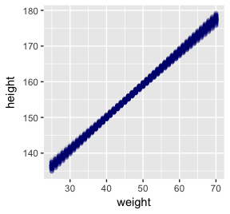<!-- -->

```r
# or prettied up a bit
d2 %>%
  ggplot(aes(x = weight, y = height)) +
  geom_point(data = mu %>% filter(Iter < 101), 
             color = "navyblue", alpha = .05) +
  theme(text = element_text(family = "Times"),
        panel.grid = element_blank())
```

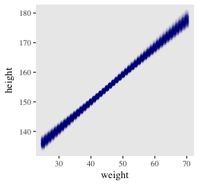<!-- -->

With `fitted()`, it's quite easy to plot a regression line and its intervals. Just omit the `summary = T` argument.


```r
muSummary <-
  fitted(b4.3, 
         newdata = weight.seq) %>%
  as_tibble() %>%
  bind_cols(weight.seq)

head(muSummary)
```

```
## # A tibble: 6 x 5
##   Estimate Est.Error `2.5%ile` `97.5%ile` weight
##      <dbl>     <dbl>     <dbl>      <dbl>  <dbl>
## 1      137     0.883       135        138   25.0
## 2      137     0.843       136        139   26.0
## 3      138     0.804       137        140   27.0
## 4      139     0.764       138        141   28.0
## 5      140     0.725       139        142   29.0
## 6      141     0.687       140        142   30.0
```

Here it is, our analogue to Figure 4.7.b:


```r
d2 %>%
  ggplot(aes(x = weight, y = height)) +
  geom_ribbon(data = muSummary, 
              aes(y = Estimate, ymin = `2.5%ile`, ymax = `97.5%ile`),
              fill = "grey70") +
  geom_line(data = muSummary, aes(y = Estimate)) +
  geom_point(color = "navyblue", shape = 1, size = 1.5, alpha = 2/3) +
  theme(text = element_text(family = "Times"),
        panel.grid = element_blank())
```

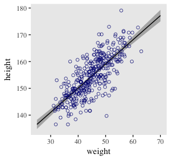<!-- -->

And if you wanted to use intervals other than the defaullt 95% ones, you'd enter a `probs` argument like this: `fitted(b4.3, newdata = weight.seq, probs = c(.25, .75))`.

#### 4.4.3.5. Prediction intervals.

Much as `brms::fitted()` was our anologue to `rethinking::link()`, `brms::predict()` is our anologue to `rethinking::sim()`. 

We can reuse our `weight.seq` data from before. But in case you forgot, here's that code again.


```r
weight.seq <- tibble(weight = seq(from = 25, to = 70, by = 1))
```

Our `predict()` code.


```r
pred.height <-
  predict(b4.3,
          newdata = weight.seq) %>%
  as_tibble() %>%
  bind_cols(weight.seq)
  
pred.height %>%
  slice(1:6)
```

```
## # A tibble: 6 x 5
##   Estimate Est.Error `2.5%ile` `97.5%ile` weight
##      <dbl>     <dbl>     <dbl>      <dbl>  <dbl>
## 1      136      5.17       127        147   25.0
## 2      137      5.21       127        147   26.0
## 3      138      5.18       128        148   27.0
## 4      139      5.12       129        149   28.0
## 5      140      5.19       130        150   29.0
## 6      141      5.23       131        151   30.0
```

This time the summary information in our data frame is for, as McElreath puts is, "simulated heights, not distributions of plausible average height, $\mu$" (p. 108). Another way of saying that is that these simulations are the joint consequence of both $\mu$ and $\sigma$, unlike the results of `fitted()`, which only reflect $\mu$. Our plot for Figure 4.8:


```r
d2 %>%
  ggplot(aes(x = weight, y = height)) +
  geom_ribbon(data = pred.height, 
              aes(y = Estimate, ymin = `2.5%ile`, ymax = `97.5%ile`),
              fill = "grey83") +
  geom_ribbon(data = muSummary, 
              aes(y = Estimate, ymin = `2.5%ile`, ymax = `97.5%ile`),
              fill = "grey70") +
  geom_line(data = muSummary, aes(y = Estimate)) +
  geom_point(color = "navyblue", shape = 1, size = 1.5, alpha = 2/3) +
  theme(text = element_text(family = "Times"),
        panel.grid = element_blank())
```

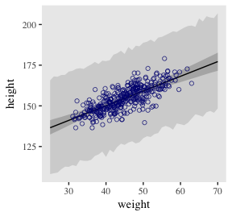<!-- -->

## 4.5. Polynomial regression

Remember `d`?


```r
d %>%
  glimpse()
```

```
## Observations: 544
## Variables: 4
## $ height <dbl> 151.7650, 139.7000, 136.5250, 156.8450, 145.4150, 163.8300, 149.2250, 168.9100, ...
## $ weight <dbl> 47.82561, 36.48581, 31.86484, 53.04191, 41.27687, 62.99259, 38.24348, 55.47997, ...
## $ age    <dbl> 63.0, 63.0, 65.0, 41.0, 51.0, 35.0, 32.0, 27.0, 19.0, 54.0, 47.0, 66.0, 73.0, 20...
## $ male   <int> 1, 0, 0, 1, 0, 1, 0, 1, 0, 1, 0, 1, 0, 0, 0, 1, 1, 0, 1, 0, 0, 1, 0, 1, 0, 1, 0,...
```

We standardize our `weight` variable like so.


```r
d <-
  d %>%
  mutate(weight.s = (weight - mean(weight))/sd(weight))
```

Here's the quadratic model in brms.


```r
b4.5 <- 
  brm(data = d, family = gaussian,
      height ~ 1 + weight.s + I(weight.s^2),
      prior = c(set_prior("normal(178, 20)", class = "Intercept"),
                set_prior("normal(0, 10)", class = "b"),
                set_prior("cauchy(0, 1)", class = "sigma")),
      chains = 4, iter = 2000, warmup = 1000, cores = 4)

plot(b4.5)
```

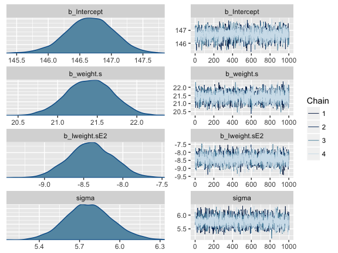<!-- -->

```r
print(b4.5)
```

```
##  Family: gaussian 
##   Links: mu = identity; sigma = identity 
## Formula: height ~ 1 + weight.s + I(weight.s^2) 
##    Data: d (Number of observations: 544) 
## Samples: 4 chains, each with iter = 2000; warmup = 1000; thin = 1; 
##          total post-warmup samples = 4000
##     ICs: LOO = NA; WAIC = NA; R2 = NA
##  
## Population-Level Effects: 
##             Estimate Est.Error l-95% CI u-95% CI Eff.Sample Rhat
## Intercept     146.66      0.38   145.90   147.38       3684 1.00
## weight.s       21.40      0.29    20.84    21.95       3527 1.00
## Iweight.sE2    -8.41      0.28    -8.96    -7.85       3452 1.00
## 
## Family Specific Parameters: 
##       Estimate Est.Error l-95% CI u-95% CI Eff.Sample Rhat
## sigma     5.77      0.17     5.44     6.12       4000 1.00
## 
## Samples were drawn using sampling(NUTS). For each parameter, Eff.Sample 
## is a crude measure of effective sample size, and Rhat is the potential 
## scale reduction factor on split chains (at convergence, Rhat = 1).
```

Here's the legwork for our quadratic plot with `fitted()` and `predict()`.


```r
weight.seq <- data.frame(weight.s = seq(from = -2.2, to = 2, length.out = 30))

fitdquad <-
  fitted(b4.5, 
         newdata = weight.seq) %>%
  as_tibble() %>%
  bind_cols(weight.seq)

predquad <-
  predict(b4.5, 
          newdata = weight.seq) %>%
  as_tibble() %>%
  bind_cols(weight.seq)  
```

The code for our version of Figure 4.9.a. You'll notice how little the code changed from that for Figure 4.8, above.


```r
ggplot(data = d, 
       aes(x = weight.s, y = height)) +
  geom_ribbon(data = predquad, 
              aes(y = Estimate, ymin = `2.5%ile`, ymax = `97.5%ile`),
              fill = "grey83") +
  geom_ribbon(data = fitdquad, 
              aes(y = Estimate, ymin = `2.5%ile`, ymax = `97.5%ile`),
              fill = "grey70") +
  geom_line(data = fitdquad, 
            aes(y = Estimate), size = 1/4) +
  geom_point(color = "navyblue", shape = 1, size = 1.5, alpha = 1/3) +
  theme(text = element_text(family = "Times"),
        panel.grid = element_blank())
```

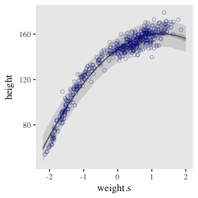<!-- -->

The cubic model:


```r
b4.6 <- 
  brm(data = d, family = gaussian,
      height ~ 1 + weight.s + I(weight.s^2) + I(weight.s^3),
      prior = c(set_prior("normal(178, 100)", class = "Intercept"),
                set_prior("normal(0, 10)", class = "b"),
                set_prior("cauchy(0, 1)", class = "sigma")),
      chains = 4, iter = 2000, warmup = 1000, cores = 4)
```

The good old linear model:


```r
b4.7 <- 
  brm(data = d, family = gaussian,
      height ~ 1 + weight.s,
      prior = c(set_prior("normal(178, 100)", class = "Intercept"),
                set_prior("normal(0, 10)", class = "b"),
                set_prior("cauchy(0, 1)", class = "sigma")),
      chains = 4, iter = 2000, warmup = 1000, cores = 4)
```

Here's the `fitted()`, `predict()`, and ggplot2 code for Figure 4.9.c., the cubic model.


```r
fitd_cub <-
  fitted(b4.6, 
         newdata = weight.seq) %>%
  as_tibble() %>%
  bind_cols(weight.seq)

pred_cub <-
  predict(b4.6, 
          newdata = weight.seq) %>%
  as_tibble() %>%
  bind_cols(weight.seq) 

ggplot(data = d, 
       aes(x = weight.s, y = height)) +
  geom_ribbon(data = pred_cub, 
              aes(y = Estimate, ymin = `2.5%ile`, ymax = `97.5%ile`),
              fill = "grey83") +
  geom_ribbon(data = fitd_cub, 
              aes(y = Estimate, ymin = `2.5%ile`, ymax = `97.5%ile`),
              fill = "grey70") +
  geom_line(data = fitd_cub, 
            aes(y = Estimate), 
            size = 1/4) +
  geom_point(color = "navyblue", shape = 1, size = 1.5, alpha = 1/3) +
  theme(text = element_text(family = "Times"),
        panel.grid = element_blank())
```

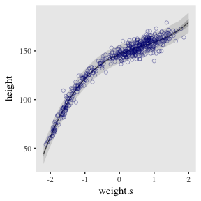<!-- -->

And here's the `fitted()`, `predict()`, and ggplot2 code for Figure 4.9.a., the linear model.


```r
fitd_line <-
  fitted(b4.7, 
         newdata = weight.seq) %>%
  as_tibble() %>%
  bind_cols(weight.seq)

pred_line <-
  predict(b4.7, 
          newdata = weight.seq) %>%
  as_tibble() %>%
  bind_cols(weight.seq) 

ggplot(data = d, 
       aes(x = weight.s, y = height)) +
  geom_ribbon(data = pred_line, 
              aes(y = Estimate, ymin = `2.5%ile`, ymax = `97.5%ile`),
              fill = "grey83") +
  geom_ribbon(data = fitd_line, 
              aes(y = Estimate, ymin = `2.5%ile`, ymax = `97.5%ile`),
              fill = "grey70") +
  geom_line(data = fitd_line, 
            aes(y = Estimate), size = 1/4) +
  geom_point(color = "navyblue", shape = 1, size = 1.5, alpha = 1/3) +
  theme(text = element_text(family = "Times"),
        panel.grid = element_blank())
```

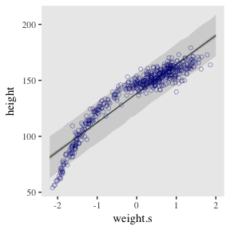<!-- -->

##### Overthinking: Converting back to natural scale.

You can apply McElreath's conversion trick within the ggplot2 environment, too. Here it is with the cubic model.


```r
at <- c(-2, -1, 0, 1, 2)

ggplot(data = d, 
       aes(x = weight.s, y = height)) +
  geom_ribbon(data = pred_line, 
              aes(y = Estimate, ymin = `2.5%ile`, ymax = `97.5%ile`),
              fill = "grey83") +
  geom_ribbon(data = fitd_line, 
              aes(y = Estimate, ymin = `2.5%ile`, ymax = `97.5%ile`),
              fill = "grey70") +
  geom_line(data = fitd_line, 
            aes(y = Estimate), size = 1/4) +
  geom_point(color = "navyblue", shape = 1, size = 1.5, alpha = 1/3) +
  theme(text = element_text(family = "Times"),
        panel.grid = element_blank()) +
  # Here it is!
  scale_x_continuous(breaks = at,
                     labels = round(at*sd(d$weight) + mean(d$weight), 1))
```

<!-- -->

Note. The analyses in this document were done with:

* R           3.4.3
* RStudio     1.1.442
* rmarkdown   1.9
* tidyverse   1.2.1 
* rethinking  1.59
* brms        2.1.2
* rstan       2.17.3
* HDInterval  0.1.3

## Reference
McElreath, R. (2016). *Statistical rethinking: A Bayesian course with examples in R and Stan.* Chapman & Hall/CRC Press.


