Ch. 4 Linear Models
================
A Solomon Kurz
2018-08-17

Linear Models
=============

> Linear regression is the geocentric model of applied statistics. By "linear regression", we will mean a family of simple statistical golems that attempt to learn about the mean and variance of some measurement, using an additive combination of other measurements. Like geocentrism, linear regression can usefully describe a very large variety of natural phenomena. Like geocentrism, linear is a descriptive model that corresponds to many different process models. If we read its structure too literally, we’re likely to make mistakes. But used wisely, these little linear golems continue to be useful. (p. 71)

Why normal distributions are normal
-----------------------------------

After laying out his soccer field coin toss shuffle premise, McElreath wrote:

> It's hard to say where any individual person will end up, but you can say with great confidence what the collection of positions will be. The distances will be distributed in approximately normal, or Gaussian, fashion. This is true even through the underlying distribution is binomial. It does this because there are some many more possible ways to realize a sequence of left-right steps that sums to zero. There are slightly fewer ways to realize a sequence that ends up one step left or right of zero, and so on, with the number of possible sequences declining in the characteristic bell curve of the normal distribution. (p. 72)

### Normal by addition.

Here's a way to do the simulation necessary for the plot in the top panel of Figure 4.2.

``` r
library(tidyverse)

# We set the seed to make the results of `runif()` reproducible.
set.seed(1000)
pos <- 
  replicate(100, runif(16, -1, 1)) %>%        # Here's the simulation
  as_tibble() %>%                             # For data manipulation, we'll make this a tibble
  rbind(0, .) %>%                             # Here we add a row of zeros above the simulation results
  mutate(step = 0:16) %>%                     # This adds a step index
  gather(key, value, -step) %>%               # Here we convert the data to the long format
  mutate(person = rep(1:100, each = 17)) %>%  # This adds a person id index
  # The next two lines allow us to make culmulative sums within each person
  group_by(person) %>%
  mutate(position = cumsum(value)) %>%
  ungroup()  # Ungrouping allows for further data manipulation
```

We might `glimpse()` at the data.

``` r
glimpse(pos)
```

    ## Observations: 1,700
    ## Variables: 5
    ## $ step     <int> 0, 1, 2, 3, 4, 5, 6, 7, 8, 9, 10, 11, 12, 13, 14, 15, 16, 0, 1, 2, 3, 4, 5, 6,...
    ## $ key      <chr> "V1", "V1", "V1", "V1", "V1", "V1", "V1", "V1", "V1", "V1", "V1", "V1", "V1", ...
    ## $ value    <dbl> 0.00000000, -0.34424258, 0.51769297, -0.77212721, 0.38151030, 0.03280481, -0.8...
    ## $ person   <int> 1, 1, 1, 1, 1, 1, 1, 1, 1, 1, 1, 1, 1, 1, 1, 1, 1, 2, 2, 2, 2, 2, 2, 2, 2, 2, ...
    ## $ position <dbl> 0.00000000, -0.34424258, 0.17345039, -0.59867682, -0.21716652, -0.18436171, -1...

And here's the actual plot code.

``` r
ggplot(data = pos, 
       aes(x = step, y = position, group = person)) +
  geom_vline(xintercept = c(4, 8, 16), linetype = 2) +
  geom_line(aes(color = person < 2, alpha  = person < 2)) +
  scale_color_manual(values = c("skyblue4", "black")) +
  scale_alpha_manual(values = c(1/5, 1)) +
  scale_x_continuous("step number", breaks = c(0, 4, 8, 12, 16)) +
  theme(legend.position = "none")
```

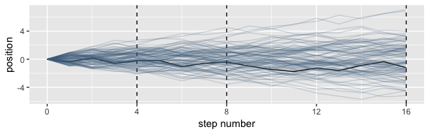

Here's the code for the bottom three plots of Figure 4.2.

``` r
# Figure 4.2.a.
pos %>%
  filter(step == 4) %>%
  ggplot(aes(x = position)) +
  geom_line(stat = "density", color = "dodgerblue1") +
  coord_cartesian(xlim = -6:6) +
  labs(title = "4 steps")
```

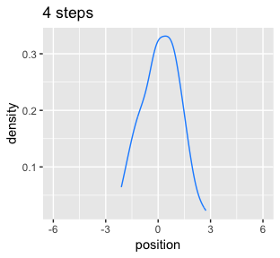

``` r
# Figure 4.2.b.
pos %>%
  filter(step == 8) %>%
  ggplot(aes(x = position)) +
  geom_density(color = "dodgerblue2") +
  coord_cartesian(xlim = -6:6) +
  labs(title = "8 steps")
```

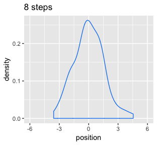

``` r
# An intermediary step to get an SD value
pos %>%
  filter(step == 16) %>%
  summarise(sd = sd(position))
```

    ## # A tibble: 1 x 1
    ##      sd
    ##   <dbl>
    ## 1  2.38

``` r
# Figure 4.2.c.
pos %>%
  filter(step == 16) %>%
  ggplot(aes(x = position)) +
  geom_line(data = tibble(position = seq(from = -7, to = 7, by = .1)),
            aes(x = position, y = dnorm(position, 0, 2.381768)),
            linetype = 2) +  # 2.381768 came from the previous code block
  geom_density(color = "transparent", fill = "dodgerblue3", alpha = 1/2) +
  coord_cartesian(xlim = -6:6) +
  labs(title = "16 steps",
       y = "density")
```

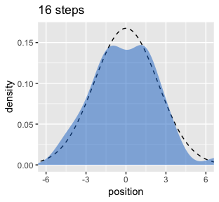

While we were at it, we explored a few ways to express densities. The main action was with the `geom_line()` and `geom_density()` functions.

### Normal by multiplication.

Here's McElreath's simple random growth rate.

``` r
set.seed(1)
prod(1 + runif(12, 0, 0.1))
```

    ## [1] 1.769489

In the `runif()` part of that code, we generated 12 random draws from the uniform distribution with bounds \[0, 0.1\]. Within the `prod()` function, we first added `1` to each of those values and then computed their product. Consider a more explicit variant of the code.

``` r
set.seed(1)
tibble(a      = 1,
       b      = runif(12, 0, 0.1)) %>% 
  mutate(c    = a + b) %>% 
  summarise(p = prod(c))
```

    ## # A tibble: 1 x 1
    ##       p
    ##   <dbl>
    ## 1  1.77

Same result. Let's do this many times with `replicate()` and plot the results.

``` r
set.seed(.1)
growth <- 
  replicate(10000, prod(1 + runif(12, 0, 0.1))) %>%
  as_tibble()

ggplot(data = growth, aes(x = value)) +
  geom_density()
```

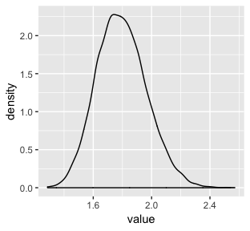

"The smaller the effect of each locus, the better this additive approximation will be" (p. 74). Let's compare big and small.

``` r
set.seed(1.7195451)
big <- 
  replicate(10000, prod(1 + runif(12, 0, 0.5))) %>%
  as_tibble() 

set.seed(1.7195451)
small <- 
  replicate(10000, prod(1 + runif(12, 0, 0.01))) %>%
  as_tibble()

ggplot(data = big) +
  geom_density(aes(x = value), 
               fill = "black", color = "transparent") +
  labs(title = "My big density")
```

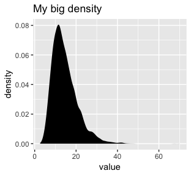

``` r
ggplot(data = small) +
  geom_density(aes(x = value), 
               fill = "black", size = 0) +
  labs(title = "My small density")
```

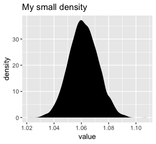

### Normal by log-multiplication.

Instead of saving our tibble, we'll just feed it directly into our plot.

``` r
set.seed(12)
replicate(10000, log(prod(1 + runif(12, 0, 0.5)))) %>%
  as_tibble() %>%
  
  ggplot(aes(x = value)) +
  geom_density(color = "transparent", 
               fill = "gray33")
```

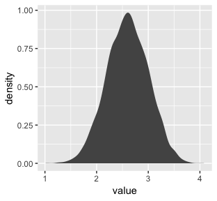

What we did was really compact. Walking it out a bit, here’s what we all did within the second argument within `replicate()` (i.e., everything within `log()`).

``` r
tibble(a      = runif(12, 0, 0.5),
       b      = 1) %>% 
  mutate(c    = a + b) %>% 
  summarise(p = prod(c) %>% log())
```

    ## # A tibble: 1 x 1
    ##       p
    ##   <dbl>
    ## 1  2.37

And based on the first argument within `replicate()`, we did that 10,000 times, after which we converted the results to a tibble and then fed those data into ggplot2

### Using Gaussian distributions.

I really like these justifications.

#### Ontological justification.

The Gaussian is

> a widespread pattern, appearing again and again at different scales and in different domains. Measurement errors, variations in growth, and the velocities of molecules all tend towards Gaussian distributions. These processes do this because at their heart, these processes add together fluctuations. And repeatedly adding finite fluctuations results in a distribution of sums that have shed all information about the underlying process, aside from mean and spread.
>
> One consequence of this is that statistical models based on Gaussian distributions cannot reliably identify micro-process... (p. 75)

But they can still be useful.

A Gaussian model of height
--------------------------

> Another route to justifying the Gaussian as our choice of skeleton, and a route that will help us appreciate later why it is often a poor choice, is that it represents a particular state of ignorance. When all we know or are willing to say about a distribution of measures (measures are contiguous values on the real number line) is their mean and variance, then the Gaussian distribution arises as the most consistent with our assumptions.
>
> If you don’t think the distribution should be Gaussian, then that implies that you know something else that you should tell your golem about, something that would improve inference. (pp. 75--76)

In the **Overthinking: Gaussian distribution** box that follows, McElreath gave the formula. Let *y* be the criterion, *μ* be the mean, and *σ* be the standard deviation. Then the probability density of some Gaussian value *y* is

$$p(y|\\mu, \\sigma) = \\frac{1}{\\sqrt{2 \\pi \\sigma^2}} \\text{exp} \\Bigg (- \\frac{(y - \\mu)^2}{2 \\sigma^2} \\Bigg)$$

A language for describing models
--------------------------------

Our mathy ways of summarizing models will be something like

outcome<sub>*i*</sub> ∼ Normal(*μ*<sub>*i*</sub>, *σ*)

*μ*<sub>*i*</sub> = *β* × predictor<sub>*i*</sub>

*β* ∼ Normal(0, 10)

*σ* ∼ HalfCauchy(0, 1)

And as McElreath then followed up with, "If that doesn't make much sense, good. That indicates that you are holding the right textbook" (p. 77). Welcome!

### Re-describing the globe tossing model.

For the globe tossing model, the probability *p* of a count of water *w* based on *n* trials was

*w* ∼ Binomial(*n*, *p*)

*p* ∼ Uniform(0, 1)

We can break McElreath's R code 4.6 down a little bit with a tibble like so.

``` r
# how many `p_grid` points would you like?
n_points <- 100

tibble(w = 6, 
       n = 9,
       p_grid       = seq(from = 0, to = 1, length.out = n_points)) %>% 
  mutate(prior      = dunif(p_grid, 0, 1),
         likelihood = dbinom(w, n, p_grid)) %>% 
  mutate(posterior  = likelihood * prior) %>% 
  # this last bit converts the posterior to the probability scale
  mutate(posterior  = posterior / sum(posterior))
```

    ## # A tibble: 100 x 6
    ##        w     n p_grid prior likelihood posterior
    ##    <dbl> <dbl>  <dbl> <dbl>      <dbl>     <dbl>
    ##  1     6     9 0          1   0.        0.      
    ##  2     6     9 0.0101     1   8.65e-11  8.74e-12
    ##  3     6     9 0.0202     1   5.37e- 9  5.43e-10
    ##  4     6     9 0.0303     1   5.93e- 8  5.99e- 9
    ##  5     6     9 0.0404     1   3.23e- 7  3.26e- 8
    ##  6     6     9 0.0505     1   1.19e- 6  1.21e- 7
    ##  7     6     9 0.0606     1   3.45e- 6  3.49e- 7
    ##  8     6     9 0.0707     1   8.42e- 6  8.51e- 7
    ##  9     6     9 0.0808     1   1.82e- 5  1.83e- 6
    ## 10     6     9 0.0909     1   3.56e- 5  3.60e- 6
    ## # ... with 90 more rows

A Gaussian model of height
--------------------------

> There are an infinite number of possible Gaussian distributions. Some have small means. Others have large means. Some are wide, with a large *σ*. Others are narrow. We want our Bayesian machine to consider every possible distribution, each defined by a combination of *μ* and *σ*, and rank them by posterior plausibility. (p. 79)

### The data.

Let's get the data from McElreath's [rethinking package](http://xcelab.net/rm/statistical-rethinking/).

``` r
library(rethinking)
data(Howell1)
d <- Howell1
```

Here we open our main statistical package, Bürkner's [brms](https://github.com/paul-buerkner/brms). But before we do, we'll need to detach the rethinking package. R will not allow users to use a function from one package that shares the same name as a different function from another package if both packages are open at the same time. The rethinking and brms packages are designed for similar purposes and, unsurprisingly, overlap in the names of their functions. To prevent problems, we will always make sure rethinking is detached before using brms. To learn more on the topic, see [this R-bloggers post](https://www.r-bloggers.com/r-and-package-masking-a-real-life-example/).

``` r
rm(Howell1)
detach(package:rethinking, unload = T)
library(brms)
```

Go ahead and investigate the data with `str()`, the tidyverse analogue for which is `glimpse()`.

``` r
d %>%
  str()
```

    ## 'data.frame':    544 obs. of  4 variables:
    ##  $ height: num  152 140 137 157 145 ...
    ##  $ weight: num  47.8 36.5 31.9 53 41.3 ...
    ##  $ age   : num  63 63 65 41 51 35 32 27 19 54 ...
    ##  $ male  : int  1 0 0 1 0 1 0 1 0 1 ...

Here are the `height` values.

``` r
d %>%
  select(height) %>%
  head()
```

    ##    height
    ## 1 151.765
    ## 2 139.700
    ## 3 136.525
    ## 4 156.845
    ## 5 145.415
    ## 6 163.830

We can use `filter()` to make an adults-only data frame.

``` r
d2 <- 
  d %>%
  filter(age >= 18)
```

#### Overthinking: Data frames.

This probably reflects my training history, but the structure of a data frame seems natural and inherently appealing, to me. So I can't relate to the "annoying" comment. But if you're in the other camp, do check out either of these two data wrangling talks ([here](https://www.youtube.com/watch?v=4MfUCX_KpdE&t=23s&frags=pl%2Cwn) and [here](https://www.youtube.com/watch?v=GapSskrtUzU&t=1249s&frags=pl%2Cwn)) by the ineffable [Jenny Bryan](https://twitter.com/JennyBryan?ref_src=twsrc%5Egoogle%7Ctwcamp%5Eserp%7Ctwgr%5Eauthor).

#### Overthinking: Index magic.

For more on indexing, check out [chapter 9](https://bookdown.org/rdpeng/rprogdatascience/subsetting-r-objects.html) of Roger Peng's *R Programming for Data Science* or even the [Subsetting](http://r4ds.had.co.nz/vectors.html#subsetting-1) subsection from *R4DS*.

### The model.

The likelihood for our model is

*h*<sub>*i*</sub> ∼ Normal(*μ*, *σ*)

Our *μ* prior will be

*μ* ∼ Normal(178, 20)

And our prior for *σ* will be

*σ* ∼ Uniform(0, 50)

Here's the shape of the prior for *μ* in *N*(178, 20).

``` r
ggplot(data = tibble(x = seq(from = 100, to = 250, by = .1)), 
       aes(x = x, y = dnorm(x, mean = 178, sd = 20))) +
  geom_line() +
  ylab("density")
```

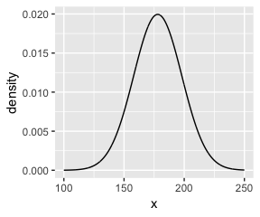

And here's the ggplot2 code for our prior for *σ*, a uniform distribution with a minimum value of 0 and a maximum value of 50. We don't really need the y axis when looking at the shapes of a density, so we'll just remove it.

``` r
tibble(x = seq(from = -10, to = 60, by = .1)) %>%
  
  ggplot(aes(x = x, y = dunif(x, min = 0, max = 50))) +
  geom_line() +
  scale_y_continuous(NULL, breaks = NULL) +
  theme(panel.grid = element_blank())
```

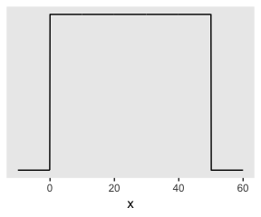

We can simulate from those two priors to get a prior probability distribution of `heights`.

``` r
n <- 1e4

set.seed(432)
tibble(sample_mu    = rnorm(n, mean = 178,       sd = 20),
       sample_sigma = runif(n, min = 0,         max = 50)) %>% 
  mutate(x          = rnorm(n, mean = sample_mu, sd = sample_sigma)) %>% 
  
  ggplot(aes(x = x)) +
  geom_density(fill = "black", size = 0) +
  scale_y_continuous(NULL, breaks = NULL) +
  labs(subtitle = expression(paste("Prior predictive distribution for ", italic(h[i]))),
       x = NULL) +
  theme(panel.grid = element_blank())
```

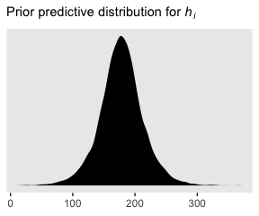

As McElreath wrote, we've made a "vaguely bell-shaped density with thick tails" (p. 83).

### Grid approximation of the posterior distribution.

As McElreath explained, you'll never use this for practical data analysis. But let's play along.

``` r
n <- 200

d_grid <-
  tibble(mu    = seq(from = 140, to = 160, length.out = n),
         sigma = seq(from = 4,   to = 9,   length.out = n)) %>% 
  # we'll accomplish with `tidyr::expand()` what McElreath did with base R `expand.grid()`
  expand(mu, sigma)

head(d_grid)
```

    ## # A tibble: 6 x 2
    ##      mu sigma
    ##   <dbl> <dbl>
    ## 1   140  4   
    ## 2   140  4.03
    ## 3   140  4.05
    ## 4   140  4.08
    ## 5   140  4.10
    ## 6   140  4.13

`d_grid` contains every combination of `mu` and `sigma` across their specified values. Instead of base R `sapply()`, we'll do the computateions by making a custom function which we'll plug into `purrr::map2().`

``` r
grid_function <- function(mu, sigma){
  dnorm(d2$height, mean = mu, sd = sigma, log = T) %>% 
    sum()
}
```

Now we're ready to complete the tibble.

``` r
d_grid <-
  d_grid %>% 
  mutate(log_likelihood = map2(mu, sigma, grid_function)) %>% 
  unnest() %>% 
  mutate(prior_mu       = dnorm(mu,    mean = 178, sd  = 20, log = T),
         prior_sigma    = dunif(sigma, min  = 0,   max = 50, log = T)) %>% 
  mutate(product        = log_likelihood + prior_mu + prior_sigma) %>% 
  mutate(probability    = exp(product - max(product)))
  
head(d_grid)
```

    ## # A tibble: 6 x 7
    ##      mu sigma log_likelihood prior_mu prior_sigma product probability
    ##   <dbl> <dbl>          <dbl>    <dbl>       <dbl>   <dbl>       <dbl>
    ## 1   140  4            -3813.    -5.72       -3.91  -3822.           0
    ## 2   140  4.03         -3778.    -5.72       -3.91  -3787.           0
    ## 3   140  4.05         -3743.    -5.72       -3.91  -3753.           0
    ## 4   140  4.08         -3709.    -5.72       -3.91  -3719.           0
    ## 5   140  4.10         -3676.    -5.72       -3.91  -3686.           0
    ## 6   140  4.13         -3644.    -5.72       -3.91  -3653.           0

In the final `d_grid`, the `probability` vector contains the posterior probabilities across values of `mu` and `sigma`. We can make a contour plot with `geom_contour`.

``` r
d_grid %>% 
  ggplot(aes(x = mu, y = sigma, z = probability)) + 
  geom_contour() +
  labs(x = expression(mu),
       y = expression(sigma)) +
  coord_cartesian(xlim = range(d_grid$mu),
                  ylim = range(d_grid$sigma)) +
  theme(panel.grid = element_blank())
```

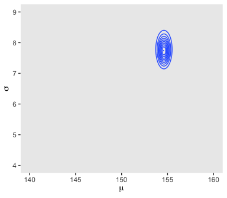

We'll make our heat map with `geom_raster(aes(fill = probability))`.

``` r
d_grid %>% 
  ggplot(aes(x = mu, y = sigma)) + 
  geom_raster(aes(fill = probability)) +
  scale_fill_viridis_c() +
  labs(x = expression(mu),
       y = expression(sigma)) +
  theme(panel.grid = element_blank())
```

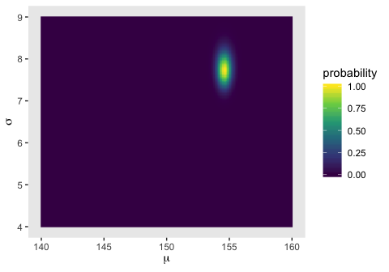

### Sampling from the posterior.

We can use `dplyr::sample_n()` to sample rows, with replacement, from `d_grid`.

``` r
set.seed(434)
d_grid_samples <- 
  d_grid %>% 
  sample_n(size = 1e4, replace = T, weight = probability)

d_grid_samples %>% 
  ggplot(aes(x = mu, y = sigma)) + 
  geom_point(size = .9, alpha = 1/15) +
  scale_fill_viridis_c() +
  labs(x = expression(mu[samples]),
       y = expression(sigma[samples])) +
  theme(panel.grid = element_blank())
```

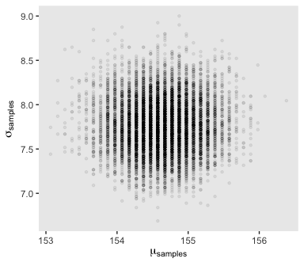

We can use `gather()` and then `facet_warp()` to plot the densities for both `mu` and `sigma` at once.

``` r
d_grid_samples %>% 
  select(mu, sigma) %>% 
  gather() %>% 

  ggplot(aes(x = value)) + 
  geom_density(fill = "grey33", size = 0) +
  scale_y_continuous(NULL, breaks = NULL) +
  xlab(NULL) +
  theme(panel.grid = element_blank()) +
  facet_wrap(~key, scales= "free")
```

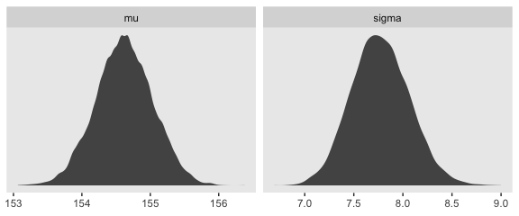

We'll use the tidybayes package to compute their posterior modes and 95% HDIs.

``` r
library(tidybayes)

d_grid_samples %>% 
  select(mu, sigma) %>% 
  gather() %>% 
  group_by(key) %>% 
  mode_hdi(value)
```

    ## # A tibble: 2 x 7
    ##   key    value .lower .upper .width .point .interval
    ##   <chr>  <dbl>  <dbl>  <dbl>  <dbl> <chr>  <chr>    
    ## 1 mu    155.   154.   155.     0.95 mode   hdi      
    ## 2 sigma   7.72   7.24   8.37   0.95 mode   hdi

Let's say you wanted their posterior medians and 50% quantile-based intervals, instead. Just switch out the last line for `median_qi(value, .width = .5)`.

#### Overthinking: Sample size and the normality of *σ*'s posterior.

Since we'll be fitting models with brms almost exclusively from here on out, this section is largely mute. But we'll do it anyway for the sake of practice. I'm going to break the steps up like before rather than compress the code together. Here's `d3`.

``` r
set.seed(4341)
(d3 <- sample(d2$height, size = 20))
```

    ##  [1] 161.925 147.955 156.845 161.290 163.830 161.290 153.035 159.385 139.700 154.305 146.050 154.940
    ## [13] 149.860 152.400 153.035 160.655 161.290 148.590 144.780 154.305

For our first step using `d3`, we'll redefine `d_grid`.

``` r
n <- 200

# note we've redefined the ranges of `mu` and `sigma`
d_grid <-
  tibble(mu    = seq(from = 150, to = 170, length.out = n),
         sigma = seq(from = 4,   to = 20,  length.out = n)) %>% 
  expand(mu, sigma)
```

Second, we'll redefine our custom `grid_function()` function to operate over the `height` values of `d3`.

``` r
grid_function <- function(mu, sigma){
  dnorm(d3, mean = mu, sd = sigma, log = T) %>% 
    sum()
}
```

Now we'll use the amended `grid_function()` to make the posterior.

``` r
d_grid <-
  d_grid %>% 
  mutate(log_likelihood = map2(mu, sigma, grid_function)) %>% 
  unnest() %>% 
  mutate(prior_mu       = dnorm(mu,    mean = 178, sd  = 20, log = T),
         prior_sigma    = dunif(sigma, min  = 0,   max = 50, log = T)) %>% 
  mutate(product        = log_likelihood + prior_mu + prior_sigma) %>% 
  mutate(probability    = exp(product - max(product)))
```

Next we'll `sample_n()` and plot.

``` r
set.seed(4341)
d_grid_samples <- 
  d_grid %>% 
  sample_n(size = 1e4, replace = T, weight = probability)

d_grid_samples %>% 
  ggplot(aes(x = mu, y = sigma)) + 
  geom_point(size = .9, alpha = 1/15) +
  scale_fill_viridis_c() +
  labs(x = expression(mu[samples]),
       y = expression(sigma[samples])) +
  theme(panel.grid = element_blank())
```

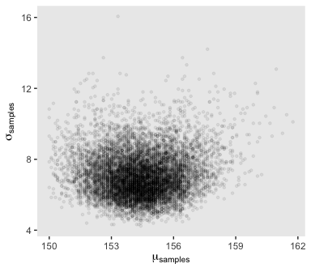

Behold the updated densities.

``` r
d_grid_samples %>% 
  select(mu, sigma) %>% 
  gather() %>% 

  ggplot(aes(x = value)) + 
  geom_density(fill = "grey33", size = 0) +
  scale_y_continuous(NULL, breaks = NULL) +
  xlab(NULL) +
  theme(panel.grid = element_blank()) +
  facet_wrap(~key, scales= "free")
```

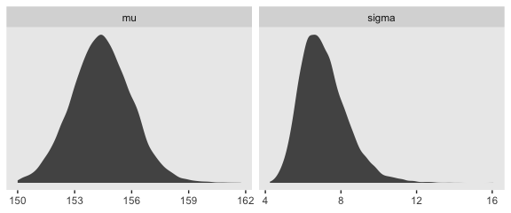

Not so Gaussian with that small *n*.

### Fitting the model with ~~`map()`~~ `brm()`.

We won't actually use `rethinking::map()`--which you should not conflate with `purrr::map()`--, but will jumpt straight to the primary brms modeling function, `brm()`. In the text, McElreath indexed his models with names like `m4.1`. I will largely follow that convention, but will replace the *m* with a *b* to stand for the brms package. Here's the first model.

``` r
b4.1 <- 
  brm(data = d2, family = gaussian,
      height ~ 1,
      prior = c(prior(normal(178, 20), class = Intercept),
                prior(uniform(0, 50), class = sigma)),
      chains = 4, iter = 31000, warmup = 30000, cores = 4)
```

    ## Warning: It appears as if you have specified an upper bounded prior on a parameter that has no natural upper bound.
    ## If this is really what you want, please specify argument 'ub' of 'set_prior' appropriately.
    ## Warning occurred for prior 
    ## sigma ~ uniform(0, 50)

Note the warning message. [Stan](http://mc-stan.org), which is the [engine under the hood of our brms vehicle](https://github.com/paul-buerkner/brms), gets concerned when you use priors with hard bounds on parameters for which we wouldn't expect hard bounds. There's no reason to expect a hard upper bound on *σ*, so Stan barks. Beware of unneeded hard bounds.

McElreath's uniform prior for *σ* was rough on brms. It took an unusually-large number of warmup iterations before the chains sampled properly. As McElreath covered in chapter 8, HMC tends to work better when you default to a half Cauchy for *σ*. Here's how to do so.

``` r
b4.1_half_cauchy <- 
  brm(data = d2, family = gaussian,
      height ~ 1,
      prior = c(prior(normal(178, 20), class = Intercept),
                prior(cauchy(0, 1), class = sigma)),
      iter = 2000, warmup = 1000, chains = 4, cores = 4)
```

This leads to an important point. After running an HMC model, it's a good idea to inspect the chains. McElreath covers this in chapter 8. Here's a typical way to do so in brms.

``` r
plot(b4.1_half_cauchy)
```

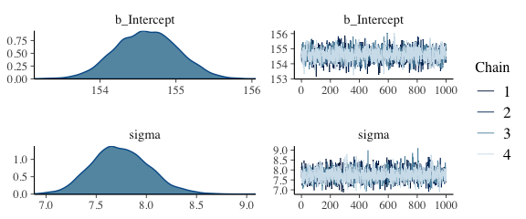

If you want detailed diagnostics for the HMC chains, call `launch_shinystan(b4.1)`. That'll keep you busy for a while. But anyway, the chains look good. We can reasonably trust the results

Here's how to get the model summary, the brms equivalent to rethinking's `precis()`.

``` r
print(b4.1_half_cauchy)
```

    ##  Family: gaussian 
    ##   Links: mu = identity; sigma = identity 
    ## Formula: height ~ 1 
    ##    Data: d2 (Number of observations: 352) 
    ## Samples: 4 chains, each with iter = 2000; warmup = 1000; thin = 1;
    ##          total post-warmup samples = 4000
    ## 
    ## Population-Level Effects: 
    ##           Estimate Est.Error l-95% CI u-95% CI Eff.Sample Rhat
    ## Intercept   154.61      0.41   153.82   155.39       3388 1.00
    ## 
    ## Family Specific Parameters: 
    ##       Estimate Est.Error l-95% CI u-95% CI Eff.Sample Rhat
    ## sigma     7.74      0.29     7.22     8.34       3665 1.00
    ## 
    ## Samples were drawn using sampling(NUTS). For each parameter, Eff.Sample 
    ## is a crude measure of effective sample size, and Rhat is the potential 
    ## scale reduction factor on split chains (at convergence, Rhat = 1).

The `summary()` function works in a similar way.

You can also get a [Stan-like summary](https://cran.r-project.org/web/packages/rstan/vignettes/rstan.html) with this:

``` r
b4.1_half_cauchy$fit
```

    ## Inference for Stan model: gaussian brms-model.
    ## 4 chains, each with iter=2000; warmup=1000; thin=1; 
    ## post-warmup draws per chain=1000, total post-warmup draws=4000.
    ## 
    ##                 mean se_mean   sd     2.5%      25%      50%      75%    97.5% n_eff Rhat
    ## b_Intercept   154.61    0.01 0.41   153.82   154.33   154.61   154.89   155.39  3388    1
    ## sigma           7.74    0.00 0.29     7.22     7.54     7.73     7.93     8.34  3665    1
    ## lp__        -1227.49    0.03 0.97 -1230.11 -1227.86 -1227.21 -1226.80 -1226.55  1278    1
    ## 
    ## Samples were drawn using NUTS(diag_e) at Fri Aug 17 20:46:13 2018.
    ## For each parameter, n_eff is a crude measure of effective sample size,
    ## and Rhat is the potential scale reduction factor on split chains (at 
    ## convergence, Rhat=1).

Whereas rethinking defaults to 89% intervals, using `print()` or `summary()` with brms models defaults to 95% intervals. Unless otherwise specified, I will stick with 95% intervals throughout. However, if you really want those 89% intervals, an easy way is with the `prob` argument within `brms::summary()` or `brms::print()`.

``` r
summary(b4.1_half_cauchy, prob = .89)
```

    ##  Family: gaussian 
    ##   Links: mu = identity; sigma = identity 
    ## Formula: height ~ 1 
    ##    Data: d2 (Number of observations: 352) 
    ## Samples: 4 chains, each with iter = 2000; warmup = 1000; thin = 1;
    ##          total post-warmup samples = 4000
    ## 
    ## Population-Level Effects: 
    ##           Estimate Est.Error l-89% CI u-89% CI Eff.Sample Rhat
    ## Intercept   154.61      0.41   153.98   155.27       3388 1.00
    ## 
    ## Family Specific Parameters: 
    ##       Estimate Est.Error l-89% CI u-89% CI Eff.Sample Rhat
    ## sigma     7.74      0.29     7.31     8.21       3665 1.00
    ## 
    ## Samples were drawn using sampling(NUTS). For each parameter, Eff.Sample 
    ## is a crude measure of effective sample size, and Rhat is the potential 
    ## scale reduction factor on split chains (at convergence, Rhat = 1).

Anyways, here's the shockingly-narrow-*μ*-prior model.

``` r
b4.2 <- 
  brm(data = d2, family = gaussian,
      height ~ 1,
      prior = c(set_prior("normal(178, .1)", class = "Intercept"),
                set_prior("uniform(0, 50)", class = "sigma")),
      chains = 4, iter = 3000, warmup = 2000, cores = 4)
```

``` r
plot(b4.2)
```

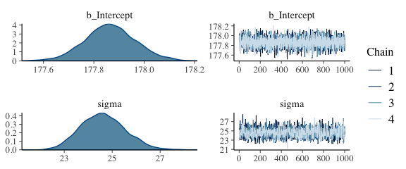

I had to increase the `warmup` due to convergence issues. After doing so, everything looks to be on the up and up. The chains look great. Here's the model `summary()`.

``` r
summary(b4.2)
```

    ##  Family: gaussian 
    ##   Links: mu = identity; sigma = identity 
    ## Formula: height ~ 1 
    ##    Data: d2 (Number of observations: 352) 
    ## Samples: 4 chains, each with iter = 3000; warmup = 2000; thin = 1;
    ##          total post-warmup samples = 4000
    ## 
    ## Population-Level Effects: 
    ##           Estimate Est.Error l-95% CI u-95% CI Eff.Sample Rhat
    ## Intercept   177.87      0.10   177.67   178.07       3736 1.00
    ## 
    ## Family Specific Parameters: 
    ##       Estimate Est.Error l-95% CI u-95% CI Eff.Sample Rhat
    ## sigma    24.62      0.92    22.94    26.50       2359 1.00
    ## 
    ## Samples were drawn using sampling(NUTS). For each parameter, Eff.Sample 
    ## is a crude measure of effective sample size, and Rhat is the potential 
    ## scale reduction factor on split chains (at convergence, Rhat = 1).

### Sampling from a ~~`map()`~~ `brm()` fit.

brms doesn't seem to have a convenience function that works the way `vcov()` does for rethinking. For example:

``` r
vcov(b4.1_half_cauchy)
```

    ##           Intercept
    ## Intercept 0.1646195

This only returns the first element in the matrix it did for rethinking. That is, it appears `brms::vcov()` only returns the variance/covariance matrix for the single-level *β* parameters (i.e., those used to model *μ*).

However, if you really wanted this information, you could get it after putting the HMC chains in a data frame.

``` r
post <- posterior_samples(b4.1_half_cauchy)
cov(post[, 1:2])
```

    ##              b_Intercept        sigma
    ## b_Intercept 0.1646195223 0.0009208419
    ## sigma       0.0009208419 0.0830826759

That was "(1) a vector of variances for the parameters and (2) a correlation matrix" for them (p. 90). Here are just the variances (i.e., the diagonal elements) and the correlation matrix.

``` r
post[, 1:2] %>%
  cov() %>%
  diag()
```

    ## b_Intercept       sigma 
    ##  0.16461952  0.08308268

``` r
post %>%
select(b_Intercept, sigma) %>%
  cor()
```

    ##             b_Intercept       sigma
    ## b_Intercept 1.000000000 0.007873887
    ## sigma       0.007873887 1.000000000

With our `post <- posterior_samples(b4.1_half_cauchy)` code from a few lines above, we've already done the brms version of what McElreath did with `extract.samples()` on page 90. However, what happened under the hood was different. Whereas rethinking used the `mvnorm()` function from the [MASS package](https://cran.r-project.org/web/packages/MASS/index.html), in brms we just extracted the iterations of the HMC chains and put them in a data frame.

``` r
head(post)
```

    ##   b_Intercept    sigma      lp__
    ## 1    154.4801 7.625384 -1226.620
    ## 2    154.6840 7.922579 -1226.764
    ## 3    154.6362 8.355415 -1228.610
    ## 4    154.7774 7.554790 -1226.776
    ## 5    154.3685 7.557438 -1226.855
    ## 6    154.4718 7.219310 -1228.243

Notice how our data frame, `post`, includes a third vector, `lp__`. That's the log posterior. See the [brms manual](https://cran.r-project.org/web/packages/brms/brms.pdf) for details. The log posterior will largely be outside of our focus in this project.

The `summary()` function doesn't work for brms posterior data frames quite the way `precis()` does for posterior data frames from the rethinking package. E.g.,

``` r
summary(post[, 1:2])
```

    ##   b_Intercept        sigma      
    ##  Min.   :153.1   Min.   :6.883  
    ##  1st Qu.:154.3   1st Qu.:7.544  
    ##  Median :154.6   Median :7.729  
    ##  Mean   :154.6   Mean   :7.742  
    ##  3rd Qu.:154.9   3rd Qu.:7.930  
    ##  Max.   :156.0   Max.   :9.090

Here's one option using the transpose of a `quantile()` call nested within `apply()`, which is a very general function you can learn more about [here](https://www.datacamp.com/community/tutorials/r-tutorial-apply-family#gs.f7fyw2s) or [here](https://www.r-bloggers.com/r-tutorial-on-the-apply-family-of-functions/).

``` r
t(apply(post[, 1:2], 2, quantile, probs = c(.5, .025, .75)))
```

    ##                    50%       2.5%        75%
    ## b_Intercept 154.610487 153.822816 154.889094
    ## sigma         7.729024   7.215594   7.930014

The base R code is compact, but somewhat opaque. Here's how to do something similar with more explicit tidyverse code.

``` r
post %>%
  select(-lp__) %>% 
  gather(parameter) %>%
  group_by(parameter) %>%
  summarise(mean = mean(value),
            SD   = sd(value),
            `2.5_percentile`  = quantile(value, probs = .025),
            `97.5_percentile` = quantile(value, probs = .975)) %>%
  mutate_if(is.numeric, round, digits = 2)
```

    ## # A tibble: 2 x 5
    ##   parameter     mean    SD `2.5_percentile` `97.5_percentile`
    ##   <chr>        <dbl> <dbl>            <dbl>             <dbl>
    ## 1 b_Intercept 155.   0.41            154.              155.  
    ## 2 sigma         7.74 0.290             7.22              8.34

You can always get pretty similar information by just putting the `brm()` fit object into `posterior_summary()`.

``` r
posterior_summary(b4.1_half_cauchy)
```

    ##                 Estimate Est.Error         Q2.5        Q97.5
    ## b_Intercept   154.613681 0.4057333   153.822816   155.392823
    ## sigma           7.742443 0.2882407     7.215594     8.340278
    ## lp__        -1227.486054 0.9670335 -1230.113257 -1226.545811

And if you're willing to drop the posterior *S**D*s, you can use `tidybayes::mean_qi()`, too.

``` r
post %>% 
  select(-lp__) %>% 
  gather(parameter) %>%
  group_by(parameter) %>%
  mean_qi(value)
```

    ## # A tibble: 2 x 7
    ##   parameter    value .lower .upper .width .point .interval
    ##   <chr>        <dbl>  <dbl>  <dbl>  <dbl> <chr>  <chr>    
    ## 1 b_Intercept 155.   154.   155.     0.95 mean   qi       
    ## 2 sigma         7.74   7.22   8.34   0.95 mean   qi

#### Overthinking: Under the hood with multivariate sampling.

Again, `brms::posterior_samples()` is not the same as `rethinking::extract.samples()`. Rather than use the `MASS::mvnorm()`, brms takes the iterations from the HMC chains. McElreath covers all of this in Chapter 8. You might also look at the brms [reference manual](https://cran.r-project.org/web/packages/brms/brms.pdf) or [GitHub page](https://github.com/paul-buerkner/brms) for details.

#### Overthinking: Getting *σ* right.

There's no need to fret about this in brms. With HMC, we are not constraining the posteriors to the multivariate normal distribution. Here's our posterior density for *σ*.

``` r
ggplot(data = post, 
       aes(x = sigma)) +
  geom_density(size = 1/10, fill = "black") +
  scale_y_continuous(NULL, breaks = NULL) +
  xlab(expression(sigma)) +
  theme(panel.grid = element_blank())
```

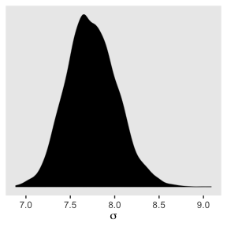

See? HMC handled the mild skew just fine.

But sometimes you want to actually model *σ*, such as in the case where your variances are systematically heterogeneous. Bürkner calls these kinds of models distributional models, which you can learn more about in his vignette [*Estimating Distributional Models with brms *](https://cran.r-project.org/web/packages/brms/vignettes/brms_distreg.html). As explained in the vignette, you actually model log(*σ*) in those instances.

Adding a predictor
------------------

Here's our scatter plot of `weight` and `height`.

``` r
ggplot(data = d2, 
       aes(x = weight, y = height)) +
  theme_bw() +
  geom_point(shape = 1, size = 2) +
  theme(panel.grid = element_blank())
```

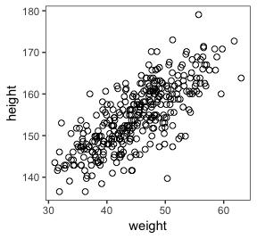

### The linear model strategy

In our new univariable model

*h*<sub>*i*</sub> ∼ Normal(*μ*<sub>*i*</sub>, *σ*)

*μ*<sub>*i*</sub> = *α* + *β**x*<sub>*i*</sub>

*α* ∼ Normal(178, 100)

*β* ∼ Normal(0, 10)

*σ* ∼ Uniform(0, 50)

### Fitting the model.

The `brms::brm()` syntax doesn't mirror the statistical notation. But here are the analogues to the exposition at the bottom of page 95.

-   *h*<sub>*i*</sub> ∼ Normal(*μ*<sub>*i*</sub>, *σ*): `family = gaussian`
-   *μ*<sub>*i*</sub> = *α* + *β**x*<sub>*i*</sub>: `height ~ 1 + weight`
-   *α* ∼ Normal(178, 100): `prior(normal(156, 100), class = Intercept`
-   *β* ∼ Normal(0, 10): `prior(normal(0, 10), class = b)`
-   *σ* ∼ Uniform(0, 50): `prior(uniform(0, 50), class = sigma)`

To add a predictor, you just the `+` operator in the model `formula`.

``` r
b4.3 <- 
  brm(data = d2, family = gaussian,
      height ~ 1 + weight,
      prior = c(prior(normal(156, 100), class = Intercept),
                prior(normal(0, 10), class = b),
                prior(uniform(0, 50), class = sigma)),
      iter = 41000, warmup = 40000, chains = 4, cores = 4)
```

This was another example of how using a uniform prior for *σ* required we use an unusually large number of `warmup` iterations before the HMC chains converged on the posterior. Change the prior to `cauchy(0, 1)` and the chains converge with no problem, resulting in much better effective samples, too. Here are the trace plots.

``` r
plot(b4.3)
```

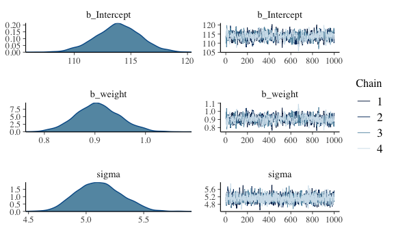

### Interpreting the model fit.

"One trouble with statistical models is that they are hard to understand" (p. 97). Welcome to the world of applied statistics.

#### Tables of estimates.

With a little `[]` subsetting we can exclude the log posterior from the summary.

``` r
posterior_summary(b4.3)[1:3, ]
```

    ##                Estimate  Est.Error        Q2.5       Q97.5
    ## b_Intercept 113.8582067 1.97250352 109.8492154 117.6915511
    ## b_weight      0.9054473 0.04338383   0.8219399   0.9938516
    ## sigma         5.1116630 0.19585012   4.7556112   5.4975670

Again, brms doesn't have a convenient `corr = TRUE` argument for `plot()` or `summary()`. But you can get that information after putting the chains in a data frame.

``` r
posterior_samples(b4.3) %>%
  select(-lp__) %>%
  cor() %>%
  round(digits = 2)
```

    ##             b_Intercept b_weight sigma
    ## b_Intercept        1.00    -0.99  0.01
    ## b_weight          -0.99     1.00 -0.01
    ## sigma              0.01    -0.01  1.00

With centering, we can reduce the correlations among the parameters.

``` r
d2 <- 
  d2 %>%
  mutate(weight_c = weight - mean(weight))
```

Fit the `weight_c` model, `b4.4`.

``` r
b4.4 <- 
  brm(data = d2, family = gaussian,
      height ~ 1 + weight_c,
      prior = c(prior(normal(178, 100), class = Intercept),
                prior(normal(0, 10), class = b),
                prior(uniform(0, 50), class = sigma)),
      iter = 46000, warmup = 45000, chains = 4, cores = 4,
      control = list(adapt_delta = 0.8, 
                     max_treedepth = 10))
```

``` r
plot(b4.4)
```


``` r
posterior_summary(b4.4)[1:3, ]
```

    ##                Estimate  Est.Error        Q2.5       Q97.5
    ## b_Intercept 154.6027581 0.27535885 154.0447477 155.1341208
    ## b_weight_c    0.9064525 0.04255414   0.8212631   0.9910143
    ## sigma         5.1048904 0.18899744   4.7529444   5.4873073

Like before, the uniform prior required extensive `warmup` iterations to produce a good posterior. This is easily fixed using a half Cauchy prior, instead. Anyways, the effective samples improved. Here's the parameter correlation info.

``` r
posterior_samples(b4.4) %>%
  select(-lp__) %>%
  cor() %>%
  round(digits = 2)
```

    ##             b_Intercept b_weight_c sigma
    ## b_Intercept        1.00       0.01  0.01
    ## b_weight_c         0.01       1.00  0.02
    ## sigma              0.01       0.02  1.00

See? Now all the correlations are quite low. Also, if you prefer a visual approach, you might do `pairs(b4.4)`.

#### Plotting posterior inference against the data.

Here is the code for Figure 4.4. Note our use of the `fixef()` function.

``` r
d2 %>%
  ggplot(aes(x = weight, y = height)) +
  theme_bw() +
  geom_abline(intercept = fixef(b4.3)[1], 
              slope     = fixef(b4.3)[2]) +
  geom_point(shape = 1, size = 2, color = "royalblue") +
  theme(panel.grid = element_blank())
```

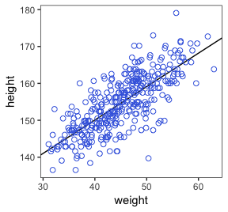

Be default, we extract all the posterior iterations with `posterior_samples()`.

``` r
post <- posterior_samples(b4.3)

post %>%
  slice(1:5)  # This serves a similar function as `head()`
```

    ##   b_Intercept  b_weight    sigma      lp__
    ## 1    113.5415 0.9041420 5.024513 -1083.086
    ## 2    114.2613 0.9046089 4.976354 -1083.134
    ## 3    114.0279 0.9040988 4.962150 -1082.324
    ## 4    113.9516 0.9006078 5.134461 -1082.203
    ## 5    113.9667 0.9024512 5.112056 -1082.071

Here are the four models leading up to McElreath's Figure 4.5. To reduce my computation time, I used a half Cauchy(0, 1) prior on *σ*. If you are willing to wait for the warmups, switching that out for McElreath's uniform prior should work fine as well.

``` r
N <- 10

b10 <- 
  brm(data = d2 %>%
        slice(1:N), 
      family = gaussian,
      height ~ 1 + weight,
      prior = c(prior(normal(178, 100), class = Intercept),
                prior(normal(0, 10), class = b),
                prior(cauchy(0, 1), class = sigma)),
      iter = 2000, warmup = 1000, chains = 4, cores = 4)

N <- 50

b50 <- 
  brm(data = d2 %>%
        slice(1:N), 
      family = gaussian,
      height ~ 1 + weight,
      prior = c(prior(normal(178, 100), class = Intercept),
                prior(normal(0, 10), class = b),
                prior(cauchy(0, 1), class = sigma)),
      iter = 2000, warmup = 1000, chains = 4, cores = 4)

N <- 150

b150 <- 
  brm(data = d2 %>%
        slice(1:N), 
      family = gaussian,
      height ~ 1 + weight,
      prior = c(prior(normal(178, 100), class = Intercept),
                prior(normal(0, 10), class = b),
                prior(cauchy(0, 1), class = sigma)),
      iter = 2000, warmup = 1000, chains = 4, cores = 4)

N <- 352

b352 <- 
  brm(data = d2 %>%
        slice(1:N), 
      family = gaussian,
      height ~ 1 + weight,
      prior = c(prior(normal(178, 100), class = Intercept),
                prior(normal(0, 10), class = b),
                prior(cauchy(0, 1), class = sigma)),
      iter = 2000, warmup = 1000, chains = 4, cores = 4)
```

I'm not going to clutter up the document with all the trace plots and coefficient summaries from these four models. But here's how to get that information.

``` r
plot(b10)
print(b10)

plot(b50)
print(b50)

plot(b150)
print(b150)

plot(b352)
print(b352)
```

We'll need to put the chains of each model into data frames.

``` r
post10  <- posterior_samples(b10)
post50  <- posterior_samples(b50)
post150 <- posterior_samples(b150)
post352 <- posterior_samples(b352)
```

Here is the code for the four individual plots.

``` r
p10 <- 
  ggplot(data =  d2[1:10 , ], 
         aes(x = weight, y = height)) +
  theme_bw() +
  geom_abline(intercept = post10[1:20, 1], 
              slope     = post10[1:20, 2],
              size = 1/3, alpha = .3) +
  geom_point(shape = 1, size = 2, color = "royalblue") +
  coord_cartesian(xlim = quantile(d2$weight, c(0, 1)),
                  ylim = quantile(d2$height, c(0, 1))) +
  labs(subtitle = "N = 10") +
  theme(panel.grid = element_blank())

p50 <-
  ggplot(data =  d2[1:50 , ], 
         aes(x = weight, y = height)) +
  theme_bw() +
  geom_abline(intercept = post50[1:20, 1], 
              slope     = post50[1:20, 2],
              size = 1/3, alpha = .3) +
  geom_point(shape = 1, size = 2, color = "royalblue") +
  coord_cartesian(xlim = quantile(d2$weight, c(0, 1)),
                  ylim = quantile(d2$height, c(0, 1))) +
  labs(subtitle = "N = 50") +
  theme(panel.grid = element_blank())

p150 <-
  ggplot(data =  d2[1:150 , ], 
         aes(x = weight, y = height)) +
  theme_bw() +
  geom_abline(intercept = post150[1:20, 1], 
              slope     = post150[1:20, 2],
              size = 1/3, alpha = .3) +
  geom_point(shape = 1, size = 2, color = "royalblue") +
  coord_cartesian(xlim = quantile(d2$weight, c(0, 1)),
                  ylim = quantile(d2$height, c(0, 1))) +
  labs(subtitle = "N = 150") +
  theme(panel.grid = element_blank())

p352 <- 
  ggplot(data =  d2[1:352 , ], 
         aes(x = weight, y = height)) +
  theme_bw() +
  geom_abline(intercept = post352[1:20, 1], 
              slope     = post352[1:20, 2],
              size = 1/3, alpha = .3) +
  geom_point(shape = 1, size = 2, color = "royalblue") +
  coord_cartesian(xlim = quantile(d2$weight, c(0, 1)),
                  ylim = quantile(d2$height, c(0, 1))) +
  labs(subtitle = "N = 352") +
  theme(panel.grid = element_blank())
```

Note how we used the good old bracket syntax (e.g., `d2[1:10 , ]`) to index rows from our `d2` data. With tidyverse-style syntax, we could have done `slice(d2, 1:10)` or `d2 %>% slice(1:10)` instead.

Anyway, we saved each of these plots as objects. With a little help of the [`multiplot()` function](http://www.cookbook-r.com/Graphs/Multiple_graphs_on_one_page_(ggplot2)/) we are going to arrange those plot objects into a grid in order to reproduce Figure 4.5.

Behold the code for the `multiplot()` function:

``` r
multiplot <- function(..., plotlist=NULL, file, cols=1, layout=NULL) {
  library(grid)
  
  # Make a list from the ... arguments and plotlist
  plots <- c(list(...), plotlist)
  
  numPlots = length(plots)
  
  # If layout is NULL, then use 'cols' to determine layout
  if (is.null(layout)) {
    # Make the panel
    # ncol: Number of columns of plots
    # nrow: Number of rows needed, calculated from # of cols
    layout <- matrix(seq(1, cols * ceiling(numPlots/cols)),
                     ncol = cols, nrow = ceiling(numPlots/cols))
  }
  
  if (numPlots==1) {
    print(plots[[1]])
    
  } else {
    # Set up the page
    grid.newpage()
    pushViewport(viewport(layout = grid.layout(nrow(layout), ncol(layout))))
    
    # Make each plot, in the correct location
    for (i in 1:numPlots) {
      # Get the i,j matrix positions of the regions that contain this subplot
      matchidx <- as.data.frame(which(layout == i, arr.ind = TRUE))
      
      print(plots[[i]], vp = viewport(layout.pos.row = matchidx$row,
                                      layout.pos.col = matchidx$col))
    }
  }
}
```

We're finally ready to use `multiplot()` to make Figure 4.5.

``` r
multiplot(p10, p150, p50, p352, cols = 2)
```

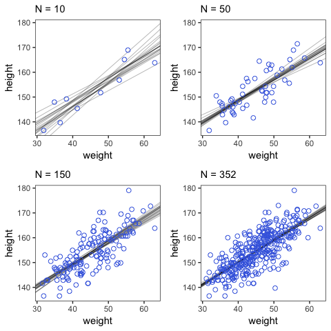

#### Plotting regression intervals and contours.

Remember, if you want to plot McElreath's `mu_at_50` with ggplot2, you'll need to save it as a data frame or a tibble.

``` r
mu_at_50 <- 
  post %>% 
  transmute(mu_at_50 = b_Intercept + b_weight * 50)
 
head(mu_at_50)
```

    ##   mu_at_50
    ## 1 158.7486
    ## 2 159.4917
    ## 3 159.2329
    ## 4 158.9820
    ## 5 159.0893
    ## 6 159.0958

And here is a version McElreath's Figure 4.6 density plot.

``` r
mu_at_50 %>%
  ggplot(aes(x = mu_at_50)) +
  theme_classic() +
  geom_density(size = 0, fill = "royalblue") +
  scale_y_continuous(NULL, breaks = NULL) +
  labs(x = expression(mu["height | weight = 50"]))
```

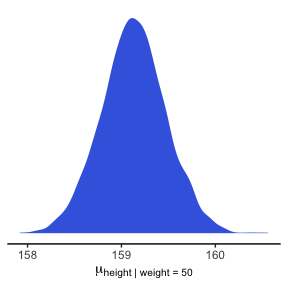

We'll use `mean_hdi()` to get both 89% and 95% HPDIs along with the mean.

``` r
mean_hdi(mu_at_50[,1], .width = c(.89, .95))
```

    ##          y     ymin     ymax .width .point .interval
    ## 1 159.1306 158.5436 159.6621   0.89   mean       hdi
    ## 2 159.1306 158.4572 159.7996   0.95   mean       hdi

If you wanted to express those sweet 95% HPDIs on your density plot, you might use `tidybayes::stat_pointintervalh()`. Since `stat_pointintervalh()` also returns a point estimate, we'll throw in the mode.

``` r
mu_at_50 %>%
  ggplot(aes(x = mu_at_50)) +
  theme_classic() +
  geom_density(size = 0, fill = "royalblue") +
  stat_pointintervalh(aes(y = 0), 
                      point_interval = mode_hdi, .width = .95) +
  scale_y_continuous(NULL, breaks = NULL) +
  labs(x = expression(mu["height | weight = 50"]))
```

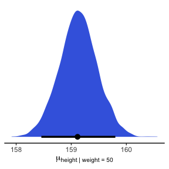

In brms, you would use `fitted()` to do what McElreath accomplished with `link()`.

``` r
mu <- fitted(b4.3, summary = F)

str(mu)
```

    ##  num [1:4000, 1:352] 157 158 157 157 157 ...

When you specify `summary = F`, `fitted()` returns a matrix of values with as many rows as there were post-warmup iterations across your HMC chains and as many columns as there were cases in your analysis. Because we had 4000 post-warmup iterations and *n* = 352, `fitted()` returned a matrix of 4000 rows and 352 vectors. If you omitted the `summary = F` argument, the default is `TRUE` and `fitted()` will return summary information instead.

Much like rethinking's `link()`, `fitted()` can accommodate custom predictor values with its `newdata` argument.

``` r
weight_seq <- tibble(weight = seq(from = 25, to = 70, by = 1))

mu <-
  fitted(b4.3,
         summary = F,
         newdata = weight_seq) %>%
  as_tibble() %>%
  mutate(Iter = 1:4000) %>%
  select(Iter, everything())

str(mu)
```

Anticipating ggplot2, we went ahead and converted the output to a tibble. But we might do a little more data processing with the aid of [`tidyr::gather()`](https://tidyr.tidyverse.org/reference/gather.html). With the `gather()` function, we'll convert the data from the wide format to the long format. If you're new to the distinction between wide and long data, you can learn more [here](https://stanford.edu/~ejdemyr/r-tutorials/wide-and-long/) or [here](http://www.theanalysisfactor.com/wide-and-long-data/).

``` r
mu <- 
  mu %>%
  gather(key, value, V1:V46) %>% 
  
  # We might reformat `key` (i.e., the default name for our `weight` index), to numerals
  mutate(key = str_extract(key, "\\d+") %>% as.integer()) %>% 
  # Learn more about `str_extract()` here: http://www.fabianheld.com/stringr/
  
  # We might `rename()` the last two vectors more descriptively
  rename(weight = key,
         height = value) %>% 
  
  # Finally, we can use algebra to convert the `weight` values to the original ones we wanted
  mutate(weight = weight + 24)
```

Enough data processing. Here we reproduce McElreath's Figure 4.7.a.

``` r
d2 %>%
  ggplot(aes(x = weight, y = height)) +
  geom_point(data = mu %>% filter(Iter < 101),
             alpha = .1)
```

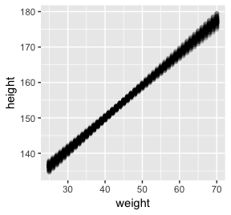

``` r
# or prettied up a bit
d2 %>%
  ggplot(aes(x = weight, y = height)) +
  geom_point(data = mu %>% filter(Iter < 101), 
             color = "navyblue", alpha = .05) +
  theme(text = element_text(family = "Times"),
        panel.grid = element_blank())
```

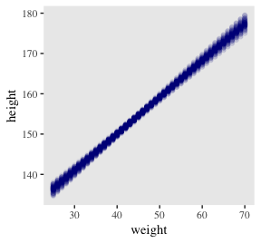

With `fitted()`, it's quite easy to plot a regression line and its intervals. Just omit the `summary = T` argument.

``` r
mu_summary <-
  fitted(b4.3, 
         newdata = weight_seq) %>%
  as_tibble() %>%
  bind_cols(weight_seq)

head(mu_summary)
```

    ## # A tibble: 6 x 5
    ##   Estimate Est.Error  Q2.5 Q97.5 weight
    ##      <dbl>     <dbl> <dbl> <dbl>  <dbl>
    ## 1     136.     0.910  135.  138.     25
    ## 2     137.     0.869  136.  139.     26
    ## 3     138.     0.828  137.  140.     27
    ## 4     139.     0.787  138.  141.     28
    ## 5     140.     0.746  139.  142.     29
    ## 6     141.     0.706  140.  142.     30

Here it is, our analogue to Figure 4.7.b.

``` r
d2 %>%
  ggplot(aes(x = weight, y = height)) +
  geom_ribbon(data = mu_summary, 
              aes(y = Estimate, ymin = Q2.5, ymax = Q97.5),
              fill = "grey70") +
  geom_line(data = mu_summary, 
            aes(y = Estimate)) +
  geom_point(color = "navyblue", shape = 1, size = 1.5, alpha = 2/3) +
  coord_cartesian(xlim = range(d2$weight)) +
  theme(text = element_text(family = "Times"),
        panel.grid = element_blank())
```

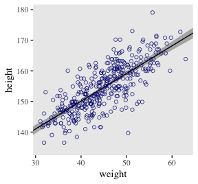

And if you wanted to use intervals other than the default 95% ones, you'd enter a `probs` argument like this: `fitted(b4.3, newdata = weight.seq, probs = c(.25, .75))`. The resulting third and fourth vectors from the `fitted()` object would be named `Q25` and `Q75` instead of the default `Q2.5` and `Q97.5`. The [`Q` prefix](https://github.com/paul-buerkner/brms/issues/425) stands for quantile.

##### Overthinking: How ~~link~~ `fitted()` works.

Similar to `rethinking::link()`, `brms::fitted()` uses the formula from your model to compute the model expectations for a given set of predictor values. I use it a lot in this project. If you follow along, you'll get a good handle on it.

#### Prediction intervals.

Even though our full statistical model (omitting priors for the sake of simplicity) is

*h*<sub>*i*</sub> ∼ Normal(*μ*<sub>*i*</sub> = *α* + *β**x*<sub>,</sub>*σ*)

we've only been plotting the *μ* part. In order to bring in the variability expressed by *σ*, we'll have to switch to `predict().` Much as `brms::fitted()` was our analogue to `rethinking::link()`, `brms::predict()` is our analogue to `rethinking::sim()`.

We can reuse our `weight_seq` data from before. But in case you forgot, here's that code again.

``` r
weight_seq <- tibble(weight = seq(from = 25, to = 70, by = 1))
```

The `predict()` code looks a lot like what we used for `fitted()`.

``` r
pred_height <-
  predict(b4.3,
          newdata = weight_seq) %>%
  as_tibble() %>%
  bind_cols(weight_seq)
  
pred_height %>%
  slice(1:6)
```

    ## # A tibble: 6 x 5
    ##   Estimate Est.Error  Q2.5 Q97.5 weight
    ##      <dbl>     <dbl> <dbl> <dbl>  <dbl>
    ## 1     136.      5.15  126.  147.     25
    ## 2     137.      5.15  127.  148.     26
    ## 3     138.      5.24  128.  148.     27
    ## 4     139.      5.07  129.  149.     28
    ## 5     140.      5.13  130.  150.     29
    ## 6     141.      5.21  131.  151.     30

This time the summary information in our data frame is for, as McElreath puts is, "simulated heights, not distributions of plausible average height, *μ*" (p. 108). Another way of saying that is that these simulations are the joint consequence of both *μ* and *σ*, unlike the results of `fitted()`, which only reflect *μ*. Our plot for Figure 4.8:

``` r
d2 %>%
  ggplot(aes(x = weight)) +
  geom_ribbon(data = pred_height, 
              aes(y = Estimate, ymin = Q2.5, ymax = Q97.5),
              fill = "grey83") +
  geom_ribbon(data = mu_summary, 
              aes(y = Estimate, ymin = Q2.5, ymax = Q97.5),
              fill = "grey70") +
  geom_line(data = mu_summary, aes(y = Estimate)) +
  geom_point(aes(y = height),
             color = "navyblue", shape = 1, size = 1.5, alpha = 2/3) +
  coord_cartesian(xlim = range(d2$weight),
                  ylim = range(d2$height)) +
  theme(text = element_text(family = "Times"),
        panel.grid = element_blank())
```

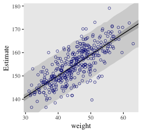

Polynomial regression
---------------------

Remember `d`?

``` r
d %>%
  glimpse()
```

    ## Observations: 544
    ## Variables: 4
    ## $ height <dbl> 151.7650, 139.7000, 136.5250, 156.8450, 145.4150, 163.8300, 149.2250, 168.9100, ...
    ## $ weight <dbl> 47.82561, 36.48581, 31.86484, 53.04191, 41.27687, 62.99259, 38.24348, 55.47997, ...
    ## $ age    <dbl> 63.0, 63.0, 65.0, 41.0, 51.0, 35.0, 32.0, 27.0, 19.0, 54.0, 47.0, 66.0, 73.0, 20...
    ## $ male   <int> 1, 0, 0, 1, 0, 1, 0, 1, 0, 1, 0, 1, 0, 0, 0, 1, 1, 0, 1, 0, 0, 1, 0, 1, 0, 1, 0,...

The quadratic is probably the most commonly used polynomial regression model.

*μ* = *α* + *β*<sub>1</sub>*x*<sub>*i*</sub> + *β*<sub>2</sub>*x*<sub>*i*</sub><sup>2</sup>

McElreath warned: "Fitting these models to data is easy. Interpreting them can be hard" (p. 111). Standardizing will help `brm()` fit the model. We might standardize our `weight` variable like so.

``` r
d <-
  d %>%
  mutate(weight_s = (weight - mean(weight))/sd(weight))
```

Here's the quadratic model in brms.

``` r
b4.5 <- 
  brm(data = d, family = gaussian,
      height ~ 1 + weight_s + I(weight_s^2),
      prior = c(prior(normal(178, 20), class = Intercept),
                prior(normal(0, 10), class = b),
                prior(cauchy(0, 1), class = sigma)),
      iter = 2000, warmup = 1000, chains = 4, cores = 4)
```

``` r
plot(b4.5)
```

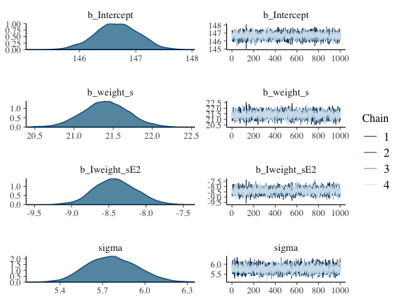

``` r
print(b4.5)
```

    ##  Family: gaussian 
    ##   Links: mu = identity; sigma = identity 
    ## Formula: height ~ 1 + weight_s + I(weight_s^2) 
    ##    Data: d (Number of observations: 544) 
    ## Samples: 4 chains, each with iter = 2000; warmup = 1000; thin = 1;
    ##          total post-warmup samples = 4000
    ## 
    ## Population-Level Effects: 
    ##             Estimate Est.Error l-95% CI u-95% CI Eff.Sample Rhat
    ## Intercept     146.66      0.38   145.91   147.39       3783 1.00
    ## weight_s       21.40      0.29    20.82    21.98       3403 1.00
    ## Iweight_sE2    -8.41      0.28    -8.94    -7.85       3481 1.00
    ## 
    ## Family Specific Parameters: 
    ##       Estimate Est.Error l-95% CI u-95% CI Eff.Sample Rhat
    ## sigma     5.77      0.18     5.45     6.12       4000 1.00
    ## 
    ## Samples were drawn using sampling(NUTS). For each parameter, Eff.Sample 
    ## is a crude measure of effective sample size, and Rhat is the potential 
    ## scale reduction factor on split chains (at convergence, Rhat = 1).

Our quadratic plot requires new `fitted()`- and `predict()`-oriented wrangling.

``` r
weight_seq <- tibble(weight_s = seq(from = -2.5, to = 2.5, length.out = 30))

fitd_quad <-
  fitted(b4.5, 
         newdata = weight_seq) %>%
  as_tibble() %>%
  bind_cols(weight_seq)

pred_quad <-
  predict(b4.5, 
          newdata = weight_seq) %>%
  as_tibble() %>%
  bind_cols(weight_seq)  
```

Behold the code for our version of Figure 4.9.a. You'll notice how little the code changed from that for Figure 4.8, above.

``` r
ggplot(data = d, 
       aes(x = weight_s, y = height)) +
  geom_ribbon(data = pred_quad, 
              aes(y = Estimate, ymin = Q2.5, ymax = Q97.5),
              fill = "grey83") +
  geom_ribbon(data = fitd_quad, 
              aes(y = Estimate, ymin = Q2.5, ymax = Q97.5),
              fill = "grey70") +
  geom_line(data = fitd_quad, 
            aes(y = Estimate), size = 1/4) +
  geom_point(color = "navyblue", shape = 1, size = 1.5, alpha = 1/3) +
  coord_cartesian(xlim = range(d$weight_s)) +
  theme(text = element_text(family = "Times"),
        panel.grid = element_blank())
```

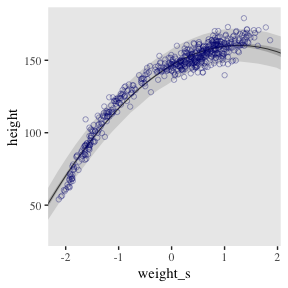

From a formula perspective, the cubic model is a simple extenstion of the quadratic:

*μ* = *α* + *β*<sub>1</sub>*x*<sub>*i*</sub> + *β*<sub>2</sub>*x*<sub>*i*</sub><sup>2</sup> + *β*<sub>3</sub>*x*<sub>*i*</sub><sup>3</sup>

Fit it like so.

``` r
b4.6 <- 
  brm(data = d, family = gaussian,
      height ~ 1 + weight_s + I(weight_s^2) + I(weight_s^3),
      prior = c(set_prior("normal(178, 100)", class = "Intercept"),
                set_prior("normal(0, 10)", class = "b"),
                set_prior("cauchy(0, 1)", class = "sigma")),
      iter = 2000, warmup = 1000, chains = 4, cores = 4)
```

And now we'll fit the good old linear model.

``` r
b4.7 <- 
  brm(data = d, family = gaussian,
      height ~ 1 + weight_s,
      prior = c(set_prior("normal(178, 100)", class = "Intercept"),
                set_prior("normal(0, 10)", class = "b"),
                set_prior("cauchy(0, 1)", class = "sigma")),
      iter = 2000, warmup = 1000, chains = 4, cores = 4)
```

Here's the `fitted()`, `predict()`, and ggplot2 code for Figure 4.9.c., the cubic model.

``` r
fitd_cub <-
  fitted(b4.6, 
         newdata = weight_seq) %>%
  as_tibble() %>%
  bind_cols(weight_seq)

pred_cub <-
  predict(b4.6, 
          newdata = weight_seq) %>%
  as_tibble() %>%
  bind_cols(weight_seq) 

ggplot(data = d, 
       aes(x = weight_s, y = height)) +
  geom_ribbon(data = pred_cub, 
              aes(y = Estimate, ymin = Q2.5, ymax = Q97.5),
              fill = "grey83") +
  geom_ribbon(data = fitd_cub, 
              aes(y = Estimate, ymin = Q2.5, ymax = Q97.5),
              fill = "grey70") +
  geom_line(data = fitd_cub, 
            aes(y = Estimate), 
            size = 1/4) +
  geom_point(color = "navyblue", shape = 1, size = 1.5, alpha = 1/3) +
  coord_cartesian(xlim = range(d$weight_s)) +
  theme(text = element_text(family = "Times"),
        panel.grid = element_blank())
```

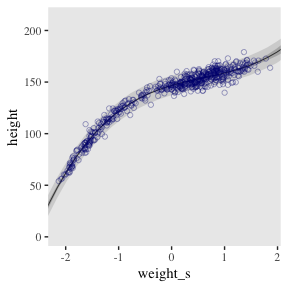

And here's the `fitted()`, `predict()`, and ggplot2 code for Figure 4.9.a., the linear model.

``` r
fitd_line <-
  fitted(b4.7, 
         newdata = weight_seq) %>%
  as_tibble() %>%
  bind_cols(weight_seq)

pred_line <-
  predict(b4.7, 
          newdata = weight_seq) %>%
  as_tibble() %>%
  bind_cols(weight_seq) 

ggplot(data = d, 
       aes(x = weight_s, y = height)) +
  geom_ribbon(data = pred_line, 
              aes(y = Estimate, ymin = Q2.5, ymax = Q97.5),
              fill = "grey83") +
  geom_ribbon(data = fitd_line, 
              aes(y = Estimate, ymin = Q2.5, ymax = Q97.5),
              fill = "grey70") +
  geom_line(data = fitd_line, 
            aes(y = Estimate), size = 1/4) +
  geom_point(color = "navyblue", shape = 1, size = 1.5, alpha = 1/3) +
  coord_cartesian(xlim = range(d$weight_s)) +
  theme(text = element_text(family = "Times"),
        panel.grid = element_blank())
```

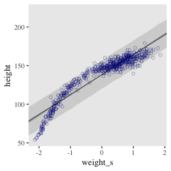

##### Overthinking: Converting back to natural scale.

You can apply McElreath's conversion trick within the ggplot2 environment, too. Here it is with the cubic model.

``` r
at <- c(-2, -1, 0, 1, 2)

ggplot(data = d, 
       aes(x = weight_s, y = height)) +
  geom_ribbon(data = pred_line, 
              aes(y = Estimate, ymin = Q2.5, ymax = Q97.5),
              fill = "grey83") +
  geom_ribbon(data = fitd_line, 
              aes(y = Estimate, ymin = Q2.5, ymax = Q97.5),
              fill = "grey70") +
  geom_line(data = fitd_line, 
            aes(y = Estimate), size = 1/4) +
  geom_point(color = "navyblue", shape = 1, size = 1.5, alpha = 1/3) +
  coord_cartesian(xlim = range(d$weight_s)) +
  theme(text = element_text(family = "Times"),
        panel.grid = element_blank()) +
  # Here it is!
  scale_x_continuous("standardized weight converted back",
                     breaks = at,
                     labels = round(at*sd(d$weight) + mean(d$weight), 1))
```

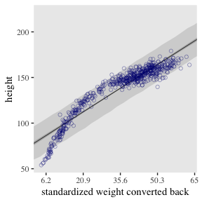

Reference
---------

[McElreath, R. (2016). *Statistical rethinking: A Bayesian course with examples in R and Stan.* Chapman & Hall/CRC Press.](https://xcelab.net/rm/statistical-rethinking/)

Session info
------------

``` r
sessionInfo()
```

    ## R version 3.5.1 (2018-07-02)
    ## Platform: x86_64-apple-darwin15.6.0 (64-bit)
    ## Running under: macOS High Sierra 10.13.4
    ## 
    ## Matrix products: default
    ## BLAS: /Library/Frameworks/R.framework/Versions/3.5/Resources/lib/libRblas.0.dylib
    ## LAPACK: /Library/Frameworks/R.framework/Versions/3.5/Resources/lib/libRlapack.dylib
    ## 
    ## locale:
    ## [1] en_US.UTF-8/en_US.UTF-8/en_US.UTF-8/C/en_US.UTF-8/en_US.UTF-8
    ## 
    ## attached base packages:
    ## [1] grid      parallel  stats     graphics  grDevices utils     datasets  methods   base     
    ## 
    ## other attached packages:
    ##  [1] tidybayes_1.0.1    brms_2.4.0         Rcpp_0.12.18       rstan_2.17.3       StanHeaders_2.17.2
    ##  [6] bindrcpp_0.2.2     forcats_0.3.0      stringr_1.3.1      dplyr_0.7.6        purrr_0.2.5       
    ## [11] readr_1.1.1        tidyr_0.8.1        tibble_1.4.2       ggplot2_3.0.0      tidyverse_1.2.1   
    ## 
    ## loaded via a namespace (and not attached):
    ##  [1] nlme_3.1-137              matrixStats_0.54.0        xts_0.10-2               
    ##  [4] lubridate_1.7.4           threejs_0.3.1             httr_1.3.1               
    ##  [7] LaplacesDemon_16.1.1      rprojroot_1.3-2           tools_3.5.1              
    ## [10] backports_1.1.2           utf8_1.1.4                R6_2.2.2                 
    ## [13] DT_0.4                    lazyeval_0.2.1            colorspace_1.3-2         
    ## [16] withr_2.1.2               tidyselect_0.2.4          gridExtra_2.3            
    ## [19] mnormt_1.5-5              Brobdingnag_1.2-5         compiler_3.5.1           
    ## [22] cli_1.0.0                 rvest_0.3.2               HDInterval_0.2.0         
    ## [25] arrayhelpers_1.0-20160527 shinyjs_1.0               xml2_1.2.0               
    ## [28] labeling_0.3              colourpicker_1.0          scales_0.5.0             
    ## [31] dygraphs_1.1.1.5          mvtnorm_1.0-8             psych_1.8.4              
    ## [34] ggridges_0.5.0            digest_0.6.15             foreign_0.8-70           
    ## [37] rmarkdown_1.10            base64enc_0.1-3           pkgconfig_2.0.1          
    ## [40] htmltools_0.3.6           htmlwidgets_1.2           rlang_0.2.1              
    ## [43] readxl_1.1.0              rstudioapi_0.7            shiny_1.1.0              
    ## [46] svUnit_0.7-12             bindr_0.1.1               zoo_1.8-2                
    ## [49] jsonlite_1.5              crosstalk_1.0.0           gtools_3.8.1             
    ## [52] inline_0.3.15             magrittr_1.5              loo_2.0.0                
    ## [55] bayesplot_1.6.0           Matrix_1.2-14             munsell_0.5.0            
    ## [58] abind_1.4-5               stringi_1.2.3             yaml_2.1.19              
    ## [61] MASS_7.3-50               ggstance_0.3              plyr_1.8.4               
    ## [64] promises_1.0.1            crayon_1.3.4              miniUI_0.1.1.1           
    ## [67] lattice_0.20-35           haven_1.1.2               hms_0.4.2                
    ## [70] knitr_1.20                pillar_1.2.3              igraph_1.2.1             
    ## [73] markdown_0.8              shinystan_2.5.0           codetools_0.2-15         
    ## [76] reshape2_1.4.3            stats4_3.5.1              rstantools_1.5.0         
    ## [79] glue_1.2.0                evaluate_0.10.1           modelr_0.1.2             
    ## [82] httpuv_1.4.4.2            cellranger_1.1.0          gtable_0.2.0             
    ## [85] assertthat_0.2.0          mime_0.5                  xtable_1.8-2             
    ## [88] broom_0.4.5               coda_0.19-1               later_0.7.3              
    ## [91] viridisLite_0.3.0         rsconnect_0.8.8           shinythemes_1.1.1        
    ## [94] bridgesampling_0.4-0
