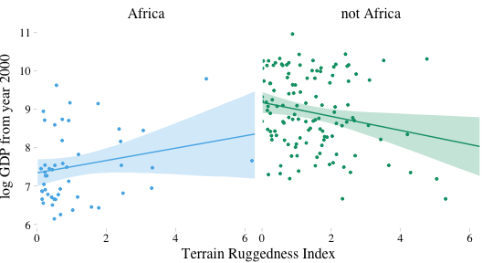
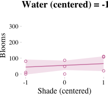
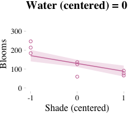
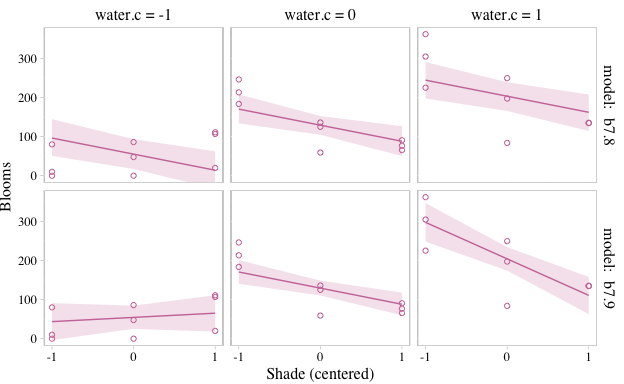
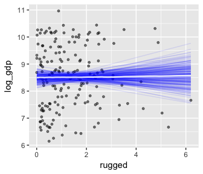
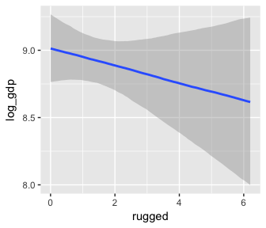
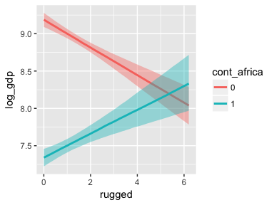
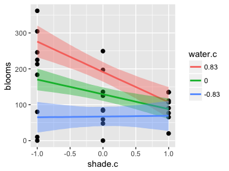
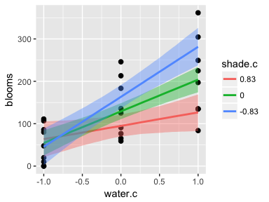

## 7.1. Building an interaction.

Here we load the `rugged` data.


```r
library(rethinking)
data(rugged)
d <- rugged
```

And here we switch out rethinking for brms.


```r
detach(package:rethinking, unload = T)
library(brms)
rm(rugged)
```

We'll continue to use tidyverse-style syntax to wrangle the data.


```r
library(tidyverse)

# make log version of outcome
d <- 
  d %>%
  mutate(log_gdp = log(rgdppc_2000))

# extract countries with GDP data
dd <-
  d %>%
  filter(complete.cases(rgdppc_2000))

# split countries into Africa and not-Africa
d.A1 <-
  dd %>%
  filter(cont_africa == 1)

d.A0 <-
  dd %>%
  filter(cont_africa == 0)
```
 
Here are the first two univariable models, predicting `log_gdp`.


```r
b7.1 <-
  brm(data = d.A1, family = gaussian,
      log_gdp ~ 1 + rugged,
      prior = c(set_prior("normal(8, 100)", class = "Intercept"),
                set_prior("normal(0, 1)", class = "b"),
                set_prior("uniform(0, 10)", class = "sigma")),
      chains = 4, iter = 2000, warmup = 1000, cores = 4)

b7.2 <-
  brm(data = d.A0, family = gaussian,
      log_gdp ~ 1 + rugged,
      prior = c(set_prior("normal(8, 100)", class = "Intercept"),
                set_prior("normal(0, 1)", class = "b"),
                set_prior("uniform(0, 10)", class = "sigma")),
      chains = 4, iter = 2000, warmup = 1000, cores = 4)
```

In the text, McElreath more or less dares us to figure out how to make Figure 7.2. Here's the brms-relevant data processing.


```r
p7.1 <- posterior_samples(b7.1)
p7.2 <- posterior_samples(b7.2)

nd <- 
  tibble(rugged = seq(from = 0, 
                      to = 6.3, 
                      length.out = 30))

fit.7.1 <-
  fitted(b7.1, newdata = nd) %>%
  as_tibble() %>%
  bind_cols(nd)

fit.7.2 <-
  fitted(b7.2, newdata = nd) %>%
  as_tibble() %>%
  bind_cols(nd)

# Here we'll put both in a single data object, with fit.7.1 stacked atop fit.7.2
fit.both <-
  full_join(fit.7.1, fit.7.2) %>%
  mutate(cont_africa = rep(c("Africa", "not Africa"), each = 30))
```

For this chapter, we'll take our plot theme from the [ggthemes package](https://cran.r-project.org/web/packages/ggthemes/index.html), which you can learn more about [here](https://cran.r-project.org/web/packages/ggthemes/vignettes/ggthemes.html).


```r
# install.packages("ggthemes", dependencies = T)
library(ggthemes)
```

Here's the plot code for our version of Figure 7.2.


```r
dd %>%
  mutate(cont_africa = ifelse(cont_africa == 1, "Africa", "not Africa")) %>%
  
  ggplot(aes(x = rugged)) +
  theme_pander() + 
  scale_colour_pander() +
  scale_fill_pander() +
  geom_ribbon(data = fit.both,
              aes(ymin = `2.5%ile`, 
                  ymax = `97.5%ile`,
                  fill = cont_africa),
              alpha = 1/4) +
  geom_line(data = fit.both,
              aes(y = Estimate, 
                  color = cont_africa)) +
  geom_point(aes(y = log_gdp, color = cont_africa),
             size = 2/3) +
  scale_x_continuous(expand = c(0, 0)) +
  labs(x = "Terrain Ruggedness Index",
       y = "log GDP from year 2000") +
  facet_wrap(~cont_africa) +
  theme(text = element_text(family = "Times"),
        legend.position = "none")
```

<!-- -->

### 7.1.1. Adding a dummy variable doesn't work.

Here's our model with all the countries, but without our `cont_africa` dummy.


```r
b7.3 <-
  brm(data = dd, family = gaussian,
      log_gdp ~ 1 + rugged,
      prior = c(set_prior("normal(8, 100)", class = "Intercept"),
                set_prior("normal(0, 1)", class = "b"),
                set_prior("uniform(0, 10)", class = "sigma")),
      iter = 2000, warmup = 1000, cores = 4, chains = 4)
```

Now we'll add the dummy.


```r
b7.4 <-
  brm(data = dd, family = gaussian,
      log_gdp ~ 1 + rugged + cont_africa,
      prior = c(set_prior("normal(8, 100)", class = "Intercept"),
                set_prior("normal(0, 1)", class = "b"),
                set_prior("uniform(0, 10)", class = "sigma")),
      iter = 2000, warmup = 1000, cores = 4, chains = 4)
```

And here we can compare them with information criteria.


```r
waic(b7.3, b7.4)
```

```
##               WAIC    SE
## b7.3        539.47 12.97
## b7.4        476.19 14.85
## b7.3 - b7.4  63.29 14.58
```

```r
loo(b7.3, b7.4)
```

```
##              LOOIC    SE
## b7.3        539.49 12.97
## b7.4        476.27 14.88
## b7.3 - b7.4  63.22 14.61
```

Happily, the WAIC and the LOO are in agreement. The model with the dummy, `b7.4`, fit the data much better. Here are the WAIC model weights.


```r
model_weights(b7.3, b7.4,
              weights = "waic") %>% 
  round(digits = 3)
```

```
## b7.3 b7.4 
##    0    1
```

As in the text, no contest.

Here we'll plot the model for `b7.4`. First, we process the data.


```r
p7.4 <- posterior_samples(b7.4)

nd <- 
  tibble(rugged = rep(seq(from = 0,
                          to = 6.3, 
                          length.out = 30),
                      times = 2),
         cont_africa = rep(0:1, each = 30))

fit.7.4 <-
  fitted(b7.4, newdata = nd) %>%
  as_tibble() %>%
  bind_cols(nd) %>%
  mutate(cont_africa = ifelse(cont_africa == 1, "Africa", "not Africa"))
```

The plot.


```r
dd %>%
  mutate(cont_africa = ifelse(cont_africa == 1, "Africa", "not Africa")) %>%
  
ggplot(aes(x = rugged)) +
  theme_pander() + 
  scale_colour_pander() +
  scale_fill_pander() +
  geom_ribbon(data = fit.7.4,
              aes(ymin = `2.5%ile`, 
                  ymax = `97.5%ile`,
                  fill = cont_africa,
                  group = cont_africa),
              alpha = 1/4) +
  geom_line(data = fit.7.4,
              aes(y = Estimate, 
                  color = cont_africa,
                  group = cont_africa)) +
  geom_point(aes(y = log_gdp, color = cont_africa),
             size = 2/3) +
  scale_x_continuous(expand = c(0, 0)) +
  labs(x = "Terrain Ruggedness Index",
       y = "log GDP from year 2000") +
  theme(text = element_text(family = "Times"),
        legend.position = c(.69, .94),
        legend.title = element_blank(),
        legend.direction = "horizontal")
```

<!-- -->

### 7.1.2. Adding a linear interaction does work.

Yes, it sure does.


```r
b7.5 <-
  brm(data = dd, family = gaussian,
      log_gdp ~ 1 + rugged*cont_africa,
      prior = c(set_prior("normal(8, 100)", class = "Intercept"),
                set_prior("normal(0, 1)", class = "b"),
                set_prior("uniform(0, 10)", class = "sigma")),
      chains = 4, iter = 2000, warmup = 1000, cores = 4)
```

For kicks, we'll just use the LOO to compare the last three models.


```r
loo(b7.3, b7.4, b7.5,
    cores = 4)  # We can speed things up using the `cores` argument
```

```
##              LOOIC    SE
## b7.3        539.49 12.97
## b7.4        476.27 14.88
## b7.5        469.52 14.56
## b7.3 - b7.4  63.22 14.61
## b7.3 - b7.5  69.97 14.64
## b7.4 - b7.5   6.75  6.00
```

And we can weigh the models based on the LOO rather than the WAIC, too.


```r
model_weights(b7.3, b7.4, b7.5,
              weights = "loo") %>% 
  round(digits = 3)
```

```
##  b7.3  b7.4  b7.5 
## 0.000 0.033 0.967
```

##### Overthinking: Conventional form of interaction.

Instead of the `y ~ 1 + x1*x2` approach, which will work fine with `brm()`, you can use this syntax.


```r
b7.5b <-
  brm(data = dd, family = gaussian,
      log_gdp ~ 1 + rugged + cont_africa + rugged:cont_africa,
      prior = c(set_prior("normal(8, 100)", class = "Intercept"),
                set_prior("normal(0, 1)", class = "b"),
                set_prior("uniform(0, 10)", class = "sigma")),
      chains = 4, iter = 2000, warmup = 1000, cores = 4)
```

Same model, same WAIC and LOO:


```r
waic(b7.5, b7.5b)
```

```
##                WAIC    SE
## b7.5         469.36 14.54
## b7.5b        469.17 14.57
## b7.5 - b7.5b   0.19  0.11
```

```r
loo(b7.5, b7.5b)
```

```
##               LOOIC    SE
## b7.5         469.52 14.56
## b7.5b        469.30 14.59
## b7.5 - b7.5b   0.22  0.14
```

### 7.1.3. Plotting the interaction.

Here's our prep work for the figure.


```r
p7.5 <- posterior_samples(b7.5)

nd <- 
  tibble(rugged = rep(seq(from = 0, 
                          to = 6.3, 
                          length.out = 30),
                      times = 2),
         cont_africa = rep(0:1, each = 30))

fit.7.5 <-
  fitted(b7.5, newdata = nd) %>%
  as_tibble() %>%
  bind_cols(nd) %>%
  mutate(cont_africa = ifelse(cont_africa == 1, "Africa", "not Africa"))
```

And here's the code for our version of Figure 7.4.


```r
dd %>%
  mutate(cont_africa = ifelse(cont_africa == 1, "Africa", "not Africa")) %>%
  
ggplot(aes(x = rugged)) +
  theme_pander() + 
  scale_colour_pander() +
  scale_fill_pander() +
  geom_ribbon(data = fit.7.5,
              aes(ymin = `2.5%ile`, 
                  ymax = `97.5%ile`,
                  fill = cont_africa,
                  group = cont_africa),
              alpha = 1/4) +
  geom_line(data = fit.7.5,
              aes(y = Estimate, 
                  color = cont_africa,
                  group = cont_africa)) +
  geom_point(aes(y = log_gdp, color = cont_africa),
             size = 2/3) +
  scale_x_continuous(expand = c(0, 0)) +
  labs(x = "Terrain Ruggedness Index",
       y = "log GDP from year 2000") +
  theme(text = element_text(family = "Times"),
        legend.position = "none") +
  facet_wrap(~cont_africa)
```

<!-- -->

#### 7.1.4.1. Parameters change meaning.

We have already extracted samples from `b7.5`, but it doesn't hurt to repeat the code.


```r
p7.5 <-
  posterior_samples(b7.5) 

p7.5 %>%
  mutate(gamma_Africa = b_rugged + `b_rugged:cont_africa`,
         gamma_notAfrica = b_rugged) %>%
  select(gamma_Africa:gamma_notAfrica) %>%
  gather(key, value) %>%
  group_by(key) %>%
  summarise(mean = mean(value))
```

```
## # A tibble: 2 x 2
##   key               mean
##   <chr>            <dbl>
## 1 gamma_Africa     0.164
## 2 gamma_notAfrica -0.184
```

And here is our version of Figure 7.5.


```r
p7.5 %>%
  mutate(gamma_Africa = b_rugged + `b_rugged:cont_africa`,
         gamma_notAfrica = b_rugged) %>%
  select(gamma_Africa:gamma_notAfrica) %>%
  gather(key, value) %>%
  
  ggplot(aes(x = value, group = key, color = key, fill = key)) +
  theme_pander() + 
  scale_colour_pander() +
  scale_fill_pander() +
  geom_density(alpha = 1/4) +
  scale_x_continuous(expression(gamma), expand = c(0, 0)) +
  scale_y_continuous(NULL, breaks = NULL) +
  labs(title = "Terraine Ruggedness slopes",
       subtitle = "Blue = African nations, Green = others") +
  theme(text = element_text(family = "Times"),
        legend.position = "none")
```

<!-- -->

What proportion of these differences is below zero?


```r
p7.5 %>%
  mutate(gamma_Africa = b_rugged + `b_rugged:cont_africa`,
         gamma_notAfrica = b_rugged,
         diff = gamma_Africa -gamma_notAfrica) %>%
  summarise(Proportion_of_the_difference_below_0 = sum(diff < 0)/length(diff))
```

```
##   Proportion_of_the_difference_below_0
## 1                              0.00375
```

Here is our version of McElreath's Figure 7.6.


```r
nd <- 
  tibble(rugged = rep(range(dd$rugged),
                      times = 2),
         cont_africa = rep(0:1, each = 2),
         ox = rep(c(-0.05, 0.05), times = 2))

fit.7.5 <-
  fitted(b7.5, newdata = nd) %>%
  as_tibble() %>%
  bind_cols(nd)

dd %>% 
  mutate(ox = ifelse(rugged > median(rugged), 0.05, -0.05),
         cont_africa = cont_africa + ox) %>%
  select(cont_africa, everything()) %>%

ggplot(aes(x = cont_africa)) +
  theme_pander() +
  scale_colour_pander() +
  scale_fill_pander() +
  geom_ribbon(data = fit.7.5,
              aes(ymin = `2.5%ile`, 
                  ymax = `97.5%ile`,
                  fill = factor(ox),
                  group = factor(ox)),
              alpha = 1/4) +
  geom_line(data = fit.7.5,
              aes(y = Estimate,
                  color = factor(ox),
                  group = factor(ox),
                  linetype = factor(ox))) +
  geom_point(aes(y = log_gdp, color = factor(ox)),
             alpha = 1/2, shape = 1) +
  scale_x_continuous(breaks = 0:1, 
                     labels = c("other", "Africa")) +
  coord_cartesian(xlim = c(-.2, 1.2)) +
  labs(x = "Continent",
       y = "log GDP from year 2000") +
  theme(text = element_text(family = "Times"),
        legend.position = "none")
```

<!-- -->

## 7.3. Continuous interactions

### 7.3.1. The data.

Look at the `tulips`.


```r
library(rethinking)
data(tulips)
d <- tulips
str(d)
```

```
## 'data.frame':	27 obs. of  4 variables:
##  $ bed   : Factor w/ 3 levels "a","b","c": 1 1 1 1 1 1 1 1 1 2 ...
##  $ water : int  1 1 1 2 2 2 3 3 3 1 ...
##  $ shade : int  1 2 3 1 2 3 1 2 3 1 ...
##  $ blooms: num  0 0 111 183.5 59.2 ...
```

Load brms.


```r
detach(package:rethinking, unload = T)
library(brms)
rm(tulips)
```

Here we continue with McElreath's very flat priors for the multivariable and interaction models.


```r
b7.6 <-
  brm(data = d, family = gaussian,
      blooms ~ 1 + water + shade,
      prior = c(set_prior("normal(0, 100)", class = "Intercept"),
                set_prior("normal(0, 100)", class = "b"),
                set_prior("uniform(0, 100)", class = "sigma")),
      iter = 2000, warmup = 1000, cores = 4, chains = 4)
```

```
## Warning: It appears as if you have specified an upper bounded prior on a parameter that has no natural upper bound.
## If this is really what you want, please specify argument 'ub' of 'set_prior' appropriately.
## Warning occurred for prior 
## sigma ~ uniform(0, 100)
```

```
## Warning: There were 47 divergent transitions after warmup. Increasing adapt_delta above 0.8 may help. See
## http://mc-stan.org/misc/warnings.html#divergent-transitions-after-warmup
```

```
## Warning: Examine the pairs() plot to diagnose sampling problems
```

```r
b7.7 <- update(b7.6, 
               formula = blooms ~ 1 + water + shade + water:shade)
```

```
## Warning: There were 7 divergent transitions after warmup. Increasing adapt_delta above 0.8 may help. See
## http://mc-stan.org/misc/warnings.html#divergent-transitions-after-warmup

## Warning: Examine the pairs() plot to diagnose sampling problems
```

Note our use of the `update()` function. It can come in real handy when all you want is to make a mild adjustment to an existing model. Not only is it compact, it often cuts out the compilation time altogether.

Much like in the text, these models yielded divergent transitions. Here, we'll try to combat them by following Stan's advice and "[increase] adapt_delta above 0.8." While we're at it, we'll put better priors on $\sigma$.


```r
b7.6 <-
  brm(data = d, family = gaussian,
      blooms ~ 1 + water + shade,
      prior = c(set_prior("normal(0, 100)", class = "Intercept"),
                set_prior("normal(0, 100)", class = "b"),
                set_prior("cauchy(0, 10)", class = "sigma")),
      iter = 2000, warmup = 1000, cores = 4, chains = 4,
      control = list(adapt_delta = 0.9))

b7.7 <- update(b7.6, 
               formula = blooms ~ 1 + water + shade + water:shade)
```

Increasing `adapt_delta` did the trick. Instead of `coeftab()`, we can also use `posterior_summary()`, which gets us most of the way there.


```r
posterior_summary(b7.6) %>% round(digits = 2)
```

```
##             Estimate Est.Error 2.5%ile 97.5%ile
## b_Intercept    60.32     42.51  -23.81   140.96
## b_water        74.27     14.31   46.34   102.65
## b_shade       -40.84     14.50  -69.12   -11.67
## sigma          61.40      8.98   46.93    81.69
## lp__         -169.73      1.45 -173.44  -167.86
```

```r
posterior_summary(b7.7) %>% round(digits = 2)
```

```
##               Estimate Est.Error 2.5%ile 97.5%ile
## b_Intercept    -108.99     62.14 -227.38    16.08
## b_water         160.37     28.83  101.98   215.21
## b_shade          44.47     28.77  -13.38   100.07
## b_water:shade   -43.30     13.27  -68.60   -16.80
## sigma            50.08      7.82   37.34    68.14
## lp__           -170.65      1.73 -174.90  -168.36
```

This is an example where HMC yielded point estimates notably different from MAP. However, look at the size of those posterior standard deviations (i.e., Est.Error)! The MAP estimates are well within a fraction of those *SD*s.

Anyway, let's look at WAIC.


```r
waic(b7.6, b7.7)
```

```
##               WAIC   SE
## b7.6        303.83 7.63
## b7.7        293.49 7.91
## b7.6 - b7.7  10.34 5.38
```

### 7.3.3. Center and re-estimate.

Here's a tidyverse way to center the predictors.


```r
d <-
  d %>%
  mutate(shade.c = shade - mean(shade),
         water.c = water - mean(water))
```

Refitting the models with our shiny new centered predictors.


```r
b7.8 <-
  brm(data = d, family = gaussian,
      blooms ~ 1 + water.c + shade.c,
      prior = c(set_prior("normal(130, 100)", class = "Intercept"),
                set_prior("normal(0, 100)", class = "b"),
                set_prior("cauchy(0, 10)", class = "sigma")),
      chains = 4, iter = 2000, warmup = 1000, cores = 4,
      control = list(adapt_delta = 0.9))

b7.9 <- update(b7.8, 
               formula = blooms ~ 1 + water.c + shade.c + water.c:shade.c)
```


```r
posterior_summary(b7.8) %>% round(digits = 2)
```

```
##             Estimate Est.Error 2.5%ile 97.5%ile
## b_Intercept   128.95     11.70  105.98   152.08
## b_water.c      74.40     14.33   46.26   102.49
## b_shade.c     -40.66     14.70  -69.25   -12.40
## sigma          61.59      9.25   47.38    82.72
## lp__         -168.93      1.54 -172.79  -167.05
```

```r
posterior_summary(b7.9) %>% round(digits = 2)
```

```
##                   Estimate Est.Error 2.5%ile 97.5%ile
## b_Intercept         129.01      9.81  109.55   148.49
## b_water.c            74.68     11.76   51.43    97.34
## b_shade.c           -40.99     11.48  -63.31   -18.27
## b_water.c:shade.c   -51.89     14.13  -78.81   -24.16
## sigma                49.64      7.58   37.41    67.30
## lp__               -168.58      1.71 -172.77  -166.30
```

And okay fine, if you really want a `coeftab()`-like summary, here's a grotesque way to do it.


```r
# First, we reformat b7.8
posterior_summary(b7.8) %>% 
  data.frame() %>% 
  rownames_to_column() %>% 
  # Now we bind the rows of b7.9 to it
  bind_rows(
    posterior_summary(b7.9) %>% 
      data.frame() %>%
      rownames_to_column()
  ) %>% 
  # Miscellaneous wrangling
  mutate(model = c(rep("b7.8", times = 5),
                   rep("b7.9", times = 6))) %>% 
  select(rowname, Estimate, model) %>% 
  filter(rowname != "lp__") %>% 
  spread(key = model, value = Estimate) %>% 
  rename(parameter = rowname) %>% 
  mutate_if(is.double, round, digits = 2)
```

```
##           parameter   b7.8   b7.9
## 1       b_Intercept 128.95 129.01
## 2         b_shade.c -40.66 -40.99
## 3         b_water.c  74.40  74.68
## 4 b_water.c:shade.c     NA -51.89
## 5             sigma  61.59  49.64
```

Anyway, centering helped a lot. Now, not only do the results in the text match up better than those from Stan, but the Est.Error values are uniformly smaller.

#### 7.3.3.2. Estimates changed less across models.


```r
k <- fixef(b7.7)
k[1] + k[2]*2 + k[3]*2 + k[4]*2*2
```

```
## [1] 127.5043
```


```r
k <- fixef(b7.9)
k[1] + k[2]*0 + k[3]*0 + k[4]*0*0
```

```
## [1] 129.0101
```


```r
print(b7.9)
```

```
##  Family: gaussian 
##   Links: mu = identity; sigma = identity 
## Formula: blooms ~ water.c + shade.c + water.c:shade.c 
##    Data: d (Number of observations: 27) 
## Samples: 4 chains, each with iter = 2000; warmup = 1000; thin = 1; 
##          total post-warmup samples = 4000
##     ICs: LOO = NA; WAIC = NA; R2 = NA
##  
## Population-Level Effects: 
##                 Estimate Est.Error l-95% CI u-95% CI Eff.Sample Rhat
## Intercept         129.01      9.81   109.55   148.49       4000 1.00
## water.c            74.68     11.76    51.43    97.34       4000 1.00
## shade.c           -40.99     11.48   -63.31   -18.27       4000 1.00
## water.c:shade.c   -51.89     14.13   -78.81   -24.16       4000 1.00
## 
## Family Specific Parameters: 
##       Estimate Est.Error l-95% CI u-95% CI Eff.Sample Rhat
## sigma    49.64      7.58    37.41    67.30       4000 1.00
## 
## Samples were drawn using sampling(NUTS). For each parameter, Eff.Sample 
## is a crude measure of effective sample size, and Rhat is the potential 
## scale reduction factor on split chains (at convergence, Rhat = 1).
```

### 7.3.4. Plotting implied predictions.

Now we're ready for the bottom row of Figure 7.7. Here's our variation on McElreath's tryptych loop code, adjusted for brms and ggplot2.


```r
# loop over values of water.c and plot predictions
shade.seq <- -1:1

for(w in -1:1){
  # defining the subset of the original data
  dt <- d[d$water.c == w, ]
  # defining our new data
  nd <- tibble(water.c = w, shade.c = shade.seq)
  # using our sampling skills, like before
  fit.7.9 <- fitted(b7.9, newdata = nd) %>%
    as_tibble() %>%
    bind_cols(nd)
  
  # specifying our custom plot
  fig <- ggplot() +
    theme_pander() + 
    geom_ribbon(data = fit.7.9, 
                aes(x = shade.c,
                    ymin = `2.5%ile`,
                    ymax = `97.5%ile`), 
                fill = "#CC79A7", alpha = 1/5) +
    geom_line(data = fit.7.9, aes(x = shade.c, y = Estimate), 
              color = "#CC79A7") +
    geom_point(data = dt, aes(x = shade.c, y = blooms),
               shape = 1, color = "#CC79A7") +
    coord_cartesian(xlim = range(d$shade.c), 
                    ylim = range(d$blooms)) +
    scale_x_continuous(breaks = c(-1, 0, 1)) +
    labs(x = "Shade (centered)", y = "Blooms", 
         title = paste("Water (centered) =", w)) +
    theme(text = element_text(family = "Times"))
  
  # plotting that joint
  plot(fig)
}
```

<!-- --><!-- --><!-- -->

But we don't necessarily need a loop. We can achieve all of McElreath's Figure 7.7 with `fitted()`, a some data wrangling, and a little help from `ggplot2::facet_grid()`.


```r
# fitted() for model b7.8
fitted(b7.8) %>%
  as_tibble() %>%
  # adding fitted() for model b7.9
  bind_rows(
    fitted(b7.9) %>% 
      as_tibble()
  ) %>% 
  # We'll want to index the models
  mutate(fit  = rep(c("b7.8", "b7.9"), each = 27)) %>% 
  # Here we add the data, d
  bind_cols(bind_rows(d, d)) %>% 
  # These will come in handy for ggplot2::facet_grid()
  mutate(x_grid = paste("water.c =", water.c),
         y_grid = paste("model: ", fit)) %>% 
  
  ggplot(aes(x = shade.c)) +
  geom_ribbon(aes(ymin = `2.5%ile`,
                  ymax = `97.5%ile`), 
              fill = "#CC79A7", alpha = 1/5) +
  geom_line(aes(y = Estimate), 
            color = "#CC79A7") +
  geom_point(aes(y = blooms, group = x_grid), 
             shape = 1, color = "#CC79A7") +
  coord_cartesian(xlim = range(d$shade.c), 
                  ylim = range(d$blooms)) +
  scale_x_continuous(breaks = c(-1, 0, 1)) +
  labs(x = "Shade (centered)", y = "Blooms") +
  theme_pander() + 
  theme(text = element_text(family = "Times"),
        panel.background = element_rect(color = "black")) +
  facet_grid(y_grid ~ x_grid)
```

<!-- -->

##### Bonus: `marginal_effects()`

The brms package includes the `marginal_effects()` function as a convenient way to look at simple effects and two-way interactions. Recall the simple univariable model, `b7.3`:


```r
b7.3$formula
```

```
## log_gdp ~ 1 + rugged
```

We can look at the regression line and its percentile-based intervals like so:


```r
marginal_effects(b7.3)
```

<!-- -->

If we nest `marginal_effects()` within `plot()` with a `points = T` argument, we can add the original data to the figure.


```r
plot(marginal_effects(b7.3), points = T)
```

<!-- -->

We can further customize the plot. For example, we can replace the intervals with a spaghetti plot. While we're at it, we can use `point_args` to adjust the `geom_jitter()` parameters.


```r
plot(marginal_effects(b7.3,
                      spaghetti = T, nsamples = 200),
     points = T,
     point_args = c(alpha = 1/2, size = 1))
```

<!-- -->

With multiple predictors, things get more complicated. Consider our multivariable, non-interaction model, `b7.4`.


```r
b7.4$formula
```

```
## log_gdp ~ 1 + rugged + cont_africa
```

```r
marginal_effects(b7.4)
```

<!-- --><!-- -->

We got one plot for each predictor, controlling the other predictor at zero. Note how the plot for `cont_africa` treated it as a continuous variable. This is because the variable was saved as an integer in the original data set:


```r
b7.4$data %>% 
  glimpse()
```

```
## Observations: 170
## Variables: 3
## $ log_gdp     <dbl> 7.492609, 8.216929, 9.933263, 9.407032, 7.792343, ...
## $ rugged      <dbl> 0.858, 3.427, 0.769, 0.775, 2.688, 0.006, 0.143, 3...
## $ cont_africa <int> 1, 0, 0, 0, 0, 0, 0, 0, 0, 1, 0, 1, 1, 0, 0, 0, 0,...
```

One way to fix that is to adjust the data set and refit the model. 


```r
d_factor <-
  b7.4$data %>% 
  mutate(cont_africa = factor(cont_africa))

b7.4_factor <- update(b7.4, newdata = d_factor)
```

Using the `update()` syntax often speeds up the re-fitting process.


```r
marginal_effects(b7.4_factor)
```

<!-- --><!-- -->

Now our second marginal plot more clearly expresses the `cont_africa` predictor as categorical.

Things get more complicated with the interaction model, `b7.5`.


```r
b7.5$formula
```

```
## log_gdp ~ 1 + rugged * cont_africa
```

```r
marginal_effects(b7.5)
```

<!-- --><!-- --><!-- -->

The `marginal_effects()` function defaults to expressing interactions such that the first variable in the term--in this case, `rugged`--is on the x axis and the second variable in the term--`cont_africa`, treated as an integer--is depicted in three lines corresponding its mean and its mean +/- one standard deviation. This is great for continuous variables, but incoherent for categorical ones. The fix is, you guessed it, to refit the model after adjusting the data.


```r
d_factor <-
  b7.5$data %>% 
  mutate(cont_africa = factor(cont_africa))

b7.5_factor <- update(b7.5, newdata = d_factor)
```

Just for kicks, we'll use `probs = c(.25, .75)` to return [50% intervals](http://andrewgelman.com/2016/11/05/why-i-prefer-50-to-95-intervals/), rather than the conventional 95%.


```r
marginal_effects(b7.5_factor,
                 probs = c(.25, .75))
```

<!-- --><!-- --><!-- -->

With the `effects` argument, we can just return the interaction effect, which is where all the action's at. While we're at it, we'll use `plot()` to change some of the settings.


```r
plot(marginal_effects(b7.5_factor,
                      effects = "rugged:cont_africa", 
                      spaghetti = T, nsamples = 150),
     points = T,
     point_args = c(alpha = 2/3, size = 1), mean = F)
```

<!-- -->

Note, the ordering of the variables matters for the interaction term. Consider our interaction model for the tulips data.


```r
b7.9$formula
```

```
## blooms ~ water.c + shade.c + water.c:shade.c
```

The plot tells a slightly different story, depending on whether you specify `effects = "shade.c:water.c"` or `effects = "water.c:shade.c"`.


```r
plot(marginal_effects(b7.9, 
                      effects = "shade.c:water.c"),
     points = T)
```

<!-- -->

```r
plot(marginal_effects(b7.9, 
                      effects = "water.c:shade.c"),
     points = T)
```

<!-- -->

One might want to evaluate the effects of the second term in the interaction--`water.c`, in this case--at values other than the mean and the mean +/- one standard deviation. When we reproduced the bottom row of Figure 7.7, we expressed the interaction based on values -1, 0, and 1 for `water.c`. We can do that, here, by using the `int_conditions` argument. It expects a list, so we'll put our desired `water.c` values in just that.


```r
ic <- 
  list(water.c = c(-1, 0, 1))

plot(marginal_effects(b7.9, 
                      effects = "shade.c:water.c",
                      int_conditions = ic),
     points = T)
```

<!-- -->


Note. The analyses in this document were done with:

* R           3.4.4
* RStudio     1.1.442
* rmarkdown   1.9
* rethinking  1.59
* brms        2.2.0
* rstan       2.17.3
* tidyverse   1.2.1 
* ggthemes    3.4.0

## Reference

McElreath, R. (2016). *Statistical rethinking: A Bayesian course with examples in R and Stan.* Chapman & Hall/CRC Press.
