For our plots in this document, we'll use a custom theme. The color palette will come from the pearl_earring palette of the [dutchmasters package](https://github.com/EdwinTh/dutchmasters). You can learn more about the original painting, Vermeer's *Girl with a Pearl Earring*, [here](https://en.wikipedia.org/wiki/Girl_with_a_Pearl_Earring).


```r
# devtools::install_github("EdwinTh/dutchmasters")
library(dutchmasters)

dutchmasters$pearl_earring
```

```
##         red(lips)              skin      blue(scarf1)      blue(scarf2)      white(colar) 
##         "#A65141"         "#E7CDC2"         "#80A0C7"         "#394165"         "#FCF9F0" 
##       gold(dress)      gold(dress2) black(background)      grey(scarf3)    yellow(scarf4) 
##         "#B1934A"         "#DCA258"         "#100F14"         "#8B9DAF"         "#EEDA9D" 
##                   
##         "#E8DCCF"
```

We'll name our custom theme `theme_pearl_earring`. Here we make it.


```r
library(tidyverse)

theme_pearl_earring <-
  theme(text       = element_text(color = "#E8DCCF", family = "Courier"),
        strip.text = element_text(color = "#E8DCCF", family = "Courier"),
        axis.text  = element_text(color = "#E8DCCF"),
        axis.ticks = element_line(color = "#E8DCCF"),
        line       = element_line(color = "#E8DCCF"),
        plot.background   = element_rect(fill = "#100F14", color = "transparent"),
        panel.background  = element_rect(fill = "#100F14", color = "#E8DCCF"),
        strip.background  = element_rect(fill = "#100F14", color = "transparent"),
        panel.grid = element_blank(),
        legend.background = element_rect(fill = "#100F14", color = "transparent"),
        legend.key        = element_rect(fill = "#100F14", color = "transparent"),
        axis.line = element_blank())
```

## 13.1. Varying slopes by construction

### 13.1.1. Simulate the population.


```r
a <- 3.5        # average morning wait time
b <- (-1)       # average difference afternoon wait time
sigma_a <- 1    # std dev in intercepts
sigma_b <- 0.5  # std dev in slopes
rho <- (-0.7)   # correlation between intercepts and slopes

# The next three lines of code simply combine the terms, above
Mu <- c(a, b)

cov_ab <- sigma_a*sigma_b*rho
Sigma  <- matrix(c(sigma_a^2, cov_ab, 
                   cov_ab, sigma_b^2), ncol = 2)

# If you haven't used matirx() before, you might get a sense of the elements with this
matrix(c(1, 2, 
         3, 4), nrow = 2, ncol = 2)
```

```
##      [,1] [,2]
## [1,]    1    3
## [2,]    2    4
```


```r
sigmas <- c(sigma_a, sigma_b)       # standard deviations
Rho <- matrix(c(1, rho, 
                rho, 1), nrow = 2)  # correlation matrix

# now matrix multiply to get covariance matrix
Sigma <- diag(sigmas) %*% Rho %*% diag(sigmas)

N_cafes <- 20

library(MASS)
set.seed(5)  # used to replicate example
vary_effects <- mvrnorm(N_cafes, Mu, Sigma)
```

*What's the distribution of `a_cafe` and `b_cafe`?*, you might ask.


```r
tibble(a_cafe = vary_effects[ , 1],
       b_cafe = vary_effects[ , 2]) %>%
  
  ggplot(aes(x = a_cafe, y = b_cafe)) +
  geom_point(color = "#80A0C7") +
  geom_rug(color = "#8B9DAF", size = 1/7) +
  scale_x_continuous(expand = c(.5, .5)) +
  theme_pearl_earring
```

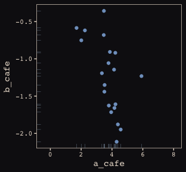<!-- -->

### 13.1.2. Simulate observations.

Before we simulate our observations, we'll need to detach the MASS package and reload the tidyverse in order to use the `tidyverse::select()` function.


```r
detach(package:MASS, unload = T)
library(tidyverse)

N_visits <- 10
sigma <- 0.5  # std dev within cafes

set.seed(5)  # used to replicate example
d <-
  tibble(cafe = rep(1:N_cafes, each = N_visits),
         afternoon = rep(0:1, N_visits*N_cafes/2),
         mu = rep(vary_effects[ , 1], each = N_visits) + rep(vary_effects[ , 2], each = N_visits)*afternoon,
         wait = rnorm(N_visits*N_cafes, mu, sigma)) %>%
  select(-mu)
```

Here's a look at the data.


```r
d %>%
  glimpse()
```

```
## Observations: 200
## Variables: 3
## $ cafe      <int> 1, 1, 1, 1, 1, 1, 1, 1, 1, 1, 2, 2, 2, 2, 2, 2, 2, 2, 2, 2, 3, 3, 3, 3, 3, 3,...
## $ afternoon <int> 0, 1, 0, 1, 0, 1, 0, 1, 0, 1, 0, 1, 0, 1, 0, 1, 0, 1, 0, 1, 0, 1, 0, 1, 0, 1,...
## $ wait      <dbl> 3.8035347, 3.3067856, 3.5962165, 2.6496773, 5.0796829, 2.3131520, 3.9878792, ...
```

Now we've finally simulated our data, we are ready to make our version of Figure 13.1., from way back on page 388.


```r
d %>%
  mutate(afternoon = ifelse(afternoon == 0, "M", "A"),
         day = rep(rep(1:5, each = 2), times = N_cafes),
         x_order = rep(1:10, times = N_cafes)) %>%
  filter(cafe %in% c(3, 5)) %>%
  mutate(cafe = ifelse(cafe == 3, "cafe #3", "cafe #5")) %>%
  
  ggplot(aes(x = x_order, y = wait, group = day)) +
  geom_point(aes(color = afternoon), size = 2) +
  scale_color_manual(values = c("#80A0C7", "#EEDA9D")) +
  geom_line(color = "#8B9DAF") +
  scale_x_continuous(breaks = 1:10,
                     labels = rep(c("M", "A"), times = 5)) +
  coord_cartesian(ylim = 0:8) +
  labs(x = NULL, y = "wait time in minutes") +
  facet_wrap(~cafe, ncol = 1) +
  theme_pearl_earring +
  theme(legend.position = "none")
```

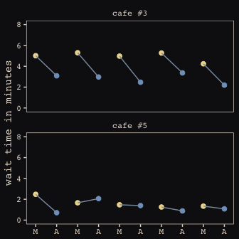<!-- -->

Here are the simulations for Figure 13.3. 


```r
library(rethinking)

set.seed(133)
R_1 <- 
  rlkjcorr(1e5, K = 2, eta = 1) %>%
  as_tibble()

set.seed(133)
R_2 <- 
  rlkjcorr(1e5, K = 2, eta = 2) %>%
  as_tibble()

set.seed(133)
R_4 <- 
  rlkjcorr(1e5, K = 2, eta = 4) %>%
  as_tibble()
```

The code for Figure 13.3.


```r
ggplot(data = R_1, aes(x = V2)) +
  geom_density(color = "transparent", fill = "#DCA258", alpha = 2/3) +
  geom_density(data = R_2,
               color = "transparent", fill = "#FCF9F0", alpha = 2/3) +
  geom_density(data = R_4,
               color = "transparent", fill = "#394165", alpha = 2/3) +
  geom_text(data = tibble(x = c(.83, .62, .46),
                          y = c(.54, .74, 1),
                          label = c("eta = 1", "eta = 2", "eta = 4")),
            aes(x = x, y = y, label = label),
            color = "#A65141", family = "Courier") +
  scale_y_continuous(NULL, breaks = NULL) +
  labs(x = "correlation") +
  theme_pearl_earring
```

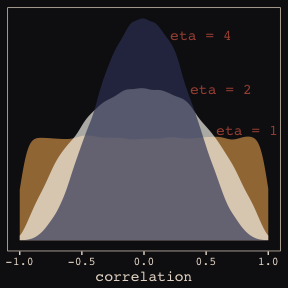<!-- -->

Our first model has both varying intercepts and `afternoon` slopes.


```r
detach(package:rethinking, unload = T)
library(brms)

b13.1 <- 
  brm(data = d, family = gaussian,
      wait ~ 1 + afternoon + (1 + afternoon | cafe),
      prior = c(set_prior("normal(0, 10)", class = "Intercept"),
                set_prior("normal(0, 10)", class = "b"),
                set_prior("cauchy(0, 2)", class = "sd"),
                set_prior("cauchy(0, 2)", class = "sigma"),
                set_prior("lkj(2)", class = "cor")),
      iter = 5000, warmup = 2000, chains = 2, cores = 2)
```

Figure 13.4.


```r
post <- posterior_samples(b13.1)

post %>%
  ggplot(aes(x = cor_cafe__Intercept__afternoon)) +
  geom_density(data = R_2, aes(x = V2),
               color = "transparent", fill = "#EEDA9D", alpha = 1/2) +
  geom_density(color = "transparent", fill = "#A65141", alpha = 3/4) +
  annotate("text", label = "posterior", 
           x = -0.2, y = 2.2, 
           color = "#A65141", family = "Courier") +
  annotate("text", label = "prior", 
           x = 0, y = 0.85, 
           color = "#EEDA9D", alpha = 2/3, family = "Courier") +
  scale_y_continuous(NULL, breaks = NULL) +
  labs(x = "correlation") +
  theme_pearl_earring
```

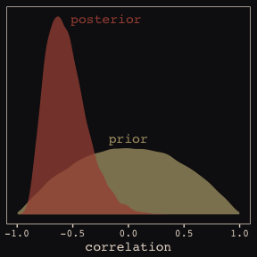<!-- -->

McElreath then depicts multidimensional shrinkage by plotting the posterior mean of the varying effects compared to their raw, unpooled estimated. With brms, we can get the `cafe`-specific intercepts and `afternoon` slopes with `coef()`, which returns a three-dimensional list.


```r
# coef(b13.1) %>% glimpse()

coef(b13.1)
```

```
## $cafe
## , , Intercept
## 
##    Estimate Est.Error     Q2.5    Q97.5
## 1  4.075301 0.2076221 3.667609 4.476800
## 2  1.928644 0.2105455 1.520413 2.336736
## 3  4.826806 0.2090999 4.413528 5.235462
## 4  3.474604 0.2084065 3.061358 3.886869
## 5  1.768761 0.2078247 1.358039 2.172118
## 6  4.390787 0.2028014 3.994605 4.787145
## 7  3.246839 0.2064046 2.843855 3.657753
## 8  4.011674 0.2050717 3.608489 4.416723
## 9  4.245052 0.2050112 3.847935 4.654944
## 10 3.705574 0.2072637 3.298059 4.117676
## 11 2.161221 0.2095717 1.753582 2.572335
## 12 4.030820 0.2044885 3.637823 4.424505
## 13 4.086252 0.2067753 3.679142 4.492835
## 14 3.592129 0.2054746 3.182342 3.993893
## 15 4.267935 0.2090173 3.859141 4.688486
## 16 3.482625 0.2034888 3.077644 3.877535
## 17 4.036431 0.2094390 3.627148 4.450306
## 18 5.841558 0.2102477 5.431020 6.266292
## 19 3.774796 0.2130584 3.360769 4.194452
## 20 3.857494 0.2079851 3.454280 4.271484
## 
## , , afternoon
## 
##      Estimate Est.Error      Q2.5       Q97.5
## 1  -1.4069411 0.2605220 -1.918196 -0.89831965
## 2  -0.9514385 0.2782738 -1.500248 -0.40594489
## 3  -1.9005158 0.2723170 -2.442507 -1.37342066
## 4  -1.1979593 0.2640703 -1.707325 -0.68504506
## 5  -0.5713962 0.2783383 -1.112205 -0.01217315
## 6  -1.5018655 0.2602791 -2.013472 -0.99189333
## 7  -1.0504552 0.2630336 -1.556957 -0.53499981
## 8  -1.7304811 0.2732432 -2.267695 -1.20185598
## 9  -1.5735085 0.2609814 -2.097229 -1.05933566
## 10 -1.0202823 0.2644250 -1.522908 -0.48723541
## 11 -0.4804304 0.2803975 -1.019017  0.06593263
## 12 -1.2627023 0.2574419 -1.758661 -0.75278830
## 13 -1.8183958 0.2768765 -2.366120 -1.29006901
## 14 -1.6290497 0.2715045 -2.161747 -1.10565368
## 15 -1.6868986 0.2689300 -2.229461 -1.17445519
## 16 -0.9604794 0.2589823 -1.459561 -0.45064024
## 17 -0.6823684 0.2825336 -1.220966 -0.12266350
## 18 -1.5500814 0.2793526 -2.087822 -0.99155505
## 19 -0.9156619 0.2672612 -1.418125 -0.37101264
## 20 -0.9496804 0.2756230 -1.477535 -0.39599778
```

Here's the code to extract the relevant elements from the `coef()` list, convert them to a tibble, and add the `cafe` index.


```r
partially_pooled_params <-
  # With this line we select each of the 20 cafe's posterior mean (i.e., Estimate) for both `Intercept` and `afternoon`
  coef(b13.1)$cafe[ , 1, 1:2] %>%
  as_tibble() %>%               # Converting the two vectors to a tibble
  rename(Slope = afternoon) %>%
  mutate(cafe = 1:nrow(.)) %>%  # Adding the `cafe` index
  select(cafe, everything())    # simply moving `cafe` to the left-most column of the tibble
```

Like McElreath, we'll compute the unpooled estimates directly from the data.


```r
# compute unpooled estimates directly from data
un_pooled_params <-
  d %>%
  # With these two lines, we compute the mean value for each cafe's wait time in the morning and then the afternoon.
  group_by(afternoon, cafe) %>%
  summarise(mean = mean(wait)) %>%
  ungroup() %>%  # Ungrouping allows us to alter afternoon, one of the grouping variables
  mutate(afternoon = ifelse(afternoon == 0, "Intercept", "Slope")) %>%
  spread(key = afternoon, value = mean) %>%  # using spread() just as in the previous block
  mutate(Slope = Slope - Intercept)          # Finally, here's our slope!

# Here we combine the partially-pooled and unpooled means into a single data object, which will make plotting easier.
params <-
  # bind_rows() will stack the second tibble below the first
  bind_rows(partially_pooled_params, un_pooled_params) %>%
  mutate(pooled = rep(c("partially", "not"), each = nrow(.)/2))  # indexing whether the estimates are pooled

# Here's a glimpse at what we've been working for
params %>%
  slice(c(1:5, 36:40))
```

```
## # A tibble: 10 x 4
##     cafe Intercept  Slope pooled   
##    <int>     <dbl>  <dbl> <chr>    
##  1     1      4.08 -1.41  partially
##  2     2      1.93 -0.951 partially
##  3     3      4.83 -1.90  partially
##  4     4      3.47 -1.20  partially
##  5     5      1.77 -0.571 partially
##  6    16      3.42 -0.836 not      
##  7    17      3.91 -0.348 not      
##  8    18      5.89 -1.50  not      
##  9    19      3.70 -0.733 not      
## 10    20      3.79 -0.774 not
```

Finally, here's our code for Figure 13.5.a., showing shrinkage in two dimensions.


```r
ggplot(data = params, aes(x = Intercept, y = Slope)) +
  stat_ellipse(geom = "polygon", type = "norm", level = 1/10, size = 0, alpha = 1/20, fill = "#E7CDC2") +
  stat_ellipse(geom = "polygon", type = "norm", level = 2/10, size = 0, alpha = 1/20, fill = "#E7CDC2") +
  stat_ellipse(geom = "polygon", type = "norm", level = 3/10, size = 0, alpha = 1/20, fill = "#E7CDC2") +
  stat_ellipse(geom = "polygon", type = "norm", level = 4/10, size = 0, alpha = 1/20, fill = "#E7CDC2") +
  stat_ellipse(geom = "polygon", type = "norm", level = 5/10, size = 0, alpha = 1/20, fill = "#E7CDC2") +
  stat_ellipse(geom = "polygon", type = "norm", level = 6/10, size = 0, alpha = 1/20, fill = "#E7CDC2") +
  stat_ellipse(geom = "polygon", type = "norm", level = 7/10, size = 0, alpha = 1/20, fill = "#E7CDC2") +
  stat_ellipse(geom = "polygon", type = "norm", level = 8/10, size = 0, alpha = 1/20, fill = "#E7CDC2") +
  stat_ellipse(geom = "polygon", type = "norm", level = 9/10, size = 0, alpha = 1/20, fill = "#E7CDC2") +
  stat_ellipse(geom = "polygon", type = "norm", level = .99,  size = 0, alpha = 1/20, fill = "#E7CDC2") +
  geom_point(aes(group = cafe, color = pooled)) +
  geom_line(aes(group = cafe), size = 1/4) +
  scale_color_manual("Pooled?",
                     values = c("#80A0C7", "#A65141")) +
  coord_cartesian(xlim = range(params$Intercept),
                  ylim = range(params$Slope)) +
  theme_pearl_earring
```

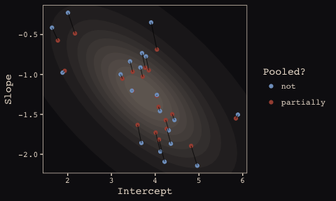<!-- -->

Here we prep for Figure 13.5.b.


```r
# Retrieve the partially-pooled estimates with coef()
partially_pooled_estimates <-
  coef(b13.1)$cafe[ , 1, 1:2] %>%
  as_tibble() %>%                  # Converting the two vectors to a tibble
  rename(morning = Intercept) %>%  # the Intercept is the wait time for morning (i.e., `afternoon == 0`)
  mutate(afternoon = morning + afternoon,  # Afternoon wait time is the morning wait time plus the afternoon slope
         cafe = 1:nrow(.)) %>%  # Adding the `cafe` index
  select(cafe, everything()) 

# Compute unpooled estimates directly from data
un_pooled_estimates <-
  d %>%
  # As above, with these two lines, we compute each cafe's mean wait value by time of day.
  group_by(afternoon, cafe) %>% 
  summarise(mean = mean(wait)) %>%
  ungroup() %>%  # ungrouping allows us to alter the grouping variable, afternoon
  mutate(afternoon = ifelse(afternoon == 0, "morning", "afternoon")) %>%
  spread(key = afternoon, value = mean)  # this seperates out the values into morning and afternoon columns

estimates <-
  bind_rows(partially_pooled_estimates, un_pooled_estimates) %>%
  mutate(pooled = rep(c("partially", "not"), each = nrow(.)/2))
```

The code for Figure 13.5.b.


```r
ggplot(data = estimates, aes(x = morning, y = afternoon)) +
  # Nesting stat_ellipse() with mapply() is a less redundant way to produce the ten-layered semitransparent
  # ellipses we did with ten lines of stat_ellipse() functions in the previous plot
  mapply(function(level) {
    stat_ellipse(geom = "polygon", type = "norm",
                 size = 0, alpha = 1/20, fill = "#E7CDC2",
                 level = level)
    }, 
    # Enter the levels here
    level = c(seq(from = 1/10, to = 9/10, by = 1/10), .99)) +
  geom_point(aes(group = cafe, color = pooled)) +
  geom_line(aes(group = cafe), size = 1/4) +
  scale_color_manual("Pooled?",
                     values = c("#80A0C7", "#A65141")) +
  coord_cartesian(xlim = range(estimates$morning),
                  ylim = range(estimates$afternoon)) +
  labs(x = "morning wait (mins)",
       y = "afternoon wait (mins)") +
  theme_pearl_earring
```

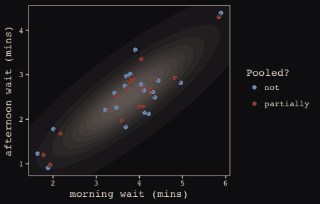<!-- -->

## 13.2. Example: Admission decisions and gender

Let's revisit the infamous UCB admissions data.


```r
library(rethinking)
data(UCBadmit)
d <- UCBadmit
```

Here we detach rethinking, reload brms, and augment the data a bit.


```r
detach(package:rethinking, unload = T)
library(brms)
rm(UCBadmit)

d <- 
  d %>%
  mutate(male    = ifelse(applicant.gender == "male", 1, 0),
         dept_id = rep(1:6, each = 2))
```

### 13.2.1. Varying intercepts.

We start by only letting the intercepts vary in this one.


```r
b13.2 <- 
  brm(data = d, family = binomial,
      admit | trials(applications) ~ 1 + male + (1 | dept_id),
      prior = c(set_prior("normal(0, 10)", class = "Intercept"),
                set_prior("normal(0, 1)", class = "b"),
                set_prior("cauchy(0, 2)", class = "sd")),
      iter = 4500, warmup = 500, chains = 3, cores = 3,
      control = list(adapt_delta = 0.99))
```

Since we don't have a `depth = 2` argument in `brms::summary()`, we'll have to get creative. One way to look at the parameters is with `b13.2$fit`:


```r
b13.2$fit
```

```
## Inference for Stan model: binomial brms-model.
## 3 chains, each with iter=4500; warmup=500; thin=1; 
## post-warmup draws per chain=4000, total post-warmup draws=12000.
## 
##                          mean se_mean   sd   2.5%    25%    50%    75%  97.5% n_eff Rhat
## b_Intercept             -0.58    0.02 0.67  -1.91  -0.97  -0.58  -0.20   0.83  1554    1
## b_male                  -0.09    0.00 0.08  -0.25  -0.15  -0.09  -0.04   0.07  5167    1
## sd_dept_id__Intercept    1.48    0.01 0.58   0.78   1.09   1.35   1.71   2.97  1999    1
## r_dept_id[1,Intercept]   1.25    0.02 0.67  -0.16   0.88   1.26   1.64   2.61  1545    1
## r_dept_id[2,Intercept]   1.20    0.02 0.68  -0.21   0.83   1.21   1.59   2.57  1566    1
## r_dept_id[3,Intercept]  -0.01    0.02 0.68  -1.42  -0.38  -0.01   0.39   1.33  1550    1
## r_dept_id[4,Intercept]  -0.04    0.02 0.67  -1.44  -0.42  -0.04   0.35   1.30  1546    1
## r_dept_id[5,Intercept]  -0.48    0.02 0.68  -1.91  -0.86  -0.48  -0.09   0.87  1559    1
## r_dept_id[6,Intercept]  -2.03    0.02 0.68  -3.47  -2.41  -2.02  -1.63  -0.69  1595    1
## lp__                   -61.89    0.05 2.55 -67.75 -63.39 -61.56 -60.03 -57.92  2490    1
## 
## Samples were drawn using NUTS(diag_e) at Sun May 27 00:05:22 2018.
## For each parameter, n_eff is a crude measure of effective sample size,
## and Rhat is the potential scale reduction factor on split chains (at 
## convergence, Rhat=1).
```

However, notice that the group-specific parameters don't match up with those in the text. Though our `r_dept_id[1,Intercept]` had a posterior mean of 1.27, the number for `a_dept[1]` in the text is 0.67. This is because the brms package presented the random effects in the **non-centered** metric. The rethinking package, in contrast, presents the random effects in the **centered** metric. On page 399, McElreath wrote:

>Remember, the values above are the $\alpha_{DEPT}$ estimates, and so they are deviations from the global mean $\alpha$, which in this case has posterior mean -0.58. So department A, "[1]" in the table, has the highest average admission rate. Department F, "[6]" in the table, has the lowest.

Here's another fun fact:


```r
# Numbers taken from the mean column on page 399 in the text
c(0.67, 0.63, -0.59, -0.62, -1.06, -2.61) %>% mean()
```

```
## [1] -0.5966667
```

The average of the rethinking-based **centered** random effects is within rounding error of the global mean, -0.58. If you want the random effects in the **centered** metric from brms, you can use the `coef()` function:


```r
coef(b13.2)
```

```
## $dept_id
## , , Intercept
## 
##     Estimate  Est.Error       Q2.5      Q97.5
## 1  0.6739803 0.10016019  0.4783464  0.8686075
## 2  0.6290663 0.11530011  0.4052417  0.8558766
## 3 -0.5838902 0.07497686 -0.7298375 -0.4381070
## 4 -0.6173148 0.08570376 -0.7852832 -0.4492784
## 5 -1.0586234 0.09778518 -1.2527261 -0.8700107
## 6 -2.6060780 0.15682019 -2.9259003 -2.3078744
## 
## , , male
## 
##      Estimate Est.Error       Q2.5      Q97.5
## 1 -0.09436363 0.0809096 -0.2525624 0.06556233
## 2 -0.09436363 0.0809096 -0.2525624 0.06556233
## 3 -0.09436363 0.0809096 -0.2525624 0.06556233
## 4 -0.09436363 0.0809096 -0.2525624 0.06556233
## 5 -0.09436363 0.0809096 -0.2525624 0.06556233
## 6 -0.09436363 0.0809096 -0.2525624 0.06556233
```

And just to confirm, the average of the posterior means of the `Intercept` random effects with `brms::coef()` is also the global mean within rounding error:


```r
mean(coef(b13.2)$dept_id[ , "Estimate", "Intercept"])
```

```
## [1] -0.59381
```

Note how `coef()` returned a three-dimensional list.


```r
coef(b13.2) %>% str()
```

```
## List of 1
##  $ dept_id: num [1:6, 1:4, 1:2] 0.674 0.629 -0.584 -0.617 -1.059 ...
##   ..- attr(*, "dimnames")=List of 3
##   .. ..$ : chr [1:6] "1" "2" "3" "4" ...
##   .. ..$ : chr [1:4] "Estimate" "Est.Error" "Q2.5" "Q97.5"
##   .. ..$ : chr [1:2] "Intercept" "male"
```

If you just want the parameter summaries for the random intercepts, you have to use three-dimensional indexing. 


```r
coef(b13.2)$dept_id[ , , "Intercept"]  # this also works: coef(b13.2)$dept_id[ , , 1]
```

```
##     Estimate  Est.Error       Q2.5      Q97.5
## 1  0.6739803 0.10016019  0.4783464  0.8686075
## 2  0.6290663 0.11530011  0.4052417  0.8558766
## 3 -0.5838902 0.07497686 -0.7298375 -0.4381070
## 4 -0.6173148 0.08570376 -0.7852832 -0.4492784
## 5 -1.0586234 0.09778518 -1.2527261 -0.8700107
## 6 -2.6060780 0.15682019 -2.9259003 -2.3078744
```

So to get our brms summaries in a similar format to those in the text, we'll have to combine `coef()` with `fixef()` and `VarCorr()`. 


```r
coef(b13.2)$dept_id[, , "Intercept"] %>%
  as_tibble() %>% 
  bind_rows(fixef(b13.2) %>% 
              as_tibble()) %>% 
  bind_rows(VarCorr(b13.2)$dept_id$sd %>% 
              as_tibble())
```

```
## # A tibble: 9 x 4
##   Estimate Est.Error   Q2.5   Q97.5
##      <dbl>     <dbl>  <dbl>   <dbl>
## 1   0.674     0.100   0.478  0.869 
## 2   0.629     0.115   0.405  0.856 
## 3  -0.584     0.0750 -0.730 -0.438 
## 4  -0.617     0.0857 -0.785 -0.449 
## 5  -1.06      0.0978 -1.25  -0.870 
## 6  -2.61      0.157  -2.93  -2.31  
## 7  -0.576     0.674  -1.91   0.835 
## 8  -0.0944    0.0809 -0.253  0.0656
## 9   1.48      0.577   0.784  2.97
```

And a little more data wrangling will make the summaries easier to read:


```r
coef(b13.2)$dept_id[, , "Intercept"] %>%
  as_tibble() %>% 
  bind_rows(fixef(b13.2) %>% 
              as_tibble()) %>% 
  bind_rows(VarCorr(b13.2)$dept_id$sd %>% 
              as_tibble()) %>% 
  mutate(parameter = c(paste("Intercept [", 1:6, "]", sep = ""), 
                       "Intercept", "male", "sigma")) %>% 
  select(parameter, everything()) %>% 
  mutate_if(is_double, round, digits = 2)
```

```
## # A tibble: 9 x 5
##   parameter     Estimate Est.Error   Q2.5   Q97.5
##   <chr>            <dbl>     <dbl>  <dbl>   <dbl>
## 1 Intercept [1]   0.670     0.100   0.480  0.870 
## 2 Intercept [2]   0.630     0.120   0.410  0.860 
## 3 Intercept [3]  -0.580     0.0700 -0.730 -0.440 
## 4 Intercept [4]  -0.620     0.0900 -0.790 -0.450 
## 5 Intercept [5]  -1.06      0.100  -1.25  -0.870 
## 6 Intercept [6]  -2.61      0.160  -2.93  -2.31  
## 7 Intercept      -0.580     0.670  -1.91   0.830 
## 8 male           -0.0900    0.0800 -0.250  0.0700
## 9 sigma           1.48      0.580   0.780  2.97
```

I’m not aware of a slick and easy way to get the `n_eff` and `Rhat` summaries into the mix. But if you’re fine with working with the brms-default **non-centered** parameterization, `b13.2$fit` gets you those just fine.

One last thing. The [broom package](https://cran.r-project.org/web/packages/broom/index.html) offers a very handy way to get those brms random effects. Just throw the model `brm()` fit into the `tidy()` function.


```r
library(broom)

tidy(b13.2) %>%
  mutate_if(is.numeric, round, digits = 2)  # This line just rounds the output
```

```
##                      term estimate std.error  lower  upper
## 1             b_Intercept    -0.58      0.67  -1.63   0.50
## 2                  b_male    -0.09      0.08  -0.23   0.04
## 3   sd_dept_id__Intercept     1.48      0.58   0.84   2.56
## 4  r_dept_id[1,Intercept]     1.25      0.67   0.17   2.31
## 5  r_dept_id[2,Intercept]     1.20      0.68   0.12   2.26
## 6  r_dept_id[3,Intercept]    -0.01      0.68  -1.08   1.06
## 7  r_dept_id[4,Intercept]    -0.04      0.67  -1.13   1.01
## 8  r_dept_id[5,Intercept]    -0.48      0.68  -1.56   0.58
## 9  r_dept_id[6,Intercept]    -2.03      0.68  -3.13  -0.96
## 10                   lp__   -61.89      2.55 -66.53 -58.33
```

But note how, just as with `b13.2$fit`, this approach summarizes the posterior with the **non-centered** parameterization. Which is a fine parameterization. It's just a little different from what you'll get when using `precis( m13.2 , depth=2 )`, as in the text.

### 13.2.2. Varying effects of being `male`.

Now our `male` dummy varies, too.


```r
b13.3 <- 
  brm(data = d, family = binomial,
      admit | trials(applications) ~ 1 + male + (1 + male | dept_id),
      prior = c(set_prior("normal(0, 10)", class = "Intercept"),
                set_prior("normal(0, 1)", class = "b"),
                set_prior("cauchy(0, 2)", class = "sd"),
                set_prior("lkj(2)", class = "cor")),
      iter = 5000, warmup = 1000, chains = 4, cores = 4,
      control = list(adapt_delta = .99,
                     max_treedepth = 12))
```

The random effects in the **centered** metric:


```r
coef(b13.3)
```

```
## $dept_id
## , , Intercept
## 
##     Estimate  Est.Error       Q2.5      Q97.5
## 1  1.3064892 0.25469235  0.8197160  1.8159453
## 2  0.7416153 0.32397842  0.1202103  1.4039455
## 3 -0.6462675 0.08577721 -0.8170548 -0.4797024
## 4 -0.6163986 0.10432343 -0.8220744 -0.4134935
## 5 -1.1335537 0.11406678 -1.3605969 -0.9141842
## 6 -2.6026772 0.20022112 -3.0044445 -2.2239204
## 
## , , male
## 
##      Estimate Est.Error       Q2.5      Q97.5
## 1 -0.79396657 0.2682859 -1.3272075 -0.2747994
## 2 -0.21107678 0.3246104 -0.8711242  0.4220400
## 3  0.08263517 0.1404557 -0.1905454  0.3609890
## 4 -0.09378859 0.1398703 -0.3692290  0.1788871
## 5  0.12260768 0.1891524 -0.2402673  0.4978071
## 6 -0.12273973 0.2680736 -0.6655568  0.3913459
```

It just takes a little data wrangling to put the brms-based **centered** random effects into a tidy tibble with which we might make a coefficient plot, like McElreath did on page 401.


```r
# As far as I can tell, because coef() yields a list, you have to take out the two random effects one at a time, convert them into tibbles, and then reassemble them with bind_rows()
coef(b13.3)$dept_id[, , 1] %>% 
  as_tibble() %>% 
  bind_rows(coef(b13.3)$dept_id[, , 2] %>% 
              as_tibble()) %>% 
  mutate(param = c(paste("Intercept", 1:6),
                   paste("male", 1:6)),
         reorder = c(6:1, 12:7)) %>% 

  # The plot
  ggplot(aes(x = reorder(param, reorder))) +
  geom_hline(yintercept = 0, linetype = 3, color = "#E8DCCF") +
             geom_linerange(aes(ymin = Q2.5, ymax = Q97.5),
                 color = "#E7CDC2") +
  geom_point(aes(y = Estimate),
             color = "#A65141") +
  xlab(NULL) +
  coord_flip() +
  theme_pearl_earring +
  theme(axis.ticks.y = element_blank(),
        axis.text.y = element_text(hjust = 0))
```

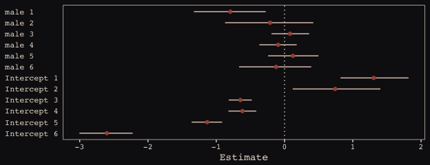<!-- -->

### 13.2.3. Shrinkage.

Figure 13.6.a., the correlation between the full UCB model's varying intercepts and slopes.


```r
post <- posterior_samples(b13.3)

post %>% 
  ggplot(aes(x = cor_dept_id__Intercept__male)) +
  geom_density(color = "transparent", fill = "#8B9DAF") +
  geom_vline(xintercept = median(post$cor_dept_id__Intercept__male), color = "#394165") +
  scale_x_continuous(breaks = c(-1, median(post$cor_dept_id__Intercept__male), 1),
                     labels = c(-1, "-.35", 1)) +
  scale_y_continuous(NULL, breaks = NULL) +
  coord_cartesian(xlim = -1:1) +
  labs(subtitle = "The line is at the median.",
       x = "correlation") +
  theme_pearl_earring
```

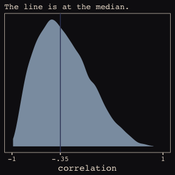<!-- -->

Much like for Figure 13.5.b., above, it'll take a little data processing before we're ready to reproduce Figure 13.6.b. 


```r
# Here we put the partially-pooled estimate summaries in a tibble
partially_pooled_params <-
  coef(b13.3)$dept_id[ , 1, ] %>%
  as_tibble() %>%
  rename(intercept = Intercept,
         slope = male) %>%
  mutate(dept = 1:nrow(.)) %>%
  select(dept, everything())

# In order to calculate the unpooled estimates from the data, we'll need a function that can convert probabilities into the logit metric. If you do the algebra, this is just a transformation of Gelman and Hill's invlogit() function
prob_to_logit <- function(x){
  -log((1/x) -1)
  }

# compute unpooled estimates directly from data
un_pooled_params <-
  d %>%
  group_by(male, dept_id) %>%
  summarise(prob_admit = mean(admit/applications)) %>%
  ungroup() %>%
  mutate(male = ifelse(male == 0, "intercept", "slope")) %>%
  spread(key = male, value = prob_admit) %>%
  rename(dept = dept_id) %>%
  mutate(intercept = prob_to_logit(intercept),  # Here we put our custom prob_to_logit() function to work
         slope     = prob_to_logit(slope)) %>%
  mutate(slope     = slope - intercept)

# Here we combine the partially-pooled and unpooled means into a single data object.
params <-
  bind_rows(partially_pooled_params, un_pooled_params) %>%
  mutate(pooled = rep(c("partially", "not"), each = nrow(.)/2)) %>%
  mutate(dept_letter = rep(LETTERS[1:6], times = 2))  # This will help with plotting

params
```

```
## # A tibble: 12 x 5
##     dept intercept   slope pooled    dept_letter
##    <int>     <dbl>   <dbl> <chr>     <chr>      
##  1     1     1.31  -0.794  partially A          
##  2     2     0.742 -0.211  partially B          
##  3     3    -0.646  0.0826 partially C          
##  4     4    -0.616 -0.0938 partially D          
##  5     5    -1.13   0.123  partially E          
##  6     6    -2.60  -0.123  partially F          
##  7     1     1.54  -1.05   not       A          
##  8     2     0.754 -0.220  not       B          
##  9     3    -0.660  0.125  not       C          
## 10     4    -0.622 -0.0820 not       D          
## 11     5    -1.16   0.200  not       E          
## 12     6    -2.58  -0.189  not       F
```

Here's our version of Figure 13.6.b., depicting two-dimensional shrinkage for the partially-pooled multilevel estimates (posterior means) relative to the unpooled coefficients, calculated from the data. The [ggrepel package](https://cran.r-project.org/web/packages/ggrepel/index.html) and its `geom_text_repel()` function will help us with the in-plot labels.


```r
library(ggrepel)

set.seed(6457240)  # for ggrepel::geom_text_repel()
ggplot(data = params, aes(x = intercept, y = slope)) +
  mapply(function(level){
    stat_ellipse(geom = "polygon", type = "norm",
                 size = 0, alpha = 1/20, fill = "#E7CDC2",
                 level = level)
    }, 
    level = c(seq(from = 1/10, to = 9/10, by = 1/10), .99)) +
  geom_point(aes(group = dept, color = pooled)) +
  geom_line(aes(group = dept), size = 1/4) +
  scale_color_manual("Pooled?",
                     values = c("#80A0C7", "#A65141")) +
  geom_text_repel(data = params %>% filter(pooled == "partially"),
                  aes(label = dept_letter),
                  color = "#E8DCCF", size = 4, family = "Courier") +
  coord_cartesian(xlim = range(params$intercept),
                  ylim = range(params$slope)) +
  theme_pearl_earring
```

<!-- -->

### 13.2.4. Model comparison.

Our no-gender model:


```r
b13.4 <- 
  brm(data = d, family = binomial,
      admit | trials(applications) ~ 1 + (1 | dept_id),
      prior = c(set_prior("normal(0, 10)", class = "Intercept"),
                set_prior("cauchy(0, 2)", class = "sd")),
      iter = 5000, warmup = 1000, chains = 4, cores = 4,
      control = list(adapt_delta = .99,
                     max_treedepth = 12))
```


```r
waic(b13.2, b13.3, b13.4)
```

```
##                 WAIC    SE
## b13.2         108.71 16.67
## b13.3          90.96  4.72
## b13.4         105.15 17.99
## b13.2 - b13.3  17.75 13.56
## b13.2 - b13.4   3.56  3.42
## b13.3 - b13.4 -14.19 15.11
```

## 13.3. Example: Cross-classified `chimpanzees` with varying slopes

Retrieve the `chimpanzees` data.


```r
library(rethinking)
data(chimpanzees)
d <- chimpanzees
```


```r
detach(package:rethinking, unload = T)
library(brms)
rm(chimpanzees)

d <-
  d %>%
  select(-recipient) %>%
  mutate(block_id = block)
```

Here's our cross-classified model. For you SEM lovers, this reminds me of a factor model with a method effect (e.g., a bifactor model). 


```r
b13.6 <- 
  brm(data = d, family = binomial,
      pulled_left ~ 1 + prosoc_left + condition:prosoc_left + 
        (1 + prosoc_left + condition:prosoc_left | block_id) +
        (1 + prosoc_left + condition:prosoc_left | actor),
      prior = c(set_prior("normal(0, 1)", class = "Intercept"),
                set_prior("normal(0, 1)", class = "b"),
                set_prior("cauchy(0, 2)", class = "sd"),
                set_prior("lkj(4)", class = "cor")),
      iter = 5000, warmup = 1000, chains = 3, cores = 3)
```

Even though it's not apparent in the syntax, our model `b13.6` was already fit using the [non-centered parameterization. Behind the scenes, Bürkner has brms do this automatically](https://github.com/paul-buerkner/brms/issues/211). It's been that way all along.


```r
ratios_cp <- neff_ratio(b13.6)

neff <-
  ratios_cp %>% 
  as_tibble %>% 
  rename(neff_ratio = value) %>% 
  mutate(neff = neff_ratio*12000)

head(neff)
```

```
## # A tibble: 6 x 2
##   neff_ratio  neff
##        <dbl> <dbl>
## 1      0.299  3583
## 2      0.474  5691
## 3      0.583  6997
## 4      0.343  4116
## 5      0.386  4632
## 6      0.559  6712
```

Our variant of Figure 13.7. The handy [ggbeeswarm package](https://cran.r-project.org/web/packages/ggbeeswarm/index.html) and it's `geom_quasirandom()` function will give a better sense of the distribution.


```r
library(ggbeeswarm)

neff %>%
  ggplot(aes(x = factor(0), y = neff)) +
  geom_boxplot(fill = "#394165", color = "#8B9DAF") +
  geom_quasirandom(method = "tukeyDense",
                   size = 2/3, color = "#EEDA9D", alpha = 2/3) +
  scale_x_discrete(NULL, breaks = NULL,
                   expand = c(.75, .75)) +
  scale_y_continuous(breaks = c(0, 6000, 12000)) +
  coord_cartesian(ylim = 0:12000) +
  labs(y = "effective samples",
       subtitle = "The non-centered\nparameterization is the\nbrms default. No fancy\ncoding required.") +
  theme_pearl_earring
```

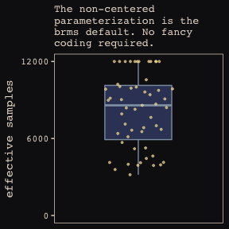<!-- -->

The bayesplot package contains a sweet of [handy diagnostic features](https://cran.r-project.org/web/packages/bayesplot/vignettes/visual-mcmc-diagnostics.html#effective-sample-size). `mcmc_neff()`, for example, makes it easy to examine the ratio of n.eff and the fill number of post-warm-up iterations, *N*. Ideally, that ratio is closer to 1 than not.


```r
library(bayesplot)

color_scheme_set(c("#DCA258", "#EEDA9D", "#394165", "#8B9DAF", "#A65141", "#A65141"))

mcmc_neff(ratios_cp, size = 2) +
  theme_pearl_earring
```

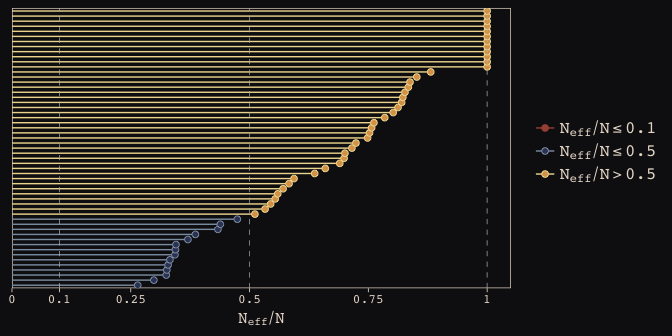<!-- -->

Here are our standard deviation parameters.


```r
tidy(b13.6) %>%
  filter(str_detect(term , "sd_")) %>%
  mutate_if(is.numeric, round, digits = 2)
```

```
##                                 term estimate std.error lower upper
## 1                sd_actor__Intercept     2.37      0.93  1.31  4.04
## 2              sd_actor__prosoc_left     0.45      0.38  0.03  1.14
## 3    sd_actor__prosoc_left:condition     0.52      0.48  0.04  1.44
## 4             sd_block_id__Intercept     0.23      0.20  0.02  0.61
## 5           sd_block_id__prosoc_left     0.57      0.41  0.07  1.32
## 6 sd_block_id__prosoc_left:condition     0.51      0.42  0.04  1.32
```

Here we refit the simpler model from way back in chapter 12.


```r
b12.5 <- 
  brm(data = d, family = binomial,
      pulled_left ~ 1 + prosoc_left + condition:prosoc_left + 
        (1 | block_id) +
        (1 | actor),
      prior = c(set_prior("normal(0, 10)", class = "Intercept"),
                set_prior("normal(0, 10)", class = "b"),
                set_prior("cauchy(0, 1)", class = "sd")),
      iter = 5000, warmup = 1000, chains = 3, cores = 3)
```

The WAIC comparison:


```r
waic(b13.6, b12.5)
```

```
## Using the maximum response value as the number of trials.
## Using the maximum response value as the number of trials.
## Using the maximum response value as the number of trials.
## Using the maximum response value as the number of trials.
```

```
##                 WAIC    SE
## b13.6         534.75 19.91
## b12.5         532.90 19.70
## b13.6 - b12.5   1.84  4.11
```

## 13.4. Continuous categories and the Gaussian process

### 13.4.1. Example: Spatial autocorrelation in Oceanic tools.


```r
# load the distance matrix
library(rethinking)
data(islandsDistMatrix)

# display short column names, so fits on screen
Dmat <- islandsDistMatrix
colnames(Dmat) <- c("Ml", "Ti", "SC", "Ya", "Fi", 
                    "Tr", "Ch", "Mn", "To", "Ha")
round(Dmat, 1)
```

```
##             Ml  Ti  SC  Ya  Fi  Tr  Ch  Mn  To  Ha
## Malekula   0.0 0.5 0.6 4.4 1.2 2.0 3.2 2.8 1.9 5.7
## Tikopia    0.5 0.0 0.3 4.2 1.2 2.0 2.9 2.7 2.0 5.3
## Santa Cruz 0.6 0.3 0.0 3.9 1.6 1.7 2.6 2.4 2.3 5.4
## Yap        4.4 4.2 3.9 0.0 5.4 2.5 1.6 1.6 6.1 7.2
## Lau Fiji   1.2 1.2 1.6 5.4 0.0 3.2 4.0 3.9 0.8 4.9
## Trobriand  2.0 2.0 1.7 2.5 3.2 0.0 1.8 0.8 3.9 6.7
## Chuuk      3.2 2.9 2.6 1.6 4.0 1.8 0.0 1.2 4.8 5.8
## Manus      2.8 2.7 2.4 1.6 3.9 0.8 1.2 0.0 4.6 6.7
## Tonga      1.9 2.0 2.3 6.1 0.8 3.9 4.8 4.6 0.0 5.0
## Hawaii     5.7 5.3 5.4 7.2 4.9 6.7 5.8 6.7 5.0 0.0
```

If you wanted to use color to more effectively visualize the values in the matirx, you might do something like this.


```r
Dmat %>%
  as_tibble() %>%
  gather() %>%
  rename(Column = key,
         distance = value) %>%
  mutate(Row          = rep(rownames(Dmat), times = 10),
         Row_order    = rep(9:0,            times = 10),
         Column_order = rep(0:9,            each  = 10)) %>%
  
  ggplot(aes(x = reorder(Column, Column_order), 
             y = reorder(Row, Row_order))) + 
  geom_raster(aes(fill = distance)) + 
  geom_text(aes(label = round(distance, digits = 1)),
            size = 3, family = "Courier", color = "#100F14") +
  scale_fill_gradient(low = "#FCF9F0", high = "#A65141") +
  scale_x_discrete(position = "top", expand = c(0, 0)) +
  scale_y_discrete(expand = c(0, 0)) +
  labs(x = NULL, y = NULL) +
  theme_pearl_earring +
  theme(axis.ticks = element_blank(),
        axis.text.y = element_text(hjust = 0))
```

<!-- -->

Figure 13.8., the "shape of the function relating distance to the covariance $\mathbf{K}_{ij}$."
 

```r
tibble(
  x = seq(from = 0, to = 4, by = .01),
  linear = exp(-1*x),
  squared = exp(-1*x^2)) %>%
  
  ggplot(aes(x = x)) +
  geom_line(aes(y = linear),
            color = "#B1934A", linetype = 2) +
  geom_line(aes(y = squared),
            color = "#DCA258") +
  scale_x_continuous(expand = c(0, 0)) +
  scale_y_continuous(breaks = c(0, .5, 1),
                     labels = c(0, ".5", 1)) +
  labs(x = "distance",
       y = "correlation") +
  theme_pearl_earring
```

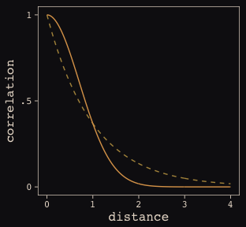<!-- -->


```r
data(Kline2) # load the ordinary data, now with coordinates

d <- 
  Kline2 %>%
  mutate(society = 1:10)

d %>% glimpse()
```

```
## Observations: 10
## Variables: 10
## $ culture     <fctr> Malekula, Tikopia, Santa Cruz, Yap, Lau Fiji, Trobriand, Chuuk, Manus, Ton...
## $ population  <int> 1100, 1500, 3600, 4791, 7400, 8000, 9200, 13000, 17500, 275000
## $ contact     <fctr> low, low, low, high, high, high, high, low, high, low
## $ total_tools <int> 13, 22, 24, 43, 33, 19, 40, 28, 55, 71
## $ mean_TU     <dbl> 3.2, 4.7, 4.0, 5.0, 5.0, 4.0, 3.8, 6.6, 5.4, 6.6
## $ lat         <dbl> -16.3, -12.3, -10.7, 9.5, -17.7, -8.7, 7.4, -2.1, -21.2, 19.9
## $ lon         <dbl> 167.5, 168.8, 166.0, 138.1, 178.1, 150.9, 151.6, 146.9, -175.2, -155.6
## $ lon2        <dbl> -12.5, -11.2, -14.0, -41.9, -1.9, -29.1, -28.4, -33.1, 4.8, 24.4
## $ logpop      <dbl> 7.003065, 7.313220, 8.188689, 8.474494, 8.909235, 8.987197, 9.126959, 9.472...
## $ society     <int> 1, 2, 3, 4, 5, 6, 7, 8, 9, 10
```

Okay, it appears this is going to be a bit of a ride. It's not entire clear to me if we can fit a Gaussian process model in brms that's a direct equivalent to what McElreath did with rethinking. But we can try. First, note our use of the `gp()` syntax in the `brm()` function, below. We're attempting to tell brms that we would like to include latitude and longitude (i.e., `lat` and `long2`, respectively) in a Gaussian process. Note how our priors are a little different. I'll explain, below. Let's just move ahead and fit the model.


```r
detach(package:rethinking, unload = T)
library(brms)

b13.7 <- 
  brm(data = d, family = poisson,
      total_tools ~ 1 + gp(lat, lon2) + logpop,
      prior = c(set_prior("normal(0, 10)", class = "Intercept"),
                set_prior("normal(0, 1)", class = "b"),
                set_prior("inv_gamma(2.874624, 0.393695)", class =	"lscale"),
                set_prior("cauchy(0, 1)", class = "sdgp")),
      iter = 1e4, warmup = 2000, chains = 4, cores = 4,
      control = list(adapt_delta = 0.999,
                     max_treedepth = 12))
```

Here's the model.


```r
posterior_summary(b13.7) %>%
  round(digits = 2)
```

```
##                   Estimate Est.Error   Q2.5  Q97.5
## b_Intercept           1.44      1.12  -0.79   3.80
## b_logpop              0.23      0.11   0.02   0.45
## sdgp_gplatlon2        0.53      0.37   0.16   1.46
## lscale_gplatlon2      0.23      0.13   0.07   0.57
## zgp_gplatlon2[1]     -0.60      0.79  -2.17   0.92
## zgp_gplatlon2[2]      0.45      0.84  -1.25   2.09
## zgp_gplatlon2[3]     -0.63      0.70  -1.96   0.89
## zgp_gplatlon2[4]      0.87      0.70  -0.46   2.29
## zgp_gplatlon2[5]      0.25      0.75  -1.22   1.72
## zgp_gplatlon2[6]     -1.00      0.80  -2.54   0.63
## zgp_gplatlon2[7]      0.12      0.72  -1.39   1.52
## zgp_gplatlon2[8]     -0.18      0.88  -1.89   1.55
## zgp_gplatlon2[9]      0.41      0.91  -1.47   2.11
## zgp_gplatlon2[10]    -0.32      0.82  -1.95   1.31
## lp__                -51.50      3.17 -58.73 -46.36
```

Our Gaussian process parameters are different than McElreath's. From the brms reference manual, here's the brms parameterization:

$$k(x_{i},x_{j}) = sdgp^2exp(-||x_{i} - x_{j}||/2lscale^2)$$

What McElreath called $\eta$, Bürkner called $sdgp$. While McElreath estimated $\eta^2$, brms simply estimated $sdgp$. So we'll have to square our `sdgp_gplatlon2` before it's on the same scale as `etasq` in the text. Here it is.


```r
posterior_samples(b13.7) %>% 
  transmute(sdgp_squared = sdgp_gplatlon2^2) %>% 
  summarise_at(vars(sdgp_squared), funs(mean, sd)) %>% 
  round(digits = 2)
```

```
##   mean   sd
## 1 0.42 1.16
```

Now we're in the ballpark. In our model `brm()` code, above, we just went with the flow and kept the `cauchy(0, 1)` prior on `sdgp`.

Now look at the denominator of the inner part of Bürkner equation, $2lscale^2$. This appears to be the brms equivalent to McElreath's $\rho^2$. Or at least it's what we've got. Anyway, also note that whereas McElreath estimated $\rho^2$ directly as `rhosq`

If I'm doing the algebra correctly--and that may well be a big if--, we might expect: 

$$\rho^2 = 1/(2*(lscale^2))$$

But that doesn't appear to be the case. *Sigh*. 


```r
posterior_samples(b13.7) %>% 
  transmute(rho_squared = 1/(2*(lscale_gplatlon2^2))) %>% 
  summarise_at(vars(rho_squared), funs(mean, sd)) %>% 
  round(digits = 2)
```

```
##    mean    sd
## 1 21.83 29.95
```

Oh man, that isn't even close to the 2.67 (51.60) McElreath reported in the text. The plot deepens. If you look back, you'll see we used a very different prior for $lscale$. Here is it: `inv_gamma(2.874624, 0.393695)`. Here's where that came from:


```r
get_prior(data = d, family = poisson,
      total_tools ~ 1 + gp(lat, lon2) + logpop)
```

```
##                           prior     class         coef group resp dpar nlpar bound
## 1                                       b                                         
## 2                                       b       logpop                            
## 3           student_t(3, 3, 10) Intercept                                         
## 4                normal(0, 0.5)    lscale                                         
## 5 inv_gamma(2.874624, 0.393695)    lscale gp(lat,lon2)                            
## 6           student_t(3, 0, 10)      sdgp                                         
## 7                                    sdgp gp(lat,lon2)
```

That is, we used the brms defualt prior for $lscale$. In a [GitHub exchange](https://github.com/ASKurz/Statistical_Rethinking_with_brms_ggplot2_and_the_tidyverse/issues/8), Bürkner pointed out that brms uses special priors for $lscale$ parameters based on Michael Betancourt [of the Stan team]'s [vignette on the topic](https://betanalpha.github.io/assets/case_studies/gp_part3/part3.html). Though it isn't included in this document, I also ran the model with the `cauchy(0, 1)` prior and the results were quite similar. So the big discrepancy between our model and the one in the text isn't based on the prior.

Now that we’ve started, we may as well keep going down the comparison train. Let’s reproduce McElreath’s model with rethinking. 


```r
detach(package:brms, unload = T)
library(rethinking)

m13.7 <- map2stan(
    alist(
        total_tools ~ dpois(lambda),
        log(lambda) <- a + g[society] + bp*logpop,
        g[society] ~ GPL2( Dmat , etasq , rhosq , 0.01 ),
        a ~ dnorm(0,10),
        bp ~ dnorm(0,1),
        etasq ~ dcauchy(0,1),
        rhosq ~ dcauchy(0,1)
    ),
    data=list(
        total_tools=d$total_tools,
        logpop=d$logpop,
        society=d$society,
        Dmat=islandsDistMatrix),
    warmup=2000 , iter=1e4 , chains=4)
```

Alright, now we'll work directly with the posteriors to make some visual comparisons.


```r
post_m13.7 <- rethinking::extract.samples(m13.7)[2:5] %>% as_tibble()

detach(package:rethinking, unload = T)
library(brms)

post_b13.7 <- posterior_samples(b13.7)
```

Here's the model intercept, by package:


```r
post_m13.7[, "a"] %>% 
  bind_rows(post_b13.7[, "b_Intercept"] %>% 
              as_tibble() %>% 
              rename(a = value)) %>% 
  mutate(model = rep(c("m13.7", "b13.7"), each = nrow(post_m13.7))) %>% 
  
  ggplot(aes(x = a, fill = model)) +
  geom_density(size = 0, alpha = 1/2) +
  scale_fill_manual(values = c("#80A0C7", "#A65141")) +
  scale_y_continuous(NULL, breaks = NULL) +
  labs(title = "Not identical, but pretty close",
       x = "intercept") +
  theme_pearl_earring
```

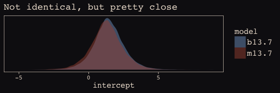<!-- -->

The slope:


```r
post_m13.7[, "bp"] %>% 
  bind_rows(post_b13.7[, "b_logpop"] %>% 
              as_tibble() %>% 
              rename(bp = value)) %>% 
  mutate(model = rep(c("m13.7", "b13.7"), each = nrow(post_m13.7))) %>% 
  
  ggplot(aes(x = bp, fill = model)) +
  geom_density(size = 0, alpha = 1/2) +
  scale_fill_manual(values = c("#80A0C7", "#A65141")) +
  scale_y_continuous(NULL, breaks = NULL) +
  labs(title = "Again, pretty close",
       x = "slope") +
  theme_pearl_earring
```

<!-- -->

This one, $\eta^2$, required a little transformation:


```r
post_m13.7[, "etasq"] %>% 
  bind_rows(post_b13.7[, "sdgp_gplatlon2"] %>% 
              as_tibble() %>%
              mutate(value = value^2) %>% 
              rename(etasq = value)) %>% 
  mutate(model = rep(c("m13.7", "b13.7"), each = nrow(post_m13.7))) %>% 
  
  ggplot(aes(x = etasq, fill = model)) +
  geom_density(size = 0, alpha = 1/2) +
  scale_fill_manual(values = c("#80A0C7", "#A65141")) +
  scale_y_continuous(NULL, breaks = NULL) +
  labs(title = "Still in the same ballpark",
       x = expression(eta^2)) +
  coord_cartesian(xlim = 0:3) +
  theme_pearl_earring
```

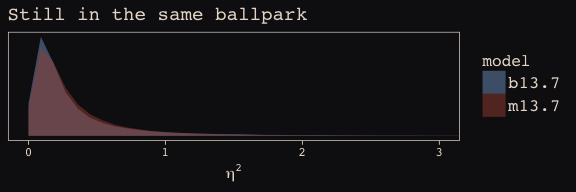<!-- -->

$\rho^2$ required more extensive transformation of the brms posterior:


```r
post_m13.7[, "rhosq"] %>%
  bind_rows(post_b13.7[, "lscale_gplatlon2"] %>% 
              as_tibble() %>%
              transmute(value = 1/(2*(value^2))) %>%
              # transmute(value = value^2) %>% 
              rename(rhosq = value)) %>% 
  mutate(model = rep(c("m13.7", "b13.7"), each = nrow(post_m13.7))) %>% 
  
  ggplot(aes(x = rhosq, fill = model)) +
  geom_density(size = 0) +
  scale_fill_manual(values = c("#80A0C7", "#A65141")) +
  labs(title = "Holy smokes are those not the same!",
       subtitle = "Notice how differently the y axes got scaled. Also, the brms density is\nright skewed for days.",
       x = expression(rho^2)) +
  coord_cartesian(xlim = 0:50) +
  theme_pearl_earring +
  theme(legend.position = "none") +
  facet_wrap(~model, scales = "free_y")
```

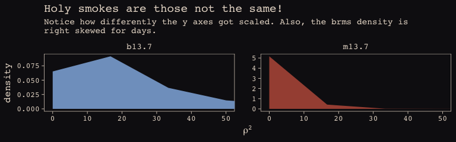<!-- -->

I'm in clinical psychology. Folks in my field don't tend to use Gaussian processes, so getting to the bottom of this is low on my to-do list. Perhaps one of y'all are more experienced with Gaussian processes and see a flaw somewhere in my code. Please [hit me up](https://github.com/ASKurz/Statistical_Rethinking_with_brms_ggplot2_and_the_tidyverse/issues) if you do.

Anyways, here's our brms + ggplot2 version of Figure 13.9.


```r
ggplot(data = tibble(x = c(0, 50.2)), aes(x = x)) +
  mapply(function(etasq, rhosq) {
    stat_function(fun = function(x, etasq, rhosq) etasq*exp(-rhosq*x^2), 
                  args = list(etasq = etasq, rhosq = rhosq), 
                  size = 1/4,
                  alpha = 1/4,
                  color = "#EEDA9D")
  }, 
  etasq = post_b13.7[1:100, "sdgp_gplatlon2"]^2,
  rhosq = post_b13.7[1:100, "lscale_gplatlon2"]^2*.5
  ) +
  stat_function(fun = function(x) median(post_b13.7$sdgp_gplatlon2)^2 *exp(-median(post_b13.7[1:100, "lscale_gplatlon2"] )^2*.5*x^2),
                color = "#EEDA9D", size = 1.1) +
  coord_cartesian(ylim = 0:1) +
  scale_x_continuous(breaks = seq(from = 0, to = 50, by = 10),
                     expand = c(0, 0)) +
  labs(x = "distance (thousand km)", 
       y ="covariance") +
  theme_pearl_earring
```

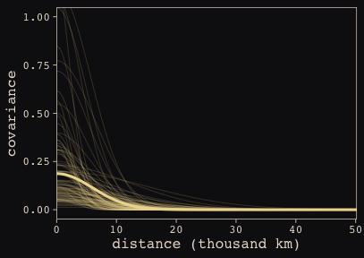<!-- -->

Do note the scale on which we placed our x axis. The brms parameterization resulted in a gentler decline in spatial covariance.

Let's finish this up and "push the parameters back through the function for $\mathbf{K}$, the covariance matrix" (p. 415).


```r
# compute posterior median covariance among societies
K <- matrix(0, nrow = 10, ncol = 10)
for (i in 1:10)
    for (j in 1:10)
        K[i, j] <- median(post_b13.7$sdgp_gplatlon2^2) * exp(-median(post_b13.7$lscale_gplatlon2^2) * islandsDistMatrix[i, j]^2)

diag(K) <- median(post_b13.7$sdgp_gplatlon2^2) + 0.01

K %>% round(2)
```

```
##       [,1] [,2] [,3] [,4] [,5] [,6] [,7] [,8] [,9] [,10]
##  [1,] 0.20 0.19 0.18 0.09 0.18 0.16 0.12 0.14 0.16  0.05
##  [2,] 0.19 0.20 0.19 0.09 0.18 0.16 0.13 0.14 0.16  0.06
##  [3,] 0.18 0.19 0.20 0.10 0.17 0.17 0.14 0.15 0.15  0.06
##  [4,] 0.09 0.09 0.10 0.20 0.06 0.15 0.17 0.17 0.04  0.02
##  [5,] 0.18 0.18 0.17 0.06 0.20 0.12 0.10 0.10 0.18  0.07
##  [6,] 0.16 0.16 0.17 0.15 0.12 0.20 0.16 0.18 0.10  0.03
##  [7,] 0.12 0.13 0.14 0.17 0.10 0.16 0.20 0.18 0.07  0.05
##  [8,] 0.14 0.14 0.15 0.17 0.10 0.18 0.18 0.20 0.08  0.03
##  [9,] 0.16 0.16 0.15 0.04 0.18 0.10 0.07 0.08 0.20  0.07
## [10,] 0.05 0.06 0.06 0.02 0.07 0.03 0.05 0.03 0.07  0.20
```

And we'll continue to follow suit and change these to a correlation matrix.


```r
# convert to correlation matrix
Rho <- round(cov2cor(K), 2)
# add row/col names for convenience
colnames(Rho) <- c("Ml","Ti","SC","Ya","Fi","Tr","Ch","Mn","To","Ha")
rownames(Rho) <- colnames(Rho)

Rho %>% round(2)
```

```
##      Ml   Ti   SC   Ya   Fi   Tr   Ch   Mn   To   Ha
## Ml 1.00 0.94 0.93 0.44 0.89 0.80 0.63 0.69 0.82 0.26
## Ti 0.94 1.00 0.95 0.47 0.89 0.81 0.68 0.71 0.81 0.30
## SC 0.93 0.95 1.00 0.52 0.86 0.84 0.72 0.76 0.77 0.29
## Ya 0.44 0.47 0.52 1.00 0.29 0.74 0.86 0.85 0.20 0.12
## Fi 0.89 0.89 0.86 0.29 1.00 0.62 0.49 0.51 0.93 0.36
## Tr 0.80 0.81 0.84 0.74 0.62 1.00 0.83 0.92 0.51 0.16
## Ch 0.63 0.68 0.72 0.86 0.49 0.83 1.00 0.89 0.37 0.24
## Mn 0.69 0.71 0.76 0.85 0.51 0.92 0.89 1.00 0.40 0.15
## To 0.82 0.81 0.77 0.20 0.93 0.51 0.37 0.40 1.00 0.34
## Ha 0.26 0.30 0.29 0.12 0.36 0.16 0.24 0.15 0.34 1.00
```

The correlations in our `Rho` matrix look a little higher than those in the text. Before we get see them in a plot, let's consider `psize`. If you really want to scale the points in Figure 13.10.a. like McElreath did, you can make the `psize` variable in a tidyverse sort of way as follows. However, if you compare the `psize` method and the default ggplot2 method using just `logpop`, you'll see the difference is negligible. In that light, I'm going to be lazy and just use `logpop` in my plots.


```r
d %>% 
  transmute(psize = logpop / max(logpop)) %>% 
  transmute(psize = exp(psize*1.5) - 2)
```

```
##        psize
## 1  0.3134090
## 2  0.4009582
## 3  0.6663711
## 4  0.7592196
## 5  0.9066890
## 6  0.9339560
## 7  0.9834797
## 8  1.1096138
## 9  1.2223112
## 10 2.4816891
```

Okay, here's our Figure 13.10.a.


```r
library(ggrepel)

# As far as I can figure, you still have to get `Rho` into a tidy data frame before feeding it into ggplot2. 
# Here’s my hackish attempt at doing so. I’m sure there are more elegant ways to do this. 
# If you’ve got ideas, share your code.
Rho %>%
  as_tibble() %>%
  gather() %>%
  mutate(culture = rep(unique(d$culture), each = 10) %>% as.character(),
         culture_2 = rep(unique(d$culture), times = 10) %>% as.character()) %>% 
  mutate(group = paste(pmin(culture, culture_2), pmax(culture, culture_2)),
         culture = culture %>% as.factor(),
         rev_value = max(value) - value) %>% 
  left_join(d, by = "culture") %>% 
  
# The plot
  ggplot(aes(x = lon2, y = lat)) +
  geom_line(aes(group = group, alpha = value^2),
            color = "#80A0C7") +
  geom_point(data = d, aes(size = logpop), color = "#DCA258") +
  geom_text_repel(data = d, aes(label = culture), 
                  seed = 0, point.padding = .3, size = 3, color = "#FCF9F0") +
  scale_alpha_continuous(range = c(0, 1)) +
  labs(x = "longitude",
       y = "latitude") +
  coord_cartesian(xlim = range(d$lon2),
                  y = range(d$lat)) +
  theme(legend.position = "none") +
  theme_pearl_earring 
```

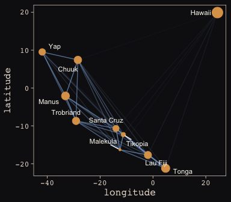<!-- -->

Yep, as expressed by the intensity of the colors of the connecting lines, those correlations are more pronounced. Here's our Figure 13.10.b.


```r
# new data for fitted()
nd <- 
  tibble(logpop = seq(from = 6, to = 14, length.out = 30),
         lat = median(d$lat),
         lon2 = median(d$lon2))

# fitted()
ftd <-
  fitted(b13.7, newdata = nd) %>% 
  as_tibble() %>% 
  bind_cols(nd)
  
# making Rho tidy
Rho %>%
  as_tibble() %>%
  gather() %>%
  mutate(culture = rep(unique(d$culture), each = 10) %>% as.character(),
         culture_2 = rep(unique(d$culture), times = 10) %>% as.character()) %>% 
  mutate(group = paste(pmin(culture, culture_2), pmax(culture, culture_2)),
         culture = culture %>% as.factor(),
         rev_value = max(value) - value) %>% 
  left_join(d, by = "culture") %>% 
  
# The plot
  ggplot(aes(x = logpop)) +
  geom_ribbon(data = ftd,
              aes(ymin = Q2.5, ymax = Q97.5),
              fill = "#394165", alpha = .5) +
  geom_line(data = ftd,
            aes(y = Estimate), color = "#100F14", linetype = 1, size = 1.1) + #  80A0C7 100F14
  geom_line(aes(y = total_tools, group = group, alpha = value^2),
            color = "#80A0C7") +
  geom_point(data = d, aes(y = total_tools, size = logpop), color = "#DCA258") +
  geom_text_repel(data = d, aes(y = total_tools, label = culture), 
                  seed = 0, point.padding = .3, size = 3, color = "#FCF9F0") +
  scale_alpha_continuous(range = c(0, 1)) +
  labs(x = "log population",
       y = "total tools") +
  coord_cartesian(xlim = range(d$logpop),
                  y = range(d$total_tools)) +
  theme(legend.position = "none") +
  theme_pearl_earring
```

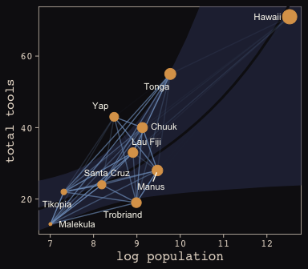<!-- -->

Same deal. Our higher correlations make for a more intensely-webbed plot. To learn more on Bürkner's thoughts on this model in brms, check out the [thread on this issue](https://github.com/paul-buerkner/brms/issues/300).

##### Bonus: Another Berkley-admissions-data-like example. 

[McElreath uploaded recordings](https://www.youtube.com/channel/UCNJK6_DZvcMqNSzQdEkzvzA/playlists) of him teaching out of his text for a graduate course during the 2017/2018 fall semester. In the beginning of [lecture 13 from week 7](https://www.youtube.com/watch?v=rSQ1XMwO_9A&t), he discussed a paper from [van der Lee and Ellemers (2015) published an article in PNAS]( http://www.pnas.org/content/112/40/12349.abstract). Their paper suggested male researchers were more likely than female researchers to get research funding in the Netherlands. In their initial analysis (p. 12350) they provided a simple $\chi^2$ test to test the null hypothesis there was no difference in success for male versus female researchers, for which they reported $\chi^2$ (1) = 4.01, *P* = 0.045. Happily, van der Lee and Ellemers provided their data values in their supplemental material (i.e., [Table S1.](http://www.pnas.org/content/suppl/2015/09/16/1510159112.DCSupplemental/pnas.201510159SI.pdf)), which McElreath also displayed in his video. 

Their data follows the same structure as the Berkley admissions data. In his lecture, McElreath suggested their $\chi^2$ test is an example of Simpson’s paradox, just as with the Berkley data. He isn't the first person to raise this criticism (see [Volker and SteenBeek’s critique](http://www.pnas.org/content/112/51/E7036.full), which McElreath also pointed to in the lecture).

Here are the data:


```r
funding <- 
  tibble(
    discipline = rep(c("Chemical sciences", "Physical sciences",
                       "Physics", "Humanities", "Technical sciences",
                       "Interdisciplinary", "Earth/life sciences",
                       "Social sciences", "Medical sciences"),
                     each = 2),
    gender = rep(c("m", "f"), times = 9),
    applications = c(83, 39, 135, 39, 67, 9, 230, 166, 189, 
                     62, 105, 78, 156, 126, 425, 409, 245, 260) %>% as.integer(),
    awards = c(22, 10, 26, 9, 18, 2, 33, 32, 30, 
               13, 12, 17, 38, 18, 65, 47, 46, 29) %>% as.integer(),
    rejects = c(61, 29, 109, 30, 49, 7, 197, 134, 159, 
                49, 93, 61, 118, 108, 360, 362, 199, 231) %>% as.integer(),
    male = ifelse(gender == "f", 0, 1) %>% as.integer()
  )

funding
```

```
## # A tibble: 18 x 6
##    discipline          gender applications awards rejects  male
##    <chr>               <chr>         <int>  <int>   <int> <int>
##  1 Chemical sciences   m                83     22      61     1
##  2 Chemical sciences   f                39     10      29     0
##  3 Physical sciences   m               135     26     109     1
##  4 Physical sciences   f                39      9      30     0
##  5 Physics             m                67     18      49     1
##  6 Physics             f                 9      2       7     0
##  7 Humanities          m               230     33     197     1
##  8 Humanities          f               166     32     134     0
##  9 Technical sciences  m               189     30     159     1
## 10 Technical sciences  f                62     13      49     0
## 11 Interdisciplinary   m               105     12      93     1
## 12 Interdisciplinary   f                78     17      61     0
## 13 Earth/life sciences m               156     38     118     1
## 14 Earth/life sciences f               126     18     108     0
## 15 Social sciences     m               425     65     360     1
## 16 Social sciences     f               409     47     362     0
## 17 Medical sciences    m               245     46     199     1
## 18 Medical sciences    f               260     29     231     0
```

Let’s fit a few models.

First, we’ll fit an analogue to the initial van der Lee and Ellemers $\chi^2$ test. Since we’re Bayesian modelers, we’ll use a simple logistic regression, using `male` (dummy coded 0 = female, 1 = male) to predict admission (i.e., `awards`).


```r
b13.bonus_0 <- 
  brm(data = funding, family = binomial,
      awards | trials(applications) ~ 1 + male,
      # Note our continued use of weakly-regularizing priors
      prior = c(set_prior("normal(0, 4)", class = "Intercept"),
                set_prior("normal(0, 4)", class = "b")),
      iter = 5000, warmup = 1000, chains = 4, cores = 4)
```

The chains look great. Here are the posterior summaries:


```r
tidy(b13.bonus_0) %>%
  filter(term != "lp__") %>%
  mutate_if(is.numeric, round, digits = 2)
```

```
##          term estimate std.error lower upper
## 1 b_Intercept    -1.74      0.08 -1.88 -1.61
## 2      b_male     0.21      0.10  0.04  0.38
```

Yep, the 95% intervals for `male` dummy exclude zero. If you wanted a one-sided Bayesian $p$-value, you might do something like:


```r
posterior_samples(b13.bonus_0) %>%
  summarise(One_sided_Bayesian_p_value = filter(., b_male <= 0) %>% nrow()/nrow(.))
```

```
##   One_sided_Bayesian_p_value
## 1                    0.02225
```

Pretty small. But recall how Simpson's paradox helped us understand the Berkley data. Different departments in Berkley had different acceptance rates AND different ratios of male and female applicants. Similarly, different academic disciplines in the Netherlands might have different `award` rates for funding AND different ratios of male and female applications. 

Just like in section 13.2, let's fit two more models. The first model will allow intercepts to vary by discipline. The second model will allow intercepts and the `male` dummy slopes to vary by discipline.


```r
b13.bonus_1 <- 
  brm(data = funding, family = binomial,
      awards | trials(applications) ~ 1 + male + (1 | discipline),
      prior = c(set_prior("normal(0, 4)", class = "Intercept"),
                set_prior("normal(0, 4)", class = "b"),
                set_prior("cauchy(0, 1)", class = "sd")),
      iter = 5000, warmup = 1000, chains = 4, cores = 4,
      control = list(adapt_delta = .99))

b13.bonus_2 <- 
  brm(data = funding, family = binomial,
      awards | trials(applications) ~ 1 + male + (1 + male | discipline),
      prior = c(set_prior("normal(0, 4)", class = "Intercept"),
                set_prior("normal(0, 4)", class = "b"),
                set_prior("cauchy(0, 1)", class = "sd"),
                set_prior("lkj(4)", class = "cor")),
      iter = 5000, warmup = 1000, chains = 4, cores = 4,
      control = list(adapt_delta = .99))
```

We'll compare the models with information criteria.


```r
waic(b13.bonus_0, b13.bonus_1, b13.bonus_2)
```

```
##                             WAIC   SE
## b13.bonus_0               129.72 8.91
## b13.bonus_1               125.72 7.35
## b13.bonus_2               116.15 5.62
## b13.bonus_0 - b13.bonus_1   4.00 6.27
## b13.bonus_0 - b13.bonus_2  13.56 5.54
## b13.bonus_1 - b13.bonus_2   9.57 2.87
```

The WAIC suggests the varying intercepts/varying slopes model made the best sense of the data. Here's what the random intercepts look like in a coefficient plot.


```r
coef(b13.bonus_2)$discipline[, , 2] %>% 
  as_tibble() %>% 
  mutate(discipline = c("Chemical sciences", "Physical sciences",
                        "Physics", "Humanities", "Technical sciences",
                        "Interdisciplinary", "Earth/life sciences",
                        "Social sciences", "Medical sciences")) %>%
  
  ggplot(aes(x = discipline, y = Estimate,
             ymin = Q2.5,
             ymax = Q97.5)) +
  geom_hline(yintercept = 0, color = "#E8DCCF", size = 1/10) +
  geom_hline(yintercept = fixef(b13.bonus_2)[2], linetype = 3, color = "#A65141") +
  geom_pointrange(shape = 20, color = "#A65141") +
  labs(title = "Random slopes for the male dummy",
       subtitle = "The vertical dotted line is the posterior mean of the fixed effect for the\nmale dummy. The dots and horizontal lines are the posterior means and\npercentile-based 95% intervals, respectively. The values are on the log scale.",
       x = NULL, y = NULL) +
  coord_flip(ylim = -1:1) +
  theme_pearl_earring +
  theme(axis.ticks.y = element_blank(),
        axis.text.y = element_text(hjust = 0))
```

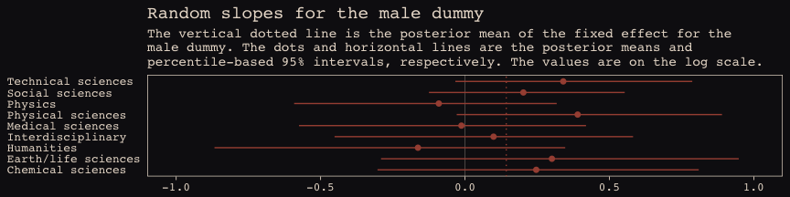<!-- -->

Note how the 95% intervals for all the random `male` slopes contain zero within their bounds. Here are the fixed effects:


```r
tidy(b13.bonus_2) %>%
  filter(str_detect(term , "b_")) %>%
  mutate_if(is.numeric, round, digits = 2)
```

```
##          term estimate std.error lower upper
## 1 b_Intercept    -1.62      0.15 -1.85 -1.37
## 2      b_male     0.14      0.17 -0.15  0.41
```

And if you wanted a one-sided Bayesian $p$-value for the `male` dummy for the full model:


```r
posterior_samples(b13.bonus_2) %>%
  summarise(One_sided_Bayesian_p_value = filter(., b_male <= 0) %>% nrow()/nrow(.))
```

```
##   One_sided_Bayesian_p_value
## 1                    0.18575
```

So, the estimate of the gender bias is small and consistent with the null hypothesis. Which is good! We want gender equality for things like funding success.

Note. The analyses in this document were done with:

* R            3.4.4
* RStudio      1.1.442
* rmarkdown    1.9
* dutchmasters 0.1.0
* tidyverse    1.2.1 
* MASS         7.3-47
* rethinking   1.59
* brms         2.3.1
* rstan        2.17.3
* broom        0.4.2
* ggrepel      0.7.0
* ggbeeswarm   0.5.3
* bayesplot    1.5.0

## Reference

McElreath, R. (2016). *Statistical rethinking: A Bayesian course with examples in R and Stan.* Chapman & Hall/CRC Press.


