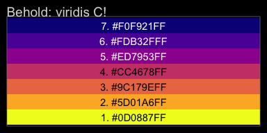
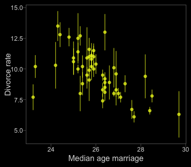
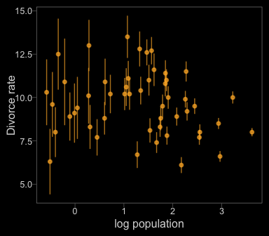
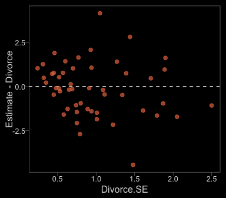
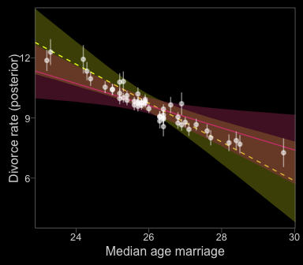
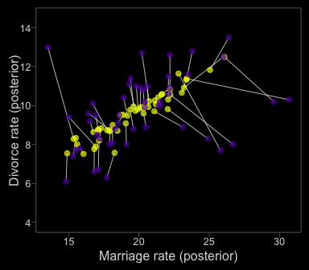
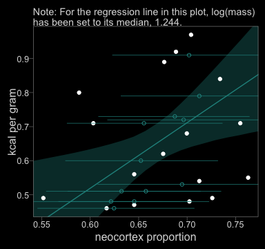
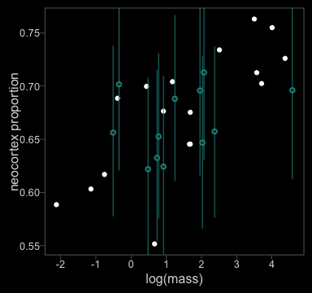
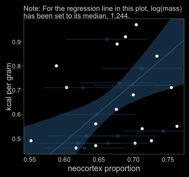
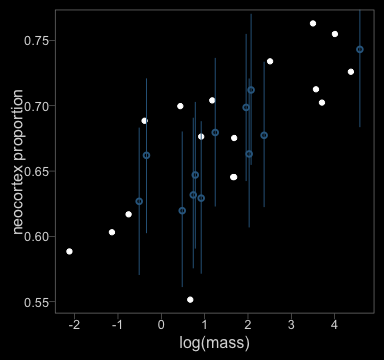

## 14.1. Measurement error

First, let's grab our `WaffleDivorce` data.


```r
library(rethinking)
data(WaffleDivorce)
d <- WaffleDivorce
rm(WaffleDivorce)
```

Switching out rethinking for brms.


```r
detach(package:rethinking, unload = T)
library(brms)
```

The brms package currently supports `theme_black()`, which changes the default ggplot2 theme to a black background with white lines, text, and so forth. You can find the origins of the code, [here](https://jonlefcheck.net/2013/03/11/black-theme-for-ggplot2-2/). 

Though I like the idea of brms including `theme_black()`, I'm not a fan of some of the default settings (e.g., it includes gridlines). Happily, data scientist [Tyler Rinker](https://github.com/trinker) has some nice alternative `theme_black()` code you can find [here](https://github.com/trinker/plotflow/blob/master/R/theme_black.R). The version of `theme_black()` used for this chapter is based on his version, with a few amendments.


```r
theme_black <- 
  function(base_size=12, base_family="") {
    theme_grey(base_size=base_size, base_family=base_family) %+replace%
        theme(
            # Specify axis options
            axis.line=element_blank(),
            # All text colors used to be "grey55"
            axis.text.x=element_text(size=base_size*0.8, color="grey85",
                lineheight=0.9, vjust=1),
            axis.text.y=element_text(size=base_size*0.8, color="grey85",
                lineheight=0.9,hjust=1),
            axis.ticks=element_line(color="grey55", size = 0.2),
            axis.title.x=element_text(size=base_size, color="grey85", vjust=1,
                margin=ggplot2::margin(.5, 0, 0, 0, "lines")),
            axis.title.y=element_text(size=base_size, color="grey85", angle=90,
                margin=ggplot2::margin(.5, 0, 0, 0, "lines"), vjust=0.5),
            axis.ticks.length=grid::unit(0.3, "lines"),

            # Specify legend options
            legend.background=element_rect(color=NA, fill="black"),
            legend.key=element_rect(color="grey55", fill="black"),
            legend.key.size=grid::unit(1.2, "lines"),
            legend.key.height=NULL,
            legend.key.width=NULL,
            legend.text=element_text(size=base_size*0.8, color="grey85"),
            legend.title=element_text(size=base_size*0.8, face="bold",hjust=0,
                color="grey85"),
            # legend.position="right",
            legend.position = "none",
            legend.text.align=NULL,
            legend.title.align=NULL,
            legend.direction="vertical",
            legend.box=NULL,
            # Specify panel options
            panel.background=element_rect(fill="black", color = NA),
            panel.border=element_rect(fill=NA, color="grey55"),
            panel.grid.major=element_blank(),
            panel.grid.minor=element_blank(),
            panel.spacing=grid::unit(0.25,"lines"),
            # Specify facetting options
            strip.background=element_rect(fill = "black", color="grey10"), # fill="grey30"
            strip.text.x=element_text(size=base_size*0.8, color="grey85"),
            strip.text.y=element_text(size=base_size*0.8, color="grey85",
                angle=-90),
            # Specify plot options
            plot.background=element_rect(color="black", fill="black"),
            plot.title=element_text(size=base_size*1.2, color="grey85", hjust = 0), # added hjust = 0
            plot.subtitle=element_text(size=base_size*.9, color="grey85", hjust = 0), # added line
            # plot.margin=grid::unit(c(1, 1, 0.5, 0.5), "lines")
            plot.margin=grid::unit(c(0.5, 0.5, 0.5, 0.5), "lines")
    )
}
```

One way to use `theme_black()` is to make it part of the code for an individual plot, such as `ggplot() + geom_point() + theme_back()`. Another way is to make `theme_black()` the default setting with `bayesplot::theme_set()`. That's the method we'll use.


```r
library(bayesplot)

theme_set(theme_black())

# To reset the default ggplot2 theme to its traditional parameters, use this code:
# theme_set(theme_default()) 
```

In the [brms reference manual](https://cran.r-project.org/web/packages/brms/brms.pdf), Bürkner recommended complimenting `theme_black()` with color scheme "C" from the [viridis package](https://cran.r-project.org/web/packages/viridis/index.html), which provides a variety of [colorblind-safe color palettes](https://cran.r-project.org/web/packages/viridis/vignettes/intro-to-viridis.html).


```r
# install.packages("viridis")
library(viridis)
```

The `viridis_pal()` function gives a list of colors within a given palette. The colors in each palette fall on a spectrum. Within `viridis_pal()`, the `option` argument allows one to select a given spectrum, "C", in our case. The final parentheses, `()`, allows one to determine how many discrete colors one would like to break the spectrum up by. We'll choose 7.


```r
viridis_pal(option = "C")(7)
```

```
## [1] "#0D0887FF" "#5D01A6FF" "#9C179EFF" "#CC4678FF" "#ED7953FF" "#FDB32FFF" "#F0F921FF"
```

With a little data wrangling, we can put the colors of our palette in a tibble and display them in a plot.


```r
library(tidyverse)

viridis_pal(option = "C")(7) %>%
  as_tibble() %>% 
  mutate(color_number = str_c(1:7, ". ", value),
         number = 1:7) %>%
  
  ggplot(aes(x = factor(0), y = reorder(color_number, number))) +
  geom_tile(aes(fill = factor(number))) +
  geom_text(aes(color = factor(number), label = color_number)) +
  scale_color_manual(values = c(rep("black", times = 4), 
                                rep("white", times = 3))) +
  scale_fill_viridis(option = "C", discrete = T, direction = -1) +
  scale_x_discrete(NULL, breaks = NULL) +
  scale_y_discrete(NULL, breaks = NULL) +
  ggtitle("Behold: viridis C!")
```

<!-- -->

Now, let's make use of our custom theme and reproduce/reimagine Figure 14.1.a. 


```r
color <- viridis_pal(option = "C")(7)[7]

d %>%
  ggplot(aes(x = MedianAgeMarriage, 
             y = Divorce,
             ymin = Divorce - Divorce.SE, 
             ymax = Divorce + Divorce.SE)) +
  geom_pointrange(shape = 20, alpha = 2/3, color = color) +
  labs(x = "Median age marriage" , y = "Divorce rate")
```

<!-- -->

Note how `viridis_pal(option = "C")(7)[7]` called the seventh color in the color scheme, `"#F0F921FF"`. For Figure 14.1.b, we'll select the sixth color in the palette by coding `viridis_pal(option = "C")(7)[6]`.


```r
color <- viridis_pal(option = "C")(7)[6]

d %>%
  ggplot(aes(x = log(Population), 
             y = Divorce,
             ymin = Divorce - Divorce.SE, 
             ymax = Divorce + Divorce.SE)) +
  geom_pointrange(shape = 20, alpha = 2/3, color = color) +
  labs(x = "log population", 
       y = "Divorce rate")
```

<!-- -->

### 14.1.1. Error on the outcome.

Now we're ready to fit some models. In brms, there are at least two ways to accommodate measurement error in the criterion. The first way uses the `se()` syntax, following the form `response | se(se_response, sigma = TRUE)`. In this form, `se` stands for standard error, the loose frequentist analogue to the Bayesian posterior *SD*. Unless you're fitting a meta-analysis on summary information, make sure to specify `sigma = TRUE`. Without that you'll have no estimate for $\sigma$! For more information on the `se()` method, go to the [brms reference manual](https://cran.r-project.org/web/packages/brms/brms.pdf) and find the *Additional response information* subsection of the *brmsformula* section.

The second way uses the `mi()` syntax, following the form `response | mi(se_response)`. This follows a missing data logic, resulting in Bayesian missing data imputation for the criterion values. The `mi()` syntax is based on the newer missing data capabilities for brms. We'll explain it a little more in the second half of this chapter.

We'll start off useing both methods. Our first model, `b14.1_se`, will follow the `se()` syntax; the second model, `b14.1_mi`, will follow the `mi()` syntax.


```r
# Putting the data into a list
dlist <- list(
    div_obs = d$Divorce,
    div_sd  = d$Divorce.SE,
    R       = d$Marriage,
    A       = d$MedianAgeMarriage)

# Here we specify the initial (i.e., starting) values
inits <- list(Yl = dlist$div_obs)
inits_list <- list(inits, inits)

# Finally, the models
b14.1_se <- 
  brm(data = dlist, family = gaussian,
      div_obs | se(div_sd, sigma = TRUE) ~ 0 + intercept + R + A,
      prior = c(set_prior("normal(0, 10)", class = "b"),
                set_prior("cauchy(0, 2.5)", class = "sigma")),
      iter = 5000, warmup = 1000, cores = 2, chains = 2,
      control = list(adapt_delta = 0.99,
                     max_treedepth = 12),
      inits = inits_list)

b14.1_mi <- 
  brm(data = dlist, family = gaussian,
      div_obs | mi(div_sd) ~ 0 + intercept + R + A,
      prior = c(set_prior("normal(0, 10)", class = "b"),
                set_prior("cauchy(0, 2.5)", class = "sigma")),
      iter = 5000, warmup = 1000, cores = 2, chains = 2,
      control = list(adapt_delta = 0.99,
                     max_treedepth = 12),
      save_mevars = TRUE,  # note this line for the mi() model
      inits = inits_list)
```

Before we dive into the model summaries, notice how the starting values (i.e., `inits`) differ by model. Even though we coded `inits = inits_list` for both models, the differ by `fit@inits`. 


```r
b14.1_se$fit@inits
```

```
## [[1]]
## [[1]]$b
## [1]  0.6084162 -1.6136396 -0.6907710
## 
## [[1]]$sigma
## [1] 1.651458
## 
## 
## [[2]]
## [[2]]$b
## [1] 1.4044675 0.3984267 0.1093932
## 
## [[2]]$sigma
## [1] 5.786521
```

```r
b14.1_mi$fit@inits
```

```
## [[1]]
## [[1]]$Yl
##  [1] 12.7 12.5 10.8 13.5  8.0 11.6  6.7  8.9  6.3  8.5 11.5  8.3  7.7  8.0 11.0 10.2 10.6 12.6 11.0
## [20] 13.0  8.8  7.8  9.2  7.4 11.1  9.5  9.1  8.8 10.1  6.1 10.2  6.6  9.9  8.0  9.5 12.8 10.4  7.7
## [39]  9.4  8.1 10.9 11.4 10.0 10.2  9.6  8.9 10.0 10.9  8.3 10.3
## 
## [[1]]$b
## [1] -1.84002039  1.99939838 -0.09915831
## 
## [[1]]$sigma
## [1] 3.359573
## 
## 
## [[2]]
## [[2]]$Yl
##  [1] 12.7 12.5 10.8 13.5  8.0 11.6  6.7  8.9  6.3  8.5 11.5  8.3  7.7  8.0 11.0 10.2 10.6 12.6 11.0
## [20] 13.0  8.8  7.8  9.2  7.4 11.1  9.5  9.1  8.8 10.1  6.1 10.2  6.6  9.9  8.0  9.5 12.8 10.4  7.7
## [39]  9.4  8.1 10.9 11.4 10.0 10.2  9.6  8.9 10.0 10.9  8.3 10.3
## 
## [[2]]$b
## [1] -1.0102658  0.9673734  0.2870645
## 
## [[2]]$sigma
## [1] 0.3158946
```

As we explore further, it should become apparent why. Here are the primary model summaries.


```r
print(b14.1_se)
```

```
##  Family: gaussian 
##   Links: mu = identity; sigma = identity 
## Formula: div_obs | se(div_sd, sigma = TRUE) ~ 0 + intercept + R + A 
##    Data: dlist (Number of observations: 50) 
## Samples: 2 chains, each with iter = 5000; warmup = 1000; thin = 1;
##          total post-warmup samples = 8000
## 
## Population-Level Effects: 
##           Estimate Est.Error l-95% CI u-95% CI Eff.Sample Rhat
## intercept    21.37      6.63     7.81    33.92       1602 1.00
## R             0.13      0.08    -0.02     0.28       1923 1.00
## A            -0.55      0.21    -0.95    -0.11       1720 1.00
## 
## Family Specific Parameters: 
##       Estimate Est.Error l-95% CI u-95% CI Eff.Sample Rhat
## sigma     1.12      0.21     0.75     1.55       2621 1.00
## 
## Samples were drawn using sampling(NUTS). For each parameter, Eff.Sample 
## is a crude measure of effective sample size, and Rhat is the potential 
## scale reduction factor on split chains (at convergence, Rhat = 1).
```

```r
print(b14.1_mi)
```

```
##  Family: gaussian 
##   Links: mu = identity; sigma = identity 
## Formula: div_obs | mi(div_sd) ~ 0 + intercept + R + A 
##    Data: dlist (Number of observations: 50) 
## Samples: 2 chains, each with iter = 5000; warmup = 1000; thin = 1;
##          total post-warmup samples = 8000
## 
## Population-Level Effects: 
##           Estimate Est.Error l-95% CI u-95% CI Eff.Sample Rhat
## intercept    21.49      6.56     8.62    34.23       4446 1.00
## R             0.12      0.08    -0.03     0.27       5039 1.00
## A            -0.55      0.21    -0.96    -0.13       4510 1.00
## 
## Family Specific Parameters: 
##       Estimate Est.Error l-95% CI u-95% CI Eff.Sample Rhat
## sigma     1.12      0.21     0.76     1.56       3079 1.00
## 
## Samples were drawn using sampling(NUTS). For each parameter, Eff.Sample 
## is a crude measure of effective sample size, and Rhat is the potential 
## scale reduction factor on split chains (at convergence, Rhat = 1).
```

Based on the `print()`/`summary()` information, the main parameters for the models are about the same. However, the plot deepens when we summarize the models with the `broom::tidy()` method. 


```r
library(broom)

tidy(b14.1_se) %>%
  mutate_if(is.numeric, round, digits = 2)
```

```
##          term estimate std.error   lower   upper
## 1 b_intercept    21.37      6.63   10.11   31.85
## 2         b_R     0.13      0.08    0.00    0.25
## 3         b_A    -0.55      0.21   -0.89   -0.19
## 4       sigma     1.12      0.21    0.80    1.48
## 5        lp__  -105.41      1.46 -108.26 -103.70
```

```r
tidy(b14.1_mi) %>%
  mutate_if(is.numeric, round, digits = 2)
```

```
##           term estimate std.error   lower   upper
## 1  b_intercept    21.49      6.56   10.67   32.33
## 2          b_R     0.12      0.08    0.00    0.25
## 3          b_A    -0.55      0.21   -0.90   -0.20
## 4        sigma     1.12      0.21    0.81    1.47
## 5        Yl[1]    11.77      0.66   10.70   12.88
## 6        Yl[2]    11.18      1.05    9.49   12.90
## 7        Yl[3]    10.47      0.62    9.47   11.49
## 8        Yl[4]    12.32      0.87   10.94   13.77
## 9        Yl[5]     8.05      0.24    7.66    8.44
## 10       Yl[6]    11.00      0.73    9.81   12.21
## 11       Yl[7]     7.25      0.64    6.17    8.30
## 12       Yl[8]     9.36      0.91    7.86   10.85
## 13       Yl[9]     6.99      1.07    5.24    8.78
## 14      Yl[10]     8.54      0.31    8.04    9.04
## 15      Yl[11]    11.14      0.53   10.27   12.02
## 16      Yl[12]     9.09      0.90    7.61   10.57
## 17      Yl[13]     9.69      0.90    8.16   11.12
## 18      Yl[14]     8.11      0.42    7.44    8.80
## 19      Yl[15]    10.68      0.55    9.77   11.60
## 20      Yl[16]    10.17      0.72    8.99   11.36
## 21      Yl[17]    10.51      0.76    9.27   11.76
## 22      Yl[18]    11.94      0.64   10.90   12.99
## 23      Yl[19]    10.49      0.71    9.35   11.68
## 24      Yl[20]    10.17      1.01    8.61   11.90
## 25      Yl[21]     8.75      0.60    7.76    9.73
## 26      Yl[22]     7.77      0.47    6.98    8.54
## 27      Yl[23]     9.14      0.48    8.37    9.94
## 28      Yl[24]     7.74      0.53    6.86    8.58
## 29      Yl[25]    10.43      0.78    9.17   11.70
## 30      Yl[26]     9.54      0.58    8.58   10.48
## 31      Yl[27]     9.43      0.94    7.91   10.98
## 32      Yl[28]     9.25      0.74    8.03   10.48
## 33      Yl[29]     9.18      0.93    7.69   10.73
## 34      Yl[30]     6.39      0.44    5.66    7.10
## 35      Yl[31]     9.99      0.79    8.67   11.29
## 36      Yl[32]     6.69      0.30    6.20    7.19
## 37      Yl[33]     9.89      0.43    9.18   10.61
## 38      Yl[34]     9.78      0.98    8.15   11.36
## 39      Yl[35]     9.44      0.41    8.76   10.12
## 40      Yl[36]    11.95      0.78   10.69   13.25
## 41      Yl[37]    10.07      0.65    9.01   11.14
## 42      Yl[38]     7.80      0.40    7.13    8.46
## 43      Yl[39]     8.22      1.01    6.60    9.91
## 44      Yl[40]     8.40      0.60    7.40    9.40
## 45      Yl[41]    10.01      1.06    8.29   11.74
## 46      Yl[42]    10.94      0.63    9.91   11.98
## 47      Yl[43]    10.02      0.33    9.48   10.57
## 48      Yl[44]    11.08      0.79    9.75   12.35
## 49      Yl[45]     8.91      0.99    7.29   10.55
## 50      Yl[46]     9.00      0.47    8.23    9.79
## 51      Yl[47]     9.96      0.56    9.04   10.89
## 52      Yl[48]    10.63      0.88    9.19   12.06
## 53      Yl[49]     8.47      0.49    7.66    9.28
## 54      Yl[50]    11.51      1.11    9.67   13.33
## 55        lp__  -152.41      6.38 -163.36 -142.32
```

Again, from `b_intercept` to `sigma`, the output is about the same. But model `b14.1_mi`, based on the `mi()` syntax, contained posterior summaries for all 50 of the criterion values. The `se()` method gave us similar model result, but no posterior summaries for the 50 criterion values. The rethinking package indexed those additional 50 as `div_est[i]`; with the `mi()` method, brms indexed them as `Yl[i]`--no big deal. So while both brms methods accommodated measurement error, the `mi()` method appears to be the brms analogue to what McElreath did with his model `m14.1` in the text.

*Note*. The `normal(0, 10)` prior McElreath used was [quite informative and can lead to discrepancies between the rethinking and brms results](https://github.com/paul-buerkner/brms/issues/114) if you're not careful. A large issue is the default way brms handles intercept priors. From the hyperlink, Bürkner wrote:

>"The formula for the original intercept is
`b_intercept = temp_intercept - dot_product(means_X, b)`, where `means_X` is the vector of means of the predictor variables and b is the vector of regression coefficients (fixed effects). That is, when transforming a prior on the intercept to an "equivalent" prior on the temporary intercept, you have to take the means of the predictors and well as the priors on the other coefficients into account."

If this seems confusing, you have an alternative. The `0 + intercept` part of the brm formula kept the intercept in the metric of the untransformed data, leading to similar results to those from rethinking. When your priors are vague, this might not be much of an issue. But this model is quite sensitive to the intercept syntax.

Anyway, since our `mi()`-syntax `b14.1_mi` model appears to be the analogue to McElreath's `m14.1`, we'll use that one for our plots. Here's our Figure 14.2.a.


```r
data_error <- 
  fitted(b14.1_mi) %>%
  as_tibble() %>%
  bind_cols(d %>%
              select(Divorce.SE, Divorce, Marriage))

color <- viridis_pal(option = "C")(7)[5]

data_error %>%
  ggplot(aes(x = Divorce.SE, y = Estimate - Divorce)) +
  geom_hline(yintercept = 0, linetype = 2, color = "white") +
  geom_point(alpha = 2/3, size = 2, color = color)
```

<!-- -->

Before we make Figure 14.2.b., we need to fit a model that ignores measurement error.


```r
b14.1b <- 
  brm(data = dlist, family = gaussian,
      div_obs ~ 0 + intercept + R + A,              
      prior = c(set_prior("normal(0, 50)", class = "b", coef = "intercept"),
                set_prior("normal(0, 10)", class = "b"),
                set_prior("cauchy(0, 2.5)", class = "sigma")),
      chains = 2, iter = 5000, warmup = 1000, cores = 2,
      control = list(adapt_delta = 0.95))

print(b14.1b)
```

```
##  Family: gaussian 
##   Links: mu = identity; sigma = identity 
## Formula: div_obs ~ 0 + intercept + R + A 
##    Data: dlist (Number of observations: 50) 
## Samples: 2 chains, each with iter = 5000; warmup = 1000; thin = 1;
##          total post-warmup samples = 8000
## 
## Population-Level Effects: 
##           Estimate Est.Error l-95% CI u-95% CI Eff.Sample Rhat
## intercept    35.91      7.89    20.79    51.85       1867 1.00
## R            -0.05      0.08    -0.22     0.11       2231 1.00
## A            -0.97      0.25    -1.47    -0.49       1927 1.00
## 
## Family Specific Parameters: 
##       Estimate Est.Error l-95% CI u-95% CI Eff.Sample Rhat
## sigma     1.52      0.16     1.24     1.86       2936 1.00
## 
## Samples were drawn using sampling(NUTS). For each parameter, Eff.Sample 
## is a crude measure of effective sample size, and Rhat is the potential 
## scale reduction factor on split chains (at convergence, Rhat = 1).
```

With that in hand, we're ready for Figure 14.2.b.


```r
nd <- 
  tibble(R      = mean(d$Marriage),
         A      = seq(from = 22, to = 30.2, length.out = 30),
         div_sd = mean(d$Divorce.SE))

fitd_error <- 
  fitted(b14.1_mi, newdata = nd) %>%
  as_tibble() %>%
  bind_cols(nd)

fitd_no_error <- 
  fitted(b14.1b, newdata = nd) %>%
  as_tibble() %>%
  bind_cols(nd)

data_error <- 
  fitted(b14.1_mi) %>%
  as_tibble() %>%
  bind_cols(dlist %>%
              as_tibble())

color_y <- viridis_pal(option = "C")(7)[7]
color_r <- viridis_pal(option = "C")(7)[4]

ggplot(data = fitd_error, 
       aes(x = A, y = Estimate)) +
  geom_ribbon(data = fitd_no_error,
              aes(ymin = Q2.5, ymax = Q97.5),
              fill = color_y, alpha = 1/4) +
  geom_line(data = fitd_no_error,
            color = color_y, linetype = 2) +
  geom_ribbon(data = fitd_error,
              aes(ymin = Q2.5, ymax = Q97.5),
              fill = color_r, alpha = 1/3) +
  geom_line(data = fitd_error,
            color = color_r) +
  geom_pointrange(data = data_error,
                  aes(ymin = Estimate - Est.Error,
                      ymax = Estimate + Est.Error),
                  color = "white", shape = 20, alpha = 1/2) +
  labs(x = "Median age marriage" , y = "Divorce rate (posterior)") +
  coord_cartesian(xlim = range(data_error$A), 
                  ylim = c(4, 14))
```

<!-- -->

### 14.1.2. Error on both outcome and predictor.

In brms, you can specify error on predictors with an `me()` statement in the form of `me(predictor, sd_predictor)` where `sd_predictor` is a vector in the data denoting the size of the measurement error, presumed to be in a standard-deviation metric.


```r
# The data
dlist <- list(
  div_obs = d$Divorce,
  div_sd  = d$Divorce.SE,
  mar_obs = d$Marriage,
  mar_sd  = d$Marriage.SE,
  A       = d$MedianAgeMarriage)

# The `inits`
inits <- list(Yl = dlist$div_obs)
inits_list <- list(inits, inits)

# The models
b14.2_se <-
  brm(data = dlist, family = gaussian,
      div_obs | se(div_sd, sigma = TRUE) ~ 0 + intercept + me(mar_obs, mar_sd) + A,
      prior = c(set_prior("normal(0, 10)", class = "b"),
                set_prior("cauchy(0, 2.5)", class = "sigma")),
      iter = 5000, warmup = 1000, chains = 3, cores = 3,
      control = list(adapt_delta = 0.95),
      save_mevars = TRUE) # Note the lack if `inits`. See below.

b14.2_mi <- 
  brm(data = dlist, family = gaussian,
      div_obs | mi(div_sd) ~ 0 + intercept + me(mar_obs, mar_sd) + A,
      prior = c(set_prior("normal(0, 10)", class = "b"),
                set_prior("cauchy(0, 2.5)", class = "sigma")),
      iter = 5000, warmup = 1000, cores = 2, chains = 2,
      control = list(adapt_delta = 0.99,
                     max_treedepth = 12),
      save_mevars = TRUE,
      inits = inits_list)
```

We already know including `inits` values for our `Yl[i]` estimates is a waste of time for our `se()` model. But note how we still defined our `inits` values as `inits <- list(Yl = dlist$div_obs)` for the `mi()` model. Although it’s easy in brms to set the starting values for our `Yl[i]` estimates, much the way McElreth did, that isn’t the case when you have measurement error on the predictors. The brms package uses a non-centered parameterization for these, which requires users to have a deeper understanding of the underlying Stan code. This is where I get off the train, but if you want to go further, `stancode(b14.2_mi)`.

Here's the two versions of the model.


```r
print(b14.2_se)
```

```
##  Family: gaussian 
##   Links: mu = identity; sigma = identity 
## Formula: div_obs | se(div_sd, sigma = TRUE) ~ 0 + intercept + me(mar_obs, mar_sd) + A 
##    Data: dlist (Number of observations: 50) 
## Samples: 3 chains, each with iter = 5000; warmup = 1000; thin = 1;
##          total post-warmup samples = 12000
## 
## Population-Level Effects: 
##                 Estimate Est.Error l-95% CI u-95% CI Eff.Sample Rhat
## intercept          15.63      6.66     2.17    28.75       6662 1.00
## A                  -0.44      0.20    -0.83    -0.04       7659 1.00
## memar_obsmar_sd     0.28      0.11     0.07     0.49       6378 1.00
## 
## Family Specific Parameters: 
##       Estimate Est.Error l-95% CI u-95% CI Eff.Sample Rhat
## sigma     0.99      0.21     0.61     1.44      12000 1.00
## 
## Samples were drawn using sampling(NUTS). For each parameter, Eff.Sample 
## is a crude measure of effective sample size, and Rhat is the potential 
## scale reduction factor on split chains (at convergence, Rhat = 1).
```

```r
print(b14.2_mi)
```

```
##  Family: gaussian 
##   Links: mu = identity; sigma = identity 
## Formula: div_obs | mi(div_sd) ~ 0 + intercept + me(mar_obs, mar_sd) + A 
##    Data: dlist (Number of observations: 50) 
## Samples: 2 chains, each with iter = 5000; warmup = 1000; thin = 1;
##          total post-warmup samples = 8000
## 
## Population-Level Effects: 
##                 Estimate Est.Error l-95% CI u-95% CI Eff.Sample Rhat
## intercept          15.80      6.76     2.36    29.01       2484 1.00
## A                  -0.44      0.20    -0.85    -0.04       2794 1.00
## memar_obsmar_sd     0.27      0.11     0.07     0.48       1849 1.00
## 
## Family Specific Parameters: 
##       Estimate Est.Error l-95% CI u-95% CI Eff.Sample Rhat
## sigma     0.99      0.21     0.61     1.43       1797 1.00
## 
## Samples were drawn using sampling(NUTS). For each parameter, Eff.Sample 
## is a crude measure of effective sample size, and Rhat is the potential 
## scale reduction factor on split chains (at convergence, Rhat = 1).
```

We'll use `broom::tidy()`, again, to get a sense of `depth = 2` summaries.


```r
tidy(b14.2_se) %>%
  mutate_if(is.numeric, round, digits = 2)

tidy(b14.2_mi) %>%
  mutate_if(is.numeric, round, digits = 2)
```

Due to space concerns, I'm not going to show the results, here. You can do that on your own. Both methods yielded the posteriors for `Xme_memar_obs[1]`, but only the `b14.2_mi` model based on the `mi()` syntax yielded posteriors for the criterion, the `Yl[i]` summaries.

Note that you'll need to specify `save_mevars = TRUE` in the `brm()` function order to save the posterior samples of error-adjusted variables obtained by using the `me()` argument. Without doing so, functions like `predict()` may give you trouble.

Here is the code for Figure 14.3.a.


```r
data_error <-
  fitted(b14.2_mi) %>%
  as_tibble() %>%
  bind_cols(d %>%
              select(Divorce.SE, Divorce, Marriage))

color <- viridis_pal(option = "C")(7)[3]

data_error %>%
  ggplot(aes(x = Divorce.SE, y = Estimate - Divorce)) +
  geom_hline(yintercept = 0, linetype = 2, color = "white") +
  geom_point(alpha = 2/3, size = 2, color = color)
```

<!-- -->

To get the posterior samples for error-adjusted `Marriage` rate, we'll use `posterior_samples`. If you examine the object with `glimpse()`, you'll notice 50 `Xme_memar_obsmar_sd[i]` vectors, with $i$ ranging from 1 to 50, each corresponding to one of the 50 states. With a little data wrangling, you can get the mean of each to put in a plot. Once we have those summaries, we' can now'll make our version of Figure 14.4.b.


```r
color_y <- viridis_pal(option = "C")(7)[7]
color_p <- viridis_pal(option = "C")(7)[2]

posterior_samples(b14.2_mi) %>%
  select(starts_with("Xme")) %>%
  gather() %>%
  group_by(key) %>%
  summarise(mean = mean(value)) %>%
  # This ectracts the numerals from the otherwise cumbersione names in key and saves them as numerals
  mutate(key = str_extract(key, "\\d+"),
         key = key %>% as.integer) %>%
  # Because the key numerals were originally treated like text strings, they were not in numeric order. This puts them back in proper order, which is important to do before we bind these values with other data.
  arrange(key) %>%
  select(mean) %>%
  bind_cols(data_error) %>%
  
  ggplot(aes(x = mean, y = Estimate)) +
  geom_segment(aes(xend = Marriage, yend = Divorce),
               color = "white", size = 1/4) +
  geom_point(size = 2, alpha = 2/3, color = color_y) +
  geom_point(aes(x = Marriage, y = Divorce), 
             size = 2, alpha = 2/3, color = color_p) +
  scale_y_continuous(breaks = seq(from = 4, to = 14, by = 2)) +
  labs(x = "Marriage rate (posterior)" , y = "Divorce rate (posterior)") +
  coord_cartesian(ylim = c(4, 14.5))
```

<!-- -->

Our regularization was more agressive than what McElreath showed in the text. I'm unsure of why.

## 14.2. Missing data

Starting with the developer's version 2.1.2, (or the official [version 2.2.0 available on CRAN](https://cran.r-project.org/web/packages/brms/index.html)) brms now supports Bayesian missing data imputation using adaptations of the [multivariate syntax](https://cran.r-project.org/web/packages/brms/vignettes/brms_multivariate.html). The [*Handle Missing Values with brms* vignette](https://cran.r-project.org/web/packages/brms/vignettes/brms_missings.html) is quite helpful.

### 14.2.1. Imputing `neocortex`

Once again, here are the `milk` data.


```r
library(rethinking)
data(milk)
d <- milk

d <-
  d %>%
  mutate(neocortex.prop = neocortex.perc/100,
         logmass        = log(mass))
```

Now we'll switch out rethinking for brms and do a little data manipulation.


```r
detach(package:rethinking, unload = T)
library(brms)
rm(milk)

# prep data
data_list <- 
  list(
    kcal      = d$kcal.per.g,
    neocortex = d$neocortex.prop,
    logmass   = d$logmass)
```

Here's the structure of our data list.


```r
data_list
```

```
## $kcal
##  [1] 0.49 0.51 0.46 0.48 0.60 0.47 0.56 0.89 0.91 0.92 0.80 0.46 0.71 0.71 0.73 0.68 0.72 0.97 0.79
## [20] 0.84 0.48 0.62 0.51 0.54 0.49 0.53 0.48 0.55 0.71
## 
## $neocortex
##  [1] 0.5516     NA     NA     NA     NA 0.6454 0.6454 0.6764     NA 0.6885 0.5885 0.6169 0.6032
## [14]     NA     NA 0.6997     NA 0.7041     NA 0.7340     NA 0.6753     NA 0.7126 0.7260     NA
## [27] 0.7024 0.7630 0.7549
## 
## $logmass
##  [1]  0.6678294  0.7371641  0.9202828  0.4824261  0.7839015  1.6582281  1.6808279  0.9202828
##  [9] -0.3424903 -0.3856625 -2.1202635 -0.7550226 -1.1394343 -0.5108256  1.2441546  0.4382549
## [17]  1.9572739  1.1755733  2.0719133  2.5095993  2.0268316  1.6808279  2.3721112  3.5689692
## [25]  4.3748761  4.5821062  3.7072104  3.4998354  4.0064237
```

When writing a multivariate model in brms, it’s easier to save the model code by itself and then insert it into the `brm()` function. Otherwise, things get cluttered in a hurry.


```r
b_model <- 
  # Here's the primary `kcal` model
  bf(kcal      | mi() ~ 1 + mi(neocortex) + logmass) + 
  # Here's the model for the missing `neocortex` data 
  bf(neocortex | mi() ~ 1) + 
  # Here we set the residual correlations for the two models to zero
  set_rescor(FALSE)
```

Note the `mi(neocortex)` syntax in the `kcal` model. This indicates that the predictor, `neocortex`, has missing values that are themselves being modeled. 

To get a sense of how to specify the priors for such a model, use the `get_prior()` function.


```r
get_prior(data = data_list, 
          family = gaussian,
          b_model)
```

```
##                 prior     class        coef group      resp dpar nlpar bound
## 1                             b                                             
## 2                     Intercept                                             
## 3                             b                        kcal                 
## 4                             b     logmass            kcal                 
## 5                             b mineocortex            kcal                 
## 6 student_t(3, 1, 10) Intercept                        kcal                 
## 7 student_t(3, 0, 10)     sigma                        kcal                 
## 8 student_t(3, 1, 10) Intercept                   neocortex                 
## 9 student_t(3, 0, 10)     sigma                   neocortex
```

With the one-step Bayesian imputation procedure in brms, you might need to use the `resp` argument when specifying non-defaut priors.

Anyway, here we fit the model.


```r
b14.3 <- 
  brm(data = data_list, 
      family = gaussian,
      b_model,  # We inserted the model, here
      prior = c(set_prior("normal(0, 100)", class = "Intercept", resp = "kcal"),
                set_prior("normal(0.5, 1)", class = "Intercept", resp = "neocortex"),
                set_prior("normal(0, 10)", class = "b"),
                set_prior("cauchy(0, 1)", class = "sigma", resp = "kcal"),
                set_prior("cauchy(0, 1)", class = "sigma", resp = "neocortex")),
      iter = 1e4, chains = 2, cores = 2)
```

The model parameters, including the imputed `neocortex` values, indexed by occasion number:


```r
tidy(b14.3) %>%
  mutate_if(is.numeric, round, digits = 2)
```

```
##                     term estimate std.error lower upper
## 1       b_kcal_Intercept    -0.55      0.47 -1.31  0.22
## 2  b_neocortex_Intercept     0.67      0.01  0.65  0.69
## 3         b_kcal_logmass    -0.07      0.02 -0.11 -0.03
## 4   bsp_kcal_mineocortex     1.93      0.73  0.72  3.12
## 5             sigma_kcal     0.13      0.02  0.10  0.17
## 6        sigma_neocortex     0.06      0.01  0.05  0.08
## 7       Ymi_neocortex[2]     0.63      0.05  0.55  0.71
## 8       Ymi_neocortex[3]     0.62      0.05  0.55  0.71
## 9       Ymi_neocortex[4]     0.62      0.05  0.54  0.70
## 10      Ymi_neocortex[5]     0.65      0.05  0.57  0.73
## 11      Ymi_neocortex[9]     0.70      0.05  0.62  0.78
## 12     Ymi_neocortex[14]     0.66      0.05  0.58  0.74
## 13     Ymi_neocortex[15]     0.69      0.05  0.61  0.76
## 14     Ymi_neocortex[17]     0.70      0.05  0.62  0.77
## 15     Ymi_neocortex[19]     0.71      0.05  0.63  0.79
## 16     Ymi_neocortex[21]     0.65      0.05  0.57  0.72
## 17     Ymi_neocortex[23]     0.66      0.05  0.58  0.74
## 18     Ymi_neocortex[26]     0.69      0.05  0.61  0.77
## 19                  lp__    40.62      4.33 32.82 46.72
```

Here's the model that drops the cases with NAs on `neocortex`.


```r
b14.3cc <- 
  brm(data = data_list, 
      family = gaussian,
      kcal ~ 1 + neocortex + logmass,
      prior = c(set_prior("normal(0, 100)", class = "Intercept"),
                set_prior("normal(0, 10)", class = "b"),
                set_prior("cauchy(0, 1)", class = "sigma")),
      iter = 1e4, chains = 2, cores = 2)
```

The parameters:


```r
tidy(b14.3cc) %>%
  mutate_if(is.numeric, round, digits = 2)
```

```
##          term estimate std.error lower upper
## 1 b_Intercept    -1.05      0.59 -1.99 -0.08
## 2 b_neocortex     2.74      0.92  1.24  4.20
## 3   b_logmass    -0.09      0.03 -0.14 -0.05
## 4       sigma     0.14      0.03  0.10  0.20
## 5        lp__    -4.29      1.69 -7.56 -2.35
```

In order to make our versions of Figure 14.4., we'll need to do a little data wrangling with `fitted()`.


```r
nd <-
  tibble(neocortex = seq(from = .5, to = .85, length.out = 30),
         logmass   = median(data_list$logmass))

f_b14.3 <-
  fitted(b14.3, newdata = nd) %>%
  as_tibble() %>%
  bind_cols(nd)

f_b14.3 %>%
  glimpse()
```

```
## Observations: 30
## Variables: 10
## $ Estimate.kcal       <dbl> 0.3261651, 0.3494209, 0.3726768, 0.3959327, 0.4191885, 0.4424444, 0...
## $ Est.Error.kcal      <dbl> 0.12441355, 0.11588710, 0.10740106, 0.09896583, 0.09059559, 0.08231...
## $ Q2.5.kcal           <dbl> 0.08147818, 0.12108296, 0.16040753, 0.20138703, 0.24168390, 0.28144...
## $ Q97.5.kcal          <dbl> 0.5765098, 0.5831633, 0.5900092, 0.5965719, 0.6030822, 0.6098887, 0...
## $ Estimate.neocortex  <dbl> 0.6712486, 0.6712486, 0.6712486, 0.6712486, 0.6712486, 0.6712486, 0...
## $ Est.Error.neocortex <dbl> 0.01370519, 0.01370519, 0.01370519, 0.01370519, 0.01370519, 0.01370...
## $ Q2.5.neocortex      <dbl> 0.6438702, 0.6438702, 0.6438702, 0.6438702, 0.6438702, 0.6438702, 0...
## $ Q97.5.neocortex     <dbl> 0.6977456, 0.6977456, 0.6977456, 0.6977456, 0.6977456, 0.6977456, 0...
## $ neocortex           <dbl> 0.5000000, 0.5120690, 0.5241379, 0.5362069, 0.5482759, 0.5603448, 0...
## $ logmass             <dbl> 1.244155, 1.244155, 1.244155, 1.244155, 1.244155, 1.244155, 1.24415...
```

To include the imputed `neocortex` values in the plot, we'll extract the information from `broom::tidy()`.


```r
f_b14.3_mi <-
  tidy(b14.3) %>%
  filter(str_detect(term, "Ymi")) %>%
  bind_cols(data_list %>%
              as_tibble() %>%
              filter(is.na(neocortex))
            )

# Here's what we did
f_b14.3_mi %>% head()
```

```
##                term  estimate  std.error     lower     upper kcal neocortex    logmass
## 1  Ymi_neocortex[2] 0.6322811 0.04895157 0.5544072 0.7141608 0.51        NA  0.7371641
## 2  Ymi_neocortex[3] 0.6245690 0.05014065 0.5454557 0.7075930 0.46        NA  0.9202828
## 3  Ymi_neocortex[4] 0.6214316 0.05057949 0.5412705 0.7046204 0.48        NA  0.4824261
## 4  Ymi_neocortex[5] 0.6523145 0.04808745 0.5742454 0.7319279 0.60        NA  0.7839015
## 5  Ymi_neocortex[9] 0.7020095 0.04934025 0.6227149 0.7838583 0.91        NA -0.3424903
## 6 Ymi_neocortex[14] 0.6554462 0.04904173 0.5758904 0.7365828 0.71        NA -0.5108256
```

Data wrangling done--here's our code for Figure 14.4.a.


```r
color <- viridis_pal(option = "D")(7)[4]

ggplot(data = f_b14.3, aes(x = neocortex,
                           y = Estimate.kcal)) +
  geom_ribbon(aes(ymin = Q2.5.kcal,
                  ymax = Q97.5.kcal),
              fill = color, alpha = 1/3) +
  geom_line(color = color) +
  geom_point(data = data_list %>% as_tibble(),
             aes(y = kcal),
             color = "white") +
  geom_point(data = f_b14.3_mi,
             aes(x = estimate, y = kcal),
             color = color, shape = 1) +
  geom_segment(data = f_b14.3_mi, 
               aes(x = lower, xend = upper,
                   y = kcal, yend = kcal),
             color = color, size = 1/4) +
  coord_cartesian(xlim = range(data_list$neocortex, na.rm = T),
                  ylim = range(data_list$kcal, na.rm = T)) +
  labs(subtitle = "Note: For the regression line in this plot, log(mass)\nhas been set to its median, 1.244.",
       x = "neocortex proportion",
       y = "kcal per gram")
```

<!-- -->

Figure 14.4.b.


```r
color <- viridis_pal(option = "D")(7)[4]

ggplot(data = data_list %>% as_tibble(), 
       aes(x = logmass, y = neocortex)) +
  geom_point(color = "white") +
  geom_pointrange(data = f_b14.3_mi,
                  aes(x = logmass, y = estimate,
                      ymin = lower, ymax = upper),
             color = color, size = 1/3, shape = 1) +
  scale_x_continuous(breaks = -2:4) +
  coord_cartesian(xlim = range(data_list$logmass, na.rm = T),
                  ylim = range(data_list$neocortex, na.rm = T)) +
  labs(x = "log(mass)",
       y = "neocortex proportion")
```

<!-- -->

### 14.2.2. Improving the imputation model

Adding `logmass` as a predictor to the `neocortex` submodel is pretty simple.


```r
# The model
b_model <- 
  bf(kcal      | mi() ~ 1 + mi(neocortex) + logmass) + 
  bf(neocortex | mi() ~ 1 + logmass) + # Here's the big difference
  set_rescor(FALSE)

# Fit the model
b14.4 <- 
  brm(data = data_list, 
      family = gaussian,
      b_model,
      prior = c(set_prior("normal(0, 100)", class = "Intercept", resp = "kcal"),
                set_prior("normal(0.5, 1)", class = "Intercept", resp = "neocortex"),
                set_prior("normal(0, 10)", class = "b"),
                set_prior("cauchy(0, 1)", class = "sigma", resp = "kcal"),
                set_prior("cauchy(0, 1)", class = "sigma", resp = "neocortex")),
      iter = 1e4, chains = 2, cores = 2,
      # There were a couple divergent transitions with the default `adapt_delta = 0.8`
      control = list(adapt_delta = 0.9))
```

The parameter estimates:


```r
tidy(b14.4) %>%
  mutate_if(is.numeric, round, digits = 2)
```

```
##                     term estimate std.error lower upper
## 1       b_kcal_Intercept    -0.86      0.50 -1.64 -0.01
## 2  b_neocortex_Intercept     0.64      0.01  0.62  0.66
## 3         b_kcal_logmass    -0.09      0.02 -0.13 -0.05
## 4    b_neocortex_logmass     0.02      0.01  0.01  0.03
## 5   bsp_kcal_mineocortex     2.43      0.77  1.09  3.64
## 6             sigma_kcal     0.13      0.02  0.10  0.17
## 7        sigma_neocortex     0.04      0.01  0.03  0.06
## 8       Ymi_neocortex[2]     0.63      0.04  0.58  0.69
## 9       Ymi_neocortex[3]     0.63      0.04  0.57  0.69
## 10      Ymi_neocortex[4]     0.62      0.04  0.56  0.68
## 11      Ymi_neocortex[5]     0.65      0.03  0.59  0.70
## 12      Ymi_neocortex[9]     0.66      0.04  0.60  0.72
## 13     Ymi_neocortex[14]     0.63      0.03  0.57  0.68
## 14     Ymi_neocortex[15]     0.68      0.03  0.62  0.74
## 15     Ymi_neocortex[17]     0.70      0.03  0.64  0.75
## 16     Ymi_neocortex[19]     0.71      0.04  0.65  0.77
## 17     Ymi_neocortex[21]     0.66      0.04  0.61  0.72
## 18     Ymi_neocortex[23]     0.68      0.03  0.62  0.73
## 19     Ymi_neocortex[26]     0.74      0.04  0.68  0.80
## 20                  lp__    48.64      4.31 40.76 54.70
```

Here's our pre-Figure14.5. data wrangling.


```r
f_b14.4 <-
  fitted(b14.4, newdata = nd) %>%
  as_tibble() %>%
  bind_cols(nd)

f_b14.4_mi <-
  tidy(b14.4) %>%
  filter(str_detect(term, "Ymi")) %>%
  bind_cols(data_list %>%
              as_tibble() %>%
              filter(is.na(neocortex))
            )

f_b14.4 %>%
  glimpse()
```

```
## Observations: 30
## Variables: 10
## $ Estimate.kcal       <dbl> 0.2425346, 0.2718337, 0.3011329, 0.3304320, 0.3597311, 0.3890302, 0...
## $ Est.Error.kcal      <dbl> 0.13184967, 0.12271996, 0.11362520, 0.10457450, 0.09558039, 0.08666...
## $ Q2.5.kcal           <dbl> -0.006130095, 0.040476094, 0.087059081, 0.132868954, 0.178714700, 0...
## $ Q97.5.kcal          <dbl> 0.5155597, 0.5253359, 0.5347931, 0.5442452, 0.5547341, 0.5653579, 0...
## $ Estimate.neocortex  <dbl> 0.6670509, 0.6670509, 0.6670509, 0.6670509, 0.6670509, 0.6670509, 0...
## $ Est.Error.neocortex <dbl> 0.009647519, 0.009647519, 0.009647519, 0.009647519, 0.009647519, 0....
## $ Q2.5.neocortex      <dbl> 0.6478213, 0.6478213, 0.6478213, 0.6478213, 0.6478213, 0.6478213, 0...
## $ Q97.5.neocortex     <dbl> 0.6861177, 0.6861177, 0.6861177, 0.6861177, 0.6861177, 0.6861177, 0...
## $ neocortex           <dbl> 0.5000000, 0.5120690, 0.5241379, 0.5362069, 0.5482759, 0.5603448, 0...
## $ logmass             <dbl> 1.244155, 1.244155, 1.244155, 1.244155, 1.244155, 1.244155, 1.24415...
```

```r
f_b14.4_mi %>%
  glimpse()
```

```
## Observations: 12
## Variables: 8
## $ term      <chr> "Ymi_neocortex[2]", "Ymi_neocortex[3]", "Ymi_neocortex[4]", "Ymi_neocortex[5]...
## $ estimate  <dbl> 0.6317407, 0.6292829, 0.6196844, 0.6470233, 0.6620218, 0.6268416, 0.6795267, ...
## $ std.error <dbl> 0.03546612, 0.03570246, 0.03627386, 0.03418512, 0.03673571, 0.03473802, 0.034...
## $ lower     <dbl> 0.5755746, 0.5714457, 0.5612081, 0.5906570, 0.6024662, 0.5704552, 0.6228705, ...
## $ upper     <dbl> 0.6908354, 0.6881814, 0.6803200, 0.7029325, 0.7209369, 0.6832673, 0.7366196, ...
## $ kcal      <dbl> 0.51, 0.46, 0.48, 0.60, 0.91, 0.71, 0.73, 0.72, 0.79, 0.48, 0.51, 0.53
## $ neocortex <dbl> NA, NA, NA, NA, NA, NA, NA, NA, NA, NA, NA, NA
## $ logmass   <dbl> 0.7371641, 0.9202828, 0.4824261, 0.7839015, -0.3424903, -0.5108256, 1.2441546...
```

Figure 14.5.a.


```r
color <- viridis_pal(option = "D")(7)[3]

ggplot(data = f_b14.4, aes(x = neocortex,
                           y = Estimate.kcal)) +
  geom_ribbon(aes(ymin = Q2.5.kcal,
                  ymax = Q97.5.kcal),
              fill = color, alpha = 1/2) +
  geom_line(color = color) +
  geom_point(data = data_list %>% as_tibble(),
             aes(y = kcal),
             color = "white") +
  geom_point(data = f_b14.4_mi,
             aes(x = estimate, y = kcal),
             color = color, shape = 1) +
  geom_segment(data = f_b14.4_mi, 
               aes(x = lower, xend = upper,
                   y = kcal, yend = kcal),
             color = color, size = 1/4) +
  coord_cartesian(xlim = range(data_list$neocortex, na.rm = T),
                  ylim = range(data_list$kcal, na.rm = T)) +
  labs(subtitle = "Note: For the regression line in this plot, log(mass)\nhas been set to its median, 1.244.",
       x = "neocortex proportion",
       y = "kcal per gram")
```

<!-- -->

Figure 14.5.b.


```r
color <- viridis_pal(option = "D")(7)[3]

ggplot(data = data_list %>% as_tibble(), 
       aes(x = logmass, y = neocortex)) +
  geom_point(color = "white") +
  geom_pointrange(data = f_b14.4_mi,
                  aes(x = logmass, y = estimate,
                      ymin = lower, ymax = upper),
             color = color, size = 1/3, shape = 1) +
  scale_x_continuous(breaks = -2:4) +
  coord_cartesian(xlim = range(data_list$logmass, na.rm = T),
                  ylim = range(data_list$neocortex, na.rm = T)) +
  labs(x = "log(mass)",
       y = "neocortex proportion")
```

<!-- -->

Note. The analyses in this document were done with:

* R           3.4.4
* RStudio     1.1.442
* rmarkdown   1.9
* rstan       2.17.3
* rethinking  1.59
* brms        2.3.1
* bayesplot   1.5.0
* viridis     0.4.0
* tidyverse   1.2.1
* broom       0.4.3

## Reference
McElreath, R. (2016). *Statistical rethinking: A Bayesian course with examples in R and Stan.* Chapman & Hall/CRC Press.


