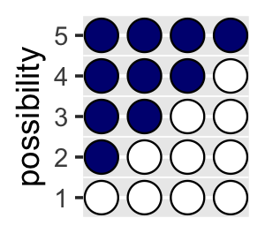
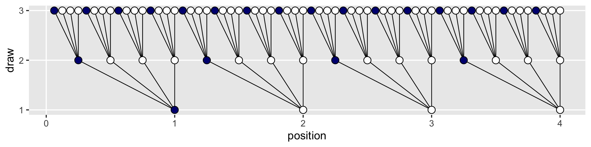
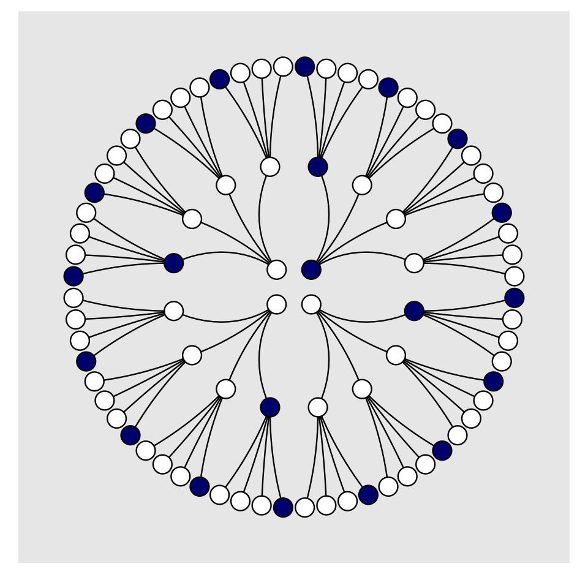
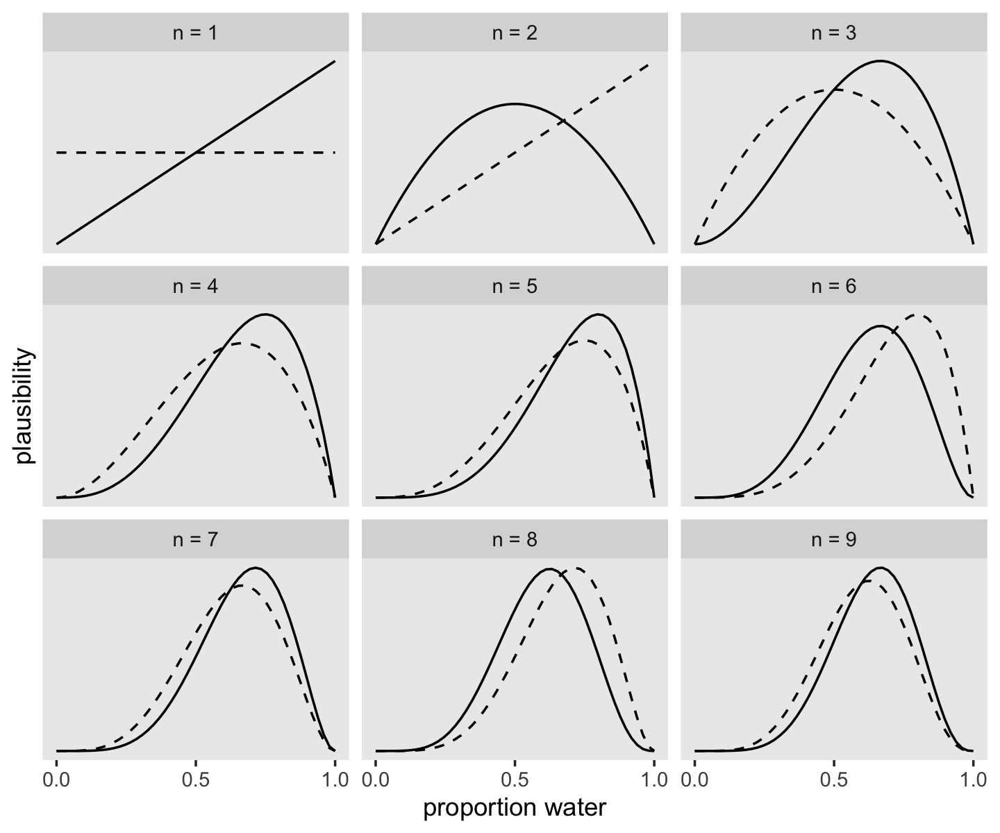
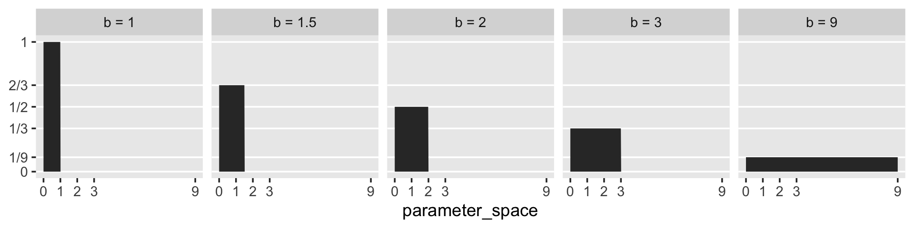
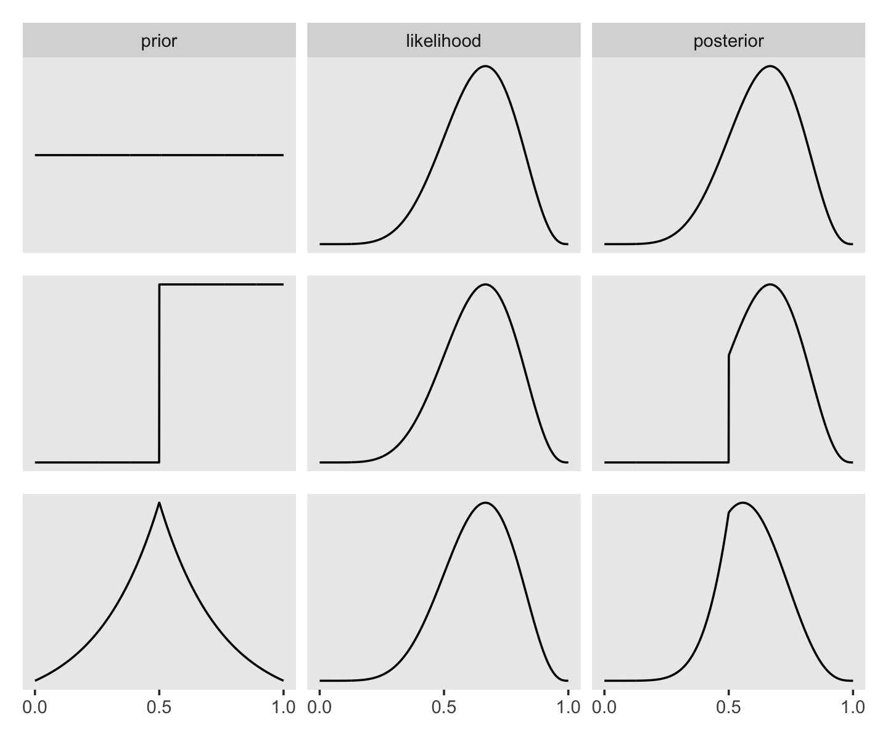
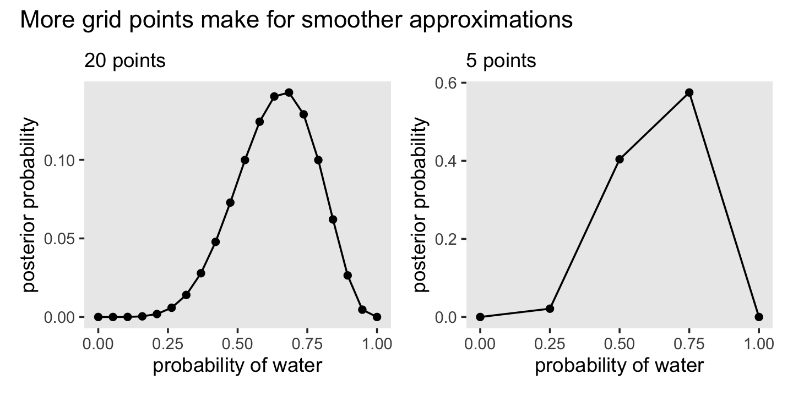

# Small Worlds and Large Worlds

A while back The Oatmeal put together an [infographic on Christopher Columbus](https://theoatmeal.com/comics/columbus_day). I'm no historian and cannot vouch for its accuracy, so make of it what you will.

McElreath described the thrust of this chapter this way:

> In this chapter, you will begin to build Bayesian models. The way that Bayesian models learn from evidence is arguably optimal in the small world. When their assumptions approximate reality, they also perform well in the large world. But large world performance has to be demonstrated rather than logically deduced. [@mcelreathStatisticalRethinkingBayesian2015, p. 20]

Indeed.

## The garden of forking data

Gelman and Loken [-@gelmanGardenForkingPaths2013] wrote a [great paper of a similar name](https://stat.columbia.edu/~gelman/research/unpublished/p_hacking.pdf) and topic. The titles from this section and Gelman and Loken's paper have their origins in the short story by [Jorge Luis Borges](https://en.wikipedia.org/wiki/Jorge_Luis_Borges) [-@borgesjlJardinSenderosQue1941], *The garden of forking paths*. You can find copies of the original short story [here](https://archive.org/stream/TheGardenOfForkingPathsJorgeLuisBorges1941/The-Garden-of-Forking-Paths-Jorge-Luis-Borges-1941_djvu.txt) or [here](https://genius.com/Jorge-luis-borges-the-garden-of-forking-paths-annotated). Here's a snip:

> In all fictional works, each time a man is confronted with several alternatives, he chooses one and eliminates the others; in the fiction of Ts'ui Pên, he chooses--simultaneously--all of them. He creates, in this way, diverse futures, diverse times which themselves also proliferate and fork.

The choices we make in our data analyses proliferate and fork in this way, too.

### Counting possibilities.

Throughout this project, we'll use the [tidyverse](https://www.tidyverse.org) for data wrangling.


```r
library(tidyverse)
```

If you are new to tidyverse-style syntax, possibly the oddest component is the pipe (i.e., `%>%`). I'm not going to explain the `%>%` in this project, but you might learn more about in [this brief clip](https://youtu.be/9yjhxvu-pDg), starting around [minute 21:25 in this talk by Wickham](https://youtu.be/K-ss_ag2k9E?t=1285), or in [Section 5.6.1 from Grolemund and Wickham's *R for data science*](https://r4ds.had.co.nz/transform.html#combining-multiple-operations-with-the-pipe). Really, all of Chapter 5 of *R4DS* is just great for new R and new tidyverse users. And *R4DS* Chapter 3 is a nice introduction to plotting with ggplot2.

Other than the pipe, the other big thing to be aware of is [tibbles](https://tibble.tidyverse.org) [@R-tibble]. For our purposes, think of a tibble as a data object with two dimensions defined by rows and columns. And importantly, tibbles are just special types of [data frames](https://bookdown.org/rdpeng/rprogdatascience/r-nuts-and-bolts.html#data-frames). So whenever we talk about data frames, we're also talking about tibbles. For more on the topic, check out [*R4SD*, Chapter 10](https://r4ds.had.co.nz/tibbles.html).

If we're willing to code the marbles as 0 = "white" 1 = "blue", we can arrange the possibility data in a tibble as follows.


```r
d <-
  tibble(p1 = 0,
         p2 = rep(1:0, times = c(1, 3)),
         p3 = rep(1:0, times = c(2, 2)),
         p4 = rep(1:0, times = c(3, 1)),
         p5 = 1)

head(d)
```

```
## # A tibble: 4 × 5
##      p1    p2    p3    p4    p5
##   <dbl> <int> <int> <int> <dbl>
## 1     0     1     1     1     1
## 2     0     0     1     1     1
## 3     0     0     0     1     1
## 4     0     0     0     0     1
```

You might depict the possibility data in a plot.


```r
d %>% 
  gather() %>% 
  mutate(x = rep(1:4, times = 5),
         possibility = rep(1:5, each = 4)) %>% 
  
  ggplot(aes(x = x, y = possibility, 
             fill = value %>% as.character())) +
  geom_point(shape = 21, size = 5) +
  scale_fill_manual(values = c("white", "navy")) +
  scale_x_continuous(NULL, breaks = NULL) +
  coord_cartesian(xlim = c(.75, 4.25),
                  ylim = c(.75, 5.25)) +
  theme(legend.position = "none")
```



As a quick aside, check out Suzan Baert's blog post [*Data wrangling part 2: Transforming your columns into the right shape*](https://suzan.rbind.io/2018/02/dplyr-tutorial-2/) for an extensive discussion on `dplyr::mutate()` and `dplyr::gather()`.

Here's the basic structure of the possibilities per marble draw.


```r
tibble(draw    = 1:3,
       marbles = 4) %>% 
  mutate(possibilities = marbles ^ draw) %>% 
  knitr::kable()
```


| draw| marbles| possibilities|
|----:|-------:|-------------:|
|    1|       4|             4|
|    2|       4|            16|
|    3|       4|            64|

If you walk that out a little, you can structure the data required to approach Figure 2.2.


```r
(
  d <-
  tibble(position = c((1:4^1) / 4^0, 
                      (1:4^2) / 4^1, 
                      (1:4^3) / 4^2),
         draw     = rep(1:3, times = c(4^1, 4^2, 4^3)),
         fill     = rep(c("b", "w"), times = c(1, 3)) %>% 
           rep(., times = c(4^0 + 4^1 + 4^2)))
)
```

```
## # A tibble: 84 × 3
##    position  draw fill 
##       <dbl> <int> <chr>
##  1     1        1 b    
##  2     2        1 w    
##  3     3        1 w    
##  4     4        1 w    
##  5     0.25     2 b    
##  6     0.5      2 w    
##  7     0.75     2 w    
##  8     1        2 w    
##  9     1.25     2 b    
## 10     1.5      2 w    
## # … with 74 more rows
```

See what I did there with the parentheses? If you assign a value to an object in R (e.g., `dog <- 1`) and just hit return, nothing will immediately pop up in the [console](https://r4ds.had.co.nz/introduction.html#prerequisites). You have to actually execute `dog` before R will return `1`. But if you wrap the code within parentheses (e.g., `(dog <- 1)`), R will perform the assignment and return the value as if you had executed `dog`.

But we digress. Here's the initial plot.


```r
d %>% 
  ggplot(aes(x = position, y = draw)) +
  geom_point(aes(fill = fill),
             shape = 21, size = 3) +
  scale_y_continuous(breaks = 1:3) +
  scale_fill_manual(values  = c("navy", "white")) +
  theme(legend.position = "none",
        panel.grid.minor = element_blank())
```


To my mind, the easiest way to connect the dots in the appropriate way is to make two auxiliary tibbles.


```r
# these will connect the dots from the first and second draws
(
  lines_1 <-
  tibble(x    = rep((1:4), each = 4),
         xend = ((1:4^2) / 4),
         y    = 1,
         yend = 2)
)
```

```
## # A tibble: 16 × 4
##        x  xend     y  yend
##    <int> <dbl> <dbl> <dbl>
##  1     1  0.25     1     2
##  2     1  0.5      1     2
##  3     1  0.75     1     2
##  4     1  1        1     2
##  5     2  1.25     1     2
##  6     2  1.5      1     2
##  7     2  1.75     1     2
##  8     2  2        1     2
##  9     3  2.25     1     2
## 10     3  2.5      1     2
## 11     3  2.75     1     2
## 12     3  3        1     2
## 13     4  3.25     1     2
## 14     4  3.5      1     2
## 15     4  3.75     1     2
## 16     4  4        1     2
```

```r
# these will connect the dots from the second and third draws
(
  lines_2 <-
  tibble(x    = rep(((1:4^2) / 4), each = 4),
         xend = (1:4^3) / (4^2),
         y    = 2,
         yend = 3)
)
```

```
## # A tibble: 64 × 4
##        x   xend     y  yend
##    <dbl>  <dbl> <dbl> <dbl>
##  1  0.25 0.0625     2     3
##  2  0.25 0.125      2     3
##  3  0.25 0.188      2     3
##  4  0.25 0.25       2     3
##  5  0.5  0.312      2     3
##  6  0.5  0.375      2     3
##  7  0.5  0.438      2     3
##  8  0.5  0.5        2     3
##  9  0.75 0.562      2     3
## 10  0.75 0.625      2     3
## # … with 54 more rows
```

We can use the `lines_1` and `lines_2` data in the plot with two `geom_segment()` functions.


```r
d %>% 
  ggplot(aes(x = position, y = draw)) +
  geom_segment(data = lines_1,
               aes(x = x, xend = xend,
                   y = y, yend = yend),
               linewidth = 1/3) +
  geom_segment(data = lines_2,
               aes(x = x, xend = xend,
                   y = y, yend = yend),
               linewidth = 1/3) +
  geom_point(aes(fill = fill),
             shape = 21, size = 3) +
  scale_y_continuous(breaks = 1:3) +
  scale_fill_manual(values = c("navy", "white")) +
  theme(legend.position = "none",
        panel.grid.minor = element_blank())
```



We've generated the values for `position` (i.e., the $x$-axis), in such a way that they're all justified to the right, so to speak. But we'd like to center them. For `draw == 1`, we'll need to subtract 0.5 from each. For `draw == 2`, we need to reduce the scale by a factor of 4 and we'll then need to reduce the scale by another factor of 4 for `draw == 3`. The `ifelse()` function will be of use for that.


```r
d <-
  d %>% 
  mutate(denominator = ifelse(draw == 1, .5,
                              ifelse(draw == 2, .5 / 4,
                                     .5 / 4^2))) %>% 
  mutate(position = position - denominator)

d
```

```
## # A tibble: 84 × 4
##    position  draw fill  denominator
##       <dbl> <int> <chr>       <dbl>
##  1    0.5       1 b           0.5  
##  2    1.5       1 w           0.5  
##  3    2.5       1 w           0.5  
##  4    3.5       1 w           0.5  
##  5    0.125     2 b           0.125
##  6    0.375     2 w           0.125
##  7    0.625     2 w           0.125
##  8    0.875     2 w           0.125
##  9    1.12      2 b           0.125
## 10    1.38      2 w           0.125
## # … with 74 more rows
```

We'll follow the same logic for the `lines_1` and `lines_2` data.


```r
(
  lines_1 <-
  lines_1 %>% 
  mutate(x    = x - .5,
         xend = xend - .5 / 4^1)
)
```

```
## # A tibble: 16 × 4
##        x  xend     y  yend
##    <dbl> <dbl> <dbl> <dbl>
##  1   0.5 0.125     1     2
##  2   0.5 0.375     1     2
##  3   0.5 0.625     1     2
##  4   0.5 0.875     1     2
##  5   1.5 1.12      1     2
##  6   1.5 1.38      1     2
##  7   1.5 1.62      1     2
##  8   1.5 1.88      1     2
##  9   2.5 2.12      1     2
## 10   2.5 2.38      1     2
## 11   2.5 2.62      1     2
## 12   2.5 2.88      1     2
## 13   3.5 3.12      1     2
## 14   3.5 3.38      1     2
## 15   3.5 3.62      1     2
## 16   3.5 3.88      1     2
```

```r
(
  lines_2 <-
  lines_2 %>% 
  mutate(x    = x - .5 / 4^1,
         xend = xend - .5 / 4^2)
)
```

```
## # A tibble: 64 × 4
##        x   xend     y  yend
##    <dbl>  <dbl> <dbl> <dbl>
##  1 0.125 0.0312     2     3
##  2 0.125 0.0938     2     3
##  3 0.125 0.156      2     3
##  4 0.125 0.219      2     3
##  5 0.375 0.281      2     3
##  6 0.375 0.344      2     3
##  7 0.375 0.406      2     3
##  8 0.375 0.469      2     3
##  9 0.625 0.531      2     3
## 10 0.625 0.594      2     3
## # … with 54 more rows
```

Now the plot's looking closer.


```r
d %>% 
  ggplot(aes(x = position, y = draw)) +
  geom_segment(data = lines_1,
               aes(x = x, xend = xend,
                   y = y, yend = yend),
               linewidth = 1/3) +
  geom_segment(data = lines_2,
               aes(x = x, xend = xend,
                   y = y, yend = yend),
               linewidth = 1/3) +
  geom_point(aes(fill = fill),
             shape = 21, size = 3) +
  scale_y_continuous(breaks = 1:3) +
  scale_fill_manual(values = c("navy", "white")) +
  theme(legend.position = "none",
        panel.grid.minor = element_blank())
```


For the final step, we'll use `coord_polar()` to change the [coordinate system](https://ggplot2.tidyverse.org/reference/coord_polar.html), giving the plot a mandala-like feel.


```r
d %>% 
  ggplot(aes(x = position, y = draw)) +
  geom_segment(data = lines_1,
               aes(x = x, xend = xend,
                   y = y, yend = yend),
               linewidth = 1/3) +
  geom_segment(data = lines_2,
               aes(x = x, xend = xend,
                   y = y, yend = yend),
               linewidth = 1/3) +
  geom_point(aes(fill = fill),
             shape = 21, size = 4) +
  scale_fill_manual(values = c("navy", "white")) +
  scale_x_continuous(NULL, limits = c(0, 4), breaks = NULL) +
  scale_y_continuous(NULL, limits = c(0.75, 3), breaks = NULL) +
  coord_polar() +
  theme(legend.position = "none",
        panel.grid = element_blank())
```



To make our version of Figure 2.3, we'll have to add an index to tell us which paths remain logically valid after each choice. We'll call the index `remain`.


```r
lines_1 <-
  lines_1 %>% 
  mutate(remain = c(rep(0:1, times = c(1, 3)),
                    rep(0,   times = 4 * 3)))

lines_2 <-
  lines_2 %>% 
  mutate(remain = c(rep(0,   times = 4),
                    rep(1:0, times = c(1, 3)) %>% 
                      rep(., times = 3),
                    rep(0,   times = 12 * 4)))

d <-
  d %>% 
  mutate(remain = c(rep(1:0, times = c(1, 3)),
                    rep(0:1, times = c(1, 3)),
                    rep(0,   times = 4 * 4),
                    rep(1:0, times = c(1, 3)) %>% 
                      rep(., times = 3),
                    rep(0,   times = 12 * 4))) 

# finally, the plot:
d %>% 
  ggplot(aes(x = position, y = draw)) +
  geom_segment(data = lines_1,
               aes(x = x, xend = xend,
                   y = y, yend = yend,
                   alpha = remain %>% as.character()),
               linewidth = 1/3) +
  geom_segment(data = lines_2,
               aes(x = x, xend = xend,
                   y = y, yend = yend,
                   alpha = remain %>% as.character()),
               linewidth = 1/3) +
  geom_point(aes(fill = fill, alpha = remain %>% as.character()),
             shape = 21, size = 4) +
  # it's the alpha parameter that makes elements semitransparent
  scale_alpha_manual(values = c(1/10, 1)) +
  scale_fill_manual(values = c("navy", "white")) +
  scale_x_continuous(NULL, limits = c(0, 4), breaks = NULL) +
  scale_y_continuous(NULL, limits = c(0.75, 3), breaks = NULL) +
  coord_polar() +
  theme(legend.position = "none",
        panel.grid = element_blank())
```


Letting "w" = a white dot and "b" = a blue dot, we might recreate the table in the middle of page 23 like so.


```r
# if we make two custom functions, here, it will simplify the code within `mutate()`, below
n_blue <- function(x) {
  rowSums(x == "b")
}

n_white <- function(x) {
  rowSums(x == "w")
}

t <-
  # for the first four columns, `p_` indexes position
  tibble(p_1 = rep(c("w", "b"), times = c(1, 4)),
         p_2 = rep(c("w", "b"), times = c(2, 3)),
         p_3 = rep(c("w", "b"), times = c(3, 2)),
         p_4 = rep(c("w", "b"), times = c(4, 1))) %>% 
  mutate(`draw 1: blue`  = n_blue(.),
         `draw 2: white` = n_white(.),
         `draw 3: blue`  = n_blue(.)) %>% 
  mutate(`ways to produce` = `draw 1: blue` * `draw 2: white` * `draw 3: blue`)

t %>% 
  knitr::kable()
```


|p_1 |p_2 |p_3 |p_4 | draw 1: blue| draw 2: white| draw 3: blue| ways to produce|
|:---|:---|:---|:---|------------:|-------------:|------------:|---------------:|
|w   |w   |w   |w   |            0|             4|            0|               0|
|b   |w   |w   |w   |            1|             3|            1|               3|
|b   |b   |w   |w   |            2|             2|            2|               8|
|b   |b   |b   |w   |            3|             1|            3|               9|
|b   |b   |b   |b   |            4|             0|            4|               0|

If you are new to making custom functions in R, you might check out [Chapter 19 in *R4DS*](https://r4ds.had.co.nz/functions.html) or [Chapter 14 in *R programming for data science*](https://bookdown.org/rdpeng/rprogdatascience/functions.html) [@pengProgrammingDataScience2022].

We'll need new data for Figure 2.4. Here's the initial primary data, `d`.


```r
d <-
  tibble(position = c((1:4^1) / 4^0, 
                      (1:4^2) / 4^1, 
                      (1:4^3) / 4^2),
         draw     = rep(1:3, times = c(4^1, 4^2, 4^3)))

(
  d <-
  d %>% 
  bind_rows(
    d, d
  ) %>% 
  # here are the fill colors
  mutate(fill = c(rep(c("w", "b"), times = c(1, 3)) %>% rep(., times = c(4^0 + 4^1 + 4^2)),
                  rep(c("w", "b"), each  = 2)       %>% rep(., times = c(4^0 + 4^1 + 4^2)),
                  rep(c("w", "b"), times = c(3, 1)) %>% rep(., times = c(4^0 + 4^1 + 4^2)))) %>% 
  # now we need to shift the positions over in accordance with draw, like before
  mutate(denominator = ifelse(draw == 1, .5,
                              ifelse(draw == 2, .5 / 4,
                                     .5 / 4^2))) %>% 
  mutate(position = position - denominator) %>% 
  # here we'll add an index for which pie wedge we're working with
  mutate(pie_index = rep(letters[1:3], each = n()/3)) %>% 
  # to get the position axis correct for pie_index == "b" or "c", we'll need to offset
  mutate(position = ifelse(pie_index == "a", position,
                           ifelse(pie_index == "b", position + 4,
                                  position + 4 * 2)))
)
```

```
## # A tibble: 252 × 5
##    position  draw fill  denominator pie_index
##       <dbl> <int> <chr>       <dbl> <chr>    
##  1    0.5       1 w           0.5   a        
##  2    1.5       1 b           0.5   a        
##  3    2.5       1 b           0.5   a        
##  4    3.5       1 b           0.5   a        
##  5    0.125     2 w           0.125 a        
##  6    0.375     2 b           0.125 a        
##  7    0.625     2 b           0.125 a        
##  8    0.875     2 b           0.125 a        
##  9    1.12      2 w           0.125 a        
## 10    1.38      2 b           0.125 a        
## # … with 242 more rows
```

Both `lines_1` and `lines_2` require adjustments for `x` and `xend`. Our current approach is a nested `ifelse()`. Rather than copy and paste that multi-line `ifelse()` code for all four, let's wrap it in a compact function, which we'll call `move_over()`.


```r
move_over <- function(position, index) {
  ifelse(index == "a", position,
         ifelse(index == "b", position + 4,
                position + 4 * 2)
         )
  }
```

Now we'll make our new `lines_1` and `lines_2` data, for which we'll use `move_over()` to adjust their `x` and `xend` positions to the correct spots.


```r
(
  lines_1 <-
  tibble(x    = rep((1:4), each = 4) %>% rep(., times = 3),
         xend = ((1:4^2) / 4)        %>% rep(., times = 3),
         y    = 1,
         yend = 2) %>% 
  mutate(x    = x - .5,
         xend = xend - .5 / 4^1) %>% 
  # here we'll add an index for which pie wedge we're working with
  mutate(pie_index = rep(letters[1:3], each = n()/3)) %>% 
  # to get the position axis correct for `pie_index == "b"` or `"c"`, we'll need to offset
  mutate(x    = move_over(position = x,    index = pie_index),
         xend = move_over(position = xend, index = pie_index))
)
```

```
## # A tibble: 48 × 5
##        x  xend     y  yend pie_index
##    <dbl> <dbl> <dbl> <dbl> <chr>    
##  1   0.5 0.125     1     2 a        
##  2   0.5 0.375     1     2 a        
##  3   0.5 0.625     1     2 a        
##  4   0.5 0.875     1     2 a        
##  5   1.5 1.12      1     2 a        
##  6   1.5 1.38      1     2 a        
##  7   1.5 1.62      1     2 a        
##  8   1.5 1.88      1     2 a        
##  9   2.5 2.12      1     2 a        
## 10   2.5 2.38      1     2 a        
## # … with 38 more rows
```

```r
(
  lines_2 <-
  tibble(x    = rep(((1:4^2) / 4), each = 4)  %>% rep(., times = 3),
         xend = (1:4^3 / 4^2)                 %>% rep(., times = 3),
         y    = 2,
         yend = 3) %>% 
  mutate(x    = x - .5 / 4^1,
         xend = xend - .5 / 4^2) %>% 
  # here we'll add an index for which pie wedge we're working with
  mutate(pie_index = rep(letters[1:3], each = n()/3)) %>% 
  # to get the position axis correct for `pie_index == "b"` or `"c"`, we'll need to offset
  mutate(x    = move_over(position = x,    index = pie_index),
         xend = move_over(position = xend, index = pie_index))
)
```

```
## # A tibble: 192 × 5
##        x   xend     y  yend pie_index
##    <dbl>  <dbl> <dbl> <dbl> <chr>    
##  1 0.125 0.0312     2     3 a        
##  2 0.125 0.0938     2     3 a        
##  3 0.125 0.156      2     3 a        
##  4 0.125 0.219      2     3 a        
##  5 0.375 0.281      2     3 a        
##  6 0.375 0.344      2     3 a        
##  7 0.375 0.406      2     3 a        
##  8 0.375 0.469      2     3 a        
##  9 0.625 0.531      2     3 a        
## 10 0.625 0.594      2     3 a        
## # … with 182 more rows
```

For the last data wrangling step, we add the `remain` indices to help us determine which parts to make semitransparent. I'm not sure of a slick way to do this, so these are the result of brute force counting.


```r
d <- 
  d %>% 
  mutate(remain = c(# `pie_index == "a"`
                    rep(0:1, times = c(1, 3)),
                    rep(0,   times = 4),
                    rep(1:0, times = c(1, 3)) %>% 
                      rep(., times = 3),
                    rep(0,   times = 4 * 4),
                    rep(c(0, 1, 0), times = c(1, 3, 4 * 3)) %>% 
                      rep(., times = 3),
                    # `pie_index == "b"`
                    rep(0:1, each = 2),
                    rep(0,   times = 4 * 2),
                    rep(1:0, each = 2) %>% 
                      rep(., times = 2),
                    rep(0,   times = 4 * 4 * 2),
                    rep(c(0, 1, 0, 1, 0), times = c(2, 2, 2, 2, 8)) %>% 
                      rep(., times = 2),
                    # `pie_index == "c"`
                    rep(0:1, times = c(3, 1)),
                    rep(0,   times = 4 * 3),
                    rep(1:0, times = c(3, 1)), 
                    rep(0,   times = 4 * 4 * 3),
                    rep(0:1, times = c(3, 1)) %>% 
                      rep(., times = 3),
                    rep(0,   times = 4)
                    )
         )

lines_1 <-
  lines_1 %>% 
  mutate(remain = c(rep(0,   times = 4),
                    rep(1:0, times = c(1, 3)) %>% 
                      rep(., times = 3),
                    rep(0,   times = 4 * 2),
                    rep(1:0, each  = 2) %>% 
                      rep(., times = 2),
                    rep(0,   times = 4 * 3),
                    rep(1:0, times = c(3, 1))
                    )
         )

lines_2 <-
  lines_2 %>% 
  mutate(remain = c(rep(0,   times = 4 * 4),
                    rep(c(0, 1, 0), times = c(1, 3, 4 * 3)) %>% 
                      rep(., times = 3),
                    rep(0,   times = 4 * 8),
                    rep(c(0, 1, 0, 1, 0), times = c(2, 2, 2, 2, 8)) %>% 
                      rep(., times = 2),
                    rep(0,   times = 4 * 4 * 3),
                    rep(0:1, times = c(3, 1)) %>% 
                      rep(., times = 3),
                    rep(0,   times = 4)
                    )
         )
```

We're finally ready to plot our Figure 2.4!


```r
d %>% 
  ggplot(aes(x = position, y = draw)) +
  geom_vline(xintercept = c(0, 4, 8), color = "white", linewidth = 2/3) +
  geom_segment(data = lines_1,
               aes(x = x, xend = xend,
                   y = y, yend = yend,
                   alpha = remain %>% as.character()),
               linewidth = 1/3) +
  geom_segment(data = lines_2,
               aes(x = x, xend = xend,
                   y = y, yend = yend,
                   alpha = remain %>% as.character()),
               linewidth = 1/3) +
  geom_point(aes(fill = fill, size = draw, alpha = remain %>% as.character()),
             shape = 21) +
  scale_alpha_manual(values = c(1/10, 1)) +
  scale_fill_manual(values = c("navy", "white")) +
  scale_size_continuous(range = c(3, 1.5)) +
  scale_x_continuous(NULL, limits = c(0, 12),     breaks = NULL) +
  scale_y_continuous(NULL, limits = c(0.75, 3.5), breaks = NULL) +
  coord_polar() +
  theme(legend.position = "none",
        panel.grid = element_blank())
```


### Using prior information.

> We may have prior information about the relative plausibility of each conjecture. This prior information could arise from knowledge of how the contents of the bag were generated. It could also arise from previous data. Or we might want to act as if we had prior information, so we can build conservatism into the analysis. Whatever the source, it would help to have a way to use prior information. Luckily there is a natural solution: Just multiply the prior count by the new count. (p. 25)

Here's the table in the middle of page 25.


```r
t <-
  t %>% 
  rename(`previous counts` = `ways to produce`,
         `ways to produce` = `draw 1: blue`) %>% 
  select(p_1:p_4, `ways to produce`, `previous counts`) %>% 
  mutate(`new count` = `ways to produce` * `previous counts`)

t %>% 
  knitr::kable()
```


|p_1 |p_2 |p_3 |p_4 | ways to produce| previous counts| new count|
|:---|:---|:---|:---|---------------:|---------------:|---------:|
|w   |w   |w   |w   |               0|               0|         0|
|b   |w   |w   |w   |               1|               3|         3|
|b   |b   |w   |w   |               2|               8|        16|
|b   |b   |b   |w   |               3|               9|        27|
|b   |b   |b   |b   |               4|               0|         0|

We might update to reproduce the table a the top of page 26, like this.


```r
t <-
  t %>% 
  select(p_1:p_4, `new count`) %>% 
  rename(`prior count` = `new count`) %>% 
  mutate(`factory count` = c(0, 3:0)) %>% 
  mutate(`new count` = `prior count` * `factory count`)

t %>% 
  knitr::kable()
```


|p_1 |p_2 |p_3 |p_4 | prior count| factory count| new count|
|:---|:---|:---|:---|-----------:|-------------:|---------:|
|w   |w   |w   |w   |           0|             0|         0|
|b   |w   |w   |w   |           3|             3|         9|
|b   |b   |w   |w   |          16|             2|        32|
|b   |b   |b   |w   |          27|             1|        27|
|b   |b   |b   |b   |           0|             0|         0|

To learn more about `dplyr::select()` and `dplyr::rename()`, check out Baert's exhaustive blog post [*Data wrangling part 1: Basic to advanced ways to select columns*](https://suzan.rbind.io/2018/01/dplyr-tutorial-1/).

### From counts to probability.

The opening sentences in this subsection are important: "It is helpful to think of this strategy as adhering to a principle of honest ignorance: *When we don't know what caused the data, potential causes that may produce the data in more ways are more plausible*" (p. 26, *emphasis* in the original).

We can define our updated plausibility as:

<center>

plausibility of {width=5%} after seeing {width=3.5%}

$\propto$

ways {width=5%} can produce {width=3.5%}

$\times$

prior plausibility of {width=5%}

</center>

In other words:

$$
\text{plausibility of } p \text{ after } D_{\text{new}} \propto \text{ ways } p \text{ can produce } D_{\text{new}} \times \text{ prior plausibility of } p
$$

But since we have to standardize the results to get them into a probability metric, the full equation is:

$$
\text{plausibility of } p \text{ after } D_\text{new} = \frac{\text{ ways } p \text{ can produce } D_\text{new} \times \text{ prior plausibility of } p}{\text{sum of the products}}
$$

You might make the table in the middle of page 27 like this.


```r
t %>% 
  select(p_1:p_4) %>% 
  mutate(p                      = seq(from = 0, to = 1, by = .25),
         `ways to produce data` = c(0, 3, 8, 9, 0)) %>% 
  mutate(plausibility = `ways to produce data` / sum(`ways to produce data`))
```

```
## # A tibble: 5 × 7
##   p_1   p_2   p_3   p_4       p `ways to produce data` plausibility
##   <chr> <chr> <chr> <chr> <dbl>                  <dbl>        <dbl>
## 1 w     w     w     w      0                         0         0   
## 2 b     w     w     w      0.25                      3         0.15
## 3 b     b     w     w      0.5                       8         0.4 
## 4 b     b     b     w      0.75                      9         0.45
## 5 b     b     b     b      1                         0         0
```

We just computed the plausibilities, but here's McElreath's R code 2.1.


```r
ways <- c(0, 3, 8, 9, 0)

ways / sum(ways)
```

```
## [1] 0.00 0.15 0.40 0.45 0.00
```

## Building a model

We might save our globe-tossing data in a tibble.


```r
(d <- tibble(toss = c("w", "l", "w", "w", "w", "l", "w", "l", "w")))
```

```
## # A tibble: 9 × 1
##   toss 
##   <chr>
## 1 w    
## 2 l    
## 3 w    
## 4 w    
## 5 w    
## 6 l    
## 7 w    
## 8 l    
## 9 w
```

### A data story.

> Bayesian data analysis usually means producing a story for how the data came to be. This story may be *descriptive*, specifying associations that can be used to predict outcomes, given observations. Or it may be *causal*, a theory of how come events produce other events. Typically, any story you intend to be causal may also be descriptive. But many descriptive stories are hard to interpret causally. But all data stories are complete, in the sense that they are sufficient for specifying an algorithm for simulating new data. (p. 28, *emphasis* in the original)

### Bayesian updating.

Here we'll add the cumulative number of trials, `n_trials`, and the cumulative number of successes, `n_successes` (i.e., `toss == "w"`), to the data.


```r
(
  d <-
  d %>% 
  mutate(n_trials  = 1:9,
         n_success = cumsum(toss == "w"))
)
```

```
## # A tibble: 9 × 3
##   toss  n_trials n_success
##   <chr>    <int>     <int>
## 1 w            1         1
## 2 l            2         1
## 3 w            3         2
## 4 w            4         3
## 5 w            5         4
## 6 l            6         4
## 7 w            7         5
## 8 l            8         5
## 9 w            9         6
```

Fair warning: We don't learn the skills for making Figure 2.5 until later in the chapter. So consider the data wrangling steps in this section as something of a preview.


```r
sequence_length <- 50

d %>% 
  expand_grid(p_water = seq(from = 0, to = 1, length.out = sequence_length)) %>% 
  group_by(p_water) %>% 
 # you can learn more about lagging here: https://www.rdocumentation.org/packages/stats/versions/3.5.1/topics/lag or here: https://dplyr.tidyverse.org/reference/lead-lag.html
  mutate(lagged_n_trials  = lag(n_trials,  k = 1),
         lagged_n_success = lag(n_success, k = 1)) %>% 
  ungroup() %>% 
  mutate(prior      = ifelse(n_trials == 1, .5,
                             dbinom(x    = lagged_n_success, 
                                    size = lagged_n_trials, 
                                    prob = p_water)),
         likelihood = dbinom(x    = n_success, 
                             size = n_trials, 
                             prob = p_water),
         strip      = str_c("n = ", n_trials)) %>% 
  # the next three lines allow us to normalize the prior and the likelihood, 
  # putting them both in a probability metric 
  group_by(n_trials) %>% 
  mutate(prior      = prior      / sum(prior),
         likelihood = likelihood / sum(likelihood)) %>%   
  
  # plot!
  ggplot(aes(x = p_water)) +
  geom_line(aes(y = prior), linetype = 2) +
  geom_line(aes(y = likelihood)) +
  scale_x_continuous("proportion water", breaks = c(0, .5, 1)) +
  scale_y_continuous("plausibility", breaks = NULL) +
  theme(panel.grid = element_blank()) +
  facet_wrap(~strip, scales = "free_y")
```



If it wasn't clear in the code, the dashed curves are normalized prior densities. The solid ones are normalized likelihoods. If you don't normalize (i.e., divide the density by the sum of the density), their respective heights don't match up with those in the text. Furthermore, it's the normalization that makes them directly comparable.

To learn more about `dplyr::group_by()` and its opposite `dplyr::ungroup()`, check out [*R4DS*, Chapter 5](https://r4ds.had.co.nz/transform.html). To learn about `tidyr::expand_grid()`, go [here](https://tidyr.tidyverse.org/reference/expand_grid.html).

### Evaluate.

> The Bayesian model learns in a way that is demonstrably optimal, provided that the real, large world is accurately described by the model. This is to say that your Bayesian machine guarantees perfect inference, within the small world. No other way of using the available information, and beginning with the same state of information, could do better. 
>
> Don't get too excited about this logical virtue, however. The calculations may malfunction, so results always have to be checked. And if there are important differences between the model and reality, then there is no logical guarantee of large world performance. (p. 31)

#### Rethinking: Deflationary statistics.

> It may be that Bayesian inference is the best general purpose method of inference known. However, Bayesian inference is much less powerful than we'd like it to be. There is no approach to inference that provides universal guarantees. No branch of applied mathematics has unfettered access to reality, because math is not discovered, like the proton. Instead it is invented, like the shovel. (p. 32)

## Components of the model

1. a likelihood function: "the number of ways each conjecture could produce an observation"
2. one or more parameters: "the accumulated number of ways each conjecture cold produce the entire data"
3. a prior: "the initial plausibility of each conjectured cause of the data"

### Likelihood.

If you let the count of water be $w$ and the number of tosses be $n$, then the binomial likelihood may be expressed as:

$$\Pr(w|n, p) = \frac{n!}{w!(n - w)!} p^w (1 - p)^{n - w}$$

Given a probability of .5, we can use the `dbinom()` function to determine the likelihood of 6 out of 9 tosses coming out water.


```r
dbinom(x = 6, size = 9, prob = .5)
```

```
## [1] 0.1640625
```

McElreath suggested we change the values of `prob`. Let's do so over the parameter space, $[0, 1]$.


```r
tibble(prob = seq(from = 0, to = 1, by = .01)) %>% 
  ggplot(aes(x = prob,
             y = dbinom(x = 6, size = 9, prob = prob))) +
  geom_line() +
  labs(x = "probability",
       y = "binomial likelihood") +
  theme(panel.grid = element_blank())
```


### Parameters.

"For most likelihood functions, there are adjustable inputs" (p. 34). These are the **parameters**.

#### Rethinking: Datum or parameter?

> It is typical to conceive of data and parameters as completely different kinds of entities. Data are measures and known; parameters are unknown and must be estimated from data. Usefully, in the Bayesian framework the distinction between a datum and a parameter is fuzzy. (p. 34)

For more in this topic, check out his lecture, [*Understanding Bayesian statistics without frequentist language*](https://youtu.be/yakg94HyWdE).

### Prior.

> So where do priors come from? They are engineering assumptions, chosen to help the machine learn. The flat prior in Figure 2.5 is very common, but it is hardly ever the best prior. You'll see later in the book that priors that gently nudge the machine usually improve inference. Such priors are sometimes called regularizing or weakly informative priors. (p. 35)

To learn more about "regularizing or weakly informative priors," check out the [*Prior choice recommendations* wiki from the Stan team](https://github.com/stan-dev/stan/wiki/Prior-Choice-Recommendations).

#### Overthinking: Prior as a probability distribution

McElreath said that "for a uniform prior from $a$ to $b$, the probability of any point in the interval is $1 / (b - a)$" (p. 35). Let's try that out. To keep things simple, we'll hold $a$ constant while varying the values for $b$.


```r
tibble(a = 0,
       b = c(1, 1.5, 2, 3, 9)) %>% 
  mutate(prob = 1 / (b - a))
```

```
## # A tibble: 5 × 3
##       a     b  prob
##   <dbl> <dbl> <dbl>
## 1     0   1   1    
## 2     0   1.5 0.667
## 3     0   2   0.5  
## 4     0   3   0.333
## 5     0   9   0.111
```

I like to verify things with plots.


```r
tibble(a = 0,
       b = c(1, 1.5, 2, 3, 9)) %>% 
  expand_grid(parameter_space = seq(from = 0, to = 9, length.out = 500)) %>% 
  mutate(prob = dunif(parameter_space, a, b),
         b = str_c("b = ", b)) %>% 
  
  ggplot(aes(x = parameter_space, ymin = 0, ymax = prob)) +
  geom_ribbon() +
  scale_x_continuous(breaks = c(0, 1:3, 9)) +
  scale_y_continuous(breaks = c(0, 1/9, 1/3, 1/2, 2/3, 1),
                     labels = c("0", "1/9", "1/3", "1/2", "2/3", "1")) +
  theme(panel.grid.minor = element_blank(),
        panel.grid.major.x = element_blank()) +
  facet_wrap(~b, ncol = 5)
```



And as we'll learn much later in the project, the $\operatorname{Uniform}(0, 1)$ distribution is special in that we can also express it as the beta distribution for which $\alpha = 1$ and $\beta = 1$. E.g.,


```r
tibble(parameter_space = seq(from = 0, to = 1, length.out = 50)) %>% 
  # note our use of the `dbeta()` function
  mutate(prob = dbeta(parameter_space, 1, 1)) %>% 
  
  ggplot(aes(x = parameter_space, ymin = 0, ymax = prob)) +
  geom_ribbon() +
  ylim(0, 2) +
  theme(panel.grid = element_blank())
```


### Posterior.

If we continue to focus on the globe tossing example, the posterior probability a toss will be water may be expressed as

$$\Pr(p|w) = \frac{\Pr(w|p) \; \Pr(p)}{\Pr(w)}.$$

More generically and in words, this is

$$\text{Posterior} = \frac{\text{Likelihood} \times \text{Prior}}{\text{Average Likelihood}}.$$

## Making the model go

Here's the data wrangling for Figure 2.6.


```r
sequence_length <- 1e3

d <-
  tibble(probability = seq(from = 0, to = 1, length.out = sequence_length)) %>% 
  expand_grid(row = c("flat", "stepped", "Laplace")) %>% 
  arrange(row, probability) %>% 
  mutate(prior = ifelse(row == "flat", 1,
                        ifelse(row == "stepped", rep(0:1, each = sequence_length / 2),
                               exp(-abs(probability - 0.5) / 0.25) / (2 * 0.25))),
         likelihood = dbinom(x = 6, size = 9, prob = probability)) %>% 
  group_by(row) %>% 
  mutate(posterior = prior * likelihood / sum(prior * likelihood)) %>% 
  gather(key, value, -probability, -row) %>% 
  ungroup() %>% 
  mutate(key = factor(key, levels = c("prior", "likelihood", "posterior")),
         row = factor(row, levels = c("flat", "stepped", "Laplace"))) 
```

To learn more about `dplyr::arrange()`, check out [*R4DS*, Chapter 5.3](https://r4ds.had.co.nz/transform.html#arrange-rows-with-arrange).

In order to avoid unnecessary facet labels for the rows, it was easier to just make each column of the plot separately. We can then use the elegant and powerful syntax from [Thomas Lin Pedersen](https://twitter.com/thomasp85)'s [-@R-patchwork] [**patchwork** package](https://patchwork.data-imaginist.com/) to combine them.


```r
p1 <-
  d %>%
  filter(row == "flat") %>% 
  ggplot(aes(x = probability, y = value)) +
  geom_line() +
  scale_x_continuous(NULL, breaks = NULL) +
  scale_y_continuous(NULL, breaks = NULL) +
  theme(panel.grid = element_blank()) +
  facet_wrap(~key, scales = "free_y")

p2 <-
  d %>%
  filter(row == "stepped") %>% 
  ggplot(aes(x = probability, y = value)) +
  geom_line() +
  scale_x_continuous(NULL, breaks = NULL) +
  scale_y_continuous(NULL, breaks = NULL) +
  theme(panel.grid = element_blank(),
        strip.background = element_blank(),
        strip.text = element_blank()) +
  facet_wrap(~key, scales = "free_y")

p3 <-
  d %>%
  filter(row == "Laplace") %>% 
  ggplot(aes(x = probability, y = value)) +
  geom_line() +
  scale_x_continuous(NULL, breaks = c(0, .5, 1)) +
  scale_y_continuous(NULL, breaks = NULL) +
  theme(panel.grid = element_blank(),
        strip.background = element_blank(),
        strip.text = element_blank()) +
  facet_wrap(~key, scales = "free_y")

library(patchwork)

p1 / p2 / p3
```



I'm not sure if it's the same McElreath used in the text, but the formula I used for the triangle-shaped prior is the [Laplace distribution](https://rdrr.io/cran/rmutil/man/Laplace.html) with a location of 0.5 and a dispersion of 0.25.

Also, to learn all about `dplyr::filter()`, check out Baert's [*Data wrangling part 3: Basic and more advanced ways to filter rows*](https://suzan.rbind.io/2018/02/dplyr-tutorial-3/).

### Grid approximation.

We just employed grid approximation over the last figure. In order to get nice smooth lines, we computed the posterior over 1,000 evenly-spaced points on the probability space. Here we'll prepare for Figure 2.7 with 20.


```r
(
  d <-
    tibble(p_grid = seq(from = 0, to = 1, length.out = 20),      # define grid
           prior  = 1) %>%                                       # define prior
    mutate(likelihood = dbinom(6, size = 9, prob = p_grid)) %>%  # compute likelihood at each value in grid
    mutate(unstd_posterior = likelihood * prior) %>%             # compute product of likelihood and prior
    mutate(posterior = unstd_posterior / sum(unstd_posterior))   # standardize the posterior, so it sums to 1
)
```

```
## # A tibble: 20 × 5
##    p_grid prior likelihood unstd_posterior   posterior
##     <dbl> <dbl>      <dbl>           <dbl>       <dbl>
##  1 0          1 0               0          0          
##  2 0.0526     1 0.00000152      0.00000152 0.000000799
##  3 0.105      1 0.0000819       0.0000819  0.0000431  
##  4 0.158      1 0.000777        0.000777   0.000409   
##  5 0.211      1 0.00360         0.00360    0.00189    
##  6 0.263      1 0.0112          0.0112     0.00587    
##  7 0.316      1 0.0267          0.0267     0.0140     
##  8 0.368      1 0.0529          0.0529     0.0279     
##  9 0.421      1 0.0908          0.0908     0.0478     
## 10 0.474      1 0.138           0.138      0.0728     
## 11 0.526      1 0.190           0.190      0.0999     
## 12 0.579      1 0.236           0.236      0.124      
## 13 0.632      1 0.267           0.267      0.140      
## 14 0.684      1 0.271           0.271      0.143      
## 15 0.737      1 0.245           0.245      0.129      
## 16 0.789      1 0.190           0.190      0.0999     
## 17 0.842      1 0.118           0.118      0.0621     
## 18 0.895      1 0.0503          0.0503     0.0265     
## 19 0.947      1 0.00885         0.00885    0.00466    
## 20 1          1 0               0          0
```

Here's the code for the right panel of Figure 2.7.


```r
p1 <-
  d %>% 
  ggplot(aes(x = p_grid, y = posterior)) +
  geom_point() +
  geom_line() +
  labs(subtitle = "20 points",
       x = "probability of water",
       y = "posterior probability") +
  theme(panel.grid = element_blank())
```

Now here's the code for the left hand panel of Figure 2.7.


```r
p2 <-
  tibble(p_grid = seq(from = 0, to = 1, length.out = 5),
         prior  = 1) %>%
  mutate(likelihood = dbinom(6, size = 9, prob = p_grid)) %>%
  mutate(unstd_posterior = likelihood * prior) %>%
  mutate(posterior = unstd_posterior / sum(unstd_posterior)) %>% 
  
  ggplot(aes(x = p_grid, y = posterior)) +
  geom_point() +
  geom_line() +
  labs(subtitle = "5 points",
       x = "probability of water",
       y = "posterior probability") +
  theme(panel.grid = element_blank())
```

Here we combine them and plot!


```r
p1 + p2 + plot_annotation(title = "More grid points make for smoother approximations")
```



### Quadratic approximation.

Apply the quadratic approximation to the globe tossing data with `rethinking::map()`.


```r
library(rethinking)

globe_qa <-
  rethinking::map(
    alist(
      w ~ dbinom(9, p),  # binomial likelihood
      p ~ dunif(0, 1)    # uniform prior
    ), 
    data = list(w = 6))

# display summary of quadratic approximation
precis(globe_qa)
```

```
##        mean        sd      5.5%     94.5%
## p 0.6666666 0.1571338 0.4155364 0.9177967
```

In preparation for Figure 2.8, here's the model with $n = 18$ and $n = 36$.


```r
globe_qa_18 <-
  rethinking::map(
    alist(
      w ~ dbinom(9 * 2, p),
      p ~ dunif(0, 1)
    ), data = list(w = 6  *2))

globe_qa_36 <-
  rethinking::map(
    alist(
      w ~ dbinom(9 * 4, p),
      p ~ dunif(0, 1)
    ), data = list(w = 6 * 4))

precis(globe_qa_18)
```

```
##        mean        sd      5.5%     94.5%
## p 0.6666662 0.1111104 0.4890902 0.8442421
```

```r
precis(globe_qa_36)
```

```
##        mean        sd      5.5%     94.5%
## p 0.6666666 0.0785669 0.5411015 0.7922317
```

Now make Figure 2.8.


```r
n_grid <- 100

# wrangle
tibble(w = c(6, 12, 24),
       n = c(9, 18, 36),
       s = c(.16, .11, .08)) %>% 
  expand_grid(p_grid = seq(from = 0, to = 1, length.out = n_grid)) %>% 
  mutate(prior = 1,
         m     = .67)  %>%
  mutate(likelihood = dbinom(w, size = n, prob = p_grid)) %>%
  mutate(unstd_grid_posterior = likelihood * prior,
         unstd_quad_posterior = dnorm(p_grid, m, s)) %>%
  group_by(w) %>% 
  mutate(grid_posterior = unstd_grid_posterior / sum(unstd_grid_posterior),
         quad_posterior = unstd_quad_posterior / sum(unstd_quad_posterior),
         n = str_c("n = ", n)) %>% 
  mutate(n = factor(n, levels = c("n = 9", "n = 18", "n = 36"))) %>% 
  
  # plot
  ggplot(aes(x = p_grid)) +
  geom_line(aes(y = grid_posterior)) +
  geom_line(aes(y = quad_posterior),
            color = "grey50") +
  labs(x = "proportion water",
       y = "density") +
  theme(panel.grid = element_blank()) +
  facet_wrap(~n, scales = "free")
```


### Markov chain Monte Carlo.

Since the main goal of this project is to highlight brms, we may as fit a model. This seems like an appropriately named subsection to do so. First we'll have to load the package.


```r
library(brms)
```

Here re-fit the last model from above, the one for which $w = 24$ and $n = 36$. 


```r
b2.1 <-
  brm(data = list(w = 24), 
      family = binomial(link = "identity"),
      w | trials(36) ~ 1,
      prior(beta(1, 1), class = Intercept, lb = 0, ub = 1),
      seed = 2,
      file = "fits/b02.01")
```

The model output from brms looks like so.


```r
print(b2.1)
```

```
##  Family: binomial 
##   Links: mu = identity 
## Formula: w | trials(36) ~ 1 
##    Data: list(w = 24) (Number of observations: 1) 
##   Draws: 4 chains, each with iter = 2000; warmup = 1000; thin = 1;
##          total post-warmup draws = 4000
## 
## Population-Level Effects: 
##           Estimate Est.Error l-95% CI u-95% CI Rhat Bulk_ESS Tail_ESS
## Intercept     0.66      0.08     0.50     0.80 1.00     1483     1350
## 
## Draws were sampled using sampling(NUTS). For each parameter, Bulk_ESS
## and Tail_ESS are effective sample size measures, and Rhat is the potential
## scale reduction factor on split chains (at convergence, Rhat = 1).
```

There's a lot going on in that output, which we'll start to clarify in Chapter 4. For now, focus on the 'Intercept' line. As we'll also learn in Chapter 4, the intercept of a regression model with no predictors is the same as its mean. In the special case of a model using the binomial likelihood, the mean is the probability of a 1 in a given trial, $\theta$. 

Let's plot the results of our model and compare them with those from `rethinking::map()`, above.


```r
as_draws_df(b2.1) %>% 
  mutate(n = "n = 36") %>%

  ggplot(aes(x = b_Intercept)) +
  geom_density(fill = "black") +
  scale_x_continuous("proportion water", limits = c(0, 1)) +
  theme(panel.grid = element_blank()) +
  facet_wrap(~n)
```


If you're still confused. Cool. This is just a preview. We'll start walking through fitting models in brms in [Chapter 4][A Gaussian model of height] and we'll learn a lot about regression with the binomial likelihood in [Chapter 10][Counting and Classification].

## Session info {-}


```r
sessionInfo()
```

```
## R version 4.2.2 (2022-10-31)
## Platform: x86_64-apple-darwin17.0 (64-bit)
## Running under: macOS Big Sur ... 10.16
## 
## Matrix products: default
## BLAS:   /Library/Frameworks/R.framework/Versions/4.2/Resources/lib/libRblas.0.dylib
## LAPACK: /Library/Frameworks/R.framework/Versions/4.2/Resources/lib/libRlapack.dylib
## 
## locale:
## [1] en_US.UTF-8/en_US.UTF-8/en_US.UTF-8/C/en_US.UTF-8/en_US.UTF-8
## 
## attached base packages:
## [1] parallel  stats     graphics  grDevices utils     datasets  methods   base     
## 
## other attached packages:
##  [1] brms_2.18.0          Rcpp_1.0.9           rethinking_2.21      cmdstanr_0.5.3      
##  [5] rstan_2.21.8         StanHeaders_2.21.0-7 patchwork_1.1.2      forcats_0.5.1       
##  [9] stringr_1.4.1        dplyr_1.0.10         purrr_1.0.1          readr_2.1.2         
## [13] tidyr_1.2.1          tibble_3.1.8         ggplot2_3.4.0        tidyverse_1.3.2     
## 
## loaded via a namespace (and not attached):
##   [1] readxl_1.4.1         backports_1.4.1      plyr_1.8.7           igraph_1.3.4        
##   [5] splines_4.2.2        crosstalk_1.2.0      TH.data_1.1-1        rstantools_2.2.0    
##   [9] inline_0.3.19        digest_0.6.31        htmltools_0.5.3      fansi_1.0.3         
##  [13] magrittr_2.0.3       checkmate_2.1.0      googlesheets4_1.0.1  tzdb_0.3.0          
##  [17] modelr_0.1.8         RcppParallel_5.1.5   matrixStats_0.63.0   xts_0.12.1          
##  [21] sandwich_3.0-2       prettyunits_1.1.1    colorspace_2.0-3     rvest_1.0.2         
##  [25] haven_2.5.1          xfun_0.35            callr_3.7.3          crayon_1.5.2        
##  [29] jsonlite_1.8.4       lme4_1.1-31          survival_3.4-0       zoo_1.8-10          
##  [33] glue_1.6.2           gtable_0.3.1         gargle_1.2.0         emmeans_1.8.0       
##  [37] distributional_0.3.1 pkgbuild_1.3.1       shape_1.4.6          abind_1.4-5         
##  [41] scales_1.2.1         mvtnorm_1.1-3        DBI_1.1.3            miniUI_0.1.1.1      
##  [45] xtable_1.8-4         stats4_4.2.2         DT_0.24              htmlwidgets_1.5.4   
##  [49] httr_1.4.4           threejs_0.3.3        posterior_1.3.1      ellipsis_0.3.2      
##  [53] pkgconfig_2.0.3      loo_2.5.1            farver_2.1.1         sass_0.4.2          
##  [57] dbplyr_2.2.1         utf8_1.2.2           tidyselect_1.2.0     labeling_0.4.2      
##  [61] rlang_1.0.6          reshape2_1.4.4       later_1.3.0          munsell_0.5.0       
##  [65] cellranger_1.1.0     tools_4.2.2          cachem_1.0.6         cli_3.6.0           
##  [69] generics_0.1.3       broom_1.0.2          evaluate_0.18        fastmap_1.1.0       
##  [73] processx_3.8.0       knitr_1.40           fs_1.5.2             nlme_3.1-160        
##  [77] mime_0.12            projpred_2.2.1       xml2_1.3.3           compiler_4.2.2      
##  [81] bayesplot_1.10.0     shinythemes_1.2.0    rstudioapi_0.13      gamm4_0.2-6         
##  [85] reprex_2.0.2         bslib_0.4.0          stringi_1.7.8        highr_0.9           
##  [89] ps_1.7.2             Brobdingnag_1.2-8    lattice_0.20-45      Matrix_1.5-1        
##  [93] nloptr_2.0.3         markdown_1.1         shinyjs_2.1.0        tensorA_0.36.2      
##  [97] vctrs_0.5.1          pillar_1.8.1         lifecycle_1.0.3      jquerylib_0.1.4     
## [101] bridgesampling_1.1-2 estimability_1.4.1   httpuv_1.6.5         R6_2.5.1            
## [105] bookdown_0.28        promises_1.2.0.1     gridExtra_2.3        codetools_0.2-18    
## [109] boot_1.3-28          colourpicker_1.1.1   MASS_7.3-58.1        gtools_3.9.4        
## [113] assertthat_0.2.1     withr_2.5.0          shinystan_2.6.0      multcomp_1.4-20     
## [117] mgcv_1.8-41          hms_1.1.1            grid_4.2.2           minqa_1.2.5         
## [121] coda_0.19-4          rmarkdown_2.16       googledrive_2.0.0    shiny_1.7.2         
## [125] lubridate_1.8.0      base64enc_0.1-3      dygraphs_1.1.1.6
```


