# Sampling the Imaginary

If you would like to know the probability someone is a vampire given they test positive to the blood-based vampire test, you compute

$$\text{Pr(vampire|positive)} = \frac{\text{Pr(positive|vampire) Pr(vampire)}}{\text{Pr(positive)}}$$

We'll do so within a tibble.


```r
library(tidyverse)

tibble(pr_positive_vampire   = .95,
       pr_positive_mortal    = .01,
       pr_vampire            = .001) %>% 
  mutate(pr_positive         = pr_positive_vampire * pr_vampire + pr_positive_mortal * (1 - pr_vampire)) %>% 
  mutate(pr_vampire_positive = pr_positive_vampire * pr_vampire / pr_positive) %>% 
  glimpse()
```

```
## Observations: 1
## Variables: 5
## $ pr_positive_vampire <dbl> 0.95
## $ pr_positive_mortal  <dbl> 0.01
## $ pr_vampire          <dbl> 0.001
## $ pr_positive         <dbl> 0.01094
## $ pr_vampire_positive <dbl> 0.08683729
```

Here's the other way of tackling the vampire problem, this time useing the frequency format.


```r
tibble(pr_vampire            = 100 / 100000,
       pr_positive_vampire   = 95 / 100,
       pr_positive_mortal    = 99 / 99900) %>% 
  mutate(pr_positive         = 95 + 999) %>% 
  mutate(pr_vampire_positive = pr_positive_vampire * 100 / pr_positive) %>% 
  glimpse()
```

```
## Observations: 1
## Variables: 5
## $ pr_vampire          <dbl> 0.001
## $ pr_positive_vampire <dbl> 0.95
## $ pr_positive_mortal  <dbl> 0.000990991
## $ pr_positive         <dbl> 1094
## $ pr_vampire_positive <dbl> 0.08683729
```

## Sampling from a grid-like approximate posterior

Here we use grid approximation, again, to generate samples.


```r
# how many grid points would you like?
n <- 1001
n_success <- 6
n_trials  <- 9

(
  d <-
  tibble(p_grid     = seq(from = 0, to = 1, length.out = n),
         # note we're still using a flat uniform prior
         prior      = 1) %>% 
  mutate(likelihood = dbinom(n_success, size = n_trials, prob = p_grid)) %>% 
  mutate(posterior  = (likelihood * prior) / sum(likelihood * prior))
  )
```

```
## # A tibble: 1,001 x 4
##    p_grid prior likelihood posterior
##     <dbl> <dbl>      <dbl>     <dbl>
##  1  0         1   0.        0.      
##  2  0.001     1   8.37e-17  8.37e-19
##  3  0.002     1   5.34e-15  5.34e-17
##  4  0.003     1   6.07e-14  6.07e-16
##  5  0.004     1   3.40e-13  3.40e-15
##  6  0.005     1   1.29e-12  1.29e-14
##  7  0.006     1   3.85e-12  3.85e-14
##  8  0.007     1   9.68e-12  9.68e-14
##  9  0.008     1   2.15e-11  2.15e-13
## 10  0.009     1   4.34e-11  4.34e-13
## # … with 991 more rows
```

Now we'll use the `dplyr::sample_n()` function to sample rows from `d`, saving them as `sample`.


```r
# how many samples would you like?
n_samples <- 1e4

# make it reproducible
set.seed(3)

samples <-
  d %>% 
  sample_n(size = n_samples, weight = posterior, replace = T)

glimpse(samples)
```

```
## Observations: 10,000
## Variables: 4
## $ p_grid     <dbl> 0.734, 0.808, 0.385, 0.328, 0.510, 0.511, 0.756, 0.674, 0.578, 0.520, 0.512, 0…
## $ prior      <dbl> 1, 1, 1, 1, 1, 1, 1, 1, 1, 1, 1, 1, 1, 1, 1, 1, 1, 1, 1, 1, 1, 1, 1, 1, 1, 1, …
## $ likelihood <dbl> 0.24722965, 0.16544404, 0.06363104, 0.03174170, 0.17389560, 0.17487642, 0.2278…
## $ posterior  <dbl> 0.0024722965, 0.0016544404, 0.0006363104, 0.0003174170, 0.0017389560, 0.001748…
```

We'll plot the zigzagging left panel of Figure 3.1 with `geom_line()`. But before we do, we'll need to add a variable numbering the samples.


```r
samples %>% 
  mutate(sample_number = 1:n()) %>% 
  
  ggplot(aes(x = sample_number, y = p_grid)) +
  geom_line(size = 1/10) +
  labs(x = "sample number",
       y = "proportion of water (p)")
```

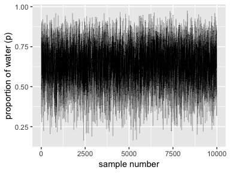

We'll make the density in the right panel with `geom_density()`.


```r
samples %>% 
  ggplot(aes(x = p_grid)) +
  geom_density(fill = "black") +
  coord_cartesian(xlim = 0:1) +
  xlab("proportion of water (p)")
```

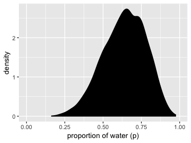

## Sampling to summarize

"Once your model produces a posterior distribution, the model’s work is done. But your work has just begun. It is necessary to summarize and interpret the posterior distribution. Exactly now it is summarized depends upon your purpose" (p. 53).

### Intervals of defined boundaries.

To get the proportion of water less than some value of `p_grid` within the tidyverse, you'd first `filter()` by that value and then take the `sum()` within `summarise()`.


```r
d %>% 
  filter(p_grid < .5) %>% 
  summarise(sum = sum(posterior))
```

```
## # A tibble: 1 x 1
##     sum
##   <dbl>
## 1 0.171
```

To learn more about `dplyr::summarise()` and related functions, check out Baert's [*Data Wrangling Part 4: Summarizing and slicing your data*](https://suzan.rbind.io/2018/04/dplyr-tutorial-4/) and [Chapter 5.6](http://r4ds.had.co.nz/transform.html#grouped-summaries-with-summarise) of *R4DS*.

If what you want is a frequency based on filtering by `samples`, then you might use `n()` within `summarise()`.


```r
samples %>% 
  filter(p_grid < .5) %>% 
  summarise(sum = n() / n_samples)
```

```
## # A tibble: 1 x 1
##     sum
##   <dbl>
## 1 0.169
```

You can use `&` within `filter()`, too.


```r
samples %>% 
  filter(p_grid > .5 & p_grid < .75) %>% 
  summarise(sum = n() / n_samples)
```

```
## # A tibble: 1 x 1
##     sum
##   <dbl>
## 1 0.596
```

### Intervals of defined mass.

We'll create the upper two panels for Figure 3.2 with `geom_line()`, `geom_ribbon()`, and a some careful filtering.


```r
# upper left panel
d %>% 
  ggplot(aes(x = p_grid)) +
  geom_line(aes(y = posterior)) +
  geom_ribbon(data = d %>% filter(p_grid < .5),
              aes(ymin = 0, ymax = posterior)) +
  labs(x = "proportion of water (p)",
       y = "density")
```

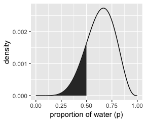

```r
# upper right panel
d %>% 
  ggplot(aes(x = p_grid)) +
  geom_line(aes(y = posterior)) +
  # note this next line is the only difference in code from the last plot
  geom_ribbon(data = d %>% filter(p_grid < .75 & p_grid > .5),
              aes(ymin = 0, ymax = posterior)) +
  labs(x = "proportion of water (p)",
       y = "density")
```

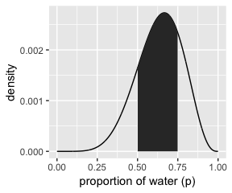

We'll come back for the lower two panels in a bit.

Since we've saved our `p_grid` samples within the well-named `samples` tibble, we'll have to index with `$` within `quantile`.


```r
(q_80 <- quantile(samples$p_grid, prob = .8))
```

```
##   80% 
## 0.763
```

That value will come in handy for the lower left panel of Figure 3.2, so we saved it. But anyways, we could `select()` the `samples` vector, extract it from the tibble with `pull()`, and then pump it into `quantile()`:


```r
samples %>% 
  select(p_grid) %>% 
  pull() %>% 
  quantile(prob = .8)
```

```
##   80% 
## 0.763
```

And we might also use `quantile()` within `summarise()`.


```r
samples %>% 
  summarise(`80th percentile` = quantile(p_grid, p = .8))
```

```
## # A tibble: 1 x 1
##   `80th percentile`
##               <dbl>
## 1             0.763
```

Here's the `summarise()` approach with two probabilities:


```r
samples %>% 
  summarise(`10th percentile` = quantile(p_grid, p = .1),
            `90th percentile` = quantile(p_grid, p = .9))
```

```
## # A tibble: 1 x 2
##   `10th percentile` `90th percentile`
##               <dbl>             <dbl>
## 1             0.451             0.814
```

The tydiverse approach is nice in that that family of functions typically returns a data frame. But sometimes you just want your values in a numeric vector for the sake of quick indexing. In that case, base R `quantile()` shines.


```r
(q_10_and_90 <- quantile(samples$p_grid, prob = c(.1, .9)))
```

```
##   10%   90% 
## 0.451 0.814
```

Now we have our cutoff values saved as `q_80` and `q_10_and_90`, we're ready to make the bottom panels of Figure 3.2.


```r
# lower left panel
d %>% 
  ggplot(aes(x = p_grid)) +
  geom_line(aes(y = posterior)) +
  geom_ribbon(data = d %>% filter(p_grid < q_80),
              aes(ymin = 0, ymax = posterior)) +
  annotate(geom = "text",
           x = .25, y = .0025,
           label = "lower 80%") +
  labs(x = "proportion of water (p)",
       y = "density")
```

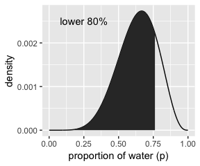

```r
# lower right panel
d %>% 
  ggplot(aes(x = p_grid)) +
  geom_line(aes(y = posterior)) +
  geom_ribbon(data = d %>% filter(p_grid > q_10_and_90[1] & p_grid < q_10_and_90[2]),
              aes(ymin = 0, ymax = posterior)) +
  annotate(geom = "text",
           x = .25, y = .0025,
           label = "middle 80%") +
  labs(x = "proportion of water (p)",
       y = "density")
```

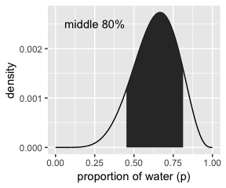

We've already defined `p_grid` and `prior` within `d`, above. Here we'll reuse them and update the rest of the columns.


```r
# here we update the `dbinom()` parameters
n_success <- 3
n_trials  <- 3

# update `d`
d <-
  d %>% 
  mutate(likelihood = dbinom(n_success, size = n_trials, prob = p_grid)) %>% 
  mutate(posterior  = (likelihood * prior) / sum(posterior))

# make the next part reproducible
set.seed(3)

# here's our new samples tibble
(
  samples <-
    d %>% 
    sample_n(size = n_samples, weight = posterior, replace = T)
)
```

```
## # A tibble: 10,000 x 4
##    p_grid prior likelihood posterior
##     <dbl> <dbl>      <dbl>     <dbl>
##  1  0.944     1     0.841     0.841 
##  2  0.808     1     0.528     0.528 
##  3  0.872     1     0.663     0.663 
##  4  0.328     1     0.0353    0.0353
##  5  0.602     1     0.218     0.218 
##  6  0.809     1     0.529     0.529 
##  7  0.959     1     0.882     0.882 
##  8  0.902     1     0.734     0.734 
##  9  0.578     1     0.193     0.193 
## 10  0.631     1     0.251     0.251 
## # … with 9,990 more rows
```

The `rethinking::PI()` function works like a nice shorthand for `quantile()`.


```r
quantile(samples$p_grid, prob = c(.25, .75))
```

```
##   25%   75% 
## 0.703 0.934
```

```r
rethinking::PI(samples$p_grid, prob = .5)
```

```
##   25%   75% 
## 0.703 0.934
```

Now's a good time to introduce Matthew Kay's [tidybayes package](http://mjskay.github.io/tidybayes/), which offers an [array of convenience functions](ftp://cran.r-project.org/pub/R/web/packages/tidybayes/vignettes/tidy-brms.html) for Bayesian models of the type we’ll be working with in this project.


```r
library(tidybayes)

median_qi(samples$p_grid, .width = .5)
```

```
##       y  ymin  ymax .width .point .interval
## 1 0.841 0.703 0.934    0.5 median        qi
```

The tidybayes package offers a [family of functions](ftp://cran.r-project.org/pub/R/web/packages/tidybayes/vignettes/tidybayes.html#point-summaries-and-intervals-with-the-point_interval-functions-medianmeanmode_qihdi) that make it easy to summarize a distribution with a measure of central tendency accompanied by intervals. With `median_qi()`, we asked for the median and quantile-based intervals--just like we've been doing with `quantile()`. Note how the `.width` argument within `median_qi()` worked the same way the `prob` argument did within `rethinking::PI()`. With `.width = .5`, we indicated we wanted a quantile-based 50% interval, which was returned in the `ymin` and `ymax` columns. The tidybayes framework makes it easy to request multiple types of intervals. E.g., here we'll request 50%, 80%, and 99% intervals.


```r
median_qi(samples$p_grid, .width = c(.5, .8, .99))
```

```
##       y     ymin  ymax .width .point .interval
## 1 0.841 0.703000 0.934   0.50 median        qi
## 2 0.841 0.559000 0.975   0.80 median        qi
## 3 0.841 0.265995 0.999   0.99 median        qi
```

The `.width` column in the output indexed which line presented which interval.

Now let's use the `rethinking::HPDI()` function to return 50% highest posterior density intervals (HPDIs).


```r
rethinking::HPDI(samples$p_grid, prob = .5)
```

```
##  |0.5  0.5| 
## 0.840 0.999
```

The reason I introduce tidybayes now is that the functions of the brms package only support percentile-based intervals of the type we computed with `quantile()` and `median_qi()`. But tidybayes also supports HPDIs.


```r
mode_hdi(samples$p_grid, .width = .5)
```

```
##           y ymin  ymax .width .point .interval
## 1 0.9562364 0.84 0.999    0.5   mode       hdi
```

This time we used the mode as the measure of central tendency. With this family of tidybayes functions, you specify the measure of central tendency in the prefix (i.e., `mean`, `median`, or `mode`) and then the type of interval you'd like (i.e., `qi` or `hdi`).

If all you want are the intervals without the measure of central tendency or all that other technical information, tidybayes also offers the handy `qi()` and `hdi()` functions. 


```r
qi(samples$p_grid, .width = .5)
```

```
##       [,1]  [,2]
## [1,] 0.703 0.934
```

```r
hdi(samples$p_grid, .width = .5)
```

```
##      [,1]  [,2]
## [1,] 0.84 0.999
```


These are nice in that they yield simple numeric vectors, making them particularly useful to use as references within ggplot2. Now we have that skill, we can use it to make Figure 3.3.


```r
# lower left panel
d %>% 
  ggplot(aes(x = p_grid)) +
  # check out our sweet `qi()` indexing
  geom_ribbon(data = d %>% filter(p_grid > qi(samples$p_grid, .width = .5)[1] & 
                                    p_grid < qi(samples$p_grid, .width = .5)[2]),
              aes(ymin = 0, ymax = posterior),
              fill = "grey75") +
  geom_line(aes(y = posterior)) +
  labs(subtitle = "50% Percentile Interval",
       x = "proportion of water (p)",
       y = "density")
```

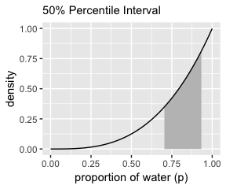

```r
# lower right panel
d %>% 
  ggplot(aes(x = p_grid)) +
  geom_ribbon(data = d %>% filter(p_grid > hdi(samples$p_grid, .width = .5)[1] & 
                                    p_grid < hdi(samples$p_grid, .width = .5)[2]),
              aes(ymin = 0, ymax = posterior),
              fill = "grey75") +
  geom_line(aes(y = posterior)) +
  labs(subtitle = "50% HPDI",
       x = "proportion of water (p)",
       y = "density")
```

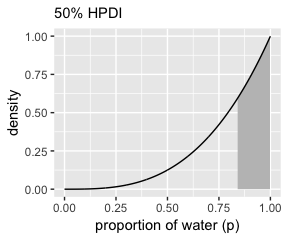

### Point estimates.

We've been calling point estimates measures of central tendency. If we `arrange()` our `d` tibble in descending order by `posterior`, we'll see the corresponding `p_grid` value for its MAP estimate.


```r
d %>% 
  arrange(desc(posterior))
```

```
## # A tibble: 1,001 x 4
##    p_grid prior likelihood posterior
##     <dbl> <dbl>      <dbl>     <dbl>
##  1  1         1      1         1    
##  2  0.999     1      0.997     0.997
##  3  0.998     1      0.994     0.994
##  4  0.997     1      0.991     0.991
##  5  0.996     1      0.988     0.988
##  6  0.995     1      0.985     0.985
##  7  0.994     1      0.982     0.982
##  8  0.993     1      0.979     0.979
##  9  0.992     1      0.976     0.976
## 10  0.991     1      0.973     0.973
## # … with 991 more rows
```

To emphasize it, we can use `slice()` to select the top row.
 

```r
d %>% 
  arrange(desc(posterior)) %>% 
  slice(1)
```

```
## # A tibble: 1 x 4
##   p_grid prior likelihood posterior
##    <dbl> <dbl>      <dbl>     <dbl>
## 1      1     1          1         1
```

Or we could use the handy `dplyr::top_n()` function.


```r
d %>% 
  select(posterior) %>% 
  top_n(n = 1)
```

```
## Selecting by posterior
```

```
## # A tibble: 1 x 1
##   posterior
##       <dbl>
## 1         1
```

We can get th emode with `mode_hdi()` or `mode_qi()`.


```r
samples %>% mode_hdi(p_grid)
```

```
## # A tibble: 1 x 6
##   p_grid .lower .upper .width .point .interval
##    <dbl>  <dbl>  <dbl>  <dbl> <chr>  <chr>    
## 1  0.956  0.468      1   0.95 mode   hdi
```

```r
samples %>% mode_qi(p_grid)
```

```
## # A tibble: 1 x 6
##   p_grid .lower .upper .width .point .interval
##    <dbl>  <dbl>  <dbl>  <dbl> <chr>  <chr>    
## 1  0.956    0.4  0.994   0.95 mode   qi
```

But if all you want is the mode itself, you can just use `tidybayes::Mode()`.


```r
Mode(samples$p_grid)
```

```
## [1] 0.9562364
```

But medians and means are typical, too.


```r
samples %>% 
  summarise(mean   = mean(p_grid),
            median = median(p_grid))
```

```
## # A tibble: 1 x 2
##    mean median
##   <dbl>  <dbl>
## 1 0.799  0.841
```

We can inspect the three types of point estimate in the left panel of Figure 3.4. First we'll bundle the three point estimates together in a tibble.


```r
(
  point_estimates <-
  bind_rows(
    samples %>% mean_qi(p_grid),
    samples %>% median_qi(p_grid),
    samples %>% mode_qi(p_grid)
  ) %>% 
  select(p_grid, .point) %>% 
  # these last two columns will help us annotate  
  mutate(x = p_grid + c(-.03, .03, -.03),
         y = c(.1, .25, .4))
)
```

```
## # A tibble: 3 x 4
##   p_grid .point     x     y
##    <dbl> <chr>  <dbl> <dbl>
## 1  0.799 mean   0.769  0.1 
## 2  0.841 median 0.871  0.25
## 3  0.956 mode   0.926  0.4
```

The plot:


```r
d %>% 
  ggplot(aes(x = p_grid)) +
  geom_ribbon(aes(ymin = 0, ymax = posterior),
              fill = "grey75") +
  geom_vline(xintercept = point_estimates$p_grid) +
  geom_text(data = point_estimates,
            aes(x = x, y = y, label = .point),
            angle = 90) +
  labs(x = "proportion of water (p)",
       y = "density") +
  theme(panel.grid = element_blank())
```

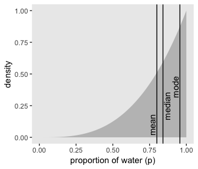

As it turns out "*different loss functions imply different point estimates*" (p. 59, *emphasis* in the original).

Let $p$ be the proportion of the Earth covered by water and $d$ be our guess. If McElreath pays us \$100 if we guess exactly right but subtracts money from the prize proportional to how far off we are, then our loss is proportional to $p - d$. If we decide $d = .5$, then our expected loss will be:


```r
d %>% 
  mutate(loss = posterior * abs(0.5 - p_grid)) %>% 
  summarise(`expected loss` = sum(loss))
```

```
## # A tibble: 1 x 1
##   `expected loss`
##             <dbl>
## 1            78.4
```

What McElreath did with `sapply()`, we'll do with `purrr::map()`. If you haven't used it, `map()` is part of a family of similarly-named functions (e.g., `map2()`) from the [purrr package](https://purrr.tidyverse.org), which is itself part of the [tidyverse](https://www.tidyverse.org). The `map()` family is the tidyverse alternative to the family of `apply()` functions from the base R framework. You can learn more about how to use the `map()` family [here](https://purrr.tidyverse.org/reference/map.html) or [here](https://jennybc.github.io/purrr-tutorial/ls01_map-name-position-shortcuts.html) or [here](https://data.library.virginia.edu/getting-started-with-the-purrr-package-in-r/).


```r
make_loss <- function(our_d){
  d %>% 
  mutate(loss = posterior * abs(our_d - p_grid)) %>% 
  summarise(weighted_average_loss = sum(loss))
}

(
  l <-
  d %>% 
  select(p_grid) %>% 
  rename(decision = p_grid) %>% 
  mutate(weighted_average_loss = purrr::map(decision, make_loss)) %>% 
  unnest() 
)
```

```
## # A tibble: 1,001 x 2
##    decision weighted_average_loss
##       <dbl>                 <dbl>
##  1    0                      201.
##  2    0.001                  200.
##  3    0.002                  200.
##  4    0.003                  200.
##  5    0.004                  199.
##  6    0.005                  199.
##  7    0.006                  199.
##  8    0.007                  199.
##  9    0.008                  198.
## 10    0.009                  198.
## # … with 991 more rows
```

Now we're ready for the right panel of Figure 3.4.


```r
# this will help us find the x and y coordinates for the minimum value
min_loss <-
  l %>% 
  filter(weighted_average_loss == min(weighted_average_loss)) %>% 
  as.numeric()

# the plot
l %>%   
  ggplot(aes(x = decision)) +
  geom_ribbon(aes(ymin = 0, ymax = weighted_average_loss),
              fill = "grey75") +
  geom_vline(xintercept = min_loss[1], color = "white", linetype = 3) +
  geom_hline(yintercept = min_loss[2], color = "white", linetype = 3) +
  ylab("expected proportional loss") +
  theme(panel.grid = element_blank())
```

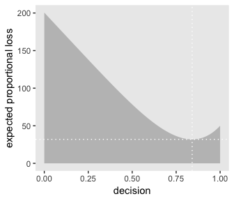

We saved the exact minimum value as `min_loss[1]`, which is 0.841. Within sampling error, this is the posterior median as depicted by our `samples`.


```r
samples %>% 
  summarise(posterior_median = median(p_grid))
```

```
## # A tibble: 1 x 1
##   posterior_median
##              <dbl>
## 1            0.841
```

The quadratic loss $(d - p)^2$ suggests we should use the mean instead. Let's investigate.


```r
# ammend our loss function
make_loss <- function(our_d){
  d %>% 
  mutate(loss = posterior * (our_d - p_grid)^2) %>% 
  summarise(weighted_average_loss = sum(loss))
}

# remake our `l` data
l <-
  d %>% 
  select(p_grid) %>% 
  rename(decision = p_grid) %>% 
  mutate(weighted_average_loss = purrr::map(decision, make_loss)) %>% 
  unnest()

# update to the new minimum loss coordinates
min_loss <-
  l %>% 
  filter(weighted_average_loss == min(weighted_average_loss)) %>% 
  as.numeric()

# update the plot
l %>%   
  ggplot(aes(x = decision)) +
  geom_ribbon(aes(ymin = 0, ymax = weighted_average_loss),
              fill = "grey75") +
  geom_vline(xintercept = min_loss[1], color = "white", linetype = 3) +
  geom_hline(yintercept = min_loss[2], color = "white", linetype = 3) +
  ylab("expected proportional loss") +
  theme(panel.grid = element_blank())
```

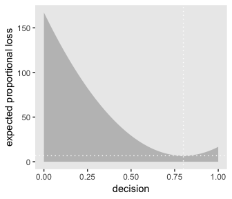

Based on quadratic loss $(d - p)^2$, the exact minimum value is 0.8. Within sampling error, this is the posterior mean of our `samples`.


```r
samples %>% 
  summarise(posterior_meaan = mean(p_grid))
```

```
## # A tibble: 1 x 1
##   posterior_meaan
##             <dbl>
## 1           0.799
```

## Sampling to simulate prediction

McElreath’s four good reasons for posterior simulation were:

1. Model checking
2. Software validation
3. Research design
4. Forecasting

### Dummy data.

Dummy data for the globe tossing model arise from the binomial likelihood. If you let $w$ be a count of water and $n$ be the number of tosses, the binomial likelihood is

$$\text{Pr} (w|n, p) = \frac{n!}{w!(n - w)!} p^w (1 - p)^{n - w}$$

Letting $n = 2$, $p(w) = .7$, and $w_{observed} = 0 \text{ through }2$, the denisties are:


```r
tibble(n           = 2,
       probability = .7,
       w           = 0:2) %>% 
  mutate(density   = dbinom(w, size = n, prob = probability))
```

```
## # A tibble: 3 x 4
##       n probability     w density
##   <dbl>       <dbl> <int>   <dbl>
## 1     2         0.7     0   0.09 
## 2     2         0.7     1   0.42 
## 3     2         0.7     2   0.490
```

If we're going to simulate, we should probably [set our seed](https://stackoverflow.com/questions/13605271/reasons-for-using-the-set-seed-function). Doing so makes the results reproducible.


```r
set.seed(3)
rbinom(1, size = 2, prob = .7)
```

```
## [1] 2
```

Here are ten reproducible draws.


```r
set.seed(3)
rbinom(10, size = 2, prob = .7)
```

```
##  [1] 2 1 2 2 1 1 2 2 1 1
```

Now generate 100,000 (i.e., `1e5`) reproducible dummy observations.


```r
# how many would you like?
n_draws <- 1e5

set.seed(3)
d <- tibble(draws = rbinom(n_draws, size = 2, prob = .7))

d %>% 
  group_by(draws) %>% 
  count() %>% 
  mutate(proportion = n / nrow(d))
```

```
## # A tibble: 3 x 3
## # Groups:   draws [3]
##   draws     n proportion
##   <int> <int>      <dbl>
## 1     0  9000      0.09 
## 2     1 42051      0.421
## 3     2 48949      0.489
```

As McElreath mused in the text, those simulated `proportion` values are very close to the analytically calculated values in our `density` column a few code blocks up.

Here's the simulation updated so $n = 9$, which we plot in our version of Figure 3.5.


```r
set.seed(3)
d <- tibble(draws = rbinom(n_draws, size = 9, prob = .7))

# the histogram
d %>% 
  ggplot(aes(x = draws)) +
  geom_histogram(binwidth = 1, center = 0,
                 color = "grey92", size = 1/10) +
  scale_x_continuous("dummy water count",
                     breaks = seq(from = 0, to = 9, by = 2)) +
  ylab("frequency") +
  coord_cartesian(xlim = 0:9) +
  theme(panel.grid = element_blank())
```

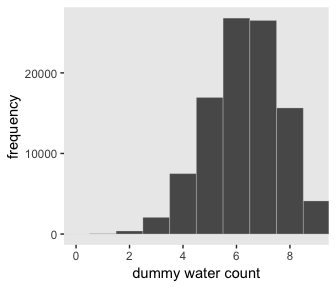

McElreath suggested we play around with different values of `size` and `prob`. With the next block of code, we'll simulate nine conditions.


```r
n_draws <- 1e5

simulate_binom <- function(n, probability){
  set.seed(3)
  rbinom(n_draws, size = n, prob = probability) 
}

d <-
  tibble(n = c(3, 6, 9)) %>% 
  expand(n, probability = c(.3, .6, .9)) %>% 
  mutate(draws       = map2(n, probability, simulate_binom)) %>% 
  ungroup() %>% 
  mutate(n           = str_c("n = ", n),
         probability = str_c("p = ", probability)) %>% 
  unnest()

head(d)
```

```
## # A tibble: 6 x 3
##   n     probability draws
##   <chr> <chr>       <int>
## 1 n = 3 p = 0.3         0
## 2 n = 3 p = 0.3         2
## 3 n = 3 p = 0.3         1
## 4 n = 3 p = 0.3         0
## 5 n = 3 p = 0.3         1
## 6 n = 3 p = 0.3         1
```

The results look as follows:


```r
d %>% 
  ggplot(aes(x = draws)) +
  geom_histogram(binwidth = 1, center = 0,
                 color = "grey92", size = 1/10) +
  scale_x_continuous("dummy water count",
                     breaks = seq(from = 0, to = 9, by = 2)) +
  ylab("frequency") +
  coord_cartesian(xlim = 0:9) +
  theme(panel.grid = element_blank()) +
  facet_grid(n ~ probability)
```

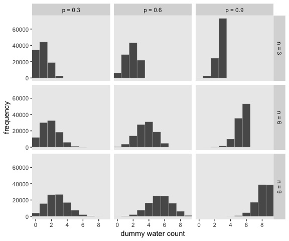

### Model checking.

If you're new to applied statistics, you might be surprised how often mistakes arise.

#### Did the software work?

Let this haunt your dreams: "There is no way to really be sure that software works correctly" (p. 64).

If you’d like to dive deeper into these dark waters, check out one my favorite talks from StanCon 2018, [*Esther Williams in the Harold Holt Memorial Swimming Pool*](https://youtu.be/pKZLJPrZLhU?t=26285), by the ineffable [Dan Simpson](https://twitter.com/dan_p_simpson). If Simpson doesn’t end up drowning you, see Gabry and Simpson’s talk at the Royal Statistical Society 2018, [*Visualization in Bayesian workflow*](https://www.youtube.com/watch?v=E8vdXoJId8M), a follow-up blog [*Maybe it’s time to let the old ways die; or We broke R-hat so now we have to fix it*](https://statmodeling.stat.columbia.edu/2019/03/19/maybe-its-time-to-let-the-old-ways-die-or-we-broke-r-hat-so-now-we-have-to-fix-it/), and that blog’s associated pre-print by Vehtari, Gelman, Simpson, Carpenter, and Bürkner [*Rank-normalization, folding, and localization: An improved Rˆ for assessing convergence of MCMC*](https://arxiv.org/abs/1903.08008).

#### Is the model adequate?

> The implied predictions of the model are uncertain in two ways, and it’s important to be aware of both.
>
> First, there is observation uncertainty. For any unique value of the parameter $p$, there is a unique implied pattern of observations that the model expects. These patterns of observations are the same gardens of forking data that you explored in the previous chapter. These patterns are also what you sampled in the previous section. There is uncertainty in the predicted observations, because even if you know $p$ with certainty, you won’t know the next globe toss with certainty (unless $p = 0$ or $p = 1$).
>
> Second, there is uncertainty about $p$. The posterior distribution over $p$ embodies this uncertainty. And since there is uncertainty about $p$, there is uncertainty about everything that depends upon $p$. The uncertainty in $p$ will interact with the sampling variation, when we try to assess what the model tells us about outcomes.
>
> We’d like to *propagate* the parameter uncertainty--carry it forward--as we evaluate the implied predictions. All that is required is averaging over the posterior density for $p$, while computing the predictions. For each possible value of the parameter $p$, there is an implied distribution of outcomes. So if you were to compute the sampling distribution of outcomes at each value of $p$, then you could average all of these prediction distributions together, using the posterior probabilities of each value of $p$, to get a posterior predictive distribution. (p. 56, *emphasis* in the original)

All this is depicted in Figure 3.6. To get ready to make our version, let's first refresh our original grid approximation `d`.


```r
# how many grid points would you like?
n <- 1001
n_success <- 6
n_trials  <- 9

(
  d <-
  tibble(p_grid     = seq(from = 0, to = 1, length.out = n),
         # note we're still using a flat uniform prior
         prior      = 1) %>% 
  mutate(likelihood = dbinom(n_success, size = n_trials, prob = p_grid)) %>% 
  mutate(posterior  = (likelihood * prior) / sum(likelihood * prior))
  )
```

```
## # A tibble: 1,001 x 4
##    p_grid prior likelihood posterior
##     <dbl> <dbl>      <dbl>     <dbl>
##  1  0         1   0.        0.      
##  2  0.001     1   8.37e-17  8.37e-19
##  3  0.002     1   5.34e-15  5.34e-17
##  4  0.003     1   6.07e-14  6.07e-16
##  5  0.004     1   3.40e-13  3.40e-15
##  6  0.005     1   1.29e-12  1.29e-14
##  7  0.006     1   3.85e-12  3.85e-14
##  8  0.007     1   9.68e-12  9.68e-14
##  9  0.008     1   2.15e-11  2.15e-13
## 10  0.009     1   4.34e-11  4.34e-13
## # … with 991 more rows
```

We can make our version of the top of Figure 3.6 with a little tricky `filter`ing.


```r
d %>% 
  ggplot(aes(x = p_grid)) +
  geom_ribbon(aes(ymin = 0, ymax = posterior),
              color = "grey67", fill = "grey67") +
  geom_segment(data = . %>% 
                 filter(p_grid %in% c(seq(from = .1, to = .9, by = .1), 3 / 10)),
               aes(xend = p_grid,
                   y = 0, yend = posterior, size = posterior),
               color = "grey33", show.legend = F) +
  geom_point(data = . %>%
               filter(p_grid %in% c(seq(from = .1, to = .9, by = .1), 3 / 10)),
             aes(y = posterior)) +
  annotate(geom = "text", 
           x = .08, y = .0025,
           label = "Posterior probability") +
  scale_size_continuous(range = c(0, 1)) +
  scale_x_continuous("probability of water", breaks = c(0:10) / 10) +
  scale_y_continuous(NULL, breaks = NULL) +
  theme(panel.grid = element_blank())
```

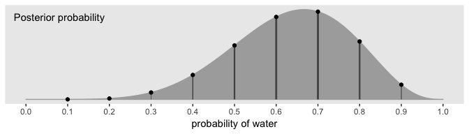

Note how we weighted the widths of the vertical lines by the `posterior` density.

We'll need to do a bit of wrangling before we're ready to make the plot in the middle panel of Figure 3.6.


```r
n_draws <- 1e5

simulate_binom <- function(probability){
  set.seed(3)
  rbinom(n_draws, size = 9, prob = probability) 
}

d_small <-
  tibble(probability = seq(from = .1, to = .9, by = .1)) %>% 
  mutate(draws       = purrr::map(probability, simulate_binom)) %>% 
  unnest(draws) %>% 
  mutate(label       = str_c("p = ", probability))

head(d_small)
```

```
## # A tibble: 6 x 3
##   probability draws label  
##         <dbl> <int> <chr>  
## 1         0.1     0 p = 0.1
## 2         0.1     2 p = 0.1
## 3         0.1     0 p = 0.1
## 4         0.1     0 p = 0.1
## 5         0.1     1 p = 0.1
## 6         0.1     1 p = 0.1
```

Now we're ready to plot.


```r
d_small %>%
  ggplot(aes(x = draws)) +
  geom_histogram(binwidth = 1, center = 0,
                 color = "grey92", size = 1/10) +
  scale_x_continuous(NULL, breaks = seq(from = 0, to = 9, by = 3)) +
  scale_y_continuous(NULL, breaks = NULL) +
  labs(subtitle = "Sampling distributions") +
  coord_cartesian(xlim = 0:9) +
  theme(panel.grid = element_blank()) +
  facet_wrap(~ label, ncol = 9) 
```

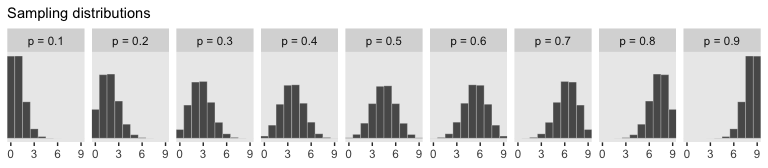

To make the plot at the bottom of Figure 3.6, we'll redefine our `samples`, this time including the `w` variable (see the R code 3.26 block in the text).


```r
# how many samples would you like?
n_samples <- 1e4

# make it reproducible
set.seed(3)

samples <-
  d %>% 
  sample_n(size = n_samples, weight = posterior, replace = T) %>% 
  mutate(w = purrr::map_dbl(p_grid, rbinom, n = 1, size = 9))

glimpse(samples)
```

```
## Observations: 10,000
## Variables: 5
## $ p_grid     <dbl> 0.734, 0.808, 0.385, 0.328, 0.510, 0.511, 0.756, 0.674, 0.578, 0.520, 0.512, 0…
## $ prior      <dbl> 1, 1, 1, 1, 1, 1, 1, 1, 1, 1, 1, 1, 1, 1, 1, 1, 1, 1, 1, 1, 1, 1, 1, 1, 1, 1, …
## $ likelihood <dbl> 0.24722965, 0.16544404, 0.06363104, 0.03174170, 0.17389560, 0.17487642, 0.2278…
## $ posterior  <dbl> 0.0024722965, 0.0016544404, 0.0006363104, 0.0003174170, 0.0017389560, 0.001748…
## $ w          <dbl> 6, 7, 7, 2, 8, 3, 8, 6, 7, 6, 3, 5, 5, 5, 7, 7, 9, 6, 7, 2, 7, 9, 6, 6, 8, 4, …
```

Here's our histogram.


```r
samples %>% 
  ggplot(aes(x = w)) +
  geom_histogram(binwidth = 1, center = 0,
                 color = "grey92", size = 1/10) +
  scale_x_continuous("number of water samples",
                     breaks = seq(from = 0, to = 9, by = 3)) +
  scale_y_continuous(NULL, breaks = NULL) +
  ggtitle("Posterior predictive distribution") +
  coord_cartesian(xlim = 0:9,
                  ylim = 0:3000) +
  theme(panel.grid = element_blank())
```

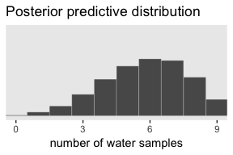

In Figure 3.7, McElreath considered the longst sequence of the sampe values. We've been using `rbinom()` with the size parameter set to 9 for our simulations. E.g.,


```r
rbinom(10, size = 9, prob = .6)
```

```
##  [1] 6 8 6 5 6 7 6 5 3 6
```

Notice this collapses (i.e., aggregated) over the sequences within the individual sets of 9. What we need is to simulate nine individual trials many times over. For example, this


```r
rbinom(9, size = 1, prob = .6)
```

```
## [1] 1 1 1 1 1 1 1 0 0
```

would be the disaggregated version of just one of the numerals returned by `rbinom()` when `size = 9`. So let's try simulating again with un-aggregated samples. We'll keep adding to our `samples` tibble. In addition to the disaggregated `draws` based on the $p$ values listed in `p_grid`, we'll also want to add a row index for each of those `p_grid` values--it'll come in handy when we plot.


```r
# make it reproducible
set.seed(3)

samples <-
  samples %>% 
  mutate(iter  = 1:n(),
         draws = purrr::map(p_grid, rbinom, n = 9, size = 1)) %>% 
  unnest(draws)

glimpse(samples)
```

```
## Observations: 90,000
## Variables: 7
## $ p_grid     <dbl> 0.734, 0.734, 0.734, 0.734, 0.734, 0.734, 0.734, 0.734, 0.734, 0.808, 0.808, 0…
## $ prior      <dbl> 1, 1, 1, 1, 1, 1, 1, 1, 1, 1, 1, 1, 1, 1, 1, 1, 1, 1, 1, 1, 1, 1, 1, 1, 1, 1, …
## $ likelihood <dbl> 0.24722965, 0.24722965, 0.24722965, 0.24722965, 0.24722965, 0.24722965, 0.2472…
## $ posterior  <dbl> 0.0024722965, 0.0024722965, 0.0024722965, 0.0024722965, 0.0024722965, 0.002472…
## $ w          <dbl> 6, 6, 6, 6, 6, 6, 6, 6, 6, 7, 7, 7, 7, 7, 7, 7, 7, 7, 7, 7, 7, 7, 7, 7, 7, 7, …
## $ iter       <int> 1, 1, 1, 1, 1, 1, 1, 1, 1, 2, 2, 2, 2, 2, 2, 2, 2, 2, 3, 3, 3, 3, 3, 3, 3, 3, …
## $ draws      <int> 1, 0, 1, 1, 1, 1, 1, 1, 1, 1, 1, 1, 1, 1, 0, 0, 1, 1, 1, 0, 0, 0, 0, 0, 0, 1, …
```

The main action is in the `draws` column.

Now we have to count the longest sequences. The base R [`rle()` function](https://www.rdocumentation.org/packages/base/versions/3.3/topics/rle) will help with that. Consider McElreath's sequence of tosses.


```r
tosses <- c("w", "l", "w", "w", "w", "l", "w", "l", "w")
```

You can plug that into `rle()`.


```r
rle(tosses)
```

```
## Run Length Encoding
##   lengths: int [1:7] 1 1 3 1 1 1 1
##   values : chr [1:7] "w" "l" "w" "l" "w" "l" "w"
```

For our purposes, we're interested in `lengths`. That tells us the length of each sequences of the same value. The `3` corresponds to our run of three `w`s. The `max()` function will help us confirm it's the largest value.


```r
rle(tosses)$lengths %>% max()
```

```
## [1] 3
```

Now let's apply our method to the data and plot.


```r
samples %>% 
  group_by(iter) %>% 
  summarise(longest_run_length = rle(draws)$lengths %>% max()) %>% 
  
  ggplot(aes(x = longest_run_length)) +
  geom_histogram(aes(fill = longest_run_length == 3),
                 binwidth = 1, center = 0,
                 color = "grey92", size = 1/10) +
  scale_x_continuous("longest run length",
                     breaks = seq(from = 0, to = 9, by = 3)) +
  scale_fill_viridis_d(option = "D", end = .9) +
  ylab("frequency") +
  coord_cartesian(xlim = 0:9) +
  theme(panel.grid = element_blank(), 
        legend.position = "none")
```

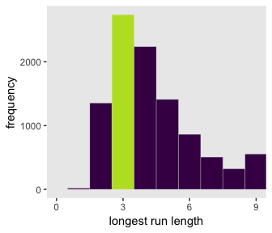

Let's look at `rle()` again.


```r
rle(tosses)
```

```
## Run Length Encoding
##   lengths: int [1:7] 1 1 3 1 1 1 1
##   values : chr [1:7] "w" "l" "w" "l" "w" "l" "w"
```

We can use the length of the output (i.e., 7 in this example) as the numbers of switches from, in this case, "w" and "l". 


```r
rle(tosses)$lengths %>% length()
```

```
## [1] 7
```

With that new trick, we're ready to make the right panel of Figure 3.7.


```r
samples %>% 
  group_by(iter) %>% 
  summarise(longest_run_length = rle(draws)$lengths %>% length()) %>% 
  
  ggplot(aes(x = longest_run_length)) +
  geom_histogram(aes(fill = longest_run_length == 6),
                 binwidth = 1, center = 0,
                 color = "grey92", size = 1/10) +
  scale_x_continuous("number of switches",
                     breaks = seq(from = 0, to = 9, by = 3)) +
  scale_fill_viridis_d(option = "D", end = .9) +
  ylab("frequency") +
  coord_cartesian(xlim = 0:9) +
  theme(panel.grid = element_blank(), 
        legend.position = "none")
```

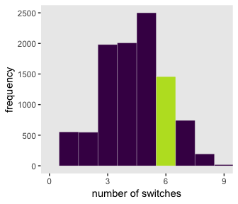

## ~~Summary~~ Let's practice in brms

Open brms.


```r
library(brms)
```

In brms, we'll fit the primary model of $w = 6$ and $n = 9$ much like we did at the end of the project for Chapter 2.


```r
b3.1 <-
  brm(data = list(w = 6), 
      family = binomial(link = "identity"),
      w | trials(9) ~ 1,
      # this is a flat prior
      prior(beta(1, 1), class = Intercept),
      seed = 3,
      control = list(adapt_delta = .999))
```

We’ll learn more about the beta distribution in Chapter 11. But for now, here's the posterior summary for `b_Intercept`, the probability of a "w".


```r
posterior_summary(b3.1)["b_Intercept", ] %>% 
  round(digits = 2)
```

```
##  Estimate Est.Error      Q2.5     Q97.5 
##      0.64      0.14      0.36      0.88
```

As we'll fully cover in the next chapter, `Estimate` is the posterior mean, the two `Q` columns are the quantile-based 95% intervals, and `Est.Error` is the posterior standard deviation. 

Much like the way we used the `samples()` function to simulate probability values, above, we can do so with `fitted()` within the brms framework. But we will have to specify `scale = "linear"` in order to return results in the probability metric. By default, `brms::fitted()` will return summary information. Since we want actual simulation draws, we'll specify `summary = F`.


```r
f <-
  fitted(b3.1, summary = F,
         scale = "linear") %>% 
  as_tibble() %>% 
  set_names("p")

glimpse(f)
```

```
## Observations: 4,000
## Variables: 1
## $ p <dbl> 0.6920484, 0.5559454, 0.6096088, 0.5305334, 0.4819733, 0.6724561, 0.6402367, 0.8356569,…
```

By default, we have a generically-named vector `V1` of 4000 samples. We'll explain the defaults in later chapters. For now, notice we can view these in a density.


```r
f %>% 
  ggplot(aes(x = p)) +
  geom_density(fill = "grey50", color = "grey50") +
  annotate(geom = "text", 
           x = .08, y = 2.5,
           label = "Posterior probability") +
  scale_x_continuous("probability of water",
                     breaks = c(0, .5, 1),
                     limits = 0:1) +
  scale_y_continuous(NULL, breaks = NULL) +
  theme(panel.grid = element_blank())
```

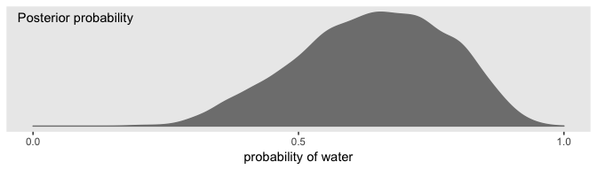

Looks a lot like the posterior probability density at the top of Figure 3.6, doesn't it? Much like we did with `samples`, we can use this distribution of probabilities to predict histograms of `w` counts. With those in hand, we can make an analogue to the histogram in the bottom panel of Figure 3.6.


```r
# the simulation
set.seed(3)

f <-
  f %>% 
  mutate(w = rbinom(n(), size = n_trials,  prob = p))

# the plot
f %>% 
  ggplot(aes(x = w)) +
  geom_histogram(binwidth = 1, center = 0,
                 color = "grey92", size = 1/10) +
  scale_x_continuous("number of water samples",
                     breaks = seq(from = 0, to = 9, by = 3), limits = c(0, 9)) +
  scale_y_continuous(NULL, breaks = NULL, limits = c(0, 1200)) +
  ggtitle("Posterior predictive distribution") +
  theme(panel.grid = element_blank())
```

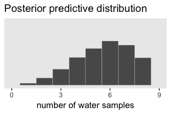

As you might imagine, we can use the output from `fitted()` to return disaggregated batches of 0s and 1s, too. And we could even use those disaggregated 0s and 1s to examine longest run lengths and numbers of switches as in the analyses for Figure 3.7. I’ll leave those as exercises for the interested reader.

## Reference {-}

[McElreath, R. (2016). *Statistical rethinking: A Bayesian course with examples in R and Stan.* Chapman & Hall/CRC Press.](https://xcelab.net/rm/statistical-rethinking/)

## Session info {-}


```r
sessionInfo()
```

```
## R version 3.5.1 (2018-07-02)
## Platform: x86_64-apple-darwin15.6.0 (64-bit)
## Running under: macOS High Sierra 10.13.6
## 
## Matrix products: default
## BLAS: /Library/Frameworks/R.framework/Versions/3.5/Resources/lib/libRblas.0.dylib
## LAPACK: /Library/Frameworks/R.framework/Versions/3.5/Resources/lib/libRlapack.dylib
## 
## locale:
## [1] en_US.UTF-8/en_US.UTF-8/en_US.UTF-8/C/en_US.UTF-8/en_US.UTF-8
## 
## attached base packages:
## [1] stats     graphics  grDevices utils     datasets  methods   base     
## 
## other attached packages:
##  [1] brms_2.8.0      Rcpp_1.0.0      tidybayes_1.0.4 forcats_0.3.0   stringr_1.3.1   dplyr_0.8.0.1  
##  [7] purrr_0.2.5     readr_1.1.1     tidyr_0.8.1     tibble_2.1.1    ggplot2_3.1.0   tidyverse_1.2.1
## 
## loaded via a namespace (and not attached):
##   [1] colorspace_1.3-2          ggridges_0.5.0            rsconnect_0.8.8          
##   [4] rprojroot_1.3-2           ggstance_0.3              markdown_0.8             
##   [7] base64enc_0.1-3           rethinking_1.80           rstudioapi_0.7           
##  [10] rstan_2.18.2              svUnit_0.7-12             DT_0.4                   
##  [13] fansi_0.4.0               mvtnorm_1.0-8             lubridate_1.7.4          
##  [16] xml2_1.2.0                bridgesampling_0.4-0      knitr_1.20               
##  [19] shinythemes_1.1.1         bayesplot_1.6.0           jsonlite_1.5             
##  [22] LaplacesDemon_16.1.1      broom_0.5.1               shiny_1.1.0              
##  [25] compiler_3.5.1            httr_1.3.1                backports_1.1.2          
##  [28] assertthat_0.2.0          Matrix_1.2-14             lazyeval_0.2.1           
##  [31] cli_1.0.1                 later_0.7.3               htmltools_0.3.6          
##  [34] prettyunits_1.0.2         tools_3.5.1               igraph_1.2.1             
##  [37] coda_0.19-2               gtable_0.2.0              glue_1.3.0               
##  [40] reshape2_1.4.3            cellranger_1.1.0          nlme_3.1-137             
##  [43] crosstalk_1.0.0           ps_1.2.1                  rvest_0.3.2              
##  [46] mime_0.5                  miniUI_0.1.1.1            gtools_3.8.1             
##  [49] MASS_7.3-50               zoo_1.8-2                 scales_1.0.0             
##  [52] colourpicker_1.0          hms_0.4.2                 promises_1.0.1           
##  [55] Brobdingnag_1.2-5         parallel_3.5.1            inline_0.3.15            
##  [58] shinystan_2.5.0           yaml_2.1.19               gridExtra_2.3            
##  [61] loo_2.1.0                 StanHeaders_2.18.0-1      stringi_1.2.3            
##  [64] dygraphs_1.1.1.5          pkgbuild_1.0.2            rlang_0.3.1              
##  [67] pkgconfig_2.0.2           matrixStats_0.54.0        HDInterval_0.2.0         
##  [70] evaluate_0.10.1           lattice_0.20-35           rstantools_1.5.0         
##  [73] htmlwidgets_1.2           labeling_0.3              processx_3.2.1           
##  [76] tidyselect_0.2.5          plyr_1.8.4                magrittr_1.5             
##  [79] R6_2.3.0                  generics_0.0.2            pillar_1.3.1             
##  [82] haven_1.1.2               withr_2.1.2               xts_0.10-2               
##  [85] abind_1.4-5               modelr_0.1.2              crayon_1.3.4             
##  [88] arrayhelpers_1.0-20160527 utf8_1.1.4                rmarkdown_1.10           
##  [91] grid_3.5.1                readxl_1.1.0              callr_3.1.0              
##  [94] threejs_0.3.1             digest_0.6.18             xtable_1.8-2             
##  [97] httpuv_1.4.4.2            stats4_3.5.1              munsell_0.5.0            
## [100] viridisLite_0.3.0         shinyjs_1.0
```


