# Linear Models

> Linear regression is the geocentric model of applied statistics. By "linear regression", we will mean a family of simple statistical golems that attempt to learn about the mean and variance of some measurement, using an additive combination of other measurements. Like geocentrism, linear regression can usefully describe a very large variety of natural phenomena. Like geocentrism, linear is a descriptive model that corresponds to many different process models. If we read its structure too literally, we’re likely to make mistakes. But used wisely, these little linear golems continue to be useful. (p. 71)

## Why normal distributions are normal

After laying out his soccer field coin toss shuffle premise, McElreath wrote:

> It's hard to say where any individual person will end up, but you can say with great confidence what the collection of positions will be. The distances will be distributed in approximately normal, or Gaussian, fashion. This is true even though the underlying distribution is binomial. It does this because there are so many more possible ways to realize a sequence of left-right steps that sums to zero. There are slightly fewer ways to realize a sequence that ends up one step left or right of zero, and so on, with the number of possible sequences declining in the characteristic bell curve of the normal distribution. (p. 72)

### Normal by addition.

Here's a way to do the simulation necessary for the plot in the top panel of Figure 4.2.


```r
library(tidyverse)

# we set the seed to make the results of `runif()` reproducible.
set.seed(4)

pos <- 
  # make data with 100 people, 16 steps each with a starting point of `step == 0` (i.e., 17 rows per person)
  crossing(person = 1:100,
           step   = 0:16) %>% 
  # for all steps above `step == 0` simulate a `deviation`
  mutate(deviation = map_dbl(step, ~if_else(. == 0, 0, runif(1, -1, 1)))) %>% 
  # after grouping by `person`, compute the cumulative sum of the deviations, then `ungroup()`
  group_by(person) %>%
  mutate(position = cumsum(deviation)) %>% 
  ungroup() 
```

That `map_dbl()` code within the first `mutate()` line might look odd. Go [here](https://purrr.tidyverse.org/reference/map.html) to learn more about iterating with `purrr::map_dbl()`.

We might `glimpse()` at the data.


```r
glimpse(pos)
```

```
## Observations: 1,700
## Variables: 4
## $ person    <int> 1, 1, 1, 1, 1, 1, 1, 1, 1, 1, 1, 1, 1, 1, 1, 1, 1, 2, 2, 2, 2, 2, 2, 2, 2, 2, 2…
## $ step      <int> 0, 1, 2, 3, 4, 5, 6, 7, 8, 9, 10, 11, 12, 13, 14, 15, 16, 0, 1, 2, 3, 4, 5, 6, …
## $ deviation <dbl> 0.00000000, -0.98210841, -0.41252078, -0.44525008, 0.62714843, -0.47914446, 0.4…
## $ position  <dbl> 0.0000000, -0.9821084, -1.3946292, -1.8398793, -1.2127308, -1.6918753, -1.24306…
```

Here's the actual plot code.


```r
ggplot(data = pos, 
       aes(x = step, y = position, group = person)) +
  geom_vline(xintercept = c(4, 8, 16), linetype = 2) +
  geom_line(aes(color = person < 2, alpha  = person < 2)) +
  scale_color_manual(values = c("skyblue4", "black")) +
  scale_alpha_manual(values = c(1/5, 1)) +
  scale_x_continuous("step number", breaks = c(0, 4, 8, 12, 16)) +
  theme(legend.position = "none")
```

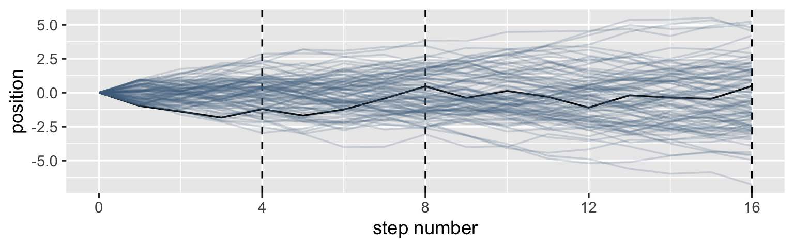

Now here's the code for the bottom three plots of Figure 4.2.


```r
# Figure 4.2.a.
p1 <-
  pos %>%
  filter(step == 4) %>%
  ggplot(aes(x = position)) +
  geom_line(stat = "density", color = "dodgerblue1") +
  coord_cartesian(xlim = -6:6) +
  labs(title = "4 steps")

# Figure 4.2.b.
p2 <-
  pos %>%
  filter(step == 8) %>%
  ggplot(aes(x = position)) +
  geom_density(color = "dodgerblue2") +
  coord_cartesian(xlim = -6:6) +
  labs(title = "8 steps")

# this is an intermediary step to get an SD value
pos %>%
  filter(step == 16) %>%
  summarise(sd = sd(position))
```

```
## # A tibble: 1 x 1
##      sd
##   <dbl>
## 1  2.36
```

```r
# Figure 4.2.c.
p3 <-
  pos %>%
  filter(step == 16) %>%
  ggplot(aes(x = position)) +
  stat_function(fun = dnorm, 
                args = list(mean = 0, sd = 2.180408),
                linetype = 2) +  # 2.180408 came from the previous code block
  geom_density(color = "transparent", fill = "dodgerblue3", alpha = 1/2) +
  coord_cartesian(xlim = -6:6) +
  labs(title = "16 steps",
       y = "density")

library(patchwork)

# combine the ggplots
p1 | p2 | p3
```


While we were at it, we explored a few ways to express densities. The main action was with the `geom_line()`, `geom_density()`, and `stat_function()` functions, respectively.

> Any process that ads together random values from the same distribution converges to a normal. But it’s not easy to grasp why addition should result in a bell curve of sums. Here’s a conceptual way to think of the process. Whatever the average value of the source distribution, each sample from it can be thought of as a fluctuation from the average value. When we begin to add these fluctuations together, they also begin to cancel one another out. A large positive fluctuation will cancel a large negative one. The more terms in the sum, the more chances for each fluctuation to be canceled by another, or by a series of smaller ones in the opposite direction. So eventually the most likely sum, in the sense that there are the most ways to realize it, will be a sum in which every fluctuation is canceled by another, a sum of zero (relative to the mean). (pp. 73--74)

### Normal by multiplication.

Here's McElreath's simple random growth rate.


```r
set.seed(4)
prod(1 + runif(12, 0, 0.1))
```

```
## [1] 1.774719
```

In the `runif()` part of that code, we generated 12 random draws from the uniform distribution with bounds $[0, 0.1]$. Within the `prod()` function, we first added `1` to each of those values and then computed their product. Consider a more explicit variant of the code.


```r
set.seed(4)
tibble(a = 1,
       b = runif(12, 0, 0.1)) %>% 
  mutate(c = a + b) %>% 
  summarise(p = prod(c))
```

```
## # A tibble: 1 x 1
##       p
##   <dbl>
## 1  1.77
```

Same result. Rather than using base R `replicate()` to do this many times, let's practice with `purrr::map_dbl()` like before.


```r
set.seed(4)
growth <- 
  tibble(growth = map_dbl(1:10000, ~ prod(1 + runif(12, 0, 0.1))))

ggplot(data = growth, aes(x = growth)) +
  geom_density()
```


"The smaller the effect of each locus, the better this additive approximation will be" (p. 74). Let's compare big and small.


```r
# simulate
set.seed(4)

samples <-
  tibble(big   = map_dbl(1:10000, ~ prod(1 + runif(12, 0, 0.5))),
         small = map_dbl(1:10000, ~ prod(1 + runif(12, 0, 0.01)))) %>% 
  # wrangle
  gather(distribution, samples) 

# plot
samples %>% 
  ggplot(aes(x = samples)) +
  geom_density(fill = "black", color = "transparent") +
  facet_wrap(~distribution, scales = "free") 
```

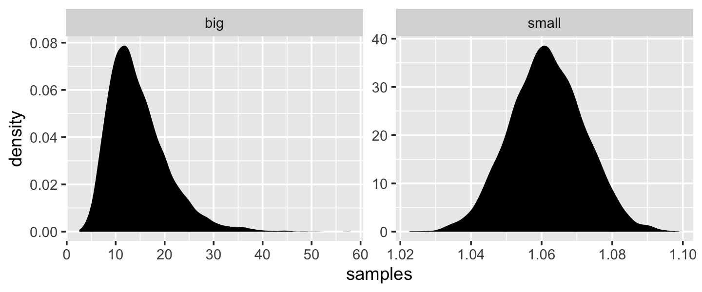

Yep, the `small` samples were more Gaussian.

### Normal by log-multiplication.

Instead of saving our tibble, we'll just feed it directly into our plot.


```r
set.seed(4)

tibble(samples = map_dbl(1:1e4, ~ log(prod(1 + runif(12, 0, 0.5))))) %>% 
  ggplot(aes(x = samples)) +
  geom_density(color = "transparent", 
               fill = "gray33")
```

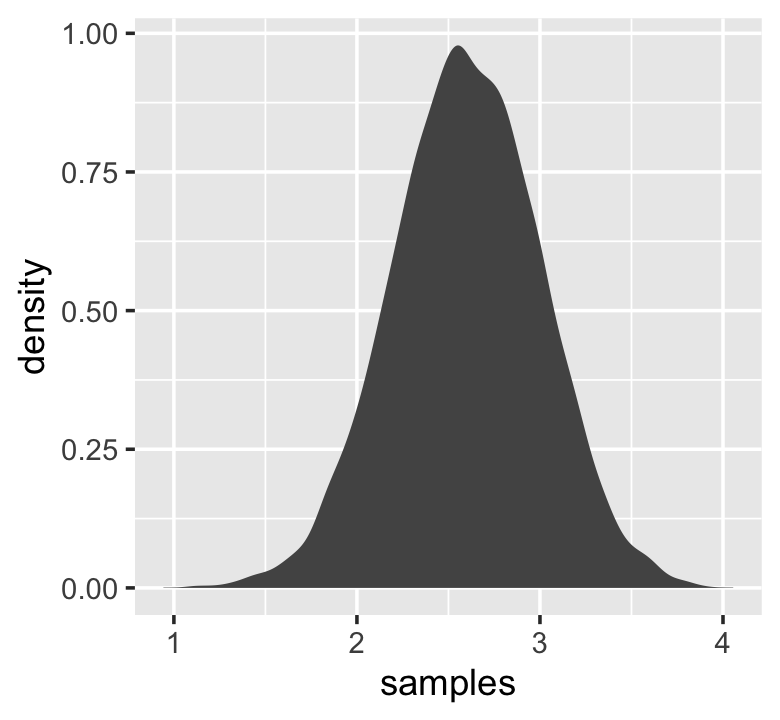

What we did was really compact. Walking it out a bit, here's what we all did within the second argument within `map_dbl()` (i.e., everything within `log()`). 


```r
tibble(a = runif(12, 0, 0.5),
       b = 1) %>% 
  mutate(c = a + b) %>% 
  summarise(p = prod(c) %>% log())
```

```
## # A tibble: 1 x 1
##       p
##   <dbl>
## 1  2.82
```

And based on the first argument within `map_dbl()`, we did that 10,000 times, after which we converted the results to a tibble and then fed those data into ggplot2. Anyway, "we get the Gaussian distribution back, because adding logs is equivalent to multiplying the original numbers. So even multiplicative interactions of large deviations can produce Gaussian distributions, once we measure the outcomes on the log scale" (p. 75).

### Using Gaussian distributions.

I really like the justifications in the following subsections.

#### Ontological justification.

The Gaussian is

> a widespread pattern, appearing again and again at different scales and in different domains. Measurement errors, variations in growth, and the velocities of molecules all tend towards Gaussian distributions. These processes do this because at their heart, these processes add together fluctuations. And repeatedly adding finite fluctuations results in a distribution of sums that have shed all information about the underlying process, aside from mean and spread.
>
> One consequence of this is that statistical models based on Gaussian distributions cannot reliably identify micro-process. (p. 75)

But they can still be useful.

#### Epistemological justification.

> Another route to justifying the Gaussian as our choice of skeleton, and a route that will help us appreciate later why it is often a poor choice, is that it represents a particular state of ignorance. When all we know or are willing to say about a distribution of measures (measures are continuous values on the real number line) is their mean and variance, then the Gaussian distribution arises as the most consistent with our assumptions.
>
> That is to say that the Gaussian distribution is the most natural expression of our state of ignorance, because if all we are willing to assume is that a measure has finite variance, the Gaussian distribution is the shape that can be realized in the largest number of ways and does not introduce any new assumptions. It is the least surprising and least informative assumption to make. In this way, the Gaussian is the distribution most consistent with our assumptions… If you don't think the distribution should be Gaussian, then that implies that you know something else that you should tell your golem about, something that would improve inference. (pp. 75--76)

#### Overthinking: Gaussian distribution.

Let $y$ be the criterion, $\mu$ be the mean, and $\sigma$ be the standard deviation. Then the probability density of some Gaussian value $y$ is

$$p(y|\mu, \sigma) = \frac{1}{\sqrt{2 \pi \sigma^2}} \exp \Bigg (- \frac{(y - \mu)^2}{2 \sigma^2} \Bigg).$$

McElreath's right. "This looks monstrous" (p. 76). Why not demystify that monster with a little R code? For simplicity, we'll look at $p(y)$ over a series of $y$ values ranging from -4 to 4, holding $\mu = 0$ and $\sigma = 1$. Then we'll plot.


```r
# define our input values
tibble(y     = seq(from = -4, to = 4, by = .1),
       mu    = 0,
       sigma = 1) %>% 
  # compute p(y) using a hand-made gaussian likelihood
  mutate(p_y = (1 / sqrt(2 * pi * sigma^2)) * exp(-(y - mu)^2 / (2 * sigma^2))) %>% 
  
  # plot!
  ggplot(aes(x = y, y = p_y)) +
  geom_line() +
  ylab(expression(italic(p)(italic("y|")*mu==0*","~sigma==1)))
```

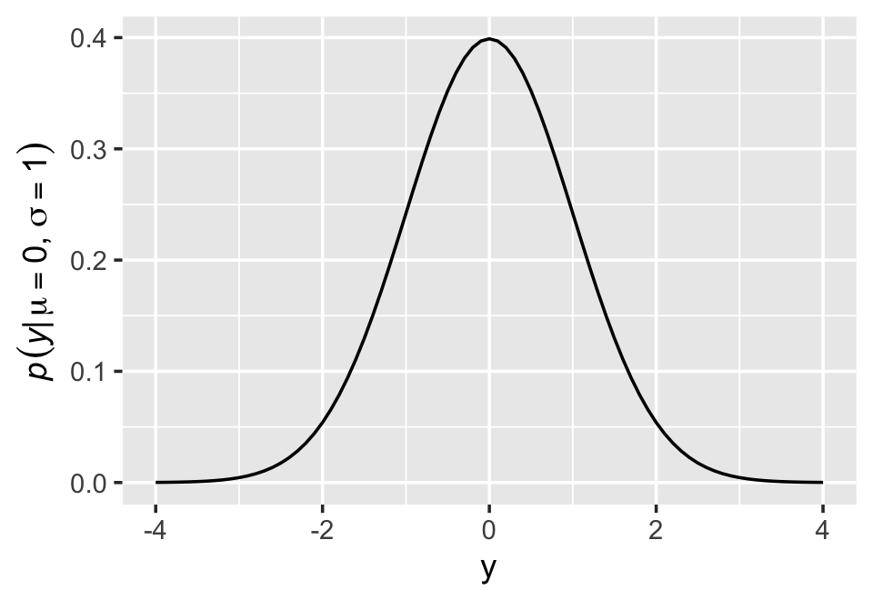

You get the same results is you switch out that mutate line with `mutate(p_y = dnorm(y)) %>%`. To learn more, execute `?dnorm`.

## A language for describing models

Our mathy ways of summarizing models will be something like

\begin{align*}
\text{criterion}_i & \sim \text{Normal}(\mu_i, \sigma) \\
\mu_i  & = \beta \times \text{predictor}_i \\
\beta  & \sim \text{Normal}(0, 10) \\
\sigma & \sim \text{HalfCauchy}(0, 1).
\end{align*}

And as McElreath then followed up with, "If that doesn't make much sense, good. That indicates that you are holding the right textbook" (p. 77). Welcome applied statistics!

### Re-describing the globe tossing model.

For the globe tossing model, the probability $p$ of a count of water $w$ based on $n$ trials was

\begin{align*}
w & \sim \text{Binomial}(n, p) \\
p & \sim \text{Uniform}(0, 1).
\end{align*}

We can break McElreath's R code 4.6 down a little bit with a tibble like so.


```r
# how many `p_grid` points would you like?
n_points <- 100

d <-
  tibble(p_grid = seq(from = 0, to = 1, length.out = n_points),
         w      = 6, 
         n      = 9) %>% 
  mutate(prior      = dunif(p_grid, 0, 1),
         likelihood = dbinom(w, n, p_grid)) %>% 
  mutate(posterior = likelihood * prior / sum(likelihood * prior))

head(d)
```

```
## # A tibble: 6 x 6
##   p_grid     w     n prior likelihood posterior
##    <dbl> <dbl> <dbl> <dbl>      <dbl>     <dbl>
## 1 0          6     9     1   0.        0.      
## 2 0.0101     6     9     1   8.65e-11  8.74e-12
## 3 0.0202     6     9     1   5.37e- 9  5.43e-10
## 4 0.0303     6     9     1   5.93e- 8  5.99e- 9
## 5 0.0404     6     9     1   3.23e- 7  3.26e- 8
## 6 0.0505     6     9     1   1.19e- 6  1.21e- 7
```

In case you were curious, here's what they look like.


```r
d %>% 
  select(-w, -n) %>% 
  gather(key, value, -p_grid) %>% 
  # this line allows us to dictate the order the panels will appear in
  mutate(key = factor(key, levels = c("prior", "likelihood", "posterior"))) %>% 
  
  ggplot(aes(x = p_grid, ymin = 0, ymax = value, fill = key)) +
  geom_ribbon() +
  scale_fill_manual(values = c("blue", "red", "purple")) +
  scale_y_continuous(NULL, breaks = NULL) +
  theme(legend.position = "none") +
  facet_wrap(~key, scales = "free")
```

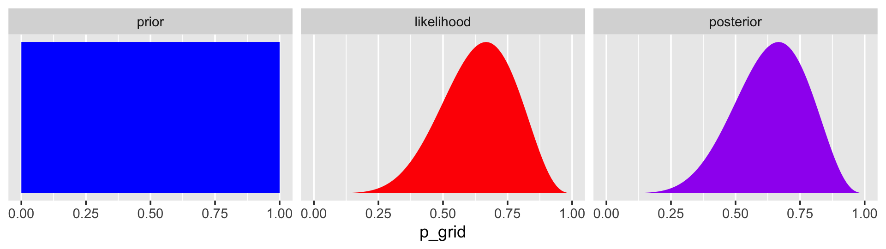

The posterior is a combination of the prior and the likelihood. When the prior is flat across the parameter space, the posterior is just the likelihood re-expressed as a probability. As we go along, you'll see that we almost never use flat priors in practice.

## A Gaussian model of height

> There are an infinite number of possible Gaussian distributions. Some have small means. Others have large means. Some are wide, with a large $\sigma$. Others are narrow. We want our Bayesian machine to consider every possible distribution, each defined by a combination of $\mu$ and $\sigma$, and rank them by posterior plausibility. (p. 79)

### The data.

Let's get the Howell ([2000](https://www.routledge.com/Demography-of-the-Dobe-Kung/Howell/p/book/9780202306490), [2010](https://www.ucpress.edu/book/9780520262348/life-histories-of-the-dobe-kung)) data from McElreath's [rethinking package](https://xcelab.net/rm/statistical-rethinking/).


```r
library(rethinking)
data(Howell1)
d <- Howell1
```

Here we open our main statistical package, Bürkner's [brms](https://github.com/paul-buerkner/brms). But before we do, we'll want to detach the rethinking package. R will not allow users to use a function from one package that shares the same name as a different function from another package if both packages are open at the same time. The rethinking and brms packages are designed for similar purposes and, unsurprisingly, overlap in the names of their functions. To prevent problems, it is a good idea to make sure rethinking is detached before using brms. To learn more on the topic, see [this R-bloggers post](https://www.r-bloggers.com/r-and-package-masking-a-real-life-example/).


```r
rm(Howell1)
detach(package:rethinking, unload = T)
library(brms)
```

Go ahead and investigate the data with `str()`, the tidyverse analogue for which is `glimpse()`.


```r
d %>%
  str()
```

```
## 'data.frame':	544 obs. of  4 variables:
##  $ height: num  152 140 137 157 145 ...
##  $ weight: num  47.8 36.5 31.9 53 41.3 ...
##  $ age   : num  63 63 65 41 51 35 32 27 19 54 ...
##  $ male  : int  1 0 0 1 0 1 0 1 0 1 ...
```

Here are the `height` values.


```r
d %>%
  select(height) %>%
  head()
```

```
##    height
## 1 151.765
## 2 139.700
## 3 136.525
## 4 156.845
## 5 145.415
## 6 163.830
```

We can use `filter()` to make an adults-only data frame.


```r
d2 <- 
  d %>%
  filter(age >= 18)
```

There are a lot of ways we can make sure our `d2` has 352 rows. Here's one.


```r
d2 %>% 
  count()
```

```
## # A tibble: 1 x 1
##       n
##   <int>
## 1   352
```

#### Overthinking: Data frames.

This probably reflects my training history, but the structure of a data frame seems natural and inherently appealing, to me. So I can't relate to the "annoying" comment. But if you're in the other camp, do check out either of these two data wrangling talks ([here](https://www.youtube.com/watch?v=4MfUCX_KpdE&t=23s&frags=pl%2Cwn) and [here](https://www.youtube.com/watch?v=GapSskrtUzU&t=1249s&frags=pl%2Cwn)) by the ineffable [Jenny Bryan](https://twitter.com/jennybryan?lang=en).

#### Overthinking: Index magic.

For more on indexing, check out [Chapter 9](https://bookdown.org/rdpeng/rprogdatascience/subsetting-r-objects.html) of Roger Peng's *R Programming for Data Science* or even the [Subsetting](https://r4ds.had.co.nz/vectors.html#subsetting-1) subsection from *R4DS*.

### The model. 

The likelihood for our model is 

$$h_i \sim \operatorname{Normal}(\mu, \sigma),$$

our $\mu$ prior will be

$$\mu \sim \operatorname{Normal}(178, 20),$$

and our prior for $\sigma$ will be

$$\sigma \sim \operatorname{Uniform}(0, 50).$$

Here's the shape of the prior for $\mu$ in $N(178, 20)$.


```r
ggplot(data = tibble(x = seq(from = 100, to = 250, by = .1)), 
       aes(x = x, y = dnorm(x, mean = 178, sd = 20))) +
  geom_line() +
  ylab("density")
```

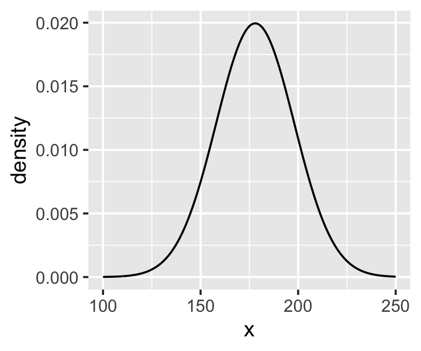

And here's the ggplot2 code for our prior for $\sigma$, a uniform distribution with a minimum value of 0 and a maximum value of 50. We don't really need the y axis when looking at the shapes of a density, so we'll just remove it with `scale_y_continuous()`.


```r
tibble(x = seq(from = -10, to = 60, by = .1)) %>%
  
  ggplot(aes(x = x, y = dunif(x, min = 0, max = 50))) +
  geom_line() +
  scale_y_continuous(NULL, breaks = NULL) +
  theme(panel.grid = element_blank())
```

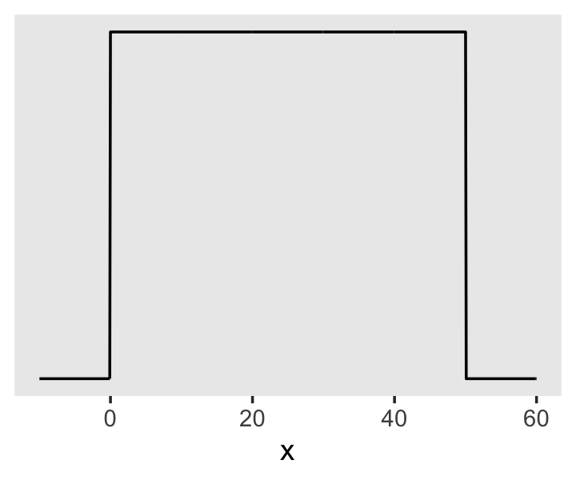

We can simulate from both priors at once to get a prior probability distribution of `heights`.


```r
n <- 1e4

set.seed(4)
tibble(sample_mu    = rnorm(n, mean = 178,       sd  = 20),
       sample_sigma = runif(n, min  = 0,         max = 50)) %>% 
  mutate(x = rnorm(n, mean = sample_mu, sd  = sample_sigma)) %>% 
  
  ggplot(aes(x = x)) +
  geom_density(fill = "black", size = 0) +
  scale_y_continuous(NULL, breaks = NULL) +
  labs(subtitle = expression(Prior~predictive~distribution~"for"~italic(h[i])),
       x = NULL) +
  theme(panel.grid = element_blank())
```


As McElreath wrote, we've made a "vaguely bell-shaped density with thick tails. It is the expected distribution of heights, averaged over the prior" (p. 83).

### Grid approximation of the posterior distribution. 

As McElreath explained, you'll never use this for practical data analysis. But I found this helped me better understanding what exactly we're doing with Bayesian estimation. So let's play along. This is our version of the first three lines in McElreath's R code 4.14.


```r
n <- 200

d_grid <-
  # we'll accomplish with `tidyr::crossing()` what McElreath did with base R `expand.grid()`
  crossing(mu    = seq(from = 140, to = 160, length.out = n),
           sigma = seq(from = 4,   to = 9,   length.out = n))

glimpse(d_grid)
```

```
## Observations: 40,000
## Variables: 2
## $ mu    <dbl> 140, 140, 140, 140, 140, 140, 140, 140, 140, 140, 140, 140, 140, 140, 140, 140, 140…
## $ sigma <dbl> 4.000000, 4.025126, 4.050251, 4.075377, 4.100503, 4.125628, 4.150754, 4.175879, 4.2…
```

`d_grid` contains every combination of `mu` and `sigma` across their specified values. Instead of base R `sapply()`, we'll do the computations by making a custom function which we'll plug into `purrr::map2().`


```r
grid_function <- function(mu, sigma) {
  
  dnorm(d2$height, mean = mu, sd = sigma, log = T) %>% 
    sum()
  
}
```

Now we're ready to complete the tibble.


```r
d_grid <-
  d_grid %>% 
  mutate(log_likelihood = map2(mu, sigma, grid_function)) %>%
  unnest(log_likelihood) %>% 
  mutate(prior_mu    = dnorm(mu,    mean = 178, sd  = 20, log = T),
         prior_sigma = dunif(sigma, min  = 0,   max = 50, log = T)) %>% 
  mutate(product = log_likelihood + prior_mu + prior_sigma) %>% 
  mutate(probability = exp(product - max(product)))
  
head(d_grid)
```

```
## # A tibble: 6 x 7
##      mu sigma log_likelihood prior_mu prior_sigma product probability
##   <dbl> <dbl>          <dbl>    <dbl>       <dbl>   <dbl>       <dbl>
## 1   140  4            -3813.    -5.72       -3.91  -3822.           0
## 2   140  4.03         -3778.    -5.72       -3.91  -3787.           0
## 3   140  4.05         -3743.    -5.72       -3.91  -3753.           0
## 4   140  4.08         -3709.    -5.72       -3.91  -3719.           0
## 5   140  4.10         -3676.    -5.72       -3.91  -3686.           0
## 6   140  4.13         -3644.    -5.72       -3.91  -3653.           0
```

In the final `d_grid`, the `probability` vector contains the posterior probabilities across values of `mu` and `sigma`. We can make a contour plot with `geom_contour()`.


```r
d_grid %>% 
  ggplot(aes(x = mu, y = sigma, z = probability)) + 
  geom_contour() +
  labs(x = expression(mu),
       y = expression(sigma)) +
  coord_cartesian(xlim = range(d_grid$mu),
                  ylim = range(d_grid$sigma)) +
  theme(panel.grid = element_blank())
```


We'll make our heat map with `geom_raster(aes(fill = probability))`.


```r
d_grid %>% 
  ggplot(aes(x = mu, y = sigma)) + 
  geom_raster(aes(fill = probability),
              interpolate = T) +
  scale_fill_viridis_c(option = "A") +
  labs(x = expression(mu),
       y = expression(sigma)) +
  theme(panel.grid = element_blank())
```

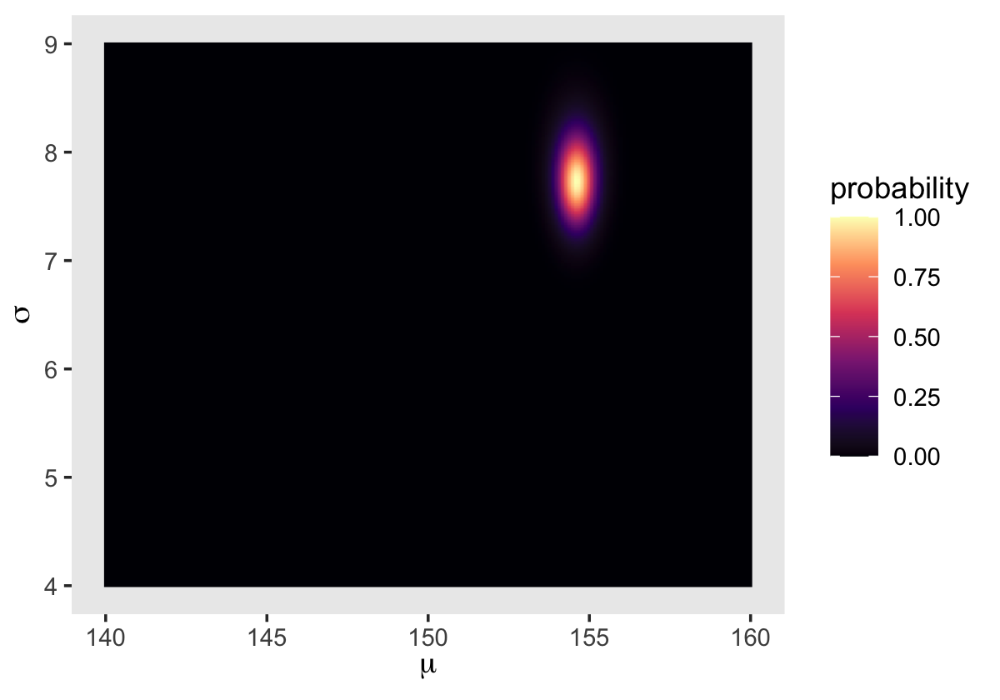

### Sampling from the posterior.

We can use `dplyr::sample_n()` to sample rows, with replacement, from `d_grid`.


```r
set.seed(4)
d_grid_samples <- 
  d_grid %>% 
  sample_n(size = 1e4, replace = T, weight = probability)

d_grid_samples %>% 
  ggplot(aes(x = mu, y = sigma)) + 
  geom_point(size = .9, alpha = 1/15) +
  scale_fill_viridis_c() +
  labs(x = expression(mu[samples]),
       y = expression(sigma[samples])) +
  theme(panel.grid = element_blank())
```


We can use `gather()` and then `facet_warp()` to plot the densities for both `mu` and `sigma` at once.


```r
d_grid_samples %>% 
  select(mu, sigma) %>% 
  gather() %>% 

  ggplot(aes(x = value)) + 
  geom_density(fill = "grey33", size = 0) +
  scale_y_continuous(NULL, breaks = NULL) +
  xlab(NULL) +
  theme(panel.grid = element_blank()) +
  facet_wrap(~key, scales = "free")
```

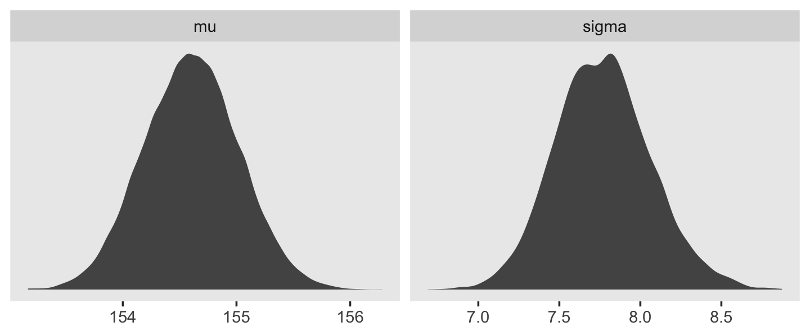

We'll use the tidybayes package to compute their posterior modes and 95% HDIs.


```r
library(tidybayes)

d_grid_samples %>% 
  select(mu, sigma) %>% 
  gather() %>% 
  group_by(key) %>% 
  mode_hdi(value)
```

```
## # A tibble: 2 x 7
##   key    value .lower .upper .width .point .interval
##   <chr>  <dbl>  <dbl>  <dbl>  <dbl> <chr>  <chr>    
## 1 mu    155.   154.   155.     0.95 mode   hdi      
## 2 sigma   7.82   7.14   8.30   0.95 mode   hdi
```

Let's say you wanted their posterior medians and 50% quantile-based intervals, instead. Just switch out the last line for `median_qi(value, .width = .5)`.

#### Overthinking: Sample size and the normality of $\sigma$'s posterior.

Since we'll be fitting models with brms almost exclusively from here on out, this section is largely moot. But we'll do it anyway for the sake of practice. I'm going to break the steps up like before rather than compress the code together. Here's `d3`.


```r
set.seed(4)
(d3 <- sample(d2$height, size = 20))
```

```
##  [1] 147.3200 154.9400 168.9100 156.8450 165.7350 151.7650 165.7350 156.2100 144.7800 154.9400
## [11] 151.1300 147.9550 149.8600 162.5600 161.9250 164.4650 160.9852 151.7650 163.8300 149.8600
```

For our first step using `d3`, we'll redefine `d_grid`.


```r
n <- 200

# note we've redefined the ranges of `mu` and `sigma`
d_grid <-
  crossing(mu    = seq(from = 150, to = 170, length.out = n),
           sigma = seq(from = 4,   to = 20,  length.out = n))
```

Second, we'll redefine our custom `grid_function()` function to operate over the `height` values of `d3`.


```r
grid_function <- function(mu, sigma) {
  
  dnorm(d3, mean = mu, sd = sigma, log = T) %>% 
    sum()
  
}
```

Now we'll use the amended `grid_function()` to make the posterior.


```r
d_grid <-
  d_grid %>% 
  mutate(log_likelihood = map2_dbl(mu, sigma, grid_function)) %>% 
  mutate(prior_mu    = dnorm(mu,    mean = 178, sd  = 20, log = T),
         prior_sigma = dunif(sigma, min  = 0,   max = 50, log = T)) %>% 
  mutate(product = log_likelihood + prior_mu + prior_sigma) %>% 
  mutate(probability = exp(product - max(product)))
```

Did you catch our use of `purrr::map2_dbl()`, there, in place of `purrr::map2()`? It turns out that `purrr::map()` and `purrr::map2()` always return a list (see [here](https://purrr.tidyverse.org/reference/map.html) and [here](https://purrr.tidyverse.org/reference/map2.html)). But as [Phil Straforelli](https://twitter.com/PStrafo) kindly [pointed out](https://twitter.com/PStrafo/status/1046853175917961217), we can add the `_dbl` suffix to those functions, which will instruct the purrr package to return a double vector (i.e., a [common kind of numeric vector](https://r4ds.had.co.nz/vectors.html#important-types-of-atomic-vector)). The advantage of that approach is we no longer need to follow our `map()` or `map2()` lines with `unnest()`. To learn more about the ins and outs of the `map()` family, check out [this section](https://r4ds.had.co.nz/iteration.html#the-map-functions) from *R4DS* or Jenny Bryan's [*purrr tutorial*](https://jennybc.github.io/purrr-tutorial/).

Next we'll `sample_n()` and plot.


```r
set.seed(4)
d_grid_samples <- 
  d_grid %>% 
  sample_n(size = 1e4, replace = T, weight = probability)

d_grid_samples %>% 
  ggplot(aes(x = mu, y = sigma)) + 
  geom_point(size = .9, alpha = 1/15) +
  scale_fill_viridis_c() +
  labs(x = expression(mu[samples]),
       y = expression(sigma[samples])) +
  theme(panel.grid = element_blank())
```

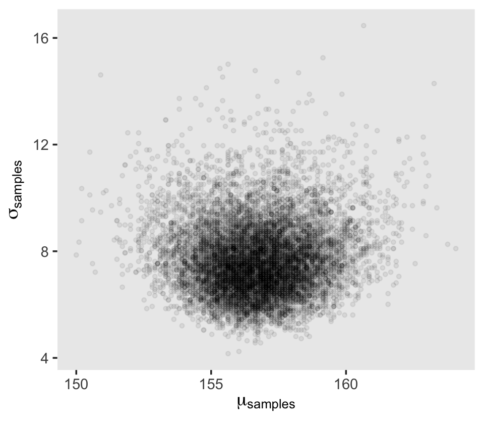

Behold the updated densities.


```r
d_grid_samples %>% 
  select(mu, sigma) %>% 
  gather() %>% 

  ggplot(aes(x = value)) + 
  geom_density(fill = "grey33", size = 0) +
  scale_y_continuous(NULL, breaks = NULL) +
  xlab(NULL) +
  theme(panel.grid = element_blank()) +
  facet_wrap(~key, scales = "free", labeller = label_parsed)
```


That `labeller = label_parsed` bit in the `facet_wrap()` function is what converted our subplot strip labels into Greek. Anyway, $\sigma$ is not so Gaussian with that small $n$.

This is the point in the project where we hop off the grid-approximation train. On the one hand, I think this is a great idea. Most of y'all reading this will never use grid approximation in a real-world applied data analysis. On the other hand, there is some pedagogical utility in practicing with it. It can help you grasp what it is we're dong when we apply Bayes' theorem. If you'd like more practice, check out the first several chapters in [Kruschke's (2014) textbook](https://sites.google.com/site/doingbayesiandataanalysis/) and the corresponding chapters in [my project translating it into brms and tidyverse](https://bookdown.org/ajkurz/DBDA_recoded/).

### Fitting the model with ~~`map`~~ `brm()`.

We won't actually use `rethinking::map()`--which you should not conflate with `purrr::map()`--, but will jumpt straight to the primary brms modeling function, `brm()`. In the text, McElreath indexed his models with names like `m4.1`. I will largely follow that convention, but will replace the *m* with a *b* to stand for the brms package. Plus, once in a blue moon we will actually use the rethinking package to fit a model in order to contrast it to one fit with brms. On those occasions, we will index them using the *m* prefix. Here's the first model with `brm()`.


```r
b4.1 <- 
  brm(data = d2, 
      family = gaussian,
      height ~ 1,
      prior = c(prior(normal(178, 20), class = Intercept),
                prior(uniform(0, 50), class = sigma)),
      iter = 31000, warmup = 30000, chains = 4, cores = 4,
      seed = 4,
      file = "fits/b04.01")
```

McElreath's uniform prior for $\sigma$ was rough on brms. It took an unusually-large number of warmup iterations before the chains sampled properly. As McElreath covered in [Chapter 8][Estimation.], Hamiltonian Monte Carlo (HMC) tends to work better when you default to a half Cauchy for $\sigma$. We can do that like this.


```r
b4.1_hc <- 
  brm(data = d2, family = gaussian,
      height ~ 1,
      prior = c(prior(normal(178, 20), class = Intercept),
                # the magic lives here
                prior(cauchy(0, 1), class = sigma)),
      iter = 2000, warmup = 1000, chains = 4, cores = 4,
      seed = 4,
      file = "fits/b04.01_hc")
```

This leads to an important point. After running model with Hamiltonian Monte Carlo (HMC), it's a good idea to inspect the chains. As we'll see, McElreath coverd this in [Chapter 8][Checking the chain.]. Here's a typical way to do so in brms.


```r
plot(b4.1_hc) 
```


If you want detailed diagnostics for the HMC chains, execute `launch_shinystan(b4.1)`. It'll keep you busy for a while. But anyway, the chains look good. We can reasonably trust the results.

Here's how to get the model summary of our `brm()` object.


```r
print(b4.1_hc)
```

```
##  Family: gaussian 
##   Links: mu = identity; sigma = identity 
## Formula: height ~ 1 
##    Data: d2 (Number of observations: 352) 
## Samples: 4 chains, each with iter = 2000; warmup = 1000; thin = 1;
##          total post-warmup samples = 4000
## 
## Population-Level Effects: 
##           Estimate Est.Error l-95% CI u-95% CI Rhat Bulk_ESS Tail_ESS
## Intercept   154.62      0.42   153.81   155.43 1.00     2750     2667
## 
## Family Specific Parameters: 
##       Estimate Est.Error l-95% CI u-95% CI Rhat Bulk_ESS Tail_ESS
## sigma     7.75      0.29     7.21     8.36 1.00     3347     2448
## 
## Samples were drawn using sampling(NUTS). For each parameter, Bulk_ESS
## and Tail_ESS are effective sample size measures, and Rhat is the potential
## scale reduction factor on split chains (at convergence, Rhat = 1).
```

The `summary()` function works in a similar way. You can also get a [Stan-like summary](https://cran.r-project.org/package=rstan/vignettes/rstan.html) like this.


```r
b4.1_hc$fit
```

```
## Inference for Stan model: 1df58279fc244ef48da72e5429624e43.
## 4 chains, each with iter=2000; warmup=1000; thin=1; 
## post-warmup draws per chain=1000, total post-warmup draws=4000.
## 
##                 mean se_mean   sd     2.5%      25%      50%      75%    97.5% n_eff Rhat
## b_Intercept   154.62    0.01 0.42   153.81   154.34   154.62   154.91   155.43  2725    1
## sigma           7.75    0.01 0.29     7.21     7.56     7.75     7.94     8.36  3317    1
## lp__        -1227.52    0.03 1.01 -1230.29 -1227.90 -1227.21 -1226.80 -1226.54  1317    1
## 
## Samples were drawn using NUTS(diag_e) at Tue Feb 25 19:32:13 2020.
## For each parameter, n_eff is a crude measure of effective sample size,
## and Rhat is the potential scale reduction factor on split chains (at 
## convergence, Rhat=1).
```

Whereas rethinking defaults to 89% intervals, using `print()` or `summary()` with brms models defaults to 95% intervals. Unless otherwise specified, I will stick with 95% intervals throughout. However, if you really want those 89% intervals, an easy way is with the `prob` argument within `brms::summary()` or `brms::print()`.


```r
summary(b4.1_hc, prob = .89)
```

```
##  Family: gaussian 
##   Links: mu = identity; sigma = identity 
## Formula: height ~ 1 
##    Data: d2 (Number of observations: 352) 
## Samples: 4 chains, each with iter = 2000; warmup = 1000; thin = 1;
##          total post-warmup samples = 4000
## 
## Population-Level Effects: 
##           Estimate Est.Error l-89% CI u-89% CI Rhat Bulk_ESS Tail_ESS
## Intercept   154.62      0.42   153.96   155.28 1.00     2750     2667
## 
## Family Specific Parameters: 
##       Estimate Est.Error l-89% CI u-89% CI Rhat Bulk_ESS Tail_ESS
## sigma     7.75      0.29     7.30     8.24 1.00     3347     2448
## 
## Samples were drawn using sampling(NUTS). For each parameter, Bulk_ESS
## and Tail_ESS are effective sample size measures, and Rhat is the potential
## scale reduction factor on split chains (at convergence, Rhat = 1).
```

Anyways, here's how to fit the model with the shockingly-narrow prior on $\mu$.


```r
b4.2 <- 
  brm(data = d2, family = gaussian,
      height ~ 1,
      prior = c(prior(normal(178, 0.1), class = Intercept),
                prior(uniform(0, 50), class = sigma)),
      iter = 3000, warmup = 2000, chains = 4, cores = 4,
      seed = 4,
      file = "fits/b04.02")
```

Check the chains.


```r
plot(b4.2)
```


I had to increase the `warmup` due to convergence issues. After doing so, everything looks to be on the up and up. The chains look great. And again, we will learn more about these technical details in [Chapter 8][Checking the chain.].

Here's the model `summary()`.


```r
summary(b4.2)
```

```
##  Family: gaussian 
##   Links: mu = identity; sigma = identity 
## Formula: height ~ 1 
##    Data: d2 (Number of observations: 352) 
## Samples: 4 chains, each with iter = 3000; warmup = 2000; thin = 1;
##          total post-warmup samples = 4000
## 
## Population-Level Effects: 
##           Estimate Est.Error l-95% CI u-95% CI Rhat Bulk_ESS Tail_ESS
## Intercept   177.86      0.10   177.67   178.06 1.00     3465     2405
## 
## Family Specific Parameters: 
##       Estimate Est.Error l-95% CI u-95% CI Rhat Bulk_ESS Tail_ESS
## sigma    24.59      0.92    22.82    26.47 1.00     1748      829
## 
## Samples were drawn using sampling(NUTS). For each parameter, Bulk_ESS
## and Tail_ESS are effective sample size measures, and Rhat is the potential
## scale reduction factor on split chains (at convergence, Rhat = 1).
```

Subsetting the `summary()` output with `$fixed` provides a convenient way to compare the `Intercept` summaries between `b4.1_hc` and `b4.2`.


```r
summary(b4.1_hc)$fixed
```

```
##           Estimate Est.Error l-95% CI u-95% CI     Rhat Bulk_ESS Tail_ESS
## Intercept 154.6231 0.4163572 153.8149 155.4335 1.000125     2750     2667
```

```r
summary(b4.2)$fixed
```

```
##           Estimate  Est.Error l-95% CI u-95% CI      Rhat Bulk_ESS Tail_ESS
## Intercept 177.8632 0.09958398 177.6723 178.0604 0.9996049     3465     2405
```

### Sampling from a ~~`map`~~ `brm()` fit.

brms doesn't seem to have a convenience function that works the way `vcov()` does for rethinking.


```r
vcov(b4.1_hc)
```

```
##           Intercept
## Intercept 0.1733533
```

This only returned the first element in the matrix it did for rethinking. That is, it appears the `brms::vcov()` function only returns the variance/covariance matrix for the single-level $\beta$ parameters (i.e., those used to model $\mu$).

However, if you really wanted this information, you could get it after putting the HMC chains in a data frame. We do that with the `posterior_samples()`, which we'll be using a lot of as we go along.


```r
post <- posterior_samples(b4.1_hc)

head(post)
```

```
##   b_Intercept    sigma      lp__
## 1    155.0785 7.335334 -1228.205
## 2    154.0975 7.652924 -1227.324
## 3    154.8050 7.499036 -1226.946
## 4    155.2052 7.574270 -1227.748
## 5    155.2581 7.565656 -1227.970
## 6    154.0118 7.612666 -1227.663
```

Now `select()` the columns containing the draws from the desired parameters and feed them into `cov()`.


```r
select(post, b_Intercept:sigma) %>% 
  cov()
```

```
##              b_Intercept        sigma
## b_Intercept  0.173353306 -0.003242316
## sigma       -0.003242316  0.084394323
```


That was "(1) a vector of variances for the parameters and (2) a correlation matrix" for them (p. 90). Here are just the variances (i.e., the diagonal elements) and the correlation matrix.


```r
# variances
select(post, b_Intercept:sigma) %>%
  cov() %>%
  diag()
```

```
## b_Intercept       sigma 
##  0.17335331  0.08439432
```

```r
# correlation
post %>%
select(b_Intercept, sigma) %>%
  cor()
```

```
##             b_Intercept       sigma
## b_Intercept  1.00000000 -0.02680604
## sigma       -0.02680604  1.00000000
```

With our `post <- posterior_samples(b4.1_hc)` code from a few lines above, we've already done the brms version of what McElreath did with `extract.samples()` on page 90. However, what happened under the hood was different. Whereas rethinking used the `mvnorm()` function from the [MASS package](https://cran.r-project.org/package=MASS), in brms we just extracted the iterations of the HMC chains and put them in a data frame. 


```r
str(post)
```

```
## 'data.frame':	4000 obs. of  3 variables:
##  $ b_Intercept: num  155 154 155 155 155 ...
##  $ sigma      : num  7.34 7.65 7.5 7.57 7.57 ...
##  $ lp__       : num  -1228 -1227 -1227 -1228 -1228 ...
```

Notice how our data frame, `post`, includes a third vector named `lp__`. That's the log posterior. See the [brms reference manual](https://cran.r-project.org/package=brms/brms.pdf) or the "The Log-Posterior (function and gradient)" section of the Stan Development Team's [*RStan: the R interface to Stan*](https://cran.r-project.org/package=rstan/vignettes/rstan.html#the-log-posterior-function-and-gradient) for details. The log posterior will largely be outside of our focus in this project.

The `summary()` function doesn't work for brms posterior data frames quite the way `precis()` does for posterior data frames from the rethinking package. E.g.,


```r
summary(post[, 1:2])
```

```
##   b_Intercept        sigma      
##  Min.   :152.9   Min.   :6.785  
##  1st Qu.:154.3   1st Qu.:7.561  
##  Median :154.6   Median :7.748  
##  Mean   :154.6   Mean   :7.754  
##  3rd Qu.:154.9   3rd Qu.:7.938  
##  Max.   :156.1   Max.   :8.902
```

Here's one option using the transpose of a `quantile()` call nested within `apply()`, which is a very general function you can learn more about [here](https://www.datacamp.com/community/tutorials/r-tutorial-apply-family#gs.f7fyw2s) or [here](https://www.r-bloggers.com/r-tutorial-on-the-apply-family-of-functions/).


```r
t(apply(post[, 1:2], 2, quantile, probs = c(.5, .025, .75)))
```

```
##                    50%       2.5%        75%
## b_Intercept 154.619016 153.814860 154.909843
## sigma         7.748051   7.210529   7.938047
```

The base R code is compact, but somewhat opaque. Here's how to do something similar with more explicit tidyverse code.


```r
post %>%
  select(sigma:b_Intercept) %>% 
  gather(parameter) %>%
  group_by(parameter) %>%
  summarise(mean = mean(value),
            SD   = sd(value),
            `2.5_percentile`  = quantile(value, probs = .025),
            `97.5_percentile` = quantile(value, probs = .975)) %>%
  mutate_if(is.numeric, round, digits = 2)
```

```
## # A tibble: 2 x 5
##   parameter     mean    SD `2.5_percentile` `97.5_percentile`
##   <chr>        <dbl> <dbl>            <dbl>             <dbl>
## 1 b_Intercept 155.   0.42            154.              155.  
## 2 sigma         7.75 0.290             7.21              8.36
```

You can always get pretty similar information by just putting the `brm()` fit object into `posterior_summary()`.


```r
posterior_summary(b4.1_hc)
```

```
##                 Estimate Est.Error         Q2.5        Q97.5
## b_Intercept   154.623104 0.4163572   153.814860   155.433461
## sigma           7.754454 0.2905070     7.210529     8.361077
## lp__        -1227.519041 1.0103147 -1230.287040 -1226.540850
```

And if you're willing to drop the posterior $SD$s, you can use `tidybayes::mean_qi()`, too.


```r
post %>% 
  select(sigma:b_Intercept) %>% 
  gather(parameter) %>%
  group_by(parameter) %>%
  mean_qi(value)
```

```
## # A tibble: 2 x 7
##   parameter    value .lower .upper .width .point .interval
##   <chr>        <dbl>  <dbl>  <dbl>  <dbl> <chr>  <chr>    
## 1 b_Intercept 155.   154.   155.     0.95 mean   qi       
## 2 sigma         7.75   7.21   8.36   0.95 mean   qi
```

#### Overthinking: Under the hood with multivariate sampling.

Again, `brms::posterior_samples()` is not the same as `rethinking::extract.samples()`. Rather than use the `MASS::mvnorm()`, brms takes the iterations from the HMC chains. McElreath coverd all of this in [Chapter 8][Easy HMC: ~~map2stan~~ `brm()`] and we will too. You might also look at the brms [reference manual](https://cran.r-project.org/package=brms/brms.pdf) or [GitHub page](https://github.com/paul-buerkner/brms) for details. To get documentation in a hurry, you could also just execute `?posterior_samples`.

#### Overthinking: Getting $\sigma$ right.

There's no need to fret about this when using brms. With HMC, we are not constraining the posteriors to the multivariate normal distribution. Here's our posterior density for $\sigma$.


```r
ggplot(data = post, 
       aes(x = sigma)) +
  geom_density(size = 1/10, fill = "black") +
  scale_y_continuous(NULL, breaks = NULL) +
  xlab(expression(sigma)) +
  theme(panel.grid = element_blank())
```


See? HMC handled the mild skew just fine. 

But sometimes you want to actually model $\sigma$, such as in the case where your variances are systematically heterogeneous. Bürkner calls these kinds of models distributional models, which you can learn more about in his vignette [*Estimating Distributional Models with brms*](https://cran.r-project.org/package=brms/vignettes/brms_distreg.html). As he explained in the vignette, you actually model $\log (\sigma)$ in those instances. If you're curious, we'll practice with a model like this in [Chapter 9][Linking linear models to distributions.]. Kruschke also covered several models of this kind in his (2015) text, [*Doing Bayesian Data Analysis: A Tutorial with R, JAGS, and Stan*](https://sites.google.com/site/doingbayesiandataanalysis/), which I've translated into brms and tidyverse code. Check out [Section 16.3](https://bookdown.org/content/3686/metric-predicted-variable-on-one-or-two-groups.html#two-groups) for an example of modeling $\log \sigma$ with a grouping variable.

## Adding a predictor

> What we've done above is a Gaussian model of height in a population of adults. But it doesn't really have the usual feel of "regression" to it. Typically, we are interested in modeling how an outcome is related to some predictor variable. And by including a predictor variable in a particular way, we'll have linear regression. (p. 92)

Here's our scatter plot of our predictor `weight` and our criterion `height`.


```r
ggplot(data = d2, 
       aes(x = weight, y = height)) +
  geom_point(shape = 1, size = 2) +
  theme_bw() +
  theme(panel.grid = element_blank())
```


> There's obviously a relationship: Knowing a person’s weight helps you predict height. 
>
>To make this vague observation into a more precise quantitative model that relates values of `weight` to plausible values of `height`, we need some more technology. How do we take our Gaussian model from the previous section and incorporate predictor variables? (p. 92)

### The linear model strategy.

> The strategy is to make the parameter for the mean of a Gaussian distribution, $\mu$, into a linear function of the predictor variable and other, new parameters that we invent. This strategy is often simply called the **linear model**. The linear model strategy instructs the golem to assume that the predictor variable has a perfect constant and additive relationship to the mean of the outcome. The golem then computes the posterior distribution of this constant relationship. (p. 92, **emphasis** in the original)

Our new univariable model will follow the formula

\begin{align*}
h_i & \sim \text{Normal}(\mu_i, \sigma) \\
\mu_i & = \alpha + \beta x_i \\
\alpha & \sim \text{Normal}(178, 100) \\
\beta & \sim \text{Normal}(0, 10) \\
\sigma & \sim \text{Uniform}(0, 50).
\end{align*}

#### Likelihood.

The likelihood for our model is $h_i \sim \text{Normal}(\mu_i, \sigma)$.

#### Linear model.

Our linear model is $\mu_i = \alpha + \beta x_i$. The thing we're modeling is $\mu_i$, the conditional mean of our variable $h_i$, and we're modeling it with two parameters:

* $\alpha$ (i.e., the intercept) and
* $\beta$ (i.e., the slope).

#### Priors.

Our univariable model has three priors:

\begin{align*}
\alpha & \sim \text{Normal}(178, 100), \\
\beta & \sim \text{Normal}(0, 10), \; \text{and} \\
\sigma & \sim \text{Uniform}(0, 50).
\end{align*}

McElreath recommended we plot them. If you recall, we've already plotted $\text{Normal}(178, 100)$ and $\text{Uniform}(0, 50)$. Here's what the prior for our new $\beta$ parameter looks like.


```r
tibble(beta = -40:40) %>% 
  mutate(density = dnorm(beta, mean = 0, sd = 10)) %>% 
  
  ggplot(aes(x = beta, ymin = 0, ymax = density)) +
  geom_ribbon(size = 0, fill = "royalblue") +
  scale_y_continuous(NULL, breaks = NULL) +
  xlab(expression(beta)) +
  theme(panel.grid = element_blank())
```

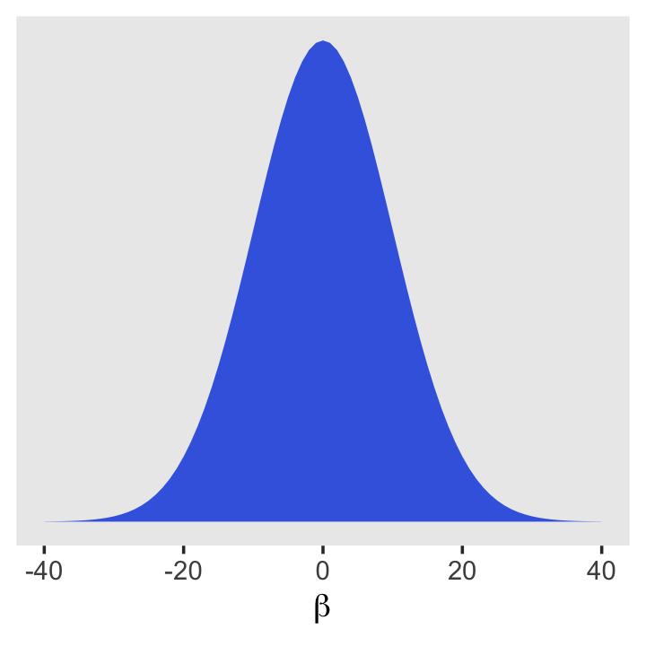

### Fitting the model.

If you look closely at the statistical model and corresponding rethinking code at the bottom of page 95, you'll see they contradict each other on the prior for $\alpha$. Though we didn't note it at the time, there was similar contradiction in the middle of page 87 for `m4.1`. McElreath acknowledged this in his [Errata](https://github.com/rmcelreath/rethinking/blob/master/ERRATA.md), where he indicated the intended prior was $\alpha \sim \text{Normal}(178, 100)$. We will use that prior here, too.

Unlike with the rethinking package, our `brms::brm()` syntax won't perfectly mirror the formal statistical notation. But here are the analogues to the exposition at the bottom of page 95 (with the corrected $\alpha$ prior).

* $h_i \sim \text{Normal}(\mu_i, \sigma)$: `family = gaussian`
* $\mu_i = \alpha + \beta x_i$: `height ~ 1 + weight`
* $\alpha \sim \text{Normal}(178, 100)$: `prior(normal(178, 100), class = Intercept`
* $\beta \sim \text{Normal}(0, 10)$: ` prior(normal(0, 10), class = b)`
* $\sigma \sim \text{Uniform}(0, 50)$: `prior(uniform(0, 50), class = sigma)`

Thus, to add a predictor you just the `+` operator in the model `formula`.


```r
b4.3 <- 
  brm(data = d2, 
      family = gaussian,
      height ~ 1 + weight,
      prior = c(prior(normal(178, 100), class = Intercept),
                prior(normal(0, 10), class = b),
                prior(uniform(0, 50), class = sigma)),
      iter = 41000, warmup = 40000, chains = 4, cores = 4,
      seed = 4,
      file = "fits/b04.03")
```

This was another example of how using a uniform prior for $\sigma$ required we use an unusually large number of `warmup` iterations before the HMC chains converged on the posterior. Change the prior to `cauchy(0, 1)` and the chains converge with no problem, resulting in much better effective samples, too. Here are the trace plots.


```r
plot(b4.3)
```

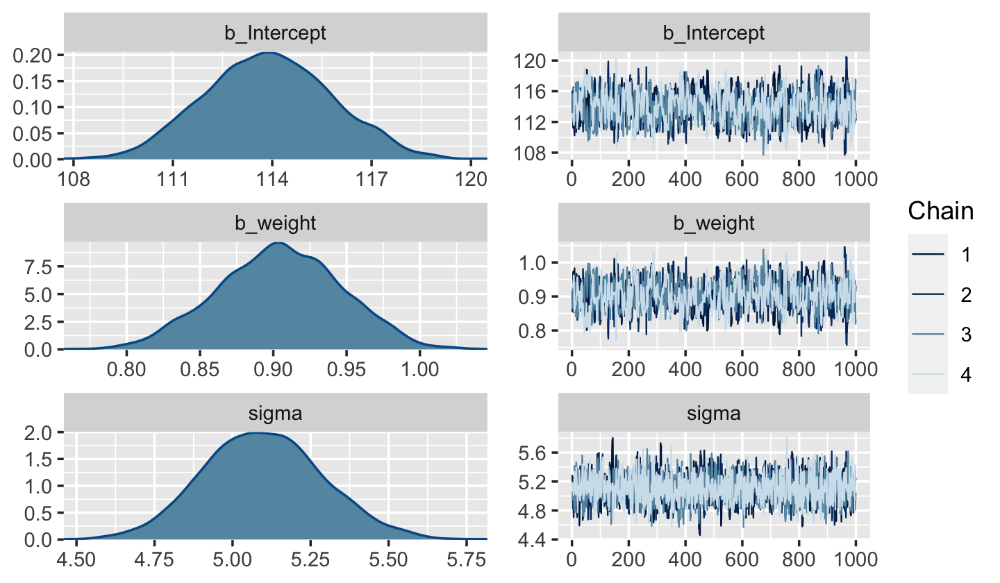

#### Overthinking: Embedding linear models.

I'm not aware that you can embed the linear model within the likelihood function within `brms::brm()` the way McElreath did in R code 4.39. However, it can be pedagogically useful to write out the statistical model that way:

\begin{align*}
h_i & \sim \text{Normal}(\alpha + \beta x_i, \sigma) \\
\alpha & \sim \text{Normal}(178, 100) \\
\beta & \sim \text{Normal}(0, 10) \\
\sigma & \sim \text{Uniform}(0, 50)
\end{align*}

*Whoah. What? Where did* $\mu_i$ *go?* It's still there. We just expressed it as $\alpha + \beta x_i$.

### Interpreting the model fit.

> One trouble with statistical models is that they are hard to understand. Once you've fit the model, it can only report posterior probabilities. These are the right answer to the question that is the combination of model and data. But it's your responsibility to process the answer and make sense of it. 
>
> There are two broad categories of processing: (1) reading tables and (2) plotting. (p. 97).

#### Tables of estimates.

With a little `[]` subsetting we can exclude the log posterior from the `posterior_summary()` so we can fucus on the parameters.


```r
posterior_summary(b4.3)[1:3, ]
```

```
##                Estimate  Est.Error        Q2.5      Q97.5
## b_Intercept 113.8471053 1.94964685 109.8593917 117.647380
## b_weight      0.9058459 0.04295012   0.8218504   0.994324
## sigma         5.1034876 0.19408621   4.7418032   5.517190
```

Again, brms doesn't have a convenient `corr = TRUE` argument for `plot()` or `summary()`. But you can get that information after putting the chains in a data frame.


```r
posterior_samples(b4.3) %>%
  select(b_Intercept:sigma) %>%
  cor() %>%
  round(digits = 2)
```

```
##             b_Intercept b_weight sigma
## b_Intercept        1.00    -0.99  0.03
## b_weight          -0.99     1.00 -0.03
## sigma              0.03    -0.03  1.00
```

Much like the results from McElreath's rethinking package, two of the parameters from our model fit with `brm()` are highly correlated, too. With centering, we can reduce that correlation.


```r
d2 <- 
  d2 %>%
  mutate(weight_c = weight - mean(weight))
```

Fit the `weight_c` model, `b4.4`.


```r
b4.4 <- 
  brm(data = d2, 
      family = gaussian,
      height ~ 1 + weight_c,
      prior = c(prior(normal(178, 100), class = Intercept),
                prior(normal(0, 10), class = b),
                prior(uniform(0, 50), class = sigma)),
      iter = 46000, warmup = 45000, chains = 4, cores = 4,
      seed = 4,
      file = "fits/b04.04")
```


```r
plot(b4.4)
```


```r
posterior_summary(b4.4)[1:3, ]
```

```
##                Estimate  Est.Error        Q2.5       Q97.5
## b_Intercept 154.5969319 0.27786017 154.0644287 155.1561237
## b_weight_c    0.9027448 0.04266622   0.8218413   0.9888198
## sigma         5.1041375 0.19260589   4.7519768   5.5018477
```

Like before, the uniform prior required extensive `warmup` iterations to produce a good posterior. This is easily fixed using a half Cauchy prior, instead. Anyways, the effective samples improved. Here's the parameter correlation info.


```r
posterior_samples(b4.4) %>%
  select(b_Intercept:sigma) %>%
  cor() %>%
  round(digits = 2)
```

```
##             b_Intercept b_weight_c sigma
## b_Intercept        1.00      -0.02  0.02
## b_weight_c        -0.02       1.00  0.00
## sigma              0.02       0.00  1.00
```

See? Now all the correlations are quite low. If you prefer a visual approach, try executing `pairs(b4.4)`.

Amidst all this talk about tables, I haven't actually shown how to put these parameter summaries in a table. Here's an example of how you might convert the `posterior_summary()` output into a summary table roughly following APA style.


```r
posterior_summary(b4.4)[1:3, ] %>% 
  data.frame() %>% 
  rownames_to_column("parameter") %>% 
  mutate_if(is.double, round, digits = 2) %>% 
  rename(mean = Estimate,
         sd   = Est.Error) %>% 
  mutate(`95% CI` = str_c("[", Q2.5, ", ", Q97.5, "]")) %>% 
  select(-starts_with("Q")) %>% 
  knitr::kable()
```


parameter       mean     sd  95% CI           
------------  ------  -----  -----------------
b_Intercept    154.6   0.28  [154.06, 155.16] 
b_weight_c       0.9   0.04  [0.82, 0.99]     
sigma            5.1   0.19  [4.75, 5.5]      

This, of course, is just one way to present the summary information. Hopefully it's a useful start.

#### Plotting posterior inference against the data.

> In truth, tables of estimates are usually insufficient for understanding the information contained in the posterior distribution. It's almost always much more useful to plot the posterior inference against the data. Not only does plotting help in interpreting the posterior, bit it also provides an informal check on model assumptions. (p. 100)

Here is the code for Figure 4.4. Note our use of the `fixef()` function.


```r
d2 %>%
  ggplot(aes(x = weight, y = height)) +
  geom_abline(intercept = fixef(b4.3)[1], 
              slope     = fixef(b4.3)[2]) +
  geom_point(shape = 1, size = 2, color = "royalblue") +
  theme_bw() +
  theme(panel.grid = element_blank())
```

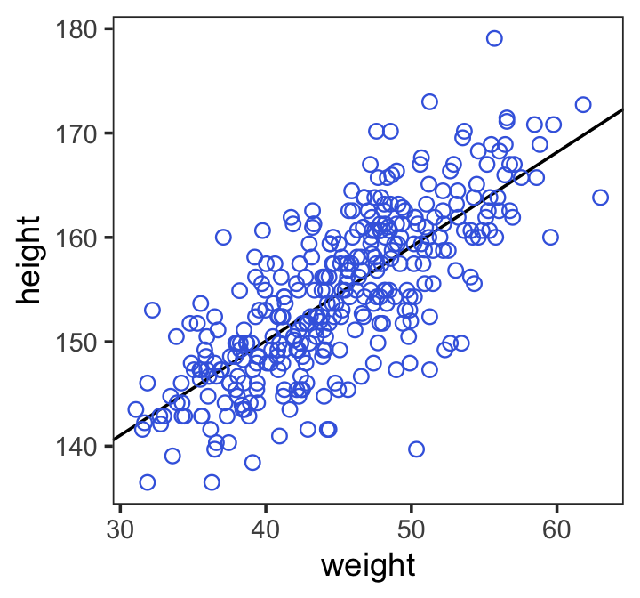

In the brms reference manual, Bürkner described the job of the`fixef()` function as "extract[ing] the population-level ('fixed') effects from a brmsfit object". If you're new to multilevel models, it might not be clear what he meant by "population-level" or "fixed" effects. Don't worry. That'll all become clear starting around [Chapter 12][Multilevel Models]. In the meantime, just think of them as the typical regression parameters, minus $\sigma$.

#### Adding uncertainty around the mean.

Be default, we extract all the posterior iterations with `posterior_samples()`. Because we had 4,000 posterior draws, our output will contain 4,000 rows.


```r
post <- posterior_samples(b4.3)

post %>%
  glimpse()
```

```
## Observations: 4,000
## Variables: 4
## $ b_Intercept <dbl> 114.6966, 114.1741, 113.2510, 114.2457, 115.5680, 115.6146, 113.6150, 113.530…
## $ b_weight    <dbl> 0.8799084, 0.8969781, 0.9233995, 0.8921552, 0.8721226, 0.8737335, 0.9049578, …
## $ sigma       <dbl> 4.982787, 5.315007, 4.621600, 5.610188, 5.597205, 5.287356, 5.234490, 4.80125…
## $ lp__        <dbl> -1083.088, -1082.824, -1085.849, -1085.621, -1085.679, -1083.558, -1082.850, …
```

> Each row is a correlated random sample from the point posterior of all three parameters, using the covariances provided by [`cov(posterior_samples(b4.4)`]. The paired values of [`b_Intercept`] and [`b_weight`] on each row define the line. The average of very many of these lines is the MAP line. (p. 101)

Here are the four models leading up to McElreath's Figure 4.5. To reduce my computation time, I used a `cauchy(0, 1)` prior on $\sigma$. If you are willing to wait for the warmups, switching that out for McElreath's uniform prior should work fine as well. With the exception of that $\sigma$ prior, these models are all variations on `b4.3` from above, which we'll reflect in our naming convention.


```r
n <- 10

b4.3_010 <- 
  brm(data = d2 %>%
        slice(1:n),  # note our tricky use of `n` and `slice()`
      family = gaussian,
      height ~ 1 + weight,
      prior = c(prior(normal(178, 100), class = Intercept),
                prior(normal(0, 10), class = b),
                prior(cauchy(0, 1), class = sigma)),
      iter = 2000, warmup = 1000, chains = 4, cores = 4,
      seed = 4,
      file = "fits/b04.03_010")

n <- 50

b4.3_050 <- 
  brm(data = d2 %>%
        slice(1:n), 
      family = gaussian,
      height ~ 1 + weight,
      prior = c(prior(normal(178, 100), class = Intercept),
                prior(normal(0, 10), class = b),
                prior(cauchy(0, 1), class = sigma)),
      iter = 2000, warmup = 1000, chains = 4, cores = 4,
      seed = 4,
      file = "fits/b04.03_050")

n <- 150

b4.3_150 <- 
  brm(data = d2 %>%
        slice(1:n), 
      family = gaussian,
      height ~ 1 + weight,
      prior = c(prior(normal(178, 100), class = Intercept),
                prior(normal(0, 10), class = b),
                prior(cauchy(0, 1), class = sigma)),
      iter = 2000, warmup = 1000, chains = 4, cores = 4,
      seed = 4,
      file = "fits/b04.03_150")

n <- 352

b4.3_352 <- 
  brm(data = d2 %>%
        slice(1:n), 
      family = gaussian,
      height ~ 1 + weight,
      prior = c(prior(normal(178, 100), class = Intercept),
                prior(normal(0, 10), class = b),
                prior(cauchy(0, 1), class = sigma)),
      iter = 2000, warmup = 1000, chains = 4, cores = 4,
      seed = 4,
      file = "fits/b04.03_352")
```

I'm not going to clutter up the document with all the trace plots and coefficient summaries from these four models. But here's how to get that information.


```r
plot(b4.3_010)
print(b4.3_010)

plot(b4.3_050)
print(b4.3_050)

plot(b4.3_150)
print(b4.3_150)

plot(b4.3_352)
print(b4.3_352)
```

We'll need to put the chains of each model into data frames.


```r
post010 <- posterior_samples(b4.3_010)
post050 <- posterior_samples(b4.3_050)
post150 <- posterior_samples(b4.3_150)
post352 <- posterior_samples(b4.3_352)
```

Here is the code for the four individual plots.


```r
p1 <- 
  ggplot(data =  d2[1:10 , ], 
         aes(x = weight, y = height)) +
  geom_abline(intercept = post010[1:20, 1], 
              slope     = post010[1:20, 2],
              size = 1/3, alpha = .3) +
  geom_point(shape = 1, size = 2, color = "royalblue") +
  coord_cartesian(xlim = range(d2$weight),
                  ylim = range(d2$height)) +
  labs(subtitle = "N = 10")

p2 <-
  ggplot(data =  d2[1:50 , ], 
         aes(x = weight, y = height)) +
  geom_abline(intercept = post050[1:20, 1], 
              slope     = post050[1:20, 2],
              size = 1/3, alpha = .3) +
  geom_point(shape = 1, size = 2, color = "royalblue") +
  coord_cartesian(xlim = range(d2$weight),
                  ylim = range(d2$height)) +
  labs(subtitle = "N = 50")

p3 <-
  ggplot(data =  d2[1:150 , ], 
         aes(x = weight, y = height)) +
  geom_abline(intercept = post150[1:20, 1], 
              slope     = post150[1:20, 2],
              size = 1/3, alpha = .3) +
  geom_point(shape = 1, size = 2, color = "royalblue") +
  coord_cartesian(xlim = range(d2$weight),
                  ylim = range(d2$height)) +
  labs(subtitle = "N = 150")

p4 <- 
  ggplot(data =  d2[1:352 , ], 
         aes(x = weight, y = height)) +
  geom_abline(intercept = post352[1:20, 1], 
              slope     = post352[1:20, 2],
              size = 1/3, alpha = .3) +
  geom_point(shape = 1, size = 2, color = "royalblue") +
  coord_cartesian(xlim = range(d2$weight),
                  ylim = range(d2$height)) +
  labs(subtitle = "N = 352")
```

Note how we used the good old bracket syntax (e.g., ` d2[1:10 , ]`) to index rows from our `d2` data. With tidyverse-style syntax, we could have done `slice(d2, 1:10)` or `d2 %>% slice(1:10)` instead.

Now we can combine the ggplots with patchwork syntax to make the full version of Figure 4.5.


```r
(p1 + p2 + p3 + p4) &
  theme_bw() &
  theme(panel.grid = element_blank())
```


#### Plotting regression intervals and contours.

Remember, if you want to plot McElreath's `mu_at_50` with ggplot2, you'll need to save it as a data frame or a tibble.


```r
mu_at_50 <- 
  post %>% 
  transmute(mu_at_50 = b_Intercept + b_weight * 50)
 
head(mu_at_50)
```

```
##   mu_at_50
## 1 158.6920
## 2 159.0230
## 3 159.4210
## 4 158.8535
## 5 159.1741
## 6 159.3013
```

And here is a version McElreath's Figure 4.6 density plot.


```r
mu_at_50 %>%
  ggplot(aes(x = mu_at_50)) +
  geom_density(size = 0, fill = "royalblue") +
  scale_y_continuous(NULL, breaks = NULL) +
  labs(x = expression(mu["height | weight = 50"])) +
  theme_classic()
```

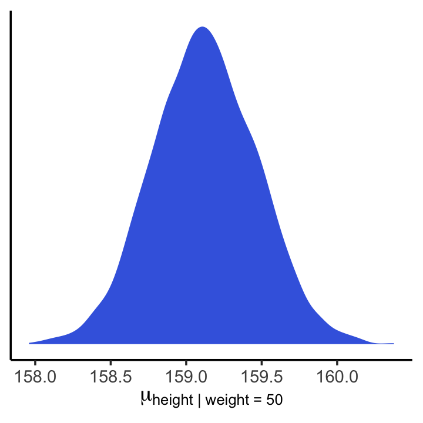

We'll use `mean_hdi()` to get both 89% and 95% HPDIs along with the mean.


```r
mean_hdi(mu_at_50[,1], .width = c(.89, .95))
```

```
##          y     ymin     ymax .width .point .interval
## 1 159.1394 158.6182 159.7260   0.89   mean       hdi
## 2 159.1394 158.4807 159.8337   0.95   mean       hdi
```

If you wanted to express those sweet 95% HPDIs on your density plot, you might use the `tidybayes::geom_halfeyeh()` function. Since `geom_halfeyeh()` also returns a point estimate, we'll just throw in the mode.


```r
mu_at_50 %>%
  ggplot(aes(x = mu_at_50, y = 0)) +
  geom_halfeyeh(point_interval = mode_hdi, .width = .95,
                fill = "royalblue") +
  scale_y_continuous(NULL, breaks = NULL) +
  xlab(expression(mu["height | weight = 50"])) +
  theme_classic()
```

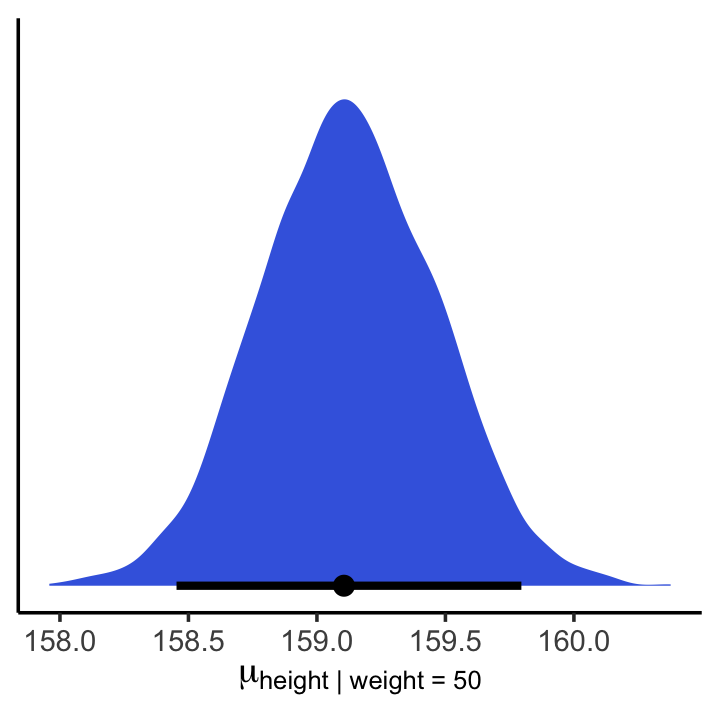

In brms, you would use `fitted()` to do what McElreath accomplished with `link()` in R code 4.53.


```r
mu <- fitted(b4.3, summary = F)

str(mu)
```

```
##  num [1:4000, 1:352] 157 157 157 157 157 ...
```

When you specify `summary = F`, `fitted()` returns a matrix of values with as many rows as there were post-warmup iterations across your HMC chains and as many columns as there were cases in your data. Because we had 4,000 post-warmup iterations and $n$ = 352, `fitted()` returned a matrix of 4,000 rows and 352 vectors. If you omitted the `summary = F` argument, the default is `TRUE` and `fitted()` will return summary information instead. 

Much like rethinking's `link()`, `fitted()` can accommodate custom predictor values with its `newdata` argument.


```r
weight_seq <- tibble(weight = seq(from = 25, to = 70, by = 1))

mu <-
  fitted(b4.3,
         summary = F,
         newdata = weight_seq) %>%
  as_tibble() %>%
  # here we name the columns after the `weight` values from which they were computed
  set_names(25:70) %>% 
  mutate(iter = 1:n())

str(mu)
```

Anticipating ggplot2, we went ahead and converted the output to a tibble. But we might do a little more data processing with the aid of [`tidyr::gather()`](https://tidyr.tidyverse.org/reference/gather.html). With the `gather()` function, we'll convert the data from the wide format to the long format. If you're new to the distinction between wide and long data, you can learn more [here](https://stanford.edu/~ejdemyr/r-tutorials/wide-and-long/) or [here](https://www.theanalysisfactor.com/wide-and-long-data/).


```r
mu <- 
  mu %>%
  gather(weight, height, -iter) %>% 
  # we might reformat `weight` to numerals
  mutate(weight = as.numeric(weight))

head(mu)
```

```
## # A tibble: 6 x 3
##    iter weight height
##   <int>  <dbl>  <dbl>
## 1     1     25   137.
## 2     2     25   137.
## 3     3     25   136.
## 4     4     25   137.
## 5     5     25   137.
## 6     6     25   137.
```

That's enough data processing. Here we reproduce McElreath's Figure 4.7.a.


```r
d2 %>%
  ggplot(aes(x = weight, y = height)) +
  geom_point(data = mu %>% filter(iter < 101),
             alpha = .1)
```

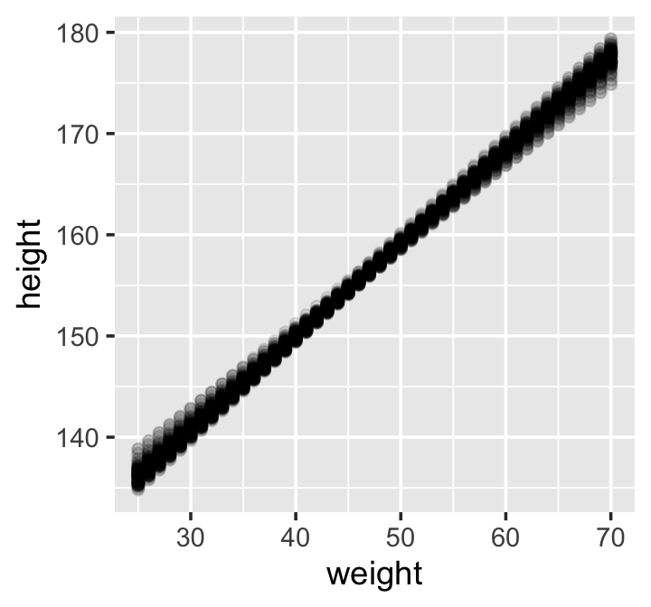

```r
# or prettied up a bit
d2 %>%
  ggplot(aes(x = weight, y = height)) +
  geom_point(data = mu %>% filter(iter < 101), 
             color = "navyblue", alpha = .05) +
  theme(text = element_text(family = "Times"),
        panel.grid = element_blank())
```

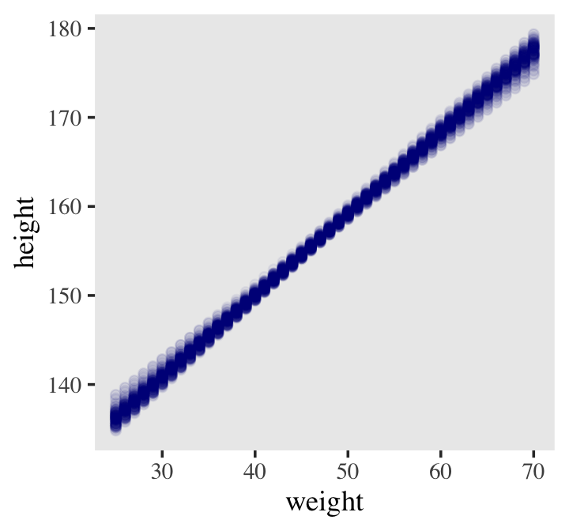

With `fitted()`, it's quite easy to plot a regression line and its intervals. Just omit the `summary = F` argument.


```r
mu_summary <-
  fitted(b4.3, 
         newdata = weight_seq) %>%
  as_tibble() %>%
  # let's tack on the `weight` values from `weight_seq`
  bind_cols(weight_seq)

head(mu_summary)
```

```
## # A tibble: 6 x 5
##   Estimate Est.Error  Q2.5 Q97.5 weight
##      <dbl>     <dbl> <dbl> <dbl>  <dbl>
## 1     136.     0.899  135.  138.     25
## 2     137.     0.858  136.  139.     26
## 3     138.     0.817  137.  140.     27
## 4     139.     0.777  138.  141.     28
## 5     140.     0.737  139.  142.     29
## 6     141.     0.697  140.  142.     30
```

Here it is, our analogue to Figure 4.7.b.


```r
d2 %>%
  ggplot(aes(x = weight, y = height)) +
  geom_smooth(data = mu_summary,
              aes(y = Estimate, ymin = Q2.5, ymax = Q97.5),
              stat = "identity",
              fill = "grey70", color = "black", alpha = 1, size = 1/2) +
  geom_point(color = "navyblue", shape = 1, size = 1.5, alpha = 2/3) +
  coord_cartesian(xlim = range(d2$weight)) +
  theme(text = element_text(family = "Times"),
        panel.grid = element_blank())
```


If you wanted to use intervals other than the default 95% ones, you'd enter a `probs` argument like this: `fitted(b4.3, newdata = weight.seq, probs = c(.25, .75))`. The resulting third and fourth vectors from the `fitted()` object would be named `Q25` and `Q75` instead of the default `Q2.5` and `Q97.5`. The [`Q` prefix](https://github.com/paul-buerkner/brms/issues/425) stands for quantile.

##### Overthinking: How ~~link~~ `fitted()` works.

Similar to `rethinking::link()`, `brms::fitted()` uses the formula from your model to compute the model expectations for a given set of predictor values. I use it a lot in this project. If you follow along, you'll get a good handle on it. For some quick documentation, execute `?fitted.brmsfit`.

#### Prediction intervals.

Even though our full statistical model (omitting priors for the sake of simplicity) is

$$h_i \sim \text{Normal}(\mu_i = \alpha + \beta x_i, \sigma),$$

we've only been plotting the $\mu_i$ part. In order to bring in the variability expressed by $\sigma$, we'll have to switch to the `predict()` function. Much as `brms::fitted()` was our analogue to `rethinking::link()`, `brms::predict()` is our analogue to `rethinking::sim()`. 

We can reuse our `weight_seq` data from before. But in case you forgot, here's that code again.


```r
weight_seq <- tibble(weight = seq(from = 25, to = 70, by = 1))
```

The `predict()` code looks a lot like what we used for `fitted()`.


```r
pred_height <-
  predict(b4.3,
          newdata = weight_seq) %>%
  as_tibble() %>%
  bind_cols(weight_seq)
  
pred_height %>%
  slice(1:6)
```

```
## # A tibble: 6 x 5
##   Estimate Est.Error  Q2.5 Q97.5 weight
##      <dbl>     <dbl> <dbl> <dbl>  <dbl>
## 1     136.      5.12  126.  146.     25
## 2     138.      5.15  128.  147.     26
## 3     138.      5.10  128.  148.     27
## 4     139.      5.08  129.  149.     28
## 5     140.      5.14  130.  150.     29
## 6     141.      5.14  131.  151.     30
```

This time the summary information in our data frame is for, as McElreath put it, "simulated heights, not distributions of plausible average height, $\mu$" (p. 108). Another way of saying that is that these simulations are the joint consequence of $\mu$ AND $\sigma$, unlike the results of `fitted()`, which only reflect $\mu$. Here's our plot for Figure 4.8.


```r
d2 %>%
  ggplot(aes(x = weight)) +
  geom_ribbon(data = pred_height, 
              aes(ymin = Q2.5, ymax = Q97.5),
              fill = "grey83") +
  geom_smooth(data = mu_summary,
              aes(y = Estimate, ymin = Q2.5, ymax = Q97.5),
              stat = "identity",
              fill = "grey70", color = "black", alpha = 1, size = 1/2) +
  geom_point(aes(y = height),
             color = "navyblue", shape = 1, size = 1.5, alpha = 2/3) +
  ylab("height") +
  coord_cartesian(xlim = range(d2$weight),
                  ylim = range(d2$height)) +
  theme(text = element_text(family = "Times"),
        panel.grid = element_blank())
```


## Polynomial regression

Remember `d`?


```r
d %>%
  glimpse()
```

```
## Observations: 544
## Variables: 4
## $ height <dbl> 151.7650, 139.7000, 136.5250, 156.8450, 145.4150, 163.8300, 149.2250, 168.9100, 14…
## $ weight <dbl> 47.82561, 36.48581, 31.86484, 53.04191, 41.27687, 62.99259, 38.24348, 55.47997, 34…
## $ age    <dbl> 63.0, 63.0, 65.0, 41.0, 51.0, 35.0, 32.0, 27.0, 19.0, 54.0, 47.0, 66.0, 73.0, 20.0…
## $ male   <int> 1, 0, 0, 1, 0, 1, 0, 1, 0, 1, 0, 1, 0, 0, 0, 1, 1, 0, 1, 0, 0, 1, 0, 1, 0, 1, 0, 0…
```

The quadratic is probably the most commonly-used polynomial regression model. It follows the form

$$\mu = \alpha + \beta_1 x_i + \beta_2 x_i^2.$$

McElreath warned: "Fitting these models to data is easy. Interpreting them can be hard" (p. 111). Standardizing will help `brm()` fit the model. We might standardize our `weight` variable like so.


```r
d <-
  d %>%
  mutate(weight_s = (weight - mean(weight)) / sd(weight))
```

Here's the quadratic model in brms.


```r
b4.5 <- 
  brm(data = d, 
      family = gaussian,
      height ~ 1 + weight_s + I(weight_s^2),
      prior = c(prior(normal(178, 100), class = Intercept),
                prior(normal(0, 10), class = b),
                prior(cauchy(0, 1), class = sigma)),
      iter = 2000, warmup = 1000, chains = 4, cores = 4,
      seed = 4,
      file = "fits/b04.05")
```


```r
plot(b4.5)
```


```r
print(b4.5)
```

```
##  Family: gaussian 
##   Links: mu = identity; sigma = identity 
## Formula: height ~ 1 + weight_s + I(weight_s^2) 
##    Data: d (Number of observations: 544) 
## Samples: 4 chains, each with iter = 2000; warmup = 1000; thin = 1;
##          total post-warmup samples = 4000
## 
## Population-Level Effects: 
##             Estimate Est.Error l-95% CI u-95% CI Rhat Bulk_ESS Tail_ESS
## Intercept     146.66      0.38   145.91   147.40 1.00     3694     2958
## weight_s       21.40      0.29    20.83    21.97 1.00     3404     3152
## Iweight_sE2    -8.41      0.29    -9.00    -7.87 1.00     3426     3096
## 
## Family Specific Parameters: 
##       Estimate Est.Error l-95% CI u-95% CI Rhat Bulk_ESS Tail_ESS
## sigma     5.77      0.18     5.43     6.12 1.00     4112     2964
## 
## Samples were drawn using sampling(NUTS). For each parameter, Bulk_ESS
## and Tail_ESS are effective sample size measures, and Rhat is the potential
## scale reduction factor on split chains (at convergence, Rhat = 1).
```

Our quadratic plot requires new `fitted()`- and `predict()`-oriented wrangling.


```r
weight_seq <- tibble(weight_s = seq(from = -2.5, to = 2.5, length.out = 30))

f <-
  fitted(b4.5, 
         newdata = weight_seq) %>%
  as_tibble() %>%
  bind_cols(weight_seq)

p <-
  predict(b4.5, 
          newdata = weight_seq) %>%
  as_tibble() %>%
  bind_cols(weight_seq)  
```

Behold the code for our version of Figure 4.9.a. You'll notice how little the code changed from that for Figure 4.8, above.


```r
ggplot(data = d, 
       aes(x = weight_s)) +
  geom_ribbon(data = p, 
              aes(ymin = Q2.5, ymax = Q97.5),
              fill = "grey83") +
  geom_smooth(data = f,
              aes(y = Estimate, ymin = Q2.5, ymax = Q97.5),
              stat = "identity",
              fill = "grey70", color = "black", alpha = 1, size = 1/2) +
  geom_point(aes(y = height),
             color = "navyblue", shape = 1, size = 1.5, alpha = 1/3) +
  coord_cartesian(xlim = range(d$weight_s)) +
  theme(text = element_text(family = "Times"),
        panel.grid = element_blank())
```

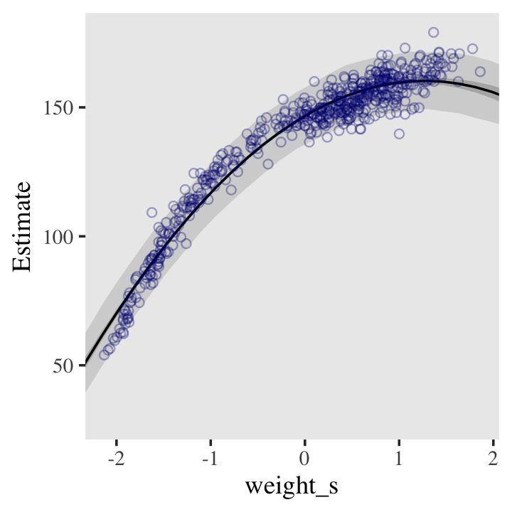

From a formula perspective, the cubic model is a simple extenstion of the quadratic:

$$\mu = \alpha + \beta_1 x_i + \beta_2 x_i^2 + \beta_3 x_i^3.$$

Fit it like so.


```r
b4.6 <- 
  brm(data = d, 
      family = gaussian,
      height ~ 1 + weight_s + I(weight_s^2) + I(weight_s^3),
      prior = c(prior(normal(178, 100), class = Intercept),
                prior(normal(0, 10), class = b),
                prior(cauchy(0, 1), class = sigma)),
      iter = 2000, warmup = 1000, chains = 4, cores = 4,
      seed = 4,
      file = "fits/b04.06")
```

And now we'll fit the good old linear model.


```r
b4.7 <- 
  brm(data = d, family = gaussian,
      height ~ 1 + weight_s,
      prior = c(prior(normal(178, 100), class = Intercept),
                prior(normal(0, 10), class = b),
                prior(cauchy(0, 1), class = sigma)),
      iter = 2000, warmup = 1000, chains = 4, cores = 4,
      seed = 4,
      file = "fits/b04.07")
```

Here's the `fitted()`, `predict()`, and ggplot2 code for Figure 4.9.c, the cubic model.


```r
f <-
  fitted(b4.6, 
         newdata = weight_seq) %>%
  as_tibble() %>%
  bind_cols(weight_seq)

p <-
  predict(b4.6, 
          newdata = weight_seq) %>%
  as_tibble() %>%
  bind_cols(weight_seq) 

ggplot(data = d, 
       aes(x = weight_s)) +
  geom_ribbon(data = p, 
              aes(ymin = Q2.5, ymax = Q97.5),
              fill = "grey83") +
  geom_smooth(data = f,
              aes(y = Estimate, ymin = Q2.5, ymax = Q97.5),
              stat = "identity",
              fill = "grey70", color = "black", alpha = 1, size = 1/4) +
  geom_point(aes(y = height),
             color = "navyblue", shape = 1, size = 1.5, alpha = 1/3) +
  coord_cartesian(xlim = range(d$weight_s)) +
  theme(text = element_text(family = "Times"),
        panel.grid = element_blank())
```

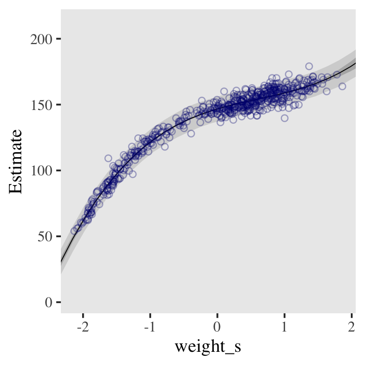

And here's the `fitted()`, `predict()`, and ggplot2 code for Figure 4.9.a, the linear model.


```r
f <-
  fitted(b4.7, 
         newdata = weight_seq) %>%
  as_tibble() %>%
  bind_cols(weight_seq)

p <-
  predict(b4.7, 
          newdata = weight_seq) %>%
  as_tibble() %>%
  bind_cols(weight_seq) 

ggplot(data = d, 
       aes(x = weight_s)) +
  geom_ribbon(data = p, 
              aes(ymin = Q2.5, ymax = Q97.5),
              fill = "grey83") +
  geom_smooth(data = f,
              aes(y = Estimate, ymin = Q2.5, ymax = Q97.5),
              stat = "identity",
              fill = "grey70", color = "black", alpha = 1, size = 1/4) +
  geom_point(aes(y = height),
             color = "navyblue", shape = 1, size = 1.5, alpha = 1/3) +
  coord_cartesian(xlim = range(d$weight_s)) +
  theme(text = element_text(family = "Times"),
        panel.grid = element_blank())
```


##### Overthinking: Converting back to natural scale.

You can apply McElreath's conversion trick within the ggplot2 environment, too. Here it is with the linear model.


```r
at <- c(-2, -1, 0, 1, 2)

ggplot(data = d, 
       aes(x = weight_s)) +
  geom_ribbon(data = p, 
              aes(ymin = Q2.5, ymax = Q97.5),
              fill = "grey83") +
  geom_smooth(data = f,
              aes(y = Estimate, ymin = Q2.5, ymax = Q97.5),
              stat = "identity",
              fill = "grey70", color = "black", alpha = 1, size = 1/4) +
  geom_point(aes(y = height),
             color = "navyblue", shape = 1, size = 1.5, alpha = 1/3) +
  coord_cartesian(xlim = range(d$weight_s)) +
  theme(text = element_text(family = "Times"),
        panel.grid = element_blank()) +
  
  # here it is!
  scale_x_continuous("standardized weight converted back",
                     breaks = at,
                     labels = round(at * sd(d$weight) + mean(d$weight), 1))
```


## Reference {-}

[McElreath, R. (2015). *Statistical rethinking: A Bayesian course with examples in R and Stan.* Chapman & Hall/CRC Press.](https://xcelab.net/rm/statistical-rethinking/)

## Session info {-}


```r
sessionInfo()
```

```
## R version 3.6.2 (2019-12-12)
## Platform: x86_64-apple-darwin15.6.0 (64-bit)
## Running under: macOS High Sierra 10.13.6
## 
## Matrix products: default
## BLAS:   /Library/Frameworks/R.framework/Versions/3.6/Resources/lib/libRblas.0.dylib
## LAPACK: /Library/Frameworks/R.framework/Versions/3.6/Resources/lib/libRlapack.dylib
## 
## locale:
## [1] en_US.UTF-8/en_US.UTF-8/en_US.UTF-8/C/en_US.UTF-8/en_US.UTF-8
## 
## attached base packages:
## [1] parallel  stats     graphics  grDevices utils     datasets  methods   base     
## 
## other attached packages:
##  [1] tidybayes_2.0.1.9000 brms_2.12.0          Rcpp_1.0.3           rstan_2.19.2        
##  [5] StanHeaders_2.19.0   patchwork_1.0.0      forcats_0.4.0        stringr_1.4.0       
##  [9] dplyr_0.8.4          purrr_0.3.3          readr_1.3.1          tidyr_1.0.2         
## [13] tibble_2.1.3         ggplot2_3.2.1        tidyverse_1.3.0     
## 
## loaded via a namespace (and not attached):
##   [1] colorspace_1.4-1          ellipsis_0.3.0            ggridges_0.5.2           
##   [4] rsconnect_0.8.16          markdown_1.1              base64enc_0.1-3          
##   [7] fs_1.3.1                  rstudioapi_0.10           farver_2.0.3             
##  [10] svUnit_0.7-12             DT_0.11                   fansi_0.4.1              
##  [13] mvtnorm_1.0-12            lubridate_1.7.4           xml2_1.2.2               
##  [16] bridgesampling_0.8-1      knitr_1.26                shinythemes_1.1.2        
##  [19] bayesplot_1.7.1           jsonlite_1.6.1            broom_0.5.3              
##  [22] dbplyr_1.4.2              shiny_1.4.0               compiler_3.6.2           
##  [25] httr_1.4.1                backports_1.1.5           assertthat_0.2.1         
##  [28] Matrix_1.2-18             fastmap_1.0.1             lazyeval_0.2.2           
##  [31] cli_2.0.1                 later_1.0.0               htmltools_0.4.0          
##  [34] prettyunits_1.1.1         tools_3.6.2               igraph_1.2.4.2           
##  [37] coda_0.19-3               gtable_0.3.0              glue_1.3.1               
##  [40] reshape2_1.4.3            cellranger_1.1.0          vctrs_0.2.2              
##  [43] nlme_3.1-142              crosstalk_1.0.0           xfun_0.12                
##  [46] ps_1.3.0                  rvest_0.3.5               mime_0.8                 
##  [49] miniUI_0.1.1.1            lifecycle_0.1.0           gtools_3.8.1             
##  [52] MASS_7.3-51.4             zoo_1.8-7                 scales_1.1.0             
##  [55] colourpicker_1.0          hms_0.5.3                 promises_1.1.0           
##  [58] Brobdingnag_1.2-6         inline_0.3.15             shinystan_2.5.0          
##  [61] yaml_2.2.1                gridExtra_2.3             loo_2.2.0                
##  [64] stringi_1.4.5             highr_0.8                 dygraphs_1.1.1.6         
##  [67] pkgbuild_1.0.6            rlang_0.4.4               pkgconfig_2.0.3          
##  [70] matrixStats_0.55.0        HDInterval_0.2.0          evaluate_0.14            
##  [73] lattice_0.20-38           rstantools_2.0.0          htmlwidgets_1.5.1        
##  [76] labeling_0.3              processx_3.4.1            tidyselect_1.0.0         
##  [79] plyr_1.8.5                magrittr_1.5              R6_2.4.1                 
##  [82] generics_0.0.2            DBI_1.1.0                 pillar_1.4.3             
##  [85] haven_2.2.0               withr_2.1.2               xts_0.12-0               
##  [88] abind_1.4-5               modelr_0.1.5              crayon_1.3.4             
##  [91] arrayhelpers_1.0-20160527 utf8_1.1.4                rmarkdown_2.0            
##  [94] grid_3.6.2                readxl_1.3.1              callr_3.4.1              
##  [97] threejs_0.3.3             reprex_0.3.0              digest_0.6.23            
## [100] xtable_1.8-4              httpuv_1.5.2              stats4_3.6.2             
## [103] munsell_0.5.0             viridisLite_0.3.0         shinyjs_1.1
```


