# Multivariate Linear Models

McElreath's listed reasons for multivariable regression include

* statistical control for confounds,
* multiple causation, and
* interactions.

We'll approach the first two in this chapter. Interactions are reserved for [Chapter 7][Interactions].

#### Rethinking: Causal inference.

"Despite its central importance, there is no unified approach to causal inference yet in the sciences or in statistics" [@mcelreathStatisticalRethinkingBayesian2015, p. 120]. McElreath didn't cover this much in this edition of the text. However, he peppered causal inference throughout his second edition [@mcelreathStatisticalRethinkingBayesian2020]. To dip into the topic, you might check out the recent blog post by Finn Lattimore and David Rohde, [*Causal inference with Bayes rule*](https://gradientinstitute.org/blog/6/), or McElreath's three-part blog series, starting [here](https://elevanth.org/blog/2021/06/15/regression-fire-and-dangerous-things-1-3/).

## Spurious associations

Load the [Waffle House](https://www.snopes.com/fact-check/fema-waffle-house-index/) data.


```r
library(rethinking)
data(WaffleDivorce)
d <- WaffleDivorce
```

Unload rethinking and load brms and, while we're at it, the tidyverse.


```r
rm(WaffleDivorce)
detach(package:rethinking, unload = T)
library(tidyverse)
library(brms)
```

I'm not going to show the output, but you might go ahead and investigate the data with the typical functions. E.g.,


```r
head(d)
glimpse(d)
```

Now we have our data, we can reproduce Figure 5.1. One convenient way to get the handful of sate labels into the plot was with the `geom_text_repel()` function from the [ggrepel package](https://CRAN.R-project.org/package=ggrepel) [@R-ggrepel]. But first, we spent the last few chapters warming up with ggplot2. Going forward, each chapter will have its own plot theme. In this chapter, we'll characterize the plots with `theme_bw() + theme(panel.grid = element_rect())` and coloring based off of `"firebrick"`.


```r
# install.packages("ggrepel", dependencies = T)
library(ggrepel)

d %>%
  ggplot(aes(x = WaffleHouses/Population, y = Divorce)) +
  stat_smooth(method = "lm", fullrange = T, linewidth = 1/2,
              color = "firebrick4", fill = "firebrick", alpha = 1/5) +
  geom_point(size = 1.5, color = "firebrick4", alpha = 1/2) +
  geom_text_repel(data = d %>% filter(Loc %in% c("ME", "OK", "AR", "AL", "GA", "SC", "NJ")),  
                  aes(label = Loc), 
                  size = 3, seed = 1042) +  # this makes it reproducible
  scale_x_continuous("Waffle Houses per million", limits = c(0, 55)) +
  ylab("Divorce rate") +
  coord_cartesian(xlim = c(0, 50), ylim = c(5, 15)) +
  theme_bw() +
  theme(panel.grid = element_blank())  
```


Since these are geographically-based data, we might plot our three major variables in a map format. The [tigris package](https://github.com/walkerke/tigris) [@R-tigris] provides latitude and longitude data for the 50 states. We'll extract the geographic coordinates with the `tigris::states()` function and then shift and rescale the coordinates for Alaska and Hawaii with the `tigris::shift_geometry()` function. As part of the workflow, we'll combine the geographic coordinates with the `d` data set with help from the `right_join()` function. 


```r
library(tigris)

d_states <- 
  d %>% 
  # standardize these three variables to put them all on the same scale
  mutate(Divorce_z           = (Divorce - mean(Divorce))                     / sd(Divorce),
         MedianAgeMarriage_z = (MedianAgeMarriage - mean(MedianAgeMarriage)) / sd(MedianAgeMarriage),
         Marriage_z          = (Marriage - mean(Marriage))                   / sd(Marriage)) %>% 
  # add in the geographic coordinates
  right_join(states(class = "sf", cb = TRUE) %>% 
               # shift and rescale the coordinates for Alaska, Puerto Rico, and Hawaii
               shift_geometry() %>%
               # drop Puerto Rico
               filter(NAME != "Puerto Rico"), 
             by = c("Location" = "NAME")) %>%
  # convert to the long format for faceting
  pivot_longer(ends_with("_z")) 
```

Now we plot the thing with the handy `ggplot2::geom_sf()` function.


```r
d_states %>% 
  ggplot() +
  geom_sf(aes(fill = value, geometry = geometry),
          size = 0) +
  scale_fill_gradient(low = "#f8eaea", high = "firebrick4") +
  coord_sf(xlim = c(-29e5, 21e5),
           ylim = c(-2e6, 2e6)) +
  theme_void() +
  theme(legend.position = "none",
        strip.text = element_text(margin = margin(0, 0, 0.5, 0))) +
  facet_wrap(~name) 
```

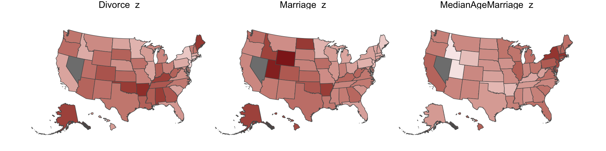

One of the advantages of this visualization method is it just became clear that Nevada is missing from the `WaffleDivorce` data. Execute `d %>% distinct(Location)` to see for yourself and click [here](https://github.com/rmcelreath/rethinking/issues/62) to find out why it's missing. Those missing data should motivate the skills we'll cover in [Chapter 14][Missing Data and Other Opportunities]. But let's get back on track.

Here we'll officially standardize the predictor, `MedianAgeMarriage`.


```r
d <-
  d %>%
  mutate(MedianAgeMarriage_s = (MedianAgeMarriage - mean(MedianAgeMarriage)) /
           sd(MedianAgeMarriage))
```

Now we're ready to fit the first univariable model.


```r
b5.1 <- 
  brm(data = d, 
      family = gaussian,
      Divorce ~ 1 + MedianAgeMarriage_s,
      prior = c(prior(normal(10, 10), class = Intercept),
                prior(normal(0, 1), class = b),
                prior(uniform(0, 10), class = sigma, ub = 10)),
      iter = 2000, warmup = 500, chains = 4, cores = 4,
      seed = 5,
      file = "fits/b05.01")
```

Check the summary.


```r
print(b5.1)
```

```
##  Family: gaussian 
##   Links: mu = identity; sigma = identity 
## Formula: Divorce ~ 1 + MedianAgeMarriage_s 
##    Data: d (Number of observations: 50) 
##   Draws: 4 chains, each with iter = 2000; warmup = 500; thin = 1;
##          total post-warmup draws = 6000
## 
## Population-Level Effects: 
##                     Estimate Est.Error l-95% CI u-95% CI Rhat Bulk_ESS Tail_ESS
## Intercept               9.69      0.22     9.27    10.12 1.00     5417     3744
## MedianAgeMarriage_s    -1.04      0.21    -1.45    -0.62 1.00     5381     3979
## 
## Family Specific Parameters: 
##       Estimate Est.Error l-95% CI u-95% CI Rhat Bulk_ESS Tail_ESS
## sigma     1.52      0.16     1.24     1.86 1.00     4825     4159
## 
## Draws were sampled using sampling(NUTS). For each parameter, Bulk_ESS
## and Tail_ESS are effective sample size measures, and Rhat is the potential
## scale reduction factor on split chains (at convergence, Rhat = 1).
```

We'll employ `fitted()` to make Figure 5.2.b. In preparation for `fitted()` we'll make a new tibble, `nd`, composed of a handful of densely-packed values for our predictor, `MedianAgeMarriage_s`. With the `newdata` argument, we'll use those values to return model-implied expected values for `Divorce`.


```r
# define the range of `MedianAgeMarriage_s` values we'd like to feed into `fitted()`
nd <- tibble(MedianAgeMarriage_s = seq(from = -3, to = 3.5, length.out = 30))

# now use `fitted()` to get the model-implied trajectories
f <- 
  fitted(b5.1, newdata = nd) %>%
  as_tibble() %>%
  # tack the `nd` data onto the `fitted()` results
  bind_cols(nd)

# plot
ggplot(data = f, 
       aes(x = MedianAgeMarriage_s, y = Estimate)) +
  geom_smooth(aes(ymin = Q2.5, ymax = Q97.5),
              stat = "identity",
              fill = "firebrick", color = "firebrick4", alpha = 1/5, linewidth = 1/4) +
  geom_point(data = d, 
             aes(y = Divorce), 
             size = 2, color = "firebrick4") +
  ylab("Divorce") +
  coord_cartesian(xlim = range(d$MedianAgeMarriage_s), 
                  ylim = range(d$Divorce)) +
  theme_bw() +
  theme(panel.grid = element_blank())                   
```

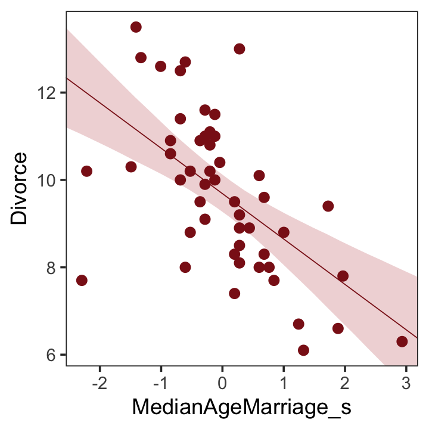

Before fitting the next model, we'll standardize `Marriage`.


```r
d <-
  d %>%
  mutate(Marriage_s = (Marriage - mean(Marriage)) / sd(Marriage))
```

We're ready to fit our second univariable model, this time with `Marriage_s` as the predictor.


```r
b5.2 <- 
  brm(data = d, 
      family = gaussian,
      Divorce ~ 1 + Marriage_s,
      prior = c(prior(normal(10, 10), class = Intercept),
                prior(normal(0, 1), class = b),
                prior(uniform(0, 10), class = sigma, ub = 10)),
      iter = 2000, warmup = 500, chains = 4, cores = 4,
      seed = 5,
      file = "fits/b05.02")
```


```r
print(b5.2)
```

```
##  Family: gaussian 
##   Links: mu = identity; sigma = identity 
## Formula: Divorce ~ 1 + Marriage_s 
##    Data: d (Number of observations: 50) 
##   Draws: 4 chains, each with iter = 2000; warmup = 500; thin = 1;
##          total post-warmup draws = 6000
## 
## Population-Level Effects: 
##            Estimate Est.Error l-95% CI u-95% CI Rhat Bulk_ESS Tail_ESS
## Intercept      9.69      0.25     9.21    10.18 1.00     5679     3864
## Marriage_s     0.64      0.25     0.15     1.13 1.00     4830     4086
## 
## Family Specific Parameters: 
##       Estimate Est.Error l-95% CI u-95% CI Rhat Bulk_ESS Tail_ESS
## sigma     1.75      0.18     1.43     2.15 1.00     4891     3653
## 
## Draws were sampled using sampling(NUTS). For each parameter, Bulk_ESS
## and Tail_ESS are effective sample size measures, and Rhat is the potential
## scale reduction factor on split chains (at convergence, Rhat = 1).
```

Now we'll wangle and plot our version of Figure 5.2.a.


```r
nd <- tibble(Marriage_s = seq(from = -2.5, to = 3.5, length.out = 30))

f <- 
  fitted(b5.2, newdata = nd) %>%
  as_tibble() %>%
  bind_cols(nd)

ggplot(data = f, 
       aes(x = Marriage_s, y = Estimate)) +
  geom_smooth(aes(ymin = Q2.5, ymax = Q97.5),
              stat = "identity",
              fill = "firebrick", color = "firebrick4", alpha = 1/5, linewidth = 1/4) +
  geom_point(data = d, 
             aes(y = Divorce), 
             size = 2, color = "firebrick4") +
  ylab("Divorce") +
  coord_cartesian(xlim = range(d$Marriage_s), 
                  ylim = range(d$Divorce)) +
  theme_bw() +
  theme(panel.grid = element_blank())                   
```

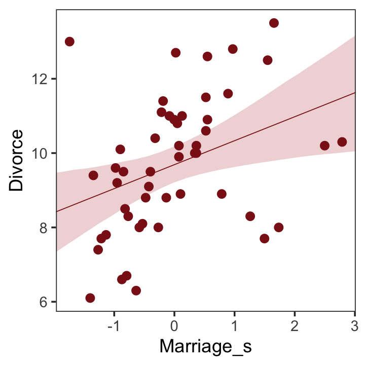

> But merely comparing parameter means between different bivariate regressions is no way to decide which predictor is better Both of these predictors could provide independent value, or they could be redundant, or one could eliminate the value of the other. So we'll build a multivariate model with the goal of measuring the partial value of each predictor. The question we want answered is:
>
>> *What is the predictive value of a variable, once I already know all of the other predictor variables?* (p. 123, *emphasis* in the original)

### Multivariate notation.

Now we'll get both predictors in there with our very first multivariable model. We can write the statistical model as

\begin{align*}
\text{Divorce}_i & \sim \operatorname{Normal}(\mu_i, \sigma) \\
\mu_i   & = \alpha + \beta_1 \text{Marriage_s}_i + \beta_2 \text{MedianAgeMarriage_s}_i \\
\alpha  & \sim \operatorname{Normal}(10, 10) \\
\beta_1 & \sim \operatorname{Normal}(0, 1) \\
\beta_2 & \sim \operatorname{Normal}(0, 1) \\
\sigma  & \sim \operatorname{Uniform}(0, 10).
\end{align*}

> It might help to read the $+$ symbols as "or" and then say: *A State’s divorce rate can be a function of its marriage rate **or** its median age at marriage*. The "or" indicates independent associations, which may be purely statistical or rather causal. (p. 124, *emphasis* in the original)

### Fitting the model.

Much like we used the `+` operator to add single predictors to the intercept, we just use more `+` operators in the `formula` argument to add more predictors. Also notice we're using the same prior `prior(normal(0, 1), class = b)` for both predictors. Within the brms framework, they are both of `class = b`. But if we wanted their priors to differ, we'd make two `prior()` statements and differentiate them with the `coef` argument. You'll see examples of that later on.


```r
b5.3 <- 
  brm(data = d, 
      family = gaussian,
      Divorce ~ 1 + Marriage_s + MedianAgeMarriage_s,
      prior = c(prior(normal(10, 10), class = Intercept),
                prior(normal(0, 1), class = b),
                prior(uniform(0, 10), class = sigma, ub = 10)),
      iter = 2000, warmup = 500, chains = 4, cores = 4,
      seed = 5,
      file = "fits/b05.03")
```

Our multivariable summary will have multiple rows below the 'Intercept' row.


```r
print(b5.3)
```

```
##  Family: gaussian 
##   Links: mu = identity; sigma = identity 
## Formula: Divorce ~ 1 + Marriage_s + MedianAgeMarriage_s 
##    Data: d (Number of observations: 50) 
##   Draws: 4 chains, each with iter = 2000; warmup = 500; thin = 1;
##          total post-warmup draws = 6000
## 
## Population-Level Effects: 
##                     Estimate Est.Error l-95% CI u-95% CI Rhat Bulk_ESS Tail_ESS
## Intercept               9.69      0.22     9.25    10.11 1.00     5642     4098
## Marriage_s             -0.12      0.30    -0.69     0.48 1.00     3984     4141
## MedianAgeMarriage_s    -1.12      0.30    -1.69    -0.52 1.00     4126     3922
## 
## Family Specific Parameters: 
##       Estimate Est.Error l-95% CI u-95% CI Rhat Bulk_ESS Tail_ESS
## sigma     1.52      0.16     1.25     1.88 1.00     4859     4061
## 
## Draws were sampled using sampling(NUTS). For each parameter, Bulk_ESS
## and Tail_ESS are effective sample size measures, and Rhat is the potential
## scale reduction factor on split chains (at convergence, Rhat = 1).
```

The `mcmc_plot()` function is an easy way to get a default coefficient plot. You just put the brmsfit object into the function.


```r
mcmc_plot(b5.3)
```

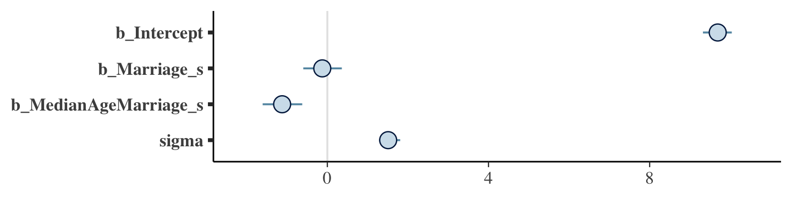

There are numerous ways to make a coefficient plot. Another is with the `mcmc_intervals()` function from the [bayesplot package](https://cran.r-project.org/package=bayesplot). A nice feature of the bayesplot package is its convenient way to alter the color scheme with the `color_scheme_set()` function. Here, for example, we'll make the theme `red`. But note how the `mcmc_intervals()` function requires you to work with the `posterior_samples()` instead of the brmsfit object. 


```r
# install.packages("bayesplot", dependencies = T)
library(bayesplot)

post <- as_draws_df(b5.3)

color_scheme_set("red")
mcmc_intervals(post %>% select(b_Intercept:sigma), 
               prob = .5,
               point_est = "median") +
  ggtitle("My fancy bayesplot-based coefficient plot") +
  theme_bw() +
  theme(axis.text.y = element_text(hjust = 0),
        axis.ticks.y = element_blank(),
        panel.grid = element_blank())
```


Because bayesplot produces a ggplot2 object, the plot was adjustable with familiar ggplot2 syntax. For more ideas, check out Gabry's [-@gabryPlottingMCMCDraws2022] vignette, [*Plotting MCMC draws using the bayesplot package*](https://cran.r-project.org/package=bayesplot/vignettes/plotting-mcmc-draws.html).

The `tidybaes::stat_pointinterval()` function offers a third way, this time with a more ground-up ggplot2 workflow.


```r
library(tidybayes)

post %>% 
  select(b_Intercept:sigma) %>% 
  gather() %>% 
  
  ggplot(aes(x = value, y = reorder(key, value))) +  # note how we used `reorder()` to arrange the coefficients
  geom_vline(xintercept = 0, color = "firebrick4", alpha = 1/10) +
  stat_pointinterval(point_interval = mode_hdi, .width = .95, 
                     size = 3/4, color = "firebrick4") +
  labs(title = "My tidybayes-based coefficient plot",
       x = NULL, y = NULL) +
  theme_bw() +
  theme(axis.text.y = element_text(hjust = 0),
        axis.ticks.y = element_blank(),
        panel.grid = element_blank(),
        panel.grid.major.y = element_line(color = alpha("firebrick4", 1/4), linetype = 3))
```


The substantive interpretation of all those coefficient plots is: "*Once we know median age at marriage for a State, there is little or no additive predictive power in also knowing the rate of marriage in that State*" (p. 126, *emphasis* in the original).

### Plotting multivariate posteriors.

McElreath's prose is delightfully deflationary. "There is a huge literature detailing a variety of plotting techniques that all attempt to help one understand multiple linear regression. None of these techniques is suitable for all jobs, and most do not generalize beyond linear regression" (p. 126). Now you're inspired, let's learn three:

* Predictor residual plots,
* Counterfactual plots, and
* Posterior prediction plots.

#### Predictor residual plots.

To get ready to make our residual plots, we'll predict `Marriage_s` with `MedianAgeMarriage_s`.


```r
b5.4 <- 
  brm(data = d,
      family = gaussian,
      Marriage_s ~ 1 + MedianAgeMarriage_s,
      prior = c(prior(normal(0, 10), class = Intercept),
                prior(normal(0, 1), class = b),
                prior(uniform(0, 10), class = sigma, ub = 10)),
      iter = 2000, warmup = 500, chains = 4, cores = 4,
      seed = 5,
      file = "fits/b05.04")
```


```r
print(b5.4)
```

```
##  Family: gaussian 
##   Links: mu = identity; sigma = identity 
## Formula: Marriage_s ~ 1 + MedianAgeMarriage_s 
##    Data: d (Number of observations: 50) 
##   Draws: 4 chains, each with iter = 2000; warmup = 500; thin = 1;
##          total post-warmup draws = 6000
## 
## Population-Level Effects: 
##                     Estimate Est.Error l-95% CI u-95% CI Rhat Bulk_ESS Tail_ESS
## Intercept              -0.00      0.10    -0.20     0.20 1.00     6090     4240
## MedianAgeMarriage_s    -0.71      0.10    -0.92    -0.51 1.00     5059     4170
## 
## Family Specific Parameters: 
##       Estimate Est.Error l-95% CI u-95% CI Rhat Bulk_ESS Tail_ESS
## sigma     0.72      0.07     0.59     0.88 1.00     5097     4049
## 
## Draws were sampled using sampling(NUTS). For each parameter, Bulk_ESS
## and Tail_ESS are effective sample size measures, and Rhat is the potential
## scale reduction factor on split chains (at convergence, Rhat = 1).
```

With `fitted()`, we compute the expected values for each state (with the exception of Nevada). Since the `MedianAgeMarriage_s` values for each state are in the date we used to fit the model, we'll omit the `newdata` argument.


```r
f <- 
  fitted(b5.4) %>%
  as_tibble() %>%
  bind_cols(d)

head(f)
```

```
## # A tibble: 6 × 19
##   Estimate Est.Error     Q2.5  Q97.5 Location  Loc   Popul…¹ Media…² Marri…³ Marri…⁴ Divorce Divor…⁵
##      <dbl>     <dbl>    <dbl>  <dbl> <fct>     <fct>   <dbl>   <dbl>   <dbl>   <dbl>   <dbl>   <dbl>
## 1    0.431     0.117  0.203    0.661 Alabama   AL       4.78    25.3    20.2    1.27    12.7    0.79
## 2    0.489     0.122  0.249    0.727 Alaska    AK       0.71    25.2    26      2.93    12.5    2.05
## 3    0.145     0.102 -0.0544   0.346 Arizona   AZ       6.33    25.8    20.3    0.98    10.8    0.74
## 4    1.00      0.176  0.663    1.34  Arkansas  AR       2.92    24.3    26.4    1.7     13.5    1.22
## 5   -0.429     0.121 -0.667   -0.193 Californ… CA      37.2     26.8    19.1    0.39     8      0.24
## 6    0.202     0.104  0.00155  0.406 Colorado  CO       5.03    25.7    23.5    1.24    11.6    0.94
## # … with 7 more variables: WaffleHouses <int>, South <int>, Slaves1860 <int>, Population1860 <int>,
## #   PropSlaves1860 <dbl>, MedianAgeMarriage_s <dbl>, Marriage_s <dbl>, and abbreviated variable
## #   names ¹​Population, ²​MedianAgeMarriage, ³​Marriage, ⁴​Marriage.SE, ⁵​Divorce.SE
```

After a little data processing, we can make Figure 5.3.


```r
f %>% 
  ggplot(aes(x = MedianAgeMarriage_s, y = Marriage_s)) +
  geom_point(size = 2, shape = 1, color = "firebrick4") +
  geom_segment(aes(xend = MedianAgeMarriage_s, yend = Estimate), 
               linewidth = 1/4) +
  geom_line(aes(y = Estimate), 
            color = "firebrick4") +
  coord_cartesian(ylim = range(d$Marriage_s)) +
  theme_bw() +
  theme(panel.grid = element_blank())     
```

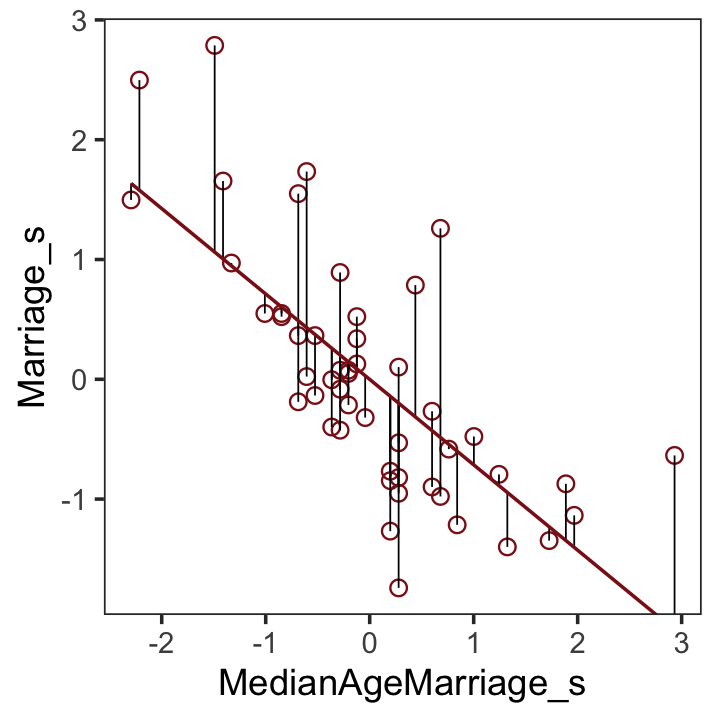

We get the residuals with the well-named `residuals()` function. Much like with `brms::fitted()`, `brms::residuals()` returns a four-vector matrix with the number of rows equal to the number of observations in the original data (by default, anyway). The vectors have the familiar names: `Estimate`, `Est.Error`, `Q2.5`, and `Q97.5`. See the [brms reference manual](https://cran.r-project.org/package=brms/brms.pdf) [@brms2022RM] for details.

With our residuals in hand, we just need a little more data processing to make Figure 5.4.a.


```r
r <- 
  residuals(b5.4) %>%
  # to use this in ggplot2, we need to make it a tibble or data frame
  as_tibble() %>% 
  bind_cols(d)

# for the annotation at the top
text <-
  tibble(Estimate = c(- 0.5, 0.5),
         Divorce  = 14.1,
         label    = c("slower", "faster"))

# plot
r %>% 
  ggplot(aes(x = Estimate, y = Divorce)) +
  stat_smooth(method = "lm", fullrange = T,
              color = "firebrick4", fill = "firebrick4", 
              alpha = 1/5, linewidth = 1/2) +
  geom_vline(xintercept = 0, linetype = 2, color = "grey50") +
  geom_point(size = 2, color = "firebrick4", alpha = 2/3) +
  geom_text(data = text,
            aes(label = label)) +
  scale_x_continuous("Marriage rate residuals", limits = c(-2, 2)) +
  coord_cartesian(xlim = range(r$Estimate),
                  ylim = c(6, 14.1)) +
  theme_bw() +
  theme(panel.grid = element_blank())
```


To get the `MedianAgeMarriage_s` residuals, we have to fit the corresponding model first.


```r
b5.4b <- 
  brm(data = d, 
      family = gaussian,
      MedianAgeMarriage_s ~ 1 + Marriage_s,
      prior = c(prior(normal(0, 10), class = Intercept),
                prior(normal(0, 1), class = b),
                prior(uniform(0, 10), class = sigma, ub = 10)),
      iter = 2000, warmup = 500, chains = 4, cores = 4,
      seed = 5,
      file = "fits/b05.04b")
```

And now we'll get the new batch of residuals, do a little data processing, and make a plot corresponding to Figure 5.4.b.


```r
# redefine the annotation data
text <-
  tibble(Estimate = c(- 0.7, 0.5),
         Divorce  = 14.1,
         label    = c("younger", "older"))

# extract the residuals
residuals(b5.4b) %>%
  as_tibble() %>%
  bind_cols(d) %>% 
  
  # plot
  ggplot(aes(x = Estimate, y = Divorce)) +
  stat_smooth(method = "lm", fullrange = T,
              color = "firebrick4", fill = "firebrick4", 
              alpha = 1/5, linewidth = 1/2) +
  geom_vline(xintercept = 0, linetype = 2, color = "grey50") +
  geom_point(size = 2, color = "firebrick4", alpha = 2/3) +
  geom_text(data = text,
            aes(label = label)) +
  scale_x_continuous("Age of marriage residuals", limits = c(-2, 3)) +
  coord_cartesian(xlim = range(r$Estimate),
                  ylim = c(6, 14.1)) +
  theme_bw() +
  theme(panel.grid = element_blank())  
```

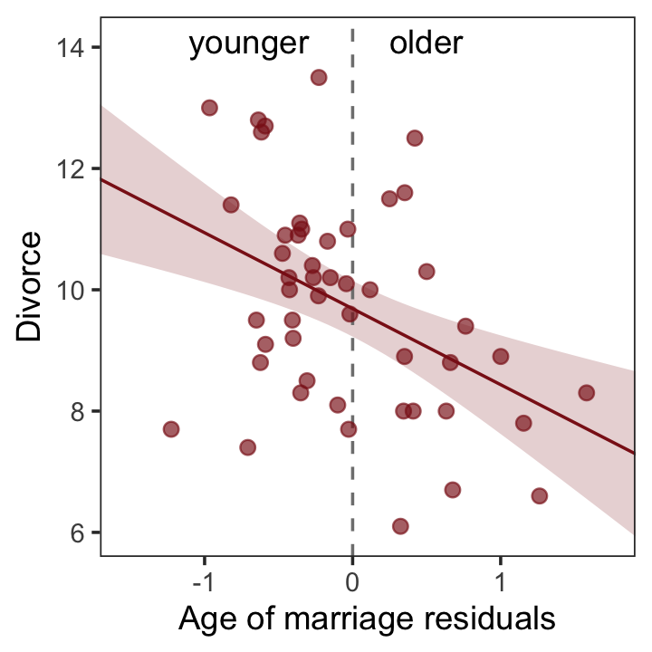

> So what's the point of all this? There’s direct value in seeing the model-based predictions displayed against the outcome, after subtracting out the influence of other predictors. The plots in Figure 5.4 do this. But this procedure also brings home the message that regression models answer with the remaining association of each predictor with the outcome, after already knowing the other predictors. In computing the predictor residual plots, you had to perform those calculations yourself. In the unified [multivariable] model, it all happens automatically. (p. 129)

#### Counterfactual plots.

> A second sort of inferential plot displays the implied predictions of the model. I call these plots *counterfactual*, because they can be produced for any values of the predictor variable you like, even unobserved or impossible combinations like very high median age of marriage and very high marriage rate. There are no States with this combination, but in a counterfactual plot, you can ask the model for a prediction for such a State. (p. 129, *emphasis* in the original)

Making Figure 5.5.a requires a little more data wrangling than before.


```r
# we need new `nd` data
nd <- 
  tibble(Marriage_s          = seq(from = -3, to = 3, length.out = 30),
         MedianAgeMarriage_s = mean(d$MedianAgeMarriage_s))

fitted(b5.3, newdata = nd) %>% 
  as_tibble() %>% 
  # since `fitted()` and `predict()` name their intervals the same way, 
  # we'll need to `rename()` them to keep them straight
  rename(f_ll = Q2.5,
         f_ul = Q97.5) %>% 
  # note how we're just nesting the `predict()` code right inside `bind_cols()`
  bind_cols(
    predict(b5.3, newdata = nd) %>% 
      as_tibble() %>% 
      # since we only need the intervals, we'll use `transmute()` rather than `mutate()`
      transmute(p_ll = Q2.5,
                p_ul = Q97.5),
    # now tack on the `nd` data
    nd) %>% 
  
  # we're finally ready to plot
  ggplot(aes(x = Marriage_s, y = Estimate)) +
  geom_ribbon(aes(ymin = p_ll, ymax = p_ul),
              fill = "firebrick", alpha = 1/5) +
  geom_smooth(aes(ymin = f_ll, ymax = f_ul),
              stat = "identity",
              fill = "firebrick", color = "firebrick4", alpha = 1/5, linewidth = 1/4) +
  labs(subtitle = "Counterfactual plot for which\nMedianAgeMarriage_s = 0",
       y = "Divorce") +
  coord_cartesian(xlim = range(d$Marriage_s),
                  ylim = c(6, 14)) +
  theme_bw() +
  theme(panel.grid = element_blank())     
```

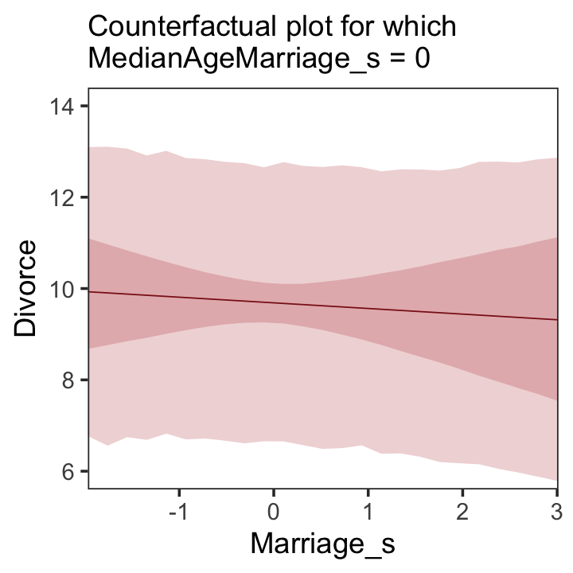

We follow the same process for Figure 5.5.b.


```r
# new data
nd <- 
  tibble(MedianAgeMarriage_s = seq(from = -3, to = 3.5, length.out = 30),
         Marriage_s          = mean(d$Marriage_s))
  
# `fitted()` + `predict()`
fitted(b5.3, newdata = nd) %>% 
  as_tibble() %>% 
  rename(f_ll = Q2.5,
         f_ul = Q97.5) %>% 
  bind_cols(
    predict(b5.3, newdata = nd) %>% 
      as_tibble() %>% 
      transmute(p_ll = Q2.5,
                p_ul = Q97.5),
    nd
  ) %>% 
  
  # plot
  ggplot(aes(x = MedianAgeMarriage_s, y = Estimate)) +
  geom_ribbon(aes(ymin = p_ll, ymax = p_ul),
              fill = "firebrick", alpha = 1/5) +
  geom_smooth(aes(ymin = f_ll, ymax = f_ul),
              stat = "identity",
              fill = "firebrick", color = "firebrick4", alpha = 1/5, linewidth = 1/4) +
  labs(subtitle = "Counterfactual plot for which\nMarriage_s = 0",
       y = "Divorce") +
  coord_cartesian(xlim = range(d$MedianAgeMarriage_s),
                  ylim = c(6, 14)) +
  theme_bw() +
  theme(panel.grid = element_blank())   
```

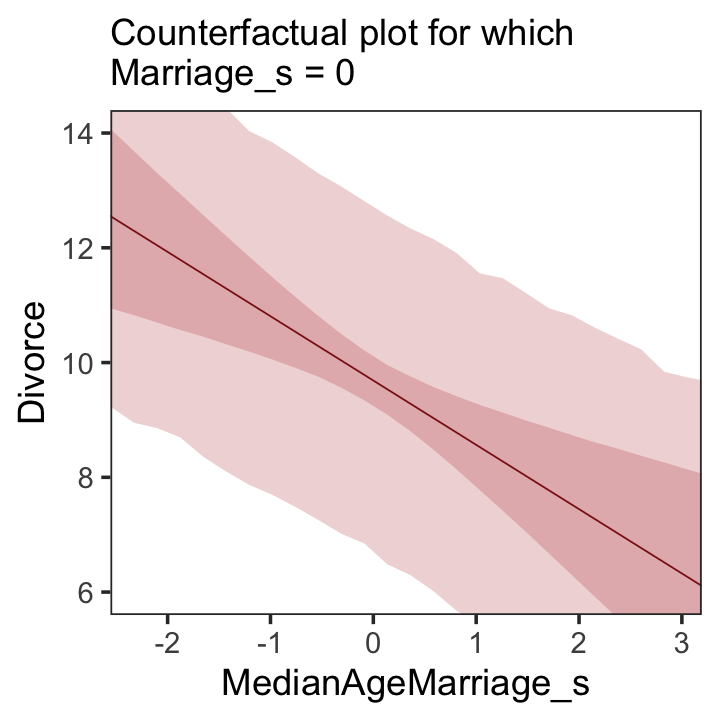

> A tension with such plots, however, lies in their counterfactual nature. In the small world of the model, it is possible to change median age of marriage without also changing the marriage rate. But is this also possible in the large world of reality? Probably not....
>
> ...If our goal is to intervene in the world, there may not be any realistic way to manipulate each predictor without also manipulating the others. This is a serious obstacle to applied science, whether you are an ecologist, an economist, or an epidemiologist [or a psychologist] (p. 131)

#### Posterior prediction plots.

"In addition to understanding the estimates, it's important to check the model fit against the observed data" (p. 131). For more on the topic, check out Gabry and colleagues' [-@gabry2019visualization] [*Visualization in Bayesian workflow*](https://arxiv.org/abs/1709.01449) or Simpson's related blog post, [*Touch me, I want to feel your data*](https://statmodeling.stat.columbia.edu/2017/09/07/touch-want-feel-data/).

In this version of Figure 5.6.a, the thin lines are the 95% intervals and the thicker lines are $\pm$ the posterior $SD$, both of which are returned when you use `fitted()`.


```r
p1 <-
  fitted(b5.3) %>%
  as_tibble() %>%
  bind_cols(d) %>%
  
  ggplot(aes(x = Divorce, y = Estimate)) +
  geom_abline(linetype = 2, color = "grey50", linewidth = 0.5) +
  geom_point(size = 1.5, color = "firebrick4", alpha = 3/4) +
  geom_linerange(aes(ymin = Q2.5, ymax = Q97.5),
                 linewidth = 1/4, color = "firebrick4") +
  geom_linerange(aes(ymin = Estimate - Est.Error, 
                     ymax = Estimate + Est.Error),
                 linewidth = 1/2, color = "firebrick4") +
  # Note our use of the dot placeholder, here: https://magrittr.tidyverse.org/reference/pipe.html
  geom_text(data = . %>% filter(Loc %in% c("ID", "UT")),
            aes(label = Loc), 
            hjust = 0, nudge_x = - 0.65) +
  labs(x = "Observed divorce", 
       y = "Predicted divorce") +
  theme_bw() +
  theme(panel.grid = element_blank())

p1
```


In order to make Figure 5.6.b, we need to clarify the relationships among `fitted()`, `predict()`, and `residuals()`. Here's my attempt in a table.


```r
tibble(`brms function` = c("fitted", "predict", "residual"),
       mean  = c("same as the data", "same as the data", "in a deviance-score metric"),
       scale = c("excludes sigma", "includes sigma", "excludes sigma")) %>% 
  knitr::kable()
```


|brms function |mean                       |scale          |
|:-------------|:--------------------------|:--------------|
|fitted        |same as the data           |excludes sigma |
|predict       |same as the data           |includes sigma |
|residual      |in a deviance-score metric |excludes sigma |

Hopefully that clarified that if we want to incorporate the prediction interval in a deviance metric, we'll need to first use `predict()` and then subtract the intervals from their corresponding `Divorce` values in the data.


```r
p2 <-
  residuals(b5.3) %>% 
  as_tibble() %>% 
  rename(f_ll = Q2.5,
         f_ul = Q97.5) %>% 
  bind_cols(
    predict(b5.3) %>% 
      as_tibble() %>% 
      transmute(p_ll = Q2.5,
                p_ul = Q97.5),
    d
  ) %>% 
  # here we put our `predict()` intervals into a deviance metric
  mutate(p_ll = Divorce - p_ll,
         p_ul = Divorce - p_ul) %>% 
  
  # now plot!
  ggplot(aes(x = reorder(Loc, Estimate), y = Estimate)) +
  geom_hline(yintercept = 0, linewidth = 1/2, 
             color = "firebrick4", alpha = 1/10) +
  geom_pointrange(aes(ymin = f_ll, ymax = f_ul),
                  linewidth = 2/5, shape = 20, color = "firebrick4") + 
  geom_segment(aes(y    = Estimate - Est.Error, 
                   yend = Estimate + Est.Error,
                   x    = Loc, 
                   xend = Loc),
               linewidth = 1, color = "firebrick4") +
  geom_segment(aes(y = p_ll, yend = p_ul,
                   x = Loc,  xend = Loc),
               linewidth = 3, color = "firebrick4", alpha = 1/10) +
  labs(x = NULL, y = NULL) +
  coord_flip(ylim = c(-6, 5)) +
  theme_bw() +
  theme(axis.text.y = element_text(hjust = 0),
        axis.ticks.y = element_blank(),
        panel.grid = element_blank())

p2
```

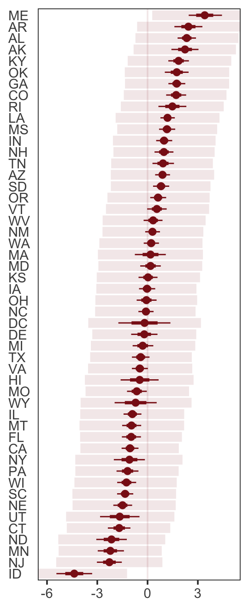

Compared to the last couple plots, Figure 5.6.c is pretty simple.


```r
p3 <-
  residuals(b5.3) %>% 
  as_tibble() %>% 
  bind_cols(d) %>% 
  mutate(wpc = WaffleHouses / Population) %>% 
  
  ggplot(aes(x = wpc, y = Estimate)) +
  geom_point(size = 1.5, color = "firebrick4", alpha = 1/2) +
  stat_smooth(method = "lm", fullrange = T,
              color = "firebrick4", linewidth = 1/2, 
              fill = "firebrick", alpha = 1/5) + 
  geom_text_repel(data = . %>% filter(Loc %in% c("ME", "AR", "MS", "AL", "GA", "SC", "ID")),
                  aes(label = Loc),
                  seed = 5.6) +
  scale_x_continuous("Waffles per capita", limits = c(0, 45)) +
  ylab("Divorce error") +
  coord_cartesian(xlim = range(0, 40)) +
  theme_bw() +
  theme(panel.grid = element_blank())

p3
```


For the sake of good practice, let’s use patchwork syntax to combine those three subplots like they appear in the text.


```r
library(patchwork)

((p1 / p3) | p2) + plot_annotation(tag_levels = "a",
                                   tag_prefix = "(",
                                   tag_suffix = ")")
```


More McElreath inspiration: "No matter how many predictors you've already included in a regression, it's still possible to find spurious correlations with the remaining variation" (p. 134).

##### Rethinking: Stats, huh, yeah what is it good for?

To keep our deflation train going, it's worthwhile repeating this message:

> Often people want statistical modeling to do things that statistical modeling cannot do. For example, we'd like to know whether an effect is real or rather spurious. Unfortunately, modeling merely quantifies uncertainty in the precise way that the model understands the problem. Usually answers to large world questions about truth and causation depend upon information not included in the model. For example, any observed correlation between an outcome and predictor could be eliminated or reversed once another predictor is added to the model. But if we cannot think of another predictor, we might never notice this. Therefore all statistical models are vulnerable to and demand critique, regardless of the precision of their estimates and apparent accuracy of their predictions. (p. 134)

##### Overthinking: Simulating spurious association.

Simulate the spurious predictor data.


```r
n <- 100                             # number of cases

set.seed(5)                          # setting the seed makes the results reproducible
d <- 
  tibble(x_real = rnorm(n),          # x_real as Gaussian with mean 0 and SD 1 (i.e., the defaults)
         x_spur = rnorm(n, x_real),  # x_spur as Gaussian with mean = x_real
         y      = rnorm(n, x_real))  # y as Gaussian with mean = x_real
```

Here are the quick `pairs()` plots. 


```r
pairs(d, col = "firebrick4")
```

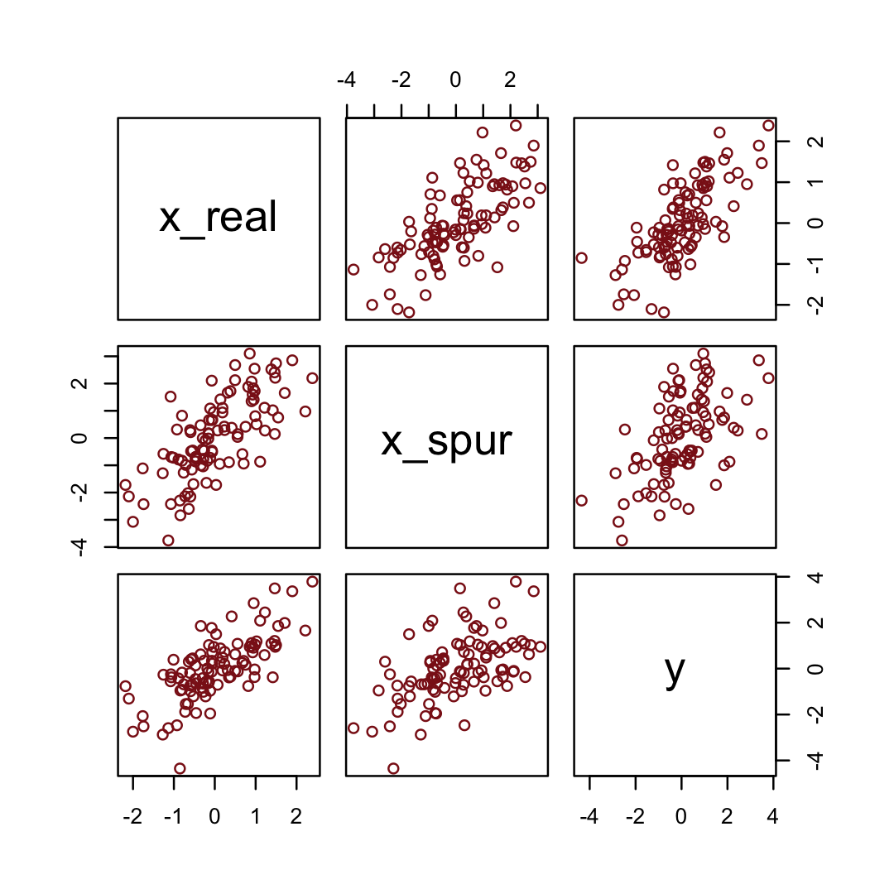

We may as well fit a model.


```r
b5.0_spur <-
  brm(data = d, 
      family = gaussian,
      y ~ 1 + x_real + x_spur,
      prior = c(prior(normal(0, 10), class = Intercept),
                prior(normal(0, 1), class = b),
                prior(uniform(0, 10), class = sigma, ub = 10)),
      iter = 2000, warmup = 500, chains = 4, cores = 4,
      seed = 5,
      file = "fits/b05.00_spur")
```


```r
fixef(b5.0_spur) %>% 
  round(digits = 2)
```

```
##           Estimate Est.Error  Q2.5 Q97.5
## Intercept     0.00      0.10 -0.20  0.18
## x_real        0.98      0.15  0.69  1.27
## x_spur        0.06      0.09 -0.12  0.24
```

## Masked relationship

> A second reason to use more than one predictor variable is to measure the direct influences of multiple factors on an outcome, when none of those influences is apparent from bivariate relationships. This kind of problem tends to arise when there are two predictor variables that are correlated with one another. However, one of these is positively correlated with the outcome and the other is negatively correlated with it. (p. 134)

Let's load the @hindePrimateMilkProximate2011 milk data.


```r
library(rethinking)
data(milk)
d <- milk
```

Unload rethinking and load brms.


```r
rm(milk)
detach(package:rethinking, unload = T)
library(brms)
```

You might inspect the data like this. 


```r
d %>% 
  select(kcal.per.g, mass, neocortex.perc) %>% 
  pairs(col = "firebrick4")
```


By just looking at that mess, do you think you could describe the associations of `mass` and `neocortex.perc` with the criterion, `kcal.per.g`? I couldn't. It's a good thing we have math.

McElreath has us start of with a simple univariable `milk` model.


```r
b5.5 <- 
  brm(data = d, 
      family = gaussian,
      kcal.per.g ~ 1 + neocortex.perc,
      prior = c(prior(normal(0, 100), class = Intercept),
                prior(normal(0, 1), class = b),
                prior(uniform(0, 1), class = sigma, ub = 1)),
      iter = 2000, warmup = 500, chains = 4, cores = 4,
      seed = 5,
      file = "fits/b05.05")
```

Similar to the rethinking example in the text, brms warned that "Rows containing NAs were excluded from the model." This isn't necessarily a problem; the model fit just fine. But we should be ashamed of ourselves and look eagerly forward to [Chapter 14][Missing Data and Other Opportunities] where we'll learn how to do better.

To compliment how McElreath removed cases with missing values on our variables of interest with base R `complete.cases()`, here we'll do so with `tidyr::drop_na()` and a little help with `ends_with()`.


```r
dcc <- 
  d %>%
  drop_na(ends_with("_s"))              
```

But anyway, let's inspect the parameter summary.


```r
print(b5.5, digits = 3)
```

```
##  Family: gaussian 
##   Links: mu = identity; sigma = identity 
## Formula: kcal.per.g ~ 1 + neocortex.perc 
##    Data: d (Number of observations: 17) 
##   Draws: 4 chains, each with iter = 2000; warmup = 500; thin = 1;
##          total post-warmup draws = 6000
## 
## Population-Level Effects: 
##                Estimate Est.Error l-95% CI u-95% CI  Rhat Bulk_ESS Tail_ESS
## Intercept         0.350     0.563   -0.770    1.472 1.000     4964     3944
## neocortex.perc    0.005     0.008   -0.012    0.021 1.000     4962     3964
## 
## Family Specific Parameters: 
##       Estimate Est.Error l-95% CI u-95% CI  Rhat Bulk_ESS Tail_ESS
## sigma    0.193     0.039    0.134    0.286 1.001     3878     3114
## 
## Draws were sampled using sampling(NUTS). For each parameter, Bulk_ESS
## and Tail_ESS are effective sample size measures, and Rhat is the potential
## scale reduction factor on split chains (at convergence, Rhat = 1).
```

Did you notice now we set `digits = 3` within `print()` much the way McElreath set `digits=3` within `precis()`?

To get the brms answer to what McElreath did with `coef()`, we can use the `fixef()` function.


```r
fixef(b5.5)[2] * (76 - 55)
```

```
## [1] 0.09588905
```

Yes, indeed, "that's less than 0.1 kilocalories" (p. 137).

Just for kicks, we'll superimpose 50% intervals atop 95% intervals for the next few plots. Here's Figure 5.7, top left.


```r
nd <- tibble(neocortex.perc = 54:80)

fitted(b5.5, 
       newdata = nd,
       probs = c(.025, .975, .25, .75)) %>%
  as_tibble() %>%
  bind_cols(nd) %>% 
  
  ggplot(aes(x = neocortex.perc, y = Estimate)) +
  geom_ribbon(aes(ymin = Q2.5, ymax = Q97.5),
              fill = "firebrick", alpha = 1/5) +
  geom_smooth(aes(ymin = Q25, ymax = Q75),
              stat = "identity",
              fill = "firebrick4", color = "firebrick4", alpha = 1/5, linewidth = 1/2) +
  geom_point(data = dcc, 
             aes(y = kcal.per.g),
             size = 2, color = "firebrick4") +
  ylab("kcal.per.g") +
  coord_cartesian(xlim = range(dcc$neocortex.perc), 
                  ylim = range(dcc$kcal.per.g)) +
  theme_bw() +
  theme(panel.grid = element_blank())
```


Do note the `probs` argument in the `fitted()` code, above. Let's make the `log_mass` variable.


```r
dcc <-
  dcc %>%
  mutate(log_mass = log(mass))
```

Now we use `log_mass` as the new sole predictor.
      

```r
b5.6 <- 
  brm(data = dcc, 
      family = gaussian,
      kcal.per.g ~ 1 + log_mass,
      prior = c(prior(normal(0, 100), class = Intercept),
                prior(normal(0, 1), class = b),
                prior(uniform(0, 1), class = sigma, ub = 1)),
      iter = 2000, warmup = 500, chains = 4, cores = 4,
      seed = 5,
      file = "fits/b05.06")
```


```r
print(b5.6, digits = 3)
```

```
##  Family: gaussian 
##   Links: mu = identity; sigma = identity 
## Formula: kcal.per.g ~ 1 + log_mass 
##    Data: dcc (Number of observations: 29) 
##   Draws: 4 chains, each with iter = 2000; warmup = 500; thin = 1;
##          total post-warmup draws = 6000
## 
## Population-Level Effects: 
##           Estimate Est.Error l-95% CI u-95% CI  Rhat Bulk_ESS Tail_ESS
## Intercept    0.687     0.040    0.609    0.765 1.002     5236     3931
## log_mass    -0.032     0.018   -0.068    0.002 1.001     5038     4063
## 
## Family Specific Parameters: 
##       Estimate Est.Error l-95% CI u-95% CI  Rhat Bulk_ESS Tail_ESS
## sigma    0.163     0.024    0.125    0.217 1.001     3927     3235
## 
## Draws were sampled using sampling(NUTS). For each parameter, Bulk_ESS
## and Tail_ESS are effective sample size measures, and Rhat is the potential
## scale reduction factor on split chains (at convergence, Rhat = 1).
```

Make Figure 5.7, top right.


```r
nd <- tibble(log_mass = seq(from = -2.5, to = 5, length.out = 30))

fitted(b5.6, 
       newdata = nd,
       probs = c(.025, .975, .25, .75)) %>%
  as_tibble() %>%
  bind_cols(nd) %>% 
  
  ggplot(aes(x = log_mass, y = Estimate)) +
  geom_ribbon(aes(ymin = Q2.5, ymax = Q97.5),
              fill = "firebrick", alpha = 1/5) +
  geom_smooth(aes(ymin = Q25, ymax = Q75),
              stat = "identity",
              fill = "firebrick4", color = "firebrick4", alpha = 1/5, linewidth = 1/2) +
  geom_point(data = dcc, 
             aes(y = kcal.per.g),
             size = 2, color = "firebrick4") +
  ylab("kcal.per.g") +
  coord_cartesian(xlim = range(dcc$log_mass), 
                  ylim = range(dcc$kcal.per.g)) +
  theme_bw() +
  theme(panel.grid = element_blank())
```


Finally, we're ready to fit with both predictors included in the "joint model." Here's the statistical formula:

\begin{align*}
\text{kcal.per.g}_i & \sim \operatorname{Normal}(\mu_i, \sigma) \\
\mu_i   & = \alpha + \beta_1 \text{neocortex.perc}_i + \beta_2 \log (\text{mass}_i) \\
\alpha  & \sim \operatorname{Normal}(0, 100) \\
\beta_1 & \sim \operatorname{Normal}(0, 1) \\
\beta_2 & \sim \operatorname{Normal}(0, 1) \\
\sigma  & \sim \operatorname{Uniform}(0, 1).
\end{align*}

Fit the model.


```r
b5.7 <- 
  brm(data = dcc, 
      family = gaussian,
      kcal.per.g ~ 1 + neocortex.perc + log_mass,
      prior = c(prior(normal(0, 100), class = Intercept),
                prior(normal(0, 1), class = b),
                prior(uniform(0, 1), class = sigma, ub = 1)),
      iter = 2000, warmup = 1000, chains = 4, cores = 4,
      seed = 5,
      file = "fits/b05.07")
```


```r
print(b5.7, digits = 3)
```

```
##  Family: gaussian 
##   Links: mu = identity; sigma = identity 
## Formula: kcal.per.g ~ 1 + neocortex.perc + log_mass 
##    Data: dcc (Number of observations: 17) 
##   Draws: 4 chains, each with iter = 2000; warmup = 1000; thin = 1;
##          total post-warmup draws = 4000
## 
## Population-Level Effects: 
##                Estimate Est.Error l-95% CI u-95% CI  Rhat Bulk_ESS Tail_ESS
## Intercept        -1.099     0.579   -2.214    0.059 1.000     2183     2609
## neocortex.perc    0.028     0.009    0.010    0.046 1.000     2114     2365
## log_mass         -0.097     0.027   -0.152   -0.044 1.001     2000     2065
## 
## Family Specific Parameters: 
##       Estimate Est.Error l-95% CI u-95% CI  Rhat Bulk_ESS Tail_ESS
## sigma    0.140     0.030    0.096    0.211 1.002     2324     2211
## 
## Draws were sampled using sampling(NUTS). For each parameter, Bulk_ESS
## and Tail_ESS are effective sample size measures, and Rhat is the potential
## scale reduction factor on split chains (at convergence, Rhat = 1).
```

Make Figure 5.7, bottom left.


```r
nd <- 
  tibble(neocortex.perc = 54:80 %>% as.double(),
         log_mass       = mean(dcc$log_mass))

p1 <-
  b5.7 %>%
  fitted(newdata = nd, 
         probs = c(.025, .975, .25, .75)) %>%
  as_tibble() %>%
  bind_cols(nd) %>% 

  ggplot(aes(x = neocortex.perc, y = Estimate)) +
  geom_ribbon(aes(ymin = Q2.5, ymax = Q97.5),
              fill = "firebrick", alpha = 1/5) +
  geom_smooth(aes(ymin = Q25, ymax = Q75),
              stat = "identity",
              fill = "firebrick4", color = "firebrick4", alpha = 1/5, linewidth = 1/2) +
  geom_point(data = dcc, 
             aes(y = kcal.per.g),
             size = 2, color = "firebrick4") +
  ylab("kcal.per.g") +
  coord_cartesian(xlim = range(dcc$neocortex.perc), 
                  ylim = range(dcc$kcal.per.g))
```

Now make Figure 5.7, bottom right, and combine.


```r
nd <- 
  tibble(log_mass       = seq(from = -2.5, to = 5, length.out = 30),
         neocortex.perc = mean(dcc$neocortex.perc))

p2 <-
  b5.7 %>%
  fitted(newdata = nd,
         probs = c(.025, .975, .25, .75)) %>%
  as_tibble() %>%
  bind_cols(nd) %>% 

  ggplot(aes(x = log_mass, y = Estimate)) +
  geom_ribbon(aes(ymin = Q2.5, ymax = Q97.5),
              fill = "firebrick", alpha = 1/5) +
  geom_smooth(aes(ymin = Q25, ymax = Q75),
              stat = "identity",
              fill = "firebrick4", color = "firebrick4", alpha = 1/5, linewidth = 1/2) +
  geom_point(data = dcc, 
             aes(y = kcal.per.g),
             size = 2, color = "firebrick4") +
  ylab("kcal.per.g") +
  coord_cartesian(xlim = range(dcc$log_mass), 
                  ylim = range(dcc$kcal.per.g))

(p1 | p2) &
  theme_bw() &
  theme(panel.grid = element_blank())
```


> What [this regression model did was] ask if species that have high neocortex percent *for their body mass* have higher milk energy. Likewise, the model [asked] if species with high body mass *for their neocortex percent* have higher milk energy. Bigger species, like apes, have milk with less energy. But species with more neocortex tend to have richer milk. The fact that these two variables, body size and neocortex, are correlated across species makes it hard to see these relationships, unless we statistically account for both. (pp. 140--141, *emphasis* in the original)

#### Overthinking: Simulating a masking relationship.

Simulate the data.


```r
n   <- 100   # number of cases
rho <- .7    # correlation between x_pos and x_neg

set.seed(5)  # setting the seed makes the results reproducible
d <- 
  tibble(x_pos = rnorm(n),                                # x_pos as a standard Gaussian
         x_neg = rnorm(n, rho * x_pos, sqrt(1 - rho^2)),  # x_neg correlated with x_pos
         y     = rnorm(n, x_pos - x_neg))                 # y equally associated with x_pos and x_neg
```

Here are the quick `pairs()` plots.


```r
pairs(d, col = "firebrick4")
```

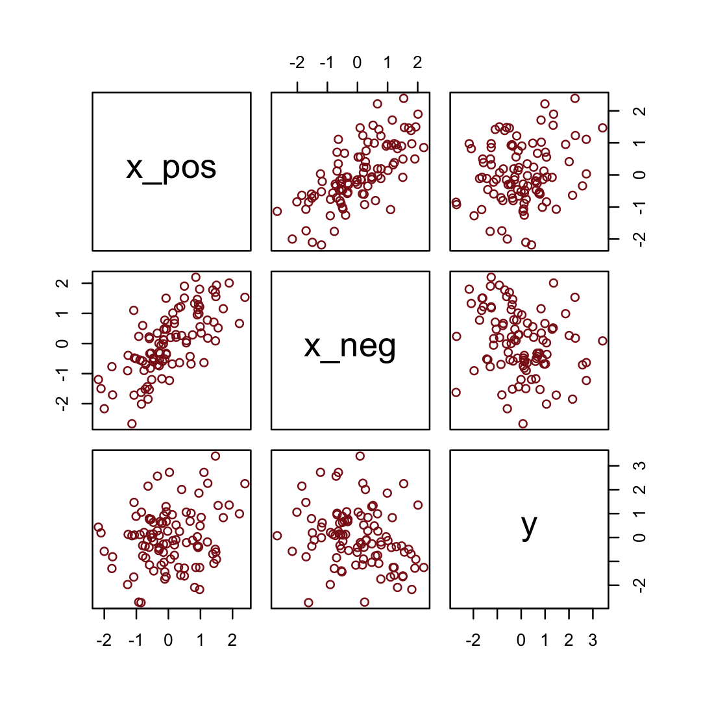

Here we fit the models with a little help from the `update()` function.


```r
b5.0_both <- 
  brm(data = d, family = gaussian,
      y ~ 1 + x_pos + x_neg,
      prior = c(prior(normal(0, 100), class = Intercept),
                prior(normal(0, 1), class = b),
                prior(cauchy(0, 1), class = sigma)),
      seed = 5,
      file = "fits/b05.00_both")

b5.0_pos <-
  update(b5.0_both, 
         formula = y ~ 1 + x_pos,
         seed = 5,
         file = "fits/b05.00_pos")

b5.0_neg <-
  update(b5.0_both, 
         formula = y ~ 1 + x_neg,
         seed = 5,
         file = "fits/b05.00_neg")
```

Compare the coefficients.


```r
fixef(b5.0_pos)  %>% round(digits = 2)
```

```
##           Estimate Est.Error  Q2.5 Q97.5
## Intercept    -0.02      0.12 -0.26  0.21
## x_pos         0.26      0.13  0.02  0.51
```

```r
fixef(b5.0_neg)  %>% round(digits = 2)
```

```
##           Estimate Est.Error  Q2.5 Q97.5
## Intercept     0.01      0.12 -0.23  0.24
## x_neg        -0.29      0.11 -0.51 -0.07
```

```r
fixef(b5.0_both) %>% round(digits = 2)
```

```
##           Estimate Est.Error  Q2.5 Q97.5
## Intercept    -0.01      0.10 -0.20  0.19
## x_pos         0.96      0.15  0.66  1.25
## x_neg        -0.89      0.13 -1.15 -0.63
```

> If you move the value of `rho` closer to zero, this masking phenomenon will diminish. I you make `rho` closer to 1 or -1, it will magnify. But if `rho` gets very close to 1 or -1, then the two predictors contain exactly the same information, and there's no hope for any statistical model to tease out the true underlying association used in the simulation. (p. 141)

## Multicollinearity

> Multicollinearity means very strong correlation between two or more predictor variables. The consequence of it is that the posterior distribution will say that a very large range of parameter values are plausible, from tiny associations to massive ones, even if all of the variables are in reality strongly associated with the outcome. This frustrating phenomenon arises from the details of how statistical control works. So once you understand multicollinearity, you will better understand [multivariable] models in general. (pp. 141--142)

### Multicollinear legs.

Let's simulate some leg data.


```r
n <- 100
set.seed(5)

d <- 
  tibble(height   = rnorm(n, mean = 10, sd = 2),
         leg_prop = runif(n, min = 0.4, max = 0.5)) %>% 
  mutate(leg_left  = leg_prop * height + rnorm(n, mean = 0, sd = 0.02),
         leg_right = leg_prop * height + rnorm(n, mean = 0, sd = 0.02))
```

`leg_left` and `leg_right` are **highly** correlated.


```r
d %>%
  select(leg_left:leg_right) %>%
  cor() %>%
  round(digits = 4)
```

```
##           leg_left leg_right
## leg_left    1.0000    0.9996
## leg_right   0.9996    1.0000
```

Have you ever even seen a $\rho = .9996$ correlation, before? Here it is in a plot.


```r
d %>%
  ggplot(aes(x = leg_left, y = leg_right)) +
  geom_point(alpha = 1/2, color = "firebrick4") +
  theme_bw() +
  theme(panel.grid = element_blank())
```


Here's our attempt to predict `height` with both legs in the model.


```r
b5.8 <- 
  brm(data = d, 
      family = gaussian,
      height ~ 1 + leg_left + leg_right,
      prior = c(prior(normal(10, 100), class = Intercept),
                prior(normal(2, 10), class = b),
                prior(uniform(0, 10), class = sigma, ub = 10)),
      iter = 2000, warmup = 500, chains = 4, cores = 4,
      seed = 5,
      file = "fits/b05.08")
```

Let's inspect the damage.


```r
print(b5.8)
```

```
##  Family: gaussian 
##   Links: mu = identity; sigma = identity 
## Formula: height ~ 1 + leg_left + leg_right 
##    Data: d (Number of observations: 100) 
##   Draws: 4 chains, each with iter = 2000; warmup = 500; thin = 1;
##          total post-warmup draws = 6000
## 
## Population-Level Effects: 
##           Estimate Est.Error l-95% CI u-95% CI Rhat Bulk_ESS Tail_ESS
## Intercept     1.79      0.29     1.23     2.35 1.00     6323     4012
## leg_left      0.69      2.12    -3.33     4.72 1.00     2391     2881
## leg_right     1.15      2.12    -2.89     5.17 1.00     2395     2852
## 
## Family Specific Parameters: 
##       Estimate Est.Error l-95% CI u-95% CI Rhat Bulk_ESS Tail_ESS
## sigma     0.61      0.04     0.53     0.70 1.00     2924     2432
## 
## Draws were sampled using sampling(NUTS). For each parameter, Bulk_ESS
## and Tail_ESS are effective sample size measures, and Rhat is the potential
## scale reduction factor on split chains (at convergence, Rhat = 1).
```

That 'Est.Error' column isn't looking too good. But it's easy to miss that, which is why McElreath suggested "a graphical view of the [output] is more useful because it displays the posterior [estimates] and [intervals] in a way that allows us with a glance to see that something has gone wrong here" (p. 143).

Here's our coefficient plot using `brms::mcmc_plot()`.


```r
mcmc_plot(b5.8, 
          type = "intervals", 
          prob = .5, 
          prob_outer = .95,
          point_est = "median") +
  labs(title = "The coefficient plot for the two-leg model",
       subtitle = "Holy smokes; look at the widths of those betas!") +
  theme_bw() +
  theme(text = element_text(size = 14),
        axis.text.y = element_text(hjust = 0),
        axis.ticks.y = element_blank(),
        panel.grid = element_blank())
```


This is perhaps the simplest way to plot the bivariate posterior of our two predictor coefficients, Figure 6.2.a.


```r
pairs(b5.8, pars = parnames(b5.8)[2:3])
```

```
## Warning: 'parnames' is deprecated. Please use 'variables' instead.
```

```
## Warning: Argument 'pars' is deprecated. Please use 'variable' instead.
```


If you'd like a nicer and more focused attempt, you might have to revert to the `as_draws_df()` function and a little ggplot2 code.


```r
post <- as_draws_df(b5.8)
  
post %>% 
  ggplot(aes(x = b_leg_left, y = b_leg_right)) +
  geom_point(color = "firebrick", alpha = 1/10, size = 1/3) +
  theme_bw() +
  theme(panel.grid = element_blank())
```

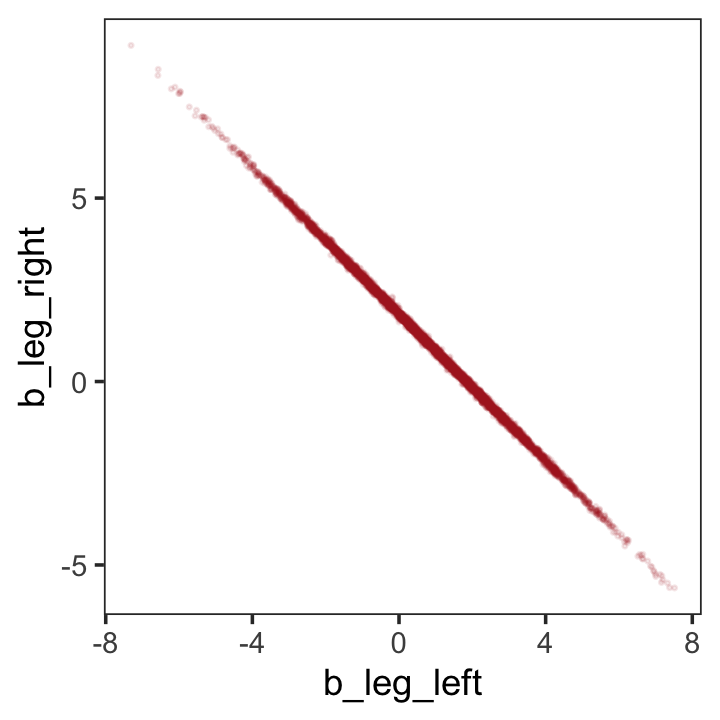

While we're at it, you can make a similar plot with the [`mcmc_scatter()` function](https://cran.r-project.org/package=bayesplot/vignettes/plotting-mcmc-draws.html).


```r
post %>% 
  mcmc_scatter(pars = c("b_leg_left", "b_leg_right"),
               size = 1/3, 
               alpha = 1/10) +
  theme_bw() +
  theme(panel.grid = element_blank())
```


But wow, those coefficients look about as highly correlated as the predictors, just with the reversed sign.


```r
post %>% 
  select(b_leg_left:b_leg_right) %>% 
  cor()
```

```
##             b_leg_left b_leg_right
## b_leg_left   1.0000000  -0.9995598
## b_leg_right -0.9995598   1.0000000
```

On page 165, McElreath clarified that "from the computer's perspective, this model is simply:"

\begin{align*}
y_i   & \sim \operatorname{Normal}(\mu_i, \sigma) \\
\mu_i & = \alpha + (\beta_1 + \beta_2) x_i.
\end{align*}

Accordingly, here's the posterior of the sum of the two regression coefficients, Figure 6.2.b. We'll use `tidybayes::stat_halfeye()` to both plot the density and mark off the posterior median and percentile-based 95% probability intervals at its base.


```r
library(tidybayes)

post %>% 
  ggplot(aes(x = b_leg_left + b_leg_right, y = 0)) +
  stat_halfeye(point_interval = median_qi, .width = .95,
               fill = "firebrick") +
  scale_y_continuous(NULL, breaks = NULL) +
  labs(title = "Sum the multicollinear coefficients",
       subtitle = "Marked by the median and 95% PIs") +
  theme_bw() +
  theme(panel.grid = element_blank())
```


Now we fit the model after ditching one of the leg lengths.


```r
b5.9 <- 
  brm(data = d, 
      family = gaussian,
      height ~ 1 + leg_left,
      prior = c(prior(normal(10, 100), class = Intercept),
                prior(normal(2, 10), class = b),
                prior(uniform(0, 10), class = sigma, ub = 10)),
      iter = 2000, warmup = 500, chains = 4, cores = 4,
      seed = 5,
      file = "fits/b05.09")
```


```r
print(b5.9)
```

```
##  Family: gaussian 
##   Links: mu = identity; sigma = identity 
## Formula: height ~ 1 + leg_left 
##    Data: d (Number of observations: 100) 
##   Draws: 4 chains, each with iter = 2000; warmup = 500; thin = 1;
##          total post-warmup draws = 6000
## 
## Population-Level Effects: 
##           Estimate Est.Error l-95% CI u-95% CI Rhat Bulk_ESS Tail_ESS
## Intercept     1.80      0.28     1.25     2.34 1.00     5401     4197
## leg_left      1.84      0.06     1.72     1.96 1.00     5517     4169
## 
## Family Specific Parameters: 
##       Estimate Est.Error l-95% CI u-95% CI Rhat Bulk_ESS Tail_ESS
## sigma     0.60      0.04     0.53     0.70 1.00     5690     4416
## 
## Draws were sampled using sampling(NUTS). For each parameter, Bulk_ESS
## and Tail_ESS are effective sample size measures, and Rhat is the potential
## scale reduction factor on split chains (at convergence, Rhat = 1).
```

That posterior $\textit{SD}$ looks much better. Compare this density to the one in Figure 6.1.b.


```r
as_draws_df(b5.9) %>% 
  
  ggplot(aes(x = b_leg_left, y = 0)) +
  stat_halfeye(point_interval = median_qi, .width = .95,
               fill = "firebrick") +
  scale_y_continuous(NULL, breaks = NULL) +
  labs(title = "Just one coefficient needed",
       subtitle = "Marked by the median and 95% PIs",
       x = "only b_leg_left, this time") +
  theme_bw() +
  theme(panel.grid = element_blank())
```


We might also use `tidybayes::stat_pointinterval()` to compare the posterior of `b_leg_left` from `b5.9` to the joint posterior `b_leg_left + b_leg_right` from `b5.8`. For kicks, we'll depict the posteriors with `tidybayes::stat_gradientinterval()` and use three levels of posterior intervals.


```r
bind_cols(post %>% transmute(`b_leg_left + b_leg_right` = b_leg_left + b_leg_right),
          as_draws_df(b5.9) %>% transmute(`only b_leg_left` = b_leg_left)) %>% 
  gather() %>% 

  ggplot(aes(x = value, y = key)) +
  stat_gradientinterval(.width = c(.5, .8, .95),
                        fill = "firebrick") +
  labs(x = NULL, y = NULL) +
  theme_bw() +
  theme(axis.text.y = element_text(hjust = 0),
        axis.ticks.y = element_blank(),
        panel.grid = element_blank())
```

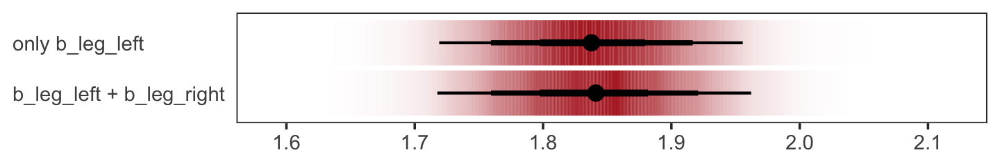

The results are within simulation variance of one another.

> *When two predictor variables are very strongly correlated, including both in a model may lead to confusion.* The posterior distribution isn't wrong, in such a case. It's telling you that the question you asked cannot be answered with these data. And that's a great thing for a model to say, that it cannot answer your question. (p. 145, *emphasis* in the original)

### Multicollinear `milk`.

Multicollinearity arises in real data, too.


```r
library(rethinking)
data(milk)
d <- milk
```

Unload rethinking and load brms.


```r
rm(milk)
detach(package:rethinking, unload = TRUE)
library(brms)
```

We'll follow the text and fit the two univariable models, first. Note our use of the `update()` function.


```r
# `kcal.per.g` regressed on `perc.fat`
b5.10 <- 
  brm(data = d, 
      family = gaussian,
      kcal.per.g ~ 1 + perc.fat,
      prior = c(prior(normal(.6, 10), class = Intercept),
                prior(normal(0, 1), class = b),
                prior(uniform(0, 10), class = sigma, ub = 10)),
      iter = 2000, warmup = 500, chains = 4, cores = 4,
      seed = 5,
      file = "fits/b05.10")

# `kcal.per.g` regressed on `perc.lactose`
b5.11 <- 
  update(b5.10,
         newdata = d,
         formula = kcal.per.g ~ 1 + perc.lactose,
         iter = 2000, warmup = 500, chains = 4, cores = 4,
         seed = 5,
         file = "fits/b05.11")
```

Compare the coefficient summaries.


```r
posterior_summary(b5.10)[1:3, ] %>% round(digits = 3)
```

```
##             Estimate Est.Error  Q2.5 Q97.5
## b_Intercept    0.302     0.040 0.223 0.380
## b_perc.fat     0.010     0.001 0.008 0.012
## sigma          0.080     0.012 0.061 0.106
```

```r
posterior_summary(b5.11)[1:3, ] %>% round(digits = 3)
```

```
##                Estimate Est.Error   Q2.5  Q97.5
## b_Intercept       1.166     0.048  1.071  1.261
## b_perc.lactose   -0.011     0.001 -0.012 -0.009
## sigma             0.067     0.010  0.051  0.089
```

If you'd like to get just the 95% intervals similar to the way McElreath reported them in the prose on page 146, you might use the handy `posterior_interval()` function.


```r
posterior_interval(b5.10)[2, ] %>% round(digits = 3)
```

```
##  2.5% 97.5% 
## 0.008 0.012
```

```r
posterior_interval(b5.11)[2, ] %>% round(digits = 3)
```

```
##   2.5%  97.5% 
## -0.012 -0.009
```

Now "watch what happens when we place both predictor variables in the same regression model" (p. 146).


```r
b5.12 <- 
  update(b5.11,
         newdata = d,
         formula = kcal.per.g ~ 1 + perc.fat + perc.lactose,
         iter = 2000, warmup = 500, chains = 4, cores = 4,
         seed = 5,
         file = "fits/b05.12")
```

The posteriors for coefficients, especially for `perc.fat`, shrank to zero.


```r
posterior_summary(b5.12)[1:4, ] %>% round(digits = 3)
```

```
##                Estimate Est.Error   Q2.5  Q97.5
## b_Intercept       1.004     0.220  0.573  1.436
## b_perc.fat        0.002     0.003 -0.003  0.007
## b_perc.lactose   -0.009     0.003 -0.014 -0.003
## sigma             0.068     0.010  0.051  0.091
```

You can make also pairs plots with [GGally](https://CRAN.R-project.org/package=GGally) [@R-GGally], which will also compute the point estimates for the bivariate correlations. Here's a default plot.


```r
#install.packages("GGally", dependencies = T)
library(GGally)

ggpairs(data = d, columns = c(3:4, 6)) + 
  theme(panel.grid = element_blank())
```


But you can customize [these](https://ggobi.github.io/ggally/articles/ggpairs.html), too. E.g.,


```r
my_diag <- function(data, mapping, ...) {
  ggplot(data = data, mapping = mapping) + 
    geom_density(fill = "firebrick4", linewidth = 0)
}

my_lower <- function(data, mapping, ...) {
  ggplot(data = data, mapping = mapping) + 
    geom_smooth(method = "lm", color = "firebrick4", linewidth = 1/3, 
                fill = "firebrick", alpha = 1/5) +
    geom_point(color = "firebrick", alpha = .8, size = 1/4)
  }

# then plug those custom functions into `ggpairs()`
ggpairs(data = d, columns = c(3:4, 6),
        diag = list(continuous = my_diag),
        lower = list(continuous = my_lower)) + 
  theme_bw() +
  theme(axis.text = element_blank(),
        axis.ticks = element_blank(),
        panel.grid = element_blank(),
        strip.background = element_rect(fill = "white", color = "white"))
```


Our two predictor "variables are negatively correlated, and so strongly so that they are nearly redundant. Either helps in predicting `kcal.per.g`, but neither helps much *once you already know the other*" (p. 148, *emphasis* in the original). You can really see that on the lower two scatter plots. You'll note the `ggpairs()` plot also showed the Pearson's correlation coefficients, so we don't need to use the `cor()` function like McElreath did in the text.

In the next section, we'll run the simulation necessary for our version of Figure 5.10.

#### Overthinking: Simulating collinearity.

First we'll get the data and define the functions. You'll note I've defined my `sim_coll()` a little differently from `sim.coll()` in the text. I've omitted `rep.sim.coll()` as an independent function altogether, but computed similar summary information with the `summarise()` code at the bottom of the block.


```r
sim_coll <- function(seed, rho) {
  
  set.seed(seed)
  d <-
    d %>% 
    mutate(x = rnorm(n(), 
                     mean = perc.fat * rho,
                     sd   = sqrt((1 - rho^2) * var(perc.fat))))
    
  m <- lm(kcal.per.g ~ perc.fat + x, data = d)
  
  sqrt(diag(vcov(m)))[2]  # parameter SD
  
}

# how many simulations per `rho`-value would you like?
n_seed <- 100
# how many `rho`-values from 0 to .99 would you like to evaluate the process over?
n_rho  <- 30

d <-
  tibble(seed = 1:n_seed) %>% 
  expand_grid(rho = seq(from = 0, to = .99, length.out = n_rho)) %>% 
  mutate(parameter_sd = purrr::map2_dbl(seed, rho, sim_coll)) %>% 
  group_by(rho) %>% 
  # we'll `summarise()` our output by the mean and 95% intervals
  summarise(mean = mean(parameter_sd),
            ll   = quantile(parameter_sd, prob = .025),
            ul   = quantile(parameter_sd, prob = .975))
```

We've added 95% interval bands to our version of Figure 5.10.


```r
d %>% 
  ggplot(aes(x = rho, y = mean)) +
  geom_smooth(aes(ymin = ll, ymax = ul),
              stat = "identity",
              fill = "firebrick", color = "firebrick4", alpha = 1/5, linewidth = 1/2) +
  labs(x = expression(rho),
       y = "parameter SD") +
  coord_cartesian(ylim = c(0, .0072)) +
  theme_bw() +
  theme(panel.grid = element_blank())
```

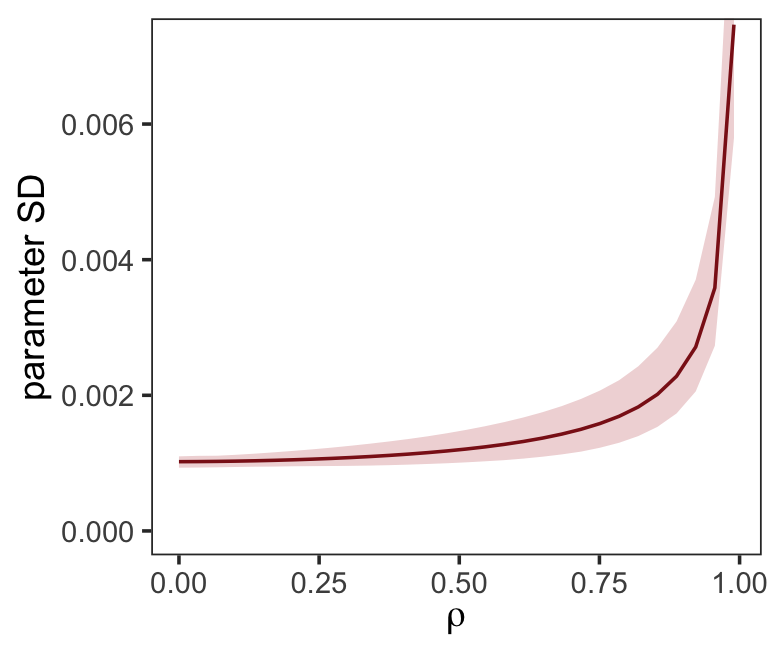

Did you notice we used the base R `lm()` function to fit the models? As McElreath rightly pointed out, `lm()` presumes flat priors. Proper Bayesian modeling could improve on that. But then we'd have to wait for a whole lot of HMC chains to run and until our personal computers or the algorithms we use to fit our Bayesian models become orders of magnitude faster, we just don’t have time for that.

### Post-treatment bias.

It helped me understand the next example by mapping out the sequence of events McElreath described in the second paragraph:

* seed and sprout plants
* measure heights
* apply different antifungal soil treatments (i.e., the experimental manipulation)
* measure (a) the heights and (b) the presence of fungus

Based on the design, let's simulate our data.


```r
n <- 100

set.seed(5)
d <- 
  tibble(treatment = rep(0:1, each = n / 2),
         fungus    = rbinom(n, size = 1, prob = .5 - treatment * 0.4),
         h0        = rnorm(n, mean = 10, sd = 2), 
         h1        = h0 + rnorm(n, mean = 5 - 3 * fungus, sd = 1))
```

We'll use `head()` to peek at the data.


```r
d %>%
  head()
```

```
## # A tibble: 6 × 4
##   treatment fungus    h0    h1
##       <int>  <int> <dbl> <dbl>
## 1         0      0 12.9   18.9
## 2         0      1 10.4   13.1
## 3         0      1 12.0   13.5
## 4         0      0  8.82  14.6
## 5         0      0  9.78  14.2
## 6         0      1  8.15  11.4
```

Fit the model containing `fungus` as a predictor.


```r
b5.13 <- 
  brm(data = d, 
      family = gaussian,
      h1 ~ 1 + h0 + treatment + fungus,
      prior = c(prior(normal(0, 100), class = Intercept),
                prior(normal(0, 10), class = b),
                prior(uniform(0, 10), class = sigma, ub = 10)),
      iter = 2000, warmup = 500, chains = 4, cores = 4,
      seed = 5,
      file = "fits/b05.13")
```


```r
print(b5.13)
```

```
##  Family: gaussian 
##   Links: mu = identity; sigma = identity 
## Formula: h1 ~ 1 + h0 + treatment + fungus 
##    Data: d (Number of observations: 100) 
##   Draws: 4 chains, each with iter = 2000; warmup = 500; thin = 1;
##          total post-warmup draws = 6000
## 
## Population-Level Effects: 
##           Estimate Est.Error l-95% CI u-95% CI Rhat Bulk_ESS Tail_ESS
## Intercept     4.12      0.56     3.03     5.19 1.00     6371     4737
## h0            1.09      0.05     0.99     1.20 1.00     6235     4659
## treatment    -0.00      0.21    -0.41     0.42 1.00     6079     4731
## fungus       -2.94      0.23    -3.40    -2.49 1.00     5974     4147
## 
## Family Specific Parameters: 
##       Estimate Est.Error l-95% CI u-95% CI Rhat Bulk_ESS Tail_ESS
## sigma     1.00      0.07     0.87     1.16 1.00     6479     4495
## 
## Draws were sampled using sampling(NUTS). For each parameter, Bulk_ESS
## and Tail_ESS are effective sample size measures, and Rhat is the potential
## scale reduction factor on split chains (at convergence, Rhat = 1).
```

Now fit the model after excluding `fungus`, our post-treatment variable.


```r
b5.14 <- 
  update(b5.13, 
         formula = h1 ~ 1 + h0 + treatment,
         iter = 2000, warmup = 1000, chains = 4, cores = 4,
         seed = 5,
         file = "fits/b05.14")
```


```r
print(b5.14)
```

```
##  Family: gaussian 
##   Links: mu = identity; sigma = identity 
## Formula: h1 ~ h0 + treatment 
##    Data: d (Number of observations: 100) 
##   Draws: 4 chains, each with iter = 2000; warmup = 1000; thin = 1;
##          total post-warmup draws = 4000
## 
## Population-Level Effects: 
##           Estimate Est.Error l-95% CI u-95% CI Rhat Bulk_ESS Tail_ESS
## Intercept     3.60      0.91     1.86     5.34 1.00     4478     3028
## h0            1.00      0.09     0.83     1.17 1.00     4495     2310
## treatment     0.87      0.34     0.20     1.53 1.00     4073     3043
## 
## Family Specific Parameters: 
##       Estimate Est.Error l-95% CI u-95% CI Rhat Bulk_ESS Tail_ESS
## sigma     1.67      0.12     1.45     1.93 1.00     3483     2728
## 
## Draws were sampled using sampling(NUTS). For each parameter, Bulk_ESS
## and Tail_ESS are effective sample size measures, and Rhat is the potential
## scale reduction factor on split chains (at convergence, Rhat = 1).
```

"Now the impact of treatment is strong and positive, as it should be" (p. 152). In this case, there were really two outcomes. The first was the one we modeled, the height at the end of the experiment (i.e., `h1`). The second outcome, which was clearly related to `h1`, was the presence of fungus, captured by our binomial variable `fungus`. If you wanted to model that, you'd fit a logistic regression model, which we'll learn about in [Chapter 10][Logistic regression: Prosocial chimpanzees.].

## Categorical variables

> Many readers will already know that variables like this, routinely called *factors*, can easily be included in linear models. But what is not widely understood is how these variables are included in a model... Knowing how the machine works removes a lot of this difficulty. (p. 153, *emphasis* in the original)

### Binary categories.

Reload the `Howell1` data.


```r
library(rethinking)
data(Howell1)
d <- Howell1
```

Unload rethinking and load brms.


```r
rm(Howell1)
detach(package:rethinking, unload = T)
library(brms)
```

Just in case you forgot what these data were like:


```r
d %>%
  glimpse()
```

```
## Rows: 544
## Columns: 4
## $ height <dbl> 151.7650, 139.7000, 136.5250, 156.8450, 145.4150, 163.8300, 149.2250, 168.9100, 147…
## $ weight <dbl> 47.82561, 36.48581, 31.86484, 53.04191, 41.27687, 62.99259, 38.24348, 55.47997, 34.…
## $ age    <dbl> 63.0, 63.0, 65.0, 41.0, 51.0, 35.0, 32.0, 27.0, 19.0, 54.0, 47.0, 66.0, 73.0, 20.0,…
## $ male   <int> 1, 0, 0, 1, 0, 1, 0, 1, 0, 1, 0, 1, 0, 0, 0, 1, 1, 0, 1, 0, 0, 1, 0, 1, 0, 1, 0, 0,…
```

Let's fit the first `height` model with the `male` dummy.

Note. The uniform prior McElreath used in the text in conjunction with the `brms::brm()` function seemed to cause problems for the HMC chains, here. After experimenting with start values, increasing `warmup`, and increasing `adapt_delta`, switching out the uniform prior did the trick. Anticipating [Chapter 8][Estimation.], I recommend you use a weakly-regularizing half Cauchy for $\sigma$.
      

```r
b5.15 <- 
  brm(data = d, 
      family = gaussian,
      height ~ 1 + male,
      prior = c(prior(normal(178, 100), class = Intercept),
                prior(normal(0, 10), class = b),
                prior(uniform(0, 50), class = sigma, ub = 50)),
      iter = 2000, warmup = 500, chains = 4, cores = 4,
      seed = 5,
      file = "fits/b05.15")
```

"To interpret these estimates, you have to note that the parameter $\alpha$ ([`Intercept`]) is now the average height *among females*" (p. 154).


```r
print(b5.15)
```

```
##  Family: gaussian 
##   Links: mu = identity; sigma = identity 
## Formula: height ~ 1 + male 
##    Data: d (Number of observations: 544) 
##   Draws: 4 chains, each with iter = 2000; warmup = 500; thin = 1;
##          total post-warmup draws = 6000
## 
## Population-Level Effects: 
##           Estimate Est.Error l-95% CI u-95% CI Rhat Bulk_ESS Tail_ESS
## Intercept   134.81      1.59   131.61   137.96 1.00     5754     4292
## male          7.29      2.27     2.90    11.77 1.00     5781     4450
## 
## Family Specific Parameters: 
##       Estimate Est.Error l-95% CI u-95% CI Rhat Bulk_ESS Tail_ESS
## sigma    27.41      0.83    25.86    29.09 1.00     6770     4674
## 
## Draws were sampled using sampling(NUTS). For each parameter, Bulk_ESS
## and Tail_ESS are effective sample size measures, and Rhat is the potential
## scale reduction factor on split chains (at convergence, Rhat = 1).
```

Our samples from the posterior are already in the HMC iterations. All we need to do is put them in a data frame and we'll be well-positioned to compute the intervals for the average height among men.


```r
post <- as_draws_df(b5.15)

post %>%
  transmute(male_height = b_Intercept + b_male) %>% 
  mean_qi(.width = .89)
```

```
## # A tibble: 1 × 6
##   male_height .lower .upper .width .point .interval
##         <dbl>  <dbl>  <dbl>  <dbl> <chr>  <chr>    
## 1        142.   139.   145.   0.89 mean   qi
```

You can also do this with `fitted()`.


```r
nd <- tibble(male = 1)

fitted(b5.15,
       newdata = nd)
```

```
##      Estimate Est.Error     Q2.5    Q97.5
## [1,] 142.0949  1.650958 138.9458 145.3336
```

And you could even plot.


```r
fitted(b5.15,
       newdata = nd,
       summary = F) %>% 
  as_tibble() %>% 
  
  ggplot(aes(x = V1, y = 0)) +
  stat_halfeye(point_interval = median_qi, .width = .95,
               fill = "firebrick4") +
  scale_y_continuous(NULL, breaks = NULL) +
  labs(subtitle = "Model-implied male heights",
       x = expression(alpha + beta["male"])) +
  theme_bw() +
  theme(panel.grid = element_blank())
```


#### Overthinking: Re-parameterizing the model.

The reparameterized model follows the form

\begin{align*}
\text{height}_i & \sim \operatorname{Normal}(\mu_i, \sigma) \\
\mu_i & = \alpha_\text{female} (1 - \text{male}_i) + \alpha_\text{male} \text{male}_i.
\end{align*}

So then a `female` dummy would satisfy the condition $\text{female}_i = (1 - \text{male}_i)$. Let's make that dummy.


```r
d <-
  d %>%
  mutate(female = 1 - male)
```

Everyone has their own idiosyncratic way of coding. One of my quirks is I always explicitly specify a model's intercept following the form `y ~ 1 + x`, where `y` is the criterion, `x` stands for the predictors, and `1` is the intercept. You don't have to do this, of course. You could just code `y ~ x` to get the same results. The `brm()` function assumes you want that intercept. One of the reasons I like the verbose version is it reminds me to think about the intercept and to include it in my priors. Another nice feature is that is helps me make sense of the code for this model: ` height ~ 0 + male + female`. When we replace `… ~ 1 + …` with `… ~ 0 + …`, we tell `brm()` to remove the intercept. Removing the intercept allows us to include ALL levels of a given categorical variable in our model. In this case, we’ve expressed sex as two dummies, `female` and `male`. Taking out the intercept lets us put both dummies into the formula.


```r
b5.15b <- 
  brm(data = d, 
      family = gaussian,
      height ~ 0 + male + female,
      prior = c(prior(normal(178, 100), class = b),
                prior(uniform(0, 50), class = sigma, ub = 50)),
      iter = 2000, warmup = 500, chains = 4, cores = 4,
      seed = 5,
      file = "fits/b05.15b")
```


```r
print(b5.15b)
```

```
##  Family: gaussian 
##   Links: mu = identity; sigma = identity 
## Formula: height ~ 0 + male + female 
##    Data: d (Number of observations: 544) 
##   Draws: 4 chains, each with iter = 2000; warmup = 500; thin = 1;
##          total post-warmup draws = 6000
## 
## Population-Level Effects: 
##        Estimate Est.Error l-95% CI u-95% CI Rhat Bulk_ESS Tail_ESS
## male     142.37      1.72   139.10   145.69 1.00     5425     4499
## female   134.65      1.59   131.55   137.75 1.00     6002     4188
## 
## Family Specific Parameters: 
##       Estimate Est.Error l-95% CI u-95% CI Rhat Bulk_ESS Tail_ESS
## sigma    27.43      0.85    25.86    29.19 1.00     5509     3758
## 
## Draws were sampled using sampling(NUTS). For each parameter, Bulk_ESS
## and Tail_ESS are effective sample size measures, and Rhat is the potential
## scale reduction factor on split chains (at convergence, Rhat = 1).
```

If we wanted the formal difference score from such a model, we'd subtract.


```r
as_draws_df(b5.15b) %>% 
  transmute(dif = b_male - b_female) %>% 
  
  ggplot(aes(x = dif, y = 0)) +
  stat_halfeye(point_interval = median_qi, .width = .95,
               fill = "firebrick4") +
  scale_y_continuous(NULL, breaks = NULL) +
  labs(subtitle = "Model-implied difference score",
       x = expression(alpha["male"] - alpha["female"])) +
  theme_bw() +
  theme(panel.grid = element_blank())
```

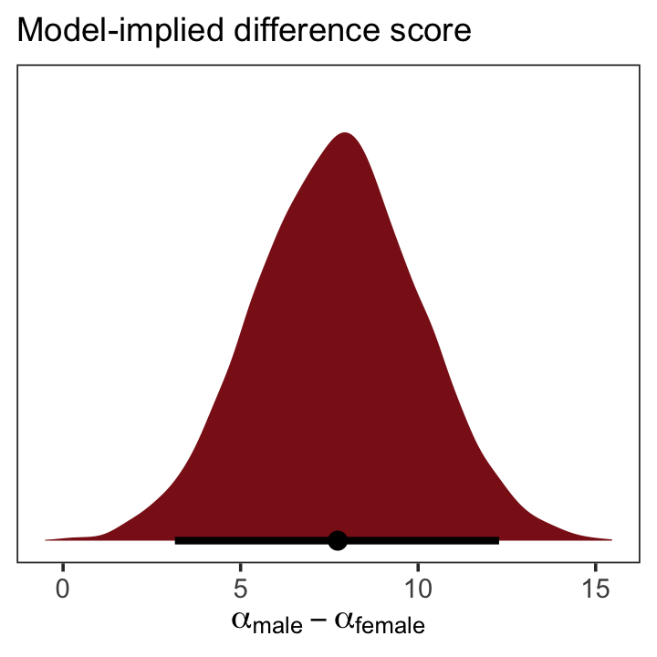

### Many categories.

> When there are more than two categories, you'll need more than one dummy variable. Here's the general rule: To include $k$ categories in a linear model, you require $k - 1$ dummy variables. Each dummy variable indicates, with the value 1, a unique category. The category with no dummy variable assigned to it ends up again as the "intercept" category. (p. 155)

We'll practice with `milk`.


```r
library(rethinking)
data(milk)
d <- milk
```

Unload rethinking and load brms.


```r
rm(milk)
detach(package:rethinking, unload = T)
library(brms)
```

With the tidyverse, we can peek at `clade` with `distinct()` in the place of base R `unique()`.


```r
d %>%
  distinct(clade)
```

```
##              clade
## 1    Strepsirrhine
## 2 New World Monkey
## 3 Old World Monkey
## 4              Ape
```

As `clade` has 4 categories, let's use `if_else()` to convert these to 4 dummy variables.


```r
d <- 
  d %>%
  mutate(clade_nwm = if_else(clade == "New World Monkey", 1, 0),
         clade_owm = if_else(clade == "Old World Monkey", 1, 0),
         clade_s   = if_else(clade == "Strepsirrhine", 1, 0),
         clade_ape = if_else(clade == "Ape", 1, 0))
```

Now we'll fit the model with three of the four dummies. In this model, `clade_ape` is the reference category captured by the intercept.


```r
b5.16 <- 
  brm(data = d, 
      family = gaussian,
      kcal.per.g ~ 1 + clade_nwm + clade_owm + clade_s,
      prior = c(prior(normal(.6, 10), class = Intercept),
                prior(normal(0, 1), class = b),
                prior(uniform(0, 10), class = sigma, ub = 10)),
      iter = 2000, warmup = 500, chains = 4, cores = 4,
      seed = 5,
      file = "fits/b05.16")
```


```r
print(b5.16)
```

```
##  Family: gaussian 
##   Links: mu = identity; sigma = identity 
## Formula: kcal.per.g ~ 1 + clade_nwm + clade_owm + clade_s 
##    Data: d (Number of observations: 29) 
##   Draws: 4 chains, each with iter = 2000; warmup = 500; thin = 1;
##          total post-warmup draws = 6000
## 
## Population-Level Effects: 
##           Estimate Est.Error l-95% CI u-95% CI Rhat Bulk_ESS Tail_ESS
## Intercept     0.55      0.04     0.46     0.63 1.00     4490     3647
## clade_nwm     0.17      0.06     0.05     0.29 1.00     4979     4334
## clade_owm     0.24      0.07     0.11     0.38 1.00     4852     4200
## clade_s      -0.04      0.07    -0.18     0.10 1.00     5100     4140
## 
## Family Specific Parameters: 
##       Estimate Est.Error l-95% CI u-95% CI Rhat Bulk_ESS Tail_ESS
## sigma     0.13      0.02     0.10     0.18 1.00     5131     4571
## 
## Draws were sampled using sampling(NUTS). For each parameter, Bulk_ESS
## and Tail_ESS are effective sample size measures, and Rhat is the potential
## scale reduction factor on split chains (at convergence, Rhat = 1).
```

Here we grab the chains, our draws from the posterior.


```r
post <- 
  b5.16 %>%
  as_draws_df()

head(post)
```

```
## # A draws_df: 6 iterations, 1 chains, and 7 variables
##   b_Intercept b_clade_nwm b_clade_owm b_clade_s sigma lprior lp__
## 1        0.51        0.23        0.23   -0.0780  0.16   -8.3  7.4
## 2        0.49        0.25        0.22   -0.0492  0.18   -8.3  5.6
## 3        0.47        0.25        0.45    0.0379  0.14   -8.4  6.3
## 4        0.48        0.27        0.30   -0.0160  0.14   -8.4  8.9
## 5        0.52        0.22        0.35    0.0015  0.15   -8.4  8.3
## 6        0.54        0.22        0.15   -0.0550  0.11   -8.3  7.5
## # ... hidden reserved variables {'.chain', '.iteration', '.draw'}
```

You might compute averages for each category and summarizing the results with the transpose of base R's `apply()` function, rounding to two digits of precision.


```r
post$mu_ape <- post$b_Intercept
post$mu_nwm <- post$b_Intercept + post$b_clade_nwm
post$mu_owm <- post$b_Intercept + post$b_clade_owm
post$mu_s   <- post$b_Intercept + post$b_clade_s

round(t(apply(post[, 11:14], 2, quantile, c(.5, .025, .975))), digits = 2)
```

```
##         50% 2.5% 97.5%
## mu_ape 0.55 0.46  0.63
## mu_nwm 0.71 0.63  0.80
## mu_owm 0.79 0.68  0.90
## mu_s   0.51 0.39  0.62
```

Here's a more tidyverse sort of way to get the same thing, but this time with means and HPDIs via the `tidybayes::mean_hdi()` function.


```r
post %>%
  transmute(mu_ape = b_Intercept,
            mu_nwm = b_Intercept + b_clade_nwm,
            mu_owm = b_Intercept + b_clade_owm,
            mu_s   = b_Intercept + b_clade_s) %>%
  gather() %>%
  group_by(key) %>%
  mean_hdi() %>% 
  mutate_if(is.double, round, digits = 2)
```

```
## # A tibble: 4 × 7
##   key    value .lower .upper .width .point .interval
##   <chr>  <dbl>  <dbl>  <dbl>  <dbl> <chr>  <chr>    
## 1 mu_ape  0.55   0.46   0.63   0.95 mean   hdi      
## 2 mu_nwm  0.71   0.63   0.8    0.95 mean   hdi      
## 3 mu_owm  0.79   0.68   0.9    0.95 mean   hdi      
## 4 mu_s    0.51   0.39   0.62   0.95 mean   hdi
```

You could also summarize with `fitted()`.


```r
nd <- tibble(clade_nwm = c(1, 0, 0, 0),
             clade_owm = c(0, 1, 0, 0),
             clade_s   = c(0, 0, 1, 0),
             primate   = c("New World Monkey", "Old World Monkey", "Strepsirrhine", "Ape"))

fitted(b5.16,
       newdata = nd,
       summary = F) %>% 
  as_tibble() %>% 
  gather() %>% 
  mutate(primate = rep(c("New World Monkey", "Old World Monkey", "Strepsirrhine", "Ape"), 
                       each = n() / 4)) %>% 
  
  ggplot(aes(x = value, y = reorder(primate, value))) +
  stat_halfeye(point_interval = median_qi, .width = .95,
               fill = "firebrick4") +
  labs(x = "kcal.per.g",
       y = NULL) +
  theme_bw() +
  theme(axis.text.y = element_text(hjust = 0),
        axis.ticks.y = element_blank(),
        panel.grid = element_blank())
```

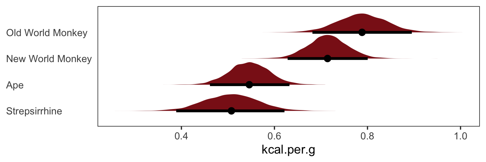

And there are multiple ways to compute summary statistics for the difference between `NWM` and `OWM`, too.


```r
# base R
quantile(post$mu_nwm - post$mu_owm, probs = c(.5, .025, .975))
```

```
##         50%        2.5%       97.5% 
## -0.07412986 -0.21486522  0.06254102
```

```r
# tidyverse + tidybayes
post %>%
  transmute(dif = mu_nwm - mu_owm) %>%
  median_qi()
```

```
## # A tibble: 1 × 6
##       dif .lower .upper .width .point .interval
##     <dbl>  <dbl>  <dbl>  <dbl> <chr>  <chr>    
## 1 -0.0741 -0.215 0.0625   0.95 median qi
```

### Adding regular predictor variables.

If we wanted to fit the model including `perc.fat` as an additional predictor, the basic statistical formula would be

$$
\mu_i = \alpha + \beta_\text{clade_nwm} \text{clade_nwm}_i + \beta_\text{clade_owm} \text{clade_owm}_i + \beta_\text{clade_s} \text{clade_s}_i + \beta_\text{perc.fat} \text{perc.fat}_i.
$$

The corresponding `formula` argument within `brm()` would be `kcal.per.g ~ 1 + clade_nwm + clade_owm + clade_s + perc.fat`.

### Another approach: Unique intercepts.

"Another way to conceptualize categorical variables is to construct a vector of intercept parameters, one parameter for each category" (p. 158). Using the code below, there's no need to transform `d$clade` into `d$clade_id`. The advantage of this approach is the indices in the model summary are more descriptive than `a[1]` through `a[4]`.


```r
b5.16_alt <- 
  brm(data = d, 
      family = gaussian,
      kcal.per.g ~ 0 + clade,
      prior = c(prior(normal(.6, 10), class = b),
                prior(uniform(0, 10), class = sigma, ub = 10)),
      iter = 2000, warmup = 500, chains = 4, cores = 4,
      seed = 5,
      file = "fits/b05.16_alt")
```


```r
print(b5.16_alt)
```

```
##  Family: gaussian 
##   Links: mu = identity; sigma = identity 
## Formula: kcal.per.g ~ 0 + clade 
##    Data: d (Number of observations: 29) 
##   Draws: 4 chains, each with iter = 2000; warmup = 500; thin = 1;
##          total post-warmup draws = 6000
## 
## Population-Level Effects: 
##                     Estimate Est.Error l-95% CI u-95% CI Rhat Bulk_ESS Tail_ESS
## cladeApe                0.55      0.04     0.46     0.63 1.00     7151     4391
## cladeNewWorldMonkey     0.71      0.05     0.63     0.80 1.00     6646     4202
## cladeOldWorldMonkey     0.79      0.05     0.68     0.89 1.00     6328     4413
## cladeStrepsirrhine      0.51      0.06     0.39     0.62 1.00     6819     4257
## 
## Family Specific Parameters: 
##       Estimate Est.Error l-95% CI u-95% CI Rhat Bulk_ESS Tail_ESS
## sigma     0.13      0.02     0.10     0.18 1.00     5358     4467
## 
## Draws were sampled using sampling(NUTS). For each parameter, Bulk_ESS
## and Tail_ESS are effective sample size measures, and Rhat is the potential
## scale reduction factor on split chains (at convergence, Rhat = 1).
```

See? This is much easier than trying to remember which one was which in an arbitrary numeric index.

## ~~Ordinary least squares and `lm()`~~

Since this section centers on the frequentist `lm()` function, I'm going to largely ignore it. A couple things, though. You'll note how the brms package uses the `lm()`-like design formula syntax. Although not as pedagogical as the more formal rethinking syntax, it has the advantage of cohering with the popular [lme4](https://cran.r-project.org/package=lme4) [@R-lme4; @batesFittingLinearMixedeffects2015] syntax for multilevel models.

Also, on page 161 McElreath clarified that one cannot use the `I()` syntax with his rethinking package. Not so with brms. The `I()` syntax works just fine with `brms::brm()`. We've already made use of it in the ["Polynomial regression"][Polynomial regression] section of Chapter 4.

## Session info {-}


```r
sessionInfo()
```

```
## R version 4.2.2 (2022-10-31)
## Platform: x86_64-apple-darwin17.0 (64-bit)
## Running under: macOS Big Sur ... 10.16
## 
## Matrix products: default
## BLAS:   /Library/Frameworks/R.framework/Versions/4.2/Resources/lib/libRblas.0.dylib
## LAPACK: /Library/Frameworks/R.framework/Versions/4.2/Resources/lib/libRlapack.dylib
## 
## locale:
## [1] en_US.UTF-8/en_US.UTF-8/en_US.UTF-8/C/en_US.UTF-8/en_US.UTF-8
## 
## attached base packages:
## [1] parallel  stats     graphics  grDevices utils     datasets  methods   base     
## 
## other attached packages:
##  [1] GGally_2.1.2         patchwork_1.1.2      tidybayes_3.0.2      bayesplot_1.10.0    
##  [5] tigris_1.6.1         ggrepel_0.9.2        brms_2.18.0          Rcpp_1.0.9          
##  [9] forcats_0.5.1        stringr_1.4.1        dplyr_1.0.10         purrr_1.0.1         
## [13] readr_2.1.2          tidyr_1.2.1          tibble_3.1.8         tidyverse_1.3.2     
## [17] cmdstanr_0.5.3       rstan_2.21.8         ggplot2_3.4.0        StanHeaders_2.21.0-7
## 
## loaded via a namespace (and not attached):
##   [1] uuid_1.1-0           readxl_1.4.1         backports_1.4.1      plyr_1.8.7          
##   [5] igraph_1.3.4         svUnit_1.0.6         sp_1.5-0             splines_4.2.2       
##   [9] crosstalk_1.2.0      TH.data_1.1-1        rstantools_2.2.0     inline_0.3.19       
##  [13] digest_0.6.31        htmltools_0.5.3      fansi_1.0.3          magrittr_2.0.3      
##  [17] checkmate_2.1.0      googlesheets4_1.0.1  tzdb_0.3.0           modelr_0.1.8        
##  [21] RcppParallel_5.1.5   matrixStats_0.63.0   xts_0.12.1           sandwich_3.0-2      
##  [25] prettyunits_1.1.1    colorspace_2.0-3     rappdirs_0.3.3       rvest_1.0.2         
##  [29] ggdist_3.2.1         rgdal_1.5-30         haven_2.5.1          xfun_0.35           
##  [33] callr_3.7.3          crayon_1.5.2         jsonlite_1.8.4       lme4_1.1-31         
##  [37] survival_3.4-0       zoo_1.8-10           glue_1.6.2           gtable_0.3.1        
##  [41] gargle_1.2.0         emmeans_1.8.0        distributional_0.3.1 pkgbuild_1.3.1      
##  [45] shape_1.4.6          abind_1.4-5          scales_1.2.1         mvtnorm_1.1-3       
##  [49] DBI_1.1.3            miniUI_0.1.1.1       xtable_1.8-4         HDInterval_0.2.4    
##  [53] units_0.8-0          proxy_0.4-27         foreign_0.8-83       stats4_4.2.2        
##  [57] DT_0.24              htmlwidgets_1.5.4    httr_1.4.4           threejs_0.3.3       
##  [61] RColorBrewer_1.1-3   arrayhelpers_1.1-0   posterior_1.3.1      ellipsis_0.3.2      
##  [65] reshape_0.8.9        pkgconfig_2.0.3      loo_2.5.1            farver_2.1.1        
##  [69] sass_0.4.2           dbplyr_2.2.1         utf8_1.2.2           labeling_0.4.2      
##  [73] tidyselect_1.2.0     rlang_1.0.6          reshape2_1.4.4       later_1.3.0         
##  [77] munsell_0.5.0        cellranger_1.1.0     tools_4.2.2          cachem_1.0.6        
##  [81] cli_3.6.0            generics_0.1.3       broom_1.0.2          evaluate_0.18       
##  [85] fastmap_1.1.0        processx_3.8.0       knitr_1.40           fs_1.5.2            
##  [89] nlme_3.1-160         mime_0.12            projpred_2.2.1       xml2_1.3.3          
##  [93] compiler_4.2.2       shinythemes_1.2.0    rstudioapi_0.13      curl_4.3.2          
##  [97] gamm4_0.2-6          e1071_1.7-11         reprex_2.0.2         bslib_0.4.0         
## [101] stringi_1.7.8        highr_0.9            ps_1.7.2             Brobdingnag_1.2-8   
## [105] lattice_0.20-45      Matrix_1.5-1         classInt_0.4-7       nloptr_2.0.3        
## [109] markdown_1.1         shinyjs_2.1.0        tensorA_0.36.2       vctrs_0.5.1         
## [113] pillar_1.8.1         lifecycle_1.0.3      jquerylib_0.1.4      bridgesampling_1.1-2
## [117] estimability_1.4.1   maptools_1.1-4       httpuv_1.6.5         R6_2.5.1            
## [121] bookdown_0.28        promises_1.2.0.1     KernSmooth_2.23-20   gridExtra_2.3       
## [125] codetools_0.2-18     boot_1.3-28          colourpicker_1.1.1   MASS_7.3-58.1       
## [129] gtools_3.9.4         assertthat_0.2.1     withr_2.5.0          shinystan_2.6.0     
## [133] multcomp_1.4-20      mgcv_1.8-41          hms_1.1.1            grid_4.2.2          
## [137] class_7.3-20         coda_0.19-4          minqa_1.2.5          rmarkdown_2.16      
## [141] googledrive_2.0.0    sf_1.0-7             shiny_1.7.2          lubridate_1.8.0     
## [145] base64enc_0.1-3      dygraphs_1.1.1.6
```


