# Overfitting, Regularization, and Information Criteria

In this chapter we contend with two contrasting kinds of statistical error:

* overfitting, "which leads to poor prediction by learning too *much* from the data"
* underfitting, "which leads to poor prediction by learning too *little* from the data" (p. 166, *emphasis* added) 

## The problem with parameters

The $R^2$ is a popular way to measure how well you can retrodict the data. It traditionally follows the form

$$R^2 = \frac{\text{var(outcome)} - \text{var(residuals)}}{\text{var(outcome)}} = 1 - \frac{\text{var(residuals)}}{\text{var(outcome)}}$$

By $\text{var()}$, of course, we meant variance (i.e., the `var()` function in R).

McElreath's not a fan of the $R^2$. But it's important in my field, so instead of a summary at the end of the chapter, we will cover the Bayesian version of $R^2$ and how to use it in brms.

### More parameters always improve fit.

We'll start off by making the data with brain size and body size for seven `species`.


```r
library(tidyverse)

(
  d <- 
  tibble(species = c("afarensis", "africanus", "habilis", "boisei", "rudolfensis", "ergaster", "sapiens"), 
         brain   = c(438, 452, 612, 521, 752, 871, 1350), 
         mass    = c(37.0, 35.5, 34.5, 41.5, 55.5, 61.0, 53.5))
  )
```

```
## # A tibble: 7 x 3
##   species     brain  mass
##   <chr>       <dbl> <dbl>
## 1 afarensis     438  37  
## 2 africanus     452  35.5
## 3 habilis       612  34.5
## 4 boisei        521  41.5
## 5 rudolfensis   752  55.5
## 6 ergaster      871  61  
## 7 sapiens      1350  53.5
```

Let's get ready for Figure 6.2. The plots in this chapter will be characterized by `theme_classic() + theme(text = element_text(family = "Courier"))`. Our color palette will come from the [rcartocolor package](https://cran.r-project.org/web/packages/rcartocolor/index.html), which provides color schemes [designed by 'CARTO'](https://carto.com/carto-colors/).


```r
# install.packages("rcartocolor", dependencies = T)
library(rcartocolor)
```

The specific palette we'll be using is "BurgYl." In addition to palettes, the rcartocolor package offers a few convenience functions which make it easier to use their palettes. The `carto_pal()` function will return the HEX numbers associated with a given palette's colors and the `display_carto_pal()` function will display the actual colors.


```r
carto_pal(7, "BurgYl")
```

```
## [1] "#fbe6c5" "#f5ba98" "#ee8a82" "#dc7176" "#c8586c" "#9c3f5d" "#70284a"
```

```r
display_carto_pal(7, "BurgYl")
```


We'll be using a diluted version of the third color for the panel background (i.e., `theme(panel.background = element_rect(fill = alpha(carto_pal(7, "BurgYl")[3], 1/4)))`) and the darker purples for other plot elements. Here's the plot.


```r
library(ggrepel)

d %>%
  ggplot(aes(x =  mass, y = brain, label = species)) +
  geom_point(color = carto_pal(7, "BurgYl")[5]) +
  geom_text_repel(size = 3, color = carto_pal(7, "BurgYl")[7], family = "Courier", seed = 438) +
  coord_cartesian(xlim = 30:65) +
  labs(x = "body mass (kg)",
       y = "brain volume (cc)",
       subtitle = "Average brain volume by body\nmass for six hominin species") +
  theme_classic() +
  theme(text = element_text(family = "Courier"),
        panel.background = element_rect(fill = alpha(carto_pal(7, "BurgYl")[3], 1/4)))
```

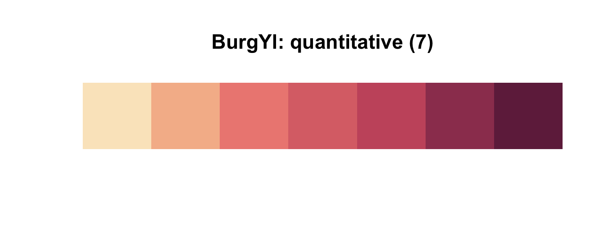

Let's fit the first six models in bulk. First we'll make a custom function, `fit_lm()`, into which we'll feed the desired names and formulas of our models. We'll make a tibble initially composed of those names (i.e., `model`) and formulas (i.e., `formula`). Via `purrr::map2()` within `mutate()`, we'll then fit the models and save the model objects within the tibble. The [broom package](https://cran.r-project.org/web/packages/broom/index.html) provides an array of convenience functions to convert statistical analysis summaries into tidy data objects. We'll employ `broom::tidy()` and `broom::glance()` to extract information from the model fits.


```r
library(broom)

fit_lm <- function(model, formula){
  model <- lm(data = d, formula = formula)
}

fits <-
  tibble(model   = str_c("b6.", 1:6),
         formula = c("brain ~ mass", 
                     "brain ~ mass + I(mass^2)", 
                     "brain ~ mass + I(mass^2) + I(mass^3)", 
                     "brain ~ mass + I(mass^2) + I(mass^3) + I(mass^4)", 
                     "brain ~ mass + I(mass^2) + I(mass^3) + I(mass^4) + I(mass^5)", 
                     "brain ~ mass + I(mass^2) + I(mass^3) + I(mass^4) + I(mass^5) + I(mass^6)")) %>% 
  mutate(fit     = map2(model, formula, fit_lm)) %>% 
  mutate(tidy    = map(fit, tidy),
         glance  = map(fit, glance))

# what did we just do?
print(fits)
```

```
## # A tibble: 6 x 5
##   model formula                                                 fit     tidy          glance        
##   <chr> <chr>                                                   <list>  <list>        <list>        
## 1 b6.1  brain ~ mass                                            <S3: l… <tibble [2 ×… <tibble [1 × …
## 2 b6.2  brain ~ mass + I(mass^2)                                <S3: l… <tibble [3 ×… <tibble [1 × …
## 3 b6.3  brain ~ mass + I(mass^2) + I(mass^3)                    <S3: l… <tibble [4 ×… <tibble [1 × …
## 4 b6.4  brain ~ mass + I(mass^2) + I(mass^3) + I(mass^4)        <S3: l… <tibble [5 ×… <tibble [1 × …
## 5 b6.5  brain ~ mass + I(mass^2) + I(mass^3) + I(mass^4) + I(m… <S3: l… <tibble [6 ×… <tibble [1 × …
## 6 b6.6  brain ~ mass + I(mass^2) + I(mass^3) + I(mass^4) + I(m… <S3: l… <tibble [7 ×… <tibble [1 × …
```

Our `fits` object is a [nested tibble](https://tidyr.tidyverse.org/reference/nest.html). To learn more about this bulk approach to fitting models, check out Hadley Wickham's talk [Managing many models with R](https://www.youtube.com/watch?v=rz3_FDVt9eg&t=2339s&frags=pl%2Cwn). As you might learn in the talk, we can extract the $R^2$ from each model with `map_dbl("r.squared")`, which we'll then display in a plot.


```r
fits <-
  fits %>% 
  mutate(r2      = glance %>% map_dbl("r.squared")) %>% 
  mutate(r2_text = round(r2, digits = 2) %>% as.character() %>% str_replace(., "0.", "."))

fits %>% 
  ggplot(aes(x = r2, y = formula, label = r2_text)) +
  geom_text(color = carto_pal(7, "BurgYl")[7], size = 3.5) +
  scale_x_continuous(expression(italic(R)^2), limits = 0:1, breaks = 0:1) +
  ylab(NULL) +
  theme_classic() +
  theme(axis.text.y  = element_text(hjust = 0),
        axis.ticks.y = element_blank(),
        text         = element_text(family = "Courier"),
        panel.background = element_rect(fill = alpha(carto_pal(7, "BurgYl")[3], 1/4)))
```

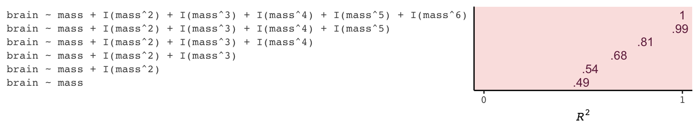

If we wanted to look at the model coefficients, we could `unnest(tidy)` and wrangle a bit.  


```r
fits %>% 
  unnest(tidy) %>% 
  select(model, term:estimate) %>% 
  mutate_if(is.double, round, digits = 1) %>% 
  complete(term = distinct(., term), model) %>% 
  spread(key = term, value = estimate) %>% 
  select(model, `(Intercept)`, mass, everything())
```

```
## # A tibble: 6 x 8
##   model `(Intercept)`       mass `I(mass^2)` `I(mass^3)` `I(mass^4)` `I(mass^5)` `I(mass^6)`
##   <chr>         <dbl>      <dbl>       <dbl>       <dbl>       <dbl>       <dbl>       <dbl>
## 1 b6.1          -228.       20.7        NA          NA          NA          NA            NA
## 2 b6.2         -2618.      127.         -1.1        NA          NA          NA            NA
## 3 b6.3         21990.    -1474.         32.8        -0.2        NA          NA            NA
## 4 b6.4        322887.   -27946.        892.        -12.4         0.1        NA            NA
## 5 b6.5      -1535342.   180049       -8325.        190.         -2.1         0            NA
## 6 b6.6      10849891. -1473228.      82777       -2463.         40.9        -0.4           0
```

For Figure 6.3, we’ll make each plot individually and them glue them together with `gridExtra::grid.arrange()`. Since they all share a common stucture, we'll start by specifying a base plot which we'll save as `p`.


```r
p <-
  d %>% 
  ggplot(aes(x = mass, y = brain)) +
  geom_point(color = carto_pal(7, "BurgYl")[7]) +
  scale_x_continuous("body mass (kg)", limits = c(33, 62), expand = c(0, 0)) +
  coord_cartesian(ylim = c(300, 1500)) +
  ylab("brain volume (cc)") +
  theme_classic() +
  theme(text = element_text(family = "Courier"),
        panel.background = element_rect(fill = alpha(carto_pal(7, "BurgYl")[3], 1/4)))
```

Now for each subplot, we'll tack the subplot-specific components onto `p`. The main action is in `stat_smooth()`. For each subplot, the first three lines in `stat_smooth()` are identical, with only the bottom `formula` line differing. Like McElreath did in the text, we also adjust the y-axis range for the last two plots.


```r
# linear
p1 <- 
  p +
  stat_smooth(method = "lm", fullrange = TRUE, level = .89,  # note our rare use of 89% intervals
              color = carto_pal(7, "BurgYl")[6], fill = carto_pal(7, "BurgYl")[6], 
              size = 1/2, alpha = 1/3,
              formula = y ~ x) +
  ggtitle(NULL, subtitle = expression(paste(italic(R)^2, " = .49")))
  
# quadratic
p2 <-
  p + 
  stat_smooth(method = "lm", fullrange = TRUE, level = .89,
              color = carto_pal(7, "BurgYl")[6], fill = carto_pal(7, "BurgYl")[6], 
              size = 1/2, alpha = 1/3,              
              formula = y ~ poly(x, 2)) +
  ggtitle(NULL, subtitle = expression(paste(italic(R)^2, " = .54")))

# cubic
p3 <-
  p + 
  stat_smooth(method = "lm", fullrange = TRUE, level = .89,
              color = carto_pal(7, "BurgYl")[6], fill = carto_pal(7, "BurgYl")[6], 
              size = 1/2, alpha = 1/3,              
              formula = y ~ poly(x, 3)) +
  ggtitle(NULL, subtitle = expression(paste(italic(R)^2, " = .68")))

# fourth-order polynomial
p4 <-
  p + 
  stat_smooth(method = "lm", fullrange = TRUE, level = .89,
              color = carto_pal(7, "BurgYl")[6], fill = carto_pal(7, "BurgYl")[6], 
              size = 1/2, alpha = 1/3,              
              formula = y ~ poly(x, 4)) +
  ggtitle(NULL, subtitle = expression(paste(italic(R)^2, " = .81")))

# fifth-order polynomial
p5 <-
  p + 
  stat_smooth(method = "lm", fullrange = TRUE, level = .89,
              color = carto_pal(7, "BurgYl")[6], fill = carto_pal(7, "BurgYl")[6], 
              size = 1/2, alpha = 1/3,              
              formula = y ~ poly(x, 5)) +
  # we're adjusting the y-axis range for this plot (and the next)
  coord_cartesian(ylim = c(150, 1900)) +
  ggtitle(NULL, subtitle = expression(paste(italic(R)^2, " = .99")))
  
# sixth-order polynomial
p6 <-
  p + 
  # mark off 0 on the y-axis
  geom_hline(yintercept = 0, color = carto_pal(7, "BurgYl")[2], linetype = 2) + 
  stat_smooth(method = "lm", fullrange = TRUE, level = .89,
              color = carto_pal(7, "BurgYl")[6], fill = carto_pal(7, "BurgYl")[6], 
              size = 1/2, alpha = 1/3,              
              formula = y ~ poly(x, 6)) +
  coord_cartesian(ylim = c(-300, 1500)) +
  ggtitle(NULL, subtitle = expression(paste(italic(R)^2, " = 1")))
```

Okay, now we're ready to combine the six subplots and produce our version of Figure 6.3.


```r
library(gridExtra)

grid.arrange(p1, p2, p3, p4, p5, p6, ncol = 2)
```

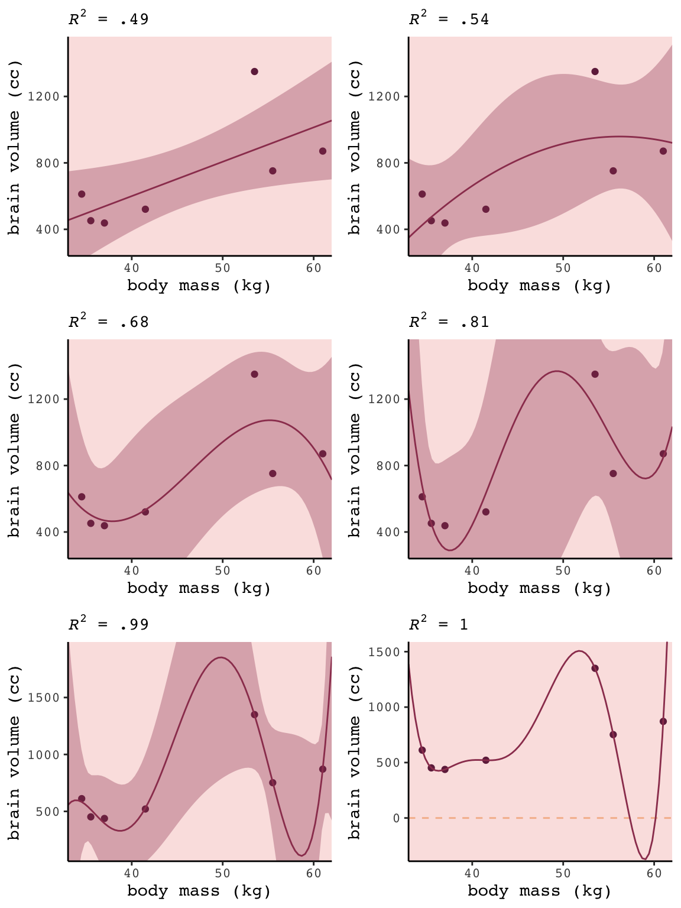

### Too few parameters hurts, too.

Fit the intercept only model, `b6.7`.


```r
b6.7 <- lm(data = d, 
           brain ~ 1)

summary(b6.7)
```

```
## 
## Call:
## lm(formula = brain ~ 1, data = d)
## 
## Residuals:
##     Min      1Q  Median      3Q     Max 
## -275.71 -227.21 -101.71   97.79  636.29 
## 
## Coefficients:
##             Estimate Std. Error t value Pr(>|t|)   
## (Intercept)    713.7      121.8    5.86  0.00109 **
## ---
## Signif. codes:  0 '***' 0.001 '**' 0.01 '*' 0.05 '.' 0.1 ' ' 1
## 
## Residual standard error: 322.2 on 6 degrees of freedom
```

With the intercept-only model, we didn't even get an $R^2$ value in the summary.`broom::glance()` offers a quick way to get one.


```r
glance(b6.7)
```

```
## # A tibble: 1 x 11
##   r.squared adj.r.squared sigma statistic p.value    df logLik   AIC   BIC deviance df.residual
##       <dbl>         <dbl> <dbl>     <dbl>   <dbl> <int>  <dbl> <dbl> <dbl>    <dbl>       <int>
## 1         0             0  322.        NA      NA     1  -49.8  104.  104.  623061.           6
```

Zero. Our intercept-only `b6.7` explained exactly zero variance in `brain`. All it did was tell us what the unconditional mean and variance (i.e., 'Residual standard error') were. I hope that makes sense. They were the only things in the model: $\text{brain}_i \sim \text{Normal}(\mu = \alpha, \sigma)$. To get the intercept-only model for Figure 6.4, we plug `formula = y ~ 1` into the `stat_smooth()` function.


```r
p +
  stat_smooth(method = "lm", fullrange = TRUE, level = .89,
              color = carto_pal(7, "BurgYl")[6], fill = carto_pal(7, "BurgYl")[6], 
              size = 1/2, alpha = 1/3,              
              formula = y ~ 1) +
  ggtitle(NULL, subtitle = expression(paste(italic(R)^2, " = 0")))
```

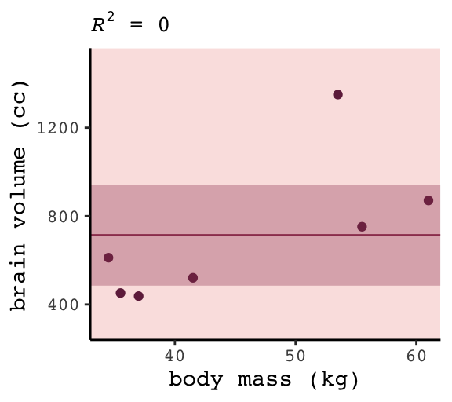

#### Overthinking: Dropping rows.

You can `filter()` by `row_number()` to drop rows in a [tidyverse kind of way](https://dplyr.tidyverse.org/reference/slice.html). For example, we can drop the second row of `d` like this.


```r
 d %>%
    filter(row_number() != 2)
```

```
## # A tibble: 6 x 3
##   species     brain  mass
##   <chr>       <dbl> <dbl>
## 1 afarensis     438  37  
## 2 habilis       612  34.5
## 3 boisei        521  41.5
## 4 rudolfensis   752  55.5
## 5 ergaster      871  61  
## 6 sapiens      1350  53.5
```

We can then extend that logic into a custom function, `make_lines()`, that will drop a row from `d`, fit the simple model `brain ~ mass`, and then use base R `predict()` to return the model-implied trajectory over new data values.


```r
# because these lines are straight, we only need new data over two points of `mass`
nd <- tibble(mass = c(30, 70))

make_lines <- function(row){
  my_fit <-
    d %>%
    filter(row_number() != row) %>% 
    lm(formula = brain ~ mass)

  predict(my_fit, nd) %>% 
    as_tibble() %>% 
    rename(brain = value) %>% 
    bind_cols(nd)
}
```

Here we’ll make a tibble, `lines`, which will specify rows 1 through 7 in the `row` column. We’ll then feed those `row` numbers into our custom `make_lines()` function, which will return the predicted values and their corresponding `mass` values, per model.


```r
(
  lines <-
  tibble(row = 1:7) %>% 
  mutate(p = map(row, make_lines)) %>% 
  unnest(p)
  )
```

```
## # A tibble: 14 x 3
##      row brain  mass
##    <int> <dbl> <dbl>
##  1     1  436.    30
##  2     1 1201.    70
##  3     2  421.    30
##  4     2 1205.    70
##  5     3  323.    30
##  6     3 1264.    70
##  7     4  423.    30
##  8     4 1221.    70
##  9     5  376.    30
## 10     5 1335.    70
## 11     6  332.    30
## 12     6 1433.    70
## 13     7  412.    30
## 14     7  964.    70
```

Now we're ready to plot the left panel of Figure 6.5.


```r
p + 
  scale_x_continuous(expand = c(0, 0)) +
  geom_line(data = lines, 
            aes(x = mass, y = brain, group = row),
            color = carto_pal(7, "BurgYl")[6], alpha = 1/2, size = 1/2)
```

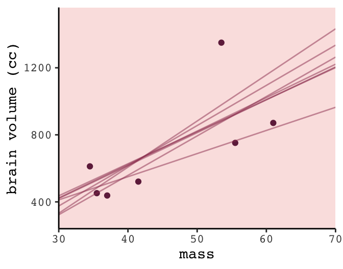

To make the right panel for Figure 6.5, we’ll need to increase the number of `mass` points in our `nd` data and redefine the `make_lines()` function to fit the sixth-order-polynomial model.


```r
# because these lines will be very curvy, we'll need new data over many points of `mass`
nd <- tibble(mass = seq(from = 30, to = 65, length.out = 200))

# redifine the function
make_lines <- function(row){
  my_fit <-
    d %>%
    filter(row_number() != row) %>% 
    lm(formula = brain ~ mass + I(mass^2) + I(mass^3) + I(mass^4) + I(mass^5) + I(mass^6))

  predict(my_fit, nd) %>% 
    as_tibble() %>% 
    rename(brain = value) %>% 
    bind_cols(nd)
}

# make our new tibble
lines <-
  tibble(row = 1:7) %>% 
  mutate(p = map(row, make_lines)) %>% 
  unnest(p)

# plot!
p +
  geom_line(data = lines, 
            aes(group = row),
            color = carto_pal(7, "BurgYl")[6], alpha = 1/2, size = 1/2) +
  coord_cartesian(ylim = -300:2000)
```

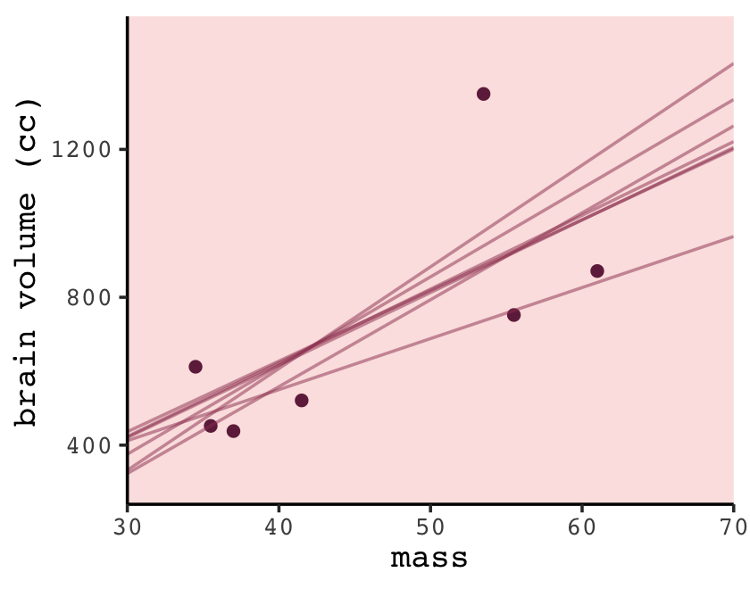

## Information theory and model performance

> Whether you end up using regularization or information criteria or both, the first thing you must do is pick a criterion of model performance. What do you want the model to do well at? We’ll call this criterion the *target*, and in this section you’ll see how information theory provides a common and useful target, the out-of-sample *deviance*. (p. 174, *emphasis* in the original)

### Firing the weatherperson.

If you let rain = 1 and sun = 0, here's a way to make a plot of the first table of page 175, the weatherperson's predictions.


```r
weatherperson <-
  tibble(day        = 1:10,
         prediction = rep(c(1, 0.6), times = c(3, 7)),
         observed   = rep(c(1, 0), times = c(3, 7))) 

weatherperson %>% 
  gather(key, value, -day) %>% 
  
  ggplot(aes(x = day, y = key, fill = value)) +
  geom_tile(color = "white") +
  geom_text(aes(label = value, color = value == 0)) +
  scale_x_continuous(breaks = 1:10, expand = c(0, 0)) +
  scale_y_discrete(NULL, expand = c(0, 0)) +
  scale_fill_viridis_c(direction = -1) +
  scale_color_manual(values = c("white", "black")) +
  theme(legend.position = "none",
        axis.ticks.y = element_blank(),
        text = element_text(family = "Courier"))
```

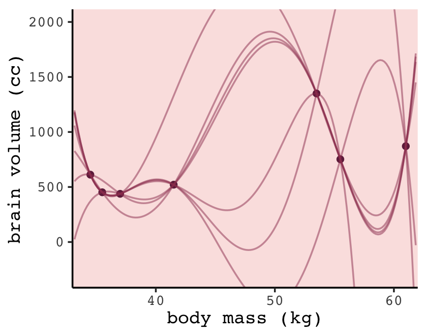

Here's how the newcomer fared:


```r
newcomer <-
  tibble(day        = 1:10,
         prediction = 0,
         observed   = rep(c(1, 0), times = c(3, 7)))

newcomer %>% 
  gather(key, value, -day) %>%
  
  ggplot(aes(x = day, y = key, fill = value)) +
  geom_tile(color = "white") +
  geom_text(aes(label = value, color = value == 0)) +
  scale_x_continuous(breaks = 1:10, expand = c(0, 0)) +
  scale_y_discrete(NULL, expand = c(0, 0)) +
  scale_fill_viridis_c(direction = -1) +
  scale_color_manual(values = c("white", "black")) +
  theme(legend.position = "none",
        axis.ticks.y = element_blank(),
        text = element_text(family = "Courier"))
```

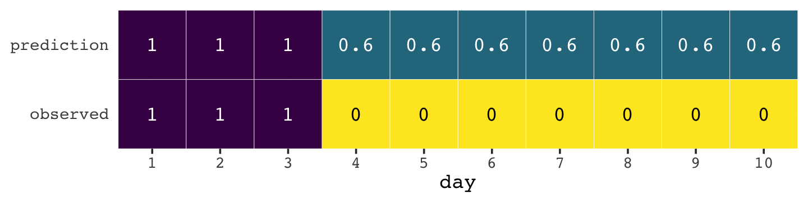

If we do the math entailed in the tibbles, we'll see why the newcomer could boast "I'm the best person for the job" (p. 175).


```r
weatherperson %>% 
  bind_rows(newcomer) %>% 
  mutate(person = rep(c("weatherperson", "newcomer"), each = n()/2),
         hit    = ifelse(prediction == observed, 1, 1 - prediction - observed)) %>% 
  group_by(person) %>% 
  summarise(hit_rate = mean(hit))
```

```
## # A tibble: 2 x 2
##   person        hit_rate
##   <chr>            <dbl>
## 1 newcomer          0.7 
## 2 weatherperson     0.58
```

#### Costs and benefits.

Our new `points` variable doesn't fit into the nice color-based `geom_tile()` plots from above. But we can still do the math.


```r
weatherperson %>% 
  bind_rows(newcomer) %>% 
  mutate(person = rep(c("weatherperson", "newcomer"), each = n()/2),
         points = ifelse(observed == 1 & prediction != 1, -5,
                         ifelse(observed == 1 & prediction == 1, -1,
                                -1 * prediction))) %>% 
  group_by(person) %>% 
  summarise(happiness = sum(points))
```

```
## # A tibble: 2 x 2
##   person        happiness
##   <chr>             <dbl>
## 1 newcomer          -15  
## 2 weatherperson      -7.2
```

#### Measuring accuracy.


```r
weatherperson %>% 
  bind_rows(newcomer) %>% 
  mutate(person = rep(c("weatherperson", "newcomer"), each = n() / 2),
         hit    = ifelse(prediction == observed, 1, 1 - prediction - observed)) %>% 
  group_by(person, hit) %>% 
  count() %>% 
  ungroup() %>% 
  mutate(power = hit ^ n,
         term  = rep(letters[1:2], times = 2)) %>% 
  select(person, term, power) %>% 
  spread(key = term, value = power) %>% 
  mutate(probability_correct_sequence = a * b)
```

```
## # A tibble: 2 x 4
##   person              a     b probability_correct_sequence
##   <chr>           <dbl> <dbl>                        <dbl>
## 1 newcomer      0           1                      0      
## 2 weatherperson 0.00164     1                      0.00164
```

### Information and uncertainty.

The formula for information entropy is:

$$H(p) = - \text{E log} (p_i) = - \sum_{i = 1}^n p_i \text{log} (p_i)$$

McElreath put it in words as "the uncertainty contained in a probability distribution is the average log-probability of the event" (p. 178). We'll compute the information entropy for weather at the first unnamed location, which we'll call `McElreath's house`, and `Abu Dhabi` at once.


```r
tibble(place  = c("McElreath's house", "Abu Dhabi"),
       p_rain = c(.3, .01)) %>% 
  mutate(p_shine = 1 - p_rain) %>% 
  group_by(place) %>% 
  mutate(H_p = (p_rain * log(p_rain) + p_shine * log(p_shine)) %>% mean() * -1)
```

```
## # A tibble: 2 x 4
## # Groups:   place [2]
##   place             p_rain p_shine    H_p
##   <chr>              <dbl>   <dbl>  <dbl>
## 1 McElreath's house   0.3     0.7  0.611 
## 2 Abu Dhabi           0.01    0.99 0.0560
```

The uncertainty is less in Abu Dhabi because it rarely rains, there. If you have sun, rain and snow, the entropy for weather is:


```r
p <- c(.7, .15, .15)
-sum(p * log(p))
```

```
## [1] 0.8188085
```

### From entropy to accuracy.

The formula for the Kullback-Leibler divergence (i.e., K-L divergence) is

$$D_{\text{KL}} (p, q) = \sum_i p_i \big ( \text{log} (p_i) - \text{log} (q_i) \big ) = \sum_i p_i \text{log} \Bigg ( \frac{p_i}{q_i} \Bigg )$$

which, in plainer language, is what McElreath described as "the average difference in log probability between the target (p) and model (q)" (p. 179).

In McElreath's example

* $p_1 = .3$
* $p_2 = .7$
* $q_1 = .25$
* $q_2 = .75$

With those values, we can compute $D_{\text{KL}} (p, q)$ within a tibble like so:


```r
tibble(p_1    = .3,
       p_2    = .7,
       q_1    = .25,
       q_2    = .75) %>%
  mutate(d_kl = (p_1 * log(p_1 / q_1)) + (p_2 * log(p_2 / q_2)))
```

```
## # A tibble: 1 x 5
##     p_1   p_2   q_1   q_2    d_kl
##   <dbl> <dbl> <dbl> <dbl>   <dbl>
## 1   0.3   0.7  0.25  0.75 0.00640
```

Our systems in this section are binary (e.g., $q = \lbrace q_i, q_2 \rbrace$). Thus if you know $q_1 = .3$ you know of a necessity $q_2 = 1 - q_1$. Therefore we can code the tibble for the next example of when $p = q$ like this:


```r
tibble(p_1    = .3) %>% 
  mutate(p_2  = 1 - p_1,
         q_1  = p_1) %>% 
  mutate(q_2  = 1 - q_1) %>%
  mutate(d_kl = (p_1 * log(p_1 / q_1)) + (p_2 * log(p_2 / q_2)))
```

```
## # A tibble: 1 x 5
##     p_1   p_2   q_1   q_2  d_kl
##   <dbl> <dbl> <dbl> <dbl> <dbl>
## 1   0.3   0.7   0.3   0.7     0
```

Building off of that, you can make the data required for Figure 6.6 like this.


```r
t <- 
  tibble(p_1  = .3,
         p_2  = .7,
         q_1  = seq(from = .01, to = .99, by = .01)) %>% 
  mutate(q_2  = 1 - q_1) %>%
  mutate(d_kl = (p_1 * log(p_1 / q_1)) + (p_2 * log(p_2 / q_2)))

head(t)
```

```
## # A tibble: 6 x 5
##     p_1   p_2   q_1   q_2  d_kl
##   <dbl> <dbl> <dbl> <dbl> <dbl>
## 1   0.3   0.7  0.01  0.99 0.778
## 2   0.3   0.7  0.02  0.98 0.577
## 3   0.3   0.7  0.03  0.97 0.462
## 4   0.3   0.7  0.04  0.96 0.383
## 5   0.3   0.7  0.05  0.95 0.324
## 6   0.3   0.7  0.06  0.94 0.276
```

Now we have the data, plotting Figure 6.6 is a just `geom_line()` with stylistic flourishes.


```r
t %>% 
  ggplot(aes(x = q_1, y = d_kl)) +
  geom_vline(xintercept = .3, color = carto_pal(7, "BurgYl")[5], linetype = 2) +
  geom_line(color = carto_pal(7, "BurgYl")[7], size = 1.5) +
  annotate(geom = "text", x = .4, y = 1.5, label = "q = p",
           color = carto_pal(7, "BurgYl")[5], family = "Courier", size = 3.5) +
  labs(x = "q[1]",
       y = "Divergence of q from p") +
  theme_classic() +
  theme(text = element_text(family = "Courier"),
        panel.background = element_rect(fill = alpha(carto_pal(7, "BurgYl")[3], 1/4)))
```

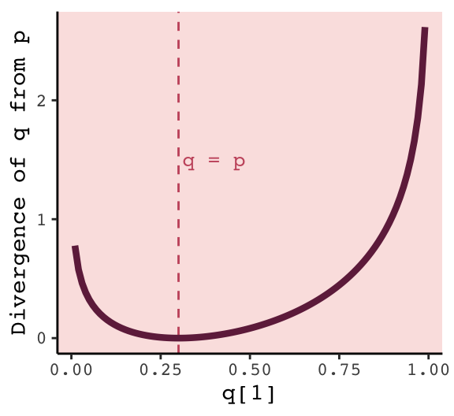

#### Rethinking: Divergence depends upon direction.

Here we see $H(p, q) \neq H(q, p)$. That is, direction matters.


```r
tibble(direction = c("Earth to Mars", "Mars to Earth"),
       p_1    = c(.01, .7),
       q_1    = c(.7, .01)) %>% 
  mutate(p_2  = 1 - p_1,
         q_2  = 1 - q_1) %>%
  mutate(d_kl = (p_1 * log(p_1 / q_1)) + (p_2 * log(p_2 / q_2)))
```

```
## # A tibble: 2 x 6
##   direction       p_1   q_1   p_2   q_2  d_kl
##   <chr>         <dbl> <dbl> <dbl> <dbl> <dbl>
## 1 Earth to Mars  0.01  0.7   0.99  0.3   1.14
## 2 Mars to Earth  0.7   0.01  0.3   0.99  2.62
```

The $D_{\text{KL}}$ was double when applying Martian estimates to Terran estimates.

### From divergence to deviance.

> The point of all the preceding material about information theory and divergence is to establish both:
>
> 1. How to measure the distance of a model from our target. Information theory gives us the distance measure we need, the K-L divergence.
>
> 2. How to estimate the divergence. Having identified the right measure of distance, we now need a way to estimate it in real statistical modeling tasks. (p. 181)

Now we'll start working on item #2.

We define deviance as:

$$D(q) = -2 \sum_i \text{log}(p_i)$$

In the formula, $i$ indexes each case and $q_i$ is the likelihood for each case. Here's the deviance from model `b6.1`.


```r
lm(data = d,
   brain ~ mass) %>% 
  logLik() * -2
```

```
## 'log Lik.' 94.92499 (df=3)
```

#### Overthinking: Computing deviance.

To follow along with the text, we’ll need to standardize `mass` before we compute deviance.


```r
d <-
  d %>%
  mutate(mass_s = (mass - mean(mass)) / sd(mass))
```

Open brms.


```r
library(brms)
```

Now we’ll specify the initial values and fit the model.


```r
# Here we specify our starting values
inits <- list(Intercept = mean(d$brain),
              mass_s    = 0,
              sigma     = sd(d$brain))

inits_list <- list(inits, inits, inits, inits)

# The model
b6.8 <- 
  brm(data = d, family = gaussian,
      brain ~ 1 + mass_s,
      prior = c(prior(normal(0, 1000), class = Intercept),
                prior(normal(0, 1000), class = b),
                prior(cauchy(0, 10), class = sigma)),
      iter = 2000, warmup = 1000, chains = 4, cores = 4,
      inits = inits_list,  # here we insert our start values
      seed = 6)
```


```r
print(b6.8)
```

```
##  Family: gaussian 
##   Links: mu = identity; sigma = identity 
## Formula: brain ~ 1 + mass_s 
##    Data: d (Number of observations: 7) 
## Samples: 4 chains, each with iter = 2000; warmup = 1000; thin = 1;
##          total post-warmup samples = 4000
## 
## Population-Level Effects: 
##           Estimate Est.Error l-95% CI u-95% CI Eff.Sample Rhat
## Intercept   709.49    105.07   502.06   922.93       2804 1.00
## mass_s      220.64    109.71    -0.21   439.82       2893 1.00
## 
## Family Specific Parameters: 
##       Estimate Est.Error l-95% CI u-95% CI Eff.Sample Rhat
## sigma   263.87     94.86   148.87   495.15       1746 1.00
## 
## Samples were drawn using sampling(NUTS). For each parameter, Eff.Sample 
## is a crude measure of effective sample size, and Rhat is the potential 
## scale reduction factor on split chains (at convergence, Rhat = 1).
```

**Details about `inits`**: You don’t have to specify your `inits` lists outside of the `brm()` function the way we did, here. This is just how I currently prefer. When you specify start values for the parameters in your Stan models, you need to do so with a list of lists. You need as many lists as HMC chains--four in this example. And then you put your--in this case--four lists inside a list. Lists within lists. Also, we were lazy and specified the same start values across all our chains. You can mix them up across chains if you want.

Anyway, the brms function `log_lik()` returns a matrix. Each occasion gets a column and each HMC chain iteration gets a row. To make it easier to understand the output, we'll name the columns by `species` using the [`.name_repair` argument](https://tibble.tidyverse.org/reference/name-repair.html) within the `as_tibble()` function. 


```r
ll <-
  b6.8 %>%
  log_lik() %>%
  as_tibble(.name_repair = ~ d$species)

ll %>%
  glimpse()
```

```
## Observations: 4,000
## Variables: 7
## $ afarensis   <dbl> -6.533346, -7.364236, -6.354499, -6.591231, -6.198465, -6.605723, -6.428844, …
## $ africanus   <dbl> -6.529212, -7.318601, -6.380887, -6.501201, -6.204924, -6.630343, -6.489288, …
## $ habilis     <dbl> -6.684437, -7.078882, -6.924421, -6.465999, -6.729976, -6.965095, -7.075861, …
## $ boisei      <dbl> -6.543591, -7.261918, -6.397131, -6.604107, -6.196515, -6.603495, -6.416063, …
## $ rudolfensis <dbl> -6.947669, -7.070620, -7.095121, -6.729509, -6.196600, -6.611958, -6.591881, …
## $ ergaster    <dbl> -7.387421, -7.009474, -7.415504, -6.694015, -6.203039, -6.609322, -6.669332, …
## $ sapiens     <dbl> -11.396992, -7.490887, -7.742427, -8.074139, -11.303673, -8.671387, -8.576077…
```

Deviance is the sum of the occasion-level LLs multiplied by -2. Why by -2? "The -2 in front doesn't do anything important. It's there for historical reasons" (p. 182). If you follow footnote 93 at the end of that sentence in the text, you'll learn "under somewhat general conditions, for many common model types, a difference between two deviances has a chi-squared distribution. The factor of 2 is there to scale it that way" (p. 451).


```r
ll <-
  ll %>%
  mutate(sums     = rowSums(.),
         deviance = -2 * sums)
```

Because we used HMC, deviance is a distribution rather than a single number.


```r
library(tidybayes)

ll %>%
  ggplot(aes(x = deviance, y = 0)) +
  geom_halfeyeh(fill = carto_pal(7, "BurgYl")[5], color = carto_pal(7, "BurgYl")[7],
                point_interval = median_qi, .width = .95) +
  scale_x_continuous(breaks = quantile(ll$deviance, c(.025, .5, .975)),
                     labels = quantile(ll$deviance, c(.025, .5, .975)) %>% round(1)) +
  scale_y_continuous(NULL, breaks = NULL) +
  labs(title = "The deviance distribution") +
  theme_classic() +
  theme(text = element_text(family = "Courier"),
        panel.background = element_rect(fill = alpha(carto_pal(7, "BurgYl")[3], 1/4)))
```

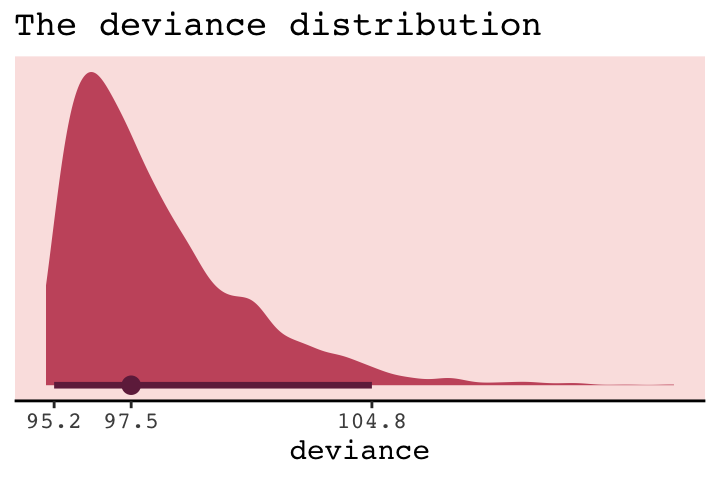

But notice our deviance distribution was centered right around the sole value McElreath reported in the text.

### From deviance to out-of-sample.

> Deviance is a principled way to measure distance from the target. But deviance as computed in the previous section has the same flaw as $R^2$: It always improves as the model gets more complex, at least for the types of models we have considered so far. Just like $R^2$, deviance in-sample is a measure of retrodictive accuracy, not predictive accuracy.

In the next subsection, we'll see this in a simulation.

#### Overthinking: Simulated training and testing.

I find the `rethinking::sim.train.test()` function opaque. If you're curious, you can find McElreath's code [here](https://github.com/rmcelreath/rethinking/blob/a309712d904d1db7af1e08a76c521ab994006fd5/R/sim_train_test.R). Let's simulate and see what happens.


```r
library(rethinking)

n       <- 20
kseq    <- 1:5
# I've reduced this number by one order of magnitude to reduce computation time
n_sim   <- 1e3
n_cores <- 4

# here's our dev object based on `N <- 20`
dev_20 <-
  sapply(kseq, function(k) {
    print(k);
    r <- mcreplicate(n_sim, sim.train.test(N = n, k = k),
                     mc.cores = n_cores);
    c(mean(r[1, ]), mean(r[2, ]), sd(r[1, ]), sd(r[2, ]))
    })

# here's our dev object based on N <- 100
n       <- 100
dev_100 <- 
  sapply(kseq, function(k) {
    print(k);
    r <- mcreplicate(n_sim, sim.train.test(N = n, k = k), 
                     mc.cores = n_cores);
    c(mean(r[1, ]), mean(r[2, ]), sd(r[1, ]), sd(r[2, ]))
    })
```


If you didn't quite catch it, the simulation yields `dev_20` and `dev_100`. We'll want to convert them to tibbles, bind them together, and wrangle extensively before we're ready to plot.


```r
dev_tibble <-
  dev_20 %>% 
  as_tibble() %>% 
  bind_rows(
    dev_100 %>%
      as_tibble()
  ) %>% 
  mutate(n         = rep(c("n = 20", "n = 100"), each = 4),
         statistic = rep(c("mean", "sd"), each = 2) %>% rep(., times = 2),
         sample    = rep(c("in", "out"), times = 2) %>% rep(., times = 2)) %>% 
  gather(n_par, value, -n, -statistic, -sample) %>% 
  spread(key = statistic, value = value) %>% 
  mutate(n     = factor(n, levels = c("n = 20", "n = 100")),
         n_par = str_remove(n_par, "V") %>% as.double()) %>% 
  mutate(n_par = ifelse(sample == "in", n_par - .075, n_par + .075))

head(dev_tibble)
```

```
## # A tibble: 6 x 5
##   n       sample n_par  mean    sd
##   <fct>   <chr>  <dbl> <dbl> <dbl>
## 1 n = 100 in     0.925  283.  14.1
## 2 n = 100 in     1.92   279.  13.9
## 3 n = 100 in     2.92   263.  11.1
## 4 n = 100 in     3.92   263.  11.2
## 5 n = 100 in     4.92   262.  11.2
## 6 n = 100 out    1.08   285.  14.4
```

Now we're ready to make Figure 6.7.


```r
# this intermediary tibble will make `geom_text()` easier
dev_text <-
  dev_tibble %>% 
  filter(n_par > 1.5, 
         n_par < 2.5) %>% 
  mutate(n_par = ifelse(sample == "in", n_par - .2, n_par + .28))
  
# the plot
dev_tibble %>% 
  ggplot(aes(x     = n_par, y = mean,
             ymin  = mean - sd, ymax = mean + sd,
             group = sample,
             color = sample, 
             fill  = sample)) +
  geom_pointrange(shape = 21) +
  geom_text(data = dev_text,
            aes(label = sample)) +
  scale_color_manual(values = c(carto_pal(7, "BurgYl")[7], carto_pal(7, "BurgYl")[5])) +
  scale_fill_manual(values  = c(carto_pal(7, "BurgYl")[5], carto_pal(7, "BurgYl")[7])) +
  labs(x = "number of parameters",
       y = "deviance") +
  theme_classic() +
  theme(text             = element_text(family = "Courier"),
        legend.position  = "none",
        strip.background = element_rect(fill = alpha(carto_pal(7, "BurgYl")[1], 1/4), color = "white"),
        panel.background = element_rect(fill = alpha(carto_pal(7, "BurgYl")[3], 1/4))) +
  facet_wrap(~n, scale = "free_y")
```

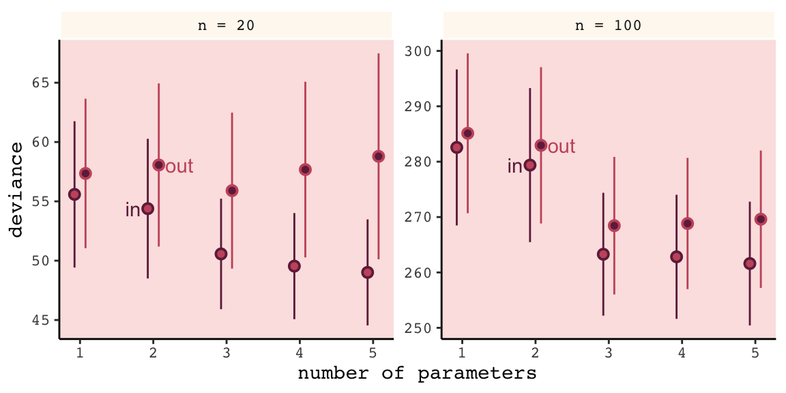

Even with a substantially smaller $N$, our simulation results matched up well with those in the text.

## Regularization

> The root of overfitting is a model's tendency to get overexcited by the training sample... One way to prevent a model from getting too excited by the training sample is to give it a skeptical prior. By "skeptical," I mean a prior that slows the rate of learning from the sample. (p. 186)

In case you were curious, here's how you might do Figure 6.8 with ggplot2. All the action is in the `geom_ribbon()` portions.


```r
tibble(x = seq(from = - 3.5, 
               to   = 3.5, 
               by   = .01)) %>%
  
  ggplot(aes(x = x, ymin = 0)) +
  geom_ribbon(aes(ymax = dnorm(x, mean = 0, sd = 0.2)), 
              fill = carto_pal(7, "BurgYl")[7], alpha = 1/2) +
  geom_ribbon(aes(ymax = dnorm(x, mean = 0, sd = 0.5)), 
              fill = carto_pal(7, "BurgYl")[6], alpha = 1/2) +
  geom_ribbon(aes(ymax = dnorm(x, mean = 0, sd = 1)), 
              fill = carto_pal(7, "BurgYl")[5], alpha = 1/2) +
  scale_y_continuous(NULL, breaks = NULL) +
  xlab("parameter value") +
  coord_cartesian(xlim = c(-3, 3)) +
  theme_classic() +
  theme(text = element_text(family = "Courier"),
        panel.background = element_rect(fill = alpha(carto_pal(7, "BurgYl")[3], 1/4)))
```

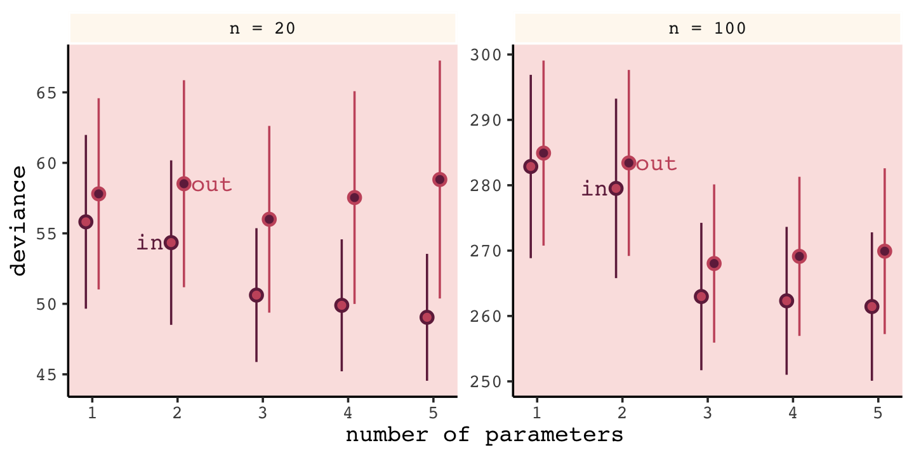

In our version of the plot, darker purple = more regularizing.

But to prepare for Figure 6.9, let's simulate. This time we'll wrap the basic simulation code we used before into a function we'll call `make_sim()`. Our `make_sim()` function has two parameters, `N` and `b_sigma`, both of which come from McElreath's simulation code. So you'll note that instead of hard coding the values for `N` and `b_sigma` within the simulation, we're leaving them adjustable (i.e., `sim.train.test(N = n, k = k, b_sigma = b_sigma)`). Also notice that instead of saving the simulation results as objects, like before, we're just converting them to tibbles with the `as_tibble()` function at the bottom. Our goal is to use `make_sim()` within a `purrr::map2()` statement. The result will be a nested tibble into which we've saved the results of 6 simulations based off of two sample sizes (i.e., `n = c(20, 100)`) and three values of $\sigma$ for our Gaussian $\beta$ prior (i.e., `b_sigma = c(1, .5, .2)`).


```r
library(rethinking)

# I've reduced this number by one order of magnitude to reduce computation time
n_sim <- 1e3

make_sim <- function(n, b_sigma){
  sapply(kseq, function(k) {
    print(k);
    # this is an augmented line of code
    r <- mcreplicate(n_sim, sim.train.test(N = n, k = k, b_sigma = b_sigma),
                     mc.cores = n_cores);
    c(mean(r[1, ]), mean(r[2, ]), sd(r[1, ]), sd(r[2, ])) }) %>% 
    
    # this is a new line of code
    as_tibble()
}

s <-
  tibble(n       = rep(c(20, 100), each = 3),
         b_sigma = rep(c(1, .5, .2), times = 2)) %>% 
  mutate(sim     = map2(n, b_sigma, make_sim)) %>% 
  unnest()
```


We'll follow the same principles for wrangling these data as we did those from the previous simulation, `dev_tibble`. And after wrangling, we'll feed the data directly into the code for our version of Figure 6.9.


```r
# wrangle the simulation data
s %>% 
  mutate(statistic = rep(c("mean", "sd"), each = 2) %>% rep(., times = 3 * 2),
         sample    = rep(c("in", "out"), times = 2) %>% rep(., times = 3 * 2)) %>% 
  gather(n_par, value, -n, -b_sigma, -statistic, -sample) %>% 
  spread(key = statistic, value = value) %>% 
  mutate(n     = str_c("n = ", n) %>% factor(., levels = c("n = 20", "n = 100")),
         n_par = str_remove(n_par, "V") %>% as.double())  %>% 
  
  # now plot
  ggplot(aes(x = n_par, y = mean,
             group = interaction(sample, b_sigma))) +
  geom_line(aes(color = sample, size = b_sigma %>% as.character())) +
  # this function contains the data from the previous simulation
  geom_point(data = dev_tibble, 
             aes(group = sample, fill = sample),
             color = "black", shape = 21, size = 2.5, stroke = .1) +
  scale_fill_manual(values = c(carto_pal(7, "BurgYl")[7], carto_pal(7, "BurgYl")[5])) +
  scale_color_manual(values = c(carto_pal(7, "BurgYl")[7], carto_pal(7, "BurgYl")[5])) +
  scale_size_manual(values = c(1, .5, .2)) +
  labs(x = "number of parameters",
       y = "deviance") +
  theme_classic() +
  theme(text             = element_text(family = "Courier"),
        legend.position  = "none",
        strip.background = element_rect(fill = alpha(carto_pal(7, "BurgYl")[1], 1/4), color = "white"),
        panel.background = element_rect(fill = alpha(carto_pal(7, "BurgYl")[3], 1/4))) +
  facet_wrap(~n, scale = "free_y")
```

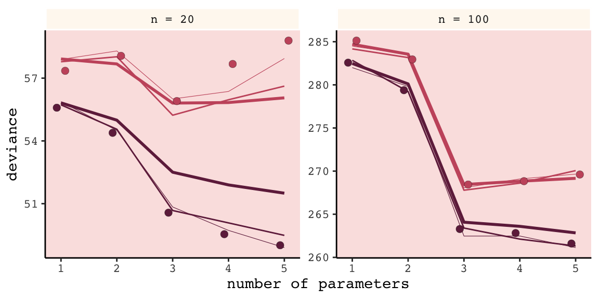

Our results don’t perfectly align with those in the text. I suspect his is because we used `1e3` iterations, rather than the `1e4` of the text. If you’d like to wait all night long for the simulation to yield more stable results, be my guest.

> Regularizing priors are great, because they reduce overfitting. But if they are too skeptical, they prevent the model from learning from the data. So to use them effectively, you need some way to tune them. Tuning them isn't always easy. (p. 187)

For more on this how to choose your priors, consider Gelman, Simpson, and Betancourt's [*The prior can generally only be understood in the context of the likelihood*](https://arxiv.org/abs/1708.07487), a paper that will probably make more sense after Chapter 8. And if you’re feeling feisty, also check out Simpson’s related blog post [*(It’s never a) Total Eclipse of the Prior*](http://andrewgelman.com/2017/09/05/never-total-eclipse-prior/).

#### Rethinking: Ridge regression.

Within the brms framework, you can do something like this with the horseshoe prior via the `horseshoe()` function. You can learn all about it from the `horseshoe` section of the [brms reference manual (version 2.8.0)](https://cran.r-project.org/web/packages/brms/brms.pdf). Here's an extract from the section:

> The horseshoe prior is a special shrinkage prior initially proposed by [Carvalho et al. (2009)](http://proceedings.mlr.press/v5/carvalho09a/carvalho09a.pdf). It is symmetric around zero with fat tails and an infinitely large spike at zero. This makes it ideal for sparse models that have many regression coefficients, although only a minority of them is non- zero. The horseshoe prior can be applied on all population-level effects at once (excluding the intercept) by using `set_prior("horseshoe(1)")`. (p. 70)

And to dive even deeper into the horseshoe prior, check out Michael Betancourt's tutorial, [*Bayes Sparse Regression*](https://betanalpha.github.io/assets/case_studies/bayes_sparse_regression.html#35_the_horseshoe).

## Information criteria

The data from our initial simulation isn't formatted well to plot Figure 6.10. We'll have to wrangle a little.


```r
(
  dev_tibble <-
  dev_tibble %>% 
  select(-sd) %>% 
  mutate(n_par  = ifelse(sample == "in", n_par + .075, n_par - .075)) %>% 
  spread(key = sample, value = mean) %>% 
  mutate(height = (out - `in`) %>% round(digits = 1) %>% as.character(),
         dash   = `in` + 2 * n_par)
)
```

```
## # A tibble: 10 x 6
##    n       n_par  `in`   out height  dash
##    <fct>   <dbl> <dbl> <dbl> <chr>  <dbl>
##  1 n = 20      1  55.6  57.4 1.8     57.6
##  2 n = 20      2  54.4  58.1 3.7     58.4
##  3 n = 20      3  50.6  55.9 5.3     56.6
##  4 n = 20      4  49.5  57.7 8.1     57.5
##  5 n = 20      5  49.0  58.8 9.8     59.0
##  6 n = 100     1 283.  285.  2.6    285. 
##  7 n = 100     2 279.  283.  3.6    283. 
##  8 n = 100     3 263.  268.  5.2    269. 
##  9 n = 100     4 263.  269.  6      271. 
## 10 n = 100     5 262.  270.  8      272.
```

Now we're ready to plot.


```r
dev_tibble  %>% 
  ggplot(aes(x = n_par)) +
  geom_line(aes(y = dash),
            linetype = 2, color = carto_pal(7, "BurgYl")[5]) +
  geom_point(aes(y = `in`),
             color = carto_pal(7, "BurgYl")[7], size = 2) +
  geom_point(aes(y = out),
             color = carto_pal(7, "BurgYl")[5], size = 2) +
  geom_errorbar(aes(x = n_par + .15,
                    ymin = `in`, ymax = out),
                width = .1, color = carto_pal(7, "BurgYl")[6]) +
  geom_text(aes(x = n_par + .4,
                y = (out + `in`) / 2,
                label = height),
            family = "Courier", size = 3, color = carto_pal(7, "BurgYl")[6]) +
  labs(x = "number of parameters",
       y = "deviance") +
  theme_classic() +
  theme(text             = element_text(family = "Courier"),
        strip.background = element_rect(fill = alpha(carto_pal(7, "BurgYl")[1], 1/4), color = "white"),
        panel.background = element_rect(fill = alpha(carto_pal(7, "BurgYl")[3], 1/4))) +
  facet_wrap(~n, scale = "free_y")
```

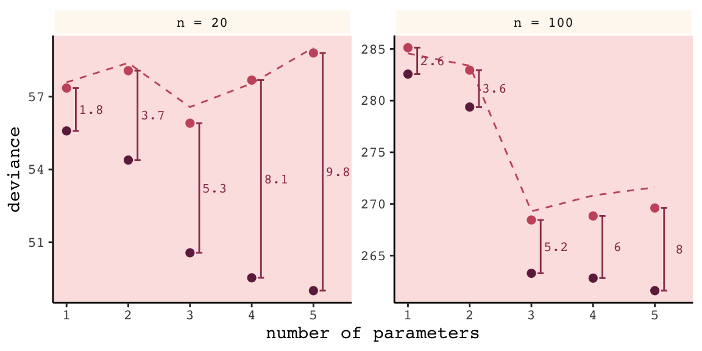

Again, our numbers aren't the exact same as McElreath's because a) this is a simulation and b) our number of simulations was an order of magnitude smaller than his. But the overall pattern is the same. More to the point, the distances between the in- and out-of-sample points 

> are nearly the same, for each model, at both $N = 20$ (left) and $N = 100$ (right). Each distance is nearly twice the number of parameters, as labeled on the horizontal axis. The dashed lines show exactly the [dark purple] points plus twice the number of parameters, tracing closely along the average out-of-sample deviance for each model.
>
> This is the phenomenon behind information criteria. (p. 189)

In the text, McElreach focused on the DIC and WAIC. As you'll see, the LOO has increased in popularity since he published the text. Going forward, we’ll juggle the WAIC and the LOO in this project. But we will respect the text and work in a little DIC talk.

### DIC.

The DIC has been widely used for some time, now. For a great talk on the DIC, check out the authoritative David Spiegelhalter's [*Retrospective read paper: Bayesian measure of model complexity and fit*](https://www.youtube.com/watch?v=H-59eqmHuuQ&frags=pl%2Cwn). If we define $D$ as the deviance's posterior distribution, $\bar{D}$ as its mean and $\hat{D}$ as the deviance when computed at the posterior mean, then we define the DIC as

$$\text{DIC} = \bar{D} + (\bar{D} + \hat{D}) + \bar{D} + p_D$$

And $p_D$ is the number of effective parameters in the model, which is also sometimes referred to as the penalty term. As you'll see, you can get the $p_D$ for `brms::brm()` models. However, I'm not aware of a way to that brms or the loo package--to be introduced shortly--offer convenience functions that yield the DIC.

### WAIC.

It's okay that the brms and loo packages don't yield the DIC because 

> even better than the DIC is the Widely Applicable Information Criterion (WAIC)...
>
> Define $\text{Pr} (y_i)$ as the average likelihood of observation $i$ in the training sample. This means we compute the likelihood of $y_i$ for each set of parameters sampled from the posterior distribution. Then we average the likelihoods for each observation $i$ and finally sum over all observations. This produces the first part of WAIC, the log-pointwise-predictive-density, lppd:
>
> $$\text{lppd} = \sum_{i = 1}^N \text{log Pr} (y_i)$$
>
> You might say this out loud as:
>
>> *The log-pointwise-predictive-density is the total across observations of the logarithm of the average likelihood of each observation.*
>
>... The second piece of WAIC is the effect number of parameters $p_{\text{WAIC}}$. Define $V(y_i)$ as the variance in log-likelihood for observation $i$ in the training sample. This means we compute the log-likelihood for observation $y_i$ for each sample from the posterior distribution. Then we take the variance of those values. This is $V(y_i)$. Now $p_{\text{WAIC}}$ is defined as:
> 
> $$p_{\text{WAIC}} = \sum_{i=1}^N V (y_i)$$
>
> Now WAIC is defined as:
>
> $$\text{WAIC} = -2 (\text{lppd} - p_{\text{WAIC}})$$
>
> And this value is yet another estimate of out-of-sample deviance. (pp. 191--192)

You'll see how to compute the WAIC in brms in just a bit.

#### Overthinking: WAIC calculation. 

Here is how to fit the pre-WAIC model in brms.


```r
data(cars)

b <- 
  brm(data = cars, family = gaussian,
      dist ~ 1 + speed,
      prior = c(prior(normal(0, 100), class = Intercept),
                prior(normal(0, 10), class = b),
                prior(uniform(0, 30), class = sigma)),
      iter = 2000, warmup = 1000, chains = 4, cores = 4,
      seed = 6)
```

Here's the summary.


```r
print(b)
```

```
##  Family: gaussian 
##   Links: mu = identity; sigma = identity 
## Formula: dist ~ 1 + speed 
##    Data: cars (Number of observations: 50) 
## Samples: 4 chains, each with iter = 2000; warmup = 1000; thin = 1;
##          total post-warmup samples = 4000
## 
## Population-Level Effects: 
##           Estimate Est.Error l-95% CI u-95% CI Eff.Sample Rhat
## Intercept   -17.40      7.07   -30.97    -3.67       1920 1.00
## speed         3.92      0.44     3.07     4.75       1783 1.00
## 
## Family Specific Parameters: 
##       Estimate Est.Error l-95% CI u-95% CI Eff.Sample Rhat
## sigma    15.83      1.69    12.98    19.47       2068 1.00
## 
## Samples were drawn using sampling(NUTS). For each parameter, Eff.Sample 
## is a crude measure of effective sample size, and Rhat is the potential 
## scale reduction factor on split chains (at convergence, Rhat = 1).
```

In brms, you return the loglikelihood with `log_lik()`.


```r
ll <-
  b %>%
  log_lik() %>%
  as_tibble()
```

Computing the lppd, the "Bayesian deviance", takes a bit of leg work.


```r
dfmean <-
  ll %>%
  exp() %>%
  summarise_all(mean) %>%
  gather(key, means) %>%
  select(means) %>%
  log()

(
  lppd <-
  dfmean %>%
  sum()
)
```

```
## [1] -206.6836
```

Comupting the effective number of parameters, $p_{\text{WAIC}}$, isn't much better.


```r
dfvar <-
  ll %>%
  summarise_all(var) %>%
  gather(key, vars) %>%
  select(vars) 

pwaic <-
  dfvar %>%
  sum()

pwaic
```

```
## [1] 3.418859
```

Finally, here's what we've been working so hard for: our hand calculated WAIC value. Compare it to the value returned by the brms `waic()` function.


```r
-2 * (lppd - pwaic)
```

```
## [1] 420.205
```

```r
waic(b)
```

```
## 
## Computed from 4000 by 50 log-likelihood matrix
## 
##           Estimate   SE
## elpd_waic   -210.1  6.4
## p_waic         3.4  1.2
## waic         420.2 12.7
```

Before we move on, did you notice the `elpd_waic` row in the tibble `waic()` returned? That value is the `lppd` minus the `pwaic`, but without multiplying the result by -2. E.g., 


```r
lppd - pwaic
```

```
## [1] -210.1025
```

That tidbit will come in handy a little bit later. But for now, here's how we compute the WAIC standard error.


```r
dfmean %>%
  mutate(waic_vec   = -2 * (means - dfvar$vars)) %>%
  summarise(waic_se = (var(waic_vec) * nrow(dfmean)) %>% sqrt())
```

```
## # A tibble: 1 x 1
##   waic_se
##     <dbl>
## 1    12.7
```

### DIC and WAIC as estimates of deviance.

Once again, we'll wrap McElreath's `sim.train.test()`-based simulation code within a custom function, `make_sim()`. This time we've adjusted `make_sim()` to take one argument, `b_sigma`. We will then feed that value into the same-named argument within `sim.train.test()`. Also notice that within `sim.train.test()`, we've specified `TRUE` for the information criteria and deviance arguments. Be warned: it takes extra time to compute the WAIC. Because we do that for every model, this simulation takes longer than the previous ones. To get a taste, try running it with something like `n_sim <- 5` first.


```r
n_sim <- 1e3

make_sim <- function(b_sigma){
  sapply(kseq, function(k) {
    print(k);
    r <- mcreplicate(n_sim, 
                     sim.train.test(N         = 20,
                                    k         = k,
                                    b_sigma   = b_sigma,
                                    DIC       = T,
                                    WAIC      = T, 
                                    devbar    = T, 
                                    devbarout = T),
                     mc.cores = n_cores);
    
    c(dev_in    = mean(r[1, ]),
      dev_out   = mean(r[2, ]),
      DIC       = mean(r[3, ]), 
      WAIC      = mean(r[4, ]), 
      devbar    = mean(r[5, ]), 
      devbarout = mean(r[6, ])) 
  }
  ) %>% 
    data.frame() %>% 
    rownames_to_column() %>% 
    rename(statistic = rowname)
}

s <-
  tibble(b_sigma = c(100, .5)) %>% 
  mutate(sim = purrr::map(b_sigma, make_sim)) %>% 
  unnest()
```


Here we wrangle and plot.


```r
s %>% 
  gather(n_par, value, -b_sigma, -statistic) %>% 
  mutate(n_par = str_remove(n_par, "X") %>% as.double()) %>% 
  filter(statistic != "devbar" & statistic != "devbarout") %>% 
  spread(key = statistic, value = value) %>% 
  gather(ic, value, -b_sigma, -n_par, -dev_in, -dev_out) %>% 
  gather(sample, deviance, -b_sigma, -n_par, -ic, -value) %>% 
  filter(sample == "dev_out") %>% 
  mutate(b_sigma = b_sigma %>% as.character()) %>% 
  
  ggplot(aes(x = n_par)) +
  geom_point(aes(y = deviance, color = b_sigma),
             size = 2.5) +
  geom_line(aes(y = value, group = b_sigma, color = b_sigma)) +
  scale_color_manual(values = c(carto_pal(7, "BurgYl")[7], carto_pal(7, "BurgYl")[5])) +
  # scale_color_manual(values = c("steelblue", "black")) +
  labs(subtitle = "n = 20",
       x = "number of parameters",
       y = "deviance") +
  theme_classic() +
  theme(text             = element_text(family = "Courier"),
        strip.background = element_rect(fill = alpha(carto_pal(7, "BurgYl")[1], 1/4), color = "white"),
        panel.background = element_rect(fill = alpha(carto_pal(7, "BurgYl")[3], 1/4)),
        legend.position  = "none") +
  facet_wrap(~ic, ncol = 1)
```

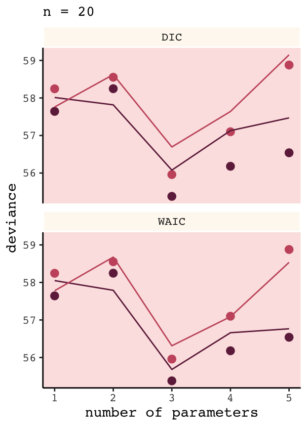

And again, our results don’t perfectly match those in the text because a) we’re simulating and b) we used fewer iterations than McElreath did. But the overall pattern remains.

## Using information criteria

In contrast to model selection, "this section provides a brief example of model *comparison* and *averaging*" (p. 195, *emphasis* in the original).

### Model comparison. 

Load the `milk` data from earlier in the text.


```r
library(rethinking)
data(milk)

d <- 
  milk %>%
  drop_na(ends_with("_s"))
rm(milk)

d <-
  d %>%
  mutate(neocortex = neocortex.perc / 100)
```

The dimensions of `d` are:


```r
dim(d)
```

```
## [1] 17  9
```

Load brms.


```r
detach(package:rethinking, unload = T)
library(brms)
```

We're ready to fit the competing `kcal.per.g` models. Note our use of `update()` in the last two models.


```r
inits <- list(Intercept = mean(d$kcal.per.g),
              sigma     = sd(d$kcal.per.g))

inits_list <-list(inits, inits, inits, inits)

b6.11 <- 
  brm(data = d, family = gaussian,
      kcal.per.g ~ 1,
      prior = c(prior(uniform(-1000, 1000), class = Intercept),
                prior(uniform(0, 100), class = sigma)),
      iter = 2000, warmup = 1000, chains = 4, cores = 4,
      inits = inits_list,
      seed = 6)

inits <- list(Intercept = mean(d$kcal.per.g),
              neocortex = 0,
              sigma     = sd(d$kcal.per.g))
inits_list <-list(inits, inits, inits, inits)

b6.12 <- 
  brm(data = d, family = gaussian,
      kcal.per.g ~ 1 + neocortex,
      prior = c(prior(uniform(-1000, 1000), class = Intercept),
                prior(uniform(-1000, 1000), class = b),
                prior(uniform(0, 100), class = sigma)),
      iter = 2000, warmup = 1000, chains = 4, cores = 4,
      inits = inits_list,
      seed = 6)

inits <- list(Intercept   = mean(d$kcal.per.g),
              `log(mass)` = 0,
              sigma       = sd(d$kcal.per.g))
inits_list <-list(inits, inits, inits, inits)

b6.13 <-
  update(b6.12, 
         newdata = d,
         formula = kcal.per.g ~ 1 + log(mass),
         inits   = inits_list)

inits <- list(Intercept   = mean(d$kcal.per.g),
              neocortex   = 0,
              `log(mass)` = 0,
              sigma       = sd(d$kcal.per.g))
inits_list <-list(inits, inits, inits, inits)

b6.14 <- 
  update(b6.13, 
         newdata = d,
         formula = kcal.per.g ~ 1 + neocortex + log(mass),
         inits   = inits_list)
```

#### Comparing WAIC values.

In brms, you can get a model's WAIC value with the `waic()` function.


```r
waic(b6.14)
```

```
## 
## Computed from 4000 by 17 log-likelihood matrix
## 
##           Estimate  SE
## elpd_waic      8.3 2.6
## p_waic         3.2 0.9
## waic         -16.5 5.2
```

```
## Warning: 2 (11.8%) p_waic estimates greater than 0.4. We recommend trying loo instead.
```

Note the warning message. Statisticians have made notable advances in Bayesian information criteria since McElreath published *Statistical Rethinking*. I won’t go into detail here, but the "We recommend trying loo instead" part of the message is designed to prompt us to use a different information criteria, the Pareto smoothed importance-sampling leave-one-out cross-validation (PSIS-LOO; aka, the LOO).  In brms this is available with the `loo()` function, which you can learn more about in [this vignette](https://cran.r-project.org/web/packages/loo/vignettes/loo2-example.html) from the makers of the [loo package](https://cran.r-project.org/web/packages/loo/index.html). For now, back to the WAIC.

There are a few ways to approach information criteria within the brms framework. If all you want are the quick results for a model, just plug the name of your `brm()` fit object into the `waic()` function.


```r
waic(b6.11)
```

```
## 
## Computed from 4000 by 17 log-likelihood matrix
## 
##           Estimate  SE
## elpd_waic      4.4 1.9
## p_waic         1.3 0.3
## waic          -8.9 3.8
```

The WAIC and its standard error are on the bottom row. The $p_\text{WAIC}$ and its SE are stacked atop that. And look there on the top row. Remember how we pointed out, above, that we get the WAIC by multiplying `(lppd - pwaic)` by -2? Well, if you just do the subtraction without multiplying the result by -2, you get the `elpd_waic`. File that away. It'll become important in a bit.

Following the version 2.8.0 update, part of the suggested workflow for using information criteria with brms (i.e., execute `?loo.brmsfit`) is to add the estimates to the `brm()` fit object itself. You do that with the `add_criterion()` function. Here's how we'd do so with `b6.11`.


```r
b6.11 <- add_criterion(b6.11, "waic")
```

With that in place, here's how you'd extract the WAIC information from the fit object.


```r
b6.11$waic
```

```
## 
## Computed from 4000 by 17 log-likelihood matrix
## 
##           Estimate  SE
## elpd_waic      4.4 1.9
## p_waic         1.3 0.3
## waic          -8.9 3.8
```

*Why would I go through all that trouble?*, you might ask. Well, two reasons. First, now your WAIC information is saved with all the rest of your fit output, which can be convenient. But second, it sets you up to use the `loo_compare()` function to compare models by their information criteria. To get a sense of that workflow, here we use `add_criterion()` for the next three models. Then we’ll use `loo_compare()`.


```r
# compute and save the WAIC information for the next three models
b6.12 <- add_criterion(b6.12, "waic")
b6.13 <- add_criterion(b6.13, "waic")
b6.14 <- add_criterion(b6.14, "waic")

# compare the WAIC estimates
w <- loo_compare(b6.11, b6.12, b6.13, b6.14,
                 criterion = "waic")

print(w)
```

```
##       elpd_diff se_diff
## b6.14  0.0       0.0   
## b6.11 -3.8       2.5   
## b6.13 -3.8       1.8   
## b6.12 -4.7       2.5
```

You don’t have to save those results as an object like we just did with `w`. But that’ll serve some pedagogical purposes in just a bit. So go with it. With respect to the output, notice the `elpd_diff` column and the adjacent `se_diff` column. Those are our WAIC differences. The models have been rank ordered from the lowest (i.e., `b6.14`) to the highest (i.e., `b6.12`). The scores listed are the differences of ` b6.14` minus the comparison model. Since `b6.14` is the comparison model in the top row, the values are naturally 0 (i.e., $x - x = 0$). But now here’s another critical thing to understand: Since the brms version 2.8.0 update, WAIC and LOO differences are no longer reported in the $-2 * x$ metric. Remember how we keep rehearsing that multiplying `(lppd - pwaic)` by -2 is a historic artifact associated with the frequentist chi-square test? We’ll, the makers of the loo package aren’t fans and they no longer support the conversion. 

So here’s the deal. The substantive interpretations of the differences presented in an `elpd_diff` metric will be the same as if presented in a WAIC metric. But if we want to compare our `elpd_diff` results to those in the text, we will have to multiply them by -2. And also, if we want the associated standard error in the proper metric, we'll need to multiply the `se_diff` column by 2. You wouldn't multiply by -2 because that would return a negative standard error, which would be silly. Here's a quick way to do so.


```r
cbind(waic_diff = w[, 1] * -2,
      se        = w[, 2] * 2)
```

```
##       waic_diff       se
## b6.14  0.000000 0.000000
## b6.11  7.657211 5.013383
## b6.13  7.676240 3.599457
## b6.12  9.468233 5.061744
```

One more thing. On page 198, and on many other pages to follow in the text, McElreath used the `rethinking::compare()` function to return a rich table of information about the WAIC information for several models. If we’re tricky, we can do something similar with `loo_compare`. To learn how, let's peer further into the structure of our `w` object. 


```r
str(w)
```

```
##  'compare.loo' num [1:4, 1:8] 0 -3.83 -3.84 -4.73 0 ...
##  - attr(*, "dimnames")=List of 2
##   ..$ : chr [1:4] "b6.14" "b6.11" "b6.13" "b6.12"
##   ..$ : chr [1:8] "elpd_diff" "se_diff" "elpd_waic" "se_elpd_waic" ...
```

When we used `print(w)`, a few code blocks earlier, it only returned two columns. It appears we actually have eight. We can see the full output with the `simplify = F` argument.


```r
print(w, simplify = F)
```

```
##       elpd_diff se_diff elpd_waic se_elpd_waic p_waic se_p_waic waic  se_waic
## b6.14   0.0       0.0     8.3       2.6          3.2    0.9     -16.5   5.2  
## b6.11  -3.8       2.5     4.4       1.9          1.3    0.3      -8.9   3.8  
## b6.13  -3.8       1.8     4.4       2.1          2.0    0.4      -8.9   4.2  
## b6.12  -4.7       2.5     3.5       1.6          2.0    0.3      -7.1   3.2
```

The results are quite analogous to those from `rethinking::compare()`. Again, the difference estimates are in the metric of the $\text{elpd}$. But the interpretation is the same and we can convert them to the traditional information criteria metric with simple multiplication. As we'll see later, this basic workflow applies to the LOO, too.

If you want to get those WAIC weights, you can use the `brms::model_weights()` function like so:


```r
model_weights(b6.11, b6.12, b6.13, b6.14, 
              weights = "waic") %>% 
  round(digits = 2)
```

```
## b6.11 b6.12 b6.13 b6.14 
##  0.02  0.01  0.02  0.96
```

That last `round()` line was just to limit the decimal-place precision. If you really wanted to go through the trouble, you could make yourself a little table like this:


```r
model_weights(b6.11, b6.12, b6.13, b6.14, 
              weights = "waic") %>%
  as_tibble() %>% 
  rename(weight = value) %>% 
  mutate(model  = c("b6.11", "b6.12", "b6.13", "b6.14"),
         weight = weight %>% round(digits = 2)) %>% 
  select(model, weight) %>% 
  arrange(desc(weight)) %>% 
  knitr::kable()
```


model    weight
------  -------
b6.14      0.96
b6.11      0.02
b6.13      0.02
b6.12      0.01

With a little `[]` subsetting and light wrangling, we can convert the contents of our `w` object to a format suitable for plotting the WAIC estimates.


```r
w[, 7:8] %>% 
  data.frame() %>% 
  rownames_to_column(var = "model_name") %>% 
  
  ggplot(aes(x    = model_name, 
             y    = waic, 
             ymin = waic - se_waic, 
             ymax = waic + se_waic)) +
  geom_pointrange(shape = 21, color = carto_pal(7, "BurgYl")[7], fill = carto_pal(7, "BurgYl")[5]) +
  coord_flip() +
  labs(x = NULL, y = NULL,
       title = "My custom WAIC plot") +
  theme_classic() +
  theme(text             = element_text(family = "Courier"),
        axis.ticks.y     = element_blank(),
        panel.background = element_rect(fill = alpha(carto_pal(7, "BurgYl")[3], 1/4)))
```

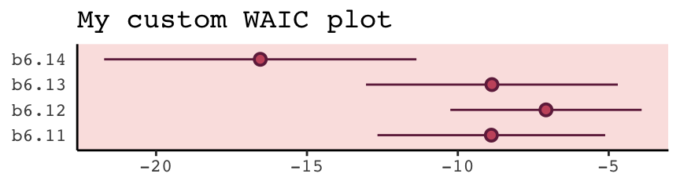

We briefly discussed the alternative information criteria, the LOO, above. Here’s how to use it in brms.


```r
loo(b6.11)
```

```
## 
## Computed from 4000 by 17 log-likelihood matrix
## 
##          Estimate  SE
## elpd_loo      4.4 1.9
## p_loo         1.3 0.3
## looic        -8.8 3.8
## ------
## Monte Carlo SE of elpd_loo is 0.0.
## 
## Pareto k diagnostic values:
##                          Count Pct.    Min. n_eff
## (-Inf, 0.5]   (good)     16    94.1%   3013      
##  (0.5, 0.7]   (ok)        1     5.9%   2041      
##    (0.7, 1]   (bad)       0     0.0%   <NA>      
##    (1, Inf)   (very bad)  0     0.0%   <NA>      
## 
## All Pareto k estimates are ok (k < 0.7).
## See help('pareto-k-diagnostic') for details.
```

The Pareto $k$ values are a useful model fit diagnostic tool, which we’ll discuss later. But for now, realize that brms uses functions from the [loo package](https://cran.r-project.org/web/packages/loo/index.html) to compute its WAIC and LOO values. In addition to the vignette, above, [this vignette](https://cran.r-project.org/web/packages/loo/vignettes/loo2-weights.html) demonstrates the LOO with these very same examples from McElreath's text. And if you'd like to dive a little deeper, check out [Aki Vehtari's GPSS2017 workshop](https://www.youtube.com/watch?v=8_Su5Qo49Dg&t) or his talk from November 2018, [*Model assessment, selection and averaging*](https://www.youtube.com/watch?v=Re-2yVd0Mqk).

Let's get back on track with the text. To put all this model comparison in perspective, 

> in this analysis, the best model has more than 90% of the model weight. That's pretty good. But with only 12 cases, the error on the WAIC estimate is substantial, and of course that uncertainty should propagate to the Akaike weights. So don't get too excited. If we take the standard error of the difference from the [`loo_compare()`] table literally, you can think of the difference as a Gaussian distribution centered (for the difference between models [`b6.14` and `b6.11`]) on [9.47] with a standard deviation of [5.06]. (p. 200)

Here are those two values in the $\text{elpd}$ metric.


```r
w[4, 1:2]
```

```
## elpd_diff   se_diff 
## -4.734116  2.530872
```

And here we convert them to the WAIC metric.


```r
round(w[4, 1] * -2, 2)
```

```
## [1] 9.47
```

```r
round(w[4, 2] * 2, 2)
```

```
## [1] 5.06
```

If it's easier to see, here's the same information in a tibble.


```r
tibble(value             = c("difference", "se"),
       elpd              = w[4, 1:2],
       conversion_factor = c(-2, 2)) %>% 
  mutate(waic            = elpd * conversion_factor)
```

```
## # A tibble: 2 x 4
##   value       elpd conversion_factor  waic
##   <chr>      <dbl>             <dbl> <dbl>
## 1 difference -4.73                -2  9.47
## 2 se          2.53                 2  5.06
```

Before we forget, McElreath gave some perspective difference between the models with the highest and lowest WAIC values (p. 200).

But to the point, we can extract the two numerals and plug them into `rnorm()`.


```r
# how many draws would you like?
n <- 1e5

set.seed(6)

# simulate
diff <-
  tibble(diff = rnorm(n, 
                      mean = w[4, 1] * -2, 
                      sd   = w[4, 2] *  2))

diff %>% 
  summarise(the_probability_a_difference_is_negative = sum(diff < 0) / n)
```

```
## # A tibble: 1 x 1
##   the_probability_a_difference_is_negative
##                                      <dbl>
## 1                                   0.0309
```

In case you're curious, this is a graphic version of what we just did.


```r
tibble(diff = -20:30) %>% 
  ggplot(aes(x = diff, ymin = 0)) +
  geom_ribbon(aes(ymax = dnorm(diff, w[4, 1] * -2, w[4, 2] * 2)),
              fill = carto_pal(7, "BurgYl")[7]) +
  geom_ribbon(data = tibble(diff = -20:0),
              aes(ymax = dnorm(diff, w[4, 1] * -2, w[4, 2] * 2)),
              fill = carto_pal(7, "BurgYl")[5]) + 
  geom_vline(xintercept = 0, linetype = 3,
             color = carto_pal(7, "BurgYl")[3]) +
  scale_y_continuous(NULL, breaks = NULL) +
  theme_classic() +
  theme(text             = element_text(family = "Courier"),
        panel.background = element_rect(fill = alpha(carto_pal(7, "BurgYl")[3], 1/4)))
```

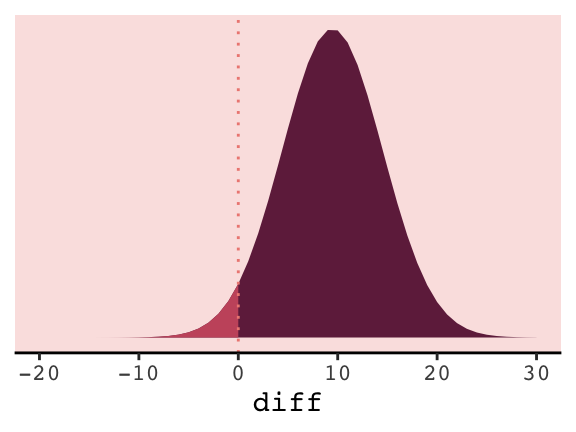

#### Comparing estimates.

The brms package doesn't have anything like rethinking's `coeftab()` function. However, one can get that information with a little ingenuity. Here we'll employ the `broom::tidy()` function, which will save the summary statistics for our model parameters. For example, this is what it will produce for the full model, `b6.14`.


```r
tidy(b6.14)
```

```
##          term     estimate  std.error       lower        upper
## 1 b_Intercept  -1.09554566 0.59579842  -2.0834891  -0.13210946
## 2 b_neocortex   2.80996247 0.92458417   1.2962875   4.33896238
## 3   b_logmass  -0.09679801 0.02814521  -0.1412482  -0.05140763
## 4       sigma   0.13984670 0.02999699   0.0996455   0.19499069
## 5        lp__ -19.24006410 1.60889794 -22.3871835 -17.33233588
```

Note, `tidy()` also grabs the log posterior (i.e., `lp__`), which we'll exclude for our purposes. With a little `purrr::map()` code, you can save the `brm()` fits and their `tidy()` summaries into a nested tibble, and then `unnest()` the tibble for `coeftab()`-like use.


```r
my_coef_tab <-
  tibble(model = c("b6.11", "b6.12", "b6.13", "b6.14")) %>% 
  mutate(fit   = purrr::map(model, get)) %>% 
  mutate(tidy  = purrr::map(fit, tidy)) %>% 
  unnest(tidy) %>% 
  filter(term != "lp__")

head(my_coef_tab)
```

```
## # A tibble: 6 x 6
##   model term        estimate std.error  lower upper
##   <chr> <chr>          <dbl>     <dbl>  <dbl> <dbl>
## 1 b6.11 b_Intercept    0.656    0.0449  0.582 0.731
## 2 b6.11 sigma          0.187    0.0369  0.138 0.254
## 3 b6.12 b_Intercept    0.348    0.567  -0.579 1.27 
## 4 b6.12 b_neocortex    0.460    0.834  -0.883 1.82 
## 5 b6.12 sigma          0.194    0.0403  0.142 0.268
## 6 b6.13 b_Intercept    0.704    0.0575  0.612 0.796
```

Just a little more work and we'll have a table analogous to the one McElreath produced with his `coef_tab()` function.


```r
my_coef_tab %>%
  # learn more about `dplyr::complete()` here: https://rdrr.io/cran/tidyr/man/expand.html
  complete(term = distinct(., term), model) %>%
  select(model, term, estimate) %>%
  mutate(estimate = round(estimate, digits = 2)) %>%
  spread(key = model, value = estimate)
```

```
## # A tibble: 4 x 5
##   term        b6.11 b6.12  b6.13 b6.14
##   <chr>       <dbl> <dbl>  <dbl> <dbl>
## 1 b_Intercept  0.66  0.35   0.7  -1.1 
## 2 b_logmass   NA    NA     -0.03 -0.1 
## 3 b_neocortex NA     0.46  NA     2.81
## 4 sigma        0.19  0.19   0.18  0.14
```

I'm also not aware of an efficient way in brms to reproduce Figure 6.12 for which McElreath nested his `coeftab()` argument in a `plot()` argument. However, one can build something similar by hand with a little data wrangling.


```r
# data wrangling
wrangled_my_coef_tab <-
  my_coef_tab %>%
  complete(term = distinct(., term), model) %>%
  rbind(
     tibble(
       model     = NA,
       term      = c("b_logmass", "b_neocortex", "sigma", "b_Intercept"),
       estimate  = NA,
       std.error = NA,
       lower     = NA,
       upper     = NA)) %>%
  mutate(axis  = ifelse(is.na(model), term, model),
         model = factor(model, levels = c("b6.11", "b6.12", "b6.13", "b6.14")),
         term  = factor(term, levels = c("b_logmass", "b_neocortex", "sigma", "b_Intercept", NA))) %>%
  arrange(term, model) %>%
  mutate(axis_order = letters[1:20],
         axis = ifelse(str_detect(axis, "b6."), str_c("      ", axis), axis))
  
# plot
ggplot(data = wrangled_my_coef_tab,
       aes(x = axis_order,
           y = estimate,
           ymin = lower,
           ymax = upper)) +
  theme_classic() +
  geom_hline(yintercept = 0,  color = carto_pal(7, "BurgYl")[2]) +
  geom_pointrange(shape = 21, color = carto_pal(7, "BurgYl")[7], fill = carto_pal(7, "BurgYl")[5]) +
  scale_x_discrete(NULL, labels = wrangled_my_coef_tab$axis) +
  ggtitle("My other coeftab() plot") +
  coord_flip() +
  theme(text         = element_text(family = "Courier"),
        panel.grid   = element_blank(),
        axis.ticks.y = element_blank(),
        axis.text.y  = element_text(hjust = 0),
        panel.background = element_rect(fill = alpha(carto_pal(7, "BurgYl")[3], 1/4)))
```

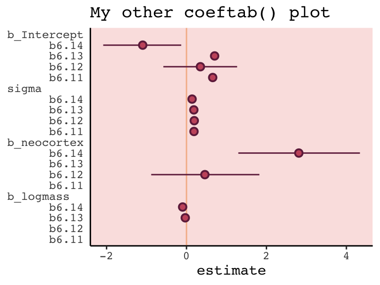

However, if you’re willing to deviate just a bit from the format of McElreath’s `coeftab()` plot, here’s a more elegant way to work with our `my_coef_tab` tibble.


```r
my_coef_tab %>% 
  
  ggplot(aes(x = model, y = estimate, ymin = lower, ymax = upper)) +
  geom_hline(yintercept = 0,  color = carto_pal(7, "BurgYl")[2]) +
  geom_pointrange(shape = 21, color = carto_pal(7, "BurgYl")[7], fill = carto_pal(7, "BurgYl")[5]) +
  labs(x = NULL,
       y = NULL) +
  coord_flip() +
  theme_classic() +
  theme(text         = element_text(family = "Courier"),
        panel.grid   = element_blank(),
        axis.ticks.y = element_blank(),
        axis.text.y  = element_text(hjust = 0),
        panel.background = element_rect(fill = alpha(carto_pal(7, "BurgYl")[3], 1/4)),
        strip.background = element_rect(color = "transparent")) +
  facet_wrap(~term, ncol = 1)
```

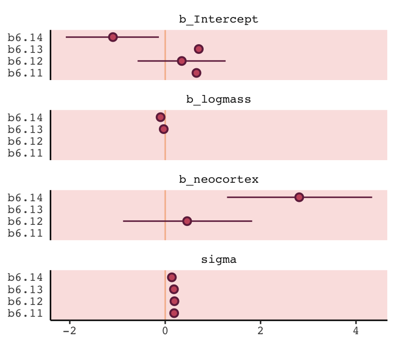

#### Rethinking: Barplots suck.

Man, I agree. "The only problem with barplots is that they have bars" (p. 203). You can find alternatives [here](http://www.sthda.com/english/articles/24-ggpubr-publication-ready-plots/80-bar-plots-and-modern-alternatives/), [here](https://janhove.github.io/reporting/2015/01/07/some-alternatives-to-barplots), [here](http://www.rebeccabarter.com/blog/2018-05-29_alternatives_dodged_bars/), [here](http://www.audhalbritter.com/alternatives-to-barplots/), and a whole bunch [here](http://r-statistics.co/Top50-Ggplot2-Visualizations-MasterList-R-Code.html#2.%20Deviation).

### Model averaging.

Within the current brms framework, you can do model-averaged predictions with the `pp_average()` function. The default weighting scheme is with the LOO. Here we'll use the `weights = "waic"` argument to match McElreath's method in the text. Because `pp_average()` yields a matrix, we'll want to convert it to a tibble before feeding it into ggplot2.


```r
# we need new data for both the `fitted()` and `pp_average()` functions
nd <- 
  tibble(neocortex = seq(from = .5, to = .8, length.out = 30),
         mass      = 4.5)

# we'll get the `b6.14`-implied trajectory with `fitted()`
f <-
  fitted(b6.14, newdata = nd) %>%
  as_tibble() %>%
  bind_cols(nd)

# the model-average trajectory comes from `pp_average()`
pp_average(b6.11, b6.12, b6.13, b6.14,
           weights = "waic",
           method  = "fitted",  # for new data predictions, use `method = "predict"`
           newdata = nd) %>%
  as_tibble() %>%
  bind_cols(nd) %>%
  
  # plot Figure 6.13
  ggplot(aes(x = neocortex, y = Estimate)) +
  geom_ribbon(aes(ymin = Q2.5, ymax = Q97.5), 
              fill  = carto_pal(7, "BurgYl")[6], alpha = 1/4) +
  geom_line(color   = carto_pal(7, "BurgYl")[6]) +
  geom_ribbon(data  = f, aes(ymin = Q2.5, ymax = Q97.5),
              color = carto_pal(7, "BurgYl")[5], fill = "transparent", linetype = 2) +
  geom_line(data = f,
              color = carto_pal(7, "BurgYl")[5], linetype = 2) +
  geom_point(data = d, aes(y = kcal.per.g), 
             size = 2, color = carto_pal(7, "BurgYl")[7]) +
  labs(y = "kcal.per.g") +
  coord_cartesian(xlim = range(d$neocortex), 
                  ylim = range(d$kcal.per.g)) +
  theme_classic() +
  theme(text             = element_text(family = "Courier"),
        panel.background = element_rect(fill = alpha(carto_pal(7, "BurgYl")[3], 1/4)))
```

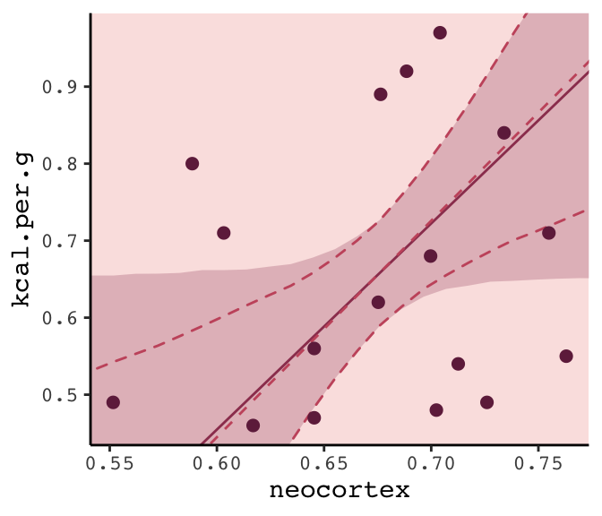

## ~~Summary~~ Bonus: $R^2$ talk

At the beginning of the chapter (pp. 167--168), McElreath briefly introduced $R^2$ as a popular way to assess the variance explained in a model. He pooh-poohed it because of its tendency to overfit. It's also limited in that it doesn't generalize well outside of the single-level Gaussian framework. However, if you should find yourself in a situation where $R^2$ suits your purposes, the brms `bayes_R2()` function might be of use. Simply feeding a model brm fit object into `bayes_R2()` will return the posterior mean, $SD$, and 95% intervals. For example:


```r
bayes_R2(b6.14) %>% round(digits = 3)
```

```
##    Estimate Est.Error  Q2.5 Q97.5
## R2    0.501      0.13 0.186 0.666
```

With just a little data processing, you can get a tibble table of each of models' $R^2$ 'Estimate'.


```r
rbind(bayes_R2(b6.11), 
      bayes_R2(b6.12), 
      bayes_R2(b6.13), 
      bayes_R2(b6.14)) %>%
  as_tibble() %>%
  mutate(model = c("b6.11", "b6.12", "b6.13", "b6.14"),
         r_square_posterior_mean = round(Estimate, digits = 2)) %>%
  select(model, r_square_posterior_mean)
```

```
## # A tibble: 4 x 2
##   model r_square_posterior_mean
##   <chr>                   <dbl>
## 1 b6.11                    0   
## 2 b6.12                    0.08
## 3 b6.13                    0.14
## 4 b6.14                    0.5
```

If you want the full distribution of the $R^2$, you’ll need to add a `summary = F` argument. Note how this returns a numeric vector.


```r
r2_b6.13 <- bayes_R2(b6.13, summary = F)

r2_b6.13 %>%
  glimpse()
```

```
##  num [1:4000, 1] 0.2245 0.0146 0.0808 0.288 0.1127 ...
##  - attr(*, "dimnames")=List of 2
##   ..$ : NULL
##   ..$ : chr "R2"
```

If you want to use these in ggplot2, you’ll need to put them in tibbles or data frames. Here we do so for two of our model fits.


```r
# model `b6.13`
r2_b6.13 <- 
  bayes_R2(b6.13, summary = F) %>%
  as_tibble() %>%
  rename(r2_13 = R2)

# model `b6.14`
r2_b6.14 <- 
  bayes_R2(b6.14, summary = F) %>%
  as_tibble() %>%
  rename(r2_14 = R2)

# let's put them in the same data object
r2_combined <-
  bind_cols(r2_b6.13, r2_b6.14) %>%
  mutate(dif = r2_14 - r2_13)

# plot their densities
r2_combined %>%
  ggplot() +
  geom_density(aes(x = r2_13),
               fill = carto_pal(7, "BurgYl")[4], alpha = 3/4, size = 0, ) +
  geom_density(aes(x = r2_14),
               fill = carto_pal(7, "BurgYl")[6], alpha = 3/4, size = 0, ) +
  scale_y_continuous(NULL, breaks = NULL) +
  coord_cartesian(xlim = 0:1) +
  labs(x        = NULL,
       title    = expression(paste(italic("R")^{2}, " distributions")),
       subtitle = "Going from left to right, these are\nfor models b6.13 and b6.14.") +
  theme_classic() +
  theme(text = element_text(family = "Courier"),
        panel.background = element_rect(fill = alpha(carto_pal(7, "BurgYl")[3], 1/4)))
```

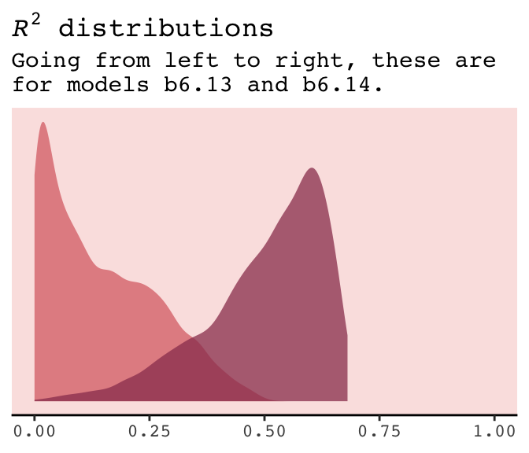

If you do your work in a field where folks use $R^2$ change, you might do that with a simple difference score, which we computed above with `mutate(dif = R2.14 - R2.13)`. Here's the $\Delta R^2$ (i.e., `dif`) plot:


```r
r2_combined %>%
  ggplot(aes(x = dif, y = 0)) +
  geom_halfeyeh(fill  = carto_pal(7, "BurgYl")[5], 
                color = carto_pal(7, "BurgYl")[7],
                point_interval = median_qi, .width = .95) +
  scale_y_continuous(NULL, breaks = NULL) +
  labs(x        = expression(paste(Delta, italic("R")^{2})),
       subtitle = "This is how much more variance, in\nterms of %, model b6.14 explained\ncompared to model b6.13.") +
  theme_classic() +
  theme(text = element_text(family = "Courier"),
        panel.background = element_rect(fill = alpha(carto_pal(7, "BurgYl")[3], 1/4)))
```

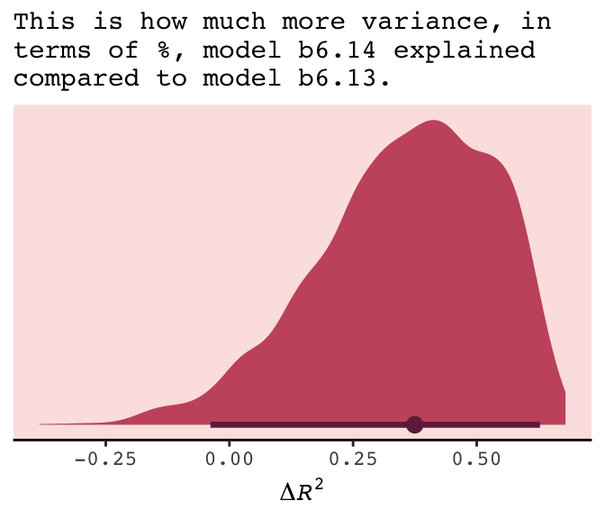

The brms package did not get these $R^2$ values by traditional method used in, say, ordinary least squares estimation. To learn more about how the Bayesian $R^2$ sausage is made, check out the paper by [Gelman, Goodrich, Gabry, and Vehtari](https://www.tandfonline.com/doi/abs/10.1080/00031305.2018.1549100?journalCode=utas20).

## Reference {-}

[McElreath, R. (2016). *Statistical rethinking: A Bayesian course with examples in R and Stan.* Chapman & Hall/CRC Press.](https://xcelab.net/rm/statistical-rethinking/)

## Session info {-}


```r
sessionInfo()
```

```
## R version 3.5.1 (2018-07-02)
## Platform: x86_64-apple-darwin15.6.0 (64-bit)
## Running under: macOS High Sierra 10.13.6
## 
## Matrix products: default
## BLAS: /Library/Frameworks/R.framework/Versions/3.5/Resources/lib/libRblas.0.dylib
## LAPACK: /Library/Frameworks/R.framework/Versions/3.5/Resources/lib/libRlapack.dylib
## 
## locale:
## [1] en_US.UTF-8/en_US.UTF-8/en_US.UTF-8/C/en_US.UTF-8/en_US.UTF-8
## 
## attached base packages:
## [1] parallel  stats     graphics  grDevices utils     datasets  methods   base     
## 
## other attached packages:
##  [1] rstan_2.18.2         StanHeaders_2.18.0-1 tidybayes_1.0.4      brms_2.8.8          
##  [5] Rcpp_1.0.1           gridExtra_2.3        broom_0.5.1          ggrepel_0.8.0       
##  [9] rcartocolor_1.0.0    forcats_0.3.0        stringr_1.4.0        dplyr_0.8.0.1       
## [13] purrr_0.2.5          readr_1.1.1          tidyr_0.8.1          tibble_2.1.1        
## [17] ggplot2_3.1.1        tidyverse_1.2.1     
## 
## loaded via a namespace (and not attached):
##  [1] colorspace_1.3-2          ggridges_0.5.0            rsconnect_0.8.8          
##  [4] rprojroot_1.3-2           ggstance_0.3              markdown_0.8             
##  [7] base64enc_0.1-3           rstudioapi_0.7            svUnit_0.7-12            
## [10] DT_0.4                    fansi_0.4.0               mvtnorm_1.0-10           
## [13] lubridate_1.7.4           xml2_1.2.0                codetools_0.2-15         
## [16] bridgesampling_0.6-0      knitr_1.20                shinythemes_1.1.1        
## [19] bayesplot_1.6.0           jsonlite_1.5              shiny_1.1.0              
## [22] compiler_3.5.1            httr_1.3.1                backports_1.1.4          
## [25] assertthat_0.2.0          Matrix_1.2-14             lazyeval_0.2.2           
## [28] cli_1.0.1                 later_0.7.3               htmltools_0.3.6          
## [31] prettyunits_1.0.2         tools_3.5.1               igraph_1.2.1             
## [34] coda_0.19-2               gtable_0.3.0              glue_1.3.1.9000          
## [37] reshape2_1.4.3            cellranger_1.1.0          nlme_3.1-137             
## [40] crosstalk_1.0.0           xfun_0.3                  ps_1.2.1                 
## [43] rvest_0.3.2               mime_0.5                  miniUI_0.1.1.1           
## [46] gtools_3.8.1              MASS_7.3-50               zoo_1.8-2                
## [49] scales_1.0.0              colourpicker_1.0          hms_0.4.2                
## [52] promises_1.0.1            Brobdingnag_1.2-6         inline_0.3.15            
## [55] shinystan_2.5.0           yaml_2.1.19               loo_2.1.0                
## [58] stringi_1.4.3             dygraphs_1.1.1.5          pkgbuild_1.0.2           
## [61] rlang_0.3.4               pkgconfig_2.0.2           matrixStats_0.54.0       
## [64] evaluate_0.10.1           lattice_0.20-35           rstantools_1.5.1         
## [67] htmlwidgets_1.2           labeling_0.3              tidyselect_0.2.5         
## [70] processx_3.2.1            plyr_1.8.4                magrittr_1.5             
## [73] bookdown_0.9              R6_2.3.0                  generics_0.0.2           
## [76] pillar_1.3.1              haven_1.1.2               withr_2.1.2              
## [79] xts_0.10-2                abind_1.4-5               modelr_0.1.2             
## [82] crayon_1.3.4              arrayhelpers_1.0-20160527 utf8_1.1.4               
## [85] rmarkdown_1.10            grid_3.5.1                readxl_1.1.0             
## [88] callr_3.1.0               threejs_0.3.1             digest_0.6.18            
## [91] xtable_1.8-2              httpuv_1.4.4.2            stats4_3.5.1             
## [94] munsell_0.5.0             viridisLite_0.3.0         shinyjs_1.0
```


