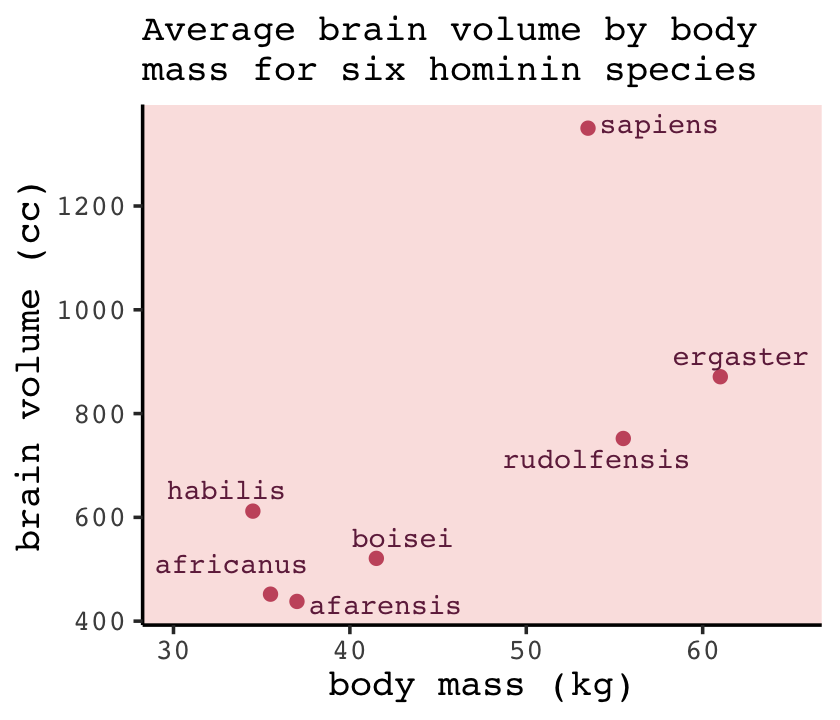
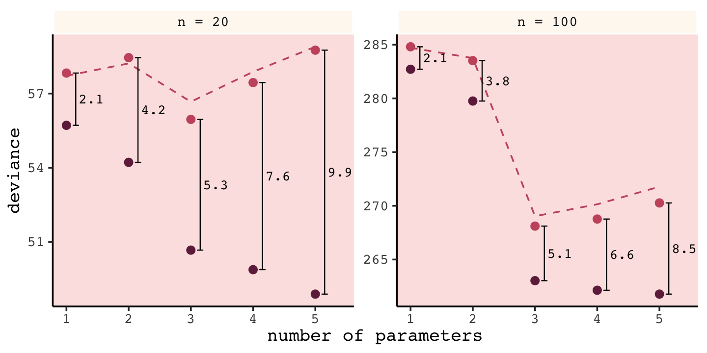
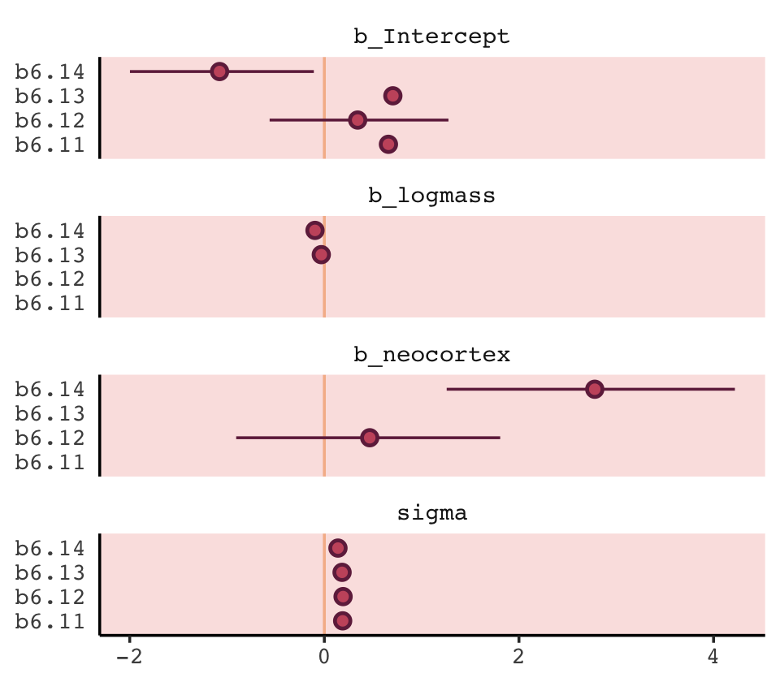

# Overfitting, Regularization, and Information Criteria

In this chapter we contend with two contrasting kinds of statistical error:

* overfitting, "which leads to poor prediction by learning too *much* from the data"
* underfitting, "which leads to poor prediction by learning too *little* from the data" (p. 166, *emphasis* added) 

Toward that end, we will employ 

> two common families of approaches. The first approach is to use a **regularizing prior** to tell the model not to get too excited by the data. This is the same device that non-Bayesian methods refer to as "penalized likelihood." The second approach is to use some scoring device, like **information criteria**, to model the prediction risk and estimate predictive accuracy for some purpose. Both families of approaches are routinely used in the natural and social sciences Furthermore, they can be--maybe should be--used in combination. [@mcelreathStatisticalRethinkingBayesian2015, p. 166, **emphasis** in the original]

#### Rethinking: Stargazing.

> The most common form of model selection among practicing scientists is a search for a model in which every coefficient is statistically significant. Statisticians sometimes call this **stargazing**, as it is embodied by scanning for asterisks ($^{\ast \ast}$) trailing after estimates...
>
> ...Whatever you thing about null hypothesis significance testing in general, using it to select among structurally different models is a mistake--$p$-values are not designed to help you navigate between undercutting and overfitting. (p. 167, **emphasis** in the original)

McElreath spent little time discussing $p$-values and null hypothesis testing in the text. If you'd like to learn more from a Bayesian perspective, you might check out the first several chapters (particularly 10--13) in Kruschke's [-@kruschkeDoingBayesianData2015] [text](https://sites.google.com/site/doingbayesiandataanalysis/) and my [-@kurzDoingBayesianData2020] [ebook translating it to brms and the tidyverse](https://bookdown.org/content/3686/). The great [Frank Harrell](https://twitter.com/f2harrell) has complied [*A litany of problems With p-values*](https://www.fharrell.com/post/pval-litany/) and you might consult the recent statement on $p$-values by the American Statistical Association [@wassersteinASAStatementonPValues2016].

## The problem with parameters

The $R^2$ is a popular way to measure how well you can retrodict the data. It traditionally follows the form

$$R^2 = \frac{\text{var(outcome)} - \text{var(residuals)}}{\text{var(outcome)}} = 1 - \frac{\text{var(residuals)}}{\text{var(outcome)}}.$$

By $\text{var()}$, of course, we meant variance (i.e., the `var()` function in R).

McElreath is not a fan of the $R^2$. But it's important in my field, so instead of a summary at the [end of the chapter][~~Summary~~ Bonus: $R^2$ talk], we will cover the Bayesian version of $R^2$ and how to use it in brms.

### More parameters always improve fit.

> **Overfitting** occurs when a model learns too much from the sample. What this means is that there are both *regular* and *irregular* features in every sample. The regular features are the targets of our learning, because they generalize well or answer a question of interest. Regular features are useful, given an objective of our choice. The irregular features are instead aspects of the data that do not generalize and so may mislead us. (p. 169, **emphasis** in the original)

There's a lot to like about this section, but my experience as a clinical psychologist inclines me to approach this topic differently. In practice, therapy is often a one-on-one process where the outcome is for a specific person in a specific time and set of circumstances in their life. Therapy research is often the aggregate of many such individual cases. As such, both the regular and irregular features of every therapy trial are of great interest. So yes, I agree with McElreath that overfitting of the kind we're about to entertain is silly and to be avoided. And yet the goal of my line of research is to develop treatments (and to examine those treatments with statistical models) that are robust enough to handle irregularities as well. It's my job to deal with the outliers. For more on what you might think of as robust models (i.e., models that can handle unusual observations), check out my [blog on Student-$t$ regression](https://solomonkurz.netlify.com/post/robust-linear-regression-with-the-robust-student-s-t-distribution/). Though not covered in this edition of the text, McElreath introduced  Student-$t$ regression in his [-@mcelreathStatisticalRethinkingBayesian2020] second edition (e.g.,  Section 7.6.2).

In other words, the topics McElreath grappled with in this chapter are difficult and ones I hope you return to again and again during your data analysis career. Back to the text!

We'll start off by making the data with brain size and body size for seven `species` [see @mchenryAustralopithecusHomoTransformations2000].


```r
library(tidyverse)

(
  d <- 
  tibble(species = c("afarensis", "africanus", "habilis", "boisei", "rudolfensis", "ergaster", "sapiens"), 
         brain   = c(438, 452, 612, 521, 752, 871, 1350), 
         mass    = c(37.0, 35.5, 34.5, 41.5, 55.5, 61.0, 53.5))
)
```

```
## # A tibble: 7 x 3
##   species     brain  mass
##   <chr>       <dbl> <dbl>
## 1 afarensis     438  37  
## 2 africanus     452  35.5
## 3 habilis       612  34.5
## 4 boisei        521  41.5
## 5 rudolfensis   752  55.5
## 6 ergaster      871  61  
## 7 sapiens      1350  53.5
```

Let's get ready for Figure 6.2. The plots in this chapter will be characterized by `theme_classic() + theme(text = element_text(family = "Courier"))`. Our color palette will come from the [rcartocolor package](https://cran.r-project.org/package=rcartocolor) [@R-rcartocolor], which provides color schemes [designed by 'CARTO'](https://carto.com/carto-colors/).


```r
# install.packages("rcartocolor", dependencies = T)
library(rcartocolor)
```

The specific palette we'll be using is "BurgYl." In addition to palettes, the rcartocolor package offers a few convenience functions which make it easier to use their palettes. The `carto_pal()` function will return the HEX numbers associated with a given palette's colors and the `display_carto_pal()` function will display the actual colors.


```r
carto_pal(7, "BurgYl")
```

```
## [1] "#fbe6c5" "#f5ba98" "#ee8a82" "#dc7176" "#c8586c" "#9c3f5d" "#70284a"
```

```r
display_carto_pal(7, "BurgYl")
```


We'll be using a diluted version of the third color for the panel background (i.e., `theme(panel.background = element_rect(fill = alpha(carto_pal(7, "BurgYl")[3], 1/4)))`) and the darker purples for other plot elements. Here's the plot.


```r
library(ggrepel)

d %>%
  ggplot(aes(x =  mass, y = brain, label = species)) +
  geom_point(color = carto_pal(7, "BurgYl")[5]) +
  geom_text_repel(size = 3, color = carto_pal(7, "BurgYl")[7], family = "Courier", seed = 438) +
  labs(subtitle = "Average brain volume by body\nmass for six hominin species",
       x = "body mass (kg)",
       y = "brain volume (cc)") +
  coord_cartesian(xlim = c(30, 65)) +
  theme_classic() +
  theme(text = element_text(family = "Courier"),
        panel.background = element_rect(fill = alpha(carto_pal(7, "BurgYl")[3], 1/4)))
```



The first six models, which we'll be fitting using OLS regression via the `lm()` function, range in complexity from the simple univariable model

\begin{align*}
\text{brain}_i & \sim \operatorname{Normal} (\mu_i, \sigma) \\
\mu_i & = \beta_0 + \beta_1 \text{mass}_i,
\end{align*}

to the dizzying sixth-degree polynomial model

\begin{align*}
\text{brain}_i & \sim \operatorname{Normal} (\mu_i, \sigma) \\
\mu_i & = \beta_0 + \beta_1 \text{mass}_i + \beta_2 \text{mass}_i^2 + \beta_3 \text{mass}_i^3 + \beta_4 \text{mass}_i^4 + \beta_5 \text{mass}_i^5 + \beta_6 \text{mass}_i^6.
\end{align*}

Let's fit them in bulk. First we'll make a custom function, `fit_lm()`, into which we'll feed the desired names and formulas of our models. We'll make a tibble initially composed of those names (i.e., `model`) and formulas (i.e., `formula`). Via `purrr::map2()` within `mutate()`, we'll then fit the models and save the model objects within the tibble. The [broom package](https://cran.r-project.org/package=broom) [@R-broom] provides an array of convenience functions to convert statistical analysis summaries into tidy data objects. We'll employ `broom::tidy()` and `broom::glance()` to extract information from the model fits.


```r
library(broom)

fit_lm <- function(model, formula) {
  model <- lm(data = d, formula = formula)
}

fits <-
  tibble(model   = str_c("b6.", 1:6),
         formula = c("brain ~ mass", 
                     "brain ~ mass + I(mass^2)", 
                     "brain ~ mass + I(mass^2) + I(mass^3)", 
                     "brain ~ mass + I(mass^2) + I(mass^3) + I(mass^4)", 
                     "brain ~ mass + I(mass^2) + I(mass^3) + I(mass^4) + I(mass^5)", 
                     "brain ~ mass + I(mass^2) + I(mass^3) + I(mass^4) + I(mass^5) + I(mass^6)")) %>% 
  mutate(fit = map2(model, formula, fit_lm)) %>% 
  mutate(tidy   = map(fit, tidy),
         glance = map(fit, glance))

# what did we just do?
print(fits)
```

```
## # A tibble: 6 x 5
##   model formula                                                          fit    tidy           glance         
##   <chr> <chr>                                                            <list> <list>         <list>         
## 1 b6.1  brain ~ mass                                                     <lm>   <tibble [2 × … <tibble [1 × 1…
## 2 b6.2  brain ~ mass + I(mass^2)                                         <lm>   <tibble [3 × … <tibble [1 × 1…
## 3 b6.3  brain ~ mass + I(mass^2) + I(mass^3)                             <lm>   <tibble [4 × … <tibble [1 × 1…
## 4 b6.4  brain ~ mass + I(mass^2) + I(mass^3) + I(mass^4)                 <lm>   <tibble [5 × … <tibble [1 × 1…
## 5 b6.5  brain ~ mass + I(mass^2) + I(mass^3) + I(mass^4) + I(mass^5)     <lm>   <tibble [6 × … <tibble [1 × 1…
## 6 b6.6  brain ~ mass + I(mass^2) + I(mass^3) + I(mass^4) + I(mass^5) + … <lm>   <tibble [7 × … <tibble [1 × 1…
```

Our `fits` object is a [nested tibble](https://tidyr.tidyverse.org/reference/nest.html). To learn more about this bulk approach to fitting models, check out Hadley Wickham's talk, [Managing many models with R](https://www.youtube.com/watch?v=rz3_FDVt9eg&t=2339s&frags=pl%2Cwn). As you might learn in the talk, we can extract the $R^2$ from each model with `map_dbl("r.squared")`, which we'll then display in a plot.


```r
fits <-
  fits %>% 
  mutate(r2 = glance %>% map_dbl("r.squared")) %>% 
  mutate(r2_text = round(r2, digits = 2) %>% as.character() %>% str_replace(., "0.", "."))

fits %>% 
  ggplot(aes(x = r2, y = formula, label = r2_text)) +
  geom_text(color = carto_pal(7, "BurgYl")[7], size = 3.5) +
  scale_x_continuous(expression(italic(R)^2), limits = 0:1, breaks = 0:1) +
  ylab(NULL) +
  theme_classic() +
  theme(text = element_text(family = "Courier"),
        axis.text.y = element_text(hjust = 0),
        axis.ticks.y = element_blank(),
        panel.background = element_rect(fill = alpha(carto_pal(7, "BurgYl")[3], 1/4)))
```


If we wanted to look at the model coefficients, we could `unnest(tidy)` and wrangle a bit.  


```r
fits %>% 
  unnest(tidy) %>% 
  select(model, term:estimate) %>% 
  mutate_if(is.double, round, digits = 1) %>% 
  complete(model, term) %>% 
  spread(key = term, value = estimate) %>% 
  select(model, `(Intercept)`, mass, everything()) %>% 
  knitr::kable()
```


model    (Intercept)         mass   I(mass^2)   I(mass^3)   I(mass^4)   I(mass^5)   I(mass^6)
------  ------------  -----------  ----------  ----------  ----------  ----------  ----------
b6.1          -227.6         20.7          NA          NA          NA          NA          NA
b6.2         -2618.1        127.3        -1.1          NA          NA          NA          NA
b6.3         21990.4      -1473.8        32.8        -0.2          NA          NA          NA
b6.4        322887.2     -27945.5       892.2       -12.4         0.1          NA          NA
b6.5      -1535342.4     180049.0     -8324.7       189.6        -2.1         0.0          NA
b6.6      10849890.9   -1473227.5     82777.0     -2462.6        40.9        -0.4           0

For Figure 6.3, we'll make each plot individually and them glue them together with the patchwork package. Since they all share a common structure, we'll start by specifying a base plot which we'll save as `p`.


```r
p <-
  d %>% 
  ggplot(aes(x = mass, y = brain)) +
  geom_point(color = carto_pal(7, "BurgYl")[7]) +
  scale_x_continuous("body mass (kg)", limits = c(33, 62), expand = c(0, 0)) +
  ylab("brain volume (cc)") +
  coord_cartesian(ylim = c(300, 1500)) +
  theme_classic() +
  theme(text = element_text(family = "Courier"),
        panel.background = element_rect(fill = alpha(carto_pal(7, "BurgYl")[3], 1/4)))
```

Now for each subplot, we'll tack the subplot-specific components onto `p`. The main action is in `stat_smooth()`. For each subplot, the first three lines in `stat_smooth()` are identical, with only the bottom `formula` line differing. Like McElreath did in the text, we also adjust the $y$-axis range for the last two plots.


```r
# linear
p1 <- 
  p +
  stat_smooth(method = "lm", fullrange = TRUE, level = .89,  # note our rare use of 89% intervals
              color = carto_pal(7, "BurgYl")[6], fill = carto_pal(7, "BurgYl")[6], 
              size = 1/2, alpha = 1/3,
              formula = y ~ x) +
  ggtitle(NULL, subtitle = expression(italic(R)^2==".49"))
  
# quadratic
p2 <-
  p + 
  stat_smooth(method = "lm", fullrange = TRUE, level = .89,
              color = carto_pal(7, "BurgYl")[6], fill = carto_pal(7, "BurgYl")[6], 
              size = 1/2, alpha = 1/3,              
              formula = y ~ poly(x, 2)) +
  ggtitle(NULL, subtitle = expression(italic(R)^2==".54"))

# cubic
p3 <-
  p + 
  stat_smooth(method = "lm", fullrange = TRUE, level = .89,
              color = carto_pal(7, "BurgYl")[6], fill = carto_pal(7, "BurgYl")[6], 
              size = 1/2, alpha = 1/3,              
              formula = y ~ poly(x, 3)) +
  ggtitle(NULL, subtitle = expression(italic(R)^2==".68"))

# fourth-order polynomial
p4 <-
  p + 
  stat_smooth(method = "lm", fullrange = TRUE, level = .89,
              color = carto_pal(7, "BurgYl")[6], fill = carto_pal(7, "BurgYl")[6], 
              size = 1/2, alpha = 1/3,              
              formula = y ~ poly(x, 4)) +
  ggtitle(NULL, subtitle = expression(italic(R)^2==".81"))

# fifth-order polynomial
p5 <-
  p + 
  stat_smooth(method = "lm", fullrange = TRUE, level = .89,
              color = carto_pal(7, "BurgYl")[6], fill = carto_pal(7, "BurgYl")[6], 
              size = 1/2, alpha = 1/3,              
              formula = y ~ poly(x, 5)) +
  # we're adjusting the y-axis range for this plot (and the next)
  coord_cartesian(ylim = c(150, 1900)) +
  ggtitle(NULL, subtitle = expression(italic(R)^2==".99"))
  
# sixth-order polynomial
p6 <-
  p + 
  # mark off 0 on the y-axis
  geom_hline(yintercept = 0, color = carto_pal(7, "BurgYl")[2], linetype = 2) + 
  stat_smooth(method = "lm", fullrange = TRUE, level = .89,
              color = carto_pal(7, "BurgYl")[6], fill = carto_pal(7, "BurgYl")[6], 
              size = 1/2, alpha = 1/3,
              formula = y ~ poly(x, 6)) +
  coord_cartesian(ylim = c(-300, 1500)) +
  ggtitle(NULL, subtitle = expression(italic(R)^2==1))
```

Okay, now we're ready to combine the six subplots and produce our version of Figure 6.3.


```r
library(patchwork)

(p1 + p2) / (p3 + p4) / (p5 + p6)
```


"If you adopt a model family with enough parameters, you can fit the data exactly. But such a model will make rather absurd predictions for yet-to-be observed cases" (p. 172).

### Too few parameters hurts, too.

> The overfit polynomial models manage to fit the data extremely well, bu they suffer for this within-sample accuracy by making nonsensical out-of-sample predictions. In contract, **underfitting** produces models that are inaccurate both within and out of sample. They have learned too little, failing to recover regular features of the sample. (p. 172, **emphasis** in the original)

Fit the underfit intercept-only model, `b6.7`.


```r
b6.7 <- lm(data = d, 
           brain ~ 1)

summary(b6.7)
```

```
## 
## Call:
## lm(formula = brain ~ 1, data = d)
## 
## Residuals:
##     Min      1Q  Median      3Q     Max 
## -275.71 -227.21 -101.71   97.79  636.29 
## 
## Coefficients:
##             Estimate Std. Error t value Pr(>|t|)   
## (Intercept)    713.7      121.8    5.86  0.00109 **
## ---
## Signif. codes:  0 '***' 0.001 '**' 0.01 '*' 0.05 '.' 0.1 ' ' 1
## 
## Residual standard error: 322.2 on 6 degrees of freedom
```

With the intercept-only model, we didn't even get an $R^2$ value in the summary. The `broom::glance()` function offers a quick way to get one.


```r
glance(b6.7)
```

```
## # A tibble: 1 x 11
##   r.squared adj.r.squared sigma statistic p.value    df logLik   AIC   BIC deviance df.residual
##       <dbl>         <dbl> <dbl>     <dbl>   <dbl> <int>  <dbl> <dbl> <dbl>    <dbl>       <int>
## 1         0             0  322.        NA      NA     1  -49.8  104.  104.  623061.           6
```

Zero. Our intercept-only `b6.7` explained exactly zero variance in `brain`. All it did was tell us what the unconditional mean and variance (i.e., 'Residual standard error') were. I hope that makes sense. They were the only things in the model: $\text{brain}_i \sim \operatorname{Normal}(\mu = \alpha, \sigma)$. To get the intercept-only model for Figure 6.4, we plug `formula = y ~ 1` into the `stat_smooth()` function.


```r
p +
  stat_smooth(method = "lm", fullrange = TRUE, level = .89,
              color = carto_pal(7, "BurgYl")[6], fill = carto_pal(7, "BurgYl")[6], 
              size = 1/2, alpha = 1/3,              
              formula = y ~ 1) +
  ggtitle(NULL, subtitle = expression(italic(R)^2==0))
```


Our underfit model `b6.7` didn't learn anything about the relation between `mass` and `brain`. "Such a model not only fails to describe the sample. It would also do a poor job for new data" (p. 173).

#### Overthinking: Dropping rows.

You can `filter()` by `row_number()` to drop rows in a [tidyverse kind of way](https://dplyr.tidyverse.org/reference/slice.html). For example, we can drop the second row of `d` like this.


```r
 d %>%
    filter(row_number() != 2)
```

```
## # A tibble: 6 x 3
##   species     brain  mass
##   <chr>       <dbl> <dbl>
## 1 afarensis     438  37  
## 2 habilis       612  34.5
## 3 boisei        521  41.5
## 4 rudolfensis   752  55.5
## 5 ergaster      871  61  
## 6 sapiens      1350  53.5
```

We can then extend that logic into a custom function, `make_lines()`, that will drop a row from `d`, fit the simple model `brain ~ mass`, and then use base R `predict()` to return the model-implied trajectory over new data values.


```r
# because these lines are straight, we only need new data over two points of `mass`
nd <- tibble(mass = c(30, 70))

make_lines <- function(row) {
 
  # fit the model
  my_fit <-
    d %>%
    filter(row_number() != row) %>% 
    lm(formula = brain ~ mass)

  # compute fitted lines
  predict(my_fit, nd) %>% 
    as_tibble() %>% 
    rename(brain = value) %>% 
    bind_cols(nd)
  
}
```

Here we'll make a tibble, `lines`, which will specify rows 1 through 7 in the `row` column. We'll then feed those `row` numbers into our custom `make_lines()` function, which will return the predicted values and their corresponding `mass` values, per model.


```r
(
  lines <-
  tibble(row = 1:7) %>% 
  mutate(p = map(row, make_lines)) %>% 
  unnest(p)
)
```

```
## # A tibble: 14 x 3
##      row brain  mass
##    <int> <dbl> <dbl>
##  1     1  436.    30
##  2     1 1201.    70
##  3     2  421.    30
##  4     2 1205.    70
##  5     3  323.    30
##  6     3 1264.    70
##  7     4  423.    30
##  8     4 1221.    70
##  9     5  376.    30
## 10     5 1335.    70
## 11     6  332.    30
## 12     6 1433.    70
## 13     7  412.    30
## 14     7  964.    70
```

Now we're ready to plot the left panel of Figure 6.5.


```r
p + 
  scale_x_continuous(expand = c(0, 0)) +
  geom_line(data = lines, 
            aes(x = mass, y = brain, group = row),
            color = carto_pal(7, "BurgYl")[6], alpha = 1/2, size = 1/2)
```


To make the right panel for Figure 6.5, we'll need to increase the number of `mass` points in our `nd` data and redefine the `make_lines()` function to fit the sixth-order-polynomial model.


```r
# because these lines will be very curvy, we'll need new data over many points of `mass`
nd <- tibble(mass = seq(from = 30, to = 65, length.out = 200))

# redifine the function
make_lines <- function(row) {
  
  my_fit <-
    d %>%
    filter(row_number() != row) %>% 
    lm(formula = brain ~ mass + I(mass^2) + I(mass^3) + I(mass^4) + I(mass^5) + I(mass^6))

  predict(my_fit, nd) %>% 
    as_tibble() %>% 
    rename(brain = value) %>% 
    bind_cols(nd)
  
}

# make our new tibble
lines <-
  tibble(row = 1:7) %>% 
  mutate(p = map(row, make_lines)) %>% 
  unnest(p)

# plot!
p +
  geom_line(data = lines, 
            aes(group = row),
            color = carto_pal(7, "BurgYl")[6], alpha = 1/2, size = 1/2) +
  coord_cartesian(ylim = c(-300, 2000))
```


## Information theory and model performance

> Whether you end up using regularization or information criteria or both, the first thing you must do is pick a criterion of model performance. What do you want the model to do well at? We'll call this criterion the *target*, and in this section you'll see how information theory provides a common and useful target, the out-of-sample *deviance*. (p. 174, *emphasis* in the original)

### Firing the weatherperson.

If you let rain = 1 and sun = 0, here's a way to make a plot of the first table of page 175, the weatherperson's predictions.


```r
weatherperson <-
  tibble(day        = 1:10,
         prediction = rep(c(1, 0.6), times = c(3, 7)),
         observed   = rep(c(1, 0), times = c(3, 7))) 

weatherperson %>% 
  gather(key, value, -day) %>% 
  
  ggplot(aes(x = day, y = key, fill = value)) +
  geom_tile(color = "white") +
  geom_text(aes(label = value, color = value == 0),
            family = "Courier") +
  scale_fill_viridis_c(direction = -1) +
  scale_color_manual(values = c("white", "black")) +
  scale_x_continuous(breaks = 1:10, expand = c(0, 0)) +
  scale_y_discrete(NULL, expand = c(0, 0)) +
  theme(text = element_text(family = "Courier"),
        axis.ticks.y = element_blank(),
        legend.position = "none")
```


Here's how the newcomer fared.


```r
newcomer <-
  tibble(day        = 1:10,
         prediction = 0,
         observed   = rep(c(1, 0), times = c(3, 7)))

newcomer %>% 
  gather(key, value, -day) %>%
  
  ggplot(aes(x = day, y = key, fill = value)) +
  geom_tile(color = "white") +
  geom_text(aes(label = value, color = value == 0),
            family = "Courier") +
  scale_fill_viridis_c(direction = -1) +
  scale_color_manual(values = c("white", "black")) +
  scale_x_continuous(breaks = 1:10, expand = c(0, 0)) +
  scale_y_discrete(NULL, expand = c(0, 0)) +
  theme(text = element_text(family = "Courier"),
        axis.ticks.y = element_blank(),
        legend.position = "none")
```


If we do the math entailed in the tibbles, we'll see why the newcomer could boast "I'm the best person for the job" (p. 175).


```r
weatherperson %>% 
  bind_rows(newcomer) %>% 
  mutate(person = rep(c("weatherperson", "newcomer"), each = n() / 2),
         hit    = ifelse(prediction == observed, 1, 1 - prediction - observed)) %>% 
  group_by(person) %>% 
  summarise(n_days   = n(),
            n_hits   = sum(hit),
            hit_rate = mean(hit))
```

```
## # A tibble: 2 x 4
##   person        n_days n_hits hit_rate
##   <chr>          <int>  <dbl>    <dbl>
## 1 newcomer          10    7       0.7 
## 2 weatherperson     10    5.8     0.58
```

#### Costs and benefits.

Our new `points` variable doesn't fit into the nice color-based `geom_tile()` plots from above. But we can still do the math.


```r
weatherperson %>% 
  bind_rows(newcomer) %>% 
  mutate(person = rep(c("weatherperson", "newcomer"), each = n()/2),
         points = ifelse(observed == 1 & prediction != 1, -5,
                         ifelse(observed == 1 & prediction == 1, -1,
                                -1 * prediction))) %>% 
  group_by(person) %>% 
  summarise(happiness = sum(points))
```

```
## # A tibble: 2 x 2
##   person        happiness
##   <chr>             <dbl>
## 1 newcomer          -15  
## 2 weatherperson      -7.2
```

#### Measuring accuracy.

> Consider for example computing the probability of predicting the exact sequence of days. This means computing the probability of a correct prediction for each day. Then multiply all of these probabilities together to get the joint probability of correctly predicting the observed sequence. This is the same thing as the joint likelihood, which you've been using up to this point to fit models with Bayes' theorem.
>
> In this light, the newcomer looks even worse. (p. 176)


```r
weatherperson %>% 
  bind_rows(newcomer) %>% 
  mutate(person = rep(c("weatherperson", "newcomer"), each = n() / 2),
         hit    = ifelse(prediction == observed, 1, 1 - prediction - observed)) %>% 
  group_by(person, hit) %>% 
  count() %>% 
  ungroup() %>% 
  mutate(power_character = str_c(hit, "^", n),  # this line is just for pedagogy
         power = hit ^ n,
         term  = rep(letters[1:2], times = 2)) %>% 
  select(person, term, power) %>% 
  spread(key = term, value = power) %>% 
  mutate(probability_correct_sequence = a * b)
```

```
## # A tibble: 2 x 4
##   person              a     b probability_correct_sequence
##   <chr>           <dbl> <dbl>                        <dbl>
## 1 newcomer      0           1                      0      
## 2 weatherperson 0.00164     1                      0.00164
```

### Information and uncertainty.

Within the context of information theory, *information* is "the reduction of uncertainty derived from learning an outcome" (p. 177). *Information entropy* is a way of measuring that uncertainty in a way that is (a) continuous, (b) increases as the number of possible events increases, and (c) is additive. The formula for information entropy is:

$$H(p) = - \text E \log (p_i) = - \sum_{i = 1}^n p_i \log (p_i).$$

McElreath put it in words as "the uncertainty contained in a probability distribution is the average log-probability of the event" (p. 178). We'll compute the information entropy for weather at the first unnamed location, which we'll call `McElreath's house`, and `Abu Dhabi` at once.


```r
tibble(place  = c("McElreath's house", "Abu Dhabi"),
       p_rain = c(.3, .01)) %>% 
  mutate(p_shine = 1 - p_rain) %>% 
  group_by(place) %>% 
  mutate(H_p = (p_rain * log(p_rain) + p_shine * log(p_shine)) %>% mean() * -1)
```

```
## # A tibble: 2 x 4
## # Groups:   place [2]
##   place             p_rain p_shine    H_p
##   <chr>              <dbl>   <dbl>  <dbl>
## 1 McElreath's house   0.3     0.7  0.611 
## 2 Abu Dhabi           0.01    0.99 0.0560
```

Did you catch how we used the equation $H(p) = - \sum_{i = 1}^n p_i \log (p_i)$ in our `mutate()` code, there? Our computation indicated the uncertainty is less in Abu Dhabi because it rarely rains, there. If you have sun, rain and snow, the entropy for weather is:


```r
p <- c(.7, .15, .15)
-sum(p * log(p))
```

```
## [1] 0.8188085
```

"These entropy values by themselves don't mean much to us, though. Instead we can use them to build a measure of accuracy. That comes next" (p. 178).

### From entropy to accuracy.

> How can we use information entropy to say how far a model is from the target? The key lies in **divergence**:
>
>> **Divergence**: The additional uncertainty induced by using probabilities from one distribution to describe another distribution.
>
> This is often known as *Kullback-Leibler divergence* or simply K-L divergence. [p. 179, **emphasis** in the original, see @kullbackInformationSufficiency1951]

The formula for K-L divergence is

$$D_\text{KL} (p, q) = \sum_i p_i \big ( \log (p_i) - \log (q_i) \big ) = \sum_i p_i \log \left ( \frac{p_i}{q_i} \right ),$$

which, in plainer language, is what McElreath described as "the average difference in log probability between the target ($p$) and model ($q$)" (p. 179).

In McElreath's example

* $p_1 = .3$,
* $p_2 = .7$,
* $q_1 = .25$, and
* $q_2 = .75$.

With those values, we can compute $D_\text{KL} (p, q)$ within a tibble like so.


```r
tibble(p_1 = .3,
       p_2 = .7,
       q_1 = .25,
       q_2 = .75) %>%
  mutate(d_kl = (p_1 * log(p_1 / q_1)) + (p_2 * log(p_2 / q_2)))
```

```
## # A tibble: 1 x 5
##     p_1   p_2   q_1   q_2    d_kl
##   <dbl> <dbl> <dbl> <dbl>   <dbl>
## 1   0.3   0.7  0.25  0.75 0.00640
```

Did you notice how we used the formula $D_\text{KL} (p, q) = \sum_i p_i \log \left ( \frac{p_i}{q_i} \right )$ within `mutate()`?

Our systems in this section are binary (e.g., $q = \lbrace q_i, q_2 \rbrace$). Thus if you know $q_1 = .3$ you know of a necessity $q_2 = 1 - q_1$. Therefore we can code the tibble for the next example of when $p = q$ like this.


```r
tibble(p_1 = .3) %>% 
  mutate(p_2 = 1 - p_1,
         q_1 = p_1) %>% 
  mutate(q_2 = 1 - q_1) %>%
  mutate(d_kl = (p_1 * log(p_1 / q_1)) + (p_2 * log(p_2 / q_2)))
```

```
## # A tibble: 1 x 5
##     p_1   p_2   q_1   q_2  d_kl
##   <dbl> <dbl> <dbl> <dbl> <dbl>
## 1   0.3   0.7   0.3   0.7     0
```

Building off of that, you can make the data required for Figure 6.6 like this.


```r
t <- 
  tibble(p_1 = .3,
         p_2 = .7,
         q_1 = seq(from = .01, to = .99, by = .01)) %>% 
  mutate(q_2 = 1 - q_1) %>%
  mutate(d_kl = (p_1 * log(p_1 / q_1)) + (p_2 * log(p_2 / q_2)))

head(t)
```

```
## # A tibble: 6 x 5
##     p_1   p_2   q_1   q_2  d_kl
##   <dbl> <dbl> <dbl> <dbl> <dbl>
## 1   0.3   0.7  0.01  0.99 0.778
## 2   0.3   0.7  0.02  0.98 0.577
## 3   0.3   0.7  0.03  0.97 0.462
## 4   0.3   0.7  0.04  0.96 0.383
## 5   0.3   0.7  0.05  0.95 0.324
## 6   0.3   0.7  0.06  0.94 0.276
```

Now we have the data, plotting Figure 6.6 is little more than `geom_line()` with stylistic flourishes.


```r
t %>% 
  ggplot(aes(x = q_1, y = d_kl)) +
  geom_vline(xintercept = .3, color = carto_pal(7, "BurgYl")[5], linetype = 2) +
  geom_line(color = carto_pal(7, "BurgYl")[7], size = 1.5) +
  annotate(geom = "text", x = .4, y = 1.5, label = "q = p",
           color = carto_pal(7, "BurgYl")[5], family = "Courier", size = 3.5) +
  labs(x = expression(italic(q)[1]),
       y = "Divergence of q from p") +
  theme_classic() +
  theme(text = element_text(family = "Courier"),
        panel.background = element_rect(fill = alpha(carto_pal(7, "BurgYl")[3], 1/4)))
```


> What divergence can do for us now is help us contrast different approximations to $p$. As an approximating function $q$ becomes more accurate, $D_\text{KL} (p, q)$ will shrink. So if we have a pair of candidate distributions, then the candidate that minimizes the divergence will be closest to the target. Since predictive models specify probabilities of events (observations), we can use divergence to compare the accuracy of models. (p. 180)

#### Rethinking: Divergence depends upon direction.

Here we see $H(p, q) \neq H(q, p)$. That is, direction matters.


```r
tibble(direction = c("Earth to Mars", "Mars to Earth"),
       p_1       = c(.01, .7),
       q_1       = c(.7, .01)) %>% 
  mutate(p_2 = 1 - p_1,
         q_2 = 1 - q_1) %>%
  mutate(d_kl = (p_1 * log(p_1 / q_1)) + (p_2 * log(p_2 / q_2)))
```

```
## # A tibble: 2 x 6
##   direction       p_1   q_1   p_2   q_2  d_kl
##   <chr>         <dbl> <dbl> <dbl> <dbl> <dbl>
## 1 Earth to Mars  0.01  0.7   0.99  0.3   1.14
## 2 Mars to Earth  0.7   0.01  0.3   0.99  2.62
```

The $D_\text{KL}$ was double when applying Martian estimates to Terran estimates.

### From divergence to deviance.

> The point of all the preceding material about information theory and divergence is to establish both:
>
> 1. How to measure the distance of a model from our target. Information theory gives us the distance measure we need, the K-L divergence.
>
> 2. How to estimate the divergence. Having identified the right measure of distance, we now need a way to estimate it in real statistical modeling tasks. (p. 181)

Now we'll start working on item #2.

Within the context of science, say we've labeled the true model for our topic of interest as $p$. We don't actually know what $p$ is--we wouldn't need the scientific method if we did. But say what we do have are two candidate models $q$ and $r$. We would at least like to know which is closer to $p$. It turns out we don't even need to know the absolute value of $p$ to achieve this. Just the relative values of $q$ and $r$ will suffice. We express model $q$'s average log-probability as $\text E \log (q_i)$. Extrapolating, the difference $\text E \log (q_i) - \text E \log (r_i)$ gives us a sense about the divergence of both $q$ and $r$ from the target $p$. That is,

> we can compare the average log-probability from each model to get an estimate of the relative distance of each model from the target..., [which] delivers us to a very common measure of *relative* model fit, one that also turns out to be an approximation of K-L divergence. To approximate the relative value of we can use a model's **deviance**, which is defined as:
>
> $$D(q) = -2 \sum_i \log (q_i)$$
>
> where $i$ indexes each observation (case), and each $q_i$ is just the likelihood of case $i$. (p. 182, **emphasis** in the original)

Here's the deviance from model `b6.1`.


```r
lm(data = d,
   brain ~ mass) %>% 
  logLik() * -2
```

```
## 'log Lik.' 94.92499 (df=3)
```

Next we learn how do this by hand.

#### Overthinking: Computing deviance.

To follow along with the text, we'll need to standardize `mass` before we fit our model.


```r
d <-
  d %>%
  mutate(mass_s = (mass - mean(mass)) / sd(mass))
```

Open brms.


```r
library(brms)
```

Now we'll specify the initial values and fit the model.


```r
# define the starting values
inits <- list(Intercept = mean(d$brain),
              mass_s    = 0,
              sigma     = sd(d$brain))

inits_list <- list(inits, inits, inits, inits)

# The model
b6.8 <- 
  brm(data = d, family = gaussian,
      brain ~ 1 + mass_s,
      prior = c(prior(normal(0, 1000), class = Intercept),
                prior(normal(0, 1000), class = b),
                prior(cauchy(0, 10), class = sigma)),
      iter = 2000, warmup = 1000, chains = 4, cores = 4,
      inits = inits_list,  # here we insert our start values
      seed = 6,
      file = "fits/b06.08")
```


```r
print(b6.8)
```

```
##  Family: gaussian 
##   Links: mu = identity; sigma = identity 
## Formula: brain ~ 1 + mass_s 
##    Data: d (Number of observations: 7) 
## Samples: 4 chains, each with iter = 2000; warmup = 1000; thin = 1;
##          total post-warmup samples = 4000
## 
## Population-Level Effects: 
##           Estimate Est.Error l-95% CI u-95% CI Rhat Bulk_ESS Tail_ESS
## Intercept   707.30    109.50   475.81   921.65 1.00     2510     1852
## mass_s      221.85    116.27   -12.43   448.04 1.00     2583     1868
## 
## Family Specific Parameters: 
##       Estimate Est.Error l-95% CI u-95% CI Rhat Bulk_ESS Tail_ESS
## sigma   268.36    100.70   147.44   529.36 1.00     1619     1790
## 
## Samples were drawn using sampling(NUTS). For each parameter, Bulk_ESS
## and Tail_ESS are effective sample size measures, and Rhat is the potential
## scale reduction factor on split chains (at convergence, Rhat = 1).
```

**Details about `inits`**: You don't have to specify your `inits` lists outside of the `brm()` function the way we did, here. This is just how I currently prefer. When you specify start values for the parameters in your Stan models, you need to do so with a list of lists. You need as many lists as HMC chains--four in this example. And then you put your--in this case--four lists inside a list. Also, we were lazy and specified the same start values across all our chains. You can mix them up across chains if you want.

Anyway, the brms `log_lik()` function returns a matrix. Each occasion gets a column and each HMC chain iteration gets a row. To make it easier to understand the output, we'll name the columns by `species` using the [`.name_repair` argument](https://tibble.tidyverse.org/reference/name-repair.html) within the `as_tibble()` function.


```r
ll <-
  b6.8 %>%
  log_lik() %>%
  as_tibble(.name_repair = ~ d$species)

ll %>%
  glimpse()
```

```
## Rows: 4,000
## Columns: 7
## $ afarensis   <dbl> -6.595751, -6.696694, -6.683416, -6.717013, -6.431797, -6.298406, -7.105378, -6.373009,…
## $ africanus   <dbl> -6.571447, -6.739068, -6.866241, -6.800336, -6.427279, -6.259955, -7.019650, -6.289267,…
## $ habilis     <dbl> -6.818969, -7.108685, -7.707147, -7.298813, -6.755762, -6.579534, -6.771768, -6.368400,…
## $ boisei      <dbl> -6.694094, -6.695487, -6.558209, -6.677292, -6.442745, -6.315633, -7.069475, -6.349536,…
## $ rudolfensis <dbl> -7.615218, -7.045565, -7.240617, -6.999950, -6.560135, -6.464054, -7.026618, -6.345549,…
## $ ergaster    <dbl> -8.048384, -7.238046, -7.808303, -7.224696, -6.568014, -6.453291, -6.953679, -6.287105,…
## $ sapiens     <dbl> -6.980817, -7.445599, -7.360406, -7.534075, -8.610153, -9.211725, -7.353962, -9.696877,…
```

Deviance, recall, is the sum of the occasion-level LLs multiplied by -2: $D(q) = -2 \sum_i \log (q_i)$. Why by -2? "The -2 in front doesn't do anything important. It's there for historical reasons" (p. 182). If you follow footnote 93 at the end of that sentence in the text, you'll learn "under somewhat general conditions, for many common model types, a difference between two deviances has a chi-squared distribution. The factor of 2 is there to scale it that way" (p. 451).


```r
ll <-
  ll %>%
  mutate(sums     = rowSums(.),
         deviance = -2 * sums)

glimpse(ll)
```

```
## Rows: 4,000
## Columns: 9
## $ afarensis   <dbl> -6.595751, -6.696694, -6.683416, -6.717013, -6.431797, -6.298406, -7.105378, -6.373009,…
## $ africanus   <dbl> -6.571447, -6.739068, -6.866241, -6.800336, -6.427279, -6.259955, -7.019650, -6.289267,…
## $ habilis     <dbl> -6.818969, -7.108685, -7.707147, -7.298813, -6.755762, -6.579534, -6.771768, -6.368400,…
## $ boisei      <dbl> -6.694094, -6.695487, -6.558209, -6.677292, -6.442745, -6.315633, -7.069475, -6.349536,…
## $ rudolfensis <dbl> -7.615218, -7.045565, -7.240617, -6.999950, -6.560135, -6.464054, -7.026618, -6.345549,…
## $ ergaster    <dbl> -8.048384, -7.238046, -7.808303, -7.224696, -6.568014, -6.453291, -6.953679, -6.287105,…
## $ sapiens     <dbl> -6.980817, -7.445599, -7.360406, -7.534075, -8.610153, -9.211725, -7.353962, -9.696877,…
## $ sums        <dbl> -49.32468, -48.96914, -50.22434, -49.25217, -47.79588, -47.58260, -49.30053, -47.70974,…
## $ deviance    <dbl> 98.64936, 97.93829, 100.44868, 98.50435, 95.59177, 95.16520, 98.60106, 95.41948, 96.975…
```

Because we used HMC, deviance is a distribution rather than a single number. That is, we have a deviance $D(q)$ value for each row, for each HMC iteration.


```r
library(tidybayes)

ll %>%
  ggplot(aes(x = deviance, y = 0)) +
  geom_halfeyeh(point_interval = median_qi, .width = .95,
                fill = carto_pal(7, "BurgYl")[5], color = carto_pal(7, "BurgYl")[7]) +
  scale_x_continuous(breaks = quantile(ll$deviance, c(.025, .5, .975)),
                     labels = quantile(ll$deviance, c(.025, .5, .975)) %>% round(1)) +
  scale_y_continuous(NULL, breaks = NULL) +
  ggtitle("The deviance distribution") +
  theme_classic() +
  theme(text = element_text(family = "Courier"),
        panel.background = element_rect(fill = alpha(carto_pal(7, "BurgYl")[3], 1/4)))
```


But notice our deviance distribution was centered right around the sole value McElreath reported in the text.

### From deviance to out-of-sample.

> Deviance is a principled way to measure distance from the target. But deviance as computed in the previous section has the same flaw as $R^2$: It always improves as the model gets more complex, at least for the types of models we have considered so far. Just like $R^2$, deviance in-sample is a measure of retrodictive accuracy, not predictive accuracy.

In the next subsection, we'll see this in a simulation which will produce the data necessary to make Figure 6.7.

#### Overthinking: Simulated training and testing.

I find the `rethinking::sim.train.test()` function opaque. If you're curious, you can find McElreath's code [here](https://github.com/rmcelreath/rethinking/blob/a309712d904d1db7af1e08a76c521ab994006fd5/R/sim_train_test.R). Let's simulate and see what happens.


```r
library(rethinking)

n       <- 20
kseq    <- 1:5
n_sim   <- 1e4
n_cores <- 4

# here's our dev object based on `N <- 20`
dev_20 <-
  sapply(kseq, function(k) {
    print(k);
    r <- mcreplicate(n_sim, sim.train.test(N = n, k = k),
                     mc.cores = n_cores);
    c(mean(r[1, ]), mean(r[2, ]), sd(r[1, ]), sd(r[2, ]))
  }
  )

# here's our dev object based on N <- 100
n       <- 100
dev_100 <- 
  sapply(kseq, function(k) {
    print(k);
    r <- mcreplicate(n_sim, sim.train.test(N = n, k = k), 
                     mc.cores = n_cores);
    c(mean(r[1, ]), mean(r[2, ]), sd(r[1, ]), sd(r[2, ]))
  }
  )
```


If you didn't quite catch it, the simulation yields `dev_20` and `dev_100`. We'll want to convert them to tibbles, bind them together, and wrangle extensively before we're ready to plot.


```r
dev_tibble <-
  dev_20 %>% 
  as_tibble() %>% 
  bind_rows(
    dev_100 %>%
      as_tibble()
  ) %>% 
  mutate(n         = rep(c("n = 20", "n = 100"), each = 4),
         statistic = rep(c("mean", "sd"), each = 2) %>% rep(., times = 2),
         sample    = rep(c("in", "out"), times = 2) %>% rep(., times = 2)) %>% 
  gather(n_par, value, -n, -statistic, -sample) %>% 
  spread(key = statistic, value = value) %>% 
  mutate(n     = factor(n, levels = c("n = 20", "n = 100")),
         n_par = str_remove(n_par, "V") %>% as.double()) %>% 
  mutate(n_par = ifelse(sample == "in", n_par - .075, n_par + .075))

head(dev_tibble)
```

```
## # A tibble: 6 x 5
##   n       sample n_par  mean    sd
##   <fct>   <chr>  <dbl> <dbl> <dbl>
## 1 n = 100 in     0.925  283.  14.0
## 2 n = 100 in     1.92   280.  13.6
## 3 n = 100 in     2.92   263.  11.4
## 4 n = 100 in     3.92   262.  11.3
## 5 n = 100 in     4.92   262.  11.5
## 6 n = 100 out    1.08   285.  14.3
```

Now we're ready to make Figure 6.7.


```r
# this intermediary tibble will make `geom_text()` easier
dev_text <-
  dev_tibble %>% 
  filter(n_par > 1.5, 
         n_par < 2.5) %>% 
  mutate(n_par = ifelse(sample == "in", n_par - .25, n_par + .33))
  
# the plot
dev_tibble %>% 
  ggplot(aes(x = n_par, y = mean,
             ymin = mean - sd, ymax = mean + sd,
             group = sample, color = sample, fill  = sample)) +
  geom_pointrange(shape = 21) +
  geom_text(data = dev_text,
            aes(label = sample),
            family = "Courier") +
  scale_color_manual(values = c(carto_pal(7, "BurgYl")[7], carto_pal(7, "BurgYl")[5])) +
  scale_fill_manual(values  = c(carto_pal(7, "BurgYl")[5], carto_pal(7, "BurgYl")[7])) +
  labs(x = "number of parameters",
       y = "deviance") +
  theme_classic() +
  theme(text = element_text(family = "Courier"),
        legend.position = "none",
        panel.background = element_rect(fill = alpha(carto_pal(7, "BurgYl")[3], 1/4)),
        strip.background = element_rect(fill = alpha(carto_pal(7, "BurgYl")[1], 1/4), color = "white")) +
  facet_wrap(~n, scale = "free_y")
```


Our simulation results matched up well with those in the text.

> Deviance is an assessment of predictive accuracy, not of truth. The true model, in terms of which predictors are included, is not guaranteed to produce the best predictions. Likewise a false model, in terms of which predictors are included, is not guaranteed to produce poor predictions.
>
> The point of this thought experiment is to demonstrate how deviance behaves, in theory. While deviance on training data always improves with additional predictor variables, deviance on future data may or may not, depending upon both the true data-generating processes and how much data is available to precisely estimate the parameters. These facts form the basis for understanding both regularizing priors and information criteria. (p. 185)

## Regularization

> The root of overfitting is a model's tendency to get overexcited by the training sample... One way to prevent a model from getting too excited by the training sample is to give it a skeptical prior. By "skeptical," I mean a prior that slows the rate of learning from the sample. (p. 186)

In case you were curious, here's how you might do Figure 6.8 with ggplot2. All the action is in the `geom_ribbon()` portions.


```r
tibble(x = seq(from = - 3.5, 
               to   = 3.5, 
               by   = .01)) %>%
  
  ggplot(aes(x = x, ymin = 0)) +
  geom_ribbon(aes(ymax = dnorm(x, mean = 0, sd = 0.2)), 
              fill = carto_pal(7, "BurgYl")[7], alpha = 1/2) +
  geom_ribbon(aes(ymax = dnorm(x, mean = 0, sd = 0.5)), 
              fill = carto_pal(7, "BurgYl")[6], alpha = 1/2) +
  geom_ribbon(aes(ymax = dnorm(x, mean = 0, sd = 1)), 
              fill = carto_pal(7, "BurgYl")[5], alpha = 1/2) +
  scale_y_continuous(NULL, breaks = NULL) +
  xlab("parameter value") +
  coord_cartesian(xlim = c(-3, 3)) +
  theme_classic() +
  theme(text = element_text(family = "Courier"),
        panel.background = element_rect(fill = alpha(carto_pal(7, "BurgYl")[3], 1/4)))
```


In our version of the plot, darker purple = more regularizing.

But to prepare for Figure 6.9, let's simulate. This time we'll wrap the basic simulation code we used before into a function we'll call `make_sim()`. Our `make_sim()` function has two parameters, `N` and `b_sigma`, both of which come from McElreath's simulation code. So you'll note that instead of hard coding the values for `N` and `b_sigma` within the simulation, we're leaving them adjustable (i.e., `sim.train.test(N = n, k = k, b_sigma = b_sigma)`). Also notice that instead of saving the simulation results as objects, like before, we're just converting them to tibbles with the `as_tibble()` function at the bottom. Our goal is to use `make_sim()` within a `purrr::map2()` statement. The result will be a nested tibble into which we've saved the results of 6 simulations based off of two sample sizes (i.e., `n = c(20, 100)`) and three values of $\sigma$ for our Gaussian $\beta$ prior (i.e., `b_sigma = c(1, .5, .2)`).


```r
library(rethinking)

n_sim <- 1e4

make_sim <- function(n, b_sigma) {
  sapply(kseq, function(k) {
    print(k);
    # this is an augmented line of code
    r <- mcreplicate(n_sim, sim.train.test(N = n, k = k, b_sigma = b_sigma),
                     mc.cores = n_cores);
    c(mean(r[1, ]), mean(r[2, ]), sd(r[1, ]), sd(r[2, ])) }) %>% 
    
    # this is a new line of code
    as_tibble()
}

s <-
  tibble(n       = rep(c(20, 100), each = 3),
         b_sigma = rep(c(1, .5, .2), times = 2)) %>% 
  mutate(sim = map2(n, b_sigma, make_sim)) %>% 
  unnest(cols = c(sim))
```


We'll follow the same principles for wrangling these data as we did those from the previous simulation, `dev_tibble`. And after wrangling, we'll feed the data directly into the code for our version of Figure 6.9.


```r
# wrangle the simulation data
s %>% 
  mutate(statistic = rep(c("mean", "sd"), each = 2) %>% rep(., times = 3 * 2),
         sample    = rep(c("in", "out"), times = 2) %>% rep(., times = 3 * 2)) %>% 
  gather(n_par, value, -n, -b_sigma, -statistic, -sample) %>% 
  spread(key = statistic, value = value) %>% 
  mutate(n     = str_c("n = ", n) %>% factor(., levels = c("n = 20", "n = 100")),
         n_par = str_remove(n_par, "V") %>% as.double(),
         b_sigma = factor(b_sigma,
                          levels = c(0.2, 0.5, 1),
                          labels = c("N(0, 0.2)", "N(0, 0.5)", "N(0, 1.0)")))  %>% 
  
  # now plot
  ggplot(aes(x = n_par, y = mean,
             group = interaction(sample, b_sigma))) +
  geom_line(aes(color = sample, size = b_sigma)) +
  # this function contains the data from the previous simulation
  geom_point(data = dev_tibble, 
             aes(group = sample, fill = sample),
             color = "black", shape = 21, size = 2.5, stroke = .1) +
  scale_fill_manual(values = c(carto_pal(7, "BurgYl")[7], carto_pal(7, "BurgYl")[5]), breaks = NULL) +
  scale_color_manual(values = c(carto_pal(7, "BurgYl")[7], carto_pal(7, "BurgYl")[5]), breaks = NULL) +
  scale_size_manual(NULL, values = c(1, .5, .2)) +
  labs(x = "number of parameters",
       y = "deviance") +
  theme_classic() +
  theme(text = element_text(family = "Courier"),
        legend.background = element_blank(),
        legend.key.height = unit(0.15, "in"),
        legend.position = c(.1, .15),
        legend.text = element_text(size = 7),
        panel.background = element_rect(fill = alpha(carto_pal(7, "BurgYl")[3], 1/4)),
        strip.background = element_rect(fill = alpha(carto_pal(7, "BurgYl")[1], 1/4), color = "white")) +
  facet_wrap(~n, scale = "free_y")
```


Our results don't perfectly align with those in the text, but they're really close. That's just the nature of simulations.

> Regularizing priors are great, because they reduce overfitting. But if they are too skeptical, they prevent the model from learning from the data. So to use them effectively, you need some way to tune them. Tuning them isn't always easy. (p. 187)

For more on this how to choose your priors, consider Gelman, Simpson, and Betancourt's [-@gelmanPriorCanOften2017] [*The prior can generally only be understood in the context of the likelihood*](https://www.mdpi.com/1099-4300/19/10/555), a paper that will probably make more sense after [Chapter 9][Big Entropy and the Generalized Linear Model]. And if you're feeling feisty, also check out Simpson's related blog post [*(It's never a) total eclipse of the prior*](https://statmodeling.stat.columbia.edu/2017/09/05/never-total-eclipse-prior/).

#### Rethinking: Multilevel models as adaptive regularization.

> When you encounter multilevel models in [Chapter 12][Multilevel Models], you'll see that their central device is to learn the strength of the prior form the data itself. So you can think of multilevel models as adaptive regularization, where the model itself tries to learn how skeptical it should be. (p. 188)

I found this connection difficult to grasp for a long time. Practice now and hopefully it'll sink in for you faster than it did me.

#### Rethinking: Ridge regression.

Within the brms framework, you can do something like this with the horseshoe prior via the `horseshoe()` function. You can learn all about it from the `horseshoe` section of the [brms reference manual](https://cran.r-project.org/package=brms/brms.pdf) [@brms2020RM]. Here's an extract from the section:

> The horseshoe prior is a special shrinkage prior initially proposed by @carvalho2009handling. It is symmetric around zero with fat tails and an infinitely large spike at zero. This makes it ideal for sparse models that have many regression coefficients, although only a minority of them is non-zero. The horseshoe prior can be applied on all population-level effects at once (excluding the intercept) by using `set_prior("horseshoe(1)")`. (p. 93)

And to dive even deeper into the horseshoe prior, check out Michael Betancourt's [-@betancourtBayesSparse2018] tutorial, [*Bayes sparse regression*](https://betanalpha.github.io/assets/case_studies/bayes_sparse_regression.html#35_the_horseshoe).

## Information criteria

The data from our initial simulation isn't formatted well to plot Figure 6.10. We'll have to wrangle a little.


```r
(
  dev_tibble <-
  dev_tibble %>% 
  select(-sd) %>% 
  mutate(n_par = ifelse(sample == "in", n_par + .075, n_par - .075)) %>% 
  spread(key = sample, value = mean) %>% 
  mutate(height = (out - `in`) %>% round(digits = 1) %>% as.character(),
         dash   = `in` + 2 * n_par)
)
```

```
## # A tibble: 10 x 6
##    n       n_par  `in`   out height  dash
##    <fct>   <dbl> <dbl> <dbl> <chr>  <dbl>
##  1 n = 20      1  55.7  57.8 2.1     57.7
##  2 n = 20      2  54.2  58.5 4.2     58.2
##  3 n = 20      3  50.7  56.0 5.3     56.7
##  4 n = 20      4  49.9  57.4 7.6     57.9
##  5 n = 20      5  48.9  58.8 9.9     58.9
##  6 n = 100     1 283.  285.  2.1    285. 
##  7 n = 100     2 280.  284.  3.8    284. 
##  8 n = 100     3 263.  268.  5.1    269. 
##  9 n = 100     4 262.  269.  6.6    270. 
## 10 n = 100     5 262.  270.  8.5    272.
```

Now we're ready to plot.


```r
dev_tibble  %>% 
  ggplot(aes(x = n_par)) +
  geom_line(aes(y = dash),
            linetype = 2, color = carto_pal(7, "BurgYl")[5]) +
  geom_point(aes(y = `in`),
             color = carto_pal(7, "BurgYl")[7], size = 2) +
  geom_point(aes(y = out),
             color = carto_pal(7, "BurgYl")[5], size = 2) +
  geom_errorbar(aes(x = n_par + .15,
                    ymin = `in`, ymax = out),
                width = .1, size = 1/3) +
  geom_text(aes(x = n_par + .4,
                y = (out + `in`) / 2,
                label = height),
            family = "Courier", size = 3) +
  labs(x = "number of parameters",
       y = "deviance") +
  theme_classic() +
  theme(text = element_text(family = "Courier"),
        panel.background = element_rect(fill = alpha(carto_pal(7, "BurgYl")[3], 1/4)),
        strip.background = element_rect(fill = alpha(carto_pal(7, "BurgYl")[1], 1/4), color = "white")) +
  facet_wrap(~n, scale = "free_y")
```



Again, our numbers aren't the exact same as McElreath's because a) this is a simulation and b) our number of simulations was an order of magnitude smaller than his. But the overall pattern is the same. More to the point, the distances between the in- and out-of-sample points

> are nearly the same, for each model, at both $N = 20$ (left) and $N = 100$ (right). Each distance is nearly twice the number of parameters, as labeled on the horizontal axis. The dashed lines show exactly the [dark purple] points plus twice the number of parameters, tracing closely along the average out-of-sample deviance for each model.
>
> This is the phenomenon behind information criteria. (p. 189)

*Information criteria estimate out-of-sample deviance*. The frequentist AIC is the oldest and most restrictive. In the text, McElreach focused on the DIC and WAIC. As you'll see, the LOO has increased in popularity since he published the text. Going forward, we'll juggle the WAIC and the LOO in this project. But we will respect the text and work in a little DIC talk.

### DIC.

The DIC has been widely used for some time, now. For a great talk on the DIC, check out the authoritative David Spiegelhalter's [*Retrospective read paper: Bayesian measure of model complexity and fit*](https://www.youtube.com/watch?v=H-59eqmHuuQ&frags=pl%2Cwn). If we define $D$ as the deviance's posterior distribution, $\bar D$ as its mean and $\hat D$ as the deviance when computed at the posterior mean, then we define the DIC as

$$\text{DIC} = \bar D + (\bar D - \hat D) = \bar D + p_D.$$

And $p_D$ is the number of effective parameters in the model, which is also sometimes referred to as the penalty term. As you'll see, you can get the $p_D$ for `brms::brm()` models. However, I'm not aware of a way to that brms or the loo package--to be introduced shortly--offer convenience functions that yield the DIC.

I'm also not aware of an easy to compute the DIC by hand the way we've been doing, so far. I'll walk it out with our model `b6.8`. Remember how we had an entire posterior distribution for the deviance?


```r
ll %>% 
  select(deviance) %>% 
  glimpse()
```

```
## Rows: 4,000
## Columns: 1
## $ deviance <dbl> 98.64936, 97.93829, 100.44868, 98.50435, 95.59177, 95.16520, 98.60106, 95.41948, 96.97575,…
```

If we call that deviance distribution $D$, we might refer to it's mean as $\bar D$. Here's $\bar D$ for `b6.8`.


```r
ll %>% 
  summarise(d_bar = mean(deviance))
```

```
## # A tibble: 1 x 1
##   d_bar
##   <dbl>
## 1  98.3
```

No problem. The tricky part is $\hat D$, which "is the deviance calculated at the posterior mean. This means we compute the average of each parameter in the posterior distribution. Then we plug those averages into the deviance formula to get $\hat D$ out" (p. 190). It's no problem to get the posterior means for each of the parameters in a model. For example, here they are for `b6.8`.


```r
posterior_summary(b6.8)[1:3, 1]
```

```
## b_Intercept    b_mass_s       sigma 
##    707.3044    221.8538    268.3640
```

This is just standard brms summary stuff. The problem is plugging those into the deviance formula, $D(q) = -2 \sum_i \log (q_i)$, where $i$ in this case is just our single vector of means (i.e., the ones we just computed). The challenge is with $q$, which is the joint likelihood for those values. I am not aware of a way to compute the likelihood of a given vector of parameter values for a brms model. Without that capability, we have no good way to compute $\hat D$ and without $\hat D$ we can't compute the DIC. We're no better off using the second version of the formula, $\text{DIC} = \bar D + p_D$, because I have no reliable way to compute $p_D$.

This largely doesn't matter. As we'll see in just a moment, brms offers the WAIC and LOO, which are better estimates of out-of-sample deviance. If you take a look on the [Stan Forums](https://discourse.mc-stan.org/), you'll see the members of the Stan team are adamant on this topic (see [here](https://discourse.mc-stan.org/t/deviance-information-criterion-dic-with-stan/8499) or [here](https://discourse.mc-stan.org/t/is-there-any-existing-function-in-rstan-to-compute-dic-aic-or-bic/4182) or [here](https://discourse.mc-stan.org/t/advantages-of-loo-over-dic/5319)). But if you ever find yourself emerging triumphant from a deep computational rabbit hole with a robust method for computing $\hat D$ or $p_D$ from a brms model, [please share your code](https://github.com/ASKurz/Statistical_Rethinking_with_brms_ggplot2_and_the_tidyverse/issues). It'd be fun to flesh out this section of the book.

### WAIC.

It's okay that the brms and loo packages don't yield the DIC because the Widely Applicable Information Criterion [WAIC, @watanabeAsymptoticEquivalenceBayes2010] is even better.

> Define $\text{Pr}(y_i)$ as the average likelihood of observation $i$ in the training sample. This means we compute the likelihood of $y_i$ for each set of parameters sampled from the posterior distribution. Then we average the likelihoods for each observation $i$ and finally sum over all observations. This produces the first part of WAIC, the log-pointwise-predictive-density, lppd:
>
> $$\text{lppd} = \sum_{i = 1}^N \log \text{Pr}(y_i)$$
>
> You might say this out loud as:
>
>> *The log-pointwise-predictive-density is the total across observations of the logarithm of the average likelihood of each observation.*
>
>... The second piece of WAIC is the effect number of parameters $p_\text{WAIC}$. Define $V(y_i)$ as the variance in log-likelihood for observation $i$ in the training sample. This means we compute the log-likelihood for observation $y_i$ for each sample from the posterior distribution. Then we take the variance of those values. This is $V(y_i)$. Now $p_\text{WAIC}$ is defined as:
> 
> $$p_\text{WAIC} = \sum_{i=1}^N V (y_i)$$
>
> Now WAIC is defined as:
>
> $$\text{WAIC} = -2 (\text{lppd} - p_\text{WAIC})$$
>
> And this value is yet another estimate of out-of-sample deviance. (pp. 191--192, *emphasis* in the original)

You'll see how to compute the WAIC in brms in just a bit.

#### Overthinking: WAIC calculation.

Here is how to fit the pre-WAIC model in brms.


```r
data(cars)

b6.0_waic <- 
  brm(data = cars, family = gaussian,
      dist ~ 1 + speed,
      prior = c(prior(normal(0, 100), class = Intercept),
                prior(normal(0, 10), class = b),
                prior(uniform(0, 30), class = sigma)),
      iter = 2000, warmup = 1000, chains = 4, cores = 4,
      seed = 6,
      file = "fits/b06.00_waic")
```

Here's the summary.


```r
print(b6.0_waic)
```

```
##  Family: gaussian 
##   Links: mu = identity; sigma = identity 
## Formula: dist ~ 1 + speed 
##    Data: cars (Number of observations: 50) 
## Samples: 4 chains, each with iter = 2000; warmup = 1000; thin = 1;
##          total post-warmup samples = 4000
## 
## Population-Level Effects: 
##           Estimate Est.Error l-95% CI u-95% CI Rhat Bulk_ESS Tail_ESS
## Intercept   -17.35      6.98   -30.80    -3.69 1.00     1575     2070
## speed         3.91      0.43     3.04     4.75 1.00     1411     1629
## 
## Family Specific Parameters: 
##       Estimate Est.Error l-95% CI u-95% CI Rhat Bulk_ESS Tail_ESS
## sigma    15.86      1.68    12.98    19.62 1.01     2100     1689
## 
## Samples were drawn using sampling(NUTS). For each parameter, Bulk_ESS
## and Tail_ESS are effective sample size measures, and Rhat is the potential
## scale reduction factor on split chains (at convergence, Rhat = 1).
```

To refresh, you return the log-likelihood values for a brms model with `log_lik()`.


```r
ll <-
  b6.0_waic %>%
  log_lik() %>%
  as_tibble()
```

Now we compute the "Bayesian deviance" (i.e., $\text{lppd}$), which follows the form

$$\text{lppd} = \sum_{i = 1}^N \log \text{Pr}(y_i).$$

We'll do it in two steps, saving the $\log \text{Pr}(y_i)$ and the $\text{lppd}$ as two objects.


```r
log_p_y <-
  ll %>%
  gather(case, loglikelihood) %>% 
  mutate(likelihood = exp(loglikelihood)) %>% 
  group_by(case) %>% 
  summarise(log_mean_likelihood = mean(likelihood) %>% log())

(
  lppd <-
  log_p_y %>% 
  pull(log_mean_likelihood) %>%
  # sum the logarighms of the casewise mean likelihoods
  sum()
)
```

```
## [1] -206.7007
```

We'll follow a similar process for computing the $p_\text{WAIC}$. We'll save the casewise variance in log-likelihood values, $V(y_i)$, separately from their sum, the $p_\text{WAIC}$.


```r
v_i <-
  ll %>%
  gather(case, loglikelihood) %>% 
  group_by(case) %>% 
  summarise(var_loglikelihood = var(loglikelihood))

pwaic <-
  v_i %>%
  pull(var_loglikelihood) %>% 
  sum()

pwaic
```

```
## [1] 3.241837
```

Now we can finally plug our hand-made `lppd` and `pwaic` values into the formula $-2 (\text{lppd} - p_\text{WAIC})$ to compute the WAIC. Compare it to the value returned by the brms `waic()` function.


```r
-2 * (lppd - pwaic)
```

```
## [1] 419.885
```

```r
waic(b6.0_waic)
```

```
## 
## Computed from 4000 by 50 log-likelihood matrix
## 
##           Estimate   SE
## elpd_waic   -209.9  6.3
## p_waic         3.2  1.2
## waic         419.9 12.6
## 
## 2 (4.0%) p_waic estimates greater than 0.4. We recommend trying loo instead.
```

Before we move on, did you notice the `elpd_waic` row in the tibble returned by the`waic()` function? That value is the `lppd` minus the `pwaic`, but without multiplying the result by -2. E.g.,


```r
lppd - pwaic
```

```
## [1] -209.9425
```

That tidbit will come in handy a little bit later. But for now, here's how we compute the WAIC standard error.


```r
bind_cols(log_p_y %>% select(log_mean_likelihood),
          v_i     %>% select(var_loglikelihood)) %>% 
  mutate(waic_vec = -2 * (log_mean_likelihood - var_loglikelihood)) %>% 
  summarise(waic_se = (var(waic_vec) * nrow(log_p_y)) %>% sqrt())
```

```
## # A tibble: 1 x 1
##   waic_se
##     <dbl>
## 1    12.6
```

### DIC and WAIC as estimates of deviance.

Once again, we'll wrap McElreath's `sim.train.test()`-based simulation code within a custom function, `make_sim()`. This time we've adjusted `make_sim()` to take one argument, `b_sigma`. We will then feed that value into the same-named argument within `sim.train.test()`. Also notice that within `sim.train.test()`, we've specified `TRUE` for the information criteria and deviance arguments. Be warned: it takes extra time to compute the WAIC. Because we do that for every model, this simulation takes longer than the previous ones. To get a taste, try running it with something like `n_sim <- 5` first.


```r
n_sim <- 1e4

make_sim <- function(b_sigma) {
  sapply(kseq, function(k) {
    print(k);
    r <- mcreplicate(n_sim, 
                     sim.train.test(N         = 20,
                                    k         = k,
                                    b_sigma   = b_sigma,
                                    DIC       = T,
                                    WAIC      = T, 
                                    devbar    = T, 
                                    devbarout = T),
                     mc.cores = n_cores);
    
    c(dev_in    = mean(r[1, ]),
      dev_out   = mean(r[2, ]),
      DIC       = mean(r[3, ]), 
      WAIC      = mean(r[4, ]), 
      devbar    = mean(r[5, ]), 
      devbarout = mean(r[6, ])) 
  }
  ) %>% 
    data.frame() %>% 
    rownames_to_column() %>% 
    rename(statistic = rowname)
}

s <-
  tibble(b_sigma = c(100, .5)) %>% 
  mutate(sim = purrr::map(b_sigma, make_sim)) %>% 
  unnest(sim)
```


Here we wrangle and plot.


```r
# for annotation
text <-
  tibble(n_par   = c(2, 4),
         value   = c(57, 58.6),
         label   = c("N(0, 0.5)", "N(0, 100)"),
         b_sigma = c("0.5", "100"),
         ic      = "DIC")

# wrangle the simulation results
s %>% 
  gather(n_par, value, -b_sigma, -statistic) %>% 
  mutate(n_par = str_remove(n_par, "X") %>% as.double()) %>% 
  filter(statistic != "devbar" & statistic != "devbarout") %>% 
  spread(key = statistic, value = value) %>% 
  gather(ic, value, -b_sigma, -n_par, -dev_in, -dev_out) %>% 
  gather(sample, deviance, -b_sigma, -n_par, -ic, -value) %>% 
  filter(sample == "dev_out") %>% 
  mutate(b_sigma = b_sigma %>% as.character()) %>% 
  
  # plot!
  ggplot(aes(x = n_par, color = b_sigma)) +
  geom_point(aes(y = deviance),
             size = 2.5) +
  geom_line(aes(y = value, group = b_sigma)) +
  geom_text(data = text,
            aes(y = value, label = label),
            family = "Courier", size = 3) +
  scale_color_manual(values = c(carto_pal(7, "BurgYl")[7], carto_pal(7, "BurgYl")[5])) +
  labs(subtitle = "n = 20",
       x = "number of parameters",
       y = "deviance") +
  theme_classic() +
  theme(text = element_text(family = "Courier"),
        legend.position = "none",
        panel.background = element_rect(fill = alpha(carto_pal(7, "BurgYl")[3], 1/4)),
        strip.background = element_rect(fill = alpha(carto_pal(7, "BurgYl")[1], 1/4), color = "white")) +
  facet_wrap(~ic, ncol = 1)
```


Again, our results don't perfectly match those in the text because we're simulating. Yet the overall pattern remains. "Both [DIC and WAIC] are accurate on average, being within 1 point of deviance of the actual average in most cases. Both DIC and WAIC are useful estimates of the deviance, but WAIC is more accurate in this context" (p. 194).

#### Rethinking: Diverse prediction frameworks.

> AIC orders models in a way that approximates some forms of cross-validation, and WAIC is explicitly derived as an approximate Bayesian cross-validation....
>
> Perhaps a larger concern is that our train-test thought experiment pulls the test sample from exactly the same process as the training sample. This is a kind of *uniformitarian* assumption, in which future data are expected to come from the same process as past data and have the same rough range of values. (pp. 194--195, *emphasis* in the original)

This is one of those big-ticket issues that precisely-computed and neatly-presented statistics isn't so well suited to solve. If you're ready to ponder this further, Navarro's [-@navarroDevilDeepBlue2019] [*Between the devil and the deep blue sea: Tensions between scientific judgement and statistical model selection*](https://link.springer.com/article/10.1007%2Fs42113-018-0019-z) is a fine place to start.

## Using information criteria

In contrast to model selection, "this section provides a brief example of model *comparison* and *averaging*" (p. 195, *emphasis* in the original).

### Model comparison.

Load the `milk` data from earlier in the text.


```r
library(rethinking)
data(milk)

d <- 
  milk %>%
  drop_na(ends_with("_s"))
rm(milk)

d <-
  d %>%
  mutate(neocortex = neocortex.perc / 100)
```

The dimensions of `d` are:


```r
dim(d)
```

```
## [1] 17  9
```

Load brms.


```r
detach(package:rethinking, unload = T)
library(brms)
```

We're ready to fit the competing `kcal.per.g` models. Note our use of `update()` in the last two models.


```r
inits <- list(Intercept = mean(d$kcal.per.g),
              sigma     = sd(d$kcal.per.g))

inits_list <-list(inits, inits, inits, inits)

b6.11 <- 
  brm(data = d, 
      family = gaussian,
      kcal.per.g ~ 1,
      prior = c(prior(uniform(-1000, 1000), class = Intercept),
                prior(uniform(0, 100), class = sigma)),
      iter = 2000, warmup = 1000, chains = 4, cores = 4,
      inits = inits_list,
      seed = 6,
      file = "fits/b06.11")

inits <- list(Intercept = mean(d$kcal.per.g),
              neocortex = 0,
              sigma     = sd(d$kcal.per.g))
inits_list <-list(inits, inits, inits, inits)

b6.12 <- 
  brm(data = d, 
      family = gaussian,
      kcal.per.g ~ 1 + neocortex,
      prior = c(prior(uniform(-1000, 1000), class = Intercept),
                prior(uniform(-1000, 1000), class = b),
                prior(uniform(0, 100), class = sigma)),
      iter = 2000, warmup = 1000, chains = 4, cores = 4,
      inits = inits_list,
      seed = 6,
      file = "fits/b06.12")

inits <- list(Intercept   = mean(d$kcal.per.g),
              `log(mass)` = 0,
              sigma       = sd(d$kcal.per.g))
inits_list <-list(inits, inits, inits, inits)

b6.13 <-
  update(b6.12, 
         newdata = d,
         formula = kcal.per.g ~ 1 + log(mass),
         inits = inits_list,
         chains = 4, cores = 4,
         file = "fits/b06.13")

inits <- list(Intercept   = mean(d$kcal.per.g),
              neocortex   = 0,
              `log(mass)` = 0,
              sigma       = sd(d$kcal.per.g))
inits_list <-list(inits, inits, inits, inits)

b6.14 <- 
  update(b6.13, 
         newdata = d,
         formula = kcal.per.g ~ 1 + neocortex + log(mass),
         inits = inits_list,
         chains = 4, cores = 4,
         file = "fits/b06.14")
```

> The priors are all flat above, which is clearly not the best idea. But his will let you get a sense of what the sample alone says, in the absence of regularization, and how WAIC measures overfitting. Then in the problems at the end of the chapter, you'll explore regularization. (p. 197)

#### Comparing WAIC values.

In brms, you can get a model's WAIC value with the `waic()` function.


```r
waic(b6.14)
```

```
## 
## Computed from 4000 by 17 log-likelihood matrix
## 
##           Estimate  SE
## elpd_waic      8.2 2.6
## p_waic         3.2 0.8
## waic         -16.5 5.1
## 
## 2 (11.8%) p_waic estimates greater than 0.4. We recommend trying loo instead.
```

Note the warning message. Statisticians have made notable advances in Bayesian information criteria since McElreath published the first edition of *Statistical rethinking*. I won't go into detail here, but the "We recommend trying loo instead" part of the message is designed to prompt us to use a different information criteria, the Pareto smoothed importance-sampling leave-one-out cross-validation (PSIS-LOO; aka, the LOO).  In brms this is available with the `loo()` function, which you can learn more about in [this vignette](https://cran.r-project.org/package=loo/vignettes/loo2-example.html) by @vehtariUsingLooPackage2020 or in the second edition of *Statistical rethinking* [@mcelreathStatisticalRethinkingBayesian2020]. For now, back to the WAIC.

There are a few ways to approach information criteria within the brms framework. If all you want are the quick results for a model, just plug the name of your `brm()` fit object into the `waic()` function.


```r
waic(b6.11)
```

```
## 
## Computed from 4000 by 17 log-likelihood matrix
## 
##           Estimate  SE
## elpd_waic      4.4 1.8
## p_waic         1.3 0.3
## waic          -8.8 3.7
```

The WAIC estimate and its standard error are on the bottom row. The $p_\text{WAIC}$ and its SE are stacked atop that. And look there on the top row. Remember how we pointed out, above, that we get the WAIC by multiplying `(lppd - pwaic)` by -2? Well, if you just do the subtraction without multiplying the result by -2, you get the `elpd_waic`. File that away. It'll become important in a bit.

Following the version 2.8.0 update, part of the suggested workflow for using information criteria with brms (i.e., execute `?loo.brmsfit`) is to add the estimates to the `brm()` fit object itself. You do that with the `add_criterion()` function. Here's how we'd do so with `b6.11`.


```r
b6.11 <- add_criterion(b6.11, "waic")
```

With that in place, here's how you'd extract the WAIC information from the fit object.


```r
b6.11$criteria$waic
```

```
## 
## Computed from 4000 by 17 log-likelihood matrix
## 
##           Estimate  SE
## elpd_waic      4.4 1.8
## p_waic         1.3 0.3
## waic          -8.8 3.7
```

*Why would I go through all that trouble?*, you might ask. Well, two reasons. First, now your WAIC information is saved with all the rest of your fit output, which can be convenient. But second, it sets you up to use the `loo_compare()` function to compare models by their information criteria. To get a sense of that workflow, here we use `add_criterion()` for the next three models. Then we’ll use `loo_compare()`.


```r
# compute and save the WAIC information for the next three models
b6.12 <- add_criterion(b6.12, "waic")
b6.13 <- add_criterion(b6.13, "waic")
b6.14 <- add_criterion(b6.14, "waic")

# compare the WAIC estimates
w <- loo_compare(b6.11, b6.12, b6.13, b6.14,
                 criterion = "waic")

print(w)
```

```
##       elpd_diff se_diff
## b6.14  0.0       0.0   
## b6.13 -3.7       1.8   
## b6.11 -3.8       2.5   
## b6.12 -4.7       2.5
```

You don't have to save those results as an object like we just did with `w`. But that'll serve some pedagogical purposes in just a bit. With respect to the output, notice the `elpd_diff` column and the adjacent `se_diff` column. Those are our WAIC differences. The models have been rank ordered from the lowest (i.e., `b6.14`) to the highest (i.e., `b6.12`). The scores listed are the differences of ` b6.14` minus the comparison model. Since `b6.14` is the comparison model in the top row, the values are naturally 0 (i.e., $x - x = 0$). But now here's another critical thing to understand: Since the brms version 2.8.0 update, WAIC and LOO differences are no longer reported in the $-2 * x$ metric. Remember how we keep rehearsing that multiplying `(lppd - pwaic)` by -2 is a historic artifact associated with the frequentist chi-square test? We'll, the makers of the loo package aren't fans and they no longer support the conversion.

So here's the deal. The substantive interpretations of the differences presented in an `elpd_diff` metric will be the same as if presented in a WAIC metric. But if we want to compare our `elpd_diff` results to those in the text, we will have to multiply them by -2. And also, if we want the associated standard error in the same metric, we'll need to multiply the `se_diff` column by 2. You wouldn't multiply by -2 because that would return a negative standard error, which would be silly. Here's a quick way to do those conversions.


```r
cbind(waic_diff = w[, 1] * -2,
      se        = w[, 2] * 2)
```

```
##       waic_diff       se
## b6.14  0.000000 0.000000
## b6.13  7.426326 3.557284
## b6.11  7.687582 4.912842
## b6.12  9.338490 5.037335
```

One more thing. On page 198, and on many other pages to follow in the text, McElreath used the `rethinking::compare()` function to return a rich table of information about the WAIC information for several models. If we're tricky, we can do something similar with `loo_compare`. To learn how, let's peer further into the structure of our `w` object.


```r
str(w)
```

```
##  'compare.loo' num [1:4, 1:8] 0 -3.71 -3.84 -4.67 0 ...
##  - attr(*, "dimnames")=List of 2
##   ..$ : chr [1:4] "b6.14" "b6.13" "b6.11" "b6.12"
##   ..$ : chr [1:8] "elpd_diff" "se_diff" "elpd_waic" "se_elpd_waic" ...
```

When we used `print(w)`, a few code blocks earlier, it only returned two columns. It appears we actually have eight. We can see the full output with the `simplify = F` argument.


```r
print(w, simplify = F)
```

```
##       elpd_diff se_diff elpd_waic se_elpd_waic p_waic se_p_waic waic  se_waic
## b6.14   0.0       0.0     8.2       2.6          3.2    0.8     -16.5   5.1  
## b6.13  -3.7       1.8     4.5       2.1          2.0    0.4      -9.1   4.2  
## b6.11  -3.8       2.5     4.4       1.8          1.3    0.3      -8.8   3.7  
## b6.12  -4.7       2.5     3.6       1.6          2.0    0.3      -7.2   3.2
```

The results are quite analogous to those from `rethinking::compare()`. Again, the difference estimates are in the metric of the $\text{elpd}$. But the interpretation is the same and we can convert them to the traditional information criteria metric with simple multiplication. As we'll see later, this basic workflow applies to the LOO, too.

If you want to get those WAIC weights, you can use the `brms::model_weights()` function like so:


```r
model_weights(b6.11, b6.12, b6.13, b6.14, 
              weights = "waic") %>% 
  round(digits = 2)
```

```
## b6.11 b6.12 b6.13 b6.14 
##  0.02  0.01  0.02  0.95
```

That last `round()` line was just to limit the decimal-place precision. If you really wanted to go through the trouble, you could make yourself a little table like this.


```r
model_weights(b6.11, b6.12, b6.13, b6.14, 
              weights = "waic") %>%
  as_tibble() %>% 
  rename(weight = value) %>% 
  mutate(model  = c("b6.11", "b6.12", "b6.13", "b6.14"),
         weight = weight %>% round(digits = 2)) %>% 
  select(model, weight) %>% 
  arrange(desc(weight)) %>% 
  knitr::kable()
```


model    weight
------  -------
b6.14      0.95
b6.11      0.02
b6.13      0.02
b6.12      0.01

With a little `[]` subsetting and light wrangling, we can convert the contents of our `w` object to a format suitable for plotting the WAIC estimates.


```r
w[, 7:8] %>% 
  data.frame() %>% 
  rownames_to_column(var = "model_name") %>% 
  
  ggplot(aes(x = model_name, y = waic, 
             ymin = waic - se_waic, 
             ymax = waic + se_waic)) +
  geom_pointrange(color = carto_pal(7, "BurgYl")[7], 
                  fill = carto_pal(7, "BurgYl")[5], shape = 21) +
  labs(title = "My custom WAIC plot",
       x = NULL, y = NULL) +
  coord_flip() +
  theme_classic() +
  theme(text = element_text(family = "Courier"),
        axis.ticks.y = element_blank(),
        panel.background = element_rect(fill = alpha(carto_pal(7, "BurgYl")[3], 1/4)))
```


We briefly discussed the alternative information criteria, the LOO, above. Here’s how to use it in brms.


```r
loo(b6.11)
```

```
## 
## Computed from 4000 by 17 log-likelihood matrix
## 
##          Estimate  SE
## elpd_loo      4.4 1.9
## p_loo         1.3 0.3
## looic        -8.8 3.7
## ------
## Monte Carlo SE of elpd_loo is 0.0.
## 
## All Pareto k estimates are good (k < 0.5).
## See help('pareto-k-diagnostic') for details.
```

The Pareto $k$ values are a useful model fit diagnostic tool, which we'll discuss later. But for now, realize that brms uses functions from the [loo package](https://cran.r-project.org/package=loo) [@R-loo; @vehtariPracticalBayesianModel2017; @yaoUsingStackingAverage2018] to compute its WAIC and LOO values. In addition to the vignette, above, Vehtari and Gabry's [-@vehtariBayesianStackingPseudoBMA] vignette, [*Bayesian stacking and pseudo-BMA weights using the loo package*](https://cran.r-project.org/package=loo/vignettes/loo2-weights.html), demonstrates the LOO with these very same examples from McElreath's text. And if you'd like to dive a little deeper, check out [Aki Vehtari's GPSS2017 workshop](https://www.youtube.com/watch?v=8_Su5Qo49Dg&t) or his talk from November 2018, [*Model assessment, selection and averaging*](https://www.youtube.com/watch?v=Re-2yVd0Mqk).

Let's get back on track with the text. To put all this model comparison in perspective,

> in this analysis, the best model has more than 90% of the model weight. That's pretty good. But with only [17] cases, the error on the WAIC estimate is substantial, and of course that uncertainty should propagate to the Akaike weights. So don't get too excited. If we take the standard error of the difference from the [`loo_compare()`] table literally, you can think of the difference as a Gaussian distribution centered (for the difference between models [`b6.14` and `b6.11`]) on [9.34] with a standard deviation of [5.04]. (p. 200)

Did you notice the "[17]" part of the quote? In his [Errata](https://github.com/rmcelreath/rethinking/blob/master/ERRATA.md), McElreath pointed out he accidentally referred to the number of cases as 12, though it was indeed 17 (execute `dim(d)`). The quotation here reflects that correction. Anyway, here are those two values in the $\text{elpd}$ metric.


```r
w[4, 1:2]
```

```
## elpd_diff   se_diff 
## -4.669245  2.518667
```

And here we convert them to the WAIC metric.


```r
round(w[4, 1] * -2, 2)
```

```
## [1] 9.34
```

```r
round(w[4, 2] * 2, 2)
```

```
## [1] 5.04
```

If it's easier to see, here's the same information in a tibble.


```r
tibble(value             = c("difference", "se"),
       elpd              = w[4, 1:2],
       conversion_factor = c(-2, 2)) %>% 
  mutate(waic = elpd * conversion_factor)
```

```
## # A tibble: 2 x 4
##   value       elpd conversion_factor  waic
##   <chr>      <dbl>             <dbl> <dbl>
## 1 difference -4.67                -2  9.34
## 2 se          2.52                 2  5.04
```

Before we forget, McElreath gave some perspective difference between the models with the highest and lowest WAIC values (p. 200).

But to the point, we can extract the two numerals and plug them into `rnorm()`.


```r
# how many draws would you like?
n <- 1e5

set.seed(6)

# simulate
diff <-
  tibble(diff = rnorm(n, 
                      mean = w[4, 1] * -2, 
                      sd   = w[4, 2] *  2))

diff %>% 
  summarise(the_probability_a_difference_is_negative = sum(diff < 0) / n)
```

```
## # A tibble: 1 x 1
##   the_probability_a_difference_is_negative
##                                      <dbl>
## 1                                   0.0320
```

In case you're curious, this is a graphic version of what we just did.


```r
tibble(diff = -20:30) %>% 
  ggplot(aes(x = diff, ymin = 0)) +
  geom_ribbon(aes(ymax = dnorm(diff, w[4, 1] * -2, w[4, 2] * 2)),
              fill = carto_pal(7, "BurgYl")[7]) +
  geom_ribbon(data = tibble(diff = -20:0),
              aes(ymax = dnorm(diff, w[4, 1] * -2, w[4, 2] * 2)),
              fill = carto_pal(7, "BurgYl")[5]) + 
  geom_vline(xintercept = 0, linetype = 3,
             color = carto_pal(7, "BurgYl")[3]) +
  scale_y_continuous(NULL, breaks = NULL) +
  xlab("WAIC difference distribution") +
  theme_classic() +
  theme(text = element_text(family = "Courier"),
        panel.background = element_rect(fill = alpha(carto_pal(7, "BurgYl")[3], 1/4)))
```


#### Comparing estimates.

The brms package doesn't have anything like rethinking's `coeftab()` function. However, one can get that information with a little ingenuity. Here we'll employ the `broom::tidy()` function, which will save the summary statistics for our model parameters. For example, this is what it will produce for the full model, `b6.14`.


```r
tidy(b6.14)
```

```
##          term     estimate  std.error        lower        upper
## 1 b_Intercept  -1.07659494 0.60152180  -1.99766643  -0.10803207
## 2 b_neocortex   2.77914415 0.93606373   1.25740547   4.21939357
## 3   b_logmass  -0.09599419 0.02866847  -0.14062249  -0.04988959
## 4       sigma   0.14006910 0.03127341   0.09977856   0.20004631
## 5        lp__ -19.27076136 1.78354374 -22.75286901 -17.33146838
```

Note, `tidy()` also grabs the log posterior (i.e., `lp__`), which we'll exclude for our purposes. With a little `purrr::map()` code, you can save the `brm()` fits and their `tidy()` summaries into a nested tibble, and then `unnest()` the tibble for `coeftab()`-like use.


```r
my_coef_tab <-
  tibble(model = c("b6.11", "b6.12", "b6.13", "b6.14")) %>% 
  mutate(fit = purrr::map(model, get)) %>% 
  mutate(tidy = purrr::map(fit, tidy)) %>% 
  unnest(tidy) %>% 
  filter(term != "lp__")

head(my_coef_tab)
```

```
## # A tibble: 6 x 7
##   model fit       term        estimate std.error  lower upper
##   <chr> <list>    <chr>          <dbl>     <dbl>  <dbl> <dbl>
## 1 b6.11 <brmsfit> b_Intercept    0.659    0.0453  0.584 0.733
## 2 b6.11 <brmsfit> sigma          0.188    0.0382  0.137 0.256
## 3 b6.12 <brmsfit> b_Intercept    0.342    0.561  -0.562 1.28 
## 4 b6.12 <brmsfit> b_neocortex    0.466    0.830  -0.906 1.81 
## 5 b6.12 <brmsfit> sigma          0.193    0.0393  0.141 0.266
## 6 b6.13 <brmsfit> b_Intercept    0.704    0.0567  0.613 0.800
```

Just a little more work and we'll have a table analogous to the one McElreath produced with his `coef_tab()` function.


```r
my_coef_tab %>%
  # learn more about `dplyr::complete()` here: https://rdrr.io/cran/tidyr/man/expand.html
  complete(model, term) %>% 
  select(model, term, estimate) %>%
  mutate(estimate = round(estimate, digits = 2)) %>%
  spread(key = model, value = estimate) %>% 
  knitr::kable()
```


term           b6.11   b6.12   b6.13   b6.14
------------  ------  ------  ------  ------
b_Intercept     0.66    0.34    0.70   -1.08
b_logmass         NA      NA   -0.03   -0.10
b_neocortex       NA    0.47      NA    2.78
sigma           0.19    0.19    0.18    0.14

I'm also not aware of an efficient way in brms to reproduce Figure 6.12 for which McElreath nested his `coeftab()` argument in a `plot()` argument. However, one can build something similar by hand with a little data wrangling.


```r
# data wrangling
wrangled_my_coef_tab <-
  my_coef_tab %>%
  complete(model, term) %>% 
  bind_rows(
     tibble(
       model     = NA,
       term      = c("b_logmass", "b_neocortex", "sigma", "b_Intercept"),
       fit       = NA,
       estimate  = NA,
       std.error = NA,
       lower     = NA,
       upper     = NA)) %>%
  mutate(axis  = ifelse(is.na(model), term, model),
         model = factor(model, levels = str_c("b6.1", 1:4)),
         term  = factor(term, levels = c("b_logmass", "b_neocortex", "sigma", "b_Intercept", NA))) %>%
  arrange(term, model) %>%
  mutate(axis_order = letters[1:20],
         axis = ifelse(str_detect(axis, "b6."), str_c("      ", axis), axis))
  
# plot
ggplot(data = wrangled_my_coef_tab,
       aes(x = axis_order, y = estimate,
           ymin = lower, ymax = upper)) +
  theme_classic() +
  geom_hline(yintercept = 0,  color = carto_pal(7, "BurgYl")[2]) +
  geom_pointrange(shape = 21, color = carto_pal(7, "BurgYl")[7], fill = carto_pal(7, "BurgYl")[5]) +
  scale_x_discrete(NULL, labels = wrangled_my_coef_tab$axis) +
  ggtitle("My coeftab() plot") +
  coord_flip() +
  theme(text = element_text(family = "Courier"),
        axis.text.y = element_text(hjust = 0),
        axis.ticks.y = element_blank(),
        panel.background = element_rect(fill = alpha(carto_pal(7, "BurgYl")[3], 1/4)),
        panel.grid = element_blank())
```


However, if you’re willing to deviate just a bit from the format of McElreath's `coeftab()` plot, here's a more elegant way to work with our `my_coef_tab` tibble.


```r
my_coef_tab %>% 
  
  ggplot(aes(x = estimate, xmin = lower, xmax = upper, y = model)) +
  geom_vline(xintercept = 0,  color = carto_pal(7, "BurgYl")[2]) +
  geom_pointrange(shape = 21, color = carto_pal(7, "BurgYl")[7], fill = carto_pal(7, "BurgYl")[5]) +
  labs(x = NULL,
       y = NULL) +
  theme_classic() +
  theme(text = element_text(family = "Courier"),
        axis.text.y = element_text(hjust = 0),
        axis.ticks.y = element_blank(),
        panel.background = element_rect(fill = alpha(carto_pal(7, "BurgYl")[3], 1/4)),
        panel.grid = element_blank(),
        strip.background = element_rect(color = "transparent")) +
  facet_wrap(~term, ncol = 1)
```



#### Rethinking: Barplots suck.

Man, I agree. "The only problem with barplots is that they have bars" (p. 203). You can find alternatives [here](https://janhove.github.io/reporting/2015/01/07/some-alternatives-to-barplots), [here](http://www.sthda.com/english/articles/24-ggpubr-publication-ready-plots/80-bar-plots-and-modern-alternatives/), [here](http://www.rebeccabarter.com/blog/2018-05-29_alternatives_dodged_bars/), [here](https://audhalbritter.com/alternatives-to-barplots/), and a whole bunch [here](https://r-statistics.co/Top50-Ggplot2-Visualizations-MasterList-R-Code.html#2.%20Deviation).

### Model averaging.

Within the current brms framework, you can do model-averaged predictions with the `pp_average()` function. The default weighting scheme is with the LOO. Here we'll use the `weights = "waic"` argument to match McElreath's method in the text. Because `pp_average()` yields a matrix, we'll want to convert it to a tibble before feeding it into ggplot2.


```r
# we need new data for both the `fitted()` and `pp_average()` functions
nd <- 
  tibble(neocortex = seq(from = .5, to = .8, length.out = 30),
         mass      = 4.5)

# we'll get the `b6.14`-implied trajectory with `fitted()`
f <-
  fitted(b6.14, newdata = nd) %>%
  as_tibble() %>%
  bind_cols(nd)

# the model-average trajectory comes from `pp_average()`
pp_average(b6.11, b6.12, b6.13, b6.14,
           weights = "waic",
           method = "fitted",  # for new data predictions, use `method = "predict"`
           newdata = nd) %>%
  as_tibble() %>%
  bind_cols(nd) %>%
  
  # plot Figure 6.13
  ggplot(aes(x = neocortex, y = Estimate)) +
  geom_ribbon(aes(ymin = Q2.5, ymax = Q97.5), 
              fill = carto_pal(7, "BurgYl")[6], alpha = 1/4) +
  geom_line(color = carto_pal(7, "BurgYl")[6]) +
  geom_ribbon(data = f, 
              aes(ymin = Q2.5, ymax = Q97.5),
              color = carto_pal(7, "BurgYl")[5], fill = "transparent", linetype = 2) +
  geom_line(data = f,
            color = carto_pal(7, "BurgYl")[5], linetype = 2) +
  geom_point(data = d, 
             aes(y = kcal.per.g), 
             size = 2, color = carto_pal(7, "BurgYl")[7]) +
  ylab("kcal.per.g") +
  coord_cartesian(xlim = range(d$neocortex), 
                  ylim = range(d$kcal.per.g)) +
  theme_classic() +
  theme(text = element_text(family = "Courier"),
        panel.background = element_rect(fill = alpha(carto_pal(7, "BurgYl")[3], 1/4)))
```


## ~~Summary~~ Bonus: $R^2$ talk

At the beginning of the chapter (pp. 167--168), McElreath briefly introduced $R^2$ as a popular way to assess the variance explained in a model. He pooh-poohed it because of its tendency to overfit. It's also limited in that it doesn't generalize well outside of the single-level Gaussian framework, which will be a big deal for us starting in [Chapter 10][Counting and Classification]. However, if you should find yourself in a situation where $R^2$ suits your purposes, the brms `bayes_R2()` function might be of use. Simply feeding a model `brm()` fit object into `bayes_R2()` will return the posterior mean, $SD$, and 95% intervals. For example:


```r
bayes_R2(b6.14) %>% round(digits = 3)
```

```
##    Estimate Est.Error  Q2.5 Q97.5
## R2    0.499      0.13 0.164 0.664
```

With just a little data processing, you can get a tibble table of each of models' $R^2$ 'Estimate'.


```r
rbind(bayes_R2(b6.11), 
      bayes_R2(b6.12), 
      bayes_R2(b6.13), 
      bayes_R2(b6.14)) %>%
  as_tibble() %>%
  mutate(model                   = c("b6.11", "b6.12", "b6.13", "b6.14"),
         r_square_posterior_mean = round(Estimate, digits = 2)) %>%
  select(model, r_square_posterior_mean)
```

```
## # A tibble: 4 x 2
##   model r_square_posterior_mean
##   <chr>                   <dbl>
## 1 b6.11                    0   
## 2 b6.12                    0.08
## 3 b6.13                    0.15
## 4 b6.14                    0.5
```

If you want the full distribution of the $R^2$, you’ll need to add a `summary = F` argument. Note how this returns a numeric vector.


```r
r2_b6.13 <- bayes_R2(b6.13, summary = F)

r2_b6.13 %>%
  glimpse()
```

```
##  num [1:4000, 1] 0.212 0.2307 0.0766 0.0914 0.1968 ...
##  - attr(*, "dimnames")=List of 2
##   ..$ : NULL
##   ..$ : chr "R2"
```

If you want to use these in ggplot2, you'll need to put them in tibbles or data frames. Here we do so for two of our model fits.


```r
# model `b6.13`
r2_b6.13 <- 
  bayes_R2(b6.13, summary = F) %>%
  as_tibble() %>%
  rename(r2_13 = R2)

# model `b6.14`
r2_b6.14 <- 
  bayes_R2(b6.14, summary = F) %>%
  as_tibble() %>%
  rename(r2_14 = R2)

# let's put them in the same data object
r2_combined <-
  bind_cols(r2_b6.13, r2_b6.14) %>%
  mutate(dif = r2_14 - r2_13)

# plot their densities
r2_combined %>%
  ggplot() +
  geom_density(aes(x = r2_13),
               fill = carto_pal(7, "BurgYl")[4], alpha = 3/4, size = 0, ) +
  geom_density(aes(x = r2_14),
               fill = carto_pal(7, "BurgYl")[6], alpha = 3/4, size = 0, ) +
  scale_y_continuous(NULL, breaks = NULL) +
  coord_cartesian(xlim = 0:1) +
  labs(title = expression(italic(R)^2~distributions),
       subtitle = "Going from left to right, these are\nfor models b6.13 and b6.14.",
       x = NULL) +
  theme_classic() +
  theme(text = element_text(family = "Courier"),
        panel.background = element_rect(fill = alpha(carto_pal(7, "BurgYl")[3], 1/4)))
```


If you do your work in a field where folks use $R^2$ change, you might do that with a simple difference score, which we computed above with `mutate(dif = R2.14 - R2.13)`. Here's the $\Delta R^2$ (i.e., `dif`) plot.


```r
r2_combined %>%
  ggplot(aes(x = dif, y = 0)) +
  stat_halfeye(point_interval = median_qi, .width = .95,
               fill  = carto_pal(7, "BurgYl")[5], 
               color = carto_pal(7, "BurgYl")[7]) +
  scale_y_continuous(NULL, breaks = NULL) +
  xlab(expression(Delta*italic(R)^2)) +
  theme_classic() +
  theme(text = element_text(family = "Courier"),
        panel.background = element_rect(fill = alpha(carto_pal(7, "BurgYl")[3], 1/4)))
```


If you multiply those values by 100, they make a distribution for the greater percentage in `kcal.per.g` variance `b6.14` explained compared to `b6.13`.

The brms package did not get these $R^2$ values by traditional method used in, say, ordinary least squares estimation. To learn more about how the Bayesian $R^2$ sausage is made, check out the paper by @gelmanRsquaredBayesianRegression2019, [*R-squared for Bayesian regression models*](https://www.tandfonline.com/doi/abs/10.1080/00031305.2018.1549100?journalCode=utas20).

## Session info {-}


```r
sessionInfo()
```

```
## R version 3.6.3 (2020-02-29)
## Platform: x86_64-apple-darwin15.6.0 (64-bit)
## Running under: macOS Catalina 10.15.3
## 
## Matrix products: default
## BLAS:   /Library/Frameworks/R.framework/Versions/3.6/Resources/lib/libRblas.0.dylib
## LAPACK: /Library/Frameworks/R.framework/Versions/3.6/Resources/lib/libRlapack.dylib
## 
## locale:
## [1] en_US.UTF-8/en_US.UTF-8/en_US.UTF-8/C/en_US.UTF-8/en_US.UTF-8
## 
## attached base packages:
## [1] parallel  stats     graphics  grDevices utils     datasets  methods   base     
## 
## other attached packages:
##  [1] dagitty_0.2-2        rstan_2.19.3         StanHeaders_2.21.0-1 tidybayes_2.1.1      brms_2.13.5         
##  [6] Rcpp_1.0.5           patchwork_1.0.1.9000 broom_0.5.5          ggrepel_0.8.2        rcartocolor_2.0.0   
## [11] forcats_0.5.0        stringr_1.4.0        dplyr_1.0.1          purrr_0.3.4          readr_1.3.1         
## [16] tidyr_1.1.1          tibble_3.0.3         ggplot2_3.3.2        tidyverse_1.3.0     
## 
## loaded via a namespace (and not attached):
##   [1] readxl_1.3.1         backports_1.1.9      plyr_1.8.6           igraph_1.2.5         splines_3.6.3       
##   [6] svUnit_1.0.3         crosstalk_1.1.0.1    TH.data_1.0-10       rstantools_2.1.1     inline_0.3.15       
##  [11] digest_0.6.25        htmltools_0.5.0      rsconnect_0.8.16     fansi_0.4.1          magrittr_1.5        
##  [16] modelr_0.1.6         matrixStats_0.56.0   xts_0.12-0           sandwich_2.5-1       prettyunits_1.1.1   
##  [21] colorspace_1.4-1     rvest_0.3.5          ggdist_2.1.1         haven_2.2.0          xfun_0.13           
##  [26] callr_3.4.4          crayon_1.3.4         jsonlite_1.7.0       survival_3.1-12      zoo_1.8-7           
##  [31] glue_1.4.2           gtable_0.3.0         emmeans_1.4.5        V8_3.0.2             pkgbuild_1.1.0      
##  [36] shape_1.4.4          abind_1.4-5          scales_1.1.1         mvtnorm_1.1-0        DBI_1.1.0           
##  [41] miniUI_0.1.1.1       viridisLite_0.3.0    xtable_1.8-4         stats4_3.6.3         DT_0.13             
##  [46] htmlwidgets_1.5.1    httr_1.4.1           threejs_0.3.3        arrayhelpers_1.1-0   ellipsis_0.3.1      
##  [51] pkgconfig_2.0.3      loo_2.3.1            farver_2.0.3         dbplyr_1.4.2         utf8_1.1.4          
##  [56] tidyselect_1.1.0     labeling_0.3         rlang_0.4.7          reshape2_1.4.4       later_1.1.0.1       
##  [61] munsell_0.5.0        cellranger_1.1.0     tools_3.6.3          cli_2.0.2            generics_0.0.2      
##  [66] ggridges_0.5.2       evaluate_0.14        fastmap_1.0.1        yaml_2.2.1           processx_3.4.4      
##  [71] knitr_1.28           fs_1.4.1             nlme_3.1-144         mime_0.9             xml2_1.3.1          
##  [76] compiler_3.6.3       bayesplot_1.7.1      shinythemes_1.1.2    rstudioapi_0.11      curl_4.3            
##  [81] reprex_0.3.0         stringi_1.4.6        highr_0.8            ps_1.3.4             Brobdingnag_1.2-6   
##  [86] lattice_0.20-38      Matrix_1.2-18        markdown_1.1         shinyjs_1.1          vctrs_0.3.4         
##  [91] pillar_1.4.6         lifecycle_0.2.0      bridgesampling_1.0-0 estimability_1.3     httpuv_1.5.4        
##  [96] R6_2.4.1             bookdown_0.18        promises_1.1.1       gridExtra_2.3        codetools_0.2-16    
## [101] boot_1.3-24          colourpicker_1.0     MASS_7.3-51.5        gtools_3.8.2         assertthat_0.2.1    
## [106] withr_2.2.0          shinystan_2.5.0      multcomp_1.4-13      mgcv_1.8-31          hms_0.5.3           
## [111] grid_3.6.3           coda_0.19-3          rmarkdown_2.1        shiny_1.5.0          lubridate_1.7.8     
## [116] base64enc_0.1-3      dygraphs_1.1.1.6
```


