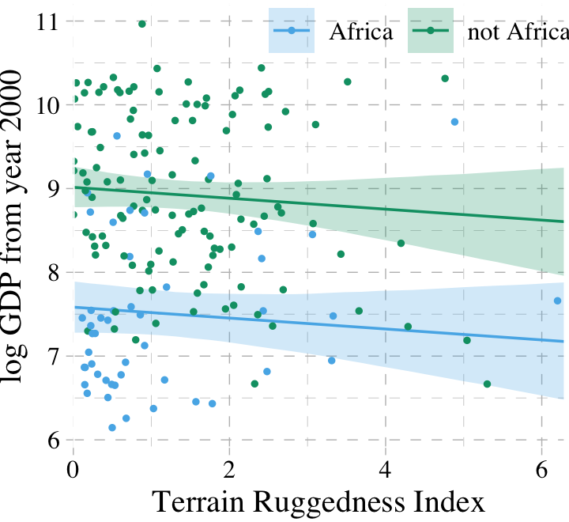
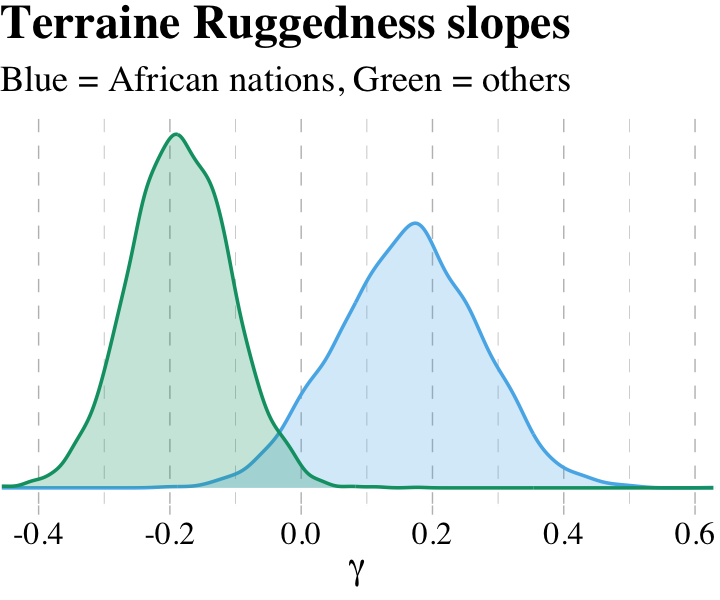
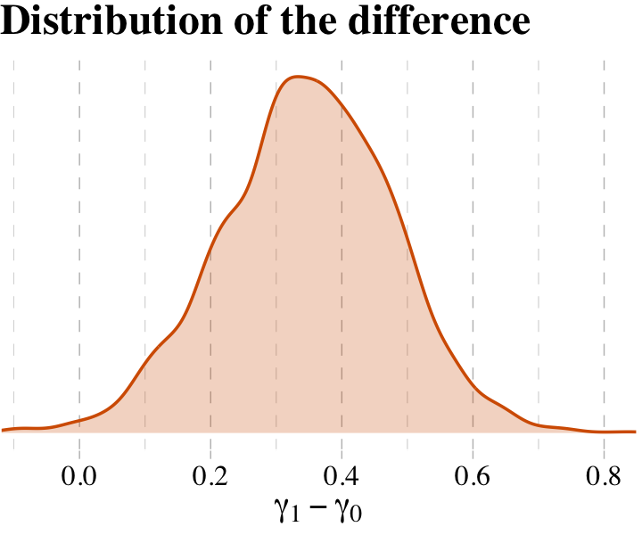
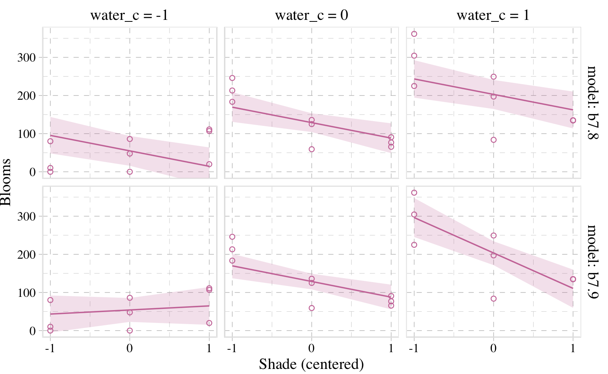
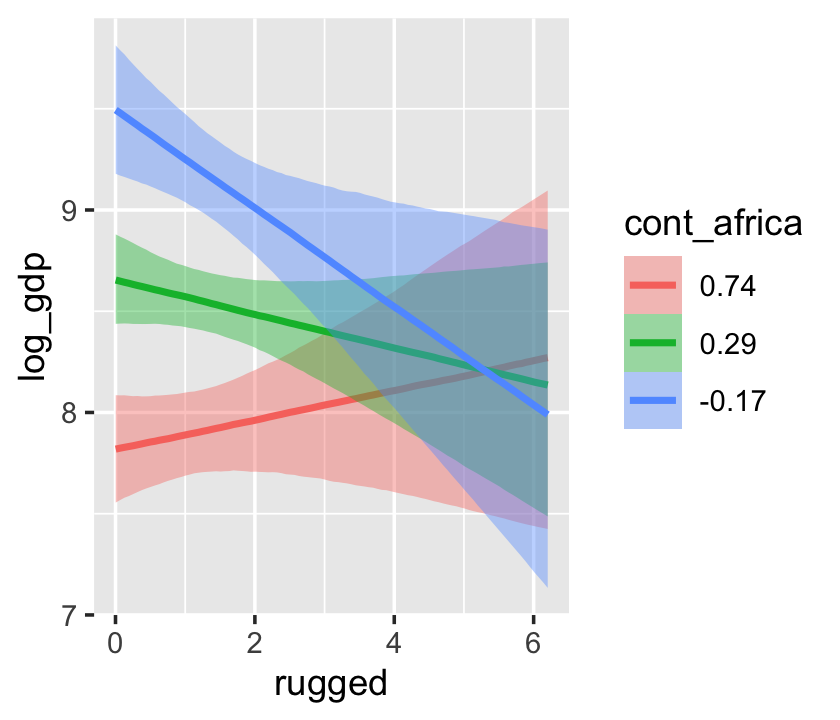
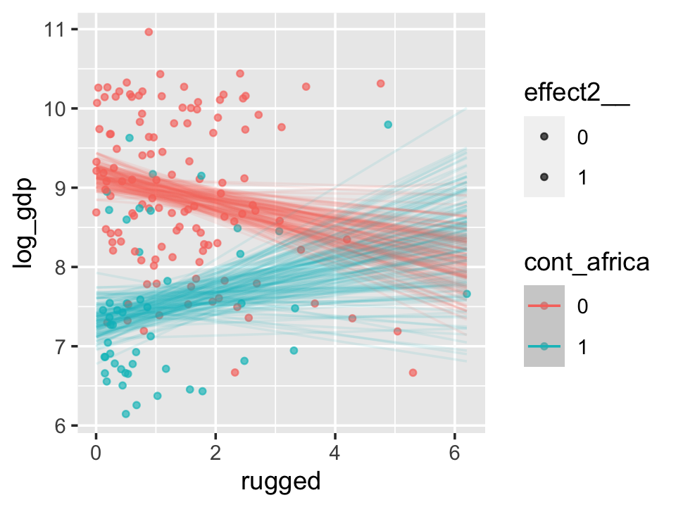

# Interactions

> Every model so far in [McElreath's text] has assumed that each predictor has an independent association with the mean of the outcome. What if we want to allow the association to be conditional?... To model deeper conditionality—where the importance of one predictor depends upon another predictor—we need interaction. Interaction is a kind of conditioning, a way of allowing parameters (really their posterior distributions) to be conditional on further aspects of the data. [@mcelreathStatisticalRethinkingBayesian2015, p. 210]

## Building an interaction.

"Africa is special" (p. 211). Let's load the `rugged` data [@nunn2012ruggedness] to see one of the reasons why.


```r
library(tidyverse)
library(rethinking)
data(rugged)
d <- rugged
```

And here we switch out rethinking for brms.


```r
detach(package:rethinking, unload = T)
library(brms)
rm(rugged)
```

We'll continue to use tidyverse-style syntax to wrangle the data.


```r
# make the log version of criterion
d <- 
  d %>%
  mutate(log_gdp = log(rgdppc_2000))

# extract countries with GDP data
dd <-
  d %>%
  filter(complete.cases(rgdppc_2000))

# split the data into countries in Africa and not in Africa
d.A1 <-
  dd %>%
  filter(cont_africa == 1)

d.A0 <-
  dd %>%
  filter(cont_africa == 0)
```

The first two models predicting `log_gdp` are univariable.


```r
b7.1 <-
  brm(data = d.A1, 
      family = gaussian,
      log_gdp ~ 1 + rugged,
      prior = c(prior(normal(8, 100), class = Intercept),
                prior(normal(0, 1), class = b),
                prior(uniform(0, 10), class = sigma, ub = 10)),
      iter = 2000, warmup = 1000, chains = 4, cores = 4,
      seed = 7,
      file = "fits/b07.01")

b7.2 <-
  update(b7.1, 
         newdata = d.A0,
         iter = 2000, warmup = 1000, chains = 4, cores = 4,
         seed = 7,
         file = "fits/b07.02")
```

In the text, McElreath more or less dared us to figure out how to make Figure 7.2. Here's the brms-relevant data wrangling.


```r
nd <- 
  tibble(rugged = seq(from = 0, to = 6.3, length.out = 30))

f <-
  # bind the two `fitted()` summaries together
  rbind(fitted(b7.1, newdata = nd),
        fitted(b7.2, newdata = nd)) %>% 
  as_tibble() %>% 
  # add the `nd` data, one copy stacked atop another
  bind_cols(
    bind_rows(nd, nd)
  ) %>%
  mutate(cont_africa = rep(c("Africa", "not Africa"), each = 30))
```

For this chapter, we'll take our plot theme from the [ggthemes package](https://cran.r-project.org/package=ggthemes) [@R-ggthemes].


```r
library(ggthemes)
```

Here's the plot code for our version of Figure 7.2.


```r
dd %>%
  mutate(cont_africa = ifelse(cont_africa == 1, "Africa", "not Africa")) %>%
  
  ggplot(aes(x = rugged, color = cont_africa, fill = cont_africa)) +
  geom_smooth(data = f,
              aes(y = Estimate, ymin = Q2.5, ymax = Q97.5),
              stat = "identity", 
              alpha = 1/4, linewidth = 1/2) +
  geom_point(aes(y = log_gdp),
             size = 2/3) +
  scale_colour_pander() +
  scale_fill_pander() +
  scale_x_continuous("Terrain Ruggedness Index", expand = c(0, 0)) +
  ylab("log GDP from year 2000") +
  theme_pander() + 
  theme(text = element_text(family = "Times"),
        legend.position = "none") +
  facet_wrap(~cont_africa)
```


It's generally not a good idea to split up your data and run separate analyses, like this. McElreath listed four reasons why:

1. "There are usually some parameters, such as $\sigma$, that the model says do not depend in any way upon an African identity for each nation. By splitting the data table, you are hurting the accuracy of the estimates for these parameters" (p. 213).
2. "In order to acquire probability statements about the variable you used to split the data, `cont_africa`, in this case, you need to include it in the model" (p. 213).
3. "We many want to use information criteria or another method to compare models" (p. 214).
4. "Once you begin using multilevel models ([Chapter 12][Multilevel Models]), you'll see that there are advantages to borrowing information across categories like 'Africa' and 'not Africa'" (p. 214).

### Adding a dummy variable doesn't work.

Here's our model with all the countries, but without the `cont_africa` dummy.


```r
b7.3 <-
  update(b7.1,
         newdata = dd,
         iter = 2000, warmup = 1000, chains = 4, cores = 4,
         seed = 7,
         file = "fits/b07.03")
```

Now we'll add the dummy.


```r
b7.4 <-
  update(b7.3,
         newdata = dd,
         formula = log_gdp ~ 1 + rugged + cont_africa,
         iter = 2000, warmup = 1000, chains = 4, cores = 4,
         seed = 7,
         file = "fits/b07.04") 
```

Using the skills from [Chapter 6][Comparing WAIC values.], let's compute the information criteria for the two models. Note how with the `add_criterion()` function, you can compute both the LOO and the WAIC at once.


```r
b7.3 <- add_criterion(b7.3, c("loo", "waic"))
b7.4 <- add_criterion(b7.4, c("loo", "waic"))
```

Here we'll compare the models with the `loo_compare()` function, first by the WAIC and then by the LOO.


```r
loo_compare(b7.3, b7.4,
            criterion = "waic")
```

```
##      elpd_diff se_diff
## b7.4   0.0       0.0  
## b7.3 -31.6       7.3
```

```r
loo_compare(b7.3, b7.4,
            criterion = "loo")
```

```
##      elpd_diff se_diff
## b7.4   0.0       0.0  
## b7.3 -31.6       7.3
```

Happily, the WAIC and the LOO are in agreement. The model with the dummy, `b7.4`, fit the data much better. Here are the WAIC model weights.


```r
model_weights(b7.3, b7.4,
              weights = "waic") %>% 
  round(digits = 3)
```

```
## b7.3 b7.4 
##    0    1
```

As in the text, almost all the weight went to the multivariable model, `b7.4`. Before we can plot that model, we need to wrangle a bit.


```r
nd <- 
  crossing(cont_africa = 0:1,
           rugged      = seq(from = 0, to = 6.3, length.out = 30))

f <-
  fitted(b7.4, newdata = nd) %>%
  as_tibble() %>%
  bind_cols(nd) %>%
  mutate(cont_africa = ifelse(cont_africa == 1, "Africa", "not Africa"))
```

Behold our Figure 7.3.


```r
dd %>%
  mutate(cont_africa = ifelse(cont_africa == 1, "Africa", "not Africa")) %>%
  
ggplot(aes(x = rugged, fill = cont_africa, color = cont_africa)) +
  geom_smooth(data = f,
              aes(y = Estimate, ymin = Q2.5, ymax = Q97.5),
              stat = "identity", 
              alpha = 1/4, linewidth = 1/2) +
  geom_point(aes(y = log_gdp),
             size = 2/3) +
  scale_colour_pander() +
  scale_fill_pander() +
  scale_x_continuous("Terrain Ruggedness Index", expand = c(0, 0)) +
  ylab("log GDP from year 2000") +
  theme_pander() + 
  theme(text = element_text(family = "Times"),
        legend.background = element_blank(),
        legend.direction = "horizontal",
        legend.position = c(.69, .94),
        legend.title = element_blank())
```



### Adding a linear interaction does work.

Yes, it sure does. But before we fit, here's the equation:

\begin{align*}
\text{log_gdp}_i & \sim \operatorname{Normal}(\mu_i, \sigma) \\
\mu_i    & = \alpha + \gamma_i \text{rugged}_i + \beta_2 \text{cont_africa}_i \\
\gamma_i & = \beta_1 + \beta_3 \text{cont_africa}_i \\
\alpha   & \sim \operatorname{Normal}(8, 100) \\
\beta_1, \beta_2, \text{ and } \beta_3 & \sim \operatorname{Normal}(0, 1) \\
\sigma   & \sim \operatorname{Uniform}(0, 10).
\end{align*}

Because $\gamma_i$ is just a placeholder for a second linear model, we can just substitute that second linear model in for $\gamma_i$. If we did, here's what the composite linear model would look like:

$$\mu_i = \alpha + (\beta_1 + \beta_3 \text{cont_africa}_i) \text{rugged}_i + \beta_2 \text{cont_africa}_i$$

Fit the model.


```r
b7.5 <-
  update(b7.4,
         formula = log_gdp ~ 1 + rugged*cont_africa,
         iter = 2000, warmup = 1000, chains = 4, cores = 4,
         seed = 7,
         file = "fits/b07.05") 
```

For kicks, we'll just use the LOO to compare the last three models.


```r
b7.5 <- add_criterion(b7.5, c("loo", "waic"))

l <- loo_compare(b7.3, b7.4, b7.5,
                 criterion = "loo")

print(l, simplify = F)
```

```
##      elpd_diff se_diff elpd_loo se_elpd_loo p_loo  se_p_loo looic  se_looic
## b7.5    0.0       0.0  -234.8      7.3         5.2    0.9    469.7   14.6  
## b7.4   -3.2       3.0  -238.1      7.4         4.2    0.8    476.1   14.8  
## b7.3  -34.8       7.3  -269.7      6.5         2.5    0.3    539.3   12.9
```

And recall, if we want those LOO difference scores in the traditional metric like McElreath displayed in the text, we can do a quick conversion with algebra and `cbind()`.


```r
cbind(loo_diff = l[, 1] * -2,
      se       = l[, 2] *  2)
```

```
##       loo_diff        se
## b7.5  0.000000  0.000000
## b7.4  6.446362  5.903881
## b7.3 69.651219 14.660873
```

And we can weight the models based on the LOO rather than the WAIC, too.


```r
model_weights(b7.3, b7.4, b7.5,
              weights = "loo") %>% 
  round(digits = 3)
```

```
##  b7.3  b7.4  b7.5 
## 0.000 0.038 0.962
```

#### Overthinking: Conventional form of interaction.

The conventional equation for the interaction model might look like:

\begin{align*}
\text{log_gdp}_i & \sim \operatorname{Normal}(\mu_i, \sigma) \\
\mu_i & = \alpha + \beta_1 \text{rugged}_i + \beta_2 \text{cont_africa}_i + \beta_3 \text{rugged}_i \times \text{cont_africa}_i.
\end{align*}

Instead of the `y ~ 1 + x1*x2` approach, which will work fine with `brm()`, you can use this more explicit syntax.


```r
b7.5b <-
  update(b7.5,
         formula = log_gdp ~ 1 + rugged + cont_africa + rugged:cont_africa,
         iter = 2000, warmup = 1000, chains = 4, cores = 4,
         seed = 7,
         file = "fits/b07.05b") 
```

From here on, I will default to this style of syntax for interactions.

Since this is the same model, it yields the same information criteria estimates. Here we'll confirm that with the LOO.


```r
b7.5b <- add_criterion(b7.5b, c("loo", "waic"))

b7.5$criteria$loo
```

```
## 
## Computed from 4000 by 170 log-likelihood matrix
## 
##          Estimate   SE
## elpd_loo   -234.8  7.3
## p_loo         5.2  0.9
## looic       469.7 14.6
## ------
## Monte Carlo SE of elpd_loo is 0.1.
## 
## Pareto k diagnostic values:
##                          Count Pct.    Min. n_eff
## (-Inf, 0.5]   (good)     169   99.4%   1312      
##  (0.5, 0.7]   (ok)         1    0.6%   1405      
##    (0.7, 1]   (bad)        0    0.0%   <NA>      
##    (1, Inf)   (very bad)   0    0.0%   <NA>      
## 
## All Pareto k estimates are ok (k < 0.7).
## See help('pareto-k-diagnostic') for details.
```

```r
b7.5b$criteria$loo
```

```
## 
## Computed from 4000 by 170 log-likelihood matrix
## 
##          Estimate   SE
## elpd_loo   -234.8  7.3
## p_loo         5.2  0.9
## looic       469.7 14.6
## ------
## Monte Carlo SE of elpd_loo is 0.1.
## 
## Pareto k diagnostic values:
##                          Count Pct.    Min. n_eff
## (-Inf, 0.5]   (good)     169   99.4%   1312      
##  (0.5, 0.7]   (ok)         1    0.6%   1405      
##    (0.7, 1]   (bad)        0    0.0%   <NA>      
##    (1, Inf)   (very bad)   0    0.0%   <NA>      
## 
## All Pareto k estimates are ok (k < 0.7).
## See help('pareto-k-diagnostic') for details.
```

When compared, they have the exact same LOO weights, too.


```r
model_weights(b7.5, b7.5b, weights = "loo")
```

```
##  b7.5 b7.5b 
##   0.5   0.5
```

### Plotting the interaction.

Here's our prep work for the figure.


```r
f <-
  fitted(b7.5, newdata = nd) %>%  # we can use the same `nd` data from last time
  as_tibble() %>%
  bind_cols(nd) %>%
  mutate(cont_africa = ifelse(cont_africa == 1, "Africa", "not Africa"))
```

And here's the code for our version of Figure 7.4.


```r
dd %>%
  mutate(cont_africa = ifelse(cont_africa == 1, "Africa", "not Africa")) %>%
  
  ggplot(aes(x = rugged, fill = cont_africa, color = cont_africa)) +
  geom_smooth(data = f,
              aes(y = Estimate, ymin = Q2.5, ymax = Q97.5),
              stat = "identity", 
              alpha = 1/4, linewidth = 1/2) +
  geom_point(aes(y = log_gdp),
             size = 2/3) +
  scale_colour_pander() +
  scale_fill_pander() +
  scale_x_continuous("Terrain Ruggedness Index", expand = c(0, 0)) +
  ylab("log GDP from year 2000") +
  theme_pander() + 
  theme(text = element_text(family = "Times"),
        legend.position = "none") +
  facet_wrap(~cont_africa)
```


### Interpreting an interaction estimate.

> Interpreting interaction estimates is tricky. It's trickier than interpreting ordinary estimates. And for this reason, I usually advise against trying to understand an interaction from tables of numbers alone. Plotting implied predictions does far more for both our own understanding and for our audience's. (p. 219)

#### Parameters change meaning.

> In a simple linear regression with no interactions, each coefficient says how much the average outcome, $\mu$, changes when the predictor changes by one unit. And since all of the parameters have independent influences on the outcome, there's no trouble in interpreting each parameter separately. Each slope parameter gives us a direct measure of each predictor variable's influence.
>
> Interaction models ruin this paradise. (p. 220)

Return the parameter estimates.


```r
posterior_summary(b7.5)[1:5, ]
```

```
##                        Estimate  Est.Error        Q2.5       Q97.5
## b_Intercept           9.1878514 0.13901755  8.91866731  9.46277109
## b_rugged             -0.1851148 0.07714022 -0.33591189 -0.03181227
## b_cont_africa        -1.8461645 0.22413995 -2.27497448 -1.40541453
## b_rugged:cont_africa  0.3473497 0.13070615  0.08719828  0.59316599
## sigma                 0.9526147 0.05328941  0.85598268  1.06326140
```

"Since $\gamma$ (gamma) doesn't appear in this table--it wasn't estimated--we have to compute it ourselves" (p. 221). Like in the text, we'll do so first by working with the point estimates.


```r
# slope relating `rugged` to `log_gdp` within Africa
fixef(b7.5)[2, 1] + fixef(b7.5)[4, 1] * 1
```

```
## [1] 0.1622349
```

```r
# slope relating `rugged` to `log_gdp` outside of Africa
fixef(b7.5)[2, 1] + fixef(b7.5)[4, 1] * 0
```

```
## [1] -0.1851148
```

#### Incorporating uncertainty.

> To get some idea of the uncertainty around those $\gamma$ values, we'll need to use the whole posterior. Since $\gamma$ depends upon parameters, and those parameters have a posterior distribution, $\gamma$ must also have a posterior distribution. Read the previous sentence again a few times. It's one of the most important concepts in processing Bayesian model fits. *Anything calculated using parameters has a distribution*. (p. 212, *emphasis* added)

Like McElreath, we'll avoid integral calculus in favor of working with the posterior draws.


```r
post <- as_draws_df(b7.5) 

post %>%
  transmute(gamma_Africa    = b_rugged + `b_rugged:cont_africa` * 1,
            gamma_notAfrica = b_rugged + `b_rugged:cont_africa` * 0) %>%
  gather(key, value) %>%
  group_by(key) %>%
  summarise(mean = mean(value))
```

```
## # A tibble: 2 × 2
##   key               mean
##   <chr>            <dbl>
## 1 gamma_Africa     0.162
## 2 gamma_notAfrica -0.185
```

And here is our version of Figure 7.5.


```r
post %>%
  # this `transmute()` code returns the same thing as the one in the block above
  transmute(gamma_Africa    = b_rugged + `b_rugged:cont_africa`,
            gamma_notAfrica = b_rugged) %>%
  gather(key, value) %>%
  
  ggplot(aes(x = value, group = key, color = key, fill = key)) +
  geom_density(alpha = 1/4) +
  scale_colour_pander() +
  scale_fill_pander() +
  scale_x_continuous(expression(gamma), expand = c(0, 0)) +
  scale_y_continuous(NULL, breaks = NULL) +
  ggtitle("Terraine Ruggedness slopes",
          subtitle = "Blue = African nations, Green = others") +
  theme_pander() + 
  theme(text = element_text(family = "Times"),
        legend.position = "none")
```



What proportion of these differences is below zero?


```r
post %>%
  mutate(gamma_Africa    = b_rugged + `b_rugged:cont_africa`,
         gamma_notAfrica = b_rugged) %>% 
  mutate(diff = gamma_Africa -gamma_notAfrica) %>%
  summarise(Proportion_of_the_difference_below_0 = sum(diff < 0) / length(diff))
```

```
## # A tibble: 1 × 1
##   Proportion_of_the_difference_below_0
##                                  <dbl>
## 1                              0.00625
```

> The distributions in the figure are *marginal*, like silhouettes of each distribution, ignoring all of the other dimensions in the posterior. The calculation above is the distribution of the *difference* between the two. The distribution of their difference is not the same as the visual overlap of their marginal distributions. This is also the reason we can’t use overlap in confidence intervals of different parameters as an informal test of "significance" of the difference. If you care about the difference, you must compute the distribution of the difference directly. (p. 222, *emphasis* in the original)

Why stop with computation when you can plot?


```r
post %>%
  mutate(gamma_Africa    = b_rugged + `b_rugged:cont_africa`,
         gamma_notAfrica = b_rugged) %>% 
  mutate(diff = gamma_Africa -gamma_notAfrica) %>% 
  
  ggplot(aes(x = diff)) +
  geom_density(alpha = 1/4,
               color = palette_pander(n = 5)[5], 
               fill  = palette_pander(n = 5)[5]) +
  scale_x_continuous(expression(gamma[1]-gamma[0]), expand = c(0, 0)) +
  scale_y_continuous(NULL, breaks = NULL) +
  ggtitle("Distribution of the difference") +
  theme_pander() + 
  theme(text = element_text(family = "Times"),
        legend.position = "none")
```



## Symmetry of the linear interaction.

> Consider for example the GDP and terrain ruggedness problem. The interaction there has two equally valid phrasings.
>
> 1. How much does the influence of ruggedness (on GDP) depend upon whether the nation is in Africa?
> 2. How much does the influence of being in Africa (on GDP) depend upon ruggedness?
>
> While these two possibilities sound different to most humans, your golem thinks they are identical. (p. 223)

### Buridan's interaction.

Recall the original equation,

\begin{align*}
\text{log_gdp}_i & \sim \operatorname{Normal}(\mu_i, \sigma) \\
\mu_i    & = \alpha + \gamma_i \text{rugged}_i + \beta_2 \text{cont_africa}_i \\
\gamma_i & = \beta_1 + \beta_3 \text{cont_africa}_i.
\end{align*}

Next McElreath replaced $\gamma_i$ with the expression for $\mu_i$:

\begin{align*}
\mu_i & = \alpha + (\beta_1 + \beta_3 \text{cont_africa}_i) \times \text{rugged}_i + \beta_2 \text{cont_africa}_i \\
      & = \alpha + \beta_1 \text{rugged}_i + \beta_3 \text{rugged}_i \times \text{cont_africa}_i + \beta_2 \text{cont_africa}_i.
\end{align*}

And now we'll factor together the terms containing $\text{cont_africa}_i$:

$$
\mu_i = \alpha + \beta_1 \text{rugged}_i + \underbrace{(\beta_2 + \beta_3 \text{rugged}_i)}_G \times \text{cont_africa}_i.
$$

And just as in the text, our $G$ term looks a lot like the original $\gamma_i$ term.

### Africa depends upon ruggedness.

Here is our version of McElreath's Figure 7.6.


```r
# new predictor data for `fitted()`
nd <- 
  crossing(cont_africa = 0:1,
           rugged      = range(dd$rugged))

# `fitted()`
f <-
  fitted(b7.5, newdata = nd) %>%
  as_tibble() %>%
  bind_cols(nd) %>% 
  mutate(ox = rep(c(-0.05, 0.05), times = 2))

# augment the `dd` data a bit
dd %>% 
  mutate(ox          = ifelse(rugged > median(rugged), 0.05, -0.05),
         cont_africa = cont_africa + ox) %>%
  mutate(ox = factor(ox)) %>% 
  select(cont_africa, everything()) %>%
  
  # plot
  ggplot(aes(x = cont_africa, color = ox, fill = ox)) +
  geom_smooth(data = f %>% mutate(ox = factor(ox)),
              aes(y = Estimate, ymin = Q2.5, ymax = Q97.5,
                  linetype = ox),
              stat = "identity",
              alpha = 1/4, linewidth = 1/2) +
  geom_point(aes(y = log_gdp),
             alpha = 1/2, shape = 1) +
  scale_colour_pander() +
  scale_fill_pander() +
  scale_x_continuous("Continent", breaks = 0:1, 
                     labels = c("other", "Africa")) +
  coord_cartesian(xlim = c(-.2, 1.2)) +
  ylab("log GDP from year 2000") +
  theme_pander() +
  theme(text = element_text(family = "Times"),
        legend.position = "none")
```


## Continuous interactions

Though continuous interactions can be more challenging to interpret, they're just as easy to fit as interactions including dummies.

### The data.

Look at the `tulips` (adapted from @grafenModernStatisticsLife2002).


```r
library(rethinking)
data(tulips)
d <- tulips
str(d)
```

```
## 'data.frame':	27 obs. of  4 variables:
##  $ bed   : Factor w/ 3 levels "a","b","c": 1 1 1 1 1 1 1 1 1 2 ...
##  $ water : int  1 1 1 2 2 2 3 3 3 1 ...
##  $ shade : int  1 2 3 1 2 3 1 2 3 1 ...
##  $ blooms: num  0 0 111 183.5 59.2 ...
```

### The un-centered models.

The equations for the next two models are

\begin{align*}
\text{blooms}_i & \sim \operatorname{Normal}(\mu_i, \sigma) \\
\mu_i   & = \alpha + \beta_1 \text{water}_i + \beta_2 \text{shade}_i \\
\alpha  & \sim \operatorname{Normal}(0, 100) \\
\beta_1 & \sim \operatorname{Normal}(0, 100) \\
\beta_2 & \sim \operatorname{Normal}(0, 100) \\
\sigma  & \sim \operatorname{Uniform}(0, 100), \;\;\; \text{and} \\ \\
\text{blooms}_i & \sim \operatorname{Normal}(\mu_i, \sigma) \\
\mu_i   & = \alpha + \beta_1 \text{water} + \beta_2 \text{shade}_i + \beta_3 \text{water}_i \times \text{shade}_i \\
\alpha  & \sim \operatorname{Normal}(0, 100) \\
\beta_1 & \sim \operatorname{Normal}(0, 100) \\
\beta_2 & \sim \operatorname{Normal}(0, 100) \\
\beta_3 & \sim \operatorname{Normal}(0, 100) \\
\sigma  & \sim \operatorname{Uniform}(0, 100).
\end{align*}

Load brms.


```r
detach(package:rethinking, unload = T)
library(brms)
rm(tulips)
```

Here we continue with McElreath's very-flat priors for the multivariable and interaction models.


```r
b7.6 <-
  brm(data = d, family = gaussian,
      blooms ~ 1 + water + shade,
      prior = c(prior(normal(0, 100), class = Intercept),
                prior(normal(0, 100), class = b),
                prior(uniform(0, 100), class = sigma, ub = 100)),
      iter = 2000, warmup = 1000, cores = 4, chains = 4,
      seed = 7,
      file = "fits/b07.06")

b7.7 <- 
  update(b7.6, 
         formula = blooms ~ 1 + water + shade + water:shade,
         iter = 2000, warmup = 1000, cores = 4, chains = 4,
         seed = 7,
         file = "fits/b07.07")
```

Unlike in the text, these models fit without problem.

Instead of `coeftab()`, we can use the `posterior_summary()` function, which gets us most of the way there.


```r
posterior_summary(b7.6)[1:4, ] %>% round(digits = 2)
```

```
##             Estimate Est.Error   Q2.5  Q97.5
## b_Intercept    60.79     44.72 -29.69 153.41
## b_water        73.75     14.83  43.35 101.68
## b_shade       -40.58     14.96 -69.68 -10.03
## sigma          64.16      9.96  47.83  87.88
```

```r
posterior_summary(b7.7)[1:5, ] %>% round(digits = 2)
```

```
##               Estimate Est.Error    Q2.5  Q97.5
## b_Intercept    -105.96     66.32 -235.18  25.37
## b_water         159.26     30.67   98.56 217.31
## b_shade          43.26     30.50  -17.72 101.83
## b_water:shade   -42.85     14.15  -70.58 -13.83
## sigma            52.05      8.32   38.66  70.59
```

This is an example where HMC yielded point estimates notably different from MAP. However, look at the size of those posterior standard deviations (i.e., 'Est.Error' column)! The MAP estimates are well within a fraction of those $\textit{SD}$'s.

Let's look at WAIC.


```r
b7.6 <- add_criterion(b7.6, "waic")
b7.7 <- add_criterion(b7.7, "waic")

w <- loo_compare(b7.6, b7.7, criterion = "waic")

print(w, simplify = F)
```

```
##      elpd_diff se_diff elpd_waic se_elpd_waic p_waic se_p_waic waic   se_waic
## b7.7    0.0       0.0  -146.8       3.7          4.3    1.1     293.5    7.3 
## b7.6   -5.2       2.4  -151.9       3.5          3.7    0.9     303.8    7.0
```

Here we use our `cbind()` trick to convert the difference from the $\text{elpd}$ metric to the more traditional WAIC metric.


```r
cbind(waic_diff = w[, 1] * -2,
      se        = w[, 2] *  2)
```

```
##      waic_diff       se
## b7.7   0.00000 0.000000
## b7.6  10.30703 4.864103
```

Why not compute the WAIC weights?


```r
model_weights(b7.6, b7.7, weights = "waic")
```

```
##        b7.6        b7.7 
## 0.005745863 0.994254137
```

As in the text, almost all the weight went to the interaction model, `b7.7`.

#### Rethinking: Fighting with your robot.

> The trouble-shooting in the preceding section is annoying, but it's realistic. These kinds of issues routinely arise in model fitting. With linear models like these, there are ways to compute the posterior distribution that avoid many of these complications. But with non-linear models to come, there is really no way to dodge the issue. In general, *how you fit the model is part of the model*. (pp. 229--230, *emphasis* added)

### Center and re-estimate.

> To *center* a variable means to create a new variable that contains the same information as the original, but has a new mean of zero. For example, to make centered versions of `shade` and `water`, just subtract the mean of the original from each value. (p. 230, *emphasis* in the original)

Here's a tidyverse way to center the predictors.


```r
d <-
  d %>%
  mutate(shade_c = shade - mean(shade),
         water_c = water - mean(water))
```

Now refit the models with our shiny new centered predictors.


```r
b7.8 <-
  brm(data = d, family = gaussian,
      blooms ~ 1 + water_c + shade_c,
      prior = c(prior(normal(130, 100), class = Intercept),
                prior(normal(0, 100), class = b),
                prior(uniform(0, 100), class = sigma, ub = 100)),
      iter = 2000, warmup = 1000, chains = 4, cores = 4,
      seed = 7,
      file = "fits/b07.08")

b7.9 <- 
  update(b7.8, 
         formula = blooms ~ 1 + water_c + shade_c + water_c:shade_c,
         iter = 2000, warmup = 1000, chains = 4, cores = 4,
         seed = 7,
         file = "fits/b07.09")
```

Check out the results.


```r
posterior_summary(b7.8)[1:4, ] %>% round(digits = 2)
```

```
##             Estimate Est.Error   Q2.5  Q97.5
## b_Intercept   128.88     12.44 104.20 153.36
## b_water_c      74.03     14.96  43.64 104.33
## b_shade_c     -40.53     15.55 -70.98 -10.40
## sigma          64.33      9.86  48.13  87.68
```

```r
posterior_summary(b7.9)[1:5, ] %>% round(digits = 2)
```

```
##                   Estimate Est.Error   Q2.5  Q97.5
## b_Intercept         128.78     10.37 108.11 149.06
## b_water_c            74.73     11.98  51.04  98.06
## b_shade_c           -41.08     12.36 -65.45 -16.85
## b_water_c:shade_c   -51.78     15.23 -81.79 -20.56
## sigma                51.97      8.27  39.02  71.15
```

And okay fine, if you really want a `coeftab()`-like summary, here's a way to do it.


```r
get_summary <- function(fit) {
  
  fit %>% 
    posterior::summarise_draws(mean) %>%
    filter(variable != "lprior") %>% 
    filter(variable != "lp__")
  
}

tibble(model = str_c("b7.", 8:9)) %>% 
  mutate(fit = purrr::map(model, get)) %>% 
  mutate(mean = purrr::map(fit, get_summary)) %>% 
  select(-fit) %>% 
  unnest(mean) %>% 
  select(variable, mean, model) %>% 
  spread(key = model, value = mean) %>% 
  mutate_if(is.double, round, digits = 2)
```

```
## # A tibble: 5 × 3
##   variable           b7.8  b7.9
##   <chr>             <dbl> <dbl>
## 1 b_Intercept       129.  129. 
## 2 b_shade_c         -40.5 -41.1
## 3 b_water_c          74.0  74.7
## 4 b_water_c:shade_c  NA   -51.8
## 5 sigma              64.3  52.0
```

Anyway, centering helped a lot. Now, not only do the results in the text match up better than those from Stan, but the 'Est.Error' values are uniformly smaller.

#### Estimation worked better.

Nothing to add, here.

#### Estimates changed less across models.

On page 231, we read:

> The interaction parameter always factors into generating a prediction. Consider for example a tulip at the average moisture and shade levels, 2 in each case. The expected blooms for such a tulip is:

$$\mu_i | \text{shade}_{i = 2}, \text{water}_{i = 2} = \alpha + \beta_\text{water} (2) + \beta_\text{shade} (2) + \beta_{\text{water} \times \text{shade}} (2 \times 2)$$

> So to figure out the effect of increasing water by 1 unit, you have to use all of the $\beta$ parameters. Plugging in the [HMC] values for the un-centered interaction model, [`b7.7`], we get:

$$\mu_i | \text{shade}_{i = 2}, \text{water}_{i = 2} = -106.2 + 159.3 (2) + 43.4 (2) -42.9 (2 \times 2)$$

With our brms workflow, we use `fixef()` to compute the predictions.


```r
k <- fixef(b7.7)
k[1] + k[2] * 2 + k[3] * 2 + k[4] * 2 * 2
```

```
## [1] 127.6791
```

Even though or HMC parameters differ a bit from the MAP estimates McElreath reported in the text, the value they predicted matches quite closely with the one in the text. Same thing for the next example.


```r
k <- fixef(b7.9)
k[1] + k[2] * 0 + k[3] * 0 + k[4] * 0 * 0
```

```
## [1] 128.7808
```

Here are the coefficient summaries for the centered model.


```r
print(b7.9)
```

```
##  Family: gaussian 
##   Links: mu = identity; sigma = identity 
## Formula: blooms ~ water_c + shade_c + water_c:shade_c 
##    Data: d (Number of observations: 27) 
##   Draws: 4 chains, each with iter = 2000; warmup = 1000; thin = 1;
##          total post-warmup draws = 4000
## 
## Population-Level Effects: 
##                 Estimate Est.Error l-95% CI u-95% CI Rhat Bulk_ESS Tail_ESS
## Intercept         128.78     10.37   108.11   149.06 1.00     4510     2501
## water_c            74.73     11.98    51.04    98.06 1.00     4915     3075
## shade_c           -41.08     12.36   -65.45   -16.85 1.00     4949     3109
## water_c:shade_c   -51.78     15.23   -81.79   -20.56 1.00     5030     2519
## 
## Family Specific Parameters: 
##       Estimate Est.Error l-95% CI u-95% CI Rhat Bulk_ESS Tail_ESS
## sigma    51.97      8.27    39.02    71.15 1.00     2881     2376
## 
## Draws were sampled using sampling(NUTS). For each parameter, Bulk_ESS
## and Tail_ESS are effective sample size measures, and Rhat is the potential
## scale reduction factor on split chains (at convergence, Rhat = 1).
```

### Plotting implied predictions.

Now we're ready for the bottom row of Figure 7.7. Here's our variation on McElreath's triptych loop code, adjusted for brms and ggplot2.


```r
# loop over values of `water_c` and plot predictions
shade_seq <- -1:1

for(w in -1:1) {
  # define the subset of the original data
  dt <- d[d$water_c == w, ]
  # defining our new data
  nd <- tibble(water_c = w, shade_c = shade_seq)
  # use our sampling skills, like before
  f <- 
    fitted(b7.9, newdata = nd) %>%
    as_tibble() %>%
    bind_cols(nd)
  
  # specify our custom plot
  fig <- 
    ggplot() +
    geom_smooth(data = f,
                aes(x = shade_c, y = Estimate, ymin = Q2.5, ymax = Q97.5),
                stat = "identity", 
                fill = "#CC79A7", color = "#CC79A7", alpha = 1/5, linewidth = 1/2) +
    geom_point(data = dt, 
               aes(x = shade_c, y = blooms),
               shape = 1, color = "#CC79A7") +
    coord_cartesian(xlim = range(d$shade_c), 
                    ylim = range(d$blooms)) +
    scale_x_continuous("Shade (centered)", breaks = c(-1, 0, 1)) +
    labs("Blooms", 
         title = paste("Water (centered) =", w)) +
    theme_pander() + 
    theme(text = element_text(family = "Times"))
  
  # plot that joint
  plot(fig)
}
```


But we don't necessarily need a loop. We can achieve all of McElreath's Figure 7.7 with `fitted()`, some data wrangling, and a little help from `ggplot2::facet_grid()`.


```r
# `fitted()` for model b7.8
fitted(b7.8) %>%
  as_tibble() %>%
  # add `fitted()` for model b7.9
  bind_rows(
    fitted(b7.9) %>% 
      as_tibble()
  ) %>% 
  # we'll want to index the models
  mutate(fit  = rep(c("b7.8", "b7.9"), each = 27)) %>% 
  # here we add the data, `d`
  bind_cols(bind_rows(d, d)) %>% 
  # these will come in handy for `ggplot2::facet_grid()`
  mutate(x_grid = str_c("water_c = ", water_c),
         y_grid = str_c("model: ", fit)) %>% 
  
  # plot!
  ggplot(aes(x = shade_c)) +
  geom_smooth(aes(y = Estimate, ymin = Q2.5, ymax = Q97.5),
              stat = "identity", 
              fill = "#CC79A7", color = "#CC79A7", alpha = 1/5, linewidth = 1/2) +
  geom_point(aes(y = blooms, group = x_grid), 
             shape = 1, color = "#CC79A7") +
  scale_x_continuous("Shade (centered)", breaks = c(-1, 0, 1)) +
  ylab("Blooms") +
  coord_cartesian(xlim = range(d$shade_c), 
                  ylim = range(d$blooms)) +
  theme_pander() + 
  theme(text = element_text(family = "Times"),
        panel.background = element_rect(color = "black")) +
  facet_grid(y_grid ~ x_grid)
```



## Interactions in design formulas

The brms syntax generally follows the design formulas typical of `lm()`. Hopefully this is all old hat.

## ~~Summary~~ Bonus: `marginal_effects()`/`conditional_effects()`

The brms package includes the `conditional_effects()` function as a convenient way to look at simple effects and two-way interactions. To clarify, it was previously known as `marginal_effects()` until brms version 2.10.3 (see [here](https://github.com/paul-buerkner/brms/issues/735)). Recall the simple univariable model, `b7.3`:


```r
b7.3$formula
```

```
## log_gdp ~ 1 + rugged
```

We can look at the regression line and its percentile-based intervals like so:


```r
conditional_effects(b7.3)
```


If we feed the `conditional_effects()` output into the `plot()` function with a `points = T` argument, we can add the original data to the figure.


```r
conditional_effects(b7.3) %>% 
  plot(points = T)
```


We can further customize the plot. For example, we can replace the intervals with a spaghetti plot. While we're at it, we can use `point_args` to adjust the `geom_jitter()` parameters.


```r
conditional_effects(b7.3,
                    spaghetti = T, 
                    ndraws = 200) %>% 
  plot(points = T,
       point_args = c(alpha = 1/2, size = 1))
```


With multiple predictors, things get more complicated. Consider our multivariable, non-interaction model, `b7.4`.


```r
b7.4$formula
```

```
## log_gdp ~ rugged + cont_africa
```

```r
conditional_effects(b7.4)
```


We got one plot for each predictor, controlling the other predictor at zero. Note how the plot for `cont_africa` treated it as a continuous variable. This is because the variable was saved as an integer in the original data set:


```r
b7.4$data %>% 
  glimpse()
```

```
## Rows: 170
## Columns: 3
## $ log_gdp     <dbl> 7.492609, 8.216929, 9.933263, 9.407032, 7.792343, 9.212541, 10.143191, 10.2746…
## $ rugged      <dbl> 0.858, 3.427, 0.769, 0.775, 2.688, 0.006, 0.143, 3.513, 1.672, 1.780, 0.388, 0…
## $ cont_africa <int> 1, 0, 0, 0, 0, 0, 0, 0, 0, 1, 0, 1, 1, 0, 0, 0, 0, 0, 0, 0, 0, 0, 0, 1, 1, 0, …
```

One way to fix that is to adjust the data set and refit the model.


```r
d_factor <-
  b7.4$data %>% 
  mutate(cont_africa = factor(cont_africa))

b7.4_factor <- 
  update(b7.4, 
         newdata = d_factor,
         file = "fits/b07.04_factor")
```

Using the `update()` syntax often speeds up the re-fitting process.


```r
conditional_effects(b7.4_factor)
```


Now our second marginal plot more clearly expresses the `cont_africa` predictor as categorical.

Things get more complicated with the interaction model, `b7.5`.


```r
b7.5$formula
```

```
## log_gdp ~ rugged + cont_africa + rugged:cont_africa
```

```r
conditional_effects(b7.5)
```



The `conditional_effects()` function defaults to expressing interactions such that the first variable in the term--in this case, `rugged`--is on the x axis and the second variable in the term--`cont_africa`, treated as an integer--is depicted in three lines corresponding its mean and its mean $\pm$ one standard deviation. This is great for continuous variables, but incoherent for categorical ones. The fix is, you guessed it, to refit the model after adjusting the data.


```r
d_factor <-
  b7.5$data %>% 
  mutate(cont_africa = factor(cont_africa))

b7.5_factor <- 
  update(b7.5, 
         newdata = d_factor,
         file = "fits/b07.05_factor")
```

Just for kicks, we'll use `prob = .5` to return [50% intervals](https://statmodeling.stat.columbia.edu/2016/11/05/why-i-prefer-50-to-95-intervals/), rather than the conventional 95%.


```r
conditional_effects(b7.5_factor, prob = .5)
```


With the `effects` argument, we can just return the interaction effect, which is where all the action's at. While we're at it, we'll use `plot()` to change some of the settings.


```r
conditional_effects(b7.5_factor,
                    effects = "rugged:cont_africa", 
                    spaghetti = T, 
                    ndraws = 150) %>% 
  plot(points = T,
       point_args = c(alpha = 2/3, size = 1), mean = F)
```



Note, the ordering of the variables matters for the interaction term. Consider our interaction model for the tulips data.


```r
b7.9$formula
```

```
## blooms ~ water_c + shade_c + water_c:shade_c
```

The plot tells a slightly different story, depending on whether you specify `effects = "shade_c:water_c"` or `effects = "water_c:shade_c"`.


```r
conditional_effects(b7.9, 
                    effects = "shade_c:water_c") %>% 
  plot(points = T)
```


```r
conditional_effects(b7.9, 
                    effects = "water_c:shade_c") %>% 
  plot(points = T)
```


One might want to evaluate the effects of the second term in the interaction--`water_c`, in this case--at values other than the mean and the mean $\pm$ one standard deviation. When we reproduced the bottom row of Figure 7.7, we expressed the interaction based on values -1, 0, and 1 for `water_c`. We can do that, here, by using the `int_conditions` argument. It expects a list, so we'll put our desired `water_c` values in just that.


```r
ic <- 
  list(water_c = c(-1, 0, 1))

conditional_effects(b7.9,
                    effects = "shade_c:water_c",
                    int_conditions = ic) %>% 
  plot(points = T)
```


## Session info {-}


```r
sessionInfo()
```

```
## R version 4.2.2 (2022-10-31)
## Platform: x86_64-apple-darwin17.0 (64-bit)
## Running under: macOS Big Sur ... 10.16
## 
## Matrix products: default
## BLAS:   /Library/Frameworks/R.framework/Versions/4.2/Resources/lib/libRblas.0.dylib
## LAPACK: /Library/Frameworks/R.framework/Versions/4.2/Resources/lib/libRlapack.dylib
## 
## locale:
## [1] en_US.UTF-8/en_US.UTF-8/en_US.UTF-8/C/en_US.UTF-8/en_US.UTF-8
## 
## attached base packages:
## [1] parallel  stats     graphics  grDevices utils     datasets  methods   base     
## 
## other attached packages:
##  [1] ggthemes_4.2.4       brms_2.18.0          Rcpp_1.0.9           cmdstanr_0.5.3      
##  [5] rstan_2.21.8         StanHeaders_2.21.0-7 forcats_0.5.1        stringr_1.4.1       
##  [9] dplyr_1.0.10         purrr_1.0.1          readr_2.1.2          tidyr_1.2.1         
## [13] tibble_3.1.8         ggplot2_3.4.0        tidyverse_1.3.2     
## 
## loaded via a namespace (and not attached):
##   [1] readxl_1.4.1         backports_1.4.1      plyr_1.8.7           igraph_1.3.4        
##   [5] sp_1.5-0             splines_4.2.2        crosstalk_1.2.0      TH.data_1.1-1       
##   [9] rstantools_2.2.0     inline_0.3.19        digest_0.6.31        htmltools_0.5.3     
##  [13] fansi_1.0.3          magrittr_2.0.3       checkmate_2.1.0      googlesheets4_1.0.1 
##  [17] tzdb_0.3.0           modelr_0.1.8         RcppParallel_5.1.5   matrixStats_0.63.0  
##  [21] xts_0.12.1           sandwich_3.0-2       prettyunits_1.1.1    colorspace_2.0-3    
##  [25] rvest_1.0.2          rgdal_1.5-30         haven_2.5.1          xfun_0.35           
##  [29] callr_3.7.3          crayon_1.5.2         jsonlite_1.8.4       lme4_1.1-31         
##  [33] survival_3.4-0       zoo_1.8-10           glue_1.6.2           gtable_0.3.1        
##  [37] gargle_1.2.0         emmeans_1.8.0        distributional_0.3.1 pkgbuild_1.3.1      
##  [41] shape_1.4.6          abind_1.4-5          scales_1.2.1         mvtnorm_1.1-3       
##  [45] DBI_1.1.3            miniUI_0.1.1.1       xtable_1.8-4         stats4_4.2.2        
##  [49] DT_0.24              htmlwidgets_1.5.4    httr_1.4.4           threejs_0.3.3       
##  [53] posterior_1.3.1      ellipsis_0.3.2       pkgconfig_2.0.3      loo_2.5.1           
##  [57] farver_2.1.1         sass_0.4.2           dbplyr_2.2.1         utf8_1.2.2          
##  [61] labeling_0.4.2       tidyselect_1.2.0     rlang_1.0.6          reshape2_1.4.4      
##  [65] later_1.3.0          munsell_0.5.0        cellranger_1.1.0     tools_4.2.2         
##  [69] cachem_1.0.6         cli_3.6.0            generics_0.1.3       broom_1.0.2         
##  [73] evaluate_0.18        fastmap_1.1.0        processx_3.8.0       knitr_1.40          
##  [77] fs_1.5.2             pander_0.6.5         nlme_3.1-160         mime_0.12           
##  [81] projpred_2.2.1       xml2_1.3.3           compiler_4.2.2       bayesplot_1.10.0    
##  [85] shinythemes_1.2.0    rstudioapi_0.13      gamm4_0.2-6          reprex_2.0.2        
##  [89] bslib_0.4.0          stringi_1.7.8        highr_0.9            ps_1.7.2            
##  [93] Brobdingnag_1.2-8    lattice_0.20-45      Matrix_1.5-1         nloptr_2.0.3        
##  [97] markdown_1.1         shinyjs_2.1.0        tensorA_0.36.2       vctrs_0.5.1         
## [101] pillar_1.8.1         lifecycle_1.0.3      jquerylib_0.1.4      bridgesampling_1.1-2
## [105] estimability_1.4.1   httpuv_1.6.5         R6_2.5.1             bookdown_0.28       
## [109] promises_1.2.0.1     gridExtra_2.3        codetools_0.2-18     boot_1.3-28         
## [113] colourpicker_1.1.1   MASS_7.3-58.1        gtools_3.9.4         assertthat_0.2.1    
## [117] withr_2.5.0          shinystan_2.6.0      multcomp_1.4-20      mgcv_1.8-41         
## [121] hms_1.1.1            grid_4.2.2           coda_0.19-4          minqa_1.2.5         
## [125] rmarkdown_2.16       googledrive_2.0.0    shiny_1.7.2          lubridate_1.8.0     
## [129] base64enc_0.1-3      dygraphs_1.1.1.6
```


