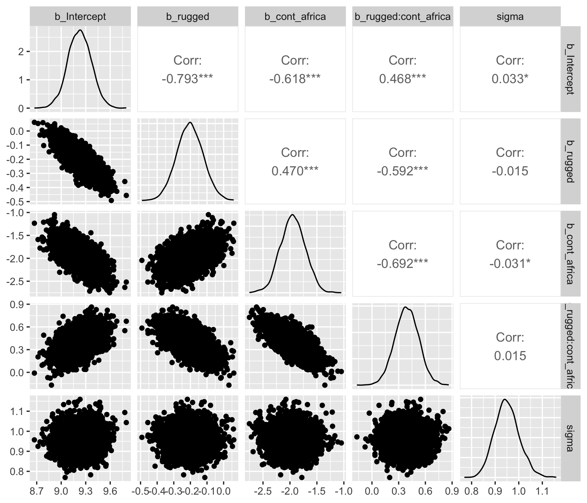
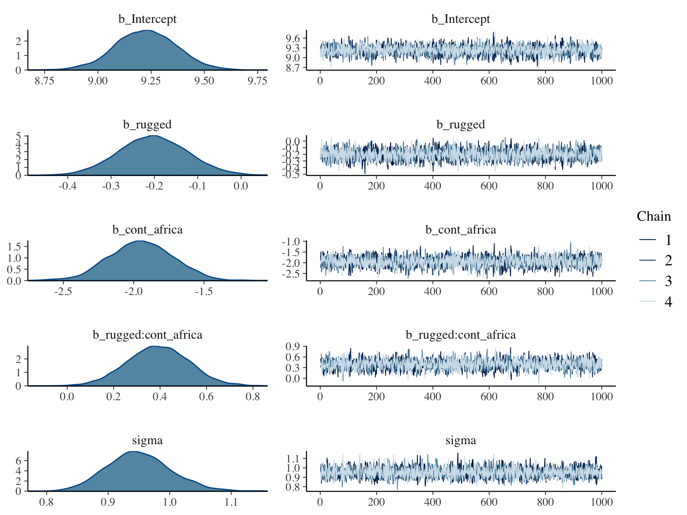

# Markov Chain Monte Carlo

"This chapter introduces one of the more marvelous examples of how Fortuna and Minerva cooperate: the estimation of posterior probability distributions using a stochastic process known as Markov chain Monte Carlo (MCMC) estimation" (p. 241). Though we’ve been using MCMC via the brms package for chapters, now, this chapter should clarify some of the details.

## Good King Markov and His island kingdom

In this version of the code, we've added `set.seed()`, which helps make the exact results reproducible.


```r
set.seed(8)

num_weeks <- 1e5
positions <- rep(0, num_weeks)
current   <- 10
for (i in 1:num_weeks) {
  # record current position
  positions[i] <- current
  # flip coin to generate proposal
  proposal <- current + sample(c(-1, 1), size = 1)
  # now make sure he loops around the archipelago
  if (proposal < 1) proposal <- 10
  if (proposal > 10) proposal <- 1
  # move?
  prob_move <- proposal / current
  current   <- ifelse(runif(1) < prob_move, proposal, current)
}
```

In this chapter, we'll borrow a theme, `theme_ipsum()`, from the [hrbrthemes package](https://cran.r-project.org/package=hrbrthemes).


```r
# install.packages("hrbrthemes", dependencies = T)
library(hrbrthemes)
```


Figure 8.2.a.


```r
library(tidyverse)

tibble(week   = 1:1e5,
       island = positions) %>%

  ggplot(aes(x = week, y = island)) +
  geom_point(shape = 1) +
  scale_x_continuous(breaks = seq(from = 0, to = 100, by = 20)) +
  scale_y_continuous(breaks = seq(from = 0, to = 10, by = 2)) +
  coord_cartesian(xlim = 0:100,
                  ylim = 1:10) +
  labs(title    = "Behold: The Metropolis algorithm in action!",
       subtitle = "The dots show the king's path over the first 100 weeks.") +
  theme_ipsum()
```


Figure 8.2.b.


```r
tibble(week   = 1:1e5,
       island = positions) %>%
  mutate(island = factor(island)) %>%

  ggplot(aes(x = island)) +
  geom_bar() +
  labs(title    = "Old Metropolis shines in the long run.",
       subtitle = "Sure enough, the time the king spent on each island was\nproportional to its population size.") +
  theme_ipsum()
```


## Markov chain Monte Carlo

"The metropolis algorithm is the grandparent of several different strategies for getting samples from unknown posterior distributions" (p. 245). If you're interested, Robert and Casells wrote a [good historical overview of MCMC](https://arxiv.org/pdf/0808.2902.pdf).

## Easy HMC: ~~map2stan~~ `brm()`

Here we load the `rugged` data.


```r
library(rethinking)
data(rugged)
d <- rugged
```

Switch from rethinking to brms.


```r
detach(package:rethinking)
library(brms)
rm(rugged)
```

It takes just a sec to do a little data manipulation. 


```r
d <- 
  d %>%
  mutate(log_gdp = log(rgdppc_2000))

dd <-
  d %>%
  drop_na(rgdppc_2000)
```

In the context of this chapter, it doesn't make sense to translate McElreath's m8.1 `map()` code to `brm()` code. Below, we'll just go directly to the `brm()` variant of his `m8.1stan`.

### Preparation.

When working with brms, you don't need to do the data processing McElreath did on pages 248 and 249. If you wanted to, however, here's how you might do it within the tidyverse.


```r
dd.trim <-
  dd %>%
  select(log_gdp, rugged, cont_africa)

str(dd.trim)
```

### Estimation.

Finally, we get to work that sweet HMC.


```r
b8.1 <-
  brm(data = dd, family = gaussian,
      log_gdp ~ 1 + rugged + cont_africa + rugged:cont_africa,
      prior = c(prior(normal(0, 100), class = Intercept),
                prior(normal(0, 10), class = b),
                prior(cauchy(0, 2), class = sigma)),
      seed = 8)
```

Now we have officially ditched the uniform distribution for $\sigma$. We'll only see it again in special cases for pedagogical purposes. Here's the posterior:


```r
print(b8.1)
```

```
##  Family: gaussian 
##   Links: mu = identity; sigma = identity 
## Formula: log_gdp ~ 1 + rugged + cont_africa + rugged:cont_africa 
##    Data: dd (Number of observations: 170) 
## Samples: 4 chains, each with iter = 2000; warmup = 1000; thin = 1;
##          total post-warmup samples = 4000
## 
## Population-Level Effects: 
##                    Estimate Est.Error l-95% CI u-95% CI Eff.Sample Rhat
## Intercept              9.22      0.14     8.94     9.50       2792 1.00
## rugged                -0.20      0.08    -0.35    -0.05       2782 1.00
## cont_africa           -1.94      0.23    -2.39    -1.50       2900 1.00
## rugged:cont_africa     0.39      0.13     0.12     0.65       2741 1.00
## 
## Family Specific Parameters: 
##       Estimate Est.Error l-95% CI u-95% CI Eff.Sample Rhat
## sigma     0.95      0.05     0.86     1.06       4183 1.00
## 
## Samples were drawn using sampling(NUTS). For each parameter, Eff.Sample 
## is a crude measure of effective sample size, and Rhat is the potential 
## scale reduction factor on split chains (at convergence, Rhat = 1).
```

Do note a couple things: If you look closely at the summary information at the top, you'll see that the `brms::brm()` function defaults to `chains = 4`. If you check the manual, you'll see it also defaults to `cores = 1`. You'll also note it defaults to `iter = 2000, warmup = 1000`. Also of note, McElreath's `rethinking::precis()` returns highest posterior density intervals (HPDIs) when summarizing `map2stan()` models. Not so with brms. If you want HPDIs, you'll have to use the convenience functions from the tidybayes package.


```r
library(tidybayes)

post <- posterior_samples(b8.1)

post %>% 
  gather() %>% 
  group_by(key) %>% 
  mean_hdi(value, .width = .89)  # note our rare use of 89% intervals
```

```
## # A tibble: 6 x 7
##   key                     value   .lower    .upper .width .point .interval
##   <chr>                   <dbl>    <dbl>     <dbl>  <dbl> <chr>  <chr>    
## 1 b_cont_africa          -1.94    -2.30    -1.56     0.89 mean   hdi      
## 2 b_Intercept             9.22     8.99     9.45     0.89 mean   hdi      
## 3 b_rugged               -0.201   -0.330   -0.0809   0.89 mean   hdi      
## 4 b_rugged:cont_africa    0.391    0.157    0.586    0.89 mean   hdi      
## 5 lp__                 -249.    -251.    -246.       0.89 mean   hdi      
## 6 sigma                   0.952    0.868    1.03     0.89 mean   hdi
```

### Sampling again, in parallel.

Here we sample in parallel by adding `cores = 4`.


```r
b8.1_4chains_4cores <- 
  update(b8.1, 
         cores = 4)
```

This model sampled so fast that it really didn't matter if we sampled in parallel or not. It will for others.


```r
print(b8.1_4chains_4cores)
```

```
##  Family: gaussian 
##   Links: mu = identity; sigma = identity 
## Formula: log_gdp ~ 1 + rugged + cont_africa + rugged:cont_africa 
##    Data: dd (Number of observations: 170) 
## Samples: 4 chains, each with iter = 2000; warmup = 1000; thin = 1;
##          total post-warmup samples = 4000
## 
## Population-Level Effects: 
##                    Estimate Est.Error l-95% CI u-95% CI Eff.Sample Rhat
## Intercept              9.22      0.14     8.95     9.49       2953 1.00
## rugged                -0.20      0.08    -0.35    -0.05       2752 1.00
## cont_africa           -1.95      0.23    -2.40    -1.50       2665 1.00
## rugged:cont_africa     0.39      0.13     0.14     0.65       2498 1.00
## 
## Family Specific Parameters: 
##       Estimate Est.Error l-95% CI u-95% CI Eff.Sample Rhat
## sigma     0.95      0.05     0.86     1.05       3839 1.00
## 
## Samples were drawn using sampling(NUTS). For each parameter, Eff.Sample 
## is a crude measure of effective sample size, and Rhat is the potential 
## scale reduction factor on split chains (at convergence, Rhat = 1).
```

### Visualization.

Unlike the way rethinking's `extract.samples()` yields a list, brms's `posterior_samples()` returns a data frame.


```r
post <- posterior_samples(b8.1)
str(post)
```

```
## 'data.frame':	4000 obs. of  6 variables:
##  $ b_Intercept         : num  9.48 9.19 9.2 9.2 9.39 ...
##  $ b_rugged            : num  -0.349 -0.197 -0.143 -0.167 -0.305 ...
##  $ b_cont_africa       : num  -2.52 -1.74 -1.92 -1.92 -2.2 ...
##  $ b_rugged:cont_africa: num  0.719 0.287 0.421 0.328 0.524 ...
##  $ sigma               : num  0.941 0.949 0.964 0.934 0.972 ...
##  $ lp__                : num  -250 -247 -247 -246 -247 ...
```

As with McElreath's rethinking, brms allows users to put the `post` data frame or the brmsfit object directly in `pairs()`.


```r
pairs(b8.1,
      off_diag_args = list(size = 1/5, alpha = 1/5))
```


Another nice way to customize your pairs plot is with the [GGally package](https://cran.r-project.org/package=GGally).


```r
library(GGally)
```


```r
post %>%
  select(b_Intercept:sigma) %>%
  ggpairs()
```


Since GGally returns a ggplot2 object, you can customize it as you please.


```r
my_diag <- function(data, mapping, ...){
  ggplot(data = data, mapping = mapping) + 
    geom_density(fill = "grey50")
}

my_lower <- function(data, mapping, ...){
  ggplot(data = data, mapping = mapping) + 
    geom_point(shape = 1, size = 1/2, alpha = 1/6)
  }

post %>%
  select(b_Intercept:sigma) %>%

  ggpairs(diag  = list(continuous = my_diag),
          lower = list(continuous = my_lower)) +
  labs(subtitle = "My custom pairs plot") +
  theme_ipsum()
```



For more ideas on customizing a GGally pairs plot, go [here](http://ggobi.github.io/ggally/#columns_and_mapping).

### Using the samples.

Older versions of brms allowed users to include information criteria as a part of the model summary by adding `loo = T` and/or `waic = T` in the `summary()` function (e.g., `summary(b8.1, loo = T, waic = T)`. However, this is no longer the case. E.g.,


```r
summary(b8.1, loo = T, waic = T)
```

```
##  Family: gaussian 
##   Links: mu = identity; sigma = identity 
## Formula: log_gdp ~ 1 + rugged + cont_africa + rugged:cont_africa 
##    Data: dd (Number of observations: 170) 
## Samples: 4 chains, each with iter = 2000; warmup = 1000; thin = 1;
##          total post-warmup samples = 4000
## 
## Population-Level Effects: 
##                    Estimate Est.Error l-95% CI u-95% CI Eff.Sample Rhat
## Intercept              9.22      0.14     8.94     9.50       2792 1.00
## rugged                -0.20      0.08    -0.35    -0.05       2782 1.00
## cont_africa           -1.94      0.23    -2.39    -1.50       2900 1.00
## rugged:cont_africa     0.39      0.13     0.12     0.65       2741 1.00
## 
## Family Specific Parameters: 
##       Estimate Est.Error l-95% CI u-95% CI Eff.Sample Rhat
## sigma     0.95      0.05     0.86     1.06       4183 1.00
## 
## Samples were drawn using sampling(NUTS). For each parameter, Eff.Sample 
## is a crude measure of effective sample size, and Rhat is the potential 
## scale reduction factor on split chains (at convergence, Rhat = 1).
```

Although R didn't bark at us for adding `loo = T, waic = T`, they didn't do anything. Nowadays, if you want that information, you'll have to use the `waic()` and/or `loo()` functions.


```r
waic(b8.1)
```

```
## 
## Computed from 4000 by 170 log-likelihood matrix
## 
##           Estimate   SE
## elpd_waic   -234.8  7.4
## p_waic         5.2  0.9
## waic         469.5 14.8
```

```
## Warning: 2 (1.2%) p_waic estimates greater than 0.4. We recommend trying
## loo instead.
```

```r
(l_b8.1 <- loo(b8.1))
```

```
## 
## Computed from 4000 by 170 log-likelihood matrix
## 
##          Estimate   SE
## elpd_loo   -234.8  7.4
## p_loo         5.3  0.9
## looic       469.7 14.8
## ------
## Monte Carlo SE of elpd_loo is 0.0.
## 
## All Pareto k estimates are good (k < 0.5).
## See help('pareto-k-diagnostic') for details.
```

And the recommended workflow since brms version 2.8.0 is to save the information criteria information with your `brm()` fit objects with the `add_criterion()` function.


```r
b8.1 <- add_criterion(b8.1, c("waic", "loo"))
```

You retrieve that information like this:


```r
b8.1$waic
```

```
## 
## Computed from 4000 by 170 log-likelihood matrix
## 
##           Estimate   SE
## elpd_waic   -234.8  7.4
## p_waic         5.2  0.9
## waic         469.5 14.8
```

```
## Warning: 2 (1.2%) p_waic estimates greater than 0.4. We recommend trying
## loo instead.
```

```r
b8.1$loo
```

```
## 
## Computed from 4000 by 170 log-likelihood matrix
## 
##          Estimate   SE
## elpd_loo   -234.8  7.4
## p_loo         5.3  0.9
## looic       469.7 14.8
## ------
## Monte Carlo SE of elpd_loo is 0.0.
## 
## All Pareto k estimates are good (k < 0.5).
## See help('pareto-k-diagnostic') for details.
```

In response to the brms version 2.8.0 update, which itself accommodated updates to the loo package and both of which occurred years after McElreath published the first edition of his text, we’ve been bantering on about the $\text{elpd}$ and its relation to the WAIC and the LOO since Chapter 6. This is a fine place to go into some detail.

The `elpd` values returned by `loo()` and `waic()` are the expected log pointwise predictive density for new data. It follows the formula

$$\text{elpd} = \sum_{i = 1}^n \int p_t (\tilde{y}_i) \text{log} p (\tilde{y}_i | y) d \tilde{y}_i,$$

> where $p_t (\tilde{y}_i)$ is the distribution representing the true data-generating process for $\tilde{y}_i$. The $p_t (\tilde{y}_i)$'s are unknown, and we will use cross-validation or WAIC to approximate. In a regression, these distributions are also implicitly conditioned on any predictors in the model. ([Vehtari, Gelman, & Gabry, 2016, p. 2](https://arxiv.org/abs/1507.04544)).

Later in the paper, we learn the `elpd_loo` (i.e., the Bayesian LOO estimate of out-of-sample predictive fit) is defined as

$$\text{elpd}_{\text{loo}} = \sum_{i = 1}^n \text{log } p (y_i | y - _i),$$

where

$$p (y_i | y - _i) = \int p (y_i | \theta) p (\theta | y - _i) d \theta$$

"is the leave-one-out predictive density given the data without the $i$th data point" (p. 3). And recall, you can convert the $\text{elpd}$ to the conventional information criteria metric by multiplying it by -2.

To learn more about the $\text{elpd}$, read the rest of the paper and the [other works referenced by the loo package team](https://cran.r-project.org/package=loo). And if you prefer watching video lectures to reading technical papers, check out Vehtari's [*Model assessment, selection and averaging*](https://www.youtube.com/watch?v=Re-2yVd0Mqk).

### Checking the chain.

Using `plot()` for a `brm()` fit returns both density and trace lots for the parameters.


```r
plot(b8.1)
```


The bayesplot package allows a little more control. Here, we use [bayesplot's](https://cran.r-project.org/package=bayesplot) `mcmc_trace()` to show only trace plots with our custom theme. Note that `mcmc_trace()` works with data frames, not brmfit objects. There's a further complication. Recall how we made `post` (i.e., `post <- posterior_samples(b8.1)`). Our `post` data frame carries no information on chains. To retain that information, we'll need to add an `add_chain = T` argument to our `posterior_samples()` function.


```r
library(bayesplot)

post <- posterior_samples(b8.1, add_chain = T)

mcmc_trace(post[, c(1:5, 7)],  # we need to include column 7 because it contains the chain info 
           facet_args = list(ncol = 3), 
           size = .15) +
  labs(title = "My custom trace plots") +
  scale_color_ipsum() +
  theme_ipsum() +
  theme(legend.position = c(.95, .2))
```



The bayesplot package offers a variety of diagnostic plots. Here we make autocorrelation plots for all model parameters, one for each HMC chain.


```r
mcmc_acf(post, 
         pars = c("b_Intercept", "b_rugged", "b_cont_africa", "b_rugged:cont_africa", "sigma"),
         lags = 5) +
  scale_color_ipsum() +
  theme_ipsum()
```


That's just what we like to see--nice L-shaped autocorrelation plots. Those are the kinds of shapes you'd expect when you have reasonably large effective samples. Anyway...

#### Overthinking: Raw Stan model code.

The `stancode()` function works in brms much like it does in rethinking.


```r
brms::stancode(b8.1)
```

```
## // generated with brms 2.8.8
## functions {
## }
## data {
##   int<lower=1> N;  // number of observations
##   vector[N] Y;  // response variable
##   int<lower=1> K;  // number of population-level effects
##   matrix[N, K] X;  // population-level design matrix
##   int prior_only;  // should the likelihood be ignored?
## }
## transformed data {
##   int Kc = K - 1;
##   matrix[N, Kc] Xc;  // centered version of X
##   vector[Kc] means_X;  // column means of X before centering
##   for (i in 2:K) {
##     means_X[i - 1] = mean(X[, i]);
##     Xc[, i - 1] = X[, i] - means_X[i - 1];
##   }
## }
## parameters {
##   vector[Kc] b;  // population-level effects
##   real temp_Intercept;  // temporary intercept
##   real<lower=0> sigma;  // residual SD
## }
## transformed parameters {
## }
## model {
##   vector[N] mu = temp_Intercept + Xc * b;
##   // priors including all constants
##   target += normal_lpdf(b | 0, 10);
##   target += normal_lpdf(temp_Intercept | 0, 100);
##   target += cauchy_lpdf(sigma | 0, 2)
##     - 1 * cauchy_lccdf(0 | 0, 2);
##   // likelihood including all constants
##   if (!prior_only) {
##     target += normal_lpdf(Y | mu, sigma);
##   }
## }
## generated quantities {
##   // actual population-level intercept
##   real b_Intercept = temp_Intercept - dot_product(means_X, b);
## }
```

You can also get that information with `b8.1$model` or `b8.1$fit@stanmodel`.

## Care and feeding of your Markov chain.

> Markov chain Monte Carlo is a highly technical and usually automated procedure. Most people who use it don’t really understand what it is doing. That’s okay, up to a point. Science requires division of labor, and if every one of us had to write our own Markov chains from scratch, a lot less research would get done in the aggregate. (p. 255)

But if you do want to learn more about HMC, McElreath has some nice introductory lectures on the topic (see [here](https://www.youtube.com/watch?v=v-j0UmWf3Us) and [here](https://www.youtube.com/watch?v=BWEtS3HuU5A)). To dive even deeper, [Michael Betancourt]( https://twitter.com/betanalpha) from the Stan team has given many lectures on the topic (e.g., [here](https://www.youtube.com/watch?v=_fnDz2Bz3h8) and [here](https://www.youtube.com/watch?v=jUSZboSq1zg)).

### How many samples do you need?

The brms defaults for `iter` and `warmup` match those of McElreath's rethinking.

> If all you want are posterior means, it doesn’t take many samples at all to get very good estimates. Even a couple hundred samples will do. But if you care about the exact shape in the extreme tails of the posterior, the 99th percentile or so, then you’ll need many many more. So there is no universally useful number of samples to aim for. In most typical regression applications, you can get a very good estimate of the posterior mean with as few as 200 effective samples. And if the posterior is approximately Gaussian, then all you need in addition is a good estimate of the variance, which can be had with one order of magnitude more, in most cases. For highly skewed posteriors, you’ll have to think more about which region of the distribution interests you. (p. 255)

### How many chains do you need?

"Using 3 or 4 chains is conventional, and quite often more than enough to reassure us that the sampling is working properly" (p. 257).

#### Convergence diagnostics.

> The default diagnostic output from Stan includes two metrics, `n_eff` and `Rhat`. The first is a measure of the effective number of samples. The second is the Gelman-Rubin convergence diagnostic, $\hat{R}$. When `n_eff` is much lower than the actual number of iterations (minus warmup) of your chains, it means the chains are inefficient, but possibly still okay. When `Rhat` is above 1.00, it usually indicates that the chain has not yet converged, and probably you shouldn’t trust the samples. If you draw more iterations, it could be fine, or it could never converge. See the [Stan user manual](http://mc-stan.org/users/documentation/index.html) for more details. It’s important however not to rely too much on these diagnostics. Like all heuristics, there are cases in which they provide poor advice. (p. 257)

For more on `n_eff` and `Rhat`, you might also check out Gabry and Modrák's vignette, [*Visual MCMC diagnostics using the bayesplot package*](https://cran.r-project.org/package=bayesplot/vignettes/visual-mcmc-diagnostics.html#general-mcmc-diagnostics).

The $\hat{R}$ has been our friend for many years. But times are changing. As it turns out, the Stan team has found some deficiencies with the $\hat{R}$, for which they’ve made recommendations that will be implemented in the Stan ecosystem sometime soon. In the meantime, you can read all about it in their [preprint](https://arxiv.org/abs/1903.08008) and in one of Dan Simpson’s [blogs](https://statmodeling.stat.columbia.edu/2019/03/19/maybe-its-time-to-let-the-old-ways-die-or-we-broke-r-hat-so-now-we-have-to-fix-it/). If you learn best by sassy twitter banter, [click through this interchange](https://twitter.com/betanalpha/status/1108185746870030336) among some of our Stan team all-stars.

### Taming a wild chain.

As with rethinking, brms can take data in the form of a list. Recall however, that in order to specify starting values, you need to specify a list of lists with an `inits` argument rather than with `start`.


```r
b8.2 <-
  brm(data = list(y = c(-1, 1)), 
      family = gaussian,
      y ~ 1,
      prior = c(prior(uniform(-1e10, 1e10), class = Intercept),
                prior(uniform(0, 1e10), class = sigma)),
      inits = list(list(Intercept = 0, sigma = 1),
                   list(Intercept = 0, sigma = 1)),
      iter = 4000, warmup = 1000, chains = 2,
      seed = 8)
```

Those were some silly flat priors. Check the damage.


```r
post <- posterior_samples(b8.2, add_chain = T)

mcmc_trace(post[, c(1:2, 4)],
           size = .25) +
  labs(title    = "My version of Figure 8.5.a.",
       subtitle = "These trace plots do not look like the fuzzy caterpillars we usually hope for.") +
  scale_color_ipsum() +
  theme_ipsum() +
  theme(legend.position = c(.85, 1.5),
        legend.direction = "horizontal")
```


Let's peek at the summary.


```r
print(b8.2)
```

```
## Warning: There were 609 divergent transitions after warmup. Increasing adapt_delta above 0.8 may help.
## See http://mc-stan.org/misc/warnings.html#divergent-transitions-after-warmup
```

```
##  Family: gaussian 
##   Links: mu = identity; sigma = identity 
## Formula: y ~ 1 
##    Data: list(y = c(-1, 1)) (Number of observations: 2) 
## Samples: 2 chains, each with iter = 4000; warmup = 1000; thin = 1;
##          total post-warmup samples = 6000
## 
## Population-Level Effects: 
##              Estimate   Est.Error     l-95% CI    u-95% CI Eff.Sample Rhat
## Intercept -3865553.82 35800459.25 -74287051.02 24607826.73        105 1.04
## 
## Family Specific Parameters: 
##          Estimate    Est.Error l-95% CI     u-95% CI Eff.Sample Rhat
## sigma 40602239.10 188456908.77  3167.70 376813947.39        266 1.01
## 
## Samples were drawn using sampling(NUTS). For each parameter, Eff.Sample 
## is a crude measure of effective sample size, and Rhat is the potential 
## scale reduction factor on split chains (at convergence, Rhat = 1).
```

Holy smokes, those parameters are a mess! Plus we got a nasty warning message, too. Watch our reasonable priors save the day.


```r
b8.3 <-
  brm(data = list(y = c(-1, 1)), 
      family = gaussian,
      y ~ 1,
      prior = c(prior(normal(0, 10), class = Intercept),
                prior(cauchy(0, 1), class = sigma)),
      inits = list(list(Intercept = 0, sigma = 1),
                   list(Intercept = 0, sigma = 1)),
      iter = 4000, warmup = 1000, chains = 2,
      seed = 8)
```


```r
print(b8.3)
```

```
##  Family: gaussian 
##   Links: mu = identity; sigma = identity 
## Formula: y ~ 1 
##    Data: list(y = c(-1, 1)) (Number of observations: 2) 
## Samples: 2 chains, each with iter = 4000; warmup = 1000; thin = 1;
##          total post-warmup samples = 6000
## 
## Population-Level Effects: 
##           Estimate Est.Error l-95% CI u-95% CI Eff.Sample Rhat
## Intercept    -0.01      1.61    -3.38     3.46       1408 1.01
## 
## Family Specific Parameters: 
##       Estimate Est.Error l-95% CI u-95% CI Eff.Sample Rhat
## sigma     2.01      2.21     0.60     6.66       1668 1.00
## 
## Samples were drawn using sampling(NUTS). For each parameter, Eff.Sample 
## is a crude measure of effective sample size, and Rhat is the potential 
## scale reduction factor on split chains (at convergence, Rhat = 1).
```

As in the text, no more warning signs and no more silly estimates. The trace plots look great, too.


```r
post <- posterior_samples(b8.3, add_chain = T)

mcmc_trace(post[, c(1:2, 4)],
           size = .25) +
  labs(title     = "My version of Figure 8.5.b",
       subtitle  = "Oh man. This looks so much better.") +
  scale_color_ipsum() +
  theme_ipsum() +
  theme(legend.position = c(.85, 1.5),
        legend.direction = "horizontal")
```


Now behold our version of Figure 8.6.a.


```r
post %>%
  select(b_Intercept) %>%
  
  ggplot(aes(x = b_Intercept)) +
  stat_density(geom = "line") +
  geom_line(data = data.frame(x = seq(from = min(post$b_Intercept),
                                      to = max(post$b_Intercept),
                                      length.out = 50)),
            aes(x = x, y = dnorm(x = x, mean = 0, sd = 10)),
            color = ipsum_pal()(1), linetype = 2) +
  theme_ipsum()
```


  
Here's our version of Figure 8.6.b.
  

```r
post %>%
  select(sigma) %>%
  
  ggplot(aes(x = sigma)) +
  stat_density(geom = "line") +
  geom_line(data = data.frame(x = seq(from = 0,
                                      to = max(post$sigma),
                                      length.out = 50)),
            aes(x = x, y = dcauchy(x = x, location = 0, scale = 1)*2),
            color = ipsum_pal()(2)[2], linetype = 2) +
  coord_cartesian(xlim = c(0, 10)) +
  theme_ipsum()
```


#### Overthinking: Cauchy distribution.

Behold the beautiful Cauchy probability density:

$$p(x|x_0, \gamma) = \Bigg ( \pi \gamma \Bigg [ 1 + \Big ( \frac{x - x_0}{\gamma} \Big ) ^2 \Bigg ] \Bigg ) ^{-1}$$

The Cauchy has no mean and variance, but $x_0$ is the location and $\gamma$ is the scale. Here's our version of the simulation. Note our use of the `cummean()` function.


```r
n <- 1e4

set.seed(8)
tibble(y     = rcauchy(n, location = 0, scale = 5),
       mu    = cummean(y),
       index = 1:n) %>% 
  
  ggplot(aes(x = index, y = mu)) +
  geom_line() +
  theme_ipsum()
```


The whole thing is quite remarkable. Just for kicks, here we do it again, this time with eight simulations.


```r
n <- 1e4

set.seed(8)
tibble(a = rcauchy(n, location = 0, scale = 5),
       b = rcauchy(n, location = 0, scale = 5),
       c = rcauchy(n, location = 0, scale = 5),
       d = rcauchy(n, location = 0, scale = 5),
       e = rcauchy(n, location = 0, scale = 5),
       f = rcauchy(n, location = 0, scale = 5),
       g = rcauchy(n, location = 0, scale = 5),
       h = rcauchy(n, location = 0, scale = 5)) %>% 
  gather() %>% 
  group_by(key) %>% 
  mutate(mu = cummean(value)) %>% 
  ungroup() %>% 
  mutate(index = rep(1:n, times = 8)) %>% 

  ggplot(aes(x = index, y = mu)) +
  geom_line(aes(color = key)) +
  scale_color_manual(values = ipsum_pal()(8)) +
  scale_x_continuous(breaks = c(0, 5000, 10000)) +
  theme_ipsum() +
  theme(legend.position = "none") +
  facet_wrap(~key, ncol = 4, scales = "free")
```


### Non-identifiable parameters.

It appears that the [only way](https://github.com/ASKurz/Statistical_Rethinking_with_brms_ggplot2_and_the_tidyverse/issues/3) to get a brms version of McElreath's `m8.4` and `m8.5` is to augment the data. In addition to the Gaussian `y` vector, we'll add two constants to the data, `intercept_1 = 1` and `intercept_2 = 1`.


```r
set.seed(8)
y <- rnorm(100, mean = 0, sd = 1)
```


```r
b8.4 <-
  brm(data = list(y           = y,
                  intercept_1 = 1,
                  intercept_2 = 1), 
      family = gaussian,
      y ~ 0 + intercept_1 + intercept_2,
      prior = c(prior(uniform(-1e10, 1e10), class = b),
                prior(cauchy(0, 1), class = sigma)),
      inits = list(list(intercept_1 = 0, intercept_2 = 0, sigma = 1),
                   list(intercept_1 = 0, intercept_2 = 0, sigma = 1)),
      iter = 4000, warmup = 1000, chains = 2,
      seed = 8)
```

Our model results don't perfectly mirror McElreath's, but they're identical in spirit.


```r
print(b8.4)
```

```
## Warning: The model has not converged (some Rhats are > 1.1). Do not analyse the results! 
## We recommend running more iterations and/or setting stronger priors.
```

```
##  Family: gaussian 
##   Links: mu = identity; sigma = identity 
## Formula: y ~ 0 + intercept_1 + intercept_2 
##    Data: list(y = y, intercept_1 = 1, intercept_2 = 1) (Number of observations: 100) 
## Samples: 2 chains, each with iter = 4000; warmup = 1000; thin = 1;
##          total post-warmup samples = 6000
## 
## Population-Level Effects: 
##             Estimate Est.Error l-95% CI u-95% CI Eff.Sample Rhat
## intercept_1  1116.48    944.73  -762.62  2439.62          2 2.50
## intercept_2 -1116.57    944.74 -2439.65   762.38          2 2.50
## 
## Family Specific Parameters: 
##       Estimate Est.Error l-95% CI u-95% CI Eff.Sample Rhat
## sigma     1.06      0.08     0.91     1.22          9 1.16
## 
## Samples were drawn using sampling(NUTS). For each parameter, Eff.Sample 
## is a crude measure of effective sample size, and Rhat is the potential 
## scale reduction factor on split chains (at convergence, Rhat = 1).
```

Note the frightening warning message. Those results are a mess! Let's try again.


```r
b8.5 <-
  brm(data = list(y           = y,
                  intercept_1 = 1,
                  intercept_2 = 1),
      family = gaussian,
      y ~ 0 + intercept_1 + intercept_2,
      prior = c(prior(normal(0, 10), class = b),
                prior(cauchy(0, 1), class = sigma)),
      inits = list(list(intercept_1 = 0, intercept_2 = 0, sigma = 1),
                   list(intercept_1 = 0, intercept_2 = 0, sigma = 1)),
      iter = 4000, warmup = 1000, chains = 2,
      seed = 8)
```


```r
print(b8.5)
```

```
##  Family: gaussian 
##   Links: mu = identity; sigma = identity 
## Formula: y ~ 0 + intercept_1 + intercept_2 
##    Data: list(y = y, intercept_1 = 1, intercept_2 = 1) (Number of observations: 100) 
## Samples: 2 chains, each with iter = 4000; warmup = 1000; thin = 1;
##          total post-warmup samples = 6000
## 
## Population-Level Effects: 
##             Estimate Est.Error l-95% CI u-95% CI Eff.Sample Rhat
## intercept_1    -0.11      7.04   -14.32    13.56       1357 1.00
## intercept_2     0.02      7.04   -13.59    14.26       1359 1.00
## 
## Family Specific Parameters: 
##       Estimate Est.Error l-95% CI u-95% CI Eff.Sample Rhat
## sigma     1.09      0.08     0.95     1.25       2086 1.00
## 
## Samples were drawn using sampling(NUTS). For each parameter, Eff.Sample 
## is a crude measure of effective sample size, and Rhat is the potential 
## scale reduction factor on split chains (at convergence, Rhat = 1).
```

Much better. Now we'll do the preparatory work for Figure 8.7. Instead of showing the plots, here, we'll save them as objects, `left_column` and `right_column`, in order to combine them below.


```r
post <- posterior_samples(b8.4, add_chain = T)

left_column <-
  mcmc_trace(post[, c(1:3, 5)],
           size = .25,
           facet_args = c(ncol = 1)) +
  scale_color_ipsum() +
  theme_ipsum() +
  theme(legend.position  = c(.85, 1.5),
        legend.direction = "horizontal")

post <- posterior_samples(b8.5, add_chain = T)

right_column <-
  mcmc_trace(post[, c(1:3, 5)],
             size = .25,
             facet_args = c(ncol = 1)) +
  scale_color_ipsum() +
  theme_ipsum() +
  theme(legend.position  = c(.85, 1.5),
        legend.direction = "horizontal")

library(gridExtra)

grid.arrange(left_column, right_column, ncol = 2)
```


The central message in the text, default to weakly-regularizing priors, holds for brms just as it does in rethinking. For more on the topic, see the [recommendations from the Stan team](https://github.com/stan-dev/stan/wiki/Prior-Choice-Recommendations). If you want to dive deeper, check out [Dan Simpson's post on Gelman's blog](http://andrewgelman.com/2017/09/05/never-total-eclipse-prior/) and their [corresponding paper with Michael Betancourt](https://arxiv.org/abs/1708.07487).

## Reference {-}

[McElreath, R. (2016). *Statistical rethinking: A Bayesian course with examples in R and Stan.* Chapman & Hall/CRC Press.](https://xcelab.net/rm/statistical-rethinking/)

## Session info {-}


```r
sessionInfo()
```

```
## R version 3.5.1 (2018-07-02)
## Platform: x86_64-apple-darwin15.6.0 (64-bit)
## Running under: macOS High Sierra 10.13.6
## 
## Matrix products: default
## BLAS: /Library/Frameworks/R.framework/Versions/3.5/Resources/lib/libRblas.0.dylib
## LAPACK: /Library/Frameworks/R.framework/Versions/3.5/Resources/lib/libRlapack.dylib
## 
## locale:
## [1] en_US.UTF-8/en_US.UTF-8/en_US.UTF-8/C/en_US.UTF-8/en_US.UTF-8
## 
## attached base packages:
## [1] parallel  stats     graphics  grDevices utils     datasets  methods  
## [8] base     
## 
## other attached packages:
##  [1] gridExtra_2.3        bayesplot_1.6.0      GGally_1.4.0        
##  [4] tidybayes_1.0.4      brms_2.8.8           Rcpp_1.0.1          
##  [7] rstan_2.18.2         StanHeaders_2.18.0-1 forcats_0.3.0       
## [10] stringr_1.4.0        dplyr_0.8.0.1        purrr_0.2.5         
## [13] readr_1.1.1          tidyr_0.8.1          tibble_2.1.1        
## [16] ggplot2_3.1.1        tidyverse_1.2.1      extrafont_0.17      
## [19] hrbrthemes_0.6.0    
## 
## loaded via a namespace (and not attached):
##   [1] colorspace_1.3-2          ggridges_0.5.0           
##   [3] rsconnect_0.8.8           rprojroot_1.3-2          
##   [5] ggstance_0.3              markdown_0.8             
##   [7] base64enc_0.1-3           rethinking_1.80          
##   [9] rstudioapi_0.7            svUnit_0.7-12            
##  [11] DT_0.4                    fansi_0.4.0              
##  [13] mvtnorm_1.0-10            lubridate_1.7.4          
##  [15] xml2_1.2.0                bridgesampling_0.6-0     
##  [17] knitr_1.20                shinythemes_1.1.1        
##  [19] jsonlite_1.5              broom_0.5.1              
##  [21] Rttf2pt1_1.3.7            shiny_1.1.0              
##  [23] compiler_3.5.1            httr_1.3.1               
##  [25] backports_1.1.4           assertthat_0.2.0         
##  [27] Matrix_1.2-14             lazyeval_0.2.2           
##  [29] cli_1.0.1                 later_0.7.3              
##  [31] htmltools_0.3.6           prettyunits_1.0.2        
##  [33] tools_3.5.1               igraph_1.2.1             
##  [35] coda_0.19-2               gtable_0.3.0             
##  [37] glue_1.3.1.9000           reshape2_1.4.3           
##  [39] cellranger_1.1.0          nlme_3.1-137             
##  [41] extrafontdb_1.0           crosstalk_1.0.0          
##  [43] xfun_0.3                  ps_1.2.1                 
##  [45] rvest_0.3.2               mime_0.5                 
##  [47] miniUI_0.1.1.1            gtools_3.8.1             
##  [49] MASS_7.3-50               zoo_1.8-2                
##  [51] scales_1.0.0              colourpicker_1.0         
##  [53] hms_0.4.2                 promises_1.0.1           
##  [55] Brobdingnag_1.2-6         inline_0.3.15            
##  [57] RColorBrewer_1.1-2        shinystan_2.5.0          
##  [59] yaml_2.1.19               gdtools_0.1.7            
##  [61] loo_2.1.0                 reshape_0.8.7            
##  [63] stringi_1.4.3             dygraphs_1.1.1.5         
##  [65] pkgbuild_1.0.2            rlang_0.3.4              
##  [67] pkgconfig_2.0.2           matrixStats_0.54.0       
##  [69] HDInterval_0.2.0          evaluate_0.10.1          
##  [71] lattice_0.20-35           rstantools_1.5.1         
##  [73] htmlwidgets_1.2           labeling_0.3             
##  [75] processx_3.2.1            tidyselect_0.2.5         
##  [77] plyr_1.8.4                magrittr_1.5             
##  [79] bookdown_0.9              R6_2.3.0                 
##  [81] generics_0.0.2            pillar_1.3.1             
##  [83] haven_1.1.2               withr_2.1.2              
##  [85] xts_0.10-2                abind_1.4-5              
##  [87] modelr_0.1.2              crayon_1.3.4             
##  [89] arrayhelpers_1.0-20160527 utf8_1.1.4               
##  [91] rmarkdown_1.10            grid_3.5.1               
##  [93] readxl_1.1.0              callr_3.1.0              
##  [95] threejs_0.3.1             digest_0.6.18            
##  [97] xtable_1.8-2              httpuv_1.4.4.2           
##  [99] stats4_3.5.1              munsell_0.5.0            
## [101] shinyjs_1.0
```


