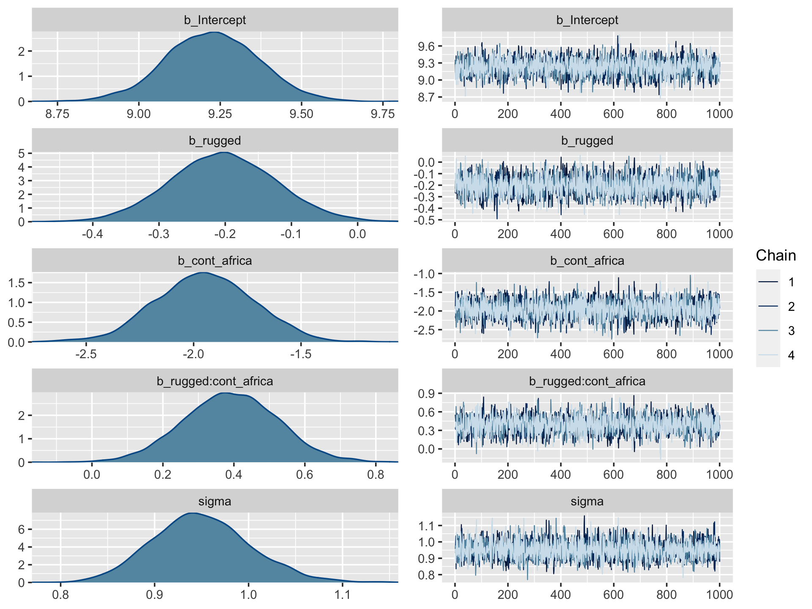
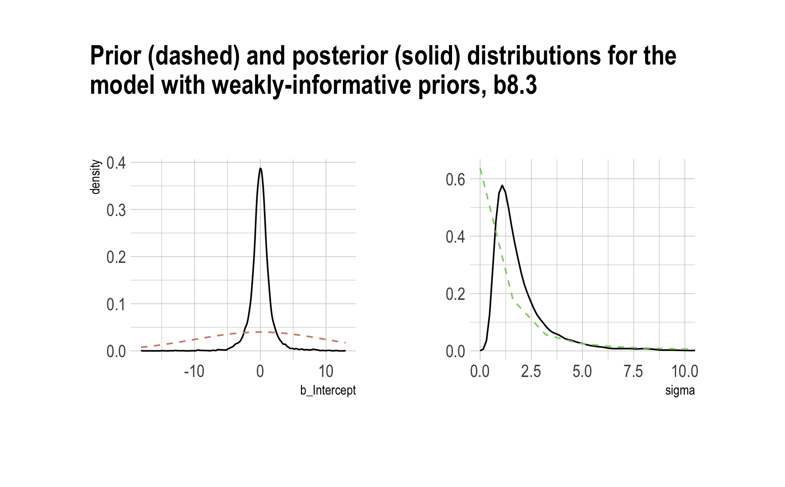

# Markov Chain Monte Carlo

"This chapter introduces one of the more marvelous examples of how [Fortuna](https://en.wikipedia.org/wiki/Rota_Fortunae#/media/File:Lydgate-siege-troy-wheel-fortune-detail.jpg) and [Minerva](https://en.wikipedia.org/wiki/Minerva#/media/File:Minerva-Vedder-Highsmith-detail-1.jpeg) cooperate: the estimation of posterior probability distributions using a stochastic process known as Markov chain Monte Carlo (MCMC) estimation" [@mcelreathStatisticalRethinkingBayesian2015, p. 241]. Though we've been using MCMC via the brms package for chapters, now, this chapter should clarify some of the questions you might have about the details.

## Good King Markov and His island kingdom

Here we simulate King Markov's journey. In this version of the code, we've added `set.seed()`, which helps make the exact results reproducible.


```r
set.seed(8)

num_weeks <- 1e5
positions <- rep(0, num_weeks)
current   <- 10
for (i in 1:num_weeks) {
  # record current position
  positions[i] <- current
  # flip coin to generate proposal
  proposal <- current + sample(c(-1, 1), size = 1)
  # now make sure he loops around the archipelago
  if (proposal < 1) proposal <- 10
  if (proposal > 10) proposal <- 1
  # move?
  prob_move <- proposal / current
  current   <- ifelse(runif(1) < prob_move, proposal, current)
}
```

In this chapter, we'll borrow a theme, `theme_ipsum()`, from the [hrbrthemes package](https://cran.r-project.org/package=hrbrthemes) [@R-hrbrthemes].


```r
# install.packages("hrbrthemes", dependencies = T)
# macOS users may need to install XQuartz, too (https://www.xquartz.org/)
library(hrbrthemes)
```


Figure 8.2.a.


```r
library(tidyverse)

tibble(week   = 1:1e5,
       island = positions) %>%

  ggplot(aes(x = week, y = island)) +
  geom_point(shape = 1) +
  scale_x_continuous(breaks = seq(from = 0, to = 100, by = 20)) +
  scale_y_continuous(breaks = seq(from = 0, to = 10, by = 2)) +
  coord_cartesian(xlim = c(0, 100)) +
  labs(title    = "Behold: The Metropolis algorithm in action!",
       subtitle = "The dots show the king's path over the first 100 weeks.") +
  theme_ipsum()
```


Figure 8.2.b.


```r
tibble(week   = 1:1e5,
       island = positions) %>%
  mutate(island = factor(island)) %>%

  ggplot(aes(x = island)) +
  geom_bar() +
  labs(title    = "Old Metropolis shines in the long run.",
       subtitle = "Sure enough, the time the king spent on each island was\nproportional to its population size.") +
  theme_ipsum()
```


## Markov chain Monte Carlo

"The metropolis algorithm is the grandparent of several different strategies for getting samples from unknown posterior distributions" (p. 245). If you're interested, @robertShortHistoryMarkov2011 wrote a [good historical overview of MCMC](https://arxiv.org/pdf/0808.2902.pdf).

### Gibbs sampling.

The Gibbs sampler [@gemanStochasticRelaxationGibbs1984; @casellaExplainingGibbsSampler1992] uses *conjugate* pairs (i.e., pairs of priors and likelihoods that have analytic solutions for the posterior of an individual parameter) to efficiently sample from the posterior. Gibbs was the workhorse algorithm during the rise of Bayesian computation in the 1990s. However, it's limited in that (a) you might not want to use conjugate priors and (b) it can be quite inefficient with complex hierarchical models, which we'll be fitting soon. 

We will not be using the Gibbs sampler in this project. It's available for use in R. For an extensive applied introduction, check out Kruschke's [-@kruschkeDoingBayesianData2015] [text](https://sites.google.com/site/doingbayesiandataanalysis/).

### Hamiltonian Monte Carlo.

Hamiltonian Monte Carlo (HMC) is more computationally costly and more efficient than Gibbs at sampling from the posterior. It needs fewer samples, especially when fitting models with many parameters. To learn more about how HMC works, check out McElreath's [lecture on the topic from January 2019](https://www.youtube.com/watch?v=v-j0UmWf3Us) or one of these lectures ([here](https://www.youtube.com/watch?v=jUSZboSq1zg), [here](https://www.youtube.com/watch?v=_fnDz2Bz3h8), or [here](https://www.youtube.com/watch?v=pHsuIaPbNbY)) by Michael Betancourt.

## Easy HMC: ~~map2stan~~ `brm()`

Much like McElreath's rethinking package, brms provides a convenient interface to HMC via Stan. Other packages providing Stan interfaces include [rstanarm](https://mc-stan.org/rstanarm/) [@R-rstanarm; @rstanarm2018] and [blavaan](https://faculty.missouri.edu/~merklee/blavaan/) [@R-blavaan; @Merkle2018blavaan]. I'm not aware of any up-to-date comparisons across the packages. If you're ever inclined to make one, [let the rest of us know](https://github.com/ASKurz/Statistical_Rethinking_with_brms_ggplot2_and_the_tidyverse/issues)!

Here we load the `rugged` data.


```r
library(rethinking)
data(rugged)
d <- rugged
```

Switch from rethinking to brms.


```r
detach(package:rethinking)
library(brms)
rm(rugged)
```

It takes just a sec to do a little data manipulation. 


```r
d <- 
  d %>%
  mutate(log_gdp = log(rgdppc_2000))

dd <-
  d %>%
  drop_na(rgdppc_2000)
```

In the context of this chapter, it doesn't make sense to translate McElreath's m8.1 `map()` code to `brm()` code. Below, we'll just go directly to the `brm()` variant of his `m8.1stan`.

### Preparation.

When working with brms, you don't need to do the data processing McElreath did on pages 248 and 249. If you wanted to, however, here's how you might do it within the tidyverse.


```r
dd.trim <-
  dd %>%
  select(log_gdp, rugged, cont_africa)

str(dd.trim)
```

### Estimation.

Finally, we get to work that sweet HMC via `brms::brm()`.


```r
b8.1 <-
  brm(data = dd, 
      family = gaussian,
      log_gdp ~ 1 + rugged + cont_africa + rugged:cont_africa,
      prior = c(prior(normal(0, 100), class = Intercept),
                prior(normal(0, 10), class = b),
                prior(cauchy(0, 2), class = sigma)),
      seed = 8,
      file = "fits/b08.01")
```

Now we have officially ditched the uniform distribution for $\sigma$. Never again! Here's the posterior.


```r
print(b8.1)
```

```
##  Family: gaussian 
##   Links: mu = identity; sigma = identity 
## Formula: log_gdp ~ 1 + rugged + cont_africa + rugged:cont_africa 
##    Data: dd (Number of observations: 170) 
## Samples: 4 chains, each with iter = 2000; warmup = 1000; thin = 1;
##          total post-warmup samples = 4000
## 
## Population-Level Effects: 
##                    Estimate Est.Error l-95% CI u-95% CI Rhat Bulk_ESS Tail_ESS
## Intercept              9.23      0.14     8.94     9.51 1.00     3351     3290
## rugged                -0.20      0.08    -0.36    -0.05 1.00     3375     3389
## cont_africa           -1.95      0.23    -2.40    -1.51 1.00     3008     3101
## rugged:cont_africa     0.39      0.13     0.13     0.65 1.00     2854     3320
## 
## Family Specific Parameters: 
##       Estimate Est.Error l-95% CI u-95% CI Rhat Bulk_ESS Tail_ESS
## sigma     0.95      0.05     0.85     1.06 1.00     4355     2577
## 
## Samples were drawn using sampling(NUTS). For each parameter, Bulk_ESS
## and Tail_ESS are effective sample size measures, and Rhat is the potential
## scale reduction factor on split chains (at convergence, Rhat = 1).
```

Do note a couple things: If you look closely at the summary information at the top, you'll see that the `brm()` function defaults to `chains = 4`. If you check the manual, you'll see it also defaults to `cores = 1`, as well as `iter = 2000` and `warmup = 1000`. Also of note, McElreath's `rethinking::precis()` returns highest posterior density intervals (HPDIs) when summarizing `map2stan()` models. Not so with brms. If you want HPDIs, you'll have to use the convenience functions from the tidybayes package. Here's an example.


```r
library(tidybayes)

post <- posterior_samples(b8.1)

post %>% 
  gather() %>% 
  group_by(key) %>% 
  mean_hdi(value, .width = .89)  # note our rare use of 89% intervals
```

```
## # A tibble: 6 x 7
##   key                     value   .lower    .upper .width .point .interval
##   <chr>                   <dbl>    <dbl>     <dbl>  <dbl> <chr>  <chr>    
## 1 b_cont_africa          -1.95    -2.31    -1.59     0.89 mean   hdi      
## 2 b_Intercept             9.23     9.00     9.45     0.89 mean   hdi      
## 3 b_rugged               -0.203   -0.327   -0.0743   0.89 mean   hdi      
## 4 b_rugged:cont_africa    0.391    0.167    0.586    0.89 mean   hdi      
## 5 lp__                 -249.    -251.    -246.       0.89 mean   hdi      
## 6 sigma                   0.950    0.870    1.04     0.89 mean   hdi
```

There's one more important difference in our brms summary output compared to McElreath's `rethinking::precis()` output. In the text we learn `precis()` returns `n_eff` values for each parameter. Earlier versions of brms used to have a direct analogue named `Eff.Sample`. Both were estimates of the effective number of samples (a.k.a. the effective sample size) for each parameter. As with typical sample size, the more the merrier. Starting with version 2.10.0, brms now returns two columns: `Bulk_ESS` and `Tail_ESS`. These originate from a [-@vehtariRanknormalizationFoldingLocalization2019] [paper](https://arxiv.org/abs/1903.08008?) by Stan-team all-stars Vehtari, Gelman, Simpson, Carpenter, and Bürkner. From their paper, we read:

> If you plan to report quantile estimates or posterior intervals, we strongly suggest assessing the convergence of the chains for these quantiles. In Section 4.3 we show that convergence of Markov chains is not uniform across the parameter space and propose diagnostics and effective sample sizes specifically for extreme quantiles. This is *different* from the standard ESS estimate (which we refer to as the "bulk-ESS"), which mainly assesses how well the centre of the distribution is resolved. Instead, these "tail-ESS" measures allow the user to estimate the MCSE for interval estimates. (p. 5, *emphasis* in the original)

For more technical details, see the paper. In short, `Bulk_ESS` in the output from brms 2.10.0+ is what was previously referred to as `Eff.Sample` in earlier versions. It's also what corresponds to what McElreath calls `n_eff`. This indexed the number of effective samples in 'the center of the' posterior distribution (i.e., the posterior mean or median). But since we also care about uncertainty in our parameters, we care about stability in the 95% intervals and such. The new `Tail_ESS` in brms output allows us to gauge the effective sample size for those intervals.

### Sampling again, in parallel.

Here we sample in parallel by adding `cores = 4`.


```r
b8.1b <- 
  update(b8.1, 
         cores = 4,
         seed = 8,
         file = "fits/b08.01b")
```

This model sampled so fast that it really didn't matter if we sampled in parallel or not. It will for others.


```r
print(b8.1b)
```

```
##  Family: gaussian 
##   Links: mu = identity; sigma = identity 
## Formula: log_gdp ~ 1 + rugged + cont_africa + rugged:cont_africa 
##    Data: dd (Number of observations: 170) 
## Samples: 4 chains, each with iter = 2000; warmup = 1000; thin = 1;
##          total post-warmup samples = 4000
## 
## Population-Level Effects: 
##                    Estimate Est.Error l-95% CI u-95% CI Rhat Bulk_ESS Tail_ESS
## Intercept              9.23      0.14     8.94     9.51 1.00     3351     3290
## rugged                -0.20      0.08    -0.36    -0.05 1.00     3375     3389
## cont_africa           -1.95      0.23    -2.40    -1.51 1.00     3008     3101
## rugged:cont_africa     0.39      0.13     0.13     0.65 1.00     2854     3320
## 
## Family Specific Parameters: 
##       Estimate Est.Error l-95% CI u-95% CI Rhat Bulk_ESS Tail_ESS
## sigma     0.95      0.05     0.85     1.06 1.00     4355     2577
## 
## Samples were drawn using sampling(NUTS). For each parameter, Bulk_ESS
## and Tail_ESS are effective sample size measures, and Rhat is the potential
## scale reduction factor on split chains (at convergence, Rhat = 1).
```

### Visualization.

Unlike the way rethinking's `extract.samples()` yields a list, brms's `posterior_samples()` returns a data frame.


```r
post <- posterior_samples(b8.1)
str(post)
```

```
## 'data.frame':	4000 obs. of  6 variables:
##  $ b_Intercept         : num  9.31 9.14 9.07 9.1 9.21 ...
##  $ b_rugged            : num  -0.27 -0.205 -0.256 -0.194 -0.223 ...
##  $ b_cont_africa       : num  -2.14 -2.19 -1.87 -1.85 -2 ...
##  $ b_rugged:cont_africa: num  0.554 0.48 0.404 0.412 0.395 ...
##  $ sigma               : num  0.931 0.942 0.946 0.899 0.996 ...
##  $ lp__                : num  -247 -248 -250 -247 -247 ...
```

As with McElreath's rethinking, brms allows users to put the `post` data frame or the brmsfit object directly in `pairs()`.


```r
pairs(b8.1,
      off_diag_args = list(size = 1/5, alpha = 1/5))
```


Another nice way to customize your pairs plot is with the [GGally package](https://cran.r-project.org/package=GGally).


```r
library(GGally)
```


```r
post %>%
  select(b_Intercept:sigma) %>%
  ggpairs()
```


Since `GGally::ggpairs()` returns a ggplot2 object, you can customize it as you please.


```r
my_upper <- function(data, mapping, ...) {
  
  # get the x and y data to use the other code
  x <- eval_data_col(data, mapping$x)
  y <- eval_data_col(data, mapping$y)
  
  r  <- unname(cor.test(x, y)$estimate)
  rt <- format(r, digits = 2)[1]
  tt <- as.character(rt)
  
  # plot the cor value
  ggally_text(
    label = tt, 
    mapping = aes(),
    size = 4,
    color = "grey20") +
    theme_void()
}

my_diag <- function(data, mapping, ...) {
  ggplot(data = data, mapping = mapping) + 
    geom_density(fill = "grey50")
}

my_lower <- function(data, mapping, ...) {
  ggplot(data = data, mapping = mapping) + 
    geom_point(shape = 1, size = 1/2, alpha = 1/6)
  }

post %>%
  select(b_Intercept:sigma) %>%

  ggpairs(upper = list(continuous = my_upper),
          diag  = list(continuous = my_diag),
          lower = list(continuous = my_lower)) +
  labs(subtitle = "My custom pairs plot") +
  theme_ipsum() +
  theme(strip.text = element_text(size = 8))
```


For more ideas on customizing a `ggpairs()` plot, go [here](https://ggobi.github.io/ggally/articles/ggpairs.html).

### Using the samples.

Older versions of brms allowed users to include information criteria as a part of the model summary by adding `loo = T` and/or `waic = T` in the `summary()` function (e.g., `summary(b8.1, loo = T, waic = T)`. However, this is no longer the case. E.g.,


```r
summary(b8.1, loo = T, waic = T)
```

```
##  Family: gaussian 
##   Links: mu = identity; sigma = identity 
## Formula: log_gdp ~ 1 + rugged + cont_africa + rugged:cont_africa 
##    Data: dd (Number of observations: 170) 
## Samples: 4 chains, each with iter = 2000; warmup = 1000; thin = 1;
##          total post-warmup samples = 4000
## 
## Population-Level Effects: 
##                    Estimate Est.Error l-95% CI u-95% CI Rhat Bulk_ESS Tail_ESS
## Intercept              9.23      0.14     8.94     9.51 1.00     3351     3290
## rugged                -0.20      0.08    -0.36    -0.05 1.00     3375     3389
## cont_africa           -1.95      0.23    -2.40    -1.51 1.00     3008     3101
## rugged:cont_africa     0.39      0.13     0.13     0.65 1.00     2854     3320
## 
## Family Specific Parameters: 
##       Estimate Est.Error l-95% CI u-95% CI Rhat Bulk_ESS Tail_ESS
## sigma     0.95      0.05     0.85     1.06 1.00     4355     2577
## 
## Samples were drawn using sampling(NUTS). For each parameter, Bulk_ESS
## and Tail_ESS are effective sample size measures, and Rhat is the potential
## scale reduction factor on split chains (at convergence, Rhat = 1).
```

Although R didn't bark at us for adding `loo = T, waic = T`, they didn't do anything. Nowadays, if you want that information, you'll have to use the `waic()` and/or `loo()` functions.


```r
waic(b8.1)
```

```
## 
## Computed from 4000 by 170 log-likelihood matrix
## 
##           Estimate   SE
## elpd_waic   -234.7  7.4
## p_waic         5.1  0.9
## waic         469.3 14.8
## 
## 2 (1.2%) p_waic estimates greater than 0.4. We recommend trying loo instead.
```

```r
(l_b8.1 <- loo(b8.1))
```

```
## 
## Computed from 4000 by 170 log-likelihood matrix
## 
##          Estimate   SE
## elpd_loo   -234.7  7.4
## p_loo         5.2  0.9
## looic       469.5 14.9
## ------
## Monte Carlo SE of elpd_loo is 0.0.
## 
## All Pareto k estimates are good (k < 0.5).
## See help('pareto-k-diagnostic') for details.
```

And the recommended workflow since brms version 2.8.0 is to save the information criteria information with your `brm()` fit objects with the `add_criterion()` function.


```r
b8.1 <- add_criterion(b8.1, c("waic", "loo"))
```

You retrieve that information by subsetting the fit object.


```r
b8.1$criteria$waic
```

```
## 
## Computed from 4000 by 170 log-likelihood matrix
## 
##           Estimate   SE
## elpd_waic   -234.7  7.4
## p_waic         5.1  0.9
## waic         469.3 14.8
## 
## 2 (1.2%) p_waic estimates greater than 0.4. We recommend trying loo instead.
```

```r
b8.1$criteria$loo
```

```
## 
## Computed from 4000 by 170 log-likelihood matrix
## 
##          Estimate   SE
## elpd_loo   -234.7  7.4
## p_loo         5.2  0.9
## looic       469.5 14.9
## ------
## Monte Carlo SE of elpd_loo is 0.0.
## 
## All Pareto k estimates are good (k < 0.5).
## See help('pareto-k-diagnostic') for details.
```

In response to the brms version 2.8.0 update, which itself accommodated updates to the loo package and both of which occurred years after McElreath published the first edition of his text, we've been bantering on about the $\text{elpd}$ and its relation to the WAIC and the LOO since [Chapter 6][Information criteria]. This is a fine place to go into some detail.

The `elpd` values returned by `loo()` and `waic()` are the expected log pointwise predictive density for new data. It follows the formula

$$\text{elpd} = \sum_{i = 1}^n \int p_t (\tilde y_i) \log p (\tilde y_i | y) d \tilde y_i,$$

> where $p_t (\tilde y_i)$ is the distribution representing the true data-generating process for $\tilde y_i$. The $p_t (\tilde y_i)$'s are unknown, and we will use cross-validation or WAIC to approximate. In a regression, these distributions are also implicitly conditioned on any predictors in the model. [@vehtariPracticalBayesianModel2017, p. 2].

Later in the paper, we learn the `elpd_loo` (i.e., the Bayesian LOO estimate of out-of-sample predictive fit) is defined as

$$\text{elpd}_\text{loo} = \sum_{i = 1}^n \log p (y_i | y - _i),$$

where

$$p (y_i | y - _i) = \int p (y_i | \theta) p (\theta | y - _i) d \theta$$

"is the leave-one-out predictive density given the data without the $i$th data point" (p. 3). And recall, you can convert the $\text{elpd}$ to the conventional information criteria metric by multiplying it by -2.

To learn more about the $\text{elpd}$, read the rest of the paper and the [other works referenced by the loo package team](https://cran.r-project.org/package=loo). And if you prefer watching video lectures to reading technical papers, check out Vehtari's [*Model assessment, selection and averaging*](https://www.youtube.com/watch?v=Re-2yVd0Mqk).

### Checking the chain.

Using `plot()` for a `brm()` fit returns both density and trace lots for the parameters.


```r
plot(b8.1)
```



The [bayesplot](https://cran.r-project.org/package=bayesplot) package allows a little more control. Here, we use bayesplot's `mcmc_trace()` to show only trace plots with our custom theme. Note that `mcmc_trace()` works with data frames, not brmfit objects. There's a further complication. Recall how we made `post` (i.e., `post <- posterior_samples(b8.1)`). Our `post` data frame carries no information on chains. To retain that information, we'll need to add an `add_chain = T` argument to our `posterior_samples()` function.


```r
library(bayesplot)

post <- posterior_samples(b8.1, add_chain = T)

mcmc_trace(post[, c(1:5, 7)],  # we need to include column 7 because it contains the chain info 
           facet_args = list(ncol = 3), 
           size = .15) +
  scale_color_ipsum() +
  labs(title = "My custom trace plots") +
  theme_ipsum() +
  theme(legend.position = c(.95, .2))
```


The bayesplot package offers a variety of diagnostic plots. Here we make autocorrelation plots for all model parameters, one for each HMC chain.


```r
mcmc_acf(post, 
         pars = c("b_Intercept", "b_rugged", "b_cont_africa", "b_rugged:cont_africa", "sigma"),
         lags = 5) +
  scale_color_ipsum() +
  theme_ipsum()
```


That's just what we like to see--nice L-shaped autocorrelation plots. Those are the kinds of shapes you'd expect when you have reasonably large effective samples.

Before we move on, there's an important difference between the trace plots McElreath showed in the text and the ones we just made. McElreath's trace plots include the warmup iterations. Ours did not. That's why his $x$-axis values ranged from 1 to 2,000 and ours only ranged from 1 to 1,000. To my knowledge, neither the `brms::plot()` nor the `bayesplot::mcmc_trace()` functions support including warmups in their trace plots. One quick way to get them is with the [ggmcmc package](https://cran.rstudio.com/package=ggmcmc) [@R-ggmcmc; @fernandezGGMCMCAnalysisofMCMC2016].


```r
# install.packages("ggmcmc", dependencies = T)
library(ggmcmc)
```

The ggmcmc package has a variety of convenience functions for working with MCMC chains. The `ggs()` function extracts the posterior draws, including `warmup`, and arranges them in a tidy tibble.


```r
ggs(b8.1) %>% 
  str()
```

```
## tibble [40,000 × 4] (S3: tbl_df/tbl/data.frame)
##  $ Iteration: int [1:40000] 1 2 3 4 5 6 7 8 9 10 ...
##  $ Chain    : int [1:40000] 1 1 1 1 1 1 1 1 1 1 ...
##  $ Parameter: Factor w/ 5 levels "b_cont_africa",..: 2 2 2 2 2 2 2 2 2 2 ...
##  $ value    : num [1:40000] 0.815 0.815 0.815 0.815 0.871 ...
##  - attr(*, "nChains")= int 4
##  - attr(*, "nParameters")= int 5
##  - attr(*, "nIterations")= int 2000
##  - attr(*, "nBurnin")= num 1000
##  - attr(*, "nThin")= num 1
##  - attr(*, "description")= chr "e9fb743ec469f7315770d9edbc99002d"
```

With this in hand, we can now include those warmup draws in our trace plots. Here's how to do so without convenience functions like `bayesplot::mcmc_trace()`.


```r
ggs(b8.1) %>%
  mutate(chain = factor(Chain)) %>% 
  
  ggplot(aes(x = Iteration, y = value)) +
  # this marks off the warmups
  annotate(geom = "rect", 
           xmin = 0, xmax = 1000, ymin = -Inf, ymax = Inf,
           fill = "grey80", alpha = 1/2, size = 0) +
  geom_line(aes(color = chain),
            size = .15) +
  scale_color_ipsum() +
  labs(title = "My custom trace plots with warmups via ggmcmc::ggs()",
       x = NULL, y = NULL) +
  theme_ipsum() +
  theme(legend.position = c(.95, .2)) +
  facet_wrap(~Parameter, scales = "free_y")
```


Following brms defaults, we won't include warmup iterations in the trace plots for other models in this book. A nice thing about plots that do contain them, though, is they reveal how quickly our HMC chains transition away from their start values into the posterior. To get a better sense of this, let's make those trace plots once more, but this time zooming in on the first 100 iterations.


```r
ggs(b8.1) %>%
  mutate(chain = factor(Chain)) %>% 
  
  ggplot(aes(x = Iteration, y = value)) +
  # this marks off the warmups
  annotate(geom = "rect", 
           xmin = 0, xmax = 1000, ymin = -Inf, ymax = Inf,
           fill = "grey80", alpha = 1/2, size = 0) +
  geom_line(aes(color = chain),
            size = .5) +
  scale_color_ipsum() +
  labs(title = "My custom trace plots with warmups via ggmcmc::ggs()",
       x = NULL, y = NULL) +
  coord_cartesian(xlim = c(1, 100)) +
  theme_ipsum() +
  theme(legend.position = c(.95, .2)) +
  facet_wrap(~Parameter, scales = "free_y")
```


For each parameter, the all four chains had moved away from their starting values to converge on the marginal posteriors by the 50^th^ iteration or so.

#### Overthinking: Raw Stan model code.

The `stancode()` function works in brms much like it does in rethinking.


```r
brms::stancode(b8.1)
```

```
## // generated with brms 2.13.5
## functions {
## }
## data {
##   int<lower=1> N;  // number of observations
##   vector[N] Y;  // response variable
##   int<lower=1> K;  // number of population-level effects
##   matrix[N, K] X;  // population-level design matrix
##   int prior_only;  // should the likelihood be ignored?
## }
## transformed data {
##   int Kc = K - 1;
##   matrix[N, Kc] Xc;  // centered version of X without an intercept
##   vector[Kc] means_X;  // column means of X before centering
##   for (i in 2:K) {
##     means_X[i - 1] = mean(X[, i]);
##     Xc[, i - 1] = X[, i] - means_X[i - 1];
##   }
## }
## parameters {
##   vector[Kc] b;  // population-level effects
##   real Intercept;  // temporary intercept for centered predictors
##   real<lower=0> sigma;  // residual SD
## }
## transformed parameters {
## }
## model {
##   // priors including all constants
##   target += normal_lpdf(b | 0, 10);
##   target += normal_lpdf(Intercept | 0, 100);
##   target += cauchy_lpdf(sigma | 0, 2)
##     - 1 * cauchy_lccdf(0 | 0, 2);
##   // likelihood including all constants
##   if (!prior_only) {
##     target += normal_id_glm_lpdf(Y | Xc, Intercept, b, sigma);
##   }
## }
## generated quantities {
##   // actual population-level intercept
##   real b_Intercept = Intercept - dot_product(means_X, b);
## }
```

You can also get that information with `b8.1$model` or `b8.1$fit@stanmodel`.

## Care and feeding of your Markov chain.

> Markov chain Monte Carlo is a highly technical and usually automated procedure. Most people who use it don't really understand what it is doing. That's okay, up to a point. Science requires division of labor, and if every one of us had to write our own Markov chains from scratch, a lot less research would get done in the aggregate. (p. 255)

But if you do want to learn more about HMC, McElreath has some nice introductory lectures on the topic (see [here](https://www.youtube.com/watch?v=v-j0UmWf3Us) and [here](https://www.youtube.com/watch?v=BWEtS3HuU5A)). To dive even deeper, [Michael Betancourt]( https://twitter.com/betanalpha) from the Stan team has given many lectures on the topic (e.g., [here](https://www.youtube.com/watch?v=_fnDz2Bz3h8) and [here](https://www.youtube.com/watch?v=jUSZboSq1zg)).

### How many samples do you need?

The brms defaults for `iter` and `warmup` match those of McElreath's rethinking.

> If all you want are posterior means, it doesn't take many samples at all to get very good estimates. Even a couple hundred samples will do. But if you care about the exact shape in the extreme tails of the posterior, the 99th percentile or so, then you'll need many many more. So there is no universally useful number of samples to aim for. In most typical regression applications, you can get a very good estimate of the posterior mean with as few as 200 effective samples. And if the posterior is approximately Gaussian, then all you need in addition is a good estimate of the variance, which can be had with one order of magnitude more, in most cases. For highly skewed posteriors, you'll have to think more about which region of the distribution interests you. (p. 255)

And remember, with changes from brms version 2.10.0, we now have both `Bulk_ESS` and `Tail_ESS` to consult when thinking about the effective sample size.

### How many chains do you need?

"Using 3 or 4 chains is conventional, and quite often more than enough to reassure us that the sampling is working properly" (p. 257).

#### Convergence diagnostics.

Times have changed. In the text, we read:

> The default diagnostic output from Stan includes two metrics, `n_eff` and `Rhat`. The first is a measure of the effective number of samples. The second is the Gelman-Rubin convergence diagnostic, $\widehat R$. When `n_eff` is much lower than the actual number of iterations (minus warmup) of your chains, it means the chains are inefficient, but possibly still okay. When `Rhat` is above 1.00, it usually indicates that the chain has not yet converged, and probably you shouldn’t trust the samples. If you draw more iterations, it could be fine, or it could never converge. See the [Stan user manual](https://mc-stan.org/users/documentation/index.html) for more details. It's important however not to rely too much on these diagnostics. Like all heuristics, there are cases in which they provide poor advice. (p. 257)

We've already covered how brms has expanded the traditional notion of effective samples (i.e., `n_eff`) to `Bulk_ESS` and `Tail_ESS`. Times are changing for the $\widehat R$, too. As it turns out, the Stan team has found some deficiencies with the $\widehat R$, for which they've made recommendations that will be implemented in the Stan ecosystem sometime soon (see [here](https://discourse.mc-stan.org/t/new-r-hat-and-ess/8165) for a related thread on the Stan Forums). In the meantime, you can read all about it in @vehtariRanknormalizationFoldingLocalization2019 and in one of Dan Simpson's [blog posts](https://statmodeling.stat.columbia.edu/2019/03/19/maybe-its-time-to-let-the-old-ways-die-or-we-broke-r-hat-so-now-we-have-to-fix-it/). If you learn best by sassy twitter banter, [click through this interchange](https://twitter.com/betanalpha/status/1108185746870030336) among some of our Stan team all-stars.

For more on these topics, you might also check out Gabry and Modrák's [-@gabryVisualMCMCDiagnostics2020] vignette, [*Visual MCMC diagnostics using the bayesplot package*](https://CRAN.R-project.org/package=bayesplot/vignettes/plotting-mcmc-draws.html).

### Taming a wild chain.

As with rethinking, brms can take data in the form of a list. Recall however, that in order to specify starting values, you need to specify a list of lists with an `inits` argument rather than with `start`.


```r
b8.2 <-
  brm(data = list(y = c(-1, 1)), 
      family = gaussian,
      y ~ 1,
      prior = c(prior(uniform(-1e10, 1e10), class = Intercept),
                prior(uniform(0, 1e10), class = sigma)),
      inits = list(list(Intercept = 0, sigma = 1),
                   list(Intercept = 0, sigma = 1)),
      iter = 4000, warmup = 1000, chains = 2,
      seed = 8,
      file = "fits/b08.02")
```

Those were some silly flat priors. Check the damage.


```r
post <- posterior_samples(b8.2, add_chain = T)

mcmc_trace(post[, c(1:2, 4)],
           size = .25) +
  labs(title    = "My version of Figure 8.5.a.",
       subtitle = "These trace plots do not look like the fuzzy caterpillars we usually hope for.") +
  scale_color_ipsum() +
  theme_ipsum() +
  theme(legend.position = c(.85, 1.5),
        legend.direction = "horizontal")
```


Let's peek at the summary.


```r
print(b8.2)
```

```
## Warning: Parts of the model have not converged (some Rhats are > 1.05). Be careful when analysing
## the results! We recommend running more iterations and/or setting stronger priors.
```

```
## Warning: There were 1181 divergent transitions after warmup. Increasing adapt_delta above 0.8 may
## help. See http://mc-stan.org/misc/warnings.html#divergent-transitions-after-warmup
```

```
##  Family: gaussian 
##   Links: mu = identity; sigma = identity 
## Formula: y ~ 1 
##    Data: list(y = c(-1, 1)) (Number of observations: 2) 
## Samples: 2 chains, each with iter = 4000; warmup = 1000; thin = 1;
##          total post-warmup samples = 6000
## 
## Population-Level Effects: 
##             Estimate   Est.Error     l-95% CI    u-95% CI Rhat Bulk_ESS Tail_ESS
## Intercept -604157.57 17876182.27 -36678975.50 28140367.73 1.35      125       62
## 
## Family Specific Parameters: 
##          Estimate    Est.Error l-95% CI     u-95% CI Rhat Bulk_ESS Tail_ESS
## sigma 28839644.97 236523573.15    19.63 182964998.41 1.33        5       19
## 
## Samples were drawn using sampling(NUTS). For each parameter, Bulk_ESS
## and Tail_ESS are effective sample size measures, and Rhat is the potential
## scale reduction factor on split chains (at convergence, Rhat = 1).
```

Holy smokes, those parameters are a mess! Plus we got nasty warning messages, too. Watch our reasonable priors save the day.


```r
b8.3 <-
  brm(data = list(y = c(-1, 1)), 
      family = gaussian,
      y ~ 1,
      prior = c(prior(normal(0, 10), class = Intercept),
                prior(cauchy(0, 1), class = sigma)),
      inits = list(list(Intercept = 0, sigma = 1),
                   list(Intercept = 0, sigma = 1)),
      iter = 4000, warmup = 1000, chains = 2,
      seed = 8,
      file = "fits/b08.03")
```


```r
print(b8.3)
```

```
##  Family: gaussian 
##   Links: mu = identity; sigma = identity 
## Formula: y ~ 1 
##    Data: list(y = c(-1, 1)) (Number of observations: 2) 
## Samples: 2 chains, each with iter = 4000; warmup = 1000; thin = 1;
##          total post-warmup samples = 6000
## 
## Population-Level Effects: 
##           Estimate Est.Error l-95% CI u-95% CI Rhat Bulk_ESS Tail_ESS
## Intercept     0.04      1.74    -3.28     3.63 1.00     1637     1069
## 
## Family Specific Parameters: 
##       Estimate Est.Error l-95% CI u-95% CI Rhat Bulk_ESS Tail_ESS
## sigma     2.05      2.13     0.62     6.84 1.00     1307     1940
## 
## Samples were drawn using sampling(NUTS). For each parameter, Bulk_ESS
## and Tail_ESS are effective sample size measures, and Rhat is the potential
## scale reduction factor on split chains (at convergence, Rhat = 1).
```

As in the text, no more warning signs and no more silly estimates. The trace plots look great, too.


```r
post <- posterior_samples(b8.3, add_chain = T)

mcmc_trace(post[, c(1:2, 4)],
           size = .25) +
  labs(title     = "My version of Figure 8.5.b",
       subtitle  = "Oh man. This looks so much better.") +
  scale_color_ipsum() +
  theme_ipsum() +
  theme(legend.position = c(.85, 1.5),
        legend.direction = "horizontal")
```


Now behold our version of Figure 8.6.


```r
# left
p1 <-
  post %>%
  select(b_Intercept) %>%
  
  ggplot(aes(x = b_Intercept)) +
  stat_density(geom = "line") +
  geom_line(data = data.frame(x = seq(from = min(post$b_Intercept),
                                      to = max(post$b_Intercept),
                                      length.out = 50)),
            aes(x = x, y = dnorm(x = x, mean = 0, sd = 10)),
            color = ipsum_pal()(1), linetype = 2) +
  theme_ipsum()

# right
p2 <-
  post %>%
  select(sigma) %>%
  
  ggplot(aes(x = sigma)) +
  stat_density(geom = "line") +
  geom_line(data = data.frame(x = seq(from = 0,
                                      to = max(post$sigma),
                                      length.out = 50)),
            aes(x = x, y = dcauchy(x = x, location = 0, scale = 1)*2),
            color = ipsum_pal()(2)[2], linetype = 2) +
  coord_cartesian(xlim = c(0, 10)) +
  ylab(NULL) +
  theme_ipsum()

# combine the two
library(patchwork)

p1 + p2 + plot_annotation(title = "Prior (dashed) and posterior (solid) distributions for the\nmodel with weakly-informative priors, b8.3",
                          theme = theme_ipsum())
```



#### Overthinking: Cauchy distribution.

Behold the beautiful Cauchy probability density:

$$p(x|x_0, \gamma) = \left ( \pi \gamma \left [ 1 + \left ( \frac{x - x_0}{\gamma} \right ) ^2 \right ] \right ) ^{-1}.$$

The Cauchy has no mean and variance, but $x_0$ is the location and $\gamma$ is the scale. Here's our version of the simulation. Note our use of the `cummean()` function.


```r
n <- 1e4

set.seed(8)
tibble(y     = rcauchy(n, location = 0, scale = 5),
       mu    = cummean(y),
       index = 1:n) %>% 
  
  ggplot(aes(x = index, y = mu)) +
  geom_line() +
  theme_ipsum()
```


The whole thing is quite remarkable. Just for kicks, here we do it again with nine simulations.


```r
n <- 1e4

set.seed(8)
tibble(a = rcauchy(n, location = 0, scale = 5),
       b = rcauchy(n, location = 0, scale = 5),
       c = rcauchy(n, location = 0, scale = 5),
       d = rcauchy(n, location = 0, scale = 5),
       e = rcauchy(n, location = 0, scale = 5),
       f = rcauchy(n, location = 0, scale = 5),
       g = rcauchy(n, location = 0, scale = 5),
       h = rcauchy(n, location = 0, scale = 5),
       i = rcauchy(n, location = 0, scale = 5)) %>% 
  gather() %>% 
  group_by(key) %>% 
  mutate(mu = cummean(value)) %>% 
  ungroup() %>% 
  mutate(index = rep(1:n, times = 9)) %>% 

  ggplot(aes(x = index, y = mu)) +
  geom_line(aes(color = key)) +
  scale_color_manual(values = ipsum_pal()(9)) +
  scale_x_continuous(breaks = c(0, 5000, 10000)) +
  theme_ipsum() +
  theme(legend.position = "none") +
  facet_wrap(~key, ncol = 3, scales = "free")
```


### Non-identifiable parameters.

It appears that the [only way](https://github.com/ASKurz/Statistical_Rethinking_with_brms_ggplot2_and_the_tidyverse/issues/3) to get a brms version of McElreath's `m8.4` and `m8.5` is to augment the data. In addition to the Gaussian `y` vector, we'll add two constants to the data, `intercept_1 = 1` and `intercept_2 = 1`.


```r
set.seed(8)
y <- rnorm(100, mean = 0, sd = 1)
```


```r
b8.4 <-
  brm(data = list(y           = y,
                  intercept_1 = 1,
                  intercept_2 = 1), 
      family = gaussian,
      y ~ 0 + intercept_1 + intercept_2,
      prior = c(prior(uniform(-1e10, 1e10), class = b),
                prior(cauchy(0, 1), class = sigma)),
      inits = list(list(intercept_1 = 0, intercept_2 = 0, sigma = 1),
                   list(intercept_1 = 0, intercept_2 = 0, sigma = 1)),
      iter = 4000, warmup = 1000, chains = 2,
      seed = 8,
      file = "fits/b08.04")
```

Our model results don't perfectly mirror McElreath's, but they're identical in spirit.


```r
print(b8.4)
```

```
## Warning: Parts of the model have not converged (some Rhats are > 1.05). Be careful when analysing
## the results! We recommend running more iterations and/or setting stronger priors.
```

```
##  Family: gaussian 
##   Links: mu = identity; sigma = identity 
## Formula: y ~ 0 + intercept_1 + intercept_2 
##    Data: list(y = y, intercept_1 = 1, intercept_2 = 1) (Number of observations: 100) 
## Samples: 2 chains, each with iter = 4000; warmup = 1000; thin = 1;
##          total post-warmup samples = 6000
## 
## Population-Level Effects: 
##             Estimate Est.Error l-95% CI u-95% CI Rhat Bulk_ESS Tail_ESS
## intercept_1  -118.40   1513.42 -2685.34  2723.23 2.53        2       21
## intercept_2   118.30   1513.43 -2723.26  2685.36 2.53        2       21
## 
## Family Specific Parameters: 
##       Estimate Est.Error l-95% CI u-95% CI Rhat Bulk_ESS Tail_ESS
## sigma     1.10      0.08     0.96     1.26 1.05       24       67
## 
## Samples were drawn using sampling(NUTS). For each parameter, Bulk_ESS
## and Tail_ESS are effective sample size measures, and Rhat is the potential
## scale reduction factor on split chains (at convergence, Rhat = 1).
```

Note the frightening warning message. Those results are a mess! Let's try again.


```r
b8.5 <-
  brm(data = list(y           = y,
                  intercept_1 = 1,
                  intercept_2 = 1),
      family = gaussian,
      y ~ 0 + intercept_1 + intercept_2,
      prior = c(prior(normal(0, 10), class = b),
                prior(cauchy(0, 1), class = sigma)),
      inits = list(list(intercept_1 = 0, intercept_2 = 0, sigma = 1),
                   list(intercept_1 = 0, intercept_2 = 0, sigma = 1)),
      iter = 4000, warmup = 1000, chains = 2,
      seed = 8,
      file = "fits/b08.05")
```


```r
print(b8.5)
```

```
##  Family: gaussian 
##   Links: mu = identity; sigma = identity 
## Formula: y ~ 0 + intercept_1 + intercept_2 
##    Data: list(y = y, intercept_1 = 1, intercept_2 = 1) (Number of observations: 100) 
## Samples: 2 chains, each with iter = 4000; warmup = 1000; thin = 1;
##          total post-warmup samples = 6000
## 
## Population-Level Effects: 
##             Estimate Est.Error l-95% CI u-95% CI Rhat Bulk_ESS Tail_ESS
## intercept_1    -0.27      6.88   -13.79    13.69 1.00     1513     1714
## intercept_2     0.18      6.88   -13.80    13.70 1.00     1514     1728
## 
## Family Specific Parameters: 
##       Estimate Est.Error l-95% CI u-95% CI Rhat Bulk_ESS Tail_ESS
## sigma     1.09      0.08     0.95     1.25 1.00     2300     1996
## 
## Samples were drawn using sampling(NUTS). For each parameter, Bulk_ESS
## and Tail_ESS are effective sample size measures, and Rhat is the potential
## scale reduction factor on split chains (at convergence, Rhat = 1).
```

Much better. For our version of Figure 8.7, we'll make the trace plots for the two models saparately and combine them with patchwork.


```r
post <- posterior_samples(b8.4, add_chain = T)

p1 <-
  mcmc_trace(post[, c(1:3, 5)],
           size = .25,
           facet_args = c(ncol = 1)) +
  scale_color_ipsum() +
  labs(subtitle = "flat priors") +
  theme_ipsum() +
  theme(legend.position = "none",
        strip.text = element_text(size = 10))

post <- posterior_samples(b8.5, add_chain = T)

p2 <-
  mcmc_trace(post[, c(1:3, 5)],
             size = .25,
             facet_args = c(ncol = 1)) +
  scale_color_ipsum() +
  labs(subtitle = "weakly-informative priors") +
  theme_ipsum() +
  theme(legend.position = "none",
        strip.text = element_text(size = 10))

p1 + p2 + plot_annotation(title = "Prior strength matters",
                          theme = theme_ipsum())
```


The central message in the text, default to weakly-regularizing priors, holds for brms just as it does in rethinking. For more on the topic, see the [recommendations from the Stan team](https://github.com/stan-dev/stan/wiki/Prior-Choice-Recommendations). If you want to dive deeper, check out [Simpson's post on Gelman's blog](https://statmodeling.stat.columbia.edu/2017/09/05/never-total-eclipse-prior/) and their corresponding [-@gelmanPriorCanOften2017] paper with Betancourt, [*The prior can often only be understood in the context of the likelihood*](https://www.mdpi.com/1099-4300/19/10/555)

## Session info {-}


```r
sessionInfo()
```

```
## R version 3.6.3 (2020-02-29)
## Platform: x86_64-apple-darwin15.6.0 (64-bit)
## Running under: macOS Catalina 10.15.3
## 
## Matrix products: default
## BLAS:   /Library/Frameworks/R.framework/Versions/3.6/Resources/lib/libRblas.0.dylib
## LAPACK: /Library/Frameworks/R.framework/Versions/3.6/Resources/lib/libRlapack.dylib
## 
## locale:
## [1] en_US.UTF-8/en_US.UTF-8/en_US.UTF-8/C/en_US.UTF-8/en_US.UTF-8
## 
## attached base packages:
## [1] parallel  stats     graphics  grDevices utils     datasets  methods   base     
## 
## other attached packages:
##  [1] patchwork_1.0.1.9000 ggmcmc_1.4.1         bayesplot_1.7.1      GGally_2.0.0        
##  [5] tidybayes_2.1.1      brms_2.13.5          Rcpp_1.0.5           dagitty_0.2-2       
##  [9] rstan_2.19.3         StanHeaders_2.21.0-1 forcats_0.5.0        stringr_1.4.0       
## [13] dplyr_1.0.1          purrr_0.3.4          readr_1.3.1          tidyr_1.1.1         
## [17] tibble_3.0.3         ggplot2_3.3.2        tidyverse_1.3.0      extrafont_0.17      
## [21] hrbrthemes_0.8.0    
## 
## loaded via a namespace (and not attached):
##   [1] readxl_1.3.1         backports_1.1.9      systemfonts_0.1.1    plyr_1.8.6          
##   [5] igraph_1.2.5         splines_3.6.3        svUnit_1.0.3         crosstalk_1.1.0.1   
##   [9] TH.data_1.0-10       rstantools_2.1.1     inline_0.3.15        digest_0.6.25       
##  [13] htmltools_0.5.0      rethinking_2.01      rsconnect_0.8.16     fansi_0.4.1         
##  [17] magrittr_1.5         modelr_0.1.6         matrixStats_0.56.0   xts_0.12-0          
##  [21] sandwich_2.5-1       extrafontdb_1.0      prettyunits_1.1.1    colorspace_1.4-1    
##  [25] rvest_0.3.5          ggdist_2.1.1         haven_2.2.0          xfun_0.13           
##  [29] callr_3.4.4          crayon_1.3.4         jsonlite_1.7.0       survival_3.1-12     
##  [33] zoo_1.8-7            glue_1.4.2           gtable_0.3.0         emmeans_1.4.5       
##  [37] V8_3.0.2             pkgbuild_1.1.0       Rttf2pt1_1.3.8       shape_1.4.4         
##  [41] abind_1.4-5          scales_1.1.1         mvtnorm_1.1-0        DBI_1.1.0           
##  [45] miniUI_0.1.1.1       xtable_1.8-4         HDInterval_0.2.0     stats4_3.6.3        
##  [49] DT_0.13              htmlwidgets_1.5.1    httr_1.4.1           threejs_0.3.3       
##  [53] RColorBrewer_1.1-2   arrayhelpers_1.1-0   ellipsis_0.3.1       reshape_0.8.8       
##  [57] pkgconfig_2.0.3      loo_2.3.1            farver_2.0.3         dbplyr_1.4.2        
##  [61] utf8_1.1.4           tidyselect_1.1.0     labeling_0.3         rlang_0.4.7         
##  [65] reshape2_1.4.4       later_1.1.0.1        munsell_0.5.0        cellranger_1.1.0    
##  [69] tools_3.6.3          cli_2.0.2            generics_0.0.2       broom_0.5.5         
##  [73] ggridges_0.5.2       evaluate_0.14        fastmap_1.0.1        yaml_2.2.1          
##  [77] processx_3.4.4       knitr_1.28           fs_1.4.1             nlme_3.1-144        
##  [81] mime_0.9             xml2_1.3.1           compiler_3.6.3       shinythemes_1.1.2   
##  [85] rstudioapi_0.11      curl_4.3             reprex_0.3.0         stringi_1.4.6       
##  [89] ps_1.3.4             Brobdingnag_1.2-6    gdtools_0.2.2        lattice_0.20-38     
##  [93] Matrix_1.2-18        markdown_1.1         shinyjs_1.1          vctrs_0.3.4         
##  [97] pillar_1.4.6         lifecycle_0.2.0      bridgesampling_1.0-0 estimability_1.3    
## [101] httpuv_1.5.4         R6_2.4.1             bookdown_0.18        promises_1.1.1      
## [105] gridExtra_2.3        codetools_0.2-16     boot_1.3-24          colourpicker_1.0    
## [109] MASS_7.3-51.5        gtools_3.8.2         assertthat_0.2.1     withr_2.2.0         
## [113] shinystan_2.5.0      multcomp_1.4-13      hms_0.5.3            grid_3.6.3          
## [117] coda_0.19-3          rmarkdown_2.1        shiny_1.5.0          lubridate_1.7.8     
## [121] base64enc_0.1-3      dygraphs_1.1.1.6
```


