# Big Entropy and the Generalized Linear Model

> ...Statistical models force many choices upon us. Some of these choices are distributions that represent uncertainty. We must choose, for each parameter, a prior distribution. And we must choose a likelihood function, which serves as a distribution of data. There are conventional choices, such as wide Gaussian priors and the Gaussian likelihood of linear regression. These conventional choices work unreasonably well in many circumstances. But very often the conventional choices are not the best choices. Inference can be more powerful when we use all of the information, and doing so usually requires going beyond convention.
>
> To go beyond convention, it helps to have some principles to guide choice. When an engineer wants to make an unconventional bridge, engineering principles help guide choice. When a researcher wants to build an unconventional model, entropy provides one useful principle to guide choice of probability distributions: Bet on the distribution with the biggest entropy. (p. 267)

## Maximum entropy

> In Chapter 6, you met the basics of information theory. In brief, we seek a measure of uncertainty that satisfies three criteria: (1) the measure should be continuous; (2) it should increase as the number of possible events increases; and (3) it should be additive. The resulting unique measure of the uncertainty of a probability distribution $p$ with probabilities $p_i$ for each possible event $i$ turns out to be just the average log-probability:
>
>$$H(p) = - \sum_i p_i \text{ log } p_i$$
>
> This function is known as *information entropy*. (p. 268, *emphasis* in the original)

Let's execute the code for the pebbles-in-buckets example.


```r
library(tidyverse)

d <-
  tibble(a = c(0, 0, 10, 0, 0),
         b = c(0, 1, 8, 1, 0),
         c = c(0, 2, 6, 2, 0),
         d = c(1, 2, 4, 2, 1),
         e = 2) 

# this is our analogue to McElreath's `lapply()` code
d %>% 
  mutate_all(~ . / sum(.)) %>% 
  # the next few lines constitute our analogue to his `sapply()` code
  gather() %>% 
  group_by(key) %>% 
  summarise(h = -sum(ifelse(value == 0, 0, value * log(value))))
```

```
## # A tibble: 5 x 2
##   key       h
##   <chr> <dbl>
## 1 a     0    
## 2 b     0.639
## 3 c     0.950
## 4 d     1.47 
## 5 e     1.61
```

For more on the formula syntax we used within `mutate_all()`, you might check out [this](https://dplyr.tidyverse.org/reference/mutate_all.html) or [this](https://purrr.tidyverse.org/reference/map.html).

Anyway, we're almost ready to plot. Which brings us to color. For the plots in this chapter, we'll be taking our color palettes from the [ghibli package](https://github.com/ewenme/ghibli), which provides palettes based on scenes from anime films by the Studio Ghibli.


```r
# install.packages("ghibli", dependencies = T)
library(ghibli)
```

The main function is `ghibli_palette()` which you can use to both preview the palettes before using them and also index in order to use specific colors. For example, we'll play with "MarnieMedium1", first.


```r
ghibli_palette("MarnieMedium1")
```


```r
ghibli_palette("MarnieMedium1")[1:7]
```

```
## [1] "#7BA46C" "#602D31" "#008D91" "#0A789F" "#C6A28A" "#61B8D3" "#EACF9E"
```

Now we're ready to plot five of the six panels of Figure 9.1.


```r
d %>% 
  mutate(bucket = 1:5) %>% 
  gather(letter, pebbles, - bucket) %>% 
  
  ggplot(aes(x = bucket, y = pebbles)) +
  geom_col(width = 1/5, fill = ghibli_palette("MarnieMedium1")[2]) +
  geom_text(aes(y = pebbles + 1, label = pebbles)) +
  geom_text(data = tibble(
    letter  = letters[1:5],
    bucket  = 5.5,
    pebbles = 10,
    label   = str_c(c(1, 90, 1260, 37800, 113400), 
                    rep(c(" way", " ways"), times = c(1, 4)))),
    aes(label = label), hjust = 1) +
  scale_y_continuous(breaks = c(0, 5, 10)) +
  theme(panel.grid = element_blank(),
        panel.background = element_rect(fill = ghibli_palette("MarnieMedium1")[6]),
        strip.background = element_rect(fill = ghibli_palette("MarnieMedium1")[1])) +
  facet_wrap(~letter, ncol = 2)
```

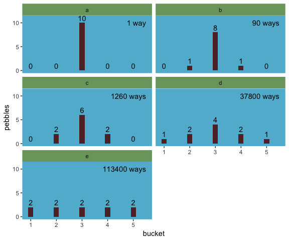

We might plot the final panel like so.


```r
d %>% 
  # the next four lines are the same from above
  mutate_all(~ . / sum(.)) %>% 
  gather() %>% 
  group_by(key) %>% 
  summarise(h = -sum(ifelse(value == 0, 0, value * log(value)))) %>% 
  # here's the R code 9.4 stuff
  mutate(n_ways   = c(1, 90, 1260, 37800, 113400)) %>% 
  group_by(key) %>% 
  mutate(log_ways = log(n_ways) / 10,
         text_y   = ifelse(key < "c", h + .15, h - .15)) %>%
  
  # plot
  ggplot(aes(x = log_ways, y = h)) +
  geom_abline(intercept = 0, slope = 1.37, 
              color = "white") +
  geom_point(size = 2.5, color = ghibli_palette("MarnieMedium1")[7]) +
  geom_text(aes(y = text_y, label = key)) +
  labs(x = "log(ways) per pebble",
       y = "entropy") +
  theme(panel.grid = element_blank(),
        panel.background = element_rect(fill = ghibli_palette("MarnieMedium1")[6]))
```

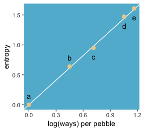

"The distribution that can happen the greatest number of ways is the most plausible distribution. Call this distribution the maximum entropy distribution" (p. 271). Among the pebbles, the maximum entropy distribution was `e` (i.e., the uniform).

### Gaussian.

Behold the probability distribution for the generalized normal distribution:

$$\text{Pr} (y | \mu, \alpha, \beta) = \frac{\beta}{2 \alpha \Gamma \bigg (\frac{1}{\beta} \bigg )} e ^ {- \bigg (\frac{|y - \mu|}{\alpha} \bigg ) ^ {\beta}}$$

In this formulation, $\alpha =$ the scale, $\beta =$ the shape, $\mu =$ the location, and $\Gamma =$ the [gamma function](https://en.wikipedia.org/wiki/Gamma_function). If you read closely in the text, you'll discover that the densities in the right panel of Figure 9.2 were all created with the constraint $\sigma^2 = 1$. But $\sigma^2 \neq \alpha$ and there's no $\sigma$ in the equations in the text. However, it appears the variance for the generalized normal distribution follows the form:

$$\sigma^2 = \frac{\alpha^2 \Gamma (3/\beta)}{\Gamma (1/\beta)}$$

So if you do the algebra, you'll see that you can compute $\alpha$ for a given $\sigma^2$ and $\beta$ like so:

$$\alpha = \sqrt{ \frac{\sigma^2 \Gamma (1/\beta)}{\Gamma (3/\beta)} }$$

I got the formula from [Wikipedia.com](https://en.wikipedia.org/wiki/Generalized_normal_distribution). Don't judge. We can wrap that formula in a custom function, `alpha_per_beta()`, use it to solve for the desired $\beta$ values, and plot. But one more thing: McElreath didn't tell us exactly which $\beta$ values the left panel of Figure 9.2 was based on. So the plot below is my best guess.


```r
alpha_per_beta <- function(variance, beta){
  sqrt((variance * gamma(1 / beta)) / gamma(3 / beta))
}

tibble(mu       = 0,
       variance = 1,
       # I arrived at these values by trial and error
       beta     = c(1, 1.5, 2, 4)) %>% 
  mutate(alpha  = map2(variance, beta, alpha_per_beta)) %>% 
  unnest() %>% 
  expand(nesting(mu, beta, alpha), 
         value = seq(from = -5, to = 5, by = .1)) %>% 
  # behold the formula for the generalized normal distribution in code
  mutate(density = (beta / (2 * alpha * gamma(1 / beta))) * exp(1) ^ (-1 * (abs(value - mu) / alpha) ^ beta)) %>% 
  
  # plot
  ggplot(aes(x = value, y = density,
             group = beta)) +
  geom_line(aes(color = beta == 2,
                size  = beta == 2)) +
  scale_color_manual(values = c(ghibli_palette("MarnieMedium2")[2],
                                ghibli_palette("MarnieMedium2")[4])) +
  scale_size_manual(values = c(1/4, 1.25)) +
  ggtitle(NULL, subtitle = "Guess which color denotes the Gaussian.") +
  coord_cartesian(xlim = -4:4) +
  theme(panel.grid       = element_blank(),
        legend.position  = "none",
        panel.background = element_rect(fill = ghibli_palette("MarnieMedium2")[7]))
```

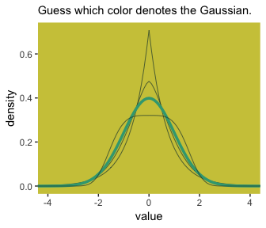

Here's Figure 9.2's right panel.


```r
tibble(mu       = 0,
       variance = 1,
       # this time we need a more densely-packed sequence of `beta` values
       beta     = seq(from = 1, to = 4, length.out = 100)) %>% 
  mutate(alpha  = map2(variance, beta, alpha_per_beta)) %>%
  unnest() %>%
  expand(nesting(mu, beta, alpha), 
         value = -8:8) %>% 
  mutate(density = (beta / (2 * alpha * gamma(1 / beta))) * exp(1) ^ (-1 * (abs(value - mu) / alpha) ^ beta)) %>% 
  group_by(beta) %>% 
  # this is just an abbreviated version of the formula we used in our first code block
  summarise(entropy = -sum(density * log(density))) %>% 
  
  ggplot(aes(x = beta, y = entropy)) +
  geom_vline(xintercept = 2, color = "white") +
  geom_line(size = 2, color = ghibli_palette("MarnieMedium2")[6]) +
  coord_cartesian(ylim = c(1.34, 1.42)) +
  theme(panel.grid       = element_blank(),
        panel.background = element_rect(fill = ghibli_palette("MarnieMedium2")[7]))
```

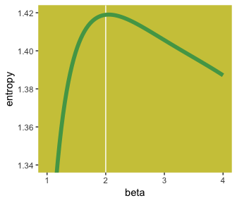

If you look closely, you’ll see our version doesn’t quite match up with McElreath’s. Over x-axis values of 2 to 4, they match up pretty well. But as you go from 2 to 1, you’ll see our line drops off more steeply than his did. [And no, `coord_cartesian()` isn't the problem.] If you can figure out why our numbers diverged, [please share the answer](https://github.com/ASKurz/Statistical_Rethinking_with_brms_ggplot2_and_the_tidyverse/issues).

But getting back on track: 

> The take-home lesson from all of this is that, if all we are willing to assume about a collection of measurements is that they have a finite variance, then the Gaussian distribution represents the most conservative probability distribution to assign to those measurements. But very often we are comfortable assuming something more. And in those cases, provided our assumptions are good ones, the principle of maximum entropy leads to distributions other than the Gaussian. (p. 274)

### Binomial.

The binomial likelihood entails 

> counting the numbers of ways that a given observation could arise, according to assumptions... If only two things can happen (blue or white marble, for example), and there's a constant chance $p$ of each across $n$ trials, then the probability of observing $y$ events of type 1 and $n - y$ events of type 2 is: 
>
> $$\text{Pr} (y | n, p) = \frac{n!}{y! (n - y)!} p^y (1 - p)^{n - y}$$
>
> It may help to note that the fraction with the factorials is just saying how many different ordered sequences of $n$ outcomes have a count of $y$. (p. 275)

For me, that last sentence made more sense when I walked it out in an example. To do so, lets wrap that fraction of factorials into a function.


```r
count_ways <- function(n, y){
  # n = the total number of trials (i.e., the number of rows in your vector)
  # y = the total number of 1s (i.e., successes) in your vector
  (factorial(n) / (factorial(y) * factorial(n - y)))
}
```

Now consider three sequences:

* 0, 0, 0, 0 (i.e., $n = 4$ and $y = 0$)
* 1, 0, 0, 0 (i.e., $n = 4$ and $y = 1$)
* 1, 1, 0, 0 (i.e., $n = 4$ and $y = 2$)

We can organize that information in a little tibble and then demo our `count_ways()` function.


```r
tibble(sequence = 1:3,
       n        = 4,
       y        = c(0, 1, 2)) %>% 
  mutate(n_ways = map2(n, y, count_ways)) %>% 
  unnest()
```

```
## # A tibble: 3 x 4
##   sequence     n     y n_ways
##      <int> <dbl> <dbl>  <dbl>
## 1        1     4     0      1
## 2        2     4     1      4
## 3        3     4     2      6
```

Here's the pre-Figure 9.3 data McElreath presented at the bottom of page 275.


```r
(
  d <-
  tibble(distribution = letters[1:4],
         ww = c(1/4, 2/6, 1/6, 1/8),
         bw = c(1/4, 1/6, 2/6, 4/8),
         wb = c(1/4, 1/6, 2/6, 2/8),
         bb = c(1/4, 2/6, 1/6, 1/8))
  )
```

```
## # A tibble: 4 x 5
##   distribution    ww    bw    wb    bb
##   <chr>        <dbl> <dbl> <dbl> <dbl>
## 1 a            0.25  0.25  0.25  0.25 
## 2 b            0.333 0.167 0.167 0.333
## 3 c            0.167 0.333 0.333 0.167
## 4 d            0.125 0.5   0.25  0.125
```

Those data take just a tiny bit of wrangling before they're ready to plot with.


```r
d %>% 
  gather(key, value, -distribution) %>% 
  mutate(key = factor(key, levels = c("ww", "bw", "wb", "bb"))) %>% 
  
  ggplot(aes(x = key, y = value, group = 1)) +
  geom_point(size = 2, color = ghibli_palette("PonyoMedium")[4]) +
  geom_line(color = ghibli_palette("PonyoMedium")[5]) +
  coord_cartesian(ylim = 0:1) +
  labs(x = NULL,
       y = NULL) +
  theme(panel.grid   = element_blank(),
        axis.ticks.x = element_blank(),
        panel.background = element_rect(fill = ghibli_palette("PonyoMedium")[2]),
        strip.background = element_rect(fill = ghibli_palette("PonyoMedium")[6])) +
  facet_wrap(~distribution)
```

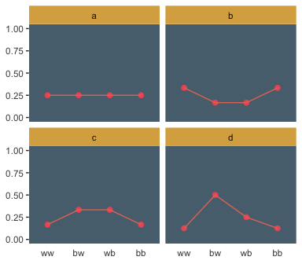

If we go step by step, we might count the expected value for each `distribution` like follows.


```r
d %>% 
  gather(sequence, probability, -distribution) %>% 
  # `str_count()` will count the number of times "b" occurs within a given row of `sequence`
  mutate(n_b     = str_count(sequence, "b")) %>% 
  mutate(product = probability * n_b) %>% 
  group_by(distribution) %>% 
  summarise(expected_value = sum(product))
```

```
## # A tibble: 4 x 2
##   distribution expected_value
##   <chr>                 <dbl>
## 1 a                         1
## 2 b                         1
## 3 c                         1
## 4 d                         1
```

We can use the same `gather()` and `group_by()` strategies on the way to computing the entropies.


```r
d %>% 
  gather(sequence, probability, -distribution) %>% 
  group_by(distribution) %>% 
  summarise(entropy = -sum(probability * log(probability)))
```

```
## # A tibble: 4 x 2
##   distribution entropy
##   <chr>          <dbl>
## 1 a               1.39
## 2 b               1.33
## 3 c               1.33
## 4 d               1.21
```

Like in the text, `distribution == "a"` had the largest `entropy` of the four. In the next example, the $\text{expected value} = 1.4$ and $p = .7$.


```r
p <- 0.7

(
  a <- 
  c((1 - p)^2, 
    p * (1 - p), 
    (1 - p) * p, 
    p^2)
)
```

```
## [1] 0.09 0.21 0.21 0.49
```

Here's the entropy for our distribution `a`.


```r
-sum(a * log(a))
```

```
## [1] 1.221729
```

I'm going to alter McElreath's simulation function from R code block 9.9 to take a seed argument. In addition, I altered the names of the objects within the function and changed the output to a tibble that will also include the conditions "ww", "bw", "wb", and "bb".


```r
sim_p <- function(seed, g = 1.4) {
  
  set.seed(seed)
  
  x_123 <- runif(3)
  x_4   <- ((g) * sum(x_123) - x_123[2] - x_123[3]) / (2 - g)
  z     <- sum(c(x_123, x_4))
  p     <- c(x_123, x_4) / z
  tibble(h   = -sum(p * log(p)), 
         p   = p,
         key = factor(c("ww", "bw", "wb", "bb"), levels = c("ww", "bw", "wb", "bb")))
}
```

For a given `seed` and `g` value, our augmented `sim_p()` function returns a $4 \times 3$ tibble.


```r
sim_p(seed = 9.9, g = 1.4)
```

```
## # A tibble: 4 x 3
##       h      p key  
##   <dbl>  <dbl> <fct>
## 1  1.02 0.197  ww   
## 2  1.02 0.0216 bw   
## 3  1.02 0.184  wb   
## 4  1.02 0.597  bb
```

So the next step is to determine how many replications we'd like, create a tibble with seed values ranging from 1 to that number, and then feed those `seed` values into `sim_p()` via `purrr::map2()`, which will return a nested tibble. We'll then `unnest()` and take a peek.


```r
# how many replications would you like?
n_rep <- 1e5

d <-
  tibble(seed = 1:n_rep) %>% 
  mutate(sim = map2(seed, 1.4, sim_p)) %>% 
  unnest()

head(d)
```

```
## # A tibble: 6 x 4
##    seed     h      p key  
##   <int> <dbl>  <dbl> <fct>
## 1     1  1.21 0.108  ww   
## 2     1  1.21 0.151  bw   
## 3     1  1.21 0.233  wb   
## 4     1  1.21 0.508  bb   
## 5     2  1.21 0.0674 ww   
## 6     2  1.21 0.256  bw
```

In order to intelligently choose which four replications we want to highlight in Figure 9.4, we'll want to rank order them by entropy, `h`.


```r
ranked_d <-
  d %>% 
  group_by(seed) %>% 
  arrange(desc(h)) %>% 
  ungroup() %>%
  # here's the rank order step
  mutate(rank = rep(1:n_rep, each = 4))

head(ranked_d)
```

```
## # A tibble: 6 x 5
##    seed     h      p key    rank
##   <int> <dbl>  <dbl> <fct> <int>
## 1 55665  1.22 0.0903 ww        1
## 2 55665  1.22 0.209  bw        1
## 3 55665  1.22 0.210  wb        1
## 4 55665  1.22 0.490  bb        1
## 5 71132  1.22 0.0902 ww        2
## 6 71132  1.22 0.210  bw        2
```

And we'll also want a subset of the data to correspond to McElreath's "A" through "D" distributions.


```r
subset_d <-
  ranked_d %>%
  # I arrived at these `rank` values by trial and error
  filter(rank %in% c(1, 87373, n_rep - 1500, n_rep - 10)) %>% 
  # I arrived at the `height` values by trial and error, too
  mutate(height       = rep(c(8, 2.25, .75, .5), each = 4),
         distribution = rep(letters[1:4], each = 4))

head(subset_d)
```

```
## # A tibble: 6 x 7
##    seed     h      p key    rank height distribution
##   <int> <dbl>  <dbl> <fct> <int>  <dbl> <chr>       
## 1 55665 1.22  0.0903 ww        1   8    a           
## 2 55665 1.22  0.209  bw        1   8    a           
## 3 55665 1.22  0.210  wb        1   8    a           
## 4 55665 1.22  0.490  bb        1   8    a           
## 5 50981 1.000 0.0459 ww    87373   2.25 b           
## 6 50981 1.000 0.0459 bw    87373   2.25 b
```

We're finally ready to plot the left panel of Figure 9.4.


```r
d %>% 
  ggplot(aes(x = h)) +
  geom_density(size = 0, fill = ghibli_palette("LaputaMedium")[3],
               adjust = 1/4) +
  # note the data statements for the next two geoms
  geom_linerange(data = subset_d %>% group_by(seed) %>% slice(1),
                 aes(ymin = 0, ymax = height),
                 color = ghibli_palette("LaputaMedium")[5]) +
  geom_text(data = subset_d %>% group_by(seed) %>% slice(1),
            aes(y = height + .5, label = distribution)) +
  scale_x_continuous("Entropy",
                     breaks = seq(from = .7, to = 1.2, by = .1)) +
  theme(panel.grid       = element_blank(),
        panel.background = element_rect(fill = ghibli_palette("LaputaMedium")[7]))
```

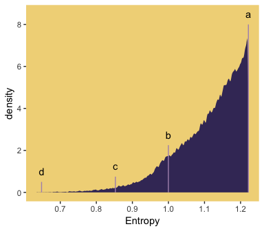

Did you notice how our `adjust = 1/4` with `geom_density()` served a similar function to the `adj=0.1` in McElreath's `dens()` code. Anyways, here's the right panel.


```r
ranked_d %>%
  filter(rank %in% c(1, 87373, n_rep - 1500, n_rep - 10)) %>% 
  mutate(distribution = rep(letters[1:4], each = 4)) %>% 

  ggplot(aes(x = key, y = p, group = 1)) +
  geom_line(color = ghibli_palette("LaputaMedium")[5]) +
  geom_point(size = 2, color = ghibli_palette("LaputaMedium")[4]) +
  coord_cartesian(ylim = 0:1) +
  labs(x = NULL,
       y = NULL) +
  theme(panel.grid   = element_blank(),
        axis.ticks.x = element_blank(),
        panel.background = element_rect(fill = ghibli_palette("LaputaMedium")[7]),
        strip.background = element_rect(fill = ghibli_palette("LaputaMedium")[6])) +
  facet_wrap(~distribution)
```

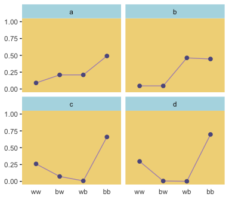

Because we were simulating, our values won't match up identically with those in the text. But we're pretty close, eh?

Since we saved our `sim_p()` output in a nested tibble, which we then `unnested()`, there's no need to separate the entropy values from the distributional values the way McElreath did in R code 9.11. If we wanted to determine our highest entropy value--and the corresponding `seed` and `p` values, while we're at it--, we might use `max(h)` within `slice()`.


```r
ranked_d %>% 
  group_by(key) %>% 
  slice(max(h))
```

```
## # A tibble: 4 x 5
## # Groups:   key [4]
##    seed     h      p key    rank
##   <int> <dbl>  <dbl> <fct> <int>
## 1 55665  1.22 0.0903 ww        1
## 2 55665  1.22 0.209  bw        1
## 3 55665  1.22 0.210  wb        1
## 4 55665  1.22 0.490  bb        1
```

That maximum `h` value matched up nicely with the one in the text. If you look at the `p` column, you'll see our values approximated McElreath's `distribution` values, too. In both cases, they're real close to the `a` values we computed, above.


```r
a
```

```
## [1] 0.09 0.21 0.21 0.49
```

## Generalized linear models

> For an outcome variable that is continuous and far from any theoretical maximum or minimum, [a simple] Gaussian model has maximum entropy.  But when the outcome variable is either discrete or bounded, a Gaussian likelihood is not the most powerful choice. (p. 280)

I winged the values for our Figure 9.5.


```r
tibble(x = seq(from = -1, to = 3, by = .01)) %>%
  mutate(probability = .35 + x * .5) %>% 

  ggplot(aes(x = x, y = probability)) +
  geom_rect(xmin = -1, xmax = 3,
            ymin = 0,  ymax = 1,
            fill = ghibli_palette("MononokeMedium")[5]) +
  geom_hline(yintercept = 0:1, linetype = 2, color = ghibli_palette("MononokeMedium")[7]) +
  geom_line(aes(linetype = probability > 1, color = probability > 1),
            size = 1) +
  geom_segment(x = 1.3, xend = 3,
               y = 1, yend = 1,
               size = 2/3, color = ghibli_palette("MononokeMedium")[3]) +
  scale_color_manual(values = c(ghibli_palette("MononokeMedium")[3],
                                ghibli_palette("MononokeMedium")[7])) +
  scale_y_continuous(breaks = c(0, .5, 1)) +
  coord_cartesian(xlim = 0:2,
                  ylim = c(0, 1.2)) +
  theme(panel.grid       = element_blank(),
        legend.position  = "none",
        panel.background = element_rect(fill = ghibli_palette("MononokeMedium")[1]))
```

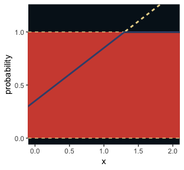

> For a count outcome $y$ for which each observation arises from $n$ trials and with constant expected value $np$, the binomial distribution has maximum entropy. So it’s the least informative distribution that satisfies our prior knowledge of the outcomes $y$. (p. 281)

The binomial model follows the basic form

$$
\begin{eqnarray}
y_i & \sim & \text{Binomial} (n, p_i) \\
f(p_i) & = & \alpha + \beta x_i
\end{eqnarray}
$$

The $f()$ portion of the second line represents the link function. We need the link function because, though the shape of the Binomial distribution is determined by two parameters--$n$ and $p$--, neither is equivalent to the Gaussian mean $\mu$. The mean outcome, rather, is $np$--a function of both. The link function also ensures the model doesn't make probability predictions outside of the boundary $[0, 1]$.

Let's get more general.

### Meet the family.

Here are the Gamma and Exponential panels for Figure 9.6.


```r
length_out <- 100

tibble(x = seq(from = 0, to = 5, length.out = length_out)) %>% 
  mutate(Gamma       = dgamma(x, 2, 2),
         Exponential = dexp(x)) %>% 
  gather(key, density, -x) %>% 
  mutate(label = rep(c("y %~% Gamma(lambda, kappa)", "y %~% Exponential(lambda)"), each = n()/2)) %>% 
  
  ggplot(aes(x = x, ymin = 0, ymax = density)) +
  geom_ribbon(fill = ghibli_palette("SpiritedMedium")[3]) +
  scale_x_continuous(NULL, breaks = NULL) +
  scale_y_continuous(NULL, breaks = NULL) +
  coord_cartesian(xlim = 0:4) +
  theme(panel.grid       = element_blank(),
        panel.background = element_rect(fill = ghibli_palette("SpiritedMedium")[5]),
        strip.background = element_rect(fill = ghibli_palette("SpiritedMedium")[7])) +
  facet_wrap(~label, scales = "free_y", labeller = label_parsed)
```

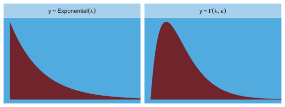

The Gaussian:


```r
length_out <- 100

tibble(x = seq(from = -5, to = 5, length.out = length_out)) %>% 
  mutate(density = dnorm(x),
         strip   = "y %~% Normal(mu, sigma)") %>% 

  ggplot(aes(x = x, ymin = 0, ymax = density)) +
  geom_ribbon(fill = ghibli_palette("SpiritedMedium")[3]) +
  scale_x_continuous(NULL, breaks = NULL) +
  scale_y_continuous(NULL, breaks = NULL) +
  coord_cartesian(xlim = -4:4) +
  theme(panel.grid       = element_blank(),
        panel.background = element_rect(fill = ghibli_palette("SpiritedMedium")[5]),
        strip.background = element_rect(fill = ghibli_palette("SpiritedMedium")[7])) +
  facet_wrap(~strip, labeller = label_parsed)
```

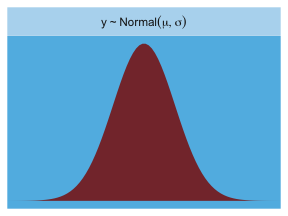

Here is the Poisson.


```r
length_out <- 100

tibble(x = 0:20) %>% 
  mutate(density = dpois(x, lambda = 2.5),
         strip   = "y %~% Poisson(lambda)") %>% 

  ggplot(aes(x = x, y = density)) +
  geom_col(fill = ghibli_palette("SpiritedMedium")[2], width = 1/2) +
  scale_x_continuous(NULL, breaks = NULL) +
  scale_y_continuous(NULL, breaks = NULL) +
  coord_cartesian(xlim = 0:10) +
  theme(panel.grid       = element_blank(),
        panel.background = element_rect(fill = ghibli_palette("SpiritedMedium")[5]),
        strip.background = element_rect(fill = ghibli_palette("SpiritedMedium")[7])) +
  facet_wrap(~strip, labeller = label_parsed)
```

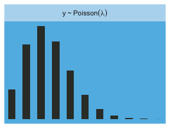

Finally, the Binomial:


```r
length_out <- 100

tibble(x = 0:10) %>% 
  mutate(density = dbinom(x, size = 10, prob = .85),
         strip   = "y %~% Binomial(n, p)") %>% 

  ggplot(aes(x = x, y = density)) +
  geom_col(fill = ghibli_palette("SpiritedMedium")[2], width = 1/2) +
  scale_x_continuous(NULL, breaks = NULL) +
  scale_y_continuous(NULL, breaks = NULL) +
  coord_cartesian(xlim = 0:10) +
  theme(panel.grid       = element_blank(),
        panel.background = element_rect(fill = ghibli_palette("SpiritedMedium")[5]),
        strip.background = element_rect(fill = ghibli_palette("SpiritedMedium")[7])) +
  facet_wrap(~strip, labeller = label_parsed)
```

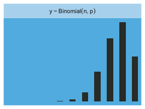

#### Rethinking: A likelihood is a prior. 

> In traditional statistics, likelihood functions are "objective" and prior distributions "subjective." However, likelihoods are themselves prior probability distributions: They are priors for the data, conditional on the parameters. And just like with other priors, there is no correct likelihood. But there are better and worse likelihoods, depending upon context. (p. 284)

For a little more in this, check out McElreath’s great lecture, [Bayesian Statistics without Frequentist Language](https://www.youtube.com/watch?v=yakg94HyWdE&t=1s&frags=pl%2Cwn). This subsection also reminds me of the title of one of Gelman’s blog posts, [*"It is perhaps merely an accident of history that skeptics and subjectivists alike strain on the gnat of the prior distribution while swallowing the camel that is the likelihood"*](https://andrewgelman.com/2015/01/27/perhaps-merely-accident-history-skeptics-subjectivists-alike-strain-gnat-prior-distribution-swallowing-camel-likelihood/). The title, which itself is a quote, comes from one of his papers, which he linked to in the blog, along with several related papers. It’s taken some time for the weight of that quote to sink in with me, and indeed it’s still sinking. Perhaps you’ll benefit from it, too.

### Linking linear models to distributions.

> To build a regression model from any of the exponential family distributions is just a matter of attaching one or more linear models to one or more of the parameters that describe the distribution’s shape. But as hinted at earlier, usually we require a link function to prevent mathematical accidents like negative distances or probability masses that exceed 1. (p. 284)

These models generally follow the form

$$
\begin{eqnarray}
y_i & \sim & \text{Some distribution} (\theta_i, \phi) \\
f(\theta_i) & = & \alpha + \beta x_i
\end{eqnarray}
$$

where $\theta_i$ is a parameter of central interest (e.g., the probability of 1 in a Binomial distribution) and $\phi$ is a placeholder for any other parameters necessary for the likelihood but not of primary substantive interest (e.g., $\sigma$ in work-a-day Gaussian models). And as stated earlier, $f()$ is the link function.

Speaking of, 

> the logit link maps a parameter that is defined as a probability mass and therefore constrained to lie between zero and one, onto a linear model that can take on any real value. This link is extremely common when working with binomial GLMs. In the context of a model definition, it looks like this:
>
>$$ \begin{eqnarray}y_i&\sim&\text{Binomial}(n, p_i)\\\text{logit}(p_i)&=&\alpha+\beta x_i \end{eqnarray}$$
>
> And the logit function itself is defined as the *log-odds:*
>
> $$\text{logit} (p_i) = \text{log} \frac{p_i}{1 - p_i}$$
>
> The "odds" of an event are just the probability it happens divided by the probability it does not happen. So really all that is being stated here is:
>
> $$\text{log} \frac{p_i}{1 - p_i} = \alpha + \beta x_i$$

If we do the final algebraic manipulation on page 285, we can solve for $p_i$ in terms of the linear model:

$$p_i = \frac{\text{exp} (\alpha + \beta x_i)}{1 + \text{exp} (\alpha + \beta x_i)}$$

As we'll see later, we will make great use of this formula via the `brms::inv_logit_scaled()` when making sense of logistic regression models. Now we have that last formula in hand, we can make the data necessary for Figure 9.7.


```r
# first, we'll make data for the horizontal lines
alpha <- 0
beta  <- 4

lines <-
  tibble(x           = seq(from = -1, to = 1, by = .25)) %>% 
  mutate(`log-odds`  = alpha + x * beta,
         probability = exp(alpha + x * beta) / (1 + exp(alpha + x * beta)))

# now we're ready to make the primary data
beta  <- 2

d <-
  tibble(x           = seq(from = -1.5, to = 1.5, length.out = 50)) %>% 
  mutate(`log-odds`  = alpha + x * beta,
         probability = exp(alpha + x * beta) / (1 + exp(alpha + x * beta))) 

# now we make the individual plots
p1 <-
  d %>% 
  ggplot(aes(x = x, y = `log-odds`)) +
  geom_hline(data = lines,
             aes(yintercept = `log-odds`),
             color = ghibli_palette("YesterdayMedium")[6]) +
  geom_line(size = 1.5, color = ghibli_palette("YesterdayMedium")[3]) +
  coord_cartesian(xlim = -1:1) +
  theme(panel.grid = element_blank(),
        panel.background = element_rect(fill = ghibli_palette("YesterdayMedium")[5]))

p2 <-
  d %>% 
  ggplot(aes(x = x, y = probability)) +
  geom_hline(data = lines,
             aes(yintercept = probability),
             color = ghibli_palette("YesterdayMedium")[6]) +
  geom_line(size = 1.5, color = ghibli_palette("YesterdayMedium")[3]) +
  coord_cartesian(xlim = -1:1) +
  theme(panel.grid = element_blank(),
        panel.background = element_rect(fill = ghibli_palette("YesterdayMedium")[7]))

# finally, we're ready to mash the plots together and behold their nerdy glory
library(gridExtra)

grid.arrange(p1, p2, ncol = 2)
```

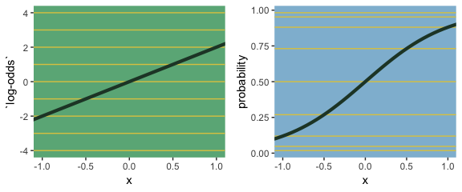

> The key lesson for now is just that no regression coefficient, such as $\beta$, from a GLM ever produces a constant change on the outcome scale. Recall that we defined interaction (Chapter 7) as a situation in which the effect of a predictor depends upon the value of another predictor. Well now every predictor essentially interacts with itself, because the impact of a change in a predictor depends upon the value of the predictor before the change... 
>
> The second very common link function is the log link. This link function maps a parameter that is defined over only positive real values onto a linear model. For example, suppose we want to model the standard deviation of $\sigma$ of a Gaussian distribution so it is a function of a predictor variable $x$. The parameter $\sigma$ must be positive, because a standard deviation cannot be negative no can it be zero. The model might look like:
>
>
> $$
> \begin{eqnarray}
> y_i & \sim & \text{Normal} (\mu, \sigma_i) \\
> \text{log} (\sigma_i) & = & \alpha + \beta x_i
> \end{eqnarray}
> $$ 
>
> In this model, the mean $\mu$ is constant, but the standard deviation scales with the value $x_i$. (p. 268)

This kind of model is trivial in the brms framework, which you can learn more about in Bürkner's vignette [*Estimating Distributional Models with brms*](https://cran.r-project.org/web/packages/brms/vignettes/brms_distreg.html). Before moving on with the text, let's detour and see how we might fit such a model. First, let's simulate some continuous data `y` for which the $SD$ is effected by a dummy variable `x`.


```r
set.seed(9)
(
  d <-
  tibble(x = rep(0:1, each = 100)) %>% 
  mutate(y = rnorm(n = n(), mean = 100, sd = 10 + x * 10))
  )
```

```
## # A tibble: 200 x 2
##        x     y
##    <int> <dbl>
##  1     0  92.3
##  2     0  91.8
##  3     0  98.6
##  4     0  97.2
##  5     0 104. 
##  6     0  88.1
##  7     0 112. 
##  8     0  99.8
##  9     0  97.5
## 10     0  96.4
## # … with 190 more rows
```

We can view what data like these look like with aid from `tidybayes::geom_halfeyeh()`.


```r
library(tidybayes)

d %>% 
  mutate(x = x %>% as.character()) %>% 
  
  ggplot(aes(x = y, y = x, fill = x)) +
  geom_halfeyeh(color = ghibli_palette("KikiMedium")[2],
                point_interval = mean_qi, .width = .68) +
  scale_fill_manual(values = c(ghibli_palette("KikiMedium")[4],
                                   ghibli_palette("KikiMedium")[6])) +
  theme(panel.grid       = element_blank(),
        axis.ticks.y     = element_blank(),
        legend.position  = "none",
        panel.background = element_rect(fill = ghibli_palette("KikiMedium")[7]))
```

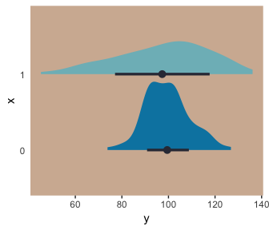

Even though the means of `y` are the same for both levels of the `x` dummy, the variance for `x == 1` is substantially larger than that for `x == 0`. Let's open brms.


```r
library(brms)
```

For such a model, we have two formulas: one for $\mu$ and one for $\sigma$. We wrap both within the `bf()` function. 


```r
b9.1 <- 
  brm(data = d,
      family = gaussian,
      bf(y ~ 1, sigma ~ 1 + x),
      prior = c(prior(normal(100, 10), class = Intercept),
                prior(normal(0, 10),   class = Intercept, dpar = sigma),
                prior(normal(0, 10),   class = b,         dpar = sigma)),
      seed = 9)
```

Do note our use of the `dpar` arguments in the `prior` statements. Here's the summary.


```r
print(b9.1)
```

```
##  Family: gaussian 
##   Links: mu = identity; sigma = log 
## Formula: y ~ 1 
##          sigma ~ 1 + x
##    Data: d (Number of observations: 200) 
## Samples: 4 chains, each with iter = 2000; warmup = 1000; thin = 1;
##          total post-warmup samples = 4000
## 
## Population-Level Effects: 
##                 Estimate Est.Error l-95% CI u-95% CI Eff.Sample Rhat
## Intercept          99.04      0.86    97.37   100.77       4170 1.00
## sigma_Intercept     2.26      0.07     2.13     2.40       3784 1.00
## sigma_x             0.73      0.10     0.53     0.92       4257 1.00
## 
## Samples were drawn using sampling(NUTS). For each parameter, Eff.Sample 
## is a crude measure of effective sample size, and Rhat is the potential 
## scale reduction factor on split chains (at convergence, Rhat = 1).
```

Now we get an intercept for both $\mu$ and $\sigma$, with the intercept for sigma identified as `sigma_Intercept`. And note the coefficient for $\sigma$ was named `sigma_x`. Also notice the scale the `sigma_` coefficients are on. These are not in the original metric, but rather based on `log()`. You can confirm that by the second line of the `print()` output: `Links: mu = identity; sigma = log`. So if you want to get a sense of the effects of `x` on the $\sigma$ for `y`, you have to exponentiate the formula. Here we'll do so with the `posterior_samples()`.


```r
post <- posterior_samples(b9.1)

head(post)
```

```
##   b_Intercept b_sigma_Intercept b_sigma_x      lp__
## 1    99.75865          2.281731 0.6406836 -818.1893
## 2    99.83593          2.244206 0.7046929 -817.9380
## 3    98.40659          2.282739 0.7512565 -817.9899
## 4    98.59265          2.222575 0.6913024 -818.1270
## 5    98.05085          2.244358 0.7482665 -818.1277
## 6    99.71570          2.306853 0.6402182 -818.0676
```

With the samples in hand, we’ll use the model formula to compute the model-implied standard deviations of `y` based on the `x` dummy and then examine them in a plot.


```r
post %>% 
  transmute(`x == 0` = exp(b_sigma_Intercept + b_sigma_x * 0),
            `x == 1` = exp(b_sigma_Intercept + b_sigma_x * 1)) %>% 
  gather(key, sd) %>% 
  
  ggplot(aes(x = sd, y = key, fill = key)) +
  geom_halfeyeh(color = ghibli_palette("KikiMedium")[2],
                point_interval = median_qi, .width = .95) +
  scale_fill_manual(values = c(ghibli_palette("KikiMedium")[4],
                                   ghibli_palette("KikiMedium")[6])) +
  labs(x = expression(sigma[x]), y = NULL,
       subtitle = expression(paste("Model-implied ", italic(SD), "s by group x"))) +
  coord_cartesian(ylim = c(1.5, 2)) +
  theme(panel.grid       = element_blank(),
        axis.ticks.y     = element_blank(),
        legend.position  = "none",
        panel.background = element_rect(fill = ghibli_palette("KikiMedium")[7]))
```

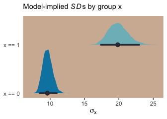

And if we looked back at the data, those $SD$ estimates are just what we'd expect.


```r
d %>% 
  group_by(x) %>% 
  summarise(sd = sd(y) %>% round(digits = 1)) 
```

```
## # A tibble: 2 x 2
##       x    sd
##   <int> <dbl>
## 1     0   9.6
## 2     1  19.8
```

For more on models like this, check out Christakis’ [*2014: What scientific idea is ready for retirement?*](https://www.edge.org/response-detail/25437) or [*The "average" treatment effect: A construct ripe for retirement. A commentary on Deaton and Cartwright*](http://humannaturelab.net/publications/the-average-treatment-effect-a-construct-ripe-for-retirement-a-commentary-on-deaton-and-cartwright). Kruschke also covered modeling $\sigma$ a bit in his [*Doing Bayesian Data Analysis, Second Edition: A Tutorial with R, JAGS, and Stan*](http://www.indiana.edu/~kruschke/DoingBayesianDataAnalysis/). Finally, this is foreshadowing a bit because it requires the multilevel model (see Chapters 12 and 13), but you might also check out the preprint by Williams, Liu, Martin, and Rast, [*Bayesian Multivariate Mixed-Effects Location Scale Modeling of Longitudinal Relations among Affective Traits, States, and Physical Activity*](https://psyarxiv.com/4kfjp/).

But getting back to the text,

> what the log link effectively assumes is that the parameter’s value is the exponentiation of the linear model. Solving $\text{log} (\sigma_i) = \alpha + \beta x_i$ for $\sigma_i$ yields the inverse link:
>
> $$\sigma_i = \text{exp} (\alpha + \beta x_i)$$
>
> The impact of this assumption can be seen in [our version of] Figure 9.8. (pp. 286—287)


```r
# first, we'll make data that'll be make the horizontal lines
alpha <- 0
beta  <- 2

lines <-
  tibble(`log-measurement`      = -3:3) %>% 
  mutate(`original measurement` = exp(`log-measurement`))

# now we're ready to make the primary data
d <-
  tibble(x                      = seq(from = -1.5, to = 1.5, length.out = 50)) %>% 
  mutate(`log-measurement`      = alpha + x * beta,
         `original measurement` = exp(alpha + x * beta)) 

# now we make the individual plots
p1 <-
  d %>% 
  ggplot(aes(x = x, y = `log-measurement`)) +
  geom_hline(data = lines,
             aes(yintercept = `log-measurement`),
             color = ghibli_palette("YesterdayMedium")[6]) +
  geom_line(size = 1.5, color = ghibli_palette("YesterdayMedium")[3]) +
  coord_cartesian(xlim = -1:1) +
  theme(panel.grid = element_blank(),
        panel.background = element_rect(fill = ghibli_palette("YesterdayMedium")[5]))

p2 <-
  d %>% 
  ggplot(aes(x = x, y = `original measurement`)) +
  geom_hline(data = lines,
             aes(yintercept = `original measurement`),
             color = ghibli_palette("YesterdayMedium")[6]) +
  geom_line(size = 1.5, color = ghibli_palette("YesterdayMedium")[3]) +
  coord_cartesian(xlim = -1:1,
                  ylim = 0:10) +
  theme(panel.grid = element_blank(),
        panel.background = element_rect(fill = ghibli_palette("YesterdayMedium")[7]))

# finally, we're ready to mash the plots together and behold their nerdy glory
grid.arrange(p1, p2, ncol = 2)
```

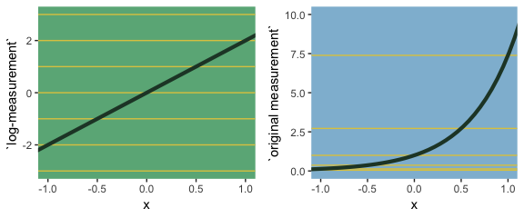

## Reference {-}

[McElreath, R. (2016). *Statistical rethinking: A Bayesian course with examples in R and Stan.* Chapman & Hall/CRC Press.](https://xcelab.net/rm/statistical-rethinking/)

## Session info {-}


```r
sessionInfo()
```

```
## R version 3.5.1 (2018-07-02)
## Platform: x86_64-apple-darwin15.6.0 (64-bit)
## Running under: macOS High Sierra 10.13.6
## 
## Matrix products: default
## BLAS: /Library/Frameworks/R.framework/Versions/3.5/Resources/lib/libRblas.0.dylib
## LAPACK: /Library/Frameworks/R.framework/Versions/3.5/Resources/lib/libRlapack.dylib
## 
## locale:
## [1] en_US.UTF-8/en_US.UTF-8/en_US.UTF-8/C/en_US.UTF-8/en_US.UTF-8
## 
## attached base packages:
## [1] stats     graphics  grDevices utils     datasets  methods   base     
## 
## other attached packages:
##  [1] brms_2.8.0      Rcpp_1.0.0      tidybayes_1.0.4 gridExtra_2.3  
##  [5] ghibli_0.2.0    forcats_0.3.0   stringr_1.3.1   dplyr_0.8.0.1  
##  [9] purrr_0.2.5     readr_1.1.1     tidyr_0.8.1     tibble_2.1.1   
## [13] ggplot2_3.1.0   tidyverse_1.2.1
## 
## loaded via a namespace (and not attached):
##  [1] nlme_3.1-137              matrixStats_0.54.0       
##  [3] xts_0.10-2                lubridate_1.7.4          
##  [5] threejs_0.3.1             httr_1.3.1               
##  [7] rstan_2.18.2              rprojroot_1.3-2          
##  [9] tools_3.5.1               backports_1.1.2          
## [11] utf8_1.1.4                R6_2.3.0                 
## [13] DT_0.4                    lazyeval_0.2.1           
## [15] colorspace_1.3-2          withr_2.1.2              
## [17] prettyunits_1.0.2         processx_3.2.1           
## [19] tidyselect_0.2.5          Brobdingnag_1.2-5        
## [21] compiler_3.5.1            cli_1.0.1                
## [23] rvest_0.3.2               arrayhelpers_1.0-20160527
## [25] shinyjs_1.0               xml2_1.2.0               
## [27] labeling_0.3              colourpicker_1.0         
## [29] scales_1.0.0              dygraphs_1.1.1.5         
## [31] mvtnorm_1.0-8             callr_3.1.0              
## [33] ggridges_0.5.0            StanHeaders_2.18.0-1     
## [35] digest_0.6.18             rmarkdown_1.10           
## [37] base64enc_0.1-3           pkgconfig_2.0.2          
## [39] htmltools_0.3.6           htmlwidgets_1.2          
## [41] rlang_0.3.1               readxl_1.1.0             
## [43] rstudioapi_0.7            shiny_1.1.0              
## [45] generics_0.0.2            svUnit_0.7-12            
## [47] zoo_1.8-2                 jsonlite_1.5             
## [49] crosstalk_1.0.0           gtools_3.8.1             
## [51] inline_0.3.15             magrittr_1.5             
## [53] loo_2.1.0                 bayesplot_1.6.0          
## [55] Matrix_1.2-14             munsell_0.5.0            
## [57] fansi_0.4.0               abind_1.4-5              
## [59] stringi_1.2.3             yaml_2.1.19              
## [61] pkgbuild_1.0.2            plyr_1.8.4               
## [63] ggstance_0.3              grid_3.5.1               
## [65] parallel_3.5.1            promises_1.0.1           
## [67] crayon_1.3.4              miniUI_0.1.1.1           
## [69] lattice_0.20-35           haven_1.1.2              
## [71] hms_0.4.2                 ps_1.2.1                 
## [73] knitr_1.20                pillar_1.3.1             
## [75] igraph_1.2.1              markdown_0.8             
## [77] shinystan_2.5.0           stats4_3.5.1             
## [79] reshape2_1.4.3            rstantools_1.5.0         
## [81] glue_1.3.0                evaluate_0.10.1          
## [83] modelr_0.1.2              httpuv_1.4.4.2           
## [85] cellranger_1.1.0          gtable_0.2.0             
## [87] assertthat_0.2.0          mime_0.5                 
## [89] xtable_1.8-2              broom_0.5.1              
## [91] coda_0.19-2               later_0.7.3              
## [93] rsconnect_0.8.8           shinythemes_1.1.1        
## [95] bridgesampling_0.4-0
```


