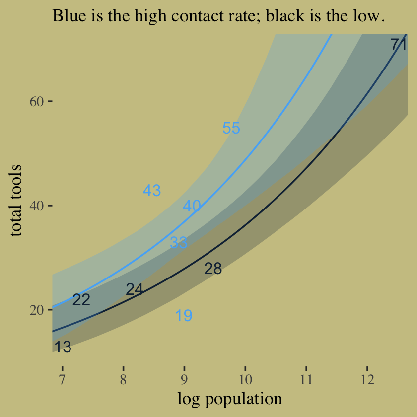
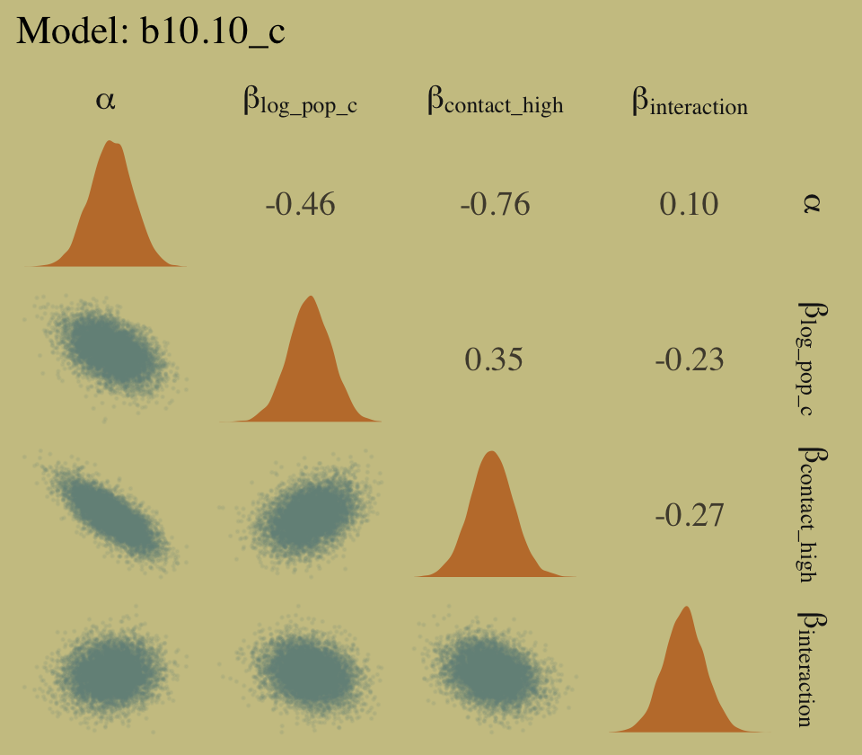
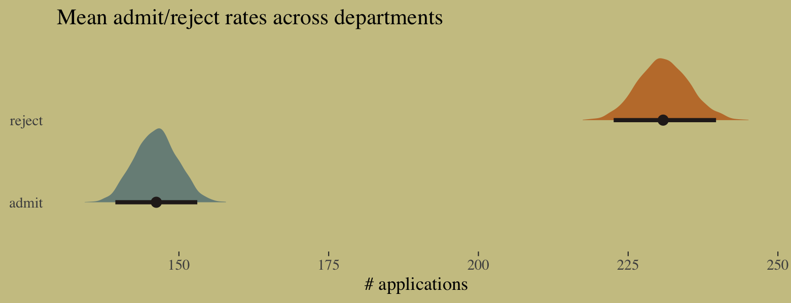
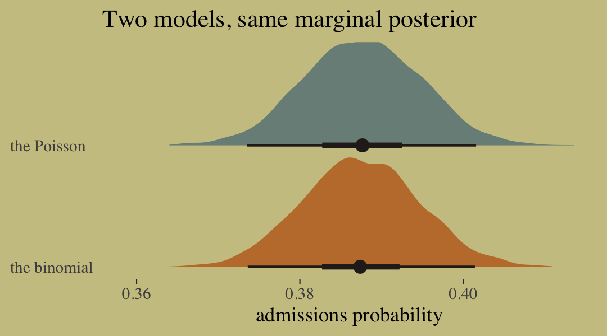
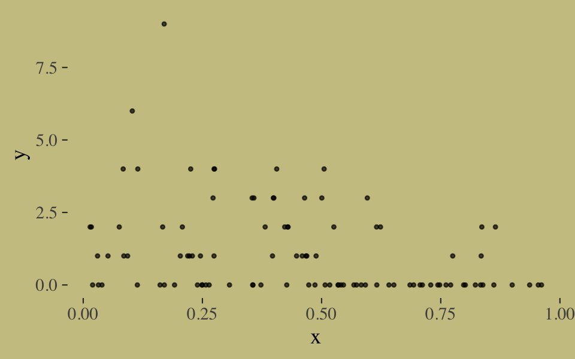
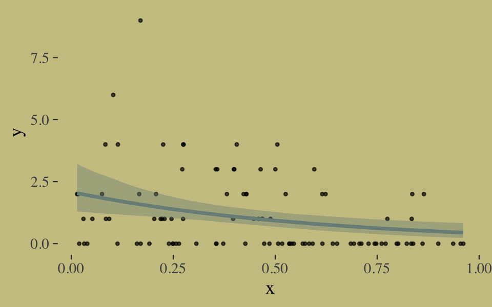

# Counting and Classification

> All over the world, every day, scientists throw away information. Sometimes this is through the removal of "outliers," cases in the data that offend the model and are exiled. More routinely, counted things are converted to proportions before analysis. Why does analysis of proportions throw away information? Because 10/20 and ½ are the same proportion, one-half, but have very different sample sizes. Once converted to proportions, and treated as outcomes in a linear regression, the information about sample size has been destroyed.
>
> It's easy to retain the information about sample size. All that is needed is to model what has actually been observed, the counts instead of the proportions. (p. 291)

In this chapter, we focus on the two most common types of count models: the binomial and the Poisson.

Side note: For a nice Bayesian way to accommodate outliers in your Gaussian models, check out my blog post, [*Robust Linear Regression with Student's $t$-Distribution*](https://solomonkurz.netlify.com/post/robust-linear-regression-with-the-robust-student-s-t-distribution/).

## Binomial regression

The basic binomial model follows the form

$$y \sim \text{Binomial} (n, p),$$

where $y$ is some count variable, $n$ is the number of trials, and $p$ it the probability a given trial was a 1, which is sometimes termed a *success*. When $n = 1$, then $y$ is a vector of 0s and 1s. Presuming the logit link, which we just covered in [Chapter 9][Linking linear models to distributions.], models of this type are commonly termed logistic regression. When $n > 1$, and still presuming the logit link, we might call our model an aggregated logistic regression model, or more generally an aggregated binomial regression model.

### Logistic regression: Prosocial chimpanzees.

Load the [Silk et al. (2005)](https://www2.psych.ubc.ca/~henrich/pdfs/silkbrosnan%20-%20Chimpanzees%20are%20indifferent%20to%20the%20welfare%20of.pdf) `chimpanzees` data.


```r
library(rethinking)
data(chimpanzees)
d <- chimpanzees
```

Switch from rethinking to brms.


```r
detach(package:rethinking, unload = T)
library(brms)
rm(chimpanzees)
```
 
We start with the simple intercept-only logistic regression model, which follows the statistical formula

\begin{align*}
\text{pulled_left}_i & \sim \text{Binomial} (1, p_i) \\
\text{logit} (p_i)    & = \alpha \\
\alpha                & \sim \text{Normal} (0, 10).
\end{align*}

In the `brm()` `formula` syntax, including a `|` bar on the left side of a formula indicates we have extra supplementary information about our criterion. In this case, that information is that each `pulled_left` value corresponds to a single trial (i.e., `trials(1)`), which itself corresponds to the $n = 1$ portion of the statistical formula, above.


```r
b10.1 <-
  brm(data = d, 
      family = binomial,
      pulled_left | trials(1) ~ 1,
      prior(normal(0, 10), class = Intercept),
      seed = 10,
      file = "fits/b10.01")
```

You might use `fixef()` to get a focused summary of the intercept.


```r
library(tidyverse)
 
fixef(b10.1) %>%
  round(digits = 2)
```

```
##           Estimate Est.Error Q2.5 Q97.5
## Intercept     0.32      0.09 0.13   0.5
```

The `brms::inv_logit_scaled()` function will be our alternative to the `logistic()` function in rethinking. Here we use it to convert the 89% interval estimates McElreath reported on page 294.


```r
c(.18, .46) %>%
  inv_logit_scaled()
```

```
## [1] 0.5448789 0.6130142
```

Here we use it to convert our `fixef()` output (which contains 95% intervals).


```r
fixef(b10.1) %>%
  inv_logit_scaled()
```

```
##            Estimate Est.Error      Q2.5     Q97.5
## Intercept 0.5785745 0.5231442 0.5333637 0.6224224
```

With the next two chimp models, we add predictors in the usual way.


```r
b10.2 <-
  brm(data = d, 
      family = binomial,
      pulled_left | trials(1) ~ 1 + prosoc_left,
      prior = c(prior(normal(0, 10), class = Intercept),
                prior(normal(0, 10), class = b)),
      seed = 10,
      file = "fits/b10.02")

b10.3 <-
  update(b10.2,
         newdata = d,
         formula = pulled_left | trials(1) ~ 1 + prosoc_left + condition:prosoc_left,
         seed = 10,
         file = "fits/b10.03")
```

Compute the WAIC for each model and save the results within the brmfit objects.


```r
b10.1 <- add_criterion(b10.1, "waic")
b10.2 <- add_criterion(b10.2, "waic")
b10.3 <- add_criterion(b10.3, "waic")
```

Compare them with the `loo_compare()` and make sure to add the `criterion = "waic"` argument.


```r
w <- loo_compare(b10.1, b10.2, b10.3, criterion = "waic")

print(w, simplify = F)
```

```
##       elpd_diff se_diff elpd_waic se_elpd_waic p_waic se_p_waic waic   se_waic
## b10.2    0.0       0.0  -340.2       4.7          2.0    0.0     680.5    9.3 
## b10.3   -1.0       0.4  -341.2       4.7          3.1    0.1     682.5    9.4 
## b10.1   -3.8       3.1  -344.0       3.5          1.1    0.0     688.1    7.0
```

Recall our `cbind()` trick to convert the differences from the $\text{elpd}$ metric to the WAIC metric.


```r
cbind(waic_diff = w[, 1] * -2,
      se        = w[, 2] *  2) %>% 
  round(digits = 2)
```

```
##       waic_diff   se
## b10.2      0.00 0.00
## b10.3      2.01 0.86
## b10.1      7.60 6.16
```

For this chapter, we'll take our color scheme from the [wesanderson package](https://cran.r-project.org/package=wesanderson)'s `Moonrise2` palette.


```r
# install.packages("wesanderson", dependencies = T)
library(wesanderson)

wes_palette("Moonrise2")
```


```r
wes_palette("Moonrise2")[1:4]
```

```
## [1] "#798E87" "#C27D38" "#CCC591" "#29211F"
```

We'll also take a few formatting cues from [Edward Tufte](https://www.edwardtufte.com/tufte/books_vdqi), courtesy of the [ggthemes package](https://cran.r-project.org/package=ggthemes). The `theme_tufte()` function will change the default font and remove some chart junk. The `theme_set()` function, below, will make these adjustments the default for all subsequent ggplot2 plots. To undo this, just execute `theme_set(theme_default())`.


```r
library(ggthemes)

theme_set(theme_default() + 
            theme_tufte() +
            theme(plot.background = element_rect(fill  = wes_palette("Moonrise2")[3],
                                                 color = wes_palette("Moonrise2")[3])))
```

Finally, here's our WAIC plot.


```r
w %>%
  data.frame() %>% 
  rownames_to_column(var = "model") %>% 
  
  ggplot() +
  geom_pointrange(aes(x = reorder(model, -waic), y = waic,
                      ymin = waic - se_waic,
                      ymax = waic + se_waic,
                      color = model),
                  shape = 16) +
  scale_color_manual(values = wes_palette("Moonrise2")[c(1:2, 4)]) +
  coord_flip() +
  labs(title = "WAIC",
       x = NULL, 
       y = NULL) +
  theme(axis.ticks.y = element_blank(),
        legend.position = "none")
```


The full model, `b10.3`, did not have the lowest WAIC value. Though note how wide those standard error bars are relative to the point estimates. There's a lot of model uncertainty there. Here are the WAIC weights.


```r
model_weights(b10.1, b10.2, b10.3, 
              weights = "waic")
```

```
##      b10.1      b10.2      b10.3 
## 0.01611244 0.71991083 0.26397673
```

Let's look at the parameter summaries for the theory-based model.


```r
print(b10.3)
```

```
##  Family: binomial 
##   Links: mu = logit 
## Formula: pulled_left | trials(1) ~ prosoc_left + prosoc_left:condition 
##    Data: d (Number of observations: 504) 
## Samples: 4 chains, each with iter = 2000; warmup = 1000; thin = 1;
##          total post-warmup samples = 4000
## 
## Population-Level Effects: 
##                       Estimate Est.Error l-95% CI u-95% CI Rhat Bulk_ESS Tail_ESS
## Intercept                 0.05      0.13    -0.19     0.30 1.00     3350     2971
## prosoc_left               0.62      0.23     0.17     1.07 1.00     2944     2858
## prosoc_left:condition    -0.11      0.27    -0.63     0.42 1.00     2817     2799
## 
## Samples were drawn using sampling(NUTS). For each parameter, Bulk_ESS
## and Tail_ESS are effective sample size measures, and Rhat is the potential
## scale reduction factor on split chains (at convergence, Rhat = 1).
```

Here's what the odds are multiplied by:


```r
fixef(b10.3)[2] %>%
  exp()
```

```
## [1] 1.850765
```

Given an estimated value of 4, the probability of a pull, all else equal, would be close to 1.


```r
inv_logit_scaled(4)
```

```
## [1] 0.9820138
```

Adding the coefficient, `fixef(b10.3)[2]`, would yield an even higher estimate.


```r
(4 + fixef(b10.3)[2]) %>%
  inv_logit_scaled()
```

```
## [1] 0.9902007
```

For our variant of Figure 10.2, we use `brms::pp_average()` in place of `rethinking::ensemble()`.


```r
# the combined `fitted()` results of the three models weighted by their WAICs
ppa <- 
  pp_average(b10.1, b10.2, b10.3,
             weights = "waic",
             method = "fitted") %>%
  as_tibble() %>% 
  bind_cols(b10.3$data) %>% 
  distinct(Estimate, Q2.5, Q97.5, condition, prosoc_left) %>% 
  mutate(x_axis = str_c(prosoc_left, condition, sep = "/")) %>%
  mutate(x_axis = factor(x_axis, levels = c("0/0", "1/0", "0/1", "1/1"))) %>% 
  rename(pulled_left = Estimate)

# the empirically-based summaries
d_plot <-
  d %>%
  group_by(actor, condition, prosoc_left) %>%
  summarise(pulled_left = mean(pulled_left)) %>%
  mutate(x_axis = str_c(prosoc_left, condition, sep = "/")) %>%
  mutate(x_axis = factor(x_axis, levels = c("0/0", "1/0", "0/1", "1/1")))

# the plot
ppa %>% 
  ggplot(aes(x = x_axis)) +
  geom_smooth(aes(y = pulled_left, ymin = Q2.5, ymax = Q97.5, group = 0),
              stat = "identity",
              fill = wes_palette("Moonrise2")[2], color = "black", 
              alpha = 1, size = 1/2) +
  geom_line(data = d_plot,
            aes(y = pulled_left, group = actor),
            color = wes_palette("Moonrise2")[1], size = 1/3) +
  scale_x_discrete("prosoc_left/condition", expand = c(.03, .03)) +
  ylab("proportion pulled left") +
  coord_cartesian(ylim = 0:1) +
  theme(axis.ticks.x = element_blank())
```


McElreath didn't show the actual pairs plot in the text. Here's ours using `mcmc_pairs()`.


```r
library(bayesplot)

# this helps us set our custom color scheme
color_scheme_set(wes_palette("Moonrise2")[c(3, 1, 2, 2, 1, 1)])

# the actual plot
mcmc_pairs(x = posterior_samples(b10.3),
           pars = c("b_Intercept", "b_prosoc_left", "b_prosoc_left:condition"),
           off_diag_args = list(size = 1/10, alpha = 1/6),
           diag_fun = "dens")
```


As McElreath observed, the posterior looks multivariate Gaussian.

In equations, the next model follows the form

\begin{align*}
\text{pulled_left}_i & \sim \text{Binomial} (1, p_i) \\
\text{logit} (p_i)    & = \alpha_{\text{actor}} + (\beta_1 + \beta_2 \text{condition}_i) \text{prosoc_left}_i \\
\alpha_{\text{actor}} & \sim \text{Normal} (0, 10) \\
\beta_1               & \sim \text{Normal} (0, 10) \\
\beta_2               & \sim \text{Normal} (0, 10).
\end{align*}

Enclosing the `actor` variable within `factor()` will produce the indexing we need to get `actor`-specific intercepts. Also notice we're using the `0 + factor(actor)` part of the model `formula` to suppress the brms default intercept. As such, the priors for all parameters in the model will be of `class = b`. And since we’re using the same Gaussian prior for each, we only need one line for the `prior` argument.


```r
b10.4 <-
  brm(data = d, family = binomial,
      pulled_left | trials(1) ~ 0 + factor(actor) + prosoc_left + condition:prosoc_left ,
      prior(normal(0, 10), class = b),
      iter = 2500, warmup = 500, chains = 2, cores = 2,
      control = list(adapt_delta = 0.9),
      seed = 10,
      file = "fits/b10.04")
```

Within the tidyverse, the `distinct()` function returns the information you'd otherwise get from `unique()`.


```r
d %>%
  distinct(actor)
```

```
##   actor
## 1     1
## 2     2
## 3     3
## 4     4
## 5     5
## 6     6
## 7     7
```

With a single-level model like this, we have no need to use something like `depth=2` for our posterior summary.


```r
print(b10.4)
```

```
##  Family: binomial 
##   Links: mu = logit 
## Formula: pulled_left | trials(1) ~ 0 + factor(actor) + prosoc_left + condition:prosoc_left 
##    Data: d (Number of observations: 504) 
## Samples: 2 chains, each with iter = 2500; warmup = 500; thin = 1;
##          total post-warmup samples = 4000
## 
## Population-Level Effects: 
##                       Estimate Est.Error l-95% CI u-95% CI Rhat Bulk_ESS Tail_ESS
## factoractor1             -0.74      0.28    -1.29    -0.20 1.00     4754     2762
## factoractor2             10.96      5.45     3.96    23.97 1.00     2496     1869
## factoractor3             -1.05      0.28    -1.60    -0.50 1.00     3549     2195
## factoractor4             -1.05      0.28    -1.61    -0.51 1.00     3637     2520
## factoractor5             -0.74      0.27    -1.29    -0.23 1.00     4001     2808
## factoractor6              0.22      0.26    -0.29     0.73 1.00     3809     2904
## factoractor7              1.81      0.40     1.08     2.64 1.00     4931     2485
## prosoc_left               0.83      0.26     0.32     1.35 1.00     2413     2827
## prosoc_left:condition    -0.13      0.30    -0.71     0.46 1.00     3017     2822
## 
## Samples were drawn using sampling(NUTS). For each parameter, Bulk_ESS
## and Tail_ESS are effective sample size measures, and Rhat is the potential
## scale reduction factor on split chains (at convergence, Rhat = 1).
```

Correspondingly, `brms::posterior_samples()` returns an object for `b10.4` that doesn't quite follow the same structure as from `rethinking::extract.samples()`. We just have a typical 2-dimensional data frame.


```r
post <- posterior_samples(b10.4)
 
post %>%
  glimpse()
```

```
## Observations: 4,000
## Variables: 10
## $ b_factoractor1            <dbl> -0.86797739, -0.93520202, -0.63946975, -0.80774780, -0.66771046, -0.64356…
## $ b_factoractor2            <dbl> 7.373280, 24.273011, 14.656043, 10.191818, 6.128601, 12.478147, 4.292197,…
## $ b_factoractor3            <dbl> -1.0495867, -1.3019965, -1.0967206, -0.9397774, -1.2818615, -1.0100174, -…
## $ b_factoractor4            <dbl> -0.9992568, -1.5222670, -0.7605698, -1.3537894, -0.9106560, -0.9069872, -…
## $ b_factoractor5            <dbl> -0.6238342, -1.2122306, -0.5372679, -0.9066737, -0.5157994, -0.9395416, -…
## $ b_factoractor6            <dbl> 0.21549313, -0.26665606, 0.38965066, 0.05657997, 0.24754017, 0.06684226, …
## $ b_factoractor7            <dbl> 2.4172225, 1.0623785, 2.7637801, 0.9149522, 2.6228352, 0.9291420, 2.89685…
## $ b_prosoc_left             <dbl> 1.4145261, 1.1451838, 1.1729203, 0.7954634, 0.9415575, 0.7836842, 0.45656…
## $ `b_prosoc_left:condition` <dbl> -1.0153484251, 0.1731559266, -0.8834968509, 0.3417360614, -0.3324282324, …
## $ lp__                      <dbl> -292.2549, -293.9714, -293.4702, -291.0704, -289.2766, -290.5880, -291.79…
```

Here's our variant of Figure 10.3, the $\alpha$ density for `actor == 2`.


```r
post %>%
  ggplot(aes(x = b_factoractor2)) +
  geom_density(color = "transparent",
               fill = wes_palette("Moonrise2")[1]) +
  scale_y_continuous(NULL, breaks = NULL) +
  labs(title = "Actor 2's large and uncertain intercept",
       subtitle = "Once your log-odds are above, like, 4, it's all\npretty much a probability of 1.",
       x = NULL)
```


Figure 10.4. shows the idiographic trajectories for four of our chimps.


```r
# subset the `d_plot` data
d_plot_4 <-
  d_plot %>%
  filter(actor %in% c(3, 5:7)) %>%
  ungroup() %>% 
  mutate(actor = str_c("actor ", actor))

# compute the model-implied estimates with `fitted()` and wrangle
f <-
  fitted(b10.4) %>% 
  as_tibble() %>% 
  bind_cols(b10.4$data) %>% 
  filter(actor %in% c(3, 5:7)) %>% 
  distinct(Estimate, Q2.5, Q97.5, condition, prosoc_left, actor) %>% 
  select(actor, everything()) %>% 
  mutate(actor  = str_c("actor ", actor),
         x_axis = str_c(prosoc_left, condition, sep = "/")) %>%
  mutate(x_axis = factor(x_axis, levels = c("0/0", "1/0", "0/1", "1/1"))) %>% 
  rename(pulled_left = Estimate)

# plot
f %>% 
  ggplot(aes(x = x_axis, y = pulled_left, group = actor)) +
  geom_smooth(aes(ymin = Q2.5, ymax = Q97.5),
              stat = "identity",
              fill = wes_palette("Moonrise2")[2], color = "black", 
              alpha = 1, size = 1/2) +
  geom_line(data = d_plot_4,
            color = wes_palette("Moonrise2")[1], size = 1.25) +
  scale_x_discrete("prosoc_left/condition", expand = c(.03, .03)) +
  scale_y_continuous("proportion pulled left",
                     breaks = c(0, .5, 1), limits = c(0, 1)) +
  theme(axis.ticks.x = element_blank(),
        # color came from: https://www.color-hex.com/color/ccc591
        panel.background = element_rect(fill = "#d1ca9c",
                                        color = "transparent")) +
  facet_wrap(~actor)
```


McElreath mused: "There are a number of loose ends with this analysis. Does model [`b10.4`], with its 6 additional parameters, still look good after estimating overfitting with WAIC?" (p. 302). We won't be following along with the practice problems at the end of the chapter, but we may as well just check the WAIC real quick.


```r
b10.4 <- add_criterion(b10.4, "waic")

loo_compare(b10.1, b10.2, b10.3, b10.4, criterion = "waic") %>% 
  print(simplify = F)
```

```
##       elpd_diff se_diff elpd_waic se_elpd_waic p_waic se_p_waic waic   se_waic
## b10.4    0.0       0.0  -265.0      10.0          8.4    0.5     530.0   20.0 
## b10.2  -75.2       9.6  -340.2       4.7          2.0    0.0     680.5    9.3 
## b10.3  -76.2       9.6  -341.2       4.7          3.1    0.1     682.5    9.4 
## b10.1  -79.0      10.0  -344.0       3.5          1.1    0.0     688.1    7.0
```

Here are the updated WAIC weights.


```r
model_weights(b10.1, b10.2, b10.3, b10.4, weights = "waic") %>% 
  round(digits = 2)
```

```
## b10.1 b10.2 b10.3 b10.4 
##     0     0     0     1
```

Both the WAIC differences and the WAIC weights suggest our 9-parameter `b10.4` was substantially better than the previous models, even after correcting for overfitting. Some times group averages aren't good enough. When you have data with many occasions within cases, fitting models that allow for individual differences is generally the way to go.

#### Overthinking: Using the ~~by~~ `group_by()` function.

Instead of focusing on base R, let's work within the tidyverse. If you wanted to compute the proportion of trials `pulled_left == 1` for each combination of `prosoc_left`, `condition`, and chimp `actor`, you'd put those last three variables within `group_by()` and then compute the `mean()` of `pulled_left` within `summarise()`.


```r
d %>% 
  group_by(prosoc_left, condition, actor) %>% 
  summarise(`proportion pulled_left` = mean(pulled_left))
```

```
## # A tibble: 28 x 4
## # Groups:   prosoc_left, condition [4]
##    prosoc_left condition actor `proportion pulled_left`
##          <int>     <int> <int>                    <dbl>
##  1           0         0     1                    0.333
##  2           0         0     2                    1    
##  3           0         0     3                    0.278
##  4           0         0     4                    0.333
##  5           0         0     5                    0.333
##  6           0         0     6                    0.778
##  7           0         0     7                    0.778
##  8           0         1     1                    0.278
##  9           0         1     2                    1    
## 10           0         1     3                    0.167
## # … with 18 more rows
```

And since we're working within the tidyverse, that operation returns a tibble rather than a list.

### Aggregated binomial: Chimpanzees again, condensed.

With the tidyverse, we use `group_by()` and `summarise()` to achieve what McElreath did with `aggregate()`.


```r
d_aggregated <-
  d %>%
  select(-recipient, -block, -trial, -chose_prosoc) %>%
  group_by(actor, condition, prosoc_left) %>%
  summarise(x = sum(pulled_left))

d_aggregated %>%
  filter(actor %in% c(1, 2))
```

```
## # A tibble: 8 x 4
## # Groups:   actor, condition [4]
##   actor condition prosoc_left     x
##   <int>     <int>       <int> <int>
## 1     1         0           0     6
## 2     1         0           1     9
## 3     1         1           0     5
## 4     1         1           1    10
## 5     2         0           0    18
## 6     2         0           1    18
## 7     2         1           0    18
## 8     2         1           1    18
```

To fit an aggregated binomial model in brms, we augment the `<criterion> | trials()` syntax where the value that goes in `trials()` is either a fixed number, as in this case, or variable in the data indexing $n$. Either way, at least some of those trials will have an $n > 1$. Here we'll use the hard-code method, just like McElreath did in the text.


```r
b10.5 <-
  brm(data = d_aggregated, 
      family = binomial,
      x | trials(18) ~ 1 + prosoc_left + condition:prosoc_left,
      prior = c(prior(normal(0, 10), class = Intercept),
                prior(normal(0, 10), class = b)),
      iter = 2500, warmup = 500, cores = 2, chains = 2, 
      seed = 10,
      file = "fits/b10.05")
```

We might compare `b10.3` with `b10.5` like this.


```r
fixef(b10.3) %>% round(digits = 2)
```

```
##                       Estimate Est.Error  Q2.5 Q97.5
## Intercept                 0.05      0.13 -0.19  0.30
## prosoc_left               0.62      0.23  0.17  1.07
## prosoc_left:condition    -0.11      0.27 -0.63  0.42
```

```r
fixef(b10.5) %>% round(digits = 2)
```

```
##                       Estimate Est.Error  Q2.5 Q97.5
## Intercept                 0.05      0.12 -0.19  0.30
## prosoc_left               0.61      0.23  0.18  1.07
## prosoc_left:condition    -0.11      0.26 -0.63  0.39
```

A coefficient plot can offer a complimentary perspective.


```r
library(broom)

# wrangle
tibble(model = str_c("b10.", c(3, 5))) %>% 
  mutate(fit = map(model, get)) %>% 
  mutate(tidy = map(fit, tidy)) %>% 
  unnest(tidy) %>% 
  filter(term != "lp__") %>% 
  
  # plot
  ggplot() +
  geom_pointrange(aes(x = model, y = estimate,
                      ymin = lower,
                      ymax = upper,
                      color = term),
                  shape = 16) +
  scale_color_manual(values = wes_palette("Moonrise2")[c(1:2, 4)]) +
  labs(x = NULL, y = NULL) +
  coord_flip() +
  theme(axis.ticks.y = element_blank(),
        legend.position = "none") +
  facet_wrap(~term, ncol = 1)
```


The two are close within simulation error.

### Aggregated binomial: Graduate school admissions.

Load the infamous `UCBadmit` data (see [Bickel, Hammel, & O'Connell, 1975](https://pdfs.semanticscholar.org/b704/3d57d399bd28b2d3e84fb9d342a307472458.pdf)).


```r
# detach(package:brms)
library(rethinking)
data(UCBadmit)
d <- UCBadmit
```

Switch from rethinking to brms.


```r
detach(package:rethinking, unload = T)
library(brms)
rm(UCBadmit)

d
```

```
##    dept applicant.gender admit reject applications
## 1     A             male   512    313          825
## 2     A           female    89     19          108
## 3     B             male   353    207          560
## 4     B           female    17      8           25
## 5     C             male   120    205          325
## 6     C           female   202    391          593
## 7     D             male   138    279          417
## 8     D           female   131    244          375
## 9     E             male    53    138          191
## 10    E           female    94    299          393
## 11    F             male    22    351          373
## 12    F           female    24    317          341
```

Now compute our newly-constructed dummy variable, `male`.


```r
d <- 
  d %>%
  mutate(male = ifelse(applicant.gender == "male", 1, 0))
```

The univariable logistic model with `male` as the sole predictor of `admit` follows the form

\begin{align*}
n_{\text{admit}_i} & \sim \text{Binomial} (n_i, p_i) \\
\text{logit} (p_i) & = \alpha + \beta \text{male}_i \\
\alpha             & \sim \text{Normal} (0, 10) \\
\beta              & \sim \text{Normal} (0, 10).
\end{align*}

The second model omits the `male` predictor.


```r
b10.6 <-
  brm(data = d, 
      family = binomial,
      admit | trials(applications) ~ 1 + male ,
      prior = c(prior(normal(0, 10), class = Intercept),
                prior(normal(0, 10), class = b)),
      iter = 2500, warmup = 500, cores = 2, chains = 2,
      seed = 10,
      file = "fits/b10.06") 

b10.7 <-
  brm(data = d, 
      family = binomial,
      admit | trials(applications) ~ 1,
      prior(normal(0, 10), class = Intercept),
      iter = 2500, warmup = 500, cores = 2, chains = 2,
      seed = 10,
      file = "fits/b10.07")
```

Compute the information criteria for each model and save the results within the brmfit objects.


```r
b10.6 <- add_criterion(b10.6, "waic")
b10.7 <- add_criterion(b10.7, "waic")
```

Here's the WAIC comparison.


```r
w <- loo_compare(b10.6, b10.7, criterion = "waic")

print(w, simplify = F)
```

```
##       elpd_diff se_diff elpd_waic se_elpd_waic p_waic se_p_waic waic   se_waic
## b10.6    0.0       0.0  -498.4     164.7        115.8   41.8     996.9  329.4 
## b10.7  -26.5      81.8  -525.0     164.5         85.3   37.2    1050.0  329.1
```

If you prefer the difference in the WAIC metric, use our `cbind()` conversion method from above. Here are the WAIC weights.


```r
model_weights(b10.6, b10.7, weights = "waic") %>% 
  round(digits = 2)
```

```
## b10.6 b10.7 
##     1     0
```

**Bonus: Information criteria digression.**

Let's see what happens if we switch to the LOO.


```r
b10.6 <- add_criterion(b10.6, "loo")
```

```
## Warning: Found 7 observations with a pareto_k > 0.7 in model 'b10.6'. It is recommended to set 'reloo = TRUE'
## in order to calculate the ELPD without the assumption that these observations are negligible. This will refit
## the model 7 times to compute the ELPDs for the problematic observations directly.
```

```
## Automatically saving the model object in 'fits/b10.06.rds'
```

```r
b10.7 <- add_criterion(b10.7, "loo")
```

```
## Warning: Found 4 observations with a pareto_k > 0.7 in model 'b10.7'. It is recommended to set 'reloo = TRUE'
## in order to calculate the ELPD without the assumption that these observations are negligible. This will refit
## the model 4 times to compute the ELPDs for the problematic observations directly.
```

```
## Automatically saving the model object in 'fits/b10.07.rds'
```

If you just ape the text and use the WAIC, everything appears fine. But holy smokes look at those nasty warning messages from the `loo()`! One of the frightening but ultimately handy things about working with the PSIS-LOO is that it requires we estimate a Pareto $k$ parameter, which you can learn all about in the `loo-package` section of the [loo reference manual](https://cran.r-project.org/package=loo/loo.pdf). As it turns out, the Pareto $k$ [can be used as a diagnostic tool](https://cran.r-project.org/package=loo/vignettes/loo2-example.html#plotting-pareto-k-diagnostics). Each case in the data gets its own $k$ value and we like it when those $k$s are low. The makers of the loo package get worried when those $k$s exceed 0.7 and as a result, `loo()` spits out a warning message when they do.

First things first, if you explicitly open the loo package, you'll have access to some handy diagnostic functions.


```r
library(loo)
```

We'll be leveraging those $k$ values with the `pareto_k_table()` and `pareto_k_ids()` functions. Both functions take objects created by the `loo()` or `psis()` functions. So, before we can get busy, we'll first make two objects with the `loo()`.


```r
l_b10.6 <- loo(b10.6)
```

```
## Warning: Found 7 observations with a pareto_k > 0.7 in model 'b10.6'. It is recommended to set 'reloo = TRUE'
## in order to calculate the ELPD without the assumption that these observations are negligible. This will refit
## the model 7 times to compute the ELPDs for the problematic observations directly.
```

```r
l_b10.7 <- loo(b10.7)
```

```
## Warning: Found 4 observations with a pareto_k > 0.7 in model 'b10.7'. It is recommended to set 'reloo = TRUE'
## in order to calculate the ELPD without the assumption that these observations are negligible. This will refit
## the model 4 times to compute the ELPDs for the problematic observations directly.
```

There are those warning messages, again. Using the loo-object for model `b10.6`, which we've named `l_b10.6`, let's take a look at the `pareto_k_table()` function.


```r
pareto_k_table(l_b10.6) 
```

```
## Pareto k diagnostic values:
##                          Count Pct.    Min. n_eff
## (-Inf, 0.5]   (good)     3     25.0%   636       
##  (0.5, 0.7]   (ok)       2     16.7%   234       
##    (0.7, 1]   (bad)      3     25.0%   18        
##    (1, Inf)   (very bad) 4     33.3%   2
```

You may have noticed that this same table pops out when you just do something like `loo(b10.6)`. Recall that this data set has 12 observations (i.e., execute `count(d)`). With `pareto_k_table()`, we see how the Pareto $k$ values have been categorized into bins ranging from "good" to "very bad". Clearly, we like low $k$s. In this example, our observations are all over the place, with 4 in the "bad" $k$ range. We can take a closer look like this:


```r
plot(l_b10.6)
```


So when you `plot()` a loo object, you get a nice diagnostic plot for those $k$ values, ordered by observation number. Our plot indicates cases 1, 3, 11, and 12 had "very bad" $k$ values for this model. Case 2 was just below the "very bad" threshold. If we wanted to further verify to ourselves which observations those were, we'd use the `pareto_k_ids()` function.


```r
pareto_k_ids(l_b10.6, threshold = 1)
```

```
## [1]  1  3 11 12
```

Note our use of the `threshold` argument. Play around with it to see how it works. If you want an explicit look at those $k$ values, you execute something like this:


```r
l_b10.6$diagnostics
```

```
## $pareto_k
##  [1] 2.58093333 0.97848826 1.82356562 0.05539252 0.42991124 0.56326823 0.89152947 0.38165089 0.52524629
## [10] 0.76460442 2.26268833 1.97800574
## 
## $n_eff
##  [1]    2.798072   17.901945    4.205057 1607.055703  728.522114  233.658967   47.491819  636.317683
##  [9]  360.663407   74.831073    4.011311    2.341799
```

The `pareto_k` values can be used to examine cases that are overly-influential on the model parameters, something like a Cook's $D_{i}$. See, for example [this discussion on stackoverflow.com](https://stackoverflow.com/questions/39578834/linear-model-diagnostics-for-bayesian-models-using-rstan/39595436) in which several members of the [Stan team](https://mc-stan.org/) weighed in. The issue is also discussed in [this paper](https://arxiv.org/abs/1507.04544) and in [this presentation by Aki Vehtari](https://www.youtube.com/watch?v=FUROJM3u5HQ&feature=youtu.be&a=).

Anyway, the implication of all this is these values suggest model `b10.6` isn't a great fit for these data.

Part of the warning message for model `b10.6` read: 

> It is recommended to set 'reloo = TRUE' in order to calculate the ELPD without the assumption that these observations are negligible. This will refit the model 7 times to compute the ELPDs for the problematic observations directly.

Let's do that.


```r
l_b10.6_reloo <- loo(b10.6, reloo = T)
```

Check the results.


```r
l_b10.6_reloo
```

```
## 
## Computed from 4000 by 12 log-likelihood matrix
## 
##          Estimate    SE
## elpd_loo   -510.8 167.7
## p_loo       128.1  47.6
## looic      1021.5 335.4
## ------
## Monte Carlo SE of elpd_loo is NA.
## 
## Pareto k diagnostic values:
##                          Count Pct.    Min. n_eff
## (-Inf, 0.5]   (good)     10    83.3%   2         
##  (0.5, 0.7]   (ok)        2    16.7%   234       
##    (0.7, 1]   (bad)       0     0.0%   <NA>      
##    (1, Inf)   (very bad)  0     0.0%   <NA>      
## 
## All Pareto k estimates are ok (k < 0.7).
## See help('pareto-k-diagnostic') for details.
```

Now that looks better. We'll do the same thing for model `b10.7`. 


```r
l_b10.7_reloo <- loo(b10.7, reloo = T)
```

Okay, let's compare models with formal $\text{elpd}_\text{loo}$ differences before and after adjusting with `reloo = T`.


```r
loo_compare(l_b10.6, l_b10.7)
```

```
##       elpd_diff se_diff
## b10.6   0.0       0.0  
## b10.7 -24.8      76.2
```

```r
loo_compare(l_b10.6_reloo, l_b10.7_reloo)
```

```
##       elpd_diff se_diff
## b10.6   0.0       0.0  
## b10.7 -19.2      81.5
```

In this case, the results are kinda similar. The standard errors for the differences are huge compared to the point estimates, suggesting large uncertainty. Watch out for this in your real-world data, though.

But this has all been a tangent from the central thrust of this section. 

**Back from our information criteria digression.**

Let's get back on track with the text. Here's a look at `b10.6`, the unavailable model:


```r
print(b10.6)
```

```
##  Family: binomial 
##   Links: mu = logit 
## Formula: admit | trials(applications) ~ 1 + male 
##    Data: d (Number of observations: 12) 
## Samples: 2 chains, each with iter = 2500; warmup = 500; thin = 1;
##          total post-warmup samples = 4000
## 
## Population-Level Effects: 
##           Estimate Est.Error l-95% CI u-95% CI Rhat Bulk_ESS Tail_ESS
## Intercept    -0.83      0.05    -0.93    -0.73 1.00     2136     2359
## male          0.61      0.06     0.48     0.74 1.00     2526     2561
## 
## Samples were drawn using sampling(NUTS). For each parameter, Bulk_ESS
## and Tail_ESS are effective sample size measures, and Rhat is the potential
## scale reduction factor on split chains (at convergence, Rhat = 1).
```

Here's the relative difference in admission odds.


```r
fixef(b10.6)[2] %>%
  exp() %>%
  round(digits = 2)
```

```
## [1] 1.85
```

And now we'll compute difference in admission probabilities.


```r
post <- posterior_samples(b10.6)

post %>%
  mutate(p_admit_male   = inv_logit_scaled(b_Intercept + b_male),
         p_admit_female = inv_logit_scaled(b_Intercept),
         diff_admit     = p_admit_male - p_admit_female) %>%
  summarise(`2.5%`  = quantile(diff_admit, probs = .025),
            `50%`   = median(diff_admit),
            `97.5%` = quantile(diff_admit, probs = .975))
```

```
##        2.5%      50%     97.5%
## 1 0.1126993 0.141872 0.1707217
```

Instead of the `summarise()` code, we could have also used `tidybayes::median_qi(diff_admit)`. It's good to have options. Here's our version of Figure 10.5.


```r
d <-
  d %>%
  mutate(case = factor(1:12))

p <- 
  predict(b10.6) %>% 
  as_tibble() %>% 
  bind_cols(d)

text <-
  d %>%
  group_by(dept) %>%
  summarise(case  = mean(as.numeric(case)),
            admit = mean(admit / applications) + .05)

ggplot(data = d, aes(x = case, y = admit / applications)) +
  geom_pointrange(data = p, 
                  aes(y    = Estimate / applications,
                      ymin = Q2.5     / applications ,
                      ymax = Q97.5    / applications),
                  color = wes_palette("Moonrise2")[1],
                  shape = 1, alpha = 1/3) +
  geom_point(color = wes_palette("Moonrise2")[2]) +
  geom_line(aes(group = dept),
            color = wes_palette("Moonrise2")[2]) +
  geom_text(data = text,
            aes(y = admit, label = dept),
            color = wes_palette("Moonrise2")[2],
            family = "serif") +
  labs(title = "Posterior validation check",
       y = "Proportion admitted") +
  coord_cartesian(ylim = 0:1) +
  theme(axis.ticks.x = element_blank())
```


As alluded to in all that LOO/`pareto_k` talk, above, this is not a great fit. So we'll ditch the last model paradigm for one that answers the new question "*What is the average difference in probability of admission between females and males within departments?*" (p. 307). The statistical formula for the full model follows the form

\begin{align*}
n_{\text{admit}_i}   & \sim \text{Binomial} (n_i, p_i) \\
\text{logit} (p_i)   & = \alpha_{\text{dept}_i} + \beta \text{male}_i \\
\alpha_{\text{dept}} & \sim \text{Normal} (0, 10) \\
\beta                & \sim \text{Normal} (0, 10).
\end{align*}

We don't need to coerce an index like McElreath did in the text. But here are the models.


```r
b10.8 <-
  brm(data = d, 
      family = binomial,
      admit | trials(applications) ~ 0 + dept,
      prior(normal(0, 10), class = b),
      iter = 2500, warmup = 500, cores = 2, chains = 2,
      seed = 10,
      file = "fits/b10.08") 

b10.9 <-
  update(b10.8,
         newdata = d,
         formula = admit | trials(applications) ~ 0 + dept + male,
         seed = 10,
         file = "fits/b10.09")
```

Let's make two more `loo()` objects using `reloo = T`.


```r
l_b10.8_reloo <- loo(b10.8, reloo = T)
l_b10.9_reloo <- loo(b10.9, reloo = T)
```

Now compare them.


```r
loo_compare(l_b10.6_reloo, l_b10.7_reloo, l_b10.8_reloo, l_b10.9_reloo)
```

```
##       elpd_diff se_diff
## b10.8    0.0       0.0 
## b10.9   -4.8       2.6 
## b10.6 -451.4     164.8 
## b10.7 -470.6     163.0
```

Here are the LOO weights.


```r
model_weights(b10.6, b10.7, b10.8, b10.9,
              weights = "loo") %>% 
  round(digits = 3)
```

```
## b10.6 b10.7 b10.8 b10.9 
## 0.000 0.000 0.854 0.146
```

The parameters summaries for our multivariable model, `b10.9`, look like this:


```r
fixef(b10.9) %>% round(digits = 2)
```

```
##       Estimate Est.Error  Q2.5 Q97.5
## deptA     0.68      0.10  0.49  0.87
## deptB     0.64      0.12  0.40  0.87
## deptC    -0.58      0.07 -0.73 -0.44
## deptD    -0.62      0.09 -0.79 -0.45
## deptE    -1.06      0.10 -1.26 -0.87
## deptF    -2.64      0.16 -2.96 -2.34
## male     -0.10      0.08 -0.26  0.06
```

And on the proportional odds scale, the posterior mean for `b_male` is:


```r
fixef(b10.9)[7, 1] %>% exp()
```

```
## [1] 0.9071708
```

Since we've been using brms, there's no need to fit our version of McElreath's `m10.9stan`. We already have that in our `b10.9`. But just for kicks and giggles, here's another way to get the model summary. 


```r
b10.9$fit
```

```
## Inference for Stan model: 84ca3eaf4031602c7ef89b411c155ae6.
## 2 chains, each with iter=2500; warmup=500; thin=1; 
## post-warmup draws per chain=2000, total post-warmup draws=4000.
## 
##           mean se_mean   sd   2.5%    25%    50%    75%  97.5% n_eff Rhat
## b_deptA   0.68    0.00 0.10   0.49   0.61   0.68   0.75   0.87  2084    1
## b_deptB   0.64    0.00 0.12   0.40   0.56   0.63   0.72   0.87  2265    1
## b_deptC  -0.58    0.00 0.07  -0.73  -0.63  -0.58  -0.53  -0.44  3700    1
## b_deptD  -0.62    0.00 0.09  -0.79  -0.67  -0.62  -0.56  -0.45  2502    1
## b_deptE  -1.06    0.00 0.10  -1.26  -1.13  -1.06  -0.99  -0.87  3237    1
## b_deptF  -2.64    0.00 0.16  -2.96  -2.75  -2.63  -2.53  -2.34  2914    1
## b_male   -0.10    0.00 0.08  -0.26  -0.15  -0.10  -0.04   0.06  1532    1
## lp__    -70.68    0.04 1.86 -75.27 -71.75 -70.34 -69.31 -68.00  1831    1
## 
## Samples were drawn using NUTS(diag_e) at Thu Feb 27 08:51:42 2020.
## For each parameter, n_eff is a crude measure of effective sample size,
## and Rhat is the potential scale reduction factor on split chains (at 
## convergence, Rhat=1).
```

Here's our version of Figure 10.6, the posterior validation check.


```r
predict(b10.9) %>%
  as_tibble() %>% 
  bind_cols(d) %>% 

  ggplot(aes(x = case, y = admit / applications)) +
  geom_pointrange(aes(y    = Estimate / applications,
                      ymin = Q2.5     / applications ,
                      ymax = Q97.5    / applications),
                  color = wes_palette("Moonrise2")[1],
                  shape = 1, alpha = 1/3) +
  geom_point(color = wes_palette("Moonrise2")[2]) +
  geom_line(aes(group = dept),
            color = wes_palette("Moonrise2")[2]) +
  geom_text(data = text,
            aes(y = admit, label = dept),
            color = wes_palette("Moonrise2")[2],
            family = "serif") +
  labs(title = "Posterior validation check",
       y = "Proportion admitted") +
  coord_cartesian(ylim = 0:1) +
  theme(axis.ticks.x = element_blank())
```


The model precisions are imperfect, but way more valid than before. The posterior looks reasonably multivariate Gaussian.


```r
pairs(b10.9,
      off_diag_args = list(size = 1/10, alpha = 1/6))
```


#### Rethinking: Simpson's paradox is not a paradox. 

> This empirical example is a famous one in statistical teaching. It is often used to illustrate a phenomenon known as **Simpson’s paradox**. Like most paradoxes, there is no violation of logic, just of intuition. And since different people have different intuition, Simpson's paradox means different things to different people. The poor intuition being violated in this case is that a positive association in the entire population should also hold within each department. (p. 309, **emphasis** in the original)

In my field of clinical psychology, Simpson's paradox is an important, if under-appreciated, phenomenon. If you're in the social sciences as well, I highly recommend spending more time thinking about it. To get you started, I blogged about it [here](https://solomonkurz.netlify.com/post/individuals-are-not-small-groups-i-simpson-s-paradox/) and Kievit, Frankenhuis, Waldorp, and Borsboom (2013) wrote a great tutorial paper, [*Simpson's paradox in psychological science: a practical guide*](https://www.frontiersin.org/articles/10.3389/fpsyg.2013.00513/full).

#### Overthinking: WAIC and aggregated binomial models.

McElreath wrote:

> The `WAIC` function in `rethinking` detects aggregated binomial models and automatically splits them apart into 0/1 Bernoulli trials, for the purpose of calculating WAIC. It does this, because WAIC is computed point by point (see [Chapter 6][Overthinking: WAIC calculation.]). So what you define as a "point" affects WAIC's value. In an aggregated binomial each "point" is a bunch of independent trials that happen to share the same predictor values. In order for the disaggregated and aggregated models to agree, it makes sense to use the disaggregated representation. (p. 309)

To my knowledge, `brms::waic()` and `brms::loo()` do not do this, which might well be why some of our values didn't match up with those in the text. If you have additional insight on this, please [share with the rest of the class](https://github.com/ASKurz/Statistical_Rethinking_with_brms_ggplot2_and_the_tidyverse/issues).

### Fitting binomial regressions with `glm()`.

We're not here to learn frequentist code, so we're going to skip most of this section. But model `m.good` is worth fitting. Here are the data.


```r
# outcome and predictor almost perfectly associated
y <- c(rep(0, 10), rep(1, 10))
x <- c(rep(-1, 9), rep(1, 11))
```

We are going to depart from McElreath's naming convention in the text and call this fit `b10.good`. It'll make it easier to find in this project's [`fits` folder](https://github.com/ASKurz/Statistical_Rethinking_with_brms_ggplot2_and_the_tidyverse/tree/master/fits).


```r
b10.good <-
  brm(data = list(y = y, x = x), 
      family = binomial,
      y | trials(1) ~ 1 + x,
      prior = c(prior(normal(0, 10), class = Intercept),
                prior(normal(0, 10), class = b)),
      seed = 10,
      file = "fits/b10.good") 
```

Our model summary will differ a bit from the one in the text. It seems this is because of the MAP/HMC contrast and our choice of priors.


```r
print(b10.good)
```

```
##  Family: binomial 
##   Links: mu = logit 
## Formula: y | trials(1) ~ 1 + x 
##    Data: list(y = y, x = x) (Number of observations: 20) 
## Samples: 4 chains, each with iter = 2000; warmup = 1000; thin = 1;
##          total post-warmup samples = 4000
## 
## Population-Level Effects: 
##           Estimate Est.Error l-95% CI u-95% CI Rhat Bulk_ESS Tail_ESS
## Intercept    -5.28      4.16   -15.24     0.39 1.01      522      623
## x             8.05      4.14     2.34    18.13 1.01      538      655
## 
## Samples were drawn using sampling(NUTS). For each parameter, Bulk_ESS
## and Tail_ESS are effective sample size measures, and Rhat is the potential
## scale reduction factor on split chains (at convergence, Rhat = 1).
```

You might experiment with different prior $SD$s to see how they influence the posterior $SD$s. Anyways, here's the `pairs()` plot McElreath excluded from the text.


```r
pairs(b10.good,
      off_diag_args = list(size = 1/10, alpha = 1/6))
```


That posterior, my friends, is not multivariate Gaussian. The plot deserves an extensive quote from McElreath.

> Inspecting the pairs plot (~~not~~ shown) demonstrates just how subtle even simple models can be, once we start working with GLMs. I don't say this to scare the reader. But it's true that even simple models can behave in complicated ways. *How you fit the model is part of the model, and in principle no GLM is safe for MAP estimation*. (p. 311, *emphasis* added)

## Poisson regression

> When a binomial distribution has a very small probability of an event $p$ and a very large number of trials $n$, then it takes on a special shape. The expected value of a binomial distribution is just $np$, and its variance is $np(1 - p)$. But when $n$ is very large and $p$ is very small, then these are approximately the same. (p. 311)

Data of this kind are often called count data. Here we simulate some.


```r
set.seed(10) # make the results reproducible

tibble(y = rbinom(1e5, 1000, 1/1000)) %>% 
  summarise(y_mean     = mean(y),
            y_variance = var(y))
```

```
## # A tibble: 1 x 2
##   y_mean y_variance
##    <dbl>      <dbl>
## 1  0.994      0.995
```

Yes, those statistics are virtually the same. When dealing with Poisson data, $\mu = \sigma^2$. When you have a number of trials for which $n$ is unknown or much larger than seen in the data, the Poisson likelihood is a useful tool. We define it as

$$y \sim \text{Poisson} (\lambda).$$

As $\lambda$ expresses both mean and variance because, within this model, the variance scales right along with the mean. Since $\lambda$ is constrained to be positive, we typically use the log link. Thus the basic Poisson regression model is

\begin{align*}
y_i                    & \sim \text{Poisson} (\lambda_i) \\
\log (\lambda_i) & = \alpha + \beta x_i,
\end{align*}

where all model parameters receive priors following the forms we've been practicing. We read further:

> The parameter $\lambda$ is the expected value, but it's also commonly thought of as a rate. Both interpretations are correct, and realizing this allows to make Poisson models for which the exposure varies across cases $i$...
>
> Implicitly, $\lambda$ is equal to an expected number of events, $\mu$, per unit of time or distance, $\tau$. This implies that $\lambda = \mu/\tau$, which lets us redefine the link:
>
> \begin{align*}
> y_i                    & \sim \text{Poisson} (\lambda_i) \\
> \log \lambda_i & = \log \frac{\mu_i}{\tau_i} = \alpha + \beta x_i
> \end{align*}
>
> Since the logarithm of a ratio is the same as a difference of logarithms, we can also write:
>
> $$\log \lambda_i = \log \mu_i - \log \tau_i = \alpha + \beta x_i$$
>
> These $\tau$ values are the "exposures." So if different observations $i$ have different exposures, this implies that the expected value on row $i$ is given by:
>
> $$\log \mu_i = \log \tau_i + \alpha + \beta x_i$$
>
> When $\tau_i = 1$, then $\log \tau_i = 0$ and we're back where we started. But when the exposure varies across cases, then $\tau_i$ does the important work of correctly scaling the expected number of events for each case $i$. (pp. 312--313)

### Example: Oceanic tool complexity.

Load the `Kline` data (see [Kline & Boyd, 2010](https://royalsocietypublishing.org/doi/full/10.1098/rspb.2010.0452)).


```r
library(rethinking)
data(Kline)
d <- Kline
```

Switch from rethinking to brms.


```r
detach(package:rethinking, unload = T)
library(brms)
rm(Kline)

d
```

```
##       culture population contact total_tools mean_TU
## 1    Malekula       1100     low          13     3.2
## 2     Tikopia       1500     low          22     4.7
## 3  Santa Cruz       3600     low          24     4.0
## 4         Yap       4791    high          43     5.0
## 5    Lau Fiji       7400    high          33     5.0
## 6   Trobriand       8000    high          19     4.0
## 7       Chuuk       9200    high          40     3.8
## 8       Manus      13000     low          28     6.6
## 9       Tonga      17500    high          55     5.4
## 10     Hawaii     275000     low          71     6.6
```

Here are our new columns.


```r
d <-
  d %>%
  mutate(log_pop      = log(population),
         contact_high = ifelse(contact == "high", 1, 0))
```

Our statistical model will follow the form

\begin{align*}
\text{total_tools}_i   & \sim \text{Poisson} (\lambda_i) \\
\text{log} (\lambda_i) & = \alpha + \beta_1 \text{log_pop}_i + \beta_2 \text{contact_high}_i + \beta_3 \text{contact_high}_i \times \text{log_pop}_i \\
\alpha  & \sim \text{Normal} (0, 100) \\
\beta_1 & \sim \text{Normal} (0, 1) \\
\beta_2 & \sim \text{Normal} (0, 1) \\
\beta_3 & \sim \text{Normal} (0, 1).
\end{align*}

The only new thing in our model code is `family = poisson`. brms defaults to the `log()` link.


```r
b10.10 <-
  brm(data = d, 
      family = poisson,
      total_tools ~ 1 + log_pop + contact_high + contact_high:log_pop,
      prior = c(prior(normal(0, 100), class = Intercept),
                prior(normal(0, 1), class = b)),
      iter = 3000, warmup = 1000, chains = 4, cores = 4,
      seed = 10,
      file = "fits/b10.10") 
```


```r
print(b10.10)
```

```
##  Family: poisson 
##   Links: mu = log 
## Formula: total_tools ~ 1 + log_pop + contact_high + contact_high:log_pop 
##    Data: d (Number of observations: 10) 
## Samples: 4 chains, each with iter = 3000; warmup = 1000; thin = 1;
##          total post-warmup samples = 8000
## 
## Population-Level Effects: 
##                      Estimate Est.Error l-95% CI u-95% CI Rhat Bulk_ESS Tail_ESS
## Intercept                0.95      0.36     0.23     1.66 1.00     3909     3968
## log_pop                  0.26      0.04     0.19     0.33 1.00     4104     3916
## contact_high            -0.10      0.84    -1.72     1.52 1.00     3014     3893
## log_pop:contact_high     0.04      0.09    -0.14     0.22 1.00     3020     3804
## 
## Samples were drawn using sampling(NUTS). For each parameter, Bulk_ESS
## and Tail_ESS are effective sample size measures, and Rhat is the potential
## scale reduction factor on split chains (at convergence, Rhat = 1).
```

We can use `vcov()` to extract the correlation matrix for the parameters.


```r
vcov(b10.10, cor = T) %>% 
  round(digits = 2)
```

```
##                      Intercept log_pop contact_high log_pop:contact_high
## Intercept                 1.00   -0.98        -0.11                 0.05
## log_pop                  -0.98    1.00         0.11                -0.07
## contact_high             -0.11    0.11         1.00                -0.99
## log_pop:contact_high      0.05   -0.07        -0.99                 1.00
```

And here's the coefficient plot via `bayesplot::mcmc_intervals()`.


```r
post <- posterior_samples(b10.10)

# we'll set a renewed color theme
color_scheme_set(wes_palette("Moonrise2")[c(2, 1, 4, 2, 1, 1)])

post %>%
  select(-lp__) %>% 
  rename(b_interaction = `b_log_pop:contact_high`) %>%

  mcmc_intervals(prob = .5, prob_outer = .95) +
  theme(axis.text.y = element_text(hjust = 0),
        axis.ticks.y = element_blank())
```


How plausible is it a high-contact island will have more tools than a low-contact island?


```r
post <-
  post %>%
  mutate(lambda_high = exp(b_Intercept + b_contact_high + (b_log_pop + `b_log_pop:contact_high`) * 8),
         lambda_low  = exp(b_Intercept + b_log_pop * 8)) %>% 
  mutate(diff = lambda_high - lambda_low) 

post %>%
  summarise(sum = sum(diff > 0) / length(diff))
```

```
##        sum
## 1 0.955625
```

Quite, it turns out. Behold the corresponding Figure 10.8.a.


```r
post %>%
  ggplot(aes(x = diff)) +
  geom_density(color = "transparent",
               fill = wes_palette("Moonrise2")[1]) +
  geom_vline(xintercept = 0, linetype = 2,
             color = wes_palette("Moonrise2")[2]) +
  scale_y_continuous(NULL, breaks = NULL) +
  xlab("lambda_high - lambda_low")
```


I'm not happy with how clunky this solution is, but one way to get those marginal dot and line plots for the axes is to make intermediary tibbles. Anyway, here's a version of Figure 10.8.b.


```r
# intermediary tibbles for our the dot and line portoin of the plot
point_tibble <-
  tibble(x = c(median(post$b_contact_high), min(post$b_contact_high)),
         
         y = c(min(post$`b_log_pop:contact_high`), median(post$`b_log_pop:contact_high`)))

line_tibble <-
  tibble(parameter = rep(c("b_contact_high", "b_log_pop:contact_high"), each = 2),
         
         x = c(quantile(post$b_contact_high, probs = c(.025, .975)),
               rep(min(post$b_contact_high), times = 2)),
         
         y = c(rep(min(post$`b_log_pop:contact_high`), times = 2),
               quantile(post$`b_log_pop:contact_high`, probs = c(.025, .975))))

# the plot
post %>% 
  ggplot(aes(x = b_contact_high, y = `b_log_pop:contact_high`)) +
  geom_point(color = wes_palette("Moonrise2")[1],
             size = 1/10, alpha = 1/10) +
  geom_point(data = point_tibble,
             aes(x = x, y = y)) +
  geom_line(data = line_tibble,
            aes(x = x, y = y, group = parameter))
```


The `ggMarginal()` function from the ggExtra package offers an interesting alternative.


```r
library(ggExtra)

# the base plot
p <-
  post %>% 
  ggplot(aes(x = b_contact_high, y = `b_log_pop:contact_high`)) +
  geom_point(color = wes_palette("Moonrise2")[1],
             size = 1/10, alpha = 1/10)

# add the marginal plots
p %>% 
  ggMarginal(data = post,
             type = 'density', 
             color = "transparent",
             fill = wes_palette("Moonrise2")[1], size = 4)
```


To get a feel for what's possible with `ggMarginal()`, check out [Dean Attali](https://deanattali.com/)'s [great shiny app](https://daattali.com/shiny/ggExtra-ggMarginal-demo/).

Here we deconstruct model `b10.10`, bit by bit.


```r
# no interaction
b10.11 <- 
  update(b10.10, formula = total_tools ~ 1 + log_pop + contact_high,
         seed = 10,
         file = "fits/b10.11")

# no contact rate
b10.12 <-
  update(b10.10, formula = total_tools ~ 1 + log_pop,
         seed = 10,
         file = "fits/b10.12")

# no log-population
b10.13 <-
  update(b10.10, formula = total_tools ~ 1 + contact_high,
         seed = 10,
         file = "fits/b10.13")

# intercept only
b10.14 <-
  update(b10.10, formula = total_tools ~ 1,
         seed = 10,
         file = "fits/b10.14")
```

I know we got all excited with the LOO, above. Let's just be lazy and go WAIC. [Though beware, the LOO opens up a similar can of worms, here.]


```r
b10.10 <- add_criterion(b10.10, criterion = "waic")
b10.11 <- add_criterion(b10.11, criterion = "waic")
b10.12 <- add_criterion(b10.12, criterion = "waic")
b10.13 <- add_criterion(b10.13, criterion = "waic")
b10.14 <- add_criterion(b10.14, criterion = "waic")
```

Now compare them.


```r
w <- loo_compare(b10.10, b10.11, b10.12, b10.13, b10.14, criterion = "waic")

cbind(waic_diff = w[, 1] * -2,
      se        = w[, 2] *  2) %>% 
  round(digits = 2)
```

```
##        waic_diff    se
## b10.11      0.00  0.00
## b10.10      1.06  1.21
## b10.12      5.50  8.34
## b10.14     62.58 34.64
## b10.13     71.64 47.17
```

Let's get those WAIC weights, too.


```r
model_weights(b10.10, b10.11, b10.12, b10.13, b10.14, weights = "waic") %>% 
  round(digits = 2)
```

```
## b10.10 b10.11 b10.12 b10.13 b10.14 
##   0.36   0.60   0.04   0.00   0.00
```

Now wrangle `w` a little and make the WAIC plot.


```r
w %>% 
  data.frame() %>% 
  rownames_to_column(var = "model") %>%
  
  ggplot(aes(x = reorder(model, -waic), 
             y = waic,
             ymin = waic - se_waic,
             ymax = waic + se_waic,
             color = model)) +
  geom_pointrange(shape = 16, show.legend = F) +
  scale_color_manual(values = wes_palette("Moonrise2")[c(1, 2, 1, 1, 1)]) +
  coord_flip() +
  labs(title = "WAIC",
       x = NULL,
       y = NULL) +
  theme(axis.ticks.y = element_blank())
```


Here's our version of Figure 10.9. Recall, to do an "ensemble" posterior prediction in brms, one uses the `pp_average()` function. I know we were just lazy and focused on the WAIC. But let's play around, a bit. Here we'll weight the models based on the LOO by adding a `weights = "loo"` argument to the `pp_average()` function. If you check the corresponding section of the [brms reference manual](https://cran.r-project.org/package=brms/brms.pdf), you'll find several weighting schemes.


```r
nd <-
  crossing(contact_high = 0:1,
           log_pop      = seq(from = 6.5, to = 13, length.out = 50))

ppa <- 
  pp_average(b10.10, b10.11, b10.12,
             weights = "loo",
             method  = "fitted",
             newdata = nd) %>%
  as_tibble() %>%
  bind_cols(nd)

ppa %>%
  ggplot(aes(x = log_pop, group = contact_high, color = contact_high)) +
  geom_smooth(aes(y = Estimate, ymin = Q2.5, ymax = Q97.5, fill = contact_high),
              stat = "identity",
              alpha = 1/4, size = 1/2) +
  geom_text(data = d, 
             aes(y = total_tools, label = total_tools),
             size = 3.5) +
  labs(subtitle = "Blue is the high contact rate; black is the low.",
       x = "log population",
       y = "total tools") +
  coord_cartesian(xlim = c(7.1, 12.4),
                  ylim = c(12, 70)) +
  theme(legend.position = "none",
        panel.border = element_blank())
```



In case you were curious, here are those LOO weights.


```r
model_weights(b10.10, b10.11, b10.12, 
              weights = "loo")
```

```
##    b10.10    b10.11    b10.12 
## 0.3235618 0.6445988 0.0318394
```

### MCMC islands.

We fit our analogue to `m10.10stan`, `b10.10`, some time ago. 


```r
print(b10.10)
```

```
##  Family: poisson 
##   Links: mu = log 
## Formula: total_tools ~ 1 + log_pop + contact_high + contact_high:log_pop 
##    Data: d (Number of observations: 10) 
## Samples: 4 chains, each with iter = 3000; warmup = 1000; thin = 1;
##          total post-warmup samples = 8000
## 
## Population-Level Effects: 
##                      Estimate Est.Error l-95% CI u-95% CI Rhat Bulk_ESS Tail_ESS
## Intercept                0.95      0.36     0.23     1.66 1.00     3909     3968
## log_pop                  0.26      0.04     0.19     0.33 1.00     4104     3916
## contact_high            -0.10      0.84    -1.72     1.52 1.00     3014     3893
## log_pop:contact_high     0.04      0.09    -0.14     0.22 1.00     3020     3804
## 
## Samples were drawn using sampling(NUTS). For each parameter, Bulk_ESS
## and Tail_ESS are effective sample size measures, and Rhat is the potential
## scale reduction factor on split chains (at convergence, Rhat = 1).
```

Center `log_pop`.


```r
d <-
  d %>%
  mutate(log_pop_c = log_pop - mean(log_pop))
```

Now fit the `log_pop`-centered model.


```r
b10.10_c <-
  brm(data = d, 
      family = poisson,
      total_tools ~ 1 + log_pop_c + contact_high + contact_high:log_pop_c,
      prior = c(prior(normal(0, 10), class = Intercept),
                prior(normal(0, 1), class = b)),
      iter = 3000, warmup = 1000, chains = 4, cores = 4,
      seed = 10,
      file = "fits/b10.10_c")
```


```r
print(b10.10_c)
```

```
##  Family: poisson 
##   Links: mu = log 
## Formula: total_tools ~ 1 + log_pop_c + contact_high + contact_high:log_pop_c 
##    Data: d (Number of observations: 10) 
## Samples: 4 chains, each with iter = 3000; warmup = 1000; thin = 1;
##          total post-warmup samples = 8000
## 
## Population-Level Effects: 
##                        Estimate Est.Error l-95% CI u-95% CI Rhat Bulk_ESS Tail_ESS
## Intercept                  3.31      0.09     3.13     3.48 1.00     5579     5468
## log_pop_c                  0.26      0.04     0.19     0.33 1.00     5818     6354
## contact_high               0.28      0.12     0.05     0.52 1.00     6329     5996
## log_pop_c:contact_high     0.07      0.17    -0.26     0.40 1.00     6938     6183
## 
## Samples were drawn using sampling(NUTS). For each parameter, Bulk_ESS
## and Tail_ESS are effective sample size measures, and Rhat is the potential
## scale reduction factor on split chains (at convergence, Rhat = 1).
```

We've been using `bayesplot::mcmc_pairs()` a lot for our posterior pairs plots. Let's get in a little practice with `GGally::ggpairs()` for Figure 10.10. In Chapters [5][Multicollinear `milk`.] and [8][Visualization.], we used custom functions to augment the default `ggpairs()` output. We'll continue that trend, here. Here are the custom functions for the upper triangle, the diagonal, and the lower triangle.


```r
my_upper <- function(data, mapping, ...) {
  
  # get the x and y data to use the other code
  x <- eval_data_col(data, mapping$x)
  y <- eval_data_col(data, mapping$y)
  
  r  <- unname(cor.test(x, y)$estimate)
  rt <- format(r, digits = 2)[1]
  tt <- as.character(rt)
  
  # plot the cor value
  ggally_text(
    label = tt, 
    mapping = aes(),
    size = 4,
    color = wes_palette("Moonrise2")[4], 
    family = "Times") +
    theme_void()
}

my_diag <- function(data, mapping, ...) {
  ggplot(data = data, mapping = mapping) + 
    geom_density(fill = wes_palette("Moonrise2")[2], size = 0) +
    theme_void()
}

my_lower <- function(data, mapping, ...) {
  ggplot(data = data, mapping = mapping) + 
    geom_point(color = wes_palette("Moonrise2")[1], 
               size = 1/10, alpha = 1/10) +
    theme_void()
}
```

To learn more about the nature of the code for the `my_upper()` function, check out [Issue #139](https://github.com/ggobi/ggally/issues/139) in the [GGally GitHub repository](https://github.com/ggobi/ggally). Here are our plots for the left and right panels of Figure 10.10.


```r
library(GGally)

# left panel for `b10.10`
posterior_samples(b10.10) %>% 
  select(-lp__) %>% 
  set_names(c("alpha", "beta[log_pop]", "beta[contact_high]", "beta[interaction]")) %>%
  ggpairs(upper = list(continuous = my_upper),
          diag  = list(continuous = my_diag),
          lower = list(continuous = my_lower),
          labeller = "label_parsed") +
  ggtitle("Model: b10.10") +
  theme(strip.text = element_text(size = 11))
```


```r
# right panel for `b10.10_c`
posterior_samples(b10.10_c) %>% 
  select(-lp__) %>% 
  set_names(c("alpha", "beta[log_pop_c]", "beta[contact_high]", "beta[interaction]")) %>%
  ggpairs(upper = list(continuous = my_upper),
          diag  = list(continuous = my_diag),
          lower = list(continuous = my_lower),
          labeller = "label_parsed") +
  ggtitle("Model: b10.10_c") +
  theme(strip.text = element_text(size = 11))
```



In case you were wondering, it turns out you cannot combine `GGally::ggpairs()` plots with syntax from the patchwork package. Check out [issue #52 on the patchwork GitHub repo](https://github.com/thomasp85/patchwork/issues/52) to learn why.

### Example: Exposure and the offset.

> For the last Poisson example, we'll look at a case where the exposure varies across observations. When the length of observation, area of sampling, or intensity of sampling varies, the counts we observe also naturally vary. Since a Poisson distribution assumes that the rate of events is constant in time (or space), it's easy to handle this. All we need to do, as explained on page 312 [of the text], is to add the logarithm of the exposure to the linear model. The term we add is typically called an *offset*. (p. 321, *emphasis* in the original)

Here we simulate our data.


```r
set.seed(10)

num_days  <- 30
y         <- rpois(num_days, 1.5)

num_weeks <- 4
y_new     <- rpois(num_weeks, 0.5 * 7)
```

Let's make them tidy and add `log_days`.


```r
(
  d <- 
  tibble(y         = c(y, y_new), 
         days      = c(rep(1, num_days), rep(7, num_weeks)),
         monastery = c(rep(0, num_days), rep(1, num_weeks))) %>%
  mutate(log_days = log(days))
)
```

```
## # A tibble: 34 x 4
##        y  days monastery log_days
##    <int> <dbl>     <dbl>    <dbl>
##  1     1     1         0        0
##  2     1     1         0        0
##  3     1     1         0        0
##  4     2     1         0        0
##  5     0     1         0        0
##  6     1     1         0        0
##  7     1     1         0        0
##  8     1     1         0        0
##  9     2     1         0        0
## 10     1     1         0        0
## # … with 24 more rows
```

With the brms package, you use the `offset()` syntax, in which you put a pre-processed variable like `log_days` or the log of a variable, such as `log(days)`.


```r
b10.15 <-
  brm(data = d, 
      family = poisson,
      y ~ 1 + offset(log_days) + monastery,
      prior = c(prior(normal(0, 100), class = Intercept),
                prior(normal(0, 1), class = b)),
      iter = 2500, warmup = 500, cores = 2, chains = 2,
      seed = 10,
      file = "fits/b10.15")
```

As we look at the model summary, keep in mind that the parameters are on the per-one-unit-of-time scale. Since we simulated the data based on summary information from two units of time--one day and seven days--, this means the parameters are in the scale of $\log (\lambda)$ per one day.


```r
print(b10.15)
```

```
##  Family: poisson 
##   Links: mu = log 
## Formula: y ~ 1 + offset(log_days) + monastery 
##    Data: d (Number of observations: 34) 
## Samples: 2 chains, each with iter = 2500; warmup = 500; thin = 1;
##          total post-warmup samples = 4000
## 
## Population-Level Effects: 
##           Estimate Est.Error l-95% CI u-95% CI Rhat Bulk_ESS Tail_ESS
## Intercept     0.30      0.16    -0.02     0.59 1.00     2595     2501
## monastery    -1.09      0.31    -1.70    -0.51 1.00     2742     2475
## 
## Samples were drawn using sampling(NUTS). For each parameter, Bulk_ESS
## and Tail_ESS are effective sample size measures, and Rhat is the potential
## scale reduction factor on split chains (at convergence, Rhat = 1).
```

The model summary helps clarify that when you use `offset()`, `brm()` fixes the value. Thus there is no parameter estimate for the `offset()`. It's a fixed part of the model not unlike the $\nu$ parameter of the Student-$t$ distribution gets fixed to infinity when you use the Gaussian likelihood.

To get the posterior distributions for average daily outputs for the old and new monasteries, respectively, we'll use use the formulas

\begin{align*}
\lambda_\text{old} & = \exp (\alpha) \;\;\; \text{and} \\
\lambda_\text{new} & = \exp (\alpha + \beta_\text{monastery}).
\end{align*}

Following those transformations, we'll summarize the $\lambda$ distributions with medians and 89% HDIs with help from the `tidybayes::mean_hdi()` function.


```r
library(tidybayes)

posterior_samples(b10.15) %>%
  transmute(lambda_old = exp(b_Intercept),
            lambda_new = exp(b_Intercept + b_monastery)) %>%
  gather() %>%
  mutate(key = factor(key, levels = c("lambda_old", "lambda_new"))) %>%
  group_by(key) %>%
  mean_hdi(value, .width = .89) %>% 
  mutate_if(is.double, round, digits = 2)
```

```
## # A tibble: 2 x 7
##   key        value .lower .upper .width .point .interval
##   <fct>      <dbl>  <dbl>  <dbl>  <dbl> <chr>  <chr>    
## 1 lambda_old  1.36   1.03   1.7    0.89 mean   hdi      
## 2 lambda_new  0.47   0.26   0.64   0.89 mean   hdi
```

As McElreath pointed out in the text, "Your estimates will be slightly different, because you got different randomly simulated data" (p. 322). However, if you look back up to our simulation code, those median values are pretty close to the `1.5` and `0.5` values we plugged into the `rpois()` functions.

## Other count regressions

The next two of the remaining four models are maximum entropy distributions for certain problem types. The last two are mixtures, of which we'll see more in the [next chapter][Zero-inflated outcomes]. 

### Multinomial.

> When more than two types of unordered events are possible, and the probability of each type of event is constant across trials, then the maximum entropy distribution is the multinomial distribution. [We] already met the multinomial, implicitly, in [Chapter 9][Maximum entropy] when we tossed pebbles into buckets as an introduction to maximum entropy. The binomial is really a special case of this distribution. And so its distribution formula resembles the binomial, just extrapolated out to three or more types of events. If there are $K$ types of events with probabilities $p_1, …, p_K$, then the probability of observing $y_1, …, y_K$ events of each type out of $n$ trials is (p. 323):

$$\text{Pr} (y_1, ..., y_K | n, p_1, ..., p_K) = \frac{n!}{\prod_i y_i!} \prod_{i = 1}^K p_i^{y_i}$$

Compare that equation with the simpler version in section 2.3.1 (page 33 in the text).

#### Explicit multinomial models.

"The conventional and natural link is this context is the *multinomial logit*. This link function takes a vector of *scores*, one for each $K$ event types, and computed the probability of a particular type of event $K$ as" (p. 323, *emphasis* in the original)

$$\text{Pr} (k |s_1, s_2, ..., s_K) = \frac{\exp (s_k)}{\sum_{i = 1}^K \exp (s_i)}$$

McElreath then went on to explain how multinomial logistic regression models are among the more difficult of the GLMs to master. He wasn't kidding. To get a grasp on these, we'll cover them in a little more detail than he did in the text. To begin, let's simulate the data just like McElreath did in the R code 10.56 block.


```r
library(rethinking)

# simulate career choices among 500 individuals
n      <- 500           # number of individuals
income <- 1:3           # expected income of each career
score  <- 0.5 * income  # scores for each career, based on income

# next line converts scores to probabilities
p <- softmax(score[1], score[2], score[3])

# now simulate choice
# outcome career holds event type values, not counts
career <- rep(NA, n)  # empty vector of choices for each individual

set.seed(10)
# sample chosen career for each individual
for(i in 1:n) career[i] <- sample(1:3, size = 1, prob = p)
```

Here's what the data look like.


```r
tibble(career = career) %>%
  ggplot(aes(x = career)) +
  geom_bar(size = 0, fill = wes_palette("Moonrise2")[2])
```


Our `career` variable is composed of three categories, `1:3`, with each category more likely than the one before. Here's a breakdown of the counts, percentages, and probabilities of each category.


```r
tibble(career) %>% 
  count(career) %>% 
  mutate(percent     = (100 * n / sum(n)),
         probability =        n / sum(n))
```

```
## # A tibble: 3 x 4
##   career     n percent probability
##    <int> <int>   <dbl>       <dbl>
## 1      1    93    18.6       0.186
## 2      2   152    30.4       0.304
## 3      3   255    51         0.51
```

To help build an appreciation for how we simulated data with these proportions and how the process links in with the formulas, above, we'll retrace the first few simulation steps within a tidyverse-centric work flow. Recall how in those first few steps we defined values for `income`, `score`, and `p`. Here they are again in a tibble.


```r
tibble(income = 1:3) %>% 
  mutate(score = 0.5 * income) %>% 
  mutate(p = exp(score) / sum(exp(score)))
```

```
## # A tibble: 3 x 3
##   income score     p
##    <int> <dbl> <dbl>
## 1      1   0.5 0.186
## 2      2   1   0.307
## 3      3   1.5 0.506
```

Notice how the values in the `p` column match up well with the `probability` values from the output from the block just above. Our simulation successfully produces data corresponding to the data-generating values. Woot! Also note how the code we just used to compute those `p` values, `p = exp(score) / sum(exp(score))`, corresponds nicely with the formula from above:

$$\text{Pr} (k |s_1, s_2, ..., s_K) = \frac{\exp (s_k)}{\sum_{i = 1}^K \exp (s_i)}.$$

What still might seem mysterious is what those $s$ values in the equation are. In the simulation and in the prose, McElreath called them *scores*. Another way to think about them is as weights. The thing to get is that their exact values aren't important so much as their difference one from another. You'll note that `score` for `income == 2` was 0.5 larger than that of `income == 1`. The same was true for `income == 3` and `income == 2`. So if we add an arbitrary constant to each of those `score` values, like 104, we'll get the same `p` values.


```r
tibble(score = 104 + c(0.5, 1, 1.5)) %>% 
  mutate(p = exp(score) / sum(exp(score)))
```

```
## # A tibble: 3 x 2
##   score     p
##   <dbl> <dbl>
## 1  104. 0.186
## 2  105  0.307
## 3  106. 0.506
```

Now keeping that in mind, recall how McElreath said that though we have $K$ categories, $K = 3$ in this case, we only estimate $K - 1$ linear models. "In a multinomial (or categorical) GLM, you need $K - 1$ linear models for $K$ types of events" (pp. 323--324). Right before he showed the code for `m10.16`, he further wrote:

> We also have to pick one of the event types to be the reference type. We'll use the first one. Instead of getting a linear model, that type is assigned a constant value. Then the other types get linear models that contain parameters relative to the reference type. (p. 324)

In his model code (R code 10.57), you'll see he used zero as that constant value. As it turns out, it is common practice to set the score value for the reference category to zero. It's also a common practice to use the first event type as the reference category. Importantly, in his [*Parameterization of Response Distributions in brms*](https://cran.r-project.org/package=brms/vignettes/brms_families.html#ordinal-and-categorical-models) vignette, Bürkner clarified the brms default is to use the first response category as the reference and set it to a zero as well. Returning to our tibble, here are what the `p` values for each `income` level are if we set the `score` for `income == 1` to 0 and have each following `score` value increase by 0.5.


```r
tibble(income = 1:3,
       score  = c(0, 0.5, 1)) %>% 
  mutate(p = exp(score) / sum(exp(score)))
```

```
## # A tibble: 3 x 3
##   income score     p
##    <int> <dbl> <dbl>
## 1      1   0   0.186
## 2      2   0.5 0.307
## 3      3   1   0.506
```

Those `p` values are still the same as in the prior examples. If our model fitting is successful, our statistical model will return just those probability estimates. To get ready to fit our model, let's switch out rethinking for brms.


```r
detach(package:rethinking, unload = T)
library(brms)
```

Before we fit the model, we might take a quick look at the prior structure with `brms::get_prior()`.

Here's our multinomial model in brms. Do note the specification `family = categorical(link = logit)`.


```r
get_prior(data = list(career = career), 
          family = categorical(link = logit),
          career ~ 1)
```

```
##                 prior     class coef group resp dpar nlpar bound
## 1                     Intercept                                 
## 2 student_t(3, 3, 10) Intercept                  mu2            
## 3 student_t(3, 3, 10) Intercept                  mu3
```

In brms-parlance, this an Intercepts-only model. We have two "intercepts", which are differentiated in the `dpar` column. We'll talk more about what these are in just a bit; don't worry. I show this here because as of brms 2.12.0, "specifying global priors for regression coefficients in categorical models is deprecated." The upshot is even if we want to use the same prior for both, we need to use the `dpar` argument for each. With that in mind, here's our multinomial model in brms. Do note the specification `family = categorical(link = logit)`.


```r
b10.16 <-
  brm(data = list(career = career), 
      family = categorical(link = logit),
      career ~ 1,
      prior = c(prior(normal(0, 5), class = Intercept, dpar = mu2),
                prior(normal(0, 5), class = Intercept, dpar = mu3)),
      iter = 2500, warmup = 500, cores = 2, chains = 2,
      seed = 10,
      file = "fits/b10.16")
```

Check the results.


```r
print(b10.16)
```

```
##  Family: categorical 
##   Links: mu2 = logit; mu3 = logit 
## Formula: career ~ 1 
##    Data: list(career = career) (Number of observations: 500) 
## Samples: 2 chains, each with iter = 2500; warmup = 500; thin = 1;
##          total post-warmup samples = 4000
## 
## Population-Level Effects: 
##               Estimate Est.Error l-95% CI u-95% CI Rhat Bulk_ESS Tail_ESS
## mu2_Intercept     0.49      0.14     0.23     0.76 1.00     1220     1751
## mu3_Intercept     1.01      0.12     0.77     1.25 1.00     1274     1876
## 
## Samples were drawn using sampling(NUTS). For each parameter, Bulk_ESS
## and Tail_ESS are effective sample size measures, and Rhat is the potential
## scale reduction factor on split chains (at convergence, Rhat = 1).
```

`brms::brm()` referred to the $K$ categories as `mu1`, `mu2`, and `mu3`. Since `career == 1` is the reference category, the *score* for which was set to zero, there is no parameter for `mu1_Intercept`. That's a zero. Now notice how `mu2_Intercept` is about 0.5 and `mu3_Intercept` is about 1. That's just like those `score` values from our last tibble block! But these parameters are of *scores* or weights; they are not probabilities. This means just applying the `inv_logit_scaled()` function to them won't work.


```r
fixef(b10.16) %>% inv_logit_scaled()
```

```
##                Estimate Est.Error      Q2.5     Q97.5
## mu2_Intercept 0.6210687 0.5337550 0.5575840 0.6816873
## mu3_Intercept 0.7334680 0.5306414 0.6835413 0.7779927
```

Those `Estimate` values are not the probability values we're looking for. Why? Because the weights are all relative to one another. The easiest way to get what we want, the probabilities for the three categories, is with `fitted()`. Since this model has no predictors, only intercepts, we won't specify any `newdata`. In such a case, `fitted()` will return fitted values for each case in the data. Going slow, let's take a look at the structure of the output.


```r
fitted(b10.16) %>% str()
```

```
##  num [1:500, 1:4, 1:3] 0.186 0.186 0.186 0.186 0.186 ...
##  - attr(*, "dimnames")=List of 3
##   ..$ : NULL
##   ..$ : chr [1:4] "Estimate" "Est.Error" "Q2.5" "Q97.5"
##   ..$ : chr [1:3] "P(Y = 1)" "P(Y = 2)" "P(Y = 3)"
```

Just as expected, we have 500 rows--one for each case in the original data. We have four summary columns, the typical `Estimate`, `Est.Error`, `Q2.5`, and `Q97.5`. We also have third dimension composed of three levels, `P(Y = 1)`, `P(Y = 2)`, and `P(Y = 3)`. Those index which of the three `career` categories each probability summary is for. Since the results are identical for each row, we'll simplify the output by only keeping the first row.


```r
fitted(b10.16)[1, , ] %>% 
  round(digits = 2)
```

```
##           P(Y = 1) P(Y = 2) P(Y = 3)
## Estimate      0.19     0.30     0.51
## Est.Error     0.02     0.02     0.02
## Q2.5          0.15     0.26     0.47
## Q97.5         0.22     0.34     0.55
```

If we take the transpose of that, it will put the results in the order we're more accustomed to.


```r
fitted(b10.16)[1, , ] %>% 
  t() %>% 
  round(digits = 2)
```

```
##          Estimate Est.Error Q2.5 Q97.5
## P(Y = 1)     0.19      0.02 0.15  0.22
## P(Y = 2)     0.30      0.02 0.26  0.34
## P(Y = 3)     0.51      0.02 0.47  0.55
```

Now compare those summaries with the empirically-derived `percent` and `probability` values we computed earlier.


```r
tibble(career) %>% 
  count(career) %>% 
  mutate(percent     = (100 * n / sum(n)),
         probability =        n / sum(n))
```

```
## # A tibble: 3 x 4
##   career     n percent probability
##    <int> <int>   <dbl>       <dbl>
## 1      1    93    18.6       0.186
## 2      2   152    30.4       0.304
## 3      3   255    51         0.51
```

We did it!

"Be aware that the estimates you get from these models are extraordinarily difficult to interpret. You absolutely must convert them to a vector of probabilities, to make much sense of them" (p. 325). Indeed. We spent a lot of time fussing about *score* values. But at no time did we really ever care about those. We wanted probabilities! And somewhat maddeningly, the parameters of our `brm()` model were in the metric of $K - 1$ *scores*, not probabilities. *Sigh*.

At least we can get an intuitive diagnostic summary with `pp_check()`.


```r
# this helps us set our custom color scheme
color_scheme_set(wes_palette("Moonrise2")[c(1, 3, 2, 2, 2, 3)])

pp_check(b10.16, type = "hist", binwidth = 1) +
  theme(legend.position = c(.91, .125),
        legend.key = element_rect(color = "transparent"))
```


Our posterior predictive check indicates the model produces synthetic data that resemble the original data.

Before we move on, I have a confession to make. If you look closely at the code McElreath used fo fit his `m10.16`, you'll see it yields a single `b` parameter. But our `b10.16` model has two parameters. *What gives?* Whereas we estimated the score values for `career == 2` and `career == 3` separately, McElreath used an interesting nonlinear syntax to get them with one. I have not been able to reproduce his exact method with brms. Based on a [comment from Bürkner](https://github.com/ASKurz/Statistical_Rethinking_with_brms_ggplot2_and_the_tidyverse/issues/5#issuecomment-378760263), it appears McElreath's model requires the `custom_family()` feature from brms. I'm not currenlty nimple enough with these models to impliment that. If you've got the chops, [please share your code](https://github.com/ASKurz/Statistical_Rethinking_with_brms_ggplot2_and_the_tidyverse/issues/5).

Let's move forward. Here is the second data simulation, this time based on McElreath's R code 10.58.


```r
library(rethinking)

n <- 100

set.seed(10)
# simulate family incomes for each individual
family_income <- runif(n)

# assign a unique coefficient for each type of event
b      <- (1:-1)
career <- rep(NA, n)  # empty vector of choices for each individual

for (i in 1:n) {
    score     <- 0.5 * (1:3) + b * family_income[i]
    p         <- softmax(score[1], score[2], score[3])
    career[i] <- sample(1:3, size = 1, prob = p)
}
```

We might examine what the `family_income` distributions look like across the three levels of `career`. We'll do it in two plots and combine them with the patchwork syntax. The first will be overlapping densities. For the second, we'll display the proportions of `career` across a discretized version of `family_income` in a stacked area plot.


```r
p1 <-
  tibble(career = as.factor(career),
       family_income) %>% 
  
  ggplot(aes(x = family_income, fill = career)) +
  geom_density(size = 0, alpha = 3/4) +
  scale_fill_manual(values = wes_palette("Moonrise2")[c(4, 2, 1)]) +
  theme(legend.position = "none")
  

p2 <-
  tibble(career = as.factor(career),
       family_income) %>% 
  mutate(fi = santoku::chop_width(family_income, width = .2, start = 0, labels = 1:5)) %>% 
  count(fi, career) %>% 
  group_by(fi) %>% 
  mutate(proportion = n / sum(n)) %>% 
  mutate(f = as.double(fi)) %>% 
  
  ggplot(aes(x = (f - 1) / 4, y = proportion, fill = career)) +
  geom_area() +
  scale_fill_manual(values = wes_palette("Moonrise2")[c(4, 2, 1)]) +
  xlab("family_income, descritized")

library(patchwork)

p1 + p2
```


If we were working with a larger $N$, we could have gotten away with discretizing `family_income` into narrower bins. This is about as good as it gets with only 100 cases. It's time to switch out rethinking for brms.


```r
detach(package:rethinking, unload = T)
library(brms)
```

Here's the brms version of McElreath's `m10.17`.


```r
b10.17 <-
  brm(data = list(career        = career,  # note how we used a list instead of a tibble
                  family_income = family_income), 
      family = categorical(link = logit),
      career ~ 1 + family_income,
      prior = c(prior(normal(0, 5), class = Intercept, dpar = mu2),
                prior(normal(0, 5), class = Intercept, dpar = mu3),
                prior(normal(0, 5), class = b, dpar = mu2),
                prior(normal(0, 5), class = b, dpar = mu3)),
      iter = 2500, warmup = 500, cores = 2, chains = 2,
      seed = 10,
      file = "fits/b10.17")
```

Happily, these results cohere with the rethinking model.


```r
print(b10.17)
```

```
##  Family: categorical 
##   Links: mu2 = logit; mu3 = logit 
## Formula: career ~ 1 + family_income 
##    Data: list(career = career, family_income = family_incom (Number of observations: 100) 
## Samples: 2 chains, each with iter = 2500; warmup = 500; thin = 1;
##          total post-warmup samples = 4000
## 
## Population-Level Effects: 
##                   Estimate Est.Error l-95% CI u-95% CI Rhat Bulk_ESS Tail_ESS
## mu2_Intercept         1.03      0.55     0.02     2.11 1.00     2774     2761
## mu3_Intercept         1.04      0.54     0.02     2.13 1.00     2778     2602
## mu2_family_income    -1.77      1.00    -3.72     0.16 1.00     2942     2981
## mu3_family_income    -1.72      0.99    -3.76     0.13 1.00     2886     2563
## 
## Samples were drawn using sampling(NUTS). For each parameter, Bulk_ESS
## and Tail_ESS are effective sample size measures, and Rhat is the potential
## scale reduction factor on split chains (at convergence, Rhat = 1).
```

"Again, computing implied predictions is the safest way to interpret these models. They do a great job of classifying discrete, unordered events. But the parameters are on a scale that is very hard to interpret" (p. 325). Like before, we'll do that with `fitted()`. Now we have a predictor, this time we will use the `newdata` argument.


```r
nd <- tibble(family_income = seq(from = 0, to = 1, length.out = 60))

f <-
  fitted(b10.17,
       newdata = nd)
```

First we'll plot the fitted probabilities for each `career` level across the full range of `family_income` values.


```r
# wrangle
rbind(f[, , 1],
      f[, , 2],
      f[, , 3]) %>% 
  data.frame() %>% 
  bind_cols(nd %>% expand(career = 1:3, family_income)) %>% 
  mutate(career = str_c("career: ", career)) %>% 
  
  # plot
  ggplot(aes(x = family_income, y = Estimate,
             ymin = Q2.5, ymax = Q97.5)) +
  geom_ribbon(aes(fill = career),
              alpha = 2/3) +
  geom_line(aes(color = career), 
            size = 3/4) +
  scale_fill_manual(values = wes_palette("Moonrise2")[c(4, 2, 1)]) +
  scale_color_manual(values = wes_palette("Moonrise2")[c(4, 2, 1)]) +
  scale_x_continuous(breaks = 0:2 / 2) +
  scale_y_continuous("probability", limits = c(0, 1),
                     breaks = 0:3 / 3,
                     labels = c("0", ".33", ".67", "1")) +
  theme(axis.text.y = element_text(hjust = 0),
        legend.position = "none") +
  facet_wrap(~career)
```


If we're willing to summarize those fitted lines by their posterior means, we could also make a model-implied version of the stacked area plot from above.


```r
# annotation
text <-
  tibble(family_income = c(.25, .5, .75),
         proportion    = c(.2, .5, .8),
         label         = str_c("career: ", 3:1),
         color         = c("a", "a", "b"))

# wrangle
rbind(f[, , 1],
      f[, , 2],
      f[, , 3]) %>% 
  data.frame() %>% 
  bind_cols(nd %>% expand(career = 1:3, family_income)) %>% 
  group_by(family_income) %>% 
  mutate(proportion = Estimate / sum(Estimate),
         career     = factor(career)) %>% 
  
  # plot!
  ggplot(aes(x = family_income, y = proportion)) +
  geom_area(aes(fill = career)) +
  geom_text(data = text,
            aes(label = label, color = color),
            family = "Times", size = 4.25) +
  scale_color_manual(values = wes_palette("Moonrise2")[4:3]) +
  scale_fill_manual(values = wes_palette("Moonrise2")[c(4, 2, 1)]) +
  theme(legend.position = "none")
```


For more practice fitting multinomial models with brms, check out my [translation of Kruschke's text, Chapter 22](https://bookdown.org/ajkurz/DBDA_recoded/nominal-predicted-variable.html).

#### Multinomial in disguise as Poisson.

Here we fit a multinomial likelihood by refactoring it to a series of Poissons. Let's retrieve the Berkeley data.


```r
library(rethinking)

data(UCBadmit)
d <- UCBadmit
rm(UCBadmit)

detach(package:rethinking, unload = T)
library(brms)
```

Fit the models.


```r
# binomial model of overall admission probability
b10.binom <-
  brm(data = d, 
      family = binomial,
      admit | trials(applications) ~ 1,
      prior(normal(0, 100), class = Intercept),
      iter = 2000, warmup = 1000, cores = 3, chains = 3,
      seed = 10,
      file = "fits/b10.binom")

# Poisson model of overall admission rate and rejection rate
b10.pois <-
  brm(data = d %>%
        mutate(rej = reject),  # 'reject' is a reserved word
      family = poisson,
      mvbind(admit, rej) ~ 1,
      prior(normal(0, 100), class = Intercept),
      iter = 2000, warmup = 1000, cores = 3, chains = 3,
      seed = 10,
      file = "fits/b10.pois")
```

Note, the `mvbind()` syntax made `b10.pois` a multivariate Poisson model. Starting with version 2.0.0, [brms supports a variety of multivariate models](https://cran.r-project.org/package=brms/vignettes/brms_multivariate.html). Anyway, here are the implications of `b10.pois`.


```r
# extract the samples
post <- posterior_samples(b10.pois)

# wrangle
post %>%
  transmute(admit  = exp(b_admit_Intercept), 
            reject = exp(b_rej_Intercept)) %>% 
  gather() %>% 
  
  # plot
  ggplot(aes(x = value, y = key, fill = key)) +
  geom_halfeyeh(point_interval = median_qi, .width = .95,
                color = wes_palette("Moonrise2")[4]) +
  scale_fill_manual(values = c(wes_palette("Moonrise2")[1],
                               wes_palette("Moonrise2")[2])) +
  labs(title = " Mean admit/reject rates across departments",
       x = "# applications",
       y = NULL) +
  theme(axis.ticks.y = element_blank(),
        legend.position = "none")
```



We might compare the model summaries.


```r
summary(b10.binom)$fixed
```

```
##            Estimate  Est.Error   l-95% CI   u-95% CI     Rhat Bulk_ESS Tail_ESS
## Intercept -0.457936 0.02989252 -0.5167367 -0.3995148 1.002067     1084     1505
```

```r
summary(b10.pois)$fixed
```

```
##                 Estimate  Est.Error l-95% CI u-95% CI      Rhat Bulk_ESS Tail_ESS
## admit_Intercept 4.984531 0.02447814 4.937252 5.030866 1.0002728     2603     1685
## rej_Intercept   5.441847 0.01850067 5.405289 5.479288 0.9997181     2526     1769
```

Here's the posterior mean for the probability of admission, based on `b10.binom`.


```r
fixef(b10.binom)[ ,"Estimate"] %>%
  inv_logit_scaled()
```

```
## [1] 0.3874756
```

Happily, we get the same value within simulation error from model `b10.pois`.


```r
k <- 
  fixef(b10.pois) %>%
  as.numeric()

exp(k[1]) / (exp(k[1]) + exp(k[2]))
```

```
## [1] 0.3876228
```

The formula for what we just did in code is

$$p_\text{admit} = \frac{\lambda_1}{\lambda_1 + \lambda_2} = \frac{\exp (\alpha_1)}{\exp (\alpha_1) + \exp (\alpha_2)}.$$

To get a better appreciation on how well the two model types converge on the same solution, we might plot the full poster for admissions probability from each.


```r
# wrangle
bind_cols(
  posterior_samples(b10.pois) %>% 
    mutate(`the Poisson`  = exp(b_admit_Intercept) / (exp(b_admit_Intercept) + exp(b_rej_Intercept))),
  posterior_samples(b10.binom) %>% 
    mutate(`the binomial` = inv_logit_scaled(b_Intercept))
  ) %>% 
  pivot_longer(starts_with("the")) %>% 

  # plot
  ggplot(aes(x = value, y = name, fill = name)) +
  geom_halfeyeh(point_interval = median_qi, .width = c(.95, .5),
                color = wes_palette("Moonrise2")[4]) +
  scale_fill_manual(values = c(wes_palette("Moonrise2")[2:1])) +
  labs(title = "Two models, same marginal posterior",
       x = "admissions probability",
       y = NULL) +
  coord_cartesian(ylim = c(1.5, 2.25)) +
  theme(axis.text.y = element_text(hjust = 0),
        axis.ticks.y = element_blank(),
        legend.position = "none")
```



### Geometric.

> Sometimes a count variable is a number of events up until something happened. Call this "something" the terminating event. Often we want to model the probability of that event, a kind of analysis known as event history analysis or survival analysis. When the probability of the terminating event is constant through time (or distance), and the units of time (or distance) are discrete, a common likelihood function is the geometric distribution. This distribution has the form:
>
> $$\text{Pr} (y | p) = p (1 - p) ^{y - 1}$$
>
> where $y$ is the number of time steps (events) until the terminating event occurred and $p$ is the probability of that event in each time step. This distribution has maximum entropy for unbounded counts with constant expected value. (pp. 327--328)

Here we simulate exemplar data.


```r
# simulate
n <- 100

set.seed(10)
x <- runif(n)

set.seed(10)
y <- rgeom(n, prob = inv_logit_scaled(-1 + 2 * x))
```

In case you're curious, here are the data.


```r
list(x = x, y = y) %>%
  as_tibble() %>%
  ggplot(aes(x = x, y = y)) +
  geom_point(size = 3/5, alpha = 2/3)
```



We fit the geometric model using `family = geometric(link = log)`.


```r
b10.18 <-
  brm(data = list(y = y, x = x), 
      family = geometric(link = log),
      y ~ 0 + Intercept + x,
      prior = c(prior(normal(0, 10), class = b, coef = Intercept),
                prior(normal(0, 1), class = b, coef = x)),
      iter = 2500, warmup = 500, chains = 2, cores = 2,
      seed = 10,
      file = "fits/b10.18")
```

Inspect the results.


```r
print(b10.18, digits = 2)
```

```
##  Family: geometric 
##   Links: mu = log 
## Formula: y ~ 0 + Intercept + x 
##    Data: list(y = y, x = x) (Number of observations: 100) 
## Samples: 2 chains, each with iter = 2500; warmup = 500; thin = 1;
##          total post-warmup samples = 4000
## 
## Population-Level Effects: 
##           Estimate Est.Error l-95% CI u-95% CI Rhat Bulk_ESS Tail_ESS
## Intercept     0.73      0.24     0.27     1.20 1.00     1093     1447
## x            -1.61      0.51    -2.61    -0.65 1.00     1080     1376
## 
## Samples were drawn using sampling(NUTS). For each parameter, Bulk_ESS
## and Tail_ESS are effective sample size measures, and Rhat is the potential
## scale reduction factor on split chains (at convergence, Rhat = 1).
```

It turns out brms uses a [different parameterization for the geometric distribution](https://cran.r-project.org/package=brms/vignettes/brms_families.html#binary-and-count-data-models) than rethinking does. It follows the form

$$f(y_i) = {y_i \choose y_i} \bigg (\frac{\mu_i}{\mu_i + 1} \bigg )^{y_i} \bigg (\frac{1}{\mu_i + 1} \bigg ).$$

Even though the parameters brms yielded look different from those in the text, their predictions describe the data well. Here's the `conditional_effects()` plot.


```r
conditional_effects(b10.18) %>% 
  plot(points = T,
       point_args = c(size = 3/5, alpha = 2/3),
       line_args = c(color = wes_palette("Moonrise2")[1],
                     fill = wes_palette("Moonrise2")[1]))
```



## Summary

> This chapter described some of the most common generalized linear models, those used to model counts. It is important to never convert counts to proportions before analysis, because doing so destroys information about sample size. A fundamental difficulty with these models is that the parameters are on a different scale, typically log-odds (for binomial) or log-rate (for Poisson), than the outcome variable they describe. Therefore computing implied predictions is even more important than before. (pp. 328--329)

## Reference {-}

[McElreath, R. (2015). *Statistical rethinking: A Bayesian course with examples in R and Stan.* Chapman & Hall/CRC Press.](https://xcelab.net/rm/statistical-rethinking/)

## Session info {-}


```r
sessionInfo()
```

```
## R version 3.6.2 (2019-12-12)
## Platform: x86_64-apple-darwin15.6.0 (64-bit)
## Running under: macOS High Sierra 10.13.6
## 
## Matrix products: default
## BLAS:   /Library/Frameworks/R.framework/Versions/3.6/Resources/lib/libRblas.0.dylib
## LAPACK: /Library/Frameworks/R.framework/Versions/3.6/Resources/lib/libRlapack.dylib
## 
## locale:
## [1] en_US.UTF-8/en_US.UTF-8/en_US.UTF-8/C/en_US.UTF-8/en_US.UTF-8
## 
## attached base packages:
## [1] parallel  stats     graphics  grDevices utils     datasets  methods   base     
## 
## other attached packages:
##  [1] patchwork_1.0.0      tidybayes_2.0.1.9000 GGally_1.4.0         ggExtra_0.9          loo_2.2.0           
##  [6] broom_0.5.3          bayesplot_1.7.1      ggthemes_4.2.0       wesanderson_0.3.6    forcats_0.4.0       
## [11] stringr_1.4.0        dplyr_0.8.4          purrr_0.3.3          readr_1.3.1          tidyr_1.0.2         
## [16] tibble_2.1.3         tidyverse_1.3.0      brms_2.12.0          Rcpp_1.0.3           rstan_2.19.2        
## [21] ggplot2_3.2.1        StanHeaders_2.19.0  
## 
## loaded via a namespace (and not attached):
##   [1] colorspace_1.4-1          ellipsis_0.3.0            ggridges_0.5.2            rsconnect_0.8.16         
##   [5] markdown_1.1              base64enc_0.1-3           fs_1.3.1                  rstudioapi_0.10          
##   [9] listenv_0.8.0             farver_2.0.3              svUnit_0.7-12             DT_0.11                  
##  [13] fansi_0.4.1               mvtnorm_1.0-12            lubridate_1.7.4           xml2_1.2.2               
##  [17] codetools_0.2-16          bridgesampling_0.8-1      knitr_1.26                shinythemes_1.1.2        
##  [21] jsonlite_1.6.1            dbplyr_1.4.2              shiny_1.4.0               compiler_3.6.2           
##  [25] httr_1.4.1                backports_1.1.5           assertthat_0.2.1          Matrix_1.2-18            
##  [29] fastmap_1.0.1             lazyeval_0.2.2            cli_2.0.1                 later_1.0.0              
##  [33] htmltools_0.4.0           prettyunits_1.1.1         tools_3.6.2               igraph_1.2.4.2           
##  [37] coda_0.19-3               gtable_0.3.0              glue_1.3.1                reshape2_1.4.3           
##  [41] santoku_0.3.0             cellranger_1.1.0          vctrs_0.2.2               nlme_3.1-142             
##  [45] crosstalk_1.0.0           xfun_0.12                 globals_0.12.5            ps_1.3.0                 
##  [49] rvest_0.3.5               mime_0.8                  miniUI_0.1.1.1            lifecycle_0.1.0          
##  [53] gtools_3.8.1              future_1.16.0             MASS_7.3-51.4             zoo_1.8-7                
##  [57] scales_1.1.0              colourpicker_1.0          hms_0.5.3                 promises_1.1.0           
##  [61] Brobdingnag_1.2-6         inline_0.3.15             RColorBrewer_1.1-2        shinystan_2.5.0          
##  [65] yaml_2.2.1                gridExtra_2.3             reshape_0.8.8             stringi_1.4.5            
##  [69] dygraphs_1.1.1.6          checkmate_1.9.4           pkgbuild_1.0.6            rlang_0.4.4              
##  [73] pkgconfig_2.0.3           matrixStats_0.55.0        HDInterval_0.2.0          evaluate_0.14            
##  [77] lattice_0.20-38           rstantools_2.0.0          htmlwidgets_1.5.1         labeling_0.3             
##  [81] processx_3.4.1            tidyselect_1.0.0          plyr_1.8.5                magrittr_1.5             
##  [85] R6_2.4.1                  generics_0.0.2            DBI_1.1.0                 pillar_1.4.3             
##  [89] haven_2.2.0               withr_2.1.2               xts_0.12-0                abind_1.4-5              
##  [93] modelr_0.1.5              crayon_1.3.4              arrayhelpers_1.0-20160527 utf8_1.1.4               
##  [97] rmarkdown_2.0             grid_3.6.2                readxl_1.3.1              callr_3.4.1              
## [101] threejs_0.3.3             reprex_0.3.0              digest_0.6.23             xtable_1.8-4             
## [105] httpuv_1.5.2              stats4_3.6.2              munsell_0.5.0             shinyjs_1.1
```


