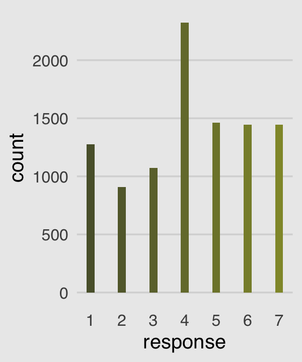
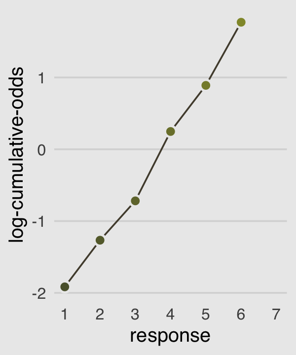
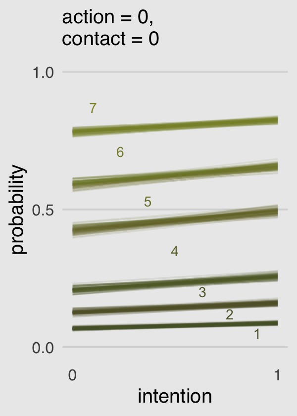

# Monsters and Mixtures

> [Of these majestic creatures], we’ll consider two common and useful examples. The first type is the ordered categorical model, useful for categorical outcomes with a fixed ordering. This model is built by merging a categorical likelihood function with a special kind of link function, usually a cumulative link. The second type is a family of zero-inflated and zero-augmented models, each of which mixes a binary event within an ordinary GLM likelihood like a Poisson or binomial.
>
> Both types of models help us transform our modeling to cope with the inconvenient realities of measurement, rather than transforming measurements to cope with the constraints of our models. (p. 331)

## Ordered categorical outcomes

> It is very common in the social sciences, and occasional in the natural sciences, to have an outcome variable that is discrete, like a count, but in which the values merely indicate different ordered *levels* along some dimension. For example, if I were to ask you how much you like to eat fish, on a scale from 1 to 7, you might say 5. If I were to ask 100 people the same question, I’d end up with 100 values between 1 and 7. In modeling each outcome value, I’d have to keep in mind that these values are *ordered* because 7 is greater than 6, which is greater than 5, and so on. But unlike a count, the differences in values are not necessarily equal.
>
> In principle, an ordered categorical variable is just a multinomial prediction problem (page 323). But the constraint that the categories be ordered demands special treatment…
>
> The conventional solution is to use a cumulative link function. The cumulative probability of a value is the probability of that *value or any smaller value*. (pp. 331--332, *emphasis* in the original)

### Example: Moral intuition.

Let's get the `Trolley` data from rethinking.


```r
library(rethinking)
```

```
## Warning: package 'ggplot2' was built under R version 3.5.2
```

```r
data(Trolley)
d <- Trolley
```

Unload rethinking and load brms.


```r
rm(Trolley)
detach(package:rethinking, unload = T)
library(brms)
```

```
## Warning: package 'Rcpp' was built under R version 3.5.2
```

Use the tidyverse to get a sense of the dimensions of the data.


```r
library(tidyverse)

glimpse(d)
```

```
## Observations: 9,930
## Variables: 12
## $ case      <fct> cfaqu, cfbur, cfrub, cibox, cibur, cispe, fkaqu, fkboa…
## $ response  <int> 4, 3, 4, 3, 3, 3, 5, 4, 4, 4, 4, 4, 4, 5, 4, 4, 4, 4, …
## $ order     <int> 2, 31, 16, 32, 4, 9, 29, 12, 23, 22, 27, 19, 14, 3, 18…
## $ id        <fct> 96;434, 96;434, 96;434, 96;434, 96;434, 96;434, 96;434…
## $ age       <int> 14, 14, 14, 14, 14, 14, 14, 14, 14, 14, 14, 14, 14, 14…
## $ male      <int> 0, 0, 0, 0, 0, 0, 0, 0, 0, 0, 0, 0, 0, 0, 0, 0, 0, 0, …
## $ edu       <fct> Middle School, Middle School, Middle School, Middle Sc…
## $ action    <int> 0, 0, 0, 0, 0, 0, 1, 1, 1, 1, 1, 1, 1, 0, 0, 0, 0, 0, …
## $ intention <int> 0, 0, 0, 1, 1, 1, 0, 0, 0, 0, 0, 0, 0, 0, 0, 0, 0, 0, …
## $ contact   <int> 1, 1, 1, 1, 1, 1, 0, 0, 0, 0, 0, 0, 0, 0, 0, 0, 0, 0, …
## $ story     <fct> aqu, bur, rub, box, bur, spe, aqu, boa, box, bur, car,…
## $ action2   <int> 1, 1, 1, 1, 1, 1, 1, 1, 1, 1, 1, 1, 1, 0, 0, 0, 0, 0, …
```

Though we have 9,930 rows, we only have 331 unique individuals.


```r
d %>% 
  distinct(id) %>% 
  count()
```

```
## # A tibble: 1 x 1
##       n
##   <int>
## 1   331
```

### Describing an ordered distribution with intercepts.

Before we get to plotting, in this chapter we'll use theme settings and a color palette from the [ggthemes package](https://cran.r-project.org/web/packages/ggthemes/index.html).


```r
library(ggthemes)
```

We'll take our basic theme settings from the `theme_hc()` function. We'll use the `Green fields` color palette, which we can inspect with the `canva_pal()` function and a little help from `scales::show_col()`.


```r
scales::show_col(canva_pal("Green fields")(4))
```


```r
canva_pal("Green fields")(4)
```

```
## [1] "#919636" "#524a3a" "#fffae1" "#5a5f37"
```

```r
canva_pal("Green fields")(4)[3]
```

```
## [1] "#fffae1"
```

Now we're ready to make our ggplot2 version of the simple histogram, Figure 11.1.a.


```r
ggplot(data = d, aes(x = response, fill = ..x..)) +
  geom_histogram(binwidth = 1/4, size = 0) +
  scale_x_continuous(breaks = 1:7) +
  scale_fill_gradient(low  = canva_pal("Green fields")(4)[4],
                      high = canva_pal("Green fields")(4)[1]) +
  theme_hc() +
  theme(axis.ticks.x    = element_blank(),
        plot.background = element_rect(fill = "grey92"),
        legend.position = "none")
```


Our cumulative proportion plot, Figure 11.1.b, will require some pre-plot wrangling.


```r
d %>%
  group_by(response) %>% 
  count() %>%
  mutate(pr_k     = n / nrow(d)) %>% 
  ungroup() %>% 
  mutate(cum_pr_k = cumsum(pr_k)) %>% 
  
  ggplot(aes(x = response, y = cum_pr_k, 
             fill = response)) +
  geom_line(color = canva_pal("Green fields")(4)[2]) +
  geom_point(shape = 21, colour = "grey92", 
             size = 2.5, stroke = 1) +
  scale_x_continuous(breaks = 1:7) +
  scale_y_continuous("cumulative proportion", breaks = c(0, .5, 1)) +
  scale_fill_gradient(low  = canva_pal("Green fields")(4)[4],
                      high = canva_pal("Green fields")(4)[1]) +
  coord_cartesian(ylim = c(0, 1)) +
  theme_hc() +
  theme(axis.ticks.x    = element_blank(),
        plot.background = element_rect(fill = "grey92"),
        legend.position = "none")
```



In order to make the next plot, we'll need McElreath's `logit()` function. Here it is, the logarithm of cumulative odds plot, Figure 11.1.c.


```r
# McElreath's convenience function from page 335
logit <- function(x) log(x / (1 - x))

d %>%
  group_by(response) %>% 
  count() %>%
  mutate(pr_k     = n / nrow(d)) %>% 
  ungroup() %>% 
  mutate(cum_pr_k = cumsum(pr_k)) %>% 
  filter(response < 7) %>% 
  
  # we can do the `logit()` conversion right in ggplot2
  ggplot(aes(x = response, y = logit(cum_pr_k), 
             fill = response)) +
  geom_line(color = canva_pal("Green fields")(4)[2]) +
  geom_point(shape = 21, colour = "grey92", 
             size = 2.5, stroke = 1) +
  scale_x_continuous(breaks = 1:7) +
  scale_fill_gradient(low  = canva_pal("Green fields")(4)[4],
                      high = canva_pal("Green fields")(4)[1]) +
  coord_cartesian(xlim = c(1, 7)) +
  ylab("log-cumulative-odds") +
  theme_hc() +
  theme(axis.ticks.x    = element_blank(),
        plot.background = element_rect(fill = "grey92"),
        legend.position = "none")
```


The code for Figure 11.2 is itself something of a monster.


```r
d_plot <-
  d %>%
  group_by(response) %>% 
  count() %>%
  mutate(pr_k     = n / nrow(d)) %>% 
  ungroup() %>% 
  mutate(cum_pr_k = cumsum(pr_k)) 

ggplot(data = d_plot,
       aes(x = response, y = cum_pr_k,
           color = cum_pr_k, fill = cum_pr_k)) +
  geom_line(color = canva_pal("Green fields")(4)[1]) +
  geom_point(shape = 21, colour = "grey92", 
             size = 2.5, stroke = 1) +
  geom_linerange(aes(ymin = 0, ymax = cum_pr_k),
                 alpha = 1/2, color = canva_pal("Green fields")(4)[1]) +
  # there must be more elegant ways to do this part
  geom_linerange(data = . %>% 
                   mutate(discrete_probability =
                            ifelse(response == 1, cum_pr_k,
                                   cum_pr_k - pr_k)),
                 aes(x    = response + .025,
                     ymin = ifelse(response == 1, 0, discrete_probability), 
                     ymax = cum_pr_k),
                 color = "black") +
  geom_text(data = tibble(text     = 1:7,
                          response = seq(from = 1.25, to = 7.25, by = 1),
                          cum_pr_k = d_plot$cum_pr_k - .065),
            aes(label = text),
            size = 4) +
  scale_x_continuous(breaks = 1:7) +
  scale_y_continuous("cumulative proportion", breaks = c(0, .5, 1)) +
  scale_fill_gradient(low  = canva_pal("Green fields")(4)[4],
                      high = canva_pal("Green fields")(4)[1]) +
  scale_color_gradient(low  = canva_pal("Green fields")(4)[4],
                       high = canva_pal("Green fields")(4)[1]) +
  coord_cartesian(ylim = c(0, 1)) +
  theme_hc() +
  theme(axis.ticks.x    = element_blank(),
        plot.background = element_rect(fill = "grey92"),
        legend.position = "none")
```



McElreath's convention for this first type of statistical model is

\begin{align*} 
R_i & \sim \text{Ordered} (\mathbf p) \\
\text{logit} (p_k) & = \alpha_k \\
\alpha_k           & \sim \text{Normal} (0, 10)
\end{align*}

> The Ordered distribution is really just a categorical distribution that takes a vector $\mathbf p = {p_1, p_2, p_3, p_4, p_5, p_6}$ of probabilities of each response value below the maximum response (7 in this example). Each response value $k$ in this vector is defined by its link to an intercept parameter, $\alpha_k$. Finally, some weakly regularizing priors are placed on these intercepts. (p. 335)

Whereas in `rethinking::map()` you indicate the likelihood by `<criterion> ~ dordlogit(phi , c(<the thresholds>)`, in `brms::brm()` you code `family = cumulative`. Here's the intercepts-only model:


```r
# define the start values
inits <- list(`Intercept[1]` = -2,
              `Intercept[2]` = -1,
              `Intercept[3]` = 0,
              `Intercept[4]` = 1,
              `Intercept[5]` = 2,
              `Intercept[6]` = 2.5)

inits_list <- list(inits, inits)

b11.1 <- 
  brm(data = d, family = cumulative,
      response ~ 1,
      prior(normal(0, 10), class = Intercept),
      iter = 2000, warmup = 1000, cores = 2, chains = 2,
      inits = inits_list,  # here we add our start values
      seed = 11)
```

McElreath needed to include the `depth=2` argument in the `rethinking::precis()` function to show the threshold parameters from his `m11.1stan` model. With a `brm()` fit, we just use `print()` or `summary()` as usual.


```r
print(b11.1)
```

```
##  Family: cumulative 
##   Links: mu = logit; disc = identity 
## Formula: response ~ 1 
##    Data: d (Number of observations: 9930) 
## Samples: 2 chains, each with iter = 2000; warmup = 1000; thin = 1;
##          total post-warmup samples = 2000
## 
## Population-Level Effects: 
##              Estimate Est.Error l-95% CI u-95% CI Eff.Sample Rhat
## Intercept[1]    -1.92      0.03    -1.97    -1.86       1476 1.00
## Intercept[2]    -1.27      0.02    -1.31    -1.22       1821 1.00
## Intercept[3]    -0.72      0.02    -0.76    -0.68       2021 1.00
## Intercept[4]     0.25      0.02     0.21     0.29       2216 1.00
## Intercept[5]     0.89      0.02     0.85     0.93       2327 1.00
## Intercept[6]     1.77      0.03     1.72     1.83       2482 1.00
## 
## Samples were drawn using sampling(NUTS). For each parameter, Eff.Sample 
## is a crude measure of effective sample size, and Rhat is the potential 
## scale reduction factor on split chains (at convergence, Rhat = 1).
```

What McElreath's `m11.1stan` summary termed `cutpoints[k]`, ours termed `Intercept[k]`. In both cases, these are the $\alpha_k$ parameters from the equations, above. The summaries look like those in the text, number of effective samples are high, and the $\hat{R}$ values are great. The model looks good.

Recall we use the `brms::inv_logit_scaled()` function in place of McElreath's `logistic()` function to get these into the probability metric.


```r
b11.1 %>% 
  fixef() %>% 
  inv_logit_scaled()
```

```
##               Estimate Est.Error      Q2.5     Q97.5
## Intercept[1] 0.1282430 0.5072421 0.1222287 0.1346667
## Intercept[2] 0.2197474 0.5058551 0.2120979 0.2277862
## Intercept[3] 0.3277541 0.5053708 0.3181448 0.3369461
## Intercept[4] 0.5616313 0.5051667 0.5515424 0.5715200
## Intercept[5] 0.7090137 0.5054678 0.7006442 0.7176885
## Intercept[6] 0.8545209 0.5071545 0.8475148 0.8613844
```

But recall that the posterior $SD$ (i.e., the 'Est.Error' values) are not valid using that approach. If you really care about them, you'll need to work with the `posterior_samples()`.


```r
posterior_samples(b11.1) %>% 
  select(starts_with("b_")) %>% 
  mutate_all(inv_logit_scaled) %>% 
  gather() %>% 
  group_by(key) %>% 
  summarise(mean = mean(value),
            sd   = sd(value),
            ll   = quantile(value, probs = .025),
            ul   = quantile(value, probs = .975))
```

```
## # A tibble: 6 x 5
##   key             mean      sd    ll    ul
##   <chr>          <dbl>   <dbl> <dbl> <dbl>
## 1 b_Intercept[1] 0.128 0.00324 0.122 0.135
## 2 b_Intercept[2] 0.220 0.00402 0.212 0.228
## 3 b_Intercept[3] 0.328 0.00473 0.318 0.337
## 4 b_Intercept[4] 0.562 0.00509 0.552 0.572
## 5 b_Intercept[5] 0.709 0.00451 0.701 0.718
## 6 b_Intercept[6] 0.854 0.00356 0.848 0.861
```

### Adding predictor variables.

Now we define the linear model as $\phi_i = \beta x_i$. Accordingly, the formula for our cumulative logit model becomes

\begin{align*}
\text{log} \frac{\text{Pr} (y_i \leq k)}{1 - \text{Pr} (y_i \leq k)} & = \alpha_k - \phi_i \\
\phi_i & = \beta x_i
\end{align*}

I'm not aware that brms has an equivalent to the `rethinking::dordlogit()` function. So here we'll make it by hand. The code comes from McElreath's [GitHub page](https://github.com/rmcelreath/rethinking/blob/a309712d904d1db7af1e08a76c521ab994006fd5/R/distributions.r).


```r
# first, we needed to specify the `logistic()` function, which is apart of the `dordlogit()` function
logistic <- function(x) {
    p <- 1 / (1 + exp(-x))
    p <- ifelse(x == Inf, 1, p)
    p
    }

# now we get down to it
dordlogit <- 
  function(x, phi, a, log = FALSE) {
    a  <- c(as.numeric(a), Inf)
    p  <- logistic(a[x] - phi)
    na <- c(-Inf, a)
    np <- logistic(na[x] - phi)
    p  <- p - np
    if (log == TRUE) p <- log(p)
    p
    }
```

The `dordlogit()` function works like this:


```r
(pk <- dordlogit(1:7, 0, fixef(b11.1)[, 1]))
```

```
## [1] 0.12824305 0.09150433 0.10800668 0.23387727 0.14738234 0.14550720
## [7] 0.14547915
```

Note the slight difference in how we used `dordlogit()` with a `brm()` fit summarized by `fixef()` than the way McElreath did with a `map2stan()` fit summarized by `coef()`. McElreath just put `coef(m11.1)` into `dordlogit()`. We, however, more specifically placed `fixef(b11.1)[, 1]` into the function. With the `[, 1]` part, we specified that we were working with the posterior means (i.e., `Estimate`) and neglecting the other summaries (i.e., the posterior *SD*s and 95% intervals). If you forget to subset, chaos ensues.

Next, as McElreath further noted in the text, "these probabilities imply an average outcome of:"


```r
sum(pk * (1:7))
```

```
## [1] 4.19909
```
 
I found that a bit abstract. Here's the thing in a more elaborate tibble format.


```r
(
  explicit_example <-
  tibble(probability_of_a_response = pk) %>%
  mutate(the_response  = 1:7) %>%
  mutate(their_product = probability_of_a_response * the_response)
)
```

```
## # A tibble: 7 x 3
##   probability_of_a_response the_response their_product
##                       <dbl>        <int>         <dbl>
## 1                    0.128             1         0.128
## 2                    0.0915            2         0.183
## 3                    0.108             3         0.324
## 4                    0.234             4         0.936
## 5                    0.147             5         0.737
## 6                    0.146             6         0.873
## 7                    0.145             7         1.02
```

```r
explicit_example %>%
  summarise(average_outcome_value = sum(their_product))
```

```
## # A tibble: 1 x 1
##   average_outcome_value
##                   <dbl>
## 1                  4.20
```

**Aside**

This made me wonder how this would compare if we were lazy and ignored the categorical nature of the `response`. Here we refit the model with the typical Gaussian likelihood.


```r
brm(data = d, family = gaussian,
    response ~ 1,
    # in this case, 4 (i.e., the middle response) seems to be the conservative place to put the mean
    prior = c(prior(normal(4, 10), class = Intercept),
              prior(cauchy(0, 1), class = sigma)),
    iter = 2000, warmup = 1000, cores = 4, chains = 4,
    seed = 11) %>%
  print()
```

```
##  Family: gaussian 
##   Links: mu = identity; sigma = identity 
## Formula: response ~ 1 
##    Data: d (Number of observations: 9930) 
## Samples: 4 chains, each with iter = 2000; warmup = 1000; thin = 1;
##          total post-warmup samples = 4000
## 
## Population-Level Effects: 
##           Estimate Est.Error l-95% CI u-95% CI Eff.Sample Rhat
## Intercept     4.20      0.02     4.16     4.24       2600 1.00
## 
## Family Specific Parameters: 
##       Estimate Est.Error l-95% CI u-95% CI Eff.Sample Rhat
## sigma     1.91      0.01     1.88     1.93       3102 1.00
## 
## Samples were drawn using sampling(NUTS). For each parameter, Eff.Sample 
## is a crude measure of effective sample size, and Rhat is the potential 
## scale reduction factor on split chains (at convergence, Rhat = 1).
```

Happily, this yielded a mean estimate of 4.2, much like our `average_outcome_value`, above.

**End aside**

Now we'll try it by subtracting .5 from each.
 

```r
# the probabilities of a given response
(pk <- dordlogit(1:7, 0, fixef(b11.1)[, 1] - .5))
```

```
## [1] 0.08191684 0.06398163 0.08232659 0.20905342 0.15914829 0.18440296
## [7] 0.21917028
```

```r
# the average rating
sum(pk * (1:7))
```

```
## [1] 4.729425
```

So the rule is we *subtract the linear model from each interecept*. Let's fit our multivariable models.


```r
# start values for b11.2
inits <- list(`Intercept[1]` = -1.9,
              `Intercept[2]` = -1.2,
              `Intercept[3]` = -0.7,
              `Intercept[4]` =  0.2,
              `Intercept[5]` =  0.9,
              `Intercept[6]` =  1.8,
              action         =  0,
              intention      =  0,
              contact        =  0)

b11.2 <- 
  brm(data = d, family = cumulative,
      response ~ 1 + action + intention + contact,
      prior = c(prior(normal(0, 10), class = Intercept),
                prior(normal(0, 10), class = b)),
      iter = 2000, warmup = 1000, cores = 2, chains = 2,
      inits = list(inits, inits),
      seed = 11)

# start values for b11.3
inits <- list(`Intercept[1]`      = -1.9,
              `Intercept[2]`      = -1.2,
              `Intercept[3]`      = -0.7,
              `Intercept[4]`      =  0.2,
              `Intercept[5]`      =  0.9,
              `Intercept[6]`      =  1.8,
              action              =  0,
              intention           =  0,
              contact             =  0,
              `action:intention`  =  0,
              `contact:intention` =  0)

b11.3 <- 
  update(b11.2,
         formula = response ~ 1 + action + intention + contact + action:intention + contact:intention,
         inits = list(inits, inits))
```

We don't have a `coeftab()` function in brms like for rethinking. But as we did for Chapter 6, we can reproduce it with help from the [broom package](https://cran.r-project.org/web/packages/broom/index.html) and a bit of data wrangling.


```r
library(broom)

tibble(model  = str_c("b11.", 1:3)) %>% 
  mutate(fit  = purrr::map(model, get)) %>% 
  mutate(tidy = purrr::map(fit, tidy)) %>% 
  unnest(tidy) %>% 
  select(model, term, estimate) %>% 
  filter(term != "lp__") %>% 
  complete(term = distinct(., term), model) %>% 
  mutate(estimate = round(estimate, digits = 2)) %>%
  spread(key = model, value = estimate) %>% 
  # this last step isn't necessary, but it orders the rows to match the text
  slice(c(6:11, 1, 4, 3, 2, 5))
```

```
## # A tibble: 11 x 4
##    term                 b11.1  b11.2 b11.3
##    <chr>                <dbl>  <dbl> <dbl>
##  1 b_Intercept[1]       -1.92  -2.84 -2.64
##  2 b_Intercept[2]       -1.27  -2.16 -1.94
##  3 b_Intercept[3]       -0.72  -1.57 -1.35
##  4 b_Intercept[4]        0.25  -0.55 -0.31
##  5 b_Intercept[5]        0.89   0.12  0.36
##  6 b_Intercept[6]        1.77   1.02  1.27
##  7 b_action             NA     -0.71 -0.47
##  8 b_intention          NA     -0.72 -0.28
##  9 b_contact            NA     -0.96 -0.33
## 10 b_action:intention   NA     NA    -0.44
## 11 b_intention:contact  NA     NA    -1.27
```

If you really wanted that last `nobs` row at the bottom, you could elaborate on this code: `b11.1$data %>% count()`. Also, if you want a proper `coeftab()` function for brms, McElreath's code lives [here](https://github.com/rmcelreath/rethinking/blob/a309712d904d1db7af1e08a76c521ab994006fd5/R/coeftab.r). Give it a whirl.

Here we compute the WAIC. *Caution: This took some time to compute.*


```r
b11.1 <- add_criterion(b11.1, "waic")
b11.2 <- add_criterion(b11.2, "waic")
b11.3 <- add_criterion(b11.3, "waic")
```

Now compare the models.


```r
loo_compare(b11.1, b11.2, b11.3, criterion = "waic") %>% 
  print(simplify = F)
```

```
##       elpd_diff se_diff  elpd_waic se_elpd_waic p_waic   se_p_waic
## b11.3      0.0       0.0 -18464.5      40.6         10.9      0.1 
## b11.2    -80.4      12.8 -18544.9      38.1          9.0      0.0 
## b11.1   -462.7      31.3 -18927.2      28.8          6.0      0.0 
##       waic     se_waic 
## b11.3  36929.0     81.3
## b11.2  37089.9     76.3
## b11.1  37854.4     57.6
```

Here are the WAIC weights.


```r
model_weights(b11.1, b11.2, b11.3,
              weights = "waic") %>% 
  round(digits = 3)
```

```
## b11.1 b11.2 b11.3 
##     0     0     1
```

McElreath made Figure 11.3 by extracting the samples of his `m11.3`, saving them as `post`, and working some hairy base R `plot()` code. We'll take a different route and use `brms::fitted()`. This will take substantial data wrangling, but hopefully it'll be instructive. Let's first take a look at the initial `fitted()` output for the beginnings of Figure 11.3.a.


```r
nd <-
  tibble(action    = 0,
         contact   = 0, 
         intention = 0:1)

max_iter <- 100

fitted(b11.3, 
        newdata = nd, 
        subset  = 1:max_iter,
        summary = F) %>% 
  as_tibble() %>% 
  glimpse()
```

```
## Observations: 100
## Variables: 14
## $ `1.1` <dbl> 0.06431154, 0.06654538, 0.06539877, 0.06865674, 0.07194016…
## $ `2.1` <dbl> 0.08606223, 0.09177197, 0.08797653, 0.09108951, 0.09013832…
## $ `1.2` <dbl> 0.05476174, 0.06128931, 0.05620629, 0.06030583, 0.06191991…
## $ `2.2` <dbl> 0.07018978, 0.08024188, 0.07228319, 0.07646513, 0.07479958…
## $ `1.3` <dbl> 0.07845195, 0.08089936, 0.07992199, 0.08131879, 0.08317862…
## $ `2.3` <dbl> 0.09593491, 0.10013379, 0.09786148, 0.09822813, 0.09665743…
## $ `1.4` <dbl> 0.2181005, 0.2124984, 0.2160383, 0.2177055, 0.2116564, 0.2…
## $ `2.4` <dbl> 0.2413372, 0.2356276, 0.2389400, 0.2384760, 0.2279406, 0.2…
## $ `1.5` <dbl> 0.1700717, 0.1635829, 0.1701502, 0.1637571, 0.1704034, 0.1…
## $ `2.5` <dbl> 0.1659739, 0.1585014, 0.1656836, 0.1590970, 0.1668038, 0.1…
## $ `1.6` <dbl> 0.1935246, 0.1922405, 0.1892956, 0.1900185, 0.1902459, 0.1…
## $ `2.6` <dbl> 0.1691378, 0.1653796, 0.1649466, 0.1662835, 0.1709148, 0.1…
## $ `1.7` <dbl> 0.2207780, 0.2229442, 0.2229889, 0.2182374, 0.2106555, 0.2…
## $ `2.7` <dbl> 0.1713642, 0.1683438, 0.1723086, 0.1703608, 0.1727455, 0.1…
```

Hopefully by now it’s clear why we needed the `nd` tibble, which we made use of in the `newdata = nd` argument. Because we set `summary = F`, we get draws from the posterior instead of summaries. With `max_iter`, we controlled how many of those posterior draws we wanted. McElreath used 100, which he indicated at the top of page 341, so we followed suit. It took me a minute to wrap my head around the meaning of the 14 vectors, which were named by `brms::fitted()` default. Notice how each column is named by two numerals, separated by a period. That first numeral indicates which if the two `intention` values the draw is based on (i.e., 1 stands for `intention == 0`, 2, stands for `intention == 1`). The numbers on the right of the decimals are the seven response options for `response`. For each posterior draw, you get one of those for each value of `intention`. Finally, it might not be immediately apparent, but the values are in the probability scale, just like `pk` on page 338.

Now we know what we have in hand, it’s just a matter of careful wrangling to get those probabilities into a more useful format to feed into ggplot2. I’ve extensively annotated the code, below. If you lose track of happens in a given step, just run the code up till that point. Go step by step.


```r
nd <-
  tibble(action    = 0,
         contact   = 0, 
         intention = 0:1)

max_iter <- 100

fitted(b11.3, 
        newdata = nd, 
        subset  = 1:max_iter,
        summary = F) %>% 
  as_tibble() %>%
  # we convert the data to the long format
  gather() %>%
  # we need an variable to index which posterior iteration we're working with
  mutate(iter = rep(1:max_iter, times = 14)) %>%
  # this step isn’t technically necessary, but I prefer my `iter` index at the far left.
  select(iter, everything()) %>% 
  # here we extract the `intention` and `response` information out of the `key` vector and 
  # spread it into two vectors.
  separate(key, into = c("intention", "rating")) %>% 
  # that step produced two character vectors. they’ll be more useful as numbers
  mutate(intention = intention %>% as.double(),
         rating    =  rating %>% as.double()) %>%
  # here we convert `intention` into its proper 0:1 metric
  mutate(intention = intention -1) %>%
  # this isn't necessary, but it helps me understand exactly what metric the values are currently in
  rename(pk = value) %>% 
  # this step is based on McElreath's R code 11.10 on page 338
  mutate(`pk:rating` = pk * rating) %>% 
  # I’m not sure how to succinctly explain this. you’re just going to have to trust me
  group_by(iter, intention) %>% 
  # this is very important for the next step.
  arrange(iter, intention, rating) %>% 
  # here we take our `pk` values and make culmulative sums. why? take a long hard look at Figure 11.2. 
  mutate(probability = cumsum(pk)) %>% 
  # `rating == 7` is unnecessary. these `probability` values are by definition 1
  filter(rating < 7) %>% 
  
  ggplot(aes(x = intention, 
             y = probability, 
             color = probability)) +
  geom_line(aes(group = interaction(iter, rating)),
            alpha = 1/10) +
  # note how we made a new data object for `geom_text()`
  geom_text(data = tibble(text        = 1:7,
                          intention   = seq(from = .9, to = .1, length.out = 7),
                          probability = c(.05, .12, .20, .35, .53, .71, .87)),
            aes(label = text),
            size = 3) +
  scale_x_continuous(breaks = 0:1) +
  scale_y_continuous(breaks = c(0, .5, 1)) +
  coord_cartesian(ylim = 0:1) +
  scale_color_gradient(low  = canva_pal("Green fields")(4)[4],
                       high = canva_pal("Green fields")(4)[1]) +
  labs(subtitle = "action = 0,\ncontact = 0",
       x        = "intention") +
  theme_hc() +
  theme(plot.background = element_rect(fill = "grey92"),
        legend.position = "none")
```


Boom!

Okay, that pile of code is a bit of a mess and you’re not going to want to repeatedly cut and paste all that. Let’s condense it into a homemade function, `make_Figure_11.3_data()`. 


```r
make_Figure_11.3_data <- function(action, contact, max_iter){
  
  nd <-
    tibble(action    = action,
           contact   = contact, 
           intention = 0:1)
  
  max_iter <- max_iter
  
  fitted(b11.3, 
         newdata = nd, 
         subset  = 1:max_iter,
         summary = F) %>% 
    as_tibble() %>%
    gather() %>%
    mutate(iter = rep(1:max_iter, times = 14)) %>%
    select(iter, everything()) %>% 
    separate(key, into = c("intention", "rating")) %>% 
    mutate(intention = intention %>% as.double(),
           rating    =  rating %>% as.double()) %>%
    mutate(intention = intention -1) %>%
    rename(pk = value) %>% 
    mutate(`pk:rating` = pk * rating) %>% 
    group_by(iter, intention) %>% 
    arrange(iter, intention, rating) %>% 
    mutate(probability = cumsum(pk)) %>% 
    filter(rating < 7) 
}
```

Now we'll use our sweet homemade function to make our plots.


```r
# Figure 11.3.a
p1 <-
  make_Figure_11.3_data(action   = 0, 
                        contact  = 0, 
                        max_iter = 100) %>% 
  
  ggplot(aes(x = intention, 
             y = probability,
             color = probability)) +
  geom_line(aes(group = interaction(iter, rating)),
            alpha = 1/10) +
  geom_text(data = tibble(text        = 1:7,
                          intention   = seq(from = .9, to = .1, length.out = 7),
                          probability = c(.05, .12, .20, .35, .53, .71, .87)),
            aes(label = text),
            size = 3) +
  scale_x_continuous(breaks = 0:1) +
  scale_y_continuous(breaks = c(0, .5, 1)) +
  scale_color_gradient(low  = canva_pal("Green fields")(4)[4],
                       high = canva_pal("Green fields")(4)[1]) +
  coord_cartesian(ylim = 0:1) +
  labs(subtitle = "action = 0,\ncontact = 0",
       x        = "intention") +
  theme_hc() +
  theme(plot.background = element_rect(fill = "grey92"),
        legend.position = "none")

# Figure 11.3.b
p2 <-
  make_Figure_11.3_data(action   = 1, 
                        contact  = 0, 
                        max_iter = 100) %>% 
  
  ggplot(aes(x = intention, 
             y = probability,
             color = probability)) +
  geom_line(aes(group = interaction(iter, rating)),
            alpha = 1/10) +
  geom_text(data = tibble(text        = 1:7,
                          intention   = seq(from = .9, to = .1, length.out = 7),
                          probability = c(.12, .24, .35, .50, .68, .80, .92)),
            aes(label = text),
            size = 3) +
  scale_x_continuous(breaks = 0:1) +
  scale_y_continuous(breaks = c(0, .5, 1)) +
  scale_color_gradient(low  = canva_pal("Green fields")(4)[4],
                       high = canva_pal("Green fields")(4)[1]) +
  coord_cartesian(ylim = 0:1) +
  labs(subtitle = "action = 1,\ncontact = 0",
       x        = "intention") +
  theme_hc() +
  theme(plot.background = element_rect(fill = "grey92"),
        legend.position = "none")

# Figure 11.3.c
p3 <-
  make_Figure_11.3_data(action   = 0, 
                        contact  = 1, 
                        max_iter = 100) %>% 
  
  ggplot(aes(x = intention, 
             y = probability,
             color = probability)) +
  geom_line(aes(group = interaction(iter, rating)),
            alpha = 1/10) +
  geom_text(data = tibble(text        = 1:7,
                          intention   = seq(from = .9, to = .1, length.out = 7),
                          probability = c(.15, .34, .44, .56, .695, .8, .92)),
            aes(label = text),
            size = 3) +
  scale_x_continuous(breaks = 0:1) +
  scale_y_continuous(breaks = c(0, .5, 1)) +
  scale_color_gradient(low  = canva_pal("Green fields")(4)[4],
                       high = canva_pal("Green fields")(4)[1]) +
  coord_cartesian(ylim = 0:1) +
  labs(subtitle = "action = 0,\ncontact = 1",
       x        = "intention") +
  theme_hc() +
  theme(plot.background = element_rect(fill = "grey92"),
        legend.position = "none")

# here we stitch them together with `grid.arrange()`
library(gridExtra)

grid.arrange(p1, p2, p3, ncol = 3)
```


If you’d like to learn more about these kinds of models and how to fit them in brms, check out Bürkner and Vuorre’s [*Ordinal Regression Models in Psychology: A Tutorial*](https://psyarxiv.com/x8swp/).

### Bonus: Figure 11.3 alternative.

I have a lot of respect for McElreath. But man, Figure 11.3 is the worst. I'm in clinical psychology and there's no way a working therapist is going to look at a figure like that and have any sense of what's going on. Nobody’s got time for that. We’ve have clients to serve! Happily, we can go further. Look back at McElreath’s R code 11.10 on page 338. See how he multiplied the elements of `pk` by their respective `response` values and then just summed them up to get an average outcome value? With just a little amendment to our custom `make_Figure_11.3_data()` function, we can wrangle our `fitted()` output to express average `response` values for each of our conditions of interest. Here’s the adjusted function:


```r
make_data_for_an_alternative_fiture <- function(action, contact, max_iter){
  
  nd <-
    tibble(action    = action,
           contact   = contact, 
           intention = 0:1)
  
  max_iter <- max_iter
  
  fitted(b11.3, 
         newdata = nd, 
         subset  = 1:max_iter,
         summary = F) %>% 
    as_tibble() %>%
    gather() %>%
    mutate(iter = rep(1:max_iter, times = 14)) %>%
    select(iter, everything()) %>% 
    separate(key, into = c("intention", "rating")) %>% 
    mutate(intention = intention %>% as.double(),
           rating    =  rating %>% as.double()) %>%
    mutate(intention = intention -1) %>%
    rename(pk = value) %>% 
    mutate(`pk:rating` = pk * rating) %>% 
    group_by(iter, intention) %>% 
    
    # everything above this point is identical to the previous custom function.
    # all we do is replace the last few lines with this one line of code. 
    summarise(mean_rating = sum(`pk:rating`))
}
```

Our handy homemade but monstrously-named `make_data_for_an_alternative_fiture()` function works very much like its predecessor. You’ll see.


```r
# alternative to Figure 11.3.a
p1 <-
  make_data_for_an_alternative_fiture(action   = 0, 
                                      contact  = 0, 
                                      max_iter = 100) %>% 
  
  ggplot(aes(x = intention, y = mean_rating, group = iter)) +
  geom_line(alpha = 1/10, color = canva_pal("Green fields")(4)[1]) +
  scale_x_continuous("intention", breaks = 0:1) +
  scale_y_continuous("response", breaks = 1:7) +
  coord_cartesian(ylim = 1:7) +
  labs(subtitle = "action = 0,\ncontact = 0") +
  theme_hc() +
  theme(plot.background = element_rect(fill = "grey92"),
        legend.position = "none")

# alternative to Figure 11.3.b
p2 <-
  make_data_for_an_alternative_fiture(action   = 1, 
                                      contact  = 0, 
                                      max_iter = 100) %>% 
  
 ggplot(aes(x = intention, y = mean_rating, group = iter)) +
  geom_line(alpha = 1/10, color = canva_pal("Green fields")(4)[1]) +
  scale_x_continuous("intention", breaks = 0:1) +
  scale_y_continuous("response", breaks = 1:7) +
  coord_cartesian(ylim = 1:7) +
  labs(subtitle = "action = 1,\ncontact = 0") +
  theme_hc() +
  theme(plot.background = element_rect(fill = "grey92"),
        legend.position = "none")

# alternative to Figure 11.3.c
p3 <-
  make_data_for_an_alternative_fiture(action   = 0, 
                                      contact  = 1, 
                                      max_iter = 100) %>% 
  
  ggplot(aes(x = intention, y = mean_rating, group = iter)) +
  geom_line(alpha = 1/10, color = canva_pal("Green fields")(4)[1]) +
  scale_x_continuous("intention", breaks = 0:1) +
  scale_y_continuous("response", breaks = 1:7) +
  coord_cartesian(ylim = 1:7) +
  labs(subtitle = "action = 0,\ncontact = 1") +
  theme_hc() +
  theme(plot.background = element_rect(fill = "grey92"),
        legend.position = "none")

grid.arrange(p1, p2, p3, ncol = 3)
```



Finally; now those are plots I can sell in a clinical psychology journal!

## Zero-inflated outcomes

> Very often, the things we can measure are not emissions from any pure process. Instead, they are *mixtures* of multiple processes. Whenever there are different causes for the same observation, then a mixture model may be useful. A mixture model uses more than one simple probability distribution to model a mixture of causes. In effect, these models use more than one likelihood for the same outcome variable.
>
> Count variables are especially prone to needing a mixture treatment. The reason is that a count of zero can often arise more than one way. A "zero" means that nothing happened, and nothing can happen either because the rate of events is low or rather because the process that generates events failed to get started. (p. 342, *emphasis* in the original)

In his **Rethinking: Breaking the law** box, McElreath discussed how advances in computing have made it possible for working scientists to define their own data generating models. If you'd like to dive deeper into the topic, check out Bürkner's vignette, [*Define Custom Response Distributions with brms*](https://cran.r-project.org/web/packages/brms/vignettes/brms_customfamilies.html). We'll even make use of it a little further down.

### Example: Zero-inflated Poisson.

Here we simulate our drunk monk data.


```r
# define parameters
prob_drink <- 0.2  # 20% of days
rate_work  <- 1    # average 1 manuscript per day

# sample one year of production
n <- 365

# simulate days monks drink
set.seed(11)
drink <- rbinom(n, 1, prob_drink)

# simulate manuscripts completed
y <- (1 - drink) * rpois(n, rate_work)
```

We'll put those data in a tidy tibble before plotting.


```r
d <-
  tibble(Y = y) %>%
  arrange(Y) %>% 
  mutate(zeros = c(rep("zeros_drink", times = sum(drink)),
                   rep("zeros_work",  times = sum(y == 0 & drink == 0)),
                   rep("nope",        times = n - sum(y == 0))
                   )) 
  
  ggplot(data = d, aes(x = Y)) +
  geom_histogram(aes(fill = zeros),
                 binwidth = 1, size = 1/10, color = "grey92") +
  scale_fill_manual(values = c(canva_pal("Green fields")(4)[1], 
                               canva_pal("Green fields")(4)[2], 
                               canva_pal("Green fields")(4)[1])) +
  xlab("Manuscripts completed") +
  theme_hc() +
  theme(plot.background = element_rect(fill = "grey92"),
        legend.position = "none")
```


With these data, the likelihood of observing zero on `y`, (i.e., the likelihood zero manuscripts were completed on a given occasion) is

\begin{align*}
\text{Pr} (0 | p, \lambda) & = \text{Pr} (\text{drink} | p) + \text{Pr} (\text{work} | p) \times \text{Pr} (0 | \lambda) \\
                           & = p + (1 - p) \text{ exp} (- \lambda)
\end{align*}

And 

> since the Poisson likelihood of $y$ is $\text{Pr} (y | \lambda) = \lambda^y \text{exp} (- \lambda) / y!$, the likelihood of $y = 0$ is just $\text{exp} (- \lambda)$. The above is just the mathematics for:
>
>> *The probability of observing a zero is the probability that the monks didn't drink OR ($+$) the probability that the monks worked AND ($\times$) failed to finish anything*. 
>
> And the likelihood of a non-zero value $y$ is:
>
> \begin{align*}
> \text{Pr} (y | p, \lambda) & = \text{Pr} (\text{drink} | p) (0) + \text{Pr} (\text{work} | p) \text{Pr} (y | \lambda) \\
>                            & = (1 - p) \frac {\lambda^y \text{ exp} (- \lambda)}{y!}
> \end{align*}
>
> Since drinking monks never produce $y > 0$, the expression above is just the chance the monks both work $1 - p$, and finish $y$ manuscripts. (p. 344, *emphasis* in the original)

So letting $p$ be the probability $y$ is zero and $\lambda$ be the shape of the distribution, the zero-inflated Poisson (ZIPoisson) regression model takes the basic form

\begin{align*}
y_i & \sim \text{ZIPoisson} (p_i, \lambda_i)\\
\text{logit} (p_i)     & = \alpha_p + \beta_p x_i \\
\text{log} (\lambda_i) & = \alpha_\lambda + \beta_\lambda x_i
\end{align*}

One last thing to note is that in brms, $p_i$ is denoted `zi`. So the intercept [and zi] only zero-inflated Poisson model in brms looks like this.


```r
b11.4 <- 
  brm(data = d, family = zero_inflated_poisson,
      Y ~ 1,
      prior = c(prior(normal(0, 10), class = Intercept),
                prior(beta(2, 2), class = zi)),  # the brms default is beta(1, 1)
      cores = 4,
      seed = 11) 
```


```r
print(b11.4)
```

```
##  Family: zero_inflated_poisson 
##   Links: mu = log; zi = identity 
## Formula: Y ~ 1 
##    Data: d (Number of observations: 365) 
## Samples: 4 chains, each with iter = 2000; warmup = 1000; thin = 1;
##          total post-warmup samples = 4000
## 
## Population-Level Effects: 
##           Estimate Est.Error l-95% CI u-95% CI Eff.Sample Rhat
## Intercept     0.10      0.08    -0.08     0.26       1179 1.00
## 
## Family Specific Parameters: 
##    Estimate Est.Error l-95% CI u-95% CI Eff.Sample Rhat
## zi     0.24      0.05     0.13     0.33       1354 1.00
## 
## Samples were drawn using sampling(NUTS). For each parameter, Eff.Sample 
## is a crude measure of effective sample size, and Rhat is the potential 
## scale reduction factor on split chains (at convergence, Rhat = 1).
```

The zero-inflated Poisson is [parameterized in brms](https://cran.r-project.org/web/packages/brms/vignettes/brms_families.html#zero-inflated-and-hurdle-models) a little differently than it is in rethinking. The different parameterization did not influence the estimate for the Intercept, $\lambda$. In both here and in the text, $\lambda$  was about zero. However, it did influence the summary of `zi`. Note how McElreath's `logistic(-1.39)` yielded 0.1994078. Seems rather close to our `zi` estimate of 0.235. First off, because he didn’t set his seed in the text before simulating, we couldn’t exactly reproduce his simulated drunk monk data. So our results will vary a little due to that alone. But after accounting for simulation variance, hopefully it’s clear that `zi` in brms is already in the probability metric. There's no need to convert it.

In the `prior` argument, we used `beta(2, 2)` for `zi` and also mentioned in the margin that the brms default is `beta(1, 1)`. To give you a sense of the priors, let's plot them.


```r
tibble(`zi prior`= seq(from = 0, to = 1, length.out = 50)) %>%
  mutate(`beta(1, 1)` = dbeta(`zi prior`, 1, 1),
         `beta(2, 2)` = dbeta(`zi prior`, 2, 2))  %>% 
  gather(prior, density, -`zi prior`) %>% 
  
  ggplot(aes(x    = `zi prior`, 
             ymin = 0,
             ymax = density)) +
  geom_ribbon(aes(fill = prior)) +
  scale_fill_manual(values = c(canva_pal("Green fields")(4)[4],
                               canva_pal("Green fields")(4)[2])) +
  scale_x_continuous("prior for zi", breaks = c(0, .5, 1)) +
  scale_y_continuous(NULL, breaks = NULL) +
  theme_hc() +
  theme(plot.background = element_rect(fill = "grey92"),
        legend.position = "none") +
  facet_wrap(~prior)
```


Hopefully this clarifies that the brms default is flat, whereas our prior regularized a bit toward .5. Anyway, here's that exponentiated $\lambda$.


```r
fixef(b11.4)[1, ] %>%
  exp()
```

```
##  Estimate Est.Error      Q2.5     Q97.5 
## 1.0998806 1.0881350 0.9271772 1.2984891
```

#### Overthinking: Zero-inflated Poisson distribution function.


```r
dzip <- function(x, p, lambda, log = TRUE) {
    ll <- ifelse(
        x == 0,
        p + (1 - p) * exp(-lambda),
        (1 - p) * dpois(x, lambda, log = FALSE)
    )
    if (log == TRUE) ll <- log(ll)
    return(ll)
}
```

We can use McElreath's `dzip()` to do a posterior predictive check for our model. To work with our estimates for $p$ and $\lambda$ directly, we'll set `log = F`.


```r
p_b11.4      <- posterior_summary(b11.4)[2, 1]
lambda_b11.4 <- posterior_summary(b11.4)[1, 1] %>% exp()

tibble(x = 0:4) %>% 
  mutate(density = dzip(x = x, 
                        p = p_b11.4, 
                        lambda = lambda_b11.4, 
                        log = F)) %>% 
  
  ggplot(aes(x = x, y = density)) +
  geom_col(fill = canva_pal("Green fields")(4)[4]) +
  xlab("Manuscripts completed") +
  theme_hc() +
  theme(plot.background = element_rect(fill = "grey92"))
```


If you look up to the histogram we made at the beginning of this section, you'll see this isn't a terrible approximation.

## Over-dispersed outcomes

> All statistical models omit something. The question is only whether that something is necessary for making useful inferences. One symptom that something important has been omitted from a count model is over-dispersion. The variance of a variable is sometimes called its *dispersion*. For a counting process like a binomial, the variance is a function of the same parameters as the expected value. For example, the expected value of a binomial is $np$ and its variance is $np (1 - p)$. When the observed variance exceeds this amount—after conditioning on all the predictor variables—this implies that some omitted variable is producing additional dispersion in the observed counts.
>
> What could go wrong, if we ignore the over-dispersion? Ignoring it can lead to all of the same problems as ignoring any predictor variable. Heterogeneity in counts can be a confound, hiding effects of interest or producing spurious inferences. (p, 346, *emphasis* in the original)

In this chapter we’ll cope with the problem using continuous mixture models—first the beta-binomial and then the gamma-Poisson (a.k.a. negative binomial).

### Beta-binomial.

> A beta-binomial model assumes that each binomial count observation has its own probability of success. The model estimates the *distribution* of probabilities of success across cases, instead of a single probability of success. And predictor variables change the shape of this distribution, instead of directly determining the probability of each success. (p, 347, *emphasis* in the original)

Unfortunately, we need to digress. As it turns out, there are multiple ways to parameterize the beta distribution and we’ve run square into two. In the text, McElreath wrote the beta distribution has two parameters, an average probability $\overline{p}$ and a shape parameter $\theta$. In his R code 11.24, which we’ll reproduce in a bit, he demonstrated that parameterization with the `rethinking::dbeta2()` function. The nice thing about this parameterization is how intuitive the `pbar` parameter is. If you want a beta with an average of .2, you set `pbar <- .2`. If you want the distribution to be more or less certain, make the `theta` argument more or less large, respectively.

However, the beta density is typically defined in terms of $\alpha$ and $\beta$. If you denote the data as $y$, this follows the form

$$\text{Beta} (y | \alpha, \beta) = \frac{y^{\alpha - 1} (1 - y)^{\beta - 1}}{\text B (\alpha, \beta)}$$

which you can verify in the *Continuous Distributions on [0, 1]* section of the [Stan Functions Reference](https://mc-stan.org/docs/2_18/functions-reference/beta-distribution.html). In the formula, $\text B$ stands for the Beta function, which computes a normalizing constant, which you can learn about in the *Mathematical Functions* of the Stan reference manual. This is all important to be aware of because when we defined that beta prior for `zi` in the last model, it was using this parameterization. Also, if you look at the base R `dbeta()` function, you'll learn it takes two parameters, `shape1` and `shape2`. Those uncreatively-named parameters are the same $\alpha$ and $\beta$ from the density, above. They do not correspond to the `pbar` and `theta` parameters of McEreath's `rethinking::dbeta2()`.

McElreath had good reason for using `dbeta2()`. Beta's typical $\alpha$ and $\beta$ parameters aren't the most intuitive to use; the parameters in McElreath's `dbeta2()` are much nicer. But if you're willing to dive deeper, it turns out you can find the mean of a beta distribution in terms of $\alpha$ and $\beta$ like this

$$\mu = \frac{\alpha}{\alpha + \beta}$$

We can talk about the spread of the distribution, sometimes called $\kappa$, in terms $\alpha$ and $\beta$ like this

$$\kappa = \alpha + \beta$$

With $\mu$ and $\kappa$ in hand, we can even find the $SD$ of a beta distribution with

$$\sigma = \sqrt{\mu (1 - \mu) / (\kappa + 1)}$$

I explicate all this because McElreath's `pbar` is $\mu = \frac{\alpha}{\alpha + \beta}$ and his `theta` is $\kappa = \alpha + \beta$. This is great news because it means that we can understand what McElreath did with his `beta2()` function in terms of base R's `dbeta()` function. Which also means that we can understand the distribution of the beta parameters used in `brms::brm()`. To demonstrate, let's walk through McElreath's R code 11.25.


```r
pbar  <- 0.5
theta <- 5

ggplot(data = tibble(x = seq(from = 0, to = 1, by = .01))) +
  geom_ribbon(aes(x    = x, 
                  ymin = 0, 
                  ymax = rethinking::dbeta2(x, pbar, theta)),
              fill = canva_pal("Green fields")(4)[1]) +
  scale_x_continuous("probability space", breaks = c(0, .5, 1)) +
  scale_y_continuous(NULL, breaks = NULL) +
  ggtitle(expression(paste("The ", beta, " distribution")),
          subtitle = expression(paste("Defined in terms of ", mu, " (i.e., pbar) and ", kappa, " (i.e., theta)"))) +
  theme_hc() +
  theme(plot.background = element_rect(fill = "grey92"))
```


In his 2014 text, [*Doing Bayesian Data Analysis*](https://sites.google.com/site/doingbayesiandataanalysis/), Kruschke provided code for a convenience function that will take `pbar` and `theta` as inputs and return the corresponding $\alpha$ and $\beta$ values. Here's the function:


```r
betaABfromMeanKappa <- function(mean, kappa) {
  if (mean <= 0 | mean >= 1) stop("must have 0 < mean < 1")
  if (kappa <= 0) stop("kappa must be > 0")
  a <- mean * kappa
  b <- (1.0 - mean) * kappa
  return(list(a = a, b = b))
}
```

Now we can use Kruschke's `betaABfromMeanKappa()` to find the $\alpha$ and $\beta$ values corresponding to `pbar` and `theta`.


```r
betaABfromMeanKappa(mean = pbar, kappa = theta)
```

```
## $a
## [1] 2.5
## 
## $b
## [1] 2.5
```

And finally, we can double check that all of this works. Here's the same distribution but defined in terms of $\alpha$ and $\beta$.


```r
ggplot(data = tibble(x = seq(from = 0, to = 1, by = .01))) +
  geom_ribbon(aes(x    = x, 
                  ymin = 0, 
                  ymax = dbeta(x, 2.5, 2.5)),
              fill = canva_pal("Green fields")(4)[4]) +
  scale_x_continuous("probability space", breaks = c(0, .5, 1)) +
  scale_y_continuous(NULL, breaks = NULL) +
  ggtitle(expression(paste("The ", beta, " distribution")),
          subtitle = expression(paste("This time defined in terms of ", alpha, " and ", beta))) +
  theme_hc() +
  theme(plot.background = element_rect(fill = "grey92"))
```


McElreath encouraged us to "explore different values for `pbar` and `theta`" (p. 348). Here’s a grid of plots with `pbar = c(.25, .5, .75)` and `theta = c(5, 10, 15)`


```r
# data
tibble(pbar = c(.25, .5, .75)) %>% 
  expand(pbar, theta = c(5, 15, 30)) %>% 
  expand(nesting(pbar, theta), x = seq(from = 0, to = 1, length.out = 100)) %>% 
  mutate(density = rethinking::dbeta2(x, pbar, theta),
         mu      = str_c("mu == ", pbar %>% str_remove(., "0")),
         kappa   = str_c("kappa == ", theta)) %>% 
  mutate(kappa = factor(kappa, levels = c("kappa == 30", "kappa == 15", "kappa == 5"))) %>% 
  
  # plot
  ggplot() +
  geom_ribbon(aes(x    = x, 
                  ymin = 0, 
                  ymax = density),
              fill = canva_pal("Green fields")(4)[4]) +
  scale_x_continuous("probability space", breaks = c(0, .5, 1)) +
  scale_y_continuous(NULL, labels = NULL) +
  theme_hc() +
  theme(plot.background = element_rect(fill = "grey92"),
        axis.ticks.y    = element_blank()) +
  facet_grid(kappa ~ mu, labeller = label_parsed)
```


If you'd like to see how to make a similar plot in terms of $\alpha$ and $\beta$, see [the chapter 6 document](https://github.com/ASKurz/Doing-Bayesian-Data-Analysis-in-brms-and-the-tidyverse/blob/master/06.md) of my project [recoding Kruschke's text into tidyverse and brms code](https://github.com/ASKurz/Doing-Bayesian-Data-Analysis-in-brms-and-the-tidyverse).

But remember, we’re not fitting a beta model. We’re using the beta-binomial. "We’re going to bind our linear model to $\overline p$, so that changes in predictor variables change the central tendency of the distribution" (p. 348). The statistical model we'll be fitting follows the form

\begin{align*}
\text{admit}_i & \sim \text{BetaBinomial} (n_i, \overline p_i, \theta)\\
\text{logit} (\overline p_i) & = \alpha \\
\alpha                       & \sim \text{Normal} (0, 2) \\
\theta                       & \sim \text{Exponential} (1)
\end{align*}

Here the size $n = \text{applications}$. In case you're confused, yes, our statistical model is not the one McElreath presented at the top of page 348 in the text. If you look closely, the statistical formula he presented does not match up with the one implied by his R code 11.26. Our statistical formula and the `brm()` model we'll be fitting, below, correspond to his R code 11.26.

Before we fit, we have an additional complication. The beta-binomial distribution is [not implemented in brms at this time](https://github.com/paul-buerkner/brms/issues/144). However, brms versions 2.2.0 and above allow users to define custom distributions. You can find the handy [vignette here](https://cran.r-project.org/web/packages/brms/vignettes/brms_customfamilies.html). Happily, Bürkner even used the [beta-binomial distribution as the exemplar](https://cran.r-project.org/web/packages/brms/vignettes/brms_customfamilies.html#the-beta-binomial-distribution) in the vignette.

Before we get carried away, let's load the data.


```r
library(rethinking)
data(UCBadmit)
d <- UCBadmit
```

Unload rethinking and load brms.


```r
rm(UCBadmit)
detach(package:rethinking, unload = T)
library(brms)
```

I’m not going to go into great detail explaining the ins and outs of making custom distributions for `brm()`. You've got Bürkner's vignette for that. For our purposes, we need two preparatory steps. First, we need to use the `custom_family()` function to define the name and parameters of the beta-binomial distribution for use in `brm()`. Second, we have to define some functions for Stan which are not defined in Stan itself. We'll save them as `stan_funs`. Third, we'll make a `stanvar()` statement which will allow us to pass our `stan_funs` to `brm()`.


```r
beta_binomial2 <- 
  custom_family(
    "beta_binomial2", dpars = c("mu", "phi"),
    links = c("logit", "log"), lb = c(NA, 0),
    type = "int", vars = "trials[n]"
  )

stan_funs <- "
  real beta_binomial2_lpmf(int y, real mu, real phi, int T) {
    return beta_binomial_lpmf(y | T, mu * phi, (1 - mu) * phi);
  }
  int beta_binomial2_rng(real mu, real phi, int T) {
    return beta_binomial_rng(T, mu * phi, (1 - mu) * phi);
  }
"

stanvars <- 
  stanvar(scode = stan_funs, block = "functions")
```

With that out of the way, we’re almost ready to test this baby out. Before we do, a point of clarification: What McElreath referred to as the shape parameter, $\theta$, Bürkner called the precision parameter, $\phi$. In our exposition, above, we followed Kruschke's convention and called it $\kappa$. These are all the same thing: $\theta$, $\phi$, and $\kappa$ are all the same thing. Perhaps less confusingly, what McElreath called the `pbar` parameter, $\bar{p}$, Bürkner simply called $\mu$.
  

```r
b11.5 <-
  brm(data = d, 
      family = beta_binomial2,  # here's our custom likelihood
      admit | trials(applications) ~ 1,
      prior = c(prior(normal(0, 2), class = Intercept),
                prior(exponential(1), class = phi)),
      iter = 4000, warmup = 1000, cores = 2, chains = 2,
      stanvars = stanvars,  # note our `stanvars`
      seed = 11)
```

Success, our results look a lot like those in the text!


```r
print(b11.5)
```

```
##  Family: beta_binomial2 
##   Links: mu = logit; phi = identity 
## Formula: admit | trials(applications) ~ 1 
##    Data: d (Number of observations: 12) 
## Samples: 2 chains, each with iter = 4000; warmup = 1000; thin = 1;
##          total post-warmup samples = 6000
## 
## Population-Level Effects: 
##           Estimate Est.Error l-95% CI u-95% CI Eff.Sample Rhat
## Intercept    -0.38      0.31    -0.99     0.24       4058 1.00
## 
## Family Specific Parameters: 
##     Estimate Est.Error l-95% CI u-95% CI Eff.Sample Rhat
## phi     2.77      0.95     1.29     4.97       3663 1.00
## 
## Samples were drawn using sampling(NUTS). For each parameter, Eff.Sample 
## is a crude measure of effective sample size, and Rhat is the potential 
## scale reduction factor on split chains (at convergence, Rhat = 1).
```

Here's what the corresponding `posterior_samples()` data object looks like.


```r
post <- posterior_samples(b11.5)

head(post)
```

```
##   b_Intercept      phi      lp__
## 1 -0.48894704 3.660582 -70.37537
## 2  0.04534325 4.072111 -72.44047
## 3 -0.57268470 2.827876 -70.24965
## 4 -0.07413730 1.750735 -71.15664
## 5 -0.52303155 3.324634 -70.24396
## 6 -0.27625574 2.279246 -70.24819
```

Here's our median and percentile-based 95% interval.


```r
post %>% 
  tidybayes::median_qi(inv_logit_scaled(b_Intercept)) %>% 
  mutate_if(is.double, round, digits = 3)
```

```
##   inv_logit_scaled(b_Intercept) .lower .upper .width .point .interval
## 1                         0.406  0.271  0.559   0.95 median        qi
```

To stay within the tidyverse while making the many thin lines in Figure 11.5.a, we're going to need to do a bit of data processing. First, we'll want a variable to index the rows in `post` (i.e., to index the posterior draws). And we'll want to convert the `b_Intercept` to the $\bar{p}$ metric with the `inv_logit_scaled()` function. Then we'll use `sample_n()` to randomly draw a subset of the posterior draws. Then with the `expand()` function, we'll insert a tightly-spaced sequence of `x` values ranging between 0 and 1--the parameter space of beta distribution. Finally, we'll use `pmap_dbl()` to compute the density values for the `rethinking::dbeta2` distribution corresponding to the unique combination of `x`, `p_bar`, and `phi` values in each row.


```r
set.seed(11)

lines <-
  post %>% 
  mutate(iter  = 1:n(),
         p_bar = inv_logit_scaled(b_Intercept)) %>% 
  sample_n(size = 100) %>% 
  expand(nesting(iter, p_bar, phi),
         x = seq(from = 0, to = 1, by = .005)) %>% 
  mutate(density = pmap_dbl(list(x, p_bar, phi), rethinking::dbeta2))

str(lines)
```

```
## Classes 'tbl_df', 'tbl' and 'data.frame':	20100 obs. of  5 variables:
##  $ iter   : int  4 4 4 4 4 4 4 4 4 4 ...
##  $ p_bar  : num  0.481 0.481 0.481 0.481 0.481 ...
##  $ phi    : num  1.75 1.75 1.75 1.75 1.75 ...
##  $ x      : num  0 0.005 0.01 0.015 0.02 0.025 0.03 0.035 0.04 0.045 ...
##  $ density: num  Inf 1.78 1.59 1.5 1.43 ...
```

All that was just for the thin lines. To make the thicker line for the posterior mean, we’ll get tricky with `stat_function()`.


```r
lines %>% 
  ggplot(aes(x = x, y = density)) + 
  stat_function(fun = rethinking::dbeta2,
                args = list(prob  = mean(inv_logit_scaled(post[, 1])),
                            theta = mean(post[, 2])),
                color = canva_pal("Green fields")(4)[4],
                size = 1.5) +
  geom_line(aes(group = iter),
            alpha = .2, color = canva_pal("Green fields")(4)[4]) +
  scale_y_continuous(NULL, breaks = NULL) +
  coord_cartesian(ylim = 0:3) +
  xlab("probability admit") +
  theme_hc() +
  theme(plot.background = element_rect(fill = "grey92"))
```


There are other ways to do this. For ideas, check out my blog post [*Make rotated Gaussians, Kruschke style*](https://solomonkurz.netlify.com/post/make-rotated-gaussians-kruschke-style/).

Before we can do our variant of Figure 11.5.b, we'll need to define a few more custom functions. The `log_lik_beta_binomial2()` and `predict_beta_binomial2()` functions are required for `brms::predict()` to work with our `family = beta_binomial2` brmfit object. Similarly, `fitted_beta_binomial2()` is required for `brms::fitted()` to work properly. And before all that, we need to throw in a line with the `expose_functions()` function. Just go with it.


```r
expose_functions(b11.5, vectorize = TRUE)

# required to use `predict()`
log_lik_beta_binomial2 <- 
  function(i, draws) {
    mu  <- draws$dpars$mu[, i]
    phi <- draws$dpars$phi
    N   <- draws$data$trials[i]
    y   <- draws$data$Y[i]
    beta_binomial2_lpmf(y, mu, phi, N)
  }

predict_beta_binomial2 <- 
  function(i, draws, ...) {
    mu  <- draws$dpars$mu[, i]
    phi <- draws$dpars$phi
    N   <- draws$data$trials[i]
    beta_binomial2_rng(mu, phi, N)
  }

# required to use `fitted()`
fitted_beta_binomial2 <- 
  function(draws) {
    mu     <- draws$dpars$mu
    trials <- draws$data$trials
    trials <- matrix(trials, nrow = nrow(mu), ncol = ncol(mu), byrow = TRUE)
    mu * trials
  }
```

With those intermediary steps out of the way, we're ready to make Figure 11.5.b.


```r
# the prediction intervals
predict(b11.5) %>%
  as_tibble() %>% 
  transmute(ll = Q2.5,
            ul = Q97.5) %>%
  # the fitted intervals
  bind_cols(
    fitted(b11.5) %>%
  as_tibble()
  ) %>% 
  # Tte original data used to fit the model
  bind_cols(b11.5$data) %>% 
  mutate(case = 1:12) %>% 
  
  # plot
  ggplot(aes(x = case)) +
  geom_linerange(aes(ymin = ll / applications, 
                     ymax = ul / applications),
                 color = canva_pal("Green fields")(4)[1], 
                 size = 2.5, alpha = 1/4) +
  geom_pointrange(aes(ymin = Q2.5  / applications, 
                      ymax = Q97.5 / applications, 
                      y = Estimate/applications),
                  color = canva_pal("Green fields")(4)[4],
                  size = 1/2, shape = 1) +
  geom_point(aes(y = admit/applications),
             color = canva_pal("Green fields")(4)[2],
             size = 2) +
  scale_x_continuous(breaks = 1:12) +
  scale_y_continuous(breaks = c(0, .5, 1)) +
  coord_cartesian(ylim = 0:1) +
  labs(subtitle = "Posterior validation check",
       y        = "Admittance probability") +
  theme_hc() +
  theme(plot.background = element_rect(fill = "grey92"),
        axis.ticks.x    = element_blank(),
        legend.position = "none")
```


As in the text, the raw data are consistent with the prediction intervals. But those intervals are so incredibly wide, they're hardly an endorsement of the model. Once we learn about hierarchical models, we'll be able to do much better.

### Negative-binomial or gamma-Poisson.

Recall the Poisson distribution presumes $\sigma^2$ scales with $\mu$. The negative binomial distribution relaxes this assumption and presumes "each Poisson count observation has its own rate. It estimates the shape of a gamma distribution to describe the Poisson rates across cases" (p. 350).

Here's a look at the $\gamma$ distribution. 


```r
mu    <- 3
theta <- 1

ggplot(data = tibble(x = seq(from = 0, to = 12, by = .01)),
       aes(x = x)) +
  geom_ribbon(aes(ymin = 0, 
                  ymax = rethinking::dgamma2(x, mu, theta)),
              color = "transparent", 
              fill = canva_pal("Green fields")(4)[4]) +
  geom_vline(xintercept = mu, linetype = 3,
             color = canva_pal("Green fields")(4)[3]) +
  scale_x_continuous(NULL, breaks = c(0, mu, 10)) +
  scale_y_continuous(NULL, breaks = NULL) +
  coord_cartesian(xlim = 0:10) +
  ggtitle(expression(paste("Our sweet ", gamma, "(3, 1)"))) +
  theme_hc() +
  theme(plot.background = element_rect(fill = "grey92"))
```


#### Bonus: Let's fit a negative-binomial model.

McElreath didn't give an example of negative-binomial regression in the text. Here's one with the `UCBadmit` data.


```r
brm(data = d, family = negbinomial,
    admit ~ 1 + applicant.gender,
    prior = c(prior(normal(0, 10), class = Intercept),
              prior(normal(0, 1), class = b),
              prior(gamma(0.01, 0.01), class = shape)),  # this is the brms default
    iter = 4000, warmup = 1000, cores = 2, chains = 2,
    seed = 11) %>% 
  
  print()
```

```
##  Family: negbinomial 
##   Links: mu = log; shape = identity 
## Formula: admit ~ 1 + applicant.gender 
##    Data: d (Number of observations: 12) 
## Samples: 2 chains, each with iter = 4000; warmup = 1000; thin = 1;
##          total post-warmup samples = 6000
## 
## Population-Level Effects: 
##                      Estimate Est.Error l-95% CI u-95% CI Eff.Sample Rhat
## Intercept                4.70      0.40     3.99     5.58       4439 1.00
## applicant.gendermale     0.57      0.50    -0.43     1.52       4929 1.00
## 
## Family Specific Parameters: 
##       Estimate Est.Error l-95% CI u-95% CI Eff.Sample Rhat
## shape     1.23      0.48     0.50     2.36       4408 1.00
## 
## Samples were drawn using sampling(NUTS). For each parameter, Eff.Sample 
## is a crude measure of effective sample size, and Rhat is the potential 
## scale reduction factor on split chains (at convergence, Rhat = 1).
```

Since the negative-binomial model uses the log link, you need to exponentiate to get the estimates back into the count metric. E.g.,


```r
exp(4.7)
```

```
## [1] 109.9472
```

Also, you may have noticed we used the brms default `prior(gamma(0.01, 0.01), class = shape)` for the shape parameter. Here's what that prior looks like.


```r
ggplot(data = tibble(x = seq(from = 0, to = 60, by = .1)),
       aes(x = x)) +
  geom_ribbon(aes(ymin = 0, 
                  ymax = dgamma(x, 0.01, 0.01)),
              color = "transparent", 
              fill = canva_pal("Green fields")(4)[2]) +
  scale_x_continuous(NULL) +
  scale_y_continuous(NULL, breaks = NULL) +
  coord_cartesian(xlim = 0:50) +
  ggtitle(expression(paste("Our brms default ", gamma, "(0.01, 0.01) prior"))) +
  theme_hc() +
  theme(plot.background = element_rect(fill = "grey92"))
```


### Over-dispersion, entropy, and information criteria.

> Both the beta-binomial and the gamma-Poisson models are maximum entropy for the same constraints as the regular binomial and Poisson. They just try to account for unobserved heterogeneity in probabilities and rates. So while they can be a lot harder to fit to data, they can be usefully conceptualized much like ordinary binomial and Poisson GLMs. So in terms of model comparison using information criteria, a beta-binomial model is a binomial model, and a gamma-Poisson (negative-binomial) is a Poisson model. (pp. 350--351)

## Reference {-}

[McElreath, R. (2016). *Statistical rethinking: A Bayesian course with examples in R and Stan.* Chapman & Hall/CRC Press.](https://xcelab.net/rm/statistical-rethinking/)

## Session info {-}


```r
sessionInfo()
```

```
## R version 3.5.1 (2018-07-02)
## Platform: x86_64-apple-darwin15.6.0 (64-bit)
## Running under: macOS High Sierra 10.13.6
## 
## Matrix products: default
## BLAS: /Library/Frameworks/R.framework/Versions/3.5/Resources/lib/libRblas.0.dylib
## LAPACK: /Library/Frameworks/R.framework/Versions/3.5/Resources/lib/libRlapack.dylib
## 
## locale:
## [1] en_US.UTF-8/en_US.UTF-8/en_US.UTF-8/C/en_US.UTF-8/en_US.UTF-8
## 
## attached base packages:
## [1] parallel  stats     graphics  grDevices utils     datasets  methods  
## [8] base     
## 
## other attached packages:
##  [1] gridExtra_2.3        broom_0.5.1          ggthemes_4.0.1      
##  [4] forcats_0.3.0        stringr_1.4.0        dplyr_0.8.0.1       
##  [7] purrr_0.2.5          readr_1.1.1          tidyr_0.8.1         
## [10] tibble_2.1.1         tidyverse_1.2.1      brms_2.8.8          
## [13] Rcpp_1.0.1           rstan_2.18.2         StanHeaders_2.18.0-1
## [16] ggplot2_3.1.1       
## 
## loaded via a namespace (and not attached):
##  [1] nlme_3.1-137              matrixStats_0.54.0       
##  [3] xts_0.10-2                lubridate_1.7.4          
##  [5] threejs_0.3.1             httr_1.3.1               
##  [7] rprojroot_1.3-2           tools_3.5.1              
##  [9] backports_1.1.4           utf8_1.1.4               
## [11] R6_2.3.0                  DT_0.4                   
## [13] lazyeval_0.2.2            colorspace_1.3-2         
## [15] withr_2.1.2               tidyselect_0.2.5         
## [17] prettyunits_1.0.2         processx_3.2.1           
## [19] Brobdingnag_1.2-6         compiler_3.5.1           
## [21] rvest_0.3.2               cli_1.0.1                
## [23] arrayhelpers_1.0-20160527 xml2_1.2.0               
## [25] shinyjs_1.0               labeling_0.3             
## [27] colourpicker_1.0          bookdown_0.9             
## [29] scales_1.0.0              dygraphs_1.1.1.5         
## [31] mvtnorm_1.0-10            ggridges_0.5.0           
## [33] callr_3.1.0               digest_0.6.18            
## [35] rmarkdown_1.10            rethinking_1.80          
## [37] base64enc_0.1-3           pkgconfig_2.0.2          
## [39] htmltools_0.3.6           readxl_1.1.0             
## [41] htmlwidgets_1.2           rlang_0.3.4              
## [43] rstudioapi_0.7            shiny_1.1.0              
## [45] svUnit_0.7-12             generics_0.0.2           
## [47] zoo_1.8-2                 jsonlite_1.5             
## [49] crosstalk_1.0.0           gtools_3.8.1             
## [51] inline_0.3.15             magrittr_1.5             
## [53] loo_2.1.0                 bayesplot_1.6.0          
## [55] Matrix_1.2-14             fansi_0.4.0              
## [57] munsell_0.5.0             abind_1.4-5              
## [59] stringi_1.4.3             yaml_2.1.19              
## [61] MASS_7.3-50               ggstance_0.3             
## [63] pkgbuild_1.0.2            plyr_1.8.4               
## [65] grid_3.5.1                promises_1.0.1           
## [67] crayon_1.3.4              miniUI_0.1.1.1           
## [69] lattice_0.20-35           haven_1.1.2              
## [71] hms_0.4.2                 knitr_1.20               
## [73] ps_1.2.1                  pillar_1.3.1             
## [75] igraph_1.2.1              markdown_0.8             
## [77] shinystan_2.5.0           reshape2_1.4.3           
## [79] stats4_3.5.1              rstantools_1.5.1         
## [81] glue_1.3.1.9000           evaluate_0.10.1          
## [83] modelr_0.1.2              httpuv_1.4.4.2           
## [85] cellranger_1.1.0          gtable_0.3.0             
## [87] assertthat_0.2.0          xfun_0.3                 
## [89] mime_0.5                  xtable_1.8-2             
## [91] coda_0.19-2               later_0.7.3              
## [93] rsconnect_0.8.8           shinythemes_1.1.1        
## [95] tidybayes_1.0.4           bridgesampling_0.6-0
```


