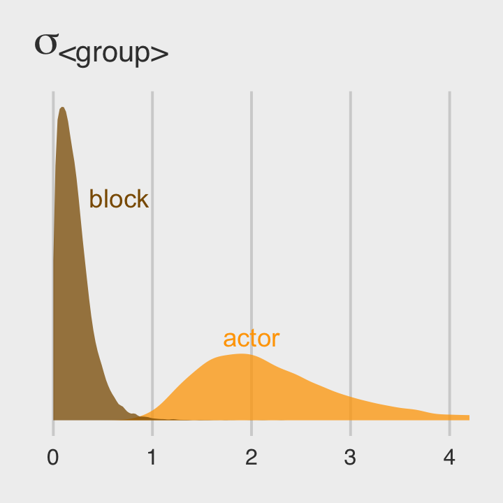
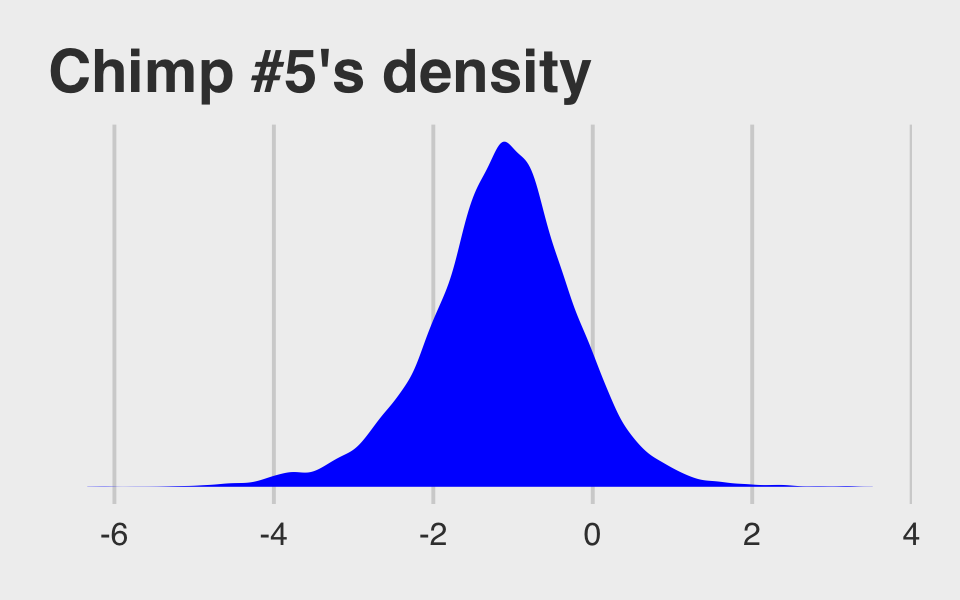

# Multilevel Models

> Multilevel models... remember features of each cluster in the data as they learn about all of the clusters. Depending upon the variation among clusters, which is learned from the data as well, the model pools information across clusters. This pooling tends to improve estimates about each cluster. This improved estimation leads to several, more pragmatic sounding, benefits of the multilevel approach. [@mcelreathStatisticalRethinkingBayesian2015, p. 356]

These benefits include:

* improved estimates for repeated sampling (i.e., in longitudinal data)
* improved estimates when there are imbalances among subsamples
* estimates of the variation across subsamples
* avoiding simplistic averaging by retaining variation across subsamples

> All of these benefits flow out of the same strategy and model structure. You learn one basic design and you get all of this for free.
>
> When it comes to regression, multilevel regression deserves to be the default approach. There are certainly contexts in which it would be better to use an old-fashioned single-level model. But the contexts in which multilevel models are superior are much more numerous. It is better to begin to build a multilevel analysis, and then realize it's unnecessary, than to overlook it. And once you grasp the basic multilevel stragety, it becomes much easier to incorporate related tricks such as allowing for measurement error in the data and even model missing data itself ([Chapter 14][Missing Data and Other Opportunities]). (p. 356)

I'm totally on board with this. After learning about the multilevel model, I see it everywhere. For more on the sentiment it should be the default, check out McElreath's blog post, [*Multilevel regression as default*](https://elevanth.org/blog/2017/08/24/multilevel-regression-as-default/).

## Example: Multilevel tadpoles

Let's load the `reedfrogs` data [see @voneshCompensatoryLarvalResponses2005].


```r
library(rethinking)
data(reedfrogs)
d <- reedfrogs
```

Detach rethinking and load brms.


```r
rm(reedfrogs)
detach(package:rethinking, unload = T)
library(brms)
```

Go ahead and acquaint yourself with the `reedfrogs`.


```r
library(tidyverse)

d %>%
  glimpse()
```

```
## Rows: 48
## Columns: 5
## $ density  <int> 10, 10, 10, 10, 10, 10, 10, 10, 10, 10, 10, 10, 10, 10, 10, 10, 25, 25, 25, 25, 2…
## $ pred     <fct> no, no, no, no, no, no, no, no, pred, pred, pred, pred, pred, pred, pred, pred, n…
## $ size     <fct> big, big, big, big, small, small, small, small, big, big, big, big, small, small,…
## $ surv     <int> 9, 10, 7, 10, 9, 9, 10, 9, 4, 9, 7, 6, 7, 5, 9, 9, 24, 23, 22, 25, 23, 23, 23, 21…
## $ propsurv <dbl> 0.9000000, 1.0000000, 0.7000000, 1.0000000, 0.9000000, 0.9000000, 1.0000000, 0.90…
```

Making the `tank` cluster variable is easy.


```r
d <- 
  d %>%
  mutate(tank = 1:nrow(d))
```

Here's the formula for the un-pooled model in which each `tank` gets its own intercept:

\begin{align*}
\text{surv}_i             & \sim \operatorname{Binomial}(n_i, p_i) \\
\operatorname{logit}(p_i) & = \alpha_{\text{tank}_i} \\
\alpha_{\text{tank}}      & \sim \operatorname{Normal}(0, 5),
\end{align*}

where $n_i$ is indexed by the `density` column. It's values are distributed like so: 


```r
d %>% 
  count(density)
```

```
##   density  n
## 1      10 16
## 2      25 16
## 3      35 16
```

Now fit this simple aggregated binomial model much like we practiced in [Chapter 10][Aggregated binomial: Chimpanzees again, condensed.].


```r
b12.1 <- 
  brm(data = d, 
      family = binomial,
      surv | trials(density) ~ 0 + factor(tank),
      prior(normal(0, 5), class = b),
      iter = 2000, warmup = 500, chains = 4, cores = 4,
      seed = 12,
      file = "fits/b12.01")
```

We don't need a `depth=2` argument to discover we have 48 different intercepts. Just good old `print()` will do.


```r
print(b12.1)
```

```
##  Family: binomial 
##   Links: mu = logit 
## Formula: surv | trials(density) ~ 0 + factor(tank) 
##    Data: d (Number of observations: 48) 
##   Draws: 4 chains, each with iter = 2000; warmup = 500; thin = 1;
##          total post-warmup draws = 6000
## 
## Population-Level Effects: 
##              Estimate Est.Error l-95% CI u-95% CI Rhat Bulk_ESS Tail_ESS
## factortank1      2.51      1.15     0.66     5.12 1.00    10149     3855
## factortank2      5.71      2.77     1.72    12.36 1.00     9134     4133
## factortank3      0.93      0.71    -0.37     2.36 1.00    14813     3763
## factortank4      5.69      2.71     1.75    11.97 1.00     7956     4121
## factortank5      2.53      1.19     0.62     5.25 1.00     9661     3651
## factortank6      2.54      1.22     0.61     5.35 1.00     9473     3273
## factortank7      5.73      2.77     1.72    12.30 1.00     7031     3812
## factortank8      2.50      1.15     0.65     5.15 1.00    10038     4001
## factortank9     -0.43      0.66    -1.75     0.85 1.00    12723     4055
## factortank10     2.52      1.17     0.63     5.21 1.00     9821     3832
## factortank11     0.94      0.71    -0.34     2.43 1.00    13051     4235
## factortank12     0.44      0.68    -0.85     1.83 1.00    14674     3944
## factortank13     0.93      0.73    -0.42     2.47 1.00    13466     4168
## factortank14    -0.00      0.65    -1.29     1.28 1.00    12929     4110
## factortank15     2.51      1.19     0.59     5.29 1.00    11604     4060
## factortank16     2.53      1.18     0.67     5.27 1.00     8951     3669
## factortank17     3.49      1.15     1.72     6.33 1.00     9216     3462
## factortank18     2.61      0.79     1.27     4.37 1.00    11291     3279
## factortank19     2.11      0.64     1.00     3.51 1.00    11621     3680
## factortank20     6.44      2.64     2.68    12.72 1.00     6869     3836
## factortank21     2.61      0.78     1.28     4.33 1.00    13121     3943
## factortank22     2.61      0.76     1.33     4.33 1.00    12036     3918
## factortank23     2.62      0.80     1.29     4.41 1.00    12908     3948
## factortank24     1.74      0.57     0.73     2.94 1.00    13643     3853
## factortank25    -1.20      0.48    -2.20    -0.32 1.00    14568     4183
## factortank26     0.08      0.42    -0.74     0.93 1.00    14636     4038
## factortank27    -1.74      0.57    -2.97    -0.74 1.00    12882     4120
## factortank28    -0.60      0.42    -1.45     0.22 1.00    13425     4481
## factortank29     0.08      0.41    -0.72     0.90 1.00    13113     3865
## factortank30     1.45      0.51     0.52     2.53 1.00    11810     3975
## factortank31    -0.78      0.43    -1.65     0.02 1.00    12764     3790
## factortank32    -0.42      0.40    -1.23     0.39 1.00    11635     4549
## factortank33     3.81      1.09     2.13     6.35 1.00     8832     3918
## factortank34     2.97      0.77     1.69     4.68 1.00    11225     4148
## factortank35     2.98      0.80     1.65     4.76 1.00    11560     3514
## factortank36     2.13      0.54     1.19     3.29 1.00    12923     4662
## factortank37     2.13      0.55     1.18     3.28 1.00    13050     4465
## factortank38     6.66      2.61     2.99    12.67 1.00     7448     4355
## factortank39     2.97      0.77     1.68     4.75 1.00    11221     3592
## factortank40     2.48      0.64     1.38     3.87 1.00    10046     3928
## factortank41    -2.13      0.56    -3.31    -1.13 1.00    13567     4214
## factortank42    -0.67      0.37    -1.41     0.04 1.00    13588     3968
## factortank43    -0.55      0.36    -1.28     0.14 1.00    12460     4379
## factortank44    -0.42      0.35    -1.11     0.29 1.00    14911     3938
## factortank45     0.54      0.35    -0.15     1.24 1.00    14974     4588
## factortank46    -0.67      0.36    -1.38     0.03 1.00    13066     4119
## factortank47     2.13      0.56     1.14     3.33 1.00    13155     4527
## factortank48    -0.05      0.33    -0.71     0.60 1.00    13867     4462
## 
## Draws were sampled using sampling(NUTS). For each parameter, Bulk_ESS
## and Tail_ESS are effective sample size measures, and Rhat is the potential
## scale reduction factor on split chains (at convergence, Rhat = 1).
```

Do you remember the dummy variables models from back in [Chapter 5][Binary categories.]? This model is like one of those on steroids. It'll be instructive to take a look at their distributions in density plots. We'll plot them in both their log-odds and probability metrics.

For kicks and giggles, let's use a [FiveThirtyEight-like theme](https://github.com/alex23lemm/theme_fivethirtyeight) for this chapter's plots. An easy way to do so is with help from the [ggthemes package](https://cran.r-project.org/package=ggthemes).


```r
library(ggthemes) 

tibble(estimate = fixef(b12.1)[, 1]) %>% 
  mutate(p = inv_logit_scaled(estimate)) %>% 
  gather() %>% 
  mutate(key = if_else(key == "p", "expected survival probability", "expected survival log-odds")) %>% 
  
  ggplot(aes(x = value, fill = key)) +
  geom_density(linewidth = 0) +
  scale_fill_manual(values = c("orange1", "orange4")) +
  scale_y_continuous(breaks = NULL) +
  labs(title = "Tank-level intercepts from the no-pooling model",
       subtitle = "Notice now inspecting the distributions of the posterior means can offer insights you\nmight not get if you looked at them one at a time.") +
  theme_fivethirtyeight() +
  theme(legend.position = "none",
        panel.grid.major = element_blank()) +
  facet_wrap(~key, scales = "free")
```


Even though it seems like we can derive important insights from how the `tank`-level intercepts are distributed, that information is not explicitly encoded in the statistical model. Keep that in mind as we now consider the multilevel alternative. Its formula is

\begin{align*}
\text{surv}_i             & \sim \operatorname{Binomial}(n_i, p_i) \\
\operatorname{logit}(p_i) & = \alpha_{\text{tank}_i} \\
\alpha_\text{tank}        & \sim \operatorname{Normal}(\color{blue}\alpha, \color{blue}\sigma) \\
\color{blue}\alpha        & \color{blue}\sim \color{blue}{\operatorname{Normal}(0, 1)} \\
\color{blue}\sigma        & \color{blue}\sim \color{blue}{\operatorname{HalfCauchy}(0, 1)}.
\end{align*}

> The Gaussian distribution with mean $\alpha$ and standard deviation $\sigma$ is the prior for each tank's intercept. But that prior itself has priors for $\alpha$ and $\sigma$. So there are two *levels* in the model, each resembling a simpler model. (p. 359, *emphasis* in the original)

You specify the corresponding multilevel model like this.


```r
b12.2 <- 
  brm(data = d, 
      family = binomial,
      surv | trials(density) ~ 1 + (1 | tank),
      prior = c(prior(normal(0, 1), class = Intercept),
                prior(cauchy(0, 1), class = sd)),
      iter = 4000, warmup = 1000, chains = 4, cores = 4,
      seed = 12,
      file = "fits/b12.02")
```

The syntax for the varying effects follows the [lme4 style](https://cran.r-project.org/package=brms/vignettes/brms_overview.pdf), `( <varying parameter(s)> | <grouping variable(s)> )`. In this case `(1 | tank)` indicates only the intercept, `1`, varies by `tank`. The extent to which parameters vary is controlled by the prior, `prior(cauchy(0, 1), class = sd)`, which is <u>parameterized in the standard deviation metric</u>. Do note that last part. It's common in multilevel software to model in the variance metric, instead. For technical reasons we won't really get into until [Chapter 13][Adventures in Covariance], Stan parameterizes this as a standard deviation.

Let's perform the WAIC comparisons.


```r
b12.1 <- add_criterion(b12.1, "waic")
b12.2 <- add_criterion(b12.2, "waic")

w <- loo_compare(b12.1, b12.2, criterion = "waic")

print(w, simplify = F)
```

```
##       elpd_diff se_diff elpd_waic se_elpd_waic p_waic se_p_waic waic   se_waic
## b12.2    0.0       0.0  -100.0       3.6         20.9    0.8     200.0    7.3 
## b12.1   -0.2       2.2  -100.2       4.7         22.1    0.6     200.4    9.3
```

The `se_diff` is large relative to the `elpd_diff`. If we convert the $\text{elpd}$ difference to the WAIC metric, the message stays the same.


```r
cbind(waic_diff = w[, 1] * -2,
      se        = w[, 2] *  2)
```

```
##       waic_diff       se
## b12.2 0.0000000 0.000000
## b12.1 0.4194233 4.397379
```

Here are the WAIC weights.


```r
model_weights(b12.1, b12.2, weights = "waic") %>% 
  round(digits = 2)
```

```
## b12.1 b12.2 
##  0.45  0.55
```

Let's check he model summary.


```r
print(b12.2)
```

```
##  Family: binomial 
##   Links: mu = logit 
## Formula: surv | trials(density) ~ 1 + (1 | tank) 
##    Data: d (Number of observations: 48) 
##   Draws: 4 chains, each with iter = 4000; warmup = 1000; thin = 1;
##          total post-warmup draws = 12000
## 
## Group-Level Effects: 
## ~tank (Number of levels: 48) 
##               Estimate Est.Error l-95% CI u-95% CI Rhat Bulk_ESS Tail_ESS
## sd(Intercept)     1.62      0.21     1.26     2.10 1.00     3304     5344
## 
## Population-Level Effects: 
##           Estimate Est.Error l-95% CI u-95% CI Rhat Bulk_ESS Tail_ESS
## Intercept     1.30      0.25     0.82     1.81 1.00     2779     5105
## 
## Draws were sampled using sampling(NUTS). For each parameter, Bulk_ESS
## and Tail_ESS are effective sample size measures, and Rhat is the potential
## scale reduction factor on split chains (at convergence, Rhat = 1).
```

This time we don't get a list of 48 separate `tank`-level parameters. However, we do get a description of their distribution interns of a mean (i.e., `Intercept`) and standard deviation (i.e., `sd(Intercept)`). If you'd like the actual `tank`-level parameters, don't worry; they're coming in Figure 12.1. We'll need to do a little prep work, though.


```r
post <- as_draws_df(b12.2)

post_mdn <- 
  tibble(Estimate = coef(b12.2, robust = T)$tank[, "Estimate", ]) %>%
  mutate(post_mdn = inv_logit_scaled(Estimate)) %>% 
  bind_cols(d)

post_mdn
```

```
## # A tibble: 48 × 8
##    Estimate post_mdn density pred  size   surv propsurv  tank
##       <dbl>    <dbl>   <int> <fct> <fct> <int>    <dbl> <int>
##  1    2.07     0.888      10 no    big       9      0.9     1
##  2    2.96     0.951      10 no    big      10      1       2
##  3    0.973    0.726      10 no    big       7      0.7     3
##  4    2.95     0.950      10 no    big      10      1       4
##  5    2.08     0.889      10 no    small     9      0.9     5
##  6    2.06     0.887      10 no    small     9      0.9     6
##  7    2.97     0.951      10 no    small    10      1       7
##  8    2.07     0.888      10 no    small     9      0.9     8
##  9   -0.164    0.459      10 pred  big       4      0.4     9
## 10    2.07     0.888      10 pred  big       9      0.9    10
## # … with 38 more rows
```

Here's the ggplot2 code to reproduce Figure 12.1.


```r
post_mdn %>%
  ggplot(aes(x = tank)) +
  geom_hline(yintercept = inv_logit_scaled(median(post$b_Intercept)), linetype = 2, linewidth = 1/4, 
             color = ggthemes_data[["fivethirtyeight"]][1, 2] %>% pull()) +
  geom_vline(xintercept = c(16.5, 32.5), linewidth = 1, 
             color = ggthemes_data[["fivethirtyeight"]][2, 2] %>% pull()) +
  geom_point(aes(y = propsurv), color = "orange2") +
  geom_point(aes(y = post_mdn), shape = 1) +
  annotate(geom = "text", x = c(8, 16 + 8, 32 + 8), y = 0, 
           label = c("small tanks", "medium tanks", "large tanks")) +
  scale_x_continuous(breaks = c(1, 16, 32, 48)) +
  labs(title = "Multilevel shrinkage!",
       subtitle = "The empirical proportions are in orange while the model-\nimplied proportions are the black circles. The dashed line is\nthe model-implied average survival proportion.") +
  coord_cartesian(ylim = c(0, 1)) +
  theme_fivethirtyeight() +
  theme(panel.grid.major = element_blank())
```


Here is the code for our version of Figure 12.2.a, where we visualize the model-implied population distribution of log-odds survival (i.e., the population distribution yielding all the `tank`-level intercepts).


```r
# this makes the output of `slice_sample()` reproducible
set.seed(12)

p1 <-
  post %>% 
  slice_sample(n = 100) %>% 
  expand_grid(x = seq(from = -4, to = 5, length.out = 100)) %>% 

  ggplot(aes(x = x, group = .draw)) +
  geom_line(aes(y = dnorm(x, b_Intercept, sd_tank__Intercept)),
            alpha = .2, color = "orange2") +
  scale_y_continuous(NULL, breaks = NULL) +
  labs(title = "Population survival distribution",
       subtitle = "log-odds scale") +
  coord_cartesian(xlim = c(-3, 4))
```

Now we make our Figure 12.2.b and then bind the two subplots with patchwork.


```r
p2 <-
  ggplot(data = post, 
         aes(x = rnorm(n = nrow(post), 
                       mean = b_Intercept, 
                       sd = sd_tank__Intercept) %>% 
               inv_logit_scaled())) +
  geom_density(linewidth = 0, fill = "orange2") +
  scale_y_continuous(NULL, breaks = NULL) +
  labs(title = "Probability of survival",
       subtitle = "transformed by the inverse-logit function")

library(patchwork)

(p1 + p2) &
  theme_fivethirtyeight() &
  theme(plot.title = element_text(size = 12),
        plot.subtitle = element_text(size = 10))
```


In the left plot, notice the uncertainty in terms of both location $\alpha$ and scale $\sigma$. For both pots, note how we sampled 12,000 imaginary `tanks` rather than McElreath's 8,000. This is because we had 12,000 HMC iterations (i.e., execute `nrow(post)`).

The `aes()` code in that last block was a bit much. To get a sense of how it worked, consider this.


```r
set.seed(12)

rnorm(n = 1, 
      mean = post$b_Intercept, 
      sd = post$sd_tank__Intercept) %>% 
  inv_logit_scaled()
```

```
## [1] 0.2150002
```

First, we took one random draw from a normal distribution with a mean of the first row in `post$b_Intercept` and a standard deviation of the value from the first row in `post$sd_tank__Intercept`, and passed it through the `inv_logit_scaled()` function. By replacing the `1` with `nrow(post)`, we do this `nrow(post)` times (i.e., 12,000). Our orange density, then, is the summary of that process.

#### Rethinking: Varying intercepts as over-dispersion.

> In the previous chapter ([page 346][Over-dispersed outcomes]), the beta-binomial and gamma-Poisson models were presented as ways for coping with **over-dispersion** of count data. Varying intercepts accomplish the same thing, allowing count outcomes to be over-dispersed. They accomplish this, because when each observed count gets its own unique intercept, but these intercepts are pooled through a common distribution, the predictions expect over-dispersion just like a beta-binomial or gamma-Poisson model would. Compared to a beta-binomial or gamma-Poisson model, a binomial or Poisson model with a varying intercept on every observed outcome will often be easier to estimate and easier to extend. (p. 363, **emphasis** in the original)

#### Overthinking: Prior for variance components.

Yep, you can use the exponential distribution for your priors in brms, too. Here it is for model `b12.2`.


```r
b12.2b <- 
  update(b12.2,
         prior = c(prior(normal(0, 1), class = Intercept),
                   prior(exponential(1), class = sd)),
         seed = 12,
         file = "fits/b12.02b")
```

The model summary:


```r
print(b12.2b)
```

```
##  Family: binomial 
##   Links: mu = logit 
## Formula: surv | trials(density) ~ 1 + (1 | tank) 
##    Data: d (Number of observations: 48) 
##   Draws: 4 chains, each with iter = 4000; warmup = 1000; thin = 1;
##          total post-warmup draws = 12000
## 
## Group-Level Effects: 
## ~tank (Number of levels: 48) 
##               Estimate Est.Error l-95% CI u-95% CI Rhat Bulk_ESS Tail_ESS
## sd(Intercept)     1.61      0.21     1.25     2.07 1.00     3362     5576
## 
## Population-Level Effects: 
##           Estimate Est.Error l-95% CI u-95% CI Rhat Bulk_ESS Tail_ESS
## Intercept     1.30      0.25     0.82     1.80 1.00     2446     4464
## 
## Draws were sampled using sampling(NUTS). For each parameter, Bulk_ESS
## and Tail_ESS are effective sample size measures, and Rhat is the potential
## scale reduction factor on split chains (at convergence, Rhat = 1).
```

If you're curious how the exponential prior compares to the posterior, you might just plot.


```r
tibble(x = seq(from = 0, to = 6, by = 0.01)) %>% 
  ggplot() +
  # the prior
  geom_area(aes(x = x, y = dexp(x, rate = 1)),
            fill = "orange2", alpha = 1/3) +
  # the posterior
  geom_density(data = as_draws_df(b12.2b),
               aes(x = sd_tank__Intercept), 
               fill = "orange2", linewidth = 0) +
  scale_y_continuous(NULL, breaks = NULL) +
  labs(title = "Bonus prior/posterior plot\nfor sd_tank__Intercept",
       subtitle = "The prior is the semitransparent ramp in the\nbackground. The posterior is the solid orange\nmound.") +
  coord_cartesian(xlim = c(0, 5)) +
  theme_fivethirtyeight()
```


## Varying effects and the underfitting/overfitting trade-off

> Varying intercepts are just regularized estimates, but adaptively regularized by estimating how diverse the clusters are while estimating the features of each cluster. This fact is not easy to grasp....
>
> A major benefit of using varying effects estimates, instead of the empirical raw estimates, is that they provide more accurate estimates of the individual cluster (tank) intercepts. On average, the varying effects actually provide a better estimate of the individual tank (cluster) means. The reason that the varying intercepts provides better estimates is that they do a better job trading off underfitting and overfitting. (p. 364)

In this section, we explicate this by contrasting three perspectives:

* Complete pooling (i.e., a single-$\alpha$ model)
* No pooling (i.e., the single-level $\alpha_{\text{tank}_i}$ model)
* Partial pooling (i.e., the multilevel model for which $\alpha_\text{tank} \sim \operatorname{Normal}(\alpha, \sigma)$)

> To demonstrate [the magic of the multilevel model], we'll simulate some tadpole data. That way, we'll know the true per-pond survival probabilities. Then we can compare the no-pooling estimates to the partial pooling estimates, by computing how close each gets to the true values they are trying to estimate. The rest of this section shows how to do such a simulation. (p. 365)

### The model.

The simulation formula should look familiar.

\begin{align*}
\text{surv}_i             & \sim \operatorname{Binomial}(n_i, p_i) \\
\operatorname{logit}(p_i) & = \alpha_{\text{pond}_i} \\
\alpha_{\text{pond}}      & \sim \operatorname{Normal}(\alpha, \sigma) \\
\alpha                    & \sim \operatorname{Normal}(0, 1) \\
\sigma                    & \sim \operatorname{HalfCauchy}(0, 1)
\end{align*}

### Assign values to the parameters.

Here we follow along with McElreath and "assign specific values representative of the actual tadpole data" (p. 366). However, our values will differ a little from his. Because he did not show a `set.seed()` line, we don’t know what seed was used to generate pseudo random draws from the `rnorm()` function.


```r
a       <-  1.4
sigma   <-  1.5
n_ponds <- 60

set.seed(12)

dsim <- 
  tibble(pond   = 1:n_ponds,
         ni     = rep(c(5, 10, 25, 35), each = n_ponds / 4) %>% as.integer(),
         true_a = rnorm(n = n_ponds, mean = a, sd = sigma))

head(dsim)
```

```
## # A tibble: 6 × 3
##    pond    ni  true_a
##   <int> <int>   <dbl>
## 1     1     5 -0.821 
## 2     2     5  3.77  
## 3     3     5 -0.0351
## 4     4     5  0.0200
## 5     5     5 -1.60  
## 6     6     5  0.992
```

McElreath twice urged us to inspect the contents of the simulation. In addition to looking at the data with `head()`, we might well plot.


```r
library(tidybayes)

dsim %>% 
  mutate(ni = factor(ni)) %>% 
  
  ggplot(aes(x = true_a, y = ni)) +
  stat_halfeye(.width = .5, fill = "orange2") +
  ggtitle("Log-odds varying by # tadpoles per pond") +
  theme_fivethirtyeight() +
  theme(plot.title = element_text(size = 14))
```


### Sumulate survivors.

> Each pond $i$ has $n_i$ potential survivors, and nature flips each tadpole's coin, so to speak, with probability of survival $p_i$. This probability $p_i$ is implied by the model definition, and is equal to:
>
> $$p_i = \frac{\exp (\alpha_i)}{1 + \exp (\alpha_i)}$$
>
> The model uses a logit link, and so the probability is defined by the [`inv_logit_scaled()`] function. (p. 367)


```r
set.seed(12)
(
  dsim <-
  dsim %>%
  mutate(si = rbinom(n = n(), prob = inv_logit_scaled(true_a), size = ni))
)
```

```
## # A tibble: 60 × 4
##     pond    ni  true_a    si
##    <int> <int>   <dbl> <int>
##  1     1     5 -0.821      0
##  2     2     5  3.77       5
##  3     3     5 -0.0351     4
##  4     4     5  0.0200     3
##  5     5     5 -1.60       0
##  6     6     5  0.992      5
##  7     7     5  0.927      5
##  8     8     5  0.458      3
##  9     9     5  1.24       5
## 10    10     5  2.04       5
## # … with 50 more rows
```

### Compute the no-pooling estimates.

The no-pooling estimates (i.e., $\alpha_{\text{tank}_i}$) are the results of simple algebra.


```r
(
  dsim <-
  dsim %>%
  mutate(p_nopool = si / ni)
)
```

```
## # A tibble: 60 × 5
##     pond    ni  true_a    si p_nopool
##    <int> <int>   <dbl> <int>    <dbl>
##  1     1     5 -0.821      0      0  
##  2     2     5  3.77       5      1  
##  3     3     5 -0.0351     4      0.8
##  4     4     5  0.0200     3      0.6
##  5     5     5 -1.60       0      0  
##  6     6     5  0.992      5      1  
##  7     7     5  0.927      5      1  
##  8     8     5  0.458      3      0.6
##  9     9     5  1.24       5      1  
## 10    10     5  2.04       5      1  
## # … with 50 more rows
```

"These are the same no-pooling estimates you'd get by fitting a model with a dummy variable for each pond and flat priors that induce no regularization" (p. 367). That is, these are the same kinds of estimates we got back when we fit `b12.1`.

### Compute the partial-pooling estimates.

To follow along with McElreath, set `chains = 1, cores = 1` to fit with one chain.


```r
b12.3 <- 
  brm(data = dsim, 
      family = binomial,
      si | trials(ni) ~ 1 + (1 | pond),
      prior = c(prior(normal(0, 1), class = Intercept),
                prior(cauchy(0, 1), class = sd)),
      iter = 10000, warmup = 1000, chains = 1, cores = 1,
      seed = 12,
      file = "fits/b12.03")
```

Here's our standard brms summary.


```r
print(b12.3)
```

```
##  Family: binomial 
##   Links: mu = logit 
## Formula: si | trials(ni) ~ 1 + (1 | pond) 
##    Data: dsim (Number of observations: 60) 
##   Draws: 1 chains, each with iter = 10000; warmup = 1000; thin = 1;
##          total post-warmup draws = 9000
## 
## Group-Level Effects: 
## ~pond (Number of levels: 60) 
##               Estimate Est.Error l-95% CI u-95% CI Rhat Bulk_ESS Tail_ESS
## sd(Intercept)     1.30      0.18     0.98     1.70 1.00     2696     4693
## 
## Population-Level Effects: 
##           Estimate Est.Error l-95% CI u-95% CI Rhat Bulk_ESS Tail_ESS
## Intercept     1.28      0.20     0.90     1.66 1.00     2794     4916
## 
## Draws were sampled using sampling(NUTS). For each parameter, Bulk_ESS
## and Tail_ESS are effective sample size measures, and Rhat is the potential
## scale reduction factor on split chains (at convergence, Rhat = 1).
```

I'm not aware that you can use McElreath's `depth=2` trick in brms for `summary()` or `print()`. But can get most of that information and more with the Stan-like summary using the `$fit` syntax.


```r
b12.3$fit
```

```
## Inference for Stan model: 6d808481df58c4fa018bca74d81aef07.
## 1 chains, each with iter=10000; warmup=1000; thin=1; 
## post-warmup draws per chain=9000, total post-warmup draws=9000.
## 
##                         mean se_mean   sd    2.5%     25%     50%     75%   97.5% n_eff Rhat
## b_Intercept             1.28    0.00 0.20    0.90    1.14    1.27    1.40    1.66  2793    1
## sd_pond__Intercept      1.30    0.00 0.18    0.98    1.17    1.29    1.41    1.70  2683    1
## r_pond[1,Intercept]    -2.35    0.01 0.90   -4.29   -2.91   -2.30   -1.73   -0.72 10016    1
## r_pond[2,Intercept]     1.02    0.01 1.01   -0.78    0.32    0.96    1.66    3.18 11856    1
## r_pond[3,Intercept]     0.16    0.01 0.86   -1.44   -0.43    0.14    0.71    1.96 15970    1
## r_pond[4,Intercept]    -0.51    0.01 0.81   -2.07   -1.06   -0.52    0.04    1.12 13029    1
## r_pond[5,Intercept]    -2.35    0.01 0.90   -4.25   -2.92   -2.29   -1.73   -0.75 10993    1
## r_pond[6,Intercept]     1.03    0.01 1.01   -0.77    0.32    0.97    1.67    3.20 12045    1
## r_pond[7,Intercept]     1.03    0.01 1.01   -0.76    0.34    0.98    1.67    3.19 13688    1
## r_pond[8,Intercept]    -0.49    0.01 0.80   -2.05   -1.04   -0.51    0.03    1.15 16409    1
## r_pond[9,Intercept]     1.03    0.01 1.01   -0.79    0.31    0.97    1.68    3.14 11611    1
## r_pond[10,Intercept]    1.03    0.01 1.01   -0.76    0.32    0.97    1.65    3.23 10556    1
## r_pond[11,Intercept]   -0.50    0.01 0.81   -2.07   -1.04   -0.52    0.03    1.13 16325    1
## r_pond[12,Intercept]   -0.50    0.01 0.81   -2.06   -1.03   -0.51    0.02    1.15 15937    1
## r_pond[13,Intercept]   -0.50    0.01 0.80   -2.03   -1.04   -0.52    0.02    1.13 13902    1
## r_pond[14,Intercept]    0.18    0.01 0.88   -1.48   -0.40    0.14    0.73    2.03 13798    1
## r_pond[15,Intercept]    0.17    0.01 0.89   -1.48   -0.43    0.14    0.74    2.03 15941    1
## r_pond[16,Intercept]   -0.65    0.01 0.64   -1.88   -1.08   -0.67   -0.23    0.58 10858    1
## r_pond[17,Intercept]    1.40    0.01 0.93   -0.20    0.75    1.33    1.98    3.46 12313    1
## r_pond[18,Intercept]    0.71    0.01 0.78   -0.70    0.17    0.66    1.21    2.33 13781    1
## r_pond[19,Intercept]    0.72    0.01 0.80   -0.70    0.17    0.68    1.23    2.44 12530    1
## r_pond[20,Intercept]    0.71    0.01 0.82   -0.76    0.14    0.66    1.22    2.47 15068    1
## r_pond[21,Intercept]    0.71    0.01 0.78   -0.68    0.17    0.66    1.20    2.37 14366    1
## r_pond[22,Intercept]    1.42    0.01 0.92   -0.20    0.77    1.35    1.97    3.47 12753    1
## r_pond[23,Intercept]    1.42    0.01 0.94   -0.20    0.77    1.35    2.00    3.46 12658    1
## r_pond[24,Intercept]   -0.66    0.01 0.63   -1.86   -1.09   -0.66   -0.25    0.62 12473    1
## r_pond[25,Intercept]   -1.69    0.01 0.62   -2.96   -2.10   -1.67   -1.27   -0.51 12132    1
## r_pond[26,Intercept]    0.18    0.01 0.72   -1.14   -0.32    0.15    0.64    1.68 10407    1
## r_pond[27,Intercept]    0.17    0.01 0.70   -1.12   -0.29    0.14    0.63    1.62 11877    1
## r_pond[28,Intercept]    0.71    0.01 0.79   -0.71    0.17    0.65    1.20    2.39 11801    1
## r_pond[29,Intercept]    0.70    0.01 0.78   -0.69    0.16    0.66    1.20    2.35 14105    1
## r_pond[30,Intercept]    0.18    0.01 0.69   -1.10   -0.30    0.15    0.63    1.62 11710    1
## r_pond[31,Intercept]    1.43    0.01 0.71    0.16    0.93    1.37    1.86    2.97 10803    1
## r_pond[32,Intercept]    1.43    0.01 0.72    0.16    0.92    1.37    1.89    2.96 11988    1
## r_pond[33,Intercept]   -1.08    0.00 0.43   -1.91   -1.37   -1.08   -0.79   -0.23  8627    1
## r_pond[34,Intercept]   -1.08    0.00 0.43   -1.93   -1.37   -1.08   -0.80   -0.23  9254    1
## r_pond[35,Intercept]   -0.44    0.01 0.46   -1.31   -0.75   -0.45   -0.14    0.47  8146    1
## r_pond[36,Intercept]   -1.07    0.00 0.43   -1.91   -1.37   -1.08   -0.78   -0.22  8209    1
## r_pond[37,Intercept]    0.39    0.01 0.53   -0.60    0.03    0.38    0.73    1.49 10044    1
## r_pond[38,Intercept]   -0.93    0.00 0.43   -1.77   -1.22   -0.92   -0.63   -0.11  8222    1
## r_pond[39,Intercept]    1.42    0.01 0.70    0.17    0.93    1.37    1.86    2.92 10543    1
## r_pond[40,Intercept]   -1.38    0.00 0.43   -2.24   -1.67   -1.38   -1.09   -0.54  8086    1
## r_pond[41,Intercept]    0.15    0.01 0.51   -0.81   -0.20    0.13    0.48    1.19  9521    1
## r_pond[42,Intercept]   -1.38    0.00 0.43   -2.24   -1.67   -1.38   -1.09   -0.53  8511    1
## r_pond[43,Intercept]   -0.07    0.00 0.47   -0.96   -0.40   -0.09    0.24    0.89  9283    1
## r_pond[44,Intercept]   -2.37    0.00 0.48   -3.36   -2.68   -2.35   -2.04   -1.45  9349    1
## r_pond[45,Intercept]   -0.60    0.00 0.44   -1.46   -0.91   -0.61   -0.31    0.28  9077    1
## r_pond[46,Intercept]    1.30    0.01 0.62    0.20    0.87    1.27    1.70    2.62 10457    1
## r_pond[47,Intercept]   -1.35    0.00 0.39   -2.11   -1.61   -1.36   -1.09   -0.60  7450    1
## r_pond[48,Intercept]    1.30    0.01 0.62    0.19    0.88    1.27    1.69    2.63 10078    1
## r_pond[49,Intercept]    1.70    0.01 0.70    0.49    1.20    1.64    2.14    3.19 11441    1
## r_pond[50,Intercept]   -0.80    0.00 0.39   -1.55   -1.05   -0.80   -0.54   -0.03  6549    1
## r_pond[51,Intercept]    0.14    0.00 0.44   -0.70   -0.15    0.13    0.43    1.01  8476    1
## r_pond[52,Intercept]    0.15    0.00 0.46   -0.73   -0.17    0.14    0.44    1.06  8979    1
## r_pond[53,Intercept]    0.99    0.01 0.54    0.01    0.62    0.97    1.33    2.11 10763    1
## r_pond[54,Intercept]    2.21    0.01 0.82    0.82    1.64    2.15    2.71    4.03  8917    1
## r_pond[55,Intercept]   -1.35    0.00 0.38   -2.12   -1.60   -1.35   -1.09   -0.61  7326    1
## r_pond[56,Intercept]    0.31    0.00 0.46   -0.54    0.00    0.30    0.61    1.25  8604    1
## r_pond[57,Intercept]    0.73    0.01 0.52   -0.23    0.37    0.72    1.07    1.79  9274    1
## r_pond[58,Intercept]   -1.68    0.00 0.39   -2.46   -1.95   -1.68   -1.42   -0.94  7850    1
## r_pond[59,Intercept]   -0.30    0.00 0.41   -1.08   -0.58   -0.32   -0.03    0.52  7606    1
## r_pond[60,Intercept]    0.14    0.00 0.45   -0.71   -0.17    0.13    0.43    1.05  8936    1
## lprior                 -3.19    0.01 0.33   -3.90   -3.39   -3.16   -2.95   -2.63  3112    1
## lp__                 -190.09    0.18 7.58 -205.52 -195.12 -189.85 -184.85 -176.17  1779    1
## 
## Samples were drawn using NUTS(diag_e) at Wed Jan 18 13:41:43 2023.
## For each parameter, n_eff is a crude measure of effective sample size,
## and Rhat is the potential scale reduction factor on split chains (at 
## convergence, Rhat=1).
```

As an aside, notice how this summary still reports the old-style `n_eff` values, rather than the updated `Bulk_ESS` and `Tail_ESS` values. I suspect this will change sometime soon. In the meantime, here's a [thread on the Stan Forums](https://discourse.mc-stan.org/t/new-r-hat-and-ess/8165) featuring members of the Stan team discussing how.

Let's get ready for the diagnostic plot of Figure 12.3. First we add the partially-pooled estimates, as summarized by their posterior means, to the `dsim` data. Then we compute error values.


```r
# we could have included this step in the block of code below, if we wanted to
p_partpool <- 
  tibble(Estimate = coef(b12.3)$pond[, "Estimate", ]) %>% 
  transmute(p_partpool = inv_logit_scaled(Estimate))

dsim <- 
  dsim %>%
  bind_cols(p_partpool) %>% 
  mutate(p_true = inv_logit_scaled(true_a)) %>%
  mutate(nopool_error   = abs(p_nopool   - p_true),
         partpool_error = abs(p_partpool - p_true))

dsim %>% 
  glimpse()
```

```
## Rows: 60
## Columns: 9
## $ pond           <int> 1, 2, 3, 4, 5, 6, 7, 8, 9, 10, 11, 12, 13, 14, 15, 16, 17, 18, 19, 20, 21, …
## $ ni             <int> 5, 5, 5, 5, 5, 5, 5, 5, 5, 5, 5, 5, 5, 5, 5, 10, 10, 10, 10, 10, 10, 10, 10…
## $ true_a         <dbl> -0.82085139, 3.76575421, -0.03511672, 0.01999213, -1.59646315, 0.99155593, …
## $ si             <int> 0, 5, 4, 3, 0, 5, 5, 3, 5, 5, 3, 3, 3, 4, 4, 6, 10, 9, 9, 9, 9, 10, 10, 6, …
## $ p_nopool       <dbl> 0.00, 1.00, 0.80, 0.60, 0.00, 1.00, 1.00, 0.60, 1.00, 1.00, 0.60, 0.60, 0.6…
## $ p_partpool     <dbl> 0.2543197, 0.9081217, 0.8081948, 0.6833375, 0.2543992, 0.9096582, 0.9096426…
## $ p_true         <dbl> 0.3055830, 0.9773737, 0.4912217, 0.5049979, 0.1684765, 0.7293951, 0.7164616…
## $ nopool_error   <dbl> 0.305582963, 0.022626343, 0.308778278, 0.095002134, 0.168476520, 0.27060486…
## $ partpool_error <dbl> 0.051263226, 0.069251913, 0.316973071, 0.178339619, 0.085922684, 0.18026301…
```

Here is our code for Figure 12.3. The extra data processing for `dfline` is how we get the values necessary for the horizontal summary lines.


```r
dfline <- 
  dsim %>%
  select(ni, nopool_error:partpool_error) %>%
  gather(key, value, -ni) %>%
  group_by(key, ni) %>%
  summarise(mean_error = mean(value)) %>%
  mutate(x    = c( 1, 16, 31, 46),
         xend = c(15, 30, 45, 60))
  
dsim %>% 
  ggplot(aes(x = pond)) +
  geom_vline(xintercept = c(15.5, 30.5, 45.4), 
             color = "white", linewidth = 2/3) +
  geom_point(aes(y = nopool_error), color = "orange2") +
  geom_point(aes(y = partpool_error), shape = 1) +
  geom_segment(data = dfline, 
               aes(x = x, xend = xend, 
                   y = mean_error, yend = mean_error),
               color = rep(c("orange2", "black"), each = 4),
               linetype = rep(1:2, each = 4)) +
  annotate("text", x = c(15 - 7.5, 30 - 7.5, 45 - 7.5, 60 - 7.5), y = .45, 
           label = c("tiny (5)", "small (10)", "medium (25)", "large (35)")) +
  scale_x_continuous(breaks = c(1, 10, 20, 30, 40, 50, 60)) +
  labs(title = "Estimate error by model type",
       subtitle = "The horizontal axis displays pond number. The vertical axis measures\nthe absolute error in the predicted proportion of survivors, compared to\nthe true value used in the simulation. The higher the point, the worse\nthe estimate. No-pooling shown in orange. Partial pooling shown in black.\nThe orange and dashed black lines show the average error for each kind\nof estimate, across each initial density of tadpoles (pond size). Smaller\nponds produce more error, but the partial pooling estimates are better\non average, especially in smaller ponds.",
       y = "absolute error") +
  theme_fivethirtyeight() +
  theme(panel.grid.major = element_blank(),
        plot.subtitle = element_text(size = 10))
```


If you wanted to quantify the difference in simple summaries, you might do something like this.


```r
dsim %>%
  select(ni, nopool_error:partpool_error) %>%
  gather(key, value, -ni) %>%
  group_by(key) %>%
  summarise(mean_error   = mean(value) %>% round(digits = 3),
            median_error = median(value) %>% round(digits = 3))
```

```
## # A tibble: 2 × 3
##   key            mean_error median_error
##   <chr>               <dbl>        <dbl>
## 1 nopool_error        0.078        0.05 
## 2 partpool_error      0.067        0.051
```

I originally learned about the multilevel in order to work with [longitudinal data](https://gseacademic.harvard.edu/alda/). In that context, I found the basic principles of a multilevel structure quite intuitive. The concept of partial pooling, however, took me some time to wrap my head around. If you're struggling with this, be patient and keep chipping away.

When McElreath [lectured on this topic in 2015](https://youtu.be/82TaniPgzQc?t=2048), he traced partial pooling to statistician [Charles M. Stein](https://imstat.org/2017/05/15/obituary-charles-m-stein-1920-2016/). In 1977, Efron and Morris wrote the now classic [-@efronSteinParadoxStatistics1977] paper, [*Stein's paradox in statistics*](https://statweb.stanford.edu/~ckirby/brad/other/Article1977.pdf), which does a nice job breaking down why partial pooling can be so powerful. One of the primary examples they used in the paper was of 1970 batting-average data. If you'd like more practice seeing how partial pooling works--or if you just like baseball--, check out my blog post, [*Stein's paradox and what partial pooling can do for you*](https://solomonkurz.netlify.app/blog/2019-02-23-stein-s-paradox-and-what-partial-pooling-can-do-for-you/).

#### Overthinking: Repeating the pond simulation.

Within the brms workflow, we can reuse a compiled model with `update()`. But first, we'll simulate new data.


```r
a       <-  1.4
sigma   <-  1.5
n_ponds <- 60

set.seed(1999)  # for new data, set a new seed
new_dsim <- 
  tibble(pond   = 1:n_ponds,
         ni     = rep(c(5, 10, 25, 35), each = n_ponds / 4) %>% as.integer(),
         true_a = rnorm(n = n_ponds, mean = a, sd = sigma)) %>% 
    mutate(si = rbinom(n = n(), prob = inv_logit_scaled(true_a), size = ni)) %>% 
    mutate(p_nopool = si / ni)

glimpse(new_dsim)
```

```
## Rows: 60
## Columns: 5
## $ pond     <int> 1, 2, 3, 4, 5, 6, 7, 8, 9, 10, 11, 12, 13, 14, 15, 16, 17, 18, 19, 20, 21, 22, 23…
## $ ni       <int> 5, 5, 5, 5, 5, 5, 5, 5, 5, 5, 5, 5, 5, 5, 5, 10, 10, 10, 10, 10, 10, 10, 10, 10, …
## $ true_a   <dbl> 2.4990087, 1.3432554, 3.2045137, 3.6047030, 1.6005354, 2.1797409, 0.5759270, -0.3…
## $ si       <int> 4, 4, 5, 4, 4, 4, 2, 4, 3, 5, 4, 5, 2, 2, 5, 10, 7, 10, 10, 8, 10, 9, 5, 10, 10, …
## $ p_nopool <dbl> 0.80, 0.80, 1.00, 0.80, 0.80, 0.80, 0.40, 0.80, 0.60, 1.00, 0.80, 1.00, 0.40, 0.4…
```

Fit the new model.


```r
b12.3_new <- 
  update(b12.3,
         newdata = new_dsim,
         seed = 12,
         file = "fits/b12.03_new")
```


```r
print(b12.3_new)
```

```
##  Family: binomial 
##   Links: mu = logit 
## Formula: si | trials(ni) ~ 1 + (1 | pond) 
##    Data: new_dsim (Number of observations: 60) 
##   Draws: 1 chains, each with iter = 10000; warmup = 1000; thin = 1;
##          total post-warmup draws = 9000
## 
## Group-Level Effects: 
## ~pond (Number of levels: 60) 
##               Estimate Est.Error l-95% CI u-95% CI Rhat Bulk_ESS Tail_ESS
## sd(Intercept)     1.26      0.18     0.95     1.66 1.00     3000     4952
## 
## Population-Level Effects: 
##           Estimate Est.Error l-95% CI u-95% CI Rhat Bulk_ESS Tail_ESS
## Intercept     1.52      0.19     1.16     1.93 1.00     3406     4896
## 
## Draws were sampled using sampling(NUTS). For each parameter, Bulk_ESS
## and Tail_ESS are effective sample size measures, and Rhat is the potential
## scale reduction factor on split chains (at convergence, Rhat = 1).
```

Why not plot the first simulation versus the second one?


```r
bind_rows(as_draws_df(b12.3),
          as_draws_df(b12.3_new)) %>%
  mutate(model = rep(c("b12.3", "b12.3_new"), each = n() / 2)) %>% 

  ggplot(aes(x = b_Intercept, y = sd_pond__Intercept)) +
  stat_density_2d(geom = "raster", 
                  aes(fill = after_stat(density)), 
                  contour = F, n = 200) +
  geom_vline(xintercept = a,     color = "orange3", linetype = 3) +
  geom_hline(yintercept = sigma, color = "orange3", linetype = 3) +
  scale_fill_gradient(low = "grey25", high = "orange3") +
  ggtitle("Our simulation posteriors contrast a bit",
          subtitle = expression(alpha*" is on the x and "*sigma*" is on the y, both in log-odds. The dotted lines intersect at the true values.")) +
  coord_cartesian(xlim = c(.7, 2),
                  ylim = c(.8, 1.9)) +
  theme_fivethirtyeight() +
  theme(legend.position = "none",
        panel.grid.major = element_blank()) +
  facet_wrap(~model, ncol = 2)
```


If you'd like the `stanfit` portion of your `brm()` object, subset with `$fit`. Take `b12.3`, for example. You might check out its structure via `b12.3$fit %>% str()`. Here's the actual Stan code.


```r
b12.3$fit@stanmodel
```

```
## S4 class stanmodel '6d808481df58c4fa018bca74d81aef07' coded as follows:
## // generated with brms 2.18.0
## functions {
## }
## data {
##   int<lower=1> N;  // total number of observations
##   int Y[N];  // response variable
##   int trials[N];  // number of trials
##   // data for group-level effects of ID 1
##   int<lower=1> N_1;  // number of grouping levels
##   int<lower=1> M_1;  // number of coefficients per level
##   int<lower=1> J_1[N];  // grouping indicator per observation
##   // group-level predictor values
##   vector[N] Z_1_1;
##   int prior_only;  // should the likelihood be ignored?
## }
## transformed data {
## }
## parameters {
##   real Intercept;  // temporary intercept for centered predictors
##   vector<lower=0>[M_1] sd_1;  // group-level standard deviations
##   vector[N_1] z_1[M_1];  // standardized group-level effects
## }
## transformed parameters {
##   vector[N_1] r_1_1;  // actual group-level effects
##   real lprior = 0;  // prior contributions to the log posterior
##   r_1_1 = (sd_1[1] * (z_1[1]));
##   lprior += normal_lpdf(Intercept | 0, 1);
##   lprior += cauchy_lpdf(sd_1 | 0, 1)
##     - 1 * cauchy_lccdf(0 | 0, 1);
## }
## model {
##   // likelihood including constants
##   if (!prior_only) {
##     // initialize linear predictor term
##     vector[N] mu = rep_vector(0.0, N);
##     mu += Intercept;
##     for (n in 1:N) {
##       // add more terms to the linear predictor
##       mu[n] += r_1_1[J_1[n]] * Z_1_1[n];
##     }
##     target += binomial_logit_lpmf(Y | trials, mu);
##   }
##   // priors including constants
##   target += lprior;
##   target += std_normal_lpdf(z_1[1]);
## }
## generated quantities {
##   // actual population-level intercept
##   real b_Intercept = Intercept;
## }
## 
```

And you can get the data of a given `brm()` fit object like so.


```r
b12.3$data %>% 
  head()
```

```
##   si ni pond
## 1  0  5    1
## 2  5  5    2
## 3  4  5    3
## 4  3  5    4
## 5  0  5    5
## 6  5  5    6
```

## More than one type of cluster

"We can use and often should use more than one type of cluster in the same model" (p. 370).

#### Rethinking: Cross-classification and hierarchy.

> The kind of data structure in `data(chimpanzees)` is usually called a **cross-classified** multilevel model. It is cross-classified, because actors are not nested within unique blocks. If each chimpanzee had instead done all of his or her pulls on a single day, within a single block, then the data structure would instead be *hierarchical.* (p. 371, **emphasis** in the original)

### Multilevel chimpanzees.

The initial multilevel update from model `b10.4` from [Chapter 10][Logistic regression: Prosocial chimpanzees.] follows the statistical formula

\begin{align*}
\text{left_pull}_i        & \sim \operatorname{Binomial}(n_i = 1, p_i) \\
\operatorname{logit}(p_i) & = \alpha + \color{blue}{\alpha_{\text{actor}_i}} + (\beta_1 + \beta_2 \text{condition}_i) \text{prosoc_left}_i \\
\color{blue}{\alpha_\text{actor}} & \color{blue}\sim \color{blue}{\operatorname{Normal}(0, \sigma_\text{actor})} \\
\alpha                    & \sim \operatorname{Normal}(0, 10) \\
\beta_1                   & \sim \operatorname{Normal}(0, 10) \\
\beta_2                   & \sim \operatorname{Normal}(0, 10) \\
\color{blue}{\sigma_\text{actor}} & \color{blue}\sim \color{blue}{\operatorname{HalfCauchy}(0, 1)}.
\end{align*}

> Notice that $\alpha$ is inside the linear model, not inside the Gaussian prior for $\alpha_\text{actor}$. This is mathematically equivalent to what [we] did with the tadpoles earlier in the chapter. You can always take the mean out of a Gaussian distribution and treat that distribution as a constant plus a Gaussian distribution centered on zero.
>
> This might seem a little weird at first, so it might help train your intuition by experimenting in R. (p. 371)

Behold our two identical Gaussians in a tidy tibble.


```r
set.seed(12)
two_gaussians <- 
  tibble(y1 =      rnorm(n = 1e4, mean = 10, sd = 1),
         y2 = 10 + rnorm(n = 1e4, mean = 0,  sd = 1))
```

Let's follow McElreath's advice to make sure they are same by superimposing the density of one on the other.


```r
two_gaussians %>%
  
  ggplot() +
  geom_density(aes(x = y1), 
               linewidth = 0, fill = "orange1", alpha = 1/3) +
  geom_density(aes(x = y2), 
               linewidth = 0, fill = "orange4", alpha = 1/3) +
  scale_y_continuous(NULL, breaks = NULL) +
  ggtitle("Our simulated Gaussians") +
  theme_fivethirtyeight()
```


Yep, those Gaussians look about the same.

Let's get the `chimpanzees` data from rethinking.


```r
library(rethinking)
data(chimpanzees)
d <- chimpanzees
```

Detach rethinking and reload brms.


```r
rm(chimpanzees)
detach(package:rethinking, unload = T)
library(brms)
```

For our brms model with varying intercepts for `actor` but not `block`, we employ the `pulled_left ~ 1 + ... + (1 | actor)` syntax, specifically omitting a `(1 | block)` section.


```r
b12.4 <- 
  brm(data = d, 
      family = binomial,
      pulled_left | trials(1) ~ 1 + prosoc_left + prosoc_left:condition + (1 | actor),
      prior = c(prior(normal(0, 10), class = Intercept),
                prior(normal(0, 10), class = b),
                prior(cauchy(0, 1), class = sd)),
      # I'm using 4 cores, instead of the `cores=3` in McElreath's code
      iter = 5000, warmup = 1000, chains = 4, cores = 4,  
      seed = 12,
      file = "fits/b12.04")
```

McElreath encouraged us to inspect the trace plots. Here they are.


```r
library(bayesplot)
color_scheme_set("orange")

post <- as_draws_df(b12.4)

post %>% 
  mcmc_trace(pars = vars(b_Intercept:`r_actor[7,Intercept]`),
             facet_args = list(ncol = 4)) +
  scale_x_continuous(breaks = 0:2 * 2000) +
  theme_fivethirtyeight() +
  theme(legend.direction = "vertical",
        legend.key.size = unit(0.5, "cm"),
        legend.position = c(.96, .1))
```


They look great. Here's the posterior distribution for $\sigma_\text{actor}$.


```r
post %>% 
  ggplot(aes(x = sd_actor__Intercept, y = 0)) +
  stat_halfeye(.width = .95, fill = "orange2") +
  scale_y_continuous(NULL, breaks = NULL) +
  ggtitle(expression(sigma[actor])) +
  theme_fivethirtyeight()
```


We can inspect the $\widehat R$ and effective sample size values for all parameters with the `bayesplot::rhat()` function. Here we'll put it in a data frame for easy viewing.


```r
data.frame(rhat = rhat(b12.4))
```

```
##                             rhat
## b_Intercept             1.001388
## b_prosoc_left           1.000485
## b_prosoc_left:condition 1.000056
## sd_actor__Intercept     1.000173
## r_actor[1,Intercept]    1.001398
## r_actor[2,Intercept]    1.000124
## r_actor[3,Intercept]    1.001410
## r_actor[4,Intercept]    1.001650
## r_actor[5,Intercept]    1.001297
## r_actor[6,Intercept]    1.001358
## r_actor[7,Intercept]    1.001322
## lprior                  1.000159
## lp__                    1.000373
```

I'm not aware that brms or bayesplot offer a convenient way to compute the `Bulk_ESS` or `Tail_ESS` values for arbitrary combinations of parameters in a data frame. However you can do so with the `posterior::summarise_draws()` function.


```r
library(posterior)

summarise_draws(b12.4)
```

```
## # A tibble: 13 × 10
##    variable                    mean   median    sd   mad       q5        q95  rhat ess_bulk ess_tail
##    <chr>                      <dbl>    <dbl> <dbl> <dbl>    <dbl>      <dbl> <dbl>    <dbl>    <dbl>
##  1 b_Intercept                0.436    0.398 0.936 0.807   -1.01     2.04     1.00    3301.    3725.
##  2 b_prosoc_left              0.822    0.820 0.260 0.259    0.398    1.24     1.00    8229.    9127.
##  3 b_prosoc_left:condition   -0.134   -0.130 0.295 0.298   -0.614    0.350    1.00    8464.    9769.
##  4 sd_actor__Intercept        2.26     2.05  0.916 0.700    1.22     4.00     1.00    3670.    5232.
##  5 r_actor[1,Intercept]      -1.15    -1.11  0.951 0.828   -2.79     0.309    1.00    3343.    3758.
##  6 r_actor[2,Intercept]       4.17     3.90  1.66  1.34     2.09     7.06     1.00    6075.    7212.
##  7 r_actor[3,Intercept]      -1.46    -1.42  0.953 0.839   -3.08     0.00233  1.00    3379.    4222.
##  8 r_actor[4,Intercept]      -1.46    -1.42  0.958 0.842   -3.11     0.00171  1.00    3397.    4313.
##  9 r_actor[5,Intercept]      -1.15    -1.11  0.951 0.828   -2.77     0.304    1.00    3392.    4162.
## 10 r_actor[6,Intercept]      -0.208   -0.170 0.954 0.839   -1.84     1.26     1.00    3412.    3887.
## 11 r_actor[7,Intercept]       1.32     1.34  0.979 0.863   -0.324    2.87     1.00    3590.    4746.
## 12 lprior                   -11.9    -11.8   0.593 0.562  -13.0    -11.0      1.00    3675.    5082.
## 13 lp__                    -283.    -283.    2.85  2.72  -288.    -279.       1.00    3616.    6001.
```

Note how the last three columns are the `rhat`, the `ess_bulk`, and the `ess_tail`. Here we summarize those two effective sample size columns with histograms.


```r
summarise_draws(b12.4) %>% 
  select(starts_with("ess")) %>% 
  gather() %>% 
  
  ggplot(aes(x = value)) +
  geom_histogram(binwidth = 100, fill = "blue") +
  xlim(0, NA) +
  theme_fivethirtyeight() +
  facet_wrap(~key)
```


McElreath pointed out it's important to understand the `actor`-level parameters, as in the summary above, are *deviations* from the grand mean. Here's one way to add them together.


```r
post %>%
  select(starts_with("r_actor")) %>% 
  gather() %>%
  # this is how we might add the grand mean to the actor-level deviations
  mutate(value = value + post$b_Intercept) %>% 
  group_by(key) %>%
  summarise(mean = mean(value) %>% round(digits = 2))
```

```
## # A tibble: 7 × 2
##   key                   mean
##   <chr>                <dbl>
## 1 r_actor[1,Intercept] -0.72
## 2 r_actor[2,Intercept]  4.61
## 3 r_actor[3,Intercept] -1.02
## 4 r_actor[4,Intercept] -1.02
## 5 r_actor[5,Intercept] -0.71
## 6 r_actor[6,Intercept]  0.23
## 7 r_actor[7,Intercept]  1.76
```

Here's another way to get at the same information, this time using `coef()` and a little formatting help from the `stringr::str_c()` function. Just for kicks, we'll throw in the 95% intervals, too.


```r
coef(b12.4)$actor[, c(1, 3:4), 1] %>%
  as_tibble() %>% 
  round(digits = 2) %>%
  # here we put the credible intervals in an APA-6-style format
  mutate(`95% CIs` = str_c("[", Q2.5, ", ", Q97.5, "]"),
         actor     = str_c("chimp #", 1:7)) %>%
  rename(mean = Estimate) %>%
  select(actor, mean, `95% CIs`) %>% 
  knitr::kable()
```


|actor    |  mean|95% CIs        |
|:--------|-----:|:--------------|
|chimp #1 | -0.72|[-1.25, -0.21] |
|chimp #2 |  4.61|[2.57, 8.56]   |
|chimp #3 | -1.02|[-1.58, -0.49] |
|chimp #4 | -1.02|[-1.57, -0.49] |
|chimp #5 | -0.71|[-1.25, -0.19] |
|chimp #6 |  0.23|[-0.28, 0.76]  |
|chimp #7 |  1.76|[1.05, 2.55]   |

If you prefer the posterior median to the mean, just add a `robust = T` argument inside the `coef()` function.

### Two types of cluster.

The full cross-classified statistical model follows the form

\begin{align*}
\text{left_pull}_i        & \sim \operatorname{Binomial}(n_i = 1, p_i) \\
\operatorname{logit}(p_i) & = \alpha + \alpha_{\text{actor}_i} + \color{blue}{\alpha_{\text{block}_i}} + (\beta_1 + \beta_2 \text{condition}_i) \text{prosoc_left}_i \\
\alpha_{\text{actor}} & \sim \operatorname{Normal}(0, \sigma_{\text{actor}}) \\
\color{blue}{\alpha_{\text{block}}} & \color{blue}\sim \color{blue}{\operatorname{Normal}(0, \sigma_{\text{actor}})} \\
\alpha                & \sim \operatorname{Normal}(0, 10) \\
\beta_1               & \sim \operatorname{Normal}(0, 10) \\
\beta_2               & \sim \operatorname{Normal}(0, 10) \\
\sigma_{\text{actor}} & \sim \operatorname{HalfCauchy}(0, 1) \\
\color{blue}{\sigma_{\text{block}}} & \color{blue}\sim \color{blue}{\operatorname{HalfCauchy}(0, 1)}.
\end{align*}

Our brms model with varying intercepts for both `actor` and `block` now employs the `... (1 | actor) + (1 | block)` syntax.


```r
b12.5 <- 
  update(b12.4,
         newdata = d,
         formula = pulled_left | trials(1) ~ 1 + prosoc_left + prosoc_left:condition + 
           (1 | actor) + (1 | block),
         iter = 6000, warmup = 1000, cores = 4, chains = 4, 
         control = list(adapt_delta = .85),
         seed = 12,
         file = "fits/b12.05")
```

This time we increased the `adapt_delta` parameter to `.9` to avoid divergent transitions. We can look at the primary coefficients with `print()`. McElreath urged us again to inspect the trace plots.


```r
post <- as_draws_df(b12.5)

post %>% 
  mcmc_trace(pars = vars(b_Intercept:`r_block[6,Intercept]`),
             facet_args = list(ncol = 4)) +
  scale_x_continuous(breaks = 0:2 * 2500) +
  theme_fivethirtyeight() +
  theme(legend.position = c(.75, .06))
```


The trace plots look great. Here are the other diagnostics along with the parameter summaries, once again using `summarise_draws()`.


```r
summarise_draws(b12.5) %>% 
  select(-median, -mad) %>% 
  mutate_if(is.double, round, digits = 2)
```

```
## # A tibble: 20 × 8
##    variable                   mean    sd      q5     q95  rhat ess_bulk ess_tail
##    <chr>                     <dbl> <dbl>   <dbl>   <dbl> <dbl>    <dbl>    <dbl>
##  1 b_Intercept                0.45  0.92   -0.99    1.99     1    4625.    6791.
##  2 b_prosoc_left              0.83  0.26    0.4     1.26     1   16449.   14628.
##  3 b_prosoc_left:condition   -0.14  0.3    -0.63    0.35     1   16100.   14336.
##  4 sd_actor__Intercept        2.29  0.91    1.24    3.96     1    5630.    8655.
##  5 sd_block__Intercept        0.22  0.18    0.02    0.55     1    7332.    8128.
##  6 r_actor[1,Intercept]      -1.17  0.94   -2.74    0.29     1    4626.    6902.
##  7 r_actor[2,Intercept]       4.21  1.64    2.12    7.15     1   10189.   12038.
##  8 r_actor[3,Intercept]      -1.47  0.94   -3.04   -0.02     1    4704.    7131.
##  9 r_actor[4,Intercept]      -1.47  0.94   -3.06   -0.01     1    4783.    7130.
## 10 r_actor[5,Intercept]      -1.17  0.94   -2.75    0.29     1    4678.    6988.
## 11 r_actor[6,Intercept]      -0.22  0.93   -1.78    1.22     1    4670.    6819.
## 12 r_actor[7,Intercept]       1.33  0.96   -0.26    2.86     1    4878.    7096.
## 13 r_block[1,Intercept]      -0.18  0.23   -0.62    0.08     1   11810.   13614.
## 14 r_block[2,Intercept]       0.04  0.19   -0.24    0.36     1   18092.   16669.
## 15 r_block[3,Intercept]       0.05  0.19   -0.23    0.39     1   19416.   17530.
## 16 r_block[4,Intercept]       0.01  0.18   -0.29    0.31     1   19684.   16136.
## 17 r_block[5,Intercept]      -0.03  0.18   -0.35    0.24     1   18703.   15959.
## 18 r_block[6,Intercept]       0.11  0.2    -0.14    0.49     1   14449.   16571.
## 19 lprior                   -12.4   0.6   -13.5   -11.6      1    5714.    8619.
## 20 lp__                    -293.    3.73 -299.   -287.       1    5404.    9667.
```


All our $\widehat R$ are excellent and the values in both our `ess_.` columns are generally quite higher than the `n_eff` values McElreath presented in the text.

If we'd like to restrict our focus to the parameter summaries, we can also use `brms::ranef()` to get those `depth=2`-type estimates. With `ranef()`, you get the group-specific estimates in a deviance metric. The `coef()` function, in contrast, yields the group-specific estimates in what you might call the natural metric. We'll get more language for this in the [next chapter][Adventures in Covariance].


```r
ranef(b12.5)$actor[, , "Intercept"] %>% 
  round(digits = 2)
```

```
##   Estimate Est.Error  Q2.5 Q97.5
## 1    -1.17      0.94 -3.16  0.62
## 2     4.21      1.64  1.80  8.13
## 3    -1.47      0.94 -3.47  0.31
## 4    -1.47      0.94 -3.47  0.32
## 5    -1.17      0.94 -3.16  0.63
## 6    -0.22      0.93 -2.20  1.58
## 7     1.33      0.96 -0.68  3.20
```

```r
ranef(b12.5)$block[, , "Intercept"] %>% 
  round(digits = 2)
```

```
##   Estimate Est.Error  Q2.5 Q97.5
## 1    -0.18      0.23 -0.73  0.13
## 2     0.04      0.19 -0.32  0.46
## 3     0.05      0.19 -0.31  0.49
## 4     0.01      0.18 -0.38  0.40
## 5    -0.03      0.18 -0.45  0.33
## 6     0.11      0.20 -0.21  0.59
```

We might make the coefficient plot of Figure 12.4.a with `mcmc_plot()`.


```r
mcmc_plot(b12.5, variable = c("^r_", "^b_", "^sd_"), regex = T) +
  theme_fivethirtyeight() +
  theme(axis.text.y = element_text(hjust = 0))
```


Once we get the posterior samples, it's easy to compare the random variances as in Figure 12.4.b.


```r
post %>%
  ggplot(aes(x = sd_actor__Intercept)) +
  geom_density(linewidth = 0, fill = "orange1", alpha = 3/4) +
  geom_density(aes(x = sd_block__Intercept), 
               linewidth = 0, fill = "orange4", alpha = 3/4)  +
  annotate(geom = "text", x = 2/3, y = 2, label = "block", color = "orange4") +
  annotate(geom = "text", x = 2, y = 3/4, label = "actor", color = "orange1") +
  scale_y_continuous(NULL, breaks = NULL) +
  ggtitle(expression(sigma["<group>"])) +
  coord_cartesian(xlim = c(0, 4)) +
  theme_fivethirtyeight()
```



We might compare our models by their PSIS-LOO values.


```r
b12.4 <- add_criterion(b12.4, "loo")
b12.5 <- add_criterion(b12.5, "loo")

loo_compare(b12.4, b12.5) %>% 
  print(simplify = F)
```

```
##       elpd_diff se_diff elpd_loo se_elpd_loo p_loo  se_p_loo looic  se_looic
## b12.4    0.0       0.0  -265.7      9.7         8.1    0.4    531.4   19.5  
## b12.5   -0.6       0.9  -266.3      9.8        10.3    0.5    532.5   19.7
```

```r
model_weights(b12.4, b12.5, weights = "loo") %>% 
  round(digits = 2)
```

```
## b12.4 b12.5 
##  0.64  0.36
```

The two models yield nearly-equivalent information criteria values. Yet recall what McElreath wrote: "There is nothing to gain here by selecting either model. The comparison of the two models tells a richer story" (p. 367).

### Even more clusters.

> Adding more types of clusters proceeds the same way. At some point the model may become too complex to reliably fit to data. But Hamiltonian Monte Carlo is very capable with varying effects. It can easily handle tens of thousands of varying effect parameters. Sampling will be slow in such cases, but it will work.
>
> So don't be shy--if you have a good theoretical reason to include a cluster variable, then you also have a good theoretical reason toe partially pool its parameters. (p. 376)

This section just hints at a historical software difficulty. In short, it's not uncommon to have a theory-based model that includes multiple sources of clustering (i.e., requiring many `( <varying parameter(s)> | <grouping variable(s)> )` parts in the model `formula`). This can make for all kinds of computational difficulties and result in software error messages, inadmissible solutions, and so on. One of the practical solutions to difficulties like these has been to simplify the statistical models by removing some of the clustering terms. Even though such simpler models were not the theory-based ones, at least they yielded solutions. Nowadays, Stan (via brms or otherwise) is making it easier to fit the full theoretically-based model. To learn more about this topic, check out this nice blog post by [Michael Frank](https://web.stanford.edu/~mcfrank/), [*Mixed effects models: Is it time to go Bayesian by default?*](http://babieslearninglanguage.blogspot.com/2018/02/mixed-effects-models-is-it-time-to-go.html). Make sure to check out the discussion in the comments section, which includes all-stars like Bürkner and [Douglas Bates](http://pages.stat.wisc.edu/~bates/). You can get more context for the issue from @barrRandomEffectsStructure2013,  [*Random effects structure for confirmatory hypothesis testing: Keep it maximal*](https://doi.org/10.1016/j.jml.2012.11.001).

## Multilevel posterior predictions

> Producing implied predictions from a fit model, is very helpful for understanding what the model means. Every model is a merger of sense and nonsense. When we understand a model, we can find its sense and control its nonsense. But as models get more complex, it is very difficult to impossible to understand them just by inspecting tables of posterior means and intervals. Exploring implied posterior predictions helps much more...
>
> ...The introduction of varying effects does introduce nuance, however.
>
> First, we should no longer expect the model to exactly retrodict the sample, because adaptive regularization has as its goal to trade off poorer fit in sample for better inference and hopefully better fit out of sample. This is what shrinkage does for us...
>
Second, "prediction" in the context of a multilevel model requires additional choices. If we wish to validate a model against the specific clusters used to fit the model, that is one thing. But if we instead wish to compute predictions for new clusters, other than the one observed in the sample, that is quite another. We'll consider each of these in turn, continuing to use the chimpanzees model from the previous section. (p. 376)

### Posterior prediction for same clusters.

Like McElreath did in the text, we'll do this two ways. Recall we use `brms::fitted()` in place of `rethinking::link()`.


```r
chimp <- 2
nd <-
  tibble(prosoc_left = c(0, 1, 0, 1),
         condition   = c(0, 0, 1, 1),
         actor       = chimp)

(
  chimp_2_fitted <-
  fitted(b12.4,
         newdata = nd) %>% 
  as_tibble() %>% 
  mutate(condition = factor(c("0/0", "1/0", "0/1", "1/1"), 
                            levels = c("0/0", "1/0", "0/1", "1/1")))
)
```

```
## # A tibble: 4 × 5
##   Estimate Est.Error  Q2.5 Q97.5 condition
##      <dbl>     <dbl> <dbl> <dbl> <fct>    
## 1    0.981   0.0194  0.929  1.00 0/0      
## 2    0.991   0.00932 0.966  1.00 1/0      
## 3    0.981   0.0194  0.929  1.00 0/1      
## 4    0.990   0.0106  0.961  1.00 1/1
```


```r
(
  chimp_2_d <-
  d %>% 
  filter(actor == chimp) %>% 
  group_by(prosoc_left, condition) %>% 
  summarise(prob = mean(pulled_left)) %>% 
  ungroup() %>% 
  mutate(condition = str_c(prosoc_left, "/", condition)) %>% 
  mutate(condition = factor(condition, levels = c("0/0", "1/0", "0/1", "1/1")))
)
```

```
## # A tibble: 4 × 3
##   prosoc_left condition  prob
##         <int> <fct>     <dbl>
## 1           0 0/0           1
## 2           0 0/1           1
## 3           1 1/0           1
## 4           1 1/1           1
```

McElreath didn't show the corresponding plot in the text. It might look like this.


```r
chimp_2_fitted %>%
  # if you want to use `geom_line()` or `geom_ribbon()` with a factor on the x axis,
  # you need to code something like `group = 1` in `aes()`
  ggplot(aes(x = condition, y = Estimate, group = 1)) +
  geom_ribbon(aes(ymin = Q2.5, ymax = Q97.5), fill = "orange1") +
  geom_line(color = "blue") +
  geom_point(data = chimp_2_d,
             aes(y = prob),
             color = "grey25") +
  ggtitle("Chimp #2",
          subtitle = "The posterior mean and 95%\nintervals are the blue line\nand orange band, respectively.\nThe empirical means are\nthe charcoal dots.") +
  coord_cartesian(ylim = c(.75, 1)) +
  theme_fivethirtyeight() +
  theme(plot.subtitle = element_text(size = 10))
```


Do note how severely we've restricted the $y$-axis range. But okay, now let's do things by hand. We'll need to extract the posterior samples and look at the structure of the data.


```r
post <- as_draws_df(b12.4)

glimpse(post)
```

```
## Rows: 16,000
## Columns: 16
## $ b_Intercept               <dbl> 0.70818597, 0.39451041, 0.54480220, 0.35836898, -0.37932521, 0.5…
## $ b_prosoc_left             <dbl> 0.79815632, 0.64048153, 0.61119527, 0.49942707, 0.71818236, 0.91…
## $ `b_prosoc_left:condition` <dbl> -0.077402776, -0.120714067, -0.015565593, -0.206617821, -0.52689…
## $ sd_actor__Intercept       <dbl> 1.820019, 1.931216, 1.602769, 1.866722, 1.745917, 1.626178, 2.13…
## $ `r_actor[1,Intercept]`    <dbl> -1.3703589, -1.1223517, -0.8065167, -1.0049250, -0.5862180, -1.7…
## $ `r_actor[2,Intercept]`    <dbl> 5.480000, 5.098921, 4.107751, 4.782323, 4.318345, 2.930893, 4.46…
## $ `r_actor[3,Intercept]`    <dbl> -1.2691388, -1.8549108, -1.3838850, -1.3309628, -0.6843250, -1.4…
## $ `r_actor[4,Intercept]`    <dbl> -1.7380425, -1.5951418, -1.0016998, -1.3480979, -0.5053697, -1.2…
## $ `r_actor[5,Intercept]`    <dbl> -1.5379580, -1.0991355, -0.8897380, -1.0260350, -0.4078746, -1.7…
## $ `r_actor[6,Intercept]`    <dbl> -0.57700527, -0.33955760, -0.38321105, 0.13824362, 0.59387749, -…
## $ `r_actor[7,Intercept]`    <dbl> 1.3337122, 0.9853955, 0.8924849, 0.5112172, 1.7771284, 1.0946375…
## $ lprior                    <dbl> -11.58680, -11.67446, -11.39385, -11.61982, -11.51852, -11.42097…
## $ lp__                      <dbl> -282.5291, -283.3004, -283.8745, -285.4402, -283.9108, -286.9619…
## $ .chain                    <int> 1, 1, 1, 1, 1, 1, 1, 1, 1, 1, 1, 1, 1, 1, 1, 1, 1, 1, 1, 1, 1, 1…
## $ .iteration                <int> 1, 2, 3, 4, 5, 6, 7, 8, 9, 10, 11, 12, 13, 14, 15, 16, 17, 18, 1…
## $ .draw                     <int> 1, 2, 3, 4, 5, 6, 7, 8, 9, 10, 11, 12, 13, 14, 15, 16, 17, 18, 1…
```

McElreath didn't show what his R code 12.29 `dens( post$a_actor[,5] )` would look like. But here's our analogue.


```r
post %>%
  mutate(actor_5 = `r_actor[5,Intercept]`) %>% 
  
  ggplot(aes(x = actor_5)) +
  geom_density(linewidth = 0, fill = "blue") +
  scale_y_continuous(breaks = NULL) +
  ggtitle("Chimp #5's density") +
  theme_fivethirtyeight()
```



And because we made the density only using the `r_actor[5,Intercept]` values (i.e., we didn't add `b_Intercept` to them), the density is in a deviance-score metric.

McElreath built his own `link()` function in R code 12.30. Here we'll build an alternative to `fitted()`.


```r
# our hand-made `brms::fitted()` alternative
my_fitted <- function(prosoc_left, condition) {
  post %>%
    mutate(fitted = (b_Intercept + 
                       `r_actor[5,Intercept]` + 
                       b_prosoc_left * prosoc_left + 
                       `b_prosoc_left:condition` * prosoc_left * condition) %>% 
             inv_logit_scaled()) %>% 
    select(fitted)
}

# the posterior summaries
(
  chimp_5_my_fitted <-
  tibble(prosoc_left = c(0, 1, 0, 1),
         condition   = c(0, 0, 1, 1)) %>% 
  mutate(post = map2(prosoc_left, condition, my_fitted)) %>% 
  unnest(post) %>% 
  mutate(condition = factor(str_c(prosoc_left, "/", condition), 
                            levels = c("0/0", "1/0", "0/1", "1/1"))) %>% 
  group_by(condition) %>% 
  tidybayes::mean_qi(fitted)
)
```

```
## # A tibble: 4 × 7
##   condition fitted .lower .upper .width .point .interval
##   <fct>      <dbl>  <dbl>  <dbl>  <dbl> <chr>  <chr>    
## 1 0/0        0.332  0.223  0.453   0.95 mean   qi       
## 2 1/0        0.527  0.380  0.669   0.95 mean   qi       
## 3 0/1        0.332  0.223  0.453   0.95 mean   qi       
## 4 1/1        0.494  0.350  0.638   0.95 mean   qi
```

```r
# the empirical summaries
chimp <- 5
(
  chimp_5_d <-
  d %>% 
  filter(actor == chimp) %>% 
  group_by(prosoc_left, condition) %>% 
  summarise(prob = mean(pulled_left)) %>% 
  ungroup() %>% 
  mutate(condition = factor(str_c(prosoc_left, "/", condition), 
                            levels = c("0/0", "1/0", "0/1", "1/1")))
)
```

```
## # A tibble: 4 × 3
##   prosoc_left condition  prob
##         <int> <fct>     <dbl>
## 1           0 0/0       0.333
## 2           0 0/1       0.278
## 3           1 1/0       0.556
## 4           1 1/1       0.5
```

Okay, let's see how good we are at retrodicting the `pulled_left` probabilities for `actor == 5`.


```r
chimp_5_my_fitted %>%
  ggplot(aes(x = condition, y = fitted, group = 1)) +
  geom_ribbon(aes(ymin = .lower, ymax = .upper), fill = "orange1") +
  geom_line(color = "blue") +
  geom_point(data = chimp_5_d,
             aes(y = prob),
             color = "grey25") +
  ggtitle("Chimp #5",
          subtitle = "This plot is like the last except\nwe did more by hand.") +
  coord_cartesian(ylim = c(0, 1)) +
  theme_fivethirtyeight() +
  theme(plot.subtitle = element_text(size = 10))
```


Not bad.

### Posterior prediction for new clusters.

By average actor, McElreath referred to a chimp with an intercept exactly at the population mean $\alpha$. So this time we'll only be working with the population parameters, or what are also sometimes called the fixed effects. When using `brms::as_draws_df()` output, this would mean working with columns beginning with the `b_` prefix (i.e., `b_Intercept`, `b_prosoc_left`, and `b_prosoc_left:condition`).


```r
post_average_actor <-
  post %>% 
  # here we use the linear regression formula to get the log_odds for the 4 conditions
  transmute(`0/0` = b_Intercept,
            `1/0` = b_Intercept + b_prosoc_left,
            `0/1` = b_Intercept,
            `1/1` = b_Intercept + b_prosoc_left + `b_prosoc_left:condition`) %>%
  # with `mutate_all()` we can convert the estimates to probabilities in one fell swoop
  mutate_all(inv_logit_scaled) %>% 
  # putting the data in the long format and grouping by condition (i.e., `key`)
  gather() %>%
  mutate(key = factor(key, level = c("0/0", "1/0", "0/1", "1/1"))) %>% 
  group_by(key) %>%
  # here we get the summary values for the plot
  summarise(m  = mean(value),
            # note we're using 80% intervals
            ll = quantile(value, probs = .1),
            ul = quantile(value, probs = .9))

post_average_actor
```

```
## # A tibble: 4 × 4
##   key       m    ll    ul
##   <fct> <dbl> <dbl> <dbl>
## 1 0/0   0.590 0.343 0.830
## 2 1/0   0.745 0.538 0.918
## 3 0/1   0.590 0.343 0.830
## 4 1/1   0.722 0.504 0.908
```

Figure 12.5.a.


```r
p1 <-
  post_average_actor %>%
  ggplot(aes(x = key, y = m, group = 1)) +
  geom_ribbon(aes(ymin = ll, ymax = ul), fill = "orange1") +
  geom_line(color = "blue") +
  ggtitle("Average actor") +
  coord_cartesian(ylim = c(0, 1)) +
  theme_fivethirtyeight() +
  theme(plot.title = element_text(size = 14, hjust = .5))

p1
```


If we want to depict the variability across the chimps, we need to include `sd_actor__Intercept` into the calculations. In the first block of code, below, we simulate a bundle of new intercepts defined by

$$\alpha_\text{actor} \sim \operatorname{Normal}(0, \sigma_\text{actor}).$$


```r
# the random effects
set.seed(12.42)
ran_ef <-
  tibble(random_effect = rnorm(n = 1000, mean = 0, sd = post$sd_actor__Intercept)) %>% 
  # with the `., ., ., .` syntax, we quadruple the previous line 
  bind_rows(., ., ., .) 

# the fixed effects (i.e., the population parameters)
fix_ef <-
  post %>% 
  slice(1:1000) %>%
  transmute(`0/0` = b_Intercept,
            `1/0` = b_Intercept + b_prosoc_left,
            `0/1` = b_Intercept,
            `1/1` = b_Intercept + b_prosoc_left + `b_prosoc_left:condition`) %>%
  gather() %>%
  rename(condition    = key, 
         fixed_effect = value) %>% 
  mutate(condition = factor(condition, level = c("0/0", "1/0", "0/1", "1/1")))

# combine them
ran_and_fix_ef <-
  bind_cols(ran_ef, fix_ef) %>%
  mutate(intercept = fixed_effect + random_effect) %>%
  mutate(prob = inv_logit_scaled(intercept))

# to simplify things, we'll reduce them to summaries
(
  marginal_effects <-
  ran_and_fix_ef %>%
  group_by(condition) %>%
  summarise(m  = mean(prob),
            ll = quantile(prob, probs = .1),
            ul = quantile(prob, probs = .9))
)
```

```
## # A tibble: 4 × 4
##   condition     m     ll    ul
##   <fct>     <dbl>  <dbl> <dbl>
## 1 0/0       0.562 0.0896 0.967
## 2 1/0       0.672 0.190  0.986
## 3 0/1       0.562 0.0896 0.967
## 4 1/1       0.654 0.160  0.983
```

Behold Figure 12.5.b.


```r
p2 <-
  marginal_effects %>%
  ggplot(aes(x = condition, y = m, group = 1)) +
  geom_ribbon(aes(ymin = ll, ymax = ul), fill = "orange1") +
  geom_line(color = "blue") +
  ggtitle("Marginal of actor") +
  coord_cartesian(ylim = c(0, 1)) +
  theme_fivethirtyeight() +
  theme(plot.title = element_text(size = 14, hjust = .5))

p2
```


Figure 12.5.c just takes a tiny bit more wrangling. 


```r
p3 <-
  ran_and_fix_ef %>%
  mutate(iter = rep(1:1000, times = 4)) %>%
  filter(iter %in% c(1:50)) %>%
  
  ggplot(aes(x = condition, y = prob, group = iter)) +
  geom_line(alpha = 1/2, color = "orange3") +
  ggtitle("50 simulated actors") +
  coord_cartesian(ylim = c(0, 1)) +
  theme_fivethirtyeight() +
  theme(plot.title = element_text(size = 14, hjust = .5))

p3
```


For the finale, we'll stitch the three plots together.


```r
p1 | p2 | p3
```


#### Bonus: Let's use `fitted()` this time. 

We just made those plots using various wrangled versions of `post`, the data frame returned by `as_draws_df(b.12.4)`. If you followed along closely, part of what made that a great exercise is that it forced you to consider what the various vectors in `post` meant with respect to the model formula. But it's also handy to see how to do that from a different perspective. So in this section, we'll repeat that process by relying on the `fitted()` function, instead. We'll go in the same order, starting with the average actor.


```r
nd <-
  tibble(prosoc_left = c(0, 1, 0, 1),
         condition   = c(0, 0, 1, 1))

(
  f <-
  fitted(b12.4,
         newdata = nd,
         re_formula = NA,
         probs = c(.1, .9)) %>% 
  as_tibble() %>% 
  bind_cols(nd) %>% 
  mutate(condition = factor(str_c(prosoc_left, "/", condition), 
                            levels = c("0/0", "1/0", "0/1", "1/1")))
)
```

```
## # A tibble: 4 × 6
##   Estimate Est.Error   Q10   Q90 prosoc_left condition
##      <dbl>     <dbl> <dbl> <dbl>       <dbl> <fct>    
## 1    0.590     0.185 0.343 0.830           0 0/0      
## 2    0.745     0.154 0.538 0.918           1 1/0      
## 3    0.590     0.185 0.343 0.830           0 0/1      
## 4    0.722     0.160 0.504 0.908           1 1/1
```

You should notice a few things. Since `b12.4` is a multilevel model, it had three predictors: `prosoc_left`, `condition`, and `actor`. However, our `nd` data only included the first two of those predictors. The reason `fitted()` permitted that was because we set `re_formula = NA`. When you do that, you tell `fitted()` to ignore group-level effects (i.e., focus only on the fixed effects). This was our `fitted()` version of ignoring the `r_` vectors returned by `as_draws_df()`. Here's the plot.


```r
p4 <-
  f %>%
  ggplot(aes(x = condition, y = Estimate, group = 1)) +
  geom_ribbon(aes(ymin = Q10, ymax = Q90), fill = "blue") +
  geom_line(color = "orange1") +
  ggtitle("Average actor") +
  coord_cartesian(ylim = c(0, 1)) +
  theme_fivethirtyeight() +
  theme(plot.title = element_text(size = 14, hjust = .5))

p4
```


For marginal of actor, we can continue using the same `nd` data. This time we'll be sticking with the default `re_formula` setting, which will accommodate the multilevel nature of the model. However, we'll also be adding `allow_new_levels = T` and `sample_new_levels = "gaussian"`. The former will allow us to marginalize across the specific actors in our data and the latter will instruct `fitted()` to use the multivariate normal distribution implied by the random effects. It'll make more sense why I say *multivariate* normal by the end of the [next chapter][Adventures in Covariance]. For now, just go with it.


```r
# update the new data to include a new level of actor
nd <-
  tibble(prosoc_left = c(0, 1, 0, 1),
         condition   = c(0, 0, 1, 1),
         actor       = "new")

(
  f <-
  fitted(b12.4,
         newdata = nd,
         probs = c(.1, .9),
         allow_new_levels = T,
         sample_new_levels = "gaussian") %>% 
  as_tibble() %>% 
  bind_cols(nd) %>% 
  mutate(condition = factor(str_c(prosoc_left, "/", condition), 
                            levels = c("0/0", "1/0", "0/1", "1/1")))
  )
```

```
## # A tibble: 4 × 7
##   Estimate Est.Error    Q10   Q90 prosoc_left condition actor
##      <dbl>     <dbl>  <dbl> <dbl>       <dbl> <fct>     <chr>
## 1    0.558     0.329 0.0685 0.971           0 0/0       new  
## 2    0.667     0.311 0.142  0.987           1 1/0       new  
## 3    0.558     0.329 0.0685 0.971           0 0/1       new  
## 4    0.650     0.315 0.128  0.985           1 1/1       new
```

Here's our `fitted()`-based marginal of `actor` plot.


```r
p5 <-
  f %>%
  ggplot(aes(x = condition, y = Estimate, group = 1)) +
  geom_ribbon(aes(ymin = Q10, ymax = Q90), fill = "blue") +
  geom_line(color = "orange1") +
  ggtitle("Marginal of actor") +
  coord_cartesian(ylim = c(0, 1)) +
  theme_fivethirtyeight() +
  theme(plot.title = element_text(size = 14, hjust = .5))

p5
```


For the simulated actors plot, we'll just amend our process from the last one. This time we set `summary = F` to keep the iteration-specific results and set `nsamples = n_sim` to indicate the number of actors we'd like to simulate (i.e., 50, as in the text).


```r
# how many simulated actors would you like?
n_sim <- 50

(
  f <-
  fitted(b12.4,
         newdata = nd,
         probs = c(.1, .9),
         allow_new_levels = T,
         sample_new_levels = "gaussian",
         summary = F,
         nsamples = n_sim) %>% 
  as_tibble() %>% 
  mutate(iter = 1:n_sim) %>% 
  gather(key, value, -iter) %>% 
  bind_cols(nd %>% 
              transmute(condition = factor(str_c(prosoc_left, "/", condition), 
                                           levels = c("0/0", "1/0", "0/1", "1/1"))) %>% 
              expand_grid(iter = 1:n_sim) %>% 
              select(-iter))
)
```

```
## # A tibble: 200 × 4
##     iter key   value condition
##    <int> <chr> <dbl> <fct>    
##  1     1 V1    0.361 0/0      
##  2     2 V1    0.871 0/0      
##  3     3 V1    0.889 0/0      
##  4     4 V1    0.761 0/0      
##  5     5 V1    0.874 0/0      
##  6     6 V1    0.200 0/0      
##  7     7 V1    0.285 0/0      
##  8     8 V1    0.495 0/0      
##  9     9 V1    0.977 0/0      
## 10    10 V1    0.399 0/0      
## # … with 190 more rows
```


```r
p6 <-
  f %>%
  
  ggplot(aes(x = condition, y = value, group = iter)) +
  geom_line(alpha = 1/2, color = "blue") +
  ggtitle("50 simulated actors") +
  coord_cartesian(ylim = c(0, 1)) +
  theme_fivethirtyeight() +
  theme(plot.title = element_text(size = 14, hjust = .5))

p6
```


Here they are altogether.


```r
p4 | p5 | p6
```


### Focus and multilevel prediction.

First, let's load the `Kline` data.


```r
# prep data
library(rethinking)
data(Kline)
d <- Kline
```

Switch out the packages, once again.


```r
detach(package:rethinking, unload = T)
library(brms)
rm(Kline)
```

The statistical formula for our multilevel count model is

\begin{align*}
\text{total_tools}_i  & \sim \operatorname{Poisson}(\mu_i) \\
\log (\mu_i)          & = \alpha + \color{blue}{\alpha_{\text{culture}_i}} + \beta \log (\text{population}_i) \\
\alpha                & \sim \operatorname{Normal}(0, 10) \\
\beta                 & \sim \operatorname{Normal}(0, 1) \\
\color{blue}{\alpha_\text{culture}} & \color{blue}\sim \color{blue}{\operatorname{Normal}(0, \sigma_{\text{culture}})} \\
\sigma_\text{culture} & \sim \operatorname{HalfCauchy}(0, 1). \\
\end{align*}

With brms, we don't actually need to make the `logpop` or `society` variables. We're ready to fit the multilevel `Kline` model with the data in hand.


```r
b12.6 <- 
  brm(data = d, 
      family = poisson,
      total_tools ~ 0 + Intercept + log(population) + 
        (1 | culture),
      prior = c(prior(normal(0, 10), class = b, coef = Intercept),
                prior(normal(0, 1), class = b),
                prior(cauchy(0, 1), class = sd)),
      iter = 4000, warmup = 1000, cores = 3, chains = 3,
      seed = 12,
      file = "fits/b12.06")
```

Note how we used the special `0 + Intercept` syntax rather than using the default Intercept. This is because our predictor variable was not mean centered. For more info, see [brms GitHub issue #114](https://github.com/paul-buerkner/brms/issues/114). Though we used the `0 + Intercept` syntax for the fixed effect, it was not necessary for the random effect. Both ways work.

Here is the data-processing work for our variant of Figure 12.6.


```r
nd <- 
  tibble(population = seq(from = 1000, to = 400000, by = 5000),
         # to "simulate counterfactual societies, using the hyper-parameters" (p. 383), 
         # we'll plug a new island into the `culture` variable
         culture    = "my_island") 

p <-
  predict(b12.6,
          # this allows us to simulate values for our counterfactual island, "my_island"
          allow_new_levels = T,
          # here we explicitly tell brms we want to include the group-level effects
          re_formula = ~ (1 | culture),
          # from the brms manual, this uses the "(multivariate) normal distribution implied by 
          # the group-level standard deviations and correlations", which appears to be 
          # what McElreath did in the text.
          sample_new_levels = "gaussian",
          newdata = nd,
          probs = c(.015, .055, .165, .835, .945, .985)) %>%
  as_tibble() %>%
  bind_cols(nd)

p %>%  
  glimpse()
```

```
## Rows: 80
## Columns: 10
## $ Estimate   <dbl> 19.94511, 31.16067, 36.52933, 40.28467, 43.25889, 45.71867, 48.01722, 50.07156,…
## $ Est.Error  <dbl> 11.28591, 14.86064, 17.18416, 19.17412, 20.31511, 21.81083, 23.36282, 24.47362,…
## $ Q1.5       <dbl> 5.000, 10.000, 12.000, 14.000, 15.000, 15.000, 16.000, 17.000, 17.000, 18.000, …
## $ Q5.5       <dbl> 8.000, 15.000, 17.000, 19.000, 21.000, 22.000, 23.000, 24.000, 25.000, 25.000, …
## $ Q16.5      <dbl> 12, 20, 23, 26, 28, 30, 31, 32, 33, 34, 35, 36, 37, 38, 38, 39, 39, 40, 40, 41,…
## $ Q83.5      <dbl> 27.000, 41.000, 48.000, 53.000, 57.000, 60.000, 63.000, 66.000, 68.000, 70.000,…
## $ Q94.5      <dbl> 36.000, 53.000, 62.000, 69.000, 73.000, 78.000, 82.055, 85.000, 89.055, 92.000,…
## $ Q98.5      <dbl> 49.000, 70.000, 84.000, 90.000, 98.000, 103.000, 109.015, 115.015, 121.000, 124…
## $ population <dbl> 1000, 6000, 11000, 16000, 21000, 26000, 31000, 36000, 41000, 46000, 51000, 5600…
## $ culture    <chr> "my_island", "my_island", "my_island", "my_island", "my_island", "my_island", "…
```

For a detailed discussion on this way of using `brms::predict()`, see [Andrew MacDonald](https://twitter.com/polesasunder)'s [great blogpost on this very figure](https://thestudyofthehousehold.netlify.app/2018/02/13/2018-02-13-easily-made-fitted-and-predicted-values-made-easy/). Here's what we've been working for.


```r
p %>%
  ggplot(aes(x = log(population), y = Estimate)) +
  geom_ribbon(aes(ymin = Q1.5,  ymax = Q98.5), fill = "orange2", alpha = 1/3) +
  geom_ribbon(aes(ymin = Q5.5,  ymax = Q94.5), fill = "orange2", alpha = 1/3) +
  geom_ribbon(aes(ymin = Q16.5, ymax = Q83.5), fill = "orange2", alpha = 1/3) +
  geom_line(color = "orange4") +
  geom_text(data = d, 
            aes(y = total_tools, label = culture), 
            size = 2.33, color = "blue") +
  ggtitle("Total tools as a function of log(population)") +
  coord_cartesian(ylim = range(d$total_tools)) +
  theme_fivethirtyeight() +
  theme(plot.title = element_text(size = 12, hjust = .5))
```


Glorious.

> The envelope of predictions is a lot wider here than it was back in [Chapter 10][Example: Oceanic tool complexity.]. This is a consequene of the varying intercepts, combined with the fact that there is much more variation in the data than a pure-Poisson model anticipates. (p. 384)

## ~~Summary~~ Bonus: Put your random effects to work

A big part of this chapter, both what McElreath focused on in the text and even our plotting digression a bit above, focused on how to combine the fixed effects of a multilevel with the group-level. Given some binomial variable, $\text{criterion}$, and some group term, $\text{grouping variable}$, we've learned the simple multilevel model follows a form like

\begin{align*}
\text{criterion}_i                  & \sim \operatorname{Binomial}(n_i \geq 1, p_i) \\
\operatorname{logit}(p_i)           & = \alpha + \alpha_{\text{<grouping variable>}_i}\\
\alpha                              & \sim \operatorname{Normal}(0, 1) \\
\alpha_{\text{<grouping variable>}} & \sim \operatorname{Normal}(0, \sigma_{\text{<grouping variable>}}) \\
\sigma_{\text{<grouping variable>}} & \sim \operatorname{HalfCauchy}(0, 1),
\end{align*}

and we've been grappling with the relation between the grand mean $\alpha$ and the group-level deviations $\alpha_{\text{<grouping variable>}}$. For situations where we have the `brms::brm()` model fit in hand, we've been playing with various ways to use the iterations, particularly with either the `as_draws_df()` method and the `fitted()/predict()` method. Both are great. But (a) we have other options, which I'd like to share, and (b) if you're like me, you probably need more practice than following along with the examples in the text. In this bonus section, we are going to introduce two simplified models and then practice working with combining the grand mean various combinations of the random effects.

For our first step, we'll introduce the models.

### Intercepts-only models with one or two grouping variables.

If you recall, `b12.4` was our first multilevel model with the chimps data. We can retrieve the model formula like so.


```r
b12.4$formula
```

```
## pulled_left | trials(1) ~ 1 + prosoc_left + prosoc_left:condition + (1 | actor)
```
 
In addition to the model intercept and random effects for the individual chimps (i.e., `actor`), we also included fixed effects for the study conditions. For our bonus section, it'll be easier if we reduce this to a simple intercepts-only model with the sole `actor` grouping factor. That model will follow the form 

\begin{align*}
\text{pulled_left}_i      & \sim \operatorname{Binomial}(n_i = 1, p_i) \\
\operatorname{logit}(p_i) & = \alpha + \alpha_{\text{actor}_i}\\
\alpha                    & \sim \operatorname{Normal}(0, 10) \\
\alpha_\text{actor}       & \sim \operatorname{Normal}(0, \sigma_{\text{actor}}) \\
\sigma_\text{actor}       & \sim \operatorname{HalfCauchy}(0, 1).
\end{align*}

Before we fit the model, you might recall that (a) we've already removed the `chimpanzees` data after saving the data as `d` and (b) we subsequently reassigned the `Kline` data to `d`. Instead of reloading the rethinking package to retrieve the `chimpanzees` data, we might also acknowledge that the data has also been saved within our `b12.4` fit object. [It's easy to forget such things.]


```r
b12.4$data %>% 
  glimpse()
```

```
## Rows: 504
## Columns: 4
## $ pulled_left <int> 0, 1, 0, 0, 1, 1, 0, 0, 0, 0, 1, 0, 1, 1, 0, 1, 0, 0, 1, 1, 1, 0, 1, 0, 0, 1, …
## $ prosoc_left <int> 0, 0, 1, 0, 1, 1, 1, 1, 0, 0, 0, 1, 0, 1, 0, 1, 1, 0, 1, 0, 0, 0, 1, 1, 0, 0, …
## $ condition   <int> 0, 0, 0, 0, 0, 0, 0, 0, 0, 0, 0, 0, 0, 0, 0, 0, 0, 0, 0, 0, 0, 0, 0, 0, 0, 0, …
## $ actor       <int> 1, 1, 1, 1, 1, 1, 1, 1, 1, 1, 1, 1, 1, 1, 1, 1, 1, 1, 1, 1, 1, 1, 1, 1, 1, 1, …
```

So there's no need to reload anything. Everything we need is already at hand. Let's fit the intercepts-only model.


```r
b12.7 <- 
  brm(data = b12.4$data, 
      family = binomial,
      pulled_left | trials(1) ~ 1 + (1 | actor),
      prior = c(prior(normal(0, 10), class = Intercept),
                prior(cauchy(0, 1), class = sd)),
      iter = 5000, warmup = 1000, chains = 4, cores = 4,
      seed = 12,
      file = "fits/b12.07")
```

Here's the model summary.


```r
print(b12.7)
```

```
##  Family: binomial 
##   Links: mu = logit 
## Formula: pulled_left | trials(1) ~ 1 + (1 | actor) 
##    Data: b12.4$data (Number of observations: 504) 
##   Draws: 4 chains, each with iter = 5000; warmup = 1000; thin = 1;
##          total post-warmup draws = 16000
## 
## Group-Level Effects: 
## ~actor (Number of levels: 7) 
##               Estimate Est.Error l-95% CI u-95% CI Rhat Bulk_ESS Tail_ESS
## sd(Intercept)     2.21      0.93     1.08     4.59 1.00     2515     3925
## 
## Population-Level Effects: 
##           Estimate Est.Error l-95% CI u-95% CI Rhat Bulk_ESS Tail_ESS
## Intercept     0.78      0.91    -1.01     2.69 1.00     2492     3201
## 
## Draws were sampled using sampling(NUTS). For each parameter, Bulk_ESS
## and Tail_ESS are effective sample size measures, and Rhat is the potential
## scale reduction factor on split chains (at convergence, Rhat = 1).
```

Now recall that our competing cross-classified model, `b12.5`, added random effects for the trial blocks. Here was that formula.


```r
b12.5$formula
```

```
## pulled_left | trials(1) ~ prosoc_left + (1 | actor) + (1 | block) + prosoc_left:condition
```

And, of course, we can retrieve the data from that model, too.


```r
b12.5$data %>% 
  glimpse()
```

```
## Rows: 504
## Columns: 5
## $ pulled_left <int> 0, 1, 0, 0, 1, 1, 0, 0, 0, 0, 1, 0, 1, 1, 0, 1, 0, 0, 1, 1, 1, 0, 1, 0, 0, 1, …
## $ prosoc_left <int> 0, 0, 1, 0, 1, 1, 1, 1, 0, 0, 0, 1, 0, 1, 0, 1, 1, 0, 1, 0, 0, 0, 1, 1, 0, 0, …
## $ condition   <int> 0, 0, 0, 0, 0, 0, 0, 0, 0, 0, 0, 0, 0, 0, 0, 0, 0, 0, 0, 0, 0, 0, 0, 0, 0, 0, …
## $ actor       <int> 1, 1, 1, 1, 1, 1, 1, 1, 1, 1, 1, 1, 1, 1, 1, 1, 1, 1, 1, 1, 1, 1, 1, 1, 1, 1, …
## $ block       <int> 1, 1, 1, 1, 1, 1, 2, 2, 2, 2, 2, 2, 3, 3, 3, 3, 3, 3, 4, 4, 4, 4, 4, 4, 5, 5, …
```

It's the same data we used from the `b12.4` model, but with the addition of the `block` index. With those data in hand, we can fit the intercepts-only version of our cross-classified model. This model formula follows the form

\begin{align*}
\text{pulled_left}_i & \sim \operatorname{Binomial}(n_i = 1, p_i) \\
\operatorname{logit}(p_i) & = \alpha + \alpha_{\text{actor}_i} + \alpha_{\text{block}_i}\\
\alpha               & \sim \operatorname{Normal}(0, 10) \\
\alpha_\text{actor}  & \sim \operatorname{Normal}(0, \sigma_\text{actor}) \\
\alpha_\text{block}  & \sim \operatorname{Normal}(0, \sigma_\text{block}) \\
\sigma_\text{actor}  & \sim \operatorname{HalfCauchy}(0, 1) \\
\sigma_\text{block}  & \sim \operatorname{HalfCauchy}(0, 1).
\end{align*}

Fit the model.


```r
b12.8 <- 
  brm(data = b12.5$data, 
      family = binomial,
      pulled_left | trials(1) ~ 1 + (1 | actor) + (1 | block),
      prior = c(prior(normal(0, 10), class = Intercept),
                prior(cauchy(0, 1), class = sd)),
      iter = 5000, warmup = 1000, chains = 4, cores = 4,
      seed = 12,
      file = "fits/b12.08")
```

Here's the summary.


```r
print(b12.8)
```

```
##  Family: binomial 
##   Links: mu = logit 
## Formula: pulled_left | trials(1) ~ 1 + (1 | actor) + (1 | block) 
##    Data: b12.5$data (Number of observations: 504) 
##   Draws: 4 chains, each with iter = 5000; warmup = 1000; thin = 1;
##          total post-warmup draws = 16000
## 
## Group-Level Effects: 
## ~actor (Number of levels: 7) 
##               Estimate Est.Error l-95% CI u-95% CI Rhat Bulk_ESS Tail_ESS
## sd(Intercept)     2.22      0.93     1.10     4.63 1.00     4208     5028
## 
## ~block (Number of levels: 6) 
##               Estimate Est.Error l-95% CI u-95% CI Rhat Bulk_ESS Tail_ESS
## sd(Intercept)     0.22      0.18     0.01     0.69 1.00     5104     7209
## 
## Population-Level Effects: 
##           Estimate Est.Error l-95% CI u-95% CI Rhat Bulk_ESS Tail_ESS
## Intercept     0.79      0.93    -0.98     2.79 1.00     3232     4244
## 
## Draws were sampled using sampling(NUTS). For each parameter, Bulk_ESS
## and Tail_ESS are effective sample size measures, and Rhat is the potential
## scale reduction factor on split chains (at convergence, Rhat = 1).
```

Now we've fit our two intercepts-only models, let's get to the heart of this section. We are going to practice four methods for working with the posterior samples. Each method will revolve around a different primary function. In order, they are

* `brms::as_draws_df()`,
* `brms::coef()`,
* `brms::fitted()`, and
* `tidybayes::spread_draws()`.

We've already had some practice with the first three, but I hope this section will make them even more clear. The `tidybayes::spread_draws()` method will be new, to us. I think you'll find it's a handy alternative.

With each of the four methods, we'll practice three different model summaries:

* getting the posterior draws for the `actor`-level estimates from the `b12.7` model;
* getting the posterior draws for the `actor`-level estimates from the cross-classified `b12.8` model, averaging over the levels of `block`; and
* getting the posterior draws for the `actor`-level estimates from the cross-classified `b12.8` model, based on `block == 1`.

So to be clear, our goal is to accomplish those three tasks with four methods, each of which should yield equivalent results.

### `brms::as_draws_df()`.

To warm up, let's take a look at the structure of the `as_draws_df()` output for the simple `b12.7` model.


```r
as_draws_df(b12.7) %>% str()
```

```
## draws_df [16,000 × 14] (S3: draws_df/draws/tbl_df/tbl/data.frame)
##  $ b_Intercept         : num [1:16000] 1.47 1.368 1.003 0.996 1.793 ...
##  $ sd_actor__Intercept : num [1:16000] 1.48 1.3 1.25 1.44 2.88 ...
##  $ r_actor[1,Intercept]: num [1:16000] -2.12 -1.74 -1.52 -1.78 -2.36 ...
##  $ r_actor[2,Intercept]: num [1:16000] 2.59 2.21 2.25 2.03 5.16 ...
##  $ r_actor[3,Intercept]: num [1:16000] -2.23 -1.97 -1.67 -1.38 -1.81 ...
##  $ r_actor[4,Intercept]: num [1:16000] -2.11 -2 -1.52 -1.85 -2.16 ...
##  $ r_actor[5,Intercept]: num [1:16000] -1.82 -1.13 -1.77 -1.37 -1.81 ...
##  $ r_actor[6,Intercept]: num [1:16000] -0.663 -0.434 -0.317 -0.501 -1.047 ...
##  $ r_actor[7,Intercept]: num [1:16000] 0.752 0.751 0.897 0.581 0.158 ...
##  $ lprior              : num [1:16000] -4.84 -4.67 -4.61 -4.8 -5.92 ...
##  $ lp__                : num [1:16000] -282 -285 -284 -285 -283 ...
##  $ .chain              : int [1:16000] 1 1 1 1 1 1 1 1 1 1 ...
##  $ .iteration          : int [1:16000] 1 2 3 4 5 6 7 8 9 10 ...
##  $ .draw               : int [1:16000] 1 2 3 4 5 6 7 8 9 10 ...
```

The `b_Intercept` vector corresponds to the $\alpha$ term in the statistical model. The second vector, `sd_actor__Intercept`, corresponds to the $\sigma_\text{actor}$ term. And the next 7 vectors beginning with the `r_actor` suffix are the $\alpha_\text{actor}$ deviations from the grand mean, $\alpha$. Thus if we wanted to get the model-implied probability for our first chimp, we'd add `b_Intercept` to `r_actor[1,Intercept]` and then take the inverse logit.


```r
as_draws_df(b12.7) %>% 
  transmute(`chimp 1's average probability of pulling left` = (b_Intercept + `r_actor[1,Intercept]`) %>% inv_logit_scaled()) %>% 
  head()
```

```
## # A tibble: 6 × 1
##   `chimp 1's average probability of pulling left`
##                                             <dbl>
## 1                                           0.343
## 2                                           0.408
## 3                                           0.373
## 4                                           0.314
## 5                                           0.363
## 6                                           0.429
```

To complete our first task, then, of getting the posterior draws for the `actor`-level estimates from the `b12.7` model, we can do that in bulk.


```r
p1 <-
  as_draws_df(b12.7) %>% 
  transmute(`chimp 1's average probability of pulling left` = b_Intercept + `r_actor[1,Intercept]`,
            `chimp 2's average probability of pulling left` = b_Intercept + `r_actor[2,Intercept]`,
            `chimp 3's average probability of pulling left` = b_Intercept + `r_actor[3,Intercept]`,
            `chimp 4's average probability of pulling left` = b_Intercept + `r_actor[4,Intercept]`,
            `chimp 5's average probability of pulling left` = b_Intercept + `r_actor[5,Intercept]`,
            `chimp 6's average probability of pulling left` = b_Intercept + `r_actor[6,Intercept]`,
            `chimp 7's average probability of pulling left` = b_Intercept + `r_actor[7,Intercept]`) %>% 
  mutate_all(inv_logit_scaled)

str(p1)
```

```
## tibble [16,000 × 7] (S3: tbl_df/tbl/data.frame)
##  $ chimp 1's average probability of pulling left: num [1:16000] 0.343 0.408 0.373 0.314 0.363 ...
##  $ chimp 2's average probability of pulling left: num [1:16000] 0.983 0.973 0.963 0.954 0.999 ...
##  $ chimp 3's average probability of pulling left: num [1:16000] 0.319 0.353 0.34 0.405 0.496 ...
##  $ chimp 4's average probability of pulling left: num [1:16000] 0.345 0.347 0.374 0.298 0.41 ...
##  $ chimp 5's average probability of pulling left: num [1:16000] 0.414 0.56 0.317 0.408 0.497 ...
##  $ chimp 6's average probability of pulling left: num [1:16000] 0.691 0.718 0.665 0.621 0.678 ...
##  $ chimp 7's average probability of pulling left: num [1:16000] 0.902 0.893 0.87 0.829 0.876 ...
```

One of the things I really like about this method is the `b_Intercept + r_actor[i,Intercept]` part of the code makes it very clear, to me, how the `as_draws_df()` columns correspond to the statistical model, $\operatorname{logit}(p_i) = \alpha + \alpha_{\text{actor}_i}$. This method easily extends to our next task, getting the posterior draws for the `actor`-level estimates from the cross-classified `b12.8` model, averaging over the levels of `block`. In fact, other than switching out `b12.7` for `b12.8`, the method is identical.


```r
p2 <-
  as_draws_df(b12.8) %>% 
  transmute(`chimp 1's average probability of pulling left` = b_Intercept + `r_actor[1,Intercept]`,
            `chimp 2's average probability of pulling left` = b_Intercept + `r_actor[2,Intercept]`,
            `chimp 3's average probability of pulling left` = b_Intercept + `r_actor[3,Intercept]`,
            `chimp 4's average probability of pulling left` = b_Intercept + `r_actor[4,Intercept]`,
            `chimp 5's average probability of pulling left` = b_Intercept + `r_actor[5,Intercept]`,
            `chimp 6's average probability of pulling left` = b_Intercept + `r_actor[6,Intercept]`,
            `chimp 7's average probability of pulling left` = b_Intercept + `r_actor[7,Intercept]`) %>% 
  mutate_all(inv_logit_scaled)

str(p2)
```

```
## tibble [16,000 × 7] (S3: tbl_df/tbl/data.frame)
##  $ chimp 1's average probability of pulling left: num [1:16000] 0.466 0.451 0.342 0.412 0.398 ...
##  $ chimp 2's average probability of pulling left: num [1:16000] 0.985 0.989 0.997 0.992 0.95 ...
##  $ chimp 3's average probability of pulling left: num [1:16000] 0.427 0.324 0.304 0.371 0.311 ...
##  $ chimp 4's average probability of pulling left: num [1:16000] 0.472 0.408 0.287 0.347 0.334 ...
##  $ chimp 5's average probability of pulling left: num [1:16000] 0.458 0.441 0.345 0.49 0.327 ...
##  $ chimp 6's average probability of pulling left: num [1:16000] 0.625 0.63 0.446 0.591 0.621 ...
##  $ chimp 7's average probability of pulling left: num [1:16000] 0.935 0.757 0.961 0.962 0.785 ...
```

The reason we can still get away with this is because the grand mean in the `b12.8` model is the grand mean across all levels of `actor` and `block`. AND it's the case that the `r_actor` and `r_block` vectors returned by `as_draws_df(b12.8)` are all in deviation metrics--execute `as_draws_df(b12.8) %>% glimpse()` if it will help you follow along. So if we simply leave out the `r_block` vectors, we are ignoring the specific `block`-level deviations, effectively averaging over them.

Now for our third task, we've decided we wanted to retrieve the posterior draws for the `actor`-level estimates from the cross-classified `b12.8` model, based on `block == 1`. To get the chimp-specific estimates for the first `block`, we simply add `+ r_block[1,Intercept]` to the end of each formula.


```r
p3 <-
  as_draws_df(b12.8) %>% 
  transmute(`chimp 1's average probability of pulling left` = b_Intercept + `r_actor[1,Intercept]` + `r_block[1,Intercept]`,
            `chimp 2's average probability of pulling left` = b_Intercept + `r_actor[2,Intercept]` + `r_block[1,Intercept]`,
            `chimp 3's average probability of pulling left` = b_Intercept + `r_actor[3,Intercept]` + `r_block[1,Intercept]`,
            `chimp 4's average probability of pulling left` = b_Intercept + `r_actor[4,Intercept]` + `r_block[1,Intercept]`,
            `chimp 5's average probability of pulling left` = b_Intercept + `r_actor[5,Intercept]` + `r_block[1,Intercept]`,
            `chimp 6's average probability of pulling left` = b_Intercept + `r_actor[6,Intercept]` + `r_block[1,Intercept]`,
            `chimp 7's average probability of pulling left` = b_Intercept + `r_actor[7,Intercept]` + `r_block[1,Intercept]`) %>% 
  mutate_all(inv_logit_scaled)

str(p3)
```

```
## tibble [16,000 × 7] (S3: tbl_df/tbl/data.frame)
##  $ chimp 1's average probability of pulling left: num [1:16000] 0.29 0.456 0.287 0.372 0.403 ...
##  $ chimp 2's average probability of pulling left: num [1:16000] 0.969 0.989 0.997 0.99 0.952 ...
##  $ chimp 3's average probability of pulling left: num [1:16000] 0.259 0.328 0.252 0.332 0.316 ...
##  $ chimp 4's average probability of pulling left: num [1:16000] 0.295 0.413 0.237 0.31 0.339 ...
##  $ chimp 5's average probability of pulling left: num [1:16000] 0.284 0.446 0.289 0.448 0.332 ...
##  $ chimp 6's average probability of pulling left: num [1:16000] 0.438 0.634 0.383 0.55 0.626 ...
##  $ chimp 7's average probability of pulling left: num [1:16000] 0.871 0.761 0.951 0.956 0.789 ...
```

Again, I like this method because of how close the wrangling code within `transmute()` is to the statistical model formula. I wrote a lot of code like this in my early days of working with these kinds of models, and I think the pedagogical insights were helpful. But this method has its limitations. It works fine if you're working with some small number of groups. But that's a lot of repetitious code and it would not scale well to situations where you have 50 or 500 levels in your grouping variable. We need alternatives.

### `brms::coef()`.

First, let's review what the `coef()` function returns. 


```r
coef(b12.7)
```

```
## $actor
## , , Intercept
## 
##     Estimate Est.Error       Q2.5      Q97.5
## 1 -0.3247905 0.2368462 -0.7912548  0.1354033
## 2  4.8384082 1.5116034  2.8450392  8.5783665
## 3 -0.6162851 0.2457614 -1.1017017 -0.1469046
## 4 -0.6135066 0.2445719 -1.1045760 -0.1465762
## 5 -0.3224097 0.2376770 -0.7953031  0.1345133
## 6  0.5816402 0.2468410  0.1029658  1.0782865
## 7  2.0732687 0.3748597  1.3895733  2.8617292
```

By default, we get the familiar summaries for mean performances for each of our seven chimps. These, of course, are in the log-odds metric and simply tacking on `inv_logit_scaled()` isn't going to fully get the job done if we want posterior standard deviations. So to get things in the probability metric, we'll want to first set `summary = F` in order to work directly with un-summarized samples and then wrangle quite a bit. Part of the wrangling challenge is because `coef()` returns a list, rather than a data frame. With that in mind, the code for our first task of getting the posterior draws for the `actor`-level estimates from the `b12.7` model looks like so.


```r
c1 <-
  coef(b12.7, summary = F)$actor[, , ] %>%
  as_tibble() %>% 
  gather() %>% 
  mutate(key   = str_c("chimp ", key, "'s average probability of pulling left"),
         value = inv_logit_scaled(value),
         # we need an iteration index for `spread()` to work properly
         iter  = rep(1:16000, times = 7)) %>% 
  spread(key = key, value = value)

str(c1)
```

```
## tibble [16,000 × 8] (S3: tbl_df/tbl/data.frame)
##  $ iter                                         : int [1:16000] 1 2 3 4 5 6 7 8 9 10 ...
##  $ chimp 1's average probability of pulling left: num [1:16000] 0.343 0.408 0.373 0.314 0.363 ...
##  $ chimp 2's average probability of pulling left: num [1:16000] 0.983 0.973 0.963 0.954 0.999 ...
##  $ chimp 3's average probability of pulling left: num [1:16000] 0.319 0.353 0.34 0.405 0.496 ...
##  $ chimp 4's average probability of pulling left: num [1:16000] 0.345 0.347 0.374 0.298 0.41 ...
##  $ chimp 5's average probability of pulling left: num [1:16000] 0.414 0.56 0.317 0.408 0.497 ...
##  $ chimp 6's average probability of pulling left: num [1:16000] 0.691 0.718 0.665 0.621 0.678 ...
##  $ chimp 7's average probability of pulling left: num [1:16000] 0.902 0.893 0.87 0.829 0.876 ...
```

So with this method, you get a little practice with three-dimensional indexing, which is a good skill to have. Now let's extend it to our second task, getting the posterior draws for the `actor`-level estimates from the cross-classified `b12.8` model, averaging over the levels of `block`.


```r
c2 <-
  coef(b12.8, summary = F)$actor[, , ] %>%
  as_tibble() %>% 
  gather() %>% 
  mutate(key   = str_c("chimp ", key, "'s average probability of pulling left"),
         value = inv_logit_scaled(value),
         iter  = rep(1:16000, times = 7)) %>% 
  spread(key = key, value = value)

str(c2)
```

```
## tibble [16,000 × 8] (S3: tbl_df/tbl/data.frame)
##  $ iter                                         : int [1:16000] 1 2 3 4 5 6 7 8 9 10 ...
##  $ chimp 1's average probability of pulling left: num [1:16000] 0.466 0.451 0.342 0.412 0.398 ...
##  $ chimp 2's average probability of pulling left: num [1:16000] 0.985 0.989 0.997 0.992 0.95 ...
##  $ chimp 3's average probability of pulling left: num [1:16000] 0.427 0.324 0.304 0.371 0.311 ...
##  $ chimp 4's average probability of pulling left: num [1:16000] 0.472 0.408 0.287 0.347 0.334 ...
##  $ chimp 5's average probability of pulling left: num [1:16000] 0.458 0.441 0.345 0.49 0.327 ...
##  $ chimp 6's average probability of pulling left: num [1:16000] 0.625 0.63 0.446 0.591 0.621 ...
##  $ chimp 7's average probability of pulling left: num [1:16000] 0.935 0.757 0.961 0.962 0.785 ...
```

As with our `as_draws_df()` method, this code was near identical to the block, above. All we did was switch out `b12.7` for `b12.8`. [Okay, we removed a line of annotations. But that doesn't really count.] We should point something out, though. Consider what `coef()` yields when working with a cross-classified model.


```r
coef(b12.8)
```

```
## $actor
## , , Intercept
## 
##     Estimate Est.Error        Q2.5       Q97.5
## 1 -0.3275074 0.2671933 -0.85667180  0.19359179
## 2  4.8768660 1.5432687  2.83396469  8.70618876
## 3 -0.6256057 0.2717464 -1.16461514 -0.10238691
## 4 -0.6215116 0.2732129 -1.17071078 -0.09755904
## 5 -0.3291511 0.2691698 -0.86604005  0.19695212
## 6  0.5827894 0.2759563  0.04673742  1.13721362
## 7  2.0863699 0.3963615  1.35357530  2.91466356
## 
## 
## $block
## , , Intercept
## 
##    Estimate Est.Error       Q2.5    Q97.5
## 1 0.6092456 0.9436412 -1.2230498 2.600366
## 2 0.8498979 0.9323210 -0.9558082 2.838179
## 3 0.8495630 0.9342421 -0.9479340 2.838563
## 4 0.7769333 0.9314929 -1.0309779 2.748974
## 5 0.7781711 0.9328439 -1.0230657 2.780388
## 6 0.8954178 0.9345967 -0.9111018 2.910789
```

Now we have a list of two elements, one for `actor` and one for `block`. What might not be immediately obvious is that the summaries returned by one grouping level are based off of averaging over the other. Although this made our second task easy, it provides a challenge for our third task, getting the posterior draws for the `actor`-level estimates from the cross-classified `b12.8` model, based on `block == 1`. To accomplish that, we’ll need to bring in `ranef()`. Let's review what that returns.


```r
ranef(b12.8)
```

```
## $actor
## , , Intercept
## 
##     Estimate Est.Error       Q2.5     Q97.5
## 1 -1.1182134 0.9438458 -3.1121987 0.6877631
## 2  4.0861601 1.6255369  1.6969836 7.9316839
## 3 -1.4163117 0.9450279 -3.4401213 0.3834026
## 4 -1.4122176 0.9424198 -3.4118873 0.3906909
## 5 -1.1198570 0.9445062 -3.1358970 0.6930189
## 6 -0.2079165 0.9448559 -2.1870087 1.5946181
## 7  1.2956640 0.9714052 -0.7208438 3.1879100
## 
## 
## $block
## , , Intercept
## 
##      Estimate Est.Error       Q2.5     Q97.5
## 1 -0.18146028 0.2299466 -0.7500830 0.1269559
## 2  0.05919197 0.1897292 -0.2854822 0.4960259
## 3  0.05885707 0.1922260 -0.2912068 0.5237319
## 4 -0.01377263 0.1832761 -0.4185519 0.3642447
## 5 -0.01253482 0.1859401 -0.4159222 0.3770518
## 6  0.10471187 0.2002930 -0.2215550 0.5917935
```

The format of the `ranef()` output is identical to that from `coef()`. However, the summaries are in the deviance metric. They're all centered around zero, which corresponds to the part of the statistical model that specifies how $\alpha_\text{block} \sim \operatorname{Normal}(0, \sigma_\text{block})$. So then, if we want to continue using our `coef()` method, we’ll need to augment it with `ranef()` to accomplish our last task.


```r
c3 <-
  coef(b12.8, summary = F)$actor[, , ] %>%
  as_tibble() %>% 
  gather() %>% 
  # here we add in the `block == 1` deviations from the grand mean
  mutate(value = value + ranef(b12.8, summary = F)$block[, 1, ] %>% rep(., times = 7)) %>% 
  mutate(key   = str_c("chimp ", key, "'s average probability of pulling left"),
         value = inv_logit_scaled(value),
         iter  = rep(1:16000, times = 7)) %>% 
  spread(key = key, value = value)

str(c3)
```

```
## tibble [16,000 × 8] (S3: tbl_df/tbl/data.frame)
##  $ iter                                         : int [1:16000] 1 2 3 4 5 6 7 8 9 10 ...
##  $ chimp 1's average probability of pulling left: num [1:16000] 0.29 0.456 0.287 0.372 0.403 ...
##  $ chimp 2's average probability of pulling left: num [1:16000] 0.969 0.989 0.997 0.99 0.952 ...
##  $ chimp 3's average probability of pulling left: num [1:16000] 0.259 0.328 0.252 0.332 0.316 ...
##  $ chimp 4's average probability of pulling left: num [1:16000] 0.295 0.413 0.237 0.31 0.339 ...
##  $ chimp 5's average probability of pulling left: num [1:16000] 0.284 0.446 0.289 0.448 0.332 ...
##  $ chimp 6's average probability of pulling left: num [1:16000] 0.438 0.634 0.383 0.55 0.626 ...
##  $ chimp 7's average probability of pulling left: num [1:16000] 0.871 0.761 0.951 0.956 0.789 ...
```

One of the nicest things about the `coef()` method is how is scales well. This code is no more burdensome for 5 group levels than it is for 5,000. It's also a post-processing version of the distinction McElreath made on page 372 between the two equivalent ways you might define a Gaussian:

$$\operatorname{Normal}(10, 1)$$
and

$$10 + \operatorname{Normal}(0, 1).$$

Conversely, it can be a little abstract. Let's keep expanding our options.

### `brms::fitted()`.

As is often the case, we're going to want to define our predictor values for `fitted()`.


```r
(nd <- b12.7$data %>% distinct(actor))
```

```
##   actor
## 1     1
## 2     2
## 3     3
## 4     4
## 5     5
## 6     6
## 7     7
```

Now we have our new data, `nd`, here's how we might use `fitted()` to accomplish our first task, getting the posterior draws for the `actor`-level estimates from the `b12.7` model.


```r
f1 <-
  fitted(b12.7,
         newdata = nd,
         summary = F,
         # within `fitted()`, this line does the same work that
         # `inv_logit_scaled()` did with the other two methods
         scale = "response") %>% 
  as_tibble() %>% 
  set_names(str_c("chimp ", 1:7, "'s average probability of pulling left"))

str(f1)
```

```
## tibble [16,000 × 7] (S3: tbl_df/tbl/data.frame)
##  $ chimp 1's average probability of pulling left: num [1:16000] 0.343 0.408 0.373 0.314 0.363 ...
##  $ chimp 2's average probability of pulling left: num [1:16000] 0.983 0.973 0.963 0.954 0.999 ...
##  $ chimp 3's average probability of pulling left: num [1:16000] 0.319 0.353 0.34 0.405 0.496 ...
##  $ chimp 4's average probability of pulling left: num [1:16000] 0.345 0.347 0.374 0.298 0.41 ...
##  $ chimp 5's average probability of pulling left: num [1:16000] 0.414 0.56 0.317 0.408 0.497 ...
##  $ chimp 6's average probability of pulling left: num [1:16000] 0.691 0.718 0.665 0.621 0.678 ...
##  $ chimp 7's average probability of pulling left: num [1:16000] 0.902 0.893 0.87 0.829 0.876 ...
```

This scales reasonably well. But might not work well if the vectors you wanted to rename didn't follow a serial order, like ours. If you're willing to pay with a few more lines of wrangling code, this method is more general, but still scalable.


```r
f1 <-
  fitted(b12.7,
         newdata = nd,
         summary = F,
         scale = "response") %>% 
  as_tibble() %>% 
  # you'll need this line to make the `spread()` line work properly
  mutate(iter = 1:n()) %>% 
  gather(key, value, -iter) %>% 
  mutate(key = str_replace(key, "V", "chimp ")) %>% 
  mutate(key = str_c(key, "'s average probability of pulling left")) %>% 
  spread(key = key, value = value)

str(f1)
```

```
## tibble [16,000 × 8] (S3: tbl_df/tbl/data.frame)
##  $ iter                                         : int [1:16000] 1 2 3 4 5 6 7 8 9 10 ...
##  $ chimp 1's average probability of pulling left: num [1:16000] 0.343 0.408 0.373 0.314 0.363 ...
##  $ chimp 2's average probability of pulling left: num [1:16000] 0.983 0.973 0.963 0.954 0.999 ...
##  $ chimp 3's average probability of pulling left: num [1:16000] 0.319 0.353 0.34 0.405 0.496 ...
##  $ chimp 4's average probability of pulling left: num [1:16000] 0.345 0.347 0.374 0.298 0.41 ...
##  $ chimp 5's average probability of pulling left: num [1:16000] 0.414 0.56 0.317 0.408 0.497 ...
##  $ chimp 6's average probability of pulling left: num [1:16000] 0.691 0.718 0.665 0.621 0.678 ...
##  $ chimp 7's average probability of pulling left: num [1:16000] 0.902 0.893 0.87 0.829 0.876 ...
```

Now unlike with the previous two methods, our `fitted()` method will not allow us to simply switch out `b12.7` for `b12.8` to accomplish our second task of getting the posterior draws for the `actor`-level estimates from the cross-classified `b12.8` model, averaging over the levels of `block`. This is because when we use `fitted()` in combination with its `newdata` argument, the function expects us to define values for all the predictor variables in the formula. Because the `b12.8` model has both `actor` and `block` grouping variables as predictors, the default requires we include both in our new data. But if we were to specify a value for `block` in the `nd` data, we would no longer be averaging over the levels of `block` anymore; we'd be selecting one of the levels of `block` in particular, which we don't yet want to do. Happily, `brms::fitted()` has a `re_formula` argument. If we would like to average out `block`, we simply drop it from the formula. Here’s how to do so.


```r
f2 <-
  fitted(b12.8,
         newdata = nd,
         # this line allows us to average over the levels of `block`
         re_formula = pulled_left ~ 1 + (1 | actor),
         summary = F,
         scale = "response") %>% 
  as_tibble() %>% 
  set_names(str_c("chimp ", 1:7, "'s average probability of pulling left"))

str(f2)
```

```
## tibble [16,000 × 7] (S3: tbl_df/tbl/data.frame)
##  $ chimp 1's average probability of pulling left: num [1:16000] 0.466 0.451 0.342 0.412 0.398 ...
##  $ chimp 2's average probability of pulling left: num [1:16000] 0.985 0.989 0.997 0.992 0.95 ...
##  $ chimp 3's average probability of pulling left: num [1:16000] 0.427 0.324 0.304 0.371 0.311 ...
##  $ chimp 4's average probability of pulling left: num [1:16000] 0.472 0.408 0.287 0.347 0.334 ...
##  $ chimp 5's average probability of pulling left: num [1:16000] 0.458 0.441 0.345 0.49 0.327 ...
##  $ chimp 6's average probability of pulling left: num [1:16000] 0.625 0.63 0.446 0.591 0.621 ...
##  $ chimp 7's average probability of pulling left: num [1:16000] 0.935 0.757 0.961 0.962 0.785 ...
```

If we want to use `fitted()` for our third task of getting the posterior draws for the `actor`-level estimates from the cross-classified `b12.8` model, based on `block == 1`,  we'll need to augment our `nd` data.


```r
(
  nd <-
  b12.8$data %>% 
  distinct(actor) %>% 
  mutate(block = 1)
)
```

```
##   actor block
## 1     1     1
## 2     2     1
## 3     3     1
## 4     4     1
## 5     5     1
## 6     6     1
## 7     7     1
```

This time, we no longer need that `re_formula` argument.


```r
f3 <-
  fitted(b12.8,
         newdata = nd,
         summary = F,
         scale = "response") %>% 
  as_tibble() %>% 
  set_names(str_c("chimp ", 1:7, "'s average probability of pulling left"))

str(f3)
```

```
## tibble [16,000 × 7] (S3: tbl_df/tbl/data.frame)
##  $ chimp 1's average probability of pulling left: num [1:16000] 0.29 0.456 0.287 0.372 0.403 ...
##  $ chimp 2's average probability of pulling left: num [1:16000] 0.969 0.989 0.997 0.99 0.952 ...
##  $ chimp 3's average probability of pulling left: num [1:16000] 0.259 0.328 0.252 0.332 0.316 ...
##  $ chimp 4's average probability of pulling left: num [1:16000] 0.295 0.413 0.237 0.31 0.339 ...
##  $ chimp 5's average probability of pulling left: num [1:16000] 0.284 0.446 0.289 0.448 0.332 ...
##  $ chimp 6's average probability of pulling left: num [1:16000] 0.438 0.634 0.383 0.55 0.626 ...
##  $ chimp 7's average probability of pulling left: num [1:16000] 0.871 0.761 0.951 0.956 0.789 ...
```

Let's learn one more option.

### `tidybayes::spread_draws()`.

Up till this point, we've really only used the tidybayes package for plotting (e.g., with `stat_halfeye()`) and summarizing (e.g., with `median_qi()`). But tidybayes is more general; it offers a handful of convenience functions for wrangling posterior draws from a tidyverse perspective. One such function is `spread_draws()`, which you can learn all about in Matthew Kay's [-@kayExtractingVisualizingTidy2021] vignette, [*Extracting and visualizing tidy draws from brms models*](https://mjskay.github.io/tidybayes/articles/tidy-brms.html). Let's take a look at how we'll be using it.


```r
b12.7 %>%
  spread_draws(b_Intercept, r_actor[actor,])
```

```
## # A tibble: 112,000 × 6
## # Groups:   actor [7]
##    .chain .iteration .draw b_Intercept actor r_actor
##     <int>      <int> <int>       <dbl> <int>   <dbl>
##  1      1          1     1        1.47     1  -2.12 
##  2      1          1     1        1.47     2   2.59 
##  3      1          1     1        1.47     3  -2.23 
##  4      1          1     1        1.47     4  -2.11 
##  5      1          1     1        1.47     5  -1.82 
##  6      1          1     1        1.47     6  -0.663
##  7      1          1     1        1.47     7   0.752
##  8      1          2     2        1.37     1  -1.74 
##  9      1          2     2        1.37     2   2.21 
## 10      1          2     2        1.37     3  -1.97 
## # … with 111,990 more rows
```

First, notice `tidybayes::spread_draws()` took the model fit itself, `b12.7`, as input. No need for `as_draws_df()`. Now, notice we fed it two additional arguments. By the first argument, we that requested `spead_draws()` extract the posterior samples for the `b_Intercept`. By the second argument, `r_actor[actor,]`, we instructed `spead_draws()` to extract all the random effects for the `actor` variable. Also notice how within the brackets `[]` we specified `actor`, which then became the name of the column in the output that indexed the levels of the grouping variable `actor`. By default, the code returns the posterior samples for all the levels of `actor`. However, had we only wanted those from chimps #1 and #3, we might use typical tidyverse-style indexing. E.g.,


```r
b12.7 %>%
  spread_draws(b_Intercept, r_actor[actor,]) %>% 
  filter(actor %in% c(1, 3))
```

```
## # A tibble: 32,000 × 6
## # Groups:   actor [2]
##    .chain .iteration .draw b_Intercept actor r_actor
##     <int>      <int> <int>       <dbl> <int>   <dbl>
##  1      1          1     1       1.47      1   -2.12
##  2      1          1     1       1.47      3   -2.23
##  3      1          2     2       1.37      1   -1.74
##  4      1          2     2       1.37      3   -1.97
##  5      1          3     3       1.00      1   -1.52
##  6      1          3     3       1.00      3   -1.67
##  7      1          4     4       0.996     1   -1.78
##  8      1          4     4       0.996     3   -1.38
##  9      1          5     5       1.79      1   -2.36
## 10      1          5     5       1.79      3   -1.81
## # … with 31,990 more rows
```

Also notice those first three columns. By default, `spread_draws()` extracted information about which Markov chain a given draw was from, which iteration a given draw was within a given chain, and which draw from an overall standpoint. If it helps to keep track of which vector indexed what, consider this.


```r
b12.7 %>%
  spread_draws(b_Intercept, r_actor[actor,]) %>% 
  ungroup() %>% 
  select(.chain:.draw) %>% 
  gather() %>% 
  group_by(key) %>%
  summarise(min = min(value),
            max = max(value))
```

```
## # A tibble: 3 × 3
##   key          min   max
##   <chr>      <int> <int>
## 1 .chain         1     4
## 2 .draw          1 16000
## 3 .iteration     1  4000
```

Above we simply summarized each of the three variables by their minimum and maximum values. If you recall that we fit `b12.7` with four Markov chains, each with 4,000 post-warmup iterations, hopefully it'll make sense what each of those three variables index.

Now we've done a little clarification, let's use `spread_draws()` to accomplish our first task, getting the posterior draws for the `actor`-level estimates from the `b12.7` model.


```r
s1 <-
  b12.7 %>%
  spread_draws(b_Intercept, r_actor[actor,]) %>% 
  mutate(p = (b_Intercept + r_actor) %>% inv_logit_scaled()) %>% 
  select(.draw, actor, p) %>% 
  ungroup() %>% 
  mutate(actor = str_c("chimp ", actor, "'s average probability of pulling left")) %>% 
  spread(value = p, key = actor)

str(s1)
```

```
## tibble [16,000 × 8] (S3: tbl_df/tbl/data.frame)
##  $ .draw                                        : int [1:16000] 1 2 3 4 5 6 7 8 9 10 ...
##  $ chimp 1's average probability of pulling left: num [1:16000] 0.343 0.408 0.373 0.314 0.363 ...
##  $ chimp 2's average probability of pulling left: num [1:16000] 0.983 0.973 0.963 0.954 0.999 ...
##  $ chimp 3's average probability of pulling left: num [1:16000] 0.319 0.353 0.34 0.405 0.496 ...
##  $ chimp 4's average probability of pulling left: num [1:16000] 0.345 0.347 0.374 0.298 0.41 ...
##  $ chimp 5's average probability of pulling left: num [1:16000] 0.414 0.56 0.317 0.408 0.497 ...
##  $ chimp 6's average probability of pulling left: num [1:16000] 0.691 0.718 0.665 0.621 0.678 ...
##  $ chimp 7's average probability of pulling left: num [1:16000] 0.902 0.893 0.87 0.829 0.876 ...
```

The method remains essentially the same for accomplishing our second task, getting the posterior draws for the `actor`-level estimates from the cross-classified `b12.8` model, averaging over the levels of `block`.


```r
s2 <-
  b12.8 %>%
  spread_draws(b_Intercept, r_actor[actor,]) %>% 
  mutate(p = (b_Intercept + r_actor) %>% inv_logit_scaled()) %>% 
  select(.draw, actor, p) %>% 
  ungroup() %>% 
  mutate(actor = str_c("chimp ", actor, "'s average probability of pulling left")) %>% 
  spread(value = p, key = actor)

str(s2)
```

```
## tibble [16,000 × 8] (S3: tbl_df/tbl/data.frame)
##  $ .draw                                        : int [1:16000] 1 2 3 4 5 6 7 8 9 10 ...
##  $ chimp 1's average probability of pulling left: num [1:16000] 0.466 0.451 0.342 0.412 0.398 ...
##  $ chimp 2's average probability of pulling left: num [1:16000] 0.985 0.989 0.997 0.992 0.95 ...
##  $ chimp 3's average probability of pulling left: num [1:16000] 0.427 0.324 0.304 0.371 0.311 ...
##  $ chimp 4's average probability of pulling left: num [1:16000] 0.472 0.408 0.287 0.347 0.334 ...
##  $ chimp 5's average probability of pulling left: num [1:16000] 0.458 0.441 0.345 0.49 0.327 ...
##  $ chimp 6's average probability of pulling left: num [1:16000] 0.625 0.63 0.446 0.591 0.621 ...
##  $ chimp 7's average probability of pulling left: num [1:16000] 0.935 0.757 0.961 0.962 0.785 ...
```

To accomplish our third task, we augment the `spread_draws()` and first `mutate()` lines, and add a `filter()` line between them.


```r
s3 <-
  b12.8 %>%
  spread_draws(b_Intercept, r_actor[actor,], r_block[block,]) %>% 
  filter(block == 1) %>% 
  mutate(p = (b_Intercept + r_actor + r_block) %>% inv_logit_scaled()) %>% 
  select(.draw, actor, p) %>% 
  ungroup() %>% 
  mutate(actor = str_c("chimp ", actor, "'s average probability of pulling left")) %>% 
  spread(value = p, key = actor)

str(s3)
```

```
## tibble [16,000 × 9] (S3: tbl_df/tbl/data.frame)
##  $ block                                        : int [1:16000] 1 1 1 1 1 1 1 1 1 1 ...
##  $ .draw                                        : int [1:16000] 1 2 3 4 5 6 7 8 9 10 ...
##  $ chimp 1's average probability of pulling left: num [1:16000] 0.29 0.456 0.287 0.372 0.403 ...
##  $ chimp 2's average probability of pulling left: num [1:16000] 0.969 0.989 0.997 0.99 0.952 ...
##  $ chimp 3's average probability of pulling left: num [1:16000] 0.259 0.328 0.252 0.332 0.316 ...
##  $ chimp 4's average probability of pulling left: num [1:16000] 0.295 0.413 0.237 0.31 0.339 ...
##  $ chimp 5's average probability of pulling left: num [1:16000] 0.284 0.446 0.289 0.448 0.332 ...
##  $ chimp 6's average probability of pulling left: num [1:16000] 0.438 0.634 0.383 0.55 0.626 ...
##  $ chimp 7's average probability of pulling left: num [1:16000] 0.871 0.761 0.951 0.956 0.789 ...
```

Hopefully working through these examples gave you some insight on the relation between fixed and random effects within multilevel models, and perhaps added to your posterior-iteration-wrangling toolkit.

## Session info {-}


```r
sessionInfo()
```

```
## R version 4.2.2 (2022-10-31)
## Platform: x86_64-apple-darwin17.0 (64-bit)
## Running under: macOS Big Sur ... 10.16
## 
## Matrix products: default
## BLAS:   /Library/Frameworks/R.framework/Versions/4.2/Resources/lib/libRblas.0.dylib
## LAPACK: /Library/Frameworks/R.framework/Versions/4.2/Resources/lib/libRlapack.dylib
## 
## locale:
## [1] en_US.UTF-8/en_US.UTF-8/en_US.UTF-8/C/en_US.UTF-8/en_US.UTF-8
## 
## attached base packages:
## [1] parallel  stats     graphics  grDevices utils     datasets  methods   base     
## 
## other attached packages:
##  [1] posterior_1.3.1      bayesplot_1.10.0     tidybayes_3.0.2      patchwork_1.1.2     
##  [5] ggthemes_4.2.4       forcats_0.5.1        stringr_1.4.1        dplyr_1.0.10        
##  [9] purrr_1.0.1          readr_2.1.2          tidyr_1.2.1          tibble_3.1.8        
## [13] tidyverse_1.3.2      brms_2.18.0          Rcpp_1.0.9           cmdstanr_0.5.3      
## [17] rstan_2.21.8         ggplot2_3.4.0        StanHeaders_2.21.0-7
## 
## loaded via a namespace (and not attached):
##   [1] readxl_1.4.1         backports_1.4.1      plyr_1.8.7           igraph_1.3.4        
##   [5] svUnit_1.0.6         sp_1.5-0             splines_4.2.2        crosstalk_1.2.0     
##   [9] TH.data_1.1-1        rstantools_2.2.0     inline_0.3.19        digest_0.6.31       
##  [13] htmltools_0.5.3      fansi_1.0.3          magrittr_2.0.3       checkmate_2.1.0     
##  [17] googlesheets4_1.0.1  tzdb_0.3.0           modelr_0.1.8         RcppParallel_5.1.5  
##  [21] matrixStats_0.63.0   xts_0.12.1           sandwich_3.0-2       prettyunits_1.1.1   
##  [25] colorspace_2.0-3     rvest_1.0.2          ggdist_3.2.1         rgdal_1.5-30        
##  [29] haven_2.5.1          xfun_0.35            callr_3.7.3          crayon_1.5.2        
##  [33] jsonlite_1.8.4       lme4_1.1-31          survival_3.4-0       zoo_1.8-10          
##  [37] glue_1.6.2           gtable_0.3.1         gargle_1.2.0         emmeans_1.8.0       
##  [41] distributional_0.3.1 pkgbuild_1.3.1       shape_1.4.6          abind_1.4-5         
##  [45] scales_1.2.1         mvtnorm_1.1-3        DBI_1.1.3            miniUI_0.1.1.1      
##  [49] xtable_1.8-4         stats4_4.2.2         DT_0.24              htmlwidgets_1.5.4   
##  [53] httr_1.4.4           threejs_0.3.3        arrayhelpers_1.1-0   ellipsis_0.3.2      
##  [57] pkgconfig_2.0.3      loo_2.5.1            farver_2.1.1         sass_0.4.2          
##  [61] dbplyr_2.2.1         utf8_1.2.2           labeling_0.4.2       tidyselect_1.2.0    
##  [65] rlang_1.0.6          reshape2_1.4.4       later_1.3.0          munsell_0.5.0       
##  [69] cellranger_1.1.0     tools_4.2.2          cachem_1.0.6         cli_3.6.0           
##  [73] generics_0.1.3       broom_1.0.2          evaluate_0.18        fastmap_1.1.0       
##  [77] processx_3.8.0       knitr_1.40           fs_1.5.2             nlme_3.1-160        
##  [81] mime_0.12            projpred_2.2.1       xml2_1.3.3           compiler_4.2.2      
##  [85] shinythemes_1.2.0    rstudioapi_0.13      gamm4_0.2-6          reprex_2.0.2        
##  [89] bslib_0.4.0          stringi_1.7.8        highr_0.9            ps_1.7.2            
##  [93] Brobdingnag_1.2-8    lattice_0.20-45      Matrix_1.5-1         nloptr_2.0.3        
##  [97] markdown_1.1         shinyjs_2.1.0        tensorA_0.36.2       vctrs_0.5.1         
## [101] pillar_1.8.1         lifecycle_1.0.3      jquerylib_0.1.4      bridgesampling_1.1-2
## [105] estimability_1.4.1   httpuv_1.6.5         R6_2.5.1             bookdown_0.28       
## [109] promises_1.2.0.1     gridExtra_2.3        codetools_0.2-18     boot_1.3-28         
## [113] colourpicker_1.1.1   MASS_7.3-58.1        gtools_3.9.4         assertthat_0.2.1    
## [117] withr_2.5.0          shinystan_2.6.0      multcomp_1.4-20      mgcv_1.8-41         
## [121] hms_1.1.1            grid_4.2.2           coda_0.19-4          minqa_1.2.5         
## [125] rmarkdown_2.16       googledrive_2.0.0    shiny_1.7.2          lubridate_1.8.0     
## [129] base64enc_0.1-3      dygraphs_1.1.1.6
```


