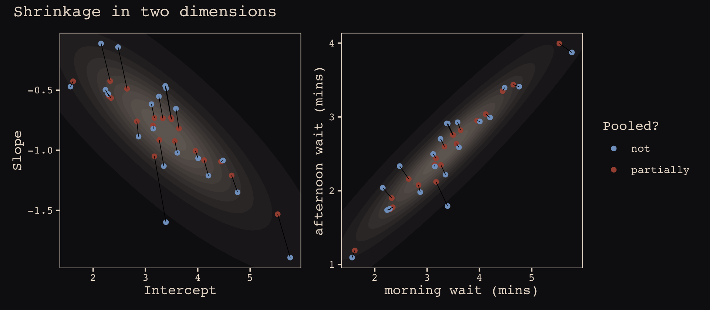
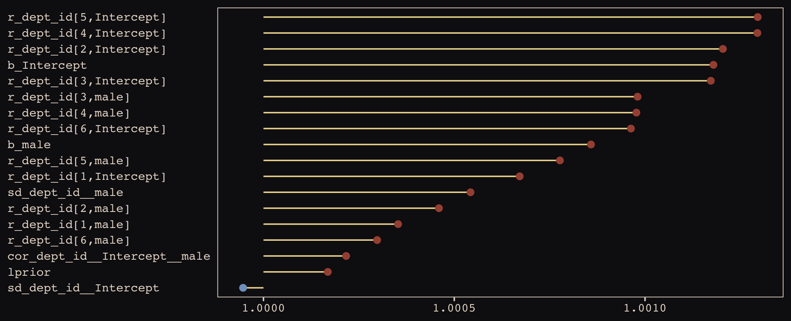
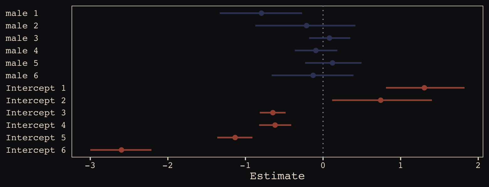
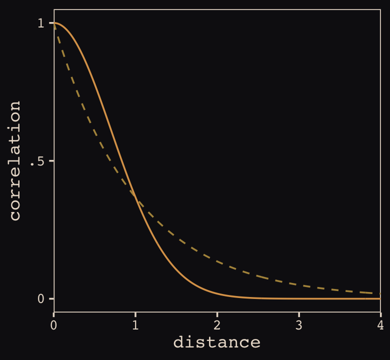
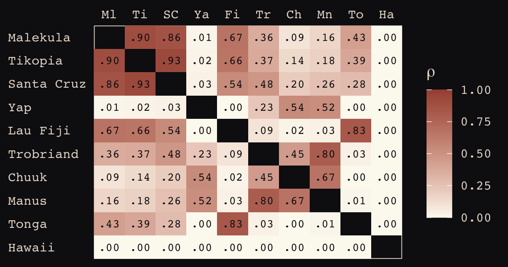
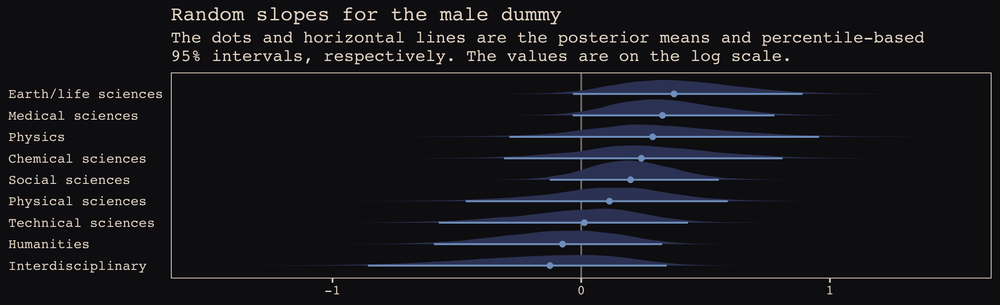

# Adventures in Covariance

> In this chapter, you'll see how to... specify **varying slopes** in combination with the varying intercepts of the previous chapter. This will enable pooling that will improve estimates of how different units respond to or are influenced by predictor variables. It will also improve estimates of intercepts, by borrowing information across parameter types. Essentially, varying slopes models are massive interaction machines. They allow every unit in the data to have its own unique response to any treatment or exposure or event, while also improving estimates via pooling. When the variation in slopes is large, the average slope is of less interest. Sometimes, the pattern of variation in slopes provides hints about omitted variables that explain why some units respond more or less. We'll see an example in this chapter.
>
> The machinery that makes such complex varying effects possible will be used later in the chapter to extend the varying effects strategy to more subtle model types, including the use of continuous categories, using **Gaussian process**. [@mcelreathStatisticalRethinkingBayesian2015, p. 388, **emphasis** in the original]

## Varying slopes by construction

> How should the robot pool information across intercepts and slopes? By modeling the joint population of intercepts and slopes, which means by modeling their covariance. In conventional multilevel models, the device that makes this possible is a joint multivariate Gaussian distribution for all of the varying effects, both intercepts and slopes. So instead of having two independent Gaussian distributions of intercepts and of slopes, the robot can do better by assigning a two-dimensional Gaussian distribution to both the intercepts (first dimension) and the slopes (second dimension). (p. 389)

#### Rethinking: Why Gaussian?

McElreath discussed how researchers might use other multivariate distributions to model multiple random effects. The only one he named as an alternative to the Gaussian was the multivariate Student's $t$. As it turns out, brms does currently allow users to use multivariate Student's $t$ in this way. For details, check out [this discussion from the brms GitHub repository](https://github.com/paul-buerkner/brms/issues/231). Bürkner's exemplar syntax from his comment on May 13, 2018, was `y ~ x + (x | gr(g, dist = "student"))`. I haven't experimented with this, but if you do, do consider [sharing how it went](https://github.com/ASKurz/Statistical_Rethinking_with_brms_ggplot2_and_the_tidyverse/issues).

### Simulate the population.

If you follow this section closely, it's a great template for simulating multilevel code for any of your future projects. You might think of this as an alternative to a frequentist power analysis. Vourre has done [some nice work along these lines](https://gitlab.com/vuorre/bayesplan), I have a [blog series](https://solomonkurz.netlify.app/blog/bayesian-power-analysis-part-i/) on Bayesian power analysis, and Kruschke covered the topic in Chapter 13 of his [-@kruschkeDoingBayesianData2015] [text](https://sites.google.com/site/doingbayesiandataanalysis/).


```r
a       <-  3.5  # average morning wait time
b       <- -1    # average difference afternoon wait time
sigma_a <-  1    # std dev in intercepts
sigma_b <-  0.5  # std dev in slopes
rho     <- -.7   # correlation between intercepts and slopes

# the next three lines of code simply combine the terms, above
mu     <- c(a, b)
cov_ab <- sigma_a * sigma_b * rho
sigma  <- matrix(c(sigma_a^2, cov_ab, 
                   cov_ab, sigma_b^2), ncol = 2)
```

If you haven't used `matirx()` before, you might get a sense of the elements like so.


```r
matrix(c(1, 2, 
         3, 4), nrow = 2, ncol = 2)
```

```
##      [,1] [,2]
## [1,]    1    3
## [2,]    2    4
```

This next block of code will finally yield our café data.


```r
library(tidyverse)

sigmas <- c(sigma_a, sigma_b)          # standard deviations
rho    <- matrix(c(1, rho,             # correlation matrix
                   rho, 1), nrow = 2)

# now matrix multiply to get covariance matrix
sigma <- diag(sigmas) %*% rho %*% diag(sigmas)

# how many cafes would you like?
n_cafes <- 20

set.seed(13)  # used to replicate example
vary_effects <- 
  MASS::mvrnorm(n_cafes, mu, sigma) %>% 
  data.frame() %>% 
  set_names("a_cafe", "b_cafe")

head(vary_effects)
```

```
##     a_cafe     b_cafe
## 1 2.917639 -0.8649154
## 2 3.552770 -1.6814372
## 3 1.694390 -0.4168858
## 4 3.442417 -0.6011724
## 5 2.289988 -0.7461953
## 6 3.069283 -0.8839639
```

Let's make sure we're keeping this all straight. ` a_cafe ` = our café-specific intercepts; `b_cafe ` = our café-specific slopes. These aren't the actual data, yet. But at this stage, it might make sense to ask *What's the distribution of `a_cafe` and `b_cafe`?* Our variant of Figure 13.2 contains the answer.

For our plots in this chapter, we'll make our own custom ggplot2 theme. The color palette will come from the "pearl_earring" palette of the [dutchmasters package](https://github.com/EdwinTh/dutchmasters) [@R-dutchmasters]. You can learn more about the original painting, Vermeer's [-@vermeerGirlPearlEarring1665] *Girl with a Pearl Earring*, [here](https://en.wikipedia.org/wiki/Girl_with_a_Pearl_Earring).


```r
# devtools::install_github("EdwinTh/dutchmasters")
library(dutchmasters)

dutchmasters$pearl_earring
```

```
##         red(lips)              skin      blue(scarf1)      blue(scarf2)      white(colar) 
##         "#A65141"         "#E7CDC2"         "#80A0C7"         "#394165"         "#FCF9F0" 
##       gold(dress)      gold(dress2) black(background)      grey(scarf3)    yellow(scarf4) 
##         "#B1934A"         "#DCA258"         "#100F14"         "#8B9DAF"         "#EEDA9D" 
##                   
##         "#E8DCCF"
```

We'll name our custom theme `theme_pearl_earring()`. I cobbled together this approach to defining a custom ggplot2 theme with help from [Chapter 17](https://ggplot2-book.org/programming.html) of Wichkam's [-@wickhamGgplot2ElegantGraphics2016] *ggplot2: Elegant graphics for data analysis*; [Section 4.6](https://bookdown.org/rdpeng/RProgDA/building-a-new-theme.html) of Peng, Kross, and Anderson's [-@pengMasteringSoftwareDevelopment2017] [*Mastering Software Development in R*](https://bookdown.org/rdpeng/RProgDA/); Lea Waniek's blog post, [*Custom themes in ggplot2*](https://www.statworx.com/de/blog/custom-themes-in-ggplot2/), and Joey Stanley's blog post of the same name, [*Custom themes in ggplot2*](https://joeystanley.com/blog/custom-themes-in-ggplot2).


```r
theme_pearl_earring <- function(light_color = "#E8DCCF", 
                                dark_color = "#100F14", 
                                my_family = "Courier",
                                ...) {
  
  theme(line = element_line(color = light_color),
        text = element_text(color = light_color, family = my_family),
        axis.text = element_text(color = light_color),
        axis.ticks = element_line(color = light_color),
        axis.line = element_blank(),
        legend.background = element_rect(fill = dark_color, color = "transparent"),
        legend.key = element_rect(fill = dark_color, color = "transparent"),
        panel.background = element_rect(fill = dark_color, color = light_color),
        panel.grid = element_blank(),
        plot.background = element_rect(fill = dark_color, color = dark_color),
        strip.background = element_rect(fill = dark_color, color = "transparent"),
        strip.text = element_text(color = light_color, family = my_family),
        ...)
  
}
```

Note how our custom `theme_pearl_earing()` function has a few adjustable parameters. Feel free to play around with alternative settings to see how they work. If we just use the defaults as we have defined them, here is our Figure 13.2.


```r
vary_effects %>% 
  ggplot(aes(x = a_cafe, y = b_cafe)) +
  geom_point(color = "#80A0C7") +
  geom_rug(color = "#8B9DAF", linewidth = 1/7) + 
  theme_pearl_earring()
```


Again, these are not "data." Figure 13.2 shows a distribution of *parameters*. Here's their Pearson's correlation coefficient.


```r
cor(vary_effects$a_cafe, vary_effects$b_cafe)
```

```
## [1] -0.7281604
```

### Simulate observations.

Here we put those simulated parameters to use and simulate actual data from them.


```r
n_visits <- 10
sigma    <-  0.5  # std dev within cafes

set.seed(13)  # used to replicate example
d <-
  vary_effects %>% 
  mutate(cafe = 1:n_cafes) %>% 
  select(cafe, a_cafe, b_cafe) %>% 
  expand_grid(visit = 1:n_visits) %>% 
  mutate(afternoon = rep(0:1, times = n() / 2)) %>% 
  mutate(mu = a_cafe + b_cafe * afternoon) %>% 
  mutate(wait = rnorm(n = n(), mean = mu, sd = sigma))
```

We might peek at the data.


```r
d %>%
  head()
```

```
## # A tibble: 6 × 7
##    cafe a_cafe b_cafe visit afternoon    mu  wait
##   <int>  <dbl>  <dbl> <int>     <int> <dbl> <dbl>
## 1     1   2.92 -0.865     1         0  2.92  3.19
## 2     1   2.92 -0.865     2         1  2.05  1.91
## 3     1   2.92 -0.865     3         0  2.92  3.81
## 4     1   2.92 -0.865     4         1  2.05  2.15
## 5     1   2.92 -0.865     5         0  2.92  3.49
## 6     1   2.92 -0.865     6         1  2.05  2.26
```

Now we've finally simulated our data, we are ready to make our version of Figure 13.1, from way back on page 388.


```r
d %>%
  mutate(afternoon = ifelse(afternoon == 0, "M", "A"),
         day       = rep(rep(1:5, each = 2), times = n_cafes)) %>%
  filter(cafe %in% c(3, 5)) %>%
  mutate(cafe = ifelse(cafe == 3, "cafe #3", "cafe #5")) %>%
  
  ggplot(aes(x = visit, y = wait, group = day)) +
  geom_point(aes(color = afternoon), size = 2) +
  geom_line(color = "#8B9DAF") +
  scale_color_manual(values = c("#80A0C7", "#EEDA9D")) +
  scale_x_continuous(NULL, breaks = 1:10,
                     labels = rep(c("M", "A"), times = 5)) +
  scale_y_continuous("wait time in minutes", limits = c(0, 4)) +
  theme_pearl_earring(axis.ticks.x = element_blank(),
                      legend.position = "none") +
  facet_wrap(~cafe, ncol = 1)
```


### The varying slopes model.

The statistical formula for our varying-slopes model follows the form

\begin{align*}
\text{wait}_i & \sim \operatorname{Normal}(\mu_i, \sigma) \\
\mu_i         & = \alpha_{\text{cafe}_i} + \beta_{\text{cafe}_i} \text{afternoon}_i \\
\begin{bmatrix} \alpha_\text{cafe} \\ \beta_\text{cafe} \end{bmatrix} & \sim \text{MVNormal} \left (\begin{bmatrix} \alpha \\ \beta \end{bmatrix}, \mathbf{S}  \right ) \\
\mathbf S     & = \begin{bmatrix} \sigma_\alpha & 0 \\ 0 & \sigma_\beta \end{bmatrix} \mathbf R \begin{bmatrix} \sigma_\alpha & 0 \\ 0 & \sigma_\beta \end{bmatrix} \\
\alpha        & \sim \operatorname{Normal}(0, 10) \\
\beta         & \sim \operatorname{Normal}(0, 10) \\
\sigma        & \sim \operatorname{HalfCauchy}(0, 1) \\
\sigma_\alpha & \sim \operatorname{HalfCauchy}(0, 1) \\
\sigma_\beta  & \sim \operatorname{HalfCauchy}(0, 1) \\
\mathbf R     & \sim \operatorname{LKJcorr}(2),
\end{align*}

where $\mathbf S$ is the covariance matrix and $\mathbf R$ is the corresponding correlation matrix, which we might more fully express as

$$\begin{bmatrix} 1 & \rho \\ \rho & 1 \end{bmatrix}.$$

And according to our prior, $\mathbf R$ is distributed as $\operatorname{LKJcorr}(2)$. We'll use `rethinking::rlkjcorr()` to get a better sense of what that even is.


```r
library(rethinking)

n_sim <- 1e5

set.seed(13)
r_1 <- 
  rlkjcorr(n_sim, K = 2, eta = 1) %>%
  as_tibble()

set.seed(13)
r_2 <- 
  rlkjcorr(n_sim, K = 2, eta = 2) %>%
  as_tibble()

set.seed(13)
r_4 <- 
  rlkjcorr(n_sim, K = 2, eta = 4) %>%
  as_tibble()
```

Here are the $\operatorname{LKJcorr}$ distributions of Figure 13.3.


```r
ggplot(data = r_1, aes(x = V2)) +
  geom_density(color = "transparent", fill = "#DCA258", alpha = 2/3) +
  geom_density(data = r_2,
               color = "transparent", fill = "#FCF9F0", alpha = 2/3) +
  geom_density(data = r_4,
               color = "transparent", fill = "#394165", alpha = 2/3) +
  annotate(geom = "text",
           x = c(.83, .62, .46), 
           y = c(.54, .74, 1),
           label = c("eta = 1", "eta = 2", "eta = 4"),
           color = "#A65141", family = "Courier") +
  scale_y_continuous(NULL, breaks = NULL) +
  xlab("correlation") +
  theme_pearl_earring()
```


As it turns out, the shape of the LKJ is sensitive to both $\eta$ and the $K$ dimensions of the correlation matrix. Our simulations only considered the shapes for when $K = 2$. We can use a combination of the `parse_dist()` and `stat_dist_halfeye()` functions from the tidybayes package to derive analytic solutions for different combinations of $\eta$ and $K$.


```r
library(tidybayes)

crossing(k   = 2:5,
         eta = 1:4) %>% 
  mutate(prior = str_c("lkjcorr_marginal(", k, ", ", eta, ")"),
         strip = str_c("K==", k)) %>% 
  parse_dist(prior) %>%
  
  ggplot(aes(y = eta, dist = .dist, args = .args)) +
  stat_dist_halfeye(.width = c(.5, .95),
                    color = "#FCF9F0", fill = "#A65141") +
  scale_x_continuous(expression(rho), limits = c(-1, 1),
                     breaks = c(-1, -.5, 0, .5, 1), labels = c("-1", "-.5", "0", ".5", "1")) +
  scale_y_continuous(expression(eta), breaks = 1:4) +
  ggtitle(expression("Marginal correlation for the LKJ prior relative to K and "*eta)) +
  theme_pearl_earring() +
  facet_wrap(~strip, labeller = label_parsed, ncol = 4)
```


To learn more about this method, check out Kay's [-@kayMarginalDistributionSingle2020] [*Marginal distribution of a single correlation from an LKJ distribution*](https://mjskay.github.io/ggdist/reference/lkjcorr_marginal.html).

Okay, let's get ready to model and switch out rethinking for brms.


```r
detach(package:rethinking, unload = T)
library(brms)
```

As defined above, our first model has both varying intercepts and `afternoon` slopes. I should point out that the `(1 + afternoon | cafe)` syntax specifies that we'd like `brm()` to fit the random effects for `1` (i.e., the intercept) and the `afternoon` slope as correlated. Had we wanted to fit a model in which they were orthogonal, we'd have coded `(1 + afternoon || cafe)`.


```r
 b13.1 <- 
  brm(data = d, 
      family = gaussian,
      wait ~ 1 + afternoon + (1 + afternoon | cafe),
      prior = c(prior(normal(0, 10), class = Intercept),
                prior(normal(0, 10), class = b),
                prior(cauchy(0, 2), class = sd),
                prior(cauchy(0, 2), class = sigma),
                prior(lkj(2), class = cor)),
      iter = 5000, warmup = 2000, chains = 2, cores = 2,
      seed = 13,
      file = "fits/b13.01")
```

With Figure 13.4, we assess how the posterior for the correlation of the random effects compares to its prior.


```r
post <- as_draws_df(b13.1)

post %>%
  ggplot() +
  geom_density(data = r_2, aes(x = V2),
               color = "transparent", fill = "#EEDA9D", alpha = 3/4) +
  geom_density(aes(x = cor_cafe__Intercept__afternoon),
               color = "transparent", fill = "#A65141", alpha = 9/10) +
  annotate(geom = "text", x = -0.35, y = 2.2, 
           label = "posterior", color = "#A65141", family = "Courier") +
  annotate(geom = "text", x = 0, y = 0.9, 
           label = "prior", color = "#EEDA9D", alpha = 2/3, family = "Courier") +
  scale_y_continuous(NULL, breaks = NULL) +
  xlab("correlation") +
  theme_pearl_earring()
```


McElreath then depicted multidimensional shrinkage by plotting the posterior mean of the varying effects compared to their raw, unpooled estimated. With brms, we can get the `cafe`-specific intercepts and `afternoon` slopes with `coef()`, which returns a three-dimensional list.


```r
# coef(b13.1) %>% glimpse()

coef(b13.1)
```

```
## $cafe
## , , Intercept
## 
##    Estimate Est.Error     Q2.5    Q97.5
## 1  3.264152 0.2054306 2.856593 3.663420
## 2  3.171314 0.2135359 2.762808 3.605026
## 3  1.617032 0.2097101 1.207495 2.025435
## 4  3.331933 0.2038336 2.924464 3.722960
## 5  2.299159 0.2030065 1.899495 2.697749
## 6  3.144850 0.2018861 2.755407 3.542957
## 7  2.648333 0.2012815 2.250670 3.051399
## 8  3.640319 0.2035993 3.244195 4.037975
## 9  4.120702 0.2022637 3.723236 4.522311
## 10 2.325241 0.2067415 1.916354 2.733323
## 11 4.444731 0.2045287 4.042212 4.845498
## 12 2.835501 0.1997422 2.447741 3.220322
## 13 4.647059 0.2035085 4.244429 5.045741
## 14 5.527745 0.2214770 5.095624 5.980944
## 15 3.560949 0.1972218 3.164427 3.938641
## 16 3.488296 0.1991375 3.090528 3.876482
## 17 2.342268 0.2044473 1.943363 2.740932
## 18 3.954771 0.2011337 3.562261 4.350963
## 19 3.499093 0.2044976 3.104029 3.896462
## 20 3.170478 0.1987109 2.782800 3.544180
## 
## , , afternoon
## 
##      Estimate Est.Error       Q2.5       Q97.5
## 1  -0.9142988 0.2155976 -1.3677176 -0.51276243
## 2  -1.0504440 0.2459940 -1.5789451 -0.63930031
## 3  -0.4258602 0.2379622 -0.8836442  0.04656344
## 4  -0.7336344 0.2111167 -1.1235821 -0.29296512
## 5  -0.5474818 0.2110726 -0.9511585 -0.11794255
## 6  -0.7940272 0.2052194 -1.2155531 -0.39421093
## 7  -0.4886853 0.2248187 -0.8850787 -0.01423931
## 8  -0.8202540 0.2068177 -1.2163233 -0.39055177
## 9  -1.0820327 0.2137773 -1.5320057 -0.67294853
## 10 -0.4240749 0.2282573 -0.8402959  0.06330586
## 11 -1.0939777 0.2191270 -1.5424487 -0.65860492
## 12 -0.7592564 0.2091867 -1.1853491 -0.35367952
## 13 -1.2098174 0.2257711 -1.6722250 -0.78310875
## 14 -1.5326382 0.2729757 -2.0755277 -1.00837038
## 15 -0.9230269 0.2035209 -1.3337513 -0.52555087
## 16 -0.7292686 0.2142010 -1.1123667 -0.27518149
## 17 -0.5652470 0.2130024 -0.9753989 -0.14211021
## 18 -1.0045348 0.2076975 -1.4281938 -0.59973714
## 19 -0.7427436 0.2125005 -1.1271396 -0.30137563
## 20 -0.7310919 0.2019114 -1.1196951 -0.31335383
```

Here's the code to extract the relevant elements from the `coef()` list, convert them to a tibble, and add the `cafe` index.


```r
partially_pooled_params <-
  # with this line we select each of the 20 cafe's posterior mean (i.e., Estimate)
  # for both `Intercept` and `afternoon`
  coef(b13.1)$cafe[ , 1, 1:2] %>%
  as_tibble() %>%               # convert the two vectors to a tibble
  rename(Slope = afternoon) %>%
  mutate(cafe = 1:nrow(.)) %>%  # add the `cafe` index
  select(cafe, everything())    # simply moving `cafe` to the leftmost position
```

Like McElreath, we'll compute the unpooled estimates directly from the data.


```r
# compute unpooled estimates directly from data
un_pooled_params <-
  d %>%
  # with these two lines, we compute the mean value for each cafe's wait time 
  # in the morning and then the afternoon
  group_by(afternoon, cafe) %>%
  summarise(mean = mean(wait)) %>%
  ungroup() %>%  # ungrouping allows us to alter afternoon, one of the grouping variables
  mutate(afternoon = ifelse(afternoon == 0, "Intercept", "Slope")) %>%
  spread(key = afternoon, value = mean) %>%  # use `spread()` just as in the previous block
  mutate(Slope = Slope - Intercept)          # finally, here's our slope!

# here we combine the partially-pooled and unpooled means into a single data object, 
# which will make plotting easier.
params <-
  # `bind_rows()` will stack the second tibble below the first
  bind_rows(partially_pooled_params, un_pooled_params) %>%
  # index whether the estimates are pooled
  mutate(pooled = rep(c("partially", "not"), each = nrow(.)/2)) 

# here's a glimpse at what we've been working for
params %>%
  slice(c(1:5, 36:40))
```

```
## # A tibble: 10 × 4
##     cafe Intercept  Slope pooled   
##    <int>     <dbl>  <dbl> <chr>    
##  1     1      3.26 -0.914 partially
##  2     2      3.17 -1.05  partially
##  3     3      1.62 -0.426 partially
##  4     4      3.33 -0.734 partially
##  5     5      2.30 -0.547 partially
##  6    16      3.38 -0.465 not      
##  7    17      2.29 -0.531 not      
##  8    18      4.01 -1.07  not      
##  9    19      3.39 -0.484 not      
## 10    20      3.12 -0.617 not
```

Finally, here's our code for Figure 13.5.a, showing shrinkage in two dimensions.


```r
p1 <-
  ggplot(data = params, aes(x = Intercept, y = Slope)) +
  stat_ellipse(geom = "polygon", type = "norm", level = 1/10, linewidth = 0, alpha = 1/20, fill = "#E7CDC2") +
  stat_ellipse(geom = "polygon", type = "norm", level = 2/10, linewidth = 0, alpha = 1/20, fill = "#E7CDC2") +
  stat_ellipse(geom = "polygon", type = "norm", level = 3/10, linewidth = 0, alpha = 1/20, fill = "#E7CDC2") +
  stat_ellipse(geom = "polygon", type = "norm", level = 4/10, linewidth = 0, alpha = 1/20, fill = "#E7CDC2") +
  stat_ellipse(geom = "polygon", type = "norm", level = 5/10, linewidth = 0, alpha = 1/20, fill = "#E7CDC2") +
  stat_ellipse(geom = "polygon", type = "norm", level = 6/10, linewidth = 0, alpha = 1/20, fill = "#E7CDC2") +
  stat_ellipse(geom = "polygon", type = "norm", level = 7/10, linewidth = 0, alpha = 1/20, fill = "#E7CDC2") +
  stat_ellipse(geom = "polygon", type = "norm", level = 8/10, linewidth = 0, alpha = 1/20, fill = "#E7CDC2") +
  stat_ellipse(geom = "polygon", type = "norm", level = 9/10, linewidth = 0, alpha = 1/20, fill = "#E7CDC2") +
  stat_ellipse(geom = "polygon", type = "norm", level = .99,  linewidth = 0, alpha = 1/20, fill = "#E7CDC2") +
  geom_point(aes(group = cafe, color = pooled)) +
  geom_line(aes(group = cafe), linewidth = 1/4) +
  scale_color_manual("Pooled?",
                     values = c("#80A0C7", "#A65141")) +
  coord_cartesian(xlim = range(params$Intercept),
                  ylim = range(params$Slope)) +
  theme_pearl_earring()

p1
```


Learn more about `stat_ellipse()`, [here](https://ggplot2.tidyverse.org/reference/stat_ellipse.html). Let's prep for Figure 13.5.b.


```r
# retrieve the partially-pooled estimates with `coef()`
partially_pooled_estimates <-
  coef(b13.1)$cafe[ , 1, 1:2] %>%
  # convert the two vectors to a tibble
  as_tibble() %>%
  # the Intercept is the wait time for morning (i.e., `afternoon == 0`)
  rename(morning = Intercept) %>%
  # `afternoon` wait time is the `morning` wait time plus the afternoon slope
  mutate(afternoon = morning + afternoon,
         cafe      = 1:n()) %>%  # add the `cafe` index
  select(cafe, everything()) 

# compute unpooled estimates directly from data
un_pooled_estimates <-
  d %>%
  # as above, with these two lines, we compute each cafe's mean wait value by time of day
  group_by(afternoon, cafe) %>% 
  summarise(mean = mean(wait)) %>%
  # ungrouping allows us to alter the grouping variable, afternoon
  ungroup() %>% 
  mutate(afternoon = ifelse(afternoon == 0, "morning", "afternoon")) %>%
  # this seperates out the values into morning and afternoon columns
  spread(key = afternoon, value = mean)

estimates <-
  bind_rows(partially_pooled_estimates, un_pooled_estimates) %>%
  mutate(pooled = rep(c("partially", "not"), each = n() / 2))
```

The code for Figure 13.5.b.


```r
p2 <-
  ggplot(data = estimates, aes(x = morning, y = afternoon)) +
  # nesting `stat_ellipse()` within `mapply()` is a less redundant way to produce the 
  # ten-layered semitransparent ellipses we did with ten lines of `stat_ellipse()` 
  # functions in the previous plot
  mapply(function(level) {
    stat_ellipse(geom = "polygon", type = "norm",
                 linewidth = 0, alpha = 1/20, fill = "#E7CDC2",
                 level = level)
    }, 
    # enter the levels here
    level = c(seq(from = 1/10, to = 9/10, by = 1/10), .99)) +
  geom_point(aes(group = cafe, color = pooled)) +
  geom_line(aes(group = cafe), linewidth = 1/4) +
  scale_color_manual("Pooled?", values = c("#80A0C7", "#A65141")) +
  labs(x = "morning wait (mins)",
       y = "afternoon wait (mins)") +
  coord_cartesian(xlim = range(estimates$morning),
                  ylim = range(estimates$afternoon)) +
  theme_pearl_earring()
```

Here we bind the two subplots together with patchwork syntax.


```r
library(patchwork)

(p1 + theme(legend.position = "none")) + 
  p2 + 
  plot_annotation(title = "Shrinkage in two dimensions",
                  theme = theme_pearl_earring())
```



## Example: Admission decisions and gender

Let's revisit the infamous UCB admissions data.


```r
library(rethinking)
data(UCBadmit)
d <- UCBadmit
```

Here we detach rethinking, reload brms, and augment the data a bit.


```r
detach(package:rethinking, unload = T)
library(brms)
rm(UCBadmit)

d <- 
  d %>%
  mutate(male    = ifelse(applicant.gender == "male", 1, 0),
         dept_id = rep(1:6, each = 2))
```

### Varying intercepts.

The statistical formula for our varying-intercepts logistic regression model follows the form

\begin{align*}
\text{admit}_i         & \sim \operatorname{Binomial}(n_i, p_i) \\
\operatorname{logit}(p_i)           & = \color{blue}{\alpha_{\text{dept_id}_i}} + \beta \text{male}_i \\
\color{blue}{\alpha_\text{dept_id}} & \color{blue}\sim \color{blue}{\operatorname{Normal}(\alpha, \sigma)} \\
\alpha                 & \sim \operatorname{Normal}(0, 10) \\
\beta                  & \sim \operatorname{Normal}(0, 1) \\
\sigma                 & \sim \operatorname{HalfCauchy}(0, 2). \\
\end{align*}

Since there's only one left-hand term in our `(1 | dept_id)` code, there's only one random effect.


```r
b13.2 <- 
  brm(data = d, 
      family = binomial,
      admit | trials(applications) ~ 1 + male + (1 | dept_id),
      prior = c(prior(normal(0, 10), class = Intercept),
                prior(normal(0, 1), class = b),
                prior(cauchy(0, 2), class = sd)),
      iter = 4500, warmup = 500, chains = 3, cores = 3,
      seed = 13,
      control = list(adapt_delta = .9),
      file = "fits/b13.02")
```

Since we don't have a `depth=2` argument in `brms::summary()`, we'll have to get creative. One way to look at the parameters is by executing `b13.2$fit`.


```r
b13.2$fit
```

```
## Inference for Stan model: 087f21525a818e8e5955167756339d8e.
## 3 chains, each with iter=4500; warmup=500; thin=1; 
## post-warmup draws per chain=4000, total post-warmup draws=12000.
## 
##                          mean se_mean   sd   2.5%    25%    50%    75%  97.5% n_eff Rhat
## b_Intercept             -0.60    0.02 0.65  -1.98  -0.95  -0.58  -0.22   0.70  1833    1
## b_male                  -0.10    0.00 0.08  -0.25  -0.15  -0.10  -0.04   0.06  5374    1
## sd_dept_id__Intercept    1.47    0.01 0.57   0.77   1.09   1.35   1.70   2.90  1757    1
## r_dept_id[1,Intercept]   1.27    0.02 0.65  -0.01   0.89   1.26   1.63   2.65  1828    1
## r_dept_id[2,Intercept]   1.23    0.02 0.65  -0.05   0.84   1.21   1.58   2.59  1876    1
## r_dept_id[3,Intercept]   0.01    0.02 0.65  -1.28  -0.37   0.00   0.37   1.39  1846    1
## r_dept_id[4,Intercept]  -0.02    0.02 0.65  -1.31  -0.40  -0.04   0.34   1.34  1842    1
## r_dept_id[5,Intercept]  -0.46    0.02 0.66  -1.76  -0.84  -0.47  -0.10   0.91  1855    1
## r_dept_id[6,Intercept]  -2.01    0.02 0.66  -3.32  -2.40  -2.02  -1.64  -0.64  1895    1
## lprior                  -5.74    0.01 0.27  -6.44  -5.84  -5.67  -5.56  -5.43  1792    1
## lp__                   -61.86    0.05 2.53 -67.84 -63.28 -61.53 -60.06 -57.92  2355    1
## 
## Samples were drawn using NUTS(diag_e) at Wed Jan 18 14:03:54 2023.
## For each parameter, n_eff is a crude measure of effective sample size,
## and Rhat is the potential scale reduction factor on split chains (at 
## convergence, Rhat=1).
```

However, notice that the group-specific parameters don't match up with those in the text. Though our `r_dept_id[1,Intercept]` had a posterior mean of 1.25, the number for `a_dept[1]` in the text is 0.67. This is because the brms package presented the random effects in the **non-centered** metric. The rethinking package, in contrast, presented the random effects in the **centered** metric. On page 399, McElreath wrote:

> Remember, the values above are the $\alpha_\text{DEPT}$ estimates, and so they are deviations from the global mean $\alpha$, which in this case has posterior mean -0.58. So department A, "[1]" in the table, has the highest average admission rate. Department F, "[6]" in the table, has the lowest.

Here's another fun fact:


```r
# numbers taken from the mean column on page 399 in the text
c(0.67, 0.63, -0.59, -0.62, -1.06, -2.61) %>% mean()
```

```
## [1] -0.5966667
```

The average of the rethinking-based **centered** random effects is within rounding error of the global mean, -0.58. If you want the random effects in the **centered** metric from brms, you can use the `coef()` function.


```r
coef(b13.2)
```

```
## $dept_id
## , , Intercept
## 
##     Estimate  Est.Error       Q2.5      Q97.5
## 1  0.6750643 0.09807817  0.4853907  0.8676574
## 2  0.6297474 0.11648486  0.4045038  0.8585912
## 3 -0.5824187 0.07486556 -0.7270534 -0.4350792
## 4 -0.6163056 0.08519644 -0.7820147 -0.4503993
## 5 -1.0584966 0.09845505 -1.2512116 -0.8645875
## 6 -2.6088486 0.15763256 -2.9291503 -2.3077533
## 
## , , male
## 
##      Estimate  Est.Error       Q2.5     Q97.5
## 1 -0.09520264 0.08046655 -0.2498376 0.0593416
## 2 -0.09520264 0.08046655 -0.2498376 0.0593416
## 3 -0.09520264 0.08046655 -0.2498376 0.0593416
## 4 -0.09520264 0.08046655 -0.2498376 0.0593416
## 5 -0.09520264 0.08046655 -0.2498376 0.0593416
## 6 -0.09520264 0.08046655 -0.2498376 0.0593416
```

And just to confirm, the average of the posterior means of the `Intercept` random effects with `brms::coef()` is also the global mean within rounding error.


```r
mean(coef(b13.2)$dept_id[ , "Estimate", "Intercept"])
```

```
## [1] -0.593543
```

Note how `coef()` returned a three-dimensional list.


```r
coef(b13.2) %>% str()
```

```
## List of 1
##  $ dept_id: num [1:6, 1:4, 1:2] 0.675 0.63 -0.582 -0.616 -1.058 ...
##   ..- attr(*, "dimnames")=List of 3
##   .. ..$ : chr [1:6] "1" "2" "3" "4" ...
##   .. ..$ : chr [1:4] "Estimate" "Est.Error" "Q2.5" "Q97.5"
##   .. ..$ : chr [1:2] "Intercept" "male"
```

If you just want the parameter summaries for the random intercepts, you have to use three-dimensional indexing.


```r
coef(b13.2)$dept_id[ , , "Intercept"]  # this also works: coef(b13.2)$dept_id[ , , 1]
```

```
##     Estimate  Est.Error       Q2.5      Q97.5
## 1  0.6750643 0.09807817  0.4853907  0.8676574
## 2  0.6297474 0.11648486  0.4045038  0.8585912
## 3 -0.5824187 0.07486556 -0.7270534 -0.4350792
## 4 -0.6163056 0.08519644 -0.7820147 -0.4503993
## 5 -1.0584966 0.09845505 -1.2512116 -0.8645875
## 6 -2.6088486 0.15763256 -2.9291503 -2.3077533
```

So to get our brms summaries in a similar format to those in the text, we'll have to combine `coef()` with `fixef()` and `VarCorr()`.


```r
rbind(coef(b13.2)$dept_id[, , "Intercept"],
      fixef(b13.2),
      VarCorr(b13.2)$dept_id$sd)
```

```
##              Estimate  Est.Error       Q2.5      Q97.5
## 1          0.67506427 0.09807817  0.4853907  0.8676574
## 2          0.62974741 0.11648486  0.4045038  0.8585912
## 3         -0.58241868 0.07486556 -0.7270534 -0.4350792
## 4         -0.61630557 0.08519644 -0.7820147 -0.4503993
## 5         -1.05849655 0.09845505 -1.2512116 -0.8645875
## 6         -2.60884861 0.15763256 -2.9291503 -2.3077533
## Intercept -0.59563853 0.65350047 -1.9811816  0.7040740
## male      -0.09520264 0.08046655 -0.2498376  0.0593416
## Intercept  1.47252122 0.57072321  0.7703414  2.9004654
```

A little more data wrangling will make the summaries easier to read.


```r
rbind(coef(b13.2)$dept_id[, , "Intercept"],
      fixef(b13.2),
      VarCorr(b13.2)$dept_id$sd) %>% 
  as_tibble() %>% 
  mutate(parameter = c(str_c("Intercept[", 1:6, "]"), 
                       "Intercept", "male", "sigma")) %>% 
  select(parameter, everything()) %>% 
  mutate_if(is_double, round, digits = 2)
```

```
## # A tibble: 9 × 5
##   parameter    Estimate Est.Error  Q2.5 Q97.5
##   <chr>           <dbl>     <dbl> <dbl> <dbl>
## 1 Intercept[1]     0.68      0.1   0.49  0.87
## 2 Intercept[2]     0.63      0.12  0.4   0.86
## 3 Intercept[3]    -0.58      0.07 -0.73 -0.44
## 4 Intercept[4]    -0.62      0.09 -0.78 -0.45
## 5 Intercept[5]    -1.06      0.1  -1.25 -0.86
## 6 Intercept[6]    -2.61      0.16 -2.93 -2.31
## 7 Intercept       -0.6       0.65 -1.98  0.7 
## 8 male            -0.1       0.08 -0.25  0.06
## 9 sigma            1.47      0.57  0.77  2.9
```

If you'd like the $\widehat R$ and effective sample size summaries for those parameters, you'll have to use the `posterior::summarise_draws()` trick from last chapter.


```r
library(posterior)

b13.2 %>% 
  summarise_draws() %>% 
  mutate_if(is.double, round, digits = 2)
```

```
## # A tibble: 11 × 10
##    variable                 mean median    sd   mad     q5    q95  rhat ess_bulk ess_tail
##    <chr>                   <dbl>  <dbl> <dbl> <dbl>  <dbl>  <dbl> <dbl>    <dbl>    <dbl>
##  1 b_Intercept             -0.6   -0.58  0.65  0.54  -1.64   0.45     1    1926.    2486.
##  2 b_male                  -0.1   -0.1   0.08  0.08  -0.23   0.03     1    5395.    5312.
##  3 sd_dept_id__Intercept    1.47   1.35  0.57  0.43   0.83   2.52     1    1961.    3042.
##  4 r_dept_id[1,Intercept]   1.27   1.26  0.65  0.55   0.23   2.33     1    1922.    2500.
##  5 r_dept_id[2,Intercept]   1.23   1.21  0.65  0.55   0.19   2.28     1    1976.    2627.
##  6 r_dept_id[3,Intercept]   0.01   0     0.65  0.54  -1.04   1.06     1    1943.    2468.
##  7 r_dept_id[4,Intercept]  -0.02  -0.04  0.65  0.54  -1.07   1.03     1    1938.    2504.
##  8 r_dept_id[5,Intercept]  -0.46  -0.47  0.66  0.55  -1.51   0.6      1    1950.    2506.
##  9 r_dept_id[6,Intercept]  -2.01  -2.02  0.66  0.56  -3.07  -0.96     1    1989.    2683.
## 10 lprior                  -5.74  -5.67  0.27  0.2   -6.25  -5.45     1    1964.    3019.
## 11 lp__                   -61.9  -61.5   2.53  2.35 -66.5  -58.4      1    2418.    4310.
```

But note how, just as with `b13.2$fit`, this approach summarizes the posterior with the **non-centered** parameterization. Which is a fine parameterization. It's just a little different from what you'll get when using `precis( m13.2 , depth=2 )`, as in the text.

### Varying effects of being `male`.

Now we're ready to allow our `male` dummy to varies, too, the statistical model follows the form

\begin{align*}
\text{admit}_i     & \sim \operatorname{Binomial}(n_i, p_i) \\
\text{logit} (p_i) & = \color{blue}{\alpha_{\text{dept_id}_i}} + \color{blue}{\beta_{\text{dept_id}_i}} \text{male}_i \\
\color{blue}{\begin{bmatrix} \alpha_\text{dept_id} \\ \beta_\text{dept_id} \end{bmatrix}} & \color{blue}\sim \color{blue}{\text{MVNormal} \left (\begin{bmatrix} \alpha \\ \beta \end{bmatrix}, \mathbf{S}  \right )} \\
\mathbf S & = \begin{bmatrix} \sigma_\alpha & 0 \\ 0 & \sigma_\beta \end{bmatrix} \mathbf R \begin{bmatrix} \sigma_\alpha & 0 \\ 0 & \sigma_\beta \end{bmatrix} \\
\alpha                      & \sim \operatorname{Normal}(0, 10) \\
\beta                       & \sim \operatorname{Normal}(0, 1) \\
\sigma_\alpha, \sigma_\beta & \sim \operatorname{HalfCauchy}(0, 2) \\
\mathbf R                   & \sim \operatorname{LKJcorr}(2).
\end{align*}

Fit the model.


```r
b13.3 <- 
  brm(data = d, 
      family = binomial,
      admit | trials(applications) ~ 1 + male + (1 + male | dept_id),
      prior = c(prior(normal(0, 10), class = Intercept),
                prior(normal(0, 1), class = b),
                prior(cauchy(0, 2), class = sd),
                prior(lkj(2), class = cor)),
      iter = 5000, warmup = 1000, chains = 4, cores = 4,
      seed = 13,
      control = list(adapt_delta = .95),
      file = "fits/b13.03")
```

McElreath encouraged us to make sure the chains look good. Instead of relying on convenience functions, let's do it by hand.


```r
post <- as_draws_df(b13.3)

post %>% 
  gather(key, value, b_Intercept:`r_dept_id[6,male]`) %>% 
  mutate(.chain = as.character(.chain)) %>%

  ggplot(aes(x = .iteration, y = value, group = .chain, color = .chain)) +
  geom_line(linewidth = 1/15) +
  scale_color_manual(values = c("#80A0C7", "#B1934A", "#A65141", "#EEDA9D")) +
  scale_x_continuous(NULL, breaks = c(1, 2000, 4000)) +
  ylab(NULL) +
  theme_pearl_earring(legend.direction = "horizontal",
                      legend.position = c(.825, .06)) +
  facet_wrap(~key, ncol = 3, scales = "free_y")
```


Our chains look great. While we're at it, let's examine the $\widehat R$ vales in a handmade plot, too.


```r
brms::rhat(b13.3) %>% 
  data.frame() %>% 
  rownames_to_column() %>% 
  set_names("parameter", "rhat") %>% 
  filter(parameter != "lp__") %>% 
  
  ggplot(aes(x = rhat, y = reorder(parameter, rhat))) + 
  geom_segment(aes(xend = 1, yend = parameter),
               color = "#EEDA9D") +
  geom_point(aes(color = rhat > 1), 
             size = 2) +
  scale_color_manual(values = c("#80A0C7", "#A65141")) +
  labs(x = NULL, y = NULL) +
  theme_pearl_earring(axis.ticks.y = element_blank(),
                      axis.text.y = element_text(hjust = 0),
                      legend.position = "none")
```



Them are some respectable $\widehat R$ values. The plot accentuates their differences, but they're all basically 1 (e.g., see what happens if you set `coord_cartesian(xlim = c(0.99, 1.01))`). Here are the random effects in the **centered** metric.


```r
coef(b13.3)
```

```
## $dept_id
## , , Intercept
## 
##     Estimate  Est.Error       Q2.5      Q97.5
## 1  1.3056409 0.25378073  0.8104773  1.8237607
## 2  0.7431019 0.32109298  0.1173298  1.4028509
## 3 -0.6467535 0.08473334 -0.8155883 -0.4824797
## 4 -0.6181311 0.10401423 -0.8236117 -0.4102018
## 5 -1.1329946 0.11543263 -1.3634324 -0.9100757
## 6 -2.5976297 0.20070301 -2.9996910 -2.2116181
## 
## , , male
## 
##      Estimate Est.Error       Q2.5      Q97.5
## 1 -0.79433219 0.2666824 -1.3311962 -0.2705477
## 2 -0.21268693 0.3224696 -0.8736666  0.4169950
## 3  0.08261838 0.1367074 -0.1797585  0.3509628
## 4 -0.09274751 0.1404094 -0.3646545  0.1847721
## 5  0.12177445 0.1866397 -0.2327208  0.4960941
## 6 -0.12819886 0.2673639 -0.6623994  0.3926533
```

We may as well keep our doing-things-by-hand kick going. Instead relying on `bayesplog::mcmc_intervals()` or `tidybayes::pointinterval()` to make our coefficient plot, we’ll use `geom_pointrange()`. But we will need to wrangle a bit to get those brms-based **centered** random effects into a usefully-formatted tidy tibble.


```r
# as far as I can tell, because `coef()` yields a list, you have to take out the two 
# random effects one at a time and then bind them together to get them ready for a tibble
rbind(coef(b13.3)$dept_id[, , 1],
      coef(b13.3)$dept_id[, , 2]) %>% 
  as_tibble() %>% 
  mutate(param   = c(str_c("Intercept ", 1:6), str_c("male ", 1:6)),
         reorder = c(6:1, 12:7)) %>% 

  # plot
  ggplot(aes(y = reorder(param, reorder))) +
  geom_vline(xintercept = 0, linetype = 3, color = "#8B9DAF") +
  geom_pointrange(aes(xmin = Q2.5, xmax = Q97.5, x = Estimate, color = reorder < 7),
                  shape = 20, linewidth = 3/4) +
  scale_color_manual(values = c("#394165", "#A65141")) +
  ylab(NULL) +
  theme_pearl_earring(axis.ticks.y = element_blank(),
                      axis.text.y = element_text(hjust = 0),
                      legend.position = "none")
```



Just like in the text, our `male` slopes are much less dispersed than our intercepts.

### Shrinkage.

Figure 13.6.a depicts the correlation between the full UCB model's varying intercepts and slopes.


```r
post <- as_draws_df(b13.3)

post %>% 
  ggplot(aes(x = cor_dept_id__Intercept__male, y = 0)) +
  stat_halfeye(point_interval = median_qi, .width = .95, 
               fill = "#394165", color = "#8B9DAF") +
  scale_x_continuous(breaks = c(-1, median(post$cor_dept_id__Intercept__male), 1),
                     labels = c(-1, "-.35", 1), limits = c(-1, 1)) +
  scale_y_continuous(NULL, breaks = NULL) +
  labs(subtitle = "The dot is at the median; the\nhorizontal bar is the 95% CI.",
       x = "correlation") +
  theme_pearl_earring()
```


Much like for Figure 13.5.b, above, it'll take a little data processing before we're ready to reproduce Figure 13.6.b.


```r
# here we put the partially-pooled estimate summaries in a tibble
partially_pooled_params <-
  coef(b13.3)$dept_id[ , 1, ] %>%
  as_tibble() %>%
  set_names("intercept", "slope") %>%
  mutate(dept = 1:n()) %>%
  select(dept, everything())

# in order to calculate the unpooled estimates from the data, we'll need a function that 
# can convert probabilities into the logit metric. if you do the algebra, this is just
# a transformation of the `inv_logit_scaled()` function.
prob_to_logit <- function(x) {
  -log((1 / x) -1)
}

# compute unpooled estimates directly from data
un_pooled_params <-
  d %>%
  group_by(male, dept_id) %>%
  summarise(prob_admit = mean(admit / applications)) %>%
  ungroup() %>%
  mutate(male = ifelse(male == 0, "intercept", "slope")) %>%
  spread(key = male, value = prob_admit) %>%
  rename(dept = dept_id) %>%
  # here we put our `prob_to_logit()` function to work
  mutate(intercept = prob_to_logit(intercept),
         slope     = prob_to_logit(slope)) %>%
  mutate(slope = slope - intercept)

# here we combine the partially-pooled and unpooled means into a single data object
params <-
  bind_rows(partially_pooled_params, un_pooled_params) %>%
  mutate(pooled = rep(c("partially", "not"), each = n() / 2)) %>%
  mutate(dept_letter = rep(LETTERS[1:6], times = 2))  # this will help with plotting

params
```

```
## # A tibble: 12 × 5
##     dept intercept   slope pooled    dept_letter
##    <int>     <dbl>   <dbl> <chr>     <chr>      
##  1     1     1.31  -0.794  partially A          
##  2     2     0.743 -0.213  partially B          
##  3     3    -0.647  0.0826 partially C          
##  4     4    -0.618 -0.0927 partially D          
##  5     5    -1.13   0.122  partially E          
##  6     6    -2.60  -0.128  partially F          
##  7     1     1.54  -1.05   not       A          
##  8     2     0.754 -0.220  not       B          
##  9     3    -0.660  0.125  not       C          
## 10     4    -0.622 -0.0820 not       D          
## 11     5    -1.16   0.200  not       E          
## 12     6    -2.58  -0.189  not       F
```

Here's our version of Figure 13.6.b, depicting two-dimensional shrinkage for the partially-pooled multilevel estimates (posterior means) relative to the unpooled coefficients, calculated from the data. The `ggrepel::geom_text_repel()` function will help us with the in-plot labels.


```r
library(ggrepel)

ggplot(data = params, aes(x = intercept, y = slope)) +
  mapply(function(level) {
    stat_ellipse(geom = "polygon", type = "norm",
                 linewidth = 0, alpha = 1/20, fill = "#E7CDC2",
                 level = level)
    },  
    level = c(seq(from = 1/10, to = 9/10, by = 1/10), .99)) +
  geom_point(aes(group = dept, color = pooled)) +
  geom_line(aes(group = dept), linewidth = 1/4) +
  scale_color_manual("Pooled?",
                     values = c("#80A0C7", "#A65141")) +
  geom_text_repel(data = params %>% filter(pooled == "partially"),
                  aes(label = dept_letter),
                  color = "#E8DCCF", size = 4, family = "Courier", seed = 13.6) +
  labs(x = expression("intercept ("*alpha[dept_id]*")"),
       y = expression("slope ("*beta[dept_id]*")")) +
  coord_cartesian(xlim = range(params$intercept),
                  ylim = range(params$slope)) +
  theme_pearl_earring()
```


### Model comparison.

Fit the no-gender model.


```r
b13.4 <- 
  brm(data = d, 
      family = binomial,
      admit | trials(applications) ~ 1 + (1 | dept_id),
      prior = c(prior(normal(0, 10), class = Intercept),
                prior(cauchy(0, 2), class = sd)),
      iter = 5000, warmup = 1000, chains = 4, cores = 4,
      seed = 13,
      control = list(adapt_delta = .99),
      file = "fits/b13.04")
```

Compare the three models by the WAIC.


```r
b13.2 <- add_criterion(b13.2, "waic")
b13.3 <- add_criterion(b13.3, "waic")
b13.4 <- add_criterion(b13.4, "waic")

loo_compare(b13.2, b13.3, b13.4, criterion = "waic") %>% 
  print(simplify = F)
```

```
##       elpd_diff se_diff elpd_waic se_elpd_waic p_waic se_p_waic waic  se_waic
## b13.3   0.0       0.0   -45.4       2.3          6.7    1.4      90.8   4.7  
## b13.4  -7.0       7.6   -52.5       9.0          6.4    2.3     104.9  18.0  
## b13.2  -8.8       6.7   -54.2       8.2          9.4    2.9     108.5  16.4
```

In terms of the WAIC estimates and $\text{elpd}$ differences, the models are similar. The story changes when we look at the WAIC weights.


```r
model_weights(b13.2, b13.3, b13.4, weights = "waic") %>% 
  round(digits = 3)
```

```
## b13.2 b13.3 b13.4 
## 0.000 0.999 0.001
```

> The varying slopes model, [`b13.3`], dominates [the other two]. This is despite the fact that the *average* slope in [`b13.3`] is nearly zero. The average isn't what matters, however. It is the individual slopes, one for each department, that matter. If we wish to generalize to new departments, the variation in slopes suggest that it'll be worth paying attention to gender, even if the average slope is nearly zero in the population. (pp. 402--403, *emphasis* in the original)

### More slopes.

> The varying slopes strategy generalizes to as many slopes as you like, within practical limits. All that happens is that each new predictor you want to construct varying slopes for adds one more dimension to the covariance matrix of the varying effects prior. So this means one more standard deviation parameter and one more dimension to the correlation matrix. (p. 403)

## Example: Cross-classified `chimpanzees` with varying slopes

Retrieve the `chimpanzees` data.


```r
library(rethinking)
data(chimpanzees)
d <- chimpanzees
```


```r
detach(package:rethinking, unload = T)
library(brms)
rm(chimpanzees)

d <-
  d %>%
  select(-recipient) %>%
  mutate(block_id = block)
```

My maths aren't the best. But if I'm following along correctly, here's a fuller statistical expression of our cross-classified model.

\begin{align*}
\text{pulled_left}_i      & \sim \operatorname{Binomial}(n = 1, p_i) \\
\operatorname{logit}(p_i) & = \alpha_i + (\beta_{1i} + \beta_{2i} \text{condition}_i) \text{prosoc_left}_i  \\
\alpha_i                  & = \alpha + \alpha_{\text{actor}_i} + \alpha_{\text{block_id}_i} \\
\beta_{1i}                & = \beta_1 + \beta_{1, \text{actor}_i} + \beta_{1, \text{block_id}_i} \\
\beta_{2i}                & = \beta_2 + \beta_{2, \text{actor}_i} + \beta_{2, \text{block_id}_i} \\
\begin{bmatrix} \alpha_\text{actor} \\ \beta_{1, \text{actor}} \\ \beta_{2, \text{actor}} \end{bmatrix} & \sim \operatorname{MVNormal} \left ( \begin{bmatrix}0 \\ 0 \\ 0 \end{bmatrix} , \mathbf{S}_\text{actor} \right ) \\
\begin{bmatrix} \alpha_\text{block_id} \\ \beta_{1, \text{block_id}} \\ \beta_{2, \text{block_id}} \end{bmatrix} & \sim \operatorname{MVNormal} \left ( \begin{bmatrix}0 \\ 0 \\ 0 \end{bmatrix} , \mathbf{S}_\text{block_id} \right ) \\

\mathbf S_\text{actor}    & = \begin{bmatrix} \sigma_{\alpha_\text{actor}} & 0 & 0 \\ 0 & \sigma_{\beta_{1_\text{actor}}} & 0 \\ 0 & 0 & \sigma_{\beta_{2_\text{actor}}} \end{bmatrix} 
\mathbf R_\text{actor} \begin{bmatrix} \sigma_{\alpha_\text{actor}} & 0 & 0 \\ 0 & \sigma_{\beta_{1_\text{actor}}} & 0 \\ 0 & 0 & \sigma_{\beta_{2_\text{actor}}} \end{bmatrix} \\
\mathbf S_\text{block_id} & = \begin{bmatrix} \sigma_{\alpha_\text{block_id}} & 0 & 0 \\ 0 & \sigma_{\beta_{1_\text{block_id}}} & 0 \\ 0 & 0 & \sigma_{\beta_{2_\text{block_id}}} \end{bmatrix} 
\mathbf R_\text{block_id} \begin{bmatrix} \sigma_{\alpha_\text{block_id}} & 0 & 0 \\ 0 & \sigma_{\beta_{1_\text{block_id}}} & 0 \\ 0 & 0 & \sigma_{\beta_{2_\text{block_id}}} \end{bmatrix} \\

\alpha                    & \sim \operatorname{Normal}(0, 1) \\
\beta_1                   & \sim \operatorname{Normal}(0, 1) \\
\beta_2                   & \sim \operatorname{Normal}(0, 1) \\
\sigma_{\alpha_\text{actor}}, \sigma_{\beta_{1_\text{actor}}}, \sigma_{\beta_{2_\text{actor}}} & \sim \operatorname{HalfCauchy}(0, 2) \\
\sigma_{\alpha_\text{block_id}}, \sigma_{\beta_{1_\text{block_id}}}, \sigma_{\beta_{2_\text{block_id}}} & \sim \operatorname{HalfCauchy}(0, 2) \\
\mathbf R_\text{actor}    & \sim \operatorname{LKJcorr}(4) \\
\mathbf R_\text{block_id} & \sim \operatorname{LKJcorr}(4),
\end{align*}

where each $\mathbf R$ is a $3 \times 3$ correlation matrix.

Let's fit this beast.


```r
b13.6 <- 
  brm(data = d, 
      family = binomial,
      pulled_left | trials(1) ~ 1 + prosoc_left + condition:prosoc_left +
        (1 + prosoc_left + condition:prosoc_left | actor) +
        (1 + prosoc_left + condition:prosoc_left | block_id),
      prior = c(prior(normal(0, 1), class = Intercept),
                prior(normal(0, 1), class = b),
                prior(cauchy(0, 2), class = sd),
                prior(lkj(4), class = cor)),
      iter = 5000, warmup = 1000, chains = 3, cores = 3,
      seed = 13,
      file = "fits/b13.06")
```

Even though it's not apparent in the syntax, our model `b13.6` was already fit using the [non-centered parameterization. Behind the scenes, Bürkner has brms do this automatically](https://github.com/paul-buerkner/brms/issues/211). It's been that way all along.

Our Figure 13.7 will differ from McElreath's in two important ways. Since we only fit the model using the non-centered parameterization, we won't have a boxplot corresponding to the one McElreath made for `m13.6`. With brms, it's all non-centered all the time. But since brms now returns two measures of effective sample size, bulk and tail, we'll need two box plots which which to display them.


```r
library(ggbeeswarm)

as_draws_df(b13.6) %>% 
  summarise_draws() %>% 
  select(starts_with("ess")) %>% 
  gather() %>% 
  
  ggplot(aes(x = key, y = value)) +
  geom_boxplot(fill = "#394165", color = "#8B9DAF") +
  geom_quasirandom(method = "tukeyDense",
                   size = 2/3, color = "#EEDA9D", alpha = 2/3) +
  coord_cartesian(ylim = c(0, NA)) +
  labs(subtitle = "The non-centered parameterization\nis the brms default. No fancy\ncoding required.",
       x = NULL) +
  theme_pearl_earring()
```


Did you notice those sweet-looking jittered dots? They came form the handy [ggbeeswarm package](https://cran.r-project.org/package=ggbeeswarm) [@R-ggbeeswarm] and its `geom_quasirandom()` function.

McElreath reported this model only has about 18 parameters. Let's compute the WAIC and check the `p_waic`.


```r
b13.6 <- add_criterion(b13.6, "waic")

b13.6$criteria$waic
```

```
## 
## Computed from 12000 by 504 log-likelihood matrix
## 
##           Estimate   SE
## elpd_waic   -267.3 10.0
## p_waic        18.3  0.9
## waic         534.6 19.9
```

Yep, only about 18. Here are our standard deviation parameters.


```r
posterior_summary(b13.6)[4:9, ] %>% 
  round(digits = 2)
```

```
##                                    Estimate Est.Error Q2.5 Q97.5
## sd_actor__Intercept                    2.37      0.95 1.19  4.70
## sd_actor__prosoc_left                  0.45      0.37 0.02  1.36
## sd_actor__prosoc_left:condition        0.53      0.49 0.02  1.83
## sd_block_id__Intercept                 0.23      0.20 0.01  0.74
## sd_block_id__prosoc_left               0.58      0.42 0.04  1.59
## sd_block_id__prosoc_left:condition     0.52      0.43 0.02  1.61
```

McElreath discussed `rethinking::link()` in the middle of page 407. He showed how his `link(m13.6NC)` code returned a list of four matrices, of which the `p` matrix was of primary interest. The `brms::fitted()` function doesn't work quite the same way, here.


```r
fitted(b13.6,
       summary = F,
       ndraws = 1000) %>% 
  str()
```

```
##  num [1:1000, 1:504] 0.277 0.217 0.236 0.452 0.309 ...
```

First off, recall that `fitted()` returns summary values, by default. If we want individual values, set `summary = FALSE`. It's also the `fitted()` default to use all posterior iterations, which is 12,000 in this case. To match the text, we need to set `ndraws = 1000`. But those are just details. The main point is that `fitted()` only returns one matrix, which is the analogue to the `p` matrix in the text.

Moving forward, before we can follow along with McElreath's R code 13.27, we need to refit the simpler model from way back in [Chapter 12][Two types of cluster.].


```r
b12.5 <- 
  brm(data = d, 
      family = binomial,
      pulled_left | trials(1) ~ 1 + prosoc_left + prosoc_left:condition + 
           (1 | actor) + (1 | block),
      prior = c(prior(normal(0, 10), class = Intercept),
                prior(normal(0, 10), class = b),
                prior(cauchy(0, 1), class = sd)),
      iter = 6000, warmup = 1000, cores = 4, chains = 4, 
      control = list(adapt_delta = .85),
      seed = 12,
      file = "fits/b12.05")
```

Now we can compare them by the WAIC.


```r
b12.5 <- add_criterion(b12.5, "waic")

loo_compare(b13.6, b12.5, criterion = "waic") %>% 
  print(simplify = F)
```

```
##       elpd_diff se_diff elpd_waic se_elpd_waic p_waic se_p_waic waic   se_waic
## b12.5    0.0       0.0  -266.3       9.8         10.3    0.5     532.5   19.7 
## b13.6   -1.0       2.1  -267.3      10.0         18.3    0.9     534.6   19.9
```

Here are the WAIC weights.


```r
model_weights(b13.6, b12.5, weights = "waic")
```

```
##     b13.6     b12.5 
## 0.2613538 0.7386462
```

> In this example, no matter which varying effect structure you use, you'll find that actors vary a lot in their baseline preference for the left-hand lever. Everything else is much less important. But using the most complex model, [`b13.6`], tells the correct story. Because the varying slopes are adaptively regularized, the model hasn't overfit much, relative to the simpler model that contains only the important intercept variation. (p. 408)

## Continuous categories and the Gaussian process

> There is a way to apply the varying effects approach to continuous categories... The general approach is known as **Gaussian process regression**. This name is unfortunately wholly uninformative about what it is for and how it works.
>
We'll proceed to work through a basic example that demonstrates both what it is for and how it works. The general purpose is to define some dimension along which cases differ. This might be individual differences in age. Or it could be differences in location. Then we measure the distance between each pair of cases. What the model then does is estimate a function for the covariance between pairs of cases at different distances. This covariance function provides one continuous category generalization of the varying effects approach. (p. 410, **emphasis** in the original)

### Example: Spatial autocorrelation in Oceanic tools.

We start by loading the matrix of geographic distances.


```r
# load the distance matrix
library(rethinking)
data(islandsDistMatrix)

# display short column names, so fits on screen
d_mat <- islandsDistMatrix
colnames(d_mat) <- c("Ml", "Ti", "SC", "Ya", "Fi", 
                     "Tr", "Ch", "Mn", "To", "Ha")
round(d_mat, 1)
```

```
##             Ml  Ti  SC  Ya  Fi  Tr  Ch  Mn  To  Ha
## Malekula   0.0 0.5 0.6 4.4 1.2 2.0 3.2 2.8 1.9 5.7
## Tikopia    0.5 0.0 0.3 4.2 1.2 2.0 2.9 2.7 2.0 5.3
## Santa Cruz 0.6 0.3 0.0 3.9 1.6 1.7 2.6 2.4 2.3 5.4
## Yap        4.4 4.2 3.9 0.0 5.4 2.5 1.6 1.6 6.1 7.2
## Lau Fiji   1.2 1.2 1.6 5.4 0.0 3.2 4.0 3.9 0.8 4.9
## Trobriand  2.0 2.0 1.7 2.5 3.2 0.0 1.8 0.8 3.9 6.7
## Chuuk      3.2 2.9 2.6 1.6 4.0 1.8 0.0 1.2 4.8 5.8
## Manus      2.8 2.7 2.4 1.6 3.9 0.8 1.2 0.0 4.6 6.7
## Tonga      1.9 2.0 2.3 6.1 0.8 3.9 4.8 4.6 0.0 5.0
## Hawaii     5.7 5.3 5.4 7.2 4.9 6.7 5.8 6.7 5.0 0.0
```

If you wanted to use color to more effectively visualize the values in the matrix, you might do something like this.


```r
d_mat %>%
  data.frame() %>% 
  rownames_to_column("row") %>% 
  gather(column, distance, -row) %>% 
  mutate(column = factor(column, levels = colnames(d_mat)),
         row    = factor(row,    levels = rownames(d_mat)) %>% fct_rev(),
         label  = if_else(distance == 0, "0", formatC(distance, format = 'f', digits = 1))) %>%

  ggplot(aes(x = column, y = row, fill = distance, label = label)) +
  geom_raster() +
  geom_text(size = 3, family = "Courier", color = "#100F14") +
  scale_fill_gradient(low = "#FCF9F0", high = "#A65141") +
  scale_x_discrete(NULL, position = "top", expand = c(0, 0)) +
  scale_y_discrete(NULL, expand = c(0, 0)) +
  theme_pearl_earring(axis.text.y = element_text(hjust = 0)) +
  theme(axis.ticks = element_blank())
```


Figure 13.8 shows the "shape of the function relating distance to the covariance $\mathbf K_{ij}$."
 

```r
tibble(x       = seq(from = 0, to = 4, by = .01),
       linear  = exp(-1 * x),
       squared = exp(-1 * x^2)) %>%
  
  ggplot(aes(x = x)) +
  geom_line(aes(y = linear),
            color = "#B1934A", linetype = 2) +
  geom_line(aes(y = squared),
            color = "#DCA258") +
  scale_x_continuous("distance", expand = c(0, 0)) +
  scale_y_continuous("correlation", 
                     breaks = c(0, .5, 1),
                     labels = c(0, ".5", 1)) +
  theme_pearl_earring()
```



Now load the primary data.


```r
data(Kline2) # load the ordinary data, now with coordinates

d <- 
  Kline2 %>%
  mutate(society = 1:10)

rm(Kline2)

d %>% glimpse()
```

```
## Rows: 10
## Columns: 10
## $ culture     <fct> Malekula, Tikopia, Santa Cruz, Yap, Lau Fiji, Trobriand, Chuuk, Manus, Tonga, …
## $ population  <int> 1100, 1500, 3600, 4791, 7400, 8000, 9200, 13000, 17500, 275000
## $ contact     <fct> low, low, low, high, high, high, high, low, high, low
## $ total_tools <int> 13, 22, 24, 43, 33, 19, 40, 28, 55, 71
## $ mean_TU     <dbl> 3.2, 4.7, 4.0, 5.0, 5.0, 4.0, 3.8, 6.6, 5.4, 6.6
## $ lat         <dbl> -16.3, -12.3, -10.7, 9.5, -17.7, -8.7, 7.4, -2.1, -21.2, 19.9
## $ lon         <dbl> 167.5, 168.8, 166.0, 138.1, 178.1, 150.9, 151.6, 146.9, -175.2, -155.6
## $ lon2        <dbl> -12.5, -11.2, -14.0, -41.9, -1.9, -29.1, -28.4, -33.1, 4.8, 24.4
## $ logpop      <dbl> 7.003065, 7.313220, 8.188689, 8.474494, 8.909235, 8.987197, 9.126959, 9.472705…
## $ society     <int> 1, 2, 3, 4, 5, 6, 7, 8, 9, 10
```

Switch out rethinking for brms.


```r
detach(package:rethinking, unload = T)
library(brms)
```

👋 **Heads up**: The brms package is capable of handling a variety of Gaussian process models using the `gp()` function. As we will see throughout this section, this method will depart in important ways from how McElreath fits Gaussian process models with rethinking. Due in large part to these differences, this section baffled me, at first. Happily, fellow enthusiasts [Louis Bliard](https://twitter.com/LBliard) and [Richard Torkar](https://torkar.github.io/) reached out and helped me hammer this section out behind the scenes. The method to follow is due in large part to their efforts. 🤝

The `brms::gp()` function takes a handful of arguments. The first and most important argument, `...`, accepts the names of one or more predictors from the data. When fitting a spatial Gaussian process of this kind, we'll enter in the latitude and longitude data for each of levels of `culture`. This will be an important departure from the text. For his `m13.7`, McElreath directly entered in the `Dmat` distance matrix data into `map2stan()`. In so doing, he defined $D_{ij}$, the matrix of distances between each of the societies. When using brms, we instead *estimate* the distance matrix from the latitude and longitude variables.

Before we practice fitting a Gaussian process with the `brms::gp()` function, we'll first need to think a little bit about our data. McElreath's `Dmat` measured the distances in thousands of km. However, the `lat` and `lon2` variables in the data above are in decimal degrees, which means they need to be transformed to keep our model in the same metric as McElreath's. Turns out that [one decimal degree is 111.32km (at the equator)](https://en.wikipedia.org/wiki/Decimal_degrees#:~:text=A%20value%20in%20decimal%20degrees,1.1132%20m%20at%20the%20equator.). Thus, we can turn both `lat` and `lon2` into 1000 km units by multiplying each by 0.11132. Here's the conversion.


```r
d <-
  d %>% 
  mutate(lat_adj  = lat  * 0.11132,
         lon2_adj = lon2 * 0.11132)

d %>% 
  select(culture, lat, lon2, lat_adj:lon2_adj)
```

```
##       culture   lat  lon2   lat_adj  lon2_adj
## 1    Malekula -16.3 -12.5 -1.814516 -1.391500
## 2     Tikopia -12.3 -11.2 -1.369236 -1.246784
## 3  Santa Cruz -10.7 -14.0 -1.191124 -1.558480
## 4         Yap   9.5 -41.9  1.057540 -4.664308
## 5    Lau Fiji -17.7  -1.9 -1.970364 -0.211508
## 6   Trobriand  -8.7 -29.1 -0.968484 -3.239412
## 7       Chuuk   7.4 -28.4  0.823768 -3.161488
## 8       Manus  -2.1 -33.1 -0.233772 -3.684692
## 9       Tonga -21.2   4.8 -2.359984  0.534336
## 10     Hawaii  19.9  24.4  2.215268  2.716208
```

Note that because this conversion is valid **at the equator**, it is only an *approximation* for latitude and longitude coordinates for our island societies.

Now we've scaled our two spatial variables, the basic way to use them in a brms Gaussian process is including `gp(lat_adj, lon2_adj)` into the `formula` argument within the `brm()` function. Note however that one of the default `gp()` settings is `scale = TRUE`, which scales predictors so that the maximum distance between two points is 1. We don't want this for our example, so we will set `scale = FALSE` instead. Here's how to fit the model.


```r
b13.7 <-
  brm(data = d, 
      family = poisson,
      # set scale = FALSE, (otherwise all scaled distance are between 0 and 1
      total_tools ~ 1 + gp(lat_adj, lon2_adj, scale = FALSE) + logpop,
      prior = c(prior(normal(0, 10), class = Intercept),
                prior(normal(0, 1), class = b, coef = logpop),
                prior(inv_gamma(2.874624, 2.941204), class = lscale, coef = gplat_adjlon2_adj),
                prior(cauchy(0, 1), class = sdgp)),
      iter = 1e4, warmup = 5000, chains = 4, cores = 4,
      seed = 13,
      control = list(adapt_delta = .9999, 
                     max_treedepth = 11),
      file = "fits/b13.07")
```

Here's the model summary.


```r
b13.7 %>% 
  summarise_draws() %>% 
  mutate_if(is.double, round, digits = 2) %>% 
  select(-median, -mad)
```

```
## # A tibble: 16 × 8
##    variable                    mean    sd     q5    q95  rhat ess_bulk ess_tail
##    <chr>                      <dbl> <dbl>  <dbl>  <dbl> <dbl>    <dbl>    <dbl>
##  1 b_Intercept                 1.44  1.1   -0.28   3.28     1    7926.    9460.
##  2 b_logpop                    0.23  0.1    0.06   0.4      1    9436.   10554.
##  3 sdgp_gplat_adjlon2_adj      0.51  0.34   0.19   1.11     1    4799.    7553.
##  4 lscale_gplat_adjlon2_adj    1.69  0.96   0.61   3.5      1    5378.    7448.
##  5 zgp_gplat_adjlon2_adj[1]   -0.61  0.78  -1.9    0.66     1    9347.   10662.
##  6 zgp_gplat_adjlon2_adj[2]    0.43  0.85  -0.97   1.8      1   15648.   14381.
##  7 zgp_gplat_adjlon2_adj[3]   -0.61  0.71  -1.71   0.64     1    9943.   11842.
##  8 zgp_gplat_adjlon2_adj[4]    0.87  0.7   -0.26   2.04     1   10526.   12403.
##  9 zgp_gplat_adjlon2_adj[5]    0.25  0.75  -0.98   1.49     1   13320.   14384.
## 10 zgp_gplat_adjlon2_adj[6]   -1.01  0.78  -2.28   0.27     1   11252.   13381.
## 11 zgp_gplat_adjlon2_adj[7]    0.15  0.71  -1.04   1.3      1   13289.   12104.
## 12 zgp_gplat_adjlon2_adj[8]   -0.19  0.87  -1.61   1.26     1   17256.   14152.
## 13 zgp_gplat_adjlon2_adj[9]    0.42  0.91  -1.14   1.84     1   13960.   13270.
## 14 zgp_gplat_adjlon2_adj[10]  -0.32  0.83  -1.69   1.04     1   11395.   12852.
## 15 lprior                     -6.22  1.15  -8.5   -5.07     1    5220.    7068.
## 16 lp__                      -51.5   3.21 -57.2  -47.0      1    5322.    7626.
```

Let's start with the population parameters. Our intercept is just a touch higher than McElreath's `a` parameter ($1.31, 89\%\ \text{HDI}\ [-0.57, 3.14]$). Happily, our `logpop` slope is almost dead on with McElreath's `bp` parameter.

If you look at the parameter summary using `print()` or `summary()`, you'll see those `sdgp_gplat_adjlon2_adj` and `lscale_gplat_adjlon2_adj` parameters are listed as 'Gaussian Process Terms'. They are different in name and values from McElreath's `etasq` and `rhosq` because brms uses a different parameterization. From the `gp` section of the [brms reference manual](https://cran.r-project.org/package=brms/brms.pdf) [@brms2022RM], we learn the brms parameterization for the Gaussian process follows the form

$$k(x_{i},x_{j}) = sdgp^2 \exp \big (-||x_i - x_j||^2 / (2 lscale^2) \big ),$$

where $k(x_{i},x_{j})$ is the same as McElreath's $\mathbf K_{ij}$ and $||x_i - x_j||^2$ is the Euclidean  distance, the same as McElreath's $D_{ij}^2$. Thus we could also express the brms parameterization as

$$\mathbf K_{ij} = sdgp^2 \exp \left (-D_{ij}^2 / (2 lscale^2) \right ),$$

which is much closer to McElreath's

$$\mathbf K_{ij} = \eta^2 \exp \left (-\rho^2 D_{ij}^2 \right ) + \delta_{ij} \sigma^2.$$

On page 412, McElreath explained that the final $\delta_{ij} \sigma^2$ term is mute with the Oceanic societies data. Thus we won't consider it further. This reduces McElreath's equation to

$$\mathbf K_{ij} = \eta^2 \exp \left (-\rho^2 D_{ij}^2 \right ).$$

Importantly, what McElreath called $\eta$, Bürkner called $sdgp$. While McElreath estimated $\eta^2$, brms simply estimated $sdgp$. So we'll have to square our `sdgp_gplat_adjlon2_adj` before it's on the same scale as `etasq` in the text. Here it is.


```r
post <-
  as_draws_df(b13.7) %>% 
  mutate(etasq = sdgp_gplat_adjlon2_adj^2)

post %>% 
  mean_hdi(etasq, .width = .89) %>% 
  mutate_if(is.double, round, digits = 3)
```

```
## # A tibble: 1 × 6
##   etasq .lower .upper .width .point .interval
##   <dbl>  <dbl>  <dbl>  <dbl> <chr>  <chr>    
## 1 0.373      0  0.713   0.89 mean   hdi
```

This is just a touch higher than the `etasq` summary McElreath reported in the text. In our model `brm()` code, above, we just went with the flow and kept the `cauchy(0, 1)` prior on `sdgp`. The brms default would have been `student_t(3, 0, 2.5)`.

Now look at the denominator of the inner part of Bürkner's equation, $2 lscale^2$. This appears to be the brms equivalent to McElreath's $\rho^2$. Or at least it's what we've got. Also note that McElreath estimated $\rho^2$ directly as `rhosq`. If I'm doing the algebra correctly, we might expect

\begin{align*}
\rho^2 & = 1/(2 \cdot lscale^2) & \text{and thus} \\
lscale & = \sqrt{1 / (2 \cdot \rho^2)}.
\end{align*}

To get a sense of this relationship, it might be helpful to plot.


```r
p1 <-
  tibble(`rho^2` = seq(from = 0, to = 11, by = 0.01)) %>% 
  mutate(lscale = sqrt(1 / (2 * `rho^2`))) %>%
  
  ggplot(aes(x = `rho^2`, y = lscale)) +
  geom_hline(yintercept = 0, color = "#FCF9F0", linewidth = 1/4, linetype = 2) +
  geom_vline(xintercept = 0, color = "#FCF9F0", linewidth = 1/4, linetype = 2) +
  geom_line(color = "#A65141") +
  xlab(expression(rho^2)) +
  coord_cartesian(xlim = c(0, 10),
                  ylim = c(0, 10)) +
  theme_pearl_earring()

p2 <-
  tibble(lscale = seq(from = 0, to = 11, by = 0.01)) %>% 
  mutate(`rho^2` = 1 / (2 * lscale^2)) %>%
  
  ggplot(aes(x = lscale, y = `rho^2`)) +
  geom_hline(yintercept = 0, color = "#FCF9F0", linewidth = 1/4, linetype = 2) +
  geom_vline(xintercept = 0, color = "#FCF9F0", linewidth = 1/4, linetype = 2) +
  geom_line(color = "#80A0C7") +
  ylab(expression(rho^2)) +
  coord_cartesian(xlim = c(0, 10),
                  ylim = c(0, 10)) +
  theme_pearl_earring()

p1 + p2
```


The two aren't quite inverses of one another, but the overall pattern is when one is large, the other is small. Now we have a sense of how they compare and how to covert one to the other, let's see how our posterior for $lscale$ looks when we convert it to the scale of McElreath's $\rho^2$.


```r
post <-
  post %>% 
  mutate(rhosq = 1 / (2 * lscale_gplat_adjlon2_adj^2))

post %>% 
  mean_hdi(rhosq, .width = .89) %>% 
  mutate_if(is.double, round, digits = 3)
```

```
## # A tibble: 1 × 6
##   rhosq .lower .upper .width .point .interval
##   <dbl>  <dbl>  <dbl>  <dbl> <chr>  <chr>    
## 1  0.41  0.005  0.884   0.89 mean   hdi
```

This is substantially smaller than the `rhosq` summary McElreath reported in the text. The plot deepens. If you look back, you'll see we used a very different prior for `lscale`. Here it is: `inv_gamma(2.874624, 2.941204)`. Use `get_prior()` to discover where that came from.


```r
get_prior(data = d, 
          family = poisson,
          total_tools ~ 1 + gp(lat_adj, lon2_adj, scale = FALSE) + logpop)
```

```
##                          prior     class              coef group resp dpar nlpar lb ub       source
##                         (flat)         b                                                    default
##                         (flat)         b            logpop                             (vectorized)
##         student_t(3, 3.4, 2.5) Intercept                                                    default
##                         (flat)    lscale                                          0         default
##  inv_gamma(2.874624, 2.941204)    lscale gplat_adjlon2_adj                        0         default
##           student_t(3, 0, 2.5)      sdgp                                          0         default
##           student_t(3, 0, 2.5)      sdgp gplat_adjlon2_adj                        0    (vectorized)
```

That is, we used the brms default prior for $lscale$. In a [GitHub exchange](https://github.com/ASKurz/Statistical_Rethinking_with_brms_ggplot2_and_the_tidyverse/issues/8), Bürkner pointed out that brms uses special priors for $lscale$ parameters based on Michael Betancourt's vignette, [*Robust Gaussian processes in Stan*](https://betanalpha.github.io/assets/case_studies/gp_part3/part3.html). We can use the `dinvgamma()` function from the well-named [invgamma package](https://CRAN.R-project.org/package=invgamma) [@R-invgamma] to get a sense of what that prior looks like.


```r
tibble(lscale = seq(from = 0, to = 9, by = 0.01)) %>% 
  mutate(density = invgamma::dinvgamma(lscale, 2.874624, 2.941204)) %>% 
  
  ggplot(aes(x = lscale, ymin = 0, ymax = density)) +
  geom_ribbon(linewidth = 0, fill = "#EEDA9D") +
  annotate(geom = "text", x = 4.75, y = 0.75,
           label = "inverse gamma(2.874624, 0.393695)",
           color = "#EEDA9D") +
  scale_y_continuous(NULL, breaks = NULL) +
  coord_cartesian(xlim = c(0, 8)) +
  theme_pearl_earring()
```


We might make our version of Figure 13.9 to get a sense of how these parameterization and summary differences might influence our results.


```r
# for `sample_n()`
set.seed(13)

# wrangle
post %>% 
  sample_n(100) %>% 
  expand_grid(x = seq(from = 0, to = 10, by = .05)) %>% 
  mutate(covariance = etasq * exp(-rhosq * x^2)) %>% 
  
  # plot
  ggplot(aes(x = x, y = covariance)) +
  geom_line(aes(group = .draw),
            linewidth = 1/4, alpha = 1/4, color = "#EEDA9D") +
  stat_function(fun = function(x) median(post$etasq) * exp(-median(post$rhosq)*x^2),
                color = "#EEDA9D", linewidth = 1) +
  scale_x_continuous("distance (thousand km)", expand = c(0, 0),
                     breaks = 0:5 * 2) +
  coord_cartesian(xlim = c(0, 10),
                  ylim = c(0, 1)) +
  theme_pearl_earring()
```


When you look at the posterior distribution for the spatial covariance between pairs of our ten island societies, our brms results look very similar to those McElreath reported in the text. Let's finish this up and "push the parameters back through the function for $\mathbf{K}$, the covariance matrix" (p. 415).


```r
# compute posterior median covariance among societies
k <- matrix(0, nrow = 10, ncol = 10)
for (i in 1:10)
    for (j in 1:10)
        k[i, j] <- median(post$etasq) * exp(-median(post$rhosq) * islandsDistMatrix[i, j]^2)

diag(k) <- median(post$etasq) + 0.01

k %>% round(2)
```

```
##       [,1] [,2] [,3] [,4] [,5] [,6] [,7] [,8] [,9] [,10]
##  [1,] 0.19 0.17 0.16 0.00 0.13 0.07 0.02 0.03 0.08  0.00
##  [2,] 0.17 0.19 0.17 0.00 0.12 0.07 0.03 0.03 0.07  0.00
##  [3,] 0.16 0.17 0.19 0.01 0.10 0.09 0.04 0.05 0.05  0.00
##  [4,] 0.00 0.00 0.01 0.19 0.00 0.04 0.10 0.10 0.00  0.00
##  [5,] 0.13 0.12 0.10 0.00 0.19 0.02 0.00 0.01 0.16  0.00
##  [6,] 0.07 0.07 0.09 0.04 0.02 0.19 0.08 0.15 0.01  0.00
##  [7,] 0.02 0.03 0.04 0.10 0.00 0.08 0.19 0.13 0.00  0.00
##  [8,] 0.03 0.03 0.05 0.10 0.01 0.15 0.13 0.19 0.00  0.00
##  [9,] 0.08 0.07 0.05 0.00 0.16 0.01 0.00 0.00 0.19  0.00
## [10,] 0.00 0.00 0.00 0.00 0.00 0.00 0.00 0.00 0.00  0.19
```

We'll continue to follow suit and change these to a correlation matrix.


```r
# convert to correlation matrix
rho <- round(cov2cor(k), 2)

# add row/col names for convenience
colnames(rho) <- c("Ml", "Ti", "SC", "Ya", "Fi", "Tr", "Ch", "Mn", "To", "Ha")
rownames(rho) <- colnames(rho)

rho %>% round(2)
```

```
##      Ml   Ti   SC   Ya   Fi   Tr   Ch   Mn   To Ha
## Ml 1.00 0.90 0.86 0.01 0.67 0.36 0.09 0.16 0.43  0
## Ti 0.90 1.00 0.93 0.02 0.66 0.37 0.14 0.18 0.39  0
## SC 0.86 0.93 1.00 0.03 0.54 0.48 0.20 0.26 0.28  0
## Ya 0.01 0.02 0.03 1.00 0.00 0.23 0.54 0.52 0.00  0
## Fi 0.67 0.66 0.54 0.00 1.00 0.09 0.02 0.03 0.83  0
## Tr 0.36 0.37 0.48 0.23 0.09 1.00 0.45 0.80 0.03  0
## Ch 0.09 0.14 0.20 0.54 0.02 0.45 1.00 0.67 0.00  0
## Mn 0.16 0.18 0.26 0.52 0.03 0.80 0.67 1.00 0.01  0
## To 0.43 0.39 0.28 0.00 0.83 0.03 0.00 0.01 1.00  0
## Ha 0.00 0.00 0.00 0.00 0.00 0.00 0.00 0.00 0.00  1
```

Here are those correlations in a plot.


```r
rho %>%
  data.frame() %>% 
  mutate(row = d$culture) %>% 
  gather(column, distance, -row) %>% 
  mutate(column = factor(column, levels = colnames(d_mat)),
         row    = factor(row,    levels = rownames(d_mat)) %>% fct_rev(),
         label  = formatC(distance, format = 'f', digits = 2) %>% str_replace(., "0.", ".")) %>%
  # omit this line to keep the diagonal of 1's
  filter(distance != 1) %>% 
  
  ggplot(aes(x = column, y = row)) + 
  geom_raster(aes(fill = distance)) + 
  geom_text(aes(label = label),
            size = 2.75, family = "Courier", color = "#100F14") +
  scale_fill_gradient(expression(rho), low = "#FCF9F0", high = "#A65141", limits = c(0, 1)) +
  scale_x_discrete(NULL, position = "top", expand = c(0, 0)) +
  scale_y_discrete(NULL, expand = c(0, 0)) +
  theme_pearl_earring(axis.text.y = element_text(hjust = 0)) +
  theme(axis.ticks = element_blank())
```



The correlations in our `rho` matrix look a little higher than those in the text (p. 416). Before we move on to the next plot, let's consider `psize`. If you really want to scale the points in Figure 13.10.a like McElreath did, you can make the `psize` variable in a tidyverse sort of way as follows. However, if you compare the `psize` method and the default ggplot2 method using just `logpop`, you'll see the difference is negligible. In that light, I'm going to be lazy and just use `logpop` in my plots.


```r
d %>% 
  transmute(psize = logpop / max(logpop)) %>% 
  transmute(psize = exp(psize * 1.5) - 2)
```

```
##        psize
## 1  0.3134090
## 2  0.4009582
## 3  0.6663711
## 4  0.7592196
## 5  0.9066890
## 6  0.9339560
## 7  0.9834797
## 8  1.1096138
## 9  1.2223112
## 10 2.4816891
```

As far as I can figure, you still have to get `rho` into a tidy data frame before feeding it into ggplot2. Here's my attempt at doing so.


```r
tidy_rho <-
  rho %>%
  data.frame() %>% 
  rownames_to_column() %>% 
  bind_cols(d %>% select(culture, logpop, total_tools, lon2, lat)) %>% 
  gather(colname, correlation, -rowname, -culture, -logpop, -total_tools, -lon2, -lat) %>% 
  mutate(group = str_c(pmin(rowname, colname), pmax(rowname, colname))) %>%
  select(rowname, colname, group, culture, everything())

head(tidy_rho)
```

```
##   rowname colname group    culture   logpop total_tools  lon2   lat correlation
## 1      Ml      Ml  MlMl   Malekula 7.003065          13 -12.5 -16.3        1.00
## 2      Ti      Ml  MlTi    Tikopia 7.313220          22 -11.2 -12.3        0.90
## 3      SC      Ml  MlSC Santa Cruz 8.188689          24 -14.0 -10.7        0.86
## 4      Ya      Ml  MlYa        Yap 8.474494          43 -41.9   9.5        0.01
## 5      Fi      Ml  FiMl   Lau Fiji 8.909235          33  -1.9 -17.7        0.67
## 6      Tr      Ml  MlTr  Trobriand 8.987197          19 -29.1  -8.7        0.36
```

Okay, here's the code for our version of Figure 13.10.a.


```r
p1 <-
  tidy_rho %>%       
  ggplot(aes(x = lon2, y = lat)) +
  geom_line(aes(group = group, alpha = correlation^2),
            color = "#80A0C7") +
  geom_point(data = d, 
             aes(size = logpop), color = "#DCA258") +
  geom_text_repel(data = d, aes(label = culture), 
                  seed = 0, point.padding = .25, size = 3, color = "#FCF9F0") +
  scale_alpha_continuous(range = c(0, 1)) +
  labs(subtitle = "Among societies in geographic space\n",
       x = "longitude",
       y = "latitude") +
  coord_cartesian(xlim = range(d$lon2),
                  ylim = range(d$lat)) +
  theme_pearl_earring(legend.position = "none")
```

Here's our the code for our version of Figure 13.10.b.


```r
# compute the average posterior predictive relationship between 
# log population and total tools, summarized by the median and 80% interval
f <-
  post %>% 
  expand_grid(logpop = seq(from = 6, to = 14, length.out = 30)) %>%
  mutate(lambda = exp(b_Intercept + b_logpop * logpop)) %>% 
  group_by(logpop) %>% 
  median_qi(lambda, .width = .8)
  
# plot
p2 <-
  tidy_rho %>% 
  ggplot(aes(x = logpop)) +
  geom_smooth(data = f,
              aes(y = lambda, ymin = .lower, ymax = .upper),
              stat = "identity",
              fill = "#394165", color = "#100F14", alpha = .5, linewidth = 1.1) +
  geom_line(aes(y = total_tools, group = group, alpha = correlation^2),
            color = "#80A0C7") +
  geom_point(data = d, 
             aes(y = total_tools, size = logpop), 
             color = "#DCA258") +
  geom_text_repel(data = d, 
                  aes(y = total_tools, label = culture), 
                  seed = 0, point.padding = .3, size = 3, color = "#FCF9F0") +
  scale_alpha_continuous(range = c(0, 1)) +
  labs(subtitle = "Shown against the relation between\ntotal tools and log pop",
       x = "log population",
       y = "total tools") +
  coord_cartesian(xlim = range(d$logpop),
                  ylim = range(d$total_tools)) +
  theme_pearl_earring(legend.position = "none")
```

Now we combine them to make the full version of Figure 13.10.


```r
p1 + p2 + 
  plot_annotation(title = "Posterior median correlations",
                  theme = theme_pearl_earring())
```


> Of course the correlations that this model describes by geographic distance may be the result of other, unmeasured commonalities between geographically close societies. For example, Manus and the Trobriands are geologically and ecologically quite different from Fiji and Tonga. So it could be availability of, for example, tool stone that explains some of the correlations. The Gaussian process regression is a grand and powerful descriptive model. As a result, its output is always compatible with many different causal explanations. (p. 418)

### Other kinds of "distance".

McElreath briefly mentioned how Gaussian processes can be used to handle covariation resulting form phylogenetic distances. We won't cover it here, but brms is capable of fitting a variety of phylogenetic models. To learn more, check out Bürkner's [-@Bürkner2022Phylogenetic] vignette, [*Estimating phylogenetic multilevel models with brms*](https://CRAN.R-project.org/package=brms/vignettes/brms_phylogenetics.html).

## ~~Summary~~ Bonus: Another Berkeley-admissions-data-like example. 

[McElreath uploaded recordings](https://www.youtube.com/channel/UCNJK6_DZvcMqNSzQdEkzvzA/playlists) of himself teaching out of his text for a graduate course during the 2017/2018 fall semester. In the beginning of lecture 13 from week 7 (see below), he discussed a [-@vanderleeGender2015] paper from van der Lee and Ellemers [published in PNAS](https://doi.org/10.1073/pnas.1510159112). Their paper suggested male researchers were more likely than female researchers to get research funding in the Netherlands. In their initial analysis (p. 12350) they provided a simple $\chi^2$ test to test the null hypothesis there was no difference in success for male versus female researchers, for which they reported $\chi_{df = 1}^2 = 4.01, p = .045$. Happily, van der Lee and Ellemers provided their data values in their supplemental material (i.e., [Table S1.](https://www.pnas.org/content/suppl/2015/09/16/1510159112.DCSupplemental/pnas.201510159SI.pdf)), which McElreath also displayed in his video.


```{=html}
<div class="vembedr" align="center">
<div>
<iframe src="https://www.youtube.com/embed/rSQ1XMwO_9A?start=343" width="533" height="300" frameborder="0" allowfullscreen="" data-external="1"></iframe>
</div>
</div>
```

Their data follows the same structure as the Berkeley admissions data. In his lecture, McElreath suggested their $\chi^2$ test is an example of Simpson's paradox, just as with the Berkeley data. He wasn't the first person to raise this criticism (see Volker and SteenBeek's [-@volkerNoEvidenceThat2015] [critique](https://doi.org/10.1073/pnas.1519046112), which McElreath also pointed to in the lecture).

Here are the data:


```r
funding <- 
  tibble(
    discipline   = rep(c("Chemical sciences", "Physical sciences", "Physics", "Humanities", 
                         "Technical sciences",  "Interdisciplinary", "Earth/life sciences", 
                         "Social sciences", "Medical sciences"),
                     each = 2),
    gender       = rep(c("m", "f"), times = 9),
    applications = c(83, 39, 135, 39, 67, 9, 230, 166, 189, 62, 105, 78, 156, 126, 425, 409, 245, 260) %>% as.integer(),
    awards       = c(22, 10, 26, 9, 18, 2, 33, 32, 30, 13, 12, 17, 38, 18, 65, 47, 46, 29) %>% as.integer(),
    rejects      = c(61, 29, 109, 30, 49, 7, 197, 134, 159, 49, 93, 61, 118, 108, 360, 362, 199, 231) %>% as.integer(),
    male         = ifelse(gender == "f", 0, 1) %>% as.integer()
  )
```

The data set is small enough that we can view it all at once.


```r
print(funding)
```

```
## # A tibble: 18 × 6
##    discipline          gender applications awards rejects  male
##    <chr>               <chr>         <int>  <int>   <int> <int>
##  1 Chemical sciences   m                83     22      61     1
##  2 Chemical sciences   f                39     10      29     0
##  3 Physical sciences   m               135     26     109     1
##  4 Physical sciences   f                39      9      30     0
##  5 Physics             m                67     18      49     1
##  6 Physics             f                 9      2       7     0
##  7 Humanities          m               230     33     197     1
##  8 Humanities          f               166     32     134     0
##  9 Technical sciences  m               189     30     159     1
## 10 Technical sciences  f                62     13      49     0
## 11 Interdisciplinary   m               105     12      93     1
## 12 Interdisciplinary   f                78     17      61     0
## 13 Earth/life sciences m               156     38     118     1
## 14 Earth/life sciences f               126     18     108     0
## 15 Social sciences     m               425     65     360     1
## 16 Social sciences     f               409     47     362     0
## 17 Medical sciences    m               245     46     199     1
## 18 Medical sciences    f               260     29     231     0
```

Before we model the data, it might help to explore them in a dot plot.


```r
funding %>% 
  mutate(p = awards / applications) %>% 
  
  ggplot(aes(x = p, y = reorder(discipline, p))) +
  geom_point(aes(fill = gender, size = applications),
             shape = 21, stroke = 1/5, color = "#FCF9F0") +
  scale_size_continuous(breaks = c(4, 40, 400), limits = c(1, NA)) +
  scale_fill_manual(values = c("#A65141", "#80A0C7")) +
  scale_x_continuous("award probability", breaks = 0:5 / 5,
                     limits = c(0, 1), expand = expansion(mult = 0.01)) +
  ylab(NULL) +
  theme_pearl_earring(axis.text.y = element_text(hjust = 0),
                      axis.ticks.y = element_blank()) +
  theme(legend.position = c(.9, .5))
```


The overall award probabilities vary across disciplines, the number of applicants varies within disciplines by gender, and the direction and magnitudes of the award probabilities by gender vary across disciplines. Let's fit a few models to help make sense of all this.

First, we'll fit an analogue to the initial van der Lee and Ellemers $\chi^2$ test. Since we’re Bayesian modelers, we'll use a simple logistic regression, using `male` (dummy coded 0 = female, 1 = male) to predict admission (i.e., `awards`).


```r
b13.8 <- 
  brm(data = funding, 
      family = binomial,
      awards | trials(applications) ~ 1 + male,
      # note our continued use of weakly-regularizing priors
      prior = c(prior(normal(0, 4), class = Intercept),
                prior(normal(0, 4), class = b)),
      iter = 5000, warmup = 1000, chains = 4, cores = 4,
      seed = 13,
      file = "fits/b13.08")
```

If you inspect them, the chains look great. We'll jump straight to the posterior summaries.


```r
fixef(b13.8) %>% round(digits = 2)
```

```
##           Estimate Est.Error  Q2.5 Q97.5
## Intercept    -1.75      0.08 -1.91 -1.59
## male          0.21      0.11  0.01  0.42
```

Yep, the 95% intervals for `male` dummy exclude zero. If you wanted a one-sided Bayesian $p$-value, you might do something like this.


```r
as_draws_df(b13.8) %>%
  summarise(one_sided_Bayesian_p_value = mean(b_male <= 0))
```

```
## # A tibble: 1 × 1
##   one_sided_Bayesian_p_value
##                        <dbl>
## 1                     0.0214
```

Pretty small. But recall how Simpson's paradox helped us understand the Berkeley data. [If you need a refresher on Simpson's paradox, [go here](https://solomonkurz.netlify.app/blog/2019-10-09-individuals-are-not-small-groups-i-simpson-s-paradox/).] Different departments in Berkeley had different acceptance rates AND different ratios of male and female applicants. Similarly, different academic disciplines in the Netherlands might have different `award` rates for funding AND different ratios of male and female applications.

Just like in section 13.2, let's fit two more models. The first model will allow intercepts to vary by discipline. The second model will allow intercepts and the `male` dummy slopes to vary by discipline.


```r
b13.9 <- 
  brm(data = funding, 
      family = binomial,
      awards | trials(applications) ~ 1 + male + (1 | discipline),
      prior = c(prior(normal(0, 4), class = Intercept),
                prior(normal(0, 4), class = b),
                prior(cauchy(0, 1), class = sd)),
      iter = 5000, warmup = 1000, chains = 4, cores = 4,
      control = list(adapt_delta = .85),
      seed = 13,
      file = "fits/b13.09")

b13.10 <- 
  brm(data = funding, 
      family = binomial,
      awards | trials(applications) ~ 1 + male + (1 + male | discipline),
      prior = c(prior(normal(0, 4), class = Intercept),
                prior(normal(0, 4), class = b),
                prior(cauchy(0, 1), class = sd),
                prior(lkj(4), class = cor)),
      iter = 5000, warmup = 1000, chains = 4, cores = 4,
      control = list(adapt_delta = .9),
      seed = 13,
      file = "fits/b13.10")
```

We'll compare the models with information criteria.


```r
b13.8  <- add_criterion(b13.8,  "waic")
b13.9  <- add_criterion(b13.9,  "waic")
b13.10 <- add_criterion(b13.10, "waic")

loo_compare(b13.8, b13.9, b13.10,
            criterion = "waic") %>% 
  print(simplify = F)
```

```
##        elpd_diff se_diff elpd_waic se_elpd_waic p_waic se_p_waic waic  se_waic
## b13.10   0.0       0.0   -58.2       2.8          8.7    1.0     116.3   5.6  
## b13.9   -4.7       1.4   -62.9       3.7         10.1    1.5     125.8   7.3  
## b13.8   -6.6       2.7   -64.8       4.4          4.6    1.4     129.5   8.9
```

The WAIC suggests the varying intercepts/varying slopes model made the best sense of the data. The WAIC weights tell a similar story.


```r
model_weights(b13.8, b13.9, b13.10, weights = "waic") %>% 
  round(digits = 2)
```

```
##  b13.8  b13.9 b13.10 
##   0.00   0.01   0.99
```

Here we'll practice our `tidybayes::spread_draws()` skills from the [end of the last chapter][~~Summary~~ Bonus: Put your random effects to work] to see what the random intercepts from the full model look like in a coefficient plot.


```r
b13.10 %>% 
  spread_draws(b_male, r_discipline[discipline,term]) %>% 
  filter(term == "male") %>% 
  ungroup() %>% 
  mutate(effect     = b_male + r_discipline,
         discipline = str_replace(discipline, "[.]", " ")) %>% 
  
  ggplot(aes(x = effect, y = reorder(discipline, effect))) +
  geom_vline(xintercept = 0, color = "#E8DCCF", alpha = 1/2) +
  stat_halfeye(.width = .95, size = 0.9, scale = 0.9,
               color = "#80A0C7", fill = "#394165") +
  labs(title = "Random slopes for the male dummy",
       subtitle = "The dots and horizontal lines are the posterior means and percentile-based\n95% intervals, respectively. The values are on the log scale.",
       x = NULL, y = NULL) +
  coord_cartesian(xlim = c(-1.5, 1.5)) +
  theme_pearl_earring(axis.text.y = element_text(hjust = 0),
                      axis.ticks.y = element_blank())
```



Note how the 95% intervals for all the random `male` slopes contain zero within their bounds. Here are the fixed effects.


```r
fixef(b13.10) %>% 
  round(digits = 2)
```

```
##           Estimate Est.Error  Q2.5 Q97.5
## Intercept    -1.62      0.14 -1.89 -1.32
## male          0.15      0.17 -0.21  0.48
```

And if you wanted a one-sided Bayesian $p$-value for the `male` dummy for the full model, you execute something like this.


```r
as_draws_df(b13.10) %>%
  summarise(one_sided_Bayesian_p_value = mean(b_male <= 0))
```

```
## # A tibble: 1 × 1
##   one_sided_Bayesian_p_value
##                        <dbl>
## 1                      0.184
```

Here's a fuller look at the posterior.


```r
as_draws_df(b13.10) %>% 
  ggplot(aes(x = b_male, y = 0)) +
  geom_vline(xintercept = 0, color = "#E8DCCF", alpha = 1/2) +
  stat_halfeye(.width = c(.5, .95),
               color = "#80A0C7", fill = "#394165") +
  scale_y_continuous(NULL, breaks = NULL) +
  xlab("b_male (i.e., the population estimate for gender bias)") +
  coord_cartesian(xlim = c(-1.5, 1.5)) +
  theme_pearl_earring()
```


So, the estimate of the gender bias is small and consistent with the null hypothesis. Which is good! We want gender equality for things like funding success.

## Session info {-}


```r
sessionInfo()
```

```
## R version 4.2.2 (2022-10-31)
## Platform: x86_64-apple-darwin17.0 (64-bit)
## Running under: macOS Big Sur ... 10.16
## 
## Matrix products: default
## BLAS:   /Library/Frameworks/R.framework/Versions/4.2/Resources/lib/libRblas.0.dylib
## LAPACK: /Library/Frameworks/R.framework/Versions/4.2/Resources/lib/libRlapack.dylib
## 
## locale:
## [1] en_US.UTF-8/en_US.UTF-8/en_US.UTF-8/C/en_US.UTF-8/en_US.UTF-8
## 
## attached base packages:
## [1] parallel  stats     graphics  grDevices utils     datasets  methods   base     
## 
## other attached packages:
##  [1] ggbeeswarm_0.6.0     ggrepel_0.9.2        posterior_1.3.1      patchwork_1.1.2     
##  [5] brms_2.18.0          Rcpp_1.0.9           tidybayes_3.0.2      cmdstanr_0.5.3      
##  [9] rstan_2.21.8         StanHeaders_2.21.0-7 dutchmasters_0.1.0   forcats_0.5.1       
## [13] stringr_1.4.1        dplyr_1.0.10         purrr_1.0.1          readr_2.1.2         
## [17] tidyr_1.2.1          tibble_3.1.8         ggplot2_3.4.0        tidyverse_1.3.2     
## 
## loaded via a namespace (and not attached):
##   [1] readxl_1.4.1         backports_1.4.1      plyr_1.8.7           igraph_1.3.4        
##   [5] sp_1.5-0             splines_4.2.2        svUnit_1.0.6         crosstalk_1.2.0     
##   [9] TH.data_1.1-1        rstantools_2.2.0     inline_0.3.19        digest_0.6.31       
##  [13] invgamma_1.1         htmltools_0.5.3      fansi_1.0.3          magrittr_2.0.3      
##  [17] checkmate_2.1.0      vembedr_0.1.5        googlesheets4_1.0.1  tzdb_0.3.0          
##  [21] modelr_0.1.8         RcppParallel_5.1.5   matrixStats_0.63.0   xts_0.12.1          
##  [25] sandwich_3.0-2       prettyunits_1.1.1    colorspace_2.0-3     rvest_1.0.2         
##  [29] ggdist_3.2.1         rgdal_1.5-30         haven_2.5.1          xfun_0.35           
##  [33] callr_3.7.3          crayon_1.5.2         jsonlite_1.8.4       lme4_1.1-31         
##  [37] survival_3.4-0       zoo_1.8-10           glue_1.6.2           gtable_0.3.1        
##  [41] gargle_1.2.0         emmeans_1.8.0        distributional_0.3.1 pkgbuild_1.3.1      
##  [45] shape_1.4.6          abind_1.4-5          scales_1.2.1         mvtnorm_1.1-3       
##  [49] emo_0.0.0.9000       DBI_1.1.3            miniUI_0.1.1.1       xtable_1.8-4        
##  [53] HDInterval_0.2.4     stats4_4.2.2         DT_0.24              htmlwidgets_1.5.4   
##  [57] httr_1.4.4           threejs_0.3.3        arrayhelpers_1.1-0   ellipsis_0.3.2      
##  [61] pkgconfig_2.0.3      loo_2.5.1            farver_2.1.1         sass_0.4.2          
##  [65] dbplyr_2.2.1         utf8_1.2.2           tidyselect_1.2.0     labeling_0.4.2      
##  [69] rlang_1.0.6          reshape2_1.4.4       later_1.3.0          munsell_0.5.0       
##  [73] cellranger_1.1.0     tools_4.2.2          cachem_1.0.6         cli_3.6.0           
##  [77] generics_0.1.3       broom_1.0.2          evaluate_0.18        fastmap_1.1.0       
##  [81] processx_3.8.0       knitr_1.40           fs_1.5.2             nlme_3.1-160        
##  [85] projpred_2.2.1       mime_0.12            xml2_1.3.3           compiler_4.2.2      
##  [89] bayesplot_1.10.0     shinythemes_1.2.0    rstudioapi_0.13      curl_4.3.2          
##  [93] beeswarm_0.4.0       gamm4_0.2-6          reprex_2.0.2         bslib_0.4.0         
##  [97] stringi_1.7.8        highr_0.9            ps_1.7.2             Brobdingnag_1.2-8   
## [101] lattice_0.20-45      Matrix_1.5-1         nloptr_2.0.3         markdown_1.1        
## [105] shinyjs_2.1.0        tensorA_0.36.2       vctrs_0.5.1          pillar_1.8.1        
## [109] lifecycle_1.0.3      jquerylib_0.1.4      bridgesampling_1.1-2 estimability_1.4.1  
## [113] httpuv_1.6.5         R6_2.5.1             bookdown_0.28        promises_1.2.0.1    
## [117] gridExtra_2.3        nleqslv_3.3.3        vipor_0.4.5          codetools_0.2-18    
## [121] boot_1.3-28          colourpicker_1.1.1   MASS_7.3-58.1        gtools_3.9.4        
## [125] assertthat_0.2.1     withr_2.5.0          shinystan_2.6.0      multcomp_1.4-20     
## [129] mgcv_1.8-41          hms_1.1.1            grid_4.2.2           minqa_1.2.5         
## [133] coda_0.19-4          rmarkdown_2.16       googledrive_2.0.0    shiny_1.7.2         
## [137] lubridate_1.8.0      base64enc_0.1-3      dygraphs_1.1.1.6
```


