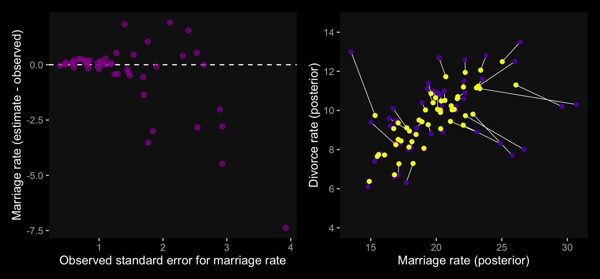

# Missing Data and Other Opportunities

For the opening example, we're playing with the conditional probability

$$
\text{Pr(burnt down | burnt up)} = \frac{\text{Pr(burnt up, burnt down)}}{\text{Pr(burnt up)}}.
$$

It works out that 

$$
\text{Pr(burnt down | burnt up)} = \frac{1/3}{1/2} = \frac{2}{3}.
$$

We might express the math in the middle of page 423 in tibble form like this.


```r
library(tidyverse)

p_pancake <- 1/3

(
  d <-
    tibble(pancake = c("BB", "BU", "UU"),
           p_burnt = c(1, .5, 0)) %>% 
    mutate(p_burnt_up = p_burnt * p_pancake)
) 
```

```
## # A tibble: 3 x 3
##   pancake p_burnt p_burnt_up
##   <chr>     <dbl>      <dbl>
## 1 BB          1        0.333
## 2 BU          0.5      0.167
## 3 UU          0        0
```

```r
d %>% 
  summarise(`p (burnt_down | burnt_up)` = p_pancake / sum(p_burnt_up))
```

```
## # A tibble: 1 x 1
##   `p (burnt_down | burnt_up)`
##                         <dbl>
## 1                       0.667
```

I understood McElreath's simulation better after breaking it apart. The first part of `sim_pancake()` takes one random draw from the integers 1, 2, and 3. It just so happens that if we set `set.seed(1)`, the code returns a 1.


```r
set.seed(1)
sample(x = 1:3, size = 1)
```

```
## [1] 1
```

So here's what it looks like if we use seeds `2:11`.


```r
take_sample <- function(seed) {
  set.seed(seed)
  sample(x = 1:3, size = 1)
}

tibble(seed = 2:11) %>% 
  mutate(value_returned = map_dbl(seed, take_sample))
```

```
## # A tibble: 10 x 2
##     seed value_returned
##    <int>          <dbl>
##  1     2              1
##  2     3              1
##  3     4              3
##  4     5              2
##  5     6              1
##  6     7              2
##  7     8              3
##  8     9              3
##  9    10              3
## 10    11              2
```

Each of those `value_returned` values stands for one of the three pancakes: 1 = BB, 2 = BU, and 3 = UU. In the next line, McElreath made slick use of a matrix to specify that. Here's what the matrix looks like.


```r
matrix(c(1, 1, 1, 0, 0, 0), nrow = 2, ncol = 3)
```

```
##      [,1] [,2] [,3]
## [1,]    1    1    0
## [2,]    1    0    0
```

See how the three columns are identified as `[,1]`, `[,2]`, and `[,3]`? If, say, we wanted to subset the values in the second column, we'd execute


```r
matrix(c(1, 1, 1, 0, 0, 0), nrow = 2, ncol = 3)[, 2]
```

```
## [1] 1 0
```

which returns a numeric vector.


```r
matrix(c(1, 1, 1, 0, 0, 0), nrow = 2, ncol = 3)[, 2] %>% str()
```

```
##  num [1:2] 1 0
```

And that `1 0` corresponds to the pancake with one burnt (i.e., 1) and one unburnt (i.e., 0) side. So when McElreath then executed `sample(sides)`, he randomly sampled from one of those two values. In the case of `pancake == 2`, he randomly sampled one the pancake with one burnt and one unburnt side. Had he sampled from `pancake == 1`, he would have sampled from the pancake with both sides burnt.

Going forward, let's amend McElreath's `sim_pancake()` function so it will take a `seed` argument, which will allow us to make the output reproducible.


```r
# simulate a `pancake` and return randomly ordered `sides`
sim_pancake <- function(seed) {
  
  set.seed(seed)
  
  pancake <- sample(x = 1:3, size = 1)
  sides   <- matrix(c(1, 1, 1, 0, 0, 0), nrow = 2, ncol = 3)[, pancake]
  sample(sides)
  
}
```

Let's take this baby for a whirl.


```r
# how many simulations would you like?
n_sim <- 1e4

d <-
  tibble(seed = 1:n_sim) %>% 
  mutate(burnt = map(seed, sim_pancake)) %>% 
  unnest(burnt) %>% 
  mutate(side = rep(c("up", "down"), times = n() / 2))
```

Take a look at what we've done.


```r
head(d, n = 10)
```

```
## # A tibble: 10 x 3
##     seed burnt side 
##    <int> <dbl> <chr>
##  1     1     1 up   
##  2     1     1 down 
##  3     2     1 up   
##  4     2     1 down 
##  5     3     1 up   
##  6     3     1 down 
##  7     4     0 up   
##  8     4     0 down 
##  9     5     1 up   
## 10     5     0 down
```

And now we'll `spread()` and `summarise()` to get the value we've been working for.


```r
d %>% 
  spread(key = side, value = burnt) %>% 
  summarise(`p (burnt_down | burnt_up)` = sum(up == 1 & down == 1) / (sum(up)))
```

```
## # A tibble: 1 x 1
##   `p (burnt_down | burnt_up)`
##                         <dbl>
## 1                       0.658
```

The results are within rounding error of the ideal 2/3.

> Probability theory is not difficult mathematically. It's just counting. But it is hard to interpret and apply. Doing so often seems to require some cleverness, and authors have an incentive to solve problems in clever ways, just to show off. But we don’t need that cleverness, if we ruthlessly apply conditional probability...
>
> In this chapter, [we'll] meet two commonplace applications of this assume-and-deduce strategy. The first is the incorporation of measurement error into our models. The second is the estimation of missing data through Bayesian imputation...
>
> In neither application do [we] have to intuit the consequences of measurement errors nor the implications of missing values in order to design the models. All [we] have to do is state [the] information about the error or about the variables with missing values. Logic does the rest. (p. 424)

## Measurement error

Let's grab those `WaffleDivorce` data from back in [Chapter 5][Spurious associations].


```r
library(rethinking)
data(WaffleDivorce)
d <- WaffleDivorce
rm(WaffleDivorce)
```

Switch out rethinking for brms.


```r
detach(package:rethinking, unload = T)
library(brms)
```

The brms package currently supports `theme_black()`, which changes the default ggplot2 theme to a black background with white lines, text, and so forth. The origins of this version of the code are from [this post](https://jonlefcheck.net/2013/03/11/black-theme-for-ggplot2-2/) on Jon Lefcheck's website.

Though I like the idea of brms including `theme_black()`, I'm not a fan of some of the default settings (e.g., it includes gridlines). Happily, data scientist [Tyler Rinker](https://github.com/trinker) has some nice alternative `theme_black()` code you can find [here](https://github.com/trinker/plotflow/blob/master/R/theme_black.R). The version of `theme_black()` used for this chapter is based on his version, with a few amendments of my own.


```r
theme_black <- 
  function(base_size=12, base_family="") {
    theme_grey(base_size=base_size, base_family=base_family) %+replace%
        theme(
            # specify axis options
            axis.line=element_blank(),
            # all text colors used to be "grey55"
            axis.text.x=element_text(size=base_size*0.8, color="grey85",
                lineheight=0.9, vjust=1),
            axis.text.y=element_text(size=base_size*0.8, color="grey85",
                lineheight=0.9,hjust=1),
            axis.ticks=element_line(color="grey55", size = 0.2),
            axis.title.x=element_text(size=base_size, color="grey85", vjust=1,
                margin=ggplot2::margin(.5, 0, 0, 0, "lines")),
            axis.title.y=element_text(size=base_size, color="grey85", angle=90,
                margin=ggplot2::margin(.5, 0, 0, 0, "lines"), vjust=0.5),
            axis.ticks.length=grid::unit(0.3, "lines"),

            # specify legend options
            legend.background=element_rect(color=NA, fill="black"),
            legend.key=element_rect(color="grey55", fill="black"),
            legend.key.size=grid::unit(1.2, "lines"),
            legend.key.height=NULL,
            legend.key.width=NULL,
            legend.text=element_text(size=base_size*0.8, color="grey85"),
            legend.title=element_text(size=base_size*0.8, face="bold",hjust=0,
                color="grey85"),
            # legend.position="right",
            legend.position = "none",
            legend.text.align=NULL,
            legend.title.align=NULL,
            legend.direction="vertical",
            legend.box=NULL,
            # specify panel options
            panel.background=element_rect(fill="black", color = NA),
            panel.border=element_rect(fill=NA, color="grey55"),
            panel.grid.major=element_blank(),
            panel.grid.minor=element_blank(),
            panel.spacing=grid::unit(0.25,"lines"),
            # specify facetting options
            strip.background=element_rect(fill = "black", color="grey10"), # fill="grey30"
            strip.text.x=element_text(size=base_size*0.8, color="grey85"),
            strip.text.y=element_text(size=base_size*0.8, color="grey85",
                angle=-90),
            # specify plot options
            plot.background=element_rect(color="black", fill="black"),
            plot.title=element_text(size=base_size*1.2, color="grey85", hjust = 0), # added hjust = 0
            plot.subtitle=element_text(size=base_size*.9, color="grey85", hjust = 0), # added line
            # plot.margin=grid::unit(c(1, 1, 0.5, 0.5), "lines")
            plot.margin=grid::unit(c(0.5, 0.5, 0.5, 0.5), "lines")
    )
}
```

One way to use our `theme_black()` is to make it part of the code for an individual plot, such as `ggplot() + geom_point() + theme_back()`. Another way is to make `theme_black()` the default setting with `ggplot2::theme_set()`. That's the method we'll use.


```r
theme_set(theme_black())

# to reset the default ggplot2 theme to its default parameters,
# execute `theme_set(theme_default())`
```

In the [brms reference manual](https://cran.r-project.org/package=brms/brms.pdf), Bürkner recommended complimenting `theme_black()` with color scheme "C" from the [viridis package](https://github.com/sjmgarnier/viridis), which provides a variety of [colorblind-safe color palettes](https://cran.r-project.org/package=viridis/vignettes/intro-to-viridis.html).


```r
# install.packages("viridis")
library(viridis)
```

The `viridis_pal()` function gives a list of colors within a given palette. The colors in each palette fall on a spectrum. Within `viridis_pal()`, the `option` argument allows one to select a given spectrum, "C", in our case. The final parentheses, `()`, allows one to determine how many discrete colors one would like to break the spectrum up by. We'll choose 7.


```r
viridis_pal(option = "C")(7)
```

```
## [1] "#0D0887FF" "#5D01A6FF" "#9C179EFF" "#CC4678FF" "#ED7953FF" "#FDB32FFF" "#F0F921FF"
```

With a little data wrangling, we can put the colors of our palette in a tibble and display them in a plot.


```r
tibble(number       = 1:7,
       color_number = str_c(1:7, ". ", viridis_pal(option = "C")(7))) %>% 
  
  ggplot(aes(x = factor(0), y = reorder(color_number, number))) +
  geom_tile(aes(fill  = factor(number))) +
  geom_text(aes(color = factor(number), label = color_number)) +
  scale_color_manual(values = c(rep("black", times = 4), 
                                rep("white", times = 3))) +
  scale_fill_viridis(option = "C", discrete = T, direction = -1) +
  scale_x_discrete(NULL, breaks = NULL) +
  scale_y_discrete(NULL, breaks = NULL) +
  ggtitle("Behold: viridis C!")
```


Now, let's make use of our custom theme and reproduce/reimagine Figure 14.1.a. 


```r
color <- viridis_pal(option = "C")(7)[7]

p1 <-
  d %>%
  ggplot(aes(x = MedianAgeMarriage, 
             y = Divorce,
             ymin = Divorce - Divorce.SE, 
             ymax = Divorce + Divorce.SE)) +
  geom_pointrange(shape = 20, alpha = 2/3, color = color) +
  labs(x = "Median age marriage" , 
       y = "Divorce rate")
```

Notice how `viridis_pal(option = "C")(7)[7]` called the seventh color in the color scheme, `"#F0F921FF"`. For Figure 14.1.b, we'll select the sixth color in the palette by coding `viridis_pal(option = "C")(7)[6]`. We'll then combine the two subplots with patchwork.


```r
color <- viridis_pal(option = "C")(7)[6]

p2 <-
  d %>%
  ggplot(aes(x = log(Population), 
             y = Divorce,
             ymin = Divorce - Divorce.SE, 
             ymax = Divorce + Divorce.SE)) +
  geom_pointrange(shape = 20, alpha = 2/3, color = color) +
  scale_y_continuous(NULL, breaks = NULL) +
  xlab("log population")

library(patchwork)

p1 | p2
```


Just like in the text, our plot shows states with larger populations tend to have smaller measurement error. The relation between measurement error and `MedianAgeMarriage` is less apparent.

### Error on the outcome.

To get a better sense of what we're about to do, imagine for a moment that each state's divorce rate is normally distributed with a mean of `Divorce` and standard deviation `Divorce.SE`. Those distributions would be:


```r
d %>% 
  mutate(Divorce_distribution = str_c("Divorce ~ Normal(", Divorce, ", ", Divorce.SE, ")")) %>% 
  select(Loc, Divorce_distribution) %>% 
  head()
```

```
##   Loc         Divorce_distribution
## 1  AL Divorce ~ Normal(12.7, 0.79)
## 2  AK Divorce ~ Normal(12.5, 2.05)
## 3  AZ Divorce ~ Normal(10.8, 0.74)
## 4  AR Divorce ~ Normal(13.5, 1.22)
## 5  CA    Divorce ~ Normal(8, 0.24)
## 6  CO Divorce ~ Normal(11.6, 0.94)
```

As in the text,

> in [the following] example we'll use a Gaussian distribution with mean equal to the observed value and standard deviation equal to the measurement's standard error. This is the logical choice, because if all we know about the error is its standard deviation, then the maximum entropy distribution for it will be Gaussian...
> 
> Here's how to define the distribution for each divorce rate. For each observed value $D_{\text{OBS},i}$, there will be one parameter, $D_{\text{EST},i}$, defined by:
>
> $$D_{\text{OBS},i} \sim \text{Normal} (D_{\text{EST},i}, D_{\text{SE},i})$$
>
> All this does is define the measurement $D_{\text{OBS},i}$ as having the specified Gaussian distribution centered on the unknown parameter $D_{\text{EST},i}$. So the above defines a probability for each State $i$'s observed divorce rate, given a known measurement error. (pp. 426--427)

Now we're ready to fit some models. In brms, there are at least two ways to accommodate measurement error in the criterion. The first way uses the `se()` syntax, following the form `<response> | se(<se_response>, sigma = TRUE)`. With this syntax, `se` stands for standard error, the loose frequentist analogue to the Bayesian posterior $SD$. Unless you're [fitting a meta-analysis](https://mvuorre.github.io/post/2016/09/29/meta-analysis-is-a-special-case-of-bayesian-multilevel-modeling/) on summary information, which we'll be doing at the end of this chapter, make sure to specify `sigma = TRUE`. Without that you'll have no posterior for $\sigma$! For more information on the `se()` method, go to the [brms reference manual](https://cran.r-project.org/package=brms/brms.pdf) and find the *Additional response information* subsection of the `brmsformula` section.

The second way uses the `mi()` syntax, following the form `<response> | mi(<se_response>)`. This follows a missing data logic, resulting in Bayesian missing data imputation for the criterion values. The `mi()` syntax is based on the newer missing data capabilities for brms. We will cover that in more detail in the second half of this chapter.

We'll start off using both methods. Our first model, `b14.1_se`, will follow the `se()` syntax; the second model, `b14.1_mi`, will follow the `mi()` syntax.


```r
# put the data into a `list()`
dlist <- list(
    div_obs = d$Divorce,
    div_sd  = d$Divorce.SE,
    R       = d$Marriage,
    A       = d$MedianAgeMarriage)

# here we specify the initial (i.e., starting) values
inits      <- list(Yl = dlist$div_obs)
inits_list <- list(inits, inits)

# fit the models
b14.1_se <- 
  brm(data = dlist, 
      family = gaussian,
      div_obs | se(div_sd, sigma = TRUE) ~ 0 + Intercept + R + A,
      prior = c(prior(normal(0, 10), class = b),
                prior(cauchy(0, 2.5), class = sigma)),
      iter = 5000, warmup = 1000, cores = 2, chains = 2,
      seed = 14,
      control = list(adapt_delta = 0.99,
                     max_treedepth = 12),
      inits = inits_list,
      file = "fits/b14.01_se")

b14.1_mi <- 
  brm(data = dlist, 
      family = gaussian,
      div_obs | mi(div_sd) ~ 0 + Intercept + R + A,
      prior = c(prior(normal(0, 10), class = b),
                prior(cauchy(0, 2.5), class = sigma)),
      iter = 5000, warmup = 1000, cores = 2, chains = 2,
      seed = 14,
      control = list(adapt_delta = 0.99,
                     max_treedepth = 12),
      save_mevars = TRUE,  # note this line for the `mi()` model
      inits = inits_list,
      file = "fits/b14.01_mi")
```

Before we dive into the model summaries, notice how the starting values (i.e., `inits`) differ by model. Even though we coded `inits = inits_list` for both models, the differ by `fit@inits`. 


```r
b14.1_se$fit@inits
```

```
## [[1]]
## [[1]]$b
## [1]  0.6133048 -1.9171497  1.7551789
## 
## [[1]]$sigma
## [1] 0.4668127
## 
## 
## [[2]]
## [[2]]$b
## [1]  0.9114156  1.2512265 -0.4276127
## 
## [[2]]$sigma
## [1] 1.906943
```

```r
b14.1_mi$fit@inits
```

```
## [[1]]
## [[1]]$Yl
##  [1] 12.7 12.5 10.8 13.5  8.0 11.6  6.7  8.9  6.3  8.5 11.5  8.3  7.7  8.0 11.0 10.2 10.6 12.6 11.0
## [20] 13.0  8.8  7.8  9.2  7.4 11.1  9.5  9.1  8.8 10.1  6.1 10.2  6.6  9.9  8.0  9.5 12.8 10.4  7.7
## [39]  9.4  8.1 10.9 11.4 10.0 10.2  9.6  8.9 10.0 10.9  8.3 10.3
## 
## [[1]]$b
## [1] -0.5034648  1.1693530 -1.0539336
## 
## [[1]]$sigma
## [1] 1.281562
## 
## 
## [[2]]
## [[2]]$Yl
##  [1] 12.7 12.5 10.8 13.5  8.0 11.6  6.7  8.9  6.3  8.5 11.5  8.3  7.7  8.0 11.0 10.2 10.6 12.6 11.0
## [20] 13.0  8.8  7.8  9.2  7.4 11.1  9.5  9.1  8.8 10.1  6.1 10.2  6.6  9.9  8.0  9.5 12.8 10.4  7.7
## [39]  9.4  8.1 10.9 11.4 10.0 10.2  9.6  8.9 10.0 10.9  8.3 10.3
## 
## [[2]]$b
## [1] -0.1543955  1.1642108 -0.4231833
## 
## [[2]]$sigma
## [1] 4.802142
```

As we explore further, it should become apparent why. Here are the primary model summaries.


```r
print(b14.1_se)
```

```
##  Family: gaussian 
##   Links: mu = identity; sigma = identity 
## Formula: div_obs | se(div_sd, sigma = TRUE) ~ 0 + Intercept + R + A 
##    Data: dlist (Number of observations: 50) 
## Samples: 2 chains, each with iter = 5000; warmup = 1000; thin = 1;
##          total post-warmup samples = 8000
## 
## Population-Level Effects: 
##           Estimate Est.Error l-95% CI u-95% CI Rhat Bulk_ESS Tail_ESS
## Intercept    21.21      6.62     7.81    33.76 1.00     1903     2405
## R             0.13      0.08    -0.02     0.28 1.00     2242     2765
## A            -0.55      0.21    -0.94    -0.11 1.00     2055     2639
## 
## Family Specific Parameters: 
##       Estimate Est.Error l-95% CI u-95% CI Rhat Bulk_ESS Tail_ESS
## sigma     1.13      0.21     0.77     1.57 1.00     3136     3721
## 
## Samples were drawn using sampling(NUTS). For each parameter, Bulk_ESS
## and Tail_ESS are effective sample size measures, and Rhat is the potential
## scale reduction factor on split chains (at convergence, Rhat = 1).
```

```r
print(b14.1_mi)
```

```
##  Family: gaussian 
##   Links: mu = identity; sigma = identity 
## Formula: div_obs | mi(div_sd) ~ 0 + Intercept + R + A 
##    Data: dlist (Number of observations: 50) 
## Samples: 2 chains, each with iter = 5000; warmup = 1000; thin = 1;
##          total post-warmup samples = 8000
## 
## Population-Level Effects: 
##           Estimate Est.Error l-95% CI u-95% CI Rhat Bulk_ESS Tail_ESS
## Intercept    21.37      6.52     8.50    33.82 1.00     3865     5142
## R             0.13      0.08    -0.02     0.27 1.00     4487     5820
## A            -0.55      0.21    -0.95    -0.13 1.00     3963     5029
## 
## Family Specific Parameters: 
##       Estimate Est.Error l-95% CI u-95% CI Rhat Bulk_ESS Tail_ESS
## sigma     1.13      0.21     0.76     1.56 1.00     3133     4489
## 
## Samples were drawn using sampling(NUTS). For each parameter, Bulk_ESS
## and Tail_ESS are effective sample size measures, and Rhat is the potential
## scale reduction factor on split chains (at convergence, Rhat = 1).
```

Based on the `print()`/`summary()` information, the main parameters for the models are about the same. However, the plot deepens when we summarize the models with the `broom::tidy()` method. 


```r
library(broom)

tidy(b14.1_se) %>%
  mutate_if(is.numeric, round, digits = 2)
```

```
##          term estimate std.error   lower   upper
## 1 b_Intercept    21.21      6.62   10.19   31.85
## 2         b_R     0.13      0.08    0.00    0.26
## 3         b_A    -0.55      0.21   -0.89   -0.19
## 4       sigma     1.13      0.21    0.82    1.49
## 5        lp__  -105.41      1.42 -108.18 -103.71
```

```r
tidy(b14.1_mi) %>%
  mutate_if(is.numeric, round, digits = 2)
```

```
##           term estimate std.error   lower   upper
## 1  b_Intercept    21.37      6.52   10.68   31.79
## 2          b_R     0.13      0.08    0.00    0.25
## 3          b_A    -0.55      0.21   -0.89   -0.20
## 4        sigma     1.13      0.21    0.80    1.48
## 5        Yl[1]    11.79      0.68   10.70   12.92
## 6        Yl[2]    11.20      1.04    9.53   12.92
## 7        Yl[3]    10.47      0.63    9.44   11.51
## 8        Yl[4]    12.31      0.85   10.94   13.74
## 9        Yl[5]     8.05      0.24    7.66    8.44
## 10       Yl[6]    11.02      0.74    9.82   12.25
## 11       Yl[7]     7.23      0.64    6.17    8.27
## 12       Yl[8]     9.35      0.91    7.84   10.82
## 13       Yl[9]     7.00      1.09    5.22    8.76
## 14      Yl[10]     8.54      0.30    8.04    9.04
## 15      Yl[11]    11.15      0.54   10.27   12.04
## 16      Yl[12]     9.10      0.90    7.60   10.57
## 17      Yl[13]     9.69      0.91    8.15   11.14
## 18      Yl[14]     8.11      0.42    7.43    8.79
## 19      Yl[15]    10.68      0.54    9.79   11.57
## 20      Yl[16]    10.17      0.71    9.02   11.32
## 21      Yl[17]    10.50      0.78    9.22   11.80
## 22      Yl[18]    11.95      0.63   10.94   12.98
## 23      Yl[19]    10.50      0.69    9.39   11.63
## 24      Yl[20]    10.18      1.02    8.53   11.90
## 25      Yl[21]     8.76      0.59    7.78    9.74
## 26      Yl[22]     7.77      0.48    6.98    8.54
## 27      Yl[23]     9.14      0.47    8.36    9.92
## 28      Yl[24]     7.74      0.54    6.84    8.62
## 29      Yl[25]    10.43      0.76    9.20   11.70
## 30      Yl[26]     9.54      0.58    8.58   10.51
## 31      Yl[27]     9.42      0.96    7.84   11.01
## 32      Yl[28]     9.26      0.74    8.05   10.42
## 33      Yl[29]     9.17      0.96    7.62   10.75
## 34      Yl[30]     6.38      0.44    5.64    7.11
## 35      Yl[31]     9.98      0.79    8.66   11.29
## 36      Yl[32]     6.69      0.30    6.21    7.17
## 37      Yl[33]     9.88      0.44    9.17   10.61
## 38      Yl[34]     9.77      0.96    8.15   11.29
## 39      Yl[35]     9.43      0.42    8.75   10.13
## 40      Yl[36]    11.97      0.79   10.70   13.26
## 41      Yl[37]    10.07      0.66    9.00   11.17
## 42      Yl[38]     7.80      0.40    7.14    8.45
## 43      Yl[39]     8.21      1.00    6.62    9.91
## 44      Yl[40]     8.40      0.59    7.41    9.37
## 45      Yl[41]    10.01      1.04    8.30   11.75
## 46      Yl[42]    10.94      0.64    9.88   11.99
## 47      Yl[43]    10.02      0.34    9.46   10.57
## 48      Yl[44]    11.08      0.78    9.79   12.38
## 49      Yl[45]     8.90      0.99    7.31   10.54
## 50      Yl[46]     9.01      0.46    8.24    9.78
## 51      Yl[47]     9.96      0.56    9.04   10.87
## 52      Yl[48]    10.61      0.89    9.16   12.07
## 53      Yl[49]     8.46      0.51    7.63    9.30
## 54      Yl[50]    11.53      1.09    9.67   13.26
## 55        lp__  -152.51      6.58 -163.76 -141.95
```

```r
# you can get similar output with `b14.1_mi$fit`
```

Again, from `b_Intercept` to `sigma`, the output is about the same. But model `b14.1_mi`, based on the `mi()` syntax, contained posterior summaries for all 50 of the criterion values. The `se()` method gave us similar model result, but no posterior summaries for the 50 criterion values. The rethinking package indexed those additional 50 as `div_est[i]`; with the `mi()` method, brms indexed them as `Yl[i]`--no big deal. So while both brms methods accommodated measurement error, the `mi()` method appears to be the brms analogue to what McElreath did with his model `m14.1` in the text. Thus, it's our `b14.1_mi` model that follows the form

\begin{align*}
\text{Divorce}_{\text{estimated}, i} & \sim \text{Normal} (\mu_i, \sigma) \\
\mu     & = \alpha + \beta_1 \text A_i + \beta_2 \text R_i \\
\text{Divorce}_{\text{observed}, i}  & \sim \text{Normal} (\text{Divorce}_{\text{estimated}, i}, \text{Divorce}_{\text{standard error}, i}) \\
\alpha  & \sim \text{Normal} (0, 10) \\
\beta_1 & \sim \text{Normal} (0, 10) \\
\beta_2 & \sim \text{Normal} (0, 10) \\
\sigma  & \sim \text{HalfCauchy} (0, 2.5).
\end{align*}

*Note*. The `normal(0, 10)` prior McElreath used was [quite informative and can lead to discrepancies between the rethinking and brms results](https://github.com/paul-buerkner/brms/issues/114) if you're not careful. A large issue is the default way brms handles intercept priors. From the hyperlink, Bürkner wrote:

> The formula for the original intercept is
`b_intercept = temp_intercept - dot_product(means_X, b)`, where `means_X` is the vector of means of the predictor variables and b is the vector of regression coefficients (fixed effects). That is, when transforming a prior on the intercept to an "equivalent" prior on the temporary intercept, you have to take the means of the predictors and well as the priors on the other coefficients into account.

If this seems confusing, you have an alternative. The `0 + intercept` part of the brm formula kept the intercept in the metric of the untransformed data, leading to similar results to those from rethinking. When your priors are vague, this might not be much of an issue. And since many of the models in *Statistical Rethinking* use only weakly-regularizing priors, this hasn't been much of an issue up to this point. But this model is quite sensitive to the intercept syntax. My general recommendation for applied data analysis is this: **If your predictors aren't mean centered, default to the** `0 + intercept` **syntax for the** `formula` **argument when using** `brms::brm()`. Otherwise, your priors might not be doing what you think they're doing.

Anyway, since our `mi()`-syntax `b14.1_mi` model appears to be the analogue to McElreath's `m14.1`, we'll use that one for our plots. Here's the code for our Figure 14.2.a.


```r
data_error <- 
  fitted(b14.1_mi) %>%
  as_tibble() %>%
  bind_cols(d)

color <- viridis_pal(option = "C")(7)[5]

p1 <-
  data_error %>%
  ggplot(aes(x = Divorce.SE, y = Estimate - Divorce)) +
  geom_hline(yintercept = 0, linetype = 2, color = "white") +
  geom_point(alpha = 2/3, size = 2, color = color) +
  labs(x = "Observed standard error for divorce",
       y = "Divorce (estimate - observed)")
```

Before we make Figure 14.2.b, we need to fit a model that ignores measurement error.


```r
b14.1b <- 
  brm(data = dlist, 
      family = gaussian,
      div_obs ~ 0 + Intercept + R + A,              
      prior = c(prior(normal(0, 50), class = b, coef = Intercept),
                prior(normal(0, 10), class = b),
                prior(cauchy(0, 2.5), class = sigma)),
      chains = 2, iter = 5000, warmup = 1000, cores = 2,
      seed = 14,
      control = list(adapt_delta = 0.95),
      file = "fits/b14.01b")
```


```r
print(b14.1b)
```

```
##  Family: gaussian 
##   Links: mu = identity; sigma = identity 
## Formula: div_obs ~ 0 + Intercept + R + A 
##    Data: dlist (Number of observations: 50) 
## Samples: 2 chains, each with iter = 5000; warmup = 1000; thin = 1;
##          total post-warmup samples = 8000
## 
## Population-Level Effects: 
##           Estimate Est.Error l-95% CI u-95% CI Rhat Bulk_ESS Tail_ESS
## Intercept    36.06      7.71    20.55    50.81 1.00     1828     2347
## R            -0.05      0.08    -0.21     0.12 1.00     1926     2642
## A            -0.97      0.25    -1.45    -0.48 1.00     1923     2597
## 
## Family Specific Parameters: 
##       Estimate Est.Error l-95% CI u-95% CI Rhat Bulk_ESS Tail_ESS
## sigma     1.51      0.16     1.24     1.88 1.00     3286     3607
## 
## Samples were drawn using sampling(NUTS). For each parameter, Bulk_ESS
## and Tail_ESS are effective sample size measures, and Rhat is the potential
## scale reduction factor on split chains (at convergence, Rhat = 1).
```

With the ignore-measurement-error fit in hand, we're ready for Figure 14.2.b.


```r
nd <- 
  tibble(R      = mean(d$Marriage),
         A      = seq(from = 22, to = 30.2, length.out = 30),
         div_sd = mean(d$Divorce.SE))

# red line
f_error <- 
  fitted(b14.1_mi, newdata = nd) %>%
  as_tibble() %>%
  bind_cols(nd)

# yellow line
f_no_error <- 
  fitted(b14.1b, newdata = nd) %>%
  as_tibble() %>%
  bind_cols(nd)

# white dots
data_error <- 
  fitted(b14.1_mi) %>%
  as_tibble() %>%
  bind_cols(b14.1_mi$data)

color_y <- viridis_pal(option = "C")(7)[7]
color_r <- viridis_pal(option = "C")(7)[4]

# plot
p2 <-
  f_no_error %>% 
  ggplot(aes(x = A, y = Estimate)) +
  # `f_no_error`
  geom_smooth(aes(ymin = Q2.5, ymax = Q97.5),
              stat = "identity",
              fill = color_y, color = color_y, 
              alpha = 1/4, size = 1/2, linetype = 2) +
  # `f_error`
  geom_smooth(data = f_error,
              aes(ymin = Q2.5, ymax = Q97.5),
              stat = "identity",
              fill = color_r, color = color_r, 
              alpha = 1/3, size = 1/2, linetype = 1) +
  geom_pointrange(data = data_error,
                  aes(ymin = Estimate - Est.Error,
                      ymax = Estimate + Est.Error),
                  color = "white", shape = 20, alpha = 1/2) +
  scale_y_continuous(breaks = seq(from = 4, to = 14, by = 2)) +
  labs(x = "Median age marriage" , 
       y = "Divorce rate (posterior)") +
  coord_cartesian(xlim = range(data_error$A), 
                  ylim = c(4, 15))

p1 | p2
```


In our plot on the right, it's the reddish regression line that accounts for measurement error.

### Error on both outcome and predictor.

In brms, you can specify error on predictors with an `me()` statement in the form of `me(predictor, sd_predictor)` where `sd_predictor` is a vector in the data denoting the size of the measurement error, presumed to be in a standard-deviation metric.


```r
# the data
dlist <- list(
  div_obs = d$Divorce,
  div_sd  = d$Divorce.SE,
  mar_obs = d$Marriage,
  mar_sd  = d$Marriage.SE,
  A       = d$MedianAgeMarriage)

# the `inits`
inits      <- list(Yl = dlist$div_obs)
inits_list <- list(inits, inits)

# the models
b14.2_se <-
  brm(data = dlist, 
      family = gaussian,
      div_obs | se(div_sd, sigma = TRUE) ~ 0 + Intercept + me(mar_obs, mar_sd) + A,
      prior = c(prior(normal(0, 10), class = b),
                prior(cauchy(0, 2.5), class = sigma)),
      iter = 5000, warmup = 1000, chains = 3, cores = 3,
      seed = 14,
      control = list(adapt_delta = 0.95),
      save_mevars = TRUE,  # note the lack if `inits`
      file = "fits/b14.02_se")

b14.2_mi <- 
  brm(data = dlist, 
      family = gaussian,
      div_obs | mi(div_sd) ~ 0 + Intercept + me(mar_obs, mar_sd) + A,
      prior = c(prior(normal(0, 10), class = b),
                prior(cauchy(0, 2.5), class = sigma)),
      iter = 5000, warmup = 1000, cores = 2, chains = 2,
      seed = 14,
      control = list(adapt_delta = 0.99,
                     max_treedepth = 12),
      save_mevars = TRUE,
      inits = inits_list,
      file = "fits/b14.02_mi")
```

We already know including `inits` values for our `Yl[i]` estimates is a waste of time for our `se()` model. But note how we still defined our `inits` values as `inits <- list(Yl = dlist$div_obs)` for the `mi()` model. Although it's easy in brms to set the starting values for our `Yl[i]` estimates, much the way McElreath did, that is not the case when you have measurement error on the predictors. The brms package uses a non-centered parameterization for these, which requires users to have a deeper understanding of the underlying Stan code. This is where I get off the train, but if you want to go further, execute `stancode(b14.2_mi)`.

Here are the two versions of the model.


```r
print(b14.2_se)
```

```
##  Family: gaussian 
##   Links: mu = identity; sigma = identity 
## Formula: div_obs | se(div_sd, sigma = TRUE) ~ 0 + Intercept + me(mar_obs, mar_sd) + A 
##    Data: dlist (Number of observations: 50) 
## Samples: 3 chains, each with iter = 5000; warmup = 1000; thin = 1;
##          total post-warmup samples = 12000
## 
## Population-Level Effects: 
##                 Estimate Est.Error l-95% CI u-95% CI Rhat Bulk_ESS Tail_ESS
## Intercept          15.84      6.68     2.50    28.55 1.00     4694     7844
## A                  -0.45      0.20    -0.83    -0.05 1.00     5398     7807
## memar_obsmar_sd     0.27      0.10     0.07     0.48 1.00     5457     7956
## 
## Family Specific Parameters: 
##       Estimate Est.Error l-95% CI u-95% CI Rhat Bulk_ESS Tail_ESS
## sigma     1.00      0.21     0.61     1.44 1.00    12263     8222
## 
## Samples were drawn using sampling(NUTS). For each parameter, Bulk_ESS
## and Tail_ESS are effective sample size measures, and Rhat is the potential
## scale reduction factor on split chains (at convergence, Rhat = 1).
```

```r
print(b14.2_mi)
```

```
##  Family: gaussian 
##   Links: mu = identity; sigma = identity 
## Formula: div_obs | mi(div_sd) ~ 0 + Intercept + me(mar_obs, mar_sd) + A 
##    Data: dlist (Number of observations: 50) 
## Samples: 2 chains, each with iter = 5000; warmup = 1000; thin = 1;
##          total post-warmup samples = 8000
## 
## Population-Level Effects: 
##                 Estimate Est.Error l-95% CI u-95% CI Rhat Bulk_ESS Tail_ESS
## Intercept          15.74      6.54     2.60    28.45 1.00     2228     3709
## A                  -0.44      0.20    -0.83    -0.05 1.00     2435     4325
## memar_obsmar_sd     0.27      0.10     0.07     0.48 1.00     2199     3696
## 
## Family Specific Parameters: 
##       Estimate Est.Error l-95% CI u-95% CI Rhat Bulk_ESS Tail_ESS
## sigma     1.00      0.21     0.62     1.45 1.00     1755     2472
## 
## Samples were drawn using sampling(NUTS). For each parameter, Bulk_ESS
## and Tail_ESS are effective sample size measures, and Rhat is the potential
## scale reduction factor on split chains (at convergence, Rhat = 1).
```

We'll use `broom::tidy()`, again, to get a sense of `depth=2` summaries.


```r
tidy(b14.2_se) %>%
  mutate_if(is.numeric, round, digits = 2)

tidy(b14.2_mi) %>%
  mutate_if(is.numeric, round, digits = 2)
```

Due to space concerns, I'm not going to show the results, here. You can do that on your own. Both methods yielded the posteriors for `Xme_memar_obs[1]`, but only the `b14.2_mi` model based on the `mi()` syntax yielded posteriors for the criterion, the `Yl[i]` summaries.

Note that you'll need to specify `save_mevars = TRUE` in the `brm()` function in order to save the posterior samples of error-adjusted variables obtained by using the `me()` argument. Without doing so, functions like `predict()` may give you trouble.

Here is the code for Figure 14.3.a.


```r
data_error <-
  fitted(b14.2_mi) %>%
  as_tibble() %>%
  bind_cols(d)

color <- viridis_pal(option = "C")(7)[3]

p1 <-
  data_error %>%
  ggplot(aes(x = Divorce.SE, y = Estimate - Divorce)) +
  geom_hline(yintercept = 0, linetype = 2, color = "white") +
  geom_point(alpha = 2/3, size = 2, color = color) +
  labs(x = "Observed standard error for marriage rate",
       y = "Marriage rate (estimate - observed)")
```

To get the posterior samples for error-adjusted `Marriage` rate, we'll use `posterior_samples`. If you examine the object with `glimpse()`, you'll notice 50 `Xme_memar_obsmar_sd[i]` vectors, with $i$ ranging from 1 to 50, each corresponding to one of the 50 states. With a little data wrangling, you can get the mean of each to put in a plot. Once we have those summaries, we can make our version of Figure 14.4.b.


```r
color_y <- viridis_pal(option = "C")(7)[7]
color_p <- viridis_pal(option = "C")(7)[2]

p2 <-
  posterior_samples(b14.2_mi) %>%
  select(starts_with("Xme")) %>%
  gather() %>%
  # this extracts the numerals from the otherwise cumbersome names in `key` and saves them as integers
  mutate(key = str_extract(key, "\\d+") %>% as.integer()) %>%
  group_by(key) %>%
  summarise(mean = mean(value)) %>%
  bind_cols(data_error) %>%
  
  ggplot(aes(x = mean, y = Estimate)) +
  geom_segment(aes(xend = Marriage, yend = Divorce),
               color = "white", size = 1/4) +
  geom_point(size = 2, alpha = 2/3, color = color_y) +
  geom_point(aes(x = Marriage, y = Divorce), 
             size = 2, alpha = 2/3, color = color_p) +
  scale_y_continuous(breaks = seq(from = 4, to = 14, by = 2)) +
  labs(x = "Marriage rate (posterior)" , 
       y = "Divorce rate (posterior)") +
  coord_cartesian(ylim = c(4, 14.5))

p1 | p2
```



In the right panel, the yellow points are model-implied; the purple ones are of the original data. It turns out our brms model regularized more aggressively than McElreath's rethinking model. I'm unsure of why. If you understand the difference, [please share with the rest of the class](https://github.com/ASKurz/Statistical_Rethinking_with_brms_ggplot2_and_the_tidyverse/issues).

Anyway,

> the big take home point for this section is that when you have a distribution of values, don't reduce it down to a single value to use in a regression. Instead, use the entire distribution. Anytime we use an average value, discarding the uncertainty around that average, we risk overconfidence and spurious inference. This doesn’t only apply to measurement error, but also to cases which data are averaged before analysis.
>
> Do not average. Instead, model. (p. 431)

## Missing data

Starting with [version 2.2.0](https://cran.r-project.org/package=brms/news/news.html) brms now supports Bayesian missing data imputation using adaptations of the [multivariate syntax](https://cran.r-project.org/package=brms/vignettes/brms_multivariate.html). Bürkner's [*Handle Missing Values with brms* vignette](https://cran.r-project.org/package=brms/vignettes/brms_missings.html) is quite helpful.

### Imputing `neocortex`

Once again, here are the `milk` data.


```r
library(rethinking)
data(milk)
d <- milk

d <-
  d %>%
  mutate(neocortex.prop = neocortex.perc / 100,
         logmass        = log(mass))
```

Now we'll switch out rethinking for brms and do a little data wrangling.


```r
detach(package:rethinking, unload = T)
library(brms)
rm(milk)

# prep data
data_list <- 
  list(kcal      = d$kcal.per.g,
       neocortex = d$neocortex.prop,
       logmass   = d$logmass)
```

Here's the structure of our data list.


```r
data_list
```

```
## $kcal
##  [1] 0.49 0.51 0.46 0.48 0.60 0.47 0.56 0.89 0.91 0.92 0.80 0.46 0.71 0.71 0.73 0.68 0.72 0.97 0.79
## [20] 0.84 0.48 0.62 0.51 0.54 0.49 0.53 0.48 0.55 0.71
## 
## $neocortex
##  [1] 0.5516     NA     NA     NA     NA 0.6454 0.6454 0.6764     NA 0.6885 0.5885 0.6169 0.6032
## [14]     NA     NA 0.6997     NA 0.7041     NA 0.7340     NA 0.6753     NA 0.7126 0.7260     NA
## [27] 0.7024 0.7630 0.7549
## 
## $logmass
##  [1]  0.6678294  0.7371641  0.9202828  0.4824261  0.7839015  1.6582281  1.6808279  0.9202828
##  [9] -0.3424903 -0.3856625 -2.1202635 -0.7550226 -1.1394343 -0.5108256  1.2441546  0.4382549
## [17]  1.9572739  1.1755733  2.0719133  2.5095993  2.0268316  1.6808279  2.3721112  3.5689692
## [25]  4.3748761  4.5821062  3.7072104  3.4998354  4.0064237
```

Our statistical model follows the form

\begin{align*}
\text{kcal}_i           & \sim \text{Normal} (\mu_i, \sigma) \\
\mu_i                   & = \alpha + \beta_1 \text{neocortex}_i + \beta_2 \text{logmass}_i \\
\text{neocortex}_i      & \sim \text{Normal} (\nu, \sigma_\text{neocortex}) \\
\alpha                  & \sim \text{Normal} (0, 100) \\
\beta_1                 & \sim \text{Normal} (0, 10) \\
\beta_2                 & \sim \text{Normal} (0, 10) \\
\sigma                  & \sim \text{HalfCauchy} (0, 1) \\
\nu                     & \sim \text{Normal} (0.5, 1) \\
\sigma_\text{neocortex} & \sim \text{HalfCauchy} (0, 1).
\end{align*}

If you look closely, you'll discover the prior McElreath reported in the model equation for the intercept, $\alpha \sim \text{Normal} (0, 10)$, does not match up with the prior he used in R code 14.7, `a ~ dnorm(0,100)`. Here we use the latter.

When writing a multivariate model in brms, I find it easier to save the model code by itself and then insert it into the `brm()` function. Otherwise, things get cluttered in a hurry.


```r
b_model <- 
  # here's the primary `kcal` model
  bf(kcal ~ 1 + mi(neocortex) + logmass) + 
  # here's the model for the missing `neocortex` data 
  bf(neocortex | mi() ~ 1) + 
  # here we set the residual correlations for the two models to zero
  set_rescor(FALSE)
```

Note the `mi(neocortex)` syntax in the `kcal` model. This indicates that the predictor, `neocortex`, has missing values that are themselves being modeled. 

To get a sense of how to specify the priors for such a model, use the `get_prior()` function.


```r
get_prior(data = data_list, 
          family = gaussian,
          b_model)
```

```
##                 prior     class        coef group      resp dpar nlpar bound
## 1                             b                                             
## 2                     Intercept                                             
## 3                             b                        kcal                 
## 4                             b     logmass            kcal                 
## 5                             b mineocortex            kcal                 
## 6 student_t(3, 1, 10) Intercept                        kcal                 
## 7 student_t(3, 0, 10)     sigma                        kcal                 
## 8 student_t(3, 1, 10) Intercept                   neocortex                 
## 9 student_t(3, 0, 10)     sigma                   neocortex
```

With the one-step Bayesian imputation procedure in brms, you might need to use the `resp` argument when specifying non-defaut priors.

Anyway, here we fit the model.


```r
b14.3 <- 
  brm(data = data_list, 
      family = gaussian,
      b_model,  # here we insert the model
      prior = c(prior(normal(0, 100), class = Intercept, resp = kcal),
                prior(normal(0.5, 1), class = Intercept, resp = neocortex),
                prior(normal(0, 10),  class = b,         resp = kcal),
                prior(cauchy(0, 1),   class = sigma,     resp = kcal),
                prior(cauchy(0, 1),   class = sigma,     resp = neocortex)),
      iter = 1e4, chains = 2, cores = 2,
      seed = 14,
      file = "fits/b14.03")
```

The imputed `neocortex` values are indexed by occasion number from the original data.


```r
tidy(b14.3) %>%
  mutate_if(is.numeric, round, digits = 2)
```

```
##                     term estimate std.error lower upper
## 1       b_kcal_Intercept    -0.53      0.47 -1.30  0.25
## 2  b_neocortex_Intercept     0.67      0.01  0.65  0.69
## 3         b_kcal_logmass    -0.07      0.02 -0.11 -0.03
## 4   bsp_kcal_mineocortex     1.89      0.74  0.68  3.09
## 5             sigma_kcal     0.13      0.02  0.10  0.18
## 6        sigma_neocortex     0.06      0.01  0.05  0.08
## 7       Ymi_neocortex[2]     0.63      0.05  0.55  0.72
## 8       Ymi_neocortex[3]     0.62      0.05  0.54  0.71
## 9       Ymi_neocortex[4]     0.62      0.05  0.54  0.71
## 10      Ymi_neocortex[5]     0.65      0.05  0.58  0.73
## 11      Ymi_neocortex[9]     0.70      0.05  0.62  0.79
## 12     Ymi_neocortex[14]     0.66      0.05  0.58  0.74
## 13     Ymi_neocortex[15]     0.69      0.05  0.61  0.76
## 14     Ymi_neocortex[17]     0.70      0.05  0.61  0.77
## 15     Ymi_neocortex[19]     0.71      0.05  0.63  0.79
## 16     Ymi_neocortex[21]     0.65      0.05  0.57  0.73
## 17     Ymi_neocortex[23]     0.66      0.05  0.58  0.74
## 18     Ymi_neocortex[26]     0.70      0.05  0.61  0.78
## 19                  lp__    40.46      4.36 32.48 46.68
```

Here's the model that drops the cases with NAs on `neocortex`.


```r
b14.3cc <- 
  brm(data = data_list, 
      family = gaussian,
      kcal ~ 1 + neocortex + logmass,
      prior = c(prior(normal(0, 100), class = Intercept),
                prior(normal(0, 10), class = b),
                prior(cauchy(0, 1), class = sigma)),
      iter = 1e4, chains = 2, cores = 2,
      seed = 14,
      file = "fits/b14.03cc")
```

The parameters:


```r
tidy(b14.3cc) %>%
  mutate_if(is.numeric, round, digits = 2)
```

```
##          term estimate std.error lower upper
## 1 b_Intercept    -1.07      0.58 -2.00 -0.13
## 2 b_neocortex     2.77      0.90  1.31  4.23
## 3   b_logmass    -0.10      0.03 -0.14 -0.05
## 4       sigma     0.14      0.03  0.10  0.19
## 5        lp__    -4.26      1.67 -7.44 -2.36
```

In order to make our versions of Figure 14.4, we'll need to do a little data wrangling with `fitted()`.


```r
nd <-
  tibble(neocortex = seq(from = .5, to = .85, length.out = 30),
         logmass   = median(data_list$logmass))

f_b14.3 <-
  fitted(b14.3, newdata = nd) %>%
  as_tibble() %>%
  bind_cols(nd)

f_b14.3 %>%
  glimpse()
```

```
## Observations: 30
## Variables: 10
## $ Estimate.kcal       <dbl> 0.3312196, 0.3540894, 0.3769593, 0.3998291, 0.4226989, 0.4455688, 0.4…
## $ Est.Error.kcal      <dbl> 0.12585397, 0.11720996, 0.10860587, 0.10005203, 0.09156252, 0.0831570…
## $ Q2.5.kcal           <dbl> 0.08679786, 0.12619653, 0.16488722, 0.20378873, 0.24274987, 0.2828499…
## $ Q97.5.kcal          <dbl> 0.5848699, 0.5902992, 0.5960885, 0.6013202, 0.6069732, 0.6133748, 0.6…
## $ Estimate.neocortex  <dbl> 0.6714736, 0.6714736, 0.6714736, 0.6714736, 0.6714736, 0.6714736, 0.6…
## $ Est.Error.neocortex <dbl> 0.01368433, 0.01368433, 0.01368433, 0.01368433, 0.01368433, 0.0136843…
## $ Q2.5.neocortex      <dbl> 0.6446126, 0.6446126, 0.6446126, 0.6446126, 0.6446126, 0.6446126, 0.6…
## $ Q97.5.neocortex     <dbl> 0.6980734, 0.6980734, 0.6980734, 0.6980734, 0.6980734, 0.6980734, 0.6…
## $ neocortex           <dbl> 0.5000000, 0.5120690, 0.5241379, 0.5362069, 0.5482759, 0.5603448, 0.5…
## $ logmass             <dbl> 1.244155, 1.244155, 1.244155, 1.244155, 1.244155, 1.244155, 1.244155,…
```

To include the imputed `neocortex` values in the plot, we'll extract the information from `broom::tidy()`.


```r
f_b14.3_mi <-
  tidy(b14.3) %>%
  filter(str_detect(term, "Ymi")) %>%
  bind_cols(data_list %>%
              as_tibble() %>%
              filter(is.na(neocortex)))

f_b14.3_mi %>% head()
```

```
##                term  estimate  std.error     lower     upper kcal neocortex    logmass
## 1  Ymi_neocortex[2] 0.6332440 0.05112357 0.5529586 0.7185007 0.51        NA  0.7371641
## 2  Ymi_neocortex[3] 0.6245501 0.05149849 0.5412463 0.7101070 0.46        NA  0.9202828
## 3  Ymi_neocortex[4] 0.6225438 0.05143366 0.5405524 0.7084048 0.48        NA  0.4824261
## 4  Ymi_neocortex[5] 0.6525390 0.04812462 0.5761665 0.7331180 0.60        NA  0.7839015
## 5  Ymi_neocortex[9] 0.7009097 0.04967649 0.6227489 0.7852700 0.91        NA -0.3424903
## 6 Ymi_neocortex[14] 0.6567370 0.05031958 0.5766811 0.7398577 0.71        NA -0.5108256
```

Data wrangling done--here's our code for Figure 14.4.a.


```r
color <- viridis_pal(option = "D")(7)[4]

p1 <-
  f_b14.3 %>% 
  ggplot(aes(x = neocortex)) +
  geom_smooth(aes(y = Estimate.kcal, ymin = Q2.5.kcal, ymax = Q97.5.kcal),
              stat = "identity",
              fill = color, color = color, alpha = 1/3, size = 1/2) +
  geom_point(data = data_list %>% as_tibble(),
             aes(y = kcal),
             color = "white") +
  geom_point(data = f_b14.3_mi,
             aes(x = estimate, y = kcal),
             color = color, shape = 1) +
  geom_segment(data = f_b14.3_mi, 
               aes(x = lower, xend = upper,
                   y = kcal, yend = kcal),
             color = color, size = 1/4) +
  labs(subtitle = "Note: For the regression line in this plot,\nlog(mass) has been set to its median, 1.244.",
       x = "neocortex proportion",
       y = "kcal per gram") +
  coord_cartesian(xlim = c(.55, .8),
                  ylim = range(data_list$kcal, na.rm = T))
```

Here we make Figure 14.4.b, combine it with Figure 14.4.a, and plot.


```r
color <- viridis_pal(option = "D")(7)[4]

p2 <-
  data_list %>% 
  as_tibble() %>% 
  
  ggplot(aes(x = logmass, y = neocortex)) +
  geom_point(color = "white") +
  geom_pointrange(data = f_b14.3_mi,
                  aes(y = estimate,
                      ymin = lower, ymax = upper),
             color = color, size = 1/3, shape = 1) +
  scale_x_continuous("log(mass)", breaks = -2:4) +
  ylab("neocortex proportion") +
  coord_cartesian(xlim = range(data_list$logmass, na.rm = T),
                  ylim = c(.55, .8))

p1 | p2
```


### Improving the imputation model

Like McElreath, we'll update the imputation line of our statistical model to:

\begin{align*}
\text{neocortex}_i & \sim \text{Normal} (\nu_i, \sigma_\text{neocortex}) \\
\nu_i              & = \alpha_\text{neocortex} + \gamma_1 \text{logmass}_i,
\end{align*}

which includes the updated priors

\begin{align*}
\alpha_\text{neocortex} & \sim \text{Normal} (0.5, 1) \\
\gamma_1                & \sim \text{Normal} (0, 10).
\end{align*}

As far as the brms code goes, adding `logmass` as a predictor to the `neocortex` submodel is pretty simple.


```r
# define the model
b_model <- 
  bf(kcal ~ 1 + mi(neocortex) + logmass) + 
  bf(neocortex | mi() ~ 1 + logmass) + # here's the big difference
  set_rescor(FALSE)

# fit the model
b14.4 <- 
  brm(data = data_list, 
      family = gaussian,
      b_model,
      prior = c(prior(normal(0, 100), class = Intercept, resp = kcal),
                prior(normal(0.5, 1), class = Intercept, resp = neocortex),
                prior(normal(0, 10),  class = b,         resp = kcal),
                prior(normal(0, 10),  class = b,         resp = neocortex),
                prior(cauchy(0, 1),   class = sigma,     resp = kcal),
                prior(cauchy(0, 1),   class = sigma,     resp = neocortex)),
      iter = 1e4, chains = 2, cores = 2,
      seed = 14,
      file = "fits/b14.04")
```

Behold the parameter estimates.


```r
tidy(b14.4) %>%
  mutate_if(is.numeric, round, digits = 2)
```

```
##                     term estimate std.error lower upper
## 1       b_kcal_Intercept    -0.88      0.48 -1.64 -0.07
## 2  b_neocortex_Intercept     0.64      0.01  0.62  0.66
## 3         b_kcal_logmass    -0.09      0.02 -0.13 -0.05
## 4    b_neocortex_logmass     0.02      0.01  0.01  0.03
## 5   bsp_kcal_mineocortex     2.46      0.75  1.19  3.65
## 6             sigma_kcal     0.13      0.02  0.10  0.17
## 7        sigma_neocortex     0.04      0.01  0.03  0.06
## 8       Ymi_neocortex[2]     0.63      0.03  0.57  0.69
## 9       Ymi_neocortex[3]     0.63      0.04  0.57  0.69
## 10      Ymi_neocortex[4]     0.62      0.04  0.56  0.68
## 11      Ymi_neocortex[5]     0.65      0.03  0.59  0.70
## 12      Ymi_neocortex[9]     0.66      0.04  0.60  0.72
## 13     Ymi_neocortex[14]     0.63      0.03  0.57  0.68
## 14     Ymi_neocortex[15]     0.68      0.03  0.62  0.74
## 15     Ymi_neocortex[17]     0.70      0.03  0.64  0.75
## 16     Ymi_neocortex[19]     0.71      0.03  0.65  0.77
## 17     Ymi_neocortex[21]     0.66      0.03  0.61  0.72
## 18     Ymi_neocortex[23]     0.68      0.03  0.62  0.73
## 19     Ymi_neocortex[26]     0.74      0.04  0.68  0.80
## 20                  lp__    48.90      4.05 41.43 54.75
```

Here's our pre-Figure 14.5 data wrangling.


```r
f_b14.4 <-
  fitted(b14.4, newdata = nd) %>%
  as_tibble() %>%
  bind_cols(nd)

f_b14.4_mi <-
  tidy(b14.4) %>%
  filter(str_detect(term, "Ymi")) %>%
  bind_cols(
    data_list %>%
      as_tibble() %>%
      filter(is.na(neocortex))
    )

f_b14.4 %>%
  glimpse()
```

```
## Observations: 30
## Variables: 10
## $ Estimate.kcal       <dbl> 0.2380801, 0.2677612, 0.2974423, 0.3271235, 0.3568046, 0.3864857, 0.4…
## $ Est.Error.kcal      <dbl> 0.12785556, 0.11906079, 0.11030292, 0.10159151, 0.09293962, 0.0843655…
## $ Q2.5.kcal           <dbl> -0.009206759, 0.037348106, 0.083427138, 0.129856800, 0.176586987, 0.2…
## $ Q97.5.kcal          <dbl> 0.5025289, 0.5142660, 0.5262648, 0.5377310, 0.5487249, 0.5612721, 0.5…
## $ Estimate.neocortex  <dbl> 0.6670467, 0.6670467, 0.6670467, 0.6670467, 0.6670467, 0.6670467, 0.6…
## $ Est.Error.neocortex <dbl> 0.009622526, 0.009622526, 0.009622526, 0.009622526, 0.009622526, 0.00…
## $ Q2.5.neocortex      <dbl> 0.6478488, 0.6478488, 0.6478488, 0.6478488, 0.6478488, 0.6478488, 0.6…
## $ Q97.5.neocortex     <dbl> 0.685581, 0.685581, 0.685581, 0.685581, 0.685581, 0.685581, 0.685581,…
## $ neocortex           <dbl> 0.5000000, 0.5120690, 0.5241379, 0.5362069, 0.5482759, 0.5603448, 0.5…
## $ logmass             <dbl> 1.244155, 1.244155, 1.244155, 1.244155, 1.244155, 1.244155, 1.244155,…
```

```r
f_b14.4_mi %>%
  glimpse()
```

```
## Observations: 12
## Variables: 8
## $ term      <chr> "Ymi_neocortex[2]", "Ymi_neocortex[3]", "Ymi_neocortex[4]", "Ymi_neocortex[5]",…
## $ estimate  <dbl> 0.6310163, 0.6284698, 0.6195025, 0.6463966, 0.6629660, 0.6273373, 0.6796101, 0.…
## $ std.error <dbl> 0.03443509, 0.03515450, 0.03533123, 0.03347496, 0.03580270, 0.03456625, 0.03450…
## $ lower     <dbl> 0.5741997, 0.5712126, 0.5617213, 0.5924678, 0.6040286, 0.5711475, 0.6242119, 0.…
## $ upper     <dbl> 0.6875889, 0.6862857, 0.6765639, 0.7024188, 0.7213913, 0.6839601, 0.7362796, 0.…
## $ kcal      <dbl> 0.51, 0.46, 0.48, 0.60, 0.91, 0.71, 0.73, 0.72, 0.79, 0.48, 0.51, 0.53
## $ neocortex <dbl> NA, NA, NA, NA, NA, NA, NA, NA, NA, NA, NA, NA
## $ logmass   <dbl> 0.7371641, 0.9202828, 0.4824261, 0.7839015, -0.3424903, -0.5108256, 1.2441546, …
```

For our final plots, let's play around with colors from `viridis_pal(option = "D")`. Here's the code for Figure 14.5.a.


```r
color <- viridis_pal(option = "D")(7)[3]

p1 <-
  f_b14.4 %>% 
  ggplot(aes(x = neocortex)) +
  geom_smooth(aes(y = Estimate.kcal, ymin = Q2.5.kcal, ymax = Q97.5.kcal),
              stat = "identity",
              fill = color, color = color, alpha = 1/2, size = 1/2) +
  geom_point(data = data_list %>% as_tibble(),
             aes(y = kcal),
             color = "white") +
  geom_point(data = f_b14.4_mi,
             aes(x = estimate, y = kcal),
             color = color, shape = 1) +
  geom_segment(data = f_b14.4_mi, 
               aes(x = lower, xend = upper,
                   y = kcal, yend = kcal),
             color = color, size = 1/4) +
  labs(subtitle = "Note: For the regression line in this plot,\nlog(mass) has been set to its median, 1.244.",
       x = "neocortex proportion",
       y = "kcal per gram") +
  coord_cartesian(xlim = c(.55, .8),
                  ylim = range(data_list$kcal, na.rm = T))
```

Make the code for Figure 14.5.b, combine it with Figure 14.5.a, and plot.


```r
color <- viridis_pal(option = "D")(7)[3]

p2 <-
  data_list %>% 
  as_tibble() %>% 
  
  ggplot(aes(x = logmass, y = neocortex)) +
  geom_point(color = "white") +
  geom_pointrange(data = f_b14.4_mi,
                  aes(y = estimate,
                      ymin = lower, ymax = upper),
             color = color, size = 1/3, shape = 1) +
  scale_x_continuous("log(mass)", breaks = -2:4) +
  ylab("neocortex proportion") +
  coord_cartesian(xlim = range(data_list$logmass, na.rm = T),
                  ylim = c(.55, .8))

p1 | p2
```


If modern missing data methods are new to you, you might also check out van Burren's great online text, [*Flexible Imputation of Missing Data. Second Edition*](https://stefvanbuuren.name/fimd/). I'm also a fan of Enders's [*Applied Missing Data Analysis*](http://www.appliedmissingdata.com), for which you can find a free sample chapter [here](http://www.appliedmissingdata.com/sample-chapter.pdf). I'll also quickly mention that [brms accommodates multiple imputation](https://cran.r-project.org/package=brms/vignettes/brms_missings.html), too.

## ~~Summary~~ Bonus: Meta-analysis

If your mind isn't fully blown by those measurement-error and missing-data models, let's keep building. As it turns out, meta-analyses are often just special kinds of multilevel measurement-error models. Thus, you can use `brms::brm()` to fit Bayesian meta-analyses, too. 

Before we proceed, I should acknowledge that this section is heavily influenced by [Matti Vourre](https://mvuorre.github.io/#about)'s great blog post, [*Meta-analysis is a special case of Bayesian multilevel modeling*](https://mvuorre.github.io/post/2016/09/29/meta-analysis-is-a-special-case-of-bayesian-multilevel-modeling/). And since McElreath's text doesn’t directly address meta-analyses, we'll also have to borrow a bit from Gelman, Carlin, Stern, Dunson, Vehtari, and Rubin's [*Bayesian data analysis, Third edition*](https://stat.columbia.edu/~gelman/book/). We'll let Gelman and colleagues introduce the topic:

> Discussions of meta-analysis are sometimes imprecise about the estimands of interest in the analysis, especially when the primary focus is on testing the null hypothesis of no effect in any of the studies to be combined. Our focus is on estimating meaningful parameters, and for this objective there appear to be three possibilities, accepting the overarching assumption that the studies are comparable in some broad sense. The first possibility is that we view the studies as identical replications of each other, in the sense we regard the individuals in all the studies as independent samples from a common population, with the same outcome measures and so on. A second possibility is that the studies are so different that the results of any one study provide no information about the results of any of the others. A third, more general, possibility is that we regard the studies as exchangeable but not necessarily either identical or completely unrelated; in other words we allow differences from study to study, but such that the differences are not expected *a priori* to have predictable effects favoring one study over another.... this third possibility represents a continuum between the two extremes, and it is this exchangeable model (with unknown hyperparameters characterizing the population distribution) that forms the basis of our Bayesian analysis…
>
> The first potential estimand of a meta-analysis, or a hierarchically structured problem in general, is the mean of the distribution of effect sizes, since this represents the overall 'average' effect across all studies that could be regarded as exchangeable with the observed studies. Other possible estimands are the effect size in any of the observed studies and the effect size in another, comparable (exchangeable) unobserved study. (pp. 125—126, *emphasis* in the original)

The basic version of a Bayesian meta-analysis follows the form

$$y_i \sim \text{Normal}(\theta_i, \sigma_i),$$

where $y_i$ = the point estimate for the effect size of a single study, $i$, which is presumed to have been a draw from a Normal distribution centered on $\theta_i$. The data in meta-analyses are typically statistical summaries from individual studies. The one clear lesson from this chapter is that those estimates themselves come with error and those errors should be fully expressed in the meta-analytic model. Which we do. The standard error from study $i$ is specified $\sigma_i$, which is also a stand-in for the standard deviation of the Normal distribution from which the point estimate was drawn. Do note, we’re not estimating $\sigma_i$, here. Those values we take directly from the original studies. 

Building on the model, we further presume that study $i$ is itself just one draw from a population of related studies, each of which have their own effect sizes. As such. we presume $\theta_i$ itself has a distribution following the form

$$\theta_i \sim \text{Normal} (\mu, \tau),$$

where $\mu$ is the meta-analytic effect (i.e., the population mean) and $\tau$ is the variation around that mean, what you might also think of as $\sigma_\tau$.

Since there's no example of a meta-analysis in the text, we'll have to get our data elsewhere. We'll focus on Gershoff and Grogan-Kaylor's (2016) paper, [*Spanking and child outcomes: Old controversies and new meta-analyses*](https://pdfs.semanticscholar.org/0d03/a2e9f085f0a268b4c0a52f5ac31c17a3e5f3.pdf). From their introduction, we read:

> Around the world, most children (80%) are spanked or otherwise physically punished by their parents ([UNICEF, 2014](https://www.unicef.org/publications/index_74865.html)). The question of whether parents should spank their children to correct misbehaviors sits at a nexus of arguments from ethical, religious, and human rights perspectives both in the U.S. and around the world ([Gershoff, 2013](https://onlinelibrary.wiley.com/doi/abs/10.1111/cdep.12038)). Several hundred studies have been conducted on the associations between parents' use of spanking or physical punishment and children's behavioral, emotional, cognitive, and physical outcomes, making spanking one of the most studied aspects of parenting. What has been learned from these hundreds of studies? (p. 453)

Our goal will be to learn Bayesian meta-analysis by answering part of that question. I've transcribed the values directly from Gershoff and Grogan-Kaylor’s paper and saved them as a file called `spank.xlsx`.
You can find the data in [this project's GitHub repository](https://github.com/ASKurz/Statistical_Rethinking_with_brms_ggplot2_and_the_tidyverse). Let's load them and `glimpse()`.


```r
spank <- readxl::read_excel("spank.xlsx")

glimpse(spank)
```

```
## Observations: 111
## Variables: 8
## $ study   <chr> "Bean and Roberts (1981)", "Day and Roberts (1983)", "Minton, Kagan, and Levine (…
## $ year    <dbl> 1981, 1983, 1971, 1988, 1990, 1961, 1962, 1990, 2002, 2005, 1986, 2012, 1979, 200…
## $ outcome <chr> "Immediate defiance", "Immediate defiance", "Immediate defiance", "Immediate defi…
## $ between <dbl> 1, 1, 0, 1, 1, 0, 1, 0, 0, 0, 1, 0, 1, 0, 0, 0, 0, 1, 0, 0, 0, 1, 0, 0, 1, 0, 0, …
## $ within  <dbl> 0, 0, 1, 0, 0, 1, 0, 1, 1, 1, 0, 1, 0, 1, 1, 1, 1, 0, 1, 1, 1, 0, 1, 1, 0, 1, 1, …
## $ d       <dbl> -0.74, 0.36, 0.34, -0.08, 0.10, 0.63, 0.19, 0.47, 0.14, -0.18, 1.18, 0.70, 0.63, …
## $ ll      <dbl> -1.76, -1.04, -0.09, -1.01, -0.82, 0.16, -0.14, 0.20, -0.42, -0.49, 0.15, 0.35, -…
## $ ul      <dbl> 0.28, 1.77, 0.76, 0.84, 1.03, 1.10, 0.53, 0.74, 0.70, 0.13, 2.22, 1.05, 1.71, 0.2…
```

In this paper, the effect size of interest is a Cohen's $d$, derived from the formula

$$d = \frac{\mu_\text{treatment} - \mu_\text{comparison}}{\sigma_\text{pooled}},$$

where

$$\sigma_\text{pooled} = \sqrt{\frac{((n_1 - 1) \sigma_1^2) + ((n_2 - 1) \sigma_2^2)}{n_1 + n_2 -2}}.$$

To help make the equation for $d$ clearer for our example, we might re-express it as

$$d = \frac{\mu_\text{spanked} - \mu_\text{not spanked}}{\sigma_\text{pooled}}.$$

McElreath didn't really focus on effect sizes in his text. If you need a refresher, you might check out Kelley and Preacher's [*On effect size*](https://www.researchgate.net/profile/Ken_Kelley/publication/270757972_On_Effect_Size/links/0046351b0cd48217ce000000/On-Effect-Size.pdf). But in words, Cohen's $d$ is a standardized mean difference between two groups.

So if you look back up at the results of `glimpse(spank)` you'll notice the column `d`, which is indeed a vector of Cohen's $d$ effect sizes. The last two columns, `ll` and `ul`, are the lower and upper limits of the associated 95% frequentist confidence intervals. But we don't want confidence intervals for our `d`-values; we want their standard errors. Fortunately, we can compute those with the following formula

$$SE = \frac{\text{upper limit} - \text{lower limit}}{3.92}.$$

Here it is in code.


```r
spank <-
  spank %>% 
  mutate(se = (ul - ll) / 3.92)

glimpse(spank)
```

```
## Observations: 111
## Variables: 9
## $ study   <chr> "Bean and Roberts (1981)", "Day and Roberts (1983)", "Minton, Kagan, and Levine (…
## $ year    <dbl> 1981, 1983, 1971, 1988, 1990, 1961, 1962, 1990, 2002, 2005, 1986, 2012, 1979, 200…
## $ outcome <chr> "Immediate defiance", "Immediate defiance", "Immediate defiance", "Immediate defi…
## $ between <dbl> 1, 1, 0, 1, 1, 0, 1, 0, 0, 0, 1, 0, 1, 0, 0, 0, 0, 1, 0, 0, 0, 1, 0, 0, 1, 0, 0, …
## $ within  <dbl> 0, 0, 1, 0, 0, 1, 0, 1, 1, 1, 0, 1, 0, 1, 1, 1, 1, 0, 1, 1, 1, 0, 1, 1, 0, 1, 1, …
## $ d       <dbl> -0.74, 0.36, 0.34, -0.08, 0.10, 0.63, 0.19, 0.47, 0.14, -0.18, 1.18, 0.70, 0.63, …
## $ ll      <dbl> -1.76, -1.04, -0.09, -1.01, -0.82, 0.16, -0.14, 0.20, -0.42, -0.49, 0.15, 0.35, -…
## $ ul      <dbl> 0.28, 1.77, 0.76, 0.84, 1.03, 1.10, 0.53, 0.74, 0.70, 0.13, 2.22, 1.05, 1.71, 0.2…
## $ se      <dbl> 0.52040816, 0.71683673, 0.21683673, 0.47193878, 0.47193878, 0.23979592, 0.1709183…
```

Now are data are ready, we can express our first Bayesian meta-analysis with the formula

\begin{align*}
\text{d}_i & \sim \text{Normal}(\theta_i, \sigma_i = \text{se}_i) \\
\theta_i   & \sim \text{Normal} (\mu, \tau) \\
\mu        & \sim \text{Normal} (0, 1) \\
\tau       & \sim \text{HalfCauchy} (0, 1).
\end{align*}

The last two lines, of course, spell out our priors. In psychology, it's pretty rare to see Cohen's $d$-values greater than the absolute value of $\pm 1$. So in the absence of more specific domain knowledge--which I don't have--, it seems like $\text{Normal} (0, 1)$ is a reasonable place to start. And just like McElreath used $\text{HalfCauchy} (0, 1)$ as the default prior for the group-level standard deviations, [it makes sense to use it here](https://psyarxiv.com/7tbrm/) for our meta-analytic $\tau$ parameter.

Here's the code for the first model.


```r
b14.5 <- 
  brm(data = spank, 
      family = gaussian,
      d | se(se) ~ 1 + (1 | study),
      prior = c(prior(normal(0, 1), class = Intercept),
                prior(cauchy(0, 1), class = sd)),
      iter = 4000, warmup = 1000, cores = 4, chains = 4,
      seed = 14,
      file = "fits/b14.05")
```

One thing you might notice is our `se(se)` function excluded the `sigma` argument. If you recall from section 14.1, we specified `sigma = T` in our measurement-error models. The brms default is that within `se()`, `sigma = FALSE`. As such, we have no estimate for sigma the way we would if we were doing this analysis with the raw data from the studies. Hopefully this makes sense. The uncertainty around the `d`-value for each study $i$ has already been encoded in the data as `se`.

This brings us to another point. We typically perform meta-analyses on data summaries. In my field and perhaps in yours, this is due to the historical accident that it has not been the norm among researchers to make their data publically available. So effect size summaries were the best we typically had. However, times are changing (e.g., [here](https://www.apa.org/monitor/2017/11/trends-open-science.aspx), [here](https://www.blog.google/products/search/making-it-easier-discover-datasets/)). If the raw data from all the studies for your meta-analysis are available, you can just fit a multilevel model in which the data are nested in the studies. Heck, you could even allow the studies to vary by $\sigma$ by taking the [distributional modeling approach](https://cran.r-project.org/package=brms/vignettes/brms_distreg.html#a-simple-distributional-model) and specify something like `sigma ~ 0 + study` or even `sigma ~ 1 + (1 | study)`.
But enough technical talk. Let's look at the model results.


```r
print(b14.5)
```

```
##  Family: gaussian 
##   Links: mu = identity; sigma = identity 
## Formula: d | se(se) ~ 1 + (1 | study) 
##    Data: spank (Number of observations: 111) 
## Samples: 4 chains, each with iter = 4000; warmup = 1000; thin = 1;
##          total post-warmup samples = 12000
## 
## Group-Level Effects: 
## ~study (Number of levels: 76) 
##               Estimate Est.Error l-95% CI u-95% CI Rhat Bulk_ESS Tail_ESS
## sd(Intercept)     0.26      0.03     0.21     0.33 1.00     2470     3979
## 
## Population-Level Effects: 
##           Estimate Est.Error l-95% CI u-95% CI Rhat Bulk_ESS Tail_ESS
## Intercept     0.38      0.04     0.30     0.45 1.00     1349     2609
## 
## Samples were drawn using sampling(NUTS). For each parameter, Bulk_ESS
## and Tail_ESS are effective sample size measures, and Rhat is the potential
## scale reduction factor on split chains (at convergence, Rhat = 1).
```

Thus, in our simple Bayesian meta-analysis, we have a population Cohen's $d$ of about 0.38. Our estimate for $\tau$, 0.26, suggests we have quite a bit of between-study variability. One question you might ask is: *What exactly are these Cohen's* $d$*s measuring, anyways?* We've encoded that in the `outcome` vector of the `spank` data.


```r
spank %>% 
  distinct(outcome) %>% 
  knitr::kable()
```


|outcome                               |
|:-------------------------------------|
|Immediate defiance                    |
|Low moral internalization             |
|Child aggression                      |
|Child antisocial behavior             |
|Child externalizing behavior problems |
|Child internalizing behavior problems |
|Child mental health problems          |
|Child alcohol or substance abuse      |
|Negative parent–child relationship    |
|Impaired cognitive ability            |
|Low self-esteem                       |
|Low self-regulation                   |
|Victim of physical abuse              |
|Adult antisocial behavior             |
|Adult mental health problems          |
|Adult alcohol or substance abuse      |
|Adult support for physical punishment |

There are a few things to note. First, with the possible exception of `Adult support for physical punishment`, all of the outcomes are negative. We prefer conditions associated with lower values for things like `Child aggression` and `Adult mental health problems`. Second, the way the data are coded, larger effect sizes are interpreted as more negative outcomes associated with children having been spanked. That is, our analysis suggests spanking children is associated with worse outcomes. What might not be immediately apparent is that even though there are 111 cases in the data, there are only 76 distinct studies.


```r
spank %>% 
  distinct(study) %>% 
  count()
```

```
## # A tibble: 1 x 1
##       n
##   <int>
## 1    76
```

In other words, some studies have multiple outcomes. In order to better accommodate the `study`- and `outcome`-level variances, let's fit a cross-classified Bayesian meta-analysis reminiscent of the cross-classified chimp model from [Chapter 13][Example: Cross-classified `chimpanzees` with varying slopes].


```r
b14.6 <- 
  brm(data = spank, 
      family = gaussian,
      d | se(se) ~ 1 + (1 | study) + (1 | outcome),
      prior = c(prior(normal(0, 1), class = Intercept),
                prior(cauchy(0, 1), class = sd)),
      iter = 4000, warmup = 1000, cores = 4, chains = 4,
      seed = 14,
      file = "fits/b14.06")
```


```r
print(b14.6)
```

```
##  Family: gaussian 
##   Links: mu = identity; sigma = identity 
## Formula: d | se(se) ~ 1 + (1 | study) + (1 | outcome) 
##    Data: spank (Number of observations: 111) 
## Samples: 4 chains, each with iter = 4000; warmup = 1000; thin = 1;
##          total post-warmup samples = 12000
## 
## Group-Level Effects: 
## ~outcome (Number of levels: 17) 
##               Estimate Est.Error l-95% CI u-95% CI Rhat Bulk_ESS Tail_ESS
## sd(Intercept)     0.08      0.03     0.04     0.14 1.00     2800     5177
## 
## ~study (Number of levels: 76) 
##               Estimate Est.Error l-95% CI u-95% CI Rhat Bulk_ESS Tail_ESS
## sd(Intercept)     0.25      0.03     0.20     0.32 1.00     2295     4532
## 
## Population-Level Effects: 
##           Estimate Est.Error l-95% CI u-95% CI Rhat Bulk_ESS Tail_ESS
## Intercept     0.36      0.04     0.28     0.44 1.00     1823     3737
## 
## Samples were drawn using sampling(NUTS). For each parameter, Bulk_ESS
## and Tail_ESS are effective sample size measures, and Rhat is the potential
## scale reduction factor on split chains (at convergence, Rhat = 1).
```

Now we have two $\tau$ parameters. We might plot them to get a sense of where the variance is at.


```r
# we'll want this to label the plot
label <-
  tibble(tau   = c(.12, .3),
         y     = c(15, 10),
         label = c("sigma['outcome']", "sigma['study']"))

# wrangle
posterior_samples(b14.6) %>% 
  select(starts_with("sd")) %>% 
  gather(key, tau) %>% 
  mutate(key = str_remove(key, "sd_") %>% str_remove(., "__Intercept")) %>% 
  
  # plot
  ggplot(aes(x = tau)) +
  geom_density(aes(fill = key),
               color = "transparent") +
  geom_text(data = label,
            aes(y = y, label = label, color = label),
            size = 5, parse = T) +
  scale_fill_viridis_d(NULL, option = "B", begin = .5) +
  scale_color_viridis_d(NULL, option = "B", begin = .5) +
  scale_y_continuous(NULL, breaks = NULL) +
  xlab(expression(tau)) +
  theme(panel.grid = element_blank())
```


So at this point, the big story is there's more variability between the studies than there is the outcomes. But I still want to get a sense of the individual outcomes. Here we'll use `tidybayes::geom_halfeyeh()` to help us make our version of a [forest plot](https://cran.r-project.org/package=forestplot/vignettes/forestplot.html) and `tidybayes::spread_draws()` to help with the initial wrangling.


```r
library(tidybayes)

b14.6 %>% 
  spread_draws(b_Intercept, r_outcome[outcome,]) %>%
  # add the grand mean to the group-specific deviations
  mutate(mu = b_Intercept + r_outcome) %>%
  ungroup() %>%
  mutate(outcome = str_replace_all(outcome, "[.]", " ")) %>% 

  # plot
  ggplot(aes(x = mu, y = reorder(outcome, mu), fill = reorder(outcome, mu))) +
  geom_vline(xintercept = fixef(b14.6)[1, 1], color = "grey33", size = 1) +
  geom_vline(xintercept = fixef(b14.6)[1, 3:4], color = "grey33", linetype = 2) +
  geom_halfeyeh(.width = .95, size = 2/3, color = "white") +
  scale_fill_viridis_d(option = "B", begin = .2) +
  labs(x = expression(italic("Cohen's d")),
       y = NULL) +
  theme(axis.text.y = element_text(hjust = 0),
        axis.ticks.y = element_blank(),
        panel.grid = element_blank())
```


The solid and dashed vertical white lines in the background mark off the grand mean (i.e., the meta-analytic effect) and its 95% intervals. But anyway, there's not a lot of variability across the outcomes. Let's go one step further with the model. Doubling back to Gelman and colleagues, we read:

> When assuming exchangeability we assume there are no important covariates that might form the basis of a more complex model, and this assumption (perhaps misguidedly) is widely adopted in meta-analysis. What if other information (in addition to the data $(n, y)$) is available to distinguish among the $J$ studies in a meta-analysis, so that an exchangeable model is inappropriate? In this situation, we can expand the framework of the model to be exchangeable in the observed data and covariates, for example using a hierarchical regression model. (p. 126)

One important covariate Gershoff and Grogan-Kaylor addressed in their meta-analysis was the type of study. The 76 papers they based their meta-analysis on contained both between- and within-participants designs. In the `spank` data, we've dummy coded that information with the `between` and `within` vectors. Both are dummy variables and $\text{within} = 1 - \text{between}$. Here are the counts.


```r
spank %>% 
  count(between)
```

```
## # A tibble: 2 x 2
##   between     n
##     <dbl> <int>
## 1       0    71
## 2       1    40
```

When I use dummies in my models, I prefer to have the majority group stand as the reference category. As such, I typically name those variables by the minority group. In this case, most occasions are based on within-participant designs. Thus, we'll go ahead and add the `between` variable to the model. While we're at it, we'll practice using the `0 + intercept` syntax.


```r
b14.7 <- 
  brm(data = spank, 
      family = gaussian,
      d | se(se) ~ 0 + Intercept + between + (1 | study) + (1 | outcome),
      prior = c(prior(normal(0, 1), class = b),
                prior(cauchy(0, 1), class = sd)),
      iter = 4000, warmup = 1000, cores = 4, chains = 4,
      seed = 14,
      file = "fits/b14.07")
```

Behold the summary.


```r
print(b14.7)
```

```
##  Family: gaussian 
##   Links: mu = identity; sigma = identity 
## Formula: d | se(se) ~ 0 + intercept + between + (1 | study) + (1 | outcome) 
##    Data: spank (Number of observations: 111) 
## Samples: 4 chains, each with iter = 4000; warmup = 1000; thin = 1;
##          total post-warmup samples = 12000
## 
## Group-Level Effects: 
## ~outcome (Number of levels: 17) 
##               Estimate Est.Error l-95% CI u-95% CI Rhat Bulk_ESS Tail_ESS
## sd(Intercept)     0.08      0.02     0.04     0.14 1.00     4802     6993
## 
## ~study (Number of levels: 76) 
##               Estimate Est.Error l-95% CI u-95% CI Rhat Bulk_ESS Tail_ESS
## sd(Intercept)     0.25      0.03     0.20     0.32 1.00     3800     6117
## 
## Population-Level Effects: 
##           Estimate Est.Error l-95% CI u-95% CI Rhat Bulk_ESS Tail_ESS
## intercept     0.38      0.05     0.29     0.48 1.00     2989     5161
## between      -0.07      0.07    -0.22     0.07 1.00     3128     4663
## 
## Samples were drawn using sampling(NUTS). For each parameter, Bulk_ESS
## and Tail_ESS are effective sample size measures, and Rhat is the potential
## scale reduction factor on split chains (at convergence, Rhat = 1).
```

Let's take a closer look at the `b_between` parameter.


```r
color <- viridis_pal(option = "B")(7)[5]

posterior_samples(b14.7) %>% 
  
  ggplot(aes(x = b_between, y = 0)) +
  geom_halfeyeh(.width = c(.5, .95), color = "white", fill = color) +
  scale_y_continuous(NULL, breaks = NULL) +
  xlab("Overall difference for between- vs within-participant designs") +
  theme(panel.grid = element_blank())
```


That difference isn't as large I'd expect it to be. But then again, I'm no spanking researcher. So what do I know?

There are other things you might do with these data. For example, you might check for trends by year or, as the authors did in their manuscript, distinguish among different severities of corporal punishment. But I think we've gone far enough to get you started.

If you'd like to learn more about these methods, do check out Vourre's [*Meta-analysis is a special case of Bayesian multilevel modeling*](https://mvuorre.github.io/post/2016/09/29/meta-analysis-is-a-special-case-of-bayesian-multilevel-modeling/). From his blog, you'll learn additional tricks, like making a more traditional-looking forest plot with the `brmstools::forest()` function and how our Bayesian brms method compares with frequentist meta-analyses via the [metafor package](https://CRAN.R-project.org/package=metafor). You might also check out Williams, Rast, and Bürkner's manuscript, [*Bayesian Meta-Analysis with Weakly Informative Prior Distributions*](https://psyarxiv.com/7tbrm/) to give you an empirical justification for using a half-Cauchy prior for your meta-analysis $\tau$ parameters.

## Reference {-}

[McElreath, R. (2015). *Statistical rethinking: A Bayesian course with examples in R and Stan.* Chapman & Hall/CRC Press.](https://xcelab.net/rm/statistical-rethinking/)

## Session info {-}


```r
sessionInfo()
```

```
## R version 3.6.2 (2019-12-12)
## Platform: x86_64-apple-darwin15.6.0 (64-bit)
## Running under: macOS High Sierra 10.13.6
## 
## Matrix products: default
## BLAS:   /Library/Frameworks/R.framework/Versions/3.6/Resources/lib/libRblas.0.dylib
## LAPACK: /Library/Frameworks/R.framework/Versions/3.6/Resources/lib/libRlapack.dylib
## 
## locale:
## [1] en_US.UTF-8/en_US.UTF-8/en_US.UTF-8/C/en_US.UTF-8/en_US.UTF-8
## 
## attached base packages:
## [1] parallel  stats     graphics  grDevices utils     datasets  methods   base     
## 
## other attached packages:
##  [1] tidybayes_2.0.1.9000 broom_0.5.3          patchwork_1.0.0      viridis_0.5.1       
##  [5] viridisLite_0.3.0    brms_2.12.0          Rcpp_1.0.3           rstan_2.19.2        
##  [9] StanHeaders_2.19.0   forcats_0.4.0        stringr_1.4.0        dplyr_0.8.4         
## [13] purrr_0.3.3          readr_1.3.1          tidyr_1.0.2          tibble_2.1.3        
## [17] ggplot2_3.2.1        tidyverse_1.3.0     
## 
## loaded via a namespace (and not attached):
##   [1] colorspace_1.4-1          ellipsis_0.3.0            ggridges_0.5.2           
##   [4] rsconnect_0.8.16          markdown_1.1              base64enc_0.1-3          
##   [7] fs_1.3.1                  rstudioapi_0.10           farver_2.0.3             
##  [10] svUnit_0.7-12             DT_0.11                   fansi_0.4.1              
##  [13] mvtnorm_1.0-12            lubridate_1.7.4           xml2_1.2.2               
##  [16] bridgesampling_0.8-1      knitr_1.26                shinythemes_1.1.2        
##  [19] bayesplot_1.7.1           jsonlite_1.6.1            dbplyr_1.4.2             
##  [22] shiny_1.4.0               compiler_3.6.2            httr_1.4.1               
##  [25] backports_1.1.5           assertthat_0.2.1          Matrix_1.2-18            
##  [28] fastmap_1.0.1             lazyeval_0.2.2            cli_2.0.1                
##  [31] later_1.0.0               htmltools_0.4.0           prettyunits_1.1.1        
##  [34] tools_3.6.2               igraph_1.2.4.2            coda_0.19-3              
##  [37] gtable_0.3.0              glue_1.3.1                reshape2_1.4.3           
##  [40] cellranger_1.1.0          vctrs_0.2.2               nlme_3.1-142             
##  [43] crosstalk_1.0.0           xfun_0.12                 ps_1.3.0                 
##  [46] rvest_0.3.5               mime_0.8                  miniUI_0.1.1.1           
##  [49] lifecycle_0.1.0           gtools_3.8.1              MASS_7.3-51.4            
##  [52] zoo_1.8-7                 scales_1.1.0              colourpicker_1.0         
##  [55] hms_0.5.3                 promises_1.1.0            Brobdingnag_1.2-6        
##  [58] inline_0.3.15             shinystan_2.5.0           yaml_2.2.1               
##  [61] gridExtra_2.3             loo_2.2.0                 stringi_1.4.5            
##  [64] highr_0.8                 dygraphs_1.1.1.6          pkgbuild_1.0.6           
##  [67] rlang_0.4.4               pkgconfig_2.0.3           matrixStats_0.55.0       
##  [70] evaluate_0.14             lattice_0.20-38           labeling_0.3             
##  [73] rstantools_2.0.0          htmlwidgets_1.5.1         processx_3.4.1           
##  [76] tidyselect_1.0.0          plyr_1.8.5                magrittr_1.5             
##  [79] R6_2.4.1                  generics_0.0.2            DBI_1.1.0                
##  [82] pillar_1.4.3              haven_2.2.0               withr_2.1.2              
##  [85] xts_0.12-0                abind_1.4-5               modelr_0.1.5             
##  [88] crayon_1.3.4              arrayhelpers_1.0-20160527 utf8_1.1.4               
##  [91] rmarkdown_2.0             grid_3.6.2                readxl_1.3.1             
##  [94] callr_3.4.1               threejs_0.3.3             reprex_0.3.0             
##  [97] digest_0.6.23             xtable_1.8-4              httpuv_1.5.2             
## [100] stats4_3.6.2              munsell_0.5.0             shinyjs_1.1
```


