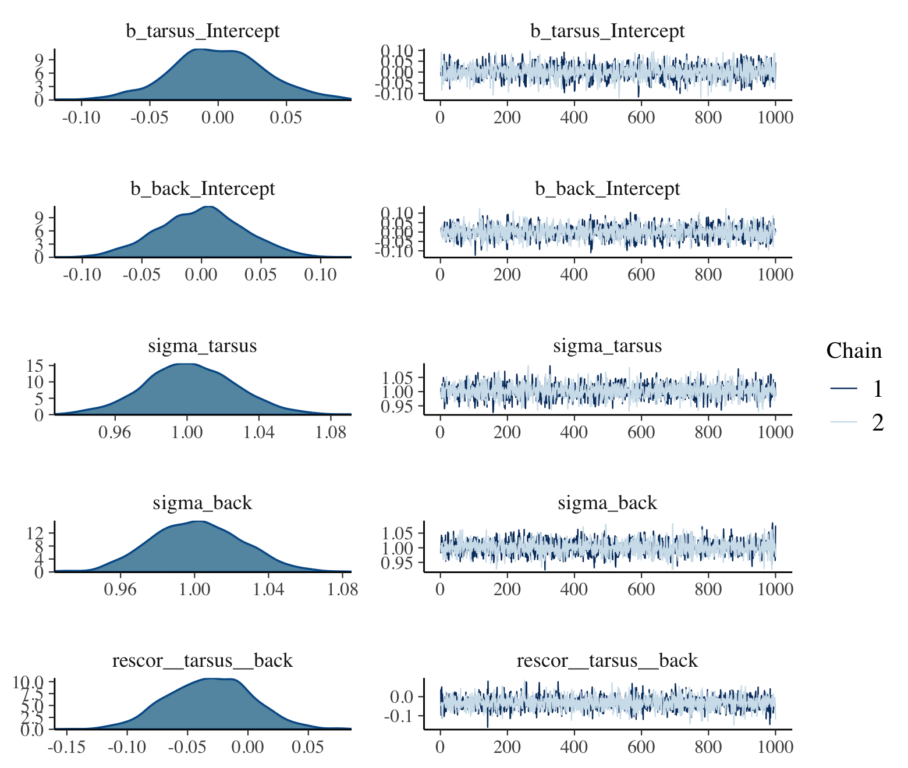

# ~~Horoscopes~~ Insights

> Statistical inference is indeed critically important. But only as much as every other part of research. Scientific discovery is not an additive process, in which sin in one part can be atoned by virtue in another. Everything interacts. So equally when science works as intended as when it does not, every part of the process deserves attention. [@mcelreathStatisticalRethinkingBayesian2015, p. 441]

In this final chapter, there are no models for us to fit and no figures for use to reimagine. McElreath took the opportunity to comment more broadly on the scientific process. He made a handful of great points, some of which I'll quote in a bit. But for the bulk of this chapter, I'd like to take the opportunity to pass on a few of my own insights about workflow. I hope they’re of use.

## Use R Notebooks

OMG

I first started using R in the winter of 2015/2016. Right from the start, I learned how to code from within the [RStudio](https://www.rstudio.com) environment. But within RStudio I was using simple scripts. No longer. I now use [R Notebooks](http://rmarkdown.rstudio.com/r_notebooks.html) for just about everything, including my scientific projects, this [bookdown](https://bookdown.org) project, and even my academic [webpage](https://solomonkurz.netlify.com) and [blog](https://solomonkurz.netlify.app/blog/). Nathan Stephens wrote a nice blog on [*Why I love R Notebooks*](https://rviews.rstudio.com/2017/03/15/why-i-love-r-notebooks/). I agree. This has fundamentally changed my workflow as a scientist. I only wish I'd learned about this before starting my dissertation project. So it goes... 

Do yourself a favor, adopt R Notebooks into your workflow. Do it today. If you prefer to learn with videos, here's a [nice intro](https://youtu.be/TJmNvfhLCoI?t=195) by [Kristine Yu](https://www.krisyu.org/) and [another one](https://youtu.be/GG4pgtfDpWY?t=324) by [JJ Allaire](https://twitter.com/fly_upside_down). Try it out for like one afternoon and you’ll be hooked.

## Save your model fits

It's embarrassing how long it took for this to dawn on me.

Unlike classical statistics, Bayesian models using MCMC take a while to compute. Most of the simple models in McElreath's text take 30 seconds up to a couple minutes. If your data are small, well-behaved and of a simple structure, you might have a lot of wait times in that range in your future.

It hasn't been that way, for me.

Most of my data have a complicated multilevel structure and often aren't very well behaved. It's normal for my models to take an hour or several to fit. Once you start measuring your model fit times in hours, you do not want to fit these things more than once. So, it's not enough to document my code in a nice R Notebook file. I need to save my `brm()` fit objects in external files.

Consider this model. It's taken from Bürkner's [-@Bürkner2022Multivariate] vignette, [*Estimating multivariate models with brms*](https://cran.r-project.org/package=brms/vignettes/brms_multivariate.html). It took about three minutes for my personal laptop to fit.


```r
library(brms)
data("BTdata", package = "MCMCglmm")
```


```r
b15.1 <- 
  brm(data = BTdata,
      family = gaussian,
      bf(mvbind(tarsus, back) ~ sex + hatchdate + (1 | p | fosternest) + (1 | q | dam)) +
        set_rescor(TRUE),
      chains = 2, cores = 2,
      seed = 15)
```

Three minutes isn't terribly long to wait, but still. I'd prefer to never have to wait for another three minutes, again. Sure, if I save my code in a document like this, I will always be able to fit the model again. But I can work smarter. Here I'll save my `b15.1` object outside of R with the `save()` function.


```r
save(b15.1, file = "fits/b15.01.rda")
```

Hopefully y'all are savvy Bayesian R users and find this insultingly remedial. But if it's new to you like it was me, you can learn more about `.rda` files [here](https://www.r-bloggers.com/load-save-and-rda-files/).

Now `b15.1` is saved outside of R, I can safely remove it and then reload it.


```r
rm(b15.1)

load("fits/b15.01.rda")
```

The file took a fraction of a second to reload. Once reloaded, I can perform typical operations, like examine summaries of the model parameters or refreshing my memory on what data I used.


```r
print(b15.1)
```

```
##  Family: MV(gaussian, gaussian) 
##   Links: mu = identity; sigma = identity
##          mu = identity; sigma = identity 
## Formula: tarsus ~ sex + hatchdate + (1 | p | fosternest) + (1 | q | dam) 
##          back ~ sex + hatchdate + (1 | p | fosternest) + (1 | q | dam) 
##    Data: BTdata (Number of observations: 828) 
##   Draws: 2 chains, each with iter = 2000; warmup = 1000; thin = 1;
##          total post-warmup draws = 2000
## 
## Group-Level Effects: 
## ~dam (Number of levels: 106) 
##                                      Estimate Est.Error l-95% CI u-95% CI Rhat Bulk_ESS Tail_ESS
## sd(tarsus_Intercept)                     0.48      0.05     0.38     0.59 1.01      789     1343
## sd(back_Intercept)                       0.25      0.07     0.10     0.39 1.01      351      621
## cor(tarsus_Intercept,back_Intercept)    -0.52      0.22    -0.94    -0.10 1.01      509      517
## 
## ~fosternest (Number of levels: 104) 
##                                      Estimate Est.Error l-95% CI u-95% CI Rhat Bulk_ESS Tail_ESS
## sd(tarsus_Intercept)                     0.27      0.05     0.16     0.38 1.00      705      867
## sd(back_Intercept)                       0.35      0.06     0.24     0.46 1.00      521      744
## cor(tarsus_Intercept,back_Intercept)     0.71      0.20     0.23     0.98 1.01      256      498
## 
## Population-Level Effects: 
##                  Estimate Est.Error l-95% CI u-95% CI Rhat Bulk_ESS Tail_ESS
## tarsus_Intercept    -0.41      0.07    -0.54    -0.27 1.00     1120     1528
## back_Intercept      -0.01      0.07    -0.14     0.13 1.00     1905     1347
## tarsus_sexMale       0.77      0.06     0.66     0.88 1.00     3482     1610
## tarsus_sexUNK        0.23      0.13    -0.04     0.50 1.00     3091     1348
## tarsus_hatchdate    -0.04      0.06    -0.16     0.07 1.00      958     1166
## back_sexMale         0.01      0.07    -0.12     0.13 1.00     2995     1234
## back_sexUNK          0.14      0.15    -0.15     0.43 1.00     3260     1559
## back_hatchdate      -0.09      0.05    -0.19     0.01 1.00     1479     1530
## 
## Family Specific Parameters: 
##              Estimate Est.Error l-95% CI u-95% CI Rhat Bulk_ESS Tail_ESS
## sigma_tarsus     0.76      0.02     0.72     0.80 1.00     2491     1666
## sigma_back       0.90      0.02     0.85     0.95 1.00     3199     1438
## 
## Residual Correlations: 
##                     Estimate Est.Error l-95% CI u-95% CI Rhat Bulk_ESS Tail_ESS
## rescor(tarsus,back)    -0.05      0.04    -0.13     0.02 1.00     2785     1542
## 
## Draws were sampled using sampling(NUTS). For each parameter, Bulk_ESS
## and Tail_ESS are effective sample size measures, and Rhat is the potential
## scale reduction factor on split chains (at convergence, Rhat = 1).
```

```r
head(b15.1$data)
```

```
##        tarsus  sex  hatchdate fosternest     dam       back
## 1 -1.89229718  Fem -0.6874021      F2102 R187557  1.1464212
## 2  1.13610981 Male -0.6874021      F1902 R187559 -0.7596521
## 3  0.98468946 Male -0.4279814       A602 R187568  0.1449373
## 4  0.37900806 Male -1.4656641      A1302 R187518  0.2555847
## 5 -0.07525299  Fem -1.4656641      A2602 R187528 -0.3006992
## 6 -1.13519543  Fem  0.3502805      C2302 R187945  1.5577219
```

The other option, which we've been using extensively throughout the earlier chapters, is to use `file` argument within the `brms::brm()` function. You can read about the origins of the argument in [issue #472 on the brms GitHub repo](https://github.com/paul-buerkner/brms/issues/472). To make use of the `file` argument, specify a character string. `brm()` will then save your fitted model object in an external `.rds` file via the `saveRDS()` function. Let's give it a whirl, this time with an interaction.


```r
b15.2 <- 
  brm(data = BTdata,
      family = gaussian,
      bf(mvbind(tarsus, back) ~ sex * hatchdate + (1 | p | fosternest) + (1 | q | dam)) +
        set_rescor(TRUE), 
      chains = 2, cores = 2,
      seed = 15,
      file = "fits/b15.02")
```

Now `b15.2` is saved outside of R, I can safely remove it and then reload it.


```r
rm(b15.2)
```

We might load `b15.2` with the `readRDS()` function.


```r
b15.2 <- readRDS("fits/b15.02.rds")
```

Now we can work with `b15.2` as desired.


```r
fixef(b15.2)
```

```
##                              Estimate  Est.Error       Q2.5       Q97.5
## tarsus_Intercept         -0.407079204 0.06801144 -0.5423888 -0.27855326
## back_Intercept           -0.010257421 0.06283537 -0.1359841  0.11387572
## tarsus_sexMale            0.770228626 0.05856512  0.6570837  0.88382861
## tarsus_sexUNK             0.193920956 0.15141639 -0.1094477  0.50051242
## tarsus_hatchdate         -0.053452838 0.06507535 -0.1831830  0.07144037
## tarsus_sexMale:hatchdate  0.011789946 0.05671390 -0.0971803  0.12147339
## tarsus_sexUNK:hatchdate   0.060173198 0.12662330 -0.1916731  0.30234772
## back_sexMale              0.005372356 0.06741957 -0.1260203  0.13399880
## back_sexUNK               0.144592835 0.18311898 -0.2160844  0.49856204
## back_hatchdate           -0.049836376 0.06101689 -0.1703886  0.07042441
## back_sexMale:hatchdate   -0.080771828 0.06734015 -0.2118125  0.05474141
## back_sexUNK:hatchdate    -0.039158514 0.14150792 -0.3193665  0.23348838
```

The `file` method has another handy feature. Let's remove `b15.2` one more time to see.


```r
rm(b15.2)
```

If you've fit a `brm()` model once and saved the results with `file`, executing the same `brm()` code will not re-fit the model. Rather, it will just load and return the model from the `.rds` file.


```r
b15.2 <- 
  brm(data = BTdata,
      family = gaussian,
      bf(mvbind(tarsus, back) ~ sex * hatchdate + (1 | p | fosternest) + (1 | q | dam)) +
        set_rescor(TRUE), 
      chains = 2, cores = 2,
      seed = 15,
      file = "fits/b15.02")
```

It takes just a fraction of a second. Once again, we're ready to work with `b15.2`.


```r
b15.2$formula
```

```
## tarsus ~ sex * hatchdate + (1 | p | fosternest) + (1 | q | dam) 
## back ~ sex * hatchdate + (1 | p | fosternest) + (1 | q | dam)
```

And if you'd like to remind yourself what the name of that external file was or what subfolder you saved it in, you can extract it from the `brm()` fit object.


```r
b15.2$file
```

```
## [1] "fits/b15.02.rds"
```

Also, see [Gavin Simpson](https://fromthebottomoftheheap.net/)'s blog post, [*A better way of saving and loading objects in R*](https://www.fromthebottomoftheheap.net/2012/04/01/saving-and-loading-r-objects/), for a discussion on the distinction between `.rda` and `.rds` files.

## Build your models slowly

The model from Bürkner's vignette, `b15.1`, was no joke. If you wanted to be verbose about it, it was a multilevel, multivariate, multivariable model. It had a cross-classified multilevel structure, two predictors (for each criterion), and two criteria. Not only is that a lot to keep track of, there's a whole lot of places for things to go wrong.

Even if that was the final model I was interested in as a scientist, I still wouldn't start with it. I'd build up incrementally, just to make sure nothing looked fishy. One place to start would be a simple intercepts-only model.


```r
b15.0 <- 
  brm(data = BTdata, 
      bf(mvbind(tarsus, back) ~ 1) +
        set_rescor(TRUE), 
      chains = 2, cores = 2,
      file = "fits/b15.00")
```


```r
plot(b15.0, widths = c(2, 3))
```



```r
print(b15.0)
```

```
##  Family: MV(gaussian, gaussian) 
##   Links: mu = identity; sigma = identity
##          mu = identity; sigma = identity 
## Formula: tarsus ~ 1 
##          back ~ 1 
##    Data: BTdata (Number of observations: 828) 
##   Draws: 2 chains, each with iter = 2000; warmup = 1000; thin = 1;
##          total post-warmup draws = 2000
## 
## Population-Level Effects: 
##                  Estimate Est.Error l-95% CI u-95% CI Rhat Bulk_ESS Tail_ESS
## tarsus_Intercept     0.00      0.03    -0.07     0.07 1.00     2186     1525
## back_Intercept       0.00      0.04    -0.07     0.07 1.00     2869     1612
## 
## Family Specific Parameters: 
##              Estimate Est.Error l-95% CI u-95% CI Rhat Bulk_ESS Tail_ESS
## sigma_tarsus     1.00      0.03     0.95     1.05 1.00     2526     1665
## sigma_back       1.00      0.02     0.96     1.05 1.00     2500     1491
## 
## Residual Correlations: 
##                     Estimate Est.Error l-95% CI u-95% CI Rhat Bulk_ESS Tail_ESS
## rescor(tarsus,back)    -0.03      0.04    -0.10     0.04 1.00     2653     1691
## 
## Draws were sampled using sampling(NUTS). For each parameter, Bulk_ESS
## and Tail_ESS are effective sample size measures, and Rhat is the potential
## scale reduction factor on split chains (at convergence, Rhat = 1).
```

If the chains look good and the summary statistics look like what I'd expect, I'm on good footing to keep building up to the model I really care about. The results from this model, for example, suggest that both criteria were standardized (i.e., intercepts at 0 and $\sigma$'s at 1). If that wasn't what I intended, I'd rather catch it here than spend three minutes fitting the more complicated `b15.1` model, the parameters for which are sufficiently complicated that I may have had trouble telling what scale the data were on.

Note, this is not the same as $p$-hacking [@simmonsFalsepositivePsychologyUndisclosed2011] or wandering aimlessly down the garden of forking paths [@gelmanGardenForkingPaths2013]. We are not chasing the flashiest model to put in a paper. Rather, this is just good pragmatic data science. If you start off with a theoretically-justified but complicated model and run into computation problems or produce odd-looking estimates, it won't be clear where things went awry. When you build up, step by step, it's easier to catch data cleaning failures, coding goofs and the like.

So, when I'm working on a project, I fit one or a few simplified models before fitting my complicated model of theoretical interest. This is especially the case when I'm working with model types that are new to me or that I haven't worked with in a while. I document each step in my R Notebook files and I save the fit objects for each in external files. I have caught surprises this way. Hopefully this will help you catch your mistakes, too.

## Look at your data

Relatedly, and perhaps even a precursor, you should always plot your data before fitting a model. There were plenty examples of this in the text, but it's worth of making explicit. Simple summary statistics are great, but they're not enough. For an entertaining exposition, check out Matejka and Fitzmaurice's [-@matejkaSameStats2017] [Same stats, different graphs: Generating datasets with varied appearance and identical statistics through simulated annealing*](https://www.autodeskresearch.com/publications/samestats). Though it might make for a great cocktail party story, I'd hate to pollute the scientific literature with a linear model based on a set of dinosaur-shaped data.

## Use the `0 + Intercept` syntax

We covered this a little in the last couple chapters (e.g., [Section 12.4.3][Focus and multilevel prediction.]), but it's easy to miss. If your real-world model has predictors (i.e., isn’t an intercept-only model), it's important to keep track of how you have centered those predictors. When you specify a prior for a brms `Intercept` (i.e., an intercept resulting from the `y ~ x` or `y ~ 1 + x` style of syntax), that prior is applied under the presumption all the predictors are mean centered. In the *Population-level ('fixed') effects* subsection of the *`set_prior`* section of the [brms reference manual](https://cran.r-project.org/package=brms/brms.pdf) [@brms2022RM], we read:

> Note that technically, this prior is set on an intercept that results when internally centering all population-level predictors around zero to improve sampling efficiency. On this centered intercept, specifying a prior is actually much easier and intuitive than on the original intercept, since the former represents the expected response value when all predictors are at their means. To treat the intercept as an ordinary population-level effect and avoid the centering parameterization, use `0 + Intercept` on the right-hand side of the model formula. (p. 207)

We get a little more information from the *Parameterization of the population-level intercept* subsection of the *`brmsformula`* section:

> This behavior can be avoided by using the reserved (and internally generated) variable Intercept. Instead of `y ~ x`, you may write `y ~ 0 + Intercept + x`. This way, priors can be defined on the real intercept, directly. In addition, the intercept is just treated as an ordinary population-level effect and thus priors defined on `b` will also apply to it. Note that this parameterization may be less efficient than the default parameterization discussed above. (p. 44)

We didn't bother with this for most of the project because our priors on the `Intercept` were often vague and the predictors were often on small enough scales (e.g., the mean of a dummy variable is close to 0) that it just didn't matter. But this will not always be the case. Set your `Intercept` priors with care.

There's also the flip side of the issue. If you have no strong reason not to, consider mean-centering or even standardizing your predictors. Not only will that solve the `Intercept` prior issue, but it often results in more meaningful parameter estimates.

## Annotate your workflow

In a typical model-fitting file, I'll load my data, perhaps transform the data a bit, fit several models, and examine the output of each with trace plots, model summaries, information criteria, and the like. In my early days, I just figured each of these steps were self-explanatory.

Nope.

["In every project you have at least one other collaborator; future-you. You don't want future-you to curse past-you."](https://www.r-bloggers.com/your-most-valuable-collaborator-future-you/)

My experience was that even a couple weeks between taking a break from a project and restarting it was enough time to make my earlier files confusing. **And they were my files**. I now start each R Notebook document with an introductory paragraph or two explaining exactly what the purpose of the file is. I separate my major sections by [headers and subheaders](https://rmarkdown.rstudio.com/authoring_basics.html). My working R Notebook files are peppered with bullets, sentences, and full on paragraphs between code blocks.

## Annotate your code

This idea is implicit in McElreath's text, but it's easy to miss the message. I know I did, at first. I find this is especially important for data wrangling. I'm a tidyverse guy and, for me, the big-money verbs like `mutate()`, `gather()`, `select()`, `filter()`, `group_by()`, and `summarise()` take care of the bulk of my data wrangling. But every once and a while I need to do something less common, like with `str_extract()` or `case_when()`. When I end up using a new or less familiar function, I typically annotate right in the code and even sometimes leave a hyperlink to some [R-bloggers](https://www.r-bloggers.com) post or [stackoverflow](https://stackoverflow.com) question that explained how to use it.

## Break up your workflow

I've also learned to break up my projects into multiple R Notebook files. If you have a small project for which you just want a quick and dirty plot, fine, do it all in one file. My typical project has:

* a primary data cleaning file;
* a file with basic descriptive statistics and the like;
* at least one primary analysis file;
* possible secondary and tertiary analysis files;
* a file or two for my major figures; and
* a file explaining and depicting my priors, often accompanied by my posteriors, for comparison.

Putting all that information in one R Notebook file would be overwhelming. Your workflow might well look different, but hopefully you get the idea. You don't want working files with thousands of lines of code.

And mainly to keep Jenny Bryan from [setting my computer on fire](https://www.tidyverse.org/blog/2017/12/workflow-vs-script/), I'm also getting into the habit of organizing all these interconnected files with help from [RStudio Projects](https://support.posit.co/hc/en-us/articles/200526207-Using-Projects), which you can learn even more about from [Chapter 8](https://r4ds.had.co.nz/workflow-projects.html) in *R4DS* @grolemundDataScience2017.

## Code in public

If you would like to improve the code you write for data-wrangling, modeling, and/or visualizing, code in public. Yes, it can be intimidating. Yes, you will probably make mistakes. If you're lucky, [others will point them out](https://github.com/ASKurz/Statistical_Rethinking_with_brms_ggplot2_and_the_tidyverse/pulls?q=is%3Apr+is%3Aclosed) and you will revise and learn and grow.

You can do this on any number of mediums, such as

* GitHub (e.g., [here](https://github.com/paul-buerkner/brms)),
* personal blogs (e.g., [here](https://dilshersinghdhillon.netlify.app/post/multiple_comparison/)),
* the Open Science Framework (e.g., [here](https://osf.io/dpzcb/)),
* online books (e.g., [here](https://learningstatisticswithr.com/)),
* full-blown YouTube lectures (e.g., [here](https://youtu.be/Vz71fglrgy0)),
* or even in brief Twitter GIFs (e.g., [here](https://twitter.com/GuyProchilo/status/1207766623840604174)).

I've found that just the possibility that others might look at my code makes it more likely I'll slow down, annotate, and try to use more consistent formatting. Hopefully it will benefit you, too.

## Read Gelman's blog

Yes, [that Gelman](https://statmodeling.stat.columbia.edu/books/).

Actually, I started reading [Gelman's blog](https://statmodeling.stat.columbia.edu/) around the same time I dove into [McElreath's text](https://xcelab.net/rm/statistical-rethinking/). But if this isn't the case for you, it's time to correct that evil. My graduate mentor often recalled how transformative his first academic conference was. He was an undergrad at the time and it was his first experience meeting and talking with the people whose names he'd seen in his text books. He learned that science was an ongoing conversation among living scientists and--at that time--the best place to take part in that conversation was at conferences. Times keep changing. Nowadays, the living conversation of science occurs online on social media and in blogs. One of the hottest places to find scientists conversing about Bayesian statistics and related methods is [Gelman's blog](https://statmodeling.stat.columbia.edu/). The posts are great. But a lot of the action is in the comments sections, too.

## Check out other social media, too

If you're not on it, consider joining academic (see the related blog posts by [Sarah Mojarad](https://medium.com/@smojarad/a-beginners-guide-to-academic-twitter-f483dae86597) and [Dan Quintana](https://www.dsquintana.blog/twitter-for-scientists/)). The word on the street is correct. Twitter can be rage-fueled [dumpster fire](https://media.giphy.com/media/l0IynvPneUpb7SnBe/giphy.gif). But if you're selective about who you follow, it's a great place to lean from and connect with your academic heroes. If you're a fan of this project, here's a list of some of the people you might want to follow:

* [Mara Averick](https://twitter.com/dataandme)
* [Michael Bentacourt](https://twitter.com/betanalpha)
* [Paul Bürkner](https://twitter.com/paulbuerkner)
* [Jenny Bryan](https://twitter.com/JennyBryan)
* [Frank Harrell](https://twitter.com/f2harrell)
* [Matthew Kay](https://twitter.com/mjskay)
* [Tristan Mahr](https://twitter.com/tjmahr)
* [Richard McElreath](https://twitter.com/rlmcelreath)
* [Chelsea Parlett-Pelleriti](https://twitter.com/ChelseaParlett)
* [Danielle Navarro](https://twitter.com/djnavarro)
* [Roger Peng](https://twitter.com/rdpeng)
* [Dan Simpson](https://twitter.com/dan_p_simpson)
* [Aki Vehtari](https://twitter.com/avehtari)
* [Matti Vuorre](https://twitter.com/vuorre)
* [Hadley Wickham](https://twitter.com/hadleywickham)
* [Yihui Xie](https://twitter.com/xieyihui)

[I'm on twitter](https://twitter.com/SolomonKurz), too.

I've already mentioned Gelman's blog. [McElreath has one, too](https://elevanth.org/blog/). He posts infrequently, but it's usually pretty good when he does.

Also, do check out the [Stan Forums](https://discourse.mc-stan.org). They have a special [brms tag](https://discourse.mc-stan.org/c/interfaces/brms/36) there, under which you can find all kinds of hot brms talk.

But if you're new to the world of asking for help with your code online, you might acquaint yourself with the notion of a [minimally reproducible example](https://stackoverflow.com/questions/5963269/how-to-make-a-great-r-reproducible-example). In short, a good minimally reproducible example helps others help you. If you fail to do this, prepare for some snark.

## Parting wisdom

Okay, that's enough from me. Let's start wrapping this project up with some McElreath.

> There is an aspect of science that you do personally control: openness. [Pre-plan your research together with the statistical analysis](https://mindhacks.com/2017/11/09/open-science-essentials-pre-registration/). Doing so will improve both the research design and the statistics. Document it in the form of a mock analysis that you would not be ashamed to share with a colleague. Register it publicly, perhaps in a simple repository, like [Github](https://github.com) or any other. But [your webpage](https://bookdown.org/yihui/blogdown/) will do just fine, as well. Then collect the data. Then analyze the data as planned. If you must change the plan, that’s fine. But document the changes and justify them. Provide all of the data and scripts necessary to repeat your analysis. Do not provide scripts and data ["on request,"](https://twitter.com/robinnkok/status/1213011238294347776) but rather put them online so reviewers of your paper can access them without your interaction. There are of course cases in which full data cannot be released, due to privacy concerns. But the bulk of science is not of that sort.
> 
> The data and its analysis are the scientific product. The paper is just an advertisement. If you do your honest best to design, conduct, and document your research, so that others can build directly upon it, you can make a difference. (p. 443)

Toward that end, also check out the [OSF](https://osf.io) and their YouTube channel, [here](https://www.youtube.com/channel/UCGPlVf8FsQ23BehDLFrQa-g). [Katie Corker](https://twitter.com/katiecorker) gets the last words: ["Open science is stronger because we're doing this together."](https://cos.io/blog/open-science-is-a-behavior/)

## Session info {-}


```r
sessionInfo()
```

```
## R version 4.2.2 (2022-10-31)
## Platform: x86_64-apple-darwin17.0 (64-bit)
## Running under: macOS Big Sur ... 10.16
## 
## Matrix products: default
## BLAS:   /Library/Frameworks/R.framework/Versions/4.2/Resources/lib/libRblas.0.dylib
## LAPACK: /Library/Frameworks/R.framework/Versions/4.2/Resources/lib/libRlapack.dylib
## 
## locale:
## [1] en_US.UTF-8/en_US.UTF-8/en_US.UTF-8/C/en_US.UTF-8/en_US.UTF-8
## 
## attached base packages:
## [1] stats     graphics  grDevices utils     datasets  methods   base     
## 
## other attached packages:
## [1] brms_2.18.0 Rcpp_1.0.9 
## 
## loaded via a namespace (and not attached):
##   [1] TH.data_1.1-1        minqa_1.2.5          colorspace_2.0-3     ellipsis_0.3.2       rgdal_1.5-30        
##   [6] estimability_1.4.1   markdown_1.1         base64enc_0.1-3      rstudioapi_0.13      farver_2.1.1        
##  [11] rstan_2.21.8         DT_0.24              lubridate_1.8.0      fansi_1.0.3          mvtnorm_1.1-3       
##  [16] bridgesampling_1.1-2 codetools_0.2-18     splines_4.2.2        cachem_1.0.6         knitr_1.40          
##  [21] shinythemes_1.2.0    bayesplot_1.10.0     projpred_2.2.1       jsonlite_1.8.4       nloptr_2.0.3        
##  [26] shiny_1.7.2          compiler_4.2.2       emmeans_1.8.0        backports_1.4.1      assertthat_0.2.1    
##  [31] Matrix_1.5-1         fastmap_1.1.0        cli_3.6.0            later_1.3.0          htmltools_0.5.3     
##  [36] prettyunits_1.1.1    tools_4.2.2          igraph_1.3.4         coda_0.19-4          gtable_0.3.1        
##  [41] glue_1.6.2           reshape2_1.4.4       dplyr_1.0.10         posterior_1.3.1      jquerylib_0.1.4     
##  [46] vctrs_0.5.1          nlme_3.1-160         crosstalk_1.2.0      tensorA_0.36.2       xfun_0.35           
##  [51] stringr_1.4.1        ps_1.7.2             lme4_1.1-31          mime_0.12            miniUI_0.1.1.1      
##  [56] lifecycle_1.0.3      gtools_3.9.4         MASS_7.3-58.1        zoo_1.8-10           scales_1.2.1        
##  [61] colourpicker_1.1.1   promises_1.2.0.1     Brobdingnag_1.2-8    parallel_4.2.2       sandwich_3.0-2      
##  [66] inline_0.3.19        shinystan_2.6.0      gamm4_0.2-6          gridExtra_2.3        ggplot2_3.4.0       
##  [71] loo_2.5.1            StanHeaders_2.21.0-7 sass_0.4.2           stringi_1.7.8        highr_0.9           
##  [76] dygraphs_1.1.1.6     checkmate_2.1.0      boot_1.3-28          pkgbuild_1.3.1       rlang_1.0.6         
##  [81] pkgconfig_2.0.3      matrixStats_0.63.0   distributional_0.3.1 evaluate_0.18        lattice_0.20-45     
##  [86] labeling_0.4.2       rstantools_2.2.0     htmlwidgets_1.5.4    processx_3.8.0       tidyselect_1.2.0    
##  [91] plyr_1.8.7           magrittr_2.0.3       bookdown_0.28        R6_2.5.1             generics_0.1.3      
##  [96] multcomp_1.4-20      DBI_1.1.3            withr_2.5.0          pillar_1.8.1         mgcv_1.8-41         
## [101] xts_0.12.1           sp_1.5-0             survival_3.4-0       abind_1.4-5          tibble_3.1.8        
## [106] crayon_1.5.2         utf8_1.2.2           rmarkdown_2.16       grid_4.2.2           callr_3.7.3         
## [111] threejs_0.3.3        digest_0.6.31        xtable_1.8-4         httpuv_1.6.5         RcppParallel_5.1.5  
## [116] stats4_4.2.2         munsell_0.5.0        bslib_0.4.0          shinyjs_2.1.0
```


