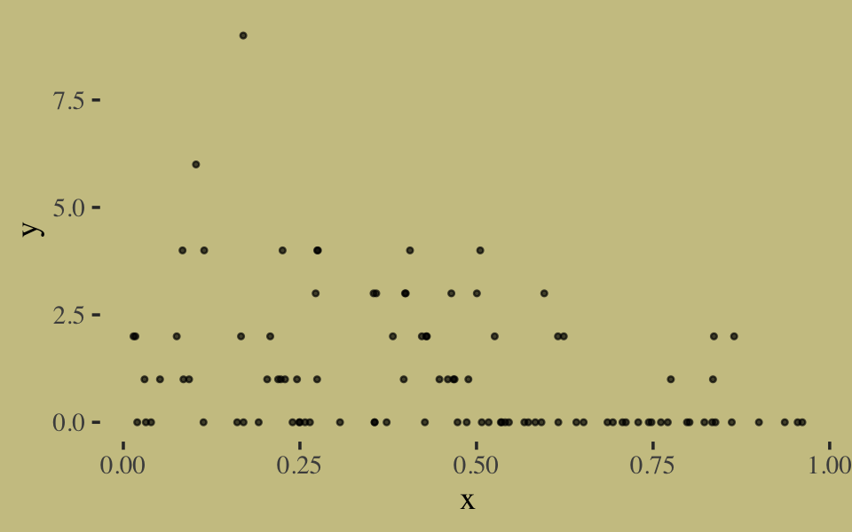
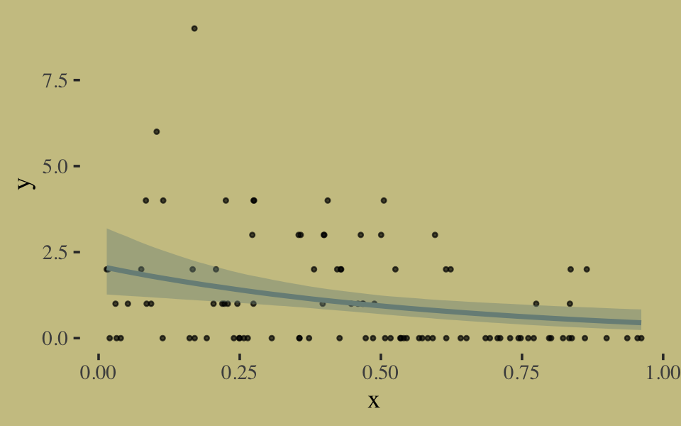
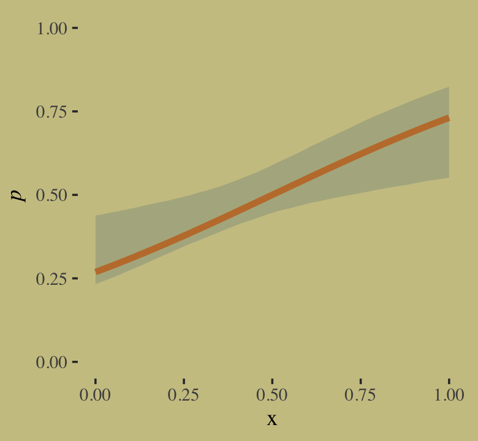

Ch. 10 Counting and Classification
================
A Solomon Kurz
2021-05-03

# Counting and Classification

## Binomial regression

### Logistic regression: Prosocial chimpanzees.

``` r
library(brms)
library(tidyverse)
library(wesanderson)
library(ggthemes)
library(bayesplot)
library(broom)
library(loo)
library(ggExtra)
library(GGally)
library(patchwork)
library(tidybayes)

theme_set(
  theme_default() + 
    theme_tufte() +
    theme(plot.background = element_rect(fill  = wes_palette("Moonrise2")[3],
                                         color = wes_palette("Moonrise2")[3]))
)

color_scheme_set(wes_palette("Moonrise2")[c(3, 1, 2, 2, 1, 1)])
```

### Overthinking: Using the ~~by~~ `group_by()` function.

### Aggregated binomial: Chimpanzees again, condensed.

### Aggregated binomial: Graduate school admissions.

#### Rethinking: Simpson’s paradox is not a paradox.

#### Overthinking: WAIC and aggregated binomial models.

### Fitting binomial regressions with `glm()`.

## Poisson regression

### Example: Oceanic tool complexity.

### MCMC islands.

### Example: Exposure and the offset.

## Other count regressions

### Multinomial.

#### Explicit multinomial models.

##### “Intercepts”-only.

##### Add a predictor into the mix.

##### The non-linear syntax is the solution.

#### Multinomial in disguise as Poisson.

### Geometric.

> Sometimes a count variable is a number of events up until something
> happened. Call this “something” the terminating event. Often we want
> to model the probability of that event, a kind of analysis known as
> event history analysis or survival analysis. When the probability of
> the terminating event is constant through time (or distance), and the
> units of time (or distance) are discrete, a common likelihood function
> is the geometric distribution. This distribution has the form:
>
> Pr(*y*\|*p*) = *p*(1 − *p*)<sup>*y* − 1</sup>
>
> where *y* is the number of time steps (events) until the terminating
> event occurred and *p* is the probability of that event in each time
> step. This distribution has maximum entropy for unbounded counts with
> constant expected value. (pp. 327–328)

It turns out there are actually two popular ways to think about the
geometric distribution. The one McElreath presented in the text is
possibly the most common. Importantly, that version is valid for
*y* = 1, 2, 3, …. The alternative is

Pr(*y*\|*p*) = *p*(1 − *p*)<sup>*y*</sup>,

for *y* = 0, 1, 2, …. We’ll come back to why I’d point this out in a
little bit. In the mean time, here we simulate McElreath’s exemplar
data.

``` r
# simulate
n <- 100

set.seed(10)
x <- runif(n)

set.seed(10)
y <- rgeom(n, prob = inv_logit_scaled(-1 + 2 * x))
```

In case you’re curious, here are the data.

``` r
list(x = x, y = y) %>%
  as_tibble() %>%
  ggplot(aes(x = x, y = y)) +
  geom_point(size = 3/5, alpha = 2/3)
```



We fit the geometric model using `family = geometric(link = log)`.

``` r
b10.18 <-
  brm(data = list(y = y, x = x), 
      family = geometric(link = log),
      y ~ 0 + Intercept + x,
      prior = c(prior(normal(0, 10), class = b, coef = Intercept),
                prior(normal(0, 1), class = b, coef = x)),
      iter = 2500, warmup = 500, chains = 2, cores = 2,
      seed = 10,
      file = "/Users/solomonkurz/Dropbox/Recoding McElreath/fits/b10.18")
```

Inspect the results.

``` r
print(b10.18, digits = 2)
```

    ##  Family: geometric 
    ##   Links: mu = log 
    ## Formula: y ~ 0 + Intercept + x 
    ##    Data: list(y = y, x = x) (Number of observations: 100) 
    ## Samples: 2 chains, each with iter = 2500; warmup = 500; thin = 1;
    ##          total post-warmup samples = 4000
    ## 
    ## Population-Level Effects: 
    ##           Estimate Est.Error l-95% CI u-95% CI Rhat Bulk_ESS Tail_ESS
    ## Intercept     0.74      0.25     0.25     1.19 1.00     1233     1058
    ## x            -1.61      0.52    -2.59    -0.59 1.00     1211     1201
    ## 
    ## Samples were drawn using sampling(NUTS). For each parameter, Bulk_ESS
    ## and Tail_ESS are effective sample size measures, and Rhat is the potential
    ## scale reduction factor on split chains (at convergence, Rhat = 1).

It turns out brms uses a [different parameterization for the geometric
distribution](https://cran.r-project.org/package=brms/vignettes/brms_families.html#binary-and-count-data-models)
than rethinking does. As is typical of brms, the parameterization is
based on the mean of the distribution. When using the version of the
geometric distribution McElreath introduced in the text, we can define
its mean as

$$\\mu = \\frac{1}{p}.$$

Yet when using the other common version of the geometric distribution I
introduced, above, the mean is defined as

$$\\mu = \\frac{1 - p}{p},$$

which implies that

$$p = \\frac{1}{\\mu + 1}.$$

I point this out because the brms parameterization is expressed in terms
of the mean of this alternative version. If you start with our alternate
form of the geometric distribution for *y* = 0, 1, 2, …, here’s how to
start with it put in terms of *p* and use substitution to re-express it
in terms of the mean:

$$
\\begin{align\*}
f(y\_i \| p) & = p\_i(1 - p\_i)^{y\_i} \\\\
& = \\left (\\frac{1}{\\mu\_i + 1} \\right ) \\left (1 - \\frac{1}{\\mu\_i + 1} \\right )^{y\_i} \\\\
& = \\left (\\frac{1}{\\mu\_i + 1} \\right ) \\left (\\frac{\\mu\_i + 1}{\\mu\_i + 1} - \\frac{1}{\\mu\_i + 1} \\right )^y \\\\
& = \\left (\\frac{1}{\\mu\_i + 1} \\right ) \\left (\\frac{\\mu\_i + 1 - 1}{\\mu\_i + 1} \\right )^y \\\\
& = \\left (\\frac{1}{\\mu\_i + 1} \\right ) \\left (\\frac{\\mu\_i}{\\mu\_i + 1}  \\right )^{y\_i}.
\\end{align\*}
$$

If you look in the [*Binary and count data
models*](https://cran.r-project.org/web/packages/brms/vignettes/brms_families.html#binary-and-count-data-models)
section of Bürkner’s \[-@Bürkner2021Parameterization\] vignette,
[*Parameterization of response distributions in
brms*](https://cran.r-project.org/package=brms/vignettes/brms_families.html#ordinal-and-categorical-models),
you’ll see this is the parameterization used in brms. This brms
parameterization makes the geometric distribution a special case of the
negative-binomial for which *ϕ* = 1. We’ll introduce the
negative-binomial distribution in \[Section 11.3.2\]\[Negative-binomial
or gamma-Poisson.\]. Also note that, as with the Poisson and
negative-binomial likelihoods, brms defaults to using the log link when
one sets `family = geometric`.

Even though the parameters brms yielded look different from those in the
text, their predictions describe the data well. Here’s the
`conditional_effects()` plot.

``` r
conditional_effects(b10.18) %>% 
  plot(points = T,
       point_args = c(size = 3/5, alpha = 2/3),
       line_args = c(color = wes_palette("Moonrise2")[1],
                     fill = wes_palette("Moonrise2")[1]))
```



It still might be unclear how our *μ*-based parameters relate to
McElreath’s data-generating process:

*p* = logit<sup> − 1</sup>( − 1 + 2*x*).

Here we’ll work with the posterior draws, themselves, to first use the
formula exp (*α* + *β**x*<sub>*i*</sub>) to compute *μ*<sub>*i*</sub>
based on a sequence of *x*-values ranging from 0 to 1. Then we’ll use
our knowledge of *p* = 1/(*μ* + 1) to convert those results into the *p*
metric. Finally, we’ll compare those results to the true data-generating
function.

``` r
# extract the posterior draws
posterior_samples(b10.18) %>%
  # wrangle
  mutate(iter = 1:n()) %>% 
  expand(nesting(iter, b_Intercept, b_x),
         x = seq(from = 0, to = 1, length.out = 50)) %>% 
  # compute mu[i]
  mutate(mu = exp(b_Intercept + b_x * x)) %>% 
  # convert those results into p[i]
  mutate(p = 1 / (1 + mu)) %>% 
  
  # plot!
  ggplot(aes(x = x, y = p)) +
  stat_lineribbon(.width = .95, fill = wes_palette("Moonrise2")[1], alpha = 1/3,
                  size = 0) +
  # this is McElreath's data-generating equation
  stat_function(fun = function(x) inv_logit_scaled(-1 + 2 * x),
                color = wes_palette("Moonrise2")[2], size = 3/2) +
  scale_y_continuous(expression(italic(p)), limits = 0:1)
```



The 95% posterior interval is depicted by the semitransparent green
ribbon. Mcelreath’s data-generating function is the orange line.

## Summary

> This chapter described some of the most common generalized linear
> models, those used to model counts. It is important to never convert
> counts to proportions before analysis, because doing so destroys
> information about sample size. A fundamental difficulty with these
> models is that the parameters are on a different scale, typically
> log-odds (for binomial) or log-rate (for Poisson), than the outcome
> variable they describe. Therefore computing implied predictions is
> even more important than before. (pp. 328–329)

## Session info

``` r
sessionInfo()
```

    ## R version 4.0.4 (2021-02-15)
    ## Platform: x86_64-apple-darwin17.0 (64-bit)
    ## Running under: macOS Catalina 10.15.7
    ## 
    ## Matrix products: default
    ## BLAS:   /Library/Frameworks/R.framework/Versions/4.0/Resources/lib/libRblas.dylib
    ## LAPACK: /Library/Frameworks/R.framework/Versions/4.0/Resources/lib/libRlapack.dylib
    ## 
    ## locale:
    ## [1] en_US.UTF-8/en_US.UTF-8/en_US.UTF-8/C/en_US.UTF-8/en_US.UTF-8
    ## 
    ## attached base packages:
    ## [1] stats     graphics  grDevices utils     datasets  methods   base     
    ## 
    ## other attached packages:
    ##  [1] tidybayes_2.3.1   patchwork_1.1.1   GGally_2.1.1      ggExtra_0.9       loo_2.4.1        
    ##  [6] broom_0.7.5       bayesplot_1.8.0   ggthemes_4.2.4    wesanderson_0.3.6 forcats_0.5.1    
    ## [11] stringr_1.4.0     dplyr_1.0.5       purrr_0.3.4       readr_1.4.0       tidyr_1.1.3      
    ## [16] tibble_3.1.1      ggplot2_3.3.3     tidyverse_1.3.0   brms_2.15.0       Rcpp_1.0.6       
    ## 
    ## loaded via a namespace (and not attached):
    ##   [1] readxl_1.3.1         backports_1.2.1      plyr_1.8.6           igraph_1.2.6         svUnit_1.0.3        
    ##   [6] splines_4.0.4        crosstalk_1.1.0.1    TH.data_1.0-10       rstantools_2.1.1     inline_0.3.17       
    ##  [11] digest_0.6.27        htmltools_0.5.1.1    rsconnect_0.8.16     fansi_0.4.2          magrittr_2.0.1      
    ##  [16] checkmate_2.0.0      modelr_0.1.8         RcppParallel_5.0.2   matrixStats_0.57.0   xts_0.12.1          
    ##  [21] sandwich_3.0-0       prettyunits_1.1.1    colorspace_2.0-0     rvest_0.3.6          ggdist_2.4.0.9000   
    ##  [26] haven_2.3.1          xfun_0.22            callr_3.7.0          crayon_1.4.1         jsonlite_1.7.2      
    ##  [31] lme4_1.1-25          survival_3.2-10      zoo_1.8-8            glue_1.4.2           gtable_0.3.0        
    ##  [36] emmeans_1.5.2-1      V8_3.4.0             distributional_0.2.2 pkgbuild_1.2.0       rstan_2.21.2        
    ##  [41] abind_1.4-5          scales_1.1.1         mvtnorm_1.1-1        DBI_1.1.0            miniUI_0.1.1.1      
    ##  [46] viridisLite_0.4.0    xtable_1.8-4         stats4_4.0.4         StanHeaders_2.21.0-7 DT_0.16             
    ##  [51] htmlwidgets_1.5.2    httr_1.4.2           threejs_0.3.3        arrayhelpers_1.1-0   RColorBrewer_1.1-2  
    ##  [56] ellipsis_0.3.2       farver_2.1.0         reshape_0.8.8        pkgconfig_2.0.3      dbplyr_2.0.0        
    ##  [61] utf8_1.2.1           labeling_0.4.2       tidyselect_1.1.0     rlang_0.4.11         reshape2_1.4.4      
    ##  [66] later_1.2.0          munsell_0.5.0        cellranger_1.1.0     tools_4.0.4          cli_2.5.0           
    ##  [71] generics_0.1.0       ggridges_0.5.3       evaluate_0.14        fastmap_1.1.0        yaml_2.2.1          
    ##  [76] processx_3.5.2       knitr_1.31           fs_1.5.0             nlme_3.1-152         mime_0.10           
    ##  [81] projpred_2.0.2       xml2_1.3.2           compiler_4.0.4       shinythemes_1.1.2    rstudioapi_0.13     
    ##  [86] curl_4.3             gamm4_0.2-6          reprex_0.3.0         statmod_1.4.35       stringi_1.5.3       
    ##  [91] highr_0.8            ps_1.6.0             Brobdingnag_1.2-6    lattice_0.20-41      Matrix_1.3-2        
    ##  [96] nloptr_1.2.2.2       markdown_1.1         shinyjs_2.0.0        vctrs_0.3.8          pillar_1.6.0        
    ## [101] lifecycle_1.0.0      bridgesampling_1.0-0 estimability_1.3     httpuv_1.6.0         R6_2.5.0            
    ## [106] promises_1.2.0.1     gridExtra_2.3        codetools_0.2-18     boot_1.3-26          colourpicker_1.1.0  
    ## [111] MASS_7.3-53          gtools_3.8.2         assertthat_0.2.1     withr_2.4.2          shinystan_2.5.0     
    ## [116] multcomp_1.4-16      mgcv_1.8-33          parallel_4.0.4       hms_0.5.3            grid_4.0.4          
    ## [121] coda_0.19-4          minqa_1.2.4          rmarkdown_2.7        shiny_1.6.0          lubridate_1.7.9.2   
    ## [126] base64enc_0.1-3      dygraphs_1.1.1.6
